Research questions 

What factors impact Rating ?
-  Machine learning to classify reviews 
     what are key words that determines ratings?
     
        use logit regression to determine relationship between key words from ratings and wine type, price, region, seller 
        
 There is a correlation between Ratings and Price ?
 - Correlation analysis


The higher the Rating and Price the higher the consumption of the wine variety
- Multiple Regression 


Does wine sales/consumption have a bearing with grape , price , rating ?


```python
import numpy as np

import csv
import pandas as pd
import matplotlib.pyplot as plt
import statsmodels.api as sm
import scipy.stats as stats

pd.options.display.max_rows = 999
pd.options.display.max_columns = 999

from sklearn import cluster
from sklearn import metrics
from sklearn.metrics import pairwise_distances

from sklearn.linear_model import LogisticRegression
from sklearn.metrics import classification_report, confusion_matrix

from sklearn import svm, linear_model, datasets
from sklearn.model_selection import GridSearchCV
from sklearn.model_selection import cross_val_score

%matplotlib inline
%config InlineBackend.figure_format = 'retina'

import seaborn as sns
# this line tells jupyter notebook to put the plots in the notebook rather than saving them to file.
%matplotlib inline

pd.options.display.max_rows = 999
pd.options.display.max_columns = 999
```

    C:\Users\bless\Anaconda3\lib\site-packages\statsmodels\compat\pandas.py:56: FutureWarning: The pandas.core.datetools module is deprecated and will be removed in a future version. Please use the pandas.tseries module instead.
      from pandas.core import datetools
    


```python
# path='C:/Users/bless/Documents/GitHub/projects/project-capstone/Capstone project data'
# alternate file winemag-data-130k-v2.csv

wine = pd.read_csv('C:/Users/bless/Documents/GitHub/projects/project-capstone/Wine/wine-reviews/winemag-data_first150k - Copy.csv',\
                   index_col=0,parse_dates=True,   dayfirst=True,encoding='utf-8')

```


```python
wine.head(5)
```


<div>
<style scoped>
    .dataframe tbody tr th:only-of-type {
        vertical-align: middle;
    }

    .dataframe tbody tr th {
        vertical-align: top;
    }

    .dataframe thead th {
        text-align: right;
    }
</style>
<table border="1" class="dataframe">
  <thead>
    <tr style="text-align: right;">
      <th></th>
      <th>country</th>
      <th>description</th>
      <th>designation</th>
      <th>points</th>
      <th>price</th>
      <th>province</th>
      <th>region_1</th>
      <th>region_2</th>
      <th>variety</th>
      <th>winery</th>
    </tr>
  </thead>
  <tbody>
    <tr>
      <th>0</th>
      <td>US</td>
      <td>This tremendous 100% varietal wine hails from ...</td>
      <td>Martha's Vineyard</td>
      <td>96</td>
      <td>235.0</td>
      <td>California</td>
      <td>Napa Valley</td>
      <td>Napa</td>
      <td>Cabernet Sauvignon</td>
      <td>Heitz</td>
    </tr>
    <tr>
      <th>1</th>
      <td>Spain</td>
      <td>Ripe aromas of fig, blackberry and cassis are ...</td>
      <td>Carodorum Selección Especial Reserva</td>
      <td>96</td>
      <td>110.0</td>
      <td>Northern Spain</td>
      <td>Toro</td>
      <td>NaN</td>
      <td>Tinta de Toro</td>
      <td>Bodega Carmen Rodríguez</td>
    </tr>
    <tr>
      <th>2</th>
      <td>US</td>
      <td>Mac Watson honors the memory of a wine once ma...</td>
      <td>Special Selected Late Harvest</td>
      <td>96</td>
      <td>90.0</td>
      <td>California</td>
      <td>Knights Valley</td>
      <td>Sonoma</td>
      <td>Sauvignon Blanc</td>
      <td>Macauley</td>
    </tr>
    <tr>
      <th>3</th>
      <td>US</td>
      <td>This spent 20 months in 30% new French oak, an...</td>
      <td>Reserve</td>
      <td>96</td>
      <td>65.0</td>
      <td>Oregon</td>
      <td>Willamette Valley</td>
      <td>Willamette Valley</td>
      <td>Pinot Noir</td>
      <td>Ponzi</td>
    </tr>
    <tr>
      <th>4</th>
      <td>France</td>
      <td>This is the top wine from La Bégude, named aft...</td>
      <td>La Brûlade</td>
      <td>95</td>
      <td>66.0</td>
      <td>Provence</td>
      <td>Bandol</td>
      <td>NaN</td>
      <td>Provence red blend</td>
      <td>Domaine de la Bégude</td>
    </tr>
  </tbody>
</table>
</div>


```python
# Do some preprocessing to limit the # of wine varities in the dataset
wine = wine[pd.notnull(wine['country'])]
wine = wine[pd.notnull(wine['price'])]
# wine = wine.drop(wine.columns[0], axis=1) 

variety_threshold = 500 # Anything that occurs less than this will be removed.
value_counts = wine['variety'].value_counts()
to_remove = value_counts[value_counts <= variety_threshold].index
wine.replace(to_remove, np.nan, inplace=True)
wine = wine[pd.notnull(wine['variety'])]
```


```python
# # find missing variety for Maipo Chile Carmen winery 

# nan_rows_variety = wine[wine['variety'].isnull()].T.any().T

# nan_rows_variety.count()

```


```python
# remove all nan prices rows 
newwine=wine[~wine['price'].isnull()]

# remove all nan rating rows 
newwine=newwine[~newwine['points'].isnull()]

newwine.info()
```

    <class 'pandas.core.frame.DataFrame'>
    Int64Index: 119559 entries, 0 to 150929
    Data columns (total 10 columns):
    country        119559 non-null object
    description    119559 non-null object
    designation    82321 non-null object
    points         119559 non-null int64
    price          119559 non-null float64
    province       119558 non-null object
    region_1       100044 non-null object
    region_2       57200 non-null object
    variety        119559 non-null object
    winery         119517 non-null object
    dtypes: float64(1), int64(1), object(8)
    memory usage: 10.0+ MB
    


```python
# # get a smaller subset of newwine to reduce memory requirements
newwine=newwine[0:20000]
```


```python
# reduce the records to top 16 varieties  as this counts for 16991 records or 85%
# varieties are :
# Pinot Noir,Chardonnay,Cabernet Sauvignon,Red Blend,Bordeaux-style Red Blend,Sauvignon Blanc,Riesling
# Syrah,Merlot,Rosé,Malbec,Zinfandel,Nebbiolo,Portuguese Red,Sangiovese,Sparkling Blend,White Blend,
# Tempranillo,Rhône-style Red Blend,Cabernet Franc,Champagne Blend,Grüner Veltliner,Pinot Gris,Gamay,Portuguese White
# Viognier,Gewurztraminer,Pinot Grigio,Petite Sirah,Bordeaux-style White Blend,Carmenère,Barbera,Shiraz,
# Grenache,Sangiovese Grosso,Tempranillo Blend,Chenin Blanc

# df.loc[(df["B"] > 50) & (df["C"] == 900), "A"].values
winesub=newwine.loc[(newwine['variety'] == u'Pinot Noir') | (newwine['variety'] == u'Chardonnay') \
   | (newwine['variety'] == u'Cabernet Sauvignon') | (newwine['variety'] == u'Red Blend')  \
   | (newwine['variety'] == u'Bordeaux-style Red Blend') | (newwine['variety'] == u'Sauvignon Blanc') \
   | (newwine['variety'] == u'Riesling') | (newwine['variety'] == u'Syrah')                                   
   | (newwine['variety'] == u'Merlot') | (newwine['variety'] == u'Rosé')
   | (newwine['variety'] == u'Malbec') | (newwine['variety'] == u'Zinfandel') 
   | (newwine['variety'] == u'Nebbiolo') | (newwine['variety'] == u'Portuguese Red')   
   | (newwine['variety'] == u'Sangiovese') | (newwine['variety'] == u'Sparkling Blend')                                         
   | (newwine['variety'] == u'Rhône-style Red Blend') | (newwine['variety'] == u'Cabernet Franc') 
   | (newwine['variety'] == u'Champagne Blend') | (newwine['variety'] == u'Grüner Veltliner') 
   | (newwine['variety'] == u'Pinot Gris') | (newwine['variety'] == u'Gamay')                 
   | (newwine['variety'] == u'Portuguese White') | (newwine['variety'] == u'Viognier')                                          
   | (newwine['variety'] == u'Gewurztraminer') | (newwine['variety'] == u'Pinot Grigio') 
   | (newwine['variety'] == u'Petite Sirah') | (newwine['variety'] == u'Bordeaux-style White Blend') 
   | (newwine['variety'] == u'Carmenère') | (newwine['variety'] == u'Barbera')   
   | (newwine['variety'] == u'Shiraz') | (newwine['variety'] == u'Grenache') 
   | (newwine['variety'] == u'Sangiovese Grosso') | (newwine['variety'] == u'Tempranillo Blend')   
   | (newwine['variety'] == u'Chenin Blanc') ] 
```


```python
# # Check for Nan cells 
# winesub.isnull().sum().sum()

# nan_rows_price= winesub[winesub['price'].isnull()].T.any().T
# nan_rows_price= winesub[winesub['points'].isnull()].T.any().T
# nan_rows_price.count()
# nan_rows_price.count()
```


```python
# Plot scatter plots
import matplotlib
import matplotlib.pyplot as plt
fig = plt.figure(figsize=(18,12))
ax = fig.gca()

plt.ylim(0, 2500)
plt.xlabel(r'Rating (Points)')
plt.ylabel(r'Price in $')
# plt.legend(loc='upper left')
# actual known points
plt.scatter(x = winesub['points'] ,y=winesub['price'],c='g')
plt.xticks(rotation=90)
plt.show()
```


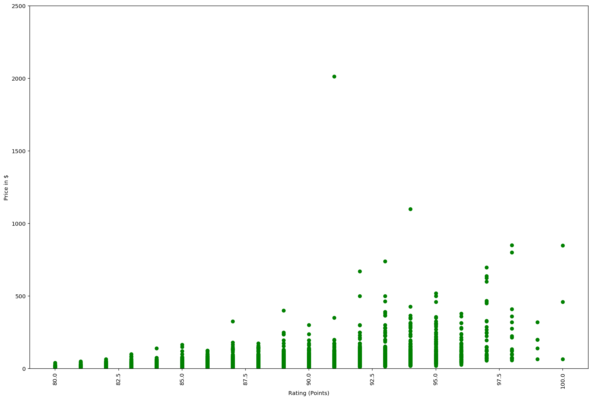


```python
# Plot distributions of points and price  
fig, ax =plt.subplots(1,2,figsize=(12,6))

sns.distplot(winesub['points'],ax=ax[0]).set(xlim=(80,100))

sns.distplot(winesub['price'],ax=ax[1]).set(xlim=(0, 500))

fig.show()
```

    C:\Users\bless\Anaconda3\lib\site-packages\matplotlib\figure.py:418: UserWarning: matplotlib is currently using a non-GUI backend, so cannot show the figure
      "matplotlib is currently using a non-GUI backend, "
    


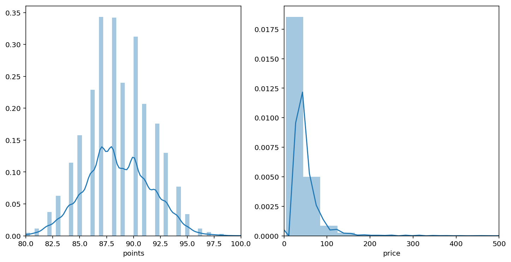


```python
# Look at the real species labels.
# sns.pairplot(data=winesub, hue='variety')
# classes appear to have a similar number of samples.
# Blue consistently looks like the divisor between the green and red classes.

g = sns.pairplot(data=winesub, hue='variety')
# g = (g.set(xlim=(80,101),ylim=(0,2500)))
plt.title("Winery/Brand vs Price")
plt.show(g)

```


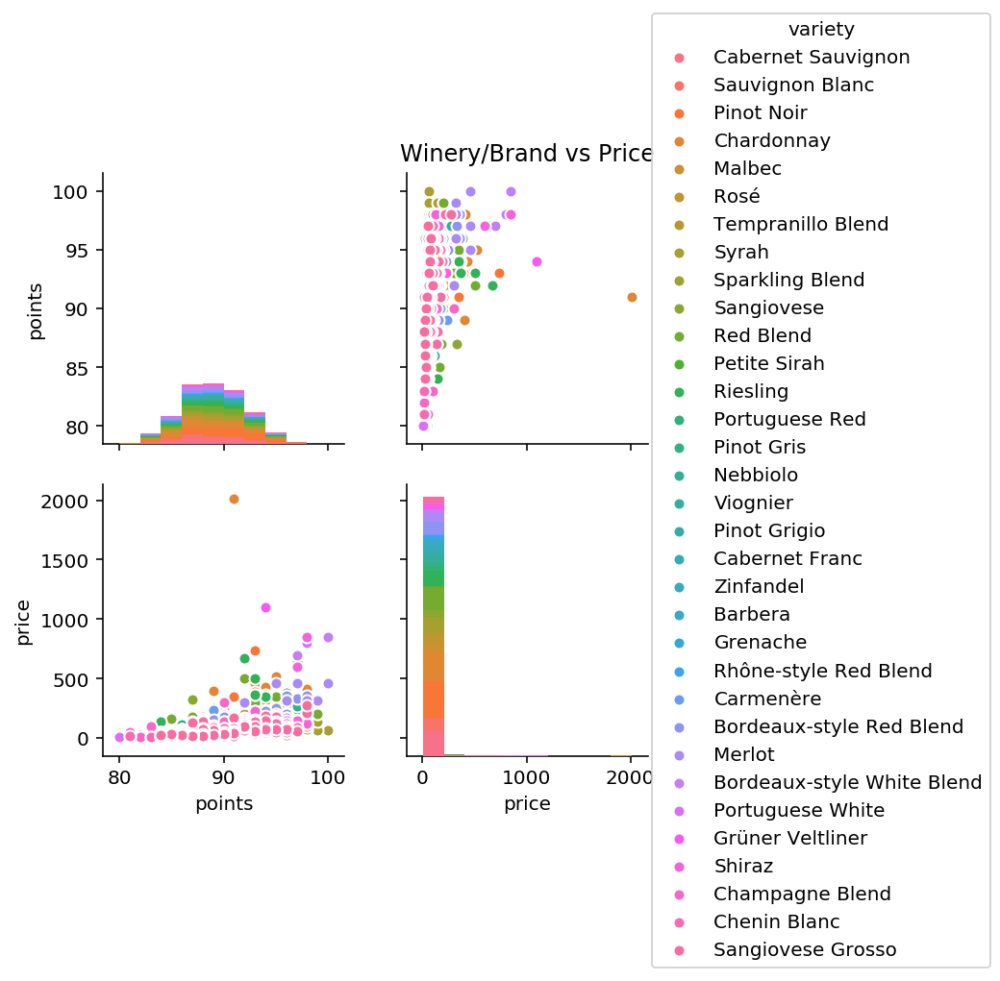


```python
# Plot scatter plots
import matplotlib
import matplotlib.pyplot as plt
fig = plt.figure(figsize=(18,12))
ax = fig.gca()

plt.ylim(50, 2500)
plt.xlabel(r'Country')
plt.ylabel(r'Price in $')
plt.legend(loc='upper left')
# actual known points
plt.scatter(x = winesub['country'] ,y=winesub['price'],c='r')
plt.xticks(rotation=45)
plt.show()
```

    No handles with labels found to put in legend.
    


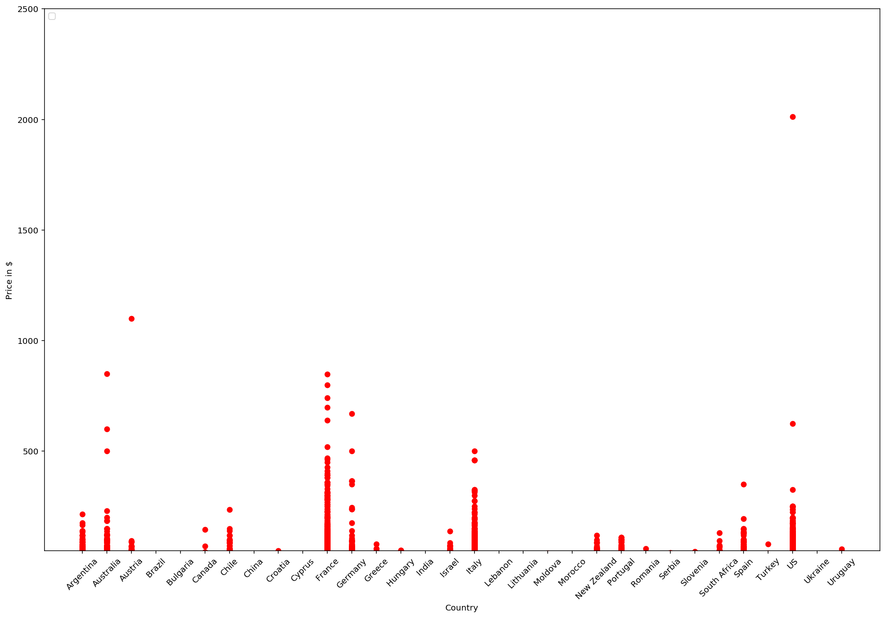


```python
import matplotlib.pyplot as plt
import seaborn as sns

a4_dims = (16, 8.27)
fig, ax = plt.subplots(figsize=a4_dims)

sns.set_style("whitegrid")
sns.barplot(x="variety", y="price", data=winesub,ax=ax)
# g = sns.lmplot(x="Segment", y="Revenue", data=winesales, aspect=2)

# g = (g.set_axis_labels("Returns","Revenue").set(xlim=(70,101),ylim=(0,120000)))
     
plt.title(" Variety vs Price")
plt.xticks(rotation=90)
 
plt.show(g)
```


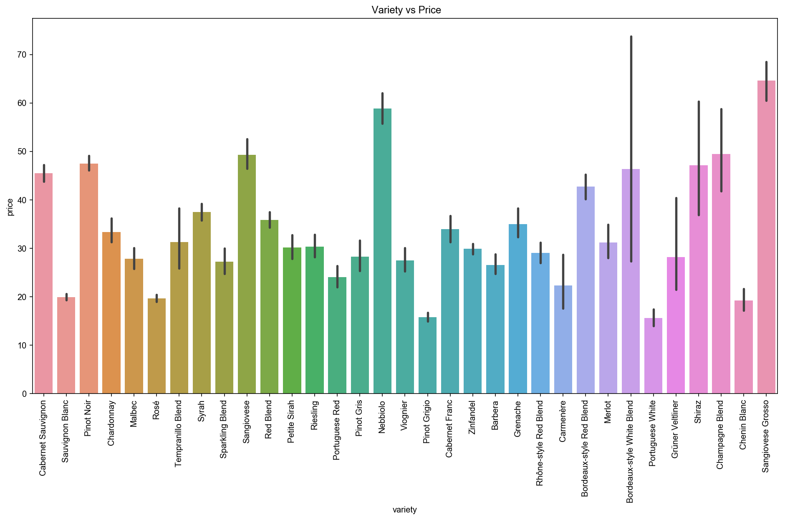


```python
import matplotlib.pyplot as plt
import seaborn as sns

a4_dims = (16, 8.27)
fig, ax = plt.subplots(figsize=a4_dims)

sns.set_style("whitegrid")
sns.barplot(x="variety", y="points", data=winesub,ax=ax)
# g = sns.lmplot(x="Segment", y="Revenue", data=winesales, aspect=2)

# g = (g.set_axis_labels("Returns","Revenue").set(xlim=(70,101),ylim=(0,120000)))
     
plt.title(" Variety vs Points")
plt.xticks(rotation=70)
 
plt.show(g)
```


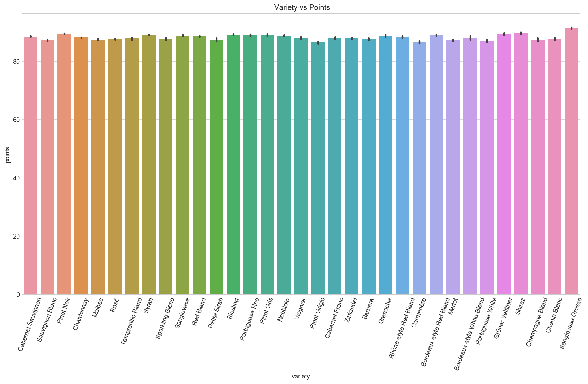


```python
import matplotlib.pyplot as plt
import seaborn as sns

# a4_dims = (11.7, 8.27)
# fig, ax = plt.subplots(figsize=a4_dims)
sns.set_style("whitegrid")
g = sns.lmplot(x="points", y="price", data=winesub, aspect=2,size=5)
g = (g.set_axis_labels("Points","Price").set(xlim=(80,101),ylim=(0,2500)))
plt.title("Points vs Price")
plt.show(g)

```


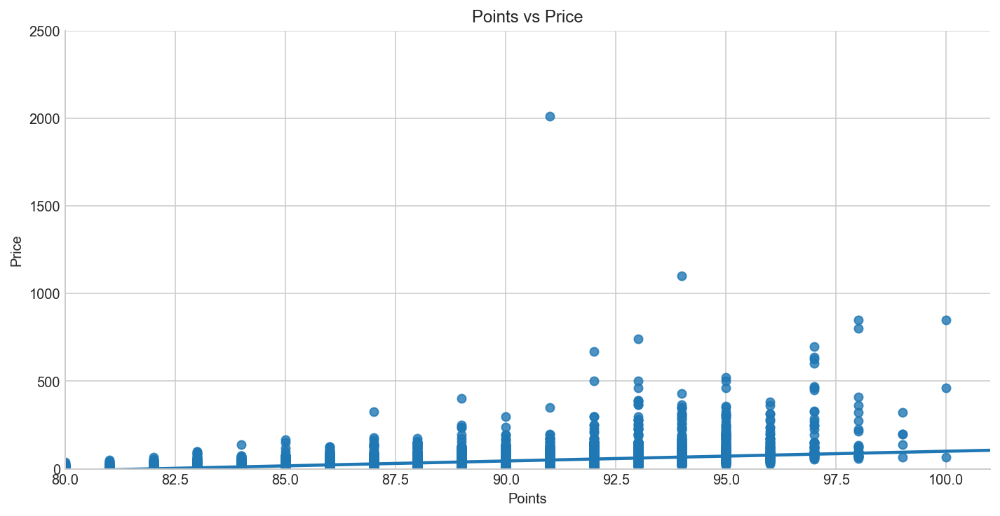


```python
# Remove all the 5 outliers in price ie > $1000
winetrim=winesub[winesub['price']  <= 1000]
# winetrim.describe(include='all')
```


```python
winetrim.corr()
```


<div>
<style scoped>
    .dataframe tbody tr th:only-of-type {
        vertical-align: middle;
    }

    .dataframe tbody tr th {
        vertical-align: top;
    }

    .dataframe thead th {
        text-align: right;
    }
</style>
<table border="1" class="dataframe">
  <thead>
    <tr style="text-align: right;">
      <th></th>
      <th>points</th>
      <th>price</th>
    </tr>
  </thead>
  <tbody>
    <tr>
      <th>points</th>
      <td>1.000000</td>
      <td>0.467143</td>
    </tr>
    <tr>
      <th>price</th>
      <td>0.467143</td>
      <td>1.000000</td>
    </tr>
  </tbody>
</table>
</div>


```python
winetrim=winetrim.reset_index(drop=True)
```


```python
import matplotlib.pyplot as plt
import seaborn as sns

# a4_dims = (11.7, 8.27)
# fig, ax = plt.subplots(figsize=a4_dims)
sns.set_style("whitegrid")
g = sns.lmplot(x="points", y="price", data=winetrim, aspect=2,size=5)
g = (g.set_axis_labels("Points","Price").set(xlim=(80,101),ylim=(0,800)))
plt.title("Points vs Price")
plt.show(g)
```


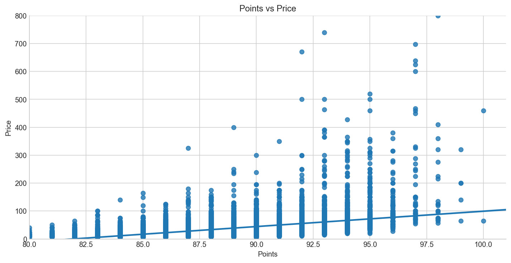


```python
sns.jointplot(x="points", y="price", data=winetrim)
```


    <seaborn.axisgrid.JointGrid at 0x212b4846dd8>


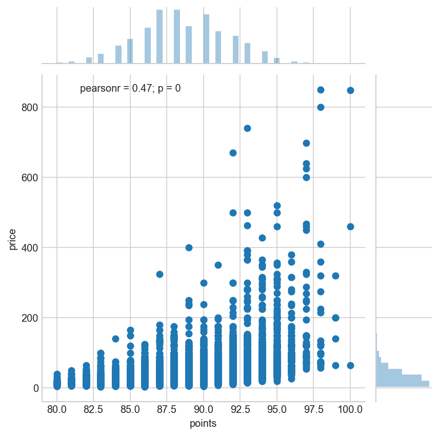


```python
# transform Variety data using dummy variables 

winesubext = pd.concat([winetrim, pd.get_dummies(winetrim['variety'],prefix='grapevar_')], axis=1)
```


```python
winesubext.variety.value_counts()
```


    Pinot Noir                    2697
    Chardonnay                    2014
    Cabernet Sauvignon            1755
    Red Blend                     1624
    Riesling                      1051
    Bordeaux-style Red Blend       911
    Syrah                          896
    Sauvignon Blanc                877
    Rosé                           666
    Merlot                         601
    Malbec                         558
    Zinfandel                      508
    Sangiovese                     495
    Portuguese Red                 379
    Nebbiolo                       303
    Sangiovese Grosso              291
    Pinot Gris                     283
    Rhône-style Red Blend          279
    Sparkling Blend                236
    Cabernet Franc                 201
    Viognier                       200
    Grüner Veltliner               194
    Shiraz                         178
    Portuguese White               145
    Pinot Grigio                   132
    Tempranillo Blend              131
    Grenache                       130
    Bordeaux-style White Blend     122
    Chenin Blanc                   111
    Barbera                        107
    Petite Sirah                   105
    Carmenère                       91
    Champagne Blend                 86
    Name: variety, dtype: int64


```python
# Determine the Varieties as features 
# missing varieties - u'grapevar__Gamay',u'grapevar__Gewurztraminer'

variety=[u'grapevar__Barbera',u'grapevar__Bordeaux-style Red Blend',u'grapevar__Bordeaux-style White Blend',
              u'grapevar__Cabernet Franc',u'grapevar__Cabernet Sauvignon',u'grapevar__Carmenère',u'grapevar__Champagne Blend',
              u'grapevar__Chardonnay',u'grapevar__Chenin Blanc',
              u'grapevar__Grenache',u'grapevar__Grüner Veltliner',u'grapevar__Malbec',u'grapevar__Merlot',u'grapevar__Nebbiolo',
              u'grapevar__Petite Sirah',u'grapevar__Pinot Grigio',u'grapevar__Pinot Gris',u'grapevar__Pinot Noir',
              u'grapevar__Portuguese Red',u'grapevar__Portuguese White',u'grapevar__Red Blend',u'grapevar__Rhône-style Red Blend',
              u'grapevar__Riesling',u'grapevar__Rosé',u'grapevar__Sangiovese',u'grapevar__Sangiovese Grosso',u'grapevar__Sauvignon Blanc',
              u'grapevar__Shiraz',u'grapevar__Sparkling Blend',u'grapevar__Syrah',u'grapevar__Tempranillo Blend',
              u'grapevar__Viognier',u'grapevar__Zinfandel']
winevariety=winesubext[variety]
# winevariety.describe()
```


```python
# Linear regression to determine relationships beteen X and Y 
# choose X and Y 

def lregress (X,y,labelX,labely):

    # split data into test and train and then apply cross validation 

    from sklearn.cross_validation import train_test_split
    # split the data with 50% in each set

    X1, X2, y1, y2 = train_test_split(X, y, random_state=0,
                                      train_size=0.50)
    # OLS regression 

    X = sm.add_constant(X)
    # Note the difference in argument order
    model = sm.OLS(y1, X1).fit()
    # model.summary()
    # predictions = model.predict(X) # make the predictions by the model

    y2_predicted = model.predict(X2)
    model.summary()
    # y2_model
    
    prediction_error = y2 - y2_predicted
    prediction_error

    df1 = pd.DataFrame()
    df1[labely]  = y2
#     df1[labelX] = X2
    df1['predicted y']=y2_predicted
    df1['Residuals'] = df1[labely] -df1['predicted y']
    df1[labely].dropna
    df1['predicted y'].dropna()
    df1['Residuals'].dropna()
    
   
    
    import matplotlib.pyplot as plt
    import seaborn as sns
    %matplotlib inline
  
    sns.distplot(df1['Residuals']) 
    return model.summary() ,sns.lmplot(x=labely, y='predicted y', data=df1)
         
```


```python
# choose X and Y for linear regression eg Points vs Price

nameX=input("X feature eg points: ")
namey = input('y to be predicted eg price: ')

dataX = winetrim[nameX]
datay = winetrim[namey]

lregress(dataX,datay,nameX,namey)
```

    X feature eg points: points
    y to be predicted eg price: price
    

    C:\Users\bless\Anaconda3\lib\site-packages\sklearn\cross_validation.py:41: DeprecationWarning: This module was deprecated in version 0.18 in favor of the model_selection module into which all the refactored classes and functions are moved. Also note that the interface of the new CV iterators are different from that of this module. This module will be removed in 0.20.
      "This module will be removed in 0.20.", DeprecationWarning)
    


    (<class 'statsmodels.iolib.summary.Summary'>
     """
                                 OLS Regression Results                            
     ==============================================================================
     Dep. Variable:                  price   R-squared:                       0.522
     Model:                            OLS   Adj. R-squared:                  0.522
     Method:                 Least Squares   F-statistic:                 1.004e+04
     Date:                Sun, 27 May 2018   Prob (F-statistic):               0.00
     Time:                        18:23:16   Log-Likelihood:                -45692.
     No. Observations:                9178   AIC:                         9.139e+04
     Df Residuals:                    9177   BIC:                         9.139e+04
     Df Model:                           1                                         
     Covariance Type:            nonrobust                                         
     ==============================================================================
                      coef    std err          t      P>|t|      [0.025      0.975]
     ------------------------------------------------------------------------------
     points         0.4150      0.004    100.206      0.000       0.407       0.423
     ==============================================================================
     Omnibus:                    12060.438   Durbin-Watson:                   1.988
     Prob(Omnibus):                  0.000   Jarque-Bera (JB):          3595367.884
     Skew:                           7.256   Prob(JB):                         0.00
     Kurtosis:                      98.870   Cond. No.                         1.00
     ==============================================================================
     
     Warnings:
     [1] Standard Errors assume that the covariance matrix of the errors is correctly specified.
     """, <seaborn.axisgrid.FacetGrid at 0x212b45cb0b8>)


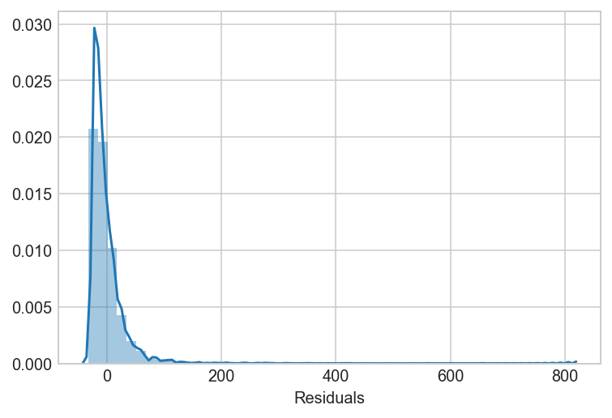


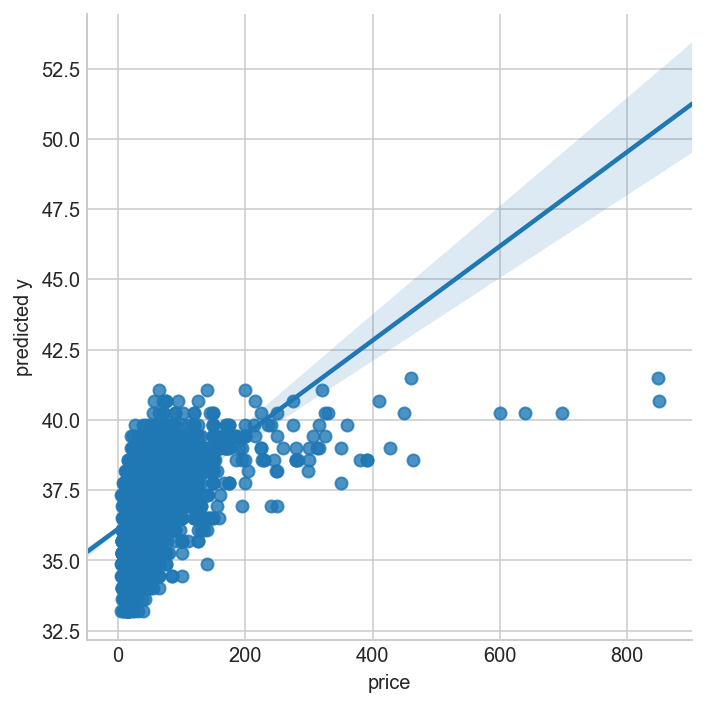


```python
# setup tokennizer NLP for wine reviews description 
from collections import defaultdict
from sklearn.cross_validation import train_test_split
import pandas as pd
import numpy as np
import scipy as sp
from sklearn.model_selection import train_test_split
from sklearn.feature_extraction.text import CountVectorizer, TfidfVectorizer
from sklearn.naive_bayes import MultinomialNB
from sklearn.linear_model import LogisticRegression
from sklearn import metrics
%matplotlib inline
# define X and y
XX = winetrim['description'].values
yy = winetrim['points'].values
zz = winetrim['price'].values
```


```python
from sklearn.feature_extraction.text import ENGLISH_STOP_WORDS

custom_stop_words = list(ENGLISH_STOP_WORDS)

# You can of course add your own custom stopwords
custom_stop_words.append('wine')
custom_stop_words.append('bordeaux')
```


```python
# use the count vectorizer to compare results 
# include 1-grams and 2-grams
vect = CountVectorizer(ngram_range=(1, 5),max_features=500,stop_words='english')
X_train_dtm = vect.fit_transform(XX)
countfeatures=vect.get_feature_names()
X_train_dtm.shape
len(countfeatures)
# # last 50 features
print (countfeatures[-50:])
```

    ['tight', 'tightly', 'time', 'toast', 'toasted', 'toasty', 'tobacco', 'tomato', 'tones', 'touch', 'touches', 'tropical', 'tropical fruit', 'valley', 'value', 'vanilla', 'varietal', 'variety', 'velvety', 'verdot', 'vibrant', 'vines', 'vineyard', 'vineyards', 'vintage', 'violet', 'warm', 'way', 'weight', 'wet', 'whiff', 'white', 'white pepper', 'wild', 'wine', 'wine offers', 'wine shows', 'winemaker', 'winery', 'wines', 'wood', 'wood aging', 'wrapped', 'year', 'years', 'yellow', 'young', 'zest', 'zesty', 'zinfandel']
    


```python
# # create a DF based on the combined vectors outputs from the count vectorizer
dfwinerate2=pd.DataFrame(data=X_train_dtm.todense(),columns=countfeatures)
# dfwinerate2.head(4)
```


```python
dfwinerate2.head(5)
```


<div>
<style scoped>
    .dataframe tbody tr th:only-of-type {
        vertical-align: middle;
    }

    .dataframe tbody tr th {
        vertical-align: top;
    }

    .dataframe thead th {
        text-align: right;
    }
</style>
<table border="1" class="dataframe">
  <thead>
    <tr style="text-align: right;">
      <th></th>
      <th>10</th>
      <th>100</th>
      <th>20</th>
      <th>2015</th>
      <th>2016</th>
      <th>2017</th>
      <th>2018</th>
      <th>2019</th>
      <th>2020</th>
      <th>accented</th>
      <th>accents</th>
      <th>acid</th>
      <th>acidic</th>
      <th>acidity</th>
      <th>acids</th>
      <th>add</th>
      <th>adds</th>
      <th>aftertaste</th>
      <th>age</th>
      <th>aged</th>
      <th>aging</th>
      <th>alcohol</th>
      <th>almond</th>
      <th>alongside</th>
      <th>ample</th>
      <th>anise</th>
      <th>appealing</th>
      <th>appellation</th>
      <th>apple</th>
      <th>apple pear</th>
      <th>apples</th>
      <th>approachable</th>
      <th>apricot</th>
      <th>aroma</th>
      <th>aromas</th>
      <th>aromas flavors</th>
      <th>aromatic</th>
      <th>astringent</th>
      <th>attractive</th>
      <th>bacon</th>
      <th>baked</th>
      <th>baking</th>
      <th>baking spice</th>
      <th>balance</th>
      <th>balanced</th>
      <th>barrel</th>
      <th>based</th>
      <th>beautiful</th>
      <th>beautifully</th>
      <th>beef</th>
      <th>berries</th>
      <th>berry</th>
      <th>berry flavors</th>
      <th>berry fruit</th>
      <th>berry fruits</th>
      <th>best</th>
      <th>better</th>
      <th>big</th>
      <th>bit</th>
      <th>bitter</th>
      <th>black</th>
      <th>black cherry</th>
      <th>black currant</th>
      <th>black fruit</th>
      <th>black fruits</th>
      <th>black pepper</th>
      <th>black plum</th>
      <th>blackberries</th>
      <th>blackberry</th>
      <th>blackberry cherry</th>
      <th>blanc</th>
      <th>blend</th>
      <th>blue</th>
      <th>blueberry</th>
      <th>bodied</th>
      <th>bodied wine</th>
      <th>body</th>
      <th>bold</th>
      <th>bordeaux</th>
      <th>bottle</th>
      <th>bottling</th>
      <th>bouquet</th>
      <th>boysenberry</th>
      <th>bright</th>
      <th>bright acidity</th>
      <th>brings</th>
      <th>brisk</th>
      <th>buttered</th>
      <th>buttered toast</th>
      <th>cab</th>
      <th>cabernet</th>
      <th>cabernet franc</th>
      <th>cabernet sauvignon</th>
      <th>candied</th>
      <th>candy</th>
      <th>caramel</th>
      <th>cassis</th>
      <th>cedar</th>
      <th>cellar</th>
      <th>character</th>
      <th>chardonnay</th>
      <th>cherries</th>
      <th>cherry</th>
      <th>cherry flavors</th>
      <th>cherry fruit</th>
      <th>cherry raspberry</th>
      <th>chewy</th>
      <th>chocolate</th>
      <th>cinnamon</th>
      <th>citrus</th>
      <th>classic</th>
      <th>clean</th>
      <th>close</th>
      <th>clove</th>
      <th>cocoa</th>
      <th>coconut</th>
      <th>coffee</th>
      <th>cola</th>
      <th>color</th>
      <th>come</th>
      <th>comes</th>
      <th>complex</th>
      <th>complexity</th>
      <th>concentrated</th>
      <th>concentration</th>
      <th>cool</th>
      <th>core</th>
      <th>cranberry</th>
      <th>creamy</th>
      <th>crisp</th>
      <th>crisp acidity</th>
      <th>crushed</th>
      <th>currant</th>
      <th>currants</th>
      <th>cut</th>
      <th>dark</th>
      <th>dark chocolate</th>
      <th>dark fruit</th>
      <th>deep</th>
      <th>delicate</th>
      <th>delicious</th>
      <th>delivers</th>
      <th>dense</th>
      <th>depth</th>
      <th>despite</th>
      <th>develop</th>
      <th>does</th>
      <th>doesn</th>
      <th>dried</th>
      <th>drink</th>
      <th>drink 2016</th>
      <th>drink 2017</th>
      <th>drink 2018</th>
      <th>drink 2020</th>
      <th>drinking</th>
      <th>driven</th>
      <th>dry</th>
      <th>dusty</th>
      <th>earth</th>
      <th>earthy</th>
      <th>easy</th>
      <th>edge</th>
      <th>elegance</th>
      <th>elegant</th>
      <th>elements</th>
      <th>end</th>
      <th>enjoy</th>
      <th>espresso</th>
      <th>estate</th>
      <th>excellent</th>
      <th>exotic</th>
      <th>expression</th>
      <th>feel</th>
      <th>feels</th>
      <th>fermented</th>
      <th>fine</th>
      <th>fine grained</th>
      <th>finish</th>
      <th>finish drink</th>
      <th>finishes</th>
      <th>finishing</th>
      <th>firm</th>
      <th>firm tannins</th>
      <th>flavor</th>
      <th>flavored</th>
      <th>flavors</th>
      <th>flavors finish</th>
      <th>fleshy</th>
      <th>floral</th>
      <th>flower</th>
      <th>flowers</th>
      <th>focused</th>
      <th>followed</th>
      <th>food</th>
      <th>forest</th>
      <th>forward</th>
      <th>franc</th>
      <th>french</th>
      <th>french oak</th>
      <th>fresh</th>
      <th>fresh acidity</th>
      <th>freshness</th>
      <th>fruit</th>
      <th>fruit aromas</th>
      <th>fruit flavors</th>
      <th>fruitiness</th>
      <th>fruits</th>
      <th>fruity</th>
      <th>fruity wine</th>
      <th>generous</th>
      <th>gives</th>
      <th>giving</th>
      <th>glass</th>
      <th>good</th>
      <th>grained</th>
      <th>grained tannins</th>
      <th>grape</th>
      <th>grapefruit</th>
      <th>grapes</th>
      <th>graphite</th>
      <th>great</th>
      <th>green</th>
      <th>green apple</th>
      <th>grenache</th>
      <th>grilled</th>
      <th>grown</th>
      <th>hard</th>
      <th>heat</th>
      <th>heavy</th>
      <th>herb</th>
      <th>herbal</th>
      <th>herbs</th>
      <th>high</th>
      <th>hint</th>
      <th>hints</th>
      <th>honey</th>
      <th>hot</th>
      <th>imported</th>
      <th>impressive</th>
      <th>integrated</th>
      <th>intense</th>
      <th>intensity</th>
      <th>interesting</th>
      <th>jam</th>
      <th>jammy</th>
      <th>juice</th>
      <th>juicy</th>
      <th>just</th>
      <th>layered</th>
      <th>layers</th>
      <th>lead</th>
      <th>lead nose</th>
      <th>leaf</th>
      <th>lean</th>
      <th>leather</th>
      <th>lemon</th>
      <th>lemony</th>
      <th>length</th>
      <th>licorice</th>
      <th>light</th>
      <th>lightly</th>
      <th>like</th>
      <th>lime</th>
      <th>lingering</th>
      <th>little</th>
      <th>lively</th>
      <th>ll</th>
      <th>long</th>
      <th>long finish</th>
      <th>lot</th>
      <th>lots</th>
      <th>lovely</th>
      <th>lush</th>
      <th>make</th>
      <th>makes</th>
      <th>making</th>
      <th>malbec</th>
      <th>mature</th>
      <th>meat</th>
      <th>medium</th>
      <th>medium bodied</th>
      <th>melon</th>
      <th>menthol</th>
      <th>merlot</th>
      <th>midpalate</th>
      <th>mild</th>
      <th>mineral</th>
      <th>minerality</th>
      <th>mint</th>
      <th>mix</th>
      <th>mocha</th>
      <th>months</th>
      <th>mouth</th>
      <th>mouthfeel</th>
      <th>needs</th>
      <th>new</th>
      <th>new french</th>
      <th>new oak</th>
      <th>nice</th>
      <th>nicely</th>
      <th>noir</th>
      <th>nose</th>
      <th>nose palate</th>
      <th>note</th>
      <th>notes</th>
      <th>oak</th>
      <th>oak flavors</th>
      <th>oaky</th>
      <th>offering</th>
      <th>offers</th>
      <th>old</th>
      <th>olive</th>
      <th>open</th>
      <th>opens</th>
      <th>opulent</th>
      <th>orange</th>
      <th>overall</th>
      <th>packed</th>
      <th>pair</th>
      <th>palate</th>
      <th>palate delivers</th>
      <th>palate offers</th>
      <th>peach</th>
      <th>pear</th>
      <th>peel</th>
      <th>pepper</th>
      <th>peppery</th>
      <th>perfumed</th>
      <th>petit</th>
      <th>petit verdot</th>
      <th>petite</th>
      <th>petite sirah</th>
      <th>pie</th>
      <th>pineapple</th>
      <th>pink</th>
      <th>pinot</th>
      <th>pinot noir</th>
      <th>pleasant</th>
      <th>plenty</th>
      <th>plum</th>
      <th>plum flavors</th>
      <th>plump</th>
      <th>plums</th>
      <th>plush</th>
      <th>polished</th>
      <th>pomegranate</th>
      <th>potential</th>
      <th>power</th>
      <th>powerful</th>
      <th>pretty</th>
      <th>price</th>
      <th>produced</th>
      <th>provide</th>
      <th>prune</th>
      <th>pure</th>
      <th>purple</th>
      <th>quality</th>
      <th>quite</th>
      <th>racy</th>
      <th>raisin</th>
      <th>raspberries</th>
      <th>raspberry</th>
      <th>raspberry cherry</th>
      <th>ready</th>
      <th>ready drink</th>
      <th>really</th>
      <th>red</th>
      <th>red berry</th>
      <th>red cherry</th>
      <th>red currant</th>
      <th>red fruit</th>
      <th>red fruits</th>
      <th>red plum</th>
      <th>refreshing</th>
      <th>rich</th>
      <th>richness</th>
      <th>riesling</th>
      <th>right</th>
      <th>ripe</th>
      <th>ripe black</th>
      <th>ripe fruit</th>
      <th>ripeness</th>
      <th>roasted</th>
      <th>rose</th>
      <th>rosé</th>
      <th>round</th>
      <th>rounded</th>
      <th>rustic</th>
      <th>sage</th>
      <th>sandalwood</th>
      <th>sangiovese</th>
      <th>sauvignon</th>
      <th>sauvignon blanc</th>
      <th>savory</th>
      <th>scents</th>
      <th>sense</th>
      <th>sharp</th>
      <th>short</th>
      <th>showing</th>
      <th>shows</th>
      <th>silky</th>
      <th>simple</th>
      <th>single</th>
      <th>sirah</th>
      <th>skin</th>
      <th>slightly</th>
      <th>small</th>
      <th>smells</th>
      <th>smoke</th>
      <th>smoky</th>
      <th>smooth</th>
      <th>soft</th>
      <th>soft tannins</th>
      <th>solid</th>
      <th>somewhat</th>
      <th>sour</th>
      <th>spice</th>
      <th>spice flavors</th>
      <th>spices</th>
      <th>spicy</th>
      <th>stone</th>
      <th>stone fruit</th>
      <th>straightforward</th>
      <th>strawberry</th>
      <th>streak</th>
      <th>strong</th>
      <th>structure</th>
      <th>structured</th>
      <th>style</th>
      <th>subtle</th>
      <th>sugar</th>
      <th>suggest</th>
      <th>supple</th>
      <th>sweet</th>
      <th>sweetness</th>
      <th>syrah</th>
      <th>tangerine</th>
      <th>tangy</th>
      <th>tannic</th>
      <th>tannin</th>
      <th>tannins</th>
      <th>tannins drink</th>
      <th>tart</th>
      <th>taste</th>
      <th>tastes</th>
      <th>tasty</th>
      <th>taut</th>
      <th>tea</th>
      <th>texture</th>
      <th>textured</th>
      <th>tight</th>
      <th>tightly</th>
      <th>time</th>
      <th>toast</th>
      <th>toasted</th>
      <th>toasty</th>
      <th>tobacco</th>
      <th>tomato</th>
      <th>tones</th>
      <th>touch</th>
      <th>touches</th>
      <th>tropical</th>
      <th>tropical fruit</th>
      <th>valley</th>
      <th>value</th>
      <th>vanilla</th>
      <th>varietal</th>
      <th>variety</th>
      <th>velvety</th>
      <th>verdot</th>
      <th>vibrant</th>
      <th>vines</th>
      <th>vineyard</th>
      <th>vineyards</th>
      <th>vintage</th>
      <th>violet</th>
      <th>warm</th>
      <th>way</th>
      <th>weight</th>
      <th>wet</th>
      <th>whiff</th>
      <th>white</th>
      <th>white pepper</th>
      <th>wild</th>
      <th>wine</th>
      <th>wine offers</th>
      <th>wine shows</th>
      <th>winemaker</th>
      <th>winery</th>
      <th>wines</th>
      <th>wood</th>
      <th>wood aging</th>
      <th>wrapped</th>
      <th>year</th>
      <th>years</th>
      <th>yellow</th>
      <th>young</th>
      <th>zest</th>
      <th>zesty</th>
      <th>zinfandel</th>
    </tr>
  </thead>
  <tbody>
    <tr>
      <th>0</th>
      <td>0</td>
      <td>1</td>
      <td>0</td>
      <td>0</td>
      <td>0</td>
      <td>0</td>
      <td>0</td>
      <td>0</td>
      <td>0</td>
      <td>0</td>
      <td>0</td>
      <td>0</td>
      <td>0</td>
      <td>0</td>
      <td>0</td>
      <td>0</td>
      <td>0</td>
      <td>0</td>
      <td>0</td>
      <td>1</td>
      <td>0</td>
      <td>0</td>
      <td>0</td>
      <td>0</td>
      <td>0</td>
      <td>0</td>
      <td>0</td>
      <td>0</td>
      <td>0</td>
      <td>0</td>
      <td>0</td>
      <td>0</td>
      <td>0</td>
      <td>0</td>
      <td>0</td>
      <td>0</td>
      <td>0</td>
      <td>0</td>
      <td>0</td>
      <td>0</td>
      <td>0</td>
      <td>0</td>
      <td>0</td>
      <td>0</td>
      <td>1</td>
      <td>0</td>
      <td>0</td>
      <td>0</td>
      <td>0</td>
      <td>0</td>
      <td>0</td>
      <td>0</td>
      <td>0</td>
      <td>0</td>
      <td>0</td>
      <td>0</td>
      <td>0</td>
      <td>0</td>
      <td>0</td>
      <td>0</td>
      <td>0</td>
      <td>0</td>
      <td>0</td>
      <td>0</td>
      <td>0</td>
      <td>0</td>
      <td>0</td>
      <td>0</td>
      <td>0</td>
      <td>0</td>
      <td>0</td>
      <td>0</td>
      <td>0</td>
      <td>0</td>
      <td>0</td>
      <td>0</td>
      <td>0</td>
      <td>0</td>
      <td>0</td>
      <td>0</td>
      <td>0</td>
      <td>0</td>
      <td>0</td>
      <td>0</td>
      <td>0</td>
      <td>0</td>
      <td>0</td>
      <td>0</td>
      <td>0</td>
      <td>0</td>
      <td>0</td>
      <td>0</td>
      <td>0</td>
      <td>0</td>
      <td>0</td>
      <td>1</td>
      <td>0</td>
      <td>0</td>
      <td>0</td>
      <td>0</td>
      <td>0</td>
      <td>0</td>
      <td>1</td>
      <td>0</td>
      <td>1</td>
      <td>0</td>
      <td>0</td>
      <td>0</td>
      <td>0</td>
      <td>0</td>
      <td>0</td>
      <td>0</td>
      <td>0</td>
      <td>0</td>
      <td>0</td>
      <td>0</td>
      <td>0</td>
      <td>0</td>
      <td>0</td>
      <td>0</td>
      <td>0</td>
      <td>0</td>
      <td>0</td>
      <td>0</td>
      <td>0</td>
      <td>0</td>
      <td>0</td>
      <td>0</td>
      <td>0</td>
      <td>0</td>
      <td>0</td>
      <td>0</td>
      <td>0</td>
      <td>0</td>
      <td>0</td>
      <td>0</td>
      <td>0</td>
      <td>0</td>
      <td>0</td>
      <td>0</td>
      <td>0</td>
      <td>0</td>
      <td>0</td>
      <td>0</td>
      <td>0</td>
      <td>1</td>
      <td>0</td>
      <td>0</td>
      <td>0</td>
      <td>0</td>
      <td>0</td>
      <td>0</td>
      <td>0</td>
      <td>0</td>
      <td>0</td>
      <td>0</td>
      <td>0</td>
      <td>0</td>
      <td>0</td>
      <td>0</td>
      <td>0</td>
      <td>0</td>
      <td>0</td>
      <td>1</td>
      <td>0</td>
      <td>0</td>
      <td>1</td>
      <td>0</td>
      <td>0</td>
      <td>0</td>
      <td>0</td>
      <td>0</td>
      <td>0</td>
      <td>0</td>
      <td>0</td>
      <td>1</td>
      <td>0</td>
      <td>1</td>
      <td>0</td>
      <td>0</td>
      <td>0</td>
      <td>0</td>
      <td>0</td>
      <td>0</td>
      <td>0</td>
      <td>0</td>
      <td>0</td>
      <td>0</td>
      <td>0</td>
      <td>0</td>
      <td>0</td>
      <td>0</td>
      <td>0</td>
      <td>0</td>
      <td>0</td>
      <td>0</td>
      <td>0</td>
      <td>0</td>
      <td>0</td>
      <td>0</td>
      <td>0</td>
      <td>0</td>
      <td>1</td>
      <td>0</td>
      <td>0</td>
      <td>0</td>
      <td>0</td>
      <td>0</td>
      <td>0</td>
      <td>0</td>
      <td>0</td>
      <td>0</td>
      <td>0</td>
      <td>0</td>
      <td>0</td>
      <td>0</td>
      <td>0</td>
      <td>0</td>
      <td>0</td>
      <td>0</td>
      <td>0</td>
      <td>0</td>
      <td>0</td>
      <td>0</td>
      <td>0</td>
      <td>0</td>
      <td>0</td>
      <td>0</td>
      <td>0</td>
      <td>0</td>
      <td>0</td>
      <td>0</td>
      <td>0</td>
      <td>1</td>
      <td>0</td>
      <td>0</td>
      <td>0</td>
      <td>0</td>
      <td>0</td>
      <td>0</td>
      <td>0</td>
      <td>0</td>
      <td>0</td>
      <td>0</td>
      <td>0</td>
      <td>0</td>
      <td>1</td>
      <td>0</td>
      <td>0</td>
      <td>0</td>
      <td>0</td>
      <td>0</td>
      <td>0</td>
      <td>0</td>
      <td>0</td>
      <td>0</td>
      <td>0</td>
      <td>0</td>
      <td>0</td>
      <td>0</td>
      <td>0</td>
      <td>0</td>
      <td>0</td>
      <td>0</td>
      <td>0</td>
      <td>0</td>
      <td>0</td>
      <td>0</td>
      <td>0</td>
      <td>0</td>
      <td>0</td>
      <td>0</td>
      <td>0</td>
      <td>0</td>
      <td>0</td>
      <td>0</td>
      <td>0</td>
      <td>0</td>
      <td>0</td>
      <td>0</td>
      <td>0</td>
      <td>0</td>
      <td>0</td>
      <td>0</td>
      <td>0</td>
      <td>0</td>
      <td>0</td>
      <td>0</td>
      <td>0</td>
      <td>0</td>
      <td>0</td>
      <td>0</td>
      <td>0</td>
      <td>0</td>
      <td>0</td>
      <td>0</td>
      <td>0</td>
      <td>0</td>
      <td>0</td>
      <td>0</td>
      <td>0</td>
      <td>0</td>
      <td>0</td>
      <td>0</td>
      <td>0</td>
      <td>1</td>
      <td>0</td>
      <td>0</td>
      <td>0</td>
      <td>0</td>
      <td>0</td>
      <td>0</td>
      <td>0</td>
      <td>0</td>
      <td>0</td>
      <td>0</td>
      <td>0</td>
      <td>0</td>
      <td>0</td>
      <td>1</td>
      <td>0</td>
      <td>0</td>
      <td>0</td>
      <td>0</td>
      <td>0</td>
      <td>0</td>
      <td>0</td>
      <td>0</td>
      <td>0</td>
      <td>0</td>
      <td>0</td>
      <td>0</td>
      <td>0</td>
      <td>0</td>
      <td>0</td>
      <td>0</td>
      <td>0</td>
      <td>0</td>
      <td>0</td>
      <td>0</td>
      <td>0</td>
      <td>0</td>
      <td>0</td>
      <td>0</td>
      <td>0</td>
      <td>0</td>
      <td>0</td>
      <td>0</td>
      <td>0</td>
      <td>0</td>
      <td>0</td>
      <td>0</td>
      <td>0</td>
      <td>0</td>
      <td>0</td>
      <td>0</td>
      <td>0</td>
      <td>0</td>
      <td>0</td>
      <td>0</td>
      <td>0</td>
      <td>0</td>
      <td>0</td>
      <td>0</td>
      <td>0</td>
      <td>0</td>
      <td>1</td>
      <td>0</td>
      <td>1</td>
      <td>0</td>
      <td>0</td>
      <td>0</td>
      <td>0</td>
      <td>0</td>
      <td>0</td>
      <td>0</td>
      <td>0</td>
      <td>0</td>
      <td>0</td>
      <td>0</td>
      <td>0</td>
      <td>0</td>
      <td>0</td>
      <td>0</td>
      <td>0</td>
      <td>0</td>
      <td>0</td>
      <td>0</td>
      <td>0</td>
      <td>0</td>
      <td>0</td>
      <td>0</td>
      <td>0</td>
      <td>0</td>
      <td>0</td>
      <td>0</td>
      <td>0</td>
      <td>0</td>
      <td>0</td>
      <td>0</td>
      <td>0</td>
      <td>0</td>
      <td>0</td>
      <td>0</td>
      <td>0</td>
      <td>0</td>
      <td>0</td>
      <td>0</td>
      <td>0</td>
      <td>0</td>
      <td>0</td>
      <td>0</td>
      <td>0</td>
      <td>0</td>
      <td>0</td>
      <td>0</td>
      <td>0</td>
      <td>0</td>
      <td>0</td>
      <td>0</td>
      <td>0</td>
      <td>0</td>
      <td>0</td>
      <td>0</td>
      <td>0</td>
      <td>0</td>
      <td>0</td>
      <td>0</td>
      <td>0</td>
      <td>1</td>
      <td>0</td>
      <td>0</td>
      <td>0</td>
      <td>0</td>
      <td>0</td>
      <td>0</td>
      <td>0</td>
      <td>0</td>
      <td>0</td>
      <td>0</td>
      <td>1</td>
      <td>0</td>
      <td>0</td>
      <td>0</td>
      <td>0</td>
      <td>0</td>
      <td>0</td>
      <td>0</td>
      <td>0</td>
      <td>0</td>
      <td>0</td>
      <td>0</td>
      <td>0</td>
      <td>0</td>
      <td>0</td>
      <td>0</td>
      <td>0</td>
      <td>0</td>
      <td>0</td>
      <td>0</td>
      <td>0</td>
      <td>0</td>
      <td>0</td>
      <td>0</td>
      <td>0</td>
      <td>0</td>
      <td>1</td>
      <td>0</td>
      <td>0</td>
      <td>0</td>
      <td>0</td>
      <td>0</td>
      <td>0</td>
      <td>0</td>
      <td>0</td>
      <td>0</td>
      <td>0</td>
      <td>0</td>
      <td>0</td>
      <td>0</td>
      <td>0</td>
      <td>0</td>
      <td>0</td>
      <td>0</td>
      <td>1</td>
      <td>0</td>
      <td>0</td>
      <td>0</td>
      <td>0</td>
      <td>0</td>
      <td>0</td>
      <td>0</td>
      <td>0</td>
      <td>0</td>
      <td>2</td>
      <td>0</td>
      <td>0</td>
      <td>0</td>
      <td>0</td>
      <td>0</td>
    </tr>
    <tr>
      <th>1</th>
      <td>0</td>
      <td>0</td>
      <td>0</td>
      <td>0</td>
      <td>0</td>
      <td>0</td>
      <td>0</td>
      <td>0</td>
      <td>0</td>
      <td>0</td>
      <td>0</td>
      <td>0</td>
      <td>0</td>
      <td>0</td>
      <td>0</td>
      <td>0</td>
      <td>0</td>
      <td>0</td>
      <td>0</td>
      <td>0</td>
      <td>0</td>
      <td>0</td>
      <td>0</td>
      <td>0</td>
      <td>0</td>
      <td>0</td>
      <td>0</td>
      <td>0</td>
      <td>0</td>
      <td>0</td>
      <td>0</td>
      <td>0</td>
      <td>0</td>
      <td>0</td>
      <td>0</td>
      <td>0</td>
      <td>0</td>
      <td>0</td>
      <td>0</td>
      <td>0</td>
      <td>0</td>
      <td>0</td>
      <td>0</td>
      <td>0</td>
      <td>1</td>
      <td>0</td>
      <td>0</td>
      <td>0</td>
      <td>0</td>
      <td>0</td>
      <td>0</td>
      <td>0</td>
      <td>0</td>
      <td>0</td>
      <td>0</td>
      <td>0</td>
      <td>0</td>
      <td>0</td>
      <td>0</td>
      <td>0</td>
      <td>0</td>
      <td>0</td>
      <td>0</td>
      <td>0</td>
      <td>0</td>
      <td>0</td>
      <td>0</td>
      <td>0</td>
      <td>0</td>
      <td>0</td>
      <td>0</td>
      <td>0</td>
      <td>0</td>
      <td>0</td>
      <td>0</td>
      <td>0</td>
      <td>0</td>
      <td>0</td>
      <td>0</td>
      <td>0</td>
      <td>0</td>
      <td>0</td>
      <td>0</td>
      <td>0</td>
      <td>0</td>
      <td>0</td>
      <td>0</td>
      <td>0</td>
      <td>0</td>
      <td>0</td>
      <td>0</td>
      <td>0</td>
      <td>0</td>
      <td>0</td>
      <td>0</td>
      <td>0</td>
      <td>0</td>
      <td>0</td>
      <td>0</td>
      <td>0</td>
      <td>0</td>
      <td>0</td>
      <td>0</td>
      <td>0</td>
      <td>0</td>
      <td>0</td>
      <td>0</td>
      <td>0</td>
      <td>0</td>
      <td>0</td>
      <td>0</td>
      <td>0</td>
      <td>0</td>
      <td>0</td>
      <td>0</td>
      <td>0</td>
      <td>0</td>
      <td>0</td>
      <td>1</td>
      <td>0</td>
      <td>0</td>
      <td>1</td>
      <td>0</td>
      <td>0</td>
      <td>0</td>
      <td>0</td>
      <td>0</td>
      <td>0</td>
      <td>0</td>
      <td>0</td>
      <td>0</td>
      <td>0</td>
      <td>0</td>
      <td>0</td>
      <td>0</td>
      <td>1</td>
      <td>0</td>
      <td>0</td>
      <td>0</td>
      <td>0</td>
      <td>1</td>
      <td>0</td>
      <td>0</td>
      <td>0</td>
      <td>0</td>
      <td>0</td>
      <td>0</td>
      <td>0</td>
      <td>0</td>
      <td>0</td>
      <td>0</td>
      <td>0</td>
      <td>0</td>
      <td>0</td>
      <td>0</td>
      <td>0</td>
      <td>0</td>
      <td>0</td>
      <td>0</td>
      <td>0</td>
      <td>0</td>
      <td>0</td>
      <td>0</td>
      <td>0</td>
      <td>0</td>
      <td>0</td>
      <td>0</td>
      <td>0</td>
      <td>0</td>
      <td>0</td>
      <td>0</td>
      <td>0</td>
      <td>0</td>
      <td>0</td>
      <td>0</td>
      <td>0</td>
      <td>0</td>
      <td>0</td>
      <td>0</td>
      <td>0</td>
      <td>0</td>
      <td>0</td>
      <td>0</td>
      <td>0</td>
      <td>0</td>
      <td>1</td>
      <td>0</td>
      <td>0</td>
      <td>0</td>
      <td>0</td>
      <td>0</td>
      <td>0</td>
      <td>0</td>
      <td>0</td>
      <td>0</td>
      <td>0</td>
      <td>0</td>
      <td>0</td>
      <td>0</td>
      <td>0</td>
      <td>0</td>
      <td>0</td>
      <td>0</td>
      <td>0</td>
      <td>0</td>
      <td>0</td>
      <td>0</td>
      <td>0</td>
      <td>0</td>
      <td>0</td>
      <td>0</td>
      <td>0</td>
      <td>0</td>
      <td>0</td>
      <td>0</td>
      <td>0</td>
      <td>0</td>
      <td>0</td>
      <td>0</td>
      <td>0</td>
      <td>0</td>
      <td>0</td>
      <td>0</td>
      <td>0</td>
      <td>0</td>
      <td>0</td>
      <td>0</td>
      <td>0</td>
      <td>0</td>
      <td>0</td>
      <td>0</td>
      <td>0</td>
      <td>0</td>
      <td>0</td>
      <td>0</td>
      <td>0</td>
      <td>0</td>
      <td>0</td>
      <td>0</td>
      <td>0</td>
      <td>0</td>
      <td>0</td>
      <td>0</td>
      <td>0</td>
      <td>0</td>
      <td>0</td>
      <td>0</td>
      <td>0</td>
      <td>0</td>
      <td>1</td>
      <td>0</td>
      <td>0</td>
      <td>0</td>
      <td>0</td>
      <td>0</td>
      <td>0</td>
      <td>0</td>
      <td>0</td>
      <td>0</td>
      <td>0</td>
      <td>0</td>
      <td>0</td>
      <td>0</td>
      <td>0</td>
      <td>0</td>
      <td>0</td>
      <td>0</td>
      <td>0</td>
      <td>0</td>
      <td>0</td>
      <td>0</td>
      <td>0</td>
      <td>0</td>
      <td>0</td>
      <td>0</td>
      <td>0</td>
      <td>0</td>
      <td>0</td>
      <td>0</td>
      <td>0</td>
      <td>0</td>
      <td>0</td>
      <td>0</td>
      <td>0</td>
      <td>0</td>
      <td>0</td>
      <td>0</td>
      <td>0</td>
      <td>0</td>
      <td>0</td>
      <td>0</td>
      <td>0</td>
      <td>0</td>
      <td>0</td>
      <td>0</td>
      <td>0</td>
      <td>0</td>
      <td>0</td>
      <td>0</td>
      <td>0</td>
      <td>0</td>
      <td>0</td>
      <td>0</td>
      <td>0</td>
      <td>0</td>
      <td>0</td>
      <td>0</td>
      <td>0</td>
      <td>0</td>
      <td>0</td>
      <td>0</td>
      <td>0</td>
      <td>0</td>
      <td>0</td>
      <td>0</td>
      <td>1</td>
      <td>0</td>
      <td>0</td>
      <td>0</td>
      <td>0</td>
      <td>0</td>
      <td>0</td>
      <td>0</td>
      <td>1</td>
      <td>1</td>
      <td>0</td>
      <td>0</td>
      <td>0</td>
      <td>0</td>
      <td>0</td>
      <td>0</td>
      <td>0</td>
      <td>0</td>
      <td>0</td>
      <td>0</td>
      <td>0</td>
      <td>0</td>
      <td>0</td>
      <td>0</td>
      <td>0</td>
      <td>0</td>
      <td>0</td>
      <td>0</td>
      <td>0</td>
      <td>0</td>
      <td>0</td>
      <td>0</td>
      <td>0</td>
      <td>0</td>
      <td>0</td>
      <td>0</td>
      <td>0</td>
      <td>0</td>
      <td>0</td>
      <td>0</td>
      <td>0</td>
      <td>0</td>
      <td>0</td>
      <td>0</td>
      <td>0</td>
      <td>0</td>
      <td>0</td>
      <td>0</td>
      <td>0</td>
      <td>0</td>
      <td>0</td>
      <td>0</td>
      <td>0</td>
      <td>0</td>
      <td>0</td>
      <td>0</td>
      <td>0</td>
      <td>0</td>
      <td>0</td>
      <td>0</td>
      <td>0</td>
      <td>0</td>
      <td>0</td>
      <td>0</td>
      <td>0</td>
      <td>0</td>
      <td>0</td>
      <td>0</td>
      <td>0</td>
      <td>0</td>
      <td>0</td>
      <td>0</td>
      <td>0</td>
      <td>0</td>
      <td>0</td>
      <td>0</td>
      <td>0</td>
      <td>0</td>
      <td>0</td>
      <td>0</td>
      <td>0</td>
      <td>0</td>
      <td>0</td>
      <td>0</td>
      <td>0</td>
      <td>0</td>
      <td>0</td>
      <td>0</td>
      <td>0</td>
      <td>0</td>
      <td>0</td>
      <td>0</td>
      <td>0</td>
      <td>0</td>
      <td>0</td>
      <td>0</td>
      <td>0</td>
      <td>0</td>
      <td>0</td>
      <td>0</td>
      <td>0</td>
      <td>0</td>
      <td>0</td>
      <td>0</td>
      <td>0</td>
      <td>0</td>
      <td>0</td>
      <td>0</td>
      <td>0</td>
      <td>0</td>
      <td>0</td>
      <td>0</td>
      <td>0</td>
      <td>0</td>
      <td>0</td>
      <td>1</td>
      <td>0</td>
      <td>0</td>
      <td>0</td>
      <td>0</td>
      <td>0</td>
      <td>0</td>
      <td>0</td>
      <td>0</td>
      <td>0</td>
      <td>0</td>
      <td>0</td>
      <td>0</td>
      <td>0</td>
      <td>0</td>
      <td>0</td>
      <td>0</td>
      <td>0</td>
      <td>0</td>
      <td>0</td>
      <td>0</td>
      <td>0</td>
      <td>0</td>
      <td>0</td>
      <td>1</td>
      <td>0</td>
      <td>0</td>
      <td>0</td>
      <td>0</td>
      <td>0</td>
      <td>0</td>
      <td>0</td>
      <td>0</td>
      <td>0</td>
      <td>0</td>
      <td>0</td>
      <td>0</td>
      <td>0</td>
      <td>0</td>
      <td>0</td>
      <td>0</td>
      <td>0</td>
      <td>0</td>
      <td>0</td>
      <td>0</td>
      <td>0</td>
      <td>0</td>
      <td>0</td>
      <td>0</td>
      <td>0</td>
      <td>0</td>
      <td>1</td>
      <td>0</td>
      <td>0</td>
      <td>1</td>
      <td>0</td>
      <td>0</td>
      <td>0</td>
      <td>0</td>
      <td>0</td>
      <td>0</td>
      <td>0</td>
      <td>0</td>
      <td>0</td>
      <td>0</td>
      <td>0</td>
      <td>0</td>
      <td>0</td>
      <td>0</td>
      <td>0</td>
    </tr>
    <tr>
      <th>2</th>
      <td>0</td>
      <td>0</td>
      <td>1</td>
      <td>0</td>
      <td>0</td>
      <td>0</td>
      <td>0</td>
      <td>0</td>
      <td>0</td>
      <td>0</td>
      <td>0</td>
      <td>0</td>
      <td>0</td>
      <td>0</td>
      <td>0</td>
      <td>0</td>
      <td>0</td>
      <td>0</td>
      <td>0</td>
      <td>0</td>
      <td>0</td>
      <td>0</td>
      <td>0</td>
      <td>0</td>
      <td>0</td>
      <td>0</td>
      <td>0</td>
      <td>0</td>
      <td>0</td>
      <td>0</td>
      <td>0</td>
      <td>0</td>
      <td>0</td>
      <td>0</td>
      <td>1</td>
      <td>1</td>
      <td>1</td>
      <td>0</td>
      <td>0</td>
      <td>0</td>
      <td>0</td>
      <td>0</td>
      <td>0</td>
      <td>0</td>
      <td>0</td>
      <td>0</td>
      <td>0</td>
      <td>0</td>
      <td>0</td>
      <td>0</td>
      <td>0</td>
      <td>0</td>
      <td>0</td>
      <td>0</td>
      <td>0</td>
      <td>0</td>
      <td>0</td>
      <td>0</td>
      <td>0</td>
      <td>0</td>
      <td>1</td>
      <td>1</td>
      <td>0</td>
      <td>0</td>
      <td>0</td>
      <td>0</td>
      <td>0</td>
      <td>0</td>
      <td>1</td>
      <td>0</td>
      <td>0</td>
      <td>0</td>
      <td>0</td>
      <td>0</td>
      <td>0</td>
      <td>0</td>
      <td>0</td>
      <td>0</td>
      <td>0</td>
      <td>0</td>
      <td>0</td>
      <td>0</td>
      <td>0</td>
      <td>0</td>
      <td>0</td>
      <td>0</td>
      <td>0</td>
      <td>0</td>
      <td>0</td>
      <td>0</td>
      <td>0</td>
      <td>0</td>
      <td>0</td>
      <td>0</td>
      <td>0</td>
      <td>0</td>
      <td>0</td>
      <td>0</td>
      <td>0</td>
      <td>0</td>
      <td>0</td>
      <td>0</td>
      <td>1</td>
      <td>0</td>
      <td>0</td>
      <td>0</td>
      <td>0</td>
      <td>1</td>
      <td>0</td>
      <td>0</td>
      <td>0</td>
      <td>0</td>
      <td>0</td>
      <td>0</td>
      <td>0</td>
      <td>0</td>
      <td>1</td>
      <td>0</td>
      <td>0</td>
      <td>0</td>
      <td>0</td>
      <td>0</td>
      <td>0</td>
      <td>0</td>
      <td>0</td>
      <td>0</td>
      <td>0</td>
      <td>0</td>
      <td>0</td>
      <td>0</td>
      <td>0</td>
      <td>0</td>
      <td>0</td>
      <td>0</td>
      <td>0</td>
      <td>1</td>
      <td>1</td>
      <td>0</td>
      <td>0</td>
      <td>0</td>
      <td>0</td>
      <td>0</td>
      <td>1</td>
      <td>0</td>
      <td>0</td>
      <td>0</td>
      <td>0</td>
      <td>0</td>
      <td>0</td>
      <td>1</td>
      <td>0</td>
      <td>0</td>
      <td>0</td>
      <td>0</td>
      <td>0</td>
      <td>0</td>
      <td>0</td>
      <td>0</td>
      <td>0</td>
      <td>0</td>
      <td>0</td>
      <td>0</td>
      <td>0</td>
      <td>0</td>
      <td>0</td>
      <td>0</td>
      <td>0</td>
      <td>1</td>
      <td>0</td>
      <td>0</td>
      <td>0</td>
      <td>0</td>
      <td>0</td>
      <td>0</td>
      <td>0</td>
      <td>1</td>
      <td>0</td>
      <td>1</td>
      <td>0</td>
      <td>0</td>
      <td>0</td>
      <td>0</td>
      <td>0</td>
      <td>0</td>
      <td>0</td>
      <td>1</td>
      <td>0</td>
      <td>0</td>
      <td>0</td>
      <td>0</td>
      <td>0</td>
      <td>0</td>
      <td>0</td>
      <td>0</td>
      <td>0</td>
      <td>0</td>
      <td>0</td>
      <td>1</td>
      <td>1</td>
      <td>0</td>
      <td>0</td>
      <td>0</td>
      <td>1</td>
      <td>0</td>
      <td>0</td>
      <td>0</td>
      <td>0</td>
      <td>0</td>
      <td>0</td>
      <td>0</td>
      <td>0</td>
      <td>0</td>
      <td>0</td>
      <td>0</td>
      <td>0</td>
      <td>0</td>
      <td>0</td>
      <td>0</td>
      <td>0</td>
      <td>1</td>
      <td>0</td>
      <td>0</td>
      <td>0</td>
      <td>0</td>
      <td>0</td>
      <td>0</td>
      <td>0</td>
      <td>0</td>
      <td>0</td>
      <td>0</td>
      <td>0</td>
      <td>0</td>
      <td>0</td>
      <td>0</td>
      <td>0</td>
      <td>0</td>
      <td>0</td>
      <td>0</td>
      <td>0</td>
      <td>0</td>
      <td>0</td>
      <td>0</td>
      <td>0</td>
      <td>0</td>
      <td>0</td>
      <td>0</td>
      <td>0</td>
      <td>0</td>
      <td>0</td>
      <td>0</td>
      <td>0</td>
      <td>0</td>
      <td>0</td>
      <td>0</td>
      <td>0</td>
      <td>0</td>
      <td>0</td>
      <td>0</td>
      <td>0</td>
      <td>0</td>
      <td>0</td>
      <td>0</td>
      <td>0</td>
      <td>0</td>
      <td>0</td>
      <td>0</td>
      <td>0</td>
      <td>0</td>
      <td>0</td>
      <td>0</td>
      <td>0</td>
      <td>0</td>
      <td>0</td>
      <td>0</td>
      <td>0</td>
      <td>0</td>
      <td>0</td>
      <td>0</td>
      <td>0</td>
      <td>0</td>
      <td>0</td>
      <td>0</td>
      <td>0</td>
      <td>0</td>
      <td>0</td>
      <td>0</td>
      <td>0</td>
      <td>0</td>
      <td>0</td>
      <td>0</td>
      <td>0</td>
      <td>1</td>
      <td>0</td>
      <td>0</td>
      <td>0</td>
      <td>1</td>
      <td>1</td>
      <td>0</td>
      <td>0</td>
      <td>0</td>
      <td>0</td>
      <td>0</td>
      <td>0</td>
      <td>0</td>
      <td>0</td>
      <td>1</td>
      <td>0</td>
      <td>0</td>
      <td>0</td>
      <td>0</td>
      <td>0</td>
      <td>0</td>
      <td>0</td>
      <td>0</td>
      <td>0</td>
      <td>0</td>
      <td>0</td>
      <td>0</td>
      <td>0</td>
      <td>0</td>
      <td>0</td>
      <td>0</td>
      <td>0</td>
      <td>0</td>
      <td>0</td>
      <td>0</td>
      <td>0</td>
      <td>0</td>
      <td>0</td>
      <td>0</td>
      <td>0</td>
      <td>0</td>
      <td>0</td>
      <td>0</td>
      <td>0</td>
      <td>0</td>
      <td>0</td>
      <td>0</td>
      <td>0</td>
      <td>0</td>
      <td>0</td>
      <td>0</td>
      <td>0</td>
      <td>0</td>
      <td>1</td>
      <td>0</td>
      <td>0</td>
      <td>0</td>
      <td>0</td>
      <td>0</td>
      <td>0</td>
      <td>0</td>
      <td>0</td>
      <td>0</td>
      <td>0</td>
      <td>0</td>
      <td>0</td>
      <td>0</td>
      <td>0</td>
      <td>0</td>
      <td>0</td>
      <td>0</td>
      <td>0</td>
      <td>0</td>
      <td>0</td>
      <td>0</td>
      <td>0</td>
      <td>0</td>
      <td>0</td>
      <td>0</td>
      <td>0</td>
      <td>0</td>
      <td>0</td>
      <td>0</td>
      <td>0</td>
      <td>0</td>
      <td>0</td>
      <td>0</td>
      <td>0</td>
      <td>0</td>
      <td>0</td>
      <td>0</td>
      <td>0</td>
      <td>0</td>
      <td>0</td>
      <td>0</td>
      <td>0</td>
      <td>0</td>
      <td>0</td>
      <td>0</td>
      <td>0</td>
      <td>0</td>
      <td>0</td>
      <td>0</td>
      <td>0</td>
      <td>0</td>
      <td>0</td>
      <td>0</td>
      <td>0</td>
      <td>0</td>
      <td>0</td>
      <td>0</td>
      <td>0</td>
      <td>0</td>
      <td>0</td>
      <td>0</td>
      <td>0</td>
      <td>0</td>
      <td>0</td>
      <td>0</td>
      <td>0</td>
      <td>0</td>
      <td>0</td>
      <td>0</td>
      <td>0</td>
      <td>0</td>
      <td>0</td>
      <td>0</td>
      <td>0</td>
      <td>0</td>
      <td>0</td>
      <td>0</td>
      <td>0</td>
      <td>0</td>
      <td>0</td>
      <td>0</td>
      <td>0</td>
      <td>0</td>
      <td>0</td>
      <td>0</td>
      <td>0</td>
      <td>0</td>
      <td>0</td>
      <td>0</td>
      <td>0</td>
      <td>0</td>
      <td>0</td>
      <td>0</td>
      <td>0</td>
      <td>0</td>
      <td>1</td>
      <td>0</td>
      <td>0</td>
      <td>0</td>
      <td>0</td>
      <td>0</td>
      <td>0</td>
      <td>0</td>
      <td>0</td>
      <td>0</td>
      <td>0</td>
      <td>0</td>
      <td>0</td>
      <td>1</td>
      <td>0</td>
      <td>1</td>
      <td>0</td>
      <td>0</td>
      <td>0</td>
      <td>0</td>
      <td>0</td>
      <td>0</td>
      <td>0</td>
      <td>0</td>
      <td>0</td>
      <td>0</td>
      <td>0</td>
      <td>0</td>
      <td>0</td>
      <td>0</td>
      <td>0</td>
      <td>0</td>
      <td>0</td>
      <td>1</td>
      <td>0</td>
      <td>0</td>
      <td>0</td>
      <td>0</td>
      <td>0</td>
      <td>0</td>
      <td>0</td>
      <td>0</td>
      <td>0</td>
      <td>0</td>
      <td>0</td>
      <td>0</td>
      <td>0</td>
      <td>0</td>
      <td>0</td>
      <td>0</td>
      <td>0</td>
      <td>0</td>
      <td>0</td>
      <td>0</td>
      <td>0</td>
      <td>0</td>
      <td>0</td>
      <td>0</td>
      <td>0</td>
      <td>0</td>
    </tr>
    <tr>
      <th>3</th>
      <td>0</td>
      <td>0</td>
      <td>0</td>
      <td>0</td>
      <td>0</td>
      <td>0</td>
      <td>0</td>
      <td>0</td>
      <td>0</td>
      <td>0</td>
      <td>1</td>
      <td>0</td>
      <td>0</td>
      <td>0</td>
      <td>0</td>
      <td>0</td>
      <td>0</td>
      <td>0</td>
      <td>0</td>
      <td>0</td>
      <td>0</td>
      <td>0</td>
      <td>0</td>
      <td>0</td>
      <td>0</td>
      <td>0</td>
      <td>0</td>
      <td>0</td>
      <td>0</td>
      <td>0</td>
      <td>0</td>
      <td>0</td>
      <td>0</td>
      <td>0</td>
      <td>0</td>
      <td>0</td>
      <td>0</td>
      <td>0</td>
      <td>0</td>
      <td>0</td>
      <td>0</td>
      <td>0</td>
      <td>0</td>
      <td>0</td>
      <td>0</td>
      <td>0</td>
      <td>0</td>
      <td>0</td>
      <td>0</td>
      <td>0</td>
      <td>0</td>
      <td>0</td>
      <td>0</td>
      <td>0</td>
      <td>0</td>
      <td>0</td>
      <td>0</td>
      <td>0</td>
      <td>0</td>
      <td>0</td>
      <td>1</td>
      <td>0</td>
      <td>0</td>
      <td>0</td>
      <td>1</td>
      <td>0</td>
      <td>0</td>
      <td>0</td>
      <td>0</td>
      <td>0</td>
      <td>0</td>
      <td>0</td>
      <td>0</td>
      <td>0</td>
      <td>0</td>
      <td>0</td>
      <td>0</td>
      <td>0</td>
      <td>0</td>
      <td>0</td>
      <td>0</td>
      <td>0</td>
      <td>0</td>
      <td>0</td>
      <td>0</td>
      <td>0</td>
      <td>0</td>
      <td>0</td>
      <td>0</td>
      <td>0</td>
      <td>0</td>
      <td>0</td>
      <td>0</td>
      <td>0</td>
      <td>0</td>
      <td>0</td>
      <td>0</td>
      <td>0</td>
      <td>1</td>
      <td>0</td>
      <td>0</td>
      <td>0</td>
      <td>0</td>
      <td>0</td>
      <td>0</td>
      <td>0</td>
      <td>0</td>
      <td>0</td>
      <td>0</td>
      <td>1</td>
      <td>0</td>
      <td>0</td>
      <td>0</td>
      <td>0</td>
      <td>0</td>
      <td>0</td>
      <td>0</td>
      <td>0</td>
      <td>0</td>
      <td>0</td>
      <td>0</td>
      <td>0</td>
      <td>0</td>
      <td>0</td>
      <td>1</td>
      <td>0</td>
      <td>0</td>
      <td>0</td>
      <td>0</td>
      <td>0</td>
      <td>0</td>
      <td>0</td>
      <td>0</td>
      <td>0</td>
      <td>0</td>
      <td>0</td>
      <td>0</td>
      <td>0</td>
      <td>0</td>
      <td>0</td>
      <td>0</td>
      <td>0</td>
      <td>0</td>
      <td>0</td>
      <td>0</td>
      <td>0</td>
      <td>0</td>
      <td>0</td>
      <td>0</td>
      <td>1</td>
      <td>0</td>
      <td>0</td>
      <td>0</td>
      <td>0</td>
      <td>0</td>
      <td>0</td>
      <td>0</td>
      <td>0</td>
      <td>0</td>
      <td>0</td>
      <td>0</td>
      <td>0</td>
      <td>0</td>
      <td>0</td>
      <td>0</td>
      <td>0</td>
      <td>0</td>
      <td>0</td>
      <td>0</td>
      <td>0</td>
      <td>0</td>
      <td>0</td>
      <td>0</td>
      <td>0</td>
      <td>0</td>
      <td>0</td>
      <td>0</td>
      <td>0</td>
      <td>0</td>
      <td>0</td>
      <td>0</td>
      <td>0</td>
      <td>0</td>
      <td>0</td>
      <td>0</td>
      <td>0</td>
      <td>0</td>
      <td>0</td>
      <td>0</td>
      <td>0</td>
      <td>0</td>
      <td>0</td>
      <td>0</td>
      <td>0</td>
      <td>0</td>
      <td>0</td>
      <td>0</td>
      <td>0</td>
      <td>0</td>
      <td>0</td>
      <td>0</td>
      <td>0</td>
      <td>0</td>
      <td>0</td>
      <td>0</td>
      <td>0</td>
      <td>1</td>
      <td>0</td>
      <td>0</td>
      <td>0</td>
      <td>0</td>
      <td>0</td>
      <td>0</td>
      <td>0</td>
      <td>0</td>
      <td>0</td>
      <td>0</td>
      <td>0</td>
      <td>0</td>
      <td>1</td>
      <td>0</td>
      <td>0</td>
      <td>0</td>
      <td>0</td>
      <td>0</td>
      <td>0</td>
      <td>0</td>
      <td>0</td>
      <td>0</td>
      <td>0</td>
      <td>0</td>
      <td>0</td>
      <td>0</td>
      <td>0</td>
      <td>0</td>
      <td>0</td>
      <td>0</td>
      <td>0</td>
      <td>0</td>
      <td>0</td>
      <td>0</td>
      <td>0</td>
      <td>0</td>
      <td>0</td>
      <td>0</td>
      <td>0</td>
      <td>0</td>
      <td>0</td>
      <td>0</td>
      <td>0</td>
      <td>0</td>
      <td>0</td>
      <td>0</td>
      <td>0</td>
      <td>0</td>
      <td>0</td>
      <td>0</td>
      <td>0</td>
      <td>0</td>
      <td>0</td>
      <td>0</td>
      <td>0</td>
      <td>0</td>
      <td>0</td>
      <td>0</td>
      <td>0</td>
      <td>1</td>
      <td>0</td>
      <td>0</td>
      <td>0</td>
      <td>0</td>
      <td>0</td>
      <td>0</td>
      <td>0</td>
      <td>0</td>
      <td>0</td>
      <td>0</td>
      <td>0</td>
      <td>0</td>
      <td>0</td>
      <td>0</td>
      <td>0</td>
      <td>0</td>
      <td>0</td>
      <td>1</td>
      <td>0</td>
      <td>0</td>
      <td>1</td>
      <td>0</td>
      <td>0</td>
      <td>0</td>
      <td>0</td>
      <td>0</td>
      <td>0</td>
      <td>0</td>
      <td>0</td>
      <td>0</td>
      <td>0</td>
      <td>0</td>
      <td>0</td>
      <td>0</td>
      <td>0</td>
      <td>0</td>
      <td>0</td>
      <td>0</td>
      <td>0</td>
      <td>0</td>
      <td>0</td>
      <td>0</td>
      <td>0</td>
      <td>0</td>
      <td>0</td>
      <td>0</td>
      <td>0</td>
      <td>0</td>
      <td>0</td>
      <td>0</td>
      <td>0</td>
      <td>0</td>
      <td>0</td>
      <td>0</td>
      <td>0</td>
      <td>0</td>
      <td>0</td>
      <td>0</td>
      <td>0</td>
      <td>0</td>
      <td>0</td>
      <td>0</td>
      <td>0</td>
      <td>0</td>
      <td>0</td>
      <td>0</td>
      <td>0</td>
      <td>0</td>
      <td>0</td>
      <td>0</td>
      <td>0</td>
      <td>0</td>
      <td>0</td>
      <td>0</td>
      <td>0</td>
      <td>0</td>
      <td>0</td>
      <td>0</td>
      <td>0</td>
      <td>0</td>
      <td>0</td>
      <td>0</td>
      <td>0</td>
      <td>0</td>
      <td>0</td>
      <td>0</td>
      <td>0</td>
      <td>0</td>
      <td>0</td>
      <td>0</td>
      <td>1</td>
      <td>0</td>
      <td>0</td>
      <td>0</td>
      <td>0</td>
      <td>0</td>
      <td>0</td>
      <td>0</td>
      <td>0</td>
      <td>0</td>
      <td>0</td>
      <td>0</td>
      <td>0</td>
      <td>0</td>
      <td>0</td>
      <td>0</td>
      <td>0</td>
      <td>0</td>
      <td>0</td>
      <td>0</td>
      <td>0</td>
      <td>0</td>
      <td>0</td>
      <td>0</td>
      <td>0</td>
      <td>0</td>
      <td>0</td>
      <td>0</td>
      <td>0</td>
      <td>0</td>
      <td>0</td>
      <td>0</td>
      <td>0</td>
      <td>0</td>
      <td>0</td>
      <td>0</td>
      <td>0</td>
      <td>0</td>
      <td>0</td>
      <td>0</td>
      <td>0</td>
      <td>0</td>
      <td>0</td>
      <td>0</td>
      <td>0</td>
      <td>0</td>
      <td>0</td>
      <td>0</td>
      <td>0</td>
      <td>0</td>
      <td>0</td>
      <td>0</td>
      <td>0</td>
      <td>0</td>
      <td>0</td>
      <td>0</td>
      <td>0</td>
      <td>0</td>
      <td>0</td>
      <td>0</td>
      <td>0</td>
      <td>0</td>
      <td>0</td>
      <td>0</td>
      <td>0</td>
      <td>0</td>
      <td>0</td>
      <td>0</td>
      <td>0</td>
      <td>0</td>
      <td>0</td>
      <td>0</td>
      <td>0</td>
      <td>0</td>
      <td>0</td>
      <td>0</td>
      <td>0</td>
      <td>0</td>
      <td>0</td>
      <td>0</td>
      <td>0</td>
      <td>0</td>
      <td>0</td>
      <td>0</td>
      <td>0</td>
      <td>0</td>
      <td>0</td>
      <td>0</td>
      <td>0</td>
      <td>0</td>
      <td>0</td>
      <td>0</td>
      <td>0</td>
      <td>0</td>
      <td>0</td>
      <td>0</td>
      <td>0</td>
      <td>0</td>
      <td>0</td>
      <td>0</td>
      <td>0</td>
      <td>0</td>
      <td>0</td>
      <td>0</td>
      <td>0</td>
      <td>0</td>
      <td>0</td>
      <td>0</td>
      <td>0</td>
      <td>0</td>
      <td>0</td>
      <td>0</td>
      <td>0</td>
      <td>0</td>
      <td>0</td>
      <td>1</td>
      <td>0</td>
      <td>0</td>
      <td>0</td>
      <td>0</td>
      <td>0</td>
      <td>0</td>
      <td>0</td>
      <td>0</td>
      <td>0</td>
      <td>0</td>
      <td>0</td>
      <td>1</td>
      <td>0</td>
      <td>0</td>
      <td>0</td>
      <td>0</td>
      <td>0</td>
      <td>0</td>
      <td>0</td>
      <td>0</td>
      <td>0</td>
      <td>0</td>
      <td>0</td>
      <td>0</td>
      <td>0</td>
      <td>0</td>
      <td>0</td>
    </tr>
    <tr>
      <th>4</th>
      <td>0</td>
      <td>0</td>
      <td>0</td>
      <td>0</td>
      <td>0</td>
      <td>0</td>
      <td>0</td>
      <td>0</td>
      <td>0</td>
      <td>0</td>
      <td>0</td>
      <td>0</td>
      <td>0</td>
      <td>1</td>
      <td>0</td>
      <td>0</td>
      <td>0</td>
      <td>0</td>
      <td>0</td>
      <td>0</td>
      <td>0</td>
      <td>0</td>
      <td>0</td>
      <td>0</td>
      <td>0</td>
      <td>0</td>
      <td>0</td>
      <td>0</td>
      <td>0</td>
      <td>0</td>
      <td>0</td>
      <td>0</td>
      <td>0</td>
      <td>0</td>
      <td>0</td>
      <td>0</td>
      <td>0</td>
      <td>0</td>
      <td>0</td>
      <td>0</td>
      <td>0</td>
      <td>0</td>
      <td>0</td>
      <td>0</td>
      <td>0</td>
      <td>0</td>
      <td>0</td>
      <td>0</td>
      <td>0</td>
      <td>0</td>
      <td>0</td>
      <td>0</td>
      <td>0</td>
      <td>0</td>
      <td>0</td>
      <td>0</td>
      <td>0</td>
      <td>0</td>
      <td>0</td>
      <td>0</td>
      <td>0</td>
      <td>0</td>
      <td>0</td>
      <td>0</td>
      <td>0</td>
      <td>0</td>
      <td>0</td>
      <td>0</td>
      <td>0</td>
      <td>0</td>
      <td>0</td>
      <td>0</td>
      <td>0</td>
      <td>0</td>
      <td>0</td>
      <td>0</td>
      <td>0</td>
      <td>0</td>
      <td>0</td>
      <td>0</td>
      <td>0</td>
      <td>0</td>
      <td>0</td>
      <td>1</td>
      <td>1</td>
      <td>0</td>
      <td>0</td>
      <td>0</td>
      <td>0</td>
      <td>0</td>
      <td>0</td>
      <td>0</td>
      <td>0</td>
      <td>0</td>
      <td>0</td>
      <td>0</td>
      <td>0</td>
      <td>0</td>
      <td>0</td>
      <td>0</td>
      <td>0</td>
      <td>0</td>
      <td>0</td>
      <td>0</td>
      <td>0</td>
      <td>0</td>
      <td>0</td>
      <td>0</td>
      <td>0</td>
      <td>0</td>
      <td>0</td>
      <td>0</td>
      <td>0</td>
      <td>0</td>
      <td>0</td>
      <td>0</td>
      <td>0</td>
      <td>0</td>
      <td>0</td>
      <td>0</td>
      <td>0</td>
      <td>0</td>
      <td>0</td>
      <td>0</td>
      <td>0</td>
      <td>0</td>
      <td>0</td>
      <td>1</td>
      <td>0</td>
      <td>0</td>
      <td>0</td>
      <td>0</td>
      <td>0</td>
      <td>0</td>
      <td>0</td>
      <td>0</td>
      <td>0</td>
      <td>0</td>
      <td>0</td>
      <td>0</td>
      <td>0</td>
      <td>0</td>
      <td>0</td>
      <td>0</td>
      <td>0</td>
      <td>0</td>
      <td>0</td>
      <td>0</td>
      <td>0</td>
      <td>0</td>
      <td>0</td>
      <td>0</td>
      <td>0</td>
      <td>0</td>
      <td>0</td>
      <td>0</td>
      <td>0</td>
      <td>0</td>
      <td>0</td>
      <td>0</td>
      <td>0</td>
      <td>0</td>
      <td>0</td>
      <td>0</td>
      <td>0</td>
      <td>0</td>
      <td>0</td>
      <td>0</td>
      <td>0</td>
      <td>0</td>
      <td>0</td>
      <td>0</td>
      <td>0</td>
      <td>0</td>
      <td>0</td>
      <td>0</td>
      <td>0</td>
      <td>0</td>
      <td>0</td>
      <td>0</td>
      <td>0</td>
      <td>0</td>
      <td>0</td>
      <td>1</td>
      <td>0</td>
      <td>1</td>
      <td>0</td>
      <td>1</td>
      <td>0</td>
      <td>0</td>
      <td>0</td>
      <td>0</td>
      <td>0</td>
      <td>0</td>
      <td>0</td>
      <td>0</td>
      <td>0</td>
      <td>0</td>
      <td>0</td>
      <td>0</td>
      <td>0</td>
      <td>0</td>
      <td>1</td>
      <td>0</td>
      <td>0</td>
      <td>0</td>
      <td>0</td>
      <td>0</td>
      <td>0</td>
      <td>0</td>
      <td>0</td>
      <td>0</td>
      <td>0</td>
      <td>0</td>
      <td>0</td>
      <td>0</td>
      <td>0</td>
      <td>0</td>
      <td>0</td>
      <td>0</td>
      <td>0</td>
      <td>0</td>
      <td>0</td>
      <td>0</td>
      <td>0</td>
      <td>0</td>
      <td>0</td>
      <td>0</td>
      <td>0</td>
      <td>0</td>
      <td>0</td>
      <td>0</td>
      <td>1</td>
      <td>0</td>
      <td>0</td>
      <td>0</td>
      <td>0</td>
      <td>0</td>
      <td>0</td>
      <td>0</td>
      <td>0</td>
      <td>0</td>
      <td>0</td>
      <td>0</td>
      <td>0</td>
      <td>0</td>
      <td>0</td>
      <td>0</td>
      <td>0</td>
      <td>1</td>
      <td>0</td>
      <td>0</td>
      <td>0</td>
      <td>0</td>
      <td>0</td>
      <td>0</td>
      <td>0</td>
      <td>1</td>
      <td>0</td>
      <td>0</td>
      <td>0</td>
      <td>0</td>
      <td>0</td>
      <td>0</td>
      <td>0</td>
      <td>0</td>
      <td>0</td>
      <td>0</td>
      <td>0</td>
      <td>0</td>
      <td>0</td>
      <td>0</td>
      <td>1</td>
      <td>0</td>
      <td>0</td>
      <td>0</td>
      <td>0</td>
      <td>0</td>
      <td>0</td>
      <td>0</td>
      <td>0</td>
      <td>0</td>
      <td>0</td>
      <td>0</td>
      <td>0</td>
      <td>0</td>
      <td>0</td>
      <td>0</td>
      <td>0</td>
      <td>0</td>
      <td>0</td>
      <td>0</td>
      <td>0</td>
      <td>0</td>
      <td>0</td>
      <td>0</td>
      <td>0</td>
      <td>0</td>
      <td>0</td>
      <td>0</td>
      <td>0</td>
      <td>0</td>
      <td>0</td>
      <td>0</td>
      <td>0</td>
      <td>0</td>
      <td>0</td>
      <td>0</td>
      <td>0</td>
      <td>0</td>
      <td>0</td>
      <td>0</td>
      <td>0</td>
      <td>0</td>
      <td>0</td>
      <td>1</td>
      <td>0</td>
      <td>0</td>
      <td>0</td>
      <td>0</td>
      <td>0</td>
      <td>0</td>
      <td>0</td>
      <td>0</td>
      <td>1</td>
      <td>0</td>
      <td>0</td>
      <td>0</td>
      <td>0</td>
      <td>0</td>
      <td>0</td>
      <td>0</td>
      <td>0</td>
      <td>0</td>
      <td>0</td>
      <td>0</td>
      <td>0</td>
      <td>0</td>
      <td>0</td>
      <td>0</td>
      <td>0</td>
      <td>0</td>
      <td>0</td>
      <td>0</td>
      <td>0</td>
      <td>1</td>
      <td>0</td>
      <td>0</td>
      <td>0</td>
      <td>0</td>
      <td>0</td>
      <td>0</td>
      <td>0</td>
      <td>0</td>
      <td>0</td>
      <td>0</td>
      <td>0</td>
      <td>0</td>
      <td>0</td>
      <td>0</td>
      <td>0</td>
      <td>0</td>
      <td>0</td>
      <td>0</td>
      <td>0</td>
      <td>0</td>
      <td>0</td>
      <td>0</td>
      <td>0</td>
      <td>0</td>
      <td>0</td>
      <td>0</td>
      <td>0</td>
      <td>0</td>
      <td>0</td>
      <td>0</td>
      <td>0</td>
      <td>0</td>
      <td>0</td>
      <td>0</td>
      <td>0</td>
      <td>0</td>
      <td>0</td>
      <td>0</td>
      <td>0</td>
      <td>0</td>
      <td>0</td>
      <td>0</td>
      <td>0</td>
      <td>0</td>
      <td>0</td>
      <td>0</td>
      <td>0</td>
      <td>0</td>
      <td>0</td>
      <td>0</td>
      <td>0</td>
      <td>0</td>
      <td>0</td>
      <td>0</td>
      <td>1</td>
      <td>0</td>
      <td>0</td>
      <td>0</td>
      <td>0</td>
      <td>0</td>
      <td>0</td>
      <td>0</td>
      <td>0</td>
      <td>0</td>
      <td>0</td>
      <td>0</td>
      <td>0</td>
      <td>0</td>
      <td>0</td>
      <td>0</td>
      <td>0</td>
      <td>0</td>
      <td>0</td>
      <td>0</td>
      <td>0</td>
      <td>0</td>
      <td>0</td>
      <td>0</td>
      <td>0</td>
      <td>0</td>
      <td>0</td>
      <td>0</td>
      <td>0</td>
      <td>0</td>
      <td>0</td>
      <td>0</td>
      <td>0</td>
      <td>0</td>
      <td>0</td>
      <td>0</td>
      <td>0</td>
      <td>0</td>
      <td>0</td>
      <td>0</td>
      <td>0</td>
      <td>0</td>
      <td>0</td>
      <td>0</td>
      <td>0</td>
      <td>0</td>
      <td>0</td>
      <td>0</td>
      <td>1</td>
      <td>0</td>
      <td>0</td>
      <td>0</td>
      <td>0</td>
      <td>0</td>
      <td>0</td>
      <td>0</td>
      <td>0</td>
      <td>0</td>
      <td>0</td>
      <td>0</td>
      <td>0</td>
      <td>0</td>
      <td>0</td>
      <td>0</td>
      <td>0</td>
      <td>0</td>
      <td>0</td>
      <td>0</td>
      <td>0</td>
      <td>0</td>
      <td>0</td>
      <td>0</td>
      <td>1</td>
      <td>0</td>
      <td>0</td>
      <td>0</td>
      <td>0</td>
      <td>0</td>
      <td>0</td>
      <td>0</td>
      <td>0</td>
      <td>0</td>
      <td>0</td>
      <td>0</td>
      <td>1</td>
      <td>0</td>
      <td>0</td>
      <td>0</td>
      <td>0</td>
      <td>0</td>
      <td>0</td>
      <td>0</td>
      <td>0</td>
      <td>0</td>
      <td>0</td>
      <td>0</td>
      <td>0</td>
      <td>0</td>
      <td>0</td>
      <td>0</td>
    </tr>
  </tbody>
</table>
</div>


```python
# # Sum up the TFID scores for all columns and print out results in sorted order for bag of words 
# results2=dfwinerate2.agg(['sum', 'min'])
# print (results2)

# trans=results2.T
# trans

# # sortedval = trans.sort(['sum'], ascending=[False])
# output=trans.sort_values(by=['sum', 'min'], ascending=[False, True])
# output

```


```python
# Run linear regression of words vectoriser scores vs Points 
# choose X and Y for linear regression 

nameX1=input("X feature eg bag of words from vectorizer: ")
namey1 = input('y to be predicted eg points : ')

dataX1 = dfwinerate2.values
datay1 = yy

lregress(dataX1,datay1,nameX1,namey1)

```

    X feature eg bag of words from vectorizer: words
    y to be predicted eg points : points
    


    (<class 'statsmodels.iolib.summary.Summary'>
     """
                                 OLS Regression Results                            
     ==============================================================================
     Dep. Variable:                      y   R-squared:                       0.955
     Model:                            OLS   Adj. R-squared:                  0.952
     Method:                 Least Squares   F-statistic:                     366.3
     Date:                Sun, 27 May 2018   Prob (F-statistic):               0.00
     Time:                        18:24:31   Log-Likelihood:                -39971.
     No. Observations:                9178   AIC:                         8.094e+04
     Df Residuals:                    8678   BIC:                         8.451e+04
     Df Model:                         500                                         
     Covariance Type:            nonrobust                                         
     ==============================================================================
                      coef    std err          t      P>|t|      [0.025      0.975]
     ------------------------------------------------------------------------------
     x1             0.4559      1.594      0.286      0.775      -2.669       3.581
     x2             3.0031      1.664      1.805      0.071      -0.258       6.264
     x3            -1.2236      1.804     -0.678      0.498      -4.759       2.312
     x4             3.4445      1.822      1.891      0.059      -0.126       7.015
     x5             3.2145      2.511      1.280      0.201      -1.708       8.137
     x6            -1.8751      2.277     -0.824      0.410      -6.338       2.588
     x7             5.3436      2.590      2.063      0.039       0.267      10.420
     x8            -4.7306      2.068     -2.288      0.022      -8.784      -0.677
     x9            -0.9327      2.453     -0.380      0.704      -5.742       3.876
     x10           -0.9712      1.769     -0.549      0.583      -4.440       2.497
     x11            0.7359      1.721      0.428      0.669      -2.638       4.109
     x12            1.6159      2.065      0.783      0.434      -2.432       5.664
     x13            8.0824      1.893      4.269      0.000       4.371      11.793
     x14            7.5101      0.549     13.669      0.000       6.433       8.587
     x15            7.8116      1.458      5.359      0.000       4.954      10.669
     x16            0.9523      1.763      0.540      0.589      -2.504       4.408
     x17           -0.1603      1.737     -0.092      0.926      -3.564       3.244
     x18            5.7997      1.523      3.807      0.000       2.814       8.786
     x19            4.8274      1.066      4.530      0.000       2.739       6.916
     x20            4.7194      1.588      2.973      0.003       1.607       7.832
     x21            5.5676      1.262      4.411      0.000       3.093       8.042
     x22            4.7728      1.316      3.628      0.000       2.194       7.352
     x23            5.2236      2.189      2.387      0.017       0.934       9.514
     x24           -1.7184      1.501     -1.145      0.252      -4.661       1.224
     x25            2.7316      2.044      1.336      0.181      -1.275       6.738
     x26            1.8769      1.391      1.349      0.177      -0.850       4.604
     x27            6.2970      2.100      2.998      0.003       2.180      10.414
     x28            5.4657      2.044      2.674      0.008       1.459       9.472
     x29            6.0485      0.830      7.284      0.000       4.421       7.676
     x30           -1.6738      2.327     -0.719      0.472      -6.236       2.888
     x31            9.1637      1.885      4.862      0.000       5.469      12.858
     x32            8.1100      2.001      4.053      0.000       4.188      12.032
     x33            9.8884      1.527      6.478      0.000       6.896      12.881
     x34           10.2811      2.143      4.797      0.000       6.080      14.482
     x35            5.7844      0.607      9.524      0.000       4.594       6.975
     x36           -3.6278      1.892     -1.917      0.055      -7.337       0.082
     x37            3.9654      1.584      2.503      0.012       0.860       7.071
     x38            6.5801      1.910      3.446      0.001       2.837      10.323
     x39            3.8403      1.350      2.845      0.004       1.195       6.486
     x40            2.2185      1.911      1.161      0.246      -1.528       5.965
     x41            0.9469      1.349      0.702      0.483      -1.698       3.592
     x42            2.0917      2.557      0.818      0.413      -2.921       7.104
     x43           -5.2513      3.376     -1.556      0.120     -11.869       1.366
     x44            2.7760      1.031      2.693      0.007       0.755       4.797
     x45            3.2154      0.867      3.711      0.000       1.517       4.914
     x46            1.1326      1.240      0.913      0.361      -1.299       3.564
     x47            2.4890      2.044      1.218      0.223      -1.518       6.496
     x48            3.6013      1.811      1.989      0.047       0.052       7.151
     x49            4.1902      2.057      2.037      0.042       0.158       8.223
     x50            0.0478      1.908      0.025      0.980      -3.693       3.788
     x51            8.8529      1.607      5.509      0.000       5.703      12.003
     x52            4.8662      0.847      5.748      0.000       3.207       6.526
     x53            0.2526      1.827      0.138      0.890      -3.328       3.833
     x54           -3.3158      1.851     -1.791      0.073      -6.945       0.313
     x55            0.3567      2.145      0.166      0.868      -3.849       4.562
     x56            1.0092      1.279      0.789      0.430      -1.498       3.517
     x57            2.9580      1.799      1.644      0.100      -0.569       6.485
     x58            4.3662      1.081      4.038      0.000       2.247       6.486
     x59            4.7563      0.977      4.867      0.000       2.841       6.672
     x60            8.8339      1.567      5.637      0.000       5.762      11.906
     x61            3.5380      0.951      3.720      0.000       1.674       5.402
     x62           -3.1737      1.396     -2.274      0.023      -5.909      -0.438
     x63           -3.8219      2.379     -1.607      0.108      -8.485       0.841
     x64           -2.4674      1.765     -1.398      0.162      -5.928       0.993
     x65           -3.2834      2.216     -1.481      0.139      -7.628       1.061
     x66           -0.5496      1.991     -0.276      0.782      -4.452       3.353
     x67           -3.9252      1.954     -2.008      0.045      -7.756      -0.094
     x68           10.0927      1.592      6.341      0.000       6.973      13.213
     x69            5.9983      0.767      7.817      0.000       4.494       7.503
     x70            1.8415      2.311      0.797      0.426      -2.689       6.372
     x71            8.7190      4.358      2.001      0.045       0.177      17.261
     x72            5.1250      0.844      6.072      0.000       3.470       6.780
     x73            4.6049      2.114      2.178      0.029       0.460       8.750
     x74            4.8206      1.317      3.662      0.000       2.240       7.401
     x75            7.5204      0.948      7.936      0.000       5.663       9.378
     x76           -5.2903      1.828     -2.894      0.004      -8.873      -1.707
     x77            6.4503      1.426      4.524      0.000       3.656       9.245
     x78            2.0374      1.407      1.448      0.148      -0.720       4.795
     x79            3.0715      1.943      1.581      0.114      -0.738       6.881
     x80            3.4165      1.408      2.427      0.015       0.657       6.176
     x81            6.5945      1.392      4.739      0.000       3.867       9.322
     x82            0.7392      1.511      0.489      0.625      -2.222       3.700
     x83            4.6188      2.214      2.086      0.037       0.279       8.959
     x84            6.0341      0.843      7.155      0.000       4.381       7.687
     x85           -4.0059      2.143     -1.869      0.062      -8.207       0.196
     x86            0.7544      1.556      0.485      0.628      -2.296       3.805
     x87            1.3330      1.700      0.784      0.433      -1.998       4.664
     x88            1.9605      3.106      0.631      0.528      -4.129       8.050
     x89            2.0734      3.735      0.555      0.579      -5.247       9.394
     x90            2.2518      1.671      1.348      0.178      -1.023       5.527
     x91            6.8341      1.209      5.654      0.000       4.465       9.203
     x92            1.4587      3.741      0.390      0.697      -5.876       8.793
     x93          -12.1458      3.612     -3.362      0.001     -19.227      -5.065
     x94            5.0912      1.729      2.945      0.003       1.702       8.480
     x95            7.5783      1.961      3.864      0.000       3.734      11.423
     x96            3.0404      1.537      1.978      0.048       0.028       6.053
     x97            4.9785      1.125      4.424      0.000       2.773       7.185
     x98            4.3215      1.304      3.315      0.001       1.766       6.877
     x99            0.3877      1.654      0.234      0.815      -2.854       3.630
     x100           6.8434      0.871      7.856      0.000       5.136       8.551
     x101          10.9711      1.139      9.628      0.000       8.738      13.205
     x102           9.2287      1.172      7.874      0.000       6.931      11.526
     x103           7.3864      0.670     11.021      0.000       6.073       8.700
     x104           0.0546      1.618      0.034      0.973      -3.117       3.226
     x105           4.4450      1.517      2.931      0.003       1.472       7.418
     x106          -3.1318      2.045     -1.532      0.126      -7.140       0.877
     x107           3.9504      1.647      2.398      0.016       0.721       7.179
     x108           6.7364      0.939      7.175      0.000       4.896       8.577
     x109           3.8281      1.282      2.987      0.003       1.316       6.340
     x110           7.4721      0.832      8.980      0.000       5.841       9.103
     x111           2.3298      1.607      1.450      0.147      -0.820       5.479
     x112           6.1639      0.995      6.192      0.000       4.213       8.115
     x113           0.7008      2.091      0.335      0.738      -3.398       4.800
     x114           3.9470      1.212      3.257      0.001       1.571       6.323
     x115           3.1929      1.940      1.646      0.100      -0.610       6.995
     x116           2.3382      1.961      1.193      0.233      -1.505       6.181
     x117           1.9282      1.089      1.771      0.077      -0.206       4.062
     x118           5.1020      1.145      4.457      0.000       2.858       7.346
     x119           4.7396      1.223      3.875      0.000       2.342       7.137
     x120           1.1180      1.306      0.856      0.392      -1.442       3.678
     x121           3.3442      1.335      2.505      0.012       0.727       5.961
     x122           2.5929      1.012      2.562      0.010       0.609       4.577
     x123           5.5336      1.258      4.399      0.000       3.068       7.999
     x124           3.3627      0.998      3.370      0.001       1.407       5.319
     x125           6.6824      1.436      4.652      0.000       3.867       9.498
     x126           2.3007      1.633      1.409      0.159      -0.900       5.501
     x127           2.9117      1.228      2.370      0.018       0.504       5.320
     x128           5.6451      1.292      4.370      0.000       3.113       8.177
     x129           5.1064      1.161      4.399      0.000       2.831       7.382
     x130           6.4768      0.834      7.770      0.000       4.843       8.111
     x131          -1.2940      1.920     -0.674      0.500      -5.058       2.470
     x132           4.5687      1.508      3.029      0.002       1.613       7.525
     x133           8.3316      1.712      4.866      0.000       4.975      11.688
     x134           2.5953      1.831      1.417      0.156      -0.994       6.184
     x135           2.7650      1.698      1.628      0.104      -0.564       6.094
     x136           1.0022      0.801      1.252      0.211      -0.567       2.572
     x137          -1.3870      2.092     -0.663      0.507      -5.489       2.715
     x138          -0.0335      2.169     -0.015      0.988      -4.285       4.218
     x139           1.0342      1.413      0.732      0.464      -1.735       3.804
     x140           6.0969      1.644      3.709      0.000       2.875       9.319
     x141           3.4099      1.040      3.279      0.001       1.372       5.448
     x142           3.4207      1.780      1.922      0.055      -0.069       6.910
     x143           4.3008      1.196      3.595      0.000       1.956       6.646
     x144           3.8483      1.601      2.404      0.016       0.710       6.986
     x145           0.0751      1.908      0.039      0.969      -3.665       3.815
     x146           0.4182      1.895      0.221      0.825      -3.296       4.132
     x147           3.4323      1.710      2.008      0.045       0.081       6.783
     x148           3.1093      1.822      1.707      0.088      -0.462       6.681
     x149           2.0559      0.879      2.340      0.019       0.333       3.778
     x150           4.9936      0.662      7.539      0.000       3.695       6.292
     x151          -1.2574      3.049     -0.412      0.680      -7.234       4.719
     x152           0.7050      2.820      0.250      0.803      -4.822       6.232
     x153          -8.3498      3.050     -2.738      0.006     -14.329      -2.371
     x154           0.0969      2.962      0.033      0.974      -5.709       5.903
     x155           7.4100      1.327      5.584      0.000       4.809      10.011
     x156           3.1445      1.755      1.792      0.073      -0.295       6.584
     x157           6.1199      0.607     10.090      0.000       4.931       7.309
     x158           5.8939      1.499      3.932      0.000       2.956       8.832
     x159           4.9782      1.167      4.267      0.000       2.691       7.265
     x160           3.9336      1.059      3.714      0.000       1.857       6.010
     x161           4.5066      1.107      4.071      0.000       2.336       6.677
     x162           6.5601      1.357      4.836      0.000       3.901       9.219
     x163           6.1248      1.662      3.684      0.000       2.866       9.383
     x164           5.1856      1.055      4.917      0.000       3.118       7.253
     x165           5.0699      2.020      2.510      0.012       1.110       9.030
     x166           3.0926      1.536      2.014      0.044       0.082       6.103
     x167           8.2095      1.833      4.478      0.000       4.616      11.803
     x168           5.2481      1.515      3.464      0.001       2.278       8.218
     x169           4.3064      1.347      3.196      0.001       1.665       6.948
     x170           5.0753      1.748      2.903      0.004       1.649       8.502
     x171           3.2753      1.650      1.985      0.047       0.040       6.510
     x172           8.6556      1.961      4.414      0.000       4.812      12.500
     x173           4.3415      1.297      3.347      0.001       1.799       6.884
     x174           0.3146      1.184      0.266      0.790      -2.006       2.635
     x175           5.6392      2.181      2.586      0.010       1.364       9.915
     x176           2.6325      0.986      2.670      0.008       0.700       4.565
     x177          -1.9654      4.576     -0.430      0.668     -10.936       7.005
     x178           7.2351      0.556     13.009      0.000       6.145       8.325
     x179           0.3325      1.719      0.193      0.847      -3.038       3.703
     x180           6.5470      1.198      5.467      0.000       4.199       8.895
     x181           7.6900      1.804      4.262      0.000       4.153      11.227
     x182           2.9961      0.949      3.156      0.002       1.135       4.857
     x183           0.8521      1.798      0.474      0.636      -2.672       4.376
     x184           8.7909      1.009      8.715      0.000       6.814      10.768
     x185           7.3134      2.073      3.527      0.000       3.249      11.378
     x186           9.6972      0.470     20.641      0.000       8.776      10.618
     x187          -4.3813      1.896     -2.311      0.021      -8.098      -0.664
     x188          -0.5548      2.142     -0.259      0.796      -4.753       3.643
     x189           5.6923      1.383      4.116      0.000       2.981       8.403
     x190           1.8740      2.242      0.836      0.403      -2.522       6.270
     x191           1.0058      2.019      0.498      0.618      -2.952       4.964
     x192           4.8450      2.031      2.386      0.017       0.864       8.826
     x193           4.8377      1.566      3.088      0.002       1.767       7.908
     x194           5.3844      1.762      3.055      0.002       1.930       8.839
     x195           7.7255      1.839      4.200      0.000       4.120      11.331
     x196           5.6610      1.354      4.181      0.000       3.007       8.315
     x197          -5.7648      3.284     -1.756      0.079     -12.202       0.672
     x198          -0.4574      3.196     -0.143      0.886      -6.722       5.808
     x199           1.8264      3.818      0.478      0.632      -5.657       9.310
     x200           5.9328      0.661      8.969      0.000       4.636       7.229
     x201          -5.8110      2.122     -2.739      0.006      -9.970      -1.652
     x202           6.5526      1.273      5.149      0.000       4.058       9.047
     x203           9.1625      0.473     19.357      0.000       8.235      10.090
     x204          -7.0007      2.075     -3.374      0.001     -11.068      -2.934
     x205          -4.9087      1.022     -4.804      0.000      -6.912      -2.906
     x206           6.1132      1.786      3.424      0.001       2.613       9.613
     x207           8.9942      1.016      8.855      0.000       7.003      10.985
     x208           7.6298      0.928      8.222      0.000       5.811       9.449
     x209          -0.2027      2.018     -0.100      0.920      -4.158       3.752
     x210           0.9196      1.410      0.652      0.514      -1.845       3.684
     x211           0.9406      1.415      0.665      0.506      -1.833       3.714
     x212           0.8524      1.727      0.494      0.622      -2.533       4.238
     x213           6.6334      1.406      4.718      0.000       3.877       9.390
     x214           3.9301      0.779      5.046      0.000       2.403       5.457
     x215           0.3622      7.120      0.051      0.959     -13.596      14.320
     x216           0.3157      6.367      0.050      0.960     -12.164      12.796
     x217           8.0390      1.841      4.367      0.000       4.430      11.648
     x218           8.7214      1.314      6.638      0.000       6.146      11.297
     x219           2.2882      1.444      1.585      0.113      -0.542       5.119
     x220          -0.4753      2.059     -0.231      0.817      -4.511       3.560
     x221           1.6622      1.114      1.492      0.136      -0.522       3.846
     x222           5.2398      0.894      5.863      0.000       3.488       6.992
     x223          -0.9465      2.038     -0.464      0.642      -4.941       3.048
     x224           5.0205      1.762      2.849      0.004       1.567       8.474
     x225           3.3176      1.632      2.033      0.042       0.119       6.516
     x226           4.3765      1.927      2.271      0.023       0.599       8.154
     x227           6.5211      1.481      4.405      0.000       3.619       9.423
     x228           4.9677      2.102      2.363      0.018       0.847       9.088
     x229           7.3310      1.468      4.994      0.000       4.453      10.209
     x230           4.4360      1.016      4.365      0.000       2.444       6.428
     x231           4.9346      0.878      5.617      0.000       3.213       6.657
     x232           4.7651      1.187      4.015      0.000       2.438       7.092
     x233           6.2726      1.210      5.186      0.000       3.901       8.644
     x234           5.2722      1.063      4.962      0.000       3.189       7.355
     x235           5.4391      1.084      5.015      0.000       3.313       7.565
     x236           8.9307      1.401      6.376      0.000       6.185      11.677
     x237           1.0994      2.066      0.532      0.595      -2.950       5.148
     x238          10.9921      1.925      5.711      0.000       7.219      14.765
     x239           3.0046      1.812      1.658      0.097      -0.547       6.557
     x240           3.1374      1.740      1.803      0.071      -0.273       6.548
     x241           2.5265      1.199      2.107      0.035       0.176       4.877
     x242           6.3713      1.799      3.542      0.000       2.845       9.898
     x243           3.9013      1.898      2.055      0.040       0.180       7.623
     x244           7.4547      1.408      5.294      0.000       4.695      10.215
     x245           6.1188      1.316      4.648      0.000       3.538       8.699
     x246           5.3825      2.032      2.649      0.008       1.400       9.365
     x247           2.7549      0.830      3.319      0.001       1.128       4.382
     x248           3.2379      0.891      3.634      0.000       1.491       4.984
     x249           1.8798      1.673      1.123      0.261      -1.400       5.160
     x250           6.7126      1.406      4.774      0.000       3.956       9.469
     x251           3.0793      1.463      2.105      0.035       0.212       5.947
     x252          -0.3213      2.643     -0.122      0.903      -5.502       4.859
     x253           3.6740      1.925      1.909      0.056      -0.099       7.447
     x254           6.9525      1.610      4.318      0.000       3.796      10.109
     x255           6.1268      1.102      5.558      0.000       3.966       8.288
     x256           7.4059      0.865      8.562      0.000       5.710       9.101
     x257           3.7375      1.975      1.892      0.059      -0.134       7.609
     x258           7.3963      1.975      3.746      0.000       3.526      11.267
     x259           0.7511      1.014      0.741      0.459      -1.237       2.739
     x260           7.8675      0.737     10.675      0.000       6.423       9.312
     x261           3.8582      1.381      2.794      0.005       1.151       6.565
     x262           3.4903      0.836      4.174      0.000       1.851       5.129
     x263           4.4512      1.009      4.412      0.000       2.474       6.429
     x264          -1.2565      1.636     -0.768      0.442      -4.463       1.950
     x265           5.9087      1.104      5.353      0.000       3.745       8.072
     x266           2.4679      1.253      1.970      0.049       0.012       4.924
     x267           2.3640      2.232      1.059      0.290      -2.011       6.739
     x268           1.4165      1.036      1.367      0.172      -0.614       3.447
     x269          -5.8758      2.016     -2.914      0.004      -9.828      -1.923
     x270           5.7614      2.097      2.748      0.006       1.652       9.871
     x271           2.8972      1.595      1.816      0.069      -0.230       6.025
     x272           3.2885      1.536      2.140      0.032       0.277       6.300
     x273           1.9213      1.382      1.390      0.164      -0.788       4.630
     x274           0.1998      1.375      0.145      0.884      -2.495       2.895
     x275           5.0680      1.535      3.302      0.001       2.059       8.077
     x276          -1.3885      1.946     -0.714      0.476      -5.203       2.426
     x277           4.2378      1.463      2.896      0.004       1.369       7.106
     x278           1.6515      1.587      1.041      0.298      -1.460       4.763
     x279           4.4724      1.545      2.895      0.004       1.445       7.500
     x280           0.8143      1.494      0.545      0.586      -2.115       3.743
     x281           1.5080      2.100      0.718      0.473      -2.608       5.624
     x282          10.1174      1.370      7.384      0.000       7.432      12.803
     x283          -0.4316      1.998     -0.216      0.829      -4.348       3.485
     x284           6.4138      1.028      6.238      0.000       4.398       8.429
     x285           7.1187      1.868      3.811      0.000       3.457      10.780
     x286          -1.6717      2.217     -0.754      0.451      -6.017       2.674
     x287           5.9279      1.096      5.407      0.000       3.779       8.077
     x288           8.9587      1.262      7.100      0.000       6.485      11.432
     x289           3.2617      1.504      2.169      0.030       0.314       6.209
     x290           6.1220      1.359      4.505      0.000       3.458       8.786
     x291           3.8493      1.338      2.878      0.004       1.227       6.471
     x292           7.6094      1.860      4.091      0.000       3.963      11.255
     x293           4.8121      0.947      5.082      0.000       2.956       6.668
     x294           5.7504      1.139      5.051      0.000       3.519       7.982
     x295           2.5498      1.518      1.680      0.093      -0.425       5.524
     x296           2.1271      1.447      1.470      0.142      -0.709       4.963
     x297          -2.7677      3.328     -0.832      0.406      -9.290       3.755
     x298          -2.5055      2.536     -0.988      0.323      -7.476       2.465
     x299           1.9024      1.310      1.452      0.146      -0.666       4.470
     x300           4.3243      1.477      2.927      0.003       1.428       7.220
     x301           5.7590      8.967      0.642      0.521     -11.818      23.336
     x302           4.5497      0.783      5.809      0.000       3.014       6.085
     x303           1.5930      1.799      0.885      0.376      -1.934       5.120
     x304           3.3903      1.085      3.123      0.002       1.262       5.518
     x305           4.5752      0.610      7.502      0.000       3.380       5.771
     x306           3.4338      0.636      5.401      0.000       2.188       4.680
     x307           4.0277      2.033      1.982      0.048       0.043       8.012
     x308           1.6435      1.302      1.262      0.207      -0.909       4.196
     x309           3.6686      1.549      2.368      0.018       0.632       6.705
     x310           5.1144      1.017      5.031      0.000       3.122       7.107
     x311           0.8884      1.784      0.498      0.619      -2.609       4.386
     x312           1.1329      1.686      0.672      0.502      -2.171       4.437
     x313           6.8794      1.728      3.981      0.000       3.492      10.267
     x314           3.3915      1.218      2.784      0.005       1.003       5.780
     x315           5.0114      2.101      2.385      0.017       0.893       9.130
     x316           5.5528      1.108      5.013      0.000       3.382       7.724
     x317           0.3543      1.825      0.194      0.846      -3.223       3.932
     x318           1.3572      1.573      0.863      0.388      -1.726       4.440
     x319          14.7406      1.961      7.517      0.000      10.897      18.585
     x320           5.0640      0.592      8.551      0.000       3.903       6.225
     x321          -3.0224      2.756     -1.097      0.273      -8.425       2.380
     x322          -3.7548      1.949     -1.927      0.054      -7.575       0.065
     x323           6.1839      1.004      6.158      0.000       4.216       8.152
     x324           8.1575      1.002      8.138      0.000       6.193      10.122
     x325          -0.8822      1.728     -0.511      0.610      -4.269       2.505
     x326           4.7110      1.090      4.322      0.000       2.574       6.848
     x327           6.7500      1.611      4.191      0.000       3.593       9.907
     x328           5.2774      1.562      3.378      0.001       2.215       8.340
     x329           6.1876     19.782      0.313      0.754     -32.589      44.964
     x330          38.1458     23.742      1.607      0.108      -8.393      84.685
     x331          35.3965      8.038      4.404      0.000      19.641      51.152
     x332         -39.9568     24.379     -1.639      0.101     -87.745       7.832
     x333           5.0125      1.780      2.816      0.005       1.523       8.502
     x334           8.9534      1.242      7.209      0.000       6.519      11.388
     x335           3.7170      2.035      1.826      0.068      -0.273       7.707
     x336           8.2733      1.285      6.440      0.000       5.755      10.792
     x337          -6.3571      9.080     -0.700      0.484     -24.157      11.443
     x338          10.1793      1.684      6.045      0.000       6.878      13.480
     x339           5.3356      1.233      4.327      0.000       2.919       7.753
     x340           4.5819      0.767      5.976      0.000       3.079       6.085
     x341          -2.3316      2.043     -1.141      0.254      -6.336       1.673
     x342           4.5326      2.105      2.153      0.031       0.406       8.659
     x343           3.7702      1.830      2.061      0.039       0.184       7.357
     x344           3.9627      1.998      1.983      0.047       0.045       7.880
     x345           2.4340      1.558      1.562      0.118      -0.621       5.489
     x346           4.3895      1.920      2.286      0.022       0.625       8.154
     x347           1.1226      2.060      0.545      0.586      -2.915       5.160
     x348           6.3452      1.490      4.260      0.000       3.425       9.265
     x349           4.8461      1.412      3.431      0.001       2.077       7.615
     x350           5.2085      1.203      4.328      0.000       2.850       7.567
     x351           6.5836      1.488      4.424      0.000       3.667       9.501
     x352           1.4119      2.029      0.696      0.486      -2.565       5.389
     x353           4.8675      1.933      2.518      0.012       1.079       8.656
     x354           4.8130      2.007      2.398      0.016       0.879       8.747
     x355          -0.0916      1.446     -0.063      0.949      -2.926       2.742
     x356           2.5190      2.014      1.251      0.211      -1.428       6.466
     x357           5.9589      1.640      3.634      0.000       2.744       9.174
     x358           4.9799      1.271      3.919      0.000       2.489       7.471
     x359           3.5656      2.122      1.680      0.093      -0.594       7.726
     x360           5.7895      2.044      2.833      0.005       1.783       9.796
     x361           9.4240      1.805      5.221      0.000       5.886      12.962
     x362           5.9941      0.940      6.379      0.000       4.152       7.836
     x363           0.6244      2.065      0.302      0.762      -3.423       4.672
     x364           9.2021      2.330      3.950      0.000       4.635      13.769
     x365          -5.6894      2.723     -2.089      0.037     -11.027      -0.352
     x366          -0.4162      2.076     -0.200      0.841      -4.486       3.654
     x367           1.0705      0.809      1.323      0.186      -0.516       2.657
     x368           0.6588      1.770      0.372      0.710      -2.811       4.128
     x369          -3.3039      1.743     -1.895      0.058      -6.721       0.114
     x370          -6.1856      2.608     -2.371      0.018     -11.299      -1.072
     x371           2.7274      1.679      1.624      0.104      -0.564       6.019
     x372           3.9185      2.168      1.807      0.071      -0.331       8.169
     x373          -1.6022      2.346     -0.683      0.495      -6.201       2.997
     x374           4.5604      1.425      3.201      0.001       1.767       7.353
     x375           4.7472      0.618      7.676      0.000       3.535       5.960
     x376           5.8171      1.126      5.167      0.000       3.610       8.024
     x377           9.1876      1.419      6.475      0.000       6.406      11.969
     x378           3.6771      1.530      2.404      0.016       0.679       6.675
     x379           4.0759      0.556      7.337      0.000       2.987       5.165
     x380          -5.2974      2.136     -2.480      0.013      -9.484      -1.111
     x381          -2.0221      1.758     -1.150      0.250      -5.468       1.424
     x382           7.9444      2.005      3.963      0.000       4.015      11.874
     x383           2.5975      1.381      1.881      0.060      -0.110       5.305
     x384           4.2183      1.562      2.701      0.007       1.157       7.279
     x385          11.8685      1.703      6.971      0.000       8.531      15.206
     x386           2.9782      1.233      2.416      0.016       0.561       5.395
     x387           4.2058      1.569      2.681      0.007       1.131       7.281
     x388           9.1425      1.870      4.889      0.000       5.477      12.808
     x389           3.8904      1.825      2.132      0.033       0.313       7.468
     x390           2.1452      1.949      1.101      0.271      -1.676       5.966
     x391           5.1937      1.572      3.303      0.001       2.111       8.276
     x392           9.0716      3.288      2.759      0.006       2.626      15.518
     x393          -4.6611      5.810     -0.802      0.422     -16.050       6.728
     x394           3.4739      1.105      3.145      0.002       1.308       5.639
     x395           6.8507      1.305      5.251      0.000       4.293       9.408
     x396           8.5175      2.142      3.977      0.000       4.320      12.715
     x397          10.2868      1.494      6.885      0.000       7.358      13.216
     x398           6.1276      2.061      2.974      0.003       2.088      10.167
     x399           2.6431      1.224      2.159      0.031       0.243       5.043
     x400           3.0727      0.786      3.909      0.000       1.532       4.614
     x401           5.3443      1.302      4.105      0.000       2.792       7.896
     x402          12.6896      1.361      9.325      0.000      10.022      15.357
     x403           4.3278      2.215      1.954      0.051      -0.015       8.671
     x404           7.4075     22.907      0.323      0.746     -37.497      52.312
     x405          -1.5843      1.915     -0.827      0.408      -5.338       2.169
     x406           5.0466      1.021      4.944      0.000       3.046       7.047
     x407           7.4621      2.098      3.556      0.000       3.349      11.575
     x408           4.8827      2.084      2.342      0.019       0.797       8.969
     x409           1.3959      1.353      1.032      0.302      -1.256       4.048
     x410           4.6952      1.137      4.130      0.000       2.467       6.924
     x411           4.3690      0.901      4.848      0.000       2.602       6.135
     x412           8.3802      0.704     11.902      0.000       7.000       9.760
     x413          -6.1988      2.218     -2.795      0.005     -10.547      -1.851
     x414           3.9211      1.231      3.186      0.001       1.509       6.334
     x415           9.2540      1.917      4.828      0.000       5.497      13.011
     x416           6.8667      1.584      4.336      0.000       3.762       9.971
     x417           3.5424      0.674      5.253      0.000       2.221       4.864
     x418           1.1427      1.779      0.642      0.521      -2.345       4.630
     x419           2.4364      1.568      1.554      0.120      -0.636       5.509
     x420           2.9933      0.895      3.346      0.001       1.240       4.747
     x421           0.2194      1.781      0.123      0.902      -3.272       3.711
     x422           1.3635      2.730      0.500      0.617      -3.987       6.714
     x423           8.3502      1.934      4.317      0.000       4.559      12.141
     x424          10.3119      1.061      9.716      0.000       8.231      12.392
     x425           4.7503      2.050      2.318      0.020       0.733       8.768
     x426           1.6667      1.342      1.242      0.214      -0.963       4.297
     x427           4.6293      0.899      5.148      0.000       2.867       6.392
     x428           4.9345      1.207      4.087      0.000       2.568       7.301
     x429           6.3314      0.920      6.879      0.000       4.527       8.136
     x430           2.0534      1.531      1.341      0.180      -0.948       5.055
     x431           5.1724      1.726      2.997      0.003       1.790       8.555
     x432           5.3484      1.943      2.753      0.006       1.540       9.157
     x433           5.6815      1.575      3.608      0.000       2.595       8.768
     x434           5.3250      0.664      8.020      0.000       4.023       6.627
     x435           8.4912      1.580      5.373      0.000       5.394      11.589
     x436           5.2082      0.959      5.430      0.000       3.328       7.088
     x437           7.0549      1.669      4.228      0.000       3.784      10.326
     x438           2.1487      1.326      1.620      0.105      -0.451       4.749
     x439           8.4365      0.925      9.119      0.000       6.623      10.250
     x440           9.0348      1.694      5.334      0.000       5.714      12.355
     x441           6.8624      0.606     11.331      0.000       5.675       8.050
     x442           2.2834      2.366      0.965      0.334      -2.354       6.921
     x443           6.0144      0.958      6.276      0.000       4.136       7.893
     x444          10.0869      1.786      5.648      0.000       6.586      13.588
     x445           7.5081      1.300      5.777      0.000       4.960      10.056
     x446           3.6139      2.084      1.734      0.083      -0.471       7.699
     x447          -2.3807      2.036     -1.170      0.242      -6.371       1.610
     x448           5.7093      1.616      3.533      0.000       2.542       8.877
     x449           5.0954      0.773      6.593      0.000       3.581       6.610
     x450           6.0487      1.397      4.331      0.000       3.311       8.786
     x451           5.0406      1.034      4.875      0.000       3.014       7.067
     x452           3.5168      1.818      1.934      0.053      -0.047       7.081
     x453           5.8764      1.147      5.123      0.000       3.628       8.125
     x454           3.8730      1.124      3.446      0.001       1.670       6.076
     x455           3.2846      1.483      2.216      0.027       0.379       6.191
     x456           1.2564      1.383      0.908      0.364      -1.455       3.968
     x457           3.5492      1.043      3.404      0.001       1.505       5.593
     x458           0.3857      1.922      0.201      0.841      -3.381       4.152
     x459           9.3474      1.852      5.048      0.000       5.718      12.977
     x460           2.7116      0.854      3.175      0.002       1.038       4.386
     x461           3.8201      2.028      1.884      0.060      -0.155       7.795
     x462           8.0731      1.814      4.451      0.000       4.517      11.629
     x463          -1.9795      2.532     -0.782      0.434      -6.943       2.984
     x464           2.4895      1.386      1.797      0.072      -0.227       5.206
     x465           6.0966      2.124      2.870      0.004       1.933      10.260
     x466           5.6665      0.743      7.622      0.000       4.209       7.124
     x467           4.9760      1.903      2.614      0.009       1.245       8.707
     x468          10.8464      2.015      5.382      0.000       6.896      14.797
     x469           4.3288      1.615      2.680      0.007       1.163       7.495
     x470         -46.1090     12.971     -3.555      0.000     -71.534     -20.684
     x471           2.1644      1.712      1.264      0.206      -1.192       5.521
     x472           4.1122      1.971      2.086      0.037       0.249       7.976
     x473           6.8080      0.929      7.329      0.000       4.987       8.629
     x474           3.0121      1.630      1.848      0.065      -0.182       6.207
     x475           6.1984      1.127      5.500      0.000       3.989       8.407
     x476          -1.5452      1.836     -0.842      0.400      -5.144       2.054
     x477           4.5586      1.446      3.153      0.002       1.724       7.393
     x478           5.7003      1.517      3.758      0.000       2.727       8.674
     x479           4.4075      1.337      3.298      0.001       1.788       7.027
     x480           7.6964      1.828      4.210      0.000       4.113      11.280
     x481           5.5624      1.866      2.981      0.003       1.905       9.220
     x482           6.7170      0.975      6.889      0.000       4.806       8.628
     x483          -8.6786      2.087     -4.158      0.000     -12.770      -4.587
     x484           3.1296      1.213      2.579      0.010       0.751       5.508
     x485           9.7953      0.353     27.739      0.000       9.103      10.488
     x486          -1.9535      2.051     -0.953      0.341      -5.974       2.067
     x487          -2.1195      1.831     -1.158      0.247      -5.709       1.470
     x488           5.7448      1.731      3.319      0.001       2.352       9.138
     x489           4.9180      1.518      3.240      0.001       1.942       7.894
     x490           8.1548      1.404      5.807      0.000       5.402      10.908
     x491           4.7149      1.066      4.422      0.000       2.625       6.805
     x492          -6.0974      2.603     -2.343      0.019     -11.199      -0.996
     x493           5.4294      2.108      2.575      0.010       1.297       9.562
     x494           5.2082      1.561      3.337      0.001       2.149       8.267
     x495           4.6501      0.875      5.317      0.000       2.936       6.364
     x496          -1.1721      1.519     -0.772      0.440      -4.149       1.805
     x497           3.7873      1.076      3.518      0.000       1.677       5.897
     x498           0.6151      1.665      0.369      0.712      -2.648       3.878
     x499           0.2146      1.476      0.145      0.884      -2.679       3.109
     x500           7.3064      1.947      3.753      0.000       3.490      11.123
     ==============================================================================
     Omnibus:                       34.684   Durbin-Watson:                   1.893
     Prob(Omnibus):                  0.000   Jarque-Bera (JB):               45.028
     Skew:                          -0.045   Prob(JB):                     1.67e-10
     Kurtosis:                       3.331   Cond. No.                         318.
     ==============================================================================
     
     Warnings:
     [1] Standard Errors assume that the covariance matrix of the errors is correctly specified.
     """, <seaborn.axisgrid.FacetGrid at 0x212b2f7f828>)


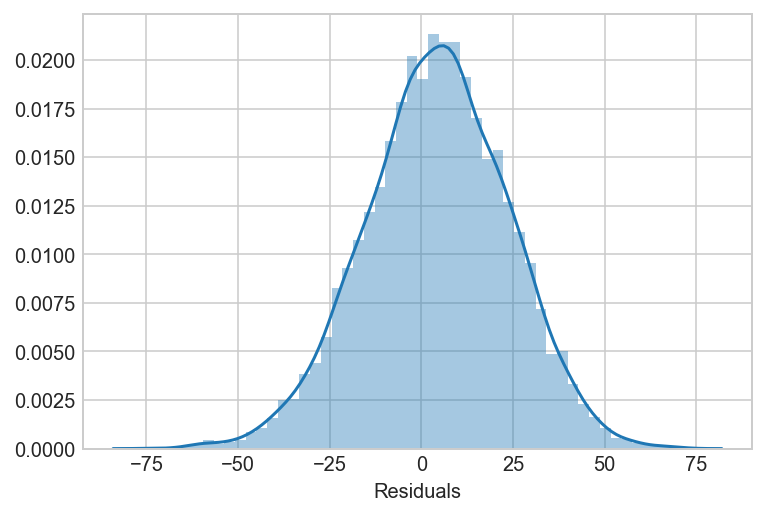


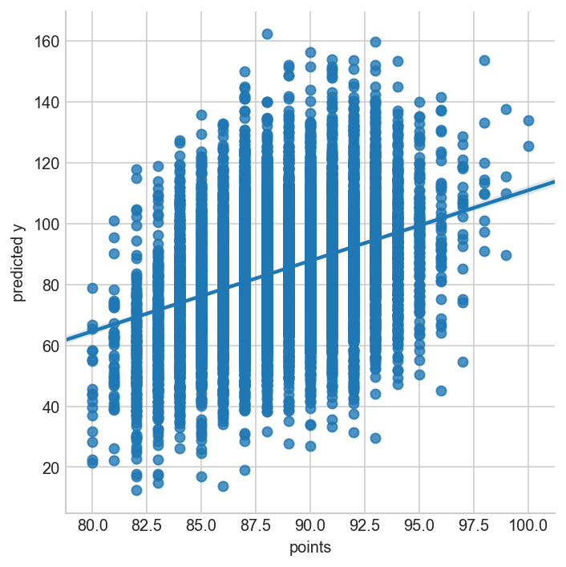


```python
# Run linear regression of words vectoriser scores vs Price 
# choose X and Y for linear regression 

nameX1=input("X feature eg bag of words from vectorizer: ")
namey1 = input('y to be predicted eg price : ')

dataX1 = dfwinerate2.values
datay1 = zz

lregress(dataX1,datay1,nameX1,namey1)

```

    X feature eg bag of words from vectorizer: words
    y to be predicted eg price : price
    


    (<class 'statsmodels.iolib.summary.Summary'>
     """
                                 OLS Regression Results                            
     ==============================================================================
     Dep. Variable:                      y   R-squared:                       0.623
     Model:                            OLS   Adj. R-squared:                  0.602
     Method:                 Least Squares   F-statistic:                     28.71
     Date:                Sun, 27 May 2018   Prob (F-statistic):               0.00
     Time:                        18:24:50   Log-Likelihood:                -44604.
     No. Observations:                9178   AIC:                         9.021e+04
     Df Residuals:                    8678   BIC:                         9.377e+04
     Df Model:                         500                                         
     Covariance Type:            nonrobust                                         
     ==============================================================================
                      coef    std err          t      P>|t|      [0.025      0.975]
     ------------------------------------------------------------------------------
     x1             9.6056      2.641      3.637      0.000       4.428      14.783
     x2            12.5656      2.756      4.559      0.000       7.163      17.968
     x3            -0.0843      2.988     -0.028      0.977      -5.941       5.772
     x4             3.5563      3.018      1.179      0.239      -2.359       9.472
     x5             2.3018      4.160      0.553      0.580      -5.852      10.456
     x6            -1.1620      3.772     -0.308      0.758      -8.556       6.232
     x7             7.5865      4.290      1.768      0.077      -0.824      15.997
     x8            11.8091      3.426      3.447      0.001       5.094      18.524
     x9             8.7416      4.064      2.151      0.032       0.775      16.708
     x10            0.4317      2.931      0.147      0.883      -5.314       6.178
     x11            0.8071      2.851      0.283      0.777      -4.781       6.396
     x12           -1.9582      3.421     -0.572      0.567      -8.664       4.747
     x13            3.6819      3.136      1.174      0.240      -2.466       9.830
     x14            4.1728      0.910      4.584      0.000       2.389       5.957
     x15            4.5721      2.415      1.893      0.058      -0.161       9.306
     x16           -0.8707      2.921     -0.298      0.766      -6.596       4.854
     x17            3.3547      2.877      1.166      0.244      -2.285       8.994
     x18            2.0404      2.524      0.809      0.419      -2.907       6.987
     x19            4.8276      1.765      2.735      0.006       1.367       8.288
     x20            0.0544      2.630      0.021      0.984      -5.101       5.210
     x21            0.6906      2.091      0.330      0.741      -3.408       4.790
     x22           -0.7914      2.180     -0.363      0.717      -5.064       3.481
     x23            0.5896      3.626      0.163      0.871      -6.517       7.696
     x24           -0.5251      2.487     -0.211      0.833      -5.400       4.350
     x25           -2.2386      3.386     -0.661      0.509      -8.876       4.399
     x26            1.2394      2.305      0.538      0.591      -3.278       5.757
     x27           -0.3009      3.480     -0.086      0.931      -7.122       6.520
     x28            7.1877      3.386      2.123      0.034       0.550      13.825
     x29            2.1048      1.376      1.530      0.126      -0.592       4.801
     x30           -3.4660      3.856     -0.899      0.369     -11.024       4.092
     x31           -1.1446      3.122     -0.367      0.714      -7.265       4.976
     x32            2.5922      3.315      0.782      0.434      -3.906       9.090
     x33            3.9894      2.529      1.578      0.115      -0.968       8.947
     x34            0.3000      3.550      0.085      0.933      -6.660       7.260
     x35            0.8093      1.006      0.804      0.421      -1.163       2.782
     x36           -0.5425      3.135     -0.173      0.863      -6.687       5.602
     x37           -2.9425      2.625     -1.121      0.262      -8.087       2.202
     x38            2.4968      3.164      0.789      0.430      -3.705       8.698
     x39           -1.1735      2.236     -0.525      0.600      -5.556       3.209
     x40           -0.4516      3.166     -0.143      0.887      -6.657       5.754
     x41            1.3694      2.235      0.613      0.540      -3.012       5.751
     x42            3.3303      4.236      0.786      0.432      -4.973      11.634
     x43           -1.2530      5.592     -0.224      0.823     -12.215       9.709
     x44           -0.6417      1.708     -0.376      0.707      -3.989       2.706
     x45            0.7961      1.436      0.555      0.579      -2.018       3.610
     x46            0.5871      2.055      0.286      0.775      -3.441       4.615
     x47            4.9835      3.386      1.472      0.141      -1.654      11.621
     x48           16.5021      3.000      5.501      0.000      10.622      22.382
     x49            7.2664      3.408      2.132      0.033       0.586      13.947
     x50            0.0782      3.161      0.025      0.980      -6.119       6.275
     x51           -0.5309      2.662     -0.199      0.842      -5.750       4.688
     x52           -0.7938      1.403     -0.566      0.571      -3.543       1.955
     x53           -2.0526      3.026     -0.678      0.498      -7.985       3.879
     x54           -1.1615      3.067     -0.379      0.705      -7.174       4.851
     x55           -3.3777      3.554     -0.950      0.342     -10.344       3.589
     x56           -0.0633      2.119     -0.030      0.976      -4.217       4.091
     x57           -2.0563      2.981     -0.690      0.490      -7.899       3.787
     x58            3.4816      1.791      1.944      0.052      -0.030       6.993
     x59           -0.5336      1.619     -0.330      0.742      -3.707       2.640
     x60           -2.7809      2.596     -1.071      0.284      -7.870       2.308
     x61            1.2762      1.576      0.810      0.418      -1.813       4.365
     x62           -0.5526      2.312     -0.239      0.811      -5.085       3.980
     x63           -6.5338      3.941     -1.658      0.097     -14.259       1.192
     x64           -5.9517      2.924     -2.035      0.042     -11.684      -0.219
     x65            6.8724      3.672      1.872      0.061      -0.325      14.070
     x66            0.8801      3.298      0.267      0.790      -5.585       7.345
     x67           -4.5661      3.238     -1.410      0.159     -10.913       1.781
     x68            3.7237      2.637      1.412      0.158      -1.445       8.892
     x69            2.0035      1.271      1.576      0.115      -0.488       4.495
     x70            8.8976      3.829      2.324      0.020       1.392      16.403
     x71            5.8849      7.219      0.815      0.415      -8.266      20.036
     x72           -0.6222      1.398     -0.445      0.656      -3.363       2.119
     x73           -0.3830      3.503     -0.109      0.913      -7.249       6.483
     x74            0.8470      2.181      0.388      0.698      -3.428       5.122
     x75            3.9898      1.570      2.541      0.011       0.912       7.067
     x76           -2.4214      3.028     -0.800      0.424      -8.357       3.514
     x77            3.2433      2.362      1.373      0.170      -1.386       7.873
     x78           -0.0556      2.331     -0.024      0.981      -4.624       4.513
     x79           -3.2632      3.219     -1.014      0.311      -9.574       3.047
     x80            3.7493      2.332      1.608      0.108      -0.821       8.320
     x81            5.6363      2.305      2.445      0.015       1.117      10.155
     x82            5.5636      2.502      2.223      0.026       0.658      10.469
     x83           -0.1845      3.668     -0.050      0.960      -7.374       7.005
     x84            2.4374      1.397      1.745      0.081      -0.301       5.176
     x85           -3.7810      3.551     -1.065      0.287     -10.741       3.179
     x86           -0.8874      2.578     -0.344      0.731      -5.941       4.166
     x87           -0.8113      2.815     -0.288      0.773      -6.330       4.708
     x88            7.2018      5.146      1.399      0.162      -2.886      17.290
     x89           -9.4109      6.187     -1.521      0.128     -21.539       2.717
     x90           -2.8085      2.768     -1.015      0.310      -8.234       2.617
     x91            7.7964      2.002      3.894      0.000       3.872      11.721
     x92            1.3483      6.198      0.218      0.828     -10.802      13.498
     x93           -6.1229      5.984     -1.023      0.306     -17.853       5.608
     x94            9.2635      2.864      3.234      0.001       3.649      14.878
     x95            4.9339      3.249      1.519      0.129      -1.435      11.303
     x96           -0.2265      2.546     -0.089      0.929      -5.218       4.765
     x97            9.5768      1.864      5.137      0.000       5.922      13.231
     x98            5.9620      2.159      2.761      0.006       1.729      10.195
     x99           11.3888      2.740      4.157      0.000       6.018      16.760
     x100           2.7072      1.443      1.876      0.061      -0.122       5.536
     x101           1.2481      1.888      0.661      0.508      -2.452       4.948
     x102           4.4424      1.942      2.288      0.022       0.637       8.248
     x103           0.6199      1.110      0.558      0.577      -1.556       2.796
     x104           3.8241      2.680      1.427      0.154      -1.430       9.078
     x105          -0.2822      2.513     -0.112      0.911      -5.208       4.643
     x106           2.3967      3.387      0.708      0.479      -4.244       9.037
     x107          -1.1606      2.729     -0.425      0.671      -6.510       4.188
     x108           4.7905      1.555      3.080      0.002       1.742       7.839
     x109           2.4422      2.123      1.150      0.250      -1.719       6.604
     x110           3.8855      1.379      2.819      0.005       1.183       6.588
     x111          -4.3980      2.662     -1.652      0.098      -9.615       0.819
     x112          -0.9418      1.649     -0.571      0.568      -4.174       2.291
     x113          -1.6968      3.464     -0.490      0.624      -8.487       5.094
     x114           6.2998      2.008      3.138      0.002       2.364      10.235
     x115           0.4171      3.213      0.130      0.897      -5.882       6.716
     x116          11.7008      3.248      3.603      0.000       5.334      18.067
     x117           0.4984      1.803      0.276      0.782      -3.037       4.033
     x118           4.3523      1.896      2.295      0.022       0.635       8.069
     x119           0.2237      2.026      0.110      0.912      -3.748       4.196
     x120          -0.5098      2.164     -0.236      0.814      -4.751       3.731
     x121           6.3937      2.212      2.891      0.004       2.059      10.729
     x122           5.5689      1.677      3.322      0.001       2.282       8.855
     x123           8.0193      2.084      3.848      0.000       3.935      12.104
     x124           8.4840      1.653      5.133      0.000       5.244      11.724
     x125           5.1997      2.380      2.185      0.029       0.535       9.864
     x126           1.1579      2.705      0.428      0.669      -4.144       6.460
     x127           1.0302      2.035      0.506      0.613      -2.959       5.019
     x128           3.4778      2.140      1.625      0.104      -0.717       7.672
     x129           0.7289      1.923      0.379      0.705      -3.041       4.498
     x130           0.9229      1.381      0.668      0.504      -1.784       3.630
     x131          -2.0781      3.181     -0.653      0.514      -8.314       4.158
     x132           5.4146      2.498      2.167      0.030       0.517      10.312
     x133           4.5848      2.836      1.616      0.106      -0.975      10.145
     x134           4.5640      3.033      1.505      0.132      -1.382      10.510
     x135          -2.5000      2.813     -0.889      0.374      -8.015       3.015
     x136           2.1266      1.327      1.603      0.109      -0.474       4.727
     x137           5.4728      3.466      1.579      0.114      -1.322      12.268
     x138          -3.5456      3.593     -0.987      0.324     -10.589       3.498
     x139           4.2872      2.340      1.832      0.067      -0.301       8.875
     x140          10.4116      2.723      3.824      0.000       5.074      15.749
     x141           7.4540      1.722      4.327      0.000       4.078      10.831
     x142           3.5830      2.949      1.215      0.224      -2.197       9.363
     x143           4.6823      1.982      2.362      0.018       0.797       8.568
     x144           2.5674      2.652      0.968      0.333      -2.631       7.766
     x145           1.6016      3.160      0.507      0.612      -4.594       7.797
     x146          -1.0944      3.139     -0.349      0.727      -7.247       5.059
     x147           3.5772      2.832      1.263      0.207      -1.974       9.129
     x148           5.5510      3.018      1.839      0.066      -0.365      11.467
     x149           8.3436      1.456      5.732      0.000       5.490      11.197
     x150           3.9505      1.097      3.600      0.000       1.800       6.101
     x151          -8.1181      5.051     -1.607      0.108     -18.019       1.782
     x152           7.4041      4.671      1.585      0.113      -1.753      16.561
     x153           1.6343      5.053      0.323      0.746      -8.270      11.539
     x154          18.3639      4.907      3.743      0.000       8.746      27.982
     x155           0.2867      2.199      0.130      0.896      -4.023       4.596
     x156          -2.2010      2.907     -0.757      0.449      -7.900       3.498
     x157          -0.0194      1.005     -0.019      0.985      -1.989       1.950
     x158           0.9029      2.483      0.364      0.716      -3.965       5.771
     x159           3.2780      1.933      1.696      0.090      -0.510       7.066
     x160           0.9921      1.755      0.565      0.572      -2.448       4.432
     x161          -3.6522      1.834     -1.991      0.046      -7.247      -0.057
     x162           1.3192      2.247      0.587      0.557      -3.086       5.724
     x163           9.4665      2.754      3.437      0.001       4.068      14.865
     x164           4.1935      1.747      2.400      0.016       0.769       7.618
     x165           4.0073      3.347      1.197      0.231      -2.553      10.568
     x166           0.6875      2.544      0.270      0.787      -4.299       5.675
     x167           2.8135      3.037      0.926      0.354      -3.140       8.767
     x168          12.8469      2.510      5.119      0.000       7.927      17.767
     x169          -1.6392      2.232     -0.734      0.463      -6.015       2.737
     x170           2.6244      2.896      0.906      0.365      -3.052       8.301
     x171           9.4174      2.734      3.444      0.001       4.058      14.777
     x172          11.0279      3.249      3.395      0.001       4.660      17.396
     x173           2.1295      2.149      0.991      0.322      -2.083       6.342
     x174           0.3787      1.961      0.193      0.847      -3.466       4.223
     x175          -5.0468      3.613     -1.397      0.163     -12.129       2.036
     x176          -1.2137      1.633     -0.743      0.457      -4.415       1.988
     x177          -6.5691      7.581     -0.867      0.386     -21.429       8.291
     x178           3.4123      0.921      3.704      0.000       1.606       5.218
     x179          -8.9432      2.848     -3.140      0.002     -14.527      -3.360
     x180          -0.2911      1.984     -0.147      0.883      -4.180       3.598
     x181           2.3384      2.989      0.782      0.434      -3.521       8.198
     x182          -0.3769      1.573     -0.240      0.811      -3.460       2.706
     x183          -4.0029      2.978     -1.344      0.179      -9.841       1.835
     x184           2.0110      1.671      1.203      0.229      -1.265       5.286
     x185          -2.6693      3.435     -0.777      0.437      -9.402       4.063
     x186           0.2501      0.778      0.321      0.748      -1.275       1.776
     x187          -4.2235      3.141     -1.345      0.179     -10.381       1.934
     x188          -5.1142      3.548     -1.441      0.149     -12.069       1.840
     x189           2.4326      2.291      1.062      0.288      -2.058       6.923
     x190           3.7314      3.715      1.004      0.315      -3.551      11.013
     x191          -0.9294      3.345     -0.278      0.781      -7.486       5.628
     x192           1.4933      3.364      0.444      0.657      -5.101       8.088
     x193           9.3142      2.595      3.589      0.000       4.227      14.401
     x194           1.9192      2.919      0.657      0.511      -3.804       7.642
     x195           8.6223      3.047      2.830      0.005       2.649      14.595
     x196          -0.7716      2.243     -0.344      0.731      -5.168       3.625
     x197          -0.4464      5.440     -0.082      0.935     -11.110      10.217
     x198          -8.6555      5.295     -1.635      0.102     -19.034       1.723
     x199          12.5895      6.325      1.991      0.047       0.192      24.987
     x200           0.1520      1.096      0.139      0.890      -1.996       2.300
     x201          -4.7398      3.515     -1.349      0.178     -11.630       2.150
     x202           6.8866      2.108      3.267      0.001       2.754      11.019
     x203           5.0244      0.784      6.407      0.000       3.487       6.562
     x204          -6.3005      3.437     -1.833      0.067     -13.038       0.437
     x205          -2.2394      1.693     -1.323      0.186      -5.558       1.079
     x206           2.0271      2.958      0.685      0.493      -3.772       7.826
     x207           0.0610      1.683      0.036      0.971      -3.237       3.359
     x208           0.5827      1.537      0.379      0.705      -2.431       3.596
     x209          -2.8533      3.342     -0.854      0.393      -9.405       3.699
     x210          -1.6472      2.336     -0.705      0.481      -6.227       2.933
     x211          -0.5145      2.344     -0.219      0.826      -5.110       4.081
     x212          -2.7770      2.861     -0.971      0.332      -8.385       2.831
     x213           5.5457      2.329      2.381      0.017       0.980      10.112
     x214          -0.5405      1.290     -0.419      0.675      -3.070       1.989
     x215          15.0279     11.796      1.274      0.203      -8.095      38.150
     x216         -15.1469     10.547     -1.436      0.151     -35.821       5.527
     x217           0.9367      3.050      0.307      0.759      -5.041       6.915
     x218           2.3524      2.177      1.081      0.280      -1.914       6.619
     x219          -4.0382      2.392     -1.688      0.091      -8.727       0.651
     x220           0.9012      3.411      0.264      0.792      -5.784       7.587
     x221           4.1447      1.846      2.245      0.025       0.526       7.763
     x222           0.7791      1.480      0.526      0.599      -2.123       3.681
     x223           1.0318      3.376      0.306      0.760      -5.586       7.650
     x224          -0.1593      2.919     -0.055      0.956      -5.881       5.562
     x225           2.3261      2.703      0.860      0.390      -2.973       7.625
     x226           4.5726      3.193      1.432      0.152      -1.686      10.831
     x227           2.1378      2.453      0.872      0.383      -2.670       6.946
     x228           2.3656      3.482      0.679      0.497      -4.460       9.192
     x229           5.6571      2.432      2.326      0.020       0.890      10.424
     x230           3.9180      1.684      2.327      0.020       0.618       7.218
     x231          -0.8577      1.455     -0.589      0.556      -3.710       1.995
     x232          -1.8468      1.966     -0.939      0.348      -5.701       2.008
     x233           4.6864      2.004      2.339      0.019       0.758       8.615
     x234          -0.9982      1.760     -0.567      0.571      -4.449       2.452
     x235          -0.0899      1.797     -0.050      0.960      -3.612       3.432
     x236          10.9387      2.321      4.714      0.000       6.390      15.487
     x237           4.1636      3.422      1.217      0.224      -2.544      10.871
     x238           1.1019      3.189      0.346      0.730      -5.149       7.352
     x239          -1.0120      3.002     -0.337      0.736      -6.896       4.872
     x240           1.6738      2.882      0.581      0.561      -3.975       7.323
     x241           3.1271      1.987      1.574      0.116      -0.767       7.021
     x242          13.1795      2.980      4.422      0.000       7.337      19.022
     x243          -0.5701      3.145     -0.181      0.856      -6.735       5.595
     x244           3.4268      2.333      1.469      0.142      -1.146       7.999
     x245           2.9811      2.181      1.367      0.172      -1.294       7.256
     x246           1.1708      3.366      0.348      0.728      -5.427       7.769
     x247          -3.9742      1.375     -2.890      0.004      -6.670      -1.279
     x248           2.2229      1.476      1.506      0.132      -0.670       5.116
     x249           1.3982      2.772      0.504      0.614      -4.036       6.832
     x250           1.9034      2.329      0.817      0.414      -2.663       6.469
     x251          -1.1168      2.423     -0.461      0.645      -5.867       3.633
     x252          11.0751      4.378      2.530      0.011       2.493      19.657
     x253          -1.9416      3.188     -0.609      0.543      -8.192       4.308
     x254           1.2290      2.667      0.461      0.645      -3.999       6.457
     x255           4.7958      1.826      2.626      0.009       1.216       8.375
     x256          -0.5380      1.433     -0.375      0.707      -3.347       2.271
     x257           2.8613      3.272      0.874      0.382      -3.553       9.276
     x258           1.3694      3.271      0.419      0.675      -5.043       7.782
     x259           2.2857      1.680      1.361      0.174      -1.008       5.579
     x260           0.1763      1.221      0.144      0.885      -2.217       2.570
     x261          -1.7330      2.288     -0.757      0.449      -6.218       2.752
     x262           0.1189      1.385      0.086      0.932      -2.596       2.834
     x263          -2.2768      1.671     -1.362      0.173      -5.553       0.999
     x264          -6.9845      2.709     -2.578      0.010     -12.296      -1.673
     x265          -0.2263      1.829     -0.124      0.902      -3.811       3.358
     x266          -0.9409      2.075     -0.453      0.650      -5.009       3.127
     x267           2.8617      3.697      0.774      0.439      -4.386      10.109
     x268          11.7655      1.716      6.856      0.000       8.402      15.129
     x269         -10.9756      3.340     -3.286      0.001     -17.523      -4.428
     x270           2.8943      3.473      0.833      0.405      -3.914       9.703
     x271          -2.9192      2.643     -1.105      0.269      -8.100       2.262
     x272          -3.3156      2.545     -1.303      0.193      -8.305       1.674
     x273          -1.9034      2.289     -0.831      0.406      -6.391       2.584
     x274          -1.7044      2.278     -0.748      0.454      -6.169       2.761
     x275           0.9681      2.543      0.381      0.703      -4.016       5.952
     x276          -1.6245      3.224     -0.504      0.614      -7.944       4.695
     x277          -2.7809      2.424     -1.147      0.251      -7.533       1.971
     x278           2.7970      2.629      1.064      0.287      -2.357       7.951
     x279           5.9474      2.559      2.324      0.020       0.932      10.963
     x280          -4.7094      2.475     -1.903      0.057      -9.561       0.143
     x281           0.6607      3.478      0.190      0.849      -6.158       7.479
     x282          -2.0993      2.270     -0.925      0.355      -6.549       2.350
     x283           6.3853      3.310      1.929      0.054      -0.103      12.874
     x284          -0.2451      1.703     -0.144      0.886      -3.584       3.094
     x285           6.9770      3.094      2.255      0.024       0.911      13.043
     x286          -2.9062      3.672     -0.791      0.429     -10.105       4.293
     x287           2.7469      1.816      1.512      0.130      -0.814       6.307
     x288           8.6561      2.090      4.141      0.000       4.558      12.754
     x289           1.1933      2.491      0.479      0.632      -3.690       6.077
     x290           3.4475      2.251      1.532      0.126      -0.965       7.860
     x291           5.7810      2.216      2.609      0.009       1.437      10.125
     x292           0.4063      3.081      0.132      0.895      -5.634       6.446
     x293           0.9327      1.569      0.595      0.552      -2.142       4.007
     x294           0.7600      1.886      0.403      0.687      -2.937       4.457
     x295           4.5373      2.514      1.805      0.071      -0.391       9.465
     x296           4.6087      2.397      1.923      0.055      -0.090       9.307
     x297           0.3551      5.512      0.064      0.949     -10.451      11.161
     x298          -3.7886      4.201     -0.902      0.367     -12.024       4.446
     x299          -3.4222      2.170     -1.577      0.115      -7.676       0.832
     x300          -3.3467      2.447     -1.367      0.172      -8.144       1.451
     x301          -0.7174     14.855     -0.048      0.961     -29.836      28.402
     x302          -0.2393      1.297     -0.184      0.854      -2.783       2.304
     x303           0.9521      2.981      0.319      0.749      -4.891       6.795
     x304          -1.8685      1.798     -1.039      0.299      -5.393       1.657
     x305          -0.0843      1.010     -0.083      0.933      -2.065       1.896
     x306           2.7904      1.053      2.650      0.008       0.726       4.855
     x307           4.2844      3.367      1.272      0.203      -2.316      10.885
     x308          -0.0772      2.157     -0.036      0.971      -4.306       4.151
     x309           5.1586      2.566      2.010      0.044       0.128      10.189
     x310           4.0773      1.684      2.421      0.015       0.776       7.379
     x311          -5.5709      2.956     -1.885      0.059     -11.365       0.223
     x312           0.5432      2.793      0.195      0.846      -4.931       6.017
     x313           3.8018      2.863      1.328      0.184      -1.810       9.413
     x314          10.1940      2.018      5.051      0.000       6.238      14.150
     x315          20.7387      3.480      5.959      0.000      13.916      27.561
     x316           7.8832      1.835      4.296      0.000       4.286      11.480
     x317           0.1949      3.023      0.064      0.949      -5.732       6.121
     x318           0.7736      2.605      0.297      0.767      -4.334       5.881
     x319          -0.2768      3.249     -0.085      0.932      -6.645       6.091
     x320           2.6593      0.981      2.711      0.007       0.736       4.582
     x321          -3.5307      4.566     -0.773      0.439     -12.481       5.420
     x322          -3.9466      3.228     -1.222      0.222     -10.275       2.382
     x323          -1.0965      1.663     -0.659      0.510      -4.357       2.164
     x324           1.9799      1.661      1.192      0.233      -1.275       5.235
     x325          -0.6597      2.863     -0.230      0.818      -6.271       4.952
     x326           0.1256      1.806      0.070      0.945      -3.414       3.665
     x327           3.3996      2.668      1.274      0.203      -1.831       8.630
     x328           1.1837      2.588      0.457      0.647      -3.890       6.257
     x329         -17.4144     32.770     -0.531      0.595     -81.652      46.823
     x330          34.4340     39.331      0.876      0.381     -42.663     111.531
     x331           6.4678     13.316      0.486      0.627     -19.634      32.569
     x332         -30.3095     40.386     -0.750      0.453    -109.476      48.857
     x333           3.1235      2.949      1.059      0.290      -2.657       8.904
     x334           1.9679      2.057      0.957      0.339      -2.065       6.001
     x335           0.8122      3.372      0.241      0.810      -5.797       7.422
     x336           0.2327      2.128      0.109      0.913      -3.939       4.405
     x337           2.3792     15.043      0.158      0.874     -27.108      31.867
     x338           3.1150      2.790      1.117      0.264      -2.353       8.583
     x339           0.0992      2.043      0.049      0.961      -3.905       4.103
     x340           0.9068      1.270      0.714      0.475      -1.583       3.397
     x341          -2.8081      3.384     -0.830      0.407      -9.442       3.826
     x342           0.8931      3.488      0.256      0.798      -5.943       7.730
     x343          -0.5881      3.031     -0.194      0.846      -6.530       5.354
     x344          10.4653      3.311      3.161      0.002       3.975      16.955
     x345           3.4325      2.582      1.330      0.184      -1.628       8.493
     x346           4.2352      3.181      1.331      0.183      -2.001      10.472
     x347           6.9837      3.412      2.047      0.041       0.295      13.672
     x348           7.9397      2.468      3.217      0.001       3.102      12.777
     x349          12.6770      2.340      5.418      0.000       8.090      17.264
     x350          -0.6465      1.993     -0.324      0.746      -4.554       3.261
     x351          -4.4703      2.465     -1.813      0.070      -9.303       0.362
     x352           2.5179      3.361      0.749      0.454      -4.070       9.106
     x353           2.7414      3.202      0.856      0.392      -3.535       9.018
     x354           7.1678      3.325      2.156      0.031       0.650      13.685
     x355           0.8749      2.395      0.365      0.715      -3.820       5.570
     x356           2.4390      3.336      0.731      0.465      -4.100       8.978
     x357           2.3859      2.717      0.878      0.380      -2.940       7.711
     x358           0.4884      2.105      0.232      0.817      -3.638       4.615
     x359          -2.1740      3.516     -0.618      0.536      -9.065       4.717
     x360           2.4182      3.386      0.714      0.475      -4.219       9.055
     x361           1.5520      2.990      0.519      0.604      -4.310       7.414
     x362           2.0365      1.557      1.308      0.191      -1.015       5.088
     x363           2.8679      3.420      0.838      0.402      -3.837       9.573
     x364           6.4941      3.860      1.683      0.092      -1.072      14.060
     x365         -10.6595      4.511     -2.363      0.018     -19.502      -1.817
     x366           0.0743      3.439      0.022      0.983      -6.668       6.816
     x367          -1.8804      1.341     -1.403      0.161      -4.508       0.748
     x368           0.9884      2.932      0.337      0.736      -4.759       6.736
     x369           4.0483      2.888      1.402      0.161      -1.613       9.710
     x370          -1.7873      4.321     -0.414      0.679     -10.258       6.683
     x371           3.5831      2.781      1.288      0.198      -1.869       9.035
     x372           4.5698      3.592      1.272      0.203      -2.471      11.610
     x373           5.8587      3.887      1.507      0.132      -1.760      13.477
     x374          -1.9335      2.360     -0.819      0.413      -6.561       2.694
     x375           4.6106      1.025      4.500      0.000       2.602       6.619
     x376           7.3338      1.865      3.932      0.000       3.678      10.990
     x377          -5.6500      2.351     -2.403      0.016     -10.258      -1.042
     x378           2.2642      2.534      0.894      0.372      -2.703       7.231
     x379           0.9951      0.920      1.081      0.280      -0.809       2.799
     x380          -5.0288      3.538     -1.421      0.155     -11.964       1.907
     x381           2.2896      2.912      0.786      0.432      -3.419       7.998
     x382           2.2188      3.321      0.668      0.504      -4.291       8.728
     x383           1.3445      2.288      0.588      0.557      -3.141       5.830
     x384           3.9778      2.587      1.538      0.124      -1.093       9.049
     x385          -4.9146      2.821     -1.742      0.081     -10.443       0.614
     x386          -2.3191      2.043     -1.135      0.256      -6.323       1.685
     x387           5.8776      2.599      2.262      0.024       0.784      10.972
     x388           1.8713      3.098      0.604      0.546      -4.201       7.944
     x389           7.5488      3.023      2.497      0.013       1.622      13.475
     x390           0.6012      3.229      0.186      0.852      -5.729       6.931
     x391          -4.4394      2.605     -1.704      0.088      -9.546       0.667
     x392           1.9672      5.448      0.361      0.718      -8.711      12.646
     x393          -7.9602      9.625     -0.827      0.408     -26.828      10.907
     x394           3.4305      1.830      1.875      0.061      -0.157       7.018
     x395           2.6569      2.161      1.229      0.219      -1.580       6.894
     x396           6.4789      3.548      1.826      0.068      -0.475      13.433
     x397           1.9957      2.475      0.806      0.420      -2.856       6.848
     x398          -1.6574      3.413     -0.486      0.627      -8.349       5.034
     x399           3.0322      2.028      1.495      0.135      -0.943       7.008
     x400           1.6065      1.302      1.234      0.217      -0.946       4.159
     x401           7.7393      2.157      3.588      0.000       3.512      11.967
     x402          -0.3572      2.254     -0.158      0.874      -4.776       4.062
     x403           1.5035      3.670      0.410      0.682      -5.691       8.698
     x404          23.4115     37.949      0.617      0.537     -50.977      97.800
     x405           1.8075      3.172      0.570      0.569      -4.410       8.025
     x406           0.7394      1.691      0.437      0.662      -2.575       4.054
     x407           9.3250      3.476      2.683      0.007       2.511      16.139
     x408          -2.4379      3.453     -0.706      0.480      -9.207       4.331
     x409          -0.3303      2.241     -0.147      0.883      -4.723       4.062
     x410           2.5012      1.883      1.328      0.184      -1.191       6.193
     x411           1.2327      1.493      0.826      0.409      -1.694       4.159
     x412           5.3433      1.166      4.581      0.000       3.057       7.630
     x413          -5.9927      3.675     -1.631      0.103     -13.196       1.211
     x414           3.9420      2.039      1.933      0.053      -0.055       7.939
     x415           3.0811      3.175      0.970      0.332      -3.143       9.306
     x416           2.9272      2.624      1.116      0.265      -2.216       8.070
     x417          -1.5223      1.117     -1.363      0.173      -3.712       0.667
     x418           0.9461      2.947      0.321      0.748      -4.832       6.724
     x419           1.2872      2.597      0.496      0.620      -3.803       6.378
     x420          -0.5126      1.482     -0.346      0.729      -3.418       2.392
     x421           4.8466      2.951      1.642      0.101      -0.938      10.631
     x422          -9.7811      4.522     -2.163      0.031     -18.645      -0.917
     x423          -0.6304      3.204     -0.197      0.844      -6.911       5.650
     x424           4.2278      1.758      2.405      0.016       0.781       7.674
     x425           2.7000      3.396      0.795      0.427      -3.956       9.356
     x426           0.4703      2.223      0.212      0.832      -3.887       4.827
     x427           7.3824      1.490      4.956      0.000       4.462      10.303
     x428           6.5615      2.000      3.281      0.001       2.641      10.482
     x429           2.0455      1.525      1.341      0.180      -0.944       5.035
     x430           1.4699      2.537      0.579      0.562      -3.503       6.443
     x431           5.5160      2.859      1.930      0.054      -0.088      11.120
     x432          -0.7663      3.219     -0.238      0.812      -7.076       5.544
     x433           4.3129      2.609      1.653      0.098      -0.800       9.426
     x434           3.3990      1.100      3.090      0.002       1.243       5.555
     x435          10.0795      2.618      3.850      0.000       4.948      15.211
     x436          -1.5210      1.589     -0.957      0.338      -4.636       1.593
     x437          12.5355      2.764      4.535      0.000       7.117      17.954
     x438           2.3428      2.197      1.066      0.286      -1.964       6.650
     x439           2.4772      1.533      1.616      0.106      -0.527       5.481
     x440           6.8699      2.806      2.448      0.014       1.369      12.371
     x441           5.0053      1.003      4.989      0.000       3.039       6.972
     x442          -4.4650      3.919     -1.139      0.255     -12.147       3.217
     x443           1.3175      1.588      0.830      0.407      -1.794       4.430
     x444           2.9778      2.958      1.007      0.314      -2.821       8.777
     x445           0.1169      2.153      0.054      0.957      -4.104       4.337
     x446          -1.4081      3.452     -0.408      0.683      -8.176       5.359
     x447           6.5155      3.372      1.932      0.053      -0.095      13.126
     x448           3.9741      2.677      1.485      0.138      -1.273       9.221
     x449           2.3986      1.280      1.874      0.061      -0.111       4.908
     x450           0.2148      2.314      0.093      0.926      -4.320       4.750
     x451           2.4696      1.713      1.442      0.149      -0.888       5.827
     x452           5.4330      3.012      1.804      0.071      -0.471      11.337
     x453           6.2892      1.900      3.310      0.001       2.564      10.014
     x454           5.4925      1.862      2.950      0.003       1.842       9.143
     x455           4.2197      2.456      1.718      0.086      -0.595       9.034
     x456           2.3955      2.291      1.046      0.296      -2.096       6.887
     x457           7.0733      1.727      4.095      0.000       3.688      10.459
     x458          -1.2975      3.183     -0.408      0.684      -7.537       4.942
     x459           8.8419      3.067      2.883      0.004       2.829      14.855
     x460          -0.9124      1.415     -0.645      0.519      -3.686       1.861
     x461          -1.0194      3.359     -0.303      0.762      -7.605       5.566
     x462           3.0084      3.005      1.001      0.317      -2.882       8.899
     x463          -4.2415      4.195     -1.011      0.312     -12.464       3.981
     x464           3.6137      2.295      1.574      0.115      -0.886       8.113
     x465         -11.4372      3.518     -3.251      0.001     -18.334      -4.540
     x466          -0.5253      1.232     -0.427      0.670      -2.939       1.889
     x467          -2.0790      3.153     -0.659      0.510      -8.260       4.102
     x468           5.0736      3.339      1.520      0.129      -1.471      11.618
     x469           8.2142      2.676      3.070      0.002       2.969      13.459
     x470         -13.6705     21.487     -0.636      0.525     -55.790      28.449
     x471          -3.8674      2.836     -1.363      0.173      -9.428       1.693
     x472           2.4016      3.265      0.736      0.462      -3.999       8.802
     x473           8.5657      1.539      5.567      0.000       5.549      11.582
     x474           7.8492      2.700      2.907      0.004       2.557      13.141
     x475           4.8846      1.867      2.617      0.009       1.225       8.544
     x476          -4.1547      3.042     -1.366      0.172     -10.117       1.808
     x477           1.3969      2.395      0.583      0.560      -3.298       6.092
     x478           6.8576      2.513      2.729      0.006       1.931      11.784
     x479           3.0292      2.214      1.368      0.171      -1.311       7.369
     x480           2.2556      3.028      0.745      0.456      -3.681       8.192
     x481          -1.4365      3.091     -0.465      0.642      -7.496       4.623
     x482           0.1345      1.615      0.083      0.934      -3.032       3.301
     x483           1.0130      3.458      0.293      0.770      -5.765       7.791
     x484           3.6544      2.010      1.818      0.069      -0.286       7.595
     x485           3.5140      0.585      6.007      0.000       2.367       4.661
     x486          -2.7110      3.397     -0.798      0.425      -9.371       3.949
     x487           4.4051      3.033      1.452      0.146      -1.541      10.351
     x488           3.0300      2.867      1.057      0.291      -2.591       8.651
     x489           6.9337      2.515      2.757      0.006       2.004      11.863
     x490           4.2265      2.326      1.817      0.069      -0.334       8.787
     x491           3.3791      1.766      1.913      0.056      -0.083       6.841
     x492           2.5694      4.311      0.596      0.551      -5.882      11.021
     x493           4.5382      3.493      1.299      0.194      -2.308      11.385
     x494           4.1239      2.585      1.595      0.111      -0.944       9.191
     x495           8.9074      1.449      6.148      0.000       6.067      11.747
     x496           0.0171      2.516      0.007      0.995      -4.915       4.949
     x497          -2.7614      1.783     -1.548      0.122      -6.257       0.734
     x498           1.1143      2.758      0.404      0.686      -4.291       6.520
     x499          -3.8866      2.446     -1.589      0.112      -8.681       0.908
     x500           0.6928      3.225      0.215      0.830      -5.630       7.016
     ==============================================================================
     Omnibus:                    11900.425   Durbin-Watson:                   1.993
     Prob(Omnibus):                  0.000   Jarque-Bera (JB):          4088433.438
     Skew:                           7.000   Prob(JB):                         0.00
     Kurtosis:                     105.445   Cond. No.                         318.
     ==============================================================================
     
     Warnings:
     [1] Standard Errors assume that the covariance matrix of the errors is correctly specified.
     """, <seaborn.axisgrid.FacetGrid at 0x212bea62198>)


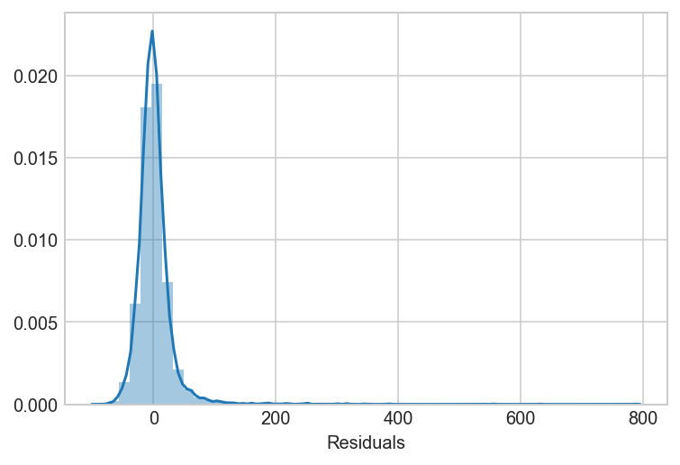


```python
# set up OVR logit regression for wine varieties using the word counts 

def logregress(grape_variety):
    from sklearn.model_selection import train_test_split
    from sklearn.linear_model import LogisticRegressionCV
    from sklearn.model_selection import train_test_split
    from sklearn.metrics import accuracy_score

    # split data into Train and Test for  X and y_
    X = dfwinerate2.values  # array of 16345 rows x 500 words 
    # y = winevariety[u'grapevar__Barbera'] #array of  16345 rows x 1 for points 
    y = winevariety[grape_variety].values #array of  16345 rows x 1 for points 

    # split the new DataFrame into training and testing sets
    X_train, X_test, y_train, y_test = train_test_split(X, y, random_state=1,train_size=0.5)

    # Run Multinomial  Logit regression to check if description  terms can be used to predict variety  

#     model=LogisticRegression(multi_class='ovr',solver ='newton-cg').fit(X_train,y_train)
    model=LogisticRegressionCV(multi_class='ovr',solver ='liblinear',penalty='l1',Cs=100,cv=5).fit(X_train,y_train)
    # print model.summary()
    yhat = model.predict(X_test)  # will output array with integer values.

#     print (yhat, model.coef_,model.score, accuracy_score(y_test, yhat))
    
    # change the array into a list 
    import numpy as np
    modelcoef=np.array(model.coef_).tolist()
    len(modelcoef)
    len(countfeatures)
    
    # split the list into individual items
    import itertools
    words = list(itertools.chain(*modelcoef))
#     words
    
#     setup a dictionary with word counts and word labels
    varietydict = dict(zip(countfeatures,words))
#     varietydict

# add accuracy score and wine variety to dictionary
    varietydict['0Accuracy'] = accuracy_score(y_test, yhat)*100
   
#     varietydict
# sort the words with largest word counts first 
    sorted_d = sorted(varietydict.items(), key=lambda x: x[1],reverse=True)
#     sorted_d
    varietydict['0Grape'] = grape_variety

    # Calculate the confusion matrix metrics for your model below.¶
    from sklearn.metrics import classification_report
    print(grape_variety,'\n',classification_report(y_test, yhat))
    

#     get top 50 words scores 
    results=[grape_variety]+sorted_d[:500]
    return results
```


```python
# Run logit regression of words vectoriser scores vs variety of grapes for all grapes variety

# choose X and Y for linear regression 
dfwinefinal= pd.DataFrame()

for w in winevariety:
    #     print(w)
    # grapename = input('enter grape variety:')
#     ugrape='grapevar__'+grapename
    ugrape=w

    dfwinefinal[ugrape]=logregress(ugrape)
dfwinefinal
```


```python
# choose X and Y for linear regression using price and words 

nameX=input("X feature eg words: ")
namey = input('y to be predicted eg price: ')

# dataX = winetrim[nameX]
dataX=dfwinerate2.values
datay = winetrim[namey]

lregress(dataX,datay,nameX,namey)
```

    X feature eg words: words
    y to be predicted eg price: price
    


    (<class 'statsmodels.iolib.summary.Summary'>
     """
                                 OLS Regression Results                            
     ==============================================================================
     Dep. Variable:                  price   R-squared:                       0.623
     Model:                            OLS   Adj. R-squared:                  0.602
     Method:                 Least Squares   F-statistic:                     28.71
     Date:                Sun, 27 May 2018   Prob (F-statistic):               0.00
     Time:                        21:19:32   Log-Likelihood:                -44604.
     No. Observations:                9178   AIC:                         9.021e+04
     Df Residuals:                    8678   BIC:                         9.377e+04
     Df Model:                         500                                         
     Covariance Type:            nonrobust                                         
     ==============================================================================
                      coef    std err          t      P>|t|      [0.025      0.975]
     ------------------------------------------------------------------------------
     x1             9.6056      2.641      3.637      0.000       4.428      14.783
     x2            12.5656      2.756      4.559      0.000       7.163      17.968
     x3            -0.0843      2.988     -0.028      0.977      -5.941       5.772
     x4             3.5563      3.018      1.179      0.239      -2.359       9.472
     x5             2.3018      4.160      0.553      0.580      -5.852      10.456
     x6            -1.1620      3.772     -0.308      0.758      -8.556       6.232
     x7             7.5865      4.290      1.768      0.077      -0.824      15.997
     x8            11.8091      3.426      3.447      0.001       5.094      18.524
     x9             8.7416      4.064      2.151      0.032       0.775      16.708
     x10            0.4317      2.931      0.147      0.883      -5.314       6.178
     x11            0.8071      2.851      0.283      0.777      -4.781       6.396
     x12           -1.9582      3.421     -0.572      0.567      -8.664       4.747
     x13            3.6819      3.136      1.174      0.240      -2.466       9.830
     x14            4.1728      0.910      4.584      0.000       2.389       5.957
     x15            4.5721      2.415      1.893      0.058      -0.161       9.306
     x16           -0.8707      2.921     -0.298      0.766      -6.596       4.854
     x17            3.3547      2.877      1.166      0.244      -2.285       8.994
     x18            2.0404      2.524      0.809      0.419      -2.907       6.987
     x19            4.8276      1.765      2.735      0.006       1.367       8.288
     x20            0.0544      2.630      0.021      0.984      -5.101       5.210
     x21            0.6906      2.091      0.330      0.741      -3.408       4.790
     x22           -0.7914      2.180     -0.363      0.717      -5.064       3.481
     x23            0.5896      3.626      0.163      0.871      -6.517       7.696
     x24           -0.5251      2.487     -0.211      0.833      -5.400       4.350
     x25           -2.2386      3.386     -0.661      0.509      -8.876       4.399
     x26            1.2394      2.305      0.538      0.591      -3.278       5.757
     x27           -0.3009      3.480     -0.086      0.931      -7.122       6.520
     x28            7.1877      3.386      2.123      0.034       0.550      13.825
     x29            2.1048      1.376      1.530      0.126      -0.592       4.801
     x30           -3.4660      3.856     -0.899      0.369     -11.024       4.092
     x31           -1.1446      3.122     -0.367      0.714      -7.265       4.976
     x32            2.5922      3.315      0.782      0.434      -3.906       9.090
     x33            3.9894      2.529      1.578      0.115      -0.968       8.947
     x34            0.3000      3.550      0.085      0.933      -6.660       7.260
     x35            0.8093      1.006      0.804      0.421      -1.163       2.782
     x36           -0.5425      3.135     -0.173      0.863      -6.687       5.602
     x37           -2.9425      2.625     -1.121      0.262      -8.087       2.202
     x38            2.4968      3.164      0.789      0.430      -3.705       8.698
     x39           -1.1735      2.236     -0.525      0.600      -5.556       3.209
     x40           -0.4516      3.166     -0.143      0.887      -6.657       5.754
     x41            1.3694      2.235      0.613      0.540      -3.012       5.751
     x42            3.3303      4.236      0.786      0.432      -4.973      11.634
     x43           -1.2530      5.592     -0.224      0.823     -12.215       9.709
     x44           -0.6417      1.708     -0.376      0.707      -3.989       2.706
     x45            0.7961      1.436      0.555      0.579      -2.018       3.610
     x46            0.5871      2.055      0.286      0.775      -3.441       4.615
     x47            4.9835      3.386      1.472      0.141      -1.654      11.621
     x48           16.5021      3.000      5.501      0.000      10.622      22.382
     x49            7.2664      3.408      2.132      0.033       0.586      13.947
     x50            0.0782      3.161      0.025      0.980      -6.119       6.275
     x51           -0.5309      2.662     -0.199      0.842      -5.750       4.688
     x52           -0.7938      1.403     -0.566      0.571      -3.543       1.955
     x53           -2.0526      3.026     -0.678      0.498      -7.985       3.879
     x54           -1.1615      3.067     -0.379      0.705      -7.174       4.851
     x55           -3.3777      3.554     -0.950      0.342     -10.344       3.589
     x56           -0.0633      2.119     -0.030      0.976      -4.217       4.091
     x57           -2.0563      2.981     -0.690      0.490      -7.899       3.787
     x58            3.4816      1.791      1.944      0.052      -0.030       6.993
     x59           -0.5336      1.619     -0.330      0.742      -3.707       2.640
     x60           -2.7809      2.596     -1.071      0.284      -7.870       2.308
     x61            1.2762      1.576      0.810      0.418      -1.813       4.365
     x62           -0.5526      2.312     -0.239      0.811      -5.085       3.980
     x63           -6.5338      3.941     -1.658      0.097     -14.259       1.192
     x64           -5.9517      2.924     -2.035      0.042     -11.684      -0.219
     x65            6.8724      3.672      1.872      0.061      -0.325      14.070
     x66            0.8801      3.298      0.267      0.790      -5.585       7.345
     x67           -4.5661      3.238     -1.410      0.159     -10.913       1.781
     x68            3.7237      2.637      1.412      0.158      -1.445       8.892
     x69            2.0035      1.271      1.576      0.115      -0.488       4.495
     x70            8.8976      3.829      2.324      0.020       1.392      16.403
     x71            5.8849      7.219      0.815      0.415      -8.266      20.036
     x72           -0.6222      1.398     -0.445      0.656      -3.363       2.119
     x73           -0.3830      3.503     -0.109      0.913      -7.249       6.483
     x74            0.8470      2.181      0.388      0.698      -3.428       5.122
     x75            3.9898      1.570      2.541      0.011       0.912       7.067
     x76           -2.4214      3.028     -0.800      0.424      -8.357       3.514
     x77            3.2433      2.362      1.373      0.170      -1.386       7.873
     x78           -0.0556      2.331     -0.024      0.981      -4.624       4.513
     x79           -3.2632      3.219     -1.014      0.311      -9.574       3.047
     x80            3.7493      2.332      1.608      0.108      -0.821       8.320
     x81            5.6363      2.305      2.445      0.015       1.117      10.155
     x82            5.5636      2.502      2.223      0.026       0.658      10.469
     x83           -0.1845      3.668     -0.050      0.960      -7.374       7.005
     x84            2.4374      1.397      1.745      0.081      -0.301       5.176
     x85           -3.7810      3.551     -1.065      0.287     -10.741       3.179
     x86           -0.8874      2.578     -0.344      0.731      -5.941       4.166
     x87           -0.8113      2.815     -0.288      0.773      -6.330       4.708
     x88            7.2018      5.146      1.399      0.162      -2.886      17.290
     x89           -9.4109      6.187     -1.521      0.128     -21.539       2.717
     x90           -2.8085      2.768     -1.015      0.310      -8.234       2.617
     x91            7.7964      2.002      3.894      0.000       3.872      11.721
     x92            1.3483      6.198      0.218      0.828     -10.802      13.498
     x93           -6.1229      5.984     -1.023      0.306     -17.853       5.608
     x94            9.2635      2.864      3.234      0.001       3.649      14.878
     x95            4.9339      3.249      1.519      0.129      -1.435      11.303
     x96           -0.2265      2.546     -0.089      0.929      -5.218       4.765
     x97            9.5768      1.864      5.137      0.000       5.922      13.231
     x98            5.9620      2.159      2.761      0.006       1.729      10.195
     x99           11.3888      2.740      4.157      0.000       6.018      16.760
     x100           2.7072      1.443      1.876      0.061      -0.122       5.536
     x101           1.2481      1.888      0.661      0.508      -2.452       4.948
     x102           4.4424      1.942      2.288      0.022       0.637       8.248
     x103           0.6199      1.110      0.558      0.577      -1.556       2.796
     x104           3.8241      2.680      1.427      0.154      -1.430       9.078
     x105          -0.2822      2.513     -0.112      0.911      -5.208       4.643
     x106           2.3967      3.387      0.708      0.479      -4.244       9.037
     x107          -1.1606      2.729     -0.425      0.671      -6.510       4.188
     x108           4.7905      1.555      3.080      0.002       1.742       7.839
     x109           2.4422      2.123      1.150      0.250      -1.719       6.604
     x110           3.8855      1.379      2.819      0.005       1.183       6.588
     x111          -4.3980      2.662     -1.652      0.098      -9.615       0.819
     x112          -0.9418      1.649     -0.571      0.568      -4.174       2.291
     x113          -1.6968      3.464     -0.490      0.624      -8.487       5.094
     x114           6.2998      2.008      3.138      0.002       2.364      10.235
     x115           0.4171      3.213      0.130      0.897      -5.882       6.716
     x116          11.7008      3.248      3.603      0.000       5.334      18.067
     x117           0.4984      1.803      0.276      0.782      -3.037       4.033
     x118           4.3523      1.896      2.295      0.022       0.635       8.069
     x119           0.2237      2.026      0.110      0.912      -3.748       4.196
     x120          -0.5098      2.164     -0.236      0.814      -4.751       3.731
     x121           6.3937      2.212      2.891      0.004       2.059      10.729
     x122           5.5689      1.677      3.322      0.001       2.282       8.855
     x123           8.0193      2.084      3.848      0.000       3.935      12.104
     x124           8.4840      1.653      5.133      0.000       5.244      11.724
     x125           5.1997      2.380      2.185      0.029       0.535       9.864
     x126           1.1579      2.705      0.428      0.669      -4.144       6.460
     x127           1.0302      2.035      0.506      0.613      -2.959       5.019
     x128           3.4778      2.140      1.625      0.104      -0.717       7.672
     x129           0.7289      1.923      0.379      0.705      -3.041       4.498
     x130           0.9229      1.381      0.668      0.504      -1.784       3.630
     x131          -2.0781      3.181     -0.653      0.514      -8.314       4.158
     x132           5.4146      2.498      2.167      0.030       0.517      10.312
     x133           4.5848      2.836      1.616      0.106      -0.975      10.145
     x134           4.5640      3.033      1.505      0.132      -1.382      10.510
     x135          -2.5000      2.813     -0.889      0.374      -8.015       3.015
     x136           2.1266      1.327      1.603      0.109      -0.474       4.727
     x137           5.4728      3.466      1.579      0.114      -1.322      12.268
     x138          -3.5456      3.593     -0.987      0.324     -10.589       3.498
     x139           4.2872      2.340      1.832      0.067      -0.301       8.875
     x140          10.4116      2.723      3.824      0.000       5.074      15.749
     x141           7.4540      1.722      4.327      0.000       4.078      10.831
     x142           3.5830      2.949      1.215      0.224      -2.197       9.363
     x143           4.6823      1.982      2.362      0.018       0.797       8.568
     x144           2.5674      2.652      0.968      0.333      -2.631       7.766
     x145           1.6016      3.160      0.507      0.612      -4.594       7.797
     x146          -1.0944      3.139     -0.349      0.727      -7.247       5.059
     x147           3.5772      2.832      1.263      0.207      -1.974       9.129
     x148           5.5510      3.018      1.839      0.066      -0.365      11.467
     x149           8.3436      1.456      5.732      0.000       5.490      11.197
     x150           3.9505      1.097      3.600      0.000       1.800       6.101
     x151          -8.1181      5.051     -1.607      0.108     -18.019       1.782
     x152           7.4041      4.671      1.585      0.113      -1.753      16.561
     x153           1.6343      5.053      0.323      0.746      -8.270      11.539
     x154          18.3639      4.907      3.743      0.000       8.746      27.982
     x155           0.2867      2.199      0.130      0.896      -4.023       4.596
     x156          -2.2010      2.907     -0.757      0.449      -7.900       3.498
     x157          -0.0194      1.005     -0.019      0.985      -1.989       1.950
     x158           0.9029      2.483      0.364      0.716      -3.965       5.771
     x159           3.2780      1.933      1.696      0.090      -0.510       7.066
     x160           0.9921      1.755      0.565      0.572      -2.448       4.432
     x161          -3.6522      1.834     -1.991      0.046      -7.247      -0.057
     x162           1.3192      2.247      0.587      0.557      -3.086       5.724
     x163           9.4665      2.754      3.437      0.001       4.068      14.865
     x164           4.1935      1.747      2.400      0.016       0.769       7.618
     x165           4.0073      3.347      1.197      0.231      -2.553      10.568
     x166           0.6875      2.544      0.270      0.787      -4.299       5.675
     x167           2.8135      3.037      0.926      0.354      -3.140       8.767
     x168          12.8469      2.510      5.119      0.000       7.927      17.767
     x169          -1.6392      2.232     -0.734      0.463      -6.015       2.737
     x170           2.6244      2.896      0.906      0.365      -3.052       8.301
     x171           9.4174      2.734      3.444      0.001       4.058      14.777
     x172          11.0279      3.249      3.395      0.001       4.660      17.396
     x173           2.1295      2.149      0.991      0.322      -2.083       6.342
     x174           0.3787      1.961      0.193      0.847      -3.466       4.223
     x175          -5.0468      3.613     -1.397      0.163     -12.129       2.036
     x176          -1.2137      1.633     -0.743      0.457      -4.415       1.988
     x177          -6.5691      7.581     -0.867      0.386     -21.429       8.291
     x178           3.4123      0.921      3.704      0.000       1.606       5.218
     x179          -8.9432      2.848     -3.140      0.002     -14.527      -3.360
     x180          -0.2911      1.984     -0.147      0.883      -4.180       3.598
     x181           2.3384      2.989      0.782      0.434      -3.521       8.198
     x182          -0.3769      1.573     -0.240      0.811      -3.460       2.706
     x183          -4.0029      2.978     -1.344      0.179      -9.841       1.835
     x184           2.0110      1.671      1.203      0.229      -1.265       5.286
     x185          -2.6693      3.435     -0.777      0.437      -9.402       4.063
     x186           0.2501      0.778      0.321      0.748      -1.275       1.776
     x187          -4.2235      3.141     -1.345      0.179     -10.381       1.934
     x188          -5.1142      3.548     -1.441      0.149     -12.069       1.840
     x189           2.4326      2.291      1.062      0.288      -2.058       6.923
     x190           3.7314      3.715      1.004      0.315      -3.551      11.013
     x191          -0.9294      3.345     -0.278      0.781      -7.486       5.628
     x192           1.4933      3.364      0.444      0.657      -5.101       8.088
     x193           9.3142      2.595      3.589      0.000       4.227      14.401
     x194           1.9192      2.919      0.657      0.511      -3.804       7.642
     x195           8.6223      3.047      2.830      0.005       2.649      14.595
     x196          -0.7716      2.243     -0.344      0.731      -5.168       3.625
     x197          -0.4464      5.440     -0.082      0.935     -11.110      10.217
     x198          -8.6555      5.295     -1.635      0.102     -19.034       1.723
     x199          12.5895      6.325      1.991      0.047       0.192      24.987
     x200           0.1520      1.096      0.139      0.890      -1.996       2.300
     x201          -4.7398      3.515     -1.349      0.178     -11.630       2.150
     x202           6.8866      2.108      3.267      0.001       2.754      11.019
     x203           5.0244      0.784      6.407      0.000       3.487       6.562
     x204          -6.3005      3.437     -1.833      0.067     -13.038       0.437
     x205          -2.2394      1.693     -1.323      0.186      -5.558       1.079
     x206           2.0271      2.958      0.685      0.493      -3.772       7.826
     x207           0.0610      1.683      0.036      0.971      -3.237       3.359
     x208           0.5827      1.537      0.379      0.705      -2.431       3.596
     x209          -2.8533      3.342     -0.854      0.393      -9.405       3.699
     x210          -1.6472      2.336     -0.705      0.481      -6.227       2.933
     x211          -0.5145      2.344     -0.219      0.826      -5.110       4.081
     x212          -2.7770      2.861     -0.971      0.332      -8.385       2.831
     x213           5.5457      2.329      2.381      0.017       0.980      10.112
     x214          -0.5405      1.290     -0.419      0.675      -3.070       1.989
     x215          15.0279     11.796      1.274      0.203      -8.095      38.150
     x216         -15.1469     10.547     -1.436      0.151     -35.821       5.527
     x217           0.9367      3.050      0.307      0.759      -5.041       6.915
     x218           2.3524      2.177      1.081      0.280      -1.914       6.619
     x219          -4.0382      2.392     -1.688      0.091      -8.727       0.651
     x220           0.9012      3.411      0.264      0.792      -5.784       7.587
     x221           4.1447      1.846      2.245      0.025       0.526       7.763
     x222           0.7791      1.480      0.526      0.599      -2.123       3.681
     x223           1.0318      3.376      0.306      0.760      -5.586       7.650
     x224          -0.1593      2.919     -0.055      0.956      -5.881       5.562
     x225           2.3261      2.703      0.860      0.390      -2.973       7.625
     x226           4.5726      3.193      1.432      0.152      -1.686      10.831
     x227           2.1378      2.453      0.872      0.383      -2.670       6.946
     x228           2.3656      3.482      0.679      0.497      -4.460       9.192
     x229           5.6571      2.432      2.326      0.020       0.890      10.424
     x230           3.9180      1.684      2.327      0.020       0.618       7.218
     x231          -0.8577      1.455     -0.589      0.556      -3.710       1.995
     x232          -1.8468      1.966     -0.939      0.348      -5.701       2.008
     x233           4.6864      2.004      2.339      0.019       0.758       8.615
     x234          -0.9982      1.760     -0.567      0.571      -4.449       2.452
     x235          -0.0899      1.797     -0.050      0.960      -3.612       3.432
     x236          10.9387      2.321      4.714      0.000       6.390      15.487
     x237           4.1636      3.422      1.217      0.224      -2.544      10.871
     x238           1.1019      3.189      0.346      0.730      -5.149       7.352
     x239          -1.0120      3.002     -0.337      0.736      -6.896       4.872
     x240           1.6738      2.882      0.581      0.561      -3.975       7.323
     x241           3.1271      1.987      1.574      0.116      -0.767       7.021
     x242          13.1795      2.980      4.422      0.000       7.337      19.022
     x243          -0.5701      3.145     -0.181      0.856      -6.735       5.595
     x244           3.4268      2.333      1.469      0.142      -1.146       7.999
     x245           2.9811      2.181      1.367      0.172      -1.294       7.256
     x246           1.1708      3.366      0.348      0.728      -5.427       7.769
     x247          -3.9742      1.375     -2.890      0.004      -6.670      -1.279
     x248           2.2229      1.476      1.506      0.132      -0.670       5.116
     x249           1.3982      2.772      0.504      0.614      -4.036       6.832
     x250           1.9034      2.329      0.817      0.414      -2.663       6.469
     x251          -1.1168      2.423     -0.461      0.645      -5.867       3.633
     x252          11.0751      4.378      2.530      0.011       2.493      19.657
     x253          -1.9416      3.188     -0.609      0.543      -8.192       4.308
     x254           1.2290      2.667      0.461      0.645      -3.999       6.457
     x255           4.7958      1.826      2.626      0.009       1.216       8.375
     x256          -0.5380      1.433     -0.375      0.707      -3.347       2.271
     x257           2.8613      3.272      0.874      0.382      -3.553       9.276
     x258           1.3694      3.271      0.419      0.675      -5.043       7.782
     x259           2.2857      1.680      1.361      0.174      -1.008       5.579
     x260           0.1763      1.221      0.144      0.885      -2.217       2.570
     x261          -1.7330      2.288     -0.757      0.449      -6.218       2.752
     x262           0.1189      1.385      0.086      0.932      -2.596       2.834
     x263          -2.2768      1.671     -1.362      0.173      -5.553       0.999
     x264          -6.9845      2.709     -2.578      0.010     -12.296      -1.673
     x265          -0.2263      1.829     -0.124      0.902      -3.811       3.358
     x266          -0.9409      2.075     -0.453      0.650      -5.009       3.127
     x267           2.8617      3.697      0.774      0.439      -4.386      10.109
     x268          11.7655      1.716      6.856      0.000       8.402      15.129
     x269         -10.9756      3.340     -3.286      0.001     -17.523      -4.428
     x270           2.8943      3.473      0.833      0.405      -3.914       9.703
     x271          -2.9192      2.643     -1.105      0.269      -8.100       2.262
     x272          -3.3156      2.545     -1.303      0.193      -8.305       1.674
     x273          -1.9034      2.289     -0.831      0.406      -6.391       2.584
     x274          -1.7044      2.278     -0.748      0.454      -6.169       2.761
     x275           0.9681      2.543      0.381      0.703      -4.016       5.952
     x276          -1.6245      3.224     -0.504      0.614      -7.944       4.695
     x277          -2.7809      2.424     -1.147      0.251      -7.533       1.971
     x278           2.7970      2.629      1.064      0.287      -2.357       7.951
     x279           5.9474      2.559      2.324      0.020       0.932      10.963
     x280          -4.7094      2.475     -1.903      0.057      -9.561       0.143
     x281           0.6607      3.478      0.190      0.849      -6.158       7.479
     x282          -2.0993      2.270     -0.925      0.355      -6.549       2.350
     x283           6.3853      3.310      1.929      0.054      -0.103      12.874
     x284          -0.2451      1.703     -0.144      0.886      -3.584       3.094
     x285           6.9770      3.094      2.255      0.024       0.911      13.043
     x286          -2.9062      3.672     -0.791      0.429     -10.105       4.293
     x287           2.7469      1.816      1.512      0.130      -0.814       6.307
     x288           8.6561      2.090      4.141      0.000       4.558      12.754
     x289           1.1933      2.491      0.479      0.632      -3.690       6.077
     x290           3.4475      2.251      1.532      0.126      -0.965       7.860
     x291           5.7810      2.216      2.609      0.009       1.437      10.125
     x292           0.4063      3.081      0.132      0.895      -5.634       6.446
     x293           0.9327      1.569      0.595      0.552      -2.142       4.007
     x294           0.7600      1.886      0.403      0.687      -2.937       4.457
     x295           4.5373      2.514      1.805      0.071      -0.391       9.465
     x296           4.6087      2.397      1.923      0.055      -0.090       9.307
     x297           0.3551      5.512      0.064      0.949     -10.451      11.161
     x298          -3.7886      4.201     -0.902      0.367     -12.024       4.446
     x299          -3.4222      2.170     -1.577      0.115      -7.676       0.832
     x300          -3.3467      2.447     -1.367      0.172      -8.144       1.451
     x301          -0.7174     14.855     -0.048      0.961     -29.836      28.402
     x302          -0.2393      1.297     -0.184      0.854      -2.783       2.304
     x303           0.9521      2.981      0.319      0.749      -4.891       6.795
     x304          -1.8685      1.798     -1.039      0.299      -5.393       1.657
     x305          -0.0843      1.010     -0.083      0.933      -2.065       1.896
     x306           2.7904      1.053      2.650      0.008       0.726       4.855
     x307           4.2844      3.367      1.272      0.203      -2.316      10.885
     x308          -0.0772      2.157     -0.036      0.971      -4.306       4.151
     x309           5.1586      2.566      2.010      0.044       0.128      10.189
     x310           4.0773      1.684      2.421      0.015       0.776       7.379
     x311          -5.5709      2.956     -1.885      0.059     -11.365       0.223
     x312           0.5432      2.793      0.195      0.846      -4.931       6.017
     x313           3.8018      2.863      1.328      0.184      -1.810       9.413
     x314          10.1940      2.018      5.051      0.000       6.238      14.150
     x315          20.7387      3.480      5.959      0.000      13.916      27.561
     x316           7.8832      1.835      4.296      0.000       4.286      11.480
     x317           0.1949      3.023      0.064      0.949      -5.732       6.121
     x318           0.7736      2.605      0.297      0.767      -4.334       5.881
     x319          -0.2768      3.249     -0.085      0.932      -6.645       6.091
     x320           2.6593      0.981      2.711      0.007       0.736       4.582
     x321          -3.5307      4.566     -0.773      0.439     -12.481       5.420
     x322          -3.9466      3.228     -1.222      0.222     -10.275       2.382
     x323          -1.0965      1.663     -0.659      0.510      -4.357       2.164
     x324           1.9799      1.661      1.192      0.233      -1.275       5.235
     x325          -0.6597      2.863     -0.230      0.818      -6.271       4.952
     x326           0.1256      1.806      0.070      0.945      -3.414       3.665
     x327           3.3996      2.668      1.274      0.203      -1.831       8.630
     x328           1.1837      2.588      0.457      0.647      -3.890       6.257
     x329         -17.4144     32.770     -0.531      0.595     -81.652      46.823
     x330          34.4340     39.331      0.876      0.381     -42.663     111.531
     x331           6.4678     13.316      0.486      0.627     -19.634      32.569
     x332         -30.3095     40.386     -0.750      0.453    -109.476      48.857
     x333           3.1235      2.949      1.059      0.290      -2.657       8.904
     x334           1.9679      2.057      0.957      0.339      -2.065       6.001
     x335           0.8122      3.372      0.241      0.810      -5.797       7.422
     x336           0.2327      2.128      0.109      0.913      -3.939       4.405
     x337           2.3792     15.043      0.158      0.874     -27.108      31.867
     x338           3.1150      2.790      1.117      0.264      -2.353       8.583
     x339           0.0992      2.043      0.049      0.961      -3.905       4.103
     x340           0.9068      1.270      0.714      0.475      -1.583       3.397
     x341          -2.8081      3.384     -0.830      0.407      -9.442       3.826
     x342           0.8931      3.488      0.256      0.798      -5.943       7.730
     x343          -0.5881      3.031     -0.194      0.846      -6.530       5.354
     x344          10.4653      3.311      3.161      0.002       3.975      16.955
     x345           3.4325      2.582      1.330      0.184      -1.628       8.493
     x346           4.2352      3.181      1.331      0.183      -2.001      10.472
     x347           6.9837      3.412      2.047      0.041       0.295      13.672
     x348           7.9397      2.468      3.217      0.001       3.102      12.777
     x349          12.6770      2.340      5.418      0.000       8.090      17.264
     x350          -0.6465      1.993     -0.324      0.746      -4.554       3.261
     x351          -4.4703      2.465     -1.813      0.070      -9.303       0.362
     x352           2.5179      3.361      0.749      0.454      -4.070       9.106
     x353           2.7414      3.202      0.856      0.392      -3.535       9.018
     x354           7.1678      3.325      2.156      0.031       0.650      13.685
     x355           0.8749      2.395      0.365      0.715      -3.820       5.570
     x356           2.4390      3.336      0.731      0.465      -4.100       8.978
     x357           2.3859      2.717      0.878      0.380      -2.940       7.711
     x358           0.4884      2.105      0.232      0.817      -3.638       4.615
     x359          -2.1740      3.516     -0.618      0.536      -9.065       4.717
     x360           2.4182      3.386      0.714      0.475      -4.219       9.055
     x361           1.5520      2.990      0.519      0.604      -4.310       7.414
     x362           2.0365      1.557      1.308      0.191      -1.015       5.088
     x363           2.8679      3.420      0.838      0.402      -3.837       9.573
     x364           6.4941      3.860      1.683      0.092      -1.072      14.060
     x365         -10.6595      4.511     -2.363      0.018     -19.502      -1.817
     x366           0.0743      3.439      0.022      0.983      -6.668       6.816
     x367          -1.8804      1.341     -1.403      0.161      -4.508       0.748
     x368           0.9884      2.932      0.337      0.736      -4.759       6.736
     x369           4.0483      2.888      1.402      0.161      -1.613       9.710
     x370          -1.7873      4.321     -0.414      0.679     -10.258       6.683
     x371           3.5831      2.781      1.288      0.198      -1.869       9.035
     x372           4.5698      3.592      1.272      0.203      -2.471      11.610
     x373           5.8587      3.887      1.507      0.132      -1.760      13.477
     x374          -1.9335      2.360     -0.819      0.413      -6.561       2.694
     x375           4.6106      1.025      4.500      0.000       2.602       6.619
     x376           7.3338      1.865      3.932      0.000       3.678      10.990
     x377          -5.6500      2.351     -2.403      0.016     -10.258      -1.042
     x378           2.2642      2.534      0.894      0.372      -2.703       7.231
     x379           0.9951      0.920      1.081      0.280      -0.809       2.799
     x380          -5.0288      3.538     -1.421      0.155     -11.964       1.907
     x381           2.2896      2.912      0.786      0.432      -3.419       7.998
     x382           2.2188      3.321      0.668      0.504      -4.291       8.728
     x383           1.3445      2.288      0.588      0.557      -3.141       5.830
     x384           3.9778      2.587      1.538      0.124      -1.093       9.049
     x385          -4.9146      2.821     -1.742      0.081     -10.443       0.614
     x386          -2.3191      2.043     -1.135      0.256      -6.323       1.685
     x387           5.8776      2.599      2.262      0.024       0.784      10.972
     x388           1.8713      3.098      0.604      0.546      -4.201       7.944
     x389           7.5488      3.023      2.497      0.013       1.622      13.475
     x390           0.6012      3.229      0.186      0.852      -5.729       6.931
     x391          -4.4394      2.605     -1.704      0.088      -9.546       0.667
     x392           1.9672      5.448      0.361      0.718      -8.711      12.646
     x393          -7.9602      9.625     -0.827      0.408     -26.828      10.907
     x394           3.4305      1.830      1.875      0.061      -0.157       7.018
     x395           2.6569      2.161      1.229      0.219      -1.580       6.894
     x396           6.4789      3.548      1.826      0.068      -0.475      13.433
     x397           1.9957      2.475      0.806      0.420      -2.856       6.848
     x398          -1.6574      3.413     -0.486      0.627      -8.349       5.034
     x399           3.0322      2.028      1.495      0.135      -0.943       7.008
     x400           1.6065      1.302      1.234      0.217      -0.946       4.159
     x401           7.7393      2.157      3.588      0.000       3.512      11.967
     x402          -0.3572      2.254     -0.158      0.874      -4.776       4.062
     x403           1.5035      3.670      0.410      0.682      -5.691       8.698
     x404          23.4115     37.949      0.617      0.537     -50.977      97.800
     x405           1.8075      3.172      0.570      0.569      -4.410       8.025
     x406           0.7394      1.691      0.437      0.662      -2.575       4.054
     x407           9.3250      3.476      2.683      0.007       2.511      16.139
     x408          -2.4379      3.453     -0.706      0.480      -9.207       4.331
     x409          -0.3303      2.241     -0.147      0.883      -4.723       4.062
     x410           2.5012      1.883      1.328      0.184      -1.191       6.193
     x411           1.2327      1.493      0.826      0.409      -1.694       4.159
     x412           5.3433      1.166      4.581      0.000       3.057       7.630
     x413          -5.9927      3.675     -1.631      0.103     -13.196       1.211
     x414           3.9420      2.039      1.933      0.053      -0.055       7.939
     x415           3.0811      3.175      0.970      0.332      -3.143       9.306
     x416           2.9272      2.624      1.116      0.265      -2.216       8.070
     x417          -1.5223      1.117     -1.363      0.173      -3.712       0.667
     x418           0.9461      2.947      0.321      0.748      -4.832       6.724
     x419           1.2872      2.597      0.496      0.620      -3.803       6.378
     x420          -0.5126      1.482     -0.346      0.729      -3.418       2.392
     x421           4.8466      2.951      1.642      0.101      -0.938      10.631
     x422          -9.7811      4.522     -2.163      0.031     -18.645      -0.917
     x423          -0.6304      3.204     -0.197      0.844      -6.911       5.650
     x424           4.2278      1.758      2.405      0.016       0.781       7.674
     x425           2.7000      3.396      0.795      0.427      -3.956       9.356
     x426           0.4703      2.223      0.212      0.832      -3.887       4.827
     x427           7.3824      1.490      4.956      0.000       4.462      10.303
     x428           6.5615      2.000      3.281      0.001       2.641      10.482
     x429           2.0455      1.525      1.341      0.180      -0.944       5.035
     x430           1.4699      2.537      0.579      0.562      -3.503       6.443
     x431           5.5160      2.859      1.930      0.054      -0.088      11.120
     x432          -0.7663      3.219     -0.238      0.812      -7.076       5.544
     x433           4.3129      2.609      1.653      0.098      -0.800       9.426
     x434           3.3990      1.100      3.090      0.002       1.243       5.555
     x435          10.0795      2.618      3.850      0.000       4.948      15.211
     x436          -1.5210      1.589     -0.957      0.338      -4.636       1.593
     x437          12.5355      2.764      4.535      0.000       7.117      17.954
     x438           2.3428      2.197      1.066      0.286      -1.964       6.650
     x439           2.4772      1.533      1.616      0.106      -0.527       5.481
     x440           6.8699      2.806      2.448      0.014       1.369      12.371
     x441           5.0053      1.003      4.989      0.000       3.039       6.972
     x442          -4.4650      3.919     -1.139      0.255     -12.147       3.217
     x443           1.3175      1.588      0.830      0.407      -1.794       4.430
     x444           2.9778      2.958      1.007      0.314      -2.821       8.777
     x445           0.1169      2.153      0.054      0.957      -4.104       4.337
     x446          -1.4081      3.452     -0.408      0.683      -8.176       5.359
     x447           6.5155      3.372      1.932      0.053      -0.095      13.126
     x448           3.9741      2.677      1.485      0.138      -1.273       9.221
     x449           2.3986      1.280      1.874      0.061      -0.111       4.908
     x450           0.2148      2.314      0.093      0.926      -4.320       4.750
     x451           2.4696      1.713      1.442      0.149      -0.888       5.827
     x452           5.4330      3.012      1.804      0.071      -0.471      11.337
     x453           6.2892      1.900      3.310      0.001       2.564      10.014
     x454           5.4925      1.862      2.950      0.003       1.842       9.143
     x455           4.2197      2.456      1.718      0.086      -0.595       9.034
     x456           2.3955      2.291      1.046      0.296      -2.096       6.887
     x457           7.0733      1.727      4.095      0.000       3.688      10.459
     x458          -1.2975      3.183     -0.408      0.684      -7.537       4.942
     x459           8.8419      3.067      2.883      0.004       2.829      14.855
     x460          -0.9124      1.415     -0.645      0.519      -3.686       1.861
     x461          -1.0194      3.359     -0.303      0.762      -7.605       5.566
     x462           3.0084      3.005      1.001      0.317      -2.882       8.899
     x463          -4.2415      4.195     -1.011      0.312     -12.464       3.981
     x464           3.6137      2.295      1.574      0.115      -0.886       8.113
     x465         -11.4372      3.518     -3.251      0.001     -18.334      -4.540
     x466          -0.5253      1.232     -0.427      0.670      -2.939       1.889
     x467          -2.0790      3.153     -0.659      0.510      -8.260       4.102
     x468           5.0736      3.339      1.520      0.129      -1.471      11.618
     x469           8.2142      2.676      3.070      0.002       2.969      13.459
     x470         -13.6705     21.487     -0.636      0.525     -55.790      28.449
     x471          -3.8674      2.836     -1.363      0.173      -9.428       1.693
     x472           2.4016      3.265      0.736      0.462      -3.999       8.802
     x473           8.5657      1.539      5.567      0.000       5.549      11.582
     x474           7.8492      2.700      2.907      0.004       2.557      13.141
     x475           4.8846      1.867      2.617      0.009       1.225       8.544
     x476          -4.1547      3.042     -1.366      0.172     -10.117       1.808
     x477           1.3969      2.395      0.583      0.560      -3.298       6.092
     x478           6.8576      2.513      2.729      0.006       1.931      11.784
     x479           3.0292      2.214      1.368      0.171      -1.311       7.369
     x480           2.2556      3.028      0.745      0.456      -3.681       8.192
     x481          -1.4365      3.091     -0.465      0.642      -7.496       4.623
     x482           0.1345      1.615      0.083      0.934      -3.032       3.301
     x483           1.0130      3.458      0.293      0.770      -5.765       7.791
     x484           3.6544      2.010      1.818      0.069      -0.286       7.595
     x485           3.5140      0.585      6.007      0.000       2.367       4.661
     x486          -2.7110      3.397     -0.798      0.425      -9.371       3.949
     x487           4.4051      3.033      1.452      0.146      -1.541      10.351
     x488           3.0300      2.867      1.057      0.291      -2.591       8.651
     x489           6.9337      2.515      2.757      0.006       2.004      11.863
     x490           4.2265      2.326      1.817      0.069      -0.334       8.787
     x491           3.3791      1.766      1.913      0.056      -0.083       6.841
     x492           2.5694      4.311      0.596      0.551      -5.882      11.021
     x493           4.5382      3.493      1.299      0.194      -2.308      11.385
     x494           4.1239      2.585      1.595      0.111      -0.944       9.191
     x495           8.9074      1.449      6.148      0.000       6.067      11.747
     x496           0.0171      2.516      0.007      0.995      -4.915       4.949
     x497          -2.7614      1.783     -1.548      0.122      -6.257       0.734
     x498           1.1143      2.758      0.404      0.686      -4.291       6.520
     x499          -3.8866      2.446     -1.589      0.112      -8.681       0.908
     x500           0.6928      3.225      0.215      0.830      -5.630       7.016
     ==============================================================================
     Omnibus:                    11900.425   Durbin-Watson:                   1.993
     Prob(Omnibus):                  0.000   Jarque-Bera (JB):          4088433.438
     Skew:                           7.000   Prob(JB):                         0.00
     Kurtosis:                     105.445   Cond. No.                         318.
     ==============================================================================
     
     Warnings:
     [1] Standard Errors assume that the covariance matrix of the errors is correctly specified.
     """, <seaborn.axisgrid.FacetGrid at 0x212c018f470>)


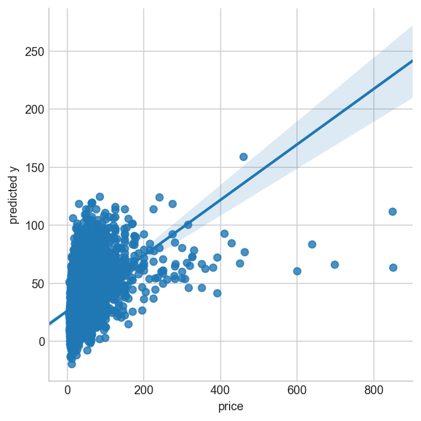


```python
# find number of counst of each variety

pd.value_counts(winetrim['variety'].values, sort=True)
```


    Pinot Noir                    2697
    Chardonnay                    2014
    Cabernet Sauvignon            1755
    Red Blend                     1624
    Riesling                      1051
    Bordeaux-style Red Blend       911
    Syrah                          896
    Sauvignon Blanc                877
    Rosé                           666
    Merlot                         601
    Malbec                         558
    Zinfandel                      508
    Sangiovese                     495
    Portuguese Red                 379
    Nebbiolo                       303
    Sangiovese Grosso              291
    Pinot Gris                     283
    Rhône-style Red Blend          279
    Sparkling Blend                236
    Cabernet Franc                 201
    Viognier                       200
    Grüner Veltliner               194
    Shiraz                         178
    Portuguese White               145
    Pinot Grigio                   132
    Tempranillo Blend              131
    Grenache                       130
    Bordeaux-style White Blend     122
    Chenin Blanc                   111
    Barbera                        107
    Petite Sirah                   105
    Carmenère                       91
    Champagne Blend                 86
    dtype: int64


```python
# setup wine types based on the grape variety 

winetrim.loc[(winetrim['variety'] == u'Champagne Blend') | (winetrim['variety'] == u'Sparkling Blend'),'sparkling_wine']=1 

winetrim.loc[(winetrim['variety'] == u'Chardonnay') |  (winetrim['variety'] == u'Sauvignon Blanc') | (winetrim['variety'] == u'Riesling')
         | (winetrim['variety'] == u'Zinfandel') |  (winetrim['variety'] == u'Grüner Veltliner') |  (winetrim['variety'] == u'Pinot Gris')
         |  (winetrim['variety'] == u'Pinot Grigio')|  (winetrim['variety'] == u'Viognier')|  (winetrim['variety'] == u'Portuguese White')
         |  (winetrim['variety']==  u'Gewurztraminer') |  (winetrim['variety'] ==  u'Bordeaux-style White Blend')
         |  (winetrim['variety'] ==  u'Chenin Blanc'),'white_wine']=1
# #       
winetrim.loc[(winetrim['variety'] == u'Pinot Noir') |  (winetrim['variety'] == u'Cabernet Sauvignon') | (winetrim['variety'] == u'Red Blend')
         |  (winetrim['variety'] == u'Bordeaux-style Red Blend') | (winetrim['variety'] == u'Syrah') | (winetrim['variety'] == u'Merlot')
         |  (winetrim['variety'] ==  u'Rosé')|  (winetrim['variety'] == u'Malbec') | (winetrim['variety'] == u'Nebbiolo')       
        |  (winetrim['variety'] ==  u'Portuguese Red') |  (winetrim['variety'] ==  u'Sangiovese') |  (winetrim['variety'] ==  u'Rhône-style Red Blend') 
        |  (winetrim['variety'] ==  u'Cabernet Franc')|  (winetrim['variety'] ==  u'Gamay')         |  (winetrim['variety'] ==  u'Petite Sirah')| (winetrim['variety'] ==  u'Carmenère') 
        |  (winetrim['variety'] ==  u'Barbera') |  (winetrim['variety'] ==  u'Shiraz') |  (winetrim['variety'] ==  u'Grenache')|  (winetrim['variety'] ==  u'Sangiovese Grosso')
         |  (winetrim['variety'] ==  u'Tempranillo Blend'),'red_wine']=1

```


```python
winetrim['red_wine'].fillna(0,inplace=True)
winetrim['white_wine'].fillna(0,inplace=True)
winetrim['sparkling_wine'].fillna(0,inplace=True)
winetrim[['red_wine','white_wine','sparkling_wine']]
```


<div>
<style scoped>
    .dataframe tbody tr th:only-of-type {
        vertical-align: middle;
    }

    .dataframe tbody tr th {
        vertical-align: top;
    }

    .dataframe thead th {
        text-align: right;
    }
</style>
<table border="1" class="dataframe">
  <thead>
    <tr style="text-align: right;">
      <th></th>
      <th>red_wine</th>
      <th>white_wine</th>
      <th>sparkling_wine</th>
    </tr>
  </thead>
  <tbody>
    <tr>
      <th>0</th>
      <td>1.0</td>
      <td>0.0</td>
      <td>0.0</td>
    </tr>
    <tr>
      <th>1</th>
      <td>0.0</td>
      <td>1.0</td>
      <td>0.0</td>
    </tr>
    <tr>
      <th>2</th>
      <td>1.0</td>
      <td>0.0</td>
      <td>0.0</td>
    </tr>
    <tr>
      <th>3</th>
      <td>1.0</td>
      <td>0.0</td>
      <td>0.0</td>
    </tr>
    <tr>
      <th>4</th>
      <td>1.0</td>
      <td>0.0</td>
      <td>0.0</td>
    </tr>
    <tr>
      <th>5</th>
      <td>1.0</td>
      <td>0.0</td>
      <td>0.0</td>
    </tr>
    <tr>
      <th>6</th>
      <td>1.0</td>
      <td>0.0</td>
      <td>0.0</td>
    </tr>
    <tr>
      <th>7</th>
      <td>1.0</td>
      <td>0.0</td>
      <td>0.0</td>
    </tr>
    <tr>
      <th>8</th>
      <td>0.0</td>
      <td>1.0</td>
      <td>0.0</td>
    </tr>
    <tr>
      <th>9</th>
      <td>1.0</td>
      <td>0.0</td>
      <td>0.0</td>
    </tr>
    <tr>
      <th>10</th>
      <td>1.0</td>
      <td>0.0</td>
      <td>0.0</td>
    </tr>
    <tr>
      <th>11</th>
      <td>1.0</td>
      <td>0.0</td>
      <td>0.0</td>
    </tr>
    <tr>
      <th>12</th>
      <td>1.0</td>
      <td>0.0</td>
      <td>0.0</td>
    </tr>
    <tr>
      <th>13</th>
      <td>1.0</td>
      <td>0.0</td>
      <td>0.0</td>
    </tr>
    <tr>
      <th>14</th>
      <td>0.0</td>
      <td>1.0</td>
      <td>0.0</td>
    </tr>
    <tr>
      <th>15</th>
      <td>1.0</td>
      <td>0.0</td>
      <td>0.0</td>
    </tr>
    <tr>
      <th>16</th>
      <td>0.0</td>
      <td>1.0</td>
      <td>0.0</td>
    </tr>
    <tr>
      <th>17</th>
      <td>1.0</td>
      <td>0.0</td>
      <td>0.0</td>
    </tr>
    <tr>
      <th>18</th>
      <td>1.0</td>
      <td>0.0</td>
      <td>0.0</td>
    </tr>
    <tr>
      <th>19</th>
      <td>1.0</td>
      <td>0.0</td>
      <td>0.0</td>
    </tr>
    <tr>
      <th>20</th>
      <td>1.0</td>
      <td>0.0</td>
      <td>0.0</td>
    </tr>
    <tr>
      <th>21</th>
      <td>0.0</td>
      <td>1.0</td>
      <td>0.0</td>
    </tr>
    <tr>
      <th>22</th>
      <td>0.0</td>
      <td>0.0</td>
      <td>1.0</td>
    </tr>
    <tr>
      <th>23</th>
      <td>0.0</td>
      <td>1.0</td>
      <td>0.0</td>
    </tr>
    <tr>
      <th>24</th>
      <td>1.0</td>
      <td>0.0</td>
      <td>0.0</td>
    </tr>
    <tr>
      <th>25</th>
      <td>1.0</td>
      <td>0.0</td>
      <td>0.0</td>
    </tr>
    <tr>
      <th>26</th>
      <td>1.0</td>
      <td>0.0</td>
      <td>0.0</td>
    </tr>
    <tr>
      <th>27</th>
      <td>1.0</td>
      <td>0.0</td>
      <td>0.0</td>
    </tr>
    <tr>
      <th>28</th>
      <td>1.0</td>
      <td>0.0</td>
      <td>0.0</td>
    </tr>
    <tr>
      <th>29</th>
      <td>1.0</td>
      <td>0.0</td>
      <td>0.0</td>
    </tr>
    <tr>
      <th>30</th>
      <td>1.0</td>
      <td>0.0</td>
      <td>0.0</td>
    </tr>
    <tr>
      <th>31</th>
      <td>1.0</td>
      <td>0.0</td>
      <td>0.0</td>
    </tr>
    <tr>
      <th>32</th>
      <td>1.0</td>
      <td>0.0</td>
      <td>0.0</td>
    </tr>
    <tr>
      <th>33</th>
      <td>1.0</td>
      <td>0.0</td>
      <td>0.0</td>
    </tr>
    <tr>
      <th>34</th>
      <td>1.0</td>
      <td>0.0</td>
      <td>0.0</td>
    </tr>
    <tr>
      <th>35</th>
      <td>1.0</td>
      <td>0.0</td>
      <td>0.0</td>
    </tr>
    <tr>
      <th>36</th>
      <td>1.0</td>
      <td>0.0</td>
      <td>0.0</td>
    </tr>
    <tr>
      <th>37</th>
      <td>0.0</td>
      <td>1.0</td>
      <td>0.0</td>
    </tr>
    <tr>
      <th>38</th>
      <td>0.0</td>
      <td>1.0</td>
      <td>0.0</td>
    </tr>
    <tr>
      <th>39</th>
      <td>1.0</td>
      <td>0.0</td>
      <td>0.0</td>
    </tr>
    <tr>
      <th>40</th>
      <td>0.0</td>
      <td>1.0</td>
      <td>0.0</td>
    </tr>
    <tr>
      <th>41</th>
      <td>1.0</td>
      <td>0.0</td>
      <td>0.0</td>
    </tr>
    <tr>
      <th>42</th>
      <td>0.0</td>
      <td>1.0</td>
      <td>0.0</td>
    </tr>
    <tr>
      <th>43</th>
      <td>1.0</td>
      <td>0.0</td>
      <td>0.0</td>
    </tr>
    <tr>
      <th>44</th>
      <td>1.0</td>
      <td>0.0</td>
      <td>0.0</td>
    </tr>
    <tr>
      <th>45</th>
      <td>1.0</td>
      <td>0.0</td>
      <td>0.0</td>
    </tr>
    <tr>
      <th>46</th>
      <td>1.0</td>
      <td>0.0</td>
      <td>0.0</td>
    </tr>
    <tr>
      <th>47</th>
      <td>0.0</td>
      <td>1.0</td>
      <td>0.0</td>
    </tr>
    <tr>
      <th>48</th>
      <td>1.0</td>
      <td>0.0</td>
      <td>0.0</td>
    </tr>
    <tr>
      <th>49</th>
      <td>1.0</td>
      <td>0.0</td>
      <td>0.0</td>
    </tr>
    <tr>
      <th>50</th>
      <td>0.0</td>
      <td>1.0</td>
      <td>0.0</td>
    </tr>
    <tr>
      <th>51</th>
      <td>1.0</td>
      <td>0.0</td>
      <td>0.0</td>
    </tr>
    <tr>
      <th>52</th>
      <td>1.0</td>
      <td>0.0</td>
      <td>0.0</td>
    </tr>
    <tr>
      <th>53</th>
      <td>1.0</td>
      <td>0.0</td>
      <td>0.0</td>
    </tr>
    <tr>
      <th>54</th>
      <td>1.0</td>
      <td>0.0</td>
      <td>0.0</td>
    </tr>
    <tr>
      <th>55</th>
      <td>1.0</td>
      <td>0.0</td>
      <td>0.0</td>
    </tr>
    <tr>
      <th>56</th>
      <td>0.0</td>
      <td>1.0</td>
      <td>0.0</td>
    </tr>
    <tr>
      <th>57</th>
      <td>1.0</td>
      <td>0.0</td>
      <td>0.0</td>
    </tr>
    <tr>
      <th>58</th>
      <td>1.0</td>
      <td>0.0</td>
      <td>0.0</td>
    </tr>
    <tr>
      <th>59</th>
      <td>0.0</td>
      <td>1.0</td>
      <td>0.0</td>
    </tr>
    <tr>
      <th>60</th>
      <td>0.0</td>
      <td>1.0</td>
      <td>0.0</td>
    </tr>
    <tr>
      <th>61</th>
      <td>1.0</td>
      <td>0.0</td>
      <td>0.0</td>
    </tr>
    <tr>
      <th>62</th>
      <td>1.0</td>
      <td>0.0</td>
      <td>0.0</td>
    </tr>
    <tr>
      <th>63</th>
      <td>1.0</td>
      <td>0.0</td>
      <td>0.0</td>
    </tr>
    <tr>
      <th>64</th>
      <td>1.0</td>
      <td>0.0</td>
      <td>0.0</td>
    </tr>
    <tr>
      <th>65</th>
      <td>1.0</td>
      <td>0.0</td>
      <td>0.0</td>
    </tr>
    <tr>
      <th>66</th>
      <td>1.0</td>
      <td>0.0</td>
      <td>0.0</td>
    </tr>
    <tr>
      <th>67</th>
      <td>1.0</td>
      <td>0.0</td>
      <td>0.0</td>
    </tr>
    <tr>
      <th>68</th>
      <td>0.0</td>
      <td>1.0</td>
      <td>0.0</td>
    </tr>
    <tr>
      <th>69</th>
      <td>1.0</td>
      <td>0.0</td>
      <td>0.0</td>
    </tr>
    <tr>
      <th>70</th>
      <td>1.0</td>
      <td>0.0</td>
      <td>0.0</td>
    </tr>
    <tr>
      <th>71</th>
      <td>1.0</td>
      <td>0.0</td>
      <td>0.0</td>
    </tr>
    <tr>
      <th>72</th>
      <td>0.0</td>
      <td>1.0</td>
      <td>0.0</td>
    </tr>
    <tr>
      <th>73</th>
      <td>1.0</td>
      <td>0.0</td>
      <td>0.0</td>
    </tr>
    <tr>
      <th>74</th>
      <td>0.0</td>
      <td>1.0</td>
      <td>0.0</td>
    </tr>
    <tr>
      <th>75</th>
      <td>1.0</td>
      <td>0.0</td>
      <td>0.0</td>
    </tr>
    <tr>
      <th>76</th>
      <td>0.0</td>
      <td>1.0</td>
      <td>0.0</td>
    </tr>
    <tr>
      <th>77</th>
      <td>1.0</td>
      <td>0.0</td>
      <td>0.0</td>
    </tr>
    <tr>
      <th>78</th>
      <td>1.0</td>
      <td>0.0</td>
      <td>0.0</td>
    </tr>
    <tr>
      <th>79</th>
      <td>0.0</td>
      <td>1.0</td>
      <td>0.0</td>
    </tr>
    <tr>
      <th>80</th>
      <td>1.0</td>
      <td>0.0</td>
      <td>0.0</td>
    </tr>
    <tr>
      <th>81</th>
      <td>0.0</td>
      <td>1.0</td>
      <td>0.0</td>
    </tr>
    <tr>
      <th>82</th>
      <td>0.0</td>
      <td>1.0</td>
      <td>0.0</td>
    </tr>
    <tr>
      <th>83</th>
      <td>1.0</td>
      <td>0.0</td>
      <td>0.0</td>
    </tr>
    <tr>
      <th>84</th>
      <td>1.0</td>
      <td>0.0</td>
      <td>0.0</td>
    </tr>
    <tr>
      <th>85</th>
      <td>1.0</td>
      <td>0.0</td>
      <td>0.0</td>
    </tr>
    <tr>
      <th>86</th>
      <td>0.0</td>
      <td>1.0</td>
      <td>0.0</td>
    </tr>
    <tr>
      <th>87</th>
      <td>0.0</td>
      <td>1.0</td>
      <td>0.0</td>
    </tr>
    <tr>
      <th>88</th>
      <td>1.0</td>
      <td>0.0</td>
      <td>0.0</td>
    </tr>
    <tr>
      <th>89</th>
      <td>1.0</td>
      <td>0.0</td>
      <td>0.0</td>
    </tr>
    <tr>
      <th>90</th>
      <td>1.0</td>
      <td>0.0</td>
      <td>0.0</td>
    </tr>
    <tr>
      <th>91</th>
      <td>1.0</td>
      <td>0.0</td>
      <td>0.0</td>
    </tr>
    <tr>
      <th>92</th>
      <td>1.0</td>
      <td>0.0</td>
      <td>0.0</td>
    </tr>
    <tr>
      <th>93</th>
      <td>0.0</td>
      <td>0.0</td>
      <td>1.0</td>
    </tr>
    <tr>
      <th>94</th>
      <td>0.0</td>
      <td>1.0</td>
      <td>0.0</td>
    </tr>
    <tr>
      <th>95</th>
      <td>1.0</td>
      <td>0.0</td>
      <td>0.0</td>
    </tr>
    <tr>
      <th>96</th>
      <td>1.0</td>
      <td>0.0</td>
      <td>0.0</td>
    </tr>
    <tr>
      <th>97</th>
      <td>0.0</td>
      <td>1.0</td>
      <td>0.0</td>
    </tr>
    <tr>
      <th>98</th>
      <td>1.0</td>
      <td>0.0</td>
      <td>0.0</td>
    </tr>
    <tr>
      <th>99</th>
      <td>0.0</td>
      <td>1.0</td>
      <td>0.0</td>
    </tr>
    <tr>
      <th>100</th>
      <td>1.0</td>
      <td>0.0</td>
      <td>0.0</td>
    </tr>
    <tr>
      <th>101</th>
      <td>0.0</td>
      <td>1.0</td>
      <td>0.0</td>
    </tr>
    <tr>
      <th>102</th>
      <td>1.0</td>
      <td>0.0</td>
      <td>0.0</td>
    </tr>
    <tr>
      <th>103</th>
      <td>1.0</td>
      <td>0.0</td>
      <td>0.0</td>
    </tr>
    <tr>
      <th>104</th>
      <td>0.0</td>
      <td>1.0</td>
      <td>0.0</td>
    </tr>
    <tr>
      <th>105</th>
      <td>1.0</td>
      <td>0.0</td>
      <td>0.0</td>
    </tr>
    <tr>
      <th>106</th>
      <td>1.0</td>
      <td>0.0</td>
      <td>0.0</td>
    </tr>
    <tr>
      <th>107</th>
      <td>1.0</td>
      <td>0.0</td>
      <td>0.0</td>
    </tr>
    <tr>
      <th>108</th>
      <td>0.0</td>
      <td>1.0</td>
      <td>0.0</td>
    </tr>
    <tr>
      <th>109</th>
      <td>1.0</td>
      <td>0.0</td>
      <td>0.0</td>
    </tr>
    <tr>
      <th>110</th>
      <td>0.0</td>
      <td>1.0</td>
      <td>0.0</td>
    </tr>
    <tr>
      <th>111</th>
      <td>1.0</td>
      <td>0.0</td>
      <td>0.0</td>
    </tr>
    <tr>
      <th>112</th>
      <td>0.0</td>
      <td>1.0</td>
      <td>0.0</td>
    </tr>
    <tr>
      <th>113</th>
      <td>1.0</td>
      <td>0.0</td>
      <td>0.0</td>
    </tr>
    <tr>
      <th>114</th>
      <td>1.0</td>
      <td>0.0</td>
      <td>0.0</td>
    </tr>
    <tr>
      <th>115</th>
      <td>0.0</td>
      <td>0.0</td>
      <td>1.0</td>
    </tr>
    <tr>
      <th>116</th>
      <td>1.0</td>
      <td>0.0</td>
      <td>0.0</td>
    </tr>
    <tr>
      <th>117</th>
      <td>1.0</td>
      <td>0.0</td>
      <td>0.0</td>
    </tr>
    <tr>
      <th>118</th>
      <td>1.0</td>
      <td>0.0</td>
      <td>0.0</td>
    </tr>
    <tr>
      <th>119</th>
      <td>1.0</td>
      <td>0.0</td>
      <td>0.0</td>
    </tr>
    <tr>
      <th>120</th>
      <td>1.0</td>
      <td>0.0</td>
      <td>0.0</td>
    </tr>
    <tr>
      <th>121</th>
      <td>1.0</td>
      <td>0.0</td>
      <td>0.0</td>
    </tr>
    <tr>
      <th>122</th>
      <td>1.0</td>
      <td>0.0</td>
      <td>0.0</td>
    </tr>
    <tr>
      <th>123</th>
      <td>1.0</td>
      <td>0.0</td>
      <td>0.0</td>
    </tr>
    <tr>
      <th>124</th>
      <td>0.0</td>
      <td>1.0</td>
      <td>0.0</td>
    </tr>
    <tr>
      <th>125</th>
      <td>1.0</td>
      <td>0.0</td>
      <td>0.0</td>
    </tr>
    <tr>
      <th>126</th>
      <td>1.0</td>
      <td>0.0</td>
      <td>0.0</td>
    </tr>
    <tr>
      <th>127</th>
      <td>1.0</td>
      <td>0.0</td>
      <td>0.0</td>
    </tr>
    <tr>
      <th>128</th>
      <td>0.0</td>
      <td>1.0</td>
      <td>0.0</td>
    </tr>
    <tr>
      <th>129</th>
      <td>1.0</td>
      <td>0.0</td>
      <td>0.0</td>
    </tr>
    <tr>
      <th>130</th>
      <td>1.0</td>
      <td>0.0</td>
      <td>0.0</td>
    </tr>
    <tr>
      <th>131</th>
      <td>1.0</td>
      <td>0.0</td>
      <td>0.0</td>
    </tr>
    <tr>
      <th>132</th>
      <td>1.0</td>
      <td>0.0</td>
      <td>0.0</td>
    </tr>
    <tr>
      <th>133</th>
      <td>1.0</td>
      <td>0.0</td>
      <td>0.0</td>
    </tr>
    <tr>
      <th>134</th>
      <td>1.0</td>
      <td>0.0</td>
      <td>0.0</td>
    </tr>
    <tr>
      <th>135</th>
      <td>1.0</td>
      <td>0.0</td>
      <td>0.0</td>
    </tr>
    <tr>
      <th>136</th>
      <td>0.0</td>
      <td>1.0</td>
      <td>0.0</td>
    </tr>
    <tr>
      <th>137</th>
      <td>1.0</td>
      <td>0.0</td>
      <td>0.0</td>
    </tr>
    <tr>
      <th>138</th>
      <td>1.0</td>
      <td>0.0</td>
      <td>0.0</td>
    </tr>
    <tr>
      <th>139</th>
      <td>1.0</td>
      <td>0.0</td>
      <td>0.0</td>
    </tr>
    <tr>
      <th>140</th>
      <td>1.0</td>
      <td>0.0</td>
      <td>0.0</td>
    </tr>
    <tr>
      <th>141</th>
      <td>0.0</td>
      <td>1.0</td>
      <td>0.0</td>
    </tr>
    <tr>
      <th>142</th>
      <td>0.0</td>
      <td>1.0</td>
      <td>0.0</td>
    </tr>
    <tr>
      <th>143</th>
      <td>1.0</td>
      <td>0.0</td>
      <td>0.0</td>
    </tr>
    <tr>
      <th>144</th>
      <td>1.0</td>
      <td>0.0</td>
      <td>0.0</td>
    </tr>
    <tr>
      <th>145</th>
      <td>1.0</td>
      <td>0.0</td>
      <td>0.0</td>
    </tr>
    <tr>
      <th>146</th>
      <td>1.0</td>
      <td>0.0</td>
      <td>0.0</td>
    </tr>
    <tr>
      <th>147</th>
      <td>1.0</td>
      <td>0.0</td>
      <td>0.0</td>
    </tr>
    <tr>
      <th>148</th>
      <td>1.0</td>
      <td>0.0</td>
      <td>0.0</td>
    </tr>
    <tr>
      <th>149</th>
      <td>1.0</td>
      <td>0.0</td>
      <td>0.0</td>
    </tr>
    <tr>
      <th>150</th>
      <td>0.0</td>
      <td>1.0</td>
      <td>0.0</td>
    </tr>
    <tr>
      <th>151</th>
      <td>1.0</td>
      <td>0.0</td>
      <td>0.0</td>
    </tr>
    <tr>
      <th>152</th>
      <td>0.0</td>
      <td>1.0</td>
      <td>0.0</td>
    </tr>
    <tr>
      <th>153</th>
      <td>0.0</td>
      <td>1.0</td>
      <td>0.0</td>
    </tr>
    <tr>
      <th>154</th>
      <td>0.0</td>
      <td>1.0</td>
      <td>0.0</td>
    </tr>
    <tr>
      <th>155</th>
      <td>1.0</td>
      <td>0.0</td>
      <td>0.0</td>
    </tr>
    <tr>
      <th>156</th>
      <td>1.0</td>
      <td>0.0</td>
      <td>0.0</td>
    </tr>
    <tr>
      <th>157</th>
      <td>1.0</td>
      <td>0.0</td>
      <td>0.0</td>
    </tr>
    <tr>
      <th>158</th>
      <td>1.0</td>
      <td>0.0</td>
      <td>0.0</td>
    </tr>
    <tr>
      <th>159</th>
      <td>1.0</td>
      <td>0.0</td>
      <td>0.0</td>
    </tr>
    <tr>
      <th>160</th>
      <td>1.0</td>
      <td>0.0</td>
      <td>0.0</td>
    </tr>
    <tr>
      <th>161</th>
      <td>1.0</td>
      <td>0.0</td>
      <td>0.0</td>
    </tr>
    <tr>
      <th>162</th>
      <td>0.0</td>
      <td>0.0</td>
      <td>1.0</td>
    </tr>
    <tr>
      <th>163</th>
      <td>1.0</td>
      <td>0.0</td>
      <td>0.0</td>
    </tr>
    <tr>
      <th>164</th>
      <td>1.0</td>
      <td>0.0</td>
      <td>0.0</td>
    </tr>
    <tr>
      <th>165</th>
      <td>0.0</td>
      <td>1.0</td>
      <td>0.0</td>
    </tr>
    <tr>
      <th>166</th>
      <td>1.0</td>
      <td>0.0</td>
      <td>0.0</td>
    </tr>
    <tr>
      <th>167</th>
      <td>0.0</td>
      <td>1.0</td>
      <td>0.0</td>
    </tr>
    <tr>
      <th>168</th>
      <td>0.0</td>
      <td>1.0</td>
      <td>0.0</td>
    </tr>
    <tr>
      <th>169</th>
      <td>1.0</td>
      <td>0.0</td>
      <td>0.0</td>
    </tr>
    <tr>
      <th>170</th>
      <td>0.0</td>
      <td>1.0</td>
      <td>0.0</td>
    </tr>
    <tr>
      <th>171</th>
      <td>0.0</td>
      <td>1.0</td>
      <td>0.0</td>
    </tr>
    <tr>
      <th>172</th>
      <td>0.0</td>
      <td>1.0</td>
      <td>0.0</td>
    </tr>
    <tr>
      <th>173</th>
      <td>0.0</td>
      <td>1.0</td>
      <td>0.0</td>
    </tr>
    <tr>
      <th>174</th>
      <td>1.0</td>
      <td>0.0</td>
      <td>0.0</td>
    </tr>
    <tr>
      <th>175</th>
      <td>0.0</td>
      <td>1.0</td>
      <td>0.0</td>
    </tr>
    <tr>
      <th>176</th>
      <td>1.0</td>
      <td>0.0</td>
      <td>0.0</td>
    </tr>
    <tr>
      <th>177</th>
      <td>1.0</td>
      <td>0.0</td>
      <td>0.0</td>
    </tr>
    <tr>
      <th>178</th>
      <td>1.0</td>
      <td>0.0</td>
      <td>0.0</td>
    </tr>
    <tr>
      <th>179</th>
      <td>1.0</td>
      <td>0.0</td>
      <td>0.0</td>
    </tr>
    <tr>
      <th>180</th>
      <td>1.0</td>
      <td>0.0</td>
      <td>0.0</td>
    </tr>
    <tr>
      <th>181</th>
      <td>1.0</td>
      <td>0.0</td>
      <td>0.0</td>
    </tr>
    <tr>
      <th>182</th>
      <td>1.0</td>
      <td>0.0</td>
      <td>0.0</td>
    </tr>
    <tr>
      <th>183</th>
      <td>1.0</td>
      <td>0.0</td>
      <td>0.0</td>
    </tr>
    <tr>
      <th>184</th>
      <td>0.0</td>
      <td>1.0</td>
      <td>0.0</td>
    </tr>
    <tr>
      <th>185</th>
      <td>0.0</td>
      <td>1.0</td>
      <td>0.0</td>
    </tr>
    <tr>
      <th>186</th>
      <td>0.0</td>
      <td>1.0</td>
      <td>0.0</td>
    </tr>
    <tr>
      <th>187</th>
      <td>1.0</td>
      <td>0.0</td>
      <td>0.0</td>
    </tr>
    <tr>
      <th>188</th>
      <td>1.0</td>
      <td>0.0</td>
      <td>0.0</td>
    </tr>
    <tr>
      <th>189</th>
      <td>1.0</td>
      <td>0.0</td>
      <td>0.0</td>
    </tr>
    <tr>
      <th>190</th>
      <td>0.0</td>
      <td>1.0</td>
      <td>0.0</td>
    </tr>
    <tr>
      <th>191</th>
      <td>1.0</td>
      <td>0.0</td>
      <td>0.0</td>
    </tr>
    <tr>
      <th>192</th>
      <td>0.0</td>
      <td>1.0</td>
      <td>0.0</td>
    </tr>
    <tr>
      <th>193</th>
      <td>0.0</td>
      <td>1.0</td>
      <td>0.0</td>
    </tr>
    <tr>
      <th>194</th>
      <td>1.0</td>
      <td>0.0</td>
      <td>0.0</td>
    </tr>
    <tr>
      <th>195</th>
      <td>1.0</td>
      <td>0.0</td>
      <td>0.0</td>
    </tr>
    <tr>
      <th>196</th>
      <td>0.0</td>
      <td>1.0</td>
      <td>0.0</td>
    </tr>
    <tr>
      <th>197</th>
      <td>1.0</td>
      <td>0.0</td>
      <td>0.0</td>
    </tr>
    <tr>
      <th>198</th>
      <td>1.0</td>
      <td>0.0</td>
      <td>0.0</td>
    </tr>
    <tr>
      <th>199</th>
      <td>1.0</td>
      <td>0.0</td>
      <td>0.0</td>
    </tr>
    <tr>
      <th>200</th>
      <td>1.0</td>
      <td>0.0</td>
      <td>0.0</td>
    </tr>
    <tr>
      <th>201</th>
      <td>1.0</td>
      <td>0.0</td>
      <td>0.0</td>
    </tr>
    <tr>
      <th>202</th>
      <td>0.0</td>
      <td>1.0</td>
      <td>0.0</td>
    </tr>
    <tr>
      <th>203</th>
      <td>1.0</td>
      <td>0.0</td>
      <td>0.0</td>
    </tr>
    <tr>
      <th>204</th>
      <td>1.0</td>
      <td>0.0</td>
      <td>0.0</td>
    </tr>
    <tr>
      <th>205</th>
      <td>1.0</td>
      <td>0.0</td>
      <td>0.0</td>
    </tr>
    <tr>
      <th>206</th>
      <td>1.0</td>
      <td>0.0</td>
      <td>0.0</td>
    </tr>
    <tr>
      <th>207</th>
      <td>1.0</td>
      <td>0.0</td>
      <td>0.0</td>
    </tr>
    <tr>
      <th>208</th>
      <td>0.0</td>
      <td>1.0</td>
      <td>0.0</td>
    </tr>
    <tr>
      <th>209</th>
      <td>0.0</td>
      <td>1.0</td>
      <td>0.0</td>
    </tr>
    <tr>
      <th>210</th>
      <td>0.0</td>
      <td>1.0</td>
      <td>0.0</td>
    </tr>
    <tr>
      <th>211</th>
      <td>1.0</td>
      <td>0.0</td>
      <td>0.0</td>
    </tr>
    <tr>
      <th>212</th>
      <td>1.0</td>
      <td>0.0</td>
      <td>0.0</td>
    </tr>
    <tr>
      <th>213</th>
      <td>0.0</td>
      <td>1.0</td>
      <td>0.0</td>
    </tr>
    <tr>
      <th>214</th>
      <td>0.0</td>
      <td>1.0</td>
      <td>0.0</td>
    </tr>
    <tr>
      <th>215</th>
      <td>1.0</td>
      <td>0.0</td>
      <td>0.0</td>
    </tr>
    <tr>
      <th>216</th>
      <td>0.0</td>
      <td>0.0</td>
      <td>1.0</td>
    </tr>
    <tr>
      <th>217</th>
      <td>1.0</td>
      <td>0.0</td>
      <td>0.0</td>
    </tr>
    <tr>
      <th>218</th>
      <td>0.0</td>
      <td>1.0</td>
      <td>0.0</td>
    </tr>
    <tr>
      <th>219</th>
      <td>1.0</td>
      <td>0.0</td>
      <td>0.0</td>
    </tr>
    <tr>
      <th>220</th>
      <td>1.0</td>
      <td>0.0</td>
      <td>0.0</td>
    </tr>
    <tr>
      <th>221</th>
      <td>1.0</td>
      <td>0.0</td>
      <td>0.0</td>
    </tr>
    <tr>
      <th>222</th>
      <td>1.0</td>
      <td>0.0</td>
      <td>0.0</td>
    </tr>
    <tr>
      <th>223</th>
      <td>0.0</td>
      <td>1.0</td>
      <td>0.0</td>
    </tr>
    <tr>
      <th>224</th>
      <td>1.0</td>
      <td>0.0</td>
      <td>0.0</td>
    </tr>
    <tr>
      <th>225</th>
      <td>0.0</td>
      <td>1.0</td>
      <td>0.0</td>
    </tr>
    <tr>
      <th>226</th>
      <td>1.0</td>
      <td>0.0</td>
      <td>0.0</td>
    </tr>
    <tr>
      <th>227</th>
      <td>1.0</td>
      <td>0.0</td>
      <td>0.0</td>
    </tr>
    <tr>
      <th>228</th>
      <td>0.0</td>
      <td>1.0</td>
      <td>0.0</td>
    </tr>
    <tr>
      <th>229</th>
      <td>1.0</td>
      <td>0.0</td>
      <td>0.0</td>
    </tr>
    <tr>
      <th>230</th>
      <td>1.0</td>
      <td>0.0</td>
      <td>0.0</td>
    </tr>
    <tr>
      <th>231</th>
      <td>0.0</td>
      <td>1.0</td>
      <td>0.0</td>
    </tr>
    <tr>
      <th>232</th>
      <td>1.0</td>
      <td>0.0</td>
      <td>0.0</td>
    </tr>
    <tr>
      <th>233</th>
      <td>0.0</td>
      <td>1.0</td>
      <td>0.0</td>
    </tr>
    <tr>
      <th>234</th>
      <td>1.0</td>
      <td>0.0</td>
      <td>0.0</td>
    </tr>
    <tr>
      <th>235</th>
      <td>0.0</td>
      <td>1.0</td>
      <td>0.0</td>
    </tr>
    <tr>
      <th>236</th>
      <td>1.0</td>
      <td>0.0</td>
      <td>0.0</td>
    </tr>
    <tr>
      <th>237</th>
      <td>0.0</td>
      <td>1.0</td>
      <td>0.0</td>
    </tr>
    <tr>
      <th>238</th>
      <td>1.0</td>
      <td>0.0</td>
      <td>0.0</td>
    </tr>
    <tr>
      <th>239</th>
      <td>0.0</td>
      <td>1.0</td>
      <td>0.0</td>
    </tr>
    <tr>
      <th>240</th>
      <td>1.0</td>
      <td>0.0</td>
      <td>0.0</td>
    </tr>
    <tr>
      <th>241</th>
      <td>1.0</td>
      <td>0.0</td>
      <td>0.0</td>
    </tr>
    <tr>
      <th>242</th>
      <td>1.0</td>
      <td>0.0</td>
      <td>0.0</td>
    </tr>
    <tr>
      <th>243</th>
      <td>1.0</td>
      <td>0.0</td>
      <td>0.0</td>
    </tr>
    <tr>
      <th>244</th>
      <td>1.0</td>
      <td>0.0</td>
      <td>0.0</td>
    </tr>
    <tr>
      <th>245</th>
      <td>1.0</td>
      <td>0.0</td>
      <td>0.0</td>
    </tr>
    <tr>
      <th>246</th>
      <td>1.0</td>
      <td>0.0</td>
      <td>0.0</td>
    </tr>
    <tr>
      <th>247</th>
      <td>1.0</td>
      <td>0.0</td>
      <td>0.0</td>
    </tr>
    <tr>
      <th>248</th>
      <td>0.0</td>
      <td>0.0</td>
      <td>1.0</td>
    </tr>
    <tr>
      <th>249</th>
      <td>1.0</td>
      <td>0.0</td>
      <td>0.0</td>
    </tr>
    <tr>
      <th>250</th>
      <td>1.0</td>
      <td>0.0</td>
      <td>0.0</td>
    </tr>
    <tr>
      <th>251</th>
      <td>1.0</td>
      <td>0.0</td>
      <td>0.0</td>
    </tr>
    <tr>
      <th>252</th>
      <td>1.0</td>
      <td>0.0</td>
      <td>0.0</td>
    </tr>
    <tr>
      <th>253</th>
      <td>1.0</td>
      <td>0.0</td>
      <td>0.0</td>
    </tr>
    <tr>
      <th>254</th>
      <td>1.0</td>
      <td>0.0</td>
      <td>0.0</td>
    </tr>
    <tr>
      <th>255</th>
      <td>1.0</td>
      <td>0.0</td>
      <td>0.0</td>
    </tr>
    <tr>
      <th>256</th>
      <td>1.0</td>
      <td>0.0</td>
      <td>0.0</td>
    </tr>
    <tr>
      <th>257</th>
      <td>0.0</td>
      <td>1.0</td>
      <td>0.0</td>
    </tr>
    <tr>
      <th>258</th>
      <td>1.0</td>
      <td>0.0</td>
      <td>0.0</td>
    </tr>
    <tr>
      <th>259</th>
      <td>0.0</td>
      <td>1.0</td>
      <td>0.0</td>
    </tr>
    <tr>
      <th>260</th>
      <td>1.0</td>
      <td>0.0</td>
      <td>0.0</td>
    </tr>
    <tr>
      <th>261</th>
      <td>0.0</td>
      <td>1.0</td>
      <td>0.0</td>
    </tr>
    <tr>
      <th>262</th>
      <td>1.0</td>
      <td>0.0</td>
      <td>0.0</td>
    </tr>
    <tr>
      <th>263</th>
      <td>1.0</td>
      <td>0.0</td>
      <td>0.0</td>
    </tr>
    <tr>
      <th>264</th>
      <td>1.0</td>
      <td>0.0</td>
      <td>0.0</td>
    </tr>
    <tr>
      <th>265</th>
      <td>1.0</td>
      <td>0.0</td>
      <td>0.0</td>
    </tr>
    <tr>
      <th>266</th>
      <td>1.0</td>
      <td>0.0</td>
      <td>0.0</td>
    </tr>
    <tr>
      <th>267</th>
      <td>1.0</td>
      <td>0.0</td>
      <td>0.0</td>
    </tr>
    <tr>
      <th>268</th>
      <td>1.0</td>
      <td>0.0</td>
      <td>0.0</td>
    </tr>
    <tr>
      <th>269</th>
      <td>0.0</td>
      <td>1.0</td>
      <td>0.0</td>
    </tr>
    <tr>
      <th>270</th>
      <td>0.0</td>
      <td>1.0</td>
      <td>0.0</td>
    </tr>
    <tr>
      <th>271</th>
      <td>1.0</td>
      <td>0.0</td>
      <td>0.0</td>
    </tr>
    <tr>
      <th>272</th>
      <td>0.0</td>
      <td>1.0</td>
      <td>0.0</td>
    </tr>
    <tr>
      <th>273</th>
      <td>1.0</td>
      <td>0.0</td>
      <td>0.0</td>
    </tr>
    <tr>
      <th>274</th>
      <td>0.0</td>
      <td>1.0</td>
      <td>0.0</td>
    </tr>
    <tr>
      <th>275</th>
      <td>1.0</td>
      <td>0.0</td>
      <td>0.0</td>
    </tr>
    <tr>
      <th>276</th>
      <td>0.0</td>
      <td>0.0</td>
      <td>1.0</td>
    </tr>
    <tr>
      <th>277</th>
      <td>1.0</td>
      <td>0.0</td>
      <td>0.0</td>
    </tr>
    <tr>
      <th>278</th>
      <td>0.0</td>
      <td>1.0</td>
      <td>0.0</td>
    </tr>
    <tr>
      <th>279</th>
      <td>1.0</td>
      <td>0.0</td>
      <td>0.0</td>
    </tr>
    <tr>
      <th>280</th>
      <td>1.0</td>
      <td>0.0</td>
      <td>0.0</td>
    </tr>
    <tr>
      <th>281</th>
      <td>1.0</td>
      <td>0.0</td>
      <td>0.0</td>
    </tr>
    <tr>
      <th>282</th>
      <td>0.0</td>
      <td>1.0</td>
      <td>0.0</td>
    </tr>
    <tr>
      <th>283</th>
      <td>1.0</td>
      <td>0.0</td>
      <td>0.0</td>
    </tr>
    <tr>
      <th>284</th>
      <td>1.0</td>
      <td>0.0</td>
      <td>0.0</td>
    </tr>
    <tr>
      <th>285</th>
      <td>1.0</td>
      <td>0.0</td>
      <td>0.0</td>
    </tr>
    <tr>
      <th>286</th>
      <td>0.0</td>
      <td>1.0</td>
      <td>0.0</td>
    </tr>
    <tr>
      <th>287</th>
      <td>1.0</td>
      <td>0.0</td>
      <td>0.0</td>
    </tr>
    <tr>
      <th>288</th>
      <td>1.0</td>
      <td>0.0</td>
      <td>0.0</td>
    </tr>
    <tr>
      <th>289</th>
      <td>0.0</td>
      <td>1.0</td>
      <td>0.0</td>
    </tr>
    <tr>
      <th>290</th>
      <td>1.0</td>
      <td>0.0</td>
      <td>0.0</td>
    </tr>
    <tr>
      <th>291</th>
      <td>1.0</td>
      <td>0.0</td>
      <td>0.0</td>
    </tr>
    <tr>
      <th>292</th>
      <td>1.0</td>
      <td>0.0</td>
      <td>0.0</td>
    </tr>
    <tr>
      <th>293</th>
      <td>1.0</td>
      <td>0.0</td>
      <td>0.0</td>
    </tr>
    <tr>
      <th>294</th>
      <td>1.0</td>
      <td>0.0</td>
      <td>0.0</td>
    </tr>
    <tr>
      <th>295</th>
      <td>1.0</td>
      <td>0.0</td>
      <td>0.0</td>
    </tr>
    <tr>
      <th>296</th>
      <td>1.0</td>
      <td>0.0</td>
      <td>0.0</td>
    </tr>
    <tr>
      <th>297</th>
      <td>1.0</td>
      <td>0.0</td>
      <td>0.0</td>
    </tr>
    <tr>
      <th>298</th>
      <td>0.0</td>
      <td>1.0</td>
      <td>0.0</td>
    </tr>
    <tr>
      <th>299</th>
      <td>1.0</td>
      <td>0.0</td>
      <td>0.0</td>
    </tr>
    <tr>
      <th>300</th>
      <td>1.0</td>
      <td>0.0</td>
      <td>0.0</td>
    </tr>
    <tr>
      <th>301</th>
      <td>1.0</td>
      <td>0.0</td>
      <td>0.0</td>
    </tr>
    <tr>
      <th>302</th>
      <td>1.0</td>
      <td>0.0</td>
      <td>0.0</td>
    </tr>
    <tr>
      <th>303</th>
      <td>1.0</td>
      <td>0.0</td>
      <td>0.0</td>
    </tr>
    <tr>
      <th>304</th>
      <td>1.0</td>
      <td>0.0</td>
      <td>0.0</td>
    </tr>
    <tr>
      <th>305</th>
      <td>1.0</td>
      <td>0.0</td>
      <td>0.0</td>
    </tr>
    <tr>
      <th>306</th>
      <td>1.0</td>
      <td>0.0</td>
      <td>0.0</td>
    </tr>
    <tr>
      <th>307</th>
      <td>1.0</td>
      <td>0.0</td>
      <td>0.0</td>
    </tr>
    <tr>
      <th>308</th>
      <td>1.0</td>
      <td>0.0</td>
      <td>0.0</td>
    </tr>
    <tr>
      <th>309</th>
      <td>1.0</td>
      <td>0.0</td>
      <td>0.0</td>
    </tr>
    <tr>
      <th>310</th>
      <td>1.0</td>
      <td>0.0</td>
      <td>0.0</td>
    </tr>
    <tr>
      <th>311</th>
      <td>0.0</td>
      <td>1.0</td>
      <td>0.0</td>
    </tr>
    <tr>
      <th>312</th>
      <td>0.0</td>
      <td>1.0</td>
      <td>0.0</td>
    </tr>
    <tr>
      <th>313</th>
      <td>0.0</td>
      <td>1.0</td>
      <td>0.0</td>
    </tr>
    <tr>
      <th>314</th>
      <td>1.0</td>
      <td>0.0</td>
      <td>0.0</td>
    </tr>
    <tr>
      <th>315</th>
      <td>0.0</td>
      <td>1.0</td>
      <td>0.0</td>
    </tr>
    <tr>
      <th>316</th>
      <td>1.0</td>
      <td>0.0</td>
      <td>0.0</td>
    </tr>
    <tr>
      <th>317</th>
      <td>1.0</td>
      <td>0.0</td>
      <td>0.0</td>
    </tr>
    <tr>
      <th>318</th>
      <td>1.0</td>
      <td>0.0</td>
      <td>0.0</td>
    </tr>
    <tr>
      <th>319</th>
      <td>1.0</td>
      <td>0.0</td>
      <td>0.0</td>
    </tr>
    <tr>
      <th>320</th>
      <td>1.0</td>
      <td>0.0</td>
      <td>0.0</td>
    </tr>
    <tr>
      <th>321</th>
      <td>1.0</td>
      <td>0.0</td>
      <td>0.0</td>
    </tr>
    <tr>
      <th>322</th>
      <td>0.0</td>
      <td>1.0</td>
      <td>0.0</td>
    </tr>
    <tr>
      <th>323</th>
      <td>1.0</td>
      <td>0.0</td>
      <td>0.0</td>
    </tr>
    <tr>
      <th>324</th>
      <td>1.0</td>
      <td>0.0</td>
      <td>0.0</td>
    </tr>
    <tr>
      <th>325</th>
      <td>0.0</td>
      <td>0.0</td>
      <td>1.0</td>
    </tr>
    <tr>
      <th>326</th>
      <td>0.0</td>
      <td>1.0</td>
      <td>0.0</td>
    </tr>
    <tr>
      <th>327</th>
      <td>0.0</td>
      <td>1.0</td>
      <td>0.0</td>
    </tr>
    <tr>
      <th>328</th>
      <td>1.0</td>
      <td>0.0</td>
      <td>0.0</td>
    </tr>
    <tr>
      <th>329</th>
      <td>1.0</td>
      <td>0.0</td>
      <td>0.0</td>
    </tr>
    <tr>
      <th>330</th>
      <td>1.0</td>
      <td>0.0</td>
      <td>0.0</td>
    </tr>
    <tr>
      <th>331</th>
      <td>1.0</td>
      <td>0.0</td>
      <td>0.0</td>
    </tr>
    <tr>
      <th>332</th>
      <td>1.0</td>
      <td>0.0</td>
      <td>0.0</td>
    </tr>
    <tr>
      <th>333</th>
      <td>0.0</td>
      <td>1.0</td>
      <td>0.0</td>
    </tr>
    <tr>
      <th>334</th>
      <td>1.0</td>
      <td>0.0</td>
      <td>0.0</td>
    </tr>
    <tr>
      <th>335</th>
      <td>0.0</td>
      <td>1.0</td>
      <td>0.0</td>
    </tr>
    <tr>
      <th>336</th>
      <td>1.0</td>
      <td>0.0</td>
      <td>0.0</td>
    </tr>
    <tr>
      <th>337</th>
      <td>1.0</td>
      <td>0.0</td>
      <td>0.0</td>
    </tr>
    <tr>
      <th>338</th>
      <td>1.0</td>
      <td>0.0</td>
      <td>0.0</td>
    </tr>
    <tr>
      <th>339</th>
      <td>1.0</td>
      <td>0.0</td>
      <td>0.0</td>
    </tr>
    <tr>
      <th>340</th>
      <td>1.0</td>
      <td>0.0</td>
      <td>0.0</td>
    </tr>
    <tr>
      <th>341</th>
      <td>1.0</td>
      <td>0.0</td>
      <td>0.0</td>
    </tr>
    <tr>
      <th>342</th>
      <td>0.0</td>
      <td>1.0</td>
      <td>0.0</td>
    </tr>
    <tr>
      <th>343</th>
      <td>1.0</td>
      <td>0.0</td>
      <td>0.0</td>
    </tr>
    <tr>
      <th>344</th>
      <td>1.0</td>
      <td>0.0</td>
      <td>0.0</td>
    </tr>
    <tr>
      <th>345</th>
      <td>0.0</td>
      <td>1.0</td>
      <td>0.0</td>
    </tr>
    <tr>
      <th>346</th>
      <td>0.0</td>
      <td>1.0</td>
      <td>0.0</td>
    </tr>
    <tr>
      <th>347</th>
      <td>1.0</td>
      <td>0.0</td>
      <td>0.0</td>
    </tr>
    <tr>
      <th>348</th>
      <td>1.0</td>
      <td>0.0</td>
      <td>0.0</td>
    </tr>
    <tr>
      <th>349</th>
      <td>0.0</td>
      <td>1.0</td>
      <td>0.0</td>
    </tr>
    <tr>
      <th>350</th>
      <td>1.0</td>
      <td>0.0</td>
      <td>0.0</td>
    </tr>
    <tr>
      <th>351</th>
      <td>0.0</td>
      <td>1.0</td>
      <td>0.0</td>
    </tr>
    <tr>
      <th>352</th>
      <td>1.0</td>
      <td>0.0</td>
      <td>0.0</td>
    </tr>
    <tr>
      <th>353</th>
      <td>1.0</td>
      <td>0.0</td>
      <td>0.0</td>
    </tr>
    <tr>
      <th>354</th>
      <td>1.0</td>
      <td>0.0</td>
      <td>0.0</td>
    </tr>
    <tr>
      <th>355</th>
      <td>0.0</td>
      <td>1.0</td>
      <td>0.0</td>
    </tr>
    <tr>
      <th>356</th>
      <td>0.0</td>
      <td>1.0</td>
      <td>0.0</td>
    </tr>
    <tr>
      <th>357</th>
      <td>1.0</td>
      <td>0.0</td>
      <td>0.0</td>
    </tr>
    <tr>
      <th>358</th>
      <td>1.0</td>
      <td>0.0</td>
      <td>0.0</td>
    </tr>
    <tr>
      <th>359</th>
      <td>1.0</td>
      <td>0.0</td>
      <td>0.0</td>
    </tr>
    <tr>
      <th>360</th>
      <td>1.0</td>
      <td>0.0</td>
      <td>0.0</td>
    </tr>
    <tr>
      <th>361</th>
      <td>1.0</td>
      <td>0.0</td>
      <td>0.0</td>
    </tr>
    <tr>
      <th>362</th>
      <td>1.0</td>
      <td>0.0</td>
      <td>0.0</td>
    </tr>
    <tr>
      <th>363</th>
      <td>1.0</td>
      <td>0.0</td>
      <td>0.0</td>
    </tr>
    <tr>
      <th>364</th>
      <td>0.0</td>
      <td>1.0</td>
      <td>0.0</td>
    </tr>
    <tr>
      <th>365</th>
      <td>0.0</td>
      <td>1.0</td>
      <td>0.0</td>
    </tr>
    <tr>
      <th>366</th>
      <td>1.0</td>
      <td>0.0</td>
      <td>0.0</td>
    </tr>
    <tr>
      <th>367</th>
      <td>1.0</td>
      <td>0.0</td>
      <td>0.0</td>
    </tr>
    <tr>
      <th>368</th>
      <td>1.0</td>
      <td>0.0</td>
      <td>0.0</td>
    </tr>
    <tr>
      <th>369</th>
      <td>1.0</td>
      <td>0.0</td>
      <td>0.0</td>
    </tr>
    <tr>
      <th>370</th>
      <td>1.0</td>
      <td>0.0</td>
      <td>0.0</td>
    </tr>
    <tr>
      <th>371</th>
      <td>1.0</td>
      <td>0.0</td>
      <td>0.0</td>
    </tr>
    <tr>
      <th>372</th>
      <td>1.0</td>
      <td>0.0</td>
      <td>0.0</td>
    </tr>
    <tr>
      <th>373</th>
      <td>1.0</td>
      <td>0.0</td>
      <td>0.0</td>
    </tr>
    <tr>
      <th>374</th>
      <td>1.0</td>
      <td>0.0</td>
      <td>0.0</td>
    </tr>
    <tr>
      <th>375</th>
      <td>1.0</td>
      <td>0.0</td>
      <td>0.0</td>
    </tr>
    <tr>
      <th>376</th>
      <td>0.0</td>
      <td>1.0</td>
      <td>0.0</td>
    </tr>
    <tr>
      <th>377</th>
      <td>1.0</td>
      <td>0.0</td>
      <td>0.0</td>
    </tr>
    <tr>
      <th>378</th>
      <td>1.0</td>
      <td>0.0</td>
      <td>0.0</td>
    </tr>
    <tr>
      <th>379</th>
      <td>0.0</td>
      <td>1.0</td>
      <td>0.0</td>
    </tr>
    <tr>
      <th>380</th>
      <td>1.0</td>
      <td>0.0</td>
      <td>0.0</td>
    </tr>
    <tr>
      <th>381</th>
      <td>1.0</td>
      <td>0.0</td>
      <td>0.0</td>
    </tr>
    <tr>
      <th>382</th>
      <td>0.0</td>
      <td>0.0</td>
      <td>1.0</td>
    </tr>
    <tr>
      <th>383</th>
      <td>0.0</td>
      <td>1.0</td>
      <td>0.0</td>
    </tr>
    <tr>
      <th>384</th>
      <td>1.0</td>
      <td>0.0</td>
      <td>0.0</td>
    </tr>
    <tr>
      <th>385</th>
      <td>0.0</td>
      <td>1.0</td>
      <td>0.0</td>
    </tr>
    <tr>
      <th>386</th>
      <td>1.0</td>
      <td>0.0</td>
      <td>0.0</td>
    </tr>
    <tr>
      <th>387</th>
      <td>1.0</td>
      <td>0.0</td>
      <td>0.0</td>
    </tr>
    <tr>
      <th>388</th>
      <td>1.0</td>
      <td>0.0</td>
      <td>0.0</td>
    </tr>
    <tr>
      <th>389</th>
      <td>0.0</td>
      <td>1.0</td>
      <td>0.0</td>
    </tr>
    <tr>
      <th>390</th>
      <td>0.0</td>
      <td>1.0</td>
      <td>0.0</td>
    </tr>
    <tr>
      <th>391</th>
      <td>1.0</td>
      <td>0.0</td>
      <td>0.0</td>
    </tr>
    <tr>
      <th>392</th>
      <td>0.0</td>
      <td>1.0</td>
      <td>0.0</td>
    </tr>
    <tr>
      <th>393</th>
      <td>0.0</td>
      <td>1.0</td>
      <td>0.0</td>
    </tr>
    <tr>
      <th>394</th>
      <td>1.0</td>
      <td>0.0</td>
      <td>0.0</td>
    </tr>
    <tr>
      <th>395</th>
      <td>0.0</td>
      <td>1.0</td>
      <td>0.0</td>
    </tr>
    <tr>
      <th>396</th>
      <td>0.0</td>
      <td>1.0</td>
      <td>0.0</td>
    </tr>
    <tr>
      <th>397</th>
      <td>0.0</td>
      <td>1.0</td>
      <td>0.0</td>
    </tr>
    <tr>
      <th>398</th>
      <td>0.0</td>
      <td>1.0</td>
      <td>0.0</td>
    </tr>
    <tr>
      <th>399</th>
      <td>0.0</td>
      <td>1.0</td>
      <td>0.0</td>
    </tr>
    <tr>
      <th>400</th>
      <td>1.0</td>
      <td>0.0</td>
      <td>0.0</td>
    </tr>
    <tr>
      <th>401</th>
      <td>0.0</td>
      <td>1.0</td>
      <td>0.0</td>
    </tr>
    <tr>
      <th>402</th>
      <td>1.0</td>
      <td>0.0</td>
      <td>0.0</td>
    </tr>
    <tr>
      <th>403</th>
      <td>1.0</td>
      <td>0.0</td>
      <td>0.0</td>
    </tr>
    <tr>
      <th>404</th>
      <td>1.0</td>
      <td>0.0</td>
      <td>0.0</td>
    </tr>
    <tr>
      <th>405</th>
      <td>0.0</td>
      <td>1.0</td>
      <td>0.0</td>
    </tr>
    <tr>
      <th>406</th>
      <td>1.0</td>
      <td>0.0</td>
      <td>0.0</td>
    </tr>
    <tr>
      <th>407</th>
      <td>0.0</td>
      <td>1.0</td>
      <td>0.0</td>
    </tr>
    <tr>
      <th>408</th>
      <td>0.0</td>
      <td>1.0</td>
      <td>0.0</td>
    </tr>
    <tr>
      <th>409</th>
      <td>1.0</td>
      <td>0.0</td>
      <td>0.0</td>
    </tr>
    <tr>
      <th>410</th>
      <td>0.0</td>
      <td>1.0</td>
      <td>0.0</td>
    </tr>
    <tr>
      <th>411</th>
      <td>0.0</td>
      <td>1.0</td>
      <td>0.0</td>
    </tr>
    <tr>
      <th>412</th>
      <td>1.0</td>
      <td>0.0</td>
      <td>0.0</td>
    </tr>
    <tr>
      <th>413</th>
      <td>1.0</td>
      <td>0.0</td>
      <td>0.0</td>
    </tr>
    <tr>
      <th>414</th>
      <td>1.0</td>
      <td>0.0</td>
      <td>0.0</td>
    </tr>
    <tr>
      <th>415</th>
      <td>1.0</td>
      <td>0.0</td>
      <td>0.0</td>
    </tr>
    <tr>
      <th>416</th>
      <td>0.0</td>
      <td>1.0</td>
      <td>0.0</td>
    </tr>
    <tr>
      <th>417</th>
      <td>0.0</td>
      <td>1.0</td>
      <td>0.0</td>
    </tr>
    <tr>
      <th>418</th>
      <td>0.0</td>
      <td>1.0</td>
      <td>0.0</td>
    </tr>
    <tr>
      <th>419</th>
      <td>0.0</td>
      <td>1.0</td>
      <td>0.0</td>
    </tr>
    <tr>
      <th>420</th>
      <td>1.0</td>
      <td>0.0</td>
      <td>0.0</td>
    </tr>
    <tr>
      <th>421</th>
      <td>0.0</td>
      <td>1.0</td>
      <td>0.0</td>
    </tr>
    <tr>
      <th>422</th>
      <td>1.0</td>
      <td>0.0</td>
      <td>0.0</td>
    </tr>
    <tr>
      <th>423</th>
      <td>1.0</td>
      <td>0.0</td>
      <td>0.0</td>
    </tr>
    <tr>
      <th>424</th>
      <td>1.0</td>
      <td>0.0</td>
      <td>0.0</td>
    </tr>
    <tr>
      <th>425</th>
      <td>0.0</td>
      <td>1.0</td>
      <td>0.0</td>
    </tr>
    <tr>
      <th>426</th>
      <td>1.0</td>
      <td>0.0</td>
      <td>0.0</td>
    </tr>
    <tr>
      <th>427</th>
      <td>1.0</td>
      <td>0.0</td>
      <td>0.0</td>
    </tr>
    <tr>
      <th>428</th>
      <td>1.0</td>
      <td>0.0</td>
      <td>0.0</td>
    </tr>
    <tr>
      <th>429</th>
      <td>1.0</td>
      <td>0.0</td>
      <td>0.0</td>
    </tr>
    <tr>
      <th>430</th>
      <td>1.0</td>
      <td>0.0</td>
      <td>0.0</td>
    </tr>
    <tr>
      <th>431</th>
      <td>1.0</td>
      <td>0.0</td>
      <td>0.0</td>
    </tr>
    <tr>
      <th>432</th>
      <td>0.0</td>
      <td>1.0</td>
      <td>0.0</td>
    </tr>
    <tr>
      <th>433</th>
      <td>0.0</td>
      <td>1.0</td>
      <td>0.0</td>
    </tr>
    <tr>
      <th>434</th>
      <td>1.0</td>
      <td>0.0</td>
      <td>0.0</td>
    </tr>
    <tr>
      <th>435</th>
      <td>1.0</td>
      <td>0.0</td>
      <td>0.0</td>
    </tr>
    <tr>
      <th>436</th>
      <td>1.0</td>
      <td>0.0</td>
      <td>0.0</td>
    </tr>
    <tr>
      <th>437</th>
      <td>1.0</td>
      <td>0.0</td>
      <td>0.0</td>
    </tr>
    <tr>
      <th>438</th>
      <td>1.0</td>
      <td>0.0</td>
      <td>0.0</td>
    </tr>
    <tr>
      <th>439</th>
      <td>1.0</td>
      <td>0.0</td>
      <td>0.0</td>
    </tr>
    <tr>
      <th>440</th>
      <td>1.0</td>
      <td>0.0</td>
      <td>0.0</td>
    </tr>
    <tr>
      <th>441</th>
      <td>0.0</td>
      <td>1.0</td>
      <td>0.0</td>
    </tr>
    <tr>
      <th>442</th>
      <td>1.0</td>
      <td>0.0</td>
      <td>0.0</td>
    </tr>
    <tr>
      <th>443</th>
      <td>0.0</td>
      <td>1.0</td>
      <td>0.0</td>
    </tr>
    <tr>
      <th>444</th>
      <td>0.0</td>
      <td>1.0</td>
      <td>0.0</td>
    </tr>
    <tr>
      <th>445</th>
      <td>1.0</td>
      <td>0.0</td>
      <td>0.0</td>
    </tr>
    <tr>
      <th>446</th>
      <td>1.0</td>
      <td>0.0</td>
      <td>0.0</td>
    </tr>
    <tr>
      <th>447</th>
      <td>0.0</td>
      <td>1.0</td>
      <td>0.0</td>
    </tr>
    <tr>
      <th>448</th>
      <td>1.0</td>
      <td>0.0</td>
      <td>0.0</td>
    </tr>
    <tr>
      <th>449</th>
      <td>0.0</td>
      <td>1.0</td>
      <td>0.0</td>
    </tr>
    <tr>
      <th>450</th>
      <td>0.0</td>
      <td>1.0</td>
      <td>0.0</td>
    </tr>
    <tr>
      <th>451</th>
      <td>1.0</td>
      <td>0.0</td>
      <td>0.0</td>
    </tr>
    <tr>
      <th>452</th>
      <td>0.0</td>
      <td>1.0</td>
      <td>0.0</td>
    </tr>
    <tr>
      <th>453</th>
      <td>0.0</td>
      <td>1.0</td>
      <td>0.0</td>
    </tr>
    <tr>
      <th>454</th>
      <td>1.0</td>
      <td>0.0</td>
      <td>0.0</td>
    </tr>
    <tr>
      <th>455</th>
      <td>0.0</td>
      <td>1.0</td>
      <td>0.0</td>
    </tr>
    <tr>
      <th>456</th>
      <td>0.0</td>
      <td>1.0</td>
      <td>0.0</td>
    </tr>
    <tr>
      <th>457</th>
      <td>0.0</td>
      <td>1.0</td>
      <td>0.0</td>
    </tr>
    <tr>
      <th>458</th>
      <td>0.0</td>
      <td>1.0</td>
      <td>0.0</td>
    </tr>
    <tr>
      <th>459</th>
      <td>0.0</td>
      <td>1.0</td>
      <td>0.0</td>
    </tr>
    <tr>
      <th>460</th>
      <td>0.0</td>
      <td>1.0</td>
      <td>0.0</td>
    </tr>
    <tr>
      <th>461</th>
      <td>0.0</td>
      <td>1.0</td>
      <td>0.0</td>
    </tr>
    <tr>
      <th>462</th>
      <td>1.0</td>
      <td>0.0</td>
      <td>0.0</td>
    </tr>
    <tr>
      <th>463</th>
      <td>1.0</td>
      <td>0.0</td>
      <td>0.0</td>
    </tr>
    <tr>
      <th>464</th>
      <td>0.0</td>
      <td>1.0</td>
      <td>0.0</td>
    </tr>
    <tr>
      <th>465</th>
      <td>0.0</td>
      <td>1.0</td>
      <td>0.0</td>
    </tr>
    <tr>
      <th>466</th>
      <td>0.0</td>
      <td>1.0</td>
      <td>0.0</td>
    </tr>
    <tr>
      <th>467</th>
      <td>0.0</td>
      <td>1.0</td>
      <td>0.0</td>
    </tr>
    <tr>
      <th>468</th>
      <td>0.0</td>
      <td>1.0</td>
      <td>0.0</td>
    </tr>
    <tr>
      <th>469</th>
      <td>0.0</td>
      <td>1.0</td>
      <td>0.0</td>
    </tr>
    <tr>
      <th>470</th>
      <td>0.0</td>
      <td>1.0</td>
      <td>0.0</td>
    </tr>
    <tr>
      <th>471</th>
      <td>1.0</td>
      <td>0.0</td>
      <td>0.0</td>
    </tr>
    <tr>
      <th>472</th>
      <td>1.0</td>
      <td>0.0</td>
      <td>0.0</td>
    </tr>
    <tr>
      <th>473</th>
      <td>0.0</td>
      <td>1.0</td>
      <td>0.0</td>
    </tr>
    <tr>
      <th>474</th>
      <td>1.0</td>
      <td>0.0</td>
      <td>0.0</td>
    </tr>
    <tr>
      <th>475</th>
      <td>1.0</td>
      <td>0.0</td>
      <td>0.0</td>
    </tr>
    <tr>
      <th>476</th>
      <td>1.0</td>
      <td>0.0</td>
      <td>0.0</td>
    </tr>
    <tr>
      <th>477</th>
      <td>1.0</td>
      <td>0.0</td>
      <td>0.0</td>
    </tr>
    <tr>
      <th>478</th>
      <td>1.0</td>
      <td>0.0</td>
      <td>0.0</td>
    </tr>
    <tr>
      <th>479</th>
      <td>1.0</td>
      <td>0.0</td>
      <td>0.0</td>
    </tr>
    <tr>
      <th>480</th>
      <td>1.0</td>
      <td>0.0</td>
      <td>0.0</td>
    </tr>
    <tr>
      <th>481</th>
      <td>1.0</td>
      <td>0.0</td>
      <td>0.0</td>
    </tr>
    <tr>
      <th>482</th>
      <td>1.0</td>
      <td>0.0</td>
      <td>0.0</td>
    </tr>
    <tr>
      <th>483</th>
      <td>1.0</td>
      <td>0.0</td>
      <td>0.0</td>
    </tr>
    <tr>
      <th>484</th>
      <td>1.0</td>
      <td>0.0</td>
      <td>0.0</td>
    </tr>
    <tr>
      <th>485</th>
      <td>1.0</td>
      <td>0.0</td>
      <td>0.0</td>
    </tr>
    <tr>
      <th>486</th>
      <td>0.0</td>
      <td>1.0</td>
      <td>0.0</td>
    </tr>
    <tr>
      <th>487</th>
      <td>1.0</td>
      <td>0.0</td>
      <td>0.0</td>
    </tr>
    <tr>
      <th>488</th>
      <td>0.0</td>
      <td>1.0</td>
      <td>0.0</td>
    </tr>
    <tr>
      <th>489</th>
      <td>0.0</td>
      <td>1.0</td>
      <td>0.0</td>
    </tr>
    <tr>
      <th>490</th>
      <td>1.0</td>
      <td>0.0</td>
      <td>0.0</td>
    </tr>
    <tr>
      <th>491</th>
      <td>1.0</td>
      <td>0.0</td>
      <td>0.0</td>
    </tr>
    <tr>
      <th>492</th>
      <td>1.0</td>
      <td>0.0</td>
      <td>0.0</td>
    </tr>
    <tr>
      <th>493</th>
      <td>1.0</td>
      <td>0.0</td>
      <td>0.0</td>
    </tr>
    <tr>
      <th>494</th>
      <td>1.0</td>
      <td>0.0</td>
      <td>0.0</td>
    </tr>
    <tr>
      <th>495</th>
      <td>0.0</td>
      <td>1.0</td>
      <td>0.0</td>
    </tr>
    <tr>
      <th>496</th>
      <td>1.0</td>
      <td>0.0</td>
      <td>0.0</td>
    </tr>
    <tr>
      <th>497</th>
      <td>1.0</td>
      <td>0.0</td>
      <td>0.0</td>
    </tr>
    <tr>
      <th>498</th>
      <td>1.0</td>
      <td>0.0</td>
      <td>0.0</td>
    </tr>
    <tr>
      <th>...</th>
      <td>...</td>
      <td>...</td>
      <td>...</td>
    </tr>
    <tr>
      <th>17858</th>
      <td>1.0</td>
      <td>0.0</td>
      <td>0.0</td>
    </tr>
    <tr>
      <th>17859</th>
      <td>1.0</td>
      <td>0.0</td>
      <td>0.0</td>
    </tr>
    <tr>
      <th>17860</th>
      <td>1.0</td>
      <td>0.0</td>
      <td>0.0</td>
    </tr>
    <tr>
      <th>17861</th>
      <td>1.0</td>
      <td>0.0</td>
      <td>0.0</td>
    </tr>
    <tr>
      <th>17862</th>
      <td>1.0</td>
      <td>0.0</td>
      <td>0.0</td>
    </tr>
    <tr>
      <th>17863</th>
      <td>1.0</td>
      <td>0.0</td>
      <td>0.0</td>
    </tr>
    <tr>
      <th>17864</th>
      <td>1.0</td>
      <td>0.0</td>
      <td>0.0</td>
    </tr>
    <tr>
      <th>17865</th>
      <td>1.0</td>
      <td>0.0</td>
      <td>0.0</td>
    </tr>
    <tr>
      <th>17866</th>
      <td>0.0</td>
      <td>1.0</td>
      <td>0.0</td>
    </tr>
    <tr>
      <th>17867</th>
      <td>0.0</td>
      <td>1.0</td>
      <td>0.0</td>
    </tr>
    <tr>
      <th>17868</th>
      <td>1.0</td>
      <td>0.0</td>
      <td>0.0</td>
    </tr>
    <tr>
      <th>17869</th>
      <td>1.0</td>
      <td>0.0</td>
      <td>0.0</td>
    </tr>
    <tr>
      <th>17870</th>
      <td>1.0</td>
      <td>0.0</td>
      <td>0.0</td>
    </tr>
    <tr>
      <th>17871</th>
      <td>0.0</td>
      <td>1.0</td>
      <td>0.0</td>
    </tr>
    <tr>
      <th>17872</th>
      <td>1.0</td>
      <td>0.0</td>
      <td>0.0</td>
    </tr>
    <tr>
      <th>17873</th>
      <td>1.0</td>
      <td>0.0</td>
      <td>0.0</td>
    </tr>
    <tr>
      <th>17874</th>
      <td>0.0</td>
      <td>1.0</td>
      <td>0.0</td>
    </tr>
    <tr>
      <th>17875</th>
      <td>1.0</td>
      <td>0.0</td>
      <td>0.0</td>
    </tr>
    <tr>
      <th>17876</th>
      <td>0.0</td>
      <td>1.0</td>
      <td>0.0</td>
    </tr>
    <tr>
      <th>17877</th>
      <td>1.0</td>
      <td>0.0</td>
      <td>0.0</td>
    </tr>
    <tr>
      <th>17878</th>
      <td>1.0</td>
      <td>0.0</td>
      <td>0.0</td>
    </tr>
    <tr>
      <th>17879</th>
      <td>1.0</td>
      <td>0.0</td>
      <td>0.0</td>
    </tr>
    <tr>
      <th>17880</th>
      <td>1.0</td>
      <td>0.0</td>
      <td>0.0</td>
    </tr>
    <tr>
      <th>17881</th>
      <td>1.0</td>
      <td>0.0</td>
      <td>0.0</td>
    </tr>
    <tr>
      <th>17882</th>
      <td>0.0</td>
      <td>1.0</td>
      <td>0.0</td>
    </tr>
    <tr>
      <th>17883</th>
      <td>1.0</td>
      <td>0.0</td>
      <td>0.0</td>
    </tr>
    <tr>
      <th>17884</th>
      <td>1.0</td>
      <td>0.0</td>
      <td>0.0</td>
    </tr>
    <tr>
      <th>17885</th>
      <td>1.0</td>
      <td>0.0</td>
      <td>0.0</td>
    </tr>
    <tr>
      <th>17886</th>
      <td>1.0</td>
      <td>0.0</td>
      <td>0.0</td>
    </tr>
    <tr>
      <th>17887</th>
      <td>1.0</td>
      <td>0.0</td>
      <td>0.0</td>
    </tr>
    <tr>
      <th>17888</th>
      <td>1.0</td>
      <td>0.0</td>
      <td>0.0</td>
    </tr>
    <tr>
      <th>17889</th>
      <td>1.0</td>
      <td>0.0</td>
      <td>0.0</td>
    </tr>
    <tr>
      <th>17890</th>
      <td>1.0</td>
      <td>0.0</td>
      <td>0.0</td>
    </tr>
    <tr>
      <th>17891</th>
      <td>1.0</td>
      <td>0.0</td>
      <td>0.0</td>
    </tr>
    <tr>
      <th>17892</th>
      <td>1.0</td>
      <td>0.0</td>
      <td>0.0</td>
    </tr>
    <tr>
      <th>17893</th>
      <td>0.0</td>
      <td>0.0</td>
      <td>1.0</td>
    </tr>
    <tr>
      <th>17894</th>
      <td>1.0</td>
      <td>0.0</td>
      <td>0.0</td>
    </tr>
    <tr>
      <th>17895</th>
      <td>0.0</td>
      <td>1.0</td>
      <td>0.0</td>
    </tr>
    <tr>
      <th>17896</th>
      <td>0.0</td>
      <td>0.0</td>
      <td>1.0</td>
    </tr>
    <tr>
      <th>17897</th>
      <td>0.0</td>
      <td>1.0</td>
      <td>0.0</td>
    </tr>
    <tr>
      <th>17898</th>
      <td>1.0</td>
      <td>0.0</td>
      <td>0.0</td>
    </tr>
    <tr>
      <th>17899</th>
      <td>1.0</td>
      <td>0.0</td>
      <td>0.0</td>
    </tr>
    <tr>
      <th>17900</th>
      <td>1.0</td>
      <td>0.0</td>
      <td>0.0</td>
    </tr>
    <tr>
      <th>17901</th>
      <td>1.0</td>
      <td>0.0</td>
      <td>0.0</td>
    </tr>
    <tr>
      <th>17902</th>
      <td>1.0</td>
      <td>0.0</td>
      <td>0.0</td>
    </tr>
    <tr>
      <th>17903</th>
      <td>1.0</td>
      <td>0.0</td>
      <td>0.0</td>
    </tr>
    <tr>
      <th>17904</th>
      <td>1.0</td>
      <td>0.0</td>
      <td>0.0</td>
    </tr>
    <tr>
      <th>17905</th>
      <td>1.0</td>
      <td>0.0</td>
      <td>0.0</td>
    </tr>
    <tr>
      <th>17906</th>
      <td>0.0</td>
      <td>1.0</td>
      <td>0.0</td>
    </tr>
    <tr>
      <th>17907</th>
      <td>1.0</td>
      <td>0.0</td>
      <td>0.0</td>
    </tr>
    <tr>
      <th>17908</th>
      <td>1.0</td>
      <td>0.0</td>
      <td>0.0</td>
    </tr>
    <tr>
      <th>17909</th>
      <td>0.0</td>
      <td>1.0</td>
      <td>0.0</td>
    </tr>
    <tr>
      <th>17910</th>
      <td>1.0</td>
      <td>0.0</td>
      <td>0.0</td>
    </tr>
    <tr>
      <th>17911</th>
      <td>1.0</td>
      <td>0.0</td>
      <td>0.0</td>
    </tr>
    <tr>
      <th>17912</th>
      <td>0.0</td>
      <td>1.0</td>
      <td>0.0</td>
    </tr>
    <tr>
      <th>17913</th>
      <td>1.0</td>
      <td>0.0</td>
      <td>0.0</td>
    </tr>
    <tr>
      <th>17914</th>
      <td>0.0</td>
      <td>1.0</td>
      <td>0.0</td>
    </tr>
    <tr>
      <th>17915</th>
      <td>1.0</td>
      <td>0.0</td>
      <td>0.0</td>
    </tr>
    <tr>
      <th>17916</th>
      <td>1.0</td>
      <td>0.0</td>
      <td>0.0</td>
    </tr>
    <tr>
      <th>17917</th>
      <td>0.0</td>
      <td>1.0</td>
      <td>0.0</td>
    </tr>
    <tr>
      <th>17918</th>
      <td>1.0</td>
      <td>0.0</td>
      <td>0.0</td>
    </tr>
    <tr>
      <th>17919</th>
      <td>0.0</td>
      <td>1.0</td>
      <td>0.0</td>
    </tr>
    <tr>
      <th>17920</th>
      <td>1.0</td>
      <td>0.0</td>
      <td>0.0</td>
    </tr>
    <tr>
      <th>17921</th>
      <td>1.0</td>
      <td>0.0</td>
      <td>0.0</td>
    </tr>
    <tr>
      <th>17922</th>
      <td>1.0</td>
      <td>0.0</td>
      <td>0.0</td>
    </tr>
    <tr>
      <th>17923</th>
      <td>1.0</td>
      <td>0.0</td>
      <td>0.0</td>
    </tr>
    <tr>
      <th>17924</th>
      <td>1.0</td>
      <td>0.0</td>
      <td>0.0</td>
    </tr>
    <tr>
      <th>17925</th>
      <td>0.0</td>
      <td>1.0</td>
      <td>0.0</td>
    </tr>
    <tr>
      <th>17926</th>
      <td>0.0</td>
      <td>0.0</td>
      <td>1.0</td>
    </tr>
    <tr>
      <th>17927</th>
      <td>0.0</td>
      <td>1.0</td>
      <td>0.0</td>
    </tr>
    <tr>
      <th>17928</th>
      <td>1.0</td>
      <td>0.0</td>
      <td>0.0</td>
    </tr>
    <tr>
      <th>17929</th>
      <td>1.0</td>
      <td>0.0</td>
      <td>0.0</td>
    </tr>
    <tr>
      <th>17930</th>
      <td>0.0</td>
      <td>0.0</td>
      <td>1.0</td>
    </tr>
    <tr>
      <th>17931</th>
      <td>1.0</td>
      <td>0.0</td>
      <td>0.0</td>
    </tr>
    <tr>
      <th>17932</th>
      <td>1.0</td>
      <td>0.0</td>
      <td>0.0</td>
    </tr>
    <tr>
      <th>17933</th>
      <td>1.0</td>
      <td>0.0</td>
      <td>0.0</td>
    </tr>
    <tr>
      <th>17934</th>
      <td>1.0</td>
      <td>0.0</td>
      <td>0.0</td>
    </tr>
    <tr>
      <th>17935</th>
      <td>0.0</td>
      <td>1.0</td>
      <td>0.0</td>
    </tr>
    <tr>
      <th>17936</th>
      <td>1.0</td>
      <td>0.0</td>
      <td>0.0</td>
    </tr>
    <tr>
      <th>17937</th>
      <td>1.0</td>
      <td>0.0</td>
      <td>0.0</td>
    </tr>
    <tr>
      <th>17938</th>
      <td>1.0</td>
      <td>0.0</td>
      <td>0.0</td>
    </tr>
    <tr>
      <th>17939</th>
      <td>0.0</td>
      <td>1.0</td>
      <td>0.0</td>
    </tr>
    <tr>
      <th>17940</th>
      <td>1.0</td>
      <td>0.0</td>
      <td>0.0</td>
    </tr>
    <tr>
      <th>17941</th>
      <td>0.0</td>
      <td>1.0</td>
      <td>0.0</td>
    </tr>
    <tr>
      <th>17942</th>
      <td>1.0</td>
      <td>0.0</td>
      <td>0.0</td>
    </tr>
    <tr>
      <th>17943</th>
      <td>0.0</td>
      <td>1.0</td>
      <td>0.0</td>
    </tr>
    <tr>
      <th>17944</th>
      <td>0.0</td>
      <td>1.0</td>
      <td>0.0</td>
    </tr>
    <tr>
      <th>17945</th>
      <td>0.0</td>
      <td>1.0</td>
      <td>0.0</td>
    </tr>
    <tr>
      <th>17946</th>
      <td>1.0</td>
      <td>0.0</td>
      <td>0.0</td>
    </tr>
    <tr>
      <th>17947</th>
      <td>0.0</td>
      <td>1.0</td>
      <td>0.0</td>
    </tr>
    <tr>
      <th>17948</th>
      <td>1.0</td>
      <td>0.0</td>
      <td>0.0</td>
    </tr>
    <tr>
      <th>17949</th>
      <td>1.0</td>
      <td>0.0</td>
      <td>0.0</td>
    </tr>
    <tr>
      <th>17950</th>
      <td>0.0</td>
      <td>1.0</td>
      <td>0.0</td>
    </tr>
    <tr>
      <th>17951</th>
      <td>1.0</td>
      <td>0.0</td>
      <td>0.0</td>
    </tr>
    <tr>
      <th>17952</th>
      <td>0.0</td>
      <td>1.0</td>
      <td>0.0</td>
    </tr>
    <tr>
      <th>17953</th>
      <td>1.0</td>
      <td>0.0</td>
      <td>0.0</td>
    </tr>
    <tr>
      <th>17954</th>
      <td>0.0</td>
      <td>1.0</td>
      <td>0.0</td>
    </tr>
    <tr>
      <th>17955</th>
      <td>1.0</td>
      <td>0.0</td>
      <td>0.0</td>
    </tr>
    <tr>
      <th>17956</th>
      <td>1.0</td>
      <td>0.0</td>
      <td>0.0</td>
    </tr>
    <tr>
      <th>17957</th>
      <td>1.0</td>
      <td>0.0</td>
      <td>0.0</td>
    </tr>
    <tr>
      <th>17958</th>
      <td>1.0</td>
      <td>0.0</td>
      <td>0.0</td>
    </tr>
    <tr>
      <th>17959</th>
      <td>1.0</td>
      <td>0.0</td>
      <td>0.0</td>
    </tr>
    <tr>
      <th>17960</th>
      <td>1.0</td>
      <td>0.0</td>
      <td>0.0</td>
    </tr>
    <tr>
      <th>17961</th>
      <td>1.0</td>
      <td>0.0</td>
      <td>0.0</td>
    </tr>
    <tr>
      <th>17962</th>
      <td>0.0</td>
      <td>1.0</td>
      <td>0.0</td>
    </tr>
    <tr>
      <th>17963</th>
      <td>1.0</td>
      <td>0.0</td>
      <td>0.0</td>
    </tr>
    <tr>
      <th>17964</th>
      <td>1.0</td>
      <td>0.0</td>
      <td>0.0</td>
    </tr>
    <tr>
      <th>17965</th>
      <td>1.0</td>
      <td>0.0</td>
      <td>0.0</td>
    </tr>
    <tr>
      <th>17966</th>
      <td>1.0</td>
      <td>0.0</td>
      <td>0.0</td>
    </tr>
    <tr>
      <th>17967</th>
      <td>0.0</td>
      <td>1.0</td>
      <td>0.0</td>
    </tr>
    <tr>
      <th>17968</th>
      <td>1.0</td>
      <td>0.0</td>
      <td>0.0</td>
    </tr>
    <tr>
      <th>17969</th>
      <td>0.0</td>
      <td>1.0</td>
      <td>0.0</td>
    </tr>
    <tr>
      <th>17970</th>
      <td>1.0</td>
      <td>0.0</td>
      <td>0.0</td>
    </tr>
    <tr>
      <th>17971</th>
      <td>1.0</td>
      <td>0.0</td>
      <td>0.0</td>
    </tr>
    <tr>
      <th>17972</th>
      <td>1.0</td>
      <td>0.0</td>
      <td>0.0</td>
    </tr>
    <tr>
      <th>17973</th>
      <td>0.0</td>
      <td>1.0</td>
      <td>0.0</td>
    </tr>
    <tr>
      <th>17974</th>
      <td>1.0</td>
      <td>0.0</td>
      <td>0.0</td>
    </tr>
    <tr>
      <th>17975</th>
      <td>0.0</td>
      <td>1.0</td>
      <td>0.0</td>
    </tr>
    <tr>
      <th>17976</th>
      <td>1.0</td>
      <td>0.0</td>
      <td>0.0</td>
    </tr>
    <tr>
      <th>17977</th>
      <td>0.0</td>
      <td>1.0</td>
      <td>0.0</td>
    </tr>
    <tr>
      <th>17978</th>
      <td>0.0</td>
      <td>1.0</td>
      <td>0.0</td>
    </tr>
    <tr>
      <th>17979</th>
      <td>1.0</td>
      <td>0.0</td>
      <td>0.0</td>
    </tr>
    <tr>
      <th>17980</th>
      <td>0.0</td>
      <td>1.0</td>
      <td>0.0</td>
    </tr>
    <tr>
      <th>17981</th>
      <td>1.0</td>
      <td>0.0</td>
      <td>0.0</td>
    </tr>
    <tr>
      <th>17982</th>
      <td>1.0</td>
      <td>0.0</td>
      <td>0.0</td>
    </tr>
    <tr>
      <th>17983</th>
      <td>1.0</td>
      <td>0.0</td>
      <td>0.0</td>
    </tr>
    <tr>
      <th>17984</th>
      <td>0.0</td>
      <td>1.0</td>
      <td>0.0</td>
    </tr>
    <tr>
      <th>17985</th>
      <td>0.0</td>
      <td>1.0</td>
      <td>0.0</td>
    </tr>
    <tr>
      <th>17986</th>
      <td>1.0</td>
      <td>0.0</td>
      <td>0.0</td>
    </tr>
    <tr>
      <th>17987</th>
      <td>1.0</td>
      <td>0.0</td>
      <td>0.0</td>
    </tr>
    <tr>
      <th>17988</th>
      <td>1.0</td>
      <td>0.0</td>
      <td>0.0</td>
    </tr>
    <tr>
      <th>17989</th>
      <td>1.0</td>
      <td>0.0</td>
      <td>0.0</td>
    </tr>
    <tr>
      <th>17990</th>
      <td>1.0</td>
      <td>0.0</td>
      <td>0.0</td>
    </tr>
    <tr>
      <th>17991</th>
      <td>0.0</td>
      <td>1.0</td>
      <td>0.0</td>
    </tr>
    <tr>
      <th>17992</th>
      <td>1.0</td>
      <td>0.0</td>
      <td>0.0</td>
    </tr>
    <tr>
      <th>17993</th>
      <td>1.0</td>
      <td>0.0</td>
      <td>0.0</td>
    </tr>
    <tr>
      <th>17994</th>
      <td>0.0</td>
      <td>1.0</td>
      <td>0.0</td>
    </tr>
    <tr>
      <th>17995</th>
      <td>1.0</td>
      <td>0.0</td>
      <td>0.0</td>
    </tr>
    <tr>
      <th>17996</th>
      <td>0.0</td>
      <td>1.0</td>
      <td>0.0</td>
    </tr>
    <tr>
      <th>17997</th>
      <td>1.0</td>
      <td>0.0</td>
      <td>0.0</td>
    </tr>
    <tr>
      <th>17998</th>
      <td>1.0</td>
      <td>0.0</td>
      <td>0.0</td>
    </tr>
    <tr>
      <th>17999</th>
      <td>1.0</td>
      <td>0.0</td>
      <td>0.0</td>
    </tr>
    <tr>
      <th>18000</th>
      <td>1.0</td>
      <td>0.0</td>
      <td>0.0</td>
    </tr>
    <tr>
      <th>18001</th>
      <td>1.0</td>
      <td>0.0</td>
      <td>0.0</td>
    </tr>
    <tr>
      <th>18002</th>
      <td>1.0</td>
      <td>0.0</td>
      <td>0.0</td>
    </tr>
    <tr>
      <th>18003</th>
      <td>0.0</td>
      <td>1.0</td>
      <td>0.0</td>
    </tr>
    <tr>
      <th>18004</th>
      <td>1.0</td>
      <td>0.0</td>
      <td>0.0</td>
    </tr>
    <tr>
      <th>18005</th>
      <td>1.0</td>
      <td>0.0</td>
      <td>0.0</td>
    </tr>
    <tr>
      <th>18006</th>
      <td>1.0</td>
      <td>0.0</td>
      <td>0.0</td>
    </tr>
    <tr>
      <th>18007</th>
      <td>0.0</td>
      <td>1.0</td>
      <td>0.0</td>
    </tr>
    <tr>
      <th>18008</th>
      <td>1.0</td>
      <td>0.0</td>
      <td>0.0</td>
    </tr>
    <tr>
      <th>18009</th>
      <td>1.0</td>
      <td>0.0</td>
      <td>0.0</td>
    </tr>
    <tr>
      <th>18010</th>
      <td>1.0</td>
      <td>0.0</td>
      <td>0.0</td>
    </tr>
    <tr>
      <th>18011</th>
      <td>1.0</td>
      <td>0.0</td>
      <td>0.0</td>
    </tr>
    <tr>
      <th>18012</th>
      <td>0.0</td>
      <td>1.0</td>
      <td>0.0</td>
    </tr>
    <tr>
      <th>18013</th>
      <td>0.0</td>
      <td>1.0</td>
      <td>0.0</td>
    </tr>
    <tr>
      <th>18014</th>
      <td>0.0</td>
      <td>1.0</td>
      <td>0.0</td>
    </tr>
    <tr>
      <th>18015</th>
      <td>1.0</td>
      <td>0.0</td>
      <td>0.0</td>
    </tr>
    <tr>
      <th>18016</th>
      <td>1.0</td>
      <td>0.0</td>
      <td>0.0</td>
    </tr>
    <tr>
      <th>18017</th>
      <td>1.0</td>
      <td>0.0</td>
      <td>0.0</td>
    </tr>
    <tr>
      <th>18018</th>
      <td>1.0</td>
      <td>0.0</td>
      <td>0.0</td>
    </tr>
    <tr>
      <th>18019</th>
      <td>0.0</td>
      <td>1.0</td>
      <td>0.0</td>
    </tr>
    <tr>
      <th>18020</th>
      <td>1.0</td>
      <td>0.0</td>
      <td>0.0</td>
    </tr>
    <tr>
      <th>18021</th>
      <td>1.0</td>
      <td>0.0</td>
      <td>0.0</td>
    </tr>
    <tr>
      <th>18022</th>
      <td>1.0</td>
      <td>0.0</td>
      <td>0.0</td>
    </tr>
    <tr>
      <th>18023</th>
      <td>1.0</td>
      <td>0.0</td>
      <td>0.0</td>
    </tr>
    <tr>
      <th>18024</th>
      <td>1.0</td>
      <td>0.0</td>
      <td>0.0</td>
    </tr>
    <tr>
      <th>18025</th>
      <td>1.0</td>
      <td>0.0</td>
      <td>0.0</td>
    </tr>
    <tr>
      <th>18026</th>
      <td>0.0</td>
      <td>1.0</td>
      <td>0.0</td>
    </tr>
    <tr>
      <th>18027</th>
      <td>0.0</td>
      <td>1.0</td>
      <td>0.0</td>
    </tr>
    <tr>
      <th>18028</th>
      <td>1.0</td>
      <td>0.0</td>
      <td>0.0</td>
    </tr>
    <tr>
      <th>18029</th>
      <td>1.0</td>
      <td>0.0</td>
      <td>0.0</td>
    </tr>
    <tr>
      <th>18030</th>
      <td>1.0</td>
      <td>0.0</td>
      <td>0.0</td>
    </tr>
    <tr>
      <th>18031</th>
      <td>1.0</td>
      <td>0.0</td>
      <td>0.0</td>
    </tr>
    <tr>
      <th>18032</th>
      <td>1.0</td>
      <td>0.0</td>
      <td>0.0</td>
    </tr>
    <tr>
      <th>18033</th>
      <td>1.0</td>
      <td>0.0</td>
      <td>0.0</td>
    </tr>
    <tr>
      <th>18034</th>
      <td>1.0</td>
      <td>0.0</td>
      <td>0.0</td>
    </tr>
    <tr>
      <th>18035</th>
      <td>0.0</td>
      <td>1.0</td>
      <td>0.0</td>
    </tr>
    <tr>
      <th>18036</th>
      <td>1.0</td>
      <td>0.0</td>
      <td>0.0</td>
    </tr>
    <tr>
      <th>18037</th>
      <td>1.0</td>
      <td>0.0</td>
      <td>0.0</td>
    </tr>
    <tr>
      <th>18038</th>
      <td>1.0</td>
      <td>0.0</td>
      <td>0.0</td>
    </tr>
    <tr>
      <th>18039</th>
      <td>1.0</td>
      <td>0.0</td>
      <td>0.0</td>
    </tr>
    <tr>
      <th>18040</th>
      <td>0.0</td>
      <td>1.0</td>
      <td>0.0</td>
    </tr>
    <tr>
      <th>18041</th>
      <td>0.0</td>
      <td>1.0</td>
      <td>0.0</td>
    </tr>
    <tr>
      <th>18042</th>
      <td>0.0</td>
      <td>1.0</td>
      <td>0.0</td>
    </tr>
    <tr>
      <th>18043</th>
      <td>1.0</td>
      <td>0.0</td>
      <td>0.0</td>
    </tr>
    <tr>
      <th>18044</th>
      <td>1.0</td>
      <td>0.0</td>
      <td>0.0</td>
    </tr>
    <tr>
      <th>18045</th>
      <td>0.0</td>
      <td>0.0</td>
      <td>1.0</td>
    </tr>
    <tr>
      <th>18046</th>
      <td>1.0</td>
      <td>0.0</td>
      <td>0.0</td>
    </tr>
    <tr>
      <th>18047</th>
      <td>1.0</td>
      <td>0.0</td>
      <td>0.0</td>
    </tr>
    <tr>
      <th>18048</th>
      <td>0.0</td>
      <td>0.0</td>
      <td>1.0</td>
    </tr>
    <tr>
      <th>18049</th>
      <td>0.0</td>
      <td>0.0</td>
      <td>1.0</td>
    </tr>
    <tr>
      <th>18050</th>
      <td>0.0</td>
      <td>1.0</td>
      <td>0.0</td>
    </tr>
    <tr>
      <th>18051</th>
      <td>1.0</td>
      <td>0.0</td>
      <td>0.0</td>
    </tr>
    <tr>
      <th>18052</th>
      <td>1.0</td>
      <td>0.0</td>
      <td>0.0</td>
    </tr>
    <tr>
      <th>18053</th>
      <td>1.0</td>
      <td>0.0</td>
      <td>0.0</td>
    </tr>
    <tr>
      <th>18054</th>
      <td>0.0</td>
      <td>1.0</td>
      <td>0.0</td>
    </tr>
    <tr>
      <th>18055</th>
      <td>0.0</td>
      <td>1.0</td>
      <td>0.0</td>
    </tr>
    <tr>
      <th>18056</th>
      <td>0.0</td>
      <td>1.0</td>
      <td>0.0</td>
    </tr>
    <tr>
      <th>18057</th>
      <td>1.0</td>
      <td>0.0</td>
      <td>0.0</td>
    </tr>
    <tr>
      <th>18058</th>
      <td>1.0</td>
      <td>0.0</td>
      <td>0.0</td>
    </tr>
    <tr>
      <th>18059</th>
      <td>1.0</td>
      <td>0.0</td>
      <td>0.0</td>
    </tr>
    <tr>
      <th>18060</th>
      <td>1.0</td>
      <td>0.0</td>
      <td>0.0</td>
    </tr>
    <tr>
      <th>18061</th>
      <td>1.0</td>
      <td>0.0</td>
      <td>0.0</td>
    </tr>
    <tr>
      <th>18062</th>
      <td>1.0</td>
      <td>0.0</td>
      <td>0.0</td>
    </tr>
    <tr>
      <th>18063</th>
      <td>0.0</td>
      <td>1.0</td>
      <td>0.0</td>
    </tr>
    <tr>
      <th>18064</th>
      <td>0.0</td>
      <td>1.0</td>
      <td>0.0</td>
    </tr>
    <tr>
      <th>18065</th>
      <td>1.0</td>
      <td>0.0</td>
      <td>0.0</td>
    </tr>
    <tr>
      <th>18066</th>
      <td>1.0</td>
      <td>0.0</td>
      <td>0.0</td>
    </tr>
    <tr>
      <th>18067</th>
      <td>0.0</td>
      <td>1.0</td>
      <td>0.0</td>
    </tr>
    <tr>
      <th>18068</th>
      <td>0.0</td>
      <td>1.0</td>
      <td>0.0</td>
    </tr>
    <tr>
      <th>18069</th>
      <td>1.0</td>
      <td>0.0</td>
      <td>0.0</td>
    </tr>
    <tr>
      <th>18070</th>
      <td>0.0</td>
      <td>1.0</td>
      <td>0.0</td>
    </tr>
    <tr>
      <th>18071</th>
      <td>0.0</td>
      <td>1.0</td>
      <td>0.0</td>
    </tr>
    <tr>
      <th>18072</th>
      <td>0.0</td>
      <td>1.0</td>
      <td>0.0</td>
    </tr>
    <tr>
      <th>18073</th>
      <td>0.0</td>
      <td>1.0</td>
      <td>0.0</td>
    </tr>
    <tr>
      <th>18074</th>
      <td>0.0</td>
      <td>1.0</td>
      <td>0.0</td>
    </tr>
    <tr>
      <th>18075</th>
      <td>1.0</td>
      <td>0.0</td>
      <td>0.0</td>
    </tr>
    <tr>
      <th>18076</th>
      <td>0.0</td>
      <td>1.0</td>
      <td>0.0</td>
    </tr>
    <tr>
      <th>18077</th>
      <td>1.0</td>
      <td>0.0</td>
      <td>0.0</td>
    </tr>
    <tr>
      <th>18078</th>
      <td>1.0</td>
      <td>0.0</td>
      <td>0.0</td>
    </tr>
    <tr>
      <th>18079</th>
      <td>1.0</td>
      <td>0.0</td>
      <td>0.0</td>
    </tr>
    <tr>
      <th>18080</th>
      <td>1.0</td>
      <td>0.0</td>
      <td>0.0</td>
    </tr>
    <tr>
      <th>18081</th>
      <td>1.0</td>
      <td>0.0</td>
      <td>0.0</td>
    </tr>
    <tr>
      <th>18082</th>
      <td>1.0</td>
      <td>0.0</td>
      <td>0.0</td>
    </tr>
    <tr>
      <th>18083</th>
      <td>0.0</td>
      <td>1.0</td>
      <td>0.0</td>
    </tr>
    <tr>
      <th>18084</th>
      <td>1.0</td>
      <td>0.0</td>
      <td>0.0</td>
    </tr>
    <tr>
      <th>18085</th>
      <td>1.0</td>
      <td>0.0</td>
      <td>0.0</td>
    </tr>
    <tr>
      <th>18086</th>
      <td>1.0</td>
      <td>0.0</td>
      <td>0.0</td>
    </tr>
    <tr>
      <th>18087</th>
      <td>1.0</td>
      <td>0.0</td>
      <td>0.0</td>
    </tr>
    <tr>
      <th>18088</th>
      <td>0.0</td>
      <td>1.0</td>
      <td>0.0</td>
    </tr>
    <tr>
      <th>18089</th>
      <td>1.0</td>
      <td>0.0</td>
      <td>0.0</td>
    </tr>
    <tr>
      <th>18090</th>
      <td>1.0</td>
      <td>0.0</td>
      <td>0.0</td>
    </tr>
    <tr>
      <th>18091</th>
      <td>1.0</td>
      <td>0.0</td>
      <td>0.0</td>
    </tr>
    <tr>
      <th>18092</th>
      <td>1.0</td>
      <td>0.0</td>
      <td>0.0</td>
    </tr>
    <tr>
      <th>18093</th>
      <td>1.0</td>
      <td>0.0</td>
      <td>0.0</td>
    </tr>
    <tr>
      <th>18094</th>
      <td>1.0</td>
      <td>0.0</td>
      <td>0.0</td>
    </tr>
    <tr>
      <th>18095</th>
      <td>0.0</td>
      <td>1.0</td>
      <td>0.0</td>
    </tr>
    <tr>
      <th>18096</th>
      <td>0.0</td>
      <td>0.0</td>
      <td>1.0</td>
    </tr>
    <tr>
      <th>18097</th>
      <td>0.0</td>
      <td>1.0</td>
      <td>0.0</td>
    </tr>
    <tr>
      <th>18098</th>
      <td>0.0</td>
      <td>1.0</td>
      <td>0.0</td>
    </tr>
    <tr>
      <th>18099</th>
      <td>0.0</td>
      <td>1.0</td>
      <td>0.0</td>
    </tr>
    <tr>
      <th>18100</th>
      <td>0.0</td>
      <td>1.0</td>
      <td>0.0</td>
    </tr>
    <tr>
      <th>18101</th>
      <td>0.0</td>
      <td>1.0</td>
      <td>0.0</td>
    </tr>
    <tr>
      <th>18102</th>
      <td>0.0</td>
      <td>1.0</td>
      <td>0.0</td>
    </tr>
    <tr>
      <th>18103</th>
      <td>1.0</td>
      <td>0.0</td>
      <td>0.0</td>
    </tr>
    <tr>
      <th>18104</th>
      <td>1.0</td>
      <td>0.0</td>
      <td>0.0</td>
    </tr>
    <tr>
      <th>18105</th>
      <td>1.0</td>
      <td>0.0</td>
      <td>0.0</td>
    </tr>
    <tr>
      <th>18106</th>
      <td>0.0</td>
      <td>1.0</td>
      <td>0.0</td>
    </tr>
    <tr>
      <th>18107</th>
      <td>1.0</td>
      <td>0.0</td>
      <td>0.0</td>
    </tr>
    <tr>
      <th>18108</th>
      <td>0.0</td>
      <td>1.0</td>
      <td>0.0</td>
    </tr>
    <tr>
      <th>18109</th>
      <td>1.0</td>
      <td>0.0</td>
      <td>0.0</td>
    </tr>
    <tr>
      <th>18110</th>
      <td>1.0</td>
      <td>0.0</td>
      <td>0.0</td>
    </tr>
    <tr>
      <th>18111</th>
      <td>0.0</td>
      <td>1.0</td>
      <td>0.0</td>
    </tr>
    <tr>
      <th>18112</th>
      <td>0.0</td>
      <td>1.0</td>
      <td>0.0</td>
    </tr>
    <tr>
      <th>18113</th>
      <td>1.0</td>
      <td>0.0</td>
      <td>0.0</td>
    </tr>
    <tr>
      <th>18114</th>
      <td>1.0</td>
      <td>0.0</td>
      <td>0.0</td>
    </tr>
    <tr>
      <th>18115</th>
      <td>1.0</td>
      <td>0.0</td>
      <td>0.0</td>
    </tr>
    <tr>
      <th>18116</th>
      <td>1.0</td>
      <td>0.0</td>
      <td>0.0</td>
    </tr>
    <tr>
      <th>18117</th>
      <td>1.0</td>
      <td>0.0</td>
      <td>0.0</td>
    </tr>
    <tr>
      <th>18118</th>
      <td>1.0</td>
      <td>0.0</td>
      <td>0.0</td>
    </tr>
    <tr>
      <th>18119</th>
      <td>1.0</td>
      <td>0.0</td>
      <td>0.0</td>
    </tr>
    <tr>
      <th>18120</th>
      <td>1.0</td>
      <td>0.0</td>
      <td>0.0</td>
    </tr>
    <tr>
      <th>18121</th>
      <td>1.0</td>
      <td>0.0</td>
      <td>0.0</td>
    </tr>
    <tr>
      <th>18122</th>
      <td>1.0</td>
      <td>0.0</td>
      <td>0.0</td>
    </tr>
    <tr>
      <th>18123</th>
      <td>1.0</td>
      <td>0.0</td>
      <td>0.0</td>
    </tr>
    <tr>
      <th>18124</th>
      <td>1.0</td>
      <td>0.0</td>
      <td>0.0</td>
    </tr>
    <tr>
      <th>18125</th>
      <td>1.0</td>
      <td>0.0</td>
      <td>0.0</td>
    </tr>
    <tr>
      <th>18126</th>
      <td>0.0</td>
      <td>1.0</td>
      <td>0.0</td>
    </tr>
    <tr>
      <th>18127</th>
      <td>1.0</td>
      <td>0.0</td>
      <td>0.0</td>
    </tr>
    <tr>
      <th>18128</th>
      <td>1.0</td>
      <td>0.0</td>
      <td>0.0</td>
    </tr>
    <tr>
      <th>18129</th>
      <td>0.0</td>
      <td>1.0</td>
      <td>0.0</td>
    </tr>
    <tr>
      <th>18130</th>
      <td>0.0</td>
      <td>0.0</td>
      <td>1.0</td>
    </tr>
    <tr>
      <th>18131</th>
      <td>0.0</td>
      <td>1.0</td>
      <td>0.0</td>
    </tr>
    <tr>
      <th>18132</th>
      <td>0.0</td>
      <td>0.0</td>
      <td>1.0</td>
    </tr>
    <tr>
      <th>18133</th>
      <td>0.0</td>
      <td>1.0</td>
      <td>0.0</td>
    </tr>
    <tr>
      <th>18134</th>
      <td>0.0</td>
      <td>0.0</td>
      <td>1.0</td>
    </tr>
    <tr>
      <th>18135</th>
      <td>0.0</td>
      <td>1.0</td>
      <td>0.0</td>
    </tr>
    <tr>
      <th>18136</th>
      <td>1.0</td>
      <td>0.0</td>
      <td>0.0</td>
    </tr>
    <tr>
      <th>18137</th>
      <td>1.0</td>
      <td>0.0</td>
      <td>0.0</td>
    </tr>
    <tr>
      <th>18138</th>
      <td>1.0</td>
      <td>0.0</td>
      <td>0.0</td>
    </tr>
    <tr>
      <th>18139</th>
      <td>0.0</td>
      <td>1.0</td>
      <td>0.0</td>
    </tr>
    <tr>
      <th>18140</th>
      <td>1.0</td>
      <td>0.0</td>
      <td>0.0</td>
    </tr>
    <tr>
      <th>18141</th>
      <td>0.0</td>
      <td>1.0</td>
      <td>0.0</td>
    </tr>
    <tr>
      <th>18142</th>
      <td>0.0</td>
      <td>1.0</td>
      <td>0.0</td>
    </tr>
    <tr>
      <th>18143</th>
      <td>1.0</td>
      <td>0.0</td>
      <td>0.0</td>
    </tr>
    <tr>
      <th>18144</th>
      <td>1.0</td>
      <td>0.0</td>
      <td>0.0</td>
    </tr>
    <tr>
      <th>18145</th>
      <td>0.0</td>
      <td>1.0</td>
      <td>0.0</td>
    </tr>
    <tr>
      <th>18146</th>
      <td>1.0</td>
      <td>0.0</td>
      <td>0.0</td>
    </tr>
    <tr>
      <th>18147</th>
      <td>1.0</td>
      <td>0.0</td>
      <td>0.0</td>
    </tr>
    <tr>
      <th>18148</th>
      <td>1.0</td>
      <td>0.0</td>
      <td>0.0</td>
    </tr>
    <tr>
      <th>18149</th>
      <td>0.0</td>
      <td>1.0</td>
      <td>0.0</td>
    </tr>
    <tr>
      <th>18150</th>
      <td>0.0</td>
      <td>1.0</td>
      <td>0.0</td>
    </tr>
    <tr>
      <th>18151</th>
      <td>0.0</td>
      <td>1.0</td>
      <td>0.0</td>
    </tr>
    <tr>
      <th>18152</th>
      <td>0.0</td>
      <td>1.0</td>
      <td>0.0</td>
    </tr>
    <tr>
      <th>18153</th>
      <td>1.0</td>
      <td>0.0</td>
      <td>0.0</td>
    </tr>
    <tr>
      <th>18154</th>
      <td>0.0</td>
      <td>1.0</td>
      <td>0.0</td>
    </tr>
    <tr>
      <th>18155</th>
      <td>1.0</td>
      <td>0.0</td>
      <td>0.0</td>
    </tr>
    <tr>
      <th>18156</th>
      <td>1.0</td>
      <td>0.0</td>
      <td>0.0</td>
    </tr>
    <tr>
      <th>18157</th>
      <td>0.0</td>
      <td>1.0</td>
      <td>0.0</td>
    </tr>
    <tr>
      <th>18158</th>
      <td>0.0</td>
      <td>1.0</td>
      <td>0.0</td>
    </tr>
    <tr>
      <th>18159</th>
      <td>1.0</td>
      <td>0.0</td>
      <td>0.0</td>
    </tr>
    <tr>
      <th>18160</th>
      <td>1.0</td>
      <td>0.0</td>
      <td>0.0</td>
    </tr>
    <tr>
      <th>18161</th>
      <td>1.0</td>
      <td>0.0</td>
      <td>0.0</td>
    </tr>
    <tr>
      <th>18162</th>
      <td>1.0</td>
      <td>0.0</td>
      <td>0.0</td>
    </tr>
    <tr>
      <th>18163</th>
      <td>1.0</td>
      <td>0.0</td>
      <td>0.0</td>
    </tr>
    <tr>
      <th>18164</th>
      <td>0.0</td>
      <td>1.0</td>
      <td>0.0</td>
    </tr>
    <tr>
      <th>18165</th>
      <td>0.0</td>
      <td>1.0</td>
      <td>0.0</td>
    </tr>
    <tr>
      <th>18166</th>
      <td>0.0</td>
      <td>1.0</td>
      <td>0.0</td>
    </tr>
    <tr>
      <th>18167</th>
      <td>0.0</td>
      <td>0.0</td>
      <td>1.0</td>
    </tr>
    <tr>
      <th>18168</th>
      <td>1.0</td>
      <td>0.0</td>
      <td>0.0</td>
    </tr>
    <tr>
      <th>18169</th>
      <td>1.0</td>
      <td>0.0</td>
      <td>0.0</td>
    </tr>
    <tr>
      <th>18170</th>
      <td>1.0</td>
      <td>0.0</td>
      <td>0.0</td>
    </tr>
    <tr>
      <th>18171</th>
      <td>0.0</td>
      <td>1.0</td>
      <td>0.0</td>
    </tr>
    <tr>
      <th>18172</th>
      <td>1.0</td>
      <td>0.0</td>
      <td>0.0</td>
    </tr>
    <tr>
      <th>18173</th>
      <td>1.0</td>
      <td>0.0</td>
      <td>0.0</td>
    </tr>
    <tr>
      <th>18174</th>
      <td>1.0</td>
      <td>0.0</td>
      <td>0.0</td>
    </tr>
    <tr>
      <th>18175</th>
      <td>1.0</td>
      <td>0.0</td>
      <td>0.0</td>
    </tr>
    <tr>
      <th>18176</th>
      <td>1.0</td>
      <td>0.0</td>
      <td>0.0</td>
    </tr>
    <tr>
      <th>18177</th>
      <td>1.0</td>
      <td>0.0</td>
      <td>0.0</td>
    </tr>
    <tr>
      <th>18178</th>
      <td>0.0</td>
      <td>1.0</td>
      <td>0.0</td>
    </tr>
    <tr>
      <th>18179</th>
      <td>0.0</td>
      <td>1.0</td>
      <td>0.0</td>
    </tr>
    <tr>
      <th>18180</th>
      <td>1.0</td>
      <td>0.0</td>
      <td>0.0</td>
    </tr>
    <tr>
      <th>18181</th>
      <td>1.0</td>
      <td>0.0</td>
      <td>0.0</td>
    </tr>
    <tr>
      <th>18182</th>
      <td>1.0</td>
      <td>0.0</td>
      <td>0.0</td>
    </tr>
    <tr>
      <th>18183</th>
      <td>1.0</td>
      <td>0.0</td>
      <td>0.0</td>
    </tr>
    <tr>
      <th>18184</th>
      <td>1.0</td>
      <td>0.0</td>
      <td>0.0</td>
    </tr>
    <tr>
      <th>18185</th>
      <td>1.0</td>
      <td>0.0</td>
      <td>0.0</td>
    </tr>
    <tr>
      <th>18186</th>
      <td>1.0</td>
      <td>0.0</td>
      <td>0.0</td>
    </tr>
    <tr>
      <th>18187</th>
      <td>0.0</td>
      <td>1.0</td>
      <td>0.0</td>
    </tr>
    <tr>
      <th>18188</th>
      <td>1.0</td>
      <td>0.0</td>
      <td>0.0</td>
    </tr>
    <tr>
      <th>18189</th>
      <td>1.0</td>
      <td>0.0</td>
      <td>0.0</td>
    </tr>
    <tr>
      <th>18190</th>
      <td>1.0</td>
      <td>0.0</td>
      <td>0.0</td>
    </tr>
    <tr>
      <th>18191</th>
      <td>1.0</td>
      <td>0.0</td>
      <td>0.0</td>
    </tr>
    <tr>
      <th>18192</th>
      <td>1.0</td>
      <td>0.0</td>
      <td>0.0</td>
    </tr>
    <tr>
      <th>18193</th>
      <td>0.0</td>
      <td>1.0</td>
      <td>0.0</td>
    </tr>
    <tr>
      <th>18194</th>
      <td>1.0</td>
      <td>0.0</td>
      <td>0.0</td>
    </tr>
    <tr>
      <th>18195</th>
      <td>1.0</td>
      <td>0.0</td>
      <td>0.0</td>
    </tr>
    <tr>
      <th>18196</th>
      <td>1.0</td>
      <td>0.0</td>
      <td>0.0</td>
    </tr>
    <tr>
      <th>18197</th>
      <td>0.0</td>
      <td>1.0</td>
      <td>0.0</td>
    </tr>
    <tr>
      <th>18198</th>
      <td>1.0</td>
      <td>0.0</td>
      <td>0.0</td>
    </tr>
    <tr>
      <th>18199</th>
      <td>1.0</td>
      <td>0.0</td>
      <td>0.0</td>
    </tr>
    <tr>
      <th>18200</th>
      <td>1.0</td>
      <td>0.0</td>
      <td>0.0</td>
    </tr>
    <tr>
      <th>18201</th>
      <td>1.0</td>
      <td>0.0</td>
      <td>0.0</td>
    </tr>
    <tr>
      <th>18202</th>
      <td>1.0</td>
      <td>0.0</td>
      <td>0.0</td>
    </tr>
    <tr>
      <th>18203</th>
      <td>0.0</td>
      <td>1.0</td>
      <td>0.0</td>
    </tr>
    <tr>
      <th>18204</th>
      <td>0.0</td>
      <td>1.0</td>
      <td>0.0</td>
    </tr>
    <tr>
      <th>18205</th>
      <td>0.0</td>
      <td>1.0</td>
      <td>0.0</td>
    </tr>
    <tr>
      <th>18206</th>
      <td>1.0</td>
      <td>0.0</td>
      <td>0.0</td>
    </tr>
    <tr>
      <th>18207</th>
      <td>1.0</td>
      <td>0.0</td>
      <td>0.0</td>
    </tr>
    <tr>
      <th>18208</th>
      <td>1.0</td>
      <td>0.0</td>
      <td>0.0</td>
    </tr>
    <tr>
      <th>18209</th>
      <td>1.0</td>
      <td>0.0</td>
      <td>0.0</td>
    </tr>
    <tr>
      <th>18210</th>
      <td>1.0</td>
      <td>0.0</td>
      <td>0.0</td>
    </tr>
    <tr>
      <th>18211</th>
      <td>0.0</td>
      <td>1.0</td>
      <td>0.0</td>
    </tr>
    <tr>
      <th>18212</th>
      <td>0.0</td>
      <td>1.0</td>
      <td>0.0</td>
    </tr>
    <tr>
      <th>18213</th>
      <td>1.0</td>
      <td>0.0</td>
      <td>0.0</td>
    </tr>
    <tr>
      <th>18214</th>
      <td>0.0</td>
      <td>0.0</td>
      <td>1.0</td>
    </tr>
    <tr>
      <th>18215</th>
      <td>1.0</td>
      <td>0.0</td>
      <td>0.0</td>
    </tr>
    <tr>
      <th>18216</th>
      <td>0.0</td>
      <td>1.0</td>
      <td>0.0</td>
    </tr>
    <tr>
      <th>18217</th>
      <td>0.0</td>
      <td>0.0</td>
      <td>1.0</td>
    </tr>
    <tr>
      <th>18218</th>
      <td>1.0</td>
      <td>0.0</td>
      <td>0.0</td>
    </tr>
    <tr>
      <th>18219</th>
      <td>1.0</td>
      <td>0.0</td>
      <td>0.0</td>
    </tr>
    <tr>
      <th>18220</th>
      <td>1.0</td>
      <td>0.0</td>
      <td>0.0</td>
    </tr>
    <tr>
      <th>18221</th>
      <td>1.0</td>
      <td>0.0</td>
      <td>0.0</td>
    </tr>
    <tr>
      <th>18222</th>
      <td>1.0</td>
      <td>0.0</td>
      <td>0.0</td>
    </tr>
    <tr>
      <th>18223</th>
      <td>0.0</td>
      <td>1.0</td>
      <td>0.0</td>
    </tr>
    <tr>
      <th>18224</th>
      <td>1.0</td>
      <td>0.0</td>
      <td>0.0</td>
    </tr>
    <tr>
      <th>18225</th>
      <td>0.0</td>
      <td>1.0</td>
      <td>0.0</td>
    </tr>
    <tr>
      <th>18226</th>
      <td>0.0</td>
      <td>1.0</td>
      <td>0.0</td>
    </tr>
    <tr>
      <th>18227</th>
      <td>0.0</td>
      <td>1.0</td>
      <td>0.0</td>
    </tr>
    <tr>
      <th>18228</th>
      <td>0.0</td>
      <td>1.0</td>
      <td>0.0</td>
    </tr>
    <tr>
      <th>18229</th>
      <td>0.0</td>
      <td>0.0</td>
      <td>1.0</td>
    </tr>
    <tr>
      <th>18230</th>
      <td>1.0</td>
      <td>0.0</td>
      <td>0.0</td>
    </tr>
    <tr>
      <th>18231</th>
      <td>1.0</td>
      <td>0.0</td>
      <td>0.0</td>
    </tr>
    <tr>
      <th>18232</th>
      <td>1.0</td>
      <td>0.0</td>
      <td>0.0</td>
    </tr>
    <tr>
      <th>18233</th>
      <td>1.0</td>
      <td>0.0</td>
      <td>0.0</td>
    </tr>
    <tr>
      <th>18234</th>
      <td>1.0</td>
      <td>0.0</td>
      <td>0.0</td>
    </tr>
    <tr>
      <th>18235</th>
      <td>1.0</td>
      <td>0.0</td>
      <td>0.0</td>
    </tr>
    <tr>
      <th>18236</th>
      <td>0.0</td>
      <td>1.0</td>
      <td>0.0</td>
    </tr>
    <tr>
      <th>18237</th>
      <td>0.0</td>
      <td>1.0</td>
      <td>0.0</td>
    </tr>
    <tr>
      <th>18238</th>
      <td>1.0</td>
      <td>0.0</td>
      <td>0.0</td>
    </tr>
    <tr>
      <th>18239</th>
      <td>0.0</td>
      <td>1.0</td>
      <td>0.0</td>
    </tr>
    <tr>
      <th>18240</th>
      <td>0.0</td>
      <td>1.0</td>
      <td>0.0</td>
    </tr>
    <tr>
      <th>18241</th>
      <td>1.0</td>
      <td>0.0</td>
      <td>0.0</td>
    </tr>
    <tr>
      <th>18242</th>
      <td>0.0</td>
      <td>1.0</td>
      <td>0.0</td>
    </tr>
    <tr>
      <th>18243</th>
      <td>0.0</td>
      <td>1.0</td>
      <td>0.0</td>
    </tr>
    <tr>
      <th>18244</th>
      <td>0.0</td>
      <td>1.0</td>
      <td>0.0</td>
    </tr>
    <tr>
      <th>18245</th>
      <td>1.0</td>
      <td>0.0</td>
      <td>0.0</td>
    </tr>
    <tr>
      <th>18246</th>
      <td>0.0</td>
      <td>1.0</td>
      <td>0.0</td>
    </tr>
    <tr>
      <th>18247</th>
      <td>1.0</td>
      <td>0.0</td>
      <td>0.0</td>
    </tr>
    <tr>
      <th>18248</th>
      <td>1.0</td>
      <td>0.0</td>
      <td>0.0</td>
    </tr>
    <tr>
      <th>18249</th>
      <td>1.0</td>
      <td>0.0</td>
      <td>0.0</td>
    </tr>
    <tr>
      <th>18250</th>
      <td>1.0</td>
      <td>0.0</td>
      <td>0.0</td>
    </tr>
    <tr>
      <th>18251</th>
      <td>1.0</td>
      <td>0.0</td>
      <td>0.0</td>
    </tr>
    <tr>
      <th>18252</th>
      <td>1.0</td>
      <td>0.0</td>
      <td>0.0</td>
    </tr>
    <tr>
      <th>18253</th>
      <td>1.0</td>
      <td>0.0</td>
      <td>0.0</td>
    </tr>
    <tr>
      <th>18254</th>
      <td>1.0</td>
      <td>0.0</td>
      <td>0.0</td>
    </tr>
    <tr>
      <th>18255</th>
      <td>1.0</td>
      <td>0.0</td>
      <td>0.0</td>
    </tr>
    <tr>
      <th>18256</th>
      <td>1.0</td>
      <td>0.0</td>
      <td>0.0</td>
    </tr>
    <tr>
      <th>18257</th>
      <td>0.0</td>
      <td>1.0</td>
      <td>0.0</td>
    </tr>
    <tr>
      <th>18258</th>
      <td>1.0</td>
      <td>0.0</td>
      <td>0.0</td>
    </tr>
    <tr>
      <th>18259</th>
      <td>0.0</td>
      <td>1.0</td>
      <td>0.0</td>
    </tr>
    <tr>
      <th>18260</th>
      <td>1.0</td>
      <td>0.0</td>
      <td>0.0</td>
    </tr>
    <tr>
      <th>18261</th>
      <td>0.0</td>
      <td>0.0</td>
      <td>1.0</td>
    </tr>
    <tr>
      <th>18262</th>
      <td>0.0</td>
      <td>0.0</td>
      <td>1.0</td>
    </tr>
    <tr>
      <th>18263</th>
      <td>1.0</td>
      <td>0.0</td>
      <td>0.0</td>
    </tr>
    <tr>
      <th>18264</th>
      <td>1.0</td>
      <td>0.0</td>
      <td>0.0</td>
    </tr>
    <tr>
      <th>18265</th>
      <td>0.0</td>
      <td>0.0</td>
      <td>1.0</td>
    </tr>
    <tr>
      <th>18266</th>
      <td>1.0</td>
      <td>0.0</td>
      <td>0.0</td>
    </tr>
    <tr>
      <th>18267</th>
      <td>0.0</td>
      <td>0.0</td>
      <td>1.0</td>
    </tr>
    <tr>
      <th>18268</th>
      <td>1.0</td>
      <td>0.0</td>
      <td>0.0</td>
    </tr>
    <tr>
      <th>18269</th>
      <td>1.0</td>
      <td>0.0</td>
      <td>0.0</td>
    </tr>
    <tr>
      <th>18270</th>
      <td>1.0</td>
      <td>0.0</td>
      <td>0.0</td>
    </tr>
    <tr>
      <th>18271</th>
      <td>0.0</td>
      <td>1.0</td>
      <td>0.0</td>
    </tr>
    <tr>
      <th>18272</th>
      <td>0.0</td>
      <td>1.0</td>
      <td>0.0</td>
    </tr>
    <tr>
      <th>18273</th>
      <td>1.0</td>
      <td>0.0</td>
      <td>0.0</td>
    </tr>
    <tr>
      <th>18274</th>
      <td>1.0</td>
      <td>0.0</td>
      <td>0.0</td>
    </tr>
    <tr>
      <th>18275</th>
      <td>1.0</td>
      <td>0.0</td>
      <td>0.0</td>
    </tr>
    <tr>
      <th>18276</th>
      <td>0.0</td>
      <td>0.0</td>
      <td>1.0</td>
    </tr>
    <tr>
      <th>18277</th>
      <td>0.0</td>
      <td>0.0</td>
      <td>1.0</td>
    </tr>
    <tr>
      <th>18278</th>
      <td>1.0</td>
      <td>0.0</td>
      <td>0.0</td>
    </tr>
    <tr>
      <th>18279</th>
      <td>1.0</td>
      <td>0.0</td>
      <td>0.0</td>
    </tr>
    <tr>
      <th>18280</th>
      <td>1.0</td>
      <td>0.0</td>
      <td>0.0</td>
    </tr>
    <tr>
      <th>18281</th>
      <td>1.0</td>
      <td>0.0</td>
      <td>0.0</td>
    </tr>
    <tr>
      <th>18282</th>
      <td>0.0</td>
      <td>1.0</td>
      <td>0.0</td>
    </tr>
    <tr>
      <th>18283</th>
      <td>1.0</td>
      <td>0.0</td>
      <td>0.0</td>
    </tr>
    <tr>
      <th>18284</th>
      <td>0.0</td>
      <td>1.0</td>
      <td>0.0</td>
    </tr>
    <tr>
      <th>18285</th>
      <td>0.0</td>
      <td>1.0</td>
      <td>0.0</td>
    </tr>
    <tr>
      <th>18286</th>
      <td>0.0</td>
      <td>1.0</td>
      <td>0.0</td>
    </tr>
    <tr>
      <th>18287</th>
      <td>1.0</td>
      <td>0.0</td>
      <td>0.0</td>
    </tr>
    <tr>
      <th>18288</th>
      <td>1.0</td>
      <td>0.0</td>
      <td>0.0</td>
    </tr>
    <tr>
      <th>18289</th>
      <td>1.0</td>
      <td>0.0</td>
      <td>0.0</td>
    </tr>
    <tr>
      <th>18290</th>
      <td>1.0</td>
      <td>0.0</td>
      <td>0.0</td>
    </tr>
    <tr>
      <th>18291</th>
      <td>0.0</td>
      <td>0.0</td>
      <td>1.0</td>
    </tr>
    <tr>
      <th>18292</th>
      <td>1.0</td>
      <td>0.0</td>
      <td>0.0</td>
    </tr>
    <tr>
      <th>18293</th>
      <td>1.0</td>
      <td>0.0</td>
      <td>0.0</td>
    </tr>
    <tr>
      <th>18294</th>
      <td>1.0</td>
      <td>0.0</td>
      <td>0.0</td>
    </tr>
    <tr>
      <th>18295</th>
      <td>1.0</td>
      <td>0.0</td>
      <td>0.0</td>
    </tr>
    <tr>
      <th>18296</th>
      <td>1.0</td>
      <td>0.0</td>
      <td>0.0</td>
    </tr>
    <tr>
      <th>18297</th>
      <td>1.0</td>
      <td>0.0</td>
      <td>0.0</td>
    </tr>
    <tr>
      <th>18298</th>
      <td>1.0</td>
      <td>0.0</td>
      <td>0.0</td>
    </tr>
    <tr>
      <th>18299</th>
      <td>1.0</td>
      <td>0.0</td>
      <td>0.0</td>
    </tr>
    <tr>
      <th>18300</th>
      <td>0.0</td>
      <td>1.0</td>
      <td>0.0</td>
    </tr>
    <tr>
      <th>18301</th>
      <td>0.0</td>
      <td>0.0</td>
      <td>1.0</td>
    </tr>
    <tr>
      <th>18302</th>
      <td>1.0</td>
      <td>0.0</td>
      <td>0.0</td>
    </tr>
    <tr>
      <th>18303</th>
      <td>1.0</td>
      <td>0.0</td>
      <td>0.0</td>
    </tr>
    <tr>
      <th>18304</th>
      <td>0.0</td>
      <td>0.0</td>
      <td>1.0</td>
    </tr>
    <tr>
      <th>18305</th>
      <td>0.0</td>
      <td>1.0</td>
      <td>0.0</td>
    </tr>
    <tr>
      <th>18306</th>
      <td>1.0</td>
      <td>0.0</td>
      <td>0.0</td>
    </tr>
    <tr>
      <th>18307</th>
      <td>1.0</td>
      <td>0.0</td>
      <td>0.0</td>
    </tr>
    <tr>
      <th>18308</th>
      <td>0.0</td>
      <td>1.0</td>
      <td>0.0</td>
    </tr>
    <tr>
      <th>18309</th>
      <td>1.0</td>
      <td>0.0</td>
      <td>0.0</td>
    </tr>
    <tr>
      <th>18310</th>
      <td>1.0</td>
      <td>0.0</td>
      <td>0.0</td>
    </tr>
    <tr>
      <th>18311</th>
      <td>1.0</td>
      <td>0.0</td>
      <td>0.0</td>
    </tr>
    <tr>
      <th>18312</th>
      <td>1.0</td>
      <td>0.0</td>
      <td>0.0</td>
    </tr>
    <tr>
      <th>18313</th>
      <td>1.0</td>
      <td>0.0</td>
      <td>0.0</td>
    </tr>
    <tr>
      <th>18314</th>
      <td>0.0</td>
      <td>1.0</td>
      <td>0.0</td>
    </tr>
    <tr>
      <th>18315</th>
      <td>0.0</td>
      <td>1.0</td>
      <td>0.0</td>
    </tr>
    <tr>
      <th>18316</th>
      <td>1.0</td>
      <td>0.0</td>
      <td>0.0</td>
    </tr>
    <tr>
      <th>18317</th>
      <td>1.0</td>
      <td>0.0</td>
      <td>0.0</td>
    </tr>
    <tr>
      <th>18318</th>
      <td>1.0</td>
      <td>0.0</td>
      <td>0.0</td>
    </tr>
    <tr>
      <th>18319</th>
      <td>1.0</td>
      <td>0.0</td>
      <td>0.0</td>
    </tr>
    <tr>
      <th>18320</th>
      <td>1.0</td>
      <td>0.0</td>
      <td>0.0</td>
    </tr>
    <tr>
      <th>18321</th>
      <td>1.0</td>
      <td>0.0</td>
      <td>0.0</td>
    </tr>
    <tr>
      <th>18322</th>
      <td>1.0</td>
      <td>0.0</td>
      <td>0.0</td>
    </tr>
    <tr>
      <th>18323</th>
      <td>1.0</td>
      <td>0.0</td>
      <td>0.0</td>
    </tr>
    <tr>
      <th>18324</th>
      <td>1.0</td>
      <td>0.0</td>
      <td>0.0</td>
    </tr>
    <tr>
      <th>18325</th>
      <td>0.0</td>
      <td>1.0</td>
      <td>0.0</td>
    </tr>
    <tr>
      <th>18326</th>
      <td>0.0</td>
      <td>1.0</td>
      <td>0.0</td>
    </tr>
    <tr>
      <th>18327</th>
      <td>1.0</td>
      <td>0.0</td>
      <td>0.0</td>
    </tr>
    <tr>
      <th>18328</th>
      <td>1.0</td>
      <td>0.0</td>
      <td>0.0</td>
    </tr>
    <tr>
      <th>18329</th>
      <td>1.0</td>
      <td>0.0</td>
      <td>0.0</td>
    </tr>
    <tr>
      <th>18330</th>
      <td>1.0</td>
      <td>0.0</td>
      <td>0.0</td>
    </tr>
    <tr>
      <th>18331</th>
      <td>0.0</td>
      <td>1.0</td>
      <td>0.0</td>
    </tr>
    <tr>
      <th>18332</th>
      <td>1.0</td>
      <td>0.0</td>
      <td>0.0</td>
    </tr>
    <tr>
      <th>18333</th>
      <td>1.0</td>
      <td>0.0</td>
      <td>0.0</td>
    </tr>
    <tr>
      <th>18334</th>
      <td>1.0</td>
      <td>0.0</td>
      <td>0.0</td>
    </tr>
    <tr>
      <th>18335</th>
      <td>0.0</td>
      <td>1.0</td>
      <td>0.0</td>
    </tr>
    <tr>
      <th>18336</th>
      <td>1.0</td>
      <td>0.0</td>
      <td>0.0</td>
    </tr>
    <tr>
      <th>18337</th>
      <td>1.0</td>
      <td>0.0</td>
      <td>0.0</td>
    </tr>
    <tr>
      <th>18338</th>
      <td>1.0</td>
      <td>0.0</td>
      <td>0.0</td>
    </tr>
    <tr>
      <th>18339</th>
      <td>1.0</td>
      <td>0.0</td>
      <td>0.0</td>
    </tr>
    <tr>
      <th>18340</th>
      <td>1.0</td>
      <td>0.0</td>
      <td>0.0</td>
    </tr>
    <tr>
      <th>18341</th>
      <td>0.0</td>
      <td>0.0</td>
      <td>1.0</td>
    </tr>
    <tr>
      <th>18342</th>
      <td>1.0</td>
      <td>0.0</td>
      <td>0.0</td>
    </tr>
    <tr>
      <th>18343</th>
      <td>1.0</td>
      <td>0.0</td>
      <td>0.0</td>
    </tr>
    <tr>
      <th>18344</th>
      <td>1.0</td>
      <td>0.0</td>
      <td>0.0</td>
    </tr>
    <tr>
      <th>18345</th>
      <td>1.0</td>
      <td>0.0</td>
      <td>0.0</td>
    </tr>
    <tr>
      <th>18346</th>
      <td>0.0</td>
      <td>1.0</td>
      <td>0.0</td>
    </tr>
    <tr>
      <th>18347</th>
      <td>0.0</td>
      <td>1.0</td>
      <td>0.0</td>
    </tr>
    <tr>
      <th>18348</th>
      <td>0.0</td>
      <td>1.0</td>
      <td>0.0</td>
    </tr>
    <tr>
      <th>18349</th>
      <td>1.0</td>
      <td>0.0</td>
      <td>0.0</td>
    </tr>
    <tr>
      <th>18350</th>
      <td>1.0</td>
      <td>0.0</td>
      <td>0.0</td>
    </tr>
    <tr>
      <th>18351</th>
      <td>0.0</td>
      <td>0.0</td>
      <td>1.0</td>
    </tr>
    <tr>
      <th>18352</th>
      <td>1.0</td>
      <td>0.0</td>
      <td>0.0</td>
    </tr>
    <tr>
      <th>18353</th>
      <td>0.0</td>
      <td>1.0</td>
      <td>0.0</td>
    </tr>
    <tr>
      <th>18354</th>
      <td>1.0</td>
      <td>0.0</td>
      <td>0.0</td>
    </tr>
    <tr>
      <th>18355</th>
      <td>1.0</td>
      <td>0.0</td>
      <td>0.0</td>
    </tr>
    <tr>
      <th>18356</th>
      <td>1.0</td>
      <td>0.0</td>
      <td>0.0</td>
    </tr>
  </tbody>
</table>
<p>18357 rows × 3 columns</p>
</div>


```python

def logregress2(winetype):
    from sklearn.model_selection import train_test_split
    from sklearn.linear_model import LogisticRegressionCV
    from sklearn.model_selection import train_test_split
    from sklearn.metrics import accuracy_score
    import itertools
    
    # split data into Train and Test for  X and y_
    X = dfwinerate2.values  # array of 16345 rows x 500 words 
    # y = winevariety[u'grapevar__Barbera'] #array of  16345 rows x 1 for points 
    y = winetrim[winetype].values #array of  16345 rows x 1 for points 

    # split the new DataFrame into training and testing sets
    X_train, X_test, y_train, y_test = train_test_split(X, y, random_state=1,train_size=0.5)

    # Run Multinomial  Logit regression to check if description  terms can be used to predict variety  

#     model=LogisticRegression(multi_class='ovr',solver ='newton-cg').fit(X_train,y_train)
    
    model=LogisticRegressionCV(multi_class='ovr',solver ='liblinear',penalty='l1',Cs=100, 
                                 cv=5).fit(X_train,y_train)
    # print model.summary()
    yhat = model.predict(X_test)  # will output array with integer values.

    

    
    # What if we just use logistic regression without doing anything?
    logistic = linear_model.LogisticRegression()
    scoreaccur=cross_val_score(logistic, X_train, y_train, cv=5, scoring='accuracy').mean()
#     check accuracy for cross validation 
    print('accuracy',scoreaccur)
    
    #     print (yhat, model.coef_,model.score, accuracy_score(y_test, yhat))

    # change the array into a list 

    modelcoef=np.array(model.coef_).tolist()
    len(modelcoef)
    len(countfeatures)

    # split the list into individual items
   
    words = list(itertools.chain(*modelcoef))
    #     words

    #     setup a dictionary with word counts and word labels
    typedict = dict(zip(countfeatures,words))
    #     varietydict

    # add accuracy score and wine variety to dictionary
    typedict['0Accuracy'] = accuracy_score(y_test, yhat)*100

    #     varietydict
    # sort the words with largest word counts first 
    sorted_d = sorted(typedict.items(), key=lambda x: x[1],reverse=True)
    #     sorted_d
    typedict['0type'] = winetype

    # Calculate the confusion matrix metrics for your model below.¶
    from sklearn.metrics import classification_report
    print(winetype,'\n',classification_report(y_test, yhat))


    #     get top 50 words scores 
    results=[winetype]+sorted_d[:500]
    #     return results
    
#     get top 50 words scores 
    results=[winetype]+sorted_d[:500]
    return results

```


```python
# Run logit regression of words vectoriser scores vs variety of grapes for all grapes variety
types=['red_wine','white_wine','sparkling_wine']
winetypes=winetrim[types]
# choose X and Y for logistic  regression 
dfwinefinal2= pd.DataFrame()

for w in winetypes:
    print(w)
    dfwinefinal2[w]=logregress2(w)
dfwinefinal2
```

    red_wine
    

    C:\Users\bless\Anaconda3\lib\site-packages\sklearn\model_selection\_split.py:2026: FutureWarning: From version 0.21, test_size will always complement train_size unless both are specified.
      FutureWarning)
    

    accuracy 0.9413807945040592
    red_wine 
                  precision    recall  f1-score   support
    
            0.0       0.94      0.89      0.91      2993
            1.0       0.95      0.97      0.96      6186
    
    avg / total       0.95      0.95      0.95      9179
    
    white_wine
    

    C:\Users\bless\Anaconda3\lib\site-packages\sklearn\model_selection\_split.py:2026: FutureWarning: From version 0.21, test_size will always complement train_size unless both are specified.
      FutureWarning)
    

    accuracy 0.9349534215721912
    white_wine 
                  precision    recall  f1-score   support
    
            0.0       0.95      0.97      0.96      6346
            1.0       0.92      0.88      0.90      2833
    
    avg / total       0.94      0.94      0.94      9179
    
    sparkling_wine
    

    C:\Users\bless\Anaconda3\lib\site-packages\sklearn\model_selection\_split.py:2026: FutureWarning: From version 0.21, test_size will always complement train_size unless both are specified.
      FutureWarning)
    

    accuracy 0.9819132911247127
    sparkling_wine 
                  precision    recall  f1-score   support
    
            0.0       0.98      1.00      0.99      9019
            1.0       0.77      0.06      0.12       160
    
    avg / total       0.98      0.98      0.98      9179
    
    


<div>
<style scoped>
    .dataframe tbody tr th:only-of-type {
        vertical-align: middle;
    }

    .dataframe tbody tr th {
        vertical-align: top;
    }

    .dataframe thead th {
        text-align: right;
    }
</style>
<table border="1" class="dataframe">
  <thead>
    <tr style="text-align: right;">
      <th></th>
      <th>red_wine</th>
      <th>white_wine</th>
      <th>sparkling_wine</th>
    </tr>
  </thead>
  <tbody>
    <tr>
      <th>0</th>
      <td>red_wine</td>
      <td>white_wine</td>
      <td>sparkling_wine</td>
    </tr>
    <tr>
      <th>1</th>
      <td>(0Accuracy, 94.56367796056216)</td>
      <td>(0Accuracy, 94.08432291099248)</td>
      <td>(0Accuracy, 98.33315175945091)</td>
    </tr>
    <tr>
      <th>2</th>
      <td>(cabernet, 2.419510908373285)</td>
      <td>(zinfandel, 3.8041301308016853)</td>
      <td>(delicate, 1.1428657751865585)</td>
    </tr>
    <tr>
      <th>3</th>
      <td>(syrah, 2.1559582901152377)</td>
      <td>(yellow, 2.2052956685059026)</td>
      <td>(pink, 1.0272267152262553)</td>
    </tr>
    <tr>
      <th>4</th>
      <td>(cranberry, 1.997740226189096)</td>
      <td>(tropical, 2.061554500101906)</td>
      <td>(chardonnay, 0.8773238909333178)</td>
    </tr>
    <tr>
      <th>5</th>
      <td>(rosé, 1.7755129060014885)</td>
      <td>(sauvignon blanc, 1.94708515736731)</td>
      <td>(apple, 0.7874345908075077)</td>
    </tr>
    <tr>
      <th>6</th>
      <td>(red fruits, 1.7424590384927099)</td>
      <td>(pear, 1.9231844333228143)</td>
      <td>(feels, 0.7826522659777779)</td>
    </tr>
    <tr>
      <th>7</th>
      <td>(merlot, 1.6382017464022456)</td>
      <td>(pineapple, 1.909229354227883)</td>
      <td>(pinot, 0.7692017625665211)</td>
    </tr>
    <tr>
      <th>8</th>
      <td>(tannins, 1.390088366902582)</td>
      <td>(riesling, 1.87505884070608)</td>
      <td>(strawberry, 0.7655593702983069)</td>
    </tr>
    <tr>
      <th>9</th>
      <td>(berry, 1.3793370382031223)</td>
      <td>(apricot, 1.2610582100445376)</td>
      <td>(mouth, 0.6256292614025012)</td>
    </tr>
    <tr>
      <th>10</th>
      <td>(cherry, 1.24313845779062)</td>
      <td>(honey, 1.1666584204717412)</td>
      <td>(subtle, 0.6235869612718733)</td>
    </tr>
    <tr>
      <th>11</th>
      <td>(cherries, 1.1299292550174047)</td>
      <td>(apples, 1.1553253394093903)</td>
      <td>(blend, 0.6062388805428882)</td>
    </tr>
    <tr>
      <th>12</th>
      <td>(strawberry, 1.1265867549746282)</td>
      <td>(lemon, 1.1121196585137059)</td>
      <td>(sweet, 0.5939050865239037)</td>
    </tr>
    <tr>
      <th>13</th>
      <td>(cassis, 1.1088115193058838)</td>
      <td>(peach, 1.0673238487642744)</td>
      <td>(ready drink, 0.5656897251722379)</td>
    </tr>
    <tr>
      <th>14</th>
      <td>(cab, 1.097488926549198)</td>
      <td>(white, 0.9945257704368997)</td>
      <td>(bottle, 0.5631555914640278)</td>
    </tr>
    <tr>
      <th>15</th>
      <td>(black fruits, 1.0933969041366571)</td>
      <td>(lime, 0.9653467827744037)</td>
      <td>(sugar, 0.5592644964486169)</td>
    </tr>
    <tr>
      <th>16</th>
      <td>(blend, 1.0442670034184418)</td>
      <td>(citrus, 0.9399200502757012)</td>
      <td>(pinot noir, 0.546538315035831)</td>
    </tr>
    <tr>
      <th>17</th>
      <td>(red, 1.0170359857243887)</td>
      <td>(grapefruit, 0.9175560425034582)</td>
      <td>(color, 0.5352064178547449)</td>
    </tr>
    <tr>
      <th>18</th>
      <td>(grenache, 1.0078943816418449)</td>
      <td>(buttered, 0.8812172108182987)</td>
      <td>(smoke, 0.4892659481406569)</td>
    </tr>
    <tr>
      <th>19</th>
      <td>(plum, 0.9836517356541674)</td>
      <td>(chardonnay, 0.8398457930170288)</td>
      <td>(fresh, 0.46770983205857686)</td>
    </tr>
    <tr>
      <th>20</th>
      <td>(dense, 0.9647617885155398)</td>
      <td>(apple, 0.8082771332334422)</td>
      <td>(imported, 0.46011176335226556)</td>
    </tr>
    <tr>
      <th>21</th>
      <td>(sangiovese, 0.9481204280381772)</td>
      <td>(alcohol, 0.7421703205967614)</td>
      <td>(crisp, 0.45780539927558134)</td>
    </tr>
    <tr>
      <th>22</th>
      <td>(tannic, 0.9295215869767613)</td>
      <td>(melon, 0.7421694875893137)</td>
      <td>(good, 0.4575169156137459)</td>
    </tr>
    <tr>
      <th>23</th>
      <td>(malbec, 0.8887549541125486)</td>
      <td>(green, 0.6137271966506135)</td>
      <td>(age, 0.4475179101460275)</td>
    </tr>
    <tr>
      <th>24</th>
      <td>(pinot, 0.8315630813700652)</td>
      <td>(stone, 0.5618637334081755)</td>
      <td>(nose, 0.4256086010447387)</td>
    </tr>
    <tr>
      <th>25</th>
      <td>(tobacco, 0.6773545744914096)</td>
      <td>(taste, 0.5359527039079436)</td>
      <td>(complex, 0.42411591321164493)</td>
    </tr>
    <tr>
      <th>26</th>
      <td>(black, 0.675616973818198)</td>
      <td>(aromas flavors, 0.5106632610197366)</td>
      <td>(toasted, 0.42408895576627254)</td>
    </tr>
    <tr>
      <th>27</th>
      <td>(dark, 0.6655069444626268)</td>
      <td>(floral, 0.4937242635249801)</td>
      <td>(texture, 0.35859183867966987)</td>
    </tr>
    <tr>
      <th>28</th>
      <td>(raspberries, 0.6637317685317276)</td>
      <td>(mineral, 0.45904319607481886)</td>
      <td>(end, 0.35706110551238407)</td>
    </tr>
    <tr>
      <th>29</th>
      <td>(herbal, 0.6478478458886654)</td>
      <td>(aromatic, 0.39255852958553517)</td>
      <td>(raspberry, 0.35512881958568737)</td>
    </tr>
    <tr>
      <th>30</th>
      <td>(silky, 0.6324608280712364)</td>
      <td>(spice flavors, 0.37885051820218946)</td>
      <td>(toasty, 0.35339130244412786)</td>
    </tr>
    <tr>
      <th>31</th>
      <td>(herb, 0.6322538380010927)</td>
      <td>(perfumed, 0.37532666723208374)</td>
      <td>(price, 0.34966829119988935)</td>
    </tr>
    <tr>
      <th>32</th>
      <td>(meat, 0.6294900891959566)</td>
      <td>(tangerine, 0.3495528364180998)</td>
      <td>(citrus, 0.31986128832304295)</td>
    </tr>
    <tr>
      <th>33</th>
      <td>(vintage, 0.5977879761302254)</td>
      <td>(black pepper, 0.3356694015650782)</td>
      <td>(lively, 0.28197111990630214)</td>
    </tr>
    <tr>
      <th>34</th>
      <td>(white pepper, 0.5923174025676322)</td>
      <td>(sweetness, 0.3352862535264682)</td>
      <td>(finish, 0.26513330158169884)</td>
    </tr>
    <tr>
      <th>35</th>
      <td>(raspberry, 0.5646901416913679)</td>
      <td>(fermented, 0.3209737328389888)</td>
      <td>(attractive, 0.26372202646359516)</td>
    </tr>
    <tr>
      <th>36</th>
      <td>(coffee, 0.5573229647248938)</td>
      <td>(cut, 0.3014033472971644)</td>
      <td>(dusty, 0.23696980788142322)</td>
    </tr>
    <tr>
      <th>37</th>
      <td>(bitter, 0.5562012156683548)</td>
      <td>(minerality, 0.2948038478192106)</td>
      <td>(little, 0.233380284133489)</td>
    </tr>
    <tr>
      <th>38</th>
      <td>(forest, 0.5545688249208367)</td>
      <td>(variety, 0.28745991823312644)</td>
      <td>(toast, 0.21687527851595192)</td>
    </tr>
    <tr>
      <th>39</th>
      <td>(fruit, 0.5116476219307352)</td>
      <td>(toast, 0.2790375190909486)</td>
      <td>(does, 0.1984501752101659)</td>
    </tr>
    <tr>
      <th>40</th>
      <td>(candy, 0.5112230776095448)</td>
      <td>(high, 0.2600566556944157)</td>
      <td>(palate, 0.17884200239038994)</td>
    </tr>
    <tr>
      <th>41</th>
      <td>(currant, 0.502185192742201)</td>
      <td>(right, 0.2373212103752872)</td>
      <td>(great, 0.17773109226292183)</td>
    </tr>
    <tr>
      <th>42</th>
      <td>(pomegranate, 0.48031265241334514)</td>
      <td>(rich, 0.23334703270832255)</td>
      <td>(vintage, 0.1657691126855738)</td>
    </tr>
    <tr>
      <th>43</th>
      <td>(blackberry, 0.47656048870300965)</td>
      <td>(lemony, 0.21869305795523508)</td>
      <td>(aftertaste, 0.15772121406575626)</td>
    </tr>
    <tr>
      <th>44</th>
      <td>(blackberries, 0.4668938095370144)</td>
      <td>(ripe, 0.2160983101806275)</td>
      <td>(come, 0.14555870932064194)</td>
    </tr>
    <tr>
      <th>45</th>
      <td>(berries, 0.4446994628803894)</td>
      <td>(like, 0.21444913123621662)</td>
      <td>(blanc, 0.13779799667049766)</td>
    </tr>
    <tr>
      <th>46</th>
      <td>(aromas, 0.42496260845718636)</td>
      <td>(bodied, 0.21400349029759785)</td>
      <td>(rich, 0.12528914408631936)</td>
    </tr>
    <tr>
      <th>47</th>
      <td>(bottle, 0.41374677328721726)</td>
      <td>(character, 0.1925017909300085)</td>
      <td>(fruity, 0.10480395624830319)</td>
    </tr>
    <tr>
      <th>48</th>
      <td>(feels, 0.4062179443719072)</td>
      <td>(vineyard, 0.18477497009768606)</td>
      <td>(slightly, 0.09986141711748263)</td>
    </tr>
    <tr>
      <th>49</th>
      <td>(pretty, 0.3763670410244624)</td>
      <td>(bodied wine, 0.18314246243835253)</td>
      <td>(just, 0.09717180151659399)</td>
    </tr>
    <tr>
      <th>50</th>
      <td>(noir, 0.3742173823807217)</td>
      <td>(aroma, 0.17914839487476952)</td>
      <td>(flavors, 0.09031252132768923)</td>
    </tr>
    <tr>
      <th>51</th>
      <td>(firm, 0.3612611404006877)</td>
      <td>(valley, 0.1687175682184721)</td>
      <td>(clean, 0.07144879044462857)</td>
    </tr>
    <tr>
      <th>52</th>
      <td>(drink, 0.35921100362252295)</td>
      <td>(orange, 0.1679133112232082)</td>
      <td>(lime, 0.04630179017021599)</td>
    </tr>
    <tr>
      <th>53</th>
      <td>(tannin, 0.3485395506365162)</td>
      <td>(dry, 0.16785886974883898)</td>
      <td>(style, 0.04405267621426221)</td>
    </tr>
    <tr>
      <th>54</th>
      <td>(solid, 0.33401480586890636)</td>
      <td>(acidity, 0.16032149968933973)</td>
      <td>(soft, 0.018273241451123922)</td>
    </tr>
    <tr>
      <th>55</th>
      <td>(earthy, 0.32933870550252287)</td>
      <td>(touch, 0.14808138920879885)</td>
      <td>(orange, 0.017131910008926034)</td>
    </tr>
    <tr>
      <th>56</th>
      <td>(food, 0.32405501017826627)</td>
      <td>(needs, 0.14603864889602194)</td>
      <td>(vanilla, 0.014669803658597574)</td>
    </tr>
    <tr>
      <th>57</th>
      <td>(scents, 0.3161667262262599)</td>
      <td>(sweet, 0.14239601749039224)</td>
      <td>(10, 0.0)</td>
    </tr>
    <tr>
      <th>58</th>
      <td>(earth, 0.31028642901433545)</td>
      <td>(concentrated, 0.14190467588137406)</td>
      <td>(100, 0.0)</td>
    </tr>
    <tr>
      <th>59</th>
      <td>(espresso, 0.30323093656076)</td>
      <td>(petite sirah, 0.13898161919124824)</td>
      <td>(20, 0.0)</td>
    </tr>
    <tr>
      <th>60</th>
      <td>(blueberry, 0.301672023940503)</td>
      <td>(crisp, 0.13352032651400347)</td>
      <td>(2015, 0.0)</td>
    </tr>
    <tr>
      <th>61</th>
      <td>(clove, 0.30119967803632447)</td>
      <td>(clean, 0.12596123389275724)</td>
      <td>(2016, 0.0)</td>
    </tr>
    <tr>
      <th>62</th>
      <td>(herbs, 0.2965669620304103)</td>
      <td>(big, 0.12237300555077955)</td>
      <td>(2017, 0.0)</td>
    </tr>
    <tr>
      <th>63</th>
      <td>(warm, 0.2916706201967574)</td>
      <td>(oaky, 0.1176581722509796)</td>
      <td>(2018, 0.0)</td>
    </tr>
    <tr>
      <th>64</th>
      <td>(open, 0.29029714672882756)</td>
      <td>(flavors, 0.1161763014159665)</td>
      <td>(2019, 0.0)</td>
    </tr>
    <tr>
      <th>65</th>
      <td>(light, 0.2851288195885998)</td>
      <td>(refreshing, 0.11372852844657207)</td>
      <td>(2020, 0.0)</td>
    </tr>
    <tr>
      <th>66</th>
      <td>(rose, 0.2850288125545293)</td>
      <td>(fleshy, 0.11361594399873977)</td>
      <td>(accented, 0.0)</td>
    </tr>
    <tr>
      <th>67</th>
      <td>(delicious, 0.27117655089273424)</td>
      <td>(finishes, 0.11273931261658365)</td>
      <td>(accents, 0.0)</td>
    </tr>
    <tr>
      <th>68</th>
      <td>(red fruit, 0.2519888959469753)</td>
      <td>(body, 0.11014871019114021)</td>
      <td>(acid, 0.0)</td>
    </tr>
    <tr>
      <th>69</th>
      <td>(forward, 0.248560319059422)</td>
      <td>(fresh, 0.10038454197125539)</td>
      <td>(acidic, 0.0)</td>
    </tr>
    <tr>
      <th>70</th>
      <td>(cola, 0.24817083365733167)</td>
      <td>(smoky, 0.07769788511088666)</td>
      <td>(acidity, 0.0)</td>
    </tr>
    <tr>
      <th>71</th>
      <td>(complexity, 0.24328744929991142)</td>
      <td>(concentration, 0.07683994647226043)</td>
      <td>(acids, 0.0)</td>
    </tr>
    <tr>
      <th>72</th>
      <td>(make, 0.2429422332073676)</td>
      <td>(freshness, 0.07098285869901307)</td>
      <td>(add, 0.0)</td>
    </tr>
    <tr>
      <th>73</th>
      <td>(pink, 0.23543914260238952)</td>
      <td>(creamy, 0.06958695570267288)</td>
      <td>(adds, 0.0)</td>
    </tr>
    <tr>
      <th>74</th>
      <td>(bold, 0.22706597966678105)</td>
      <td>(just, 0.05501738218111936)</td>
      <td>(aged, 0.0)</td>
    </tr>
    <tr>
      <th>75</th>
      <td>(chocolate, 0.22107512320341)</td>
      <td>(cinnamon, 0.05302279177049394)</td>
      <td>(aging, 0.0)</td>
    </tr>
    <tr>
      <th>76</th>
      <td>(depth, 0.18957730059475641)</td>
      <td>(aftertaste, 0.047500483462220834)</td>
      <td>(almond, 0.0)</td>
    </tr>
    <tr>
      <th>77</th>
      <td>(oak, 0.18092944057202254)</td>
      <td>(drink 2017, 0.02505275190464065)</td>
      <td>(alongside, 0.0)</td>
    </tr>
    <tr>
      <th>78</th>
      <td>(caramel, 0.18020225326952702)</td>
      <td>(green apple, 0.01861930441653632)</td>
      <td>(ample, 0.0)</td>
    </tr>
    <tr>
      <th>79</th>
      <td>(prune, 0.1800950913693991)</td>
      <td>(jam, 0.017101178961417423)</td>
      <td>(anise, 0.0)</td>
    </tr>
    <tr>
      <th>80</th>
      <td>(mouthfeel, 0.17192926460414704)</td>
      <td>(intense, 0.0061731908420719775)</td>
      <td>(appealing, 0.0)</td>
    </tr>
    <tr>
      <th>81</th>
      <td>(bright, 0.16735992828841903)</td>
      <td>(showing, 0.002018677292140059)</td>
      <td>(appellation, 0.0)</td>
    </tr>
    <tr>
      <th>82</th>
      <td>(quality, 0.16224015734629132)</td>
      <td>(10, 0.0)</td>
      <td>(apple pear, 0.0)</td>
    </tr>
    <tr>
      <th>83</th>
      <td>(velvety, 0.16210152318095228)</td>
      <td>(20, 0.0)</td>
      <td>(apples, 0.0)</td>
    </tr>
    <tr>
      <th>84</th>
      <td>(feel, 0.15997147181003252)</td>
      <td>(2015, 0.0)</td>
      <td>(approachable, 0.0)</td>
    </tr>
    <tr>
      <th>85</th>
      <td>(hard, 0.1594930913693253)</td>
      <td>(2016, 0.0)</td>
      <td>(apricot, 0.0)</td>
    </tr>
    <tr>
      <th>86</th>
      <td>(wine, 0.15478460464490243)</td>
      <td>(2017, 0.0)</td>
      <td>(aroma, 0.0)</td>
    </tr>
    <tr>
      <th>87</th>
      <td>(mocha, 0.14882952400040758)</td>
      <td>(2019, 0.0)</td>
      <td>(aromas, 0.0)</td>
    </tr>
    <tr>
      <th>88</th>
      <td>(violet, 0.14501640610372096)</td>
      <td>(2020, 0.0)</td>
      <td>(aromas flavors, 0.0)</td>
    </tr>
    <tr>
      <th>89</th>
      <td>(cherry fruit, 0.1411513051077109)</td>
      <td>(accented, 0.0)</td>
      <td>(astringent, 0.0)</td>
    </tr>
    <tr>
      <th>90</th>
      <td>(appealing, 0.1407815424470962)</td>
      <td>(accents, 0.0)</td>
      <td>(bacon, 0.0)</td>
    </tr>
    <tr>
      <th>91</th>
      <td>(power, 0.13529777735345014)</td>
      <td>(acid, 0.0)</td>
      <td>(baked, 0.0)</td>
    </tr>
    <tr>
      <th>92</th>
      <td>(bit, 0.13472079397224676)</td>
      <td>(acidic, 0.0)</td>
      <td>(baking, 0.0)</td>
    </tr>
    <tr>
      <th>93</th>
      <td>(cedar, 0.12793717318877687)</td>
      <td>(acids, 0.0)</td>
      <td>(baking spice, 0.0)</td>
    </tr>
    <tr>
      <th>94</th>
      <td>(elegant, 0.12245900423631456)</td>
      <td>(add, 0.0)</td>
      <td>(balance, 0.0)</td>
    </tr>
    <tr>
      <th>95</th>
      <td>(leather, 0.11898325685545016)</td>
      <td>(adds, 0.0)</td>
      <td>(balanced, 0.0)</td>
    </tr>
    <tr>
      <th>96</th>
      <td>(deep, 0.11772811443329154)</td>
      <td>(age, 0.0)</td>
      <td>(based, 0.0)</td>
    </tr>
    <tr>
      <th>97</th>
      <td>(juicy, 0.10260841947289627)</td>
      <td>(aged, 0.0)</td>
      <td>(beautiful, 0.0)</td>
    </tr>
    <tr>
      <th>98</th>
      <td>(fruits, 0.08512563994615294)</td>
      <td>(aging, 0.0)</td>
      <td>(beautifully, 0.0)</td>
    </tr>
    <tr>
      <th>99</th>
      <td>(wood, 0.08416894390726053)</td>
      <td>(almond, 0.0)</td>
      <td>(beef, 0.0)</td>
    </tr>
    <tr>
      <th>100</th>
      <td>(olive, 0.08040625616242134)</td>
      <td>(alongside, 0.0)</td>
      <td>(berries, 0.0)</td>
    </tr>
    <tr>
      <th>101</th>
      <td>(impressive, 0.07895328211436858)</td>
      <td>(ample, 0.0)</td>
      <td>(berry flavors, 0.0)</td>
    </tr>
    <tr>
      <th>102</th>
      <td>(opens, 0.0779280644753923)</td>
      <td>(anise, 0.0)</td>
      <td>(berry fruit, 0.0)</td>
    </tr>
    <tr>
      <th>103</th>
      <td>(bouquet, 0.07324221215388196)</td>
      <td>(appealing, 0.0)</td>
      <td>(berry fruits, 0.0)</td>
    </tr>
    <tr>
      <th>104</th>
      <td>(aging, 0.07210354611306492)</td>
      <td>(appellation, 0.0)</td>
      <td>(best, 0.0)</td>
    </tr>
    <tr>
      <th>105</th>
      <td>(roasted, 0.07137646946470506)</td>
      <td>(apple pear, 0.0)</td>
      <td>(better, 0.0)</td>
    </tr>
    <tr>
      <th>106</th>
      <td>(barrel, 0.06998381546459898)</td>
      <td>(approachable, 0.0)</td>
      <td>(big, 0.0)</td>
    </tr>
    <tr>
      <th>107</th>
      <td>(brings, 0.06900859153908594)</td>
      <td>(astringent, 0.0)</td>
      <td>(bit, 0.0)</td>
    </tr>
    <tr>
      <th>108</th>
      <td>(fresh acidity, 0.06660931687817759)</td>
      <td>(attractive, 0.0)</td>
      <td>(bitter, 0.0)</td>
    </tr>
    <tr>
      <th>109</th>
      <td>(plenty, 0.06018176487057631)</td>
      <td>(bacon, 0.0)</td>
      <td>(black cherry, 0.0)</td>
    </tr>
    <tr>
      <th>110</th>
      <td>(estate, 0.05623644665898147)</td>
      <td>(baked, 0.0)</td>
      <td>(black currant, 0.0)</td>
    </tr>
    <tr>
      <th>111</th>
      <td>(spice, 0.05291764893173062)</td>
      <td>(baking, 0.0)</td>
      <td>(black fruit, 0.0)</td>
    </tr>
    <tr>
      <th>112</th>
      <td>(close, 0.04762683551152661)</td>
      <td>(baking spice, 0.0)</td>
      <td>(black fruits, 0.0)</td>
    </tr>
    <tr>
      <th>113</th>
      <td>(jammy, 0.0447636775515225)</td>
      <td>(balance, 0.0)</td>
      <td>(black pepper, 0.0)</td>
    </tr>
    <tr>
      <th>114</th>
      <td>(drinking, 0.04069405241168038)</td>
      <td>(barrel, 0.0)</td>
      <td>(black plum, 0.0)</td>
    </tr>
    <tr>
      <th>115</th>
      <td>(weight, 0.03409486767046701)</td>
      <td>(based, 0.0)</td>
      <td>(blackberries, 0.0)</td>
    </tr>
    <tr>
      <th>116</th>
      <td>(heavy, 0.030584474488619413)</td>
      <td>(beautiful, 0.0)</td>
      <td>(blackberry cherry, 0.0)</td>
    </tr>
    <tr>
      <th>117</th>
      <td>(mouth, 0.03017031941788081)</td>
      <td>(beautifully, 0.0)</td>
      <td>(blue, 0.0)</td>
    </tr>
    <tr>
      <th>118</th>
      <td>(supple, 0.02715285264042682)</td>
      <td>(beef, 0.0)</td>
      <td>(blueberry, 0.0)</td>
    </tr>
    <tr>
      <th>119</th>
      <td>(sour, 0.02598910614093969)</td>
      <td>(berry flavors, 0.0)</td>
      <td>(body, 0.0)</td>
    </tr>
    <tr>
      <th>120</th>
      <td>(baked, 0.02345851202251992)</td>
      <td>(berry fruit, 0.0)</td>
      <td>(bold, 0.0)</td>
    </tr>
    <tr>
      <th>121</th>
      <td>(giving, 0.02213121033876226)</td>
      <td>(berry fruits, 0.0)</td>
      <td>(bordeaux, 0.0)</td>
    </tr>
    <tr>
      <th>122</th>
      <td>(balanced, 0.01931176705460914)</td>
      <td>(best, 0.0)</td>
      <td>(bottling, 0.0)</td>
    </tr>
    <tr>
      <th>123</th>
      <td>(blue, 0.011392792971028607)</td>
      <td>(better, 0.0)</td>
      <td>(bouquet, 0.0)</td>
    </tr>
    <tr>
      <th>124</th>
      <td>(color, 0.004852828170719222)</td>
      <td>(black cherry, 0.0)</td>
      <td>(boysenberry, 0.0)</td>
    </tr>
    <tr>
      <th>125</th>
      <td>(smooth, 0.004599885441148266)</td>
      <td>(black currant, 0.0)</td>
      <td>(bright acidity, 0.0)</td>
    </tr>
    <tr>
      <th>126</th>
      <td>(10, 0.0)</td>
      <td>(black fruit, 0.0)</td>
      <td>(brings, 0.0)</td>
    </tr>
    <tr>
      <th>127</th>
      <td>(100, 0.0)</td>
      <td>(black plum, 0.0)</td>
      <td>(brisk, 0.0)</td>
    </tr>
    <tr>
      <th>128</th>
      <td>(20, 0.0)</td>
      <td>(blackberry cherry, 0.0)</td>
      <td>(buttered toast, 0.0)</td>
    </tr>
    <tr>
      <th>129</th>
      <td>(2015, 0.0)</td>
      <td>(blanc, 0.0)</td>
      <td>(cab, 0.0)</td>
    </tr>
    <tr>
      <th>130</th>
      <td>(2016, 0.0)</td>
      <td>(bordeaux, 0.0)</td>
      <td>(cabernet franc, 0.0)</td>
    </tr>
    <tr>
      <th>131</th>
      <td>(2017, 0.0)</td>
      <td>(bottling, 0.0)</td>
      <td>(cabernet sauvignon, 0.0)</td>
    </tr>
    <tr>
      <th>132</th>
      <td>(2018, 0.0)</td>
      <td>(bouquet, 0.0)</td>
      <td>(candied, 0.0)</td>
    </tr>
    <tr>
      <th>133</th>
      <td>(2019, 0.0)</td>
      <td>(boysenberry, 0.0)</td>
      <td>(candy, 0.0)</td>
    </tr>
    <tr>
      <th>134</th>
      <td>(2020, 0.0)</td>
      <td>(bright, 0.0)</td>
      <td>(caramel, 0.0)</td>
    </tr>
    <tr>
      <th>135</th>
      <td>(accented, 0.0)</td>
      <td>(bright acidity, 0.0)</td>
      <td>(cassis, 0.0)</td>
    </tr>
    <tr>
      <th>136</th>
      <td>(accents, 0.0)</td>
      <td>(brings, 0.0)</td>
      <td>(cedar, 0.0)</td>
    </tr>
    <tr>
      <th>137</th>
      <td>(acid, 0.0)</td>
      <td>(brisk, 0.0)</td>
      <td>(cellar, 0.0)</td>
    </tr>
    <tr>
      <th>138</th>
      <td>(acidic, 0.0)</td>
      <td>(buttered toast, 0.0)</td>
      <td>(character, 0.0)</td>
    </tr>
    <tr>
      <th>139</th>
      <td>(acids, 0.0)</td>
      <td>(cabernet franc, 0.0)</td>
      <td>(cherry flavors, 0.0)</td>
    </tr>
    <tr>
      <th>140</th>
      <td>(add, 0.0)</td>
      <td>(cabernet sauvignon, 0.0)</td>
      <td>(cherry fruit, 0.0)</td>
    </tr>
    <tr>
      <th>141</th>
      <td>(adds, 0.0)</td>
      <td>(candied, 0.0)</td>
      <td>(cherry raspberry, 0.0)</td>
    </tr>
    <tr>
      <th>142</th>
      <td>(age, 0.0)</td>
      <td>(caramel, 0.0)</td>
      <td>(chewy, 0.0)</td>
    </tr>
    <tr>
      <th>143</th>
      <td>(aged, 0.0)</td>
      <td>(cellar, 0.0)</td>
      <td>(cinnamon, 0.0)</td>
    </tr>
    <tr>
      <th>144</th>
      <td>(almond, 0.0)</td>
      <td>(cherry flavors, 0.0)</td>
      <td>(classic, 0.0)</td>
    </tr>
    <tr>
      <th>145</th>
      <td>(alongside, 0.0)</td>
      <td>(cherry raspberry, 0.0)</td>
      <td>(close, 0.0)</td>
    </tr>
    <tr>
      <th>146</th>
      <td>(ample, 0.0)</td>
      <td>(chewy, 0.0)</td>
      <td>(clove, 0.0)</td>
    </tr>
    <tr>
      <th>147</th>
      <td>(anise, 0.0)</td>
      <td>(classic, 0.0)</td>
      <td>(cocoa, 0.0)</td>
    </tr>
    <tr>
      <th>148</th>
      <td>(appellation, 0.0)</td>
      <td>(close, 0.0)</td>
      <td>(coconut, 0.0)</td>
    </tr>
    <tr>
      <th>149</th>
      <td>(apple pear, 0.0)</td>
      <td>(cocoa, 0.0)</td>
      <td>(coffee, 0.0)</td>
    </tr>
    <tr>
      <th>150</th>
      <td>(approachable, 0.0)</td>
      <td>(coconut, 0.0)</td>
      <td>(comes, 0.0)</td>
    </tr>
    <tr>
      <th>151</th>
      <td>(astringent, 0.0)</td>
      <td>(come, 0.0)</td>
      <td>(complexity, 0.0)</td>
    </tr>
    <tr>
      <th>152</th>
      <td>(attractive, 0.0)</td>
      <td>(comes, 0.0)</td>
      <td>(concentration, 0.0)</td>
    </tr>
    <tr>
      <th>153</th>
      <td>(bacon, 0.0)</td>
      <td>(cool, 0.0)</td>
      <td>(cool, 0.0)</td>
    </tr>
    <tr>
      <th>154</th>
      <td>(baking, 0.0)</td>
      <td>(core, 0.0)</td>
      <td>(core, 0.0)</td>
    </tr>
    <tr>
      <th>155</th>
      <td>(balance, 0.0)</td>
      <td>(crisp acidity, 0.0)</td>
      <td>(creamy, 0.0)</td>
    </tr>
    <tr>
      <th>156</th>
      <td>(based, 0.0)</td>
      <td>(crushed, 0.0)</td>
      <td>(crisp acidity, 0.0)</td>
    </tr>
    <tr>
      <th>157</th>
      <td>(beautiful, 0.0)</td>
      <td>(currants, 0.0)</td>
      <td>(crushed, 0.0)</td>
    </tr>
    <tr>
      <th>158</th>
      <td>(beautifully, 0.0)</td>
      <td>(dark chocolate, 0.0)</td>
      <td>(currant, 0.0)</td>
    </tr>
    <tr>
      <th>159</th>
      <td>(beef, 0.0)</td>
      <td>(dark fruit, 0.0)</td>
      <td>(currants, 0.0)</td>
    </tr>
    <tr>
      <th>160</th>
      <td>(berry flavors, 0.0)</td>
      <td>(deep, 0.0)</td>
      <td>(cut, 0.0)</td>
    </tr>
    <tr>
      <th>161</th>
      <td>(berry fruit, 0.0)</td>
      <td>(delivers, 0.0)</td>
      <td>(dark chocolate, 0.0)</td>
    </tr>
    <tr>
      <th>162</th>
      <td>(berry fruits, 0.0)</td>
      <td>(despite, 0.0)</td>
      <td>(dark fruit, 0.0)</td>
    </tr>
    <tr>
      <th>163</th>
      <td>(best, 0.0)</td>
      <td>(develop, 0.0)</td>
      <td>(deep, 0.0)</td>
    </tr>
    <tr>
      <th>164</th>
      <td>(better, 0.0)</td>
      <td>(doesn, 0.0)</td>
      <td>(delivers, 0.0)</td>
    </tr>
    <tr>
      <th>165</th>
      <td>(black cherry, 0.0)</td>
      <td>(drink 2016, 0.0)</td>
      <td>(dense, 0.0)</td>
    </tr>
    <tr>
      <th>166</th>
      <td>(black currant, 0.0)</td>
      <td>(drink 2018, 0.0)</td>
      <td>(depth, 0.0)</td>
    </tr>
    <tr>
      <th>167</th>
      <td>(black fruit, 0.0)</td>
      <td>(drink 2020, 0.0)</td>
      <td>(despite, 0.0)</td>
    </tr>
    <tr>
      <th>168</th>
      <td>(black plum, 0.0)</td>
      <td>(drinking, 0.0)</td>
      <td>(develop, 0.0)</td>
    </tr>
    <tr>
      <th>169</th>
      <td>(blackberry cherry, 0.0)</td>
      <td>(driven, 0.0)</td>
      <td>(doesn, 0.0)</td>
    </tr>
    <tr>
      <th>170</th>
      <td>(bordeaux, 0.0)</td>
      <td>(dusty, 0.0)</td>
      <td>(dried, 0.0)</td>
    </tr>
    <tr>
      <th>171</th>
      <td>(bottling, 0.0)</td>
      <td>(easy, 0.0)</td>
      <td>(drink 2016, 0.0)</td>
    </tr>
    <tr>
      <th>172</th>
      <td>(boysenberry, 0.0)</td>
      <td>(edge, 0.0)</td>
      <td>(drink 2017, 0.0)</td>
    </tr>
    <tr>
      <th>173</th>
      <td>(bright acidity, 0.0)</td>
      <td>(elegance, 0.0)</td>
      <td>(drink 2018, 0.0)</td>
    </tr>
    <tr>
      <th>174</th>
      <td>(brisk, 0.0)</td>
      <td>(elements, 0.0)</td>
      <td>(drink 2020, 0.0)</td>
    </tr>
    <tr>
      <th>175</th>
      <td>(buttered toast, 0.0)</td>
      <td>(enjoy, 0.0)</td>
      <td>(drinking, 0.0)</td>
    </tr>
    <tr>
      <th>176</th>
      <td>(cabernet franc, 0.0)</td>
      <td>(estate, 0.0)</td>
      <td>(dry, 0.0)</td>
    </tr>
    <tr>
      <th>177</th>
      <td>(cabernet sauvignon, 0.0)</td>
      <td>(excellent, 0.0)</td>
      <td>(earthy, 0.0)</td>
    </tr>
    <tr>
      <th>178</th>
      <td>(candied, 0.0)</td>
      <td>(exotic, 0.0)</td>
      <td>(edge, 0.0)</td>
    </tr>
    <tr>
      <th>179</th>
      <td>(cellar, 0.0)</td>
      <td>(expression, 0.0)</td>
      <td>(elegance, 0.0)</td>
    </tr>
    <tr>
      <th>180</th>
      <td>(cherry flavors, 0.0)</td>
      <td>(fine, 0.0)</td>
      <td>(elegant, 0.0)</td>
    </tr>
    <tr>
      <th>181</th>
      <td>(cherry raspberry, 0.0)</td>
      <td>(fine grained, 0.0)</td>
      <td>(elements, 0.0)</td>
    </tr>
    <tr>
      <th>182</th>
      <td>(chewy, 0.0)</td>
      <td>(finish drink, 0.0)</td>
      <td>(enjoy, 0.0)</td>
    </tr>
    <tr>
      <th>183</th>
      <td>(cocoa, 0.0)</td>
      <td>(finishing, 0.0)</td>
      <td>(espresso, 0.0)</td>
    </tr>
    <tr>
      <th>184</th>
      <td>(coconut, 0.0)</td>
      <td>(firm tannins, 0.0)</td>
      <td>(estate, 0.0)</td>
    </tr>
    <tr>
      <th>185</th>
      <td>(come, 0.0)</td>
      <td>(flavor, 0.0)</td>
      <td>(excellent, 0.0)</td>
    </tr>
    <tr>
      <th>186</th>
      <td>(comes, 0.0)</td>
      <td>(flavored, 0.0)</td>
      <td>(exotic, 0.0)</td>
    </tr>
    <tr>
      <th>187</th>
      <td>(complex, 0.0)</td>
      <td>(flavors finish, 0.0)</td>
      <td>(expression, 0.0)</td>
    </tr>
    <tr>
      <th>188</th>
      <td>(concentrated, 0.0)</td>
      <td>(flower, 0.0)</td>
      <td>(feel, 0.0)</td>
    </tr>
    <tr>
      <th>189</th>
      <td>(concentration, 0.0)</td>
      <td>(flowers, 0.0)</td>
      <td>(fermented, 0.0)</td>
    </tr>
    <tr>
      <th>190</th>
      <td>(cool, 0.0)</td>
      <td>(followed, 0.0)</td>
      <td>(fine, 0.0)</td>
    </tr>
    <tr>
      <th>191</th>
      <td>(core, 0.0)</td>
      <td>(food, 0.0)</td>
      <td>(fine grained, 0.0)</td>
    </tr>
    <tr>
      <th>192</th>
      <td>(crisp acidity, 0.0)</td>
      <td>(franc, 0.0)</td>
      <td>(finish drink, 0.0)</td>
    </tr>
    <tr>
      <th>193</th>
      <td>(crushed, 0.0)</td>
      <td>(french, 0.0)</td>
      <td>(finishes, 0.0)</td>
    </tr>
    <tr>
      <th>194</th>
      <td>(currants, 0.0)</td>
      <td>(french oak, 0.0)</td>
      <td>(finishing, 0.0)</td>
    </tr>
    <tr>
      <th>195</th>
      <td>(dark chocolate, 0.0)</td>
      <td>(fresh acidity, 0.0)</td>
      <td>(firm, 0.0)</td>
    </tr>
    <tr>
      <th>196</th>
      <td>(dark fruit, 0.0)</td>
      <td>(fruit aromas, 0.0)</td>
      <td>(firm tannins, 0.0)</td>
    </tr>
    <tr>
      <th>197</th>
      <td>(delicate, 0.0)</td>
      <td>(fruit flavors, 0.0)</td>
      <td>(flavor, 0.0)</td>
    </tr>
    <tr>
      <th>198</th>
      <td>(delivers, 0.0)</td>
      <td>(fruitiness, 0.0)</td>
      <td>(flavored, 0.0)</td>
    </tr>
    <tr>
      <th>199</th>
      <td>(despite, 0.0)</td>
      <td>(fruity wine, 0.0)</td>
      <td>(flavors finish, 0.0)</td>
    </tr>
    <tr>
      <th>200</th>
      <td>(develop, 0.0)</td>
      <td>(generous, 0.0)</td>
      <td>(fleshy, 0.0)</td>
    </tr>
    <tr>
      <th>201</th>
      <td>(does, 0.0)</td>
      <td>(gives, 0.0)</td>
      <td>(floral, 0.0)</td>
    </tr>
    <tr>
      <th>202</th>
      <td>(doesn, 0.0)</td>
      <td>(glass, 0.0)</td>
      <td>(flower, 0.0)</td>
    </tr>
    <tr>
      <th>203</th>
      <td>(dried, 0.0)</td>
      <td>(good, 0.0)</td>
      <td>(flowers, 0.0)</td>
    </tr>
    <tr>
      <th>204</th>
      <td>(drink 2016, 0.0)</td>
      <td>(grained, 0.0)</td>
      <td>(focused, 0.0)</td>
    </tr>
    <tr>
      <th>205</th>
      <td>(drink 2018, 0.0)</td>
      <td>(grained tannins, 0.0)</td>
      <td>(followed, 0.0)</td>
    </tr>
    <tr>
      <th>206</th>
      <td>(drink 2020, 0.0)</td>
      <td>(grape, 0.0)</td>
      <td>(food, 0.0)</td>
    </tr>
    <tr>
      <th>207</th>
      <td>(driven, 0.0)</td>
      <td>(grapes, 0.0)</td>
      <td>(forest, 0.0)</td>
    </tr>
    <tr>
      <th>208</th>
      <td>(dusty, 0.0)</td>
      <td>(graphite, 0.0)</td>
      <td>(forward, 0.0)</td>
    </tr>
    <tr>
      <th>209</th>
      <td>(easy, 0.0)</td>
      <td>(great, 0.0)</td>
      <td>(franc, 0.0)</td>
    </tr>
    <tr>
      <th>210</th>
      <td>(elegance, 0.0)</td>
      <td>(grilled, 0.0)</td>
      <td>(french, 0.0)</td>
    </tr>
    <tr>
      <th>211</th>
      <td>(elements, 0.0)</td>
      <td>(grown, 0.0)</td>
      <td>(french oak, 0.0)</td>
    </tr>
    <tr>
      <th>212</th>
      <td>(end, 0.0)</td>
      <td>(heat, 0.0)</td>
      <td>(fresh acidity, 0.0)</td>
    </tr>
    <tr>
      <th>213</th>
      <td>(enjoy, 0.0)</td>
      <td>(hint, 0.0)</td>
      <td>(freshness, 0.0)</td>
    </tr>
    <tr>
      <th>214</th>
      <td>(excellent, 0.0)</td>
      <td>(hints, 0.0)</td>
      <td>(fruit aromas, 0.0)</td>
    </tr>
    <tr>
      <th>215</th>
      <td>(exotic, 0.0)</td>
      <td>(hot, 0.0)</td>
      <td>(fruit flavors, 0.0)</td>
    </tr>
    <tr>
      <th>216</th>
      <td>(expression, 0.0)</td>
      <td>(imported, 0.0)</td>
      <td>(fruitiness, 0.0)</td>
    </tr>
    <tr>
      <th>217</th>
      <td>(fine, 0.0)</td>
      <td>(impressive, 0.0)</td>
      <td>(fruits, 0.0)</td>
    </tr>
    <tr>
      <th>218</th>
      <td>(fine grained, 0.0)</td>
      <td>(integrated, 0.0)</td>
      <td>(fruity wine, 0.0)</td>
    </tr>
    <tr>
      <th>219</th>
      <td>(finish, 0.0)</td>
      <td>(intensity, 0.0)</td>
      <td>(generous, 0.0)</td>
    </tr>
    <tr>
      <th>220</th>
      <td>(finish drink, 0.0)</td>
      <td>(interesting, 0.0)</td>
      <td>(gives, 0.0)</td>
    </tr>
    <tr>
      <th>221</th>
      <td>(finishing, 0.0)</td>
      <td>(juice, 0.0)</td>
      <td>(giving, 0.0)</td>
    </tr>
    <tr>
      <th>222</th>
      <td>(firm tannins, 0.0)</td>
      <td>(juicy, 0.0)</td>
      <td>(glass, 0.0)</td>
    </tr>
    <tr>
      <th>223</th>
      <td>(flavor, 0.0)</td>
      <td>(layered, 0.0)</td>
      <td>(grained, 0.0)</td>
    </tr>
    <tr>
      <th>224</th>
      <td>(flavored, 0.0)</td>
      <td>(layers, 0.0)</td>
      <td>(grained tannins, 0.0)</td>
    </tr>
    <tr>
      <th>225</th>
      <td>(flavors finish, 0.0)</td>
      <td>(lead, 0.0)</td>
      <td>(grape, 0.0)</td>
    </tr>
    <tr>
      <th>226</th>
      <td>(fleshy, 0.0)</td>
      <td>(lead nose, 0.0)</td>
      <td>(grapefruit, 0.0)</td>
    </tr>
    <tr>
      <th>227</th>
      <td>(flower, 0.0)</td>
      <td>(leaf, 0.0)</td>
      <td>(grapes, 0.0)</td>
    </tr>
    <tr>
      <th>228</th>
      <td>(flowers, 0.0)</td>
      <td>(lean, 0.0)</td>
      <td>(graphite, 0.0)</td>
    </tr>
    <tr>
      <th>229</th>
      <td>(focused, 0.0)</td>
      <td>(length, 0.0)</td>
      <td>(green, 0.0)</td>
    </tr>
    <tr>
      <th>230</th>
      <td>(followed, 0.0)</td>
      <td>(licorice, 0.0)</td>
      <td>(grenache, 0.0)</td>
    </tr>
    <tr>
      <th>231</th>
      <td>(franc, 0.0)</td>
      <td>(lightly, 0.0)</td>
      <td>(grilled, 0.0)</td>
    </tr>
    <tr>
      <th>232</th>
      <td>(french, 0.0)</td>
      <td>(lingering, 0.0)</td>
      <td>(grown, 0.0)</td>
    </tr>
    <tr>
      <th>233</th>
      <td>(french oak, 0.0)</td>
      <td>(little, 0.0)</td>
      <td>(hard, 0.0)</td>
    </tr>
    <tr>
      <th>234</th>
      <td>(fruit aromas, 0.0)</td>
      <td>(lively, 0.0)</td>
      <td>(heat, 0.0)</td>
    </tr>
    <tr>
      <th>235</th>
      <td>(fruit flavors, 0.0)</td>
      <td>(ll, 0.0)</td>
      <td>(heavy, 0.0)</td>
    </tr>
    <tr>
      <th>236</th>
      <td>(fruitiness, 0.0)</td>
      <td>(long, 0.0)</td>
      <td>(herb, 0.0)</td>
    </tr>
    <tr>
      <th>237</th>
      <td>(fruity, 0.0)</td>
      <td>(long finish, 0.0)</td>
      <td>(herbs, 0.0)</td>
    </tr>
    <tr>
      <th>238</th>
      <td>(fruity wine, 0.0)</td>
      <td>(lot, 0.0)</td>
      <td>(high, 0.0)</td>
    </tr>
    <tr>
      <th>239</th>
      <td>(generous, 0.0)</td>
      <td>(lots, 0.0)</td>
      <td>(hint, 0.0)</td>
    </tr>
    <tr>
      <th>240</th>
      <td>(gives, 0.0)</td>
      <td>(lovely, 0.0)</td>
      <td>(hints, 0.0)</td>
    </tr>
    <tr>
      <th>241</th>
      <td>(glass, 0.0)</td>
      <td>(lush, 0.0)</td>
      <td>(honey, 0.0)</td>
    </tr>
    <tr>
      <th>242</th>
      <td>(grained, 0.0)</td>
      <td>(make, 0.0)</td>
      <td>(hot, 0.0)</td>
    </tr>
    <tr>
      <th>243</th>
      <td>(grained tannins, 0.0)</td>
      <td>(makes, 0.0)</td>
      <td>(impressive, 0.0)</td>
    </tr>
    <tr>
      <th>244</th>
      <td>(grape, 0.0)</td>
      <td>(making, 0.0)</td>
      <td>(integrated, 0.0)</td>
    </tr>
    <tr>
      <th>245</th>
      <td>(grapes, 0.0)</td>
      <td>(mature, 0.0)</td>
      <td>(intense, 0.0)</td>
    </tr>
    <tr>
      <th>246</th>
      <td>(graphite, 0.0)</td>
      <td>(medium, 0.0)</td>
      <td>(intensity, 0.0)</td>
    </tr>
    <tr>
      <th>247</th>
      <td>(green apple, 0.0)</td>
      <td>(medium bodied, 0.0)</td>
      <td>(interesting, 0.0)</td>
    </tr>
    <tr>
      <th>248</th>
      <td>(grilled, 0.0)</td>
      <td>(menthol, 0.0)</td>
      <td>(jam, 0.0)</td>
    </tr>
    <tr>
      <th>249</th>
      <td>(grown, 0.0)</td>
      <td>(midpalate, 0.0)</td>
      <td>(jammy, 0.0)</td>
    </tr>
    <tr>
      <th>250</th>
      <td>(hint, 0.0)</td>
      <td>(mild, 0.0)</td>
      <td>(juice, 0.0)</td>
    </tr>
    <tr>
      <th>251</th>
      <td>(hints, 0.0)</td>
      <td>(mint, 0.0)</td>
      <td>(layered, 0.0)</td>
    </tr>
    <tr>
      <th>252</th>
      <td>(hot, 0.0)</td>
      <td>(mix, 0.0)</td>
      <td>(layers, 0.0)</td>
    </tr>
    <tr>
      <th>253</th>
      <td>(integrated, 0.0)</td>
      <td>(mocha, 0.0)</td>
      <td>(lead, 0.0)</td>
    </tr>
    <tr>
      <th>254</th>
      <td>(intense, 0.0)</td>
      <td>(months, 0.0)</td>
      <td>(lead nose, 0.0)</td>
    </tr>
    <tr>
      <th>255</th>
      <td>(intensity, 0.0)</td>
      <td>(new, 0.0)</td>
      <td>(leaf, 0.0)</td>
    </tr>
    <tr>
      <th>256</th>
      <td>(interesting, 0.0)</td>
      <td>(new french, 0.0)</td>
      <td>(lean, 0.0)</td>
    </tr>
    <tr>
      <th>257</th>
      <td>(jam, 0.0)</td>
      <td>(new oak, 0.0)</td>
      <td>(leather, 0.0)</td>
    </tr>
    <tr>
      <th>258</th>
      <td>(juice, 0.0)</td>
      <td>(nice, 0.0)</td>
      <td>(lemony, 0.0)</td>
    </tr>
    <tr>
      <th>259</th>
      <td>(layered, 0.0)</td>
      <td>(nicely, 0.0)</td>
      <td>(length, 0.0)</td>
    </tr>
    <tr>
      <th>260</th>
      <td>(layers, 0.0)</td>
      <td>(nose palate, 0.0)</td>
      <td>(licorice, 0.0)</td>
    </tr>
    <tr>
      <th>261</th>
      <td>(lead, 0.0)</td>
      <td>(note, 0.0)</td>
      <td>(lightly, 0.0)</td>
    </tr>
    <tr>
      <th>262</th>
      <td>(lead nose, 0.0)</td>
      <td>(notes, 0.0)</td>
      <td>(lingering, 0.0)</td>
    </tr>
    <tr>
      <th>263</th>
      <td>(leaf, 0.0)</td>
      <td>(oak, 0.0)</td>
      <td>(ll, 0.0)</td>
    </tr>
    <tr>
      <th>264</th>
      <td>(lean, 0.0)</td>
      <td>(oak flavors, 0.0)</td>
      <td>(long, 0.0)</td>
    </tr>
    <tr>
      <th>265</th>
      <td>(length, 0.0)</td>
      <td>(offering, 0.0)</td>
      <td>(long finish, 0.0)</td>
    </tr>
    <tr>
      <th>266</th>
      <td>(licorice, 0.0)</td>
      <td>(offers, 0.0)</td>
      <td>(lot, 0.0)</td>
    </tr>
    <tr>
      <th>267</th>
      <td>(lightly, 0.0)</td>
      <td>(old, 0.0)</td>
      <td>(lots, 0.0)</td>
    </tr>
    <tr>
      <th>268</th>
      <td>(lingering, 0.0)</td>
      <td>(olive, 0.0)</td>
      <td>(lovely, 0.0)</td>
    </tr>
    <tr>
      <th>269</th>
      <td>(little, 0.0)</td>
      <td>(opulent, 0.0)</td>
      <td>(lush, 0.0)</td>
    </tr>
    <tr>
      <th>270</th>
      <td>(lively, 0.0)</td>
      <td>(overall, 0.0)</td>
      <td>(makes, 0.0)</td>
    </tr>
    <tr>
      <th>271</th>
      <td>(ll, 0.0)</td>
      <td>(packed, 0.0)</td>
      <td>(making, 0.0)</td>
    </tr>
    <tr>
      <th>272</th>
      <td>(long, 0.0)</td>
      <td>(pair, 0.0)</td>
      <td>(malbec, 0.0)</td>
    </tr>
    <tr>
      <th>273</th>
      <td>(long finish, 0.0)</td>
      <td>(palate delivers, 0.0)</td>
      <td>(mature, 0.0)</td>
    </tr>
    <tr>
      <th>274</th>
      <td>(lot, 0.0)</td>
      <td>(palate offers, 0.0)</td>
      <td>(meat, 0.0)</td>
    </tr>
    <tr>
      <th>275</th>
      <td>(lots, 0.0)</td>
      <td>(peel, 0.0)</td>
      <td>(medium, 0.0)</td>
    </tr>
    <tr>
      <th>276</th>
      <td>(lovely, 0.0)</td>
      <td>(pepper, 0.0)</td>
      <td>(medium bodied, 0.0)</td>
    </tr>
    <tr>
      <th>277</th>
      <td>(lush, 0.0)</td>
      <td>(peppery, 0.0)</td>
      <td>(melon, 0.0)</td>
    </tr>
    <tr>
      <th>278</th>
      <td>(makes, 0.0)</td>
      <td>(petit, 0.0)</td>
      <td>(menthol, 0.0)</td>
    </tr>
    <tr>
      <th>279</th>
      <td>(making, 0.0)</td>
      <td>(petit verdot, 0.0)</td>
      <td>(merlot, 0.0)</td>
    </tr>
    <tr>
      <th>280</th>
      <td>(mature, 0.0)</td>
      <td>(petite, 0.0)</td>
      <td>(midpalate, 0.0)</td>
    </tr>
    <tr>
      <th>281</th>
      <td>(medium, 0.0)</td>
      <td>(pie, 0.0)</td>
      <td>(mild, 0.0)</td>
    </tr>
    <tr>
      <th>282</th>
      <td>(medium bodied, 0.0)</td>
      <td>(pleasant, 0.0)</td>
      <td>(mineral, 0.0)</td>
    </tr>
    <tr>
      <th>283</th>
      <td>(menthol, 0.0)</td>
      <td>(plenty, 0.0)</td>
      <td>(mint, 0.0)</td>
    </tr>
    <tr>
      <th>284</th>
      <td>(midpalate, 0.0)</td>
      <td>(plum flavors, 0.0)</td>
      <td>(mix, 0.0)</td>
    </tr>
    <tr>
      <th>285</th>
      <td>(mild, 0.0)</td>
      <td>(plump, 0.0)</td>
      <td>(mocha, 0.0)</td>
    </tr>
    <tr>
      <th>286</th>
      <td>(mint, 0.0)</td>
      <td>(plums, 0.0)</td>
      <td>(months, 0.0)</td>
    </tr>
    <tr>
      <th>287</th>
      <td>(mix, 0.0)</td>
      <td>(plush, 0.0)</td>
      <td>(mouthfeel, 0.0)</td>
    </tr>
    <tr>
      <th>288</th>
      <td>(months, 0.0)</td>
      <td>(polished, 0.0)</td>
      <td>(needs, 0.0)</td>
    </tr>
    <tr>
      <th>289</th>
      <td>(new, 0.0)</td>
      <td>(potential, 0.0)</td>
      <td>(new, 0.0)</td>
    </tr>
    <tr>
      <th>290</th>
      <td>(new french, 0.0)</td>
      <td>(power, 0.0)</td>
      <td>(new french, 0.0)</td>
    </tr>
    <tr>
      <th>291</th>
      <td>(new oak, 0.0)</td>
      <td>(powerful, 0.0)</td>
      <td>(new oak, 0.0)</td>
    </tr>
    <tr>
      <th>292</th>
      <td>(nicely, 0.0)</td>
      <td>(price, 0.0)</td>
      <td>(nice, 0.0)</td>
    </tr>
    <tr>
      <th>293</th>
      <td>(nose, 0.0)</td>
      <td>(produced, 0.0)</td>
      <td>(nicely, 0.0)</td>
    </tr>
    <tr>
      <th>294</th>
      <td>(nose palate, 0.0)</td>
      <td>(provide, 0.0)</td>
      <td>(noir, 0.0)</td>
    </tr>
    <tr>
      <th>295</th>
      <td>(note, 0.0)</td>
      <td>(pure, 0.0)</td>
      <td>(nose palate, 0.0)</td>
    </tr>
    <tr>
      <th>296</th>
      <td>(oak flavors, 0.0)</td>
      <td>(purple, 0.0)</td>
      <td>(note, 0.0)</td>
    </tr>
    <tr>
      <th>297</th>
      <td>(oaky, 0.0)</td>
      <td>(racy, 0.0)</td>
      <td>(notes, 0.0)</td>
    </tr>
    <tr>
      <th>298</th>
      <td>(offering, 0.0)</td>
      <td>(raisin, 0.0)</td>
      <td>(oak flavors, 0.0)</td>
    </tr>
    <tr>
      <th>299</th>
      <td>(old, 0.0)</td>
      <td>(raspberry cherry, 0.0)</td>
      <td>(offering, 0.0)</td>
    </tr>
    <tr>
      <th>300</th>
      <td>(opulent, 0.0)</td>
      <td>(ready, 0.0)</td>
      <td>(offers, 0.0)</td>
    </tr>
    <tr>
      <th>301</th>
      <td>(overall, 0.0)</td>
      <td>(ready drink, 0.0)</td>
      <td>(old, 0.0)</td>
    </tr>
    <tr>
      <th>302</th>
      <td>(packed, 0.0)</td>
      <td>(really, 0.0)</td>
      <td>(olive, 0.0)</td>
    </tr>
    <tr>
      <th>303</th>
      <td>(pair, 0.0)</td>
      <td>(red berry, 0.0)</td>
      <td>(open, 0.0)</td>
    </tr>
    <tr>
      <th>304</th>
      <td>(palate delivers, 0.0)</td>
      <td>(red cherry, 0.0)</td>
      <td>(opens, 0.0)</td>
    </tr>
    <tr>
      <th>305</th>
      <td>(palate offers, 0.0)</td>
      <td>(red currant, 0.0)</td>
      <td>(opulent, 0.0)</td>
    </tr>
    <tr>
      <th>306</th>
      <td>(peel, 0.0)</td>
      <td>(red plum, 0.0)</td>
      <td>(overall, 0.0)</td>
    </tr>
    <tr>
      <th>307</th>
      <td>(pepper, 0.0)</td>
      <td>(richness, 0.0)</td>
      <td>(packed, 0.0)</td>
    </tr>
    <tr>
      <th>308</th>
      <td>(peppery, 0.0)</td>
      <td>(ripe black, 0.0)</td>
      <td>(pair, 0.0)</td>
    </tr>
    <tr>
      <th>309</th>
      <td>(petit, 0.0)</td>
      <td>(ripe fruit, 0.0)</td>
      <td>(palate delivers, 0.0)</td>
    </tr>
    <tr>
      <th>310</th>
      <td>(petit verdot, 0.0)</td>
      <td>(ripeness, 0.0)</td>
      <td>(palate offers, 0.0)</td>
    </tr>
    <tr>
      <th>311</th>
      <td>(petite, 0.0)</td>
      <td>(roasted, 0.0)</td>
      <td>(peel, 0.0)</td>
    </tr>
    <tr>
      <th>312</th>
      <td>(pie, 0.0)</td>
      <td>(round, 0.0)</td>
      <td>(peppery, 0.0)</td>
    </tr>
    <tr>
      <th>313</th>
      <td>(pinot noir, 0.0)</td>
      <td>(rounded, 0.0)</td>
      <td>(perfumed, 0.0)</td>
    </tr>
    <tr>
      <th>314</th>
      <td>(pleasant, 0.0)</td>
      <td>(rustic, 0.0)</td>
      <td>(petit, 0.0)</td>
    </tr>
    <tr>
      <th>315</th>
      <td>(plum flavors, 0.0)</td>
      <td>(sage, 0.0)</td>
      <td>(petit verdot, 0.0)</td>
    </tr>
    <tr>
      <th>316</th>
      <td>(plump, 0.0)</td>
      <td>(sandalwood, 0.0)</td>
      <td>(petite, 0.0)</td>
    </tr>
    <tr>
      <th>317</th>
      <td>(plums, 0.0)</td>
      <td>(sauvignon, 0.0)</td>
      <td>(petite sirah, 0.0)</td>
    </tr>
    <tr>
      <th>318</th>
      <td>(plush, 0.0)</td>
      <td>(savory, 0.0)</td>
      <td>(pie, 0.0)</td>
    </tr>
    <tr>
      <th>319</th>
      <td>(polished, 0.0)</td>
      <td>(sense, 0.0)</td>
      <td>(pleasant, 0.0)</td>
    </tr>
    <tr>
      <th>320</th>
      <td>(potential, 0.0)</td>
      <td>(sharp, 0.0)</td>
      <td>(plenty, 0.0)</td>
    </tr>
    <tr>
      <th>321</th>
      <td>(powerful, 0.0)</td>
      <td>(short, 0.0)</td>
      <td>(plum flavors, 0.0)</td>
    </tr>
    <tr>
      <th>322</th>
      <td>(produced, 0.0)</td>
      <td>(shows, 0.0)</td>
      <td>(plump, 0.0)</td>
    </tr>
    <tr>
      <th>323</th>
      <td>(provide, 0.0)</td>
      <td>(simple, 0.0)</td>
      <td>(plums, 0.0)</td>
    </tr>
    <tr>
      <th>324</th>
      <td>(pure, 0.0)</td>
      <td>(single, 0.0)</td>
      <td>(plush, 0.0)</td>
    </tr>
    <tr>
      <th>325</th>
      <td>(purple, 0.0)</td>
      <td>(sirah, 0.0)</td>
      <td>(polished, 0.0)</td>
    </tr>
    <tr>
      <th>326</th>
      <td>(quite, 0.0)</td>
      <td>(skin, 0.0)</td>
      <td>(pomegranate, 0.0)</td>
    </tr>
    <tr>
      <th>327</th>
      <td>(raisin, 0.0)</td>
      <td>(slightly, 0.0)</td>
      <td>(potential, 0.0)</td>
    </tr>
    <tr>
      <th>328</th>
      <td>(raspberry cherry, 0.0)</td>
      <td>(small, 0.0)</td>
      <td>(power, 0.0)</td>
    </tr>
    <tr>
      <th>329</th>
      <td>(ready, 0.0)</td>
      <td>(smells, 0.0)</td>
      <td>(powerful, 0.0)</td>
    </tr>
    <tr>
      <th>330</th>
      <td>(red berry, 0.0)</td>
      <td>(smooth, 0.0)</td>
      <td>(pretty, 0.0)</td>
    </tr>
    <tr>
      <th>331</th>
      <td>(red cherry, 0.0)</td>
      <td>(soft, 0.0)</td>
      <td>(produced, 0.0)</td>
    </tr>
    <tr>
      <th>332</th>
      <td>(red currant, 0.0)</td>
      <td>(soft tannins, 0.0)</td>
      <td>(provide, 0.0)</td>
    </tr>
    <tr>
      <th>333</th>
      <td>(red plum, 0.0)</td>
      <td>(somewhat, 0.0)</td>
      <td>(prune, 0.0)</td>
    </tr>
    <tr>
      <th>334</th>
      <td>(richness, 0.0)</td>
      <td>(sour, 0.0)</td>
      <td>(pure, 0.0)</td>
    </tr>
    <tr>
      <th>335</th>
      <td>(right, 0.0)</td>
      <td>(spice, 0.0)</td>
      <td>(purple, 0.0)</td>
    </tr>
    <tr>
      <th>336</th>
      <td>(ripe black, 0.0)</td>
      <td>(spices, 0.0)</td>
      <td>(quality, 0.0)</td>
    </tr>
    <tr>
      <th>337</th>
      <td>(ripe fruit, 0.0)</td>
      <td>(spicy, 0.0)</td>
      <td>(quite, 0.0)</td>
    </tr>
    <tr>
      <th>338</th>
      <td>(ripeness, 0.0)</td>
      <td>(stone fruit, 0.0)</td>
      <td>(racy, 0.0)</td>
    </tr>
    <tr>
      <th>339</th>
      <td>(round, 0.0)</td>
      <td>(straightforward, 0.0)</td>
      <td>(raisin, 0.0)</td>
    </tr>
    <tr>
      <th>340</th>
      <td>(rounded, 0.0)</td>
      <td>(streak, 0.0)</td>
      <td>(raspberries, 0.0)</td>
    </tr>
    <tr>
      <th>341</th>
      <td>(rustic, 0.0)</td>
      <td>(strong, 0.0)</td>
      <td>(raspberry cherry, 0.0)</td>
    </tr>
    <tr>
      <th>342</th>
      <td>(sage, 0.0)</td>
      <td>(structure, 0.0)</td>
      <td>(ready, 0.0)</td>
    </tr>
    <tr>
      <th>343</th>
      <td>(sandalwood, 0.0)</td>
      <td>(structured, 0.0)</td>
      <td>(really, 0.0)</td>
    </tr>
    <tr>
      <th>344</th>
      <td>(sauvignon, 0.0)</td>
      <td>(style, 0.0)</td>
      <td>(red berry, 0.0)</td>
    </tr>
    <tr>
      <th>345</th>
      <td>(savory, 0.0)</td>
      <td>(subtle, 0.0)</td>
      <td>(red cherry, 0.0)</td>
    </tr>
    <tr>
      <th>346</th>
      <td>(sense, 0.0)</td>
      <td>(sugar, 0.0)</td>
      <td>(red currant, 0.0)</td>
    </tr>
    <tr>
      <th>347</th>
      <td>(sharp, 0.0)</td>
      <td>(suggest, 0.0)</td>
      <td>(red fruit, 0.0)</td>
    </tr>
    <tr>
      <th>348</th>
      <td>(short, 0.0)</td>
      <td>(supple, 0.0)</td>
      <td>(red fruits, 0.0)</td>
    </tr>
    <tr>
      <th>349</th>
      <td>(showing, 0.0)</td>
      <td>(tangy, 0.0)</td>
      <td>(red plum, 0.0)</td>
    </tr>
    <tr>
      <th>350</th>
      <td>(shows, 0.0)</td>
      <td>(tannins drink, 0.0)</td>
      <td>(refreshing, 0.0)</td>
    </tr>
    <tr>
      <th>351</th>
      <td>(simple, 0.0)</td>
      <td>(tart, 0.0)</td>
      <td>(richness, 0.0)</td>
    </tr>
    <tr>
      <th>352</th>
      <td>(single, 0.0)</td>
      <td>(tastes, 0.0)</td>
      <td>(ripe black, 0.0)</td>
    </tr>
    <tr>
      <th>353</th>
      <td>(skin, 0.0)</td>
      <td>(tasty, 0.0)</td>
      <td>(ripe fruit, 0.0)</td>
    </tr>
    <tr>
      <th>354</th>
      <td>(small, 0.0)</td>
      <td>(taut, 0.0)</td>
      <td>(ripeness, 0.0)</td>
    </tr>
    <tr>
      <th>355</th>
      <td>(smells, 0.0)</td>
      <td>(tea, 0.0)</td>
      <td>(roasted, 0.0)</td>
    </tr>
    <tr>
      <th>356</th>
      <td>(smoke, 0.0)</td>
      <td>(texture, 0.0)</td>
      <td>(rose, 0.0)</td>
    </tr>
    <tr>
      <th>357</th>
      <td>(soft, 0.0)</td>
      <td>(textured, 0.0)</td>
      <td>(rosé, 0.0)</td>
    </tr>
    <tr>
      <th>358</th>
      <td>(soft tannins, 0.0)</td>
      <td>(tight, 0.0)</td>
      <td>(round, 0.0)</td>
    </tr>
    <tr>
      <th>359</th>
      <td>(somewhat, 0.0)</td>
      <td>(tightly, 0.0)</td>
      <td>(rounded, 0.0)</td>
    </tr>
    <tr>
      <th>360</th>
      <td>(spices, 0.0)</td>
      <td>(time, 0.0)</td>
      <td>(rustic, 0.0)</td>
    </tr>
    <tr>
      <th>361</th>
      <td>(spicy, 0.0)</td>
      <td>(toasted, 0.0)</td>
      <td>(sage, 0.0)</td>
    </tr>
    <tr>
      <th>362</th>
      <td>(straightforward, 0.0)</td>
      <td>(toasty, 0.0)</td>
      <td>(sandalwood, 0.0)</td>
    </tr>
    <tr>
      <th>363</th>
      <td>(streak, 0.0)</td>
      <td>(tomato, 0.0)</td>
      <td>(sangiovese, 0.0)</td>
    </tr>
    <tr>
      <th>364</th>
      <td>(strong, 0.0)</td>
      <td>(tones, 0.0)</td>
      <td>(sauvignon blanc, 0.0)</td>
    </tr>
    <tr>
      <th>365</th>
      <td>(structure, 0.0)</td>
      <td>(touches, 0.0)</td>
      <td>(scents, 0.0)</td>
    </tr>
    <tr>
      <th>366</th>
      <td>(structured, 0.0)</td>
      <td>(tropical fruit, 0.0)</td>
      <td>(sense, 0.0)</td>
    </tr>
    <tr>
      <th>367</th>
      <td>(style, 0.0)</td>
      <td>(value, 0.0)</td>
      <td>(sharp, 0.0)</td>
    </tr>
    <tr>
      <th>368</th>
      <td>(subtle, 0.0)</td>
      <td>(vanilla, 0.0)</td>
      <td>(short, 0.0)</td>
    </tr>
    <tr>
      <th>369</th>
      <td>(suggest, 0.0)</td>
      <td>(varietal, 0.0)</td>
      <td>(showing, 0.0)</td>
    </tr>
    <tr>
      <th>370</th>
      <td>(tangy, 0.0)</td>
      <td>(verdot, 0.0)</td>
      <td>(shows, 0.0)</td>
    </tr>
    <tr>
      <th>371</th>
      <td>(tannins drink, 0.0)</td>
      <td>(vibrant, 0.0)</td>
      <td>(silky, 0.0)</td>
    </tr>
    <tr>
      <th>372</th>
      <td>(tart, 0.0)</td>
      <td>(vines, 0.0)</td>
      <td>(simple, 0.0)</td>
    </tr>
    <tr>
      <th>373</th>
      <td>(tastes, 0.0)</td>
      <td>(vineyards, 0.0)</td>
      <td>(single, 0.0)</td>
    </tr>
    <tr>
      <th>374</th>
      <td>(tasty, 0.0)</td>
      <td>(violet, 0.0)</td>
      <td>(sirah, 0.0)</td>
    </tr>
    <tr>
      <th>375</th>
      <td>(taut, 0.0)</td>
      <td>(way, 0.0)</td>
      <td>(skin, 0.0)</td>
    </tr>
    <tr>
      <th>376</th>
      <td>(tea, 0.0)</td>
      <td>(weight, 0.0)</td>
      <td>(small, 0.0)</td>
    </tr>
    <tr>
      <th>377</th>
      <td>(textured, 0.0)</td>
      <td>(wet, 0.0)</td>
      <td>(smells, 0.0)</td>
    </tr>
    <tr>
      <th>378</th>
      <td>(tightly, 0.0)</td>
      <td>(whiff, 0.0)</td>
      <td>(smoky, 0.0)</td>
    </tr>
    <tr>
      <th>379</th>
      <td>(time, 0.0)</td>
      <td>(wild, 0.0)</td>
      <td>(soft tannins, 0.0)</td>
    </tr>
    <tr>
      <th>380</th>
      <td>(toasted, 0.0)</td>
      <td>(wine offers, 0.0)</td>
      <td>(solid, 0.0)</td>
    </tr>
    <tr>
      <th>381</th>
      <td>(toasty, 0.0)</td>
      <td>(wine shows, 0.0)</td>
      <td>(somewhat, 0.0)</td>
    </tr>
    <tr>
      <th>382</th>
      <td>(tomato, 0.0)</td>
      <td>(winemaker, 0.0)</td>
      <td>(spice flavors, 0.0)</td>
    </tr>
    <tr>
      <th>383</th>
      <td>(tones, 0.0)</td>
      <td>(winery, 0.0)</td>
      <td>(spices, 0.0)</td>
    </tr>
    <tr>
      <th>384</th>
      <td>(touches, 0.0)</td>
      <td>(wines, 0.0)</td>
      <td>(stone, 0.0)</td>
    </tr>
    <tr>
      <th>385</th>
      <td>(tropical fruit, 0.0)</td>
      <td>(wood aging, 0.0)</td>
      <td>(stone fruit, 0.0)</td>
    </tr>
    <tr>
      <th>386</th>
      <td>(value, 0.0)</td>
      <td>(wrapped, 0.0)</td>
      <td>(straightforward, 0.0)</td>
    </tr>
    <tr>
      <th>387</th>
      <td>(vanilla, 0.0)</td>
      <td>(year, 0.0)</td>
      <td>(streak, 0.0)</td>
    </tr>
    <tr>
      <th>388</th>
      <td>(varietal, 0.0)</td>
      <td>(young, 0.0)</td>
      <td>(strong, 0.0)</td>
    </tr>
    <tr>
      <th>389</th>
      <td>(verdot, 0.0)</td>
      <td>(zest, 0.0)</td>
      <td>(structure, 0.0)</td>
    </tr>
    <tr>
      <th>390</th>
      <td>(vibrant, 0.0)</td>
      <td>(zesty, 0.0)</td>
      <td>(suggest, 0.0)</td>
    </tr>
    <tr>
      <th>391</th>
      <td>(vines, 0.0)</td>
      <td>(fruity, -0.0019293451277107344)</td>
      <td>(supple, 0.0)</td>
    </tr>
    <tr>
      <th>392</th>
      <td>(vineyards, 0.0)</td>
      <td>(years, -0.0063987695022101635)</td>
      <td>(sweetness, 0.0)</td>
    </tr>
    <tr>
      <th>393</th>
      <td>(way, 0.0)</td>
      <td>(prune, -0.009560577802517616)</td>
      <td>(tangerine, 0.0)</td>
    </tr>
    <tr>
      <th>394</th>
      <td>(wet, 0.0)</td>
      <td>(finish, -0.020394415877489042)</td>
      <td>(tangy, 0.0)</td>
    </tr>
    <tr>
      <th>395</th>
      <td>(whiff, 0.0)</td>
      <td>(delicious, -0.024769779534988542)</td>
      <td>(tannin, 0.0)</td>
    </tr>
    <tr>
      <th>396</th>
      <td>(wild, 0.0)</td>
      <td>(palate, -0.02502918534388226)</td>
      <td>(tannins drink, 0.0)</td>
    </tr>
    <tr>
      <th>397</th>
      <td>(wine offers, 0.0)</td>
      <td>(balanced, -0.026233149527429604)</td>
      <td>(tart, 0.0)</td>
    </tr>
    <tr>
      <th>398</th>
      <td>(wine shows, 0.0)</td>
      <td>(cola, -0.028299671751049776)</td>
      <td>(taste, 0.0)</td>
    </tr>
    <tr>
      <th>399</th>
      <td>(winemaker, 0.0)</td>
      <td>(heavy, -0.03805942604377773)</td>
      <td>(tastes, 0.0)</td>
    </tr>
    <tr>
      <th>400</th>
      <td>(winery, 0.0)</td>
      <td>(bold, -0.04003699483229351)</td>
      <td>(tasty, 0.0)</td>
    </tr>
    <tr>
      <th>401</th>
      <td>(wines, 0.0)</td>
      <td>(jammy, -0.04030059475424134)</td>
      <td>(taut, 0.0)</td>
    </tr>
    <tr>
      <th>402</th>
      <td>(wood aging, 0.0)</td>
      <td>(2018, -0.04630275901019042)</td>
      <td>(tea, 0.0)</td>
    </tr>
    <tr>
      <th>403</th>
      <td>(wrapped, 0.0)</td>
      <td>(quite, -0.0479462280971661)</td>
      <td>(textured, 0.0)</td>
    </tr>
    <tr>
      <th>404</th>
      <td>(year, 0.0)</td>
      <td>(light, -0.05233527440691765)</td>
      <td>(tight, 0.0)</td>
    </tr>
    <tr>
      <th>405</th>
      <td>(years, 0.0)</td>
      <td>(open, -0.05298149211889875)</td>
      <td>(tightly, 0.0)</td>
    </tr>
    <tr>
      <th>406</th>
      <td>(young, 0.0)</td>
      <td>(does, -0.056521166002630324)</td>
      <td>(time, 0.0)</td>
    </tr>
    <tr>
      <th>407</th>
      <td>(zest, 0.0)</td>
      <td>(white pepper, -0.06378171912235917)</td>
      <td>(tobacco, 0.0)</td>
    </tr>
    <tr>
      <th>408</th>
      <td>(needs, -0.0021135375561455146)</td>
      <td>(velvety, -0.07439885895150893)</td>
      <td>(tomato, 0.0)</td>
    </tr>
    <tr>
      <th>409</th>
      <td>(tight, -0.0026760926035391884)</td>
      <td>(forward, -0.07679713509663721)</td>
      <td>(tones, 0.0)</td>
    </tr>
    <tr>
      <th>410</th>
      <td>(offers, -0.00578465706008929)</td>
      <td>(cedar, -0.07739302955410378)</td>
      <td>(touch, 0.0)</td>
    </tr>
    <tr>
      <th>411</th>
      <td>(palate, -0.008615514354840174)</td>
      <td>(dried, -0.0784393225458323)</td>
      <td>(touches, 0.0)</td>
    </tr>
    <tr>
      <th>412</th>
      <td>(petite sirah, -0.014604518839382512)</td>
      <td>(end, -0.08500491664055518)</td>
      <td>(tropical fruit, 0.0)</td>
    </tr>
    <tr>
      <th>413</th>
      <td>(heat, -0.03590882967211009)</td>
      <td>(focused, -0.09077068617170163)</td>
      <td>(valley, 0.0)</td>
    </tr>
    <tr>
      <th>414</th>
      <td>(racy, -0.04671513117246583)</td>
      <td>(hard, -0.09635151260311188)</td>
      <td>(value, 0.0)</td>
    </tr>
    <tr>
      <th>415</th>
      <td>(really, -0.048200091935069245)</td>
      <td>(mouthfeel, -0.09927996152058334)</td>
      <td>(varietal, 0.0)</td>
    </tr>
    <tr>
      <th>416</th>
      <td>(valley, -0.04825264037158079)</td>
      <td>(wood, -0.1061196816381894)</td>
      <td>(variety, 0.0)</td>
    </tr>
    <tr>
      <th>417</th>
      <td>(smoky, -0.05397742620265373)</td>
      <td>(earth, -0.1144472763143274)</td>
      <td>(velvety, 0.0)</td>
    </tr>
    <tr>
      <th>418</th>
      <td>(refreshing, -0.05608636193867602)</td>
      <td>(fruits, -0.11794030285216907)</td>
      <td>(verdot, 0.0)</td>
    </tr>
    <tr>
      <th>419</th>
      <td>(slightly, -0.0577934036620145)</td>
      <td>(smoke, -0.11885513860478296)</td>
      <td>(vibrant, 0.0)</td>
    </tr>
    <tr>
      <th>420</th>
      <td>(edge, -0.05866772713219216)</td>
      <td>(feel, -0.12528924765167568)</td>
      <td>(vines, 0.0)</td>
    </tr>
    <tr>
      <th>421</th>
      <td>(classic, -0.061770522087615694)</td>
      <td>(drink, -0.12581014023433706)</td>
      <td>(vineyards, 0.0)</td>
    </tr>
    <tr>
      <th>422</th>
      <td>(like, -0.06705736796208703)</td>
      <td>(complex, -0.13119489218165686)</td>
      <td>(violet, 0.0)</td>
    </tr>
    <tr>
      <th>423</th>
      <td>(zesty, -0.07354463887813002)</td>
      <td>(leather, -0.13541175360691937)</td>
      <td>(warm, 0.0)</td>
    </tr>
    <tr>
      <th>424</th>
      <td>(bodied wine, -0.07445082174190924)</td>
      <td>(wine, -0.13709781402186644)</td>
      <td>(way, 0.0)</td>
    </tr>
    <tr>
      <th>425</th>
      <td>(imported, -0.07582345447622013)</td>
      <td>(giving, -0.13753617190998133)</td>
      <td>(weight, 0.0)</td>
    </tr>
    <tr>
      <th>426</th>
      <td>(big, -0.08282006152683367)</td>
      <td>(scents, -0.14244700668408072)</td>
      <td>(wet, 0.0)</td>
    </tr>
    <tr>
      <th>427</th>
      <td>(sauvignon blanc, -0.08861907968206907)</td>
      <td>(depth, -0.14590784956065733)</td>
      <td>(whiff, 0.0)</td>
    </tr>
    <tr>
      <th>428</th>
      <td>(notes, -0.09685249781347864)</td>
      <td>(blue, -0.14664446128735345)</td>
      <td>(white pepper, 0.0)</td>
    </tr>
    <tr>
      <th>429</th>
      <td>(great, -0.0992924855114006)</td>
      <td>(noir, -0.16199431471951428)</td>
      <td>(wine offers, 0.0)</td>
    </tr>
    <tr>
      <th>430</th>
      <td>(acidity, -0.10400427044987567)</td>
      <td>(earthy, -0.1638254967114608)</td>
      <td>(wine shows, 0.0)</td>
    </tr>
    <tr>
      <th>431</th>
      <td>(good, -0.10919972454769936)</td>
      <td>(espresso, -0.16681812391335965)</td>
      <td>(winemaker, 0.0)</td>
    </tr>
    <tr>
      <th>432</th>
      <td>(cinnamon, -0.10927249205524554)</td>
      <td>(nose, -0.16866930818799247)</td>
      <td>(winery, 0.0)</td>
    </tr>
    <tr>
      <th>433</th>
      <td>(price, -0.11091920858838786)</td>
      <td>(quality, -0.17959533208904568)</td>
      <td>(wines, 0.0)</td>
    </tr>
    <tr>
      <th>434</th>
      <td>(vineyard, -0.1209553032094585)</td>
      <td>(bitter, -0.17992425730039102)</td>
      <td>(wood, 0.0)</td>
    </tr>
    <tr>
      <th>435</th>
      <td>(orange, -0.1294765024373607)</td>
      <td>(bit, -0.18090629558873858)</td>
      <td>(wood aging, 0.0)</td>
    </tr>
    <tr>
      <th>436</th>
      <td>(finishes, -0.1308355946854864)</td>
      <td>(herbs, -0.18650814798269874)</td>
      <td>(wrapped, 0.0)</td>
    </tr>
    <tr>
      <th>437</th>
      <td>(minerality, -0.13259436497317056)</td>
      <td>(100, -0.19853416797849355)</td>
      <td>(year, 0.0)</td>
    </tr>
    <tr>
      <th>438</th>
      <td>(fermented, -0.14398476631113538)</td>
      <td>(cherry fruit, -0.19964456510291886)</td>
      <td>(years, 0.0)</td>
    </tr>
    <tr>
      <th>439</th>
      <td>(freshness, -0.15800420959718223)</td>
      <td>(chocolate, -0.20893589603759405)</td>
      <td>(young, 0.0)</td>
    </tr>
    <tr>
      <th>440</th>
      <td>(aroma, -0.1616634461654102)</td>
      <td>(rose, -0.21646314425630195)</td>
      <td>(zest, 0.0)</td>
    </tr>
    <tr>
      <th>441</th>
      <td>(creamy, -0.16655627472802165)</td>
      <td>(solid, -0.2176064881837679)</td>
      <td>(zesty, 0.0)</td>
    </tr>
    <tr>
      <th>442</th>
      <td>(texture, -0.1682346976663289)</td>
      <td>(elegant, -0.22371188107102158)</td>
      <td>(zinfandel, 0.0)</td>
    </tr>
    <tr>
      <th>443</th>
      <td>(touch, -0.1800935437705058)</td>
      <td>(color, -0.2349277175801075)</td>
      <td>(tropical, -0.0034825547809870894)</td>
    </tr>
    <tr>
      <th>444</th>
      <td>(variety, -0.1828048182350422)</td>
      <td>(candy, -0.2384143716550321)</td>
      <td>(wild, -0.006934750827741429)</td>
    </tr>
    <tr>
      <th>445</th>
      <td>(stone, -0.18381310313183918)</td>
      <td>(clove, -0.2827748760765875)</td>
      <td>(delicious, -0.013129589563289162)</td>
    </tr>
    <tr>
      <th>446</th>
      <td>(just, -0.18772074110086798)</td>
      <td>(pomegranate, -0.288602302257909)</td>
      <td>(bodied, -0.014423378234173168)</td>
    </tr>
    <tr>
      <th>447</th>
      <td>(drink 2017, -0.19324353582584997)</td>
      <td>(complexity, -0.291254911384697)</td>
      <td>(structured, -0.018014835290417034)</td>
    </tr>
    <tr>
      <th>448</th>
      <td>(flavors, -0.19395237331124854)</td>
      <td>(delicate, -0.2934220339598152)</td>
      <td>(red, -0.035361060021374964)</td>
    </tr>
    <tr>
      <th>449</th>
      <td>(dry, -0.19850554238180715)</td>
      <td>(fruit, -0.31892324523489396)</td>
      <td>(wine, -0.03746977028343704)</td>
    </tr>
    <tr>
      <th>450</th>
      <td>(ripe, -0.20645162046843515)</td>
      <td>(opens, -0.32569774411456576)</td>
      <td>(white, -0.06662791650097066)</td>
    </tr>
    <tr>
      <th>451</th>
      <td>(character, -0.21525212432295654)</td>
      <td>(blueberry, -0.33291733844313426)</td>
      <td>(ripe, -0.07039754468050174)</td>
    </tr>
    <tr>
      <th>452</th>
      <td>(bodied, -0.22600194966234058)</td>
      <td>(warm, -0.3429610685159363)</td>
      <td>(savory, -0.09910735397251605)</td>
    </tr>
    <tr>
      <th>453</th>
      <td>(nice, -0.23923953518878605)</td>
      <td>(forest, -0.359344044114279)</td>
      <td>(smooth, -0.11815151805086388)</td>
    </tr>
    <tr>
      <th>454</th>
      <td>(aromatic, -0.24335250148410545)</td>
      <td>(mouth, -0.36794313381881755)</td>
      <td>(peach, -0.11960090412923623)</td>
    </tr>
    <tr>
      <th>455</th>
      <td>(aftertaste, -0.24495866104066366)</td>
      <td>(tannin, -0.3747388603325533)</td>
      <td>(bodied wine, -0.12392872360378324)</td>
    </tr>
    <tr>
      <th>456</th>
      <td>(crisp, -0.25444052854630655)</td>
      <td>(blackberries, -0.39522894735696273)</td>
      <td>(aromatic, -0.14000817329868384)</td>
    </tr>
    <tr>
      <th>457</th>
      <td>(body, -0.25927844318830134)</td>
      <td>(red fruit, -0.39665337638388715)</td>
      <td>(driven, -0.14117267093417854)</td>
    </tr>
    <tr>
      <th>458</th>
      <td>(sugar, -0.26140424302562915)</td>
      <td>(herbal, -0.40306536640529494)</td>
      <td>(barrel, -0.1419313673553486)</td>
    </tr>
    <tr>
      <th>459</th>
      <td>(spice flavors, -0.26518505496416894)</td>
      <td>(pretty, -0.42256719892141664)</td>
      <td>(sour, -0.14551814769661497)</td>
    </tr>
    <tr>
      <th>460</th>
      <td>(clean, -0.28589691076670304)</td>
      <td>(currant, -0.4257649093043249)</td>
      <td>(spicy, -0.14850910161030456)</td>
    </tr>
    <tr>
      <th>461</th>
      <td>(baking spice, -0.286116921431807)</td>
      <td>(firm, -0.44751882890028905)</td>
      <td>(chocolate, -0.17804186371963185)</td>
    </tr>
    <tr>
      <th>462</th>
      <td>(black pepper, -0.3003188239988437)</td>
      <td>(silky, -0.46088767336775366)</td>
      <td>(lemon, -0.17932275681175736)</td>
    </tr>
    <tr>
      <th>463</th>
      <td>(buttered, -0.3029844470331352)</td>
      <td>(aromas, -0.4663334332733412)</td>
      <td>(easy, -0.18032038224636857)</td>
    </tr>
    <tr>
      <th>464</th>
      <td>(rich, -0.33919936476696166)</td>
      <td>(blackberry, -0.4721733918795374)</td>
      <td>(light, -0.1880110467305058)</td>
    </tr>
    <tr>
      <th>465</th>
      <td>(sirah, -0.33927699372538467)</td>
      <td>(grenache, -0.5214797753755308)</td>
      <td>(minerality, -0.20004108663906917)</td>
    </tr>
    <tr>
      <th>466</th>
      <td>(lemony, -0.34098925872733743)</td>
      <td>(meat, -0.5319752229256555)</td>
      <td>(earth, -0.20403075054053998)</td>
    </tr>
    <tr>
      <th>467</th>
      <td>(fresh, -0.3431819558689101)</td>
      <td>(sangiovese, -0.5417907640087624)</td>
      <td>(right, -0.2110175146743506)</td>
    </tr>
    <tr>
      <th>468</th>
      <td>(sweet, -0.35406146557354035)</td>
      <td>(herb, -0.5421971253829068)</td>
      <td>(tannic, -0.24243503447822715)</td>
    </tr>
    <tr>
      <th>469</th>
      <td>(aromas flavors, -0.38394455090469204)</td>
      <td>(tobacco, -0.5941935067403409)</td>
      <td>(pear, -0.2958568223398519)</td>
    </tr>
    <tr>
      <th>470</th>
      <td>(sweetness, -0.39484158002248443)</td>
      <td>(dark, -0.6089933804917341)</td>
      <td>(bright, -0.3132869543930437)</td>
    </tr>
    <tr>
      <th>471</th>
      <td>(ready drink, -0.4015652416487475)</td>
      <td>(coffee, -0.6287151205515749)</td>
      <td>(alcohol, -0.31767297265317623)</td>
    </tr>
    <tr>
      <th>472</th>
      <td>(perfumed, -0.40217946404826926)</td>
      <td>(bottle, -0.6337436133647728)</td>
      <td>(cranberry, -0.3818459279216533)</td>
    </tr>
    <tr>
      <th>473</th>
      <td>(taste, -0.4502109970860036)</td>
      <td>(malbec, -0.6378800689109008)</td>
      <td>(vineyard, -0.40240714694386875)</td>
    </tr>
    <tr>
      <th>474</th>
      <td>(cut, -0.49648387188352455)</td>
      <td>(vintage, -0.6410696745453549)</td>
      <td>(oaky, -0.4026111669968991)</td>
    </tr>
    <tr>
      <th>475</th>
      <td>(high, -0.5083321282456682)</td>
      <td>(berries, -0.7181469357230846)</td>
      <td>(like, -0.4110333312584579)</td>
    </tr>
    <tr>
      <th>476</th>
      <td>(floral, -0.5318039926614662)</td>
      <td>(black, -0.745050347067208)</td>
      <td>(buttered, -0.42121684317528535)</td>
    </tr>
    <tr>
      <th>477</th>
      <td>(alcohol, -0.5636496604773296)</td>
      <td>(feels, -0.7771545135772666)</td>
      <td>(cabernet, -0.4701637202875053)</td>
    </tr>
    <tr>
      <th>478</th>
      <td>(green, -0.5672935982298867)</td>
      <td>(raspberries, -0.7944615592527015)</td>
      <td>(berry, -0.48543513258828924)</td>
    </tr>
    <tr>
      <th>479</th>
      <td>(mineral, -0.5777087933579428)</td>
      <td>(raspberry, -0.8345092560546733)</td>
      <td>(blackberry, -0.48692078441953174)</td>
    </tr>
    <tr>
      <th>480</th>
      <td>(tangerine, -0.5780575277604736)</td>
      <td>(dense, -0.848250406527432)</td>
      <td>(plum, -0.4889434357690864)</td>
    </tr>
    <tr>
      <th>481</th>
      <td>(toast, -0.6453817163434331)</td>
      <td>(plum, -0.8802917863721891)</td>
      <td>(concentrated, -0.547016486107401)</td>
    </tr>
    <tr>
      <th>482</th>
      <td>(stone fruit, -0.8422422142614913)</td>
      <td>(black fruits, -0.9084478649787273)</td>
      <td>(green apple, -0.5666999636829794)</td>
    </tr>
    <tr>
      <th>483</th>
      <td>(melon, -0.9120322819864195)</td>
      <td>(cab, -0.9258472237381689)</td>
      <td>(dark, -0.5723806905516772)</td>
    </tr>
    <tr>
      <th>484</th>
      <td>(peach, -1.0853595822657183)</td>
      <td>(tannic, -0.9546185590773947)</td>
      <td>(yellow, -0.625489530138745)</td>
    </tr>
    <tr>
      <th>485</th>
      <td>(lemon, -1.0895066520315035)</td>
      <td>(pink, -0.998514857725048)</td>
      <td>(make, -0.630089384425721)</td>
    </tr>
    <tr>
      <th>486</th>
      <td>(apricot, -1.1369293595594676)</td>
      <td>(red, -1.0417133211449243)</td>
      <td>(fruit, -0.6509264910524442)</td>
    </tr>
    <tr>
      <th>487</th>
      <td>(grapefruit, -1.1716724725953622)</td>
      <td>(cherries, -1.0550490391336713)</td>
      <td>(syrah, -0.6886074970566312)</td>
    </tr>
    <tr>
      <th>488</th>
      <td>(white, -1.1824133338416154)</td>
      <td>(pinot, -1.1360537589562296)</td>
      <td>(pineapple, -0.7241711360244203)</td>
    </tr>
    <tr>
      <th>489</th>
      <td>(citrus, -1.2966093994053784)</td>
      <td>(pinot noir, -1.2109452383397772)</td>
      <td>(cherries, -0.7263461789668608)</td>
    </tr>
    <tr>
      <th>490</th>
      <td>(blanc, -1.6034799632061962)</td>
      <td>(cassis, -1.2130319625360488)</td>
      <td>(drink, -0.7381847337928696)</td>
    </tr>
    <tr>
      <th>491</th>
      <td>(lime, -1.7348076523030966)</td>
      <td>(cherry, -1.2817276250547756)</td>
      <td>(juicy, -0.7417175492898564)</td>
    </tr>
    <tr>
      <th>492</th>
      <td>(honey, -1.8206561547403821)</td>
      <td>(tannins, -1.4001473737576298)</td>
      <td>(herbal, -0.9506510084999766)</td>
    </tr>
    <tr>
      <th>493</th>
      <td>(apples, -1.8656869750024243)</td>
      <td>(blend, -1.4126891924135556)</td>
      <td>(cherry, -0.9804635254813231)</td>
    </tr>
    <tr>
      <th>494</th>
      <td>(pineapple, -1.9212013699910948)</td>
      <td>(red fruits, -1.423970984013408)</td>
      <td>(pepper, -0.991039143531698)</td>
    </tr>
    <tr>
      <th>495</th>
      <td>(yellow, -2.005232504141548)</td>
      <td>(merlot, -1.4543773943114409)</td>
      <td>(sauvignon, -1.0090752660381275)</td>
    </tr>
    <tr>
      <th>496</th>
      <td>(riesling, -2.1295548723949667)</td>
      <td>(berry, -1.4761506845637813)</td>
      <td>(riesling, -1.0104103546230678)</td>
    </tr>
    <tr>
      <th>497</th>
      <td>(tropical, -2.251672109474283)</td>
      <td>(strawberry, -1.8334704732823899)</td>
      <td>(cola, -1.0400034350278182)</td>
    </tr>
    <tr>
      <th>498</th>
      <td>(apple, -2.3138512298550293)</td>
      <td>(cranberry, -1.871723843992995)</td>
      <td>(spice, -1.0956822734503096)</td>
    </tr>
    <tr>
      <th>499</th>
      <td>(pear, -2.930455446162292)</td>
      <td>(syrah, -1.9027159294891978)</td>
      <td>(black, -1.273491603452171)</td>
    </tr>
    <tr>
      <th>500</th>
      <td>(chardonnay, -2.9360247592277)</td>
      <td>(cabernet, -2.23178444670291)</td>
      <td>(oak, -1.8517555117978977)</td>
    </tr>
  </tbody>
</table>
</div>


```python
# compare with SVM now 

def svm(winetype):
    from sklearn.model_selection import train_test_split
    from sklearn.linear_model import LogisticRegression, LogisticRegressionCV
    from sklearn.model_selection import train_test_split
    from sklearn.metrics import accuracy_score
    import itertools
    from sklearn.svm import SVC

    from sklearn.model_selection import GridSearchCV
    clf = SVC()
    
    # split data into Train and Test for  X and y_
    X = dfwinerate2.values  # array of 16345 rows x 500 words 
    # y = winevariety[u'grapevar__Barbera'] #array of  16345 rows x 1 for points 
    y = winetrim[winetype].values #array of  16345 rows x 1 for points 
#     y = winevariety[grape_variety].values 

    # split the new DataFrame into training and testing sets
    X_train, X_test, y_train, y_test = train_test_split(X, y, random_state=1,train_size=0.5)

    # Run Multinomial  Logit regression to check if description  terms can be used to predict variety  

#     model=LogisticRegression(multi_class='ovr',solver ='newton-cg').fit(X_train,y_train)
    model=LogisticRegressionCV(multi_class='ovr',solver ='newton-cg',Cs=100, 
                                 cv=5).fit(X_train,y_train)
    # print model.summary()
    yhat = model.predict(X_test)  # will output array with integer values.

    
    
    # let's try to check accuracy for each kernel 
    logreg = LogisticRegression()
    print (cross_val_score(logreg, X_train, y_train, cv=5, scoring='accuracy').mean(),'LogReg')

    clf = SVC(kernel = 'linear')        # I like lines
    print (cross_val_score(clf, X_train, y_train, cv=5, scoring='accuracy').mean(), "SVM linear")


    clf = SVC(kernel = 'poly', degree = 3)        # I like 3rd degree polys
    print (cross_val_score(clf, X_train, y_train, cv=5, scoring='accuracy').mean(), "SVM 3rd degree polynomials")

    clf = SVC(kernel = 'rbf')           # I like circles
    print (cross_val_score(clf, X_train, y_train, cv=5, scoring='accuracy').mean(), "SVM rbf circles")


    return print('done')
```


```python
# compare logit and SVM using words vectoriser scores vs variety of grapes for all grapes variety
types=['red_wine','white_wine','sparkling_wine']
winetypes=winetrim[types]
# choose X and Y for linear regression 
dfwinefinal2= pd.DataFrame()

for w in winetypes:
    print(w)
    dfwinefinal2[w]=svm(w)
dfwinefinal2
```

    red_wine
    

    C:\Users\bless\Anaconda3\lib\site-packages\sklearn\model_selection\_split.py:2026: FutureWarning: From version 0.21, test_size will always complement train_size unless both are specified.
      FutureWarning)
    

    0.9413807945040592 LogReg
    0.939093983628489 SVM linear
    0.6768359336606301 SVM 3rd degree polynomials
    0.9369124258263083 SVM rbf circles
    done
    white_wine
    

    C:\Users\bless\Anaconda3\lib\site-packages\sklearn\model_selection\_split.py:2026: FutureWarning: From version 0.21, test_size will always complement train_size unless both are specified.
      FutureWarning)
    

    0.9349534215721912 LogReg
    0.9353887950430384 SVM linear
    0.6944868532654792 SVM 3rd degree polynomials
    0.9276515016523996 SVM rbf circles
    done
    sparkling_wine
    

    C:\Users\bless\Anaconda3\lib\site-packages\sklearn\model_selection\_split.py:2026: FutureWarning: From version 0.21, test_size will always complement train_size unless both are specified.
      FutureWarning)
    

    0.9819132911247127 LogReg
    0.9772281263936804 SVM linear
    0.9823491991280567 SVM 3rd degree polynomials
    0.9823491991280567 SVM rbf circles
    done
    


<div>
<style scoped>
    .dataframe tbody tr th:only-of-type {
        vertical-align: middle;
    }

    .dataframe tbody tr th {
        vertical-align: top;
    }

    .dataframe thead th {
        text-align: right;
    }
</style>
<table border="1" class="dataframe">
  <thead>
    <tr style="text-align: right;">
      <th></th>
      <th>red_wine</th>
      <th>white_wine</th>
      <th>sparkling_wine</th>
    </tr>
  </thead>
  <tbody>
  </tbody>
</table>
</div>


```python
# apply SVM to prices 
ylabel='price'
svm(ylabel)
```


```python
# try SVM with winevariety
ylabel='variety'
svm(ylabel)

```


```python
# Run linear regression of words vectoriser scores vs Price 
# choose X and Y for linear regression 

# nameX1=input("X feature eg bag of words from vectorizer")
# namey1 = input('y to be predicted eg price')

dataX1 = dfwinerate2.values
datay1 = winetrim['price']

# lregress(dataX1,datay1,nameX1,namey1)

```


```python
# Use SGDRegressor
import numpy as np
from sklearn import linear_model
from sklearn.model_selection import train_test_split
from sklearn.metrics import accuracy_score


Xscores = dfwinerate2.values
ypr = winetrim['price']


# split the new DataFrame into training and testing sets
X_train, X_test, y_train, y_test = train_test_split(Xscores, ypr, random_state=1,train_size=0.5)

clf = linear_model.SGDRegressor()
clf.fit(X_train, y_train)
# clf.summary()

y_predicted = clf.predict(X_test)


prediction_error = y_test - y_predicted
prediction_error

df2 = pd.DataFrame()

df2['actual price']=y_test
df2['predicted price']=y_predicted
df2['Residuals'] = df2['actual price'] -df2['predicted price']
df2['predicted price'].dropna()
df2['Residuals'].dropna()
df2    

# Calculate the absolute errors
errors = abs(df2.Residuals)
# Print out the mean absolute error (mae)
print('Mean Absolute Error:', round(np.mean(errors), 2), 'degrees.')

    
# Calculate mean absolute percentage error (MAPE)
mape = 100 * (errors / y_test)
# Calculate and display accuracy
accuracy = 100 - np.mean(mape)
print('Accuracy:', round(accuracy, 2), '%.')

```

    C:\Users\bless\Anaconda3\lib\site-packages\sklearn\model_selection\_split.py:2026: FutureWarning: From version 0.21, test_size will always complement train_size unless both are specified.
      FutureWarning)
    C:\Users\bless\Anaconda3\lib\site-packages\sklearn\linear_model\stochastic_gradient.py:128: FutureWarning: max_iter and tol parameters have been added in <class 'sklearn.linear_model.stochastic_gradient.SGDRegressor'> in 0.19. If both are left unset, they default to max_iter=5 and tol=None. If tol is not None, max_iter defaults to max_iter=1000. From 0.21, default max_iter will be 1000, and default tol will be 1e-3.
      "and default tol will be 1e-3." % type(self), FutureWarning)
    

    Mean Absolute Error: 16.51 degrees.
    Accuracy: 45.21 %.
    


```python
joindf=pd.merge(df2,winetrim, left_index=True, right_index=True)
joindf
```


<div>
<style scoped>
    .dataframe tbody tr th:only-of-type {
        vertical-align: middle;
    }

    .dataframe tbody tr th {
        vertical-align: top;
    }

    .dataframe thead th {
        text-align: right;
    }
</style>
<table border="1" class="dataframe">
  <thead>
    <tr style="text-align: right;">
      <th></th>
      <th>actual price</th>
      <th>predicted price</th>
      <th>Residuals</th>
      <th>country</th>
      <th>description</th>
      <th>designation</th>
      <th>points</th>
      <th>price</th>
      <th>province</th>
      <th>region_1</th>
      <th>region_2</th>
      <th>variety</th>
      <th>winery</th>
      <th>sparkling_wine</th>
      <th>white_wine</th>
      <th>red_wine</th>
    </tr>
  </thead>
  <tbody>
    <tr>
      <th>11814</th>
      <td>11.0</td>
      <td>17.986722</td>
      <td>-6.986722</td>
      <td>Australia</td>
      <td>Smells like Brazil nuts and talc powder. On th...</td>
      <td>NaN</td>
      <td>86</td>
      <td>11.0</td>
      <td>New South Wales</td>
      <td>Hunter Valley</td>
      <td>NaN</td>
      <td>Chardonnay</td>
      <td>Hope Estate</td>
      <td>0.0</td>
      <td>1.0</td>
      <td>0.0</td>
    </tr>
    <tr>
      <th>6270</th>
      <td>13.0</td>
      <td>10.885396</td>
      <td>2.114604</td>
      <td>US</td>
      <td>A little oak, brisk acidity and good flavors o...</td>
      <td>NaN</td>
      <td>86</td>
      <td>13.0</td>
      <td>California</td>
      <td>Monterey County</td>
      <td>Central Coast</td>
      <td>Chardonnay</td>
      <td>Hess Select</td>
      <td>0.0</td>
      <td>1.0</td>
      <td>0.0</td>
    </tr>
    <tr>
      <th>201</th>
      <td>56.0</td>
      <td>64.527079</td>
      <td>-8.527079</td>
      <td>Italy</td>
      <td>This opens with aromas of black plum, oak, esp...</td>
      <td>Bussia</td>
      <td>88</td>
      <td>56.0</td>
      <td>Piedmont</td>
      <td>Barolo</td>
      <td>NaN</td>
      <td>Nebbiolo</td>
      <td>Silvano Bolmida</td>
      <td>0.0</td>
      <td>0.0</td>
      <td>1.0</td>
    </tr>
    <tr>
      <th>9177</th>
      <td>10.0</td>
      <td>11.535449</td>
      <td>-1.535449</td>
      <td>Italy</td>
      <td>Here's a steady value wine from Northern Italy...</td>
      <td>NaN</td>
      <td>84</td>
      <td>10.0</td>
      <td>Northeastern Italy</td>
      <td>Delle Venezie</td>
      <td>NaN</td>
      <td>Pinot Grigio</td>
      <td>My Moon</td>
      <td>0.0</td>
      <td>1.0</td>
      <td>0.0</td>
    </tr>
    <tr>
      <th>12981</th>
      <td>16.0</td>
      <td>48.170482</td>
      <td>-32.170482</td>
      <td>Italy</td>
      <td>Lots of oak, but with tons of fruit and excell...</td>
      <td>NaN</td>
      <td>90</td>
      <td>16.0</td>
      <td>Tuscany</td>
      <td>Chianti Colli Senesi</td>
      <td>NaN</td>
      <td>Sangiovese</td>
      <td>Ca' del Vispo</td>
      <td>0.0</td>
      <td>0.0</td>
      <td>1.0</td>
    </tr>
    <tr>
      <th>8958</th>
      <td>25.0</td>
      <td>32.528380</td>
      <td>-7.528380</td>
      <td>US</td>
      <td>Meaty and dense, this full-bodied red is expan...</td>
      <td>Estate Vineyard</td>
      <td>90</td>
      <td>25.0</td>
      <td>California</td>
      <td>Sonoma Valley</td>
      <td>Sonoma</td>
      <td>Syrah</td>
      <td>Wellington</td>
      <td>0.0</td>
      <td>0.0</td>
      <td>1.0</td>
    </tr>
    <tr>
      <th>3248</th>
      <td>30.0</td>
      <td>26.894819</td>
      <td>3.105181</td>
      <td>Italy</td>
      <td>Made with 90% Sangiovese and 10% Cabernet Sauv...</td>
      <td>La Pietrasola</td>
      <td>88</td>
      <td>30.0</td>
      <td>Tuscany</td>
      <td>Maremma Toscana</td>
      <td>NaN</td>
      <td>Red Blend</td>
      <td>Canneta</td>
      <td>0.0</td>
      <td>0.0</td>
      <td>1.0</td>
    </tr>
    <tr>
      <th>6926</th>
      <td>89.0</td>
      <td>75.301035</td>
      <td>13.698965</td>
      <td>Italy</td>
      <td>Made mostly with Nero d'Avola and Syrah, this ...</td>
      <td>Mille e una Notte</td>
      <td>91</td>
      <td>89.0</td>
      <td>Sicily &amp; Sardinia</td>
      <td>Contessa Entellina</td>
      <td>NaN</td>
      <td>Red Blend</td>
      <td>Donnafugata</td>
      <td>0.0</td>
      <td>0.0</td>
      <td>1.0</td>
    </tr>
    <tr>
      <th>14634</th>
      <td>18.0</td>
      <td>30.235949</td>
      <td>-12.235949</td>
      <td>US</td>
      <td>Rich scents carry a subtle hint of leather and...</td>
      <td>NaN</td>
      <td>87</td>
      <td>18.0</td>
      <td>Oregon</td>
      <td>Oregon</td>
      <td>Oregon Other</td>
      <td>Pinot Noir</td>
      <td>Acrobat</td>
      <td>0.0</td>
      <td>0.0</td>
      <td>1.0</td>
    </tr>
    <tr>
      <th>8928</th>
      <td>19.0</td>
      <td>26.255311</td>
      <td>-7.255311</td>
      <td>US</td>
      <td>This Chardonnay's tropical and citrus fruit fl...</td>
      <td>Blondie</td>
      <td>84</td>
      <td>19.0</td>
      <td>California</td>
      <td>Napa Valley</td>
      <td>Napa</td>
      <td>Chardonnay</td>
      <td>Ideology Cellars</td>
      <td>0.0</td>
      <td>1.0</td>
      <td>0.0</td>
    </tr>
    <tr>
      <th>15398</th>
      <td>45.0</td>
      <td>63.264025</td>
      <td>-18.264025</td>
      <td>US</td>
      <td>Tasted at more than four years of age, this is...</td>
      <td>XIII</td>
      <td>95</td>
      <td>45.0</td>
      <td>Washington</td>
      <td>Columbia Valley (WA)</td>
      <td>Columbia Valley</td>
      <td>Cabernet Sauvignon</td>
      <td>Dunham</td>
      <td>0.0</td>
      <td>0.0</td>
      <td>1.0</td>
    </tr>
    <tr>
      <th>16612</th>
      <td>120.0</td>
      <td>31.185993</td>
      <td>88.814007</td>
      <td>France</td>
      <td>While there are tannins, they are not as power...</td>
      <td>Les Cazetiers Premier Cru</td>
      <td>88</td>
      <td>120.0</td>
      <td>Burgundy</td>
      <td>Gevrey-Chambertin</td>
      <td>NaN</td>
      <td>Pinot Noir</td>
      <td>Louis Latour</td>
      <td>0.0</td>
      <td>0.0</td>
      <td>1.0</td>
    </tr>
    <tr>
      <th>6353</th>
      <td>19.0</td>
      <td>19.276414</td>
      <td>-0.276414</td>
      <td>US</td>
      <td>This aromatic, medium-bodied white flirts with...</td>
      <td>NaN</td>
      <td>86</td>
      <td>19.0</td>
      <td>California</td>
      <td>Napa Valley</td>
      <td>Napa</td>
      <td>Sauvignon Blanc</td>
      <td>Black Stallion</td>
      <td>0.0</td>
      <td>1.0</td>
      <td>0.0</td>
    </tr>
    <tr>
      <th>9232</th>
      <td>47.0</td>
      <td>57.063971</td>
      <td>-10.063971</td>
      <td>US</td>
      <td>So luscious now, it's hard not to finish the b...</td>
      <td>Tondre Grapefield</td>
      <td>91</td>
      <td>47.0</td>
      <td>California</td>
      <td>Santa Lucia Highlands</td>
      <td>Central Coast</td>
      <td>Pinot Noir</td>
      <td>De Tierra</td>
      <td>0.0</td>
      <td>0.0</td>
      <td>1.0</td>
    </tr>
    <tr>
      <th>8530</th>
      <td>20.0</td>
      <td>52.573742</td>
      <td>-32.573742</td>
      <td>Portugal</td>
      <td>A blend of northern and southern Portuguese gr...</td>
      <td>Francos Reserva</td>
      <td>92</td>
      <td>20.0</td>
      <td>Lisboa</td>
      <td>NaN</td>
      <td>NaN</td>
      <td>Portuguese Red</td>
      <td>DFJ Vinhos</td>
      <td>0.0</td>
      <td>0.0</td>
      <td>1.0</td>
    </tr>
    <tr>
      <th>5258</th>
      <td>50.0</td>
      <td>29.097697</td>
      <td>20.902303</td>
      <td>US</td>
      <td>Made from a mix of 58% Chardonnay and 42% Pino...</td>
      <td>Brut Cuvée</td>
      <td>90</td>
      <td>50.0</td>
      <td>California</td>
      <td>Carneros</td>
      <td>Napa-Sonoma</td>
      <td>Sparkling Blend</td>
      <td>Grand Napa</td>
      <td>1.0</td>
      <td>0.0</td>
      <td>0.0</td>
    </tr>
    <tr>
      <th>3736</th>
      <td>13.0</td>
      <td>17.455312</td>
      <td>-4.455312</td>
      <td>Germany</td>
      <td>Sunny tangerine acidity and white peach flavor...</td>
      <td>Bernkasteler Kurfürstlay Kabinett</td>
      <td>87</td>
      <td>13.0</td>
      <td>Mosel</td>
      <td>NaN</td>
      <td>NaN</td>
      <td>Riesling</td>
      <td>Leonard Kreusch</td>
      <td>0.0</td>
      <td>1.0</td>
      <td>0.0</td>
    </tr>
    <tr>
      <th>2311</th>
      <td>95.0</td>
      <td>74.968422</td>
      <td>20.031578</td>
      <td>Australia</td>
      <td>This is a throwback to those brash, flavor-exu...</td>
      <td>One</td>
      <td>95</td>
      <td>95.0</td>
      <td>South Australia</td>
      <td>Langhorne Creek</td>
      <td>NaN</td>
      <td>Red Blend</td>
      <td>Heartland</td>
      <td>0.0</td>
      <td>0.0</td>
      <td>1.0</td>
    </tr>
    <tr>
      <th>8259</th>
      <td>87.0</td>
      <td>36.128078</td>
      <td>50.871922</td>
      <td>France</td>
      <td>It's pricey for a Vin de Pays, but it's basica...</td>
      <td>L'Âme Soeur</td>
      <td>91</td>
      <td>87.0</td>
      <td>Rhône Valley</td>
      <td>Vin de Pays des Collines Rhodaniennes</td>
      <td>NaN</td>
      <td>Syrah</td>
      <td>Michel &amp; Stéphane Ogier</td>
      <td>0.0</td>
      <td>0.0</td>
      <td>1.0</td>
    </tr>
    <tr>
      <th>14707</th>
      <td>19.0</td>
      <td>37.336888</td>
      <td>-18.336888</td>
      <td>US</td>
      <td>This is Talbott's minor bottling of Chardonnay...</td>
      <td>Kali Hart</td>
      <td>87</td>
      <td>19.0</td>
      <td>California</td>
      <td>Monterey</td>
      <td>Central Coast</td>
      <td>Chardonnay</td>
      <td>Talbott</td>
      <td>0.0</td>
      <td>1.0</td>
      <td>0.0</td>
    </tr>
    <tr>
      <th>2621</th>
      <td>43.0</td>
      <td>30.833231</td>
      <td>12.166769</td>
      <td>France</td>
      <td>Bright and fruity, this wine has a warm, ripe ...</td>
      <td>Pitangerets Premier Cru</td>
      <td>89</td>
      <td>43.0</td>
      <td>Burgundy</td>
      <td>Saint-Aubin</td>
      <td>NaN</td>
      <td>Chardonnay</td>
      <td>Au Pied du Mont Chauve</td>
      <td>0.0</td>
      <td>1.0</td>
      <td>0.0</td>
    </tr>
    <tr>
      <th>7432</th>
      <td>11.0</td>
      <td>17.556022</td>
      <td>-6.556022</td>
      <td>Argentina</td>
      <td>Saucy plum and wet-dog aromas improve ever so ...</td>
      <td>NaN</td>
      <td>85</td>
      <td>11.0</td>
      <td>Mendoza Province</td>
      <td>Mendoza</td>
      <td>NaN</td>
      <td>Cabernet Sauvignon</td>
      <td>Argento</td>
      <td>0.0</td>
      <td>0.0</td>
      <td>1.0</td>
    </tr>
    <tr>
      <th>7596</th>
      <td>30.0</td>
      <td>22.780598</td>
      <td>7.219402</td>
      <td>US</td>
      <td>This is a big, rich, ripe Zinfandel that taste...</td>
      <td>Swiss Colina</td>
      <td>86</td>
      <td>30.0</td>
      <td>California</td>
      <td>Paso Robles</td>
      <td>Central Coast</td>
      <td>Zinfandel</td>
      <td>Proulx</td>
      <td>0.0</td>
      <td>1.0</td>
      <td>0.0</td>
    </tr>
    <tr>
      <th>4424</th>
      <td>24.0</td>
      <td>25.905307</td>
      <td>-1.905307</td>
      <td>Spain</td>
      <td>This blend of Mencía, the local Grand Noir and...</td>
      <td>Amandi</td>
      <td>88</td>
      <td>24.0</td>
      <td>Galicia</td>
      <td>Ribeira Sacra</td>
      <td>NaN</td>
      <td>Red Blend</td>
      <td>Don Bernardino</td>
      <td>0.0</td>
      <td>0.0</td>
      <td>1.0</td>
    </tr>
    <tr>
      <th>575</th>
      <td>28.0</td>
      <td>52.779727</td>
      <td>-24.779727</td>
      <td>Italy</td>
      <td>Blueberry, chocolate, mint and clove aromas le...</td>
      <td>Oliviero Toscani</td>
      <td>89</td>
      <td>28.0</td>
      <td>Tuscany</td>
      <td>Toscana</td>
      <td>NaN</td>
      <td>Red Blend</td>
      <td>OT</td>
      <td>0.0</td>
      <td>0.0</td>
      <td>1.0</td>
    </tr>
    <tr>
      <th>10405</th>
      <td>25.0</td>
      <td>29.467962</td>
      <td>-4.467962</td>
      <td>US</td>
      <td>An excellent Washington Malbec, this spicy del...</td>
      <td>Proprietor's Reserve</td>
      <td>90</td>
      <td>25.0</td>
      <td>Washington</td>
      <td>Columbia Valley (WA)</td>
      <td>Columbia Valley</td>
      <td>Malbec</td>
      <td>Maryhill</td>
      <td>0.0</td>
      <td>0.0</td>
      <td>1.0</td>
    </tr>
    <tr>
      <th>3600</th>
      <td>30.0</td>
      <td>57.966387</td>
      <td>-27.966387</td>
      <td>France</td>
      <td>Tightly structured, this is a dense wine. Pack...</td>
      <td>NaN</td>
      <td>93</td>
      <td>30.0</td>
      <td>Bordeaux</td>
      <td>Pessac-Léognan</td>
      <td>NaN</td>
      <td>Bordeaux-style Red Blend</td>
      <td>Château Latour-Martillac</td>
      <td>0.0</td>
      <td>0.0</td>
      <td>1.0</td>
    </tr>
    <tr>
      <th>14046</th>
      <td>25.0</td>
      <td>52.027626</td>
      <td>-27.027626</td>
      <td>US</td>
      <td>Great price for a Cabernet this good. It's pac...</td>
      <td>Estate</td>
      <td>91</td>
      <td>25.0</td>
      <td>California</td>
      <td>Napa Valley</td>
      <td>Napa</td>
      <td>Cabernet Sauvignon</td>
      <td>Black Stallion</td>
      <td>0.0</td>
      <td>0.0</td>
      <td>1.0</td>
    </tr>
    <tr>
      <th>17592</th>
      <td>16.0</td>
      <td>16.784690</td>
      <td>-0.784690</td>
      <td>US</td>
      <td>A solid Sauvignon Blanc, dry, crisp and rich, ...</td>
      <td>NaN</td>
      <td>90</td>
      <td>16.0</td>
      <td>California</td>
      <td>Dry Creek Valley</td>
      <td>Sonoma</td>
      <td>Sauvignon Blanc</td>
      <td>Dry Creek Vineyard</td>
      <td>0.0</td>
      <td>1.0</td>
      <td>0.0</td>
    </tr>
    <tr>
      <th>8119</th>
      <td>45.0</td>
      <td>50.839894</td>
      <td>-5.839894</td>
      <td>US</td>
      <td>This is a big, powerful Zinfandel that's typic...</td>
      <td>Monte Rosso Vineyard</td>
      <td>87</td>
      <td>45.0</td>
      <td>California</td>
      <td>Sonoma Valley</td>
      <td>Sonoma</td>
      <td>Zinfandel</td>
      <td>Black Stallion</td>
      <td>0.0</td>
      <td>1.0</td>
      <td>0.0</td>
    </tr>
    <tr>
      <th>4442</th>
      <td>38.0</td>
      <td>50.367530</td>
      <td>-12.367530</td>
      <td>US</td>
      <td>Young, tight and sharp-toned upon first sniff,...</td>
      <td>NaN</td>
      <td>89</td>
      <td>38.0</td>
      <td>Washington</td>
      <td>Walla Walla Valley (WA)</td>
      <td>Columbia Valley</td>
      <td>Cabernet Sauvignon</td>
      <td>La Chanterelle</td>
      <td>0.0</td>
      <td>0.0</td>
      <td>1.0</td>
    </tr>
    <tr>
      <th>13876</th>
      <td>85.0</td>
      <td>50.688298</td>
      <td>34.311702</td>
      <td>US</td>
      <td>Made from mountain grapes, this is an extraord...</td>
      <td>Prevail Back Forty</td>
      <td>92</td>
      <td>85.0</td>
      <td>California</td>
      <td>Alexander Valley</td>
      <td>Sonoma</td>
      <td>Cabernet Sauvignon</td>
      <td>Ferrari-Carano</td>
      <td>0.0</td>
      <td>0.0</td>
      <td>1.0</td>
    </tr>
    <tr>
      <th>16061</th>
      <td>65.0</td>
      <td>84.234190</td>
      <td>-19.234190</td>
      <td>US</td>
      <td>This is a beautiful, classic 100% varietal Cab...</td>
      <td>NaN</td>
      <td>92</td>
      <td>65.0</td>
      <td>California</td>
      <td>Diamond Mountain District</td>
      <td>Napa</td>
      <td>Cabernet Sauvignon</td>
      <td>Summers</td>
      <td>0.0</td>
      <td>0.0</td>
      <td>1.0</td>
    </tr>
    <tr>
      <th>9587</th>
      <td>18.0</td>
      <td>35.482552</td>
      <td>-17.482552</td>
      <td>Italy</td>
      <td>Made entirely with Sangiovese, this opens with...</td>
      <td>NaN</td>
      <td>91</td>
      <td>18.0</td>
      <td>Tuscany</td>
      <td>Vino Nobile di Montepulciano</td>
      <td>NaN</td>
      <td>Sangiovese</td>
      <td>Antico Colle</td>
      <td>0.0</td>
      <td>0.0</td>
      <td>1.0</td>
    </tr>
    <tr>
      <th>6505</th>
      <td>17.0</td>
      <td>22.052954</td>
      <td>-5.052954</td>
      <td>US</td>
      <td>Syrupy red cherry, hibiscus and fruit-punch ar...</td>
      <td>NaN</td>
      <td>86</td>
      <td>17.0</td>
      <td>California</td>
      <td>Central Coast</td>
      <td>Central Coast</td>
      <td>Pinot Noir</td>
      <td>Edna Valley Vineyard</td>
      <td>0.0</td>
      <td>0.0</td>
      <td>1.0</td>
    </tr>
    <tr>
      <th>8009</th>
      <td>22.0</td>
      <td>36.276115</td>
      <td>-14.276115</td>
      <td>US</td>
      <td>This rather exotic Riesling was fermented and ...</td>
      <td>Lawrence Vineyards Grand Klasse</td>
      <td>91</td>
      <td>22.0</td>
      <td>Washington</td>
      <td>Columbia Valley (WA)</td>
      <td>Columbia Valley</td>
      <td>Riesling</td>
      <td>Gård</td>
      <td>0.0</td>
      <td>1.0</td>
      <td>0.0</td>
    </tr>
    <tr>
      <th>3301</th>
      <td>35.0</td>
      <td>47.314472</td>
      <td>-12.314472</td>
      <td>US</td>
      <td>Bright, compressed fruit stars in this approac...</td>
      <td>NaN</td>
      <td>91</td>
      <td>35.0</td>
      <td>California</td>
      <td>Russian River Valley</td>
      <td>Sonoma</td>
      <td>Pinot Noir</td>
      <td>Siduri</td>
      <td>0.0</td>
      <td>0.0</td>
      <td>1.0</td>
    </tr>
    <tr>
      <th>12848</th>
      <td>16.0</td>
      <td>30.015298</td>
      <td>-14.015298</td>
      <td>US</td>
      <td>This is a very fruity, dynamic Zin with concen...</td>
      <td>Old Vine</td>
      <td>86</td>
      <td>16.0</td>
      <td>California</td>
      <td>Dry Creek Valley</td>
      <td>Sonoma</td>
      <td>Zinfandel</td>
      <td>Mia's Playground</td>
      <td>0.0</td>
      <td>1.0</td>
      <td>0.0</td>
    </tr>
    <tr>
      <th>4839</th>
      <td>14.0</td>
      <td>9.694701</td>
      <td>4.305299</td>
      <td>France</td>
      <td>Fruity, and crisp, it has citrus flavors balan...</td>
      <td>NaN</td>
      <td>85</td>
      <td>14.0</td>
      <td>Bordeaux</td>
      <td>Bordeaux Blanc</td>
      <td>NaN</td>
      <td>Bordeaux-style White Blend</td>
      <td>Château de Parenchère</td>
      <td>0.0</td>
      <td>1.0</td>
      <td>0.0</td>
    </tr>
    <tr>
      <th>4993</th>
      <td>24.0</td>
      <td>27.900584</td>
      <td>-3.900584</td>
      <td>Germany</td>
      <td>Lime zest and freshly cut grass lend a particu...</td>
      <td>Hummerthal Niersteiner Paterberg Trocken</td>
      <td>88</td>
      <td>24.0</td>
      <td>Rheinhessen</td>
      <td>NaN</td>
      <td>NaN</td>
      <td>Riesling</td>
      <td>Weingut Georg Albrecht Schneider</td>
      <td>0.0</td>
      <td>1.0</td>
      <td>0.0</td>
    </tr>
    <tr>
      <th>13096</th>
      <td>10.0</td>
      <td>26.925155</td>
      <td>-16.925155</td>
      <td>Italy</td>
      <td>Sweet and intoxicating, with caramel, baked fr...</td>
      <td>Villa di Campobello</td>
      <td>90</td>
      <td>10.0</td>
      <td>Tuscany</td>
      <td>Chianti</td>
      <td>NaN</td>
      <td>Sangiovese</td>
      <td>Campobello</td>
      <td>0.0</td>
      <td>0.0</td>
      <td>1.0</td>
    </tr>
    <tr>
      <th>6866</th>
      <td>65.0</td>
      <td>70.097827</td>
      <td>-5.097827</td>
      <td>Italy</td>
      <td>Made with 100% Sangiovese, this opens with aro...</td>
      <td>Etrusco</td>
      <td>84</td>
      <td>65.0</td>
      <td>Tuscany</td>
      <td>Toscana</td>
      <td>NaN</td>
      <td>Sangiovese</td>
      <td>Cennatoio</td>
      <td>0.0</td>
      <td>0.0</td>
      <td>1.0</td>
    </tr>
    <tr>
      <th>7849</th>
      <td>16.0</td>
      <td>11.314265</td>
      <td>4.685735</td>
      <td>US</td>
      <td>This bears clean and crisp pear flavors, along...</td>
      <td>Estate Grown</td>
      <td>87</td>
      <td>16.0</td>
      <td>Oregon</td>
      <td>Umpqua Valley</td>
      <td>Southern Oregon</td>
      <td>Pinot Gris</td>
      <td>Melrose</td>
      <td>0.0</td>
      <td>1.0</td>
      <td>0.0</td>
    </tr>
    <tr>
      <th>17903</th>
      <td>25.0</td>
      <td>16.263888</td>
      <td>8.736112</td>
      <td>US</td>
      <td>More than half Merlot, with the rest a mix of ...</td>
      <td>Panorama</td>
      <td>88</td>
      <td>25.0</td>
      <td>Washington</td>
      <td>Columbia Valley (WA)</td>
      <td>Columbia Valley</td>
      <td>Bordeaux-style Red Blend</td>
      <td>Cloudlift Cellars</td>
      <td>0.0</td>
      <td>0.0</td>
      <td>1.0</td>
    </tr>
    <tr>
      <th>16410</th>
      <td>45.0</td>
      <td>34.506464</td>
      <td>10.493536</td>
      <td>Argentina</td>
      <td>A touch raisiny but lusty and rich, with licor...</td>
      <td>Gran Reserva</td>
      <td>90</td>
      <td>45.0</td>
      <td>Mendoza Province</td>
      <td>Mendoza</td>
      <td>NaN</td>
      <td>Red Blend</td>
      <td>Cinco Sentidos</td>
      <td>0.0</td>
      <td>0.0</td>
      <td>1.0</td>
    </tr>
    <tr>
      <th>13598</th>
      <td>19.0</td>
      <td>20.765903</td>
      <td>-1.765903</td>
      <td>US</td>
      <td>Tastes like there's some residual sugar in thi...</td>
      <td>Westside</td>
      <td>87</td>
      <td>19.0</td>
      <td>California</td>
      <td>Paso Robles</td>
      <td>Central Coast</td>
      <td>Zinfandel</td>
      <td>Peachy Canyon</td>
      <td>0.0</td>
      <td>1.0</td>
      <td>0.0</td>
    </tr>
    <tr>
      <th>324</th>
      <td>32.0</td>
      <td>27.807075</td>
      <td>4.192925</td>
      <td>US</td>
      <td>The aromas on this wine are quite light, conve...</td>
      <td>Weinbau</td>
      <td>87</td>
      <td>32.0</td>
      <td>Washington</td>
      <td>Wahluke Slope</td>
      <td>Columbia Valley</td>
      <td>Grenache</td>
      <td>Sol Stone</td>
      <td>0.0</td>
      <td>0.0</td>
      <td>1.0</td>
    </tr>
    <tr>
      <th>10515</th>
      <td>19.0</td>
      <td>32.648667</td>
      <td>-13.648667</td>
      <td>France</td>
      <td>This is a spicy toasty wine, showing the wood-...</td>
      <td>NaN</td>
      <td>88</td>
      <td>19.0</td>
      <td>Bordeaux</td>
      <td>Haut-Médoc</td>
      <td>NaN</td>
      <td>Bordeaux-style Red Blend</td>
      <td>Château du Raux</td>
      <td>0.0</td>
      <td>0.0</td>
      <td>1.0</td>
    </tr>
    <tr>
      <th>5570</th>
      <td>9.0</td>
      <td>11.147874</td>
      <td>-2.147874</td>
      <td>Italy</td>
      <td>Aromas of green apples, peach and citrus carry...</td>
      <td>NaN</td>
      <td>87</td>
      <td>9.0</td>
      <td>Northeastern Italy</td>
      <td>Vigneti delle Dolomiti</td>
      <td>NaN</td>
      <td>Pinot Grigio</td>
      <td>Mezzacorona</td>
      <td>0.0</td>
      <td>1.0</td>
      <td>0.0</td>
    </tr>
    <tr>
      <th>13870</th>
      <td>150.0</td>
      <td>50.309652</td>
      <td>99.690348</td>
      <td>Chile</td>
      <td>Opaque in color, with a driving bouquet loaded...</td>
      <td>Gravas del Maipo</td>
      <td>93</td>
      <td>150.0</td>
      <td>Buin</td>
      <td>NaN</td>
      <td>NaN</td>
      <td>Syrah</td>
      <td>Concha y Toro</td>
      <td>0.0</td>
      <td>0.0</td>
      <td>1.0</td>
    </tr>
    <tr>
      <th>3191</th>
      <td>18.0</td>
      <td>21.662209</td>
      <td>-3.662209</td>
      <td>US</td>
      <td>Pink lemonade and cherry pie mesh together int...</td>
      <td>Pink</td>
      <td>86</td>
      <td>18.0</td>
      <td>California</td>
      <td>Paso Robles</td>
      <td>Central Coast</td>
      <td>Rosé</td>
      <td>MCV</td>
      <td>0.0</td>
      <td>0.0</td>
      <td>1.0</td>
    </tr>
    <tr>
      <th>4036</th>
      <td>14.0</td>
      <td>9.231100</td>
      <td>4.768900</td>
      <td>New Zealand</td>
      <td>A consistent standard-bearer for the variety a...</td>
      <td>Private Bin</td>
      <td>90</td>
      <td>14.0</td>
      <td>Marlborough</td>
      <td>NaN</td>
      <td>NaN</td>
      <td>Sauvignon Blanc</td>
      <td>Villa Maria</td>
      <td>0.0</td>
      <td>1.0</td>
      <td>0.0</td>
    </tr>
    <tr>
      <th>1544</th>
      <td>99.0</td>
      <td>45.931373</td>
      <td>53.068627</td>
      <td>Italy</td>
      <td>This Barolo has a somewhat raw quality, delive...</td>
      <td>Boiolo</td>
      <td>88</td>
      <td>99.0</td>
      <td>Piedmont</td>
      <td>Barolo</td>
      <td>NaN</td>
      <td>Nebbiolo</td>
      <td>Camparo</td>
      <td>0.0</td>
      <td>0.0</td>
      <td>1.0</td>
    </tr>
    <tr>
      <th>8096</th>
      <td>106.0</td>
      <td>58.711149</td>
      <td>47.288851</td>
      <td>US</td>
      <td>Massive fruity extract characterizes this Cabe...</td>
      <td>Reserve</td>
      <td>93</td>
      <td>106.0</td>
      <td>California</td>
      <td>Napa Valley</td>
      <td>Napa</td>
      <td>Cabernet Sauvignon</td>
      <td>Black Coyote</td>
      <td>0.0</td>
      <td>0.0</td>
      <td>1.0</td>
    </tr>
    <tr>
      <th>17371</th>
      <td>70.0</td>
      <td>33.014619</td>
      <td>36.985381</td>
      <td>Italy</td>
      <td>Madre, or mother in Italian, is a feminine but...</td>
      <td>Madre</td>
      <td>94</td>
      <td>70.0</td>
      <td>Tuscany</td>
      <td>Toscana</td>
      <td>NaN</td>
      <td>Red Blend</td>
      <td>Poggio Antico</td>
      <td>0.0</td>
      <td>0.0</td>
      <td>1.0</td>
    </tr>
    <tr>
      <th>2605</th>
      <td>50.0</td>
      <td>32.101913</td>
      <td>17.898087</td>
      <td>US</td>
      <td>On the nose, this bottling from one of the fam...</td>
      <td>Ashley's Vineyard</td>
      <td>91</td>
      <td>50.0</td>
      <td>California</td>
      <td>Sta. Rita Hills</td>
      <td>Central Coast</td>
      <td>Pinot Noir</td>
      <td>Fess Parker</td>
      <td>0.0</td>
      <td>0.0</td>
      <td>1.0</td>
    </tr>
    <tr>
      <th>7554</th>
      <td>19.0</td>
      <td>25.464046</td>
      <td>-6.464046</td>
      <td>US</td>
      <td>In this wine, a red-black color and ripe, spic...</td>
      <td>NaN</td>
      <td>85</td>
      <td>19.0</td>
      <td>California</td>
      <td>California</td>
      <td>California Other</td>
      <td>Pinot Noir</td>
      <td>Butternut</td>
      <td>0.0</td>
      <td>0.0</td>
      <td>1.0</td>
    </tr>
    <tr>
      <th>1638</th>
      <td>23.0</td>
      <td>18.968768</td>
      <td>4.031232</td>
      <td>Argentina</td>
      <td>Unconvincing aromas are hard to describe. This...</td>
      <td>Private Collection Malbec Brut Rosé</td>
      <td>83</td>
      <td>23.0</td>
      <td>Mendoza Province</td>
      <td>Mendoza</td>
      <td>NaN</td>
      <td>Sparkling Blend</td>
      <td>Kunza</td>
      <td>1.0</td>
      <td>0.0</td>
      <td>0.0</td>
    </tr>
    <tr>
      <th>13508</th>
      <td>14.0</td>
      <td>17.735771</td>
      <td>-3.735771</td>
      <td>South Africa</td>
      <td>Good intensity of fruit aromas and flavors are...</td>
      <td>Five's Reserve</td>
      <td>85</td>
      <td>14.0</td>
      <td>Robertson</td>
      <td>NaN</td>
      <td>NaN</td>
      <td>Chenin Blanc</td>
      <td>Van Loveren</td>
      <td>0.0</td>
      <td>1.0</td>
      <td>0.0</td>
    </tr>
    <tr>
      <th>4</th>
      <td>60.0</td>
      <td>43.667865</td>
      <td>16.332135</td>
      <td>US</td>
      <td>The producer sources from two blocks of the vi...</td>
      <td>Gap's Crown Vineyard</td>
      <td>95</td>
      <td>60.0</td>
      <td>California</td>
      <td>Sonoma Coast</td>
      <td>Sonoma</td>
      <td>Pinot Noir</td>
      <td>Blue Farm</td>
      <td>0.0</td>
      <td>0.0</td>
      <td>1.0</td>
    </tr>
    <tr>
      <th>272</th>
      <td>50.0</td>
      <td>17.603648</td>
      <td>32.396352</td>
      <td>US</td>
      <td>Caramelized white peach, salted lemon, pear sk...</td>
      <td>Sierra Madre Vineyard</td>
      <td>91</td>
      <td>50.0</td>
      <td>California</td>
      <td>Santa Maria Valley</td>
      <td>Central Coast</td>
      <td>Chardonnay</td>
      <td>Wedell Cellars</td>
      <td>0.0</td>
      <td>1.0</td>
      <td>0.0</td>
    </tr>
    <tr>
      <th>942</th>
      <td>65.0</td>
      <td>74.090089</td>
      <td>-9.090089</td>
      <td>France</td>
      <td>Rich while also structured, this is beginning ...</td>
      <td>NaN</td>
      <td>92</td>
      <td>65.0</td>
      <td>Bordeaux</td>
      <td>Lalande de Pomerol</td>
      <td>NaN</td>
      <td>Bordeaux-style Red Blend</td>
      <td>Château des Annereaux</td>
      <td>0.0</td>
      <td>0.0</td>
      <td>1.0</td>
    </tr>
    <tr>
      <th>3449</th>
      <td>23.0</td>
      <td>27.366319</td>
      <td>-4.366319</td>
      <td>US</td>
      <td>Featuring another awesomely illustrated label,...</td>
      <td>Mossfire Ranch</td>
      <td>87</td>
      <td>23.0</td>
      <td>California</td>
      <td>Paso Robles</td>
      <td>Central Coast</td>
      <td>Cabernet Sauvignon</td>
      <td>Force of Nature</td>
      <td>0.0</td>
      <td>0.0</td>
      <td>1.0</td>
    </tr>
    <tr>
      <th>17631</th>
      <td>40.0</td>
      <td>46.809285</td>
      <td>-6.809285</td>
      <td>US</td>
      <td>The 2005 vintage was a very great one for Iron...</td>
      <td>Blanc de Blancs</td>
      <td>91</td>
      <td>40.0</td>
      <td>California</td>
      <td>Green Valley</td>
      <td>Sonoma</td>
      <td>Chardonnay</td>
      <td>Iron Horse</td>
      <td>0.0</td>
      <td>1.0</td>
      <td>0.0</td>
    </tr>
    <tr>
      <th>4939</th>
      <td>18.0</td>
      <td>36.721130</td>
      <td>-18.721130</td>
      <td>US</td>
      <td>Dry and rather light-bodied, this has an authe...</td>
      <td>McDowell Valley Vineyard</td>
      <td>89</td>
      <td>18.0</td>
      <td>California</td>
      <td>Mendocino</td>
      <td>Mendocino/Lake Counties</td>
      <td>Grenache</td>
      <td>Santa Cruz Mountain Vineyard</td>
      <td>0.0</td>
      <td>0.0</td>
      <td>1.0</td>
    </tr>
    <tr>
      <th>10465</th>
      <td>28.0</td>
      <td>32.928613</td>
      <td>-4.928613</td>
      <td>Italy</td>
      <td>Chardonnay Jurosa delivers a smooth, creamy mo...</td>
      <td>Jurosa</td>
      <td>89</td>
      <td>28.0</td>
      <td>Northeastern Italy</td>
      <td>Friuli Isonzo</td>
      <td>NaN</td>
      <td>Chardonnay</td>
      <td>Lis Neris</td>
      <td>0.0</td>
      <td>1.0</td>
      <td>0.0</td>
    </tr>
    <tr>
      <th>9151</th>
      <td>30.0</td>
      <td>36.111934</td>
      <td>-6.111934</td>
      <td>US</td>
      <td>Tart cherry and cranberry flavors form a core ...</td>
      <td>Estate Vineyard</td>
      <td>87</td>
      <td>30.0</td>
      <td>California</td>
      <td>Sonoma County</td>
      <td>Sonoma</td>
      <td>Zinfandel</td>
      <td>Wellington</td>
      <td>0.0</td>
      <td>1.0</td>
      <td>0.0</td>
    </tr>
    <tr>
      <th>16771</th>
      <td>12.0</td>
      <td>28.514969</td>
      <td>-16.514969</td>
      <td>US</td>
      <td>There is plenty of green tea flavor running th...</td>
      <td>NaN</td>
      <td>87</td>
      <td>12.0</td>
      <td>Washington</td>
      <td>Yakima Valley</td>
      <td>Columbia Valley</td>
      <td>Cabernet Franc</td>
      <td>Willow Crest</td>
      <td>0.0</td>
      <td>0.0</td>
      <td>1.0</td>
    </tr>
    <tr>
      <th>1892</th>
      <td>11.0</td>
      <td>15.980303</td>
      <td>-4.980303</td>
      <td>US</td>
      <td>A blend of Syrah (59%) and Merlot, this wine i...</td>
      <td>Gem State</td>
      <td>86</td>
      <td>11.0</td>
      <td>Idaho</td>
      <td>NaN</td>
      <td>NaN</td>
      <td>Red Blend</td>
      <td>Ste. Chapelle</td>
      <td>0.0</td>
      <td>0.0</td>
      <td>1.0</td>
    </tr>
    <tr>
      <th>134</th>
      <td>29.0</td>
      <td>52.526227</td>
      <td>-23.526227</td>
      <td>US</td>
      <td>Juicy and soft in blackberry and black cherry,...</td>
      <td>Lot 525</td>
      <td>89</td>
      <td>29.0</td>
      <td>California</td>
      <td>Napa Valley</td>
      <td>Napa</td>
      <td>Cabernet Sauvignon</td>
      <td>Cameron Hughes</td>
      <td>0.0</td>
      <td>0.0</td>
      <td>1.0</td>
    </tr>
    <tr>
      <th>7597</th>
      <td>20.0</td>
      <td>18.991647</td>
      <td>1.008353</td>
      <td>US</td>
      <td>An aromatically reticent wine with notes of mi...</td>
      <td>NaN</td>
      <td>86</td>
      <td>20.0</td>
      <td>Oregon</td>
      <td>Umpqua Valley</td>
      <td>Southern Oregon</td>
      <td>Pinot Gris</td>
      <td>Pyrenees</td>
      <td>0.0</td>
      <td>1.0</td>
      <td>0.0</td>
    </tr>
    <tr>
      <th>11978</th>
      <td>20.0</td>
      <td>16.263441</td>
      <td>3.736559</td>
      <td>Germany</td>
      <td>Light, fresh and dry, this is one Riesling tha...</td>
      <td>Trocken</td>
      <td>85</td>
      <td>20.0</td>
      <td>Pfalz</td>
      <td>NaN</td>
      <td>NaN</td>
      <td>Riesling</td>
      <td>A. Christmann</td>
      <td>0.0</td>
      <td>1.0</td>
      <td>0.0</td>
    </tr>
    <tr>
      <th>993</th>
      <td>38.0</td>
      <td>30.705052</td>
      <td>7.294948</td>
      <td>Argentina</td>
      <td>Jammy, soft blueberry aromas are a touch green...</td>
      <td>Premium</td>
      <td>87</td>
      <td>38.0</td>
      <td>Mendoza Province</td>
      <td>Mendoza</td>
      <td>NaN</td>
      <td>Malbec</td>
      <td>Sur de los Andes</td>
      <td>0.0</td>
      <td>0.0</td>
      <td>1.0</td>
    </tr>
    <tr>
      <th>17717</th>
      <td>25.0</td>
      <td>48.266004</td>
      <td>-23.266004</td>
      <td>US</td>
      <td>Tightly wound, with big, edgy tannins that acc...</td>
      <td>Jack London Vineyard</td>
      <td>90</td>
      <td>25.0</td>
      <td>California</td>
      <td>Sonoma Valley</td>
      <td>Sonoma</td>
      <td>Merlot</td>
      <td>Kenwood</td>
      <td>0.0</td>
      <td>0.0</td>
      <td>1.0</td>
    </tr>
    <tr>
      <th>6093</th>
      <td>22.0</td>
      <td>12.984465</td>
      <td>9.015535</td>
      <td>US</td>
      <td>This medium-bodied Grenache has plenty of pers...</td>
      <td>Frenchmen's Creek</td>
      <td>88</td>
      <td>22.0</td>
      <td>California</td>
      <td>Shenandoah Valley (CA)</td>
      <td>Sierra Foothills</td>
      <td>Grenache</td>
      <td>Helwig</td>
      <td>0.0</td>
      <td>0.0</td>
      <td>1.0</td>
    </tr>
    <tr>
      <th>3499</th>
      <td>20.0</td>
      <td>30.074904</td>
      <td>-10.074904</td>
      <td>US</td>
      <td>Aromas of sugared plums, herbs and black curra...</td>
      <td>Chateau Smith</td>
      <td>88</td>
      <td>20.0</td>
      <td>Washington</td>
      <td>Columbia Valley (WA)</td>
      <td>Columbia Valley</td>
      <td>Cabernet Sauvignon</td>
      <td>Charles Smith</td>
      <td>0.0</td>
      <td>0.0</td>
      <td>1.0</td>
    </tr>
    <tr>
      <th>153</th>
      <td>14.0</td>
      <td>15.609822</td>
      <td>-1.609822</td>
      <td>US</td>
      <td>Smoke and violet perfume are seductive on this...</td>
      <td>Semi-Dry</td>
      <td>87</td>
      <td>14.0</td>
      <td>New York</td>
      <td>Finger Lakes</td>
      <td>Finger Lakes</td>
      <td>Riesling</td>
      <td>Heron Hill</td>
      <td>0.0</td>
      <td>1.0</td>
      <td>0.0</td>
    </tr>
    <tr>
      <th>13736</th>
      <td>14.0</td>
      <td>15.330182</td>
      <td>-1.330182</td>
      <td>South Africa</td>
      <td>This wine smells immediately fresh and tart, w...</td>
      <td>Sunbird</td>
      <td>86</td>
      <td>14.0</td>
      <td>Western Cape</td>
      <td>NaN</td>
      <td>NaN</td>
      <td>Sauvignon Blanc</td>
      <td>Simonsig</td>
      <td>0.0</td>
      <td>1.0</td>
      <td>0.0</td>
    </tr>
    <tr>
      <th>18340</th>
      <td>32.0</td>
      <td>31.003720</td>
      <td>0.996280</td>
      <td>US</td>
      <td>Rich and round, this offers plenty of concentr...</td>
      <td>Estate Club</td>
      <td>87</td>
      <td>32.0</td>
      <td>Virginia</td>
      <td>Virginia</td>
      <td>NaN</td>
      <td>Merlot</td>
      <td>Veramar</td>
      <td>0.0</td>
      <td>0.0</td>
      <td>1.0</td>
    </tr>
    <tr>
      <th>11946</th>
      <td>9.0</td>
      <td>18.068380</td>
      <td>-9.068380</td>
      <td>France</td>
      <td>Attractive, mild floral and white-pepper aroma...</td>
      <td>Blanc de Blancs Brut</td>
      <td>82</td>
      <td>9.0</td>
      <td>France Other</td>
      <td>France</td>
      <td>NaN</td>
      <td>Champagne Blend</td>
      <td>Veuve du Vernay</td>
      <td>1.0</td>
      <td>0.0</td>
      <td>0.0</td>
    </tr>
    <tr>
      <th>2814</th>
      <td>32.0</td>
      <td>30.666955</td>
      <td>1.333045</td>
      <td>US</td>
      <td>A plush ripeness pushes on the palate, with a ...</td>
      <td>NaN</td>
      <td>85</td>
      <td>32.0</td>
      <td>California</td>
      <td>Russian River Valley</td>
      <td>Sonoma</td>
      <td>Chardonnay</td>
      <td>Graton Ridge</td>
      <td>0.0</td>
      <td>1.0</td>
      <td>0.0</td>
    </tr>
    <tr>
      <th>17435</th>
      <td>17.0</td>
      <td>24.887921</td>
      <td>-7.887921</td>
      <td>Australia</td>
      <td>This is a classically styled Clare Riesling, f...</td>
      <td>NaN</td>
      <td>91</td>
      <td>17.0</td>
      <td>South Australia</td>
      <td>Clare Valley</td>
      <td>NaN</td>
      <td>Riesling</td>
      <td>Wakefield Estate</td>
      <td>0.0</td>
      <td>1.0</td>
      <td>0.0</td>
    </tr>
    <tr>
      <th>10064</th>
      <td>35.0</td>
      <td>49.403170</td>
      <td>-14.403170</td>
      <td>Italy</td>
      <td>Subtle plum, toast, underbrush and violet arom...</td>
      <td>Riserva</td>
      <td>89</td>
      <td>35.0</td>
      <td>Tuscany</td>
      <td>Vino Nobile di Montepulciano</td>
      <td>NaN</td>
      <td>Red Blend</td>
      <td>Carpineto</td>
      <td>0.0</td>
      <td>0.0</td>
      <td>1.0</td>
    </tr>
    <tr>
      <th>15901</th>
      <td>39.0</td>
      <td>70.464948</td>
      <td>-31.464948</td>
      <td>US</td>
      <td>True to the dense, muscular style of Woodward ...</td>
      <td>NaN</td>
      <td>95</td>
      <td>39.0</td>
      <td>Washington</td>
      <td>Columbia Valley (WA)</td>
      <td>Columbia Valley</td>
      <td>Merlot</td>
      <td>Woodward Canyon</td>
      <td>0.0</td>
      <td>0.0</td>
      <td>1.0</td>
    </tr>
    <tr>
      <th>17627</th>
      <td>18.0</td>
      <td>54.215343</td>
      <td>-36.215343</td>
      <td>US</td>
      <td>A beautiful wine, dry and elegant, and a great...</td>
      <td>The French Connection</td>
      <td>91</td>
      <td>18.0</td>
      <td>California</td>
      <td>Paso Robles</td>
      <td>Central Coast</td>
      <td>Bordeaux-style Red Blend</td>
      <td>EOS</td>
      <td>0.0</td>
      <td>0.0</td>
      <td>1.0</td>
    </tr>
    <tr>
      <th>13031</th>
      <td>20.0</td>
      <td>16.663900</td>
      <td>3.336100</td>
      <td>US</td>
      <td>This is a fresh and forward effort that's base...</td>
      <td>Sobra</td>
      <td>87</td>
      <td>20.0</td>
      <td>Washington</td>
      <td>Columbia Valley (WA)</td>
      <td>Columbia Valley</td>
      <td>Bordeaux-style Red Blend</td>
      <td>Tertulia</td>
      <td>0.0</td>
      <td>0.0</td>
      <td>1.0</td>
    </tr>
    <tr>
      <th>6407</th>
      <td>15.0</td>
      <td>25.584123</td>
      <td>-10.584123</td>
      <td>US</td>
      <td>Drunken peach, green apple, gray slate and rou...</td>
      <td>NaN</td>
      <td>84</td>
      <td>15.0</td>
      <td>California</td>
      <td>Edna Valley</td>
      <td>Central Coast</td>
      <td>Chardonnay</td>
      <td>Fossil Point</td>
      <td>0.0</td>
      <td>1.0</td>
      <td>0.0</td>
    </tr>
    <tr>
      <th>11600</th>
      <td>50.0</td>
      <td>25.304468</td>
      <td>24.695532</td>
      <td>France</td>
      <td>The dosage level is 45g/l, which makes this wi...</td>
      <td>Demi-Sec</td>
      <td>87</td>
      <td>50.0</td>
      <td>Champagne</td>
      <td>Champagne</td>
      <td>NaN</td>
      <td>Champagne Blend</td>
      <td>Veuve Clicquot Ponsardin</td>
      <td>1.0</td>
      <td>0.0</td>
      <td>0.0</td>
    </tr>
    <tr>
      <th>12398</th>
      <td>25.0</td>
      <td>10.700939</td>
      <td>14.299061</td>
      <td>Australia</td>
      <td>Smells ripe, with scents of honey, baked apple...</td>
      <td>Watervale</td>
      <td>87</td>
      <td>25.0</td>
      <td>South Australia</td>
      <td>Clare Valley</td>
      <td>NaN</td>
      <td>Riesling</td>
      <td>Mount Horrocks</td>
      <td>0.0</td>
      <td>1.0</td>
      <td>0.0</td>
    </tr>
    <tr>
      <th>7289</th>
      <td>60.0</td>
      <td>71.453299</td>
      <td>-11.453299</td>
      <td>US</td>
      <td>Rich and aromatic, this black label reserve di...</td>
      <td>Estate Vineyard</td>
      <td>92</td>
      <td>60.0</td>
      <td>Washington</td>
      <td>Walla Walla Valley (WA)</td>
      <td>Columbia Valley</td>
      <td>Syrah</td>
      <td>Va Piano</td>
      <td>0.0</td>
      <td>0.0</td>
      <td>1.0</td>
    </tr>
    <tr>
      <th>14960</th>
      <td>14.0</td>
      <td>5.662414</td>
      <td>8.337586</td>
      <td>Chile</td>
      <td>This wine is mild and lightly fruity up front,...</td>
      <td>Reserva</td>
      <td>85</td>
      <td>14.0</td>
      <td>Colchagua Valley</td>
      <td>NaN</td>
      <td>NaN</td>
      <td>Chardonnay</td>
      <td>Casa Silva</td>
      <td>0.0</td>
      <td>1.0</td>
      <td>0.0</td>
    </tr>
    <tr>
      <th>14898</th>
      <td>13.0</td>
      <td>7.805789</td>
      <td>5.194211</td>
      <td>Italy</td>
      <td>A bright, saturated rosé with a pink raspberry...</td>
      <td>Vigneto Vigne Nuove</td>
      <td>86</td>
      <td>13.0</td>
      <td>Central Italy</td>
      <td>Montepulciano d'Abruzzo Cerasuolo</td>
      <td>NaN</td>
      <td>Rosé</td>
      <td>Valle Reale</td>
      <td>0.0</td>
      <td>0.0</td>
      <td>1.0</td>
    </tr>
    <tr>
      <th>6026</th>
      <td>48.0</td>
      <td>36.816114</td>
      <td>11.183886</td>
      <td>US</td>
      <td>Perhaps because of the cold vintage, the wine ...</td>
      <td>Doctor's Vineyard</td>
      <td>86</td>
      <td>48.0</td>
      <td>California</td>
      <td>Santa Lucia Highlands</td>
      <td>Central Coast</td>
      <td>Pinot Noir</td>
      <td>Due Cani</td>
      <td>0.0</td>
      <td>0.0</td>
      <td>1.0</td>
    </tr>
    <tr>
      <th>16020</th>
      <td>36.0</td>
      <td>48.107502</td>
      <td>-12.107502</td>
      <td>US</td>
      <td>Fragrant and inviting with lush aromas of red ...</td>
      <td>RiverBend Vineyard</td>
      <td>93</td>
      <td>36.0</td>
      <td>Washington</td>
      <td>Wahluke Slope</td>
      <td>Columbia Valley</td>
      <td>Merlot</td>
      <td>Fielding Hills</td>
      <td>0.0</td>
      <td>0.0</td>
      <td>1.0</td>
    </tr>
    <tr>
      <th>3634</th>
      <td>25.0</td>
      <td>16.592052</td>
      <td>8.407948</td>
      <td>US</td>
      <td>Medium in body, this has pretty lemon-blossom ...</td>
      <td>NaN</td>
      <td>86</td>
      <td>25.0</td>
      <td>Virginia</td>
      <td>Virginia</td>
      <td>NaN</td>
      <td>Chardonnay</td>
      <td>Tarara</td>
      <td>0.0</td>
      <td>1.0</td>
      <td>0.0</td>
    </tr>
    <tr>
      <th>10532</th>
      <td>15.0</td>
      <td>11.743455</td>
      <td>3.256545</td>
      <td>US</td>
      <td>A big, soft, juicy Petite Sirah filled with ri...</td>
      <td>NaN</td>
      <td>87</td>
      <td>15.0</td>
      <td>California</td>
      <td>Paso Robles</td>
      <td>Central Coast</td>
      <td>Petite Sirah</td>
      <td>Villa San Juliette</td>
      <td>0.0</td>
      <td>0.0</td>
      <td>1.0</td>
    </tr>
    <tr>
      <th>8891</th>
      <td>115.0</td>
      <td>60.273911</td>
      <td>54.726089</td>
      <td>Italy</td>
      <td>Ripe and succulent, this opens with aromas of ...</td>
      <td>Colonia Gran Selezione</td>
      <td>92</td>
      <td>115.0</td>
      <td>Tuscany</td>
      <td>Chianti Classico</td>
      <td>NaN</td>
      <td>Sangiovese</td>
      <td>Felsina</td>
      <td>0.0</td>
      <td>0.0</td>
      <td>1.0</td>
    </tr>
    <tr>
      <th>10216</th>
      <td>21.0</td>
      <td>12.014538</td>
      <td>8.985462</td>
      <td>Germany</td>
      <td>Nicely balanced, with pleasant petrol and slat...</td>
      <td>Classic</td>
      <td>87</td>
      <td>21.0</td>
      <td>Rheingau</td>
      <td>NaN</td>
      <td>NaN</td>
      <td>Riesling</td>
      <td>Domdechant Werner</td>
      <td>0.0</td>
      <td>1.0</td>
      <td>0.0</td>
    </tr>
    <tr>
      <th>2979</th>
      <td>45.0</td>
      <td>64.336191</td>
      <td>-19.336191</td>
      <td>France</td>
      <td>The nose merely hints at tropical riches. The ...</td>
      <td>Schoenenbourg Grand Cru</td>
      <td>94</td>
      <td>45.0</td>
      <td>Alsace</td>
      <td>Alsace</td>
      <td>NaN</td>
      <td>Riesling</td>
      <td>Biecher &amp; Schaal</td>
      <td>0.0</td>
      <td>1.0</td>
      <td>0.0</td>
    </tr>
    <tr>
      <th>10038</th>
      <td>38.0</td>
      <td>28.720950</td>
      <td>9.279050</td>
      <td>US</td>
      <td>Reustle's Reserve Pinot Noir is sweetly scente...</td>
      <td>Reserve</td>
      <td>87</td>
      <td>38.0</td>
      <td>Oregon</td>
      <td>Umpqua Valley</td>
      <td>Southern Oregon</td>
      <td>Pinot Noir</td>
      <td>Reustle</td>
      <td>0.0</td>
      <td>0.0</td>
      <td>1.0</td>
    </tr>
    <tr>
      <th>11570</th>
      <td>25.0</td>
      <td>18.113872</td>
      <td>6.886128</td>
      <td>US</td>
      <td>Quite fragrant, with hints of peach, apricat, ...</td>
      <td>Carpy Ranch</td>
      <td>87</td>
      <td>25.0</td>
      <td>California</td>
      <td>Napa Valley</td>
      <td>Napa</td>
      <td>Viognier</td>
      <td>Freemark Abbey</td>
      <td>0.0</td>
      <td>1.0</td>
      <td>0.0</td>
    </tr>
    <tr>
      <th>6121</th>
      <td>34.0</td>
      <td>36.459766</td>
      <td>-2.459766</td>
      <td>US</td>
      <td>Spiky hits of leather and black pepper accent ...</td>
      <td>Estate</td>
      <td>87</td>
      <td>34.0</td>
      <td>California</td>
      <td>Alexander Valley</td>
      <td>Sonoma</td>
      <td>Cabernet Sauvignon</td>
      <td>Reynoso</td>
      <td>0.0</td>
      <td>0.0</td>
      <td>1.0</td>
    </tr>
    <tr>
      <th>4580</th>
      <td>63.0</td>
      <td>19.583308</td>
      <td>43.416692</td>
      <td>US</td>
      <td>There's a light whiff of the chicken coop here...</td>
      <td>Guadalupe Vineyard</td>
      <td>92</td>
      <td>63.0</td>
      <td>Oregon</td>
      <td>Willamette Valley</td>
      <td>Willamette Valley</td>
      <td>Pinot Noir</td>
      <td>Ken Wright</td>
      <td>0.0</td>
      <td>0.0</td>
      <td>1.0</td>
    </tr>
    <tr>
      <th>4864</th>
      <td>20.0</td>
      <td>19.382847</td>
      <td>0.617153</td>
      <td>US</td>
      <td>Smooth and very tasty, this wine seems infused...</td>
      <td>Premier Old Vine</td>
      <td>88</td>
      <td>20.0</td>
      <td>California</td>
      <td>Amador County</td>
      <td>Sierra Foothills</td>
      <td>Zinfandel</td>
      <td>Renwood</td>
      <td>0.0</td>
      <td>1.0</td>
      <td>0.0</td>
    </tr>
    <tr>
      <th>10183</th>
      <td>15.0</td>
      <td>31.234636</td>
      <td>-16.234636</td>
      <td>US</td>
      <td>A nice, rich Cabernet for drinking now. It's v...</td>
      <td>R Collection Lot No 3</td>
      <td>86</td>
      <td>15.0</td>
      <td>California</td>
      <td>California</td>
      <td>California Other</td>
      <td>Cabernet Sauvignon</td>
      <td>Raymond</td>
      <td>0.0</td>
      <td>0.0</td>
      <td>1.0</td>
    </tr>
    <tr>
      <th>4752</th>
      <td>75.0</td>
      <td>85.607327</td>
      <td>-10.607327</td>
      <td>US</td>
      <td>A 100% Cabernet Sauvignon given two years in F...</td>
      <td>NaN</td>
      <td>94</td>
      <td>75.0</td>
      <td>California</td>
      <td>Diamond Mountain District</td>
      <td>Napa</td>
      <td>Cabernet Sauvignon</td>
      <td>Wallis Family Estate</td>
      <td>0.0</td>
      <td>0.0</td>
      <td>1.0</td>
    </tr>
    <tr>
      <th>10150</th>
      <td>24.0</td>
      <td>39.233435</td>
      <td>-15.233435</td>
      <td>US</td>
      <td>Estate grown, this 100% Syrah has excellent co...</td>
      <td>NaN</td>
      <td>90</td>
      <td>24.0</td>
      <td>Washington</td>
      <td>Columbia Valley (WA)</td>
      <td>Columbia Valley</td>
      <td>Syrah</td>
      <td>Plumb Cellars</td>
      <td>0.0</td>
      <td>0.0</td>
      <td>1.0</td>
    </tr>
    <tr>
      <th>397</th>
      <td>63.0</td>
      <td>13.359344</td>
      <td>49.640656</td>
      <td>France</td>
      <td>Part of the impressive series of Jubilée wines...</td>
      <td>Jubiléé</td>
      <td>92</td>
      <td>63.0</td>
      <td>Alsace</td>
      <td>Alsace</td>
      <td>NaN</td>
      <td>Riesling</td>
      <td>Hugel</td>
      <td>0.0</td>
      <td>1.0</td>
      <td>0.0</td>
    </tr>
    <tr>
      <th>15611</th>
      <td>13.0</td>
      <td>12.575255</td>
      <td>0.424745</td>
      <td>Italy</td>
      <td>Nanfrè is an easy-going Valpolicella blend of ...</td>
      <td>Nanfrè</td>
      <td>85</td>
      <td>13.0</td>
      <td>Veneto</td>
      <td>Valpolicella</td>
      <td>NaN</td>
      <td>Red Blend</td>
      <td>Tenuta Sant'Antonio</td>
      <td>0.0</td>
      <td>0.0</td>
      <td>1.0</td>
    </tr>
    <tr>
      <th>9475</th>
      <td>18.0</td>
      <td>48.990403</td>
      <td>-30.990403</td>
      <td>Portugal</td>
      <td>This is a generous, opulent wine with spicy no...</td>
      <td>Aguia Moura em Vinhas Velhas Reserva</td>
      <td>91</td>
      <td>18.0</td>
      <td>Douro</td>
      <td>NaN</td>
      <td>NaN</td>
      <td>Portuguese White</td>
      <td>Wines &amp; Winemakers</td>
      <td>0.0</td>
      <td>1.0</td>
      <td>0.0</td>
    </tr>
    <tr>
      <th>370</th>
      <td>43.0</td>
      <td>22.382338</td>
      <td>20.617662</td>
      <td>US</td>
      <td>Warm berry-rhubarb pie notes mix with black pe...</td>
      <td>Fourplay</td>
      <td>89</td>
      <td>43.0</td>
      <td>California</td>
      <td>Santa Ynez Valley</td>
      <td>Central Coast</td>
      <td>Red Blend</td>
      <td>Carhartt Vineyard</td>
      <td>0.0</td>
      <td>0.0</td>
      <td>1.0</td>
    </tr>
    <tr>
      <th>6859</th>
      <td>10.0</td>
      <td>21.924991</td>
      <td>-11.924991</td>
      <td>US</td>
      <td>An earthy, edgy character derives from slightl...</td>
      <td>Hybrid</td>
      <td>84</td>
      <td>10.0</td>
      <td>California</td>
      <td>Lodi</td>
      <td>Central Valley</td>
      <td>Pinot Noir</td>
      <td>Peltier</td>
      <td>0.0</td>
      <td>0.0</td>
      <td>1.0</td>
    </tr>
    <tr>
      <th>10544</th>
      <td>75.0</td>
      <td>28.487150</td>
      <td>46.512850</td>
      <td>US</td>
      <td>Rich and heady on the nose in petrol and subli...</td>
      <td>No. 33</td>
      <td>91</td>
      <td>75.0</td>
      <td>California</td>
      <td>Russian River Valley</td>
      <td>Sonoma</td>
      <td>Chardonnay</td>
      <td>JCB</td>
      <td>0.0</td>
      <td>1.0</td>
      <td>0.0</td>
    </tr>
    <tr>
      <th>14729</th>
      <td>20.0</td>
      <td>55.157499</td>
      <td>-35.157499</td>
      <td>Australia</td>
      <td>Full-bodied, soft and cuddly, this is a comfor...</td>
      <td>Redstone</td>
      <td>90</td>
      <td>20.0</td>
      <td>South Australia</td>
      <td>McLaren Vale</td>
      <td>NaN</td>
      <td>Shiraz</td>
      <td>Coriole</td>
      <td>0.0</td>
      <td>0.0</td>
      <td>1.0</td>
    </tr>
    <tr>
      <th>18022</th>
      <td>45.0</td>
      <td>39.436651</td>
      <td>5.563349</td>
      <td>France</td>
      <td>A high toast wine, the fruit and fresh acidity...</td>
      <td>NaN</td>
      <td>88</td>
      <td>45.0</td>
      <td>Bordeaux</td>
      <td>Saint-Émilion</td>
      <td>NaN</td>
      <td>Bordeaux-style Red Blend</td>
      <td>Château de Candale</td>
      <td>0.0</td>
      <td>0.0</td>
      <td>1.0</td>
    </tr>
    <tr>
      <th>8693</th>
      <td>26.0</td>
      <td>21.182879</td>
      <td>4.817121</td>
      <td>US</td>
      <td>With strawberry jam and pink bubblegum flavors...</td>
      <td>NaN</td>
      <td>85</td>
      <td>26.0</td>
      <td>California</td>
      <td>Sonoma Coast</td>
      <td>Sonoma</td>
      <td>Pinot Noir</td>
      <td>Jacella</td>
      <td>0.0</td>
      <td>0.0</td>
      <td>1.0</td>
    </tr>
    <tr>
      <th>205</th>
      <td>17.0</td>
      <td>24.105999</td>
      <td>-7.105999</td>
      <td>Spain</td>
      <td>Dusty black cherry and dark plum aromas are ri...</td>
      <td>Crianza</td>
      <td>88</td>
      <td>17.0</td>
      <td>Central Spain</td>
      <td>La Mancha</td>
      <td>NaN</td>
      <td>Tempranillo Blend</td>
      <td>Yuntero</td>
      <td>0.0</td>
      <td>0.0</td>
      <td>1.0</td>
    </tr>
    <tr>
      <th>2464</th>
      <td>20.0</td>
      <td>33.800874</td>
      <td>-13.800874</td>
      <td>US</td>
      <td>Raspberry flavors are front and center in this...</td>
      <td>NaN</td>
      <td>89</td>
      <td>20.0</td>
      <td>Oregon</td>
      <td>Willamette Valley</td>
      <td>Willamette Valley</td>
      <td>Pinot Noir</td>
      <td>Swick</td>
      <td>0.0</td>
      <td>0.0</td>
      <td>1.0</td>
    </tr>
    <tr>
      <th>10973</th>
      <td>26.0</td>
      <td>33.169689</td>
      <td>-7.169689</td>
      <td>New Zealand</td>
      <td>The Saint Clair style usually features promine...</td>
      <td>Pioneer Block 2 Swamp Block</td>
      <td>91</td>
      <td>26.0</td>
      <td>Marlborough</td>
      <td>NaN</td>
      <td>NaN</td>
      <td>Sauvignon Blanc</td>
      <td>Saint Clair</td>
      <td>0.0</td>
      <td>1.0</td>
      <td>0.0</td>
    </tr>
    <tr>
      <th>1937</th>
      <td>17.0</td>
      <td>25.822240</td>
      <td>-8.822240</td>
      <td>US</td>
      <td>Sourced from the excellent Lawrence Vineyard, ...</td>
      <td>Imperium</td>
      <td>91</td>
      <td>17.0</td>
      <td>Washington</td>
      <td>Columbia Valley (WA)</td>
      <td>Columbia Valley</td>
      <td>Riesling</td>
      <td>Elevation Cellars</td>
      <td>0.0</td>
      <td>1.0</td>
      <td>0.0</td>
    </tr>
    <tr>
      <th>11726</th>
      <td>20.0</td>
      <td>28.233964</td>
      <td>-8.233964</td>
      <td>US</td>
      <td>Fresh and tart in acidity, this is a clean, sa...</td>
      <td>Ernesto Wickenden Vineyard Old Vines</td>
      <td>88</td>
      <td>20.0</td>
      <td>California</td>
      <td>Santa Maria Valley</td>
      <td>Central Coast</td>
      <td>Chenin Blanc</td>
      <td>Foxen</td>
      <td>0.0</td>
      <td>1.0</td>
      <td>0.0</td>
    </tr>
    <tr>
      <th>4688</th>
      <td>18.0</td>
      <td>38.630271</td>
      <td>-20.630271</td>
      <td>US</td>
      <td>Pull's well-priced portfolio delivers consiste...</td>
      <td>CdR</td>
      <td>89</td>
      <td>18.0</td>
      <td>California</td>
      <td>Paso Robles</td>
      <td>Central Coast</td>
      <td>Rhône-style Red Blend</td>
      <td>Pull</td>
      <td>0.0</td>
      <td>0.0</td>
      <td>1.0</td>
    </tr>
    <tr>
      <th>5489</th>
      <td>30.0</td>
      <td>38.172026</td>
      <td>-8.172026</td>
      <td>Spain</td>
      <td>Dense ripe black-fruit aromas are moderately s...</td>
      <td>Summa Varietalis Estate Bottled</td>
      <td>92</td>
      <td>30.0</td>
      <td>Central Spain</td>
      <td>Dominio de Valdepusa</td>
      <td>NaN</td>
      <td>Red Blend</td>
      <td>Marques de Griñon</td>
      <td>0.0</td>
      <td>0.0</td>
      <td>1.0</td>
    </tr>
    <tr>
      <th>17712</th>
      <td>27.0</td>
      <td>52.183842</td>
      <td>-25.183842</td>
      <td>France</td>
      <td>A dense and complex wine, packed with ripe fru...</td>
      <td>Cuvée Prestige</td>
      <td>90</td>
      <td>27.0</td>
      <td>Bordeaux</td>
      <td>Premieres Côtes de Bordeaux</td>
      <td>NaN</td>
      <td>Bordeaux-style Red Blend</td>
      <td>Château Suau</td>
      <td>0.0</td>
      <td>0.0</td>
      <td>1.0</td>
    </tr>
    <tr>
      <th>6269</th>
      <td>12.0</td>
      <td>19.975454</td>
      <td>-7.975454</td>
      <td>US</td>
      <td>This jammy, crowd-pleasing Zin is well put-tog...</td>
      <td>Old Vine</td>
      <td>86</td>
      <td>12.0</td>
      <td>California</td>
      <td>Lodi</td>
      <td>Central Valley</td>
      <td>Zinfandel</td>
      <td>Gnarly Head</td>
      <td>0.0</td>
      <td>1.0</td>
      <td>0.0</td>
    </tr>
    <tr>
      <th>10792</th>
      <td>175.0</td>
      <td>53.338463</td>
      <td>121.661537</td>
      <td>Germany</td>
      <td>From a vintage not known for its supersweet se...</td>
      <td>Leiwener Laurentiuslay Beerenauslese</td>
      <td>96</td>
      <td>175.0</td>
      <td>Mosel-Saar-Ruwer</td>
      <td>NaN</td>
      <td>NaN</td>
      <td>Riesling</td>
      <td>St. Urbans-Hof</td>
      <td>0.0</td>
      <td>1.0</td>
      <td>0.0</td>
    </tr>
    <tr>
      <th>4738</th>
      <td>11.0</td>
      <td>12.184915</td>
      <td>-1.184915</td>
      <td>Germany</td>
      <td>Notes of sea breeze and brackish lend an earth...</td>
      <td>Late Harvest Spätlese</td>
      <td>86</td>
      <td>11.0</td>
      <td>Mosel</td>
      <td>NaN</td>
      <td>NaN</td>
      <td>Riesling</td>
      <td>Johann Falkenburg</td>
      <td>0.0</td>
      <td>1.0</td>
      <td>0.0</td>
    </tr>
    <tr>
      <th>17836</th>
      <td>50.0</td>
      <td>38.332134</td>
      <td>11.667866</td>
      <td>Israel</td>
      <td>The bouquet of this Syrah is tight and a bit w...</td>
      <td>Yarden Avital Slope Vineyard</td>
      <td>88</td>
      <td>50.0</td>
      <td>Galilee</td>
      <td>NaN</td>
      <td>NaN</td>
      <td>Syrah</td>
      <td>Golan Heights Winery</td>
      <td>0.0</td>
      <td>0.0</td>
      <td>1.0</td>
    </tr>
    <tr>
      <th>12677</th>
      <td>15.0</td>
      <td>39.760474</td>
      <td>-24.760474</td>
      <td>US</td>
      <td>Some interesting tobacco scents open up the no...</td>
      <td>NaN</td>
      <td>85</td>
      <td>15.0</td>
      <td>Washington</td>
      <td>Columbia Valley (WA)</td>
      <td>Columbia Valley</td>
      <td>Cabernet Sauvignon</td>
      <td>Powers</td>
      <td>0.0</td>
      <td>0.0</td>
      <td>1.0</td>
    </tr>
    <tr>
      <th>14120</th>
      <td>10.0</td>
      <td>22.846312</td>
      <td>-12.846312</td>
      <td>US</td>
      <td>Lots of Chard fans will like the ripe pineappl...</td>
      <td>NaN</td>
      <td>84</td>
      <td>10.0</td>
      <td>California</td>
      <td>Monterey County</td>
      <td>Central Coast</td>
      <td>Chardonnay</td>
      <td>Coastline</td>
      <td>0.0</td>
      <td>1.0</td>
      <td>0.0</td>
    </tr>
    <tr>
      <th>4310</th>
      <td>20.0</td>
      <td>24.795208</td>
      <td>-4.795208</td>
      <td>Slovenia</td>
      <td>This blend of 70% Blaufränkisch, 20% Pinot Noi...</td>
      <td>Benedict Cuvée</td>
      <td>88</td>
      <td>20.0</td>
      <td>Štajerska</td>
      <td>NaN</td>
      <td>NaN</td>
      <td>Red Blend</td>
      <td>Dveri-Pax</td>
      <td>0.0</td>
      <td>0.0</td>
      <td>1.0</td>
    </tr>
    <tr>
      <th>16947</th>
      <td>15.0</td>
      <td>18.019422</td>
      <td>-3.019422</td>
      <td>Argentina</td>
      <td>Burnt and leafy on the nose, with murky, earth...</td>
      <td>NaN</td>
      <td>83</td>
      <td>15.0</td>
      <td>Mendoza Province</td>
      <td>Mendoza</td>
      <td>NaN</td>
      <td>Cabernet Sauvignon</td>
      <td>Tomero</td>
      <td>0.0</td>
      <td>0.0</td>
      <td>1.0</td>
    </tr>
    <tr>
      <th>13632</th>
      <td>13.0</td>
      <td>22.175240</td>
      <td>-9.175240</td>
      <td>US</td>
      <td>This is a simple wine, with orange, lime and v...</td>
      <td>Lot 314</td>
      <td>84</td>
      <td>13.0</td>
      <td>California</td>
      <td>Atlas Peak</td>
      <td>Napa</td>
      <td>Chardonnay</td>
      <td>Cameron Hughes</td>
      <td>0.0</td>
      <td>1.0</td>
      <td>0.0</td>
    </tr>
    <tr>
      <th>14464</th>
      <td>54.0</td>
      <td>55.459605</td>
      <td>-1.459605</td>
      <td>US</td>
      <td>The acidity and dryness on this Pinot stand ou...</td>
      <td>Bucher Vineyard</td>
      <td>93</td>
      <td>54.0</td>
      <td>California</td>
      <td>Russian River Valley</td>
      <td>Sonoma</td>
      <td>Pinot Noir</td>
      <td>Williams Selyem</td>
      <td>0.0</td>
      <td>0.0</td>
      <td>1.0</td>
    </tr>
    <tr>
      <th>506</th>
      <td>80.0</td>
      <td>52.010650</td>
      <td>27.989350</td>
      <td>Italy</td>
      <td>This opens with aromas of plum, exotic spice a...</td>
      <td>Mondoca di Bussia</td>
      <td>88</td>
      <td>80.0</td>
      <td>Piedmont</td>
      <td>Barolo</td>
      <td>NaN</td>
      <td>Nebbiolo</td>
      <td>Germano Angelo</td>
      <td>0.0</td>
      <td>0.0</td>
      <td>1.0</td>
    </tr>
    <tr>
      <th>18115</th>
      <td>48.0</td>
      <td>37.896651</td>
      <td>10.103349</td>
      <td>US</td>
      <td>A feminine wine, soft, gentle and delicious in...</td>
      <td>Estate Stone Corral Vineyard</td>
      <td>88</td>
      <td>48.0</td>
      <td>California</td>
      <td>Edna Valley</td>
      <td>Central Coast</td>
      <td>Pinot Noir</td>
      <td>Kynsi</td>
      <td>0.0</td>
      <td>0.0</td>
      <td>1.0</td>
    </tr>
    <tr>
      <th>5386</th>
      <td>16.0</td>
      <td>50.684226</td>
      <td>-34.684226</td>
      <td>France</td>
      <td>Made from old vines, this concentrated wine ha...</td>
      <td>NaN</td>
      <td>87</td>
      <td>16.0</td>
      <td>Burgundy</td>
      <td>Bourgogne</td>
      <td>NaN</td>
      <td>Chardonnay</td>
      <td>Château de Pizay</td>
      <td>0.0</td>
      <td>1.0</td>
      <td>0.0</td>
    </tr>
    <tr>
      <th>12442</th>
      <td>20.0</td>
      <td>47.572385</td>
      <td>-27.572385</td>
      <td>US</td>
      <td>A solid, middle-of-the-road Syrah, with a gent...</td>
      <td>NaN</td>
      <td>86</td>
      <td>20.0</td>
      <td>California</td>
      <td>Santa Barbara County</td>
      <td>Central Coast</td>
      <td>Syrah</td>
      <td>Lincourt</td>
      <td>0.0</td>
      <td>0.0</td>
      <td>1.0</td>
    </tr>
    <tr>
      <th>14697</th>
      <td>17.0</td>
      <td>38.227037</td>
      <td>-21.227037</td>
      <td>US</td>
      <td>A fine expression of Washington Syrah, this is...</td>
      <td>NaN</td>
      <td>91</td>
      <td>17.0</td>
      <td>Washington</td>
      <td>Columbia Valley (WA)</td>
      <td>Columbia Valley</td>
      <td>Syrah</td>
      <td>Barnard Griffin</td>
      <td>0.0</td>
      <td>0.0</td>
      <td>1.0</td>
    </tr>
    <tr>
      <th>13334</th>
      <td>10.0</td>
      <td>15.290315</td>
      <td>-5.290315</td>
      <td>South Africa</td>
      <td>For ten bucks, this is an attractive and crowd...</td>
      <td>NaN</td>
      <td>86</td>
      <td>10.0</td>
      <td>Western Cape</td>
      <td>NaN</td>
      <td>NaN</td>
      <td>Chenin Blanc</td>
      <td>Stonewalker</td>
      <td>0.0</td>
      <td>1.0</td>
      <td>0.0</td>
    </tr>
    <tr>
      <th>6873</th>
      <td>85.0</td>
      <td>66.243478</td>
      <td>18.756522</td>
      <td>France</td>
      <td>In this rich, dense wine, firm tannins have al...</td>
      <td>Les Bertins Premier Cru</td>
      <td>93</td>
      <td>85.0</td>
      <td>Burgundy</td>
      <td>Pommard</td>
      <td>NaN</td>
      <td>Pinot Noir</td>
      <td>Domaine Chantal Lescure</td>
      <td>0.0</td>
      <td>0.0</td>
      <td>1.0</td>
    </tr>
    <tr>
      <th>6774</th>
      <td>17.0</td>
      <td>24.056474</td>
      <td>-7.056474</td>
      <td>France</td>
      <td>From limestone soil at the foot of Mount Saint...</td>
      <td>Château des Ferrages Roumery</td>
      <td>89</td>
      <td>17.0</td>
      <td>Provence</td>
      <td>Côtes de Provence</td>
      <td>NaN</td>
      <td>Rosé</td>
      <td>M. Chapoutier</td>
      <td>0.0</td>
      <td>0.0</td>
      <td>1.0</td>
    </tr>
    <tr>
      <th>12964</th>
      <td>10.0</td>
      <td>6.171027</td>
      <td>3.828973</td>
      <td>Argentina</td>
      <td>Simple but nice in its class. The nose offers ...</td>
      <td>NaN</td>
      <td>85</td>
      <td>10.0</td>
      <td>Mendoza Province</td>
      <td>Mendoza</td>
      <td>NaN</td>
      <td>Cabernet Sauvignon</td>
      <td>Novus</td>
      <td>0.0</td>
      <td>0.0</td>
      <td>1.0</td>
    </tr>
    <tr>
      <th>3871</th>
      <td>18.0</td>
      <td>26.933461</td>
      <td>-8.933461</td>
      <td>France</td>
      <td>A real evocation of fresh, crisp and crunchy a...</td>
      <td>NaN</td>
      <td>88</td>
      <td>18.0</td>
      <td>Alsace</td>
      <td>Alsace</td>
      <td>NaN</td>
      <td>Riesling</td>
      <td>Famille Hauller</td>
      <td>0.0</td>
      <td>1.0</td>
      <td>0.0</td>
    </tr>
    <tr>
      <th>6711</th>
      <td>13.0</td>
      <td>17.284640</td>
      <td>-4.284640</td>
      <td>US</td>
      <td>Aromas of gooseberry are out in front of kiwi ...</td>
      <td>NaN</td>
      <td>86</td>
      <td>13.0</td>
      <td>Washington</td>
      <td>Columbia Valley (WA)</td>
      <td>Columbia Valley</td>
      <td>Sauvignon Blanc</td>
      <td>Waterbrook</td>
      <td>0.0</td>
      <td>1.0</td>
      <td>0.0</td>
    </tr>
    <tr>
      <th>13683</th>
      <td>14.0</td>
      <td>27.652561</td>
      <td>-13.652561</td>
      <td>France</td>
      <td>A juicy and fruit-forward choice with assertiv...</td>
      <td>NaN</td>
      <td>86</td>
      <td>14.0</td>
      <td>Languedoc-Roussillon</td>
      <td>Saint-Chinian</td>
      <td>NaN</td>
      <td>Rhône-style Red Blend</td>
      <td>Château Saint Baulery</td>
      <td>0.0</td>
      <td>0.0</td>
      <td>1.0</td>
    </tr>
    <tr>
      <th>4771</th>
      <td>10.0</td>
      <td>49.410857</td>
      <td>-39.410857</td>
      <td>Portugal</td>
      <td>This is a dense wine with firm tannins and a s...</td>
      <td>Maria Mora</td>
      <td>88</td>
      <td>10.0</td>
      <td>Alentejano</td>
      <td>NaN</td>
      <td>NaN</td>
      <td>Portuguese Red</td>
      <td>Magnum Vinhos</td>
      <td>0.0</td>
      <td>0.0</td>
      <td>1.0</td>
    </tr>
    <tr>
      <th>618</th>
      <td>18.0</td>
      <td>46.758538</td>
      <td>-28.758538</td>
      <td>US</td>
      <td>This is a sophisticated blend of tart yellow f...</td>
      <td>NaN</td>
      <td>90</td>
      <td>18.0</td>
      <td>Oregon</td>
      <td>Willamette Valley</td>
      <td>Willamette Valley</td>
      <td>Pinot Gris</td>
      <td>Elizabeth Chambers</td>
      <td>0.0</td>
      <td>1.0</td>
      <td>0.0</td>
    </tr>
    <tr>
      <th>6558</th>
      <td>14.0</td>
      <td>15.526185</td>
      <td>-1.526185</td>
      <td>US</td>
      <td>Round and fruity, this opens with mildly sweet...</td>
      <td>NaN</td>
      <td>86</td>
      <td>14.0</td>
      <td>Oregon</td>
      <td>Willamette Valley</td>
      <td>Willamette Valley</td>
      <td>Pinot Gris</td>
      <td>Kudos</td>
      <td>0.0</td>
      <td>1.0</td>
      <td>0.0</td>
    </tr>
    <tr>
      <th>10613</th>
      <td>48.0</td>
      <td>18.677081</td>
      <td>29.322919</td>
      <td>US</td>
      <td>An awkward wine. Smells a little vegetal, and ...</td>
      <td>Family Estate Vineyard Private Reserve</td>
      <td>82</td>
      <td>48.0</td>
      <td>California</td>
      <td>Santa Lucia Highlands</td>
      <td>Central Coast</td>
      <td>Pinot Noir</td>
      <td>NaN</td>
      <td>0.0</td>
      <td>0.0</td>
      <td>1.0</td>
    </tr>
    <tr>
      <th>17392</th>
      <td>27.0</td>
      <td>14.707662</td>
      <td>12.292338</td>
      <td>New Zealand</td>
      <td>Neudorf seems to do almost everything well, an...</td>
      <td>Moutere</td>
      <td>91</td>
      <td>27.0</td>
      <td>Nelson</td>
      <td>NaN</td>
      <td>NaN</td>
      <td>Riesling</td>
      <td>Neudorf</td>
      <td>0.0</td>
      <td>1.0</td>
      <td>0.0</td>
    </tr>
    <tr>
      <th>8907</th>
      <td>25.0</td>
      <td>35.026726</td>
      <td>-10.026726</td>
      <td>Italy</td>
      <td>This finessed and delicious blend of 80% Nerel...</td>
      <td>Rossodiverzella</td>
      <td>90</td>
      <td>25.0</td>
      <td>Sicily &amp; Sardinia</td>
      <td>Etna</td>
      <td>NaN</td>
      <td>Red Blend</td>
      <td>Benanti</td>
      <td>0.0</td>
      <td>0.0</td>
      <td>1.0</td>
    </tr>
    <tr>
      <th>3519</th>
      <td>43.0</td>
      <td>57.043917</td>
      <td>-14.043917</td>
      <td>Italy</td>
      <td>Toast, espresso and mocha aromas lead the nose...</td>
      <td>NaN</td>
      <td>88</td>
      <td>43.0</td>
      <td>Piedmont</td>
      <td>Barolo</td>
      <td>NaN</td>
      <td>Nebbiolo</td>
      <td>Giribaldi</td>
      <td>0.0</td>
      <td>0.0</td>
      <td>1.0</td>
    </tr>
    <tr>
      <th>4423</th>
      <td>16.0</td>
      <td>19.672400</td>
      <td>-3.672400</td>
      <td>Hungary</td>
      <td>This blend of 35% Kékfrankos, 34% Merlot, 27% ...</td>
      <td>NaN</td>
      <td>88</td>
      <td>16.0</td>
      <td>Sopron</td>
      <td>NaN</td>
      <td>NaN</td>
      <td>Red Blend</td>
      <td>Weninger</td>
      <td>0.0</td>
      <td>0.0</td>
      <td>1.0</td>
    </tr>
    <tr>
      <th>17228</th>
      <td>28.0</td>
      <td>35.390193</td>
      <td>-7.390193</td>
      <td>US</td>
      <td>Tamarack blends grapes from an astonishing num...</td>
      <td>NaN</td>
      <td>92</td>
      <td>28.0</td>
      <td>Washington</td>
      <td>Columbia Valley (WA)</td>
      <td>Columbia Valley</td>
      <td>Merlot</td>
      <td>Tamarack Cellars</td>
      <td>0.0</td>
      <td>0.0</td>
      <td>1.0</td>
    </tr>
    <tr>
      <th>6126</th>
      <td>15.0</td>
      <td>17.005806</td>
      <td>-2.005806</td>
      <td>Chile</td>
      <td>Mild apple and citrus aromas are simple and cl...</td>
      <td>Estate Made With Organic Grapes</td>
      <td>87</td>
      <td>15.0</td>
      <td>Maipo Valley</td>
      <td>NaN</td>
      <td>NaN</td>
      <td>Sauvignon Blanc</td>
      <td>De Martino</td>
      <td>0.0</td>
      <td>1.0</td>
      <td>0.0</td>
    </tr>
    <tr>
      <th>12254</th>
      <td>18.0</td>
      <td>35.192228</td>
      <td>-17.192228</td>
      <td>Austria</td>
      <td>With beautiful purity of fruit from the biodyn...</td>
      <td>Vom Schloss</td>
      <td>90</td>
      <td>18.0</td>
      <td>Niederösterreich</td>
      <td>NaN</td>
      <td>NaN</td>
      <td>Riesling</td>
      <td>Graf Hardegg</td>
      <td>0.0</td>
      <td>1.0</td>
      <td>0.0</td>
    </tr>
    <tr>
      <th>16084</th>
      <td>28.0</td>
      <td>49.813713</td>
      <td>-21.813713</td>
      <td>US</td>
      <td>Yorba is doing the world of Zin lovers a huge ...</td>
      <td>Shake Ridge Vineyards</td>
      <td>90</td>
      <td>28.0</td>
      <td>California</td>
      <td>Amador County</td>
      <td>Sierra Foothills</td>
      <td>Zinfandel</td>
      <td>Yorba</td>
      <td>0.0</td>
      <td>1.0</td>
      <td>0.0</td>
    </tr>
    <tr>
      <th>2617</th>
      <td>20.0</td>
      <td>29.752578</td>
      <td>-9.752578</td>
      <td>Austria</td>
      <td>The savoriness of yeast still lingers on the n...</td>
      <td>Franciscus</td>
      <td>91</td>
      <td>20.0</td>
      <td>Kremstal</td>
      <td>NaN</td>
      <td>NaN</td>
      <td>Grüner Veltliner</td>
      <td>Salomon-Undhof</td>
      <td>0.0</td>
      <td>1.0</td>
      <td>0.0</td>
    </tr>
    <tr>
      <th>15603</th>
      <td>27.0</td>
      <td>36.443144</td>
      <td>-9.443144</td>
      <td>France</td>
      <td>A simple, quaffable Gigondas, with bright cher...</td>
      <td>NaN</td>
      <td>85</td>
      <td>27.0</td>
      <td>Rhône Valley</td>
      <td>Gigondas</td>
      <td>NaN</td>
      <td>Rhône-style Red Blend</td>
      <td>Domaine des Florets</td>
      <td>0.0</td>
      <td>0.0</td>
      <td>1.0</td>
    </tr>
    <tr>
      <th>5378</th>
      <td>30.0</td>
      <td>27.897972</td>
      <td>2.102028</td>
      <td>US</td>
      <td>It's properly dry and brisk in acidity, with a...</td>
      <td>NaN</td>
      <td>87</td>
      <td>30.0</td>
      <td>California</td>
      <td>Russian River Valley</td>
      <td>Sonoma</td>
      <td>Pinot Noir</td>
      <td>Windsor Oaks</td>
      <td>0.0</td>
      <td>0.0</td>
      <td>1.0</td>
    </tr>
    <tr>
      <th>13118</th>
      <td>23.0</td>
      <td>23.356266</td>
      <td>-0.356266</td>
      <td>Moldova</td>
      <td>A sweet, heady nose of citrus and minerals lea...</td>
      <td>Cuvée Aleksandr Blanc de Blancs Brut</td>
      <td>82</td>
      <td>23.0</td>
      <td>Moldova</td>
      <td>NaN</td>
      <td>NaN</td>
      <td>Sparkling Blend</td>
      <td>Acorex</td>
      <td>1.0</td>
      <td>0.0</td>
      <td>0.0</td>
    </tr>
    <tr>
      <th>108</th>
      <td>28.0</td>
      <td>56.933054</td>
      <td>-28.933054</td>
      <td>US</td>
      <td>A sublime twist of citrus lies at the heart of...</td>
      <td>Rte Blanc</td>
      <td>90</td>
      <td>28.0</td>
      <td>California</td>
      <td>Napa Valley</td>
      <td>Napa</td>
      <td>Sauvignon Blanc</td>
      <td>Clif Family</td>
      <td>0.0</td>
      <td>1.0</td>
      <td>0.0</td>
    </tr>
    <tr>
      <th>14298</th>
      <td>41.0</td>
      <td>32.190215</td>
      <td>8.809785</td>
      <td>Germany</td>
      <td>There's a brooding quality to the smoky, diese...</td>
      <td>Scharzhofberger Spätlese</td>
      <td>89</td>
      <td>41.0</td>
      <td>Mosel</td>
      <td>NaN</td>
      <td>NaN</td>
      <td>Riesling</td>
      <td>Reichsgraf von Kesselstatt</td>
      <td>0.0</td>
      <td>1.0</td>
      <td>0.0</td>
    </tr>
    <tr>
      <th>6409</th>
      <td>12.0</td>
      <td>22.055133</td>
      <td>-10.055133</td>
      <td>Chile</td>
      <td>This chunky, full-volume wine straddles the li...</td>
      <td>Block Selection Tinga Reserve</td>
      <td>84</td>
      <td>12.0</td>
      <td>Limarí Valley</td>
      <td>NaN</td>
      <td>NaN</td>
      <td>Sauvignon Blanc</td>
      <td>La Playa</td>
      <td>0.0</td>
      <td>1.0</td>
      <td>0.0</td>
    </tr>
    <tr>
      <th>9715</th>
      <td>80.0</td>
      <td>7.819942</td>
      <td>72.180058</td>
      <td>Spain</td>
      <td>Blueberry, rubber and mint are the key aromas ...</td>
      <td>Colección Vivanco 4 Varietales</td>
      <td>91</td>
      <td>80.0</td>
      <td>Northern Spain</td>
      <td>Rioja</td>
      <td>NaN</td>
      <td>Red Blend</td>
      <td>Dinastía Vivanco</td>
      <td>0.0</td>
      <td>0.0</td>
      <td>1.0</td>
    </tr>
    <tr>
      <th>7429</th>
      <td>40.0</td>
      <td>27.433033</td>
      <td>12.566967</td>
      <td>US</td>
      <td>Raspberry fruit shines through with ample back...</td>
      <td>La Cantera Vineyard</td>
      <td>88</td>
      <td>40.0</td>
      <td>Oregon</td>
      <td>Chehalem Mountains</td>
      <td>Willamette Valley</td>
      <td>Pinot Noir</td>
      <td>Lundeen</td>
      <td>0.0</td>
      <td>0.0</td>
      <td>1.0</td>
    </tr>
    <tr>
      <th>17117</th>
      <td>40.0</td>
      <td>58.729098</td>
      <td>-18.729098</td>
      <td>US</td>
      <td>Put this one in the cellar for a good six year...</td>
      <td>Clift Vineyard</td>
      <td>93</td>
      <td>40.0</td>
      <td>California</td>
      <td>Napa Valley</td>
      <td>Napa</td>
      <td>Cabernet Sauvignon</td>
      <td>Tudal</td>
      <td>0.0</td>
      <td>0.0</td>
      <td>1.0</td>
    </tr>
    <tr>
      <th>3180</th>
      <td>35.0</td>
      <td>63.640216</td>
      <td>-28.640216</td>
      <td>US</td>
      <td>Winemaker Kristy Melton continues to show a se...</td>
      <td>NaN</td>
      <td>90</td>
      <td>35.0</td>
      <td>California</td>
      <td>Napa Valley</td>
      <td>Napa</td>
      <td>Merlot</td>
      <td>Clos du Val</td>
      <td>0.0</td>
      <td>0.0</td>
      <td>1.0</td>
    </tr>
    <tr>
      <th>12200</th>
      <td>20.0</td>
      <td>30.461240</td>
      <td>-10.461240</td>
      <td>US</td>
      <td>Simple, tart and very dry, with modest cherry ...</td>
      <td>NaN</td>
      <td>84</td>
      <td>20.0</td>
      <td>California</td>
      <td>Carneros</td>
      <td>Napa-Sonoma</td>
      <td>Pinot Noir</td>
      <td>Schug</td>
      <td>0.0</td>
      <td>0.0</td>
      <td>1.0</td>
    </tr>
    <tr>
      <th>792</th>
      <td>100.0</td>
      <td>38.252770</td>
      <td>61.747230</td>
      <td>Chile</td>
      <td>Dark berry, shoe polish and lemony oak are at ...</td>
      <td>Auma Los Lingues</td>
      <td>91</td>
      <td>100.0</td>
      <td>Colchagua Valley</td>
      <td>NaN</td>
      <td>NaN</td>
      <td>Red Blend</td>
      <td>Koyle</td>
      <td>0.0</td>
      <td>0.0</td>
      <td>1.0</td>
    </tr>
    <tr>
      <th>2870</th>
      <td>45.0</td>
      <td>43.933456</td>
      <td>1.066544</td>
      <td>US</td>
      <td>A darker, quite savory expression of Black Kit...</td>
      <td>Kite's Rest</td>
      <td>89</td>
      <td>45.0</td>
      <td>California</td>
      <td>Anderson Valley</td>
      <td>Mendocino/Lake Counties</td>
      <td>Pinot Noir</td>
      <td>Black Kite</td>
      <td>0.0</td>
      <td>0.0</td>
      <td>1.0</td>
    </tr>
    <tr>
      <th>14465</th>
      <td>56.0</td>
      <td>52.272371</td>
      <td>3.727629</td>
      <td>US</td>
      <td>A great Weir from Williams Selyem, showing a c...</td>
      <td>Weir Vineyard</td>
      <td>93</td>
      <td>56.0</td>
      <td>California</td>
      <td>Yorkville Highlands</td>
      <td>North Coast</td>
      <td>Pinot Noir</td>
      <td>Williams Selyem</td>
      <td>0.0</td>
      <td>0.0</td>
      <td>1.0</td>
    </tr>
    <tr>
      <th>14581</th>
      <td>17.0</td>
      <td>34.478952</td>
      <td>-17.478952</td>
      <td>US</td>
      <td>Lovely aromas, with the depth and dimension th...</td>
      <td>NaN</td>
      <td>92</td>
      <td>17.0</td>
      <td>Washington</td>
      <td>Columbia Valley (WA)</td>
      <td>Columbia Valley</td>
      <td>Riesling</td>
      <td>Barrister</td>
      <td>0.0</td>
      <td>1.0</td>
      <td>0.0</td>
    </tr>
    <tr>
      <th>7700</th>
      <td>45.0</td>
      <td>42.468793</td>
      <td>2.531207</td>
      <td>US</td>
      <td>This 100% varietal wine was aged 18 months in ...</td>
      <td>Jones Vineyard</td>
      <td>83</td>
      <td>45.0</td>
      <td>California</td>
      <td>Dry Creek Valley</td>
      <td>Sonoma</td>
      <td>Cabernet Franc</td>
      <td>Merriam</td>
      <td>0.0</td>
      <td>0.0</td>
      <td>1.0</td>
    </tr>
    <tr>
      <th>18264</th>
      <td>25.0</td>
      <td>33.883854</td>
      <td>-8.883854</td>
      <td>US</td>
      <td>A good, soft wine to drink now with a steak or...</td>
      <td>Jack London Vineyard</td>
      <td>87</td>
      <td>25.0</td>
      <td>California</td>
      <td>Sonoma Valley</td>
      <td>Sonoma</td>
      <td>Syrah</td>
      <td>Kenwood</td>
      <td>0.0</td>
      <td>0.0</td>
      <td>1.0</td>
    </tr>
    <tr>
      <th>13580</th>
      <td>28.0</td>
      <td>22.623629</td>
      <td>5.376371</td>
      <td>US</td>
      <td>Scents of roasted nuts and apples gain levity ...</td>
      <td>Reserve</td>
      <td>85</td>
      <td>28.0</td>
      <td>Virginia</td>
      <td>Virginia</td>
      <td>NaN</td>
      <td>Chardonnay</td>
      <td>Barrel Oak</td>
      <td>0.0</td>
      <td>1.0</td>
      <td>0.0</td>
    </tr>
    <tr>
      <th>227</th>
      <td>100.0</td>
      <td>43.164501</td>
      <td>56.835499</td>
      <td>France</td>
      <td>Still firm and closed, this is a structured wi...</td>
      <td>NaN</td>
      <td>91</td>
      <td>100.0</td>
      <td>Burgundy</td>
      <td>Clos de Vougeot</td>
      <td>NaN</td>
      <td>Pinot Noir</td>
      <td>Evening Land</td>
      <td>0.0</td>
      <td>0.0</td>
      <td>1.0</td>
    </tr>
    <tr>
      <th>7494</th>
      <td>21.0</td>
      <td>26.012665</td>
      <td>-5.012665</td>
      <td>Spain</td>
      <td>This varietal Garnacha is chunky and heavily o...</td>
      <td>Pieza el Caidero</td>
      <td>84</td>
      <td>21.0</td>
      <td>Northern Spain</td>
      <td>Calatayud</td>
      <td>NaN</td>
      <td>Grenache</td>
      <td>Bodegas Langa</td>
      <td>0.0</td>
      <td>0.0</td>
      <td>1.0</td>
    </tr>
    <tr>
      <th>13455</th>
      <td>65.0</td>
      <td>50.510463</td>
      <td>14.489537</td>
      <td>Australia</td>
      <td>There's a slightly scorched character to this ...</td>
      <td>The Coppermine Road</td>
      <td>86</td>
      <td>65.0</td>
      <td>South Australia</td>
      <td>McLaren Vale</td>
      <td>NaN</td>
      <td>Cabernet Sauvignon</td>
      <td>D'Arenberg</td>
      <td>0.0</td>
      <td>0.0</td>
      <td>1.0</td>
    </tr>
    <tr>
      <th>2664</th>
      <td>41.0</td>
      <td>58.241667</td>
      <td>-17.241667</td>
      <td>Italy</td>
      <td>A big, soulful wine, this has slightly funky, ...</td>
      <td>Elisa</td>
      <td>90</td>
      <td>41.0</td>
      <td>Piedmont</td>
      <td>Barbaresco</td>
      <td>NaN</td>
      <td>Nebbiolo</td>
      <td>Ada Nada</td>
      <td>0.0</td>
      <td>0.0</td>
      <td>1.0</td>
    </tr>
    <tr>
      <th>4625</th>
      <td>13.0</td>
      <td>29.786038</td>
      <td>-16.786038</td>
      <td>Argentina</td>
      <td>Dark plum and berry aromas are given a wild si...</td>
      <td>Lote 44</td>
      <td>85</td>
      <td>13.0</td>
      <td>Mendoza Province</td>
      <td>Mendoza</td>
      <td>NaN</td>
      <td>Malbec</td>
      <td>Bodega Cuarto Dominio</td>
      <td>0.0</td>
      <td>0.0</td>
      <td>1.0</td>
    </tr>
    <tr>
      <th>619</th>
      <td>70.0</td>
      <td>42.623450</td>
      <td>27.376550</td>
      <td>US</td>
      <td>This is a sanguine, full-bodied and nearly jam...</td>
      <td>Circle S Vineyard</td>
      <td>90</td>
      <td>70.0</td>
      <td>California</td>
      <td>Napa Valley</td>
      <td>Napa</td>
      <td>Cabernet Sauvignon</td>
      <td>Tetra</td>
      <td>0.0</td>
      <td>0.0</td>
      <td>1.0</td>
    </tr>
    <tr>
      <th>14101</th>
      <td>58.0</td>
      <td>62.218841</td>
      <td>-4.218841</td>
      <td>US</td>
      <td>This is a Bordeaux-inspired blend based on Cab...</td>
      <td>Trésor</td>
      <td>90</td>
      <td>58.0</td>
      <td>California</td>
      <td>Sonoma County</td>
      <td>Sonoma</td>
      <td>Bordeaux-style Red Blend</td>
      <td>Ferrari-Carano</td>
      <td>0.0</td>
      <td>0.0</td>
      <td>1.0</td>
    </tr>
    <tr>
      <th>11396</th>
      <td>29.0</td>
      <td>31.185924</td>
      <td>-2.185924</td>
      <td>US</td>
      <td>The aroma's the best part now, alluringly rich...</td>
      <td>NaN</td>
      <td>87</td>
      <td>29.0</td>
      <td>California</td>
      <td>Napa Valley</td>
      <td>Napa</td>
      <td>Merlot</td>
      <td>Liparita</td>
      <td>0.0</td>
      <td>0.0</td>
      <td>1.0</td>
    </tr>
    <tr>
      <th>14078</th>
      <td>24.0</td>
      <td>19.220134</td>
      <td>4.779866</td>
      <td>Germany</td>
      <td>Pale lemon color. There's a slightly resinous ...</td>
      <td>Castle Hill Trarbacher Schlossberg Kabinett</td>
      <td>84</td>
      <td>24.0</td>
      <td>Mosel</td>
      <td>NaN</td>
      <td>NaN</td>
      <td>Riesling</td>
      <td>Max Wagner</td>
      <td>0.0</td>
      <td>1.0</td>
      <td>0.0</td>
    </tr>
    <tr>
      <th>1462</th>
      <td>30.0</td>
      <td>49.764613</td>
      <td>-19.764613</td>
      <td>Spain</td>
      <td>Hot, stalky aromas of red chili flake and weed...</td>
      <td>Reserva</td>
      <td>87</td>
      <td>30.0</td>
      <td>Northern Spain</td>
      <td>Rioja</td>
      <td>NaN</td>
      <td>Tempranillo Blend</td>
      <td>Eduardo Garrido García</td>
      <td>0.0</td>
      <td>0.0</td>
      <td>1.0</td>
    </tr>
    <tr>
      <th>14079</th>
      <td>20.0</td>
      <td>13.232756</td>
      <td>6.767244</td>
      <td>US</td>
      <td>A sound, everyday Sauvignon Blanc. It has ripe...</td>
      <td>Tolleson High Corniche</td>
      <td>84</td>
      <td>20.0</td>
      <td>California</td>
      <td>Sonoma County</td>
      <td>Sonoma</td>
      <td>Sauvignon Blanc</td>
      <td>Parkers Estate</td>
      <td>0.0</td>
      <td>1.0</td>
      <td>0.0</td>
    </tr>
    <tr>
      <th>12786</th>
      <td>30.0</td>
      <td>21.030233</td>
      <td>8.969767</td>
      <td>US</td>
      <td>Tart and lively, this medium-bodied Sangiovese...</td>
      <td>NaN</td>
      <td>87</td>
      <td>30.0</td>
      <td>Washington</td>
      <td>Walla Walla Valley (WA)</td>
      <td>Columbia Valley</td>
      <td>Sangiovese</td>
      <td>Zerba Cellars</td>
      <td>0.0</td>
      <td>0.0</td>
      <td>1.0</td>
    </tr>
    <tr>
      <th>5804</th>
      <td>22.0</td>
      <td>33.332392</td>
      <td>-11.332392</td>
      <td>US</td>
      <td>Notable for a soft, buttery creaminess that ma...</td>
      <td>NaN</td>
      <td>87</td>
      <td>22.0</td>
      <td>California</td>
      <td>Sta. Rita Hills</td>
      <td>Central Coast</td>
      <td>Chardonnay</td>
      <td>Gainey</td>
      <td>0.0</td>
      <td>1.0</td>
      <td>0.0</td>
    </tr>
    <tr>
      <th>13296</th>
      <td>19.0</td>
      <td>30.157653</td>
      <td>-11.157653</td>
      <td>Bulgaria</td>
      <td>Spicy cigarbox aromas and expressive, jammy an...</td>
      <td>Teres Special Selection</td>
      <td>83</td>
      <td>19.0</td>
      <td>Thracian Valley</td>
      <td>NaN</td>
      <td>NaN</td>
      <td>Cabernet Sauvignon</td>
      <td>Todoroff</td>
      <td>0.0</td>
      <td>0.0</td>
      <td>1.0</td>
    </tr>
    <tr>
      <th>5709</th>
      <td>53.0</td>
      <td>50.229970</td>
      <td>2.770030</td>
      <td>US</td>
      <td>This wine made from estate-grown, dry-farmed f...</td>
      <td>SP-SL Estate Vineyard</td>
      <td>92</td>
      <td>53.0</td>
      <td>California</td>
      <td>Russian River Valley</td>
      <td>Sonoma</td>
      <td>Pinot Noir</td>
      <td>Square Peg</td>
      <td>0.0</td>
      <td>0.0</td>
      <td>1.0</td>
    </tr>
    <tr>
      <th>15470</th>
      <td>10.0</td>
      <td>19.089938</td>
      <td>-9.089938</td>
      <td>Spain</td>
      <td>Aromas of tobacco, mild raisin, dry oak and be...</td>
      <td>Ursa Maior Crianza</td>
      <td>86</td>
      <td>10.0</td>
      <td>Northern Spain</td>
      <td>Rioja</td>
      <td>NaN</td>
      <td>Tempranillo Blend</td>
      <td>Bodegas Ondarre</td>
      <td>0.0</td>
      <td>0.0</td>
      <td>1.0</td>
    </tr>
    <tr>
      <th>2014</th>
      <td>50.0</td>
      <td>48.691628</td>
      <td>1.308372</td>
      <td>US</td>
      <td>This cool-vintage blend of Cabernet Sauvignon,...</td>
      <td>Tapteil Vineyard Reserve</td>
      <td>89</td>
      <td>50.0</td>
      <td>Washington</td>
      <td>Red Mountain</td>
      <td>Columbia Valley</td>
      <td>Bordeaux-style Red Blend</td>
      <td>Tamarack Cellars</td>
      <td>0.0</td>
      <td>0.0</td>
      <td>1.0</td>
    </tr>
    <tr>
      <th>12792</th>
      <td>17.0</td>
      <td>10.249498</td>
      <td>6.750502</td>
      <td>US</td>
      <td>A pretty wine, with flavors of flowers and cre...</td>
      <td>NaN</td>
      <td>87</td>
      <td>17.0</td>
      <td>California</td>
      <td>Livermore Valley</td>
      <td>Central Coast</td>
      <td>Pinot Gris</td>
      <td>Fenestra</td>
      <td>0.0</td>
      <td>1.0</td>
      <td>0.0</td>
    </tr>
    <tr>
      <th>15282</th>
      <td>18.0</td>
      <td>32.268925</td>
      <td>-14.268925</td>
      <td>US</td>
      <td>The nose on Keuka Lake's Evergreen Lek Vineyar...</td>
      <td>Evergreen Lek Vineyard Dry</td>
      <td>87</td>
      <td>18.0</td>
      <td>New York</td>
      <td>Finger Lakes</td>
      <td>Finger Lakes</td>
      <td>Riesling</td>
      <td>Keuka Lake Vineyards</td>
      <td>0.0</td>
      <td>1.0</td>
      <td>0.0</td>
    </tr>
    <tr>
      <th>15473</th>
      <td>50.0</td>
      <td>36.126778</td>
      <td>13.873222</td>
      <td>US</td>
      <td>Initially, sweet, feminine violet notes and ju...</td>
      <td>NaN</td>
      <td>86</td>
      <td>50.0</td>
      <td>Virginia</td>
      <td>Virginia</td>
      <td>NaN</td>
      <td>Syrah</td>
      <td>Tarara</td>
      <td>0.0</td>
      <td>0.0</td>
      <td>1.0</td>
    </tr>
    <tr>
      <th>5338</th>
      <td>15.0</td>
      <td>23.182300</td>
      <td>-8.182300</td>
      <td>Israel</td>
      <td>This wine has aromas of lemongrass and apricot...</td>
      <td>Mt. Tabor</td>
      <td>87</td>
      <td>15.0</td>
      <td>Galilee</td>
      <td>NaN</td>
      <td>NaN</td>
      <td>Chardonnay</td>
      <td>Tabor</td>
      <td>0.0</td>
      <td>1.0</td>
      <td>0.0</td>
    </tr>
    <tr>
      <th>17283</th>
      <td>15.0</td>
      <td>13.227366</td>
      <td>1.772634</td>
      <td>US</td>
      <td>Thin and generic, this could be any basic whit...</td>
      <td>Girly Girl</td>
      <td>82</td>
      <td>15.0</td>
      <td>Washington</td>
      <td>Columbia Valley (WA)</td>
      <td>Columbia Valley</td>
      <td>Chardonnay</td>
      <td>Silver Lake</td>
      <td>0.0</td>
      <td>1.0</td>
      <td>0.0</td>
    </tr>
    <tr>
      <th>17148</th>
      <td>30.0</td>
      <td>68.506586</td>
      <td>-38.506586</td>
      <td>Portugal</td>
      <td>A big, ripe earthy wine, layered with tannins ...</td>
      <td>Quinta das Tecedeiras Reserva</td>
      <td>92</td>
      <td>30.0</td>
      <td>Douro</td>
      <td>NaN</td>
      <td>NaN</td>
      <td>Portuguese Red</td>
      <td>Dão Sul</td>
      <td>0.0</td>
      <td>0.0</td>
      <td>1.0</td>
    </tr>
    <tr>
      <th>15993</th>
      <td>32.0</td>
      <td>25.763716</td>
      <td>6.236284</td>
      <td>US</td>
      <td>A delicious Sauvignon Blanc, really fine. It s...</td>
      <td>Coquina</td>
      <td>90</td>
      <td>32.0</td>
      <td>California</td>
      <td>Arroyo Grande Valley</td>
      <td>Central Coast</td>
      <td>Sauvignon Blanc</td>
      <td>Deep Sea</td>
      <td>0.0</td>
      <td>1.0</td>
      <td>0.0</td>
    </tr>
    <tr>
      <th>10978</th>
      <td>30.0</td>
      <td>21.167951</td>
      <td>8.832049</td>
      <td>US</td>
      <td>This is one of the biggest, richest Chardonnay...</td>
      <td>Reserve</td>
      <td>91</td>
      <td>30.0</td>
      <td>California</td>
      <td>Sonoma County</td>
      <td>Sonoma</td>
      <td>Chardonnay</td>
      <td>Rodney Strong</td>
      <td>0.0</td>
      <td>1.0</td>
      <td>0.0</td>
    </tr>
    <tr>
      <th>4071</th>
      <td>30.0</td>
      <td>74.635377</td>
      <td>-44.635377</td>
      <td>France</td>
      <td>Very earthy notes precede a subdued nose of ci...</td>
      <td>Wiebelsberg Grand Cru</td>
      <td>93</td>
      <td>30.0</td>
      <td>Alsace</td>
      <td>Alsace</td>
      <td>NaN</td>
      <td>Riesling</td>
      <td>Biecher &amp; Schaal</td>
      <td>0.0</td>
      <td>1.0</td>
      <td>0.0</td>
    </tr>
    <tr>
      <th>18119</th>
      <td>29.0</td>
      <td>33.379459</td>
      <td>-4.379459</td>
      <td>New Zealand</td>
      <td>Starts off with slightly confected yet delicio...</td>
      <td>NaN</td>
      <td>88</td>
      <td>29.0</td>
      <td>Marlborough</td>
      <td>NaN</td>
      <td>NaN</td>
      <td>Pinot Noir</td>
      <td>Churton</td>
      <td>0.0</td>
      <td>0.0</td>
      <td>1.0</td>
    </tr>
    <tr>
      <th>22</th>
      <td>22.0</td>
      <td>22.562151</td>
      <td>-0.562151</td>
      <td>France</td>
      <td>Pale in color, this is nutty in character, wit...</td>
      <td>Nonpareil Trésor Rosé Brut</td>
      <td>90</td>
      <td>22.0</td>
      <td>France Other</td>
      <td>Vin Mousseux</td>
      <td>NaN</td>
      <td>Sparkling Blend</td>
      <td>Bouvet-Ladubay</td>
      <td>1.0</td>
      <td>0.0</td>
      <td>0.0</td>
    </tr>
    <tr>
      <th>12827</th>
      <td>15.0</td>
      <td>26.749720</td>
      <td>-11.749720</td>
      <td>France</td>
      <td>Powerfully rich, creamy wine that has consider...</td>
      <td>Le Classique</td>
      <td>88</td>
      <td>15.0</td>
      <td>Southwest France</td>
      <td>Bergerac Sec</td>
      <td>NaN</td>
      <td>Bordeaux-style White Blend</td>
      <td>Château Tour des Gendres</td>
      <td>0.0</td>
      <td>1.0</td>
      <td>0.0</td>
    </tr>
    <tr>
      <th>7187</th>
      <td>90.0</td>
      <td>42.750573</td>
      <td>47.249427</td>
      <td>Italy</td>
      <td>Funky aromas of scorched earth, overripe plum,...</td>
      <td>San Lorenzo</td>
      <td>86</td>
      <td>90.0</td>
      <td>Piedmont</td>
      <td>Barolo</td>
      <td>NaN</td>
      <td>Nebbiolo</td>
      <td>Cavalier Bartolomeo</td>
      <td>0.0</td>
      <td>0.0</td>
      <td>1.0</td>
    </tr>
    <tr>
      <th>10642</th>
      <td>10.0</td>
      <td>20.372049</td>
      <td>-10.372049</td>
      <td>US</td>
      <td>Acidic and rustic, but rich in fruit, this Cab...</td>
      <td>NaN</td>
      <td>85</td>
      <td>10.0</td>
      <td>California</td>
      <td>California</td>
      <td>California Other</td>
      <td>Cabernet Sauvignon</td>
      <td>Cable Car</td>
      <td>0.0</td>
      <td>0.0</td>
      <td>1.0</td>
    </tr>
    <tr>
      <th>17817</th>
      <td>40.0</td>
      <td>47.914028</td>
      <td>-7.914028</td>
      <td>US</td>
      <td>This is a fancy Syrah, the result of a small c...</td>
      <td>Double L</td>
      <td>90</td>
      <td>40.0</td>
      <td>California</td>
      <td>Santa Lucia Highlands</td>
      <td>Central Coast</td>
      <td>Syrah</td>
      <td>Morgan</td>
      <td>0.0</td>
      <td>0.0</td>
      <td>1.0</td>
    </tr>
    <tr>
      <th>12037</th>
      <td>60.0</td>
      <td>60.236302</td>
      <td>-0.236302</td>
      <td>Italy</td>
      <td>Opens with a rich, saturated appearance, impre...</td>
      <td>Doppiozeta</td>
      <td>91</td>
      <td>60.0</td>
      <td>Sicily &amp; Sardinia</td>
      <td>Sicilia</td>
      <td>NaN</td>
      <td>Red Blend</td>
      <td>Zisola</td>
      <td>0.0</td>
      <td>0.0</td>
      <td>1.0</td>
    </tr>
    <tr>
      <th>5576</th>
      <td>13.0</td>
      <td>20.434817</td>
      <td>-7.434817</td>
      <td>Argentina</td>
      <td>Stalky, briary raspberry aromas set up a tanni...</td>
      <td>NaN</td>
      <td>83</td>
      <td>13.0</td>
      <td>Mendoza Province</td>
      <td>Mendoza</td>
      <td>NaN</td>
      <td>Malbec</td>
      <td>Anko</td>
      <td>0.0</td>
      <td>0.0</td>
      <td>1.0</td>
    </tr>
    <tr>
      <th>16766</th>
      <td>15.0</td>
      <td>13.826230</td>
      <td>1.173770</td>
      <td>Spain</td>
      <td>Starts with aromas of black cherry and kirsch,...</td>
      <td>Reserva</td>
      <td>85</td>
      <td>15.0</td>
      <td>Northern Spain</td>
      <td>Rioja</td>
      <td>NaN</td>
      <td>Tempranillo Blend</td>
      <td>Viña Palaciega</td>
      <td>0.0</td>
      <td>0.0</td>
      <td>1.0</td>
    </tr>
    <tr>
      <th>14936</th>
      <td>11.0</td>
      <td>22.238817</td>
      <td>-11.238817</td>
      <td>US</td>
      <td>This blush wine shows plenty of Merlot fruit i...</td>
      <td>White</td>
      <td>85</td>
      <td>11.0</td>
      <td>California</td>
      <td>California</td>
      <td>California Other</td>
      <td>Merlot</td>
      <td>Forest Glen</td>
      <td>0.0</td>
      <td>0.0</td>
      <td>1.0</td>
    </tr>
    <tr>
      <th>15874</th>
      <td>22.0</td>
      <td>28.772764</td>
      <td>-6.772764</td>
      <td>US</td>
      <td>What a lovely Riesling. The grapes were grown ...</td>
      <td>Riven Rock Vineyard</td>
      <td>91</td>
      <td>22.0</td>
      <td>California</td>
      <td>San Luis Obispo County</td>
      <td>Central Coast</td>
      <td>Riesling</td>
      <td>Cutruzzola</td>
      <td>0.0</td>
      <td>1.0</td>
      <td>0.0</td>
    </tr>
    <tr>
      <th>6207</th>
      <td>44.0</td>
      <td>57.515804</td>
      <td>-13.515804</td>
      <td>New Zealand</td>
      <td>Made by Grant Taylor (Valli), this is a silky-...</td>
      <td>McQueen</td>
      <td>92</td>
      <td>44.0</td>
      <td>Central Otago</td>
      <td>NaN</td>
      <td>NaN</td>
      <td>Pinot Noir</td>
      <td>Soho</td>
      <td>0.0</td>
      <td>0.0</td>
      <td>1.0</td>
    </tr>
    <tr>
      <th>11916</th>
      <td>29.0</td>
      <td>65.626970</td>
      <td>-36.626970</td>
      <td>US</td>
      <td>Dense, dry and young, this is a Syrah for the ...</td>
      <td>Fess Parker's Vineyard</td>
      <td>89</td>
      <td>29.0</td>
      <td>California</td>
      <td>Santa Barbara</td>
      <td>Central Coast</td>
      <td>Syrah</td>
      <td>JC Cellars</td>
      <td>0.0</td>
      <td>0.0</td>
      <td>1.0</td>
    </tr>
    <tr>
      <th>10571</th>
      <td>45.0</td>
      <td>21.493825</td>
      <td>23.506175</td>
      <td>US</td>
      <td>This ultraripe and fruity effort tastes of ras...</td>
      <td>The Pixie</td>
      <td>89</td>
      <td>45.0</td>
      <td>Washington</td>
      <td>Red Mountain</td>
      <td>Columbia Valley</td>
      <td>Syrah</td>
      <td>Gorman</td>
      <td>0.0</td>
      <td>0.0</td>
      <td>1.0</td>
    </tr>
    <tr>
      <th>5372</th>
      <td>12.0</td>
      <td>44.604595</td>
      <td>-32.604595</td>
      <td>France</td>
      <td>While the tannins are still powerful and dense...</td>
      <td>NaN</td>
      <td>87</td>
      <td>12.0</td>
      <td>Bordeaux</td>
      <td>Bordeaux</td>
      <td>NaN</td>
      <td>Bordeaux-style Red Blend</td>
      <td>Château les Reuilles</td>
      <td>0.0</td>
      <td>0.0</td>
      <td>1.0</td>
    </tr>
    <tr>
      <th>13306</th>
      <td>16.0</td>
      <td>30.848038</td>
      <td>-14.848038</td>
      <td>Argentina</td>
      <td>Warm and oaky up front, with menthol. The pala...</td>
      <td>Estate</td>
      <td>83</td>
      <td>16.0</td>
      <td>Mendoza Province</td>
      <td>Mendoza</td>
      <td>NaN</td>
      <td>Cabernet Sauvignon</td>
      <td>Doña Paula</td>
      <td>0.0</td>
      <td>0.0</td>
      <td>1.0</td>
    </tr>
    <tr>
      <th>3675</th>
      <td>16.0</td>
      <td>36.123572</td>
      <td>-20.123572</td>
      <td>US</td>
      <td>Fresh and bright aromas of blackberry pastry a...</td>
      <td>NaN</td>
      <td>88</td>
      <td>16.0</td>
      <td>California</td>
      <td>Paso Robles</td>
      <td>Central Coast</td>
      <td>Cabernet Sauvignon</td>
      <td>Castoro Cellars</td>
      <td>0.0</td>
      <td>0.0</td>
      <td>1.0</td>
    </tr>
    <tr>
      <th>5946</th>
      <td>64.0</td>
      <td>51.454717</td>
      <td>12.545283</td>
      <td>US</td>
      <td>Plush blackberry, fennel, mocha, char and pepp...</td>
      <td>Straight Cab</td>
      <td>91</td>
      <td>64.0</td>
      <td>California</td>
      <td>Paso Robles</td>
      <td>Central Coast</td>
      <td>Cabernet Sauvignon</td>
      <td>T.W. Fermentation</td>
      <td>0.0</td>
      <td>0.0</td>
      <td>1.0</td>
    </tr>
    <tr>
      <th>13181</th>
      <td>40.0</td>
      <td>14.331006</td>
      <td>25.668994</td>
      <td>US</td>
      <td>A Rhônish blend of Syrah, Mourvèdre and Viogni...</td>
      <td>Rapsodie du Soleil</td>
      <td>84</td>
      <td>40.0</td>
      <td>California</td>
      <td>Santa Barbara County</td>
      <td>Central Coast</td>
      <td>Rhône-style Red Blend</td>
      <td>Sunstone</td>
      <td>0.0</td>
      <td>0.0</td>
      <td>1.0</td>
    </tr>
    <tr>
      <th>17737</th>
      <td>24.0</td>
      <td>41.902554</td>
      <td>-17.902554</td>
      <td>Chile</td>
      <td>Whole and typical of Chile on the nose, with a...</td>
      <td>Gold Carménère-Cabernet Sauvignon-Petit Verdot...</td>
      <td>89</td>
      <td>24.0</td>
      <td>Colchagua Valley</td>
      <td>NaN</td>
      <td>NaN</td>
      <td>Red Blend</td>
      <td>Estampa</td>
      <td>0.0</td>
      <td>0.0</td>
      <td>1.0</td>
    </tr>
    <tr>
      <th>6616</th>
      <td>32.0</td>
      <td>46.345113</td>
      <td>-14.345113</td>
      <td>US</td>
      <td>Rarely does a Merlot in this price range displ...</td>
      <td>Estate</td>
      <td>93</td>
      <td>32.0</td>
      <td>Washington</td>
      <td>Walla Walla Valley (WA)</td>
      <td>Columbia Valley</td>
      <td>Merlot</td>
      <td>Dumas Station</td>
      <td>0.0</td>
      <td>0.0</td>
      <td>1.0</td>
    </tr>
    <tr>
      <th>10272</th>
      <td>15.0</td>
      <td>30.111598</td>
      <td>-15.111598</td>
      <td>US</td>
      <td>A sound wine for everyday drinking, this has f...</td>
      <td>Durant Ranch Vineyards</td>
      <td>86</td>
      <td>15.0</td>
      <td>California</td>
      <td>California</td>
      <td>California Other</td>
      <td>Cabernet Sauvignon</td>
      <td>Five Rows</td>
      <td>0.0</td>
      <td>0.0</td>
      <td>1.0</td>
    </tr>
    <tr>
      <th>8178</th>
      <td>22.0</td>
      <td>35.817526</td>
      <td>-13.817526</td>
      <td>US</td>
      <td>This full-flavored, richly textured wine offer...</td>
      <td>Crimson Hill Vineyard</td>
      <td>90</td>
      <td>22.0</td>
      <td>California</td>
      <td>Red Hills Lake County</td>
      <td>Mendocino/Lake Counties</td>
      <td>Grenache</td>
      <td>Gregory Graham</td>
      <td>0.0</td>
      <td>0.0</td>
      <td>1.0</td>
    </tr>
    <tr>
      <th>14323</th>
      <td>10.0</td>
      <td>30.182217</td>
      <td>-20.182217</td>
      <td>Portugal</td>
      <td>An elegant wine that slides easily over the pa...</td>
      <td>Trincadeira-Aragonez</td>
      <td>89</td>
      <td>10.0</td>
      <td>Alentejo</td>
      <td>NaN</td>
      <td>NaN</td>
      <td>Portuguese Red</td>
      <td>Alente</td>
      <td>0.0</td>
      <td>0.0</td>
      <td>1.0</td>
    </tr>
    <tr>
      <th>12948</th>
      <td>20.0</td>
      <td>28.012349</td>
      <td>-8.012349</td>
      <td>US</td>
      <td>Schug has three new Pinots out. This is the li...</td>
      <td>NaN</td>
      <td>85</td>
      <td>20.0</td>
      <td>California</td>
      <td>Sonoma Coast</td>
      <td>Sonoma</td>
      <td>Pinot Noir</td>
      <td>Schug</td>
      <td>0.0</td>
      <td>0.0</td>
      <td>1.0</td>
    </tr>
    <tr>
      <th>14421</th>
      <td>45.0</td>
      <td>43.076964</td>
      <td>1.923036</td>
      <td>US</td>
      <td>Rich, soft and extracted in blackberry jam and...</td>
      <td>NaN</td>
      <td>88</td>
      <td>45.0</td>
      <td>California</td>
      <td>Napa Valley</td>
      <td>Napa</td>
      <td>Cabernet Sauvignon</td>
      <td>Brookdale Vineyards</td>
      <td>0.0</td>
      <td>0.0</td>
      <td>1.0</td>
    </tr>
    <tr>
      <th>9308</th>
      <td>56.0</td>
      <td>41.179783</td>
      <td>14.820217</td>
      <td>US</td>
      <td>Ripe, fleshy and opulent, this wine is also ba...</td>
      <td>Leras Family Vineyards</td>
      <td>93</td>
      <td>56.0</td>
      <td>California</td>
      <td>Russian River Valley</td>
      <td>Sonoma</td>
      <td>Pinot Noir</td>
      <td>Papapietro Perry</td>
      <td>0.0</td>
      <td>0.0</td>
      <td>1.0</td>
    </tr>
    <tr>
      <th>11259</th>
      <td>19.0</td>
      <td>13.268404</td>
      <td>5.731596</td>
      <td>US</td>
      <td>Ripe and accessible, this Klipsun Vineyard Sau...</td>
      <td>Sentimental Blonde</td>
      <td>88</td>
      <td>19.0</td>
      <td>Washington</td>
      <td>Red Mountain</td>
      <td>Columbia Valley</td>
      <td>Sauvignon Blanc</td>
      <td>Page Cellars</td>
      <td>0.0</td>
      <td>1.0</td>
      <td>0.0</td>
    </tr>
    <tr>
      <th>3544</th>
      <td>10.0</td>
      <td>25.216848</td>
      <td>-15.216848</td>
      <td>US</td>
      <td>This lightly aromatic wine conveys ripe red ap...</td>
      <td>Mirth</td>
      <td>85</td>
      <td>10.0</td>
      <td>Washington</td>
      <td>Columbia Valley (WA)</td>
      <td>Columbia Valley</td>
      <td>Chardonnay</td>
      <td>Corvidae</td>
      <td>0.0</td>
      <td>1.0</td>
      <td>0.0</td>
    </tr>
    <tr>
      <th>8537</th>
      <td>55.0</td>
      <td>70.121268</td>
      <td>-15.121268</td>
      <td>New Zealand</td>
      <td>At the tender young age of three, this is stil...</td>
      <td>Rachel</td>
      <td>92</td>
      <td>55.0</td>
      <td>Marlborough</td>
      <td>NaN</td>
      <td>NaN</td>
      <td>Pinot Noir</td>
      <td>Seresin</td>
      <td>0.0</td>
      <td>0.0</td>
      <td>1.0</td>
    </tr>
    <tr>
      <th>12233</th>
      <td>20.0</td>
      <td>35.202970</td>
      <td>-15.202970</td>
      <td>Italy</td>
      <td>This has textbook aromas of smoke, earth and c...</td>
      <td>Conca D'Oro</td>
      <td>87</td>
      <td>20.0</td>
      <td>Piedmont</td>
      <td>Langhe</td>
      <td>NaN</td>
      <td>Nebbiolo</td>
      <td>Giribaldi</td>
      <td>0.0</td>
      <td>0.0</td>
      <td>1.0</td>
    </tr>
    <tr>
      <th>4461</th>
      <td>35.0</td>
      <td>30.814873</td>
      <td>4.185127</td>
      <td>US</td>
      <td>This Lodi-based producer shows skill in handli...</td>
      <td>NaN</td>
      <td>92</td>
      <td>35.0</td>
      <td>California</td>
      <td>Los Carneros</td>
      <td>Napa-Sonoma</td>
      <td>Pinot Noir</td>
      <td>m2 Wines</td>
      <td>0.0</td>
      <td>0.0</td>
      <td>1.0</td>
    </tr>
    <tr>
      <th>5226</th>
      <td>45.0</td>
      <td>32.853332</td>
      <td>12.146668</td>
      <td>US</td>
      <td>Toasted oak and caramel apple mark the entry o...</td>
      <td>Sangiacomo Vineyard</td>
      <td>93</td>
      <td>45.0</td>
      <td>California</td>
      <td>Carneros</td>
      <td>Napa-Sonoma</td>
      <td>Chardonnay</td>
      <td>Acacia</td>
      <td>0.0</td>
      <td>1.0</td>
      <td>0.0</td>
    </tr>
    <tr>
      <th>3032</th>
      <td>65.0</td>
      <td>50.154118</td>
      <td>14.845882</td>
      <td>US</td>
      <td>Cabernet Sauvignon (37%) and Cabernet Franc (3...</td>
      <td>Trine Estate Vineyards</td>
      <td>91</td>
      <td>65.0</td>
      <td>Washington</td>
      <td>Walla Walla Valley (WA)</td>
      <td>Columbia Valley</td>
      <td>Bordeaux-style Red Blend</td>
      <td>Pepper Bridge</td>
      <td>0.0</td>
      <td>0.0</td>
      <td>1.0</td>
    </tr>
    <tr>
      <th>5113</th>
      <td>50.0</td>
      <td>52.692103</td>
      <td>-2.692103</td>
      <td>Italy</td>
      <td>Roasted coffee bean, baked plum, charred earth...</td>
      <td>NaN</td>
      <td>87</td>
      <td>50.0</td>
      <td>Tuscany</td>
      <td>Brunello di Montalcino</td>
      <td>NaN</td>
      <td>Sangiovese</td>
      <td>Madonna Nera</td>
      <td>0.0</td>
      <td>0.0</td>
      <td>1.0</td>
    </tr>
    <tr>
      <th>14702</th>
      <td>55.0</td>
      <td>38.337753</td>
      <td>16.662247</td>
      <td>US</td>
      <td>Immediately approachable, with beautiful fruit...</td>
      <td>Cara Mia Vineyard Bel Canto</td>
      <td>91</td>
      <td>55.0</td>
      <td>Washington</td>
      <td>Red Mountain</td>
      <td>Columbia Valley</td>
      <td>Bordeaux-style Red Blend</td>
      <td>Cadence</td>
      <td>0.0</td>
      <td>0.0</td>
      <td>1.0</td>
    </tr>
    <tr>
      <th>3373</th>
      <td>35.0</td>
      <td>36.708463</td>
      <td>-1.708463</td>
      <td>US</td>
      <td>Fresh pressed black raspberry and light lavend...</td>
      <td>Quarry Heights Vineyard</td>
      <td>89</td>
      <td>35.0</td>
      <td>California</td>
      <td>Paso Robles</td>
      <td>Central Coast</td>
      <td>Merlot</td>
      <td>San Simeon</td>
      <td>0.0</td>
      <td>0.0</td>
      <td>1.0</td>
    </tr>
    <tr>
      <th>15474</th>
      <td>10.0</td>
      <td>26.078019</td>
      <td>-16.078019</td>
      <td>France</td>
      <td>A typical southern Rhône blend of 60% Grenache...</td>
      <td>NaN</td>
      <td>86</td>
      <td>10.0</td>
      <td>Rhône Valley</td>
      <td>Côtes du Rhône</td>
      <td>NaN</td>
      <td>Rhône-style Red Blend</td>
      <td>The Rhôning Stones</td>
      <td>0.0</td>
      <td>0.0</td>
      <td>1.0</td>
    </tr>
    <tr>
      <th>8250</th>
      <td>28.0</td>
      <td>50.280677</td>
      <td>-22.280677</td>
      <td>US</td>
      <td>This Bordeaux-style blend is 42% Cabernet Sauv...</td>
      <td>The Conjurer</td>
      <td>91</td>
      <td>28.0</td>
      <td>Washington</td>
      <td>Columbia Valley (WA)</td>
      <td>Columbia Valley</td>
      <td>Bordeaux-style Red Blend</td>
      <td>Sleight of Hand</td>
      <td>0.0</td>
      <td>0.0</td>
      <td>1.0</td>
    </tr>
    <tr>
      <th>2080</th>
      <td>45.0</td>
      <td>54.208367</td>
      <td>-9.208367</td>
      <td>US</td>
      <td>This splendid, resonant, beautifully detailed ...</td>
      <td>Gran Moraine Vineyard</td>
      <td>95</td>
      <td>45.0</td>
      <td>Oregon</td>
      <td>Willamette Valley</td>
      <td>Willamette Valley</td>
      <td>Pinot Noir</td>
      <td>Aberrant Cellars</td>
      <td>0.0</td>
      <td>0.0</td>
      <td>1.0</td>
    </tr>
    <tr>
      <th>2863</th>
      <td>25.0</td>
      <td>31.968083</td>
      <td>-6.968083</td>
      <td>US</td>
      <td>This is among the best deals out of Santa Barb...</td>
      <td>Gypsy</td>
      <td>91</td>
      <td>25.0</td>
      <td>California</td>
      <td>Santa Barbara County</td>
      <td>Central Coast</td>
      <td>Rhône-style Red Blend</td>
      <td>Epiphany</td>
      <td>0.0</td>
      <td>0.0</td>
      <td>1.0</td>
    </tr>
    <tr>
      <th>1536</th>
      <td>25.0</td>
      <td>21.806746</td>
      <td>3.193254</td>
      <td>Argentina</td>
      <td>There's a mix of herbal aromas and raisin on t...</td>
      <td>Grand Reserve Winemaker's Selection</td>
      <td>88</td>
      <td>25.0</td>
      <td>Mendoza Province</td>
      <td>Mendoza</td>
      <td>NaN</td>
      <td>Red Blend</td>
      <td>Proemio</td>
      <td>0.0</td>
      <td>0.0</td>
      <td>1.0</td>
    </tr>
    <tr>
      <th>6183</th>
      <td>45.0</td>
      <td>35.802191</td>
      <td>9.197809</td>
      <td>US</td>
      <td>Winemaker Neil Collins spends his time diving ...</td>
      <td>Sheep Camp</td>
      <td>89</td>
      <td>45.0</td>
      <td>California</td>
      <td>Paso Robles Willow Creek District</td>
      <td>Central Coast</td>
      <td>Zinfandel</td>
      <td>Lone Madrone</td>
      <td>0.0</td>
      <td>1.0</td>
      <td>0.0</td>
    </tr>
    <tr>
      <th>13674</th>
      <td>11.0</td>
      <td>25.198028</td>
      <td>-14.198028</td>
      <td>US</td>
      <td>A rustic, common wine; it's not quite ripe, an...</td>
      <td>Lot 12</td>
      <td>83</td>
      <td>11.0</td>
      <td>California</td>
      <td>California</td>
      <td>California Other</td>
      <td>Zinfandel</td>
      <td>Grayson</td>
      <td>0.0</td>
      <td>1.0</td>
      <td>0.0</td>
    </tr>
    <tr>
      <th>13489</th>
      <td>50.0</td>
      <td>38.500767</td>
      <td>11.499233</td>
      <td>US</td>
      <td>Good and intricate, but too oaky. Wood barrels...</td>
      <td>Lafond Vineyard Pommard Clone</td>
      <td>87</td>
      <td>50.0</td>
      <td>California</td>
      <td>Sta. Rita Hills</td>
      <td>Central Coast</td>
      <td>Pinot Noir</td>
      <td>Lafond</td>
      <td>0.0</td>
      <td>0.0</td>
      <td>1.0</td>
    </tr>
    <tr>
      <th>5917</th>
      <td>18.0</td>
      <td>23.536302</td>
      <td>-5.536302</td>
      <td>US</td>
      <td>Searingly dry, to the edge of sour, this empha...</td>
      <td>NaN</td>
      <td>85</td>
      <td>18.0</td>
      <td>Oregon</td>
      <td>Willamette Valley</td>
      <td>Willamette Valley</td>
      <td>Pinot Gris</td>
      <td>Van Duzer</td>
      <td>0.0</td>
      <td>1.0</td>
      <td>0.0</td>
    </tr>
    <tr>
      <th>10287</th>
      <td>25.0</td>
      <td>19.698169</td>
      <td>5.301831</td>
      <td>US</td>
      <td>A very nice, super-drinkable Chardonnay marked...</td>
      <td>Estate Vineyard</td>
      <td>87</td>
      <td>25.0</td>
      <td>California</td>
      <td>Napa-Carneros</td>
      <td>Napa</td>
      <td>Chardonnay</td>
      <td>Bouchaine</td>
      <td>0.0</td>
      <td>1.0</td>
      <td>0.0</td>
    </tr>
    <tr>
      <th>2012</th>
      <td>44.0</td>
      <td>61.710148</td>
      <td>-17.710148</td>
      <td>Italy</td>
      <td>This 100% Sangiovese shows aromas of stewed pr...</td>
      <td>Dròmos L'Altro</td>
      <td>89</td>
      <td>44.0</td>
      <td>Tuscany</td>
      <td>Maremma Toscana</td>
      <td>NaN</td>
      <td>Sangiovese</td>
      <td>Poggio Verrano</td>
      <td>0.0</td>
      <td>0.0</td>
      <td>1.0</td>
    </tr>
    <tr>
      <th>12596</th>
      <td>19.0</td>
      <td>19.418922</td>
      <td>-0.418922</td>
      <td>Germany</td>
      <td>This boasts a pretty nose of peach, honeysuckl...</td>
      <td>Ürziger Würzgarten Kabinett</td>
      <td>89</td>
      <td>19.0</td>
      <td>Mosel</td>
      <td>NaN</td>
      <td>NaN</td>
      <td>Riesling</td>
      <td>Karl Erbes</td>
      <td>0.0</td>
      <td>1.0</td>
      <td>0.0</td>
    </tr>
    <tr>
      <th>9634</th>
      <td>15.0</td>
      <td>37.772624</td>
      <td>-22.772624</td>
      <td>Italy</td>
      <td>This very informal boxed wine from Northern It...</td>
      <td>Volére</td>
      <td>83</td>
      <td>15.0</td>
      <td>Northeastern Italy</td>
      <td>Delle Venezie</td>
      <td>NaN</td>
      <td>Pinot Grigio</td>
      <td>Cantina di Soave</td>
      <td>0.0</td>
      <td>1.0</td>
      <td>0.0</td>
    </tr>
    <tr>
      <th>13340</th>
      <td>20.0</td>
      <td>33.285419</td>
      <td>-13.285419</td>
      <td>US</td>
      <td>This blend is a nice wine to drink now. It's s...</td>
      <td>Taureau Y3</td>
      <td>87</td>
      <td>20.0</td>
      <td>California</td>
      <td>Napa Valley</td>
      <td>Napa</td>
      <td>Red Blend</td>
      <td>Jax</td>
      <td>0.0</td>
      <td>0.0</td>
      <td>1.0</td>
    </tr>
    <tr>
      <th>213</th>
      <td>94.0</td>
      <td>38.270168</td>
      <td>55.729832</td>
      <td>France</td>
      <td>A very fruity wine, it shows rich wood flavors...</td>
      <td>Clos du Cailleret Premier Cru</td>
      <td>92</td>
      <td>94.0</td>
      <td>Burgundy</td>
      <td>Chassagne-Montrachet</td>
      <td>NaN</td>
      <td>Chardonnay</td>
      <td>Domaine Vincent Girardin</td>
      <td>0.0</td>
      <td>1.0</td>
      <td>0.0</td>
    </tr>
    <tr>
      <th>8155</th>
      <td>17.0</td>
      <td>17.925834</td>
      <td>-0.925834</td>
      <td>France</td>
      <td>The wine is light and fruity—properly crisp wi...</td>
      <td>L'Ange et Luce</td>
      <td>88</td>
      <td>17.0</td>
      <td>Provence</td>
      <td>Côtes de Provence</td>
      <td>NaN</td>
      <td>Rosé</td>
      <td>Domaine Jacourette</td>
      <td>0.0</td>
      <td>0.0</td>
      <td>1.0</td>
    </tr>
    <tr>
      <th>13403</th>
      <td>9.0</td>
      <td>26.856830</td>
      <td>-17.856830</td>
      <td>Italy</td>
      <td>Here's an easy but very well-priced Merlot fro...</td>
      <td>Stemmari</td>
      <td>87</td>
      <td>9.0</td>
      <td>Sicily &amp; Sardinia</td>
      <td>Sicilia</td>
      <td>NaN</td>
      <td>Merlot</td>
      <td>Feudo Arancio</td>
      <td>0.0</td>
      <td>0.0</td>
      <td>1.0</td>
    </tr>
    <tr>
      <th>13998</th>
      <td>20.0</td>
      <td>59.582025</td>
      <td>-39.582025</td>
      <td>France</td>
      <td>A powerful smoky, wood-aged Bordeaux blend. It...</td>
      <td>NaN</td>
      <td>91</td>
      <td>20.0</td>
      <td>Southwest France</td>
      <td>Bergerac</td>
      <td>NaN</td>
      <td>Bordeaux-style Red Blend</td>
      <td>Château K</td>
      <td>0.0</td>
      <td>0.0</td>
      <td>1.0</td>
    </tr>
    <tr>
      <th>8846</th>
      <td>45.0</td>
      <td>29.184637</td>
      <td>15.815363</td>
      <td>US</td>
      <td>This reserve-level wine is sublime in stone fr...</td>
      <td>Ophira</td>
      <td>94</td>
      <td>45.0</td>
      <td>California</td>
      <td>Bennett Valley</td>
      <td>Sonoma</td>
      <td>Chardonnay</td>
      <td>Frostwatch</td>
      <td>0.0</td>
      <td>1.0</td>
      <td>0.0</td>
    </tr>
    <tr>
      <th>14217</th>
      <td>20.0</td>
      <td>43.770191</td>
      <td>-23.770191</td>
      <td>US</td>
      <td>A somewhat pale wine, at first reluctant to sh...</td>
      <td>NaN</td>
      <td>90</td>
      <td>20.0</td>
      <td>Oregon</td>
      <td>Willamette Valley</td>
      <td>Willamette Valley</td>
      <td>Pinot Noir</td>
      <td>Illahe</td>
      <td>0.0</td>
      <td>0.0</td>
      <td>1.0</td>
    </tr>
    <tr>
      <th>7419</th>
      <td>35.0</td>
      <td>36.494642</td>
      <td>-1.494642</td>
      <td>US</td>
      <td>High-toned aromas of herb, flower, spice and c...</td>
      <td>Red Willow Vineyard</td>
      <td>88</td>
      <td>35.0</td>
      <td>Washington</td>
      <td>Yakima Valley</td>
      <td>Columbia Valley</td>
      <td>Cabernet Sauvignon</td>
      <td>Eight Bells</td>
      <td>0.0</td>
      <td>0.0</td>
      <td>1.0</td>
    </tr>
    <tr>
      <th>5112</th>
      <td>16.0</td>
      <td>28.890263</td>
      <td>-12.890263</td>
      <td>France</td>
      <td>Attractive and fruity, this warm wine is crisp...</td>
      <td>NaN</td>
      <td>87</td>
      <td>16.0</td>
      <td>Burgundy</td>
      <td>Saint-Véran</td>
      <td>NaN</td>
      <td>Chardonnay</td>
      <td>Louis Chevallier</td>
      <td>0.0</td>
      <td>1.0</td>
      <td>0.0</td>
    </tr>
    <tr>
      <th>16481</th>
      <td>10.0</td>
      <td>29.539997</td>
      <td>-19.539997</td>
      <td>US</td>
      <td>Run, don't walk, to find this 100% varietal Sa...</td>
      <td>NaN</td>
      <td>89</td>
      <td>10.0</td>
      <td>California</td>
      <td>Dry Creek Valley</td>
      <td>Sonoma</td>
      <td>Sauvignon Blanc</td>
      <td>Stromberg Vineyards</td>
      <td>0.0</td>
      <td>1.0</td>
      <td>0.0</td>
    </tr>
    <tr>
      <th>12103</th>
      <td>80.0</td>
      <td>38.106608</td>
      <td>41.893392</td>
      <td>France</td>
      <td>Full, rich, quite heavy in style, this is only...</td>
      <td>Blason Brut Rosé</td>
      <td>87</td>
      <td>80.0</td>
      <td>Champagne</td>
      <td>Champagne</td>
      <td>NaN</td>
      <td>Champagne Blend</td>
      <td>Perrier Jouët</td>
      <td>1.0</td>
      <td>0.0</td>
      <td>0.0</td>
    </tr>
    <tr>
      <th>14210</th>
      <td>95.0</td>
      <td>44.873750</td>
      <td>50.126250</td>
      <td>US</td>
      <td>To call this anything other than modern in sty...</td>
      <td>Beckstoffer Georges III</td>
      <td>90</td>
      <td>95.0</td>
      <td>California</td>
      <td>Rutherford</td>
      <td>Napa</td>
      <td>Cabernet Sauvignon</td>
      <td>Keating</td>
      <td>0.0</td>
      <td>0.0</td>
      <td>1.0</td>
    </tr>
    <tr>
      <th>10972</th>
      <td>35.0</td>
      <td>27.873491</td>
      <td>7.126509</td>
      <td>US</td>
      <td>Well made, this is a sappy, snappy take on Syr...</td>
      <td>Estate</td>
      <td>91</td>
      <td>35.0</td>
      <td>Washington</td>
      <td>Yakima Valley</td>
      <td>Columbia Valley</td>
      <td>Syrah</td>
      <td>Smasne Cellars</td>
      <td>0.0</td>
      <td>0.0</td>
      <td>1.0</td>
    </tr>
    <tr>
      <th>3704</th>
      <td>24.0</td>
      <td>21.245219</td>
      <td>2.754781</td>
      <td>New Zealand</td>
      <td>A dry style with just enough acid to lend focu...</td>
      <td>Province</td>
      <td>90</td>
      <td>24.0</td>
      <td>Marlborough</td>
      <td>NaN</td>
      <td>NaN</td>
      <td>Pinot Gris</td>
      <td>Astrolabe</td>
      <td>0.0</td>
      <td>1.0</td>
      <td>0.0</td>
    </tr>
    <tr>
      <th>16787</th>
      <td>15.0</td>
      <td>21.584614</td>
      <td>-6.584614</td>
      <td>US</td>
      <td>Butterscotch and pineapple and peach jam flavo...</td>
      <td>NaN</td>
      <td>85</td>
      <td>15.0</td>
      <td>California</td>
      <td>Sonoma Coast</td>
      <td>Sonoma</td>
      <td>Chardonnay</td>
      <td>Garnet</td>
      <td>0.0</td>
      <td>1.0</td>
      <td>0.0</td>
    </tr>
    <tr>
      <th>9958</th>
      <td>18.0</td>
      <td>16.475004</td>
      <td>1.524996</td>
      <td>US</td>
      <td>Blended with 20% Zinfandel, this Sangiovese is...</td>
      <td>Riatta</td>
      <td>84</td>
      <td>18.0</td>
      <td>California</td>
      <td>Paso Robles</td>
      <td>Central Coast</td>
      <td>Sangiovese</td>
      <td>JanKris</td>
      <td>0.0</td>
      <td>0.0</td>
      <td>1.0</td>
    </tr>
    <tr>
      <th>9039</th>
      <td>25.0</td>
      <td>52.272620</td>
      <td>-27.272620</td>
      <td>New Zealand</td>
      <td>Struck flint and slightly smoky aromas give wa...</td>
      <td>NaN</td>
      <td>92</td>
      <td>25.0</td>
      <td>Marlborough</td>
      <td>NaN</td>
      <td>NaN</td>
      <td>Pinot Gris</td>
      <td>Greywacke</td>
      <td>0.0</td>
      <td>1.0</td>
      <td>0.0</td>
    </tr>
    <tr>
      <th>3068</th>
      <td>25.0</td>
      <td>44.547019</td>
      <td>-19.547019</td>
      <td>US</td>
      <td>This wine suggests green, savory herbs along w...</td>
      <td>Sonas</td>
      <td>85</td>
      <td>25.0</td>
      <td>Washington</td>
      <td>Yakima Valley</td>
      <td>Columbia Valley</td>
      <td>Merlot</td>
      <td>OS Winery</td>
      <td>0.0</td>
      <td>0.0</td>
      <td>1.0</td>
    </tr>
    <tr>
      <th>6273</th>
      <td>26.0</td>
      <td>31.925572</td>
      <td>-5.925572</td>
      <td>US</td>
      <td>This Livermore Valley producer travels to Lodi...</td>
      <td>NaN</td>
      <td>86</td>
      <td>26.0</td>
      <td>California</td>
      <td>Lodi</td>
      <td>Central Valley</td>
      <td>Zinfandel</td>
      <td>Longevity</td>
      <td>0.0</td>
      <td>1.0</td>
      <td>0.0</td>
    </tr>
    <tr>
      <th>7902</th>
      <td>30.0</td>
      <td>70.107690</td>
      <td>-40.107690</td>
      <td>Italy</td>
      <td>Here's a beautiful Chianti Classico from Panza...</td>
      <td>Riserva</td>
      <td>94</td>
      <td>30.0</td>
      <td>Tuscany</td>
      <td>Chianti Classico</td>
      <td>NaN</td>
      <td>Sangiovese</td>
      <td>Villa Cafaggio</td>
      <td>0.0</td>
      <td>0.0</td>
      <td>1.0</td>
    </tr>
    <tr>
      <th>18330</th>
      <td>21.0</td>
      <td>21.902597</td>
      <td>-0.902597</td>
      <td>Israel</td>
      <td>Fresh red fruit flavors are framed with intere...</td>
      <td>The Reserve</td>
      <td>87</td>
      <td>21.0</td>
      <td>Galilee</td>
      <td>NaN</td>
      <td>NaN</td>
      <td>Merlot</td>
      <td>Gamla</td>
      <td>0.0</td>
      <td>0.0</td>
      <td>1.0</td>
    </tr>
    <tr>
      <th>5617</th>
      <td>33.0</td>
      <td>36.624518</td>
      <td>-3.624518</td>
      <td>US</td>
      <td>Light in oak and mid-weight all in all, this C...</td>
      <td>Blondie Gone Wild Red Hen Vineyard</td>
      <td>88</td>
      <td>33.0</td>
      <td>California</td>
      <td>Oak Knoll District</td>
      <td>Napa</td>
      <td>Chardonnay</td>
      <td>Ideology</td>
      <td>0.0</td>
      <td>1.0</td>
      <td>0.0</td>
    </tr>
    <tr>
      <th>2257</th>
      <td>13.0</td>
      <td>21.209996</td>
      <td>-8.209996</td>
      <td>France</td>
      <td>This wine shows a tropical fruit character, wi...</td>
      <td>Intense</td>
      <td>87</td>
      <td>13.0</td>
      <td>Bordeaux</td>
      <td>Bordeaux Blanc</td>
      <td>NaN</td>
      <td>Bordeaux-style White Blend</td>
      <td>Château Lamothe-Vincent</td>
      <td>0.0</td>
      <td>1.0</td>
      <td>0.0</td>
    </tr>
    <tr>
      <th>18155</th>
      <td>60.0</td>
      <td>31.228068</td>
      <td>28.771932</td>
      <td>US</td>
      <td>A good, dry Pinot Noir, tart in acidity, and s...</td>
      <td>Balo Vineyard</td>
      <td>87</td>
      <td>60.0</td>
      <td>California</td>
      <td>Anderson Valley</td>
      <td>Mendocino/Lake Counties</td>
      <td>Pinot Noir</td>
      <td>Tudor Wines</td>
      <td>0.0</td>
      <td>0.0</td>
      <td>1.0</td>
    </tr>
    <tr>
      <th>5262</th>
      <td>40.0</td>
      <td>48.206819</td>
      <td>-8.206819</td>
      <td>US</td>
      <td>This is a giant of a wine, packed to bursting ...</td>
      <td>Old Soldier Road Tephra Ridge Vineyard</td>
      <td>92</td>
      <td>40.0</td>
      <td>California</td>
      <td>Lake County</td>
      <td>Mendocino/Lake Counties</td>
      <td>Red Blend</td>
      <td>Langtry</td>
      <td>0.0</td>
      <td>0.0</td>
      <td>1.0</td>
    </tr>
    <tr>
      <th>10932</th>
      <td>49.0</td>
      <td>51.074220</td>
      <td>-2.074220</td>
      <td>US</td>
      <td>Big, rich and fruity, with fantastically ripe ...</td>
      <td>Hicks Family Vineyard</td>
      <td>90</td>
      <td>49.0</td>
      <td>California</td>
      <td>Santa Cruz Mountains</td>
      <td>Central Coast</td>
      <td>Pinot Noir</td>
      <td>Cumbre of Vine Hill</td>
      <td>0.0</td>
      <td>0.0</td>
      <td>1.0</td>
    </tr>
    <tr>
      <th>420</th>
      <td>48.0</td>
      <td>42.054492</td>
      <td>5.945508</td>
      <td>US</td>
      <td>Among the well-differentiated single vineyard ...</td>
      <td>Guadalupe Vineyard</td>
      <td>90</td>
      <td>48.0</td>
      <td>Oregon</td>
      <td>Dundee Hills</td>
      <td>Willamette Valley</td>
      <td>Pinot Noir</td>
      <td>Soléna</td>
      <td>0.0</td>
      <td>0.0</td>
      <td>1.0</td>
    </tr>
    <tr>
      <th>14550</th>
      <td>40.0</td>
      <td>45.997959</td>
      <td>-5.997959</td>
      <td>US</td>
      <td>A delicious wine, dry and lush and very rich. ...</td>
      <td>Melville Vineyard</td>
      <td>92</td>
      <td>40.0</td>
      <td>California</td>
      <td>Sta. Rita Hills</td>
      <td>Central Coast</td>
      <td>Syrah</td>
      <td>Samsara</td>
      <td>0.0</td>
      <td>0.0</td>
      <td>1.0</td>
    </tr>
    <tr>
      <th>4670</th>
      <td>60.0</td>
      <td>45.871708</td>
      <td>14.128292</td>
      <td>US</td>
      <td>A bit thinner aromatically than some other Cab...</td>
      <td>NaN</td>
      <td>87</td>
      <td>60.0</td>
      <td>California</td>
      <td>Santa Ynez Valley</td>
      <td>Central Coast</td>
      <td>Cabernet Sauvignon</td>
      <td>Pegasus Estate</td>
      <td>0.0</td>
      <td>0.0</td>
      <td>1.0</td>
    </tr>
    <tr>
      <th>14758</th>
      <td>55.0</td>
      <td>19.908577</td>
      <td>35.091423</td>
      <td>US</td>
      <td>A pity this wine was released so young. It's n...</td>
      <td>Pisoni Vineyard</td>
      <td>90</td>
      <td>55.0</td>
      <td>California</td>
      <td>Santa Lucia Highlands</td>
      <td>Central Coast</td>
      <td>Pinot Noir</td>
      <td>Siduri</td>
      <td>0.0</td>
      <td>0.0</td>
      <td>1.0</td>
    </tr>
    <tr>
      <th>12364</th>
      <td>16.0</td>
      <td>32.106264</td>
      <td>-16.106264</td>
      <td>France</td>
      <td>Plan de Dieu is an oft-overlooked commune with...</td>
      <td>Saint-Mapalis Plan De Dieu</td>
      <td>88</td>
      <td>16.0</td>
      <td>Rhône Valley</td>
      <td>Côtes du Rhône Villages</td>
      <td>NaN</td>
      <td>Rhône-style Red Blend</td>
      <td>Gabriel Meffre</td>
      <td>0.0</td>
      <td>0.0</td>
      <td>1.0</td>
    </tr>
    <tr>
      <th>15137</th>
      <td>10.0</td>
      <td>19.896618</td>
      <td>-9.896618</td>
      <td>Chile</td>
      <td>Stewy on the nose, with reduced, jammy aromas ...</td>
      <td>NaN</td>
      <td>83</td>
      <td>10.0</td>
      <td>Central Valley</td>
      <td>NaN</td>
      <td>NaN</td>
      <td>Cabernet Sauvignon</td>
      <td>Paso Grande</td>
      <td>0.0</td>
      <td>0.0</td>
      <td>1.0</td>
    </tr>
    <tr>
      <th>4758</th>
      <td>65.0</td>
      <td>46.973942</td>
      <td>18.026058</td>
      <td>Germany</td>
      <td>While dry and delicate in body, this intense, ...</td>
      <td>Graach Josephshöfer Trocken GG</td>
      <td>94</td>
      <td>65.0</td>
      <td>Mosel</td>
      <td>NaN</td>
      <td>NaN</td>
      <td>Riesling</td>
      <td>Reichsgraf von Kesselstatt</td>
      <td>0.0</td>
      <td>1.0</td>
      <td>0.0</td>
    </tr>
    <tr>
      <th>13335</th>
      <td>18.0</td>
      <td>22.511492</td>
      <td>-4.511492</td>
      <td>US</td>
      <td>A good, lusty Zinfandel, robust and sweet in b...</td>
      <td>Zinfinity</td>
      <td>86</td>
      <td>18.0</td>
      <td>California</td>
      <td>Sonoma County</td>
      <td>Sonoma</td>
      <td>Zinfandel</td>
      <td>Ottimino Vineyards</td>
      <td>0.0</td>
      <td>1.0</td>
      <td>0.0</td>
    </tr>
    <tr>
      <th>5246</th>
      <td>15.0</td>
      <td>14.357392</td>
      <td>0.642608</td>
      <td>New Zealand</td>
      <td>This medium-bodied wine comes across as a bit ...</td>
      <td>NaN</td>
      <td>90</td>
      <td>15.0</td>
      <td>Marlborough</td>
      <td>NaN</td>
      <td>NaN</td>
      <td>Sauvignon Blanc</td>
      <td>Greyrock</td>
      <td>0.0</td>
      <td>1.0</td>
      <td>0.0</td>
    </tr>
    <tr>
      <th>12564</th>
      <td>25.0</td>
      <td>30.352791</td>
      <td>-5.352791</td>
      <td>New Zealand</td>
      <td>Thickly textured and rather sweet, with superr...</td>
      <td>NaN</td>
      <td>85</td>
      <td>25.0</td>
      <td>Marlborough</td>
      <td>NaN</td>
      <td>NaN</td>
      <td>Pinot Gris</td>
      <td>Spy Valley</td>
      <td>0.0</td>
      <td>1.0</td>
      <td>0.0</td>
    </tr>
    <tr>
      <th>5122</th>
      <td>14.0</td>
      <td>31.698681</td>
      <td>-17.698681</td>
      <td>US</td>
      <td>Friendly and flavorful, this offers bright but...</td>
      <td>NaN</td>
      <td>87</td>
      <td>14.0</td>
      <td>California</td>
      <td>California</td>
      <td>California Other</td>
      <td>Chardonnay</td>
      <td>Dachshund</td>
      <td>0.0</td>
      <td>1.0</td>
      <td>0.0</td>
    </tr>
    <tr>
      <th>16647</th>
      <td>24.0</td>
      <td>34.484163</td>
      <td>-10.484163</td>
      <td>US</td>
      <td>Hannah Nicole's Merlot is one of its better wi...</td>
      <td>NaN</td>
      <td>86</td>
      <td>24.0</td>
      <td>California</td>
      <td>Contra Costa County</td>
      <td>Central Coast</td>
      <td>Merlot</td>
      <td>Hannah Nicole Vineyards</td>
      <td>0.0</td>
      <td>0.0</td>
      <td>1.0</td>
    </tr>
    <tr>
      <th>18214</th>
      <td>48.0</td>
      <td>24.024968</td>
      <td>23.975032</td>
      <td>US</td>
      <td>You can taste the dosage on this Chardonnay, P...</td>
      <td>Vintage Brut</td>
      <td>87</td>
      <td>48.0</td>
      <td>California</td>
      <td>Russian River Valley</td>
      <td>Sonoma</td>
      <td>Sparkling Blend</td>
      <td>J Vineyards &amp; Winery</td>
      <td>1.0</td>
      <td>0.0</td>
      <td>0.0</td>
    </tr>
    <tr>
      <th>3455</th>
      <td>35.0</td>
      <td>46.257043</td>
      <td>-11.257043</td>
      <td>Italy</td>
      <td>Aromas of plum, espresso and coffee carry over...</td>
      <td>La Casa in Collina</td>
      <td>86</td>
      <td>35.0</td>
      <td>Piedmont</td>
      <td>Barbaresco</td>
      <td>NaN</td>
      <td>Nebbiolo</td>
      <td>Terre da Vino</td>
      <td>0.0</td>
      <td>0.0</td>
      <td>1.0</td>
    </tr>
    <tr>
      <th>5947</th>
      <td>20.0</td>
      <td>44.953568</td>
      <td>-24.953568</td>
      <td>US</td>
      <td>Sweet cedar aromas kick off this attention-gra...</td>
      <td>Flood Family Vineyards</td>
      <td>91</td>
      <td>20.0</td>
      <td>California</td>
      <td>Santa Barbara County</td>
      <td>Central Coast</td>
      <td>Merlot</td>
      <td>Rancho Sisquoc</td>
      <td>0.0</td>
      <td>0.0</td>
      <td>1.0</td>
    </tr>
    <tr>
      <th>15994</th>
      <td>34.0</td>
      <td>60.115701</td>
      <td>-26.115701</td>
      <td>US</td>
      <td>Rich, ripe and oaky, this Petite Sirah charms ...</td>
      <td>Thompson Vineyard</td>
      <td>90</td>
      <td>34.0</td>
      <td>California</td>
      <td>Santa Barbara County</td>
      <td>Central Coast</td>
      <td>Petite Sirah</td>
      <td>Jaffurs</td>
      <td>0.0</td>
      <td>0.0</td>
      <td>1.0</td>
    </tr>
    <tr>
      <th>10298</th>
      <td>35.0</td>
      <td>35.623721</td>
      <td>-0.623721</td>
      <td>US</td>
      <td>This is a big, spicy, powerful Zinfandel that ...</td>
      <td>Allegria Vineyards Heritage Vines</td>
      <td>87</td>
      <td>35.0</td>
      <td>California</td>
      <td>Russian River Valley</td>
      <td>Sonoma</td>
      <td>Zinfandel</td>
      <td>Acorn</td>
      <td>0.0</td>
      <td>1.0</td>
      <td>0.0</td>
    </tr>
    <tr>
      <th>11314</th>
      <td>19.0</td>
      <td>32.156765</td>
      <td>-13.156765</td>
      <td>US</td>
      <td>This lovely brut offers real Champagne-like fi...</td>
      <td>Brut</td>
      <td>90</td>
      <td>19.0</td>
      <td>California</td>
      <td>Anderson Valley</td>
      <td>Mendocino/Lake Counties</td>
      <td>Sparkling Blend</td>
      <td>Scharffenberger</td>
      <td>1.0</td>
      <td>0.0</td>
      <td>0.0</td>
    </tr>
    <tr>
      <th>4322</th>
      <td>26.0</td>
      <td>33.524973</td>
      <td>-7.524973</td>
      <td>Italy</td>
      <td>Aromas of blue flower, red berry, baking spice...</td>
      <td>Carandelle</td>
      <td>88</td>
      <td>26.0</td>
      <td>Tuscany</td>
      <td>Maremma Toscana</td>
      <td>NaN</td>
      <td>Sangiovese</td>
      <td>Podere San Cristoforo</td>
      <td>0.0</td>
      <td>0.0</td>
      <td>1.0</td>
    </tr>
    <tr>
      <th>7039</th>
      <td>12.0</td>
      <td>24.263989</td>
      <td>-12.263989</td>
      <td>Chile</td>
      <td>Melony aromas come with a heavy blast of brine...</td>
      <td>Block Selection Tinga Reserve</td>
      <td>83</td>
      <td>12.0</td>
      <td>Limarí Valley</td>
      <td>NaN</td>
      <td>NaN</td>
      <td>Chardonnay</td>
      <td>La Playa</td>
      <td>0.0</td>
      <td>1.0</td>
      <td>0.0</td>
    </tr>
    <tr>
      <th>13928</th>
      <td>125.0</td>
      <td>59.455441</td>
      <td>65.544559</td>
      <td>US</td>
      <td>Hard tannins currently lock this wine down. Al...</td>
      <td>Paramour</td>
      <td>92</td>
      <td>125.0</td>
      <td>California</td>
      <td>Napa Valley</td>
      <td>Napa</td>
      <td>Bordeaux-style Red Blend</td>
      <td>Blackbird Vineyards</td>
      <td>0.0</td>
      <td>0.0</td>
      <td>1.0</td>
    </tr>
    <tr>
      <th>16596</th>
      <td>35.0</td>
      <td>28.016134</td>
      <td>6.983866</td>
      <td>Australia</td>
      <td>An easy-drinking Coonwarra Cab, with regionall...</td>
      <td>NaN</td>
      <td>87</td>
      <td>35.0</td>
      <td>South Australia</td>
      <td>Coonawarra</td>
      <td>NaN</td>
      <td>Cabernet Sauvignon</td>
      <td>Katnook Estate</td>
      <td>0.0</td>
      <td>0.0</td>
      <td>1.0</td>
    </tr>
    <tr>
      <th>11936</th>
      <td>16.0</td>
      <td>31.342664</td>
      <td>-15.342664</td>
      <td>US</td>
      <td>Packs a punch with peach, honey and wildflower...</td>
      <td>NaN</td>
      <td>84</td>
      <td>16.0</td>
      <td>California</td>
      <td>El Dorado</td>
      <td>Sierra Foothills</td>
      <td>Viognier</td>
      <td>Perry Creek</td>
      <td>0.0</td>
      <td>1.0</td>
      <td>0.0</td>
    </tr>
    <tr>
      <th>12091</th>
      <td>9.0</td>
      <td>21.817904</td>
      <td>-12.817904</td>
      <td>Australia</td>
      <td>A good quaffing wine, this Chardonnay is showi...</td>
      <td>NaN</td>
      <td>85</td>
      <td>9.0</td>
      <td>Victoria</td>
      <td>Victoria</td>
      <td>NaN</td>
      <td>Chardonnay</td>
      <td>Deakin Estate</td>
      <td>0.0</td>
      <td>1.0</td>
      <td>0.0</td>
    </tr>
    <tr>
      <th>10343</th>
      <td>50.0</td>
      <td>28.900559</td>
      <td>21.099441</td>
      <td>US</td>
      <td>Ripe fruit combines with fine tannins to make ...</td>
      <td>Reserve</td>
      <td>89</td>
      <td>50.0</td>
      <td>California</td>
      <td>Santa Ynez Valley</td>
      <td>Central Coast</td>
      <td>Cabernet Sauvignon</td>
      <td>Brander</td>
      <td>0.0</td>
      <td>0.0</td>
      <td>1.0</td>
    </tr>
    <tr>
      <th>1291</th>
      <td>98.0</td>
      <td>55.297183</td>
      <td>42.702817</td>
      <td>US</td>
      <td>Hanzell took on a new barrel regime with the 2...</td>
      <td>NaN</td>
      <td>88</td>
      <td>98.0</td>
      <td>California</td>
      <td>Sonoma Valley</td>
      <td>Sonoma</td>
      <td>Pinot Noir</td>
      <td>Hanzell</td>
      <td>0.0</td>
      <td>0.0</td>
      <td>1.0</td>
    </tr>
    <tr>
      <th>12626</th>
      <td>25.0</td>
      <td>17.821788</td>
      <td>7.178212</td>
      <td>Spain</td>
      <td>No doubt this wine possesses peppery, herbal q...</td>
      <td>Prior</td>
      <td>86</td>
      <td>25.0</td>
      <td>Catalonia</td>
      <td>Priorat</td>
      <td>NaN</td>
      <td>Red Blend</td>
      <td>Scala Dei</td>
      <td>0.0</td>
      <td>0.0</td>
      <td>1.0</td>
    </tr>
    <tr>
      <th>8268</th>
      <td>28.0</td>
      <td>39.359960</td>
      <td>-11.359960</td>
      <td>US</td>
      <td>Hailing from Verhey Vineyard in the Rattlesnak...</td>
      <td>Verhey Vineyard</td>
      <td>85</td>
      <td>28.0</td>
      <td>Washington</td>
      <td>Washington</td>
      <td>Washington Other</td>
      <td>Syrah</td>
      <td>Clearwater Canyon</td>
      <td>0.0</td>
      <td>0.0</td>
      <td>1.0</td>
    </tr>
    <tr>
      <th>1785</th>
      <td>36.0</td>
      <td>50.427519</td>
      <td>-14.427519</td>
      <td>US</td>
      <td>Full bodied, this estate-made, 100% varietal w...</td>
      <td>Estate Vineyards</td>
      <td>90</td>
      <td>36.0</td>
      <td>California</td>
      <td>Napa Valley</td>
      <td>Napa</td>
      <td>Syrah</td>
      <td>Burgess</td>
      <td>0.0</td>
      <td>0.0</td>
      <td>1.0</td>
    </tr>
    <tr>
      <th>17183</th>
      <td>75.0</td>
      <td>50.983505</td>
      <td>24.016495</td>
      <td>France</td>
      <td>A wine that reveals a textured side of Meursau...</td>
      <td>Charmes Premier Cru</td>
      <td>92</td>
      <td>75.0</td>
      <td>Burgundy</td>
      <td>Meursault</td>
      <td>NaN</td>
      <td>Chardonnay</td>
      <td>Louis Jadot</td>
      <td>0.0</td>
      <td>1.0</td>
      <td>0.0</td>
    </tr>
    <tr>
      <th>3862</th>
      <td>80.0</td>
      <td>57.588767</td>
      <td>22.411233</td>
      <td>Italy</td>
      <td>Enticing pressed rose, iris, woodland berry, M...</td>
      <td>NaN</td>
      <td>93</td>
      <td>80.0</td>
      <td>Tuscany</td>
      <td>Brunello di Montalcino</td>
      <td>NaN</td>
      <td>Sangiovese</td>
      <td>Lambardi</td>
      <td>0.0</td>
      <td>0.0</td>
      <td>1.0</td>
    </tr>
    <tr>
      <th>15494</th>
      <td>64.0</td>
      <td>42.990932</td>
      <td>21.009068</td>
      <td>US</td>
      <td>A lovely Pinot, dry, crisp and silky, with rip...</td>
      <td>Rancho Ontiveros Vineyards</td>
      <td>94</td>
      <td>64.0</td>
      <td>California</td>
      <td>Santa Maria Valley</td>
      <td>Central Coast</td>
      <td>Pinot Noir</td>
      <td>Native 9</td>
      <td>0.0</td>
      <td>0.0</td>
      <td>1.0</td>
    </tr>
    <tr>
      <th>10517</th>
      <td>20.0</td>
      <td>65.435699</td>
      <td>-45.435699</td>
      <td>France</td>
      <td>One of the properties owned by Jean-Michel Lap...</td>
      <td>NaN</td>
      <td>88</td>
      <td>20.0</td>
      <td>Bordeaux</td>
      <td>Haut-Médoc</td>
      <td>NaN</td>
      <td>Bordeaux-style Red Blend</td>
      <td>Château Lieujean</td>
      <td>0.0</td>
      <td>0.0</td>
      <td>1.0</td>
    </tr>
    <tr>
      <th>9043</th>
      <td>54.0</td>
      <td>44.982769</td>
      <td>9.017231</td>
      <td>US</td>
      <td>The winery brings a Pinot Noir-esque touch to ...</td>
      <td>Garys' Vineyard</td>
      <td>92</td>
      <td>54.0</td>
      <td>California</td>
      <td>Santa Lucia Highlands</td>
      <td>Central Coast</td>
      <td>Syrah</td>
      <td>Testarossa</td>
      <td>0.0</td>
      <td>0.0</td>
      <td>1.0</td>
    </tr>
    <tr>
      <th>13290</th>
      <td>20.0</td>
      <td>17.930745</td>
      <td>2.069255</td>
      <td>US</td>
      <td>Tangy and pleasantly round upon entry, this mi...</td>
      <td>Elton Vineyard</td>
      <td>88</td>
      <td>20.0</td>
      <td>Oregon</td>
      <td>Eola-Amity Hills</td>
      <td>Willamette Valley</td>
      <td>Chardonnay</td>
      <td>Panther Creek</td>
      <td>0.0</td>
      <td>1.0</td>
      <td>0.0</td>
    </tr>
    <tr>
      <th>7517</th>
      <td>92.0</td>
      <td>40.879272</td>
      <td>51.120728</td>
      <td>Austria</td>
      <td>Lusciously ripe, almost honeyed, pear fruit em...</td>
      <td>Ried Loibenberg Reserve</td>
      <td>96</td>
      <td>92.0</td>
      <td>Wachau</td>
      <td>NaN</td>
      <td>NaN</td>
      <td>Grüner Veltliner</td>
      <td>Emmerich Knoll</td>
      <td>0.0</td>
      <td>1.0</td>
      <td>0.0</td>
    </tr>
    <tr>
      <th>14990</th>
      <td>12.0</td>
      <td>24.406961</td>
      <td>-12.406961</td>
      <td>France</td>
      <td>The lightly intense bouquet is laced with nuan...</td>
      <td>La Violette</td>
      <td>85</td>
      <td>12.0</td>
      <td>Languedoc-Roussillon</td>
      <td>Vin de Pays d'Oc</td>
      <td>NaN</td>
      <td>Viognier</td>
      <td>Jean-Luc Colombo</td>
      <td>0.0</td>
      <td>1.0</td>
      <td>0.0</td>
    </tr>
    <tr>
      <th>966</th>
      <td>12.0</td>
      <td>24.389854</td>
      <td>-12.389854</td>
      <td>France</td>
      <td>This is one of several wines from this produce...</td>
      <td>Les Comtes de Cahors</td>
      <td>85</td>
      <td>12.0</td>
      <td>Southwest France</td>
      <td>Cahors</td>
      <td>NaN</td>
      <td>Malbec</td>
      <td>Georges Vigouroux</td>
      <td>0.0</td>
      <td>0.0</td>
      <td>1.0</td>
    </tr>
    <tr>
      <th>6027</th>
      <td>75.0</td>
      <td>27.055923</td>
      <td>47.944077</td>
      <td>US</td>
      <td>There's an oddly sweet-ashy aroma and taste to...</td>
      <td>Trilogy</td>
      <td>86</td>
      <td>75.0</td>
      <td>California</td>
      <td>Napa Valley</td>
      <td>Napa</td>
      <td>Bordeaux-style Red Blend</td>
      <td>Flora Springs</td>
      <td>0.0</td>
      <td>0.0</td>
      <td>1.0</td>
    </tr>
    <tr>
      <th>2498</th>
      <td>17.0</td>
      <td>26.940765</td>
      <td>-9.940765</td>
      <td>US</td>
      <td>Strawberry syrup aromas laced with woody scent...</td>
      <td>NaN</td>
      <td>87</td>
      <td>17.0</td>
      <td>California</td>
      <td>Central Coast</td>
      <td>Central Coast</td>
      <td>Pinot Noir</td>
      <td>Mossback</td>
      <td>0.0</td>
      <td>0.0</td>
      <td>1.0</td>
    </tr>
    <tr>
      <th>15000</th>
      <td>12.0</td>
      <td>20.540904</td>
      <td>-8.540904</td>
      <td>France</td>
      <td>Made from Malbec, this is a full-bodied, dry r...</td>
      <td>Bouquet de Cavagnac</td>
      <td>85</td>
      <td>12.0</td>
      <td>Southwest France</td>
      <td>Lot</td>
      <td>NaN</td>
      <td>Rosé</td>
      <td>Domaine de Cause</td>
      <td>0.0</td>
      <td>0.0</td>
      <td>1.0</td>
    </tr>
    <tr>
      <th>9845</th>
      <td>15.0</td>
      <td>25.396830</td>
      <td>-10.396830</td>
      <td>France</td>
      <td>This fruity wine has an aroma of tobacco and a...</td>
      <td>NaN</td>
      <td>86</td>
      <td>15.0</td>
      <td>Southwest France</td>
      <td>Bergerac</td>
      <td>NaN</td>
      <td>Bordeaux-style Red Blend</td>
      <td>Château Tour des Gendres</td>
      <td>0.0</td>
      <td>0.0</td>
      <td>1.0</td>
    </tr>
    <tr>
      <th>12093</th>
      <td>12.0</td>
      <td>9.632651</td>
      <td>2.367349</td>
      <td>US</td>
      <td>This white has nice, ripe flavors of peaches a...</td>
      <td>NaN</td>
      <td>85</td>
      <td>12.0</td>
      <td>California</td>
      <td>North Coast</td>
      <td>North Coast</td>
      <td>Chardonnay</td>
      <td>Clos du Bois</td>
      <td>0.0</td>
      <td>1.0</td>
      <td>0.0</td>
    </tr>
    <tr>
      <th>490</th>
      <td>111.0</td>
      <td>41.891328</td>
      <td>69.108672</td>
      <td>US</td>
      <td>While soft and approachable, this wine also of...</td>
      <td>Laki's Vineyard Estate</td>
      <td>90</td>
      <td>111.0</td>
      <td>California</td>
      <td>Oak Knoll District</td>
      <td>Napa</td>
      <td>Cabernet Sauvignon</td>
      <td>Eleven Eleven</td>
      <td>0.0</td>
      <td>0.0</td>
      <td>1.0</td>
    </tr>
    <tr>
      <th>6805</th>
      <td>120.0</td>
      <td>50.176607</td>
      <td>69.823393</td>
      <td>Italy</td>
      <td>Dark spice, plum, toast and balsamic aromas li...</td>
      <td>Il Nocio</td>
      <td>91</td>
      <td>120.0</td>
      <td>Tuscany</td>
      <td>Vino Nobile di Montepulciano</td>
      <td>NaN</td>
      <td>Sangiovese</td>
      <td>Boscarelli</td>
      <td>0.0</td>
      <td>0.0</td>
      <td>1.0</td>
    </tr>
    <tr>
      <th>18162</th>
      <td>20.0</td>
      <td>28.529241</td>
      <td>-8.529241</td>
      <td>US</td>
      <td>At just 12.5% alcohol, you'll find this lively...</td>
      <td>Whole Cluster Fermented</td>
      <td>87</td>
      <td>20.0</td>
      <td>Oregon</td>
      <td>Willamette Valley</td>
      <td>Willamette Valley</td>
      <td>Pinot Noir</td>
      <td>Willamette Valley Vineyards</td>
      <td>0.0</td>
      <td>0.0</td>
      <td>1.0</td>
    </tr>
    <tr>
      <th>14497</th>
      <td>19.0</td>
      <td>29.968501</td>
      <td>-10.968501</td>
      <td>US</td>
      <td>Sealed with a screwcap, this affordable Pinot ...</td>
      <td>NaN</td>
      <td>88</td>
      <td>19.0</td>
      <td>Oregon</td>
      <td>Oregon</td>
      <td>Oregon Other</td>
      <td>Pinot Noir</td>
      <td>Jovino</td>
      <td>0.0</td>
      <td>0.0</td>
      <td>1.0</td>
    </tr>
    <tr>
      <th>10695</th>
      <td>20.0</td>
      <td>-0.073560</td>
      <td>20.073560</td>
      <td>France</td>
      <td>Juicy and fruity, this has apple and lemon fla...</td>
      <td>La Sereine</td>
      <td>88</td>
      <td>20.0</td>
      <td>Burgundy</td>
      <td>Chablis</td>
      <td>NaN</td>
      <td>Chardonnay</td>
      <td>La Chablisienne</td>
      <td>0.0</td>
      <td>1.0</td>
      <td>0.0</td>
    </tr>
    <tr>
      <th>14083</th>
      <td>8.0</td>
      <td>31.867929</td>
      <td>-23.867929</td>
      <td>Italy</td>
      <td>This easy 80-20 blend of Sangiovese and Merlot...</td>
      <td>Vincastro</td>
      <td>84</td>
      <td>8.0</td>
      <td>Central Italy</td>
      <td>Umbria</td>
      <td>NaN</td>
      <td>Red Blend</td>
      <td>Benincasa</td>
      <td>0.0</td>
      <td>0.0</td>
      <td>1.0</td>
    </tr>
    <tr>
      <th>18113</th>
      <td>20.0</td>
      <td>29.849883</td>
      <td>-9.849883</td>
      <td>Spain</td>
      <td>Sweet, jammy and a touch raisiny on the bouque...</td>
      <td>Inspiración Valdemar</td>
      <td>87</td>
      <td>20.0</td>
      <td>Northern Spain</td>
      <td>Rioja</td>
      <td>NaN</td>
      <td>Tempranillo Blend</td>
      <td>Bodegas Valdemar</td>
      <td>0.0</td>
      <td>0.0</td>
      <td>1.0</td>
    </tr>
    <tr>
      <th>9779</th>
      <td>15.0</td>
      <td>27.457896</td>
      <td>-12.457896</td>
      <td>France</td>
      <td>Just north of Saint-Tropez, this large estate ...</td>
      <td>Domaine d'Astros Cuvée Prestige</td>
      <td>87</td>
      <td>15.0</td>
      <td>Provence</td>
      <td>NaN</td>
      <td>NaN</td>
      <td>Rosé</td>
      <td>Château d'Astros</td>
      <td>0.0</td>
      <td>0.0</td>
      <td>1.0</td>
    </tr>
    <tr>
      <th>14160</th>
      <td>10.0</td>
      <td>17.984935</td>
      <td>-7.984935</td>
      <td>US</td>
      <td>Lots of zippy acidity in this dry, jammy Zin. ...</td>
      <td>NaN</td>
      <td>84</td>
      <td>10.0</td>
      <td>California</td>
      <td>Central Coast</td>
      <td>Central Coast</td>
      <td>Zinfandel</td>
      <td>Tamás Estates</td>
      <td>0.0</td>
      <td>1.0</td>
      <td>0.0</td>
    </tr>
    <tr>
      <th>14603</th>
      <td>24.0</td>
      <td>31.915360</td>
      <td>-7.915360</td>
      <td>US</td>
      <td>This is sort of Calera's homage to many scatte...</td>
      <td>Thirty-Fifth Anniversary Vintage</td>
      <td>87</td>
      <td>24.0</td>
      <td>California</td>
      <td>Central Coast</td>
      <td>Central Coast</td>
      <td>Pinot Noir</td>
      <td>Calera</td>
      <td>0.0</td>
      <td>0.0</td>
      <td>1.0</td>
    </tr>
    <tr>
      <th>10554</th>
      <td>38.0</td>
      <td>55.109530</td>
      <td>-17.109530</td>
      <td>US</td>
      <td>This 100% varietal wine is appealing with arom...</td>
      <td>Seven Hills Vineyard</td>
      <td>91</td>
      <td>38.0</td>
      <td>Washington</td>
      <td>Walla Walla Valley (WA)</td>
      <td>Columbia Valley</td>
      <td>Merlot</td>
      <td>Seven Hills</td>
      <td>0.0</td>
      <td>0.0</td>
      <td>1.0</td>
    </tr>
    <tr>
      <th>8782</th>
      <td>18.0</td>
      <td>26.946068</td>
      <td>-8.946068</td>
      <td>US</td>
      <td>Dainty strokes of crisp-tart raspberry and wat...</td>
      <td>STV Estate Vineyard Dry Pinot Noir</td>
      <td>88</td>
      <td>18.0</td>
      <td>New York</td>
      <td>Finger Lakes</td>
      <td>Finger Lakes</td>
      <td>Rosé</td>
      <td>Silver Thread</td>
      <td>0.0</td>
      <td>0.0</td>
      <td>1.0</td>
    </tr>
    <tr>
      <th>5473</th>
      <td>58.0</td>
      <td>63.295091</td>
      <td>-5.295091</td>
      <td>Italy</td>
      <td>Aromas of dark berry, wild flower, Mediterrane...</td>
      <td>Feudo Rosso</td>
      <td>93</td>
      <td>58.0</td>
      <td>Sicily &amp; Sardinia</td>
      <td>Etna</td>
      <td>NaN</td>
      <td>Red Blend</td>
      <td>Girolamo Russo</td>
      <td>0.0</td>
      <td>0.0</td>
      <td>1.0</td>
    </tr>
    <tr>
      <th>14868</th>
      <td>26.0</td>
      <td>20.613947</td>
      <td>5.386053</td>
      <td>US</td>
      <td>Here's a rich, complex and utterly delightful ...</td>
      <td>NaN</td>
      <td>90</td>
      <td>26.0</td>
      <td>California</td>
      <td>Napa Valley</td>
      <td>Napa</td>
      <td>Sauvignon Blanc</td>
      <td>Stag's Leap Wine Cellars</td>
      <td>0.0</td>
      <td>1.0</td>
      <td>0.0</td>
    </tr>
    <tr>
      <th>17656</th>
      <td>48.0</td>
      <td>77.032415</td>
      <td>-29.032415</td>
      <td>US</td>
      <td>Still hard and tannic, this big-boned Cabernet...</td>
      <td>Baby Poux Vineyard</td>
      <td>89</td>
      <td>48.0</td>
      <td>Washington</td>
      <td>Columbia Valley (WA)</td>
      <td>Columbia Valley</td>
      <td>Cabernet Sauvignon</td>
      <td>Sineann</td>
      <td>0.0</td>
      <td>0.0</td>
      <td>1.0</td>
    </tr>
    <tr>
      <th>1809</th>
      <td>50.0</td>
      <td>66.805492</td>
      <td>-16.805492</td>
      <td>US</td>
      <td>This densely textured, deeply flavored wine sh...</td>
      <td>Grandpère Special Reserve</td>
      <td>92</td>
      <td>50.0</td>
      <td>California</td>
      <td>Amador County</td>
      <td>Sierra Foothills</td>
      <td>Zinfandel</td>
      <td>Renwood</td>
      <td>0.0</td>
      <td>1.0</td>
      <td>0.0</td>
    </tr>
    <tr>
      <th>17935</th>
      <td>17.0</td>
      <td>27.556939</td>
      <td>-10.556939</td>
      <td>US</td>
      <td>Beautifully perfumed with luscious stonefruit ...</td>
      <td>Semi-Dry</td>
      <td>89</td>
      <td>17.0</td>
      <td>New York</td>
      <td>Finger Lakes</td>
      <td>Finger Lakes</td>
      <td>Riesling</td>
      <td>Hermann J. Wiemer</td>
      <td>0.0</td>
      <td>1.0</td>
      <td>0.0</td>
    </tr>
    <tr>
      <th>6968</th>
      <td>28.0</td>
      <td>50.199049</td>
      <td>-22.199049</td>
      <td>France</td>
      <td>Rich and becoming smooth, this wine is the pro...</td>
      <td>NaN</td>
      <td>91</td>
      <td>28.0</td>
      <td>Bordeaux</td>
      <td>Lalande de Pomerol</td>
      <td>NaN</td>
      <td>Bordeaux-style Red Blend</td>
      <td>Clos l'Hermitage</td>
      <td>0.0</td>
      <td>0.0</td>
      <td>1.0</td>
    </tr>
    <tr>
      <th>17378</th>
      <td>55.0</td>
      <td>47.696304</td>
      <td>7.303696</td>
      <td>US</td>
      <td>DVX is Mumm Napa's top of the line vintage bot...</td>
      <td>DVX</td>
      <td>94</td>
      <td>55.0</td>
      <td>California</td>
      <td>Napa Valley</td>
      <td>Napa</td>
      <td>Sparkling Blend</td>
      <td>Mumm Napa</td>
      <td>1.0</td>
      <td>0.0</td>
      <td>0.0</td>
    </tr>
    <tr>
      <th>17304</th>
      <td>35.0</td>
      <td>47.818453</td>
      <td>-12.818453</td>
      <td>Italy</td>
      <td>Tornamira is a blend of Syrah, Cabernet Sauvig...</td>
      <td>Tornamira</td>
      <td>91</td>
      <td>35.0</td>
      <td>Sicily &amp; Sardinia</td>
      <td>Sicilia</td>
      <td>NaN</td>
      <td>Red Blend</td>
      <td>Feudo Disisa</td>
      <td>0.0</td>
      <td>0.0</td>
      <td>1.0</td>
    </tr>
    <tr>
      <th>14159</th>
      <td>13.0</td>
      <td>32.871045</td>
      <td>-19.871045</td>
      <td>Argentina</td>
      <td>Hefty but kind of flat on the bouquet, with to...</td>
      <td>Roble</td>
      <td>84</td>
      <td>13.0</td>
      <td>Mendoza Province</td>
      <td>Maipú</td>
      <td>NaN</td>
      <td>Cabernet Sauvignon</td>
      <td>Viamonte</td>
      <td>0.0</td>
      <td>0.0</td>
      <td>1.0</td>
    </tr>
    <tr>
      <th>5216</th>
      <td>70.0</td>
      <td>46.776224</td>
      <td>23.223776</td>
      <td>US</td>
      <td>This winery is at the extreme edge of the pick...</td>
      <td>Bloom's Field</td>
      <td>93</td>
      <td>70.0</td>
      <td>California</td>
      <td>Sta. Rita Hills</td>
      <td>Central Coast</td>
      <td>Pinot Noir</td>
      <td>Domaine de la Cote</td>
      <td>0.0</td>
      <td>0.0</td>
      <td>1.0</td>
    </tr>
    <tr>
      <th>12143</th>
      <td>24.0</td>
      <td>47.028613</td>
      <td>-23.028613</td>
      <td>France</td>
      <td>Loads of menthol and pepper spice fill the nos...</td>
      <td>Proprietor's Reserve</td>
      <td>90</td>
      <td>24.0</td>
      <td>Languedoc-Roussillon</td>
      <td>Cabardes</td>
      <td>NaN</td>
      <td>Red Blend</td>
      <td>O'Vineyards</td>
      <td>0.0</td>
      <td>0.0</td>
      <td>1.0</td>
    </tr>
    <tr>
      <th>8791</th>
      <td>65.0</td>
      <td>76.422739</td>
      <td>-11.422739</td>
      <td>US</td>
      <td>This complex wine shows a whiff of stem, from ...</td>
      <td>Marjorie Vineyard</td>
      <td>93</td>
      <td>65.0</td>
      <td>Oregon</td>
      <td>Eola-Amity Hills</td>
      <td>Willamette Valley</td>
      <td>Pinot Noir</td>
      <td>Cristom</td>
      <td>0.0</td>
      <td>0.0</td>
      <td>1.0</td>
    </tr>
    <tr>
      <th>11700</th>
      <td>24.0</td>
      <td>24.157509</td>
      <td>-0.157509</td>
      <td>South Africa</td>
      <td>Flavorful and harmonious, seductive notes of s...</td>
      <td>Reserve</td>
      <td>89</td>
      <td>24.0</td>
      <td>Stellenbosch</td>
      <td>NaN</td>
      <td>NaN</td>
      <td>Chenin Blanc</td>
      <td>Land of Hope</td>
      <td>0.0</td>
      <td>1.0</td>
      <td>0.0</td>
    </tr>
    <tr>
      <th>15846</th>
      <td>32.0</td>
      <td>42.704220</td>
      <td>-10.704220</td>
      <td>US</td>
      <td>Rich and ripe in berry jam and spice flavors, ...</td>
      <td>Estate</td>
      <td>91</td>
      <td>32.0</td>
      <td>California</td>
      <td>Sta. Rita Hills</td>
      <td>Central Coast</td>
      <td>Pinot Noir</td>
      <td>Melville</td>
      <td>0.0</td>
      <td>0.0</td>
      <td>1.0</td>
    </tr>
    <tr>
      <th>2647</th>
      <td>19.0</td>
      <td>42.923517</td>
      <td>-23.923517</td>
      <td>US</td>
      <td>A blend of Cabernet, Syrah and Merlot, it's sa...</td>
      <td>Three Legged</td>
      <td>90</td>
      <td>19.0</td>
      <td>Washington</td>
      <td>Washington</td>
      <td>Washington Other</td>
      <td>Red Blend</td>
      <td>Dunham</td>
      <td>0.0</td>
      <td>0.0</td>
      <td>1.0</td>
    </tr>
    <tr>
      <th>17472</th>
      <td>24.0</td>
      <td>22.787227</td>
      <td>1.212773</td>
      <td>US</td>
      <td>Nicely done, with plum and cherry compote anch...</td>
      <td>Pepper Bridge Vineyard</td>
      <td>90</td>
      <td>24.0</td>
      <td>Washington</td>
      <td>Walla Walla Valley (WA)</td>
      <td>Columbia Valley</td>
      <td>Merlot</td>
      <td>Mannina Cellars</td>
      <td>0.0</td>
      <td>0.0</td>
      <td>1.0</td>
    </tr>
    <tr>
      <th>4365</th>
      <td>18.0</td>
      <td>15.876182</td>
      <td>2.123818</td>
      <td>Italy</td>
      <td>White flower blossoms, green apple, lemon zest...</td>
      <td>Aristos</td>
      <td>88</td>
      <td>18.0</td>
      <td>Northeastern Italy</td>
      <td>Alto Adige Valle Isarco</td>
      <td>NaN</td>
      <td>Pinot Grigio</td>
      <td>Cantina Valle Isarco</td>
      <td>0.0</td>
      <td>1.0</td>
      <td>0.0</td>
    </tr>
    <tr>
      <th>4907</th>
      <td>18.0</td>
      <td>15.312514</td>
      <td>2.687486</td>
      <td>Austria</td>
      <td>A touch of ripe stone fruit plays amidst light...</td>
      <td>Stein Terrassen</td>
      <td>90</td>
      <td>18.0</td>
      <td>Kremstal</td>
      <td>NaN</td>
      <td>NaN</td>
      <td>Riesling</td>
      <td>Unger</td>
      <td>0.0</td>
      <td>1.0</td>
      <td>0.0</td>
    </tr>
    <tr>
      <th>4712</th>
      <td>27.0</td>
      <td>9.431300</td>
      <td>17.568700</td>
      <td>Austria</td>
      <td>With an aroma reminiscent of peardrop and a ze...</td>
      <td>Selection Federspiel</td>
      <td>90</td>
      <td>27.0</td>
      <td>Wachau</td>
      <td>NaN</td>
      <td>NaN</td>
      <td>Grüner Veltliner</td>
      <td>Jäger</td>
      <td>0.0</td>
      <td>1.0</td>
      <td>0.0</td>
    </tr>
    <tr>
      <th>7574</th>
      <td>13.0</td>
      <td>17.176006</td>
      <td>-4.176006</td>
      <td>Italy</td>
      <td>This fresh, savory rosato offers raspberry, st...</td>
      <td>NaN</td>
      <td>88</td>
      <td>13.0</td>
      <td>Veneto</td>
      <td>Bardolino Chiaretto</td>
      <td>NaN</td>
      <td>Rosé</td>
      <td>Monte del Frà</td>
      <td>0.0</td>
      <td>0.0</td>
      <td>1.0</td>
    </tr>
    <tr>
      <th>6985</th>
      <td>20.0</td>
      <td>28.770281</td>
      <td>-8.770281</td>
      <td>France</td>
      <td>The wine is soft and gently fruity. With wild ...</td>
      <td>M de Minuty</td>
      <td>88</td>
      <td>20.0</td>
      <td>Provence</td>
      <td>Côtes de Provence</td>
      <td>NaN</td>
      <td>Rosé</td>
      <td>Château Minuty</td>
      <td>0.0</td>
      <td>0.0</td>
      <td>1.0</td>
    </tr>
    <tr>
      <th>876</th>
      <td>55.0</td>
      <td>41.239888</td>
      <td>13.760112</td>
      <td>US</td>
      <td>An expansive, full-bodied and generously rich ...</td>
      <td>Unfiltered</td>
      <td>90</td>
      <td>55.0</td>
      <td>California</td>
      <td>Napa Valley</td>
      <td>Napa</td>
      <td>Chardonnay</td>
      <td>William Hill Estate</td>
      <td>0.0</td>
      <td>1.0</td>
      <td>0.0</td>
    </tr>
    <tr>
      <th>15028</th>
      <td>8.0</td>
      <td>19.251876</td>
      <td>-11.251876</td>
      <td>Portugal</td>
      <td>Storks have traditionally nested in the tall c...</td>
      <td>Storks Landing Tinto</td>
      <td>84</td>
      <td>8.0</td>
      <td>Lisboa</td>
      <td>NaN</td>
      <td>NaN</td>
      <td>Portuguese Red</td>
      <td>DFJ Vinhos</td>
      <td>0.0</td>
      <td>0.0</td>
      <td>1.0</td>
    </tr>
    <tr>
      <th>14983</th>
      <td>20.0</td>
      <td>19.302454</td>
      <td>0.697546</td>
      <td>US</td>
      <td>There is a somewhat disjointed aspect to the m...</td>
      <td>Truffle Hill</td>
      <td>85</td>
      <td>20.0</td>
      <td>Oregon</td>
      <td>Willamette Valley</td>
      <td>Willamette Valley</td>
      <td>Chardonnay</td>
      <td>Left Coast Cellars</td>
      <td>0.0</td>
      <td>1.0</td>
      <td>0.0</td>
    </tr>
    <tr>
      <th>16663</th>
      <td>36.0</td>
      <td>35.824854</td>
      <td>0.175146</td>
      <td>US</td>
      <td>A rich, ripe, oaky Cabernet, from this ambitio...</td>
      <td>Grassini Family Vineyard</td>
      <td>88</td>
      <td>36.0</td>
      <td>California</td>
      <td>Happy Canyon of Santa Barbara</td>
      <td>Central Coast</td>
      <td>Cabernet Sauvignon</td>
      <td>Foxen 7200</td>
      <td>0.0</td>
      <td>0.0</td>
      <td>1.0</td>
    </tr>
    <tr>
      <th>11948</th>
      <td>16.0</td>
      <td>14.884853</td>
      <td>1.115147</td>
      <td>US</td>
      <td>Smells thin and earthy, and with a bothersome ...</td>
      <td>NaN</td>
      <td>82</td>
      <td>16.0</td>
      <td>California</td>
      <td>California</td>
      <td>California Other</td>
      <td>Viognier</td>
      <td>Pacific Star</td>
      <td>0.0</td>
      <td>1.0</td>
      <td>0.0</td>
    </tr>
    <tr>
      <th>6186</th>
      <td>18.0</td>
      <td>31.013814</td>
      <td>-13.013814</td>
      <td>US</td>
      <td>Merlot makes up just over three-quarters of th...</td>
      <td>The Jack</td>
      <td>89</td>
      <td>18.0</td>
      <td>Washington</td>
      <td>Columbia Valley (WA)</td>
      <td>Columbia Valley</td>
      <td>Red Blend</td>
      <td>Saviah</td>
      <td>0.0</td>
      <td>0.0</td>
      <td>1.0</td>
    </tr>
    <tr>
      <th>9263</th>
      <td>30.0</td>
      <td>28.750542</td>
      <td>1.249458</td>
      <td>France</td>
      <td>Both ripe pear and ripe, yellow apple shine on...</td>
      <td>Kastelberg Grand Cru</td>
      <td>93</td>
      <td>30.0</td>
      <td>Alsace</td>
      <td>Alsace</td>
      <td>NaN</td>
      <td>Riesling</td>
      <td>Biecher &amp; Schaal</td>
      <td>0.0</td>
      <td>1.0</td>
      <td>0.0</td>
    </tr>
    <tr>
      <th>6332</th>
      <td>40.0</td>
      <td>30.737063</td>
      <td>9.262937</td>
      <td>US</td>
      <td>Dark toast, dill and tobacco frame this late-r...</td>
      <td>Keuka Hill Reserve</td>
      <td>89</td>
      <td>40.0</td>
      <td>New York</td>
      <td>Finger Lakes</td>
      <td>Finger Lakes</td>
      <td>Bordeaux-style Red Blend</td>
      <td>Shaw</td>
      <td>0.0</td>
      <td>0.0</td>
      <td>1.0</td>
    </tr>
    <tr>
      <th>15227</th>
      <td>53.0</td>
      <td>57.271823</td>
      <td>-4.271823</td>
      <td>US</td>
      <td>A lovely, dry, complex Pinot Noir to drink now...</td>
      <td>NaN</td>
      <td>88</td>
      <td>53.0</td>
      <td>California</td>
      <td>Russian River Valley</td>
      <td>Sonoma</td>
      <td>Pinot Noir</td>
      <td>Perception</td>
      <td>0.0</td>
      <td>0.0</td>
      <td>1.0</td>
    </tr>
    <tr>
      <th>911</th>
      <td>44.0</td>
      <td>73.121360</td>
      <td>-29.121360</td>
      <td>Italy</td>
      <td>Crushed rose, pressed violet, perfumed berry, ...</td>
      <td>NaN</td>
      <td>90</td>
      <td>44.0</td>
      <td>Piedmont</td>
      <td>Barbaresco</td>
      <td>NaN</td>
      <td>Nebbiolo</td>
      <td>Cantina del Pino</td>
      <td>0.0</td>
      <td>0.0</td>
      <td>1.0</td>
    </tr>
    <tr>
      <th>6369</th>
      <td>15.0</td>
      <td>30.019502</td>
      <td>-15.019502</td>
      <td>US</td>
      <td>This affordable wine is a testament to skilled...</td>
      <td>NaN</td>
      <td>91</td>
      <td>15.0</td>
      <td>California</td>
      <td>Sonoma County-Monterey County-Napa County</td>
      <td>California Other</td>
      <td>Pinot Noir</td>
      <td>Contour</td>
      <td>0.0</td>
      <td>0.0</td>
      <td>1.0</td>
    </tr>
    <tr>
      <th>14658</th>
      <td>30.0</td>
      <td>33.197085</td>
      <td>-3.197085</td>
      <td>US</td>
      <td>This is immediately drinking very well. It is ...</td>
      <td>NaN</td>
      <td>91</td>
      <td>30.0</td>
      <td>Washington</td>
      <td>Columbia Valley (WA)</td>
      <td>Columbia Valley</td>
      <td>Cabernet Sauvignon</td>
      <td>Januik</td>
      <td>0.0</td>
      <td>0.0</td>
      <td>1.0</td>
    </tr>
    <tr>
      <th>13581</th>
      <td>16.0</td>
      <td>20.804500</td>
      <td>-4.804500</td>
      <td>US</td>
      <td>This is a simple, sweet blush wine, with jammy...</td>
      <td>NaN</td>
      <td>85</td>
      <td>16.0</td>
      <td>California</td>
      <td>Napa Valley</td>
      <td>Napa</td>
      <td>Rosé</td>
      <td>Benessere</td>
      <td>0.0</td>
      <td>0.0</td>
      <td>1.0</td>
    </tr>
    <tr>
      <th>17082</th>
      <td>54.0</td>
      <td>47.821590</td>
      <td>6.178410</td>
      <td>US</td>
      <td>Testarossa is better known for Pinot Noir, but...</td>
      <td>Garys' Vineyard</td>
      <td>94</td>
      <td>54.0</td>
      <td>California</td>
      <td>Santa Lucia Highlands</td>
      <td>Central Coast</td>
      <td>Syrah</td>
      <td>Testarossa</td>
      <td>0.0</td>
      <td>0.0</td>
      <td>1.0</td>
    </tr>
    <tr>
      <th>2937</th>
      <td>45.0</td>
      <td>41.837080</td>
      <td>3.162920</td>
      <td>US</td>
      <td>Black olive, boysenberry, graphite and cracked...</td>
      <td>White Hawk Vineyard</td>
      <td>89</td>
      <td>45.0</td>
      <td>California</td>
      <td>Santa Barbara County</td>
      <td>Central Coast</td>
      <td>Syrah</td>
      <td>Vie Winery</td>
      <td>0.0</td>
      <td>0.0</td>
      <td>1.0</td>
    </tr>
    <tr>
      <th>2871</th>
      <td>45.0</td>
      <td>31.910940</td>
      <td>13.089060</td>
      <td>US</td>
      <td>Raspberry jam, orange peel and sweet oak flavo...</td>
      <td>de Villiers Vineyard</td>
      <td>89</td>
      <td>45.0</td>
      <td>California</td>
      <td>Mt. Harlan</td>
      <td>Central Coast</td>
      <td>Pinot Noir</td>
      <td>Calera</td>
      <td>0.0</td>
      <td>0.0</td>
      <td>1.0</td>
    </tr>
    <tr>
      <th>17443</th>
      <td>24.0</td>
      <td>31.143675</td>
      <td>-7.143675</td>
      <td>New Zealand</td>
      <td>A medium-bodied, off-dry style, with scents of...</td>
      <td>Reserve Selection Classic</td>
      <td>90</td>
      <td>24.0</td>
      <td>Marlborough</td>
      <td>NaN</td>
      <td>NaN</td>
      <td>Riesling</td>
      <td>Jawbone</td>
      <td>0.0</td>
      <td>1.0</td>
      <td>0.0</td>
    </tr>
    <tr>
      <th>16341</th>
      <td>28.0</td>
      <td>28.615182</td>
      <td>-0.615182</td>
      <td>Italy</td>
      <td>This lovely Montalcino estate delivers a brigh...</td>
      <td>NaN</td>
      <td>88</td>
      <td>28.0</td>
      <td>Tuscany</td>
      <td>Rosso di Montalcino</td>
      <td>NaN</td>
      <td>Sangiovese Grosso</td>
      <td>Tenuta Il Poggione</td>
      <td>0.0</td>
      <td>0.0</td>
      <td>1.0</td>
    </tr>
    <tr>
      <th>7202</th>
      <td>42.0</td>
      <td>38.946675</td>
      <td>3.053325</td>
      <td>US</td>
      <td>Light and earthy, this wine glows in spicy cit...</td>
      <td>Ketcham Vineyard</td>
      <td>91</td>
      <td>42.0</td>
      <td>California</td>
      <td>Russian River Valley</td>
      <td>Sonoma</td>
      <td>Pinot Noir</td>
      <td>K Squared Cellars</td>
      <td>0.0</td>
      <td>0.0</td>
      <td>1.0</td>
    </tr>
    <tr>
      <th>15671</th>
      <td>95.0</td>
      <td>64.216275</td>
      <td>30.783725</td>
      <td>US</td>
      <td>A distinguished Cabernet, rich in fruit and im...</td>
      <td>Reserve</td>
      <td>93</td>
      <td>95.0</td>
      <td>California</td>
      <td>Napa Valley</td>
      <td>Napa</td>
      <td>Cabernet Sauvignon</td>
      <td>Bennett Lane</td>
      <td>0.0</td>
      <td>0.0</td>
      <td>1.0</td>
    </tr>
    <tr>
      <th>13294</th>
      <td>45.0</td>
      <td>29.194345</td>
      <td>15.805655</td>
      <td>US</td>
      <td>A difficult wine made problematic by the vinta...</td>
      <td>Rochioli Vineyard</td>
      <td>83</td>
      <td>45.0</td>
      <td>California</td>
      <td>Russian River Valley</td>
      <td>Sonoma</td>
      <td>Pinot Noir</td>
      <td>Castalia</td>
      <td>0.0</td>
      <td>0.0</td>
      <td>1.0</td>
    </tr>
    <tr>
      <th>8884</th>
      <td>38.0</td>
      <td>46.420745</td>
      <td>-8.420745</td>
      <td>US</td>
      <td>This wine, from veteran winemaker Steve Dooley...</td>
      <td>Chorro Creek Vineyard</td>
      <td>92</td>
      <td>38.0</td>
      <td>California</td>
      <td>San Luis Obispo County</td>
      <td>Central Coast</td>
      <td>Pinot Noir</td>
      <td>Stephen Ross</td>
      <td>0.0</td>
      <td>0.0</td>
      <td>1.0</td>
    </tr>
    <tr>
      <th>7986</th>
      <td>90.0</td>
      <td>63.728962</td>
      <td>26.271038</td>
      <td>US</td>
      <td>A wine that begs for time in the bottle, it st...</td>
      <td>Estate Grown Reserve</td>
      <td>94</td>
      <td>90.0</td>
      <td>California</td>
      <td>Russian River Valley</td>
      <td>Sonoma</td>
      <td>Pinot Noir</td>
      <td>Donum</td>
      <td>0.0</td>
      <td>0.0</td>
      <td>1.0</td>
    </tr>
    <tr>
      <th>12263</th>
      <td>22.0</td>
      <td>29.117745</td>
      <td>-7.117745</td>
      <td>Spain</td>
      <td>Mature, earthy and soft on the nose, with roas...</td>
      <td>Gran Reserva</td>
      <td>88</td>
      <td>22.0</td>
      <td>Northern Spain</td>
      <td>Rioja</td>
      <td>NaN</td>
      <td>Tempranillo Blend</td>
      <td>Finca del Marquesado</td>
      <td>0.0</td>
      <td>0.0</td>
      <td>1.0</td>
    </tr>
    <tr>
      <th>5659</th>
      <td>13.0</td>
      <td>21.127807</td>
      <td>-8.127807</td>
      <td>US</td>
      <td>A tad watery on the palate at first, this grow...</td>
      <td>NaN</td>
      <td>85</td>
      <td>13.0</td>
      <td>California</td>
      <td>Central Coast</td>
      <td>Central Coast</td>
      <td>Sauvignon Blanc</td>
      <td>Acumen</td>
      <td>0.0</td>
      <td>1.0</td>
      <td>0.0</td>
    </tr>
    <tr>
      <th>13834</th>
      <td>50.0</td>
      <td>50.388507</td>
      <td>-0.388507</td>
      <td>US</td>
      <td>Stylish, precise, elegant and evocative, the J...</td>
      <td>Jessie Vineyard</td>
      <td>93</td>
      <td>50.0</td>
      <td>Oregon</td>
      <td>Eola-Amity Hills</td>
      <td>Willamette Valley</td>
      <td>Pinot Noir</td>
      <td>Cristom</td>
      <td>0.0</td>
      <td>0.0</td>
      <td>1.0</td>
    </tr>
    <tr>
      <th>4730</th>
      <td>14.0</td>
      <td>31.918300</td>
      <td>-17.918300</td>
      <td>France</td>
      <td>Bright, fruity and with light tannins, this is...</td>
      <td>Purple by Lagrezette</td>
      <td>86</td>
      <td>14.0</td>
      <td>Southwest France</td>
      <td>Cahors</td>
      <td>NaN</td>
      <td>Malbec</td>
      <td>Château Lagrézette</td>
      <td>0.0</td>
      <td>0.0</td>
      <td>1.0</td>
    </tr>
    <tr>
      <th>5904</th>
      <td>23.0</td>
      <td>16.338482</td>
      <td>6.661518</td>
      <td>US</td>
      <td>This is fresh, fruity and medium bodied. Aroma...</td>
      <td>NaN</td>
      <td>85</td>
      <td>23.0</td>
      <td>California</td>
      <td>California</td>
      <td>California Other</td>
      <td>Chardonnay</td>
      <td>Bota Box</td>
      <td>0.0</td>
      <td>1.0</td>
      <td>0.0</td>
    </tr>
    <tr>
      <th>12119</th>
      <td>18.0</td>
      <td>18.393162</td>
      <td>-0.393162</td>
      <td>New Zealand</td>
      <td>A sweet, medium-bodied style of Pinot Gris, wi...</td>
      <td>NaN</td>
      <td>87</td>
      <td>18.0</td>
      <td>Marlborough</td>
      <td>NaN</td>
      <td>NaN</td>
      <td>Pinot Gris</td>
      <td>Omaka Springs</td>
      <td>0.0</td>
      <td>1.0</td>
      <td>0.0</td>
    </tr>
    <tr>
      <th>12877</th>
      <td>48.0</td>
      <td>55.524810</td>
      <td>-7.524810</td>
      <td>US</td>
      <td>This is the wine formerly known as Claret. The...</td>
      <td>Camille</td>
      <td>91</td>
      <td>48.0</td>
      <td>Washington</td>
      <td>Columbia Valley (WA)</td>
      <td>Columbia Valley</td>
      <td>Bordeaux-style Red Blend</td>
      <td>Nicholas Cole Cellars</td>
      <td>0.0</td>
      <td>0.0</td>
      <td>1.0</td>
    </tr>
    <tr>
      <th>1051</th>
      <td>50.0</td>
      <td>65.229938</td>
      <td>-15.229938</td>
      <td>Italy</td>
      <td>Pretty aromas suggest plum, red berry, leather...</td>
      <td>Trentaquattro34</td>
      <td>88</td>
      <td>50.0</td>
      <td>Piedmont</td>
      <td>Barolo</td>
      <td>NaN</td>
      <td>Nebbiolo</td>
      <td>Rattalino</td>
      <td>0.0</td>
      <td>0.0</td>
      <td>1.0</td>
    </tr>
    <tr>
      <th>16383</th>
      <td>70.0</td>
      <td>53.287510</td>
      <td>16.712490</td>
      <td>US</td>
      <td>Acidity hits the palate like a shard of glass,...</td>
      <td>NaN</td>
      <td>88</td>
      <td>70.0</td>
      <td>California</td>
      <td>Napa</td>
      <td>NaN</td>
      <td>Cabernet Sauvignon</td>
      <td>Frias</td>
      <td>0.0</td>
      <td>0.0</td>
      <td>1.0</td>
    </tr>
    <tr>
      <th>4836</th>
      <td>22.0</td>
      <td>15.009601</td>
      <td>6.990399</td>
      <td>US</td>
      <td>Fans of sharply scented Sauvignon Blancs will ...</td>
      <td>Mesa Verde Vineyard</td>
      <td>85</td>
      <td>22.0</td>
      <td>California</td>
      <td>Santa Ynez Valley</td>
      <td>Central Coast</td>
      <td>Sauvignon Blanc</td>
      <td>Brander</td>
      <td>0.0</td>
      <td>1.0</td>
      <td>0.0</td>
    </tr>
    <tr>
      <th>1012</th>
      <td>45.0</td>
      <td>21.108571</td>
      <td>23.891429</td>
      <td>Germany</td>
      <td>Puckering lime zest and lemon notes are soften...</td>
      <td>Alte Reben Trarbacher Burgberg</td>
      <td>89</td>
      <td>45.0</td>
      <td>Mosel</td>
      <td>NaN</td>
      <td>NaN</td>
      <td>Riesling</td>
      <td>Richard Böcking</td>
      <td>0.0</td>
      <td>1.0</td>
      <td>0.0</td>
    </tr>
    <tr>
      <th>11462</th>
      <td>24.0</td>
      <td>20.423302</td>
      <td>3.576698</td>
      <td>Spain</td>
      <td>Harmonious on the bouquet, this has aromas of ...</td>
      <td>Reserva</td>
      <td>88</td>
      <td>24.0</td>
      <td>Northern Spain</td>
      <td>Navarra</td>
      <td>NaN</td>
      <td>Red Blend</td>
      <td>Príncipe de Viana</td>
      <td>0.0</td>
      <td>0.0</td>
      <td>1.0</td>
    </tr>
    <tr>
      <th>14476</th>
      <td>90.0</td>
      <td>59.407036</td>
      <td>30.592964</td>
      <td>US</td>
      <td>This is the winery's Artist Series Cabernet, g...</td>
      <td>Tenma Vineyard Hommage</td>
      <td>92</td>
      <td>90.0</td>
      <td>California</td>
      <td>Napa Valley</td>
      <td>Napa</td>
      <td>Cabernet Sauvignon</td>
      <td>Clos Pegase</td>
      <td>0.0</td>
      <td>0.0</td>
      <td>1.0</td>
    </tr>
    <tr>
      <th>6881</th>
      <td>45.0</td>
      <td>41.404085</td>
      <td>3.595915</td>
      <td>US</td>
      <td>The single-vineyard experts at Testarossa hit ...</td>
      <td>La Rinconada Vineyard</td>
      <td>93</td>
      <td>45.0</td>
      <td>California</td>
      <td>Sta. Rita Hills</td>
      <td>Central Coast</td>
      <td>Chardonnay</td>
      <td>Testarossa</td>
      <td>0.0</td>
      <td>1.0</td>
      <td>0.0</td>
    </tr>
    <tr>
      <th>16492</th>
      <td>30.0</td>
      <td>46.949269</td>
      <td>-16.949269</td>
      <td>Chile</td>
      <td>Opens with an enticing package of cedar, tobac...</td>
      <td>Kuyen</td>
      <td>89</td>
      <td>30.0</td>
      <td>Maipo Valley</td>
      <td>NaN</td>
      <td>NaN</td>
      <td>Red Blend</td>
      <td>Antiyal</td>
      <td>0.0</td>
      <td>0.0</td>
      <td>1.0</td>
    </tr>
    <tr>
      <th>10887</th>
      <td>25.0</td>
      <td>13.743130</td>
      <td>11.256870</td>
      <td>Italy</td>
      <td>Here's a bright and lively Chianti Classico wi...</td>
      <td>Le Ellere</td>
      <td>87</td>
      <td>25.0</td>
      <td>Tuscany</td>
      <td>Chianti Classico</td>
      <td>NaN</td>
      <td>Sangiovese</td>
      <td>Castello d'Albola</td>
      <td>0.0</td>
      <td>0.0</td>
      <td>1.0</td>
    </tr>
    <tr>
      <th>14584</th>
      <td>35.0</td>
      <td>46.452815</td>
      <td>-11.452815</td>
      <td>US</td>
      <td>One of the best Cab Francs on the market. This...</td>
      <td>NaN</td>
      <td>92</td>
      <td>35.0</td>
      <td>California</td>
      <td>Napa Valley</td>
      <td>Napa</td>
      <td>Cabernet Franc</td>
      <td>Arger-Martucci</td>
      <td>0.0</td>
      <td>0.0</td>
      <td>1.0</td>
    </tr>
    <tr>
      <th>10755</th>
      <td>25.0</td>
      <td>42.159873</td>
      <td>-17.159873</td>
      <td>US</td>
      <td>This is a proper El Dorado Zin. It's still tig...</td>
      <td>Estate</td>
      <td>90</td>
      <td>25.0</td>
      <td>California</td>
      <td>El Dorado</td>
      <td>Sierra Foothills</td>
      <td>Zinfandel</td>
      <td>Miraflores</td>
      <td>0.0</td>
      <td>1.0</td>
      <td>0.0</td>
    </tr>
    <tr>
      <th>1806</th>
      <td>40.0</td>
      <td>22.735425</td>
      <td>17.264575</td>
      <td>US</td>
      <td>Pinot Noir specialist Bryan Babcock explores t...</td>
      <td>Simpatico</td>
      <td>92</td>
      <td>40.0</td>
      <td>California</td>
      <td>Sta. Rita Hills</td>
      <td>Central Coast</td>
      <td>Sauvignon Blanc</td>
      <td>Babcock</td>
      <td>0.0</td>
      <td>1.0</td>
      <td>0.0</td>
    </tr>
    <tr>
      <th>3564</th>
      <td>13.0</td>
      <td>12.772817</td>
      <td>0.227183</td>
      <td>Argentina</td>
      <td>Candied cherry and red-plum aromas precede an ...</td>
      <td>NaN</td>
      <td>84</td>
      <td>13.0</td>
      <td>Mendoza Province</td>
      <td>Mendoza</td>
      <td>NaN</td>
      <td>Malbec</td>
      <td>Tercos</td>
      <td>0.0</td>
      <td>0.0</td>
      <td>1.0</td>
    </tr>
    <tr>
      <th>4195</th>
      <td>22.0</td>
      <td>36.052023</td>
      <td>-14.052023</td>
      <td>Chile</td>
      <td>Light, perfumed aromas are feint on the nose. ...</td>
      <td>Coleccion Limited Edition</td>
      <td>87</td>
      <td>22.0</td>
      <td>San Antonio</td>
      <td>NaN</td>
      <td>NaN</td>
      <td>Pinot Noir</td>
      <td>Apaltagua</td>
      <td>0.0</td>
      <td>0.0</td>
      <td>1.0</td>
    </tr>
    <tr>
      <th>5439</th>
      <td>23.0</td>
      <td>32.313204</td>
      <td>-9.313204</td>
      <td>Germany</td>
      <td>Smoke and dried herbs persist from nose to fin...</td>
      <td>Dhroner Hofberger Auslese</td>
      <td>86</td>
      <td>23.0</td>
      <td>Mosel</td>
      <td>NaN</td>
      <td>NaN</td>
      <td>Riesling</td>
      <td>Bollig-Lehnert</td>
      <td>0.0</td>
      <td>1.0</td>
      <td>0.0</td>
    </tr>
    <tr>
      <th>9140</th>
      <td>43.0</td>
      <td>40.660573</td>
      <td>2.339427</td>
      <td>US</td>
      <td>As a 100% varietal wine, blue fruit, vanilla a...</td>
      <td>Proprietor's Reserve</td>
      <td>87</td>
      <td>43.0</td>
      <td>Washington</td>
      <td>Columbia Valley (WA)</td>
      <td>Columbia Valley</td>
      <td>Cabernet Sauvignon</td>
      <td>Maryhill</td>
      <td>0.0</td>
      <td>0.0</td>
      <td>1.0</td>
    </tr>
    <tr>
      <th>7025</th>
      <td>11.0</td>
      <td>27.744063</td>
      <td>-16.744063</td>
      <td>Italy</td>
      <td>Here's a frail red that offers weak sensations...</td>
      <td>NaN</td>
      <td>83</td>
      <td>11.0</td>
      <td>Tuscany</td>
      <td>Toscana</td>
      <td>NaN</td>
      <td>Red Blend</td>
      <td>Grati</td>
      <td>0.0</td>
      <td>0.0</td>
      <td>1.0</td>
    </tr>
    <tr>
      <th>11929</th>
      <td>36.0</td>
      <td>20.850149</td>
      <td>15.149851</td>
      <td>Spain</td>
      <td>Scala Dei seems to have managed 2003's tough c...</td>
      <td>Cartoixa</td>
      <td>89</td>
      <td>36.0</td>
      <td>Catalonia</td>
      <td>Priorat</td>
      <td>NaN</td>
      <td>Red Blend</td>
      <td>Scala Dei</td>
      <td>0.0</td>
      <td>0.0</td>
      <td>1.0</td>
    </tr>
    <tr>
      <th>3472</th>
      <td>13.0</td>
      <td>8.919558</td>
      <td>4.080442</td>
      <td>Argentina</td>
      <td>Red-fruit aromas of plum and berry are earthy ...</td>
      <td>NaN</td>
      <td>86</td>
      <td>13.0</td>
      <td>Other</td>
      <td>Patagonia</td>
      <td>NaN</td>
      <td>Malbec</td>
      <td>Ruta 22</td>
      <td>0.0</td>
      <td>0.0</td>
      <td>1.0</td>
    </tr>
    <tr>
      <th>16538</th>
      <td>12.0</td>
      <td>18.212597</td>
      <td>-6.212597</td>
      <td>US</td>
      <td>This is a really nice Sauvignon Blanc and at t...</td>
      <td>Clarity</td>
      <td>89</td>
      <td>12.0</td>
      <td>California</td>
      <td>California</td>
      <td>California Other</td>
      <td>Sauvignon Blanc</td>
      <td>Johndrow Vineyards</td>
      <td>0.0</td>
      <td>1.0</td>
      <td>0.0</td>
    </tr>
    <tr>
      <th>6826</th>
      <td>7.0</td>
      <td>24.070546</td>
      <td>-17.070546</td>
      <td>Romania</td>
      <td>Aromas of banana, mango, and pineapple open to...</td>
      <td>Dreamfish</td>
      <td>86</td>
      <td>7.0</td>
      <td>Romania</td>
      <td>NaN</td>
      <td>NaN</td>
      <td>Sauvignon Blanc</td>
      <td>Cramele Recas</td>
      <td>0.0</td>
      <td>1.0</td>
      <td>0.0</td>
    </tr>
    <tr>
      <th>4173</th>
      <td>25.0</td>
      <td>12.154506</td>
      <td>12.845494</td>
      <td>France</td>
      <td>A yeasty character masks the fresh fruitiness....</td>
      <td>Cuvée Les Caillottes</td>
      <td>85</td>
      <td>25.0</td>
      <td>Loire Valley</td>
      <td>Sancerre</td>
      <td>NaN</td>
      <td>Sauvignon Blanc</td>
      <td>Jean-Max Roger</td>
      <td>0.0</td>
      <td>1.0</td>
      <td>0.0</td>
    </tr>
    <tr>
      <th>4660</th>
      <td>20.0</td>
      <td>15.675484</td>
      <td>4.324516</td>
      <td>France</td>
      <td>Intensely herbal, this is a crisp, cool wine. ...</td>
      <td>Cuvée des Victoires</td>
      <td>87</td>
      <td>20.0</td>
      <td>Loire Valley</td>
      <td>Quincy</td>
      <td>NaN</td>
      <td>Sauvignon Blanc</td>
      <td>Domaine Philippe Portier</td>
      <td>0.0</td>
      <td>1.0</td>
      <td>0.0</td>
    </tr>
    <tr>
      <th>9008</th>
      <td>150.0</td>
      <td>83.494139</td>
      <td>66.505861</td>
      <td>US</td>
      <td>The producer's high mark for excellence, this ...</td>
      <td>Transcendent</td>
      <td>93</td>
      <td>150.0</td>
      <td>California</td>
      <td>Napa Valley</td>
      <td>Napa</td>
      <td>Cabernet Sauvignon</td>
      <td>Black Stallion</td>
      <td>0.0</td>
      <td>0.0</td>
      <td>1.0</td>
    </tr>
    <tr>
      <th>17841</th>
      <td>15.0</td>
      <td>40.558617</td>
      <td>-25.558617</td>
      <td>Portugal</td>
      <td>Still young, this is a firmly tannic wine, its...</td>
      <td>Ciconia The Reserva</td>
      <td>88</td>
      <td>15.0</td>
      <td>Alentejano</td>
      <td>NaN</td>
      <td>NaN</td>
      <td>Portuguese Red</td>
      <td>Herdade de São Miguel</td>
      <td>0.0</td>
      <td>0.0</td>
      <td>1.0</td>
    </tr>
    <tr>
      <th>4106</th>
      <td>25.0</td>
      <td>34.094502</td>
      <td>-9.094502</td>
      <td>France</td>
      <td>A full-bodied, ripe wine, this is going to dev...</td>
      <td>Les Cris</td>
      <td>88</td>
      <td>25.0</td>
      <td>Loire Valley</td>
      <td>Pouilly-Fumé</td>
      <td>NaN</td>
      <td>Sauvignon Blanc</td>
      <td>Domaine A. Cailbourdin</td>
      <td>0.0</td>
      <td>1.0</td>
      <td>0.0</td>
    </tr>
    <tr>
      <th>6240</th>
      <td>20.0</td>
      <td>13.514123</td>
      <td>6.485877</td>
      <td>Chile</td>
      <td>Spiced cherry, plum and dry oak aromas drive t...</td>
      <td>Nimbus Single Vineyard</td>
      <td>88</td>
      <td>20.0</td>
      <td>Casablanca Valley</td>
      <td>NaN</td>
      <td>NaN</td>
      <td>Pinot Noir</td>
      <td>Viña Casablanca</td>
      <td>0.0</td>
      <td>0.0</td>
      <td>1.0</td>
    </tr>
    <tr>
      <th>820</th>
      <td>34.0</td>
      <td>29.909497</td>
      <td>4.090503</td>
      <td>US</td>
      <td>Very rich aromas of cherry, blueberry syrup an...</td>
      <td>Nola</td>
      <td>87</td>
      <td>34.0</td>
      <td>California</td>
      <td>Santa Ynez Valley</td>
      <td>Central Coast</td>
      <td>Merlot</td>
      <td>Sevtap</td>
      <td>0.0</td>
      <td>0.0</td>
      <td>1.0</td>
    </tr>
    <tr>
      <th>10039</th>
      <td>22.0</td>
      <td>19.722596</td>
      <td>2.277404</td>
      <td>Germany</td>
      <td>Floral and perfumed for a Rheingau Riesling, r...</td>
      <td>Km 501 Dry</td>
      <td>87</td>
      <td>22.0</td>
      <td>Rheingau</td>
      <td>NaN</td>
      <td>NaN</td>
      <td>Riesling</td>
      <td>Rheinkilometer 501</td>
      <td>0.0</td>
      <td>1.0</td>
      <td>0.0</td>
    </tr>
    <tr>
      <th>17620</th>
      <td>35.0</td>
      <td>52.801077</td>
      <td>-17.801077</td>
      <td>Italy</td>
      <td>This beautiful Riserva from Montecucco (coasta...</td>
      <td>Riserva</td>
      <td>91</td>
      <td>35.0</td>
      <td>Tuscany</td>
      <td>Montecucco</td>
      <td>NaN</td>
      <td>Red Blend</td>
      <td>Collemassari</td>
      <td>0.0</td>
      <td>0.0</td>
      <td>1.0</td>
    </tr>
    <tr>
      <th>11234</th>
      <td>33.0</td>
      <td>27.192835</td>
      <td>5.807165</td>
      <td>US</td>
      <td>Heavy, with blackberry and blueberry jam and p...</td>
      <td>Allegria Vineyards Axiom</td>
      <td>85</td>
      <td>33.0</td>
      <td>California</td>
      <td>Russian River Valley</td>
      <td>Sonoma</td>
      <td>Syrah</td>
      <td>Acorn</td>
      <td>0.0</td>
      <td>0.0</td>
      <td>1.0</td>
    </tr>
    <tr>
      <th>17300</th>
      <td>48.0</td>
      <td>17.953451</td>
      <td>30.046549</td>
      <td>US</td>
      <td>Fans of fruit-forward wines will love this Cab...</td>
      <td>Gist Ranch Vineyard</td>
      <td>91</td>
      <td>48.0</td>
      <td>California</td>
      <td>Santa Cruz Mountains</td>
      <td>Central Coast</td>
      <td>Cabernet Franc</td>
      <td>Thomas Fogarty</td>
      <td>0.0</td>
      <td>0.0</td>
      <td>1.0</td>
    </tr>
    <tr>
      <th>3039</th>
      <td>20.0</td>
      <td>36.466397</td>
      <td>-16.466397</td>
      <td>New Zealand</td>
      <td>This is a bit fuller and more textural than ma...</td>
      <td>NaN</td>
      <td>91</td>
      <td>20.0</td>
      <td>Marlborough</td>
      <td>NaN</td>
      <td>NaN</td>
      <td>Sauvignon Blanc</td>
      <td>Spy Valley</td>
      <td>0.0</td>
      <td>1.0</td>
      <td>0.0</td>
    </tr>
    <tr>
      <th>706</th>
      <td>80.0</td>
      <td>71.693997</td>
      <td>8.306003</td>
      <td>US</td>
      <td>This herb-laced wine comes from a 1,100-feet e...</td>
      <td>King Ridge Vineyard</td>
      <td>93</td>
      <td>80.0</td>
      <td>California</td>
      <td>Fort Ross-Seaview</td>
      <td>Sonoma</td>
      <td>Pinot Noir</td>
      <td>Blue Farm</td>
      <td>0.0</td>
      <td>0.0</td>
      <td>1.0</td>
    </tr>
    <tr>
      <th>612</th>
      <td>16.0</td>
      <td>23.893502</td>
      <td>-7.893502</td>
      <td>US</td>
      <td>While the nose is delicate with faint hints of...</td>
      <td>NaN</td>
      <td>87</td>
      <td>16.0</td>
      <td>New York</td>
      <td>Finger Lakes</td>
      <td>Finger Lakes</td>
      <td>Chardonnay</td>
      <td>Rooster Hill</td>
      <td>0.0</td>
      <td>1.0</td>
      <td>0.0</td>
    </tr>
    <tr>
      <th>5078</th>
      <td>35.0</td>
      <td>49.557538</td>
      <td>-14.557538</td>
      <td>France</td>
      <td>The small 11-acre estate is situated at the no...</td>
      <td>NaN</td>
      <td>92</td>
      <td>35.0</td>
      <td>Bordeaux</td>
      <td>Margaux</td>
      <td>NaN</td>
      <td>Bordeaux-style Red Blend</td>
      <td>Château Bellevue de Tayac</td>
      <td>0.0</td>
      <td>0.0</td>
      <td>1.0</td>
    </tr>
    <tr>
      <th>15928</th>
      <td>65.0</td>
      <td>58.775030</td>
      <td>6.224970</td>
      <td>Australia</td>
      <td>A brutish, muscular style of Shiraz, filled wi...</td>
      <td>The Vicar</td>
      <td>91</td>
      <td>65.0</td>
      <td>South Australia</td>
      <td>McLaren Vale</td>
      <td>NaN</td>
      <td>Shiraz</td>
      <td>Chapel Hill</td>
      <td>0.0</td>
      <td>0.0</td>
      <td>1.0</td>
    </tr>
    <tr>
      <th>248</th>
      <td>80.0</td>
      <td>39.025294</td>
      <td>40.974706</td>
      <td>US</td>
      <td>This pretty, floral wine made entirely from Ch...</td>
      <td>Tognetti Vineyard Brut</td>
      <td>94</td>
      <td>80.0</td>
      <td>California</td>
      <td>Carneros</td>
      <td>Napa-Sonoma</td>
      <td>Sparkling Blend</td>
      <td>Schramsberg</td>
      <td>1.0</td>
      <td>0.0</td>
      <td>0.0</td>
    </tr>
    <tr>
      <th>7485</th>
      <td>48.0</td>
      <td>36.369971</td>
      <td>11.630029</td>
      <td>US</td>
      <td>With a reduced quality wrapped in big tannin a...</td>
      <td>Swan Selection</td>
      <td>84</td>
      <td>48.0</td>
      <td>California</td>
      <td>Sonoma Coast</td>
      <td>Sonoma</td>
      <td>Pinot Noir</td>
      <td>Heintz</td>
      <td>0.0</td>
      <td>0.0</td>
      <td>1.0</td>
    </tr>
    <tr>
      <th>13275</th>
      <td>20.0</td>
      <td>25.969942</td>
      <td>-5.969942</td>
      <td>Canada</td>
      <td>Aromas of fresh figs, strawberries and dark fl...</td>
      <td>St. David's Bench Vineyard</td>
      <td>86</td>
      <td>20.0</td>
      <td>Ontario</td>
      <td>St. David's Bench</td>
      <td>NaN</td>
      <td>Chardonnay</td>
      <td>Château des Charmes</td>
      <td>0.0</td>
      <td>1.0</td>
      <td>0.0</td>
    </tr>
    <tr>
      <th>5284</th>
      <td>49.0</td>
      <td>44.840758</td>
      <td>4.159242</td>
      <td>Australia</td>
      <td>Creamy and plush may not be traditional Cabern...</td>
      <td>Gigglepot</td>
      <td>92</td>
      <td>49.0</td>
      <td>South Australia</td>
      <td>McLaren Vale</td>
      <td>NaN</td>
      <td>Cabernet Sauvignon</td>
      <td>Mollydooker</td>
      <td>0.0</td>
      <td>0.0</td>
      <td>1.0</td>
    </tr>
    <tr>
      <th>9252</th>
      <td>57.0</td>
      <td>46.719969</td>
      <td>10.280031</td>
      <td>US</td>
      <td>Five vineyards contribute their best barrels t...</td>
      <td>Backbone</td>
      <td>93</td>
      <td>57.0</td>
      <td>Oregon</td>
      <td>Oregon</td>
      <td>Oregon Other</td>
      <td>Pinot Noir</td>
      <td>King Estate</td>
      <td>0.0</td>
      <td>0.0</td>
      <td>1.0</td>
    </tr>
    <tr>
      <th>231</th>
      <td>23.0</td>
      <td>34.265068</td>
      <td>-11.265068</td>
      <td>Italy</td>
      <td>This savory Pinot Grigio has a little weight o...</td>
      <td>Puiten</td>
      <td>91</td>
      <td>23.0</td>
      <td>Northeastern Italy</td>
      <td>Alto Adige</td>
      <td>NaN</td>
      <td>Pinot Grigio</td>
      <td>Colterenzio</td>
      <td>0.0</td>
      <td>1.0</td>
      <td>0.0</td>
    </tr>
    <tr>
      <th>15468</th>
      <td>20.0</td>
      <td>24.269809</td>
      <td>-4.269809</td>
      <td>US</td>
      <td>A young wine from a high-acid year, and it's s...</td>
      <td>NaN</td>
      <td>86</td>
      <td>20.0</td>
      <td>Washington</td>
      <td>Columbia Valley (WA)</td>
      <td>Columbia Valley</td>
      <td>Merlot</td>
      <td>Gordon Brothers</td>
      <td>0.0</td>
      <td>0.0</td>
      <td>1.0</td>
    </tr>
    <tr>
      <th>14943</th>
      <td>22.0</td>
      <td>39.814797</td>
      <td>-17.814797</td>
      <td>US</td>
      <td>Oaky on the nose, but with the ripe firm fruit...</td>
      <td>Canoe Ridge Estate</td>
      <td>89</td>
      <td>22.0</td>
      <td>Washington</td>
      <td>Horse Heaven Hills</td>
      <td>Columbia Valley</td>
      <td>Chardonnay</td>
      <td>Chateau Ste. Michelle</td>
      <td>0.0</td>
      <td>1.0</td>
      <td>0.0</td>
    </tr>
    <tr>
      <th>10797</th>
      <td>48.0</td>
      <td>46.744848</td>
      <td>1.255152</td>
      <td>US</td>
      <td>Dark in color, this Pinot Noir is dry and some...</td>
      <td>NaN</td>
      <td>85</td>
      <td>48.0</td>
      <td>California</td>
      <td>Russian River Valley</td>
      <td>Sonoma</td>
      <td>Pinot Noir</td>
      <td>Mi Sueño</td>
      <td>0.0</td>
      <td>0.0</td>
      <td>1.0</td>
    </tr>
    <tr>
      <th>15989</th>
      <td>20.0</td>
      <td>61.971921</td>
      <td>-41.971921</td>
      <td>Australia</td>
      <td>A good value in New World Cabernet, with suppl...</td>
      <td>NaN</td>
      <td>90</td>
      <td>20.0</td>
      <td>South Australia</td>
      <td>Padthaway</td>
      <td>NaN</td>
      <td>Cabernet Sauvignon</td>
      <td>Morambro Creek</td>
      <td>0.0</td>
      <td>0.0</td>
      <td>1.0</td>
    </tr>
    <tr>
      <th>4974</th>
      <td>23.0</td>
      <td>54.630681</td>
      <td>-31.630681</td>
      <td>France</td>
      <td>An intense, mineral-driven wine, this is tight...</td>
      <td>Les Baronnes</td>
      <td>88</td>
      <td>23.0</td>
      <td>Loire Valley</td>
      <td>Sancerre</td>
      <td>NaN</td>
      <td>Sauvignon Blanc</td>
      <td>Henri Bourgeois</td>
      <td>0.0</td>
      <td>1.0</td>
      <td>0.0</td>
    </tr>
    <tr>
      <th>13752</th>
      <td>625.0</td>
      <td>75.290450</td>
      <td>549.709550</td>
      <td>US</td>
      <td>The former basketball star's initial release i...</td>
      <td>Family Reserve</td>
      <td>97</td>
      <td>625.0</td>
      <td>California</td>
      <td>Napa Valley</td>
      <td>Napa</td>
      <td>Cabernet Sauvignon</td>
      <td>Yao Ming</td>
      <td>0.0</td>
      <td>0.0</td>
      <td>1.0</td>
    </tr>
    <tr>
      <th>2273</th>
      <td>32.0</td>
      <td>39.537873</td>
      <td>-7.537873</td>
      <td>US</td>
      <td>This deep-colored, rich-tasting and thick-text...</td>
      <td>Proprietary</td>
      <td>89</td>
      <td>32.0</td>
      <td>California</td>
      <td>California</td>
      <td>California Other</td>
      <td>Red Blend</td>
      <td>Foundry</td>
      <td>0.0</td>
      <td>0.0</td>
      <td>1.0</td>
    </tr>
    <tr>
      <th>16114</th>
      <td>70.0</td>
      <td>53.639112</td>
      <td>16.360888</td>
      <td>US</td>
      <td>The score reflects the potential of this Caber...</td>
      <td>NaN</td>
      <td>92</td>
      <td>70.0</td>
      <td>California</td>
      <td>Napa</td>
      <td>NaN</td>
      <td>Cabernet Sauvignon</td>
      <td>Robert Craig</td>
      <td>0.0</td>
      <td>0.0</td>
      <td>1.0</td>
    </tr>
    <tr>
      <th>1270</th>
      <td>12.0</td>
      <td>52.068681</td>
      <td>-40.068681</td>
      <td>Chile</td>
      <td>Concentrated aromas of plum and black currant ...</td>
      <td>Cefiro Reserva</td>
      <td>88</td>
      <td>12.0</td>
      <td>Maipo Valley</td>
      <td>NaN</td>
      <td>NaN</td>
      <td>Merlot</td>
      <td>Viña Casablanca</td>
      <td>0.0</td>
      <td>0.0</td>
      <td>1.0</td>
    </tr>
    <tr>
      <th>14428</th>
      <td>45.0</td>
      <td>43.211476</td>
      <td>1.788524</td>
      <td>US</td>
      <td>Lovely aromas are a perfect mix of dust, rock,...</td>
      <td>Tapteil</td>
      <td>93</td>
      <td>45.0</td>
      <td>Washington</td>
      <td>Red Mountain</td>
      <td>Columbia Valley</td>
      <td>Bordeaux-style Red Blend</td>
      <td>Cadence</td>
      <td>0.0</td>
      <td>0.0</td>
      <td>1.0</td>
    </tr>
    <tr>
      <th>12523</th>
      <td>25.0</td>
      <td>21.963568</td>
      <td>3.036432</td>
      <td>France</td>
      <td>Lifted cracked pepper and cherry scents on the...</td>
      <td>Domaine Marandy</td>
      <td>87</td>
      <td>25.0</td>
      <td>Rhône Valley</td>
      <td>Saint-Joseph</td>
      <td>NaN</td>
      <td>Rhône-style Red Blend</td>
      <td>Brotte</td>
      <td>0.0</td>
      <td>0.0</td>
      <td>1.0</td>
    </tr>
    <tr>
      <th>8820</th>
      <td>21.0</td>
      <td>45.230959</td>
      <td>-24.230959</td>
      <td>France</td>
      <td>This blend of 55% Cabernet Sauvignon and 45% M...</td>
      <td>NaN</td>
      <td>90</td>
      <td>21.0</td>
      <td>Bordeaux</td>
      <td>Haut-Médoc</td>
      <td>NaN</td>
      <td>Bordeaux-style Red Blend</td>
      <td>Château Paloumey</td>
      <td>0.0</td>
      <td>0.0</td>
      <td>1.0</td>
    </tr>
    <tr>
      <th>10107</th>
      <td>58.0</td>
      <td>30.585050</td>
      <td>27.414950</td>
      <td>France</td>
      <td>This beautifully perfumed wine offers an appea...</td>
      <td>Vieilles Vignes</td>
      <td>91</td>
      <td>58.0</td>
      <td>Burgundy</td>
      <td>Savigny-lès-Beaune</td>
      <td>NaN</td>
      <td>Pinot Noir</td>
      <td>Domaine de Bellene</td>
      <td>0.0</td>
      <td>0.0</td>
      <td>1.0</td>
    </tr>
    <tr>
      <th>9627</th>
      <td>13.0</td>
      <td>26.698304</td>
      <td>-13.698304</td>
      <td>France</td>
      <td>Caramel and soft fruits in a wine that seems t...</td>
      <td>NaN</td>
      <td>83</td>
      <td>13.0</td>
      <td>Provence</td>
      <td>Côtes de Provence</td>
      <td>NaN</td>
      <td>Rosé</td>
      <td>Château Montaud</td>
      <td>0.0</td>
      <td>0.0</td>
      <td>1.0</td>
    </tr>
    <tr>
      <th>12698</th>
      <td>35.0</td>
      <td>44.810802</td>
      <td>-9.810802</td>
      <td>US</td>
      <td>Michael Mondavi's Folio Fine Wine Partners now...</td>
      <td>NaN</td>
      <td>89</td>
      <td>35.0</td>
      <td>Oregon</td>
      <td>Willamette Valley</td>
      <td>Willamette Valley</td>
      <td>Pinot Noir</td>
      <td>I'M</td>
      <td>0.0</td>
      <td>0.0</td>
      <td>1.0</td>
    </tr>
    <tr>
      <th>5360</th>
      <td>22.0</td>
      <td>35.046256</td>
      <td>-13.046256</td>
      <td>Portugal</td>
      <td>Lightly wood aged, this is a rich wine that ha...</td>
      <td>NaN</td>
      <td>84</td>
      <td>22.0</td>
      <td>Douro</td>
      <td>NaN</td>
      <td>NaN</td>
      <td>Portuguese White</td>
      <td>Quinta do Judeu</td>
      <td>0.0</td>
      <td>1.0</td>
      <td>0.0</td>
    </tr>
    <tr>
      <th>9508</th>
      <td>28.0</td>
      <td>43.799807</td>
      <td>-15.799807</td>
      <td>US</td>
      <td>Chestnut Hill is the winery's highest-elevatio...</td>
      <td>Chestnut Hill</td>
      <td>92</td>
      <td>28.0</td>
      <td>Oregon</td>
      <td>Willamette Valley</td>
      <td>Willamette Valley</td>
      <td>Pinot Gris</td>
      <td>Lemelson</td>
      <td>0.0</td>
      <td>1.0</td>
      <td>0.0</td>
    </tr>
    <tr>
      <th>2919</th>
      <td>35.0</td>
      <td>36.506014</td>
      <td>-1.506014</td>
      <td>US</td>
      <td>Fergie of the Black Eyed Peas produces this la...</td>
      <td>Private Reserve</td>
      <td>90</td>
      <td>35.0</td>
      <td>California</td>
      <td>Santa Ynez Valley</td>
      <td>Central Coast</td>
      <td>Syrah</td>
      <td>Ferguson Crest</td>
      <td>0.0</td>
      <td>0.0</td>
      <td>1.0</td>
    </tr>
    <tr>
      <th>2219</th>
      <td>80.0</td>
      <td>48.419970</td>
      <td>31.580030</td>
      <td>US</td>
      <td>A blend of five different varieties with Caber...</td>
      <td>Marie's View Wallula Vineyards</td>
      <td>91</td>
      <td>80.0</td>
      <td>Washington</td>
      <td>Horse Heaven Hills</td>
      <td>Columbia Valley</td>
      <td>Red Blend</td>
      <td>Den Hoed</td>
      <td>0.0</td>
      <td>0.0</td>
      <td>1.0</td>
    </tr>
    <tr>
      <th>8589</th>
      <td>90.0</td>
      <td>51.916950</td>
      <td>38.083050</td>
      <td>Italy</td>
      <td>Underbrush, new leather, truffle and chopped h...</td>
      <td>Vigna Loreto</td>
      <td>90</td>
      <td>90.0</td>
      <td>Tuscany</td>
      <td>Brunello di Montalcino</td>
      <td>NaN</td>
      <td>Sangiovese</td>
      <td>Mastrojanni</td>
      <td>0.0</td>
      <td>0.0</td>
      <td>1.0</td>
    </tr>
    <tr>
      <th>9368</th>
      <td>19.0</td>
      <td>29.080360</td>
      <td>-10.080360</td>
      <td>US</td>
      <td>Vibrant tangerine and red-apple flavors are co...</td>
      <td>Barrel Fermented</td>
      <td>87</td>
      <td>19.0</td>
      <td>New York</td>
      <td>Finger Lakes</td>
      <td>Finger Lakes</td>
      <td>Chardonnay</td>
      <td>Hazlitt 1852 Vineyards</td>
      <td>0.0</td>
      <td>1.0</td>
      <td>0.0</td>
    </tr>
    <tr>
      <th>15177</th>
      <td>13.0</td>
      <td>19.756859</td>
      <td>-6.756859</td>
      <td>US</td>
      <td>A simple Chard, with vanilla, buttered popcorn...</td>
      <td>NaN</td>
      <td>82</td>
      <td>13.0</td>
      <td>California</td>
      <td>Central Coast</td>
      <td>Central Coast</td>
      <td>Chardonnay</td>
      <td>Castoro Cellars</td>
      <td>0.0</td>
      <td>1.0</td>
      <td>0.0</td>
    </tr>
    <tr>
      <th>10598</th>
      <td>18.0</td>
      <td>17.528856</td>
      <td>0.471144</td>
      <td>France</td>
      <td>This is a bright, fresh raspberry-flavored win...</td>
      <td>L'Instant</td>
      <td>90</td>
      <td>18.0</td>
      <td>Provence</td>
      <td>Côtes de Provence</td>
      <td>NaN</td>
      <td>Rosé</td>
      <td>Château Barbanau</td>
      <td>0.0</td>
      <td>0.0</td>
      <td>1.0</td>
    </tr>
    <tr>
      <th>17912</th>
      <td>35.0</td>
      <td>35.080587</td>
      <td>-0.080587</td>
      <td>France</td>
      <td>With its tropical fruit aromas, this is a supe...</td>
      <td>NaN</td>
      <td>88</td>
      <td>35.0</td>
      <td>Burgundy</td>
      <td>Saint-Romain</td>
      <td>NaN</td>
      <td>Chardonnay</td>
      <td>Chartron et Trébuchet</td>
      <td>0.0</td>
      <td>1.0</td>
      <td>0.0</td>
    </tr>
    <tr>
      <th>13491</th>
      <td>40.0</td>
      <td>44.973695</td>
      <td>-4.973695</td>
      <td>US</td>
      <td>This excellent Dundee Hills vineyard supports ...</td>
      <td>Vista Hills Vineyard</td>
      <td>87</td>
      <td>40.0</td>
      <td>Oregon</td>
      <td>Dundee Hills</td>
      <td>Willamette Valley</td>
      <td>Pinot Noir</td>
      <td>Panther Creek</td>
      <td>0.0</td>
      <td>0.0</td>
      <td>1.0</td>
    </tr>
    <tr>
      <th>4754</th>
      <td>150.0</td>
      <td>70.889641</td>
      <td>79.110359</td>
      <td>US</td>
      <td>A 100% Cabernet Sauvignon from the M5 block of...</td>
      <td>Stagecoach Vineyard M5</td>
      <td>94</td>
      <td>150.0</td>
      <td>California</td>
      <td>Napa Valley</td>
      <td>Napa</td>
      <td>Cabernet Sauvignon</td>
      <td>Krupp Brothers</td>
      <td>0.0</td>
      <td>0.0</td>
      <td>1.0</td>
    </tr>
    <tr>
      <th>3568</th>
      <td>38.0</td>
      <td>43.359406</td>
      <td>-5.359406</td>
      <td>US</td>
      <td>Brambly berry and heaps of brown sugar combine...</td>
      <td>Brandlin Vineyard</td>
      <td>88</td>
      <td>38.0</td>
      <td>California</td>
      <td>Mount Veeder</td>
      <td>Napa</td>
      <td>Zinfandel</td>
      <td>Peter Franus</td>
      <td>0.0</td>
      <td>1.0</td>
      <td>0.0</td>
    </tr>
    <tr>
      <th>7910</th>
      <td>38.0</td>
      <td>41.597983</td>
      <td>-3.597983</td>
      <td>US</td>
      <td>This wine is restrained on the nose and initia...</td>
      <td>Estate</td>
      <td>90</td>
      <td>38.0</td>
      <td>California</td>
      <td>Sonoma Mountain</td>
      <td>Sonoma</td>
      <td>Pinot Noir</td>
      <td>Belden Barns</td>
      <td>0.0</td>
      <td>0.0</td>
      <td>1.0</td>
    </tr>
    <tr>
      <th>5488</th>
      <td>150.0</td>
      <td>16.049429</td>
      <td>133.950571</td>
      <td>Spain</td>
      <td>Crisp clean white-fruit aromas come with a hin...</td>
      <td>Magnum Gran Reserva Brut Nature</td>
      <td>92</td>
      <td>150.0</td>
      <td>Catalonia</td>
      <td>Cava</td>
      <td>NaN</td>
      <td>Sparkling Blend</td>
      <td>Agustí Torelló Mata</td>
      <td>1.0</td>
      <td>0.0</td>
      <td>0.0</td>
    </tr>
    <tr>
      <th>7386</th>
      <td>21.0</td>
      <td>17.059956</td>
      <td>3.940044</td>
      <td>France</td>
      <td>Full and rich, this has flavors of spice, juic...</td>
      <td>NaN</td>
      <td>88</td>
      <td>21.0</td>
      <td>Bordeaux</td>
      <td>Bordeaux</td>
      <td>NaN</td>
      <td>Bordeaux-style Red Blend</td>
      <td>Château de Sours</td>
      <td>0.0</td>
      <td>0.0</td>
      <td>1.0</td>
    </tr>
    <tr>
      <th>4517</th>
      <td>65.0</td>
      <td>40.167279</td>
      <td>24.832721</td>
      <td>US</td>
      <td>Juicy black fruit, tobacco, tar and leather no...</td>
      <td>Reserve</td>
      <td>90</td>
      <td>65.0</td>
      <td>California</td>
      <td>Calistoga</td>
      <td>Napa</td>
      <td>Cabernet Sauvignon</td>
      <td>Summers</td>
      <td>0.0</td>
      <td>0.0</td>
      <td>1.0</td>
    </tr>
    <tr>
      <th>10230</th>
      <td>24.0</td>
      <td>14.151418</td>
      <td>9.848582</td>
      <td>US</td>
      <td>Almost fat in the mouth—at least for a Grüner—...</td>
      <td>NaN</td>
      <td>87</td>
      <td>24.0</td>
      <td>Oregon</td>
      <td>Umpqua Valley</td>
      <td>Southern Oregon</td>
      <td>Grüner Veltliner</td>
      <td>Reustle</td>
      <td>0.0</td>
      <td>1.0</td>
      <td>0.0</td>
    </tr>
    <tr>
      <th>11086</th>
      <td>45.0</td>
      <td>42.928546</td>
      <td>2.071454</td>
      <td>US</td>
      <td>A brilliant Chardonnay showing how well this r...</td>
      <td>T Anchor Ranch</td>
      <td>93</td>
      <td>45.0</td>
      <td>California</td>
      <td>Sta. Rita Hills</td>
      <td>Central Coast</td>
      <td>Chardonnay</td>
      <td>Foley</td>
      <td>0.0</td>
      <td>1.0</td>
      <td>0.0</td>
    </tr>
    <tr>
      <th>1475</th>
      <td>11.0</td>
      <td>10.175992</td>
      <td>0.824008</td>
      <td>US</td>
      <td>This tastes honest, clean and direct, with a n...</td>
      <td>NaN</td>
      <td>87</td>
      <td>11.0</td>
      <td>California</td>
      <td>Lodi</td>
      <td>Central Valley</td>
      <td>Zinfandel</td>
      <td>McManis</td>
      <td>0.0</td>
      <td>1.0</td>
      <td>0.0</td>
    </tr>
    <tr>
      <th>859</th>
      <td>56.0</td>
      <td>69.121182</td>
      <td>-13.121182</td>
      <td>US</td>
      <td>Winemaker Mike Mooney adds complexity with 16%...</td>
      <td>Signature Series</td>
      <td>90</td>
      <td>56.0</td>
      <td>California</td>
      <td>Paso Robles</td>
      <td>Central Coast</td>
      <td>Cabernet Franc</td>
      <td>Chateau Margene</td>
      <td>0.0</td>
      <td>0.0</td>
      <td>1.0</td>
    </tr>
    <tr>
      <th>18116</th>
      <td>32.0</td>
      <td>23.714034</td>
      <td>8.285966</td>
      <td>US</td>
      <td>Released almost a full year ago, this wine has...</td>
      <td>Reserve</td>
      <td>88</td>
      <td>32.0</td>
      <td>Oregon</td>
      <td>Willamette Valley</td>
      <td>Willamette Valley</td>
      <td>Pinot Noir</td>
      <td>Lange</td>
      <td>0.0</td>
      <td>0.0</td>
      <td>1.0</td>
    </tr>
    <tr>
      <th>8224</th>
      <td>35.0</td>
      <td>66.866558</td>
      <td>-31.866558</td>
      <td>Italy</td>
      <td>Structured and polished, this opens with aroma...</td>
      <td>Riserva di Fizzano Gran Selezione Single Vineyard</td>
      <td>93</td>
      <td>35.0</td>
      <td>Tuscany</td>
      <td>Chianti Classico</td>
      <td>NaN</td>
      <td>Red Blend</td>
      <td>Rocca delle Macìe</td>
      <td>0.0</td>
      <td>0.0</td>
      <td>1.0</td>
    </tr>
    <tr>
      <th>1578</th>
      <td>75.0</td>
      <td>78.790841</td>
      <td>-3.790841</td>
      <td>US</td>
      <td>This is tight, toasty and focused upon opening...</td>
      <td>Etoile Vineyard Block 22</td>
      <td>92</td>
      <td>75.0</td>
      <td>Oregon</td>
      <td>Dundee Hills</td>
      <td>Willamette Valley</td>
      <td>Chardonnay</td>
      <td>Domaine Serene</td>
      <td>0.0</td>
      <td>1.0</td>
      <td>0.0</td>
    </tr>
    <tr>
      <th>12387</th>
      <td>18.0</td>
      <td>53.330043</td>
      <td>-35.330043</td>
      <td>South Africa</td>
      <td>The aromas are promisingly thick and chewy, wi...</td>
      <td>The Glass Collection</td>
      <td>90</td>
      <td>18.0</td>
      <td>Western Cape</td>
      <td>NaN</td>
      <td>NaN</td>
      <td>Cabernet Sauvignon</td>
      <td>Glenelly</td>
      <td>0.0</td>
      <td>0.0</td>
      <td>1.0</td>
    </tr>
    <tr>
      <th>2975</th>
      <td>30.0</td>
      <td>34.667788</td>
      <td>-4.667788</td>
      <td>US</td>
      <td>There's a spicy cinnamon character to this win...</td>
      <td>NaN</td>
      <td>86</td>
      <td>30.0</td>
      <td>California</td>
      <td>Oakville</td>
      <td>Napa</td>
      <td>Merlot</td>
      <td>District</td>
      <td>0.0</td>
      <td>0.0</td>
      <td>1.0</td>
    </tr>
    <tr>
      <th>18255</th>
      <td>14.0</td>
      <td>24.375397</td>
      <td>-10.375397</td>
      <td>Italy</td>
      <td>Sicily is doing wonderful things with Syrah an...</td>
      <td>Case Ibidini</td>
      <td>87</td>
      <td>14.0</td>
      <td>Sicily &amp; Sardinia</td>
      <td>Sicilia</td>
      <td>NaN</td>
      <td>Syrah</td>
      <td>Valle dell'Acate</td>
      <td>0.0</td>
      <td>0.0</td>
      <td>1.0</td>
    </tr>
    <tr>
      <th>16396</th>
      <td>48.0</td>
      <td>40.803869</td>
      <td>7.196131</td>
      <td>US</td>
      <td>Lots of ripe, spicy fruit in this Pinot, marke...</td>
      <td>Ketcham Vineyard</td>
      <td>88</td>
      <td>48.0</td>
      <td>California</td>
      <td>Russian River Valley</td>
      <td>Sonoma</td>
      <td>Pinot Noir</td>
      <td>Ketcham Estate</td>
      <td>0.0</td>
      <td>0.0</td>
      <td>1.0</td>
    </tr>
    <tr>
      <th>15314</th>
      <td>32.0</td>
      <td>17.110226</td>
      <td>14.889774</td>
      <td>US</td>
      <td>Dry and acidic, this Sauvignon Blanc has flavo...</td>
      <td>NaN</td>
      <td>87</td>
      <td>32.0</td>
      <td>California</td>
      <td>St. Helena</td>
      <td>Napa</td>
      <td>Sauvignon Blanc</td>
      <td>Joseph Phelps</td>
      <td>0.0</td>
      <td>1.0</td>
      <td>0.0</td>
    </tr>
    <tr>
      <th>7080</th>
      <td>28.0</td>
      <td>20.800452</td>
      <td>7.199548</td>
      <td>US</td>
      <td>The nose on this wine is fairly shy with penci...</td>
      <td>Estate</td>
      <td>85</td>
      <td>28.0</td>
      <td>California</td>
      <td>Paso Robles</td>
      <td>Central Coast</td>
      <td>Zinfandel</td>
      <td>Minassian-Young</td>
      <td>0.0</td>
      <td>1.0</td>
      <td>0.0</td>
    </tr>
    <tr>
      <th>15257</th>
      <td>32.0</td>
      <td>37.336004</td>
      <td>-5.336004</td>
      <td>US</td>
      <td>Very dense in the mouth and full-bodied, with ...</td>
      <td>NaN</td>
      <td>87</td>
      <td>32.0</td>
      <td>California</td>
      <td>Santa Ynez Valley</td>
      <td>Central Coast</td>
      <td>Syrah</td>
      <td>Dierberg</td>
      <td>0.0</td>
      <td>0.0</td>
      <td>1.0</td>
    </tr>
    <tr>
      <th>4325</th>
      <td>19.0</td>
      <td>35.276121</td>
      <td>-16.276121</td>
      <td>US</td>
      <td>Quite green out of the gate, the aromas displa...</td>
      <td>NaN</td>
      <td>88</td>
      <td>19.0</td>
      <td>Washington</td>
      <td>Columbia Valley (WA)</td>
      <td>Columbia Valley</td>
      <td>Cabernet Sauvignon</td>
      <td>Silver Totem</td>
      <td>0.0</td>
      <td>0.0</td>
      <td>1.0</td>
    </tr>
    <tr>
      <th>13281</th>
      <td>15.0</td>
      <td>36.255307</td>
      <td>-21.255307</td>
      <td>Argentina</td>
      <td>Round, lifted and bright, with full berry, cas...</td>
      <td>Serie Magno</td>
      <td>88</td>
      <td>15.0</td>
      <td>Mendoza Province</td>
      <td>Mendoza</td>
      <td>NaN</td>
      <td>Malbec</td>
      <td>Fantelli</td>
      <td>0.0</td>
      <td>0.0</td>
      <td>1.0</td>
    </tr>
    <tr>
      <th>7414</th>
      <td>15.0</td>
      <td>12.296957</td>
      <td>2.703043</td>
      <td>US</td>
      <td>A very pale peach color, this wine brings brig...</td>
      <td>Sangiovese</td>
      <td>88</td>
      <td>15.0</td>
      <td>Washington</td>
      <td>Yakima Valley</td>
      <td>Columbia Valley</td>
      <td>Rosé</td>
      <td>Airfield Estates</td>
      <td>0.0</td>
      <td>0.0</td>
      <td>1.0</td>
    </tr>
    <tr>
      <th>13259</th>
      <td>28.0</td>
      <td>28.511922</td>
      <td>-0.511922</td>
      <td>US</td>
      <td>Buttered toast, buttered popcorn and caramelly...</td>
      <td>Private Reserve</td>
      <td>87</td>
      <td>28.0</td>
      <td>California</td>
      <td>Carneros</td>
      <td>Napa-Sonoma</td>
      <td>Chardonnay</td>
      <td>Sonoma-Loeb</td>
      <td>0.0</td>
      <td>1.0</td>
      <td>0.0</td>
    </tr>
    <tr>
      <th>7033</th>
      <td>9.0</td>
      <td>10.021440</td>
      <td>-1.021440</td>
      <td>Chile</td>
      <td>This citrusy wine is all grapefruit, lime and ...</td>
      <td>NaN</td>
      <td>83</td>
      <td>9.0</td>
      <td>Maule Valley</td>
      <td>NaN</td>
      <td>NaN</td>
      <td>Sauvignon Blanc</td>
      <td>Balduzzi</td>
      <td>0.0</td>
      <td>1.0</td>
      <td>0.0</td>
    </tr>
    <tr>
      <th>14837</th>
      <td>30.0</td>
      <td>44.386647</td>
      <td>-14.386647</td>
      <td>Australia</td>
      <td>Amply endowed at 15.5% abv, this is a full-bod...</td>
      <td>First Class</td>
      <td>90</td>
      <td>30.0</td>
      <td>South Australia</td>
      <td>McLaren Vale</td>
      <td>NaN</td>
      <td>Shiraz</td>
      <td>R Wines</td>
      <td>0.0</td>
      <td>0.0</td>
      <td>1.0</td>
    </tr>
    <tr>
      <th>9874</th>
      <td>28.0</td>
      <td>71.928165</td>
      <td>-43.928165</td>
      <td>France</td>
      <td>Produced by a group of 12 investors—six from B...</td>
      <td>NaN</td>
      <td>89</td>
      <td>28.0</td>
      <td>Bordeaux</td>
      <td>Côtes de Bordeaux</td>
      <td>NaN</td>
      <td>Bordeaux-style Red Blend</td>
      <td>Château Réaut</td>
      <td>0.0</td>
      <td>0.0</td>
      <td>1.0</td>
    </tr>
    <tr>
      <th>2211</th>
      <td>25.0</td>
      <td>28.609344</td>
      <td>-3.609344</td>
      <td>US</td>
      <td>Warmed croissant yeastiness matches up with se...</td>
      <td>Reserve</td>
      <td>91</td>
      <td>25.0</td>
      <td>California</td>
      <td>Sta. Rita Hills</td>
      <td>Central Coast</td>
      <td>Chardonnay</td>
      <td>Santa Barbara Winery</td>
      <td>0.0</td>
      <td>1.0</td>
      <td>0.0</td>
    </tr>
    <tr>
      <th>12272</th>
      <td>16.0</td>
      <td>24.788396</td>
      <td>-8.788396</td>
      <td>Austria</td>
      <td>There's very clean and pure fruit on this ligh...</td>
      <td>Weinzierlberg</td>
      <td>88</td>
      <td>16.0</td>
      <td>Kremstal</td>
      <td>NaN</td>
      <td>NaN</td>
      <td>Grüner Veltliner</td>
      <td>Stadt Krems</td>
      <td>0.0</td>
      <td>1.0</td>
      <td>0.0</td>
    </tr>
    <tr>
      <th>5903</th>
      <td>12.0</td>
      <td>12.522719</td>
      <td>-0.522719</td>
      <td>France</td>
      <td>This blend of 60% Syrah, 30% Grenache and 10% ...</td>
      <td>Cuvée Expression</td>
      <td>85</td>
      <td>12.0</td>
      <td>Rhône Valley</td>
      <td>Costières de Nîmes</td>
      <td>NaN</td>
      <td>Rosé</td>
      <td>Château Beaubois</td>
      <td>0.0</td>
      <td>0.0</td>
      <td>1.0</td>
    </tr>
    <tr>
      <th>2482</th>
      <td>20.0</td>
      <td>16.256031</td>
      <td>3.743969</td>
      <td>Germany</td>
      <td>Vibrant yellow peach, apricot and blossom note...</td>
      <td>1735</td>
      <td>89</td>
      <td>20.0</td>
      <td>Mosel</td>
      <td>NaN</td>
      <td>NaN</td>
      <td>Riesling</td>
      <td>Villa Huesgen</td>
      <td>0.0</td>
      <td>1.0</td>
      <td>0.0</td>
    </tr>
    <tr>
      <th>2934</th>
      <td>46.0</td>
      <td>55.109840</td>
      <td>-9.109840</td>
      <td>Italy</td>
      <td>Scents of pressed violet, mature dark-skinned ...</td>
      <td>Rocchettevino</td>
      <td>89</td>
      <td>46.0</td>
      <td>Piedmont</td>
      <td>Barolo</td>
      <td>NaN</td>
      <td>Nebbiolo</td>
      <td>San Biagio</td>
      <td>0.0</td>
      <td>0.0</td>
      <td>1.0</td>
    </tr>
    <tr>
      <th>6399</th>
      <td>18.0</td>
      <td>36.684770</td>
      <td>-18.684770</td>
      <td>France</td>
      <td>This is a stalky wine. Even though it is full ...</td>
      <td>Tradition</td>
      <td>85</td>
      <td>18.0</td>
      <td>Southwest France</td>
      <td>Madiran</td>
      <td>NaN</td>
      <td>Red Blend</td>
      <td>Domaine Damiens</td>
      <td>0.0</td>
      <td>0.0</td>
      <td>1.0</td>
    </tr>
    <tr>
      <th>7135</th>
      <td>38.0</td>
      <td>21.874452</td>
      <td>16.125548</td>
      <td>US</td>
      <td>This is a very pretty wine, though not nearly ...</td>
      <td>Adalfo's Block</td>
      <td>88</td>
      <td>38.0</td>
      <td>Oregon</td>
      <td>Willamette Valley</td>
      <td>Willamette Valley</td>
      <td>Pinot Noir</td>
      <td>Raptor Ridge</td>
      <td>0.0</td>
      <td>0.0</td>
      <td>1.0</td>
    </tr>
    <tr>
      <th>5619</th>
      <td>30.0</td>
      <td>43.780492</td>
      <td>-13.780492</td>
      <td>France</td>
      <td>This ripe, wood-aged wine has full berry fruit...</td>
      <td>NaN</td>
      <td>88</td>
      <td>30.0</td>
      <td>Bordeaux</td>
      <td>Médoc</td>
      <td>NaN</td>
      <td>Bordeaux-style Red Blend</td>
      <td>Château Clos du Moulin</td>
      <td>0.0</td>
      <td>0.0</td>
      <td>1.0</td>
    </tr>
    <tr>
      <th>3931</th>
      <td>15.0</td>
      <td>31.323029</td>
      <td>-16.323029</td>
      <td>Chile</td>
      <td>Dark berry aromas come with accents of spice, ...</td>
      <td>Nimbus Single Vineyard</td>
      <td>88</td>
      <td>15.0</td>
      <td>Colchagua Valley</td>
      <td>NaN</td>
      <td>NaN</td>
      <td>Merlot</td>
      <td>Viña Casablanca</td>
      <td>0.0</td>
      <td>0.0</td>
      <td>1.0</td>
    </tr>
    <tr>
      <th>17057</th>
      <td>50.0</td>
      <td>43.899344</td>
      <td>6.100656</td>
      <td>US</td>
      <td>Pretty good for a Cabernet, with rich blackber...</td>
      <td>Estate</td>
      <td>85</td>
      <td>50.0</td>
      <td>California</td>
      <td>Atlas Peak</td>
      <td>Napa</td>
      <td>Cabernet Sauvignon</td>
      <td>Astrale e Terra</td>
      <td>0.0</td>
      <td>0.0</td>
      <td>1.0</td>
    </tr>
    <tr>
      <th>10767</th>
      <td>75.0</td>
      <td>26.706670</td>
      <td>48.293330</td>
      <td>US</td>
      <td>Shows the difficulties of growing Sangiovese, ...</td>
      <td>Salon Wine Selection</td>
      <td>85</td>
      <td>75.0</td>
      <td>California</td>
      <td>Oakville</td>
      <td>Napa</td>
      <td>Sangiovese</td>
      <td>Swanson</td>
      <td>0.0</td>
      <td>0.0</td>
      <td>1.0</td>
    </tr>
    <tr>
      <th>1296</th>
      <td>10.0</td>
      <td>8.607800</td>
      <td>1.392200</td>
      <td>US</td>
      <td>Thirst-quenching, lean and tangy, it would mak...</td>
      <td>Estate</td>
      <td>88</td>
      <td>10.0</td>
      <td>California</td>
      <td>Amador County</td>
      <td>Sierra Foothills</td>
      <td>Sauvignon Blanc</td>
      <td>Clos du Lac</td>
      <td>0.0</td>
      <td>1.0</td>
      <td>0.0</td>
    </tr>
    <tr>
      <th>16006</th>
      <td>20.0</td>
      <td>58.065147</td>
      <td>-38.065147</td>
      <td>Australia</td>
      <td>Sure, this wine is full bodied and lush, fille...</td>
      <td>Lights Out</td>
      <td>90</td>
      <td>20.0</td>
      <td>South Australia</td>
      <td>Barossa Valley</td>
      <td>NaN</td>
      <td>Shiraz</td>
      <td>Ross Estate</td>
      <td>0.0</td>
      <td>0.0</td>
      <td>1.0</td>
    </tr>
    <tr>
      <th>9645</th>
      <td>45.0</td>
      <td>47.355765</td>
      <td>-2.355765</td>
      <td>US</td>
      <td>Aromas of Dr Pepper, black pepper and clove pr...</td>
      <td>Vespera</td>
      <td>92</td>
      <td>45.0</td>
      <td>California</td>
      <td>Napa Valley</td>
      <td>Napa</td>
      <td>Red Blend</td>
      <td>Rocca</td>
      <td>0.0</td>
      <td>0.0</td>
      <td>1.0</td>
    </tr>
    <tr>
      <th>620</th>
      <td>25.0</td>
      <td>30.863621</td>
      <td>-5.863621</td>
      <td>US</td>
      <td>From 100% estate-grown grapes, and possessing ...</td>
      <td>Dry</td>
      <td>90</td>
      <td>25.0</td>
      <td>California</td>
      <td>Oak Knoll District</td>
      <td>Napa</td>
      <td>Riesling</td>
      <td>Trefethen</td>
      <td>0.0</td>
      <td>1.0</td>
      <td>0.0</td>
    </tr>
    <tr>
      <th>7767</th>
      <td>19.0</td>
      <td>57.089442</td>
      <td>-38.089442</td>
      <td>France</td>
      <td>Unusually for the Médoc, this wine has a signi...</td>
      <td>NaN</td>
      <td>90</td>
      <td>19.0</td>
      <td>Bordeaux</td>
      <td>Haut-Médoc</td>
      <td>NaN</td>
      <td>Bordeaux-style Red Blend</td>
      <td>Château Charmail</td>
      <td>0.0</td>
      <td>0.0</td>
      <td>1.0</td>
    </tr>
    <tr>
      <th>11890</th>
      <td>30.0</td>
      <td>45.257283</td>
      <td>-15.257283</td>
      <td>South Africa</td>
      <td>This is a gorgeous Bordeaux-style blend that g...</td>
      <td>Estate Reserve (Trilogy)</td>
      <td>91</td>
      <td>30.0</td>
      <td>Stellenbosch</td>
      <td>NaN</td>
      <td>NaN</td>
      <td>Bordeaux-style Red Blend</td>
      <td>Warwick</td>
      <td>0.0</td>
      <td>0.0</td>
      <td>1.0</td>
    </tr>
    <tr>
      <th>4642</th>
      <td>32.0</td>
      <td>36.004747</td>
      <td>-4.004747</td>
      <td>US</td>
      <td>A darker shade of pink, this is rosé done in a...</td>
      <td>Siren</td>
      <td>88</td>
      <td>32.0</td>
      <td>California</td>
      <td>Paso Robles</td>
      <td>Central Coast</td>
      <td>Rosé</td>
      <td>Ascension Cellars</td>
      <td>0.0</td>
      <td>0.0</td>
      <td>1.0</td>
    </tr>
    <tr>
      <th>14172</th>
      <td>28.0</td>
      <td>48.072675</td>
      <td>-20.072675</td>
      <td>Portugal</td>
      <td>An impressive Pinot Noir that brings out plent...</td>
      <td>Q de Sant'Ana</td>
      <td>90</td>
      <td>28.0</td>
      <td>Portuguese Table Wine</td>
      <td>NaN</td>
      <td>NaN</td>
      <td>Pinot Noir</td>
      <td>Quinta de Sant'Ana</td>
      <td>0.0</td>
      <td>0.0</td>
      <td>1.0</td>
    </tr>
    <tr>
      <th>...</th>
      <td>...</td>
      <td>...</td>
      <td>...</td>
      <td>...</td>
      <td>...</td>
      <td>...</td>
      <td>...</td>
      <td>...</td>
      <td>...</td>
      <td>...</td>
      <td>...</td>
      <td>...</td>
      <td>...</td>
      <td>...</td>
      <td>...</td>
      <td>...</td>
    </tr>
    <tr>
      <th>7887</th>
      <td>15.0</td>
      <td>25.934761</td>
      <td>-10.934761</td>
      <td>US</td>
      <td>This is Langetwins's first vintage of Malbec f...</td>
      <td>Estate grown</td>
      <td>80</td>
      <td>15.0</td>
      <td>California</td>
      <td>Lodi</td>
      <td>Central Valley</td>
      <td>Malbec</td>
      <td>LangeTwins</td>
      <td>0.0</td>
      <td>0.0</td>
      <td>1.0</td>
    </tr>
    <tr>
      <th>5552</th>
      <td>39.0</td>
      <td>51.350823</td>
      <td>-12.350823</td>
      <td>US</td>
      <td>There's a slightly tart funkiness of tar, drie...</td>
      <td>NaN</td>
      <td>87</td>
      <td>39.0</td>
      <td>California</td>
      <td>Central Coast</td>
      <td>Central Coast</td>
      <td>Syrah</td>
      <td>Brecon Estate</td>
      <td>0.0</td>
      <td>0.0</td>
      <td>1.0</td>
    </tr>
    <tr>
      <th>7957</th>
      <td>23.0</td>
      <td>26.791461</td>
      <td>-3.791461</td>
      <td>Portugal</td>
      <td>This wine shows the tropical fruit side of Sau...</td>
      <td>Companhia das Lezírias Tyto Alba Vinhas Proteg...</td>
      <td>84</td>
      <td>23.0</td>
      <td>Tejo</td>
      <td>NaN</td>
      <td>NaN</td>
      <td>Sauvignon Blanc</td>
      <td>Wines &amp; Winemakers</td>
      <td>0.0</td>
      <td>1.0</td>
      <td>0.0</td>
    </tr>
    <tr>
      <th>794</th>
      <td>65.0</td>
      <td>37.407681</td>
      <td>27.592319</td>
      <td>US</td>
      <td>This is a lovely, balanced wine, combining gri...</td>
      <td>Heather's Vineyard</td>
      <td>91</td>
      <td>65.0</td>
      <td>Oregon</td>
      <td>Chehalem Mountains</td>
      <td>Willamette Valley</td>
      <td>Pinot Noir</td>
      <td>Anam Cara</td>
      <td>0.0</td>
      <td>0.0</td>
      <td>1.0</td>
    </tr>
    <tr>
      <th>3470</th>
      <td>14.0</td>
      <td>22.928717</td>
      <td>-8.928717</td>
      <td>France</td>
      <td>Fresh, light and fruity, it has ripe strawberr...</td>
      <td>Rosé de Guiet</td>
      <td>86</td>
      <td>14.0</td>
      <td>Bordeaux</td>
      <td>Bordeaux Rosé</td>
      <td>NaN</td>
      <td>Rosé</td>
      <td>Château Tour de Guiet</td>
      <td>0.0</td>
      <td>0.0</td>
      <td>1.0</td>
    </tr>
    <tr>
      <th>289</th>
      <td>31.0</td>
      <td>26.908531</td>
      <td>4.091469</td>
      <td>Germany</td>
      <td>Apple, pear and stone-fruit flavors are vibran...</td>
      <td>Bernkasteler Badstube Kabinett</td>
      <td>90</td>
      <td>31.0</td>
      <td>Mosel</td>
      <td>NaN</td>
      <td>NaN</td>
      <td>Riesling</td>
      <td>Dr. H. Thanisch (Erben Thanisch)</td>
      <td>0.0</td>
      <td>1.0</td>
      <td>0.0</td>
    </tr>
    <tr>
      <th>6099</th>
      <td>15.0</td>
      <td>15.046481</td>
      <td>-0.046481</td>
      <td>Chile</td>
      <td>Straightforward apple and melon aromas are lig...</td>
      <td>Gran Reserva de Los Andes</td>
      <td>88</td>
      <td>15.0</td>
      <td>Maipo Valley</td>
      <td>NaN</td>
      <td>NaN</td>
      <td>Chardonnay</td>
      <td>Santa Alicia</td>
      <td>0.0</td>
      <td>1.0</td>
      <td>0.0</td>
    </tr>
    <tr>
      <th>10774</th>
      <td>20.0</td>
      <td>31.549213</td>
      <td>-11.549213</td>
      <td>US</td>
      <td>Powerful and intense in flavors of pineapples,...</td>
      <td>Reserve</td>
      <td>85</td>
      <td>20.0</td>
      <td>California</td>
      <td>Monterey</td>
      <td>Central Coast</td>
      <td>Chardonnay</td>
      <td>Estancia</td>
      <td>0.0</td>
      <td>1.0</td>
      <td>0.0</td>
    </tr>
    <tr>
      <th>2698</th>
      <td>30.0</td>
      <td>41.745049</td>
      <td>-11.745049</td>
      <td>Italy</td>
      <td>Aromas of resin, nail polish, overripe plum st...</td>
      <td>Tre Utin</td>
      <td>89</td>
      <td>30.0</td>
      <td>Piedmont</td>
      <td>Barolo</td>
      <td>NaN</td>
      <td>Nebbiolo</td>
      <td>Mario Gagliasso</td>
      <td>0.0</td>
      <td>0.0</td>
      <td>1.0</td>
    </tr>
    <tr>
      <th>5663</th>
      <td>49.0</td>
      <td>37.062015</td>
      <td>11.937985</td>
      <td>US</td>
      <td>Clear and light in color and texture, this off...</td>
      <td>White Label</td>
      <td>85</td>
      <td>49.0</td>
      <td>California</td>
      <td>Green Valley</td>
      <td>Sonoma</td>
      <td>Pinot Noir</td>
      <td>Roadhouse Winery</td>
      <td>0.0</td>
      <td>0.0</td>
      <td>1.0</td>
    </tr>
    <tr>
      <th>11669</th>
      <td>24.0</td>
      <td>55.793020</td>
      <td>-31.793020</td>
      <td>US</td>
      <td>A sweet, flavorful Port-style dessert wine. Op...</td>
      <td>JK's</td>
      <td>90</td>
      <td>24.0</td>
      <td>California</td>
      <td>Livermore Valley</td>
      <td>Central Coast</td>
      <td>Cabernet Sauvignon</td>
      <td>Mitchell Katz Winery</td>
      <td>0.0</td>
      <td>0.0</td>
      <td>1.0</td>
    </tr>
    <tr>
      <th>14693</th>
      <td>60.0</td>
      <td>79.182251</td>
      <td>-19.182251</td>
      <td>US</td>
      <td>From the vineyard high up on Atlas Peak comes ...</td>
      <td>Veraison Stagecoach Vineyard</td>
      <td>91</td>
      <td>60.0</td>
      <td>California</td>
      <td>Napa Valley</td>
      <td>Napa</td>
      <td>Cabernet Sauvignon</td>
      <td>Krupp Brothers</td>
      <td>0.0</td>
      <td>0.0</td>
      <td>1.0</td>
    </tr>
    <tr>
      <th>2054</th>
      <td>20.0</td>
      <td>54.457335</td>
      <td>-34.457335</td>
      <td>Italy</td>
      <td>Rose, strawberry and forest floor aromas meld ...</td>
      <td>Carlin</td>
      <td>90</td>
      <td>20.0</td>
      <td>Piedmont</td>
      <td>Colline Novaresi</td>
      <td>NaN</td>
      <td>Nebbiolo</td>
      <td>Gilberto Boniperti</td>
      <td>0.0</td>
      <td>0.0</td>
      <td>1.0</td>
    </tr>
    <tr>
      <th>4618</th>
      <td>18.0</td>
      <td>29.210247</td>
      <td>-11.210247</td>
      <td>France</td>
      <td>This wine is layered with wood that has soften...</td>
      <td>L de Laffitte Laujac</td>
      <td>85</td>
      <td>18.0</td>
      <td>Bordeaux</td>
      <td>Médoc</td>
      <td>NaN</td>
      <td>Bordeaux-style Red Blend</td>
      <td>Château Laffitte Laujac</td>
      <td>0.0</td>
      <td>0.0</td>
      <td>1.0</td>
    </tr>
    <tr>
      <th>10974</th>
      <td>20.0</td>
      <td>22.007739</td>
      <td>-2.007739</td>
      <td>US</td>
      <td>This bubbly charms with cherry and raspberry f...</td>
      <td>Blanc de Noirs</td>
      <td>91</td>
      <td>20.0</td>
      <td>California</td>
      <td>Sonoma County</td>
      <td>Sonoma</td>
      <td>Sparkling Blend</td>
      <td>Gloria Ferrer</td>
      <td>1.0</td>
      <td>0.0</td>
      <td>0.0</td>
    </tr>
    <tr>
      <th>15333</th>
      <td>16.0</td>
      <td>11.222153</td>
      <td>4.777847</td>
      <td>US</td>
      <td>Here is a full-bodied, somewhat rustic, ripe, ...</td>
      <td>Dr. Wolfe's Family Red</td>
      <td>87</td>
      <td>16.0</td>
      <td>Washington</td>
      <td>Washington</td>
      <td>Washington Other</td>
      <td>Red Blend</td>
      <td>Thurston Wolfe</td>
      <td>0.0</td>
      <td>0.0</td>
      <td>1.0</td>
    </tr>
    <tr>
      <th>366</th>
      <td>30.0</td>
      <td>58.062757</td>
      <td>-28.062757</td>
      <td>US</td>
      <td>Bloody meats, dried cherries, pressed purple f...</td>
      <td>Cheval Rouge Reserve</td>
      <td>89</td>
      <td>30.0</td>
      <td>California</td>
      <td>Carmel Valley</td>
      <td>Central Coast</td>
      <td>Bordeaux-style Red Blend</td>
      <td>Boëté</td>
      <td>0.0</td>
      <td>0.0</td>
      <td>1.0</td>
    </tr>
    <tr>
      <th>3165</th>
      <td>42.0</td>
      <td>34.605067</td>
      <td>7.394933</td>
      <td>US</td>
      <td>Named after winemaker David Corey's son, this ...</td>
      <td>Cuvée Nolan Santa Barbara Highlands</td>
      <td>90</td>
      <td>42.0</td>
      <td>California</td>
      <td>Santa Barbara County</td>
      <td>Central Coast</td>
      <td>Bordeaux-style Red Blend</td>
      <td>Kuyam</td>
      <td>0.0</td>
      <td>0.0</td>
      <td>1.0</td>
    </tr>
    <tr>
      <th>14158</th>
      <td>10.0</td>
      <td>20.162739</td>
      <td>-10.162739</td>
      <td>US</td>
      <td>Bone dry, but sharp and harsh in texture, with...</td>
      <td>NaN</td>
      <td>84</td>
      <td>10.0</td>
      <td>California</td>
      <td>Paso Robles</td>
      <td>Central Coast</td>
      <td>Cabernet Sauvignon</td>
      <td>Coastline</td>
      <td>0.0</td>
      <td>0.0</td>
      <td>1.0</td>
    </tr>
    <tr>
      <th>9280</th>
      <td>70.0</td>
      <td>35.153301</td>
      <td>34.846699</td>
      <td>Argentina</td>
      <td>This is always one of Mendoza's classiest blen...</td>
      <td>Corte A</td>
      <td>92</td>
      <td>70.0</td>
      <td>Mendoza Province</td>
      <td>Mendoza</td>
      <td>NaN</td>
      <td>Red Blend</td>
      <td>Vistalba</td>
      <td>0.0</td>
      <td>0.0</td>
      <td>1.0</td>
    </tr>
    <tr>
      <th>15788</th>
      <td>21.0</td>
      <td>8.145138</td>
      <td>12.854862</td>
      <td>US</td>
      <td>The nose on this medium-bodied Cab Franc is sp...</td>
      <td>NaN</td>
      <td>83</td>
      <td>21.0</td>
      <td>Virginia</td>
      <td>Virginia</td>
      <td>NaN</td>
      <td>Cabernet Franc</td>
      <td>Veramar</td>
      <td>0.0</td>
      <td>0.0</td>
      <td>1.0</td>
    </tr>
    <tr>
      <th>10564</th>
      <td>20.0</td>
      <td>35.574483</td>
      <td>-15.574483</td>
      <td>Austria</td>
      <td>Nutty flavors of new oak signal a more interna...</td>
      <td>Eveline</td>
      <td>90</td>
      <td>20.0</td>
      <td>Burgenland</td>
      <td>NaN</td>
      <td>NaN</td>
      <td>Pinot Noir</td>
      <td>Hillinger</td>
      <td>0.0</td>
      <td>0.0</td>
      <td>1.0</td>
    </tr>
    <tr>
      <th>16834</th>
      <td>35.0</td>
      <td>33.469223</td>
      <td>1.530777</td>
      <td>US</td>
      <td>Heavy and dull, with a soft texture framing ch...</td>
      <td>Vintners Select</td>
      <td>85</td>
      <td>35.0</td>
      <td>California</td>
      <td>Santa Barbara County</td>
      <td>Central Coast</td>
      <td>Pinot Noir</td>
      <td>Summerland</td>
      <td>0.0</td>
      <td>0.0</td>
      <td>1.0</td>
    </tr>
    <tr>
      <th>5960</th>
      <td>20.0</td>
      <td>28.451856</td>
      <td>-8.451856</td>
      <td>US</td>
      <td>This affordable wine offers tangy oak and tann...</td>
      <td>Wetzel Family Estate Grown and Bottled</td>
      <td>91</td>
      <td>20.0</td>
      <td>California</td>
      <td>Alexander Valley</td>
      <td>Sonoma</td>
      <td>Syrah</td>
      <td>Alexander Valley Vineyards</td>
      <td>0.0</td>
      <td>0.0</td>
      <td>1.0</td>
    </tr>
    <tr>
      <th>7979</th>
      <td>50.0</td>
      <td>50.640852</td>
      <td>-0.640852</td>
      <td>US</td>
      <td>From a cool section of the appellation, this w...</td>
      <td>Dutton Ranch Cherry Ridge Vineyard</td>
      <td>94</td>
      <td>50.0</td>
      <td>California</td>
      <td>Russian River Valley</td>
      <td>Sonoma</td>
      <td>Syrah</td>
      <td>Dutton-Goldfield</td>
      <td>0.0</td>
      <td>0.0</td>
      <td>1.0</td>
    </tr>
    <tr>
      <th>7599</th>
      <td>18.0</td>
      <td>27.952544</td>
      <td>-9.952544</td>
      <td>US</td>
      <td>Largely tannic and bearing a lot of oak, Amado...</td>
      <td>Estate Bottled</td>
      <td>86</td>
      <td>18.0</td>
      <td>California</td>
      <td>Shenandoah Valley (CA)</td>
      <td>Sierra Foothills</td>
      <td>Sangiovese</td>
      <td>Amador Foothill Winery</td>
      <td>0.0</td>
      <td>0.0</td>
      <td>1.0</td>
    </tr>
    <tr>
      <th>2821</th>
      <td>12.0</td>
      <td>36.780794</td>
      <td>-24.780794</td>
      <td>France</td>
      <td>The wood aging is still showing in this young ...</td>
      <td>Château de Laborde</td>
      <td>85</td>
      <td>12.0</td>
      <td>Bordeaux</td>
      <td>Bordeaux</td>
      <td>NaN</td>
      <td>Bordeaux-style Red Blend</td>
      <td>Producta Vignobles</td>
      <td>0.0</td>
      <td>0.0</td>
      <td>1.0</td>
    </tr>
    <tr>
      <th>2435</th>
      <td>16.0</td>
      <td>28.806490</td>
      <td>-12.806490</td>
      <td>US</td>
      <td>This was the first vintage made at the new win...</td>
      <td>NaN</td>
      <td>88</td>
      <td>16.0</td>
      <td>Oregon</td>
      <td>Umpqua Valley</td>
      <td>Southern Oregon</td>
      <td>Pinot Gris</td>
      <td>Melrose</td>
      <td>0.0</td>
      <td>1.0</td>
      <td>0.0</td>
    </tr>
    <tr>
      <th>10371</th>
      <td>8.0</td>
      <td>9.893503</td>
      <td>-1.893503</td>
      <td>Italy</td>
      <td>Here's an easy value wine from the eastern fla...</td>
      <td>NaN</td>
      <td>83</td>
      <td>8.0</td>
      <td>Central Italy</td>
      <td>Terre di Chieti</td>
      <td>NaN</td>
      <td>Sangiovese</td>
      <td>Spinelli</td>
      <td>0.0</td>
      <td>0.0</td>
      <td>1.0</td>
    </tr>
    <tr>
      <th>16008</th>
      <td>45.0</td>
      <td>37.071778</td>
      <td>7.928222</td>
      <td>US</td>
      <td>Here's a deliciously ripe, forward Pinot. It's...</td>
      <td>Solomon Hills Vineyard</td>
      <td>90</td>
      <td>45.0</td>
      <td>California</td>
      <td>Santa Maria Valley</td>
      <td>Central Coast</td>
      <td>Pinot Noir</td>
      <td>Rusack</td>
      <td>0.0</td>
      <td>0.0</td>
      <td>1.0</td>
    </tr>
    <tr>
      <th>15892</th>
      <td>38.0</td>
      <td>75.251222</td>
      <td>-37.251222</td>
      <td>South Africa</td>
      <td>Named after five stone pine trees that stand o...</td>
      <td>Five Soldiers</td>
      <td>91</td>
      <td>38.0</td>
      <td>Stellenbosch</td>
      <td>NaN</td>
      <td>NaN</td>
      <td>Chardonnay</td>
      <td>Rustenberg</td>
      <td>0.0</td>
      <td>1.0</td>
      <td>0.0</td>
    </tr>
    <tr>
      <th>15582</th>
      <td>153.0</td>
      <td>41.096766</td>
      <td>111.903234</td>
      <td>Italy</td>
      <td>Sweet spice and dark fruit aromas offer all th...</td>
      <td>Riserva</td>
      <td>93</td>
      <td>153.0</td>
      <td>Tuscany</td>
      <td>Brunello di Montalcino</td>
      <td>NaN</td>
      <td>Sangiovese Grosso</td>
      <td>Fuligni</td>
      <td>0.0</td>
      <td>0.0</td>
      <td>1.0</td>
    </tr>
    <tr>
      <th>9974</th>
      <td>37.0</td>
      <td>40.816284</td>
      <td>-3.816284</td>
      <td>US</td>
      <td>Deep and fruity, this hits you with a dense co...</td>
      <td>Seven Hills Vineyard Estate</td>
      <td>90</td>
      <td>37.0</td>
      <td>Washington</td>
      <td>Walla Walla Valley (WA)</td>
      <td>Columbia Valley</td>
      <td>Syrah</td>
      <td>L'Ecole No. 41</td>
      <td>0.0</td>
      <td>0.0</td>
      <td>1.0</td>
    </tr>
    <tr>
      <th>15602</th>
      <td>15.0</td>
      <td>16.960222</td>
      <td>-1.960222</td>
      <td>Chile</td>
      <td>A rooty style of warm-climate Pinot with sarsp...</td>
      <td>Visión Block: 68 Old Vine Single Vineyard</td>
      <td>85</td>
      <td>15.0</td>
      <td>Colchagua Valley</td>
      <td>NaN</td>
      <td>NaN</td>
      <td>Pinot Noir</td>
      <td>Cono Sur</td>
      <td>0.0</td>
      <td>0.0</td>
      <td>1.0</td>
    </tr>
    <tr>
      <th>18256</th>
      <td>65.0</td>
      <td>48.862727</td>
      <td>16.137273</td>
      <td>US</td>
      <td>Impressive from the start for its rich blackbe...</td>
      <td>NaN</td>
      <td>87</td>
      <td>65.0</td>
      <td>California</td>
      <td>Napa Valley</td>
      <td>Napa</td>
      <td>Cabernet Sauvignon</td>
      <td>Vellum</td>
      <td>0.0</td>
      <td>0.0</td>
      <td>1.0</td>
    </tr>
    <tr>
      <th>8335</th>
      <td>95.0</td>
      <td>46.996858</td>
      <td>48.003142</td>
      <td>Spain</td>
      <td>Typical of the best 2009 Riojas, this is aroma...</td>
      <td>Norte</td>
      <td>93</td>
      <td>95.0</td>
      <td>Northern Spain</td>
      <td>Rioja</td>
      <td>NaN</td>
      <td>Red Blend</td>
      <td>Pujanza</td>
      <td>0.0</td>
      <td>0.0</td>
      <td>1.0</td>
    </tr>
    <tr>
      <th>2134</th>
      <td>65.0</td>
      <td>48.144987</td>
      <td>16.855013</td>
      <td>US</td>
      <td>York Mountain actually predates Paso Robles as...</td>
      <td>NaN</td>
      <td>92</td>
      <td>65.0</td>
      <td>California</td>
      <td>York Mountain</td>
      <td>Central Coast</td>
      <td>Cabernet Sauvignon</td>
      <td>Lone Madrone</td>
      <td>0.0</td>
      <td>0.0</td>
      <td>1.0</td>
    </tr>
    <tr>
      <th>103</th>
      <td>42.0</td>
      <td>41.724079</td>
      <td>0.275921</td>
      <td>US</td>
      <td>Quite dark in color, brooding aromas of olalli...</td>
      <td>Estate</td>
      <td>90</td>
      <td>42.0</td>
      <td>California</td>
      <td>Adelaida District</td>
      <td>Central Coast</td>
      <td>Grenache</td>
      <td>Brecon Estate</td>
      <td>0.0</td>
      <td>0.0</td>
      <td>1.0</td>
    </tr>
    <tr>
      <th>12956</th>
      <td>27.0</td>
      <td>30.705775</td>
      <td>-3.705775</td>
      <td>US</td>
      <td>If this Cab was a few bucks cheaper, it would ...</td>
      <td>Slow Lane</td>
      <td>85</td>
      <td>27.0</td>
      <td>California</td>
      <td>Napa Valley</td>
      <td>Napa</td>
      <td>Cabernet Sauvignon</td>
      <td>Vinum Cellars</td>
      <td>0.0</td>
      <td>0.0</td>
      <td>1.0</td>
    </tr>
    <tr>
      <th>11496</th>
      <td>30.0</td>
      <td>38.080891</td>
      <td>-8.080891</td>
      <td>US</td>
      <td>A fine follow-up to Seia's inaugural 2004 Clif...</td>
      <td>Clifton Hill Vineyard</td>
      <td>90</td>
      <td>30.0</td>
      <td>Washington</td>
      <td>Wahluke Slope</td>
      <td>Columbia Valley</td>
      <td>Syrah</td>
      <td>Seia</td>
      <td>0.0</td>
      <td>0.0</td>
      <td>1.0</td>
    </tr>
    <tr>
      <th>7989</th>
      <td>39.0</td>
      <td>39.074273</td>
      <td>-0.074273</td>
      <td>US</td>
      <td>This is a refined and restrained Pinot from a ...</td>
      <td>Nunes Vineyard Ten Block</td>
      <td>94</td>
      <td>39.0</td>
      <td>California</td>
      <td>Russian River Valley</td>
      <td>Sonoma</td>
      <td>Pinot Noir</td>
      <td>St. Rose</td>
      <td>0.0</td>
      <td>0.0</td>
      <td>1.0</td>
    </tr>
    <tr>
      <th>43</th>
      <td>60.0</td>
      <td>62.641561</td>
      <td>-2.641561</td>
      <td>Italy</td>
      <td>This savory blend of 40% Merlot, 30% Cabernet ...</td>
      <td>Poggio Bestiale</td>
      <td>90</td>
      <td>60.0</td>
      <td>Tuscany</td>
      <td>Maremma Toscana</td>
      <td>NaN</td>
      <td>Red Blend</td>
      <td>Fattoria di Magliano</td>
      <td>0.0</td>
      <td>0.0</td>
      <td>1.0</td>
    </tr>
    <tr>
      <th>6647</th>
      <td>23.0</td>
      <td>12.956715</td>
      <td>10.043285</td>
      <td>Chile</td>
      <td>Cherry and plum aromas are generic but largely...</td>
      <td>NaN</td>
      <td>84</td>
      <td>23.0</td>
      <td>Chile</td>
      <td>NaN</td>
      <td>NaN</td>
      <td>Pinot Noir</td>
      <td>Bota Box</td>
      <td>0.0</td>
      <td>0.0</td>
      <td>1.0</td>
    </tr>
    <tr>
      <th>9969</th>
      <td>32.0</td>
      <td>40.364021</td>
      <td>-8.364021</td>
      <td>US</td>
      <td>Some will criticize this Chardonnay for being ...</td>
      <td>Tinaquaic Vineyard</td>
      <td>90</td>
      <td>32.0</td>
      <td>California</td>
      <td>Santa Maria Valley</td>
      <td>Central Coast</td>
      <td>Chardonnay</td>
      <td>Foxen</td>
      <td>0.0</td>
      <td>1.0</td>
      <td>0.0</td>
    </tr>
    <tr>
      <th>14879</th>
      <td>40.0</td>
      <td>43.921350</td>
      <td>-3.921350</td>
      <td>US</td>
      <td>Very dry and tannic, showing the freshly-crush...</td>
      <td>Estate</td>
      <td>90</td>
      <td>40.0</td>
      <td>California</td>
      <td>Santa Maria Valley</td>
      <td>Central Coast</td>
      <td>Pinot Noir</td>
      <td>Dierberg</td>
      <td>0.0</td>
      <td>0.0</td>
      <td>1.0</td>
    </tr>
    <tr>
      <th>13168</th>
      <td>50.0</td>
      <td>29.753654</td>
      <td>20.246346</td>
      <td>US</td>
      <td>Pretty much a copy of the '03, which I found t...</td>
      <td>Monte Rosso Vineyard Gnarly Vine</td>
      <td>84</td>
      <td>50.0</td>
      <td>California</td>
      <td>Sonoma Valley</td>
      <td>Sonoma</td>
      <td>Zinfandel</td>
      <td>Louis M. Martini</td>
      <td>0.0</td>
      <td>1.0</td>
      <td>0.0</td>
    </tr>
    <tr>
      <th>386</th>
      <td>125.0</td>
      <td>54.395882</td>
      <td>70.604118</td>
      <td>US</td>
      <td>Muted black plum teases from the nose of this ...</td>
      <td>Cambium</td>
      <td>92</td>
      <td>125.0</td>
      <td>California</td>
      <td>Napa Valley</td>
      <td>Napa</td>
      <td>Bordeaux-style Red Blend</td>
      <td>Sequoia Grove</td>
      <td>0.0</td>
      <td>0.0</td>
      <td>1.0</td>
    </tr>
    <tr>
      <th>15708</th>
      <td>14.0</td>
      <td>15.200054</td>
      <td>-1.200054</td>
      <td>Spain</td>
      <td>Smells oily, stemmy and a bit funky, while the...</td>
      <td>Aria Estate Extra Dry</td>
      <td>84</td>
      <td>14.0</td>
      <td>Catalonia</td>
      <td>Cava</td>
      <td>NaN</td>
      <td>Sparkling Blend</td>
      <td>Segura Viudas</td>
      <td>1.0</td>
      <td>0.0</td>
      <td>0.0</td>
    </tr>
    <tr>
      <th>5652</th>
      <td>50.0</td>
      <td>33.173414</td>
      <td>16.826586</td>
      <td>US</td>
      <td>Dry and somewhat dull in dried herb and chalky...</td>
      <td>35th Anniversary</td>
      <td>85</td>
      <td>50.0</td>
      <td>California</td>
      <td>Napa Valley</td>
      <td>Napa</td>
      <td>Cabernet Sauvignon</td>
      <td>Keenan</td>
      <td>0.0</td>
      <td>0.0</td>
      <td>1.0</td>
    </tr>
    <tr>
      <th>2159</th>
      <td>36.0</td>
      <td>32.733522</td>
      <td>3.266478</td>
      <td>US</td>
      <td>This Bordeaux-style blend offers reserved arom...</td>
      <td>Damn Straight</td>
      <td>89</td>
      <td>36.0</td>
      <td>Washington</td>
      <td>Columbia Valley (WA)</td>
      <td>Columbia Valley</td>
      <td>Bordeaux-style Red Blend</td>
      <td>Plumb Cellars</td>
      <td>0.0</td>
      <td>0.0</td>
      <td>1.0</td>
    </tr>
    <tr>
      <th>11366</th>
      <td>40.0</td>
      <td>18.199575</td>
      <td>21.800425</td>
      <td>France</td>
      <td>A very soft, creamy rosé that has yeast and to...</td>
      <td>Brut Impérial Rosé</td>
      <td>87</td>
      <td>40.0</td>
      <td>Champagne</td>
      <td>Champagne</td>
      <td>NaN</td>
      <td>Champagne Blend</td>
      <td>Moët &amp; Chandon</td>
      <td>1.0</td>
      <td>0.0</td>
      <td>0.0</td>
    </tr>
    <tr>
      <th>4940</th>
      <td>29.0</td>
      <td>43.375790</td>
      <td>-14.375790</td>
      <td>US</td>
      <td>Maduro cigar and cherry brandy aromas power th...</td>
      <td>Hallauer Vineyard</td>
      <td>89</td>
      <td>29.0</td>
      <td>California</td>
      <td>Santa Ynez Valley</td>
      <td>Central Coast</td>
      <td>Sangiovese</td>
      <td>Turchi</td>
      <td>0.0</td>
      <td>0.0</td>
      <td>1.0</td>
    </tr>
    <tr>
      <th>3098</th>
      <td>24.0</td>
      <td>12.229649</td>
      <td>11.770351</td>
      <td>US</td>
      <td>Subtle honeysuckle, orange and apricot aromas ...</td>
      <td>Proprietor Grown</td>
      <td>89</td>
      <td>24.0</td>
      <td>California</td>
      <td>Marin County</td>
      <td>North Coast</td>
      <td>Viognier</td>
      <td>Kendric Vineyards</td>
      <td>0.0</td>
      <td>1.0</td>
      <td>0.0</td>
    </tr>
    <tr>
      <th>14793</th>
      <td>32.0</td>
      <td>28.973541</td>
      <td>3.026459</td>
      <td>US</td>
      <td>A lovely wine to drink now. It's soft, dry, ba...</td>
      <td>The Vault</td>
      <td>90</td>
      <td>32.0</td>
      <td>California</td>
      <td>Napa Valley</td>
      <td>Napa</td>
      <td>Red Blend</td>
      <td>Banknote</td>
      <td>0.0</td>
      <td>0.0</td>
      <td>1.0</td>
    </tr>
    <tr>
      <th>10599</th>
      <td>36.0</td>
      <td>53.070653</td>
      <td>-17.070653</td>
      <td>US</td>
      <td>Nice, classic black currant and cedar flavors ...</td>
      <td>Estate</td>
      <td>90</td>
      <td>36.0</td>
      <td>California</td>
      <td>St. Helena</td>
      <td>Napa</td>
      <td>Cabernet Sauvignon</td>
      <td>Buehler</td>
      <td>0.0</td>
      <td>0.0</td>
      <td>1.0</td>
    </tr>
    <tr>
      <th>5693</th>
      <td>85.0</td>
      <td>71.253737</td>
      <td>13.746263</td>
      <td>New Zealand</td>
      <td>Full-bodied and fairly tannic, but showing amp...</td>
      <td>Helmsman</td>
      <td>92</td>
      <td>85.0</td>
      <td>Hawke's Bay</td>
      <td>NaN</td>
      <td>NaN</td>
      <td>Bordeaux-style Red Blend</td>
      <td>Sacred Hill</td>
      <td>0.0</td>
      <td>0.0</td>
      <td>1.0</td>
    </tr>
    <tr>
      <th>8635</th>
      <td>34.0</td>
      <td>33.850331</td>
      <td>0.149669</td>
      <td>US</td>
      <td>In this crisp, tangy white from a cool-climate...</td>
      <td>NaN</td>
      <td>93</td>
      <td>34.0</td>
      <td>California</td>
      <td>Sonoma Coast</td>
      <td>Sonoma</td>
      <td>Chardonnay</td>
      <td>Failla</td>
      <td>0.0</td>
      <td>1.0</td>
      <td>0.0</td>
    </tr>
    <tr>
      <th>15462</th>
      <td>12.0</td>
      <td>31.138638</td>
      <td>-19.138638</td>
      <td>Chile</td>
      <td>Saturated purple in color and grapy on the nos...</td>
      <td>Reserve Barrel Select</td>
      <td>86</td>
      <td>12.0</td>
      <td>Cachapoal Valley</td>
      <td>NaN</td>
      <td>NaN</td>
      <td>Syrah</td>
      <td>Santa Ema</td>
      <td>0.0</td>
      <td>0.0</td>
      <td>1.0</td>
    </tr>
    <tr>
      <th>16676</th>
      <td>11.0</td>
      <td>34.749091</td>
      <td>-23.749091</td>
      <td>Australia</td>
      <td>The oak treatment stands out a little in this ...</td>
      <td>Pure Estate</td>
      <td>86</td>
      <td>11.0</td>
      <td>Australia Other</td>
      <td>Central Ranges</td>
      <td>NaN</td>
      <td>Shiraz</td>
      <td>Anthropology</td>
      <td>0.0</td>
      <td>0.0</td>
      <td>1.0</td>
    </tr>
    <tr>
      <th>13639</th>
      <td>10.0</td>
      <td>10.685771</td>
      <td>-0.685771</td>
      <td>Italy</td>
      <td>Packaged in a cheerful bright blue bottle, thi...</td>
      <td>Blu Giovello</td>
      <td>84</td>
      <td>10.0</td>
      <td>Northeastern Italy</td>
      <td>Delle Venezie</td>
      <td>NaN</td>
      <td>Pinot Grigio</td>
      <td>Piera Martellozzo</td>
      <td>0.0</td>
      <td>1.0</td>
      <td>0.0</td>
    </tr>
    <tr>
      <th>7384</th>
      <td>20.0</td>
      <td>20.137693</td>
      <td>-0.137693</td>
      <td>France</td>
      <td>A bitter wine with tart apple and pear flavors...</td>
      <td>NaN</td>
      <td>82</td>
      <td>20.0</td>
      <td>Alsace</td>
      <td>Alsace</td>
      <td>NaN</td>
      <td>Riesling</td>
      <td>Wunsch &amp; Mann</td>
      <td>0.0</td>
      <td>1.0</td>
      <td>0.0</td>
    </tr>
    <tr>
      <th>5376</th>
      <td>42.0</td>
      <td>40.259695</td>
      <td>1.740305</td>
      <td>Italy</td>
      <td>This blend of 70% Cabernet Sauvignon, 20% Syra...</td>
      <td>Acciderba</td>
      <td>87</td>
      <td>42.0</td>
      <td>Tuscany</td>
      <td>Bolgheri</td>
      <td>NaN</td>
      <td>Red Blend</td>
      <td>Serni Fulvio Luigi</td>
      <td>0.0</td>
      <td>0.0</td>
      <td>1.0</td>
    </tr>
    <tr>
      <th>5780</th>
      <td>40.0</td>
      <td>49.097543</td>
      <td>-9.097543</td>
      <td>US</td>
      <td>This wine shows smooth red fruit that is light...</td>
      <td>The Attaché</td>
      <td>87</td>
      <td>40.0</td>
      <td>Oregon</td>
      <td>Willamette Valley</td>
      <td>Willamette Valley</td>
      <td>Pinot Noir</td>
      <td>Maison L'Envoyé</td>
      <td>0.0</td>
      <td>0.0</td>
      <td>1.0</td>
    </tr>
    <tr>
      <th>10344</th>
      <td>68.0</td>
      <td>50.217633</td>
      <td>17.782367</td>
      <td>France</td>
      <td>Vinified in the soft, opulent style of Chambol...</td>
      <td>NaN</td>
      <td>89</td>
      <td>68.0</td>
      <td>Burgundy</td>
      <td>Chambolle-Musigny</td>
      <td>NaN</td>
      <td>Pinot Noir</td>
      <td>Domaine Heresztyn</td>
      <td>0.0</td>
      <td>0.0</td>
      <td>1.0</td>
    </tr>
    <tr>
      <th>17308</th>
      <td>320.0</td>
      <td>60.370438</td>
      <td>259.629562</td>
      <td>Italy</td>
      <td>Here's a “wow” wine you won't easily forget. M...</td>
      <td>Messorio</td>
      <td>99</td>
      <td>320.0</td>
      <td>Tuscany</td>
      <td>Toscana</td>
      <td>NaN</td>
      <td>Merlot</td>
      <td>Le Macchiole</td>
      <td>0.0</td>
      <td>0.0</td>
      <td>1.0</td>
    </tr>
    <tr>
      <th>2040</th>
      <td>38.0</td>
      <td>23.079976</td>
      <td>14.920024</td>
      <td>Germany</td>
      <td>While dry in style, this late-harvest Riesling...</td>
      <td>Niederhäuser Hermannshöhle Spätlese Dry Gutsab...</td>
      <td>90</td>
      <td>38.0</td>
      <td>Nahe</td>
      <td>NaN</td>
      <td>NaN</td>
      <td>Riesling</td>
      <td>Mathern</td>
      <td>0.0</td>
      <td>1.0</td>
      <td>0.0</td>
    </tr>
    <tr>
      <th>6164</th>
      <td>10.0</td>
      <td>17.645217</td>
      <td>-7.645217</td>
      <td>Chile</td>
      <td>Roasted berry and plum aromas are earthy and l...</td>
      <td>Reserva II</td>
      <td>85</td>
      <td>10.0</td>
      <td>Maule Valley</td>
      <td>NaN</td>
      <td>NaN</td>
      <td>Red Blend</td>
      <td>Palo Alto</td>
      <td>0.0</td>
      <td>0.0</td>
      <td>1.0</td>
    </tr>
    <tr>
      <th>18121</th>
      <td>26.0</td>
      <td>30.674079</td>
      <td>-4.674079</td>
      <td>US</td>
      <td>A blend of four traditional Portuguese grape v...</td>
      <td>Tradição Red</td>
      <td>88</td>
      <td>26.0</td>
      <td>Oregon</td>
      <td>Willamette Valley</td>
      <td>Willamette Valley</td>
      <td>Red Blend</td>
      <td>Coelho</td>
      <td>0.0</td>
      <td>0.0</td>
      <td>1.0</td>
    </tr>
    <tr>
      <th>1668</th>
      <td>30.0</td>
      <td>29.484414</td>
      <td>0.515586</td>
      <td>US</td>
      <td>The nose is broad and welcoming, with apple an...</td>
      <td>Estate</td>
      <td>87</td>
      <td>30.0</td>
      <td>California</td>
      <td>Santa Clara Valley</td>
      <td>Central Coast</td>
      <td>Chardonnay</td>
      <td>Sarah's Vineyard</td>
      <td>0.0</td>
      <td>1.0</td>
      <td>0.0</td>
    </tr>
    <tr>
      <th>9628</th>
      <td>12.0</td>
      <td>10.147327</td>
      <td>1.852673</td>
      <td>Italy</td>
      <td>Easy, thin and bright, this is a straightforwa...</td>
      <td>NaN</td>
      <td>83</td>
      <td>12.0</td>
      <td>Northeastern Italy</td>
      <td>Delle Venezie</td>
      <td>NaN</td>
      <td>Pinot Grigio</td>
      <td>Antica Corte</td>
      <td>0.0</td>
      <td>1.0</td>
      <td>0.0</td>
    </tr>
    <tr>
      <th>14198</th>
      <td>39.0</td>
      <td>27.519165</td>
      <td>11.480835</td>
      <td>US</td>
      <td>Sound and dry, but heavy and dull, and not qui...</td>
      <td>Fairview Road Ranch</td>
      <td>83</td>
      <td>39.0</td>
      <td>California</td>
      <td>Santa Lucia Highlands</td>
      <td>Central Coast</td>
      <td>Syrah</td>
      <td>Big Basin</td>
      <td>0.0</td>
      <td>0.0</td>
      <td>1.0</td>
    </tr>
    <tr>
      <th>11881</th>
      <td>22.0</td>
      <td>53.828044</td>
      <td>-31.828044</td>
      <td>US</td>
      <td>This estate-grown Cabernet shows good concentr...</td>
      <td>NaN</td>
      <td>88</td>
      <td>22.0</td>
      <td>Washington</td>
      <td>Columbia Valley (WA)</td>
      <td>Columbia Valley</td>
      <td>Cabernet Sauvignon</td>
      <td>Gordon Brothers</td>
      <td>0.0</td>
      <td>0.0</td>
      <td>1.0</td>
    </tr>
    <tr>
      <th>4301</th>
      <td>35.0</td>
      <td>30.814873</td>
      <td>4.185127</td>
      <td>US</td>
      <td>This Lodi-based producer shows skill in handli...</td>
      <td>NaN</td>
      <td>92</td>
      <td>35.0</td>
      <td>California</td>
      <td>Los Carneros</td>
      <td>Napa-Sonoma</td>
      <td>Pinot Noir</td>
      <td>m2 Wines</td>
      <td>0.0</td>
      <td>0.0</td>
      <td>1.0</td>
    </tr>
    <tr>
      <th>11767</th>
      <td>17.0</td>
      <td>51.687802</td>
      <td>-34.687802</td>
      <td>US</td>
      <td>Here at last are the flavors that have been mi...</td>
      <td>Indian Wells</td>
      <td>89</td>
      <td>17.0</td>
      <td>Washington</td>
      <td>Columbia Valley (WA)</td>
      <td>Columbia Valley</td>
      <td>Cabernet Sauvignon</td>
      <td>Chateau Ste. Michelle</td>
      <td>0.0</td>
      <td>0.0</td>
      <td>1.0</td>
    </tr>
    <tr>
      <th>15676</th>
      <td>50.0</td>
      <td>62.535679</td>
      <td>-12.535679</td>
      <td>Italy</td>
      <td>Textbook Brunello nose from a warm vintage. It...</td>
      <td>NaN</td>
      <td>93</td>
      <td>50.0</td>
      <td>Tuscany</td>
      <td>Brunello di Montalcino</td>
      <td>NaN</td>
      <td>Sangiovese Grosso</td>
      <td>Capanne Ricci</td>
      <td>0.0</td>
      <td>0.0</td>
      <td>1.0</td>
    </tr>
    <tr>
      <th>11197</th>
      <td>130.0</td>
      <td>36.759517</td>
      <td>93.240483</td>
      <td>US</td>
      <td>Shows an awful lot of wood, with vanilla and c...</td>
      <td>Clone 6</td>
      <td>87</td>
      <td>130.0</td>
      <td>California</td>
      <td>Rutherford</td>
      <td>Napa</td>
      <td>Cabernet Sauvignon</td>
      <td>Beaulieu Vineyard</td>
      <td>0.0</td>
      <td>0.0</td>
      <td>1.0</td>
    </tr>
    <tr>
      <th>6344</th>
      <td>30.0</td>
      <td>39.956290</td>
      <td>-9.956290</td>
      <td>US</td>
      <td>Peach and honeysuckle aromas rise out of the g...</td>
      <td>NaN</td>
      <td>87</td>
      <td>30.0</td>
      <td>California</td>
      <td>Carneros</td>
      <td>Napa-Sonoma</td>
      <td>Chardonnay</td>
      <td>Hungry Blonde</td>
      <td>0.0</td>
      <td>1.0</td>
      <td>0.0</td>
    </tr>
    <tr>
      <th>443</th>
      <td>40.0</td>
      <td>47.076403</td>
      <td>-7.076403</td>
      <td>US</td>
      <td>Bright, firmly structured and full of classic ...</td>
      <td>Story Vineyard</td>
      <td>93</td>
      <td>40.0</td>
      <td>California</td>
      <td>Amador County</td>
      <td>Sierra Foothills</td>
      <td>Zinfandel</td>
      <td>Renwood</td>
      <td>0.0</td>
      <td>1.0</td>
      <td>0.0</td>
    </tr>
    <tr>
      <th>16186</th>
      <td>45.0</td>
      <td>55.794788</td>
      <td>-10.794788</td>
      <td>US</td>
      <td>This is a rich, ripe Syrah, with deep, long-la...</td>
      <td>Fox Family Vineyard</td>
      <td>89</td>
      <td>45.0</td>
      <td>California</td>
      <td>Santa Barbara County</td>
      <td>Central Coast</td>
      <td>Syrah</td>
      <td>Blair Fox</td>
      <td>0.0</td>
      <td>0.0</td>
      <td>1.0</td>
    </tr>
    <tr>
      <th>15045</th>
      <td>15.0</td>
      <td>36.025968</td>
      <td>-21.025968</td>
      <td>France</td>
      <td>Edging towards mineral, this is a perfumed Rie...</td>
      <td>NaN</td>
      <td>88</td>
      <td>15.0</td>
      <td>Alsace</td>
      <td>Alsace</td>
      <td>NaN</td>
      <td>Riesling</td>
      <td>Dopff &amp; Irion</td>
      <td>0.0</td>
      <td>1.0</td>
      <td>0.0</td>
    </tr>
    <tr>
      <th>1552</th>
      <td>44.0</td>
      <td>31.748910</td>
      <td>12.251090</td>
      <td>US</td>
      <td>The nose on this estate bottling is sparse at ...</td>
      <td>Dierberg Vineyard</td>
      <td>87</td>
      <td>44.0</td>
      <td>California</td>
      <td>Santa Maria Valley</td>
      <td>Central Coast</td>
      <td>Pinot Noir</td>
      <td>Dierberg</td>
      <td>0.0</td>
      <td>0.0</td>
      <td>1.0</td>
    </tr>
    <tr>
      <th>10804</th>
      <td>40.0</td>
      <td>46.075858</td>
      <td>-6.075858</td>
      <td>Italy</td>
      <td>Dark and inky, this natural wine is made from ...</td>
      <td>NaN</td>
      <td>85</td>
      <td>40.0</td>
      <td>Sicily &amp; Sardinia</td>
      <td>Faro</td>
      <td>NaN</td>
      <td>Red Blend</td>
      <td>Bonavita</td>
      <td>0.0</td>
      <td>0.0</td>
      <td>1.0</td>
    </tr>
    <tr>
      <th>15515</th>
      <td>11.0</td>
      <td>20.422567</td>
      <td>-9.422567</td>
      <td>Chile</td>
      <td>Dusty and dry on the nose, with raspberry and ...</td>
      <td>Reserva</td>
      <td>85</td>
      <td>11.0</td>
      <td>Casablanca Valley</td>
      <td>NaN</td>
      <td>NaN</td>
      <td>Pinot Noir</td>
      <td>Morandé</td>
      <td>0.0</td>
      <td>0.0</td>
      <td>1.0</td>
    </tr>
    <tr>
      <th>14417</th>
      <td>14.0</td>
      <td>4.808318</td>
      <td>9.191682</td>
      <td>Chile</td>
      <td>Nice on the nose, with tropical aromas, ocean-...</td>
      <td>Limited Selection</td>
      <td>88</td>
      <td>14.0</td>
      <td>Leyda Valley</td>
      <td>NaN</td>
      <td>NaN</td>
      <td>Sauvignon Blanc</td>
      <td>Montes</td>
      <td>0.0</td>
      <td>1.0</td>
      <td>0.0</td>
    </tr>
    <tr>
      <th>15543</th>
      <td>55.0</td>
      <td>61.750552</td>
      <td>-6.750552</td>
      <td>US</td>
      <td>This is the most expensive Pinot Noir from Gun...</td>
      <td>Heritage Selection Estate</td>
      <td>93</td>
      <td>55.0</td>
      <td>California</td>
      <td>Sonoma Coast</td>
      <td>Sonoma</td>
      <td>Pinot Noir</td>
      <td>Gundlach Bundschu</td>
      <td>0.0</td>
      <td>0.0</td>
      <td>1.0</td>
    </tr>
    <tr>
      <th>12740</th>
      <td>18.0</td>
      <td>15.680549</td>
      <td>2.319451</td>
      <td>US</td>
      <td>This Sangiovese-based blend, which also includ...</td>
      <td>NaN</td>
      <td>86</td>
      <td>18.0</td>
      <td>Washington</td>
      <td>Wahluke Slope</td>
      <td>Columbia Valley</td>
      <td>Sangiovese</td>
      <td>Lone Canary</td>
      <td>0.0</td>
      <td>0.0</td>
      <td>1.0</td>
    </tr>
    <tr>
      <th>3788</th>
      <td>30.0</td>
      <td>23.480544</td>
      <td>6.519456</td>
      <td>US</td>
      <td>Aromas arise slowly, though toasted oak, struc...</td>
      <td>North Highlands Cuvee</td>
      <td>84</td>
      <td>30.0</td>
      <td>California</td>
      <td>Santa Lucia Highlands</td>
      <td>Central Coast</td>
      <td>Chardonnay</td>
      <td>NaN</td>
      <td>0.0</td>
      <td>1.0</td>
      <td>0.0</td>
    </tr>
    <tr>
      <th>7036</th>
      <td>16.0</td>
      <td>16.363927</td>
      <td>-0.363927</td>
      <td>Spain</td>
      <td>With a pink-meets-tan color and funky aromas o...</td>
      <td>Monasterio de Palazuelos</td>
      <td>83</td>
      <td>16.0</td>
      <td>Northern Spain</td>
      <td>Rueda</td>
      <td>NaN</td>
      <td>Sauvignon Blanc</td>
      <td>De Alberto</td>
      <td>0.0</td>
      <td>1.0</td>
      <td>0.0</td>
    </tr>
    <tr>
      <th>6795</th>
      <td>10.0</td>
      <td>42.624703</td>
      <td>-32.624703</td>
      <td>Portugal</td>
      <td>The wine is rich, possibly too rich with its d...</td>
      <td>LVW</td>
      <td>86</td>
      <td>10.0</td>
      <td>Douro</td>
      <td>NaN</td>
      <td>NaN</td>
      <td>Portuguese Red</td>
      <td>H. Abrantes Douro Wines</td>
      <td>0.0</td>
      <td>0.0</td>
      <td>1.0</td>
    </tr>
    <tr>
      <th>18056</th>
      <td>15.0</td>
      <td>20.125699</td>
      <td>-5.125699</td>
      <td>Portugal</td>
      <td>From Sauvignon Blanc grown in the vineyards of...</td>
      <td>Três Bagos Sauvignon</td>
      <td>88</td>
      <td>15.0</td>
      <td>Duriense</td>
      <td>NaN</td>
      <td>NaN</td>
      <td>Sauvignon Blanc</td>
      <td>Lavradores de Feitoria</td>
      <td>0.0</td>
      <td>1.0</td>
      <td>0.0</td>
    </tr>
    <tr>
      <th>9957</th>
      <td>13.0</td>
      <td>25.974602</td>
      <td>-12.974602</td>
      <td>Israel</td>
      <td>Light and soft with dainty aromas of red cherr...</td>
      <td>Classic Kosher</td>
      <td>84</td>
      <td>13.0</td>
      <td>Negev</td>
      <td>NaN</td>
      <td>NaN</td>
      <td>Pinot Noir</td>
      <td>Barkan</td>
      <td>0.0</td>
      <td>0.0</td>
      <td>1.0</td>
    </tr>
    <tr>
      <th>13440</th>
      <td>20.0</td>
      <td>18.304448</td>
      <td>1.695552</td>
      <td>US</td>
      <td>Made in a dry, lean style, this Chard has plen...</td>
      <td>NaN</td>
      <td>87</td>
      <td>20.0</td>
      <td>California</td>
      <td>Santa Barbara County</td>
      <td>Central Coast</td>
      <td>Chardonnay</td>
      <td>Lincourt</td>
      <td>0.0</td>
      <td>1.0</td>
      <td>0.0</td>
    </tr>
    <tr>
      <th>3213</th>
      <td>55.0</td>
      <td>24.754635</td>
      <td>30.245365</td>
      <td>US</td>
      <td>Fresh blackberry and boysenberry aromas meld w...</td>
      <td>La Encantada Vineyard</td>
      <td>93</td>
      <td>55.0</td>
      <td>California</td>
      <td>Sta. Rita Hills</td>
      <td>Central Coast</td>
      <td>Pinot Noir</td>
      <td>Byron</td>
      <td>0.0</td>
      <td>0.0</td>
      <td>1.0</td>
    </tr>
    <tr>
      <th>10263</th>
      <td>10.0</td>
      <td>33.830861</td>
      <td>-23.830861</td>
      <td>Italy</td>
      <td>Monovarietal wines made from Sangiovese are a ...</td>
      <td>NaN</td>
      <td>86</td>
      <td>10.0</td>
      <td>Sicily &amp; Sardinia</td>
      <td>Sicilia</td>
      <td>NaN</td>
      <td>Sangiovese</td>
      <td>Stemmari</td>
      <td>0.0</td>
      <td>0.0</td>
      <td>1.0</td>
    </tr>
    <tr>
      <th>11221</th>
      <td>62.0</td>
      <td>47.392470</td>
      <td>14.607530</td>
      <td>US</td>
      <td>Stays true to the CDV style of crafting wines ...</td>
      <td>Oak Vineyard</td>
      <td>91</td>
      <td>62.0</td>
      <td>California</td>
      <td>Stags Leap District</td>
      <td>Napa</td>
      <td>Cabernet Sauvignon</td>
      <td>Clos du Val</td>
      <td>0.0</td>
      <td>0.0</td>
      <td>1.0</td>
    </tr>
    <tr>
      <th>2516</th>
      <td>20.0</td>
      <td>54.105280</td>
      <td>-34.105280</td>
      <td>Germany</td>
      <td>While a touch weightier in mouthfeel, Schloss ...</td>
      <td>NaN</td>
      <td>89</td>
      <td>20.0</td>
      <td>Rheingau</td>
      <td>NaN</td>
      <td>NaN</td>
      <td>Riesling</td>
      <td>Schloss Vollrads</td>
      <td>0.0</td>
      <td>1.0</td>
      <td>0.0</td>
    </tr>
    <tr>
      <th>15162</th>
      <td>22.0</td>
      <td>36.732889</td>
      <td>-14.732889</td>
      <td>Spain</td>
      <td>Big, chunky and dark on the nose, but smells m...</td>
      <td>Finca La Cuesta</td>
      <td>88</td>
      <td>22.0</td>
      <td>Northern Spain</td>
      <td>Bierzo</td>
      <td>NaN</td>
      <td>Red Blend</td>
      <td>Luna Beberide</td>
      <td>0.0</td>
      <td>0.0</td>
      <td>1.0</td>
    </tr>
    <tr>
      <th>939</th>
      <td>49.0</td>
      <td>31.340810</td>
      <td>17.659190</td>
      <td>France</td>
      <td>This is still young, a tight wine with nervy a...</td>
      <td>Engelberg Grand Cru</td>
      <td>92</td>
      <td>49.0</td>
      <td>Alsace</td>
      <td>Alsace</td>
      <td>NaN</td>
      <td>Riesling</td>
      <td>Domaine Pfister</td>
      <td>0.0</td>
      <td>1.0</td>
      <td>0.0</td>
    </tr>
    <tr>
      <th>11518</th>
      <td>32.0</td>
      <td>49.344578</td>
      <td>-17.344578</td>
      <td>Austria</td>
      <td>This great vineyard shows through in the quali...</td>
      <td>Zöbinger Heiligenstein</td>
      <td>89</td>
      <td>32.0</td>
      <td>Kamptal</td>
      <td>NaN</td>
      <td>NaN</td>
      <td>Riesling</td>
      <td>Jurtschitsch</td>
      <td>0.0</td>
      <td>1.0</td>
      <td>0.0</td>
    </tr>
    <tr>
      <th>3211</th>
      <td>28.0</td>
      <td>30.298323</td>
      <td>-2.298323</td>
      <td>France</td>
      <td>A touch of flinty reduction clings to the nose...</td>
      <td>Lieu-dit Kugelberg</td>
      <td>93</td>
      <td>28.0</td>
      <td>Alsace</td>
      <td>Alsace</td>
      <td>NaN</td>
      <td>Pinot Noir</td>
      <td>Cave de Ribeauvillé</td>
      <td>0.0</td>
      <td>0.0</td>
      <td>1.0</td>
    </tr>
    <tr>
      <th>5016</th>
      <td>32.0</td>
      <td>39.997486</td>
      <td>-7.997486</td>
      <td>US</td>
      <td>There's something special about this Zin, give...</td>
      <td>Timber Crest Vineyard</td>
      <td>93</td>
      <td>32.0</td>
      <td>California</td>
      <td>Dry Creek Valley</td>
      <td>Sonoma</td>
      <td>Zinfandel</td>
      <td>Kokomo</td>
      <td>0.0</td>
      <td>1.0</td>
      <td>0.0</td>
    </tr>
    <tr>
      <th>14974</th>
      <td>41.0</td>
      <td>46.072500</td>
      <td>-5.072500</td>
      <td>Portugal</td>
      <td>A very round wine that offers a luscious, lip-...</td>
      <td>Monte Cascas Grande Reserva</td>
      <td>89</td>
      <td>41.0</td>
      <td>Alentejano</td>
      <td>NaN</td>
      <td>NaN</td>
      <td>Portuguese Red</td>
      <td>Casca Wines</td>
      <td>0.0</td>
      <td>0.0</td>
      <td>1.0</td>
    </tr>
    <tr>
      <th>13814</th>
      <td>50.0</td>
      <td>24.085555</td>
      <td>25.914445</td>
      <td>US</td>
      <td>Soft, round and pretty, this wine announces it...</td>
      <td>Angela</td>
      <td>86</td>
      <td>50.0</td>
      <td>Oregon</td>
      <td>Oregon</td>
      <td>Oregon Other</td>
      <td>Pinot Noir</td>
      <td>Clawson Creek</td>
      <td>0.0</td>
      <td>0.0</td>
      <td>1.0</td>
    </tr>
    <tr>
      <th>4083</th>
      <td>28.0</td>
      <td>40.156359</td>
      <td>-12.156359</td>
      <td>US</td>
      <td>From Mt. Eden and Wente clones grown at 1,700 ...</td>
      <td>Nelson Family Vineyard</td>
      <td>93</td>
      <td>28.0</td>
      <td>California</td>
      <td>Santa Cruz Mountains</td>
      <td>Central Coast</td>
      <td>Chardonnay</td>
      <td>Mignanelli</td>
      <td>0.0</td>
      <td>1.0</td>
      <td>0.0</td>
    </tr>
    <tr>
      <th>7641</th>
      <td>24.0</td>
      <td>21.943484</td>
      <td>2.056516</td>
      <td>US</td>
      <td>VS stands for “Vouvray Style,” a nod to the Lo...</td>
      <td>VS</td>
      <td>87</td>
      <td>24.0</td>
      <td>California</td>
      <td>Clarksburg</td>
      <td>Central Valley</td>
      <td>Chenin Blanc</td>
      <td>Clarksburg Wine Company</td>
      <td>0.0</td>
      <td>1.0</td>
      <td>0.0</td>
    </tr>
    <tr>
      <th>13376</th>
      <td>40.0</td>
      <td>28.220863</td>
      <td>11.779137</td>
      <td>US</td>
      <td>This is ripe and fruity wine. A hit of acidity...</td>
      <td>NaN</td>
      <td>86</td>
      <td>40.0</td>
      <td>California</td>
      <td>Santa Lucia Highlands</td>
      <td>Central Coast</td>
      <td>Pinot Noir</td>
      <td>Lucia</td>
      <td>0.0</td>
      <td>0.0</td>
      <td>1.0</td>
    </tr>
    <tr>
      <th>10292</th>
      <td>18.0</td>
      <td>23.880679</td>
      <td>-5.880679</td>
      <td>Australia</td>
      <td>On the subtle side for a Sauvignon Blanc, the ...</td>
      <td>NaN</td>
      <td>87</td>
      <td>18.0</td>
      <td>South Australia</td>
      <td>Adelaide</td>
      <td>NaN</td>
      <td>Sauvignon Blanc</td>
      <td>Groom</td>
      <td>0.0</td>
      <td>1.0</td>
      <td>0.0</td>
    </tr>
    <tr>
      <th>11070</th>
      <td>30.0</td>
      <td>30.203622</td>
      <td>-0.203622</td>
      <td>Spain</td>
      <td>Baked and rubbery up front, with asphalt, roas...</td>
      <td>Dido</td>
      <td>89</td>
      <td>30.0</td>
      <td>Catalonia</td>
      <td>Montsant</td>
      <td>NaN</td>
      <td>Red Blend</td>
      <td>La Universal</td>
      <td>0.0</td>
      <td>0.0</td>
      <td>1.0</td>
    </tr>
    <tr>
      <th>17221</th>
      <td>19.0</td>
      <td>50.725133</td>
      <td>-31.725133</td>
      <td>Portugal</td>
      <td>A powerful expression of rich red fruit, smoot...</td>
      <td>Foral de Evora Colheita</td>
      <td>92</td>
      <td>19.0</td>
      <td>Alentejo</td>
      <td>NaN</td>
      <td>NaN</td>
      <td>Portuguese Red</td>
      <td>Cartuxa</td>
      <td>0.0</td>
      <td>0.0</td>
      <td>1.0</td>
    </tr>
    <tr>
      <th>11746</th>
      <td>40.0</td>
      <td>78.612161</td>
      <td>-38.612161</td>
      <td>Italy</td>
      <td>This full and generous Merlot (with a small pe...</td>
      <td>NaN</td>
      <td>91</td>
      <td>40.0</td>
      <td>Sicily &amp; Sardinia</td>
      <td>Sicilia</td>
      <td>NaN</td>
      <td>Merlot</td>
      <td>Planeta</td>
      <td>0.0</td>
      <td>0.0</td>
      <td>1.0</td>
    </tr>
    <tr>
      <th>7857</th>
      <td>27.0</td>
      <td>16.290936</td>
      <td>10.709064</td>
      <td>US</td>
      <td>Mouthwatering acidity and streamlined flavors ...</td>
      <td>Five Clones</td>
      <td>87</td>
      <td>27.0</td>
      <td>California</td>
      <td>Napa Valley</td>
      <td>Napa</td>
      <td>Sauvignon Blanc</td>
      <td>Worthy</td>
      <td>0.0</td>
      <td>1.0</td>
      <td>0.0</td>
    </tr>
    <tr>
      <th>9426</th>
      <td>20.0</td>
      <td>51.672854</td>
      <td>-31.672854</td>
      <td>France</td>
      <td>Swathes of ripe fruit dominate this full wine ...</td>
      <td>NaN</td>
      <td>86</td>
      <td>20.0</td>
      <td>Bordeaux</td>
      <td>Puisseguin Saint-Émilion</td>
      <td>NaN</td>
      <td>Bordeaux-style Red Blend</td>
      <td>Château Lanbersac</td>
      <td>0.0</td>
      <td>0.0</td>
      <td>1.0</td>
    </tr>
    <tr>
      <th>250</th>
      <td>50.0</td>
      <td>36.464478</td>
      <td>13.535522</td>
      <td>US</td>
      <td>The aromas pop, with notes of orange peel, emb...</td>
      <td>Old Stones</td>
      <td>94</td>
      <td>50.0</td>
      <td>Washington</td>
      <td>Walla Walla Valley (WA)</td>
      <td>Columbia Valley</td>
      <td>Syrah</td>
      <td>Waters</td>
      <td>0.0</td>
      <td>0.0</td>
      <td>1.0</td>
    </tr>
    <tr>
      <th>16286</th>
      <td>42.0</td>
      <td>61.843345</td>
      <td>-19.843345</td>
      <td>US</td>
      <td>This 100% Syrah is a supple and juicy, fruit-l...</td>
      <td>The Pixie</td>
      <td>91</td>
      <td>42.0</td>
      <td>Washington</td>
      <td>Red Mountain</td>
      <td>Columbia Valley</td>
      <td>Syrah</td>
      <td>Gorman</td>
      <td>0.0</td>
      <td>0.0</td>
      <td>1.0</td>
    </tr>
    <tr>
      <th>2406</th>
      <td>38.0</td>
      <td>65.525960</td>
      <td>-27.525960</td>
      <td>France</td>
      <td>Rich, spicy and perfumed, this delicious wine ...</td>
      <td>NaN</td>
      <td>90</td>
      <td>38.0</td>
      <td>Bordeaux</td>
      <td>Saint-Émilion</td>
      <td>NaN</td>
      <td>Bordeaux-style Red Blend</td>
      <td>Château Ambe Tour Pourret</td>
      <td>0.0</td>
      <td>0.0</td>
      <td>1.0</td>
    </tr>
    <tr>
      <th>10648</th>
      <td>25.0</td>
      <td>24.529453</td>
      <td>0.470547</td>
      <td>US</td>
      <td>Soft, fruity and tannic, this has jammy blackb...</td>
      <td>NaN</td>
      <td>85</td>
      <td>25.0</td>
      <td>California</td>
      <td>Napa Valley</td>
      <td>Napa</td>
      <td>Cabernet Sauvignon</td>
      <td>Ca' Momi</td>
      <td>0.0</td>
      <td>0.0</td>
      <td>1.0</td>
    </tr>
    <tr>
      <th>458</th>
      <td>28.0</td>
      <td>28.194621</td>
      <td>-0.194621</td>
      <td>Germany</td>
      <td>Smoke and jasmine-tea notes mingle seductively...</td>
      <td>Ürziger Würzgarten Spätlese</td>
      <td>91</td>
      <td>28.0</td>
      <td>Mosel</td>
      <td>NaN</td>
      <td>NaN</td>
      <td>Riesling</td>
      <td>C.H. Berres</td>
      <td>0.0</td>
      <td>1.0</td>
      <td>0.0</td>
    </tr>
    <tr>
      <th>4243</th>
      <td>60.0</td>
      <td>42.760342</td>
      <td>17.239658</td>
      <td>US</td>
      <td>From the seven-acre site surrounding the produ...</td>
      <td>Anne Katherina Vineyard Estate Farmed</td>
      <td>90</td>
      <td>60.0</td>
      <td>California</td>
      <td>Carneros</td>
      <td>Napa-Sonoma</td>
      <td>Pinot Noir</td>
      <td>Blue Farm</td>
      <td>0.0</td>
      <td>0.0</td>
      <td>1.0</td>
    </tr>
    <tr>
      <th>432</th>
      <td>55.0</td>
      <td>29.399324</td>
      <td>25.600676</td>
      <td>US</td>
      <td>From a cool part of the Napa Valley, this wine...</td>
      <td>Haynes Old Block</td>
      <td>94</td>
      <td>55.0</td>
      <td>California</td>
      <td>Coombsville</td>
      <td>Napa</td>
      <td>Chardonnay</td>
      <td>Ancien</td>
      <td>0.0</td>
      <td>1.0</td>
      <td>0.0</td>
    </tr>
    <tr>
      <th>16336</th>
      <td>36.0</td>
      <td>28.483004</td>
      <td>7.516996</td>
      <td>US</td>
      <td>Made in the Peachy Canyon style, this Zin, whi...</td>
      <td>Vortex</td>
      <td>88</td>
      <td>36.0</td>
      <td>California</td>
      <td>Paso Robles</td>
      <td>Central Coast</td>
      <td>Zinfandel</td>
      <td>Peachy Canyon</td>
      <td>0.0</td>
      <td>1.0</td>
      <td>0.0</td>
    </tr>
    <tr>
      <th>13083</th>
      <td>30.0</td>
      <td>58.617505</td>
      <td>-28.617505</td>
      <td>US</td>
      <td>L'Ecole does a really nice job with this 100% ...</td>
      <td>NaN</td>
      <td>90</td>
      <td>30.0</td>
      <td>Washington</td>
      <td>Columbia Valley (WA)</td>
      <td>Columbia Valley</td>
      <td>Cabernet Sauvignon</td>
      <td>L'Ecole No. 41</td>
      <td>0.0</td>
      <td>0.0</td>
      <td>1.0</td>
    </tr>
    <tr>
      <th>9527</th>
      <td>60.0</td>
      <td>22.604305</td>
      <td>37.395695</td>
      <td>US</td>
      <td>This vintage sparkler is made via méthode Cham...</td>
      <td>Sparkling Rosé of</td>
      <td>89</td>
      <td>60.0</td>
      <td>Oregon</td>
      <td>Willamette Valley</td>
      <td>Willamette Valley</td>
      <td>Pinot Noir</td>
      <td>Sokol Blosser</td>
      <td>0.0</td>
      <td>0.0</td>
      <td>1.0</td>
    </tr>
    <tr>
      <th>8839</th>
      <td>200.0</td>
      <td>84.858752</td>
      <td>115.141248</td>
      <td>France</td>
      <td>Produced from organically grown grapes, this s...</td>
      <td>NaN</td>
      <td>95</td>
      <td>200.0</td>
      <td>Burgundy</td>
      <td>Charmes-Chambertin</td>
      <td>NaN</td>
      <td>Pinot Noir</td>
      <td>Alex Gambal</td>
      <td>0.0</td>
      <td>0.0</td>
      <td>1.0</td>
    </tr>
    <tr>
      <th>15945</th>
      <td>36.0</td>
      <td>55.980681</td>
      <td>-19.980681</td>
      <td>US</td>
      <td>For sheer deliciousness, it's hard to beat thi...</td>
      <td>Three Creek Vineyard</td>
      <td>94</td>
      <td>36.0</td>
      <td>California</td>
      <td>Santa Ynez Valley</td>
      <td>Central Coast</td>
      <td>Syrah</td>
      <td>Andrew Murray</td>
      <td>0.0</td>
      <td>0.0</td>
      <td>1.0</td>
    </tr>
    <tr>
      <th>2215</th>
      <td>20.0</td>
      <td>26.270697</td>
      <td>-6.270697</td>
      <td>US</td>
      <td>Very concentrated, beautifully ripe and blackb...</td>
      <td>Reserve Assemblage</td>
      <td>91</td>
      <td>20.0</td>
      <td>California</td>
      <td>Livermore Valley</td>
      <td>Central Coast</td>
      <td>Red Blend</td>
      <td>Concannon</td>
      <td>0.0</td>
      <td>0.0</td>
      <td>1.0</td>
    </tr>
    <tr>
      <th>1854</th>
      <td>90.0</td>
      <td>53.648224</td>
      <td>36.351776</td>
      <td>US</td>
      <td>Marked by both reduction and oak, this wine fe...</td>
      <td>Two Birds Estate Grown</td>
      <td>97</td>
      <td>90.0</td>
      <td>California</td>
      <td>Russian River Valley</td>
      <td>Sonoma</td>
      <td>Pinot Noir</td>
      <td>Arista</td>
      <td>0.0</td>
      <td>0.0</td>
      <td>1.0</td>
    </tr>
    <tr>
      <th>686</th>
      <td>28.0</td>
      <td>40.218804</td>
      <td>-12.218804</td>
      <td>US</td>
      <td>This feral and gamy wine shows roast lamb, ros...</td>
      <td>NaN</td>
      <td>93</td>
      <td>28.0</td>
      <td>California</td>
      <td>San Luis Obispo</td>
      <td>Central Coast</td>
      <td>Syrah</td>
      <td>Sinor-LaVallee</td>
      <td>0.0</td>
      <td>0.0</td>
      <td>1.0</td>
    </tr>
    <tr>
      <th>17290</th>
      <td>80.0</td>
      <td>51.469484</td>
      <td>28.530516</td>
      <td>France</td>
      <td>Powerful, concentrated Chablis. It is rich, wi...</td>
      <td>Vaudésir Grand Cru</td>
      <td>92</td>
      <td>80.0</td>
      <td>Burgundy</td>
      <td>Chablis</td>
      <td>NaN</td>
      <td>Chardonnay</td>
      <td>Olivier Leflaive</td>
      <td>0.0</td>
      <td>1.0</td>
      <td>0.0</td>
    </tr>
    <tr>
      <th>8359</th>
      <td>43.0</td>
      <td>44.928462</td>
      <td>-1.928462</td>
      <td>South Africa</td>
      <td>Despite its age, this has the depth, concentra...</td>
      <td>NaN</td>
      <td>94</td>
      <td>43.0</td>
      <td>Swartland</td>
      <td>NaN</td>
      <td>NaN</td>
      <td>Red Blend</td>
      <td>A.A. Badenhorst Family Wines</td>
      <td>0.0</td>
      <td>0.0</td>
      <td>1.0</td>
    </tr>
    <tr>
      <th>9594</th>
      <td>15.0</td>
      <td>23.834735</td>
      <td>-8.834735</td>
      <td>US</td>
      <td>More mineral than fruit, this delicately conce...</td>
      <td>Rosé of</td>
      <td>87</td>
      <td>15.0</td>
      <td>New York</td>
      <td>Finger Lakes</td>
      <td>Finger Lakes</td>
      <td>Cabernet Franc</td>
      <td>Wagner</td>
      <td>0.0</td>
      <td>0.0</td>
      <td>1.0</td>
    </tr>
    <tr>
      <th>6466</th>
      <td>25.0</td>
      <td>25.142431</td>
      <td>-0.142431</td>
      <td>France</td>
      <td>Already showing signs of the kerosene aromas t...</td>
      <td>Steinklotz Grand Cru</td>
      <td>88</td>
      <td>25.0</td>
      <td>Alsace</td>
      <td>Alsace</td>
      <td>NaN</td>
      <td>Riesling</td>
      <td>Helfrich</td>
      <td>0.0</td>
      <td>1.0</td>
      <td>0.0</td>
    </tr>
    <tr>
      <th>16139</th>
      <td>45.0</td>
      <td>47.354244</td>
      <td>-2.354244</td>
      <td>Italy</td>
      <td>An aging wine with a garnet-ruby color and bri...</td>
      <td>NaN</td>
      <td>89</td>
      <td>45.0</td>
      <td>Tuscany</td>
      <td>Brunello di Montalcino</td>
      <td>NaN</td>
      <td>Sangiovese Grosso</td>
      <td>Villa Poggio Salvi</td>
      <td>0.0</td>
      <td>0.0</td>
      <td>1.0</td>
    </tr>
    <tr>
      <th>1659</th>
      <td>24.0</td>
      <td>38.297332</td>
      <td>-14.297332</td>
      <td>US</td>
      <td>Equal parts Cabernet Sauvignon and Merlot fini...</td>
      <td>Hunters Blend</td>
      <td>87</td>
      <td>24.0</td>
      <td>Washington</td>
      <td>Walla Walla Valley (WA)</td>
      <td>Columbia Valley</td>
      <td>Bordeaux-style Red Blend</td>
      <td>Golden Ridge</td>
      <td>0.0</td>
      <td>0.0</td>
      <td>1.0</td>
    </tr>
    <tr>
      <th>10533</th>
      <td>16.0</td>
      <td>4.257611</td>
      <td>11.742389</td>
      <td>US</td>
      <td>From organic grapes, this fresh, slightly swee...</td>
      <td>Areté Vineyards Dry</td>
      <td>87</td>
      <td>16.0</td>
      <td>Washington</td>
      <td>Columbia Valley (WA)</td>
      <td>Columbia Valley</td>
      <td>Chenin Blanc</td>
      <td>Tagaris</td>
      <td>0.0</td>
      <td>1.0</td>
      <td>0.0</td>
    </tr>
    <tr>
      <th>7643</th>
      <td>20.0</td>
      <td>31.218590</td>
      <td>-11.218590</td>
      <td>Italy</td>
      <td>A clean blend of Nero d'Avola and Cabernet Sau...</td>
      <td>Nìvuro</td>
      <td>87</td>
      <td>20.0</td>
      <td>Sicily &amp; Sardinia</td>
      <td>Sicilia</td>
      <td>NaN</td>
      <td>Red Blend</td>
      <td>Feudo di Santa Tresa</td>
      <td>0.0</td>
      <td>0.0</td>
      <td>1.0</td>
    </tr>
    <tr>
      <th>11568</th>
      <td>25.0</td>
      <td>16.957561</td>
      <td>8.042439</td>
      <td>France</td>
      <td>Hay, nutmeg and sourdough are aromatic partner...</td>
      <td>Brut</td>
      <td>87</td>
      <td>25.0</td>
      <td>Champagne</td>
      <td>Champagne</td>
      <td>NaN</td>
      <td>Champagne Blend</td>
      <td>Duval-Leroy</td>
      <td>1.0</td>
      <td>0.0</td>
      <td>0.0</td>
    </tr>
    <tr>
      <th>5207</th>
      <td>18.0</td>
      <td>35.339507</td>
      <td>-17.339507</td>
      <td>France</td>
      <td>This medium-bodied effort comes across a sligh...</td>
      <td>Vade Retro</td>
      <td>86</td>
      <td>18.0</td>
      <td>Rhône Valley</td>
      <td>Côtes du Rhône</td>
      <td>NaN</td>
      <td>Rhône-style Red Blend</td>
      <td>Dauvergne &amp; Ranvier</td>
      <td>0.0</td>
      <td>0.0</td>
      <td>1.0</td>
    </tr>
    <tr>
      <th>4578</th>
      <td>28.0</td>
      <td>23.370732</td>
      <td>4.629268</td>
      <td>France</td>
      <td>A breezy zingy nose of lemon makes for a very ...</td>
      <td>Zinnkoepfle Grand Cru</td>
      <td>92</td>
      <td>28.0</td>
      <td>Alsace</td>
      <td>Alsace</td>
      <td>NaN</td>
      <td>Riesling</td>
      <td>La Cave des Vignerons de Pfaffenheim</td>
      <td>0.0</td>
      <td>1.0</td>
      <td>0.0</td>
    </tr>
    <tr>
      <th>4138</th>
      <td>17.0</td>
      <td>26.684506</td>
      <td>-9.684506</td>
      <td>Germany</td>
      <td>Hints of yuzu citrus and smoke entice on the n...</td>
      <td>Piesporter Kabinett</td>
      <td>88</td>
      <td>17.0</td>
      <td>Mosel</td>
      <td>NaN</td>
      <td>NaN</td>
      <td>Riesling</td>
      <td>Bollig-Lehnert</td>
      <td>0.0</td>
      <td>1.0</td>
      <td>0.0</td>
    </tr>
    <tr>
      <th>5184</th>
      <td>24.0</td>
      <td>36.980980</td>
      <td>-12.980980</td>
      <td>US</td>
      <td>This is an aromatically appealing wine with no...</td>
      <td>Reserve</td>
      <td>89</td>
      <td>24.0</td>
      <td>Washington</td>
      <td>Columbia Valley (WA)</td>
      <td>Columbia Valley</td>
      <td>Merlot</td>
      <td>Waterbrook</td>
      <td>0.0</td>
      <td>0.0</td>
      <td>1.0</td>
    </tr>
    <tr>
      <th>1168</th>
      <td>12.0</td>
      <td>19.460765</td>
      <td>-7.460765</td>
      <td>Argentina</td>
      <td>Aromas of roasted but slightly weedy berry fru...</td>
      <td>Clásico</td>
      <td>84</td>
      <td>12.0</td>
      <td>Mendoza Province</td>
      <td>Mendoza</td>
      <td>NaN</td>
      <td>Malbec</td>
      <td>Altos Las Hormigas</td>
      <td>0.0</td>
      <td>0.0</td>
      <td>1.0</td>
    </tr>
    <tr>
      <th>13603</th>
      <td>11.0</td>
      <td>23.337878</td>
      <td>-12.337878</td>
      <td>US</td>
      <td>With sweet berry, cherry and spice flavors, th...</td>
      <td>NaN</td>
      <td>85</td>
      <td>11.0</td>
      <td>California</td>
      <td>California</td>
      <td>California Other</td>
      <td>Petite Sirah</td>
      <td>Bogle</td>
      <td>0.0</td>
      <td>0.0</td>
      <td>1.0</td>
    </tr>
    <tr>
      <th>11252</th>
      <td>22.0</td>
      <td>18.722687</td>
      <td>3.277313</td>
      <td>US</td>
      <td>Notes of sweet vanilla and biscuit crumbs add ...</td>
      <td>TRUTH Red Table Wine</td>
      <td>88</td>
      <td>22.0</td>
      <td>New York</td>
      <td>Finger Lakes</td>
      <td>Finger Lakes</td>
      <td>Bordeaux-style Red Blend</td>
      <td>Imagine Moore</td>
      <td>0.0</td>
      <td>0.0</td>
      <td>1.0</td>
    </tr>
    <tr>
      <th>10049</th>
      <td>28.0</td>
      <td>41.649098</td>
      <td>-13.649098</td>
      <td>Italy</td>
      <td>You'll find ripe berry, underbrush, leather, v...</td>
      <td>NaN</td>
      <td>89</td>
      <td>28.0</td>
      <td>Tuscany</td>
      <td>Vino Nobile di Montepulciano</td>
      <td>NaN</td>
      <td>Sangiovese</td>
      <td>Avignonesi</td>
      <td>0.0</td>
      <td>0.0</td>
      <td>1.0</td>
    </tr>
    <tr>
      <th>15876</th>
      <td>38.0</td>
      <td>71.623097</td>
      <td>-33.623097</td>
      <td>South Africa</td>
      <td>This stunning Bordeaux-style blend opens with ...</td>
      <td>Five</td>
      <td>91</td>
      <td>38.0</td>
      <td>Constantia</td>
      <td>NaN</td>
      <td>NaN</td>
      <td>Bordeaux-style Red Blend</td>
      <td>Constantia Glen</td>
      <td>0.0</td>
      <td>0.0</td>
      <td>1.0</td>
    </tr>
    <tr>
      <th>15501</th>
      <td>72.0</td>
      <td>53.997675</td>
      <td>18.002325</td>
      <td>Italy</td>
      <td>Austere, tight and sophisticated, this well-ex...</td>
      <td>NaN</td>
      <td>94</td>
      <td>72.0</td>
      <td>Tuscany</td>
      <td>Brunello di Montalcino</td>
      <td>NaN</td>
      <td>Sangiovese Grosso</td>
      <td>Uccelliera</td>
      <td>0.0</td>
      <td>0.0</td>
      <td>1.0</td>
    </tr>
    <tr>
      <th>18235</th>
      <td>22.0</td>
      <td>34.845365</td>
      <td>-12.845365</td>
      <td>US</td>
      <td>A very good Merlot except for some sharpness. ...</td>
      <td>NaN</td>
      <td>87</td>
      <td>22.0</td>
      <td>California</td>
      <td>Napa Valley</td>
      <td>Napa</td>
      <td>Merlot</td>
      <td>Folie à Deux</td>
      <td>0.0</td>
      <td>0.0</td>
      <td>1.0</td>
    </tr>
    <tr>
      <th>14114</th>
      <td>29.0</td>
      <td>25.296561</td>
      <td>3.703439</td>
      <td>US</td>
      <td>Rustic and sharp, with an acidic bite to the b...</td>
      <td>NaN</td>
      <td>84</td>
      <td>29.0</td>
      <td>California</td>
      <td>Sonoma County</td>
      <td>Sonoma</td>
      <td>Cabernet Sauvignon</td>
      <td>Tin Barn</td>
      <td>0.0</td>
      <td>0.0</td>
      <td>1.0</td>
    </tr>
    <tr>
      <th>16412</th>
      <td>105.0</td>
      <td>70.679928</td>
      <td>34.320072</td>
      <td>US</td>
      <td>The new oak sticks out like a sore thumb, domi...</td>
      <td>Walther River Block</td>
      <td>90</td>
      <td>105.0</td>
      <td>California</td>
      <td>Rutherford</td>
      <td>Napa</td>
      <td>Cabernet Sauvignon</td>
      <td>D.R. Stephens</td>
      <td>0.0</td>
      <td>0.0</td>
      <td>1.0</td>
    </tr>
    <tr>
      <th>15780</th>
      <td>15.0</td>
      <td>23.687572</td>
      <td>-8.687572</td>
      <td>US</td>
      <td>An average, everyday Cabernet, okay for the pr...</td>
      <td>Reserve</td>
      <td>83</td>
      <td>15.0</td>
      <td>California</td>
      <td>California</td>
      <td>California Other</td>
      <td>Cabernet Sauvignon</td>
      <td>Cherokee Vineyards</td>
      <td>0.0</td>
      <td>0.0</td>
      <td>1.0</td>
    </tr>
    <tr>
      <th>7916</th>
      <td>28.0</td>
      <td>35.220082</td>
      <td>-7.220082</td>
      <td>US</td>
      <td>This Chardonnay is striking in its ability to ...</td>
      <td>NaN</td>
      <td>90</td>
      <td>28.0</td>
      <td>California</td>
      <td>Russian River Valley</td>
      <td>Sonoma</td>
      <td>Chardonnay</td>
      <td>David Bruce</td>
      <td>0.0</td>
      <td>1.0</td>
      <td>0.0</td>
    </tr>
    <tr>
      <th>1735</th>
      <td>21.0</td>
      <td>29.216228</td>
      <td>-8.216228</td>
      <td>US</td>
      <td>Pear juice, toast and macadamia nut aromas hit...</td>
      <td>NaN</td>
      <td>87</td>
      <td>21.0</td>
      <td>Arizona</td>
      <td>Arizona</td>
      <td>NaN</td>
      <td>Chenin Blanc</td>
      <td>Carlson Creek</td>
      <td>0.0</td>
      <td>1.0</td>
      <td>0.0</td>
    </tr>
    <tr>
      <th>10920</th>
      <td>60.0</td>
      <td>23.930475</td>
      <td>36.069525</td>
      <td>US</td>
      <td>Made in a ripe, rich style, this is a big, fru...</td>
      <td>Deja Vu</td>
      <td>90</td>
      <td>60.0</td>
      <td>California</td>
      <td>Paso Robles</td>
      <td>Central Coast</td>
      <td>Pinot Noir</td>
      <td>Babcock</td>
      <td>0.0</td>
      <td>0.0</td>
      <td>1.0</td>
    </tr>
    <tr>
      <th>15705</th>
      <td>10.0</td>
      <td>21.595563</td>
      <td>-11.595563</td>
      <td>Spain</td>
      <td>Earthy and mildly medicinal smelling, with a h...</td>
      <td>Otoñal</td>
      <td>84</td>
      <td>10.0</td>
      <td>Northern Spain</td>
      <td>Rioja</td>
      <td>NaN</td>
      <td>Tempranillo Blend</td>
      <td>Bodegas Olarra</td>
      <td>0.0</td>
      <td>0.0</td>
      <td>1.0</td>
    </tr>
    <tr>
      <th>6627</th>
      <td>25.0</td>
      <td>29.442377</td>
      <td>-4.442377</td>
      <td>Argentina</td>
      <td>Savory aromas of beef jerky blend with raisin,...</td>
      <td>Gran Reserva</td>
      <td>86</td>
      <td>25.0</td>
      <td>Mendoza Province</td>
      <td>Mendoza</td>
      <td>NaN</td>
      <td>Red Blend</td>
      <td>Atipax</td>
      <td>0.0</td>
      <td>0.0</td>
      <td>1.0</td>
    </tr>
    <tr>
      <th>5858</th>
      <td>58.0</td>
      <td>32.451662</td>
      <td>25.548338</td>
      <td>Italy</td>
      <td>Aromas of tilled soil, overripe black plum, fl...</td>
      <td>Riserva dei Mandorli</td>
      <td>87</td>
      <td>58.0</td>
      <td>Tuscany</td>
      <td>Vino Nobile di Montepulciano</td>
      <td>NaN</td>
      <td>Red Blend</td>
      <td>Romeo</td>
      <td>0.0</td>
      <td>0.0</td>
      <td>1.0</td>
    </tr>
    <tr>
      <th>4265</th>
      <td>21.0</td>
      <td>30.419877</td>
      <td>-9.419877</td>
      <td>US</td>
      <td>This rather soft and approachable wine offers ...</td>
      <td>Engedi &amp; Onyx Bloc</td>
      <td>88</td>
      <td>21.0</td>
      <td>Oregon</td>
      <td>Umpqua Valley</td>
      <td>Southern Oregon</td>
      <td>Riesling</td>
      <td>Reustle</td>
      <td>0.0</td>
      <td>1.0</td>
      <td>0.0</td>
    </tr>
    <tr>
      <th>1495</th>
      <td>30.0</td>
      <td>22.879507</td>
      <td>7.120493</td>
      <td>Germany</td>
      <td>There's a savory vein of herbs and smoke that ...</td>
      <td>Bernkasteler Badstube Auslese</td>
      <td>90</td>
      <td>30.0</td>
      <td>Mosel</td>
      <td>NaN</td>
      <td>NaN</td>
      <td>Riesling</td>
      <td>Dr. Pauly Bergweiler</td>
      <td>0.0</td>
      <td>1.0</td>
      <td>0.0</td>
    </tr>
    <tr>
      <th>9430</th>
      <td>25.0</td>
      <td>13.511401</td>
      <td>11.488599</td>
      <td>Chile</td>
      <td>A dark berry aroma comes with a distinct whiff...</td>
      <td>Limited Edition</td>
      <td>86</td>
      <td>25.0</td>
      <td>Curicó Valley</td>
      <td>NaN</td>
      <td>NaN</td>
      <td>Carmenère</td>
      <td>Echeverria</td>
      <td>0.0</td>
      <td>0.0</td>
      <td>1.0</td>
    </tr>
    <tr>
      <th>15215</th>
      <td>14.0</td>
      <td>24.602210</td>
      <td>-10.602210</td>
      <td>Portugal</td>
      <td>The popular Marquês de Borba brand is a soft, ...</td>
      <td>Marquês de Borba</td>
      <td>88</td>
      <td>14.0</td>
      <td>Alentejo</td>
      <td>NaN</td>
      <td>NaN</td>
      <td>Portuguese Red</td>
      <td>J. Portugal Ramos</td>
      <td>0.0</td>
      <td>0.0</td>
      <td>1.0</td>
    </tr>
    <tr>
      <th>18079</th>
      <td>38.0</td>
      <td>36.341540</td>
      <td>1.658460</td>
      <td>US</td>
      <td>A little too soft for a serious Syrah, especia...</td>
      <td>Paolo's Vineyard Estate Grown</td>
      <td>88</td>
      <td>38.0</td>
      <td>California</td>
      <td>Dry Creek Valley</td>
      <td>Sonoma</td>
      <td>Syrah</td>
      <td>Montemaggiore</td>
      <td>0.0</td>
      <td>0.0</td>
      <td>1.0</td>
    </tr>
    <tr>
      <th>13921</th>
      <td>44.0</td>
      <td>53.117707</td>
      <td>-9.117707</td>
      <td>US</td>
      <td>This is a vigorous young Cabernet, fresh and j...</td>
      <td>Clark-Claudon Vineyard</td>
      <td>92</td>
      <td>44.0</td>
      <td>California</td>
      <td>Napa Valley</td>
      <td>Napa</td>
      <td>Cabernet Sauvignon</td>
      <td>Midsummer Cellars</td>
      <td>0.0</td>
      <td>0.0</td>
      <td>1.0</td>
    </tr>
    <tr>
      <th>15860</th>
      <td>11.0</td>
      <td>9.014741</td>
      <td>1.985259</td>
      <td>Spain</td>
      <td>Smells strange, with a mix of unknown spice an...</td>
      <td>Juan de Valdelana</td>
      <td>81</td>
      <td>11.0</td>
      <td>Northern Spain</td>
      <td>Rioja</td>
      <td>NaN</td>
      <td>Tempranillo Blend</td>
      <td>Valdelana</td>
      <td>0.0</td>
      <td>0.0</td>
      <td>1.0</td>
    </tr>
    <tr>
      <th>17507</th>
      <td>36.0</td>
      <td>43.718120</td>
      <td>-7.718120</td>
      <td>Israel</td>
      <td>Aged for 20 months in French (70%) and America...</td>
      <td>Reserve</td>
      <td>90</td>
      <td>36.0</td>
      <td>Galilee</td>
      <td>NaN</td>
      <td>NaN</td>
      <td>Cabernet Sauvignon</td>
      <td>Alexander</td>
      <td>0.0</td>
      <td>0.0</td>
      <td>1.0</td>
    </tr>
    <tr>
      <th>954</th>
      <td>100.0</td>
      <td>72.523620</td>
      <td>27.476380</td>
      <td>US</td>
      <td>A 100% Cabernet Sauvignon made in small amount...</td>
      <td>Small Block Reserve</td>
      <td>92</td>
      <td>100.0</td>
      <td>California</td>
      <td>Napa Valley</td>
      <td>Napa</td>
      <td>Cabernet Sauvignon</td>
      <td>Hess Collection</td>
      <td>0.0</td>
      <td>0.0</td>
      <td>1.0</td>
    </tr>
    <tr>
      <th>1571</th>
      <td>49.0</td>
      <td>40.106945</td>
      <td>8.893055</td>
      <td>US</td>
      <td>Winemaker Bill Brosseau tapped into his family...</td>
      <td>Brosseau Vineyard</td>
      <td>92</td>
      <td>49.0</td>
      <td>California</td>
      <td>Chalone</td>
      <td>Central Coast</td>
      <td>Chardonnay</td>
      <td>Testarossa</td>
      <td>0.0</td>
      <td>1.0</td>
      <td>0.0</td>
    </tr>
    <tr>
      <th>13792</th>
      <td>44.0</td>
      <td>44.181600</td>
      <td>-0.181600</td>
      <td>US</td>
      <td>Pinot Noir just doesn't get richer than this. ...</td>
      <td>Durell Vineyard</td>
      <td>94</td>
      <td>44.0</td>
      <td>California</td>
      <td>Sonoma Coast</td>
      <td>Sonoma</td>
      <td>Pinot Noir</td>
      <td>De Loach</td>
      <td>0.0</td>
      <td>0.0</td>
      <td>1.0</td>
    </tr>
    <tr>
      <th>67</th>
      <td>80.0</td>
      <td>78.330502</td>
      <td>1.669498</td>
      <td>Italy</td>
      <td>Aromas of French oak, coconut, vanilla and spi...</td>
      <td>Bricco Gattera</td>
      <td>91</td>
      <td>80.0</td>
      <td>Piedmont</td>
      <td>Barolo</td>
      <td>NaN</td>
      <td>Nebbiolo</td>
      <td>Cordero di Montezemolo</td>
      <td>0.0</td>
      <td>0.0</td>
      <td>1.0</td>
    </tr>
    <tr>
      <th>12140</th>
      <td>46.0</td>
      <td>46.434536</td>
      <td>-0.434536</td>
      <td>US</td>
      <td>A vigorous wine. In its youth it's bright and ...</td>
      <td>Hawk Hill Vineyard</td>
      <td>90</td>
      <td>46.0</td>
      <td>California</td>
      <td>Russian River Valley</td>
      <td>Sonoma</td>
      <td>Pinot Noir</td>
      <td>Talisman</td>
      <td>0.0</td>
      <td>0.0</td>
      <td>1.0</td>
    </tr>
    <tr>
      <th>7732</th>
      <td>60.0</td>
      <td>55.167824</td>
      <td>4.832176</td>
      <td>Italy</td>
      <td>This opens with subtle aromas of dark berry, t...</td>
      <td>Badia a Passignano Gran Selezione</td>
      <td>94</td>
      <td>60.0</td>
      <td>Tuscany</td>
      <td>Chianti Classico</td>
      <td>NaN</td>
      <td>Sangiovese</td>
      <td>Marchesi Antinori</td>
      <td>0.0</td>
      <td>0.0</td>
      <td>1.0</td>
    </tr>
    <tr>
      <th>17229</th>
      <td>30.0</td>
      <td>39.038017</td>
      <td>-9.038017</td>
      <td>US</td>
      <td>Stillwater Creek grapes anchor this outstandin...</td>
      <td>NaN</td>
      <td>92</td>
      <td>30.0</td>
      <td>Washington</td>
      <td>Columbia Valley (WA)</td>
      <td>Columbia Valley</td>
      <td>Syrah</td>
      <td>Woodinville Wine Cellars</td>
      <td>0.0</td>
      <td>0.0</td>
      <td>1.0</td>
    </tr>
    <tr>
      <th>15997</th>
      <td>22.0</td>
      <td>59.846433</td>
      <td>-37.846433</td>
      <td>South Africa</td>
      <td>Brims with dark fruit notes of mulled boysenbe...</td>
      <td>Faithful Hound</td>
      <td>90</td>
      <td>22.0</td>
      <td>Stellenbosch</td>
      <td>NaN</td>
      <td>NaN</td>
      <td>Bordeaux-style Red Blend</td>
      <td>Mulderbosch</td>
      <td>0.0</td>
      <td>0.0</td>
      <td>1.0</td>
    </tr>
    <tr>
      <th>15675</th>
      <td>58.0</td>
      <td>53.633498</td>
      <td>4.366502</td>
      <td>Italy</td>
      <td>This riserva opens with a textured, granular m...</td>
      <td>Vigna Manapetra Riserva</td>
      <td>93</td>
      <td>58.0</td>
      <td>Tuscany</td>
      <td>Brunello di Montalcino</td>
      <td>NaN</td>
      <td>Sangiovese Grosso</td>
      <td>Fattoria La Lecciaia</td>
      <td>0.0</td>
      <td>0.0</td>
      <td>1.0</td>
    </tr>
    <tr>
      <th>5969</th>
      <td>65.0</td>
      <td>70.461499</td>
      <td>-5.461499</td>
      <td>Australia</td>
      <td>Medium-bodied, crisp and firmly tannic, this C...</td>
      <td>The Coppermine Road</td>
      <td>91</td>
      <td>65.0</td>
      <td>South Australia</td>
      <td>McLaren Vale</td>
      <td>NaN</td>
      <td>Cabernet Sauvignon</td>
      <td>D'Arenberg</td>
      <td>0.0</td>
      <td>0.0</td>
      <td>1.0</td>
    </tr>
    <tr>
      <th>7048</th>
      <td>30.0</td>
      <td>39.247536</td>
      <td>-9.247536</td>
      <td>US</td>
      <td>The Conner Lee vineyard, from which this fruit...</td>
      <td>Entrapment</td>
      <td>92</td>
      <td>30.0</td>
      <td>Washington</td>
      <td>Columbia Valley (WA)</td>
      <td>Columbia Valley</td>
      <td>Chardonnay</td>
      <td>Guardian</td>
      <td>0.0</td>
      <td>1.0</td>
      <td>0.0</td>
    </tr>
    <tr>
      <th>558</th>
      <td>18.0</td>
      <td>25.481116</td>
      <td>-7.481116</td>
      <td>US</td>
      <td>This is bold for a boxed wine, showing ripe, l...</td>
      <td>NaN</td>
      <td>85</td>
      <td>18.0</td>
      <td>California</td>
      <td>California</td>
      <td>California Other</td>
      <td>Merlot</td>
      <td>The Naked Grape</td>
      <td>0.0</td>
      <td>0.0</td>
      <td>1.0</td>
    </tr>
    <tr>
      <th>376</th>
      <td>65.0</td>
      <td>82.154660</td>
      <td>-17.154660</td>
      <td>US</td>
      <td>Dried strawberries, wild berries, cloves cinna...</td>
      <td>Paderewski Vineyard</td>
      <td>89</td>
      <td>65.0</td>
      <td>California</td>
      <td>Paso Robles</td>
      <td>Central Coast</td>
      <td>Zinfandel</td>
      <td>Epoch Estate Wines</td>
      <td>0.0</td>
      <td>1.0</td>
      <td>0.0</td>
    </tr>
    <tr>
      <th>9424</th>
      <td>20.0</td>
      <td>25.403935</td>
      <td>-5.403935</td>
      <td>US</td>
      <td>Soft and friendly, this has instantly likeable...</td>
      <td>NaN</td>
      <td>86</td>
      <td>20.0</td>
      <td>California</td>
      <td>Napa Valley</td>
      <td>Napa</td>
      <td>Merlot</td>
      <td>Courtney Benham</td>
      <td>0.0</td>
      <td>0.0</td>
      <td>1.0</td>
    </tr>
    <tr>
      <th>15084</th>
      <td>54.0</td>
      <td>34.181935</td>
      <td>19.818065</td>
      <td>Chile</td>
      <td>Opens with mild green, minty aromas that sugge...</td>
      <td>Conde de Superunda</td>
      <td>88</td>
      <td>54.0</td>
      <td>Central Valley</td>
      <td>NaN</td>
      <td>NaN</td>
      <td>Red Blend</td>
      <td>Miguel Torres</td>
      <td>0.0</td>
      <td>0.0</td>
      <td>1.0</td>
    </tr>
    <tr>
      <th>16879</th>
      <td>40.0</td>
      <td>21.176681</td>
      <td>18.823319</td>
      <td>Spain</td>
      <td>Baked, saucy aromas suggest the wine's overall...</td>
      <td>Reserva</td>
      <td>84</td>
      <td>40.0</td>
      <td>Northern Spain</td>
      <td>Rioja</td>
      <td>NaN</td>
      <td>Tempranillo Blend</td>
      <td>Marques de Tomares</td>
      <td>0.0</td>
      <td>0.0</td>
      <td>1.0</td>
    </tr>
    <tr>
      <th>3714</th>
      <td>10.0</td>
      <td>33.995622</td>
      <td>-23.995622</td>
      <td>US</td>
      <td>This is a screaming deal for such an admirably...</td>
      <td>Old Vine</td>
      <td>90</td>
      <td>10.0</td>
      <td>California</td>
      <td>Sonoma County</td>
      <td>Sonoma</td>
      <td>Zinfandel</td>
      <td>Kirkland Signature</td>
      <td>0.0</td>
      <td>1.0</td>
      <td>0.0</td>
    </tr>
    <tr>
      <th>14250</th>
      <td>50.0</td>
      <td>35.743844</td>
      <td>14.256156</td>
      <td>US</td>
      <td>The most forward of Cristom's 2009 single-vine...</td>
      <td>Marjorie Vineyard</td>
      <td>90</td>
      <td>50.0</td>
      <td>Oregon</td>
      <td>Eola-Amity Hills</td>
      <td>Willamette Valley</td>
      <td>Pinot Noir</td>
      <td>Cristom</td>
      <td>0.0</td>
      <td>0.0</td>
      <td>1.0</td>
    </tr>
    <tr>
      <th>10843</th>
      <td>26.0</td>
      <td>54.868702</td>
      <td>-28.868702</td>
      <td>US</td>
      <td>Sometimes a reserve designation on a Chardonna...</td>
      <td>Reserve</td>
      <td>91</td>
      <td>26.0</td>
      <td>Oregon</td>
      <td>Willamette Valley</td>
      <td>Willamette Valley</td>
      <td>Chardonnay</td>
      <td>Lemelson</td>
      <td>0.0</td>
      <td>1.0</td>
      <td>0.0</td>
    </tr>
    <tr>
      <th>6886</th>
      <td>60.0</td>
      <td>41.392312</td>
      <td>18.607688</td>
      <td>France</td>
      <td>Perfume partners with great acidity in this wi...</td>
      <td>Clos de la Mousse Premier Cru</td>
      <td>93</td>
      <td>60.0</td>
      <td>Burgundy</td>
      <td>Beaune</td>
      <td>NaN</td>
      <td>Pinot Noir</td>
      <td>Bouchard Père &amp; Fils</td>
      <td>0.0</td>
      <td>0.0</td>
      <td>1.0</td>
    </tr>
    <tr>
      <th>9879</th>
      <td>27.0</td>
      <td>20.717812</td>
      <td>6.282188</td>
      <td>US</td>
      <td>There's an intriguing herb butter scent on the...</td>
      <td>Bien Nacido Vineyard</td>
      <td>89</td>
      <td>27.0</td>
      <td>California</td>
      <td>Santa Barbara County</td>
      <td>Central Coast</td>
      <td>Viognier</td>
      <td>Jaffurs</td>
      <td>0.0</td>
      <td>1.0</td>
      <td>0.0</td>
    </tr>
    <tr>
      <th>4404</th>
      <td>20.0</td>
      <td>19.685443</td>
      <td>0.314557</td>
      <td>US</td>
      <td>The addition of southern Oregon fruit to the P...</td>
      <td>Plowbuster</td>
      <td>88</td>
      <td>20.0</td>
      <td>Oregon</td>
      <td>Oregon</td>
      <td>Oregon Other</td>
      <td>Pinot Noir</td>
      <td>Carabella</td>
      <td>0.0</td>
      <td>0.0</td>
      <td>1.0</td>
    </tr>
    <tr>
      <th>6447</th>
      <td>48.0</td>
      <td>51.795831</td>
      <td>-3.795831</td>
      <td>US</td>
      <td>This Dundee Hills vineyard really shines in 20...</td>
      <td>Meyer Vineyard</td>
      <td>92</td>
      <td>48.0</td>
      <td>Oregon</td>
      <td>Willamette Valley</td>
      <td>Willamette Valley</td>
      <td>Pinot Noir</td>
      <td>Lemelson</td>
      <td>0.0</td>
      <td>0.0</td>
      <td>1.0</td>
    </tr>
    <tr>
      <th>13351</th>
      <td>40.0</td>
      <td>43.514110</td>
      <td>-3.514110</td>
      <td>US</td>
      <td>Fragrant and soft, this wine carries a gentle ...</td>
      <td>Guadalupe Vineyard</td>
      <td>87</td>
      <td>40.0</td>
      <td>Oregon</td>
      <td>Yamhill-Carlton District</td>
      <td>Willamette Valley</td>
      <td>Pinot Noir</td>
      <td>Soléna</td>
      <td>0.0</td>
      <td>0.0</td>
      <td>1.0</td>
    </tr>
    <tr>
      <th>16060</th>
      <td>45.0</td>
      <td>59.606740</td>
      <td>-14.606740</td>
      <td>Argentina</td>
      <td>A savory and smoky wine that impresses with it...</td>
      <td>J. Alberto</td>
      <td>92</td>
      <td>45.0</td>
      <td>Other</td>
      <td>Río Negro Valley</td>
      <td>NaN</td>
      <td>Malbec</td>
      <td>Bodega Noemía de Patagonia</td>
      <td>0.0</td>
      <td>0.0</td>
      <td>1.0</td>
    </tr>
    <tr>
      <th>5137</th>
      <td>50.0</td>
      <td>37.417071</td>
      <td>12.582929</td>
      <td>US</td>
      <td>This wine is a blend of De Ponte, Schindler an...</td>
      <td>Reserve</td>
      <td>88</td>
      <td>50.0</td>
      <td>Oregon</td>
      <td>Willamette Valley</td>
      <td>Willamette Valley</td>
      <td>Pinot Noir</td>
      <td>Panther Creek</td>
      <td>0.0</td>
      <td>0.0</td>
      <td>1.0</td>
    </tr>
    <tr>
      <th>9153</th>
      <td>28.0</td>
      <td>37.760631</td>
      <td>-9.760631</td>
      <td>US</td>
      <td>Dull and reduced on the nose, this wine grows ...</td>
      <td>Betsy's Vineyard</td>
      <td>87</td>
      <td>28.0</td>
      <td>California</td>
      <td>Knights Valley</td>
      <td>Sonoma</td>
      <td>Petite Sirah</td>
      <td>Lawer</td>
      <td>0.0</td>
      <td>0.0</td>
      <td>1.0</td>
    </tr>
    <tr>
      <th>10452</th>
      <td>18.0</td>
      <td>4.117430</td>
      <td>13.882570</td>
      <td>US</td>
      <td>A very nice Sauvignon Blanc, and a good follow...</td>
      <td>NaN</td>
      <td>89</td>
      <td>18.0</td>
      <td>California</td>
      <td>Napa Valley</td>
      <td>Napa</td>
      <td>Sauvignon Blanc</td>
      <td>Trailhead</td>
      <td>0.0</td>
      <td>1.0</td>
      <td>0.0</td>
    </tr>
    <tr>
      <th>12836</th>
      <td>17.0</td>
      <td>7.593317</td>
      <td>9.406683</td>
      <td>Australia</td>
      <td>Contrasts seductive aromas of fresh flowers, a...</td>
      <td>NaN</td>
      <td>86</td>
      <td>17.0</td>
      <td>South Australia</td>
      <td>Eden Valley</td>
      <td>NaN</td>
      <td>Riesling</td>
      <td>Glen Eldon</td>
      <td>0.0</td>
      <td>1.0</td>
      <td>0.0</td>
    </tr>
    <tr>
      <th>7900</th>
      <td>59.0</td>
      <td>75.857884</td>
      <td>-16.857884</td>
      <td>US</td>
      <td>Shows the power and finesse of this great vine...</td>
      <td>Hirsch Vineyard</td>
      <td>94</td>
      <td>59.0</td>
      <td>California</td>
      <td>Sonoma Coast</td>
      <td>Sonoma</td>
      <td>Pinot Noir</td>
      <td>32 Winds</td>
      <td>0.0</td>
      <td>0.0</td>
      <td>1.0</td>
    </tr>
    <tr>
      <th>1063</th>
      <td>55.0</td>
      <td>63.930419</td>
      <td>-8.930419</td>
      <td>Italy</td>
      <td>Exotic incense, sandalwood and ripe berry arom...</td>
      <td>Asili</td>
      <td>88</td>
      <td>55.0</td>
      <td>Piedmont</td>
      <td>Barbaresco</td>
      <td>NaN</td>
      <td>Nebbiolo</td>
      <td>Ca' del Baio</td>
      <td>0.0</td>
      <td>0.0</td>
      <td>1.0</td>
    </tr>
    <tr>
      <th>6001</th>
      <td>14.0</td>
      <td>13.899332</td>
      <td>0.100668</td>
      <td>Argentina</td>
      <td>Berry aromas are a bit stalky, leathery and ro...</td>
      <td>Juana Larrea</td>
      <td>87</td>
      <td>14.0</td>
      <td>Mendoza Province</td>
      <td>Mendoza</td>
      <td>NaN</td>
      <td>Malbec</td>
      <td>Larrea</td>
      <td>0.0</td>
      <td>0.0</td>
      <td>1.0</td>
    </tr>
    <tr>
      <th>6582</th>
      <td>30.0</td>
      <td>48.815192</td>
      <td>-18.815192</td>
      <td>US</td>
      <td>This is a solid Pinot Noir for just $30, with ...</td>
      <td>NaN</td>
      <td>91</td>
      <td>30.0</td>
      <td>California</td>
      <td>Sta. Rita Hills</td>
      <td>Central Coast</td>
      <td>Pinot Noir</td>
      <td>J. Wilkes</td>
      <td>0.0</td>
      <td>0.0</td>
      <td>1.0</td>
    </tr>
    <tr>
      <th>6258</th>
      <td>25.0</td>
      <td>35.720993</td>
      <td>-10.720993</td>
      <td>US</td>
      <td>Selected from the Ritchie Vineyard, this expre...</td>
      <td>Russian River Selection</td>
      <td>88</td>
      <td>25.0</td>
      <td>California</td>
      <td>Russian River Valley</td>
      <td>Sonoma</td>
      <td>Sauvignon Blanc</td>
      <td>Gary Farrell</td>
      <td>0.0</td>
      <td>1.0</td>
      <td>0.0</td>
    </tr>
    <tr>
      <th>5305</th>
      <td>50.0</td>
      <td>29.694038</td>
      <td>20.305962</td>
      <td>US</td>
      <td>This is half Cabernet Sauvignon with the balan...</td>
      <td>Cuvée Alden Private Reserve</td>
      <td>87</td>
      <td>50.0</td>
      <td>Idaho</td>
      <td>NaN</td>
      <td>NaN</td>
      <td>Bordeaux-style Red Blend</td>
      <td>Koenig Vineyards</td>
      <td>0.0</td>
      <td>0.0</td>
      <td>1.0</td>
    </tr>
    <tr>
      <th>5382</th>
      <td>24.0</td>
      <td>37.971583</td>
      <td>-13.971583</td>
      <td>US</td>
      <td>Smoky and dark, in both aroma and flavor, this...</td>
      <td>NaN</td>
      <td>87</td>
      <td>24.0</td>
      <td>Oregon</td>
      <td>Willamette Valley</td>
      <td>Willamette Valley</td>
      <td>Pinot Noir</td>
      <td>Grochau</td>
      <td>0.0</td>
      <td>0.0</td>
      <td>1.0</td>
    </tr>
    <tr>
      <th>9583</th>
      <td>44.0</td>
      <td>29.349973</td>
      <td>14.650027</td>
      <td>US</td>
      <td>Though daintier in aroma that some counterpart...</td>
      <td>Estate Reserve</td>
      <td>91</td>
      <td>44.0</td>
      <td>California</td>
      <td>Santa Ynez Valley</td>
      <td>Central Coast</td>
      <td>Syrah</td>
      <td>Rideau</td>
      <td>0.0</td>
      <td>0.0</td>
      <td>1.0</td>
    </tr>
    <tr>
      <th>15490</th>
      <td>50.0</td>
      <td>39.983603</td>
      <td>10.016397</td>
      <td>US</td>
      <td>This is one of the most Chablis-style Chardonn...</td>
      <td>Boon Fly's Hill</td>
      <td>94</td>
      <td>50.0</td>
      <td>California</td>
      <td>Carneros</td>
      <td>Napa-Sonoma</td>
      <td>Chardonnay</td>
      <td>Kazmer &amp; Blaise</td>
      <td>0.0</td>
      <td>1.0</td>
      <td>0.0</td>
    </tr>
    <tr>
      <th>14145</th>
      <td>14.0</td>
      <td>19.266764</td>
      <td>-5.266764</td>
      <td>Argentina</td>
      <td>Funky and sharp at first, with aromas of a dog...</td>
      <td>NaN</td>
      <td>84</td>
      <td>14.0</td>
      <td>Mendoza Province</td>
      <td>Mendoza</td>
      <td>NaN</td>
      <td>Malbec</td>
      <td>Kaiken</td>
      <td>0.0</td>
      <td>0.0</td>
      <td>1.0</td>
    </tr>
    <tr>
      <th>8806</th>
      <td>28.0</td>
      <td>17.932619</td>
      <td>10.067381</td>
      <td>Germany</td>
      <td>Lip tingling lime acidity sends a jolt through...</td>
      <td>Graach Josephshöfer Monopol Kabinett Grosse Lage</td>
      <td>93</td>
      <td>28.0</td>
      <td>Mosel</td>
      <td>NaN</td>
      <td>NaN</td>
      <td>Riesling</td>
      <td>Reichsgraf von Kesselstatt</td>
      <td>0.0</td>
      <td>1.0</td>
      <td>0.0</td>
    </tr>
    <tr>
      <th>13627</th>
      <td>25.0</td>
      <td>14.020027</td>
      <td>10.979973</td>
      <td>US</td>
      <td>This has lots of tropical and apricot flavors,...</td>
      <td>NaN</td>
      <td>84</td>
      <td>25.0</td>
      <td>California</td>
      <td>Monterey</td>
      <td>Central Coast</td>
      <td>Chardonnay</td>
      <td>Joullian</td>
      <td>0.0</td>
      <td>1.0</td>
      <td>0.0</td>
    </tr>
    <tr>
      <th>7318</th>
      <td>18.0</td>
      <td>27.813301</td>
      <td>-9.813301</td>
      <td>US</td>
      <td>Tropical in style and approach, this rich wine...</td>
      <td>NaN</td>
      <td>84</td>
      <td>18.0</td>
      <td>California</td>
      <td>Napa Valley</td>
      <td>Napa</td>
      <td>Sauvignon Blanc</td>
      <td>Markham</td>
      <td>0.0</td>
      <td>1.0</td>
      <td>0.0</td>
    </tr>
    <tr>
      <th>18225</th>
      <td>15.0</td>
      <td>27.231722</td>
      <td>-12.231722</td>
      <td>New Zealand</td>
      <td>Restrained, with a slightly herbal edge to the...</td>
      <td>Boulder Bank</td>
      <td>87</td>
      <td>15.0</td>
      <td>Marlborough</td>
      <td>NaN</td>
      <td>NaN</td>
      <td>Sauvignon Blanc</td>
      <td>Nick Goldschmidt</td>
      <td>0.0</td>
      <td>1.0</td>
      <td>0.0</td>
    </tr>
    <tr>
      <th>7821</th>
      <td>120.0</td>
      <td>42.333700</td>
      <td>77.666300</td>
      <td>US</td>
      <td>Big in flavor, with a touch of ripely rounded ...</td>
      <td>Audax</td>
      <td>88</td>
      <td>120.0</td>
      <td>California</td>
      <td>Napa Valley</td>
      <td>Napa</td>
      <td>Cabernet Sauvignon</td>
      <td>Calla Lily</td>
      <td>0.0</td>
      <td>0.0</td>
      <td>1.0</td>
    </tr>
    <tr>
      <th>630</th>
      <td>22.0</td>
      <td>62.577774</td>
      <td>-40.577774</td>
      <td>US</td>
      <td>While relatively full-bodied and tannic, this ...</td>
      <td>Made with Organically Grown Grapes</td>
      <td>90</td>
      <td>22.0</td>
      <td>California</td>
      <td>Sierra Foothills</td>
      <td>Sierra Foothills</td>
      <td>Syrah</td>
      <td>Chacewater</td>
      <td>0.0</td>
      <td>0.0</td>
      <td>1.0</td>
    </tr>
    <tr>
      <th>12507</th>
      <td>17.0</td>
      <td>25.247615</td>
      <td>-8.247615</td>
      <td>France</td>
      <td>Attractive, ripe and full-bodied, this is touc...</td>
      <td>Château Labouré-Roi Chardonnay</td>
      <td>87</td>
      <td>17.0</td>
      <td>Burgundy</td>
      <td>Bourgogne</td>
      <td>NaN</td>
      <td>Chardonnay</td>
      <td>Labouré-Roi</td>
      <td>0.0</td>
      <td>1.0</td>
      <td>0.0</td>
    </tr>
    <tr>
      <th>15837</th>
      <td>80.0</td>
      <td>45.633403</td>
      <td>34.366597</td>
      <td>Argentina</td>
      <td>Similar in style to the higher-priced Cobos wi...</td>
      <td>Bramare Marchiori Vineyard</td>
      <td>91</td>
      <td>80.0</td>
      <td>Mendoza Province</td>
      <td>Perdriel</td>
      <td>NaN</td>
      <td>Malbec</td>
      <td>Viña Cobos</td>
      <td>0.0</td>
      <td>0.0</td>
      <td>1.0</td>
    </tr>
    <tr>
      <th>17607</th>
      <td>15.0</td>
      <td>47.301105</td>
      <td>-32.301105</td>
      <td>US</td>
      <td>An interesting Cabernet that is softening and ...</td>
      <td>NaN</td>
      <td>91</td>
      <td>15.0</td>
      <td>California</td>
      <td>Napa Valley</td>
      <td>Napa</td>
      <td>Cabernet Sauvignon</td>
      <td>Philippe-Lorraine</td>
      <td>0.0</td>
      <td>0.0</td>
      <td>1.0</td>
    </tr>
    <tr>
      <th>5228</th>
      <td>40.0</td>
      <td>66.224267</td>
      <td>-26.224267</td>
      <td>France</td>
      <td>Named after the lords of Hattstatt—a word that...</td>
      <td>Hatschbourg Grand Cru Trésor des Seigneurs</td>
      <td>93</td>
      <td>40.0</td>
      <td>Alsace</td>
      <td>Alsace</td>
      <td>NaN</td>
      <td>Pinot Gris</td>
      <td>Joseph Cattin</td>
      <td>0.0</td>
      <td>1.0</td>
      <td>0.0</td>
    </tr>
    <tr>
      <th>2082</th>
      <td>60.0</td>
      <td>68.217606</td>
      <td>-8.217606</td>
      <td>France</td>
      <td>Tight tannins mask the ripe fruit in a wine th...</td>
      <td>NaN</td>
      <td>95</td>
      <td>60.0</td>
      <td>Bordeaux</td>
      <td>Pessac-Léognan</td>
      <td>NaN</td>
      <td>Bordeaux-style Red Blend</td>
      <td>Château Malartic-Lagravière</td>
      <td>0.0</td>
      <td>0.0</td>
      <td>1.0</td>
    </tr>
    <tr>
      <th>9282</th>
      <td>42.0</td>
      <td>28.720512</td>
      <td>13.279488</td>
      <td>US</td>
      <td>As soon as this Chardonnay hits the mouth, it ...</td>
      <td>Unoaked</td>
      <td>92</td>
      <td>42.0</td>
      <td>California</td>
      <td>Napa Valley</td>
      <td>Napa</td>
      <td>Chardonnay</td>
      <td>Alpha Omega</td>
      <td>0.0</td>
      <td>1.0</td>
      <td>0.0</td>
    </tr>
    <tr>
      <th>7427</th>
      <td>14.0</td>
      <td>17.895346</td>
      <td>-3.895346</td>
      <td>France</td>
      <td>Pale, just pink in color, the wine is refreshi...</td>
      <td>Domaine des Monticoles</td>
      <td>88</td>
      <td>14.0</td>
      <td>Provence</td>
      <td>Coteaux Varois en Provence</td>
      <td>NaN</td>
      <td>Rosé</td>
      <td>Les Vins Bréban</td>
      <td>0.0</td>
      <td>0.0</td>
      <td>1.0</td>
    </tr>
    <tr>
      <th>309</th>
      <td>20.0</td>
      <td>29.807827</td>
      <td>-9.807827</td>
      <td>France</td>
      <td>This Costco brand has become a reliable source...</td>
      <td>Cuvée de Nalys</td>
      <td>90</td>
      <td>20.0</td>
      <td>Rhône Valley</td>
      <td>Châteauneuf-du-Pape</td>
      <td>NaN</td>
      <td>Rhône-style Red Blend</td>
      <td>Kirkland Signature</td>
      <td>0.0</td>
      <td>0.0</td>
      <td>1.0</td>
    </tr>
    <tr>
      <th>7128</th>
      <td>16.0</td>
      <td>10.624559</td>
      <td>5.375441</td>
      <td>Italy</td>
      <td>This easy blend of Sangiovese (80%) and Cabern...</td>
      <td>Moma</td>
      <td>86</td>
      <td>16.0</td>
      <td>Central Italy</td>
      <td>Rubicone</td>
      <td>NaN</td>
      <td>Red Blend</td>
      <td>Umberto Cesari</td>
      <td>0.0</td>
      <td>0.0</td>
      <td>1.0</td>
    </tr>
    <tr>
      <th>7527</th>
      <td>24.0</td>
      <td>26.720669</td>
      <td>-2.720669</td>
      <td>US</td>
      <td>A fascinating wine, it was processed in a carb...</td>
      <td>Carbonic</td>
      <td>92</td>
      <td>24.0</td>
      <td>California</td>
      <td>Santa Maria Valley</td>
      <td>Central Coast</td>
      <td>Pinot Noir</td>
      <td>Alta Maria</td>
      <td>0.0</td>
      <td>0.0</td>
      <td>1.0</td>
    </tr>
    <tr>
      <th>2053</th>
      <td>55.0</td>
      <td>31.988809</td>
      <td>23.011191</td>
      <td>Italy</td>
      <td>Delicately perfumed with red berry, violet and...</td>
      <td>Valmaggiore</td>
      <td>90</td>
      <td>55.0</td>
      <td>Piedmont</td>
      <td>Nebbiolo d'Alba</td>
      <td>NaN</td>
      <td>Nebbiolo</td>
      <td>Sandrone</td>
      <td>0.0</td>
      <td>0.0</td>
      <td>1.0</td>
    </tr>
    <tr>
      <th>3724</th>
      <td>23.0</td>
      <td>35.258477</td>
      <td>-12.258477</td>
      <td>US</td>
      <td>Not as full bodied as the tall bottle might in...</td>
      <td>Mistero</td>
      <td>87</td>
      <td>23.0</td>
      <td>California</td>
      <td>Sierra Foothills</td>
      <td>Sierra Foothills</td>
      <td>Red Blend</td>
      <td>Naggiar</td>
      <td>0.0</td>
      <td>0.0</td>
      <td>1.0</td>
    </tr>
    <tr>
      <th>13086</th>
      <td>42.0</td>
      <td>60.496001</td>
      <td>-18.496001</td>
      <td>France</td>
      <td>Rich, sweet spicy aromas lead to a powerful, i...</td>
      <td>Herrenweg de Turckheim</td>
      <td>90</td>
      <td>42.0</td>
      <td>Alsace</td>
      <td>Alsace</td>
      <td>NaN</td>
      <td>Pinot Gris</td>
      <td>Domaine Zind-Humbrecht</td>
      <td>0.0</td>
      <td>1.0</td>
      <td>0.0</td>
    </tr>
    <tr>
      <th>5650</th>
      <td>22.0</td>
      <td>38.256392</td>
      <td>-16.256392</td>
      <td>US</td>
      <td>There's a healthy dose of oak cradling the fru...</td>
      <td>NaN</td>
      <td>87</td>
      <td>22.0</td>
      <td>California</td>
      <td>Chalk Hill</td>
      <td>Sonoma</td>
      <td>Chardonnay</td>
      <td>Rodney Strong</td>
      <td>0.0</td>
      <td>1.0</td>
      <td>0.0</td>
    </tr>
    <tr>
      <th>8859</th>
      <td>23.0</td>
      <td>22.860879</td>
      <td>0.139121</td>
      <td>France</td>
      <td>It's the play on roses (the flowers) on the la...</td>
      <td>Infinie</td>
      <td>88</td>
      <td>23.0</td>
      <td>Provence</td>
      <td>Côtes de Provence</td>
      <td>NaN</td>
      <td>Rosé</td>
      <td>Provence Wine Maker</td>
      <td>0.0</td>
      <td>0.0</td>
      <td>1.0</td>
    </tr>
    <tr>
      <th>3942</th>
      <td>13.0</td>
      <td>41.397746</td>
      <td>-28.397746</td>
      <td>France</td>
      <td>A firmly tannic wine packed with both toast an...</td>
      <td>NaN</td>
      <td>86</td>
      <td>13.0</td>
      <td>Bordeaux</td>
      <td>Côtes de Bourg</td>
      <td>NaN</td>
      <td>Bordeaux-style Red Blend</td>
      <td>Grand Bourgeau</td>
      <td>0.0</td>
      <td>0.0</td>
      <td>1.0</td>
    </tr>
    <tr>
      <th>15926</th>
      <td>115.0</td>
      <td>54.306148</td>
      <td>60.693852</td>
      <td>France</td>
      <td>Sweet new wood goes with rich plum skins in a ...</td>
      <td>Les Rugiens Premier Cru</td>
      <td>91</td>
      <td>115.0</td>
      <td>Burgundy</td>
      <td>Pommard</td>
      <td>NaN</td>
      <td>Pinot Noir</td>
      <td>Domaine Faiveley</td>
      <td>0.0</td>
      <td>0.0</td>
      <td>1.0</td>
    </tr>
    <tr>
      <th>13011</th>
      <td>15.0</td>
      <td>33.585621</td>
      <td>-18.585621</td>
      <td>New Zealand</td>
      <td>The winery is located in Hawke's Bay, but the ...</td>
      <td>NaN</td>
      <td>83</td>
      <td>15.0</td>
      <td>New Zealand</td>
      <td>NaN</td>
      <td>NaN</td>
      <td>Sauvignon Blanc</td>
      <td>Gunn Estate</td>
      <td>0.0</td>
      <td>1.0</td>
      <td>0.0</td>
    </tr>
    <tr>
      <th>17327</th>
      <td>58.0</td>
      <td>72.369217</td>
      <td>-14.369217</td>
      <td>US</td>
      <td>Extraordinary for how drinkable it is right no...</td>
      <td>Dutton Ranch Freestone Hill Vineyard</td>
      <td>95</td>
      <td>58.0</td>
      <td>California</td>
      <td>Russian River Valley</td>
      <td>Sonoma</td>
      <td>Pinot Noir</td>
      <td>Dutton-Goldfield</td>
      <td>0.0</td>
      <td>0.0</td>
      <td>1.0</td>
    </tr>
    <tr>
      <th>12122</th>
      <td>15.0</td>
      <td>44.839925</td>
      <td>-29.839925</td>
      <td>US</td>
      <td>Try sneaking this into your next wine group bl...</td>
      <td>NaN</td>
      <td>87</td>
      <td>15.0</td>
      <td>California</td>
      <td>Sonoma County</td>
      <td>Sonoma</td>
      <td>Merlot</td>
      <td>Ray's Station Vineyards</td>
      <td>0.0</td>
      <td>0.0</td>
      <td>1.0</td>
    </tr>
    <tr>
      <th>367</th>
      <td>55.0</td>
      <td>63.972291</td>
      <td>-8.972291</td>
      <td>Italy</td>
      <td>Made with Cabernet Sauvignon, this opens with ...</td>
      <td>Coniale</td>
      <td>89</td>
      <td>55.0</td>
      <td>Tuscany</td>
      <td>Toscana</td>
      <td>NaN</td>
      <td>Cabernet Sauvignon</td>
      <td>Castellare di Castellina</td>
      <td>0.0</td>
      <td>0.0</td>
      <td>1.0</td>
    </tr>
    <tr>
      <th>3707</th>
      <td>21.0</td>
      <td>19.211463</td>
      <td>1.788537</td>
      <td>New Zealand</td>
      <td>This is zippy and refreshing, offering aromas ...</td>
      <td>NaN</td>
      <td>90</td>
      <td>21.0</td>
      <td>Martinborough</td>
      <td>NaN</td>
      <td>NaN</td>
      <td>Sauvignon Blanc</td>
      <td>Palliser Estate</td>
      <td>0.0</td>
      <td>1.0</td>
      <td>0.0</td>
    </tr>
    <tr>
      <th>11529</th>
      <td>42.0</td>
      <td>48.091927</td>
      <td>-6.091927</td>
      <td>US</td>
      <td>This is a delicious wine. The blackberry and c...</td>
      <td>Hope Family Vineyard</td>
      <td>92</td>
      <td>42.0</td>
      <td>California</td>
      <td>Paso Robles</td>
      <td>Central Coast</td>
      <td>Syrah</td>
      <td>Austin Hope</td>
      <td>0.0</td>
      <td>0.0</td>
      <td>1.0</td>
    </tr>
    <tr>
      <th>12562</th>
      <td>18.0</td>
      <td>28.106567</td>
      <td>-10.106567</td>
      <td>Argentina</td>
      <td>Not nearly as intense and Cab-like as the 2003...</td>
      <td>Reserva</td>
      <td>85</td>
      <td>18.0</td>
      <td>Mendoza Province</td>
      <td>Luján de Cuyo</td>
      <td>NaN</td>
      <td>Cabernet Sauvignon</td>
      <td>Bodega Norton</td>
      <td>0.0</td>
      <td>0.0</td>
      <td>1.0</td>
    </tr>
    <tr>
      <th>14356</th>
      <td>26.0</td>
      <td>48.333994</td>
      <td>-22.333994</td>
      <td>US</td>
      <td>Shows the firm tannins and full-bodied richnes...</td>
      <td>Estate</td>
      <td>89</td>
      <td>26.0</td>
      <td>California</td>
      <td>Paso Robles</td>
      <td>Central Coast</td>
      <td>Petite Sirah</td>
      <td>Vina Robles</td>
      <td>0.0</td>
      <td>0.0</td>
      <td>1.0</td>
    </tr>
    <tr>
      <th>11825</th>
      <td>27.0</td>
      <td>29.299385</td>
      <td>-2.299385</td>
      <td>Australia</td>
      <td>Smells toasty and musky, like roasted meat, ev...</td>
      <td>NaN</td>
      <td>86</td>
      <td>27.0</td>
      <td>Western Australia</td>
      <td>Margaret River</td>
      <td>NaN</td>
      <td>Chardonnay</td>
      <td>Brookland Valley</td>
      <td>0.0</td>
      <td>1.0</td>
      <td>0.0</td>
    </tr>
    <tr>
      <th>11497</th>
      <td>52.0</td>
      <td>57.210218</td>
      <td>-5.210218</td>
      <td>US</td>
      <td>Shows the delicacy and finesse of the finest P...</td>
      <td>1772 Barrel Select</td>
      <td>90</td>
      <td>52.0</td>
      <td>California</td>
      <td>Edna Valley</td>
      <td>Central Coast</td>
      <td>Pinot Noir</td>
      <td>Tolosa</td>
      <td>0.0</td>
      <td>0.0</td>
      <td>1.0</td>
    </tr>
    <tr>
      <th>17001</th>
      <td>13.0</td>
      <td>20.786896</td>
      <td>-7.786896</td>
      <td>US</td>
      <td>Very dry and a little bitter. Try with grilled...</td>
      <td>NaN</td>
      <td>85</td>
      <td>13.0</td>
      <td>California</td>
      <td>California</td>
      <td>California Other</td>
      <td>Cabernet Sauvignon</td>
      <td>Greystone Cellars</td>
      <td>0.0</td>
      <td>0.0</td>
      <td>1.0</td>
    </tr>
    <tr>
      <th>11713</th>
      <td>27.0</td>
      <td>34.450344</td>
      <td>-7.450344</td>
      <td>Italy</td>
      <td>A skillful blending of 50% Barbera and 50% Neb...</td>
      <td>Montegrilli</td>
      <td>89</td>
      <td>27.0</td>
      <td>Piedmont</td>
      <td>Langhe</td>
      <td>NaN</td>
      <td>Red Blend</td>
      <td>Elvio Cogno</td>
      <td>0.0</td>
      <td>0.0</td>
      <td>1.0</td>
    </tr>
    <tr>
      <th>15532</th>
      <td>65.0</td>
      <td>50.966482</td>
      <td>14.033518</td>
      <td>US</td>
      <td>A terrific Cabernet Sauvignon, dramatically st...</td>
      <td>Estate Reserve</td>
      <td>94</td>
      <td>65.0</td>
      <td>California</td>
      <td>Howell Mountain</td>
      <td>Napa</td>
      <td>Cabernet Sauvignon</td>
      <td>Pestoni Family</td>
      <td>0.0</td>
      <td>0.0</td>
      <td>1.0</td>
    </tr>
    <tr>
      <th>34</th>
      <td>50.0</td>
      <td>82.433054</td>
      <td>-32.433054</td>
      <td>Italy</td>
      <td>Ripe dark-skinned berry, forest floor and cook...</td>
      <td>NaN</td>
      <td>90</td>
      <td>50.0</td>
      <td>Tuscany</td>
      <td>Brunello di Montalcino</td>
      <td>NaN</td>
      <td>Sangiovese</td>
      <td>Brunelli Martoccia</td>
      <td>0.0</td>
      <td>0.0</td>
      <td>1.0</td>
    </tr>
    <tr>
      <th>11329</th>
      <td>70.0</td>
      <td>62.505475</td>
      <td>7.494525</td>
      <td>Australia</td>
      <td>The famous E&amp;E; Shiraz also comes in a sparkli...</td>
      <td>E&amp;E; Sparkling</td>
      <td>90</td>
      <td>70.0</td>
      <td>South Australia</td>
      <td>South Australia</td>
      <td>NaN</td>
      <td>Shiraz</td>
      <td>Barossa Valley Estate</td>
      <td>0.0</td>
      <td>0.0</td>
      <td>1.0</td>
    </tr>
    <tr>
      <th>9778</th>
      <td>14.0</td>
      <td>19.928651</td>
      <td>-5.928651</td>
      <td>France</td>
      <td>Mainly made from the local star Négrette, this...</td>
      <td>L'Allégresse</td>
      <td>87</td>
      <td>14.0</td>
      <td>Southwest France</td>
      <td>Fronton</td>
      <td>NaN</td>
      <td>Rosé</td>
      <td>Château Bellevue la Forêt</td>
      <td>0.0</td>
      <td>0.0</td>
      <td>1.0</td>
    </tr>
    <tr>
      <th>7082</th>
      <td>75.0</td>
      <td>32.836824</td>
      <td>42.163176</td>
      <td>US</td>
      <td>Herbal and excessive in wood tannins, this has...</td>
      <td>Password</td>
      <td>85</td>
      <td>75.0</td>
      <td>California</td>
      <td>Napa Valley</td>
      <td>Napa</td>
      <td>Red Blend</td>
      <td>Troll Bridge</td>
      <td>0.0</td>
      <td>0.0</td>
      <td>1.0</td>
    </tr>
    <tr>
      <th>712</th>
      <td>39.0</td>
      <td>40.193227</td>
      <td>-1.193227</td>
      <td>US</td>
      <td>Deep blueberry, prune and dried purple aromas ...</td>
      <td>Faith</td>
      <td>89</td>
      <td>39.0</td>
      <td>California</td>
      <td>California</td>
      <td>California Other</td>
      <td>Red Blend</td>
      <td>Aver Family Vineyards</td>
      <td>0.0</td>
      <td>0.0</td>
      <td>1.0</td>
    </tr>
    <tr>
      <th>6130</th>
      <td>20.0</td>
      <td>40.666393</td>
      <td>-20.666393</td>
      <td>US</td>
      <td>Roasted beef and bacon fat scents meet with ma...</td>
      <td>NaN</td>
      <td>91</td>
      <td>20.0</td>
      <td>California</td>
      <td>Paso Robles</td>
      <td>Central Coast</td>
      <td>Syrah</td>
      <td>Robert Hall</td>
      <td>0.0</td>
      <td>0.0</td>
      <td>1.0</td>
    </tr>
    <tr>
      <th>8081</th>
      <td>38.0</td>
      <td>51.169028</td>
      <td>-13.169028</td>
      <td>Austria</td>
      <td>This is a pure, aesthetic wine, delicately out...</td>
      <td>Heiligenstein Erste Lage</td>
      <td>94</td>
      <td>38.0</td>
      <td>Kamptal</td>
      <td>NaN</td>
      <td>NaN</td>
      <td>Riesling</td>
      <td>Bründlmayer</td>
      <td>0.0</td>
      <td>1.0</td>
      <td>0.0</td>
    </tr>
    <tr>
      <th>3479</th>
      <td>40.0</td>
      <td>52.151066</td>
      <td>-12.151066</td>
      <td>US</td>
      <td>This wine is 71% Malbec and 29% Cabernet Sauvi...</td>
      <td>No Joke Stone Tree Vineyard</td>
      <td>91</td>
      <td>40.0</td>
      <td>Washington</td>
      <td>Wahluke Slope</td>
      <td>Columbia Valley</td>
      <td>Red Blend</td>
      <td>Kerloo</td>
      <td>0.0</td>
      <td>0.0</td>
      <td>1.0</td>
    </tr>
    <tr>
      <th>6340</th>
      <td>16.0</td>
      <td>17.374533</td>
      <td>-1.374533</td>
      <td>US</td>
      <td>Crafted from a mix of 48% Syrah, 45% Grenache ...</td>
      <td>NaN</td>
      <td>89</td>
      <td>16.0</td>
      <td>Oregon</td>
      <td>Rogue Valley</td>
      <td>Southern Oregon</td>
      <td>Rosé</td>
      <td>Quady North</td>
      <td>0.0</td>
      <td>0.0</td>
      <td>1.0</td>
    </tr>
    <tr>
      <th>4411</th>
      <td>26.0</td>
      <td>33.524973</td>
      <td>-7.524973</td>
      <td>Italy</td>
      <td>Aromas of blue flower, red berry, baking spice...</td>
      <td>Carandelle</td>
      <td>88</td>
      <td>26.0</td>
      <td>Tuscany</td>
      <td>Maremma Toscana</td>
      <td>NaN</td>
      <td>Sangiovese</td>
      <td>Podere San Cristoforo</td>
      <td>0.0</td>
      <td>0.0</td>
      <td>1.0</td>
    </tr>
    <tr>
      <th>9398</th>
      <td>12.0</td>
      <td>7.846971</td>
      <td>4.153029</td>
      <td>US</td>
      <td>A rosé of Tempranillo, with Syrah and Malbec b...</td>
      <td>Estate Bottled</td>
      <td>84</td>
      <td>12.0</td>
      <td>California</td>
      <td>Dunnigan Hills</td>
      <td>Central Valley</td>
      <td>Rosé</td>
      <td>Matchbook</td>
      <td>0.0</td>
      <td>0.0</td>
      <td>1.0</td>
    </tr>
    <tr>
      <th>9428</th>
      <td>45.0</td>
      <td>42.508479</td>
      <td>2.491521</td>
      <td>France</td>
      <td>The aromas and flavors of new wood are dominan...</td>
      <td>NaN</td>
      <td>86</td>
      <td>45.0</td>
      <td>Bordeaux</td>
      <td>Médoc</td>
      <td>NaN</td>
      <td>Bordeaux-style Red Blend</td>
      <td>Château Moulin de Canhaut</td>
      <td>0.0</td>
      <td>0.0</td>
      <td>1.0</td>
    </tr>
    <tr>
      <th>3583</th>
      <td>35.0</td>
      <td>50.551746</td>
      <td>-15.551746</td>
      <td>US</td>
      <td>A new effort from DDO, this drops Domaine Drou...</td>
      <td>NaN</td>
      <td>88</td>
      <td>35.0</td>
      <td>Oregon</td>
      <td>Eola-Amity Hills</td>
      <td>Willamette Valley</td>
      <td>Pinot Noir</td>
      <td>Drouhin Oregon Roserock</td>
      <td>0.0</td>
      <td>0.0</td>
      <td>1.0</td>
    </tr>
    <tr>
      <th>5854</th>
      <td>28.0</td>
      <td>37.523062</td>
      <td>-9.523062</td>
      <td>France</td>
      <td>This perfumed wine has a rustic edge that shou...</td>
      <td>Champ Gibault</td>
      <td>87</td>
      <td>28.0</td>
      <td>Loire Valley</td>
      <td>Coteaux du Giennois</td>
      <td>NaN</td>
      <td>Pinot Noir</td>
      <td>Florian Roblin</td>
      <td>0.0</td>
      <td>0.0</td>
      <td>1.0</td>
    </tr>
    <tr>
      <th>10645</th>
      <td>12.0</td>
      <td>32.370349</td>
      <td>-20.370349</td>
      <td>Italy</td>
      <td>This pink sweet sparkling wine opens with swee...</td>
      <td>Manzoni Moscato Rosé</td>
      <td>85</td>
      <td>12.0</td>
      <td>Veneto</td>
      <td>Veneto</td>
      <td>NaN</td>
      <td>Sparkling Blend</td>
      <td>Bonotto delle Tezze</td>
      <td>1.0</td>
      <td>0.0</td>
      <td>0.0</td>
    </tr>
    <tr>
      <th>14433</th>
      <td>50.0</td>
      <td>60.849656</td>
      <td>-10.849656</td>
      <td>US</td>
      <td>This classic Merlot is roughly half Pepper Bri...</td>
      <td>NaN</td>
      <td>93</td>
      <td>50.0</td>
      <td>Washington</td>
      <td>Walla Walla Valley (WA)</td>
      <td>Columbia Valley</td>
      <td>Merlot</td>
      <td>Pepper Bridge</td>
      <td>0.0</td>
      <td>0.0</td>
      <td>1.0</td>
    </tr>
    <tr>
      <th>3786</th>
      <td>15.0</td>
      <td>15.427554</td>
      <td>-0.427554</td>
      <td>US</td>
      <td>This wine offers intriguing notes of peach, ma...</td>
      <td>NaN</td>
      <td>84</td>
      <td>15.0</td>
      <td>Idaho</td>
      <td>NaN</td>
      <td>NaN</td>
      <td>Viognier</td>
      <td>Fujishin</td>
      <td>0.0</td>
      <td>1.0</td>
      <td>0.0</td>
    </tr>
    <tr>
      <th>5820</th>
      <td>32.0</td>
      <td>35.868878</td>
      <td>-3.868878</td>
      <td>US</td>
      <td>There's a tannic flatness to this 76% Cabernet...</td>
      <td>NaN</td>
      <td>82</td>
      <td>32.0</td>
      <td>California</td>
      <td>Sonoma County</td>
      <td>Sonoma</td>
      <td>Cabernet Sauvignon</td>
      <td>Estate 1856</td>
      <td>0.0</td>
      <td>0.0</td>
      <td>1.0</td>
    </tr>
    <tr>
      <th>136</th>
      <td>25.0</td>
      <td>36.769762</td>
      <td>-11.769762</td>
      <td>US</td>
      <td>Focused streaks of high-acidity lemon and a lo...</td>
      <td>NaN</td>
      <td>88</td>
      <td>25.0</td>
      <td>California</td>
      <td>Sonoma Coast</td>
      <td>Sonoma</td>
      <td>Chardonnay</td>
      <td>Rodney Strong</td>
      <td>0.0</td>
      <td>1.0</td>
      <td>0.0</td>
    </tr>
    <tr>
      <th>5402</th>
      <td>22.0</td>
      <td>34.053695</td>
      <td>-12.053695</td>
      <td>US</td>
      <td>Sangiovese is still rather rare in the Walla W...</td>
      <td>NaN</td>
      <td>88</td>
      <td>22.0</td>
      <td>Washington</td>
      <td>Walla Walla Valley (WA)</td>
      <td>Columbia Valley</td>
      <td>Sangiovese</td>
      <td>Mannina Cellars</td>
      <td>0.0</td>
      <td>0.0</td>
      <td>1.0</td>
    </tr>
    <tr>
      <th>15608</th>
      <td>10.0</td>
      <td>14.809040</td>
      <td>-4.809040</td>
      <td>Spain</td>
      <td>Earthy and rubbery on the nose, and rather dar...</td>
      <td>Solnia</td>
      <td>85</td>
      <td>10.0</td>
      <td>Northern Spain</td>
      <td>Rioja</td>
      <td>NaN</td>
      <td>Red Blend</td>
      <td>Ilurce</td>
      <td>0.0</td>
      <td>0.0</td>
      <td>1.0</td>
    </tr>
    <tr>
      <th>2333</th>
      <td>15.0</td>
      <td>27.022295</td>
      <td>-12.022295</td>
      <td>France</td>
      <td>Big, ripe and fruity, this is an attractive wi...</td>
      <td>Carmine de Monicord</td>
      <td>86</td>
      <td>15.0</td>
      <td>Bordeaux</td>
      <td>Bordeaux Supérieur</td>
      <td>NaN</td>
      <td>Bordeaux-style Red Blend</td>
      <td>Clos Monicord</td>
      <td>0.0</td>
      <td>0.0</td>
      <td>1.0</td>
    </tr>
    <tr>
      <th>1532</th>
      <td>18.0</td>
      <td>35.284403</td>
      <td>-17.284403</td>
      <td>Argentina</td>
      <td>Jammy cassis, blackberry and foxy aromas defin...</td>
      <td>Terroir Series Corte Malbec-Bonarda-Petit Verdot</td>
      <td>88</td>
      <td>18.0</td>
      <td>Mendoza Province</td>
      <td>Mendoza</td>
      <td>NaN</td>
      <td>Red Blend</td>
      <td>Kaiken</td>
      <td>0.0</td>
      <td>0.0</td>
      <td>1.0</td>
    </tr>
    <tr>
      <th>2929</th>
      <td>10.0</td>
      <td>33.925618</td>
      <td>-23.925618</td>
      <td>Portugal</td>
      <td>A year in the barrel has given this powerful w...</td>
      <td>Quinta da Garrida</td>
      <td>90</td>
      <td>10.0</td>
      <td>Dão</td>
      <td>NaN</td>
      <td>NaN</td>
      <td>Portuguese Red</td>
      <td>Caves Aliança</td>
      <td>0.0</td>
      <td>0.0</td>
      <td>1.0</td>
    </tr>
    <tr>
      <th>7911</th>
      <td>26.0</td>
      <td>35.589425</td>
      <td>-9.589425</td>
      <td>Italy</td>
      <td>The aromas in this bright, taut wine evoke new...</td>
      <td>NaN</td>
      <td>90</td>
      <td>26.0</td>
      <td>Tuscany</td>
      <td>Vino Nobile di Montepulciano</td>
      <td>NaN</td>
      <td>Red Blend</td>
      <td>Bindella</td>
      <td>0.0</td>
      <td>0.0</td>
      <td>1.0</td>
    </tr>
    <tr>
      <th>2489</th>
      <td>19.0</td>
      <td>43.359807</td>
      <td>-24.359807</td>
      <td>US</td>
      <td>Mocha, cola, dark cherry and berry aromas are ...</td>
      <td>NaN</td>
      <td>87</td>
      <td>19.0</td>
      <td>Virginia</td>
      <td>Virginia</td>
      <td>NaN</td>
      <td>Merlot</td>
      <td>CrossKeys</td>
      <td>0.0</td>
      <td>0.0</td>
      <td>1.0</td>
    </tr>
    <tr>
      <th>4465</th>
      <td>48.0</td>
      <td>53.009224</td>
      <td>-5.009224</td>
      <td>US</td>
      <td>Pencil shavings and leather aromas mark the en...</td>
      <td>Estate Grown</td>
      <td>92</td>
      <td>48.0</td>
      <td>California</td>
      <td>Napa Valley</td>
      <td>Napa</td>
      <td>Cabernet Sauvignon</td>
      <td>Priest Ranch</td>
      <td>0.0</td>
      <td>0.0</td>
      <td>1.0</td>
    </tr>
    <tr>
      <th>17504</th>
      <td>30.0</td>
      <td>34.079251</td>
      <td>-4.079251</td>
      <td>US</td>
      <td>Smooth and chocolaty, this generous Cabernet b...</td>
      <td>NaN</td>
      <td>90</td>
      <td>30.0</td>
      <td>Washington</td>
      <td>Columbia Valley (WA)</td>
      <td>Columbia Valley</td>
      <td>Cabernet Sauvignon</td>
      <td>Sineann</td>
      <td>0.0</td>
      <td>0.0</td>
      <td>1.0</td>
    </tr>
    <tr>
      <th>2494</th>
      <td>10.0</td>
      <td>31.457727</td>
      <td>-21.457727</td>
      <td>Portugal</td>
      <td>Quite why Smart Dog is a good name for a wine ...</td>
      <td>Smart Dog</td>
      <td>87</td>
      <td>10.0</td>
      <td>Alentejano</td>
      <td>NaN</td>
      <td>NaN</td>
      <td>Syrah</td>
      <td>J. Portugal Ramos</td>
      <td>0.0</td>
      <td>0.0</td>
      <td>1.0</td>
    </tr>
    <tr>
      <th>13070</th>
      <td>18.0</td>
      <td>9.618219</td>
      <td>8.381781</td>
      <td>US</td>
      <td>Crisp and refreshing, this Sauvignon Blanc has...</td>
      <td>NaN</td>
      <td>84</td>
      <td>18.0</td>
      <td>California</td>
      <td>Napa Valley</td>
      <td>Napa</td>
      <td>Sauvignon Blanc</td>
      <td>Charles Krug</td>
      <td>0.0</td>
      <td>1.0</td>
      <td>0.0</td>
    </tr>
    <tr>
      <th>10042</th>
      <td>20.0</td>
      <td>35.574522</td>
      <td>-15.574522</td>
      <td>US</td>
      <td>A warm earthiness evocative of black truffles ...</td>
      <td>NaN</td>
      <td>87</td>
      <td>20.0</td>
      <td>New York</td>
      <td>North Fork of Long Island</td>
      <td>Long Island</td>
      <td>Cabernet Sauvignon</td>
      <td>Pellegrini Vineyards</td>
      <td>0.0</td>
      <td>0.0</td>
      <td>1.0</td>
    </tr>
    <tr>
      <th>12027</th>
      <td>35.0</td>
      <td>31.155993</td>
      <td>3.844007</td>
      <td>US</td>
      <td>Shows true cool-climate varietal character in ...</td>
      <td>Fog's Reach</td>
      <td>91</td>
      <td>35.0</td>
      <td>California</td>
      <td>Arroyo Seco</td>
      <td>Central Coast</td>
      <td>Pinot Noir</td>
      <td>J. Lohr</td>
      <td>0.0</td>
      <td>0.0</td>
      <td>1.0</td>
    </tr>
    <tr>
      <th>10885</th>
      <td>16.0</td>
      <td>41.827119</td>
      <td>-25.827119</td>
      <td>Argentina</td>
      <td>Full and fruity, with a dusty edge to the nose...</td>
      <td>NaN</td>
      <td>87</td>
      <td>16.0</td>
      <td>Mendoza Province</td>
      <td>Mendoza</td>
      <td>NaN</td>
      <td>Malbec</td>
      <td>Cicchitti</td>
      <td>0.0</td>
      <td>0.0</td>
      <td>1.0</td>
    </tr>
    <tr>
      <th>526</th>
      <td>25.0</td>
      <td>48.141121</td>
      <td>-23.141121</td>
      <td>US</td>
      <td>Ripe bramble and smoked nuts cast a savory edg...</td>
      <td>NaN</td>
      <td>90</td>
      <td>25.0</td>
      <td>New York</td>
      <td>Finger Lakes</td>
      <td>Finger Lakes</td>
      <td>Cabernet Franc</td>
      <td>Hazlitt 1852 Vineyards</td>
      <td>0.0</td>
      <td>0.0</td>
      <td>1.0</td>
    </tr>
    <tr>
      <th>509</th>
      <td>25.0</td>
      <td>32.938456</td>
      <td>-7.938456</td>
      <td>US</td>
      <td>One of the many estate Pinot Noirs produced by...</td>
      <td>Estate</td>
      <td>88</td>
      <td>25.0</td>
      <td>California</td>
      <td>Arroyo Grande Valley</td>
      <td>Central Coast</td>
      <td>Pinot Noir</td>
      <td>Laetitia</td>
      <td>0.0</td>
      <td>0.0</td>
      <td>1.0</td>
    </tr>
    <tr>
      <th>16605</th>
      <td>20.0</td>
      <td>27.859503</td>
      <td>-7.859503</td>
      <td>Italy</td>
      <td>Bright red cherry and chewy blackberry notes a...</td>
      <td>NaN</td>
      <td>87</td>
      <td>20.0</td>
      <td>Tuscany</td>
      <td>Rosso di Montalcino</td>
      <td>NaN</td>
      <td>Sangiovese Grosso</td>
      <td>Molino di Sant'Antimo</td>
      <td>0.0</td>
      <td>0.0</td>
      <td>1.0</td>
    </tr>
    <tr>
      <th>1452</th>
      <td>30.0</td>
      <td>40.069929</td>
      <td>-10.069929</td>
      <td>US</td>
      <td>A wine club selection, this pure Malbec is fra...</td>
      <td>Estate</td>
      <td>91</td>
      <td>30.0</td>
      <td>Washington</td>
      <td>Red Mountain</td>
      <td>Columbia Valley</td>
      <td>Malbec</td>
      <td>Kiona</td>
      <td>0.0</td>
      <td>0.0</td>
      <td>1.0</td>
    </tr>
    <tr>
      <th>13260</th>
      <td>26.0</td>
      <td>28.018621</td>
      <td>-2.018621</td>
      <td>South Africa</td>
      <td>There's an assertive oaky presence to this win...</td>
      <td>NaN</td>
      <td>87</td>
      <td>26.0</td>
      <td>Stellenbosch</td>
      <td>NaN</td>
      <td>NaN</td>
      <td>Chenin Blanc</td>
      <td>Post House</td>
      <td>0.0</td>
      <td>1.0</td>
      <td>0.0</td>
    </tr>
    <tr>
      <th>1764</th>
      <td>25.0</td>
      <td>53.584573</td>
      <td>-28.584573</td>
      <td>US</td>
      <td>This was the first release from this new, Char...</td>
      <td>NaN</td>
      <td>91</td>
      <td>25.0</td>
      <td>Washington</td>
      <td>Columbia Valley (WA)</td>
      <td>Columbia Valley</td>
      <td>Chardonnay</td>
      <td>Array</td>
      <td>0.0</td>
      <td>1.0</td>
      <td>0.0</td>
    </tr>
    <tr>
      <th>2576</th>
      <td>30.0</td>
      <td>38.413204</td>
      <td>-8.413204</td>
      <td>France</td>
      <td>A senior version of Purple, this wood-aged win...</td>
      <td>Purple Réserve</td>
      <td>88</td>
      <td>30.0</td>
      <td>Southwest France</td>
      <td>Cahors</td>
      <td>NaN</td>
      <td>Malbec</td>
      <td>Château Lagrézette</td>
      <td>0.0</td>
      <td>0.0</td>
      <td>1.0</td>
    </tr>
    <tr>
      <th>11879</th>
      <td>16.0</td>
      <td>34.048831</td>
      <td>-18.048831</td>
      <td>Austria</td>
      <td>Ripe, creamy style of Grüner Veltliner, with g...</td>
      <td>Gedersdorf Moosburgerin</td>
      <td>88</td>
      <td>16.0</td>
      <td>Kremstal</td>
      <td>NaN</td>
      <td>NaN</td>
      <td>Grüner Veltliner</td>
      <td>Felsner</td>
      <td>0.0</td>
      <td>1.0</td>
      <td>0.0</td>
    </tr>
    <tr>
      <th>4942</th>
      <td>195.0</td>
      <td>37.345715</td>
      <td>157.654285</td>
      <td>Italy</td>
      <td>From one of the most esteemed vineyards in the...</td>
      <td>Asili</td>
      <td>89</td>
      <td>195.0</td>
      <td>Piedmont</td>
      <td>Barbaresco</td>
      <td>NaN</td>
      <td>Nebbiolo</td>
      <td>Ceretto</td>
      <td>0.0</td>
      <td>0.0</td>
      <td>1.0</td>
    </tr>
    <tr>
      <th>16</th>
      <td>57.0</td>
      <td>40.489908</td>
      <td>16.510092</td>
      <td>New Zealand</td>
      <td>Yields were down in 2015, but intensity is up,...</td>
      <td>Maté's Vineyard</td>
      <td>94</td>
      <td>57.0</td>
      <td>Kumeu</td>
      <td>NaN</td>
      <td>NaN</td>
      <td>Chardonnay</td>
      <td>Kumeu River</td>
      <td>0.0</td>
      <td>1.0</td>
      <td>0.0</td>
    </tr>
    <tr>
      <th>4951</th>
      <td>35.0</td>
      <td>26.967753</td>
      <td>8.032247</td>
      <td>US</td>
      <td>Black and green olive tapenade and ripe plum c...</td>
      <td>Mitsuko's Vineyard</td>
      <td>86</td>
      <td>35.0</td>
      <td>California</td>
      <td>Carneros</td>
      <td>Napa-Sonoma</td>
      <td>Merlot</td>
      <td>Clos Pegase</td>
      <td>0.0</td>
      <td>0.0</td>
      <td>1.0</td>
    </tr>
    <tr>
      <th>11126</th>
      <td>45.0</td>
      <td>57.398243</td>
      <td>-12.398243</td>
      <td>US</td>
      <td>Pale in color and sharp in youthful acids, thi...</td>
      <td>Rosella's Vineyard</td>
      <td>91</td>
      <td>45.0</td>
      <td>California</td>
      <td>Santa Lucia Highlands</td>
      <td>Central Coast</td>
      <td>Pinot Noir</td>
      <td>Siduri</td>
      <td>0.0</td>
      <td>0.0</td>
      <td>1.0</td>
    </tr>
    <tr>
      <th>14320</th>
      <td>22.0</td>
      <td>32.922806</td>
      <td>-10.922806</td>
      <td>Portugal</td>
      <td>A solid, chunky wine whose tannins are still d...</td>
      <td>Tinto</td>
      <td>89</td>
      <td>22.0</td>
      <td>Lisboa</td>
      <td>NaN</td>
      <td>NaN</td>
      <td>Portuguese Red</td>
      <td>Quinta de Sant'Ana</td>
      <td>0.0</td>
      <td>0.0</td>
      <td>1.0</td>
    </tr>
    <tr>
      <th>3324</th>
      <td>17.0</td>
      <td>31.972624</td>
      <td>-14.972624</td>
      <td>Germany</td>
      <td>Plush, ripe apple and apricots are dusted in s...</td>
      <td>Piesporter Goldtröpfchen Spätlese</td>
      <td>87</td>
      <td>17.0</td>
      <td>Mosel</td>
      <td>NaN</td>
      <td>NaN</td>
      <td>Riesling</td>
      <td>Leonard Kreusch</td>
      <td>0.0</td>
      <td>1.0</td>
      <td>0.0</td>
    </tr>
    <tr>
      <th>6146</th>
      <td>35.0</td>
      <td>44.704794</td>
      <td>-9.704794</td>
      <td>US</td>
      <td>A lovely plum shade, this blends scents and fl...</td>
      <td>Estate</td>
      <td>91</td>
      <td>35.0</td>
      <td>Oregon</td>
      <td>Eola-Amity Hills</td>
      <td>Willamette Valley</td>
      <td>Pinot Noir</td>
      <td>Bryn Mawr Vineyards</td>
      <td>0.0</td>
      <td>0.0</td>
      <td>1.0</td>
    </tr>
    <tr>
      <th>17651</th>
      <td>75.0</td>
      <td>29.369775</td>
      <td>45.630225</td>
      <td>Israel</td>
      <td>This is an interesting wine, made from 40% Cab...</td>
      <td>The Great Amarolo Dry Red Wine</td>
      <td>89</td>
      <td>75.0</td>
      <td>Israel</td>
      <td>NaN</td>
      <td>NaN</td>
      <td>Red Blend</td>
      <td>Alexander</td>
      <td>0.0</td>
      <td>0.0</td>
      <td>1.0</td>
    </tr>
    <tr>
      <th>10145</th>
      <td>36.0</td>
      <td>73.778408</td>
      <td>-37.778408</td>
      <td>US</td>
      <td>Created only in exceptional years like 2010, t...</td>
      <td>Grand Vintage</td>
      <td>90</td>
      <td>36.0</td>
      <td>New York</td>
      <td>North Fork of Long Island</td>
      <td>Long Island</td>
      <td>Chardonnay</td>
      <td>Paumanok</td>
      <td>0.0</td>
      <td>1.0</td>
      <td>0.0</td>
    </tr>
    <tr>
      <th>2781</th>
      <td>40.0</td>
      <td>56.449075</td>
      <td>-16.449075</td>
      <td>Italy</td>
      <td>Aromas of blueberry jam, scorched earth, leath...</td>
      <td>NaN</td>
      <td>89</td>
      <td>40.0</td>
      <td>Tuscany</td>
      <td>Brunello di Montalcino</td>
      <td>NaN</td>
      <td>Sangiovese</td>
      <td>La Collina dei Lecci</td>
      <td>0.0</td>
      <td>0.0</td>
      <td>1.0</td>
    </tr>
    <tr>
      <th>14739</th>
      <td>34.0</td>
      <td>19.061912</td>
      <td>14.938088</td>
      <td>US</td>
      <td>Good, rich Zinfandel here, dry and slightly hi...</td>
      <td>Helen's Ridge Vineyard</td>
      <td>87</td>
      <td>34.0</td>
      <td>California</td>
      <td>Russian River Valley</td>
      <td>Sonoma</td>
      <td>Zinfandel</td>
      <td>Occidental Road Cellars</td>
      <td>0.0</td>
      <td>1.0</td>
      <td>0.0</td>
    </tr>
    <tr>
      <th>6965</th>
      <td>32.0</td>
      <td>28.467480</td>
      <td>3.532520</td>
      <td>US</td>
      <td>Meaty and brooding, this is a taut, focused an...</td>
      <td>NaN</td>
      <td>91</td>
      <td>32.0</td>
      <td>California</td>
      <td>Dry Creek Valley</td>
      <td>Sonoma</td>
      <td>Syrah</td>
      <td>Quivira</td>
      <td>0.0</td>
      <td>0.0</td>
      <td>1.0</td>
    </tr>
    <tr>
      <th>7696</th>
      <td>24.0</td>
      <td>32.684659</td>
      <td>-8.684659</td>
      <td>US</td>
      <td>Juicy at first, this wine begins to dull on th...</td>
      <td>NaN</td>
      <td>83</td>
      <td>24.0</td>
      <td>California</td>
      <td>Russian River Valley</td>
      <td>Sonoma</td>
      <td>Syrah</td>
      <td>Owl Ridge</td>
      <td>0.0</td>
      <td>0.0</td>
      <td>1.0</td>
    </tr>
    <tr>
      <th>6695</th>
      <td>24.0</td>
      <td>40.903758</td>
      <td>-16.903758</td>
      <td>France</td>
      <td>With no discernable wood, this is all about ti...</td>
      <td>Clos du Villy</td>
      <td>86</td>
      <td>24.0</td>
      <td>Loire Valley</td>
      <td>Chinon</td>
      <td>NaN</td>
      <td>Cabernet Franc</td>
      <td>Domaine du Raifault</td>
      <td>0.0</td>
      <td>0.0</td>
      <td>1.0</td>
    </tr>
    <tr>
      <th>7242</th>
      <td>15.0</td>
      <td>19.779399</td>
      <td>-4.779399</td>
      <td>US</td>
      <td>Heady tropical notes of guava and melon perfum...</td>
      <td>Circle</td>
      <td>88</td>
      <td>15.0</td>
      <td>New York</td>
      <td>Finger Lakes</td>
      <td>Finger Lakes</td>
      <td>Riesling</td>
      <td>Red Newt Cellars</td>
      <td>0.0</td>
      <td>1.0</td>
      <td>0.0</td>
    </tr>
    <tr>
      <th>495</th>
      <td>24.0</td>
      <td>41.129152</td>
      <td>-17.129152</td>
      <td>US</td>
      <td>This 100% Dijon-clone bottling offers a bold m...</td>
      <td>Truffle Hill</td>
      <td>90</td>
      <td>24.0</td>
      <td>Oregon</td>
      <td>Willamette Valley</td>
      <td>Willamette Valley</td>
      <td>Chardonnay</td>
      <td>Left Coast Cellars</td>
      <td>0.0</td>
      <td>1.0</td>
      <td>0.0</td>
    </tr>
    <tr>
      <th>7277</th>
      <td>45.0</td>
      <td>36.532809</td>
      <td>8.467191</td>
      <td>US</td>
      <td>Testarossa's single-vineyard expertise shines ...</td>
      <td>Rosella's Vineyard</td>
      <td>92</td>
      <td>45.0</td>
      <td>California</td>
      <td>Santa Lucia Highlands</td>
      <td>Central Coast</td>
      <td>Chardonnay</td>
      <td>Testarossa</td>
      <td>0.0</td>
      <td>1.0</td>
      <td>0.0</td>
    </tr>
    <tr>
      <th>9513</th>
      <td>20.0</td>
      <td>61.559169</td>
      <td>-41.559169</td>
      <td>France</td>
      <td>Named after Jean-Luc Thunevin's reputation as ...</td>
      <td>Mauvais Garçon</td>
      <td>89</td>
      <td>20.0</td>
      <td>Bordeaux</td>
      <td>Bordeaux</td>
      <td>NaN</td>
      <td>Bordeaux-style Red Blend</td>
      <td>Etablissements Thunevin</td>
      <td>0.0</td>
      <td>0.0</td>
      <td>1.0</td>
    </tr>
    <tr>
      <th>9489</th>
      <td>125.0</td>
      <td>62.199986</td>
      <td>62.800014</td>
      <td>US</td>
      <td>This 100% Cabernet Sauvignon is so rich and de...</td>
      <td>Fortune Teller</td>
      <td>92</td>
      <td>125.0</td>
      <td>California</td>
      <td>Napa Valley</td>
      <td>Napa</td>
      <td>Cabernet Sauvignon</td>
      <td>Parallel</td>
      <td>0.0</td>
      <td>0.0</td>
      <td>1.0</td>
    </tr>
    <tr>
      <th>4388</th>
      <td>26.0</td>
      <td>10.869707</td>
      <td>15.130293</td>
      <td>US</td>
      <td>Well-balanced, this medium- to full-bodied Zin...</td>
      <td>Lyman Vineyard Reserve</td>
      <td>85</td>
      <td>26.0</td>
      <td>California</td>
      <td>Fiddletown</td>
      <td>Sierra Foothills</td>
      <td>Zinfandel</td>
      <td>Winery by the Creek</td>
      <td>0.0</td>
      <td>1.0</td>
      <td>0.0</td>
    </tr>
    <tr>
      <th>17775</th>
      <td>16.0</td>
      <td>47.415778</td>
      <td>-31.415778</td>
      <td>Portugal</td>
      <td>On the Atlantic coast, south of Lisbon, the He...</td>
      <td>NaN</td>
      <td>90</td>
      <td>16.0</td>
      <td>Península de Setúbal</td>
      <td>NaN</td>
      <td>NaN</td>
      <td>Portuguese Red</td>
      <td>Herdade da Comporta</td>
      <td>0.0</td>
      <td>0.0</td>
      <td>1.0</td>
    </tr>
    <tr>
      <th>17439</th>
      <td>12.0</td>
      <td>24.995942</td>
      <td>-12.995942</td>
      <td>US</td>
      <td>This exceptional effort is packed with sweet a...</td>
      <td>Grand Estates</td>
      <td>90</td>
      <td>12.0</td>
      <td>Washington</td>
      <td>Columbia Valley (WA)</td>
      <td>Columbia Valley</td>
      <td>Riesling</td>
      <td>Columbia Crest</td>
      <td>0.0</td>
      <td>1.0</td>
      <td>0.0</td>
    </tr>
    <tr>
      <th>12043</th>
      <td>57.0</td>
      <td>23.717099</td>
      <td>33.282901</td>
      <td>Germany</td>
      <td>Pale lemony color. Some initial reductive note...</td>
      <td>Wehlener Sonnenuhr Auslese</td>
      <td>90</td>
      <td>57.0</td>
      <td>Mosel</td>
      <td>NaN</td>
      <td>NaN</td>
      <td>Riesling</td>
      <td>Joh. Jos. Prüm</td>
      <td>0.0</td>
      <td>1.0</td>
      <td>0.0</td>
    </tr>
    <tr>
      <th>12133</th>
      <td>12.0</td>
      <td>55.339187</td>
      <td>-43.339187</td>
      <td>Germany</td>
      <td>Inviting nose of intense mellow, yellow fruit ...</td>
      <td>Niersteiner Auflangen Spätlese</td>
      <td>90</td>
      <td>12.0</td>
      <td>Rheinhessen</td>
      <td>NaN</td>
      <td>NaN</td>
      <td>Riesling</td>
      <td>Gustav Adolf Schmitt</td>
      <td>0.0</td>
      <td>1.0</td>
      <td>0.0</td>
    </tr>
    <tr>
      <th>8427</th>
      <td>33.0</td>
      <td>44.528637</td>
      <td>-11.528637</td>
      <td>Austria</td>
      <td>Crushed apricot flesh framed by mandarin and l...</td>
      <td>Steinbühel</td>
      <td>93</td>
      <td>33.0</td>
      <td>Kremstal</td>
      <td>NaN</td>
      <td>NaN</td>
      <td>Riesling</td>
      <td>Malat</td>
      <td>0.0</td>
      <td>1.0</td>
      <td>0.0</td>
    </tr>
    <tr>
      <th>11640</th>
      <td>32.0</td>
      <td>29.140979</td>
      <td>2.859021</td>
      <td>US</td>
      <td>Despite its silky mouthfeel, there's a toughne...</td>
      <td>Estate</td>
      <td>86</td>
      <td>32.0</td>
      <td>California</td>
      <td>Carneros</td>
      <td>Napa-Sonoma</td>
      <td>Pinot Noir</td>
      <td>Castle</td>
      <td>0.0</td>
      <td>0.0</td>
      <td>1.0</td>
    </tr>
    <tr>
      <th>4320</th>
      <td>36.0</td>
      <td>50.049675</td>
      <td>-14.049675</td>
      <td>US</td>
      <td>Rich and spicy on the nose, this wine offers a...</td>
      <td>Starlight</td>
      <td>88</td>
      <td>36.0</td>
      <td>California</td>
      <td>Paso Robles</td>
      <td>Central Coast</td>
      <td>Sangiovese</td>
      <td>Midnight</td>
      <td>0.0</td>
      <td>0.0</td>
      <td>1.0</td>
    </tr>
    <tr>
      <th>1015</th>
      <td>20.0</td>
      <td>20.556782</td>
      <td>-0.556782</td>
      <td>US</td>
      <td>This is a light-tasting, dry wine with white p...</td>
      <td>Charles Vineyard</td>
      <td>88</td>
      <td>20.0</td>
      <td>California</td>
      <td>Anderson Valley</td>
      <td>Mendocino/Lake Counties</td>
      <td>Sauvignon Blanc</td>
      <td>Foursight</td>
      <td>0.0</td>
      <td>1.0</td>
      <td>0.0</td>
    </tr>
    <tr>
      <th>11099</th>
      <td>30.0</td>
      <td>31.789821</td>
      <td>-1.789821</td>
      <td>US</td>
      <td>This has a buttery, creamy softness that belie...</td>
      <td>Destiny Ridge Vineyard</td>
      <td>91</td>
      <td>30.0</td>
      <td>Washington</td>
      <td>Horse Heaven Hills</td>
      <td>Columbia Valley</td>
      <td>Cabernet Sauvignon</td>
      <td>Alexandria Nicole</td>
      <td>0.0</td>
      <td>0.0</td>
      <td>1.0</td>
    </tr>
    <tr>
      <th>11414</th>
      <td>18.0</td>
      <td>8.097067</td>
      <td>9.902933</td>
      <td>Austria</td>
      <td>This tasty, full-bodied white is a bit simple,...</td>
      <td>Possnitzberg</td>
      <td>87</td>
      <td>18.0</td>
      <td>Styria</td>
      <td>NaN</td>
      <td>NaN</td>
      <td>Pinot Gris</td>
      <td>Tscheppe</td>
      <td>0.0</td>
      <td>1.0</td>
      <td>0.0</td>
    </tr>
    <tr>
      <th>1717</th>
      <td>82.0</td>
      <td>34.744737</td>
      <td>47.255263</td>
      <td>France</td>
      <td>For a wine from the 2011 vintage, this ripe wi...</td>
      <td>Les Hauts Jarrons Premier Cru</td>
      <td>90</td>
      <td>82.0</td>
      <td>Burgundy</td>
      <td>Savigny-lès-Beaune</td>
      <td>NaN</td>
      <td>Pinot Noir</td>
      <td>Domaine de Bellene</td>
      <td>0.0</td>
      <td>0.0</td>
      <td>1.0</td>
    </tr>
    <tr>
      <th>10829</th>
      <td>12.0</td>
      <td>24.669430</td>
      <td>-12.669430</td>
      <td>Portugal</td>
      <td>A fresh-faced wine, bright with berry fruits, ...</td>
      <td>Chaminé</td>
      <td>86</td>
      <td>12.0</td>
      <td>Alentejano</td>
      <td>NaN</td>
      <td>NaN</td>
      <td>Portuguese Red</td>
      <td>Cortes de Cima</td>
      <td>0.0</td>
      <td>0.0</td>
      <td>1.0</td>
    </tr>
    <tr>
      <th>15043</th>
      <td>19.0</td>
      <td>52.199556</td>
      <td>-33.199556</td>
      <td>US</td>
      <td>One of the best values on the market now. Tota...</td>
      <td>NaN</td>
      <td>89</td>
      <td>19.0</td>
      <td>California</td>
      <td>Sonoma County</td>
      <td>Sonoma</td>
      <td>Pinot Noir</td>
      <td>Siduri</td>
      <td>0.0</td>
      <td>0.0</td>
      <td>1.0</td>
    </tr>
    <tr>
      <th>10636</th>
      <td>12.0</td>
      <td>28.569506</td>
      <td>-16.569506</td>
      <td>France</td>
      <td>A solid, well-made red, with a chorus of inter...</td>
      <td>Reserve</td>
      <td>85</td>
      <td>12.0</td>
      <td>Rhône Valley</td>
      <td>Côtes du Rhône</td>
      <td>NaN</td>
      <td>Rhône-style Red Blend</td>
      <td>Esprit du Rhône</td>
      <td>0.0</td>
      <td>0.0</td>
      <td>1.0</td>
    </tr>
    <tr>
      <th>12218</th>
      <td>16.0</td>
      <td>24.429386</td>
      <td>-8.429386</td>
      <td>US</td>
      <td>This is an easy, soft Chard, with suggestions ...</td>
      <td>NaN</td>
      <td>84</td>
      <td>16.0</td>
      <td>California</td>
      <td>Central Coast</td>
      <td>Central Coast</td>
      <td>Chardonnay</td>
      <td>Wild Horse</td>
      <td>0.0</td>
      <td>1.0</td>
      <td>0.0</td>
    </tr>
    <tr>
      <th>14247</th>
      <td>15.0</td>
      <td>25.546833</td>
      <td>-10.546833</td>
      <td>Argentina</td>
      <td>Thin and sharp as broken glass, with an herbal...</td>
      <td>Casa</td>
      <td>80</td>
      <td>15.0</td>
      <td>Mendoza Province</td>
      <td>Mendoza</td>
      <td>NaN</td>
      <td>Malbec</td>
      <td>Familia Marguery</td>
      <td>0.0</td>
      <td>0.0</td>
      <td>1.0</td>
    </tr>
    <tr>
      <th>4394</th>
      <td>48.0</td>
      <td>18.925212</td>
      <td>29.074788</td>
      <td>France</td>
      <td>This ripe wine offers swathes of red fruits an...</td>
      <td>Domaine Adélie Le Champs-Martin Premier Cru</td>
      <td>88</td>
      <td>48.0</td>
      <td>Burgundy</td>
      <td>Mercurey</td>
      <td>NaN</td>
      <td>Pinot Noir</td>
      <td>Albert Bichot</td>
      <td>0.0</td>
      <td>0.0</td>
      <td>1.0</td>
    </tr>
    <tr>
      <th>10508</th>
      <td>23.0</td>
      <td>35.913081</td>
      <td>-12.913081</td>
      <td>US</td>
      <td>The first release annually from the estate vin...</td>
      <td>Lylee</td>
      <td>88</td>
      <td>23.0</td>
      <td>Oregon</td>
      <td>Willamette Valley</td>
      <td>Willamette Valley</td>
      <td>Pinot Noir</td>
      <td>Brigadoon</td>
      <td>0.0</td>
      <td>0.0</td>
      <td>1.0</td>
    </tr>
    <tr>
      <th>10862</th>
      <td>25.0</td>
      <td>34.906030</td>
      <td>-9.906030</td>
      <td>US</td>
      <td>You could teach an “Intro to Santa Barbara Pin...</td>
      <td>NaN</td>
      <td>87</td>
      <td>25.0</td>
      <td>California</td>
      <td>Santa Barbara County</td>
      <td>Central Coast</td>
      <td>Pinot Noir</td>
      <td>Martin Ray</td>
      <td>0.0</td>
      <td>0.0</td>
      <td>1.0</td>
    </tr>
    <tr>
      <th>14111</th>
      <td>12.0</td>
      <td>12.014965</td>
      <td>-0.014965</td>
      <td>Argentina</td>
      <td>A bit gaseous on the nose, with cidery apple a...</td>
      <td>Urban Uco</td>
      <td>84</td>
      <td>12.0</td>
      <td>Mendoza Province</td>
      <td>Mendoza</td>
      <td>NaN</td>
      <td>Chardonnay</td>
      <td>O. Fournier</td>
      <td>0.0</td>
      <td>1.0</td>
      <td>0.0</td>
    </tr>
    <tr>
      <th>15768</th>
      <td>35.0</td>
      <td>52.601891</td>
      <td>-17.601891</td>
      <td>US</td>
      <td>Is that a touch of botrytis on the nose? Or do...</td>
      <td>La Masía Don Miguel Vineyard</td>
      <td>92</td>
      <td>35.0</td>
      <td>California</td>
      <td>Russian River Valley</td>
      <td>Sonoma</td>
      <td>Chardonnay</td>
      <td>Marimar Estate</td>
      <td>0.0</td>
      <td>1.0</td>
      <td>0.0</td>
    </tr>
    <tr>
      <th>215</th>
      <td>50.0</td>
      <td>28.197212</td>
      <td>21.802788</td>
      <td>US</td>
      <td>From the estimable Shake Ridge Ranch, winemake...</td>
      <td>Suzuri Series Shake Ridge Ranch</td>
      <td>92</td>
      <td>50.0</td>
      <td>California</td>
      <td>Amador County</td>
      <td>Sierra Foothills</td>
      <td>Rhône-style Red Blend</td>
      <td>Gallica</td>
      <td>0.0</td>
      <td>0.0</td>
      <td>1.0</td>
    </tr>
    <tr>
      <th>9936</th>
      <td>28.0</td>
      <td>35.637678</td>
      <td>-7.637678</td>
      <td>Austria</td>
      <td>This wine balances ripeness with crispness. Th...</td>
      <td>Undhof Kögl Erste Lage</td>
      <td>91</td>
      <td>28.0</td>
      <td>Kremstal</td>
      <td>NaN</td>
      <td>NaN</td>
      <td>Riesling</td>
      <td>Salomon-Undhof</td>
      <td>0.0</td>
      <td>1.0</td>
      <td>0.0</td>
    </tr>
    <tr>
      <th>15199</th>
      <td>28.0</td>
      <td>40.772221</td>
      <td>-12.772221</td>
      <td>US</td>
      <td>Tastes a little heavy and straightforward, alt...</td>
      <td>Silverwood Vineyard</td>
      <td>88</td>
      <td>28.0</td>
      <td>California</td>
      <td>Alexander Valley</td>
      <td>Sonoma</td>
      <td>Cabernet Sauvignon</td>
      <td>Miro</td>
      <td>0.0</td>
      <td>0.0</td>
      <td>1.0</td>
    </tr>
    <tr>
      <th>14060</th>
      <td>25.0</td>
      <td>20.338643</td>
      <td>4.661357</td>
      <td>US</td>
      <td>A pretty Viognier with oaky pear and apricot a...</td>
      <td>NaN</td>
      <td>91</td>
      <td>25.0</td>
      <td>California</td>
      <td>Fiddletown</td>
      <td>Sierra Foothills</td>
      <td>Viognier</td>
      <td>Terre Rouge</td>
      <td>0.0</td>
      <td>1.0</td>
      <td>0.0</td>
    </tr>
    <tr>
      <th>18318</th>
      <td>45.0</td>
      <td>34.374017</td>
      <td>10.625983</td>
      <td>US</td>
      <td>A Bordeaux-style blend, this begins with conce...</td>
      <td>Teunis Red</td>
      <td>87</td>
      <td>45.0</td>
      <td>Washington</td>
      <td>Snipes Mountain</td>
      <td>Columbia Valley</td>
      <td>Bordeaux-style Red Blend</td>
      <td>Upland Estates</td>
      <td>0.0</td>
      <td>0.0</td>
      <td>1.0</td>
    </tr>
    <tr>
      <th>9955</th>
      <td>14.0</td>
      <td>32.584266</td>
      <td>-18.584266</td>
      <td>US</td>
      <td>Aged in French oak, there's some captivating s...</td>
      <td>Reserve</td>
      <td>84</td>
      <td>14.0</td>
      <td>New York</td>
      <td>Finger Lakes</td>
      <td>Finger Lakes</td>
      <td>Chardonnay</td>
      <td>Wagner</td>
      <td>0.0</td>
      <td>1.0</td>
      <td>0.0</td>
    </tr>
    <tr>
      <th>4899</th>
      <td>32.0</td>
      <td>38.601243</td>
      <td>-6.601243</td>
      <td>France</td>
      <td>This fruity, light wine is full of red berries...</td>
      <td>Charmes</td>
      <td>87</td>
      <td>32.0</td>
      <td>Burgundy</td>
      <td>Santenay</td>
      <td>NaN</td>
      <td>Pinot Noir</td>
      <td>Domaine Belland</td>
      <td>0.0</td>
      <td>0.0</td>
      <td>1.0</td>
    </tr>
    <tr>
      <th>13981</th>
      <td>10.0</td>
      <td>14.657396</td>
      <td>-4.657396</td>
      <td>Germany</td>
      <td>This soft yet mouthwatering Riesling is plump ...</td>
      <td>NaN</td>
      <td>85</td>
      <td>10.0</td>
      <td>Pfalz</td>
      <td>NaN</td>
      <td>NaN</td>
      <td>Riesling</td>
      <td>Bree</td>
      <td>0.0</td>
      <td>1.0</td>
      <td>0.0</td>
    </tr>
    <tr>
      <th>7007</th>
      <td>44.0</td>
      <td>59.086858</td>
      <td>-15.086858</td>
      <td>US</td>
      <td>Dried black cherries, a hint of purple flowers...</td>
      <td>Estate</td>
      <td>86</td>
      <td>44.0</td>
      <td>California</td>
      <td>Santa Ynez Valley</td>
      <td>Central Coast</td>
      <td>Syrah</td>
      <td>Rideau</td>
      <td>0.0</td>
      <td>0.0</td>
      <td>1.0</td>
    </tr>
    <tr>
      <th>15627</th>
      <td>62.0</td>
      <td>51.622813</td>
      <td>10.377187</td>
      <td>Italy</td>
      <td>Opens with dark concentration and syrupy aroma...</td>
      <td>NaN</td>
      <td>93</td>
      <td>62.0</td>
      <td>Tuscany</td>
      <td>Brunello di Montalcino</td>
      <td>NaN</td>
      <td>Sangiovese Grosso</td>
      <td>La Poderina</td>
      <td>0.0</td>
      <td>0.0</td>
      <td>1.0</td>
    </tr>
    <tr>
      <th>12099</th>
      <td>20.0</td>
      <td>31.357129</td>
      <td>-11.357129</td>
      <td>Austria</td>
      <td>Very pure, crisp fruit, flavored with green pl...</td>
      <td>Smaragd Steinwand</td>
      <td>87</td>
      <td>20.0</td>
      <td>Wachau</td>
      <td>NaN</td>
      <td>NaN</td>
      <td>Grüner Veltliner</td>
      <td>Machherndl</td>
      <td>0.0</td>
      <td>1.0</td>
      <td>0.0</td>
    </tr>
    <tr>
      <th>1162</th>
      <td>10.0</td>
      <td>40.782310</td>
      <td>-30.782310</td>
      <td>Portugal</td>
      <td>Made to be drunk young, this wine gives a burs...</td>
      <td>Versátil Tinto</td>
      <td>85</td>
      <td>10.0</td>
      <td>Alentejano</td>
      <td>NaN</td>
      <td>NaN</td>
      <td>Portuguese Red</td>
      <td>Casa Santa Vitória</td>
      <td>0.0</td>
      <td>0.0</td>
      <td>1.0</td>
    </tr>
    <tr>
      <th>17423</th>
      <td>50.0</td>
      <td>44.074599</td>
      <td>5.925401</td>
      <td>Italy</td>
      <td>The fine folks at Castello di Monsanto manage ...</td>
      <td>Nemo</td>
      <td>93</td>
      <td>50.0</td>
      <td>Tuscany</td>
      <td>Toscana</td>
      <td>NaN</td>
      <td>Cabernet Sauvignon</td>
      <td>Castello di Monsanto</td>
      <td>0.0</td>
      <td>0.0</td>
      <td>1.0</td>
    </tr>
    <tr>
      <th>8649</th>
      <td>48.0</td>
      <td>21.867919</td>
      <td>26.132081</td>
      <td>US</td>
      <td>This wine is a blend of 60% Syrah from Funk Es...</td>
      <td>Hunt &amp; Gather</td>
      <td>92</td>
      <td>48.0</td>
      <td>Washington</td>
      <td>Walla Walla Valley (WA)</td>
      <td>Columbia Valley</td>
      <td>Red Blend</td>
      <td>Saviah</td>
      <td>0.0</td>
      <td>0.0</td>
      <td>1.0</td>
    </tr>
    <tr>
      <th>10521</th>
      <td>20.0</td>
      <td>43.552865</td>
      <td>-23.552865</td>
      <td>US</td>
      <td>This popular blend is bursting with fruit and ...</td>
      <td>Abracadabra Red</td>
      <td>87</td>
      <td>20.0</td>
      <td>Washington</td>
      <td>Columbia Valley (WA)</td>
      <td>Columbia Valley</td>
      <td>Red Blend</td>
      <td>Brian Carter Cellars</td>
      <td>0.0</td>
      <td>0.0</td>
      <td>1.0</td>
    </tr>
    <tr>
      <th>9400</th>
      <td>45.0</td>
      <td>30.240636</td>
      <td>14.759364</td>
      <td>US</td>
      <td>Vanilla-soaked French toast and caramelized ap...</td>
      <td>Sierra Madre Vineyard</td>
      <td>90</td>
      <td>45.0</td>
      <td>California</td>
      <td>Santa Maria Valley</td>
      <td>Central Coast</td>
      <td>Chardonnay</td>
      <td>Testarossa</td>
      <td>0.0</td>
      <td>1.0</td>
      <td>0.0</td>
    </tr>
    <tr>
      <th>7746</th>
      <td>30.0</td>
      <td>33.515293</td>
      <td>-3.515293</td>
      <td>US</td>
      <td>This pops aromatically, with notes of dark roa...</td>
      <td>Canoe Ridge Estate</td>
      <td>91</td>
      <td>30.0</td>
      <td>Washington</td>
      <td>Horse Heaven Hills</td>
      <td>Columbia Valley</td>
      <td>Cabernet Sauvignon</td>
      <td>Chateau Ste. Michelle</td>
      <td>0.0</td>
      <td>0.0</td>
      <td>1.0</td>
    </tr>
    <tr>
      <th>7794</th>
      <td>13.0</td>
      <td>31.966947</td>
      <td>-18.966947</td>
      <td>Portugal</td>
      <td>The wine is soft, ripe and fruity. With a smoo...</td>
      <td>Bátoreus</td>
      <td>85</td>
      <td>13.0</td>
      <td>Tejo</td>
      <td>NaN</td>
      <td>NaN</td>
      <td>Portuguese Red</td>
      <td>Terra Silvestre</td>
      <td>0.0</td>
      <td>0.0</td>
      <td>1.0</td>
    </tr>
    <tr>
      <th>3770</th>
      <td>14.0</td>
      <td>16.825544</td>
      <td>-2.825544</td>
      <td>Germany</td>
      <td>Luscious peach and blossom notes perfume this ...</td>
      <td>Feinherb</td>
      <td>88</td>
      <td>14.0</td>
      <td>Mosel</td>
      <td>NaN</td>
      <td>NaN</td>
      <td>Riesling</td>
      <td>Dr. H. Thanisch (Erben Müller-Burggraef)</td>
      <td>0.0</td>
      <td>1.0</td>
      <td>0.0</td>
    </tr>
    <tr>
      <th>11629</th>
      <td>20.0</td>
      <td>28.262040</td>
      <td>-8.262040</td>
      <td>US</td>
      <td>Ripe and rich in apples, citrus fruits and spe...</td>
      <td>NaN</td>
      <td>86</td>
      <td>20.0</td>
      <td>California</td>
      <td>Napa Valley</td>
      <td>Napa</td>
      <td>Pinot Grigio</td>
      <td>Swanson</td>
      <td>0.0</td>
      <td>1.0</td>
      <td>0.0</td>
    </tr>
    <tr>
      <th>14864</th>
      <td>42.0</td>
      <td>24.875735</td>
      <td>17.124265</td>
      <td>US</td>
      <td>Dry and somewhat herbaceous, this Chardonnay h...</td>
      <td>Estate Grown</td>
      <td>86</td>
      <td>42.0</td>
      <td>California</td>
      <td>Napa Valley</td>
      <td>Napa</td>
      <td>Chardonnay</td>
      <td>Grgich Hills</td>
      <td>0.0</td>
      <td>1.0</td>
      <td>0.0</td>
    </tr>
    <tr>
      <th>7158</th>
      <td>20.0</td>
      <td>24.504890</td>
      <td>-4.504890</td>
      <td>US</td>
      <td>This easy-drinking Cabernet has flavors of bla...</td>
      <td>NaN</td>
      <td>84</td>
      <td>20.0</td>
      <td>California</td>
      <td>California</td>
      <td>California Other</td>
      <td>Cabernet Sauvignon</td>
      <td>Acronym</td>
      <td>0.0</td>
      <td>0.0</td>
      <td>1.0</td>
    </tr>
    <tr>
      <th>15885</th>
      <td>20.0</td>
      <td>36.446550</td>
      <td>-16.446550</td>
      <td>Australia</td>
      <td>The 2009 Shirazes from South Australia have be...</td>
      <td>NaN</td>
      <td>91</td>
      <td>20.0</td>
      <td>South Australia</td>
      <td>McLaren Vale</td>
      <td>NaN</td>
      <td>Shiraz</td>
      <td>Shingleback</td>
      <td>0.0</td>
      <td>0.0</td>
      <td>1.0</td>
    </tr>
    <tr>
      <th>1213</th>
      <td>35.0</td>
      <td>26.932663</td>
      <td>8.067337</td>
      <td>US</td>
      <td>Straightforward oak and roasted pear aromas gr...</td>
      <td>Reserve</td>
      <td>87</td>
      <td>35.0</td>
      <td>California</td>
      <td>Edna Valley</td>
      <td>Central Coast</td>
      <td>Chardonnay</td>
      <td>Edna Valley Vineyard</td>
      <td>0.0</td>
      <td>1.0</td>
      <td>0.0</td>
    </tr>
    <tr>
      <th>9883</th>
      <td>16.0</td>
      <td>21.149658</td>
      <td>-5.149658</td>
      <td>US</td>
      <td>Intensely aromatic, with loads of sunny peach,...</td>
      <td>Dry</td>
      <td>89</td>
      <td>16.0</td>
      <td>New York</td>
      <td>Finger Lakes</td>
      <td>Finger Lakes</td>
      <td>Riesling</td>
      <td>Sheldrake Point</td>
      <td>0.0</td>
      <td>1.0</td>
      <td>0.0</td>
    </tr>
    <tr>
      <th>331</th>
      <td>98.0</td>
      <td>52.331833</td>
      <td>45.668167</td>
      <td>Italy</td>
      <td>This features aromas of oak, wood shop, vanill...</td>
      <td>Filo di Seta</td>
      <td>87</td>
      <td>98.0</td>
      <td>Tuscany</td>
      <td>Brunello di Montalcino</td>
      <td>NaN</td>
      <td>Sangiovese</td>
      <td>Castello Romitorio</td>
      <td>0.0</td>
      <td>0.0</td>
      <td>1.0</td>
    </tr>
    <tr>
      <th>5782</th>
      <td>21.0</td>
      <td>25.496357</td>
      <td>-4.496357</td>
      <td>Germany</td>
      <td>Touches of autumn leaves and dried herbs lend ...</td>
      <td>Gutsriesling Dry</td>
      <td>87</td>
      <td>21.0</td>
      <td>Nahe</td>
      <td>NaN</td>
      <td>NaN</td>
      <td>Riesling</td>
      <td>Mathern</td>
      <td>0.0</td>
      <td>1.0</td>
      <td>0.0</td>
    </tr>
    <tr>
      <th>39</th>
      <td>28.0</td>
      <td>38.984395</td>
      <td>-10.984395</td>
      <td>France</td>
      <td>With its light color and cool feel, this well-...</td>
      <td>L'Inédit</td>
      <td>90</td>
      <td>28.0</td>
      <td>Loire Valley</td>
      <td>Coteaux du Giennois</td>
      <td>NaN</td>
      <td>Pinot Noir</td>
      <td>Clement et Florian Berthier</td>
      <td>0.0</td>
      <td>0.0</td>
      <td>1.0</td>
    </tr>
    <tr>
      <th>12470</th>
      <td>18.0</td>
      <td>25.074142</td>
      <td>-7.074142</td>
      <td>US</td>
      <td>All the Eight Bells wines show attention to cl...</td>
      <td>French Creek Vineyard</td>
      <td>88</td>
      <td>18.0</td>
      <td>Washington</td>
      <td>Yakima Valley</td>
      <td>Columbia Valley</td>
      <td>Chardonnay</td>
      <td>Eight Bells</td>
      <td>0.0</td>
      <td>1.0</td>
      <td>0.0</td>
    </tr>
    <tr>
      <th>12878</th>
      <td>32.0</td>
      <td>25.024220</td>
      <td>6.975780</td>
      <td>US</td>
      <td>From the Pepper Bridge and Seven Hills vineyar...</td>
      <td>NaN</td>
      <td>91</td>
      <td>32.0</td>
      <td>Washington</td>
      <td>Walla Walla Valley (WA)</td>
      <td>Columbia Valley</td>
      <td>Syrah</td>
      <td>Boudreaux Cellars</td>
      <td>0.0</td>
      <td>0.0</td>
      <td>1.0</td>
    </tr>
    <tr>
      <th>7176</th>
      <td>10.0</td>
      <td>15.746251</td>
      <td>-5.746251</td>
      <td>Chile</td>
      <td>This smells pretty good: cherry and plum aroma...</td>
      <td>Momentos Reserva</td>
      <td>83</td>
      <td>10.0</td>
      <td>Cachapoal Valley</td>
      <td>NaN</td>
      <td>NaN</td>
      <td>Syrah</td>
      <td>Château Los Boldos</td>
      <td>0.0</td>
      <td>0.0</td>
      <td>1.0</td>
    </tr>
    <tr>
      <th>11883</th>
      <td>19.0</td>
      <td>43.453556</td>
      <td>-24.453556</td>
      <td>US</td>
      <td>Cabernet from Oakville for under $20? Yes, and...</td>
      <td>Signature Series</td>
      <td>91</td>
      <td>19.0</td>
      <td>California</td>
      <td>Oakville</td>
      <td>Napa</td>
      <td>Cabernet Sauvignon</td>
      <td>Kirkland Signature</td>
      <td>0.0</td>
      <td>0.0</td>
      <td>1.0</td>
    </tr>
    <tr>
      <th>13700</th>
      <td>15.0</td>
      <td>19.755046</td>
      <td>-4.755046</td>
      <td>US</td>
      <td>Thick and syrupy, with candied raspberry and c...</td>
      <td>NaN</td>
      <td>82</td>
      <td>15.0</td>
      <td>California</td>
      <td>Central Coast</td>
      <td>Central Coast</td>
      <td>Pinot Noir</td>
      <td>Jackhammer</td>
      <td>0.0</td>
      <td>0.0</td>
      <td>1.0</td>
    </tr>
    <tr>
      <th>4968</th>
      <td>18.0</td>
      <td>17.191055</td>
      <td>0.808945</td>
      <td>Chile</td>
      <td>Heavy barrel aromas suggest sawdust, while a g...</td>
      <td>Limited Reserve Barrel Aged</td>
      <td>86</td>
      <td>18.0</td>
      <td>Curicó Valley</td>
      <td>NaN</td>
      <td>NaN</td>
      <td>Cabernet Sauvignon</td>
      <td>Millaman</td>
      <td>0.0</td>
      <td>0.0</td>
      <td>1.0</td>
    </tr>
    <tr>
      <th>7782</th>
      <td>12.0</td>
      <td>18.121041</td>
      <td>-6.121041</td>
      <td>Portugal</td>
      <td>This is a bright lemon and grapefruit flavored...</td>
      <td>Duas Quintas Branco</td>
      <td>85</td>
      <td>12.0</td>
      <td>Douro</td>
      <td>NaN</td>
      <td>NaN</td>
      <td>Portuguese White</td>
      <td>Ramos-Pinto</td>
      <td>0.0</td>
      <td>1.0</td>
      <td>0.0</td>
    </tr>
    <tr>
      <th>5188</th>
      <td>14.0</td>
      <td>7.358900</td>
      <td>6.641100</td>
      <td>US</td>
      <td>Tangerine peel and citrus blossom are fragrant...</td>
      <td>Semi-Dry</td>
      <td>88</td>
      <td>14.0</td>
      <td>New York</td>
      <td>Finger Lakes</td>
      <td>Finger Lakes</td>
      <td>Riesling</td>
      <td>Lamoreaux Landing</td>
      <td>0.0</td>
      <td>1.0</td>
      <td>0.0</td>
    </tr>
    <tr>
      <th>7744</th>
      <td>196.0</td>
      <td>46.436041</td>
      <td>149.563959</td>
      <td>France</td>
      <td>Still closed up, this is potentially a ripe an...</td>
      <td>Les Champgains Premier Cru</td>
      <td>91</td>
      <td>196.0</td>
      <td>Burgundy</td>
      <td>Puligny-Montrachet</td>
      <td>NaN</td>
      <td>Chardonnay</td>
      <td>Jean-Luc and Paul Aegerter</td>
      <td>0.0</td>
      <td>1.0</td>
      <td>0.0</td>
    </tr>
    <tr>
      <th>1875</th>
      <td>20.0</td>
      <td>27.640648</td>
      <td>-7.640648</td>
      <td>France</td>
      <td>Layers of new wood show through as a perfumed,...</td>
      <td>NaN</td>
      <td>86</td>
      <td>20.0</td>
      <td>Bordeaux</td>
      <td>Médoc</td>
      <td>NaN</td>
      <td>Bordeaux-style Red Blend</td>
      <td>Château les Lattes</td>
      <td>0.0</td>
      <td>0.0</td>
      <td>1.0</td>
    </tr>
    <tr>
      <th>16113</th>
      <td>40.0</td>
      <td>42.308881</td>
      <td>-2.308881</td>
      <td>US</td>
      <td>Made in a dry, austerely tannic style, this Pi...</td>
      <td>Clos Pepe Vineyard</td>
      <td>92</td>
      <td>40.0</td>
      <td>California</td>
      <td>Sta. Rita Hills</td>
      <td>Central Coast</td>
      <td>Pinot Noir</td>
      <td>Ojai</td>
      <td>0.0</td>
      <td>0.0</td>
      <td>1.0</td>
    </tr>
    <tr>
      <th>13243</th>
      <td>60.0</td>
      <td>16.928102</td>
      <td>43.071898</td>
      <td>US</td>
      <td>This has a lean, stalky green character. Yes, ...</td>
      <td>Reserve</td>
      <td>84</td>
      <td>60.0</td>
      <td>California</td>
      <td>Carneros</td>
      <td>Napa-Sonoma</td>
      <td>Pinot Noir</td>
      <td>ZD</td>
      <td>0.0</td>
      <td>0.0</td>
      <td>1.0</td>
    </tr>
    <tr>
      <th>6780</th>
      <td>30.0</td>
      <td>31.162686</td>
      <td>-1.162686</td>
      <td>US</td>
      <td>Sharply etched in pineapple and Meyer lemon, t...</td>
      <td>Isabel Mondavi</td>
      <td>86</td>
      <td>30.0</td>
      <td>California</td>
      <td>Carneros</td>
      <td>Napa-Sonoma</td>
      <td>Chardonnay</td>
      <td>Michael Mondavi Family Estate</td>
      <td>0.0</td>
      <td>1.0</td>
      <td>0.0</td>
    </tr>
    <tr>
      <th>10350</th>
      <td>55.0</td>
      <td>27.327813</td>
      <td>27.672187</td>
      <td>US</td>
      <td>Faint cranberry and incense aromas show on the...</td>
      <td>Sierra Mar Vineyard</td>
      <td>88</td>
      <td>55.0</td>
      <td>California</td>
      <td>Santa Lucia Highlands</td>
      <td>Central Coast</td>
      <td>Pinot Noir</td>
      <td>Bernardus</td>
      <td>0.0</td>
      <td>0.0</td>
      <td>1.0</td>
    </tr>
    <tr>
      <th>9496</th>
      <td>138.0</td>
      <td>41.260475</td>
      <td>96.739525</td>
      <td>Australia</td>
      <td>If not the oldest, the vineyard is home to som...</td>
      <td>The Freedom 1843</td>
      <td>92</td>
      <td>138.0</td>
      <td>South Australia</td>
      <td>Barossa</td>
      <td>NaN</td>
      <td>Shiraz</td>
      <td>Langmeil</td>
      <td>0.0</td>
      <td>0.0</td>
      <td>1.0</td>
    </tr>
    <tr>
      <th>14528</th>
      <td>24.0</td>
      <td>36.608029</td>
      <td>-12.608029</td>
      <td>Portugal</td>
      <td>Ripe and jammy, with black-fruit, herb and lic...</td>
      <td>Monte Cascas Reserva</td>
      <td>88</td>
      <td>24.0</td>
      <td>Alentejano</td>
      <td>NaN</td>
      <td>NaN</td>
      <td>Portuguese Red</td>
      <td>Casca Wines</td>
      <td>0.0</td>
      <td>0.0</td>
      <td>1.0</td>
    </tr>
    <tr>
      <th>10543</th>
      <td>45.0</td>
      <td>45.252136</td>
      <td>-0.252136</td>
      <td>Austria</td>
      <td>Fully ripe and very aromatic yellow plum notes...</td>
      <td>Achleiten Smaragd</td>
      <td>91</td>
      <td>45.0</td>
      <td>Wachau</td>
      <td>NaN</td>
      <td>NaN</td>
      <td>Riesling</td>
      <td>Jäger</td>
      <td>0.0</td>
      <td>1.0</td>
      <td>0.0</td>
    </tr>
    <tr>
      <th>4256</th>
      <td>20.0</td>
      <td>40.514631</td>
      <td>-20.514631</td>
      <td>US</td>
      <td>This wine is expressive, with aromas of violet...</td>
      <td>Blue Mountain Vineyard</td>
      <td>90</td>
      <td>20.0</td>
      <td>Washington</td>
      <td>Walla Walla Valley (WA)</td>
      <td>Columbia Valley</td>
      <td>Syrah</td>
      <td>Kerloo</td>
      <td>0.0</td>
      <td>0.0</td>
      <td>1.0</td>
    </tr>
    <tr>
      <th>10512</th>
      <td>45.0</td>
      <td>51.136166</td>
      <td>-6.136166</td>
      <td>Italy</td>
      <td>Made entirely from Sangiovese, this offers sco...</td>
      <td>Riserva</td>
      <td>88</td>
      <td>45.0</td>
      <td>Tuscany</td>
      <td>Chianti Classico</td>
      <td>NaN</td>
      <td>Sangiovese</td>
      <td>Quercia al Poggio</td>
      <td>0.0</td>
      <td>0.0</td>
      <td>1.0</td>
    </tr>
    <tr>
      <th>10854</th>
      <td>13.0</td>
      <td>35.524209</td>
      <td>-22.524209</td>
      <td>US</td>
      <td>Although it is listed as 100% Riesling, the fl...</td>
      <td>NaN</td>
      <td>87</td>
      <td>13.0</td>
      <td>Washington</td>
      <td>Columbia Valley (WA)</td>
      <td>Columbia Valley</td>
      <td>Riesling</td>
      <td>Waterbrook</td>
      <td>0.0</td>
      <td>1.0</td>
      <td>0.0</td>
    </tr>
    <tr>
      <th>3134</th>
      <td>58.0</td>
      <td>42.461450</td>
      <td>15.538550</td>
      <td>US</td>
      <td>The vineyard is on Westside Road, in the warme...</td>
      <td>Mercedes Riverblock</td>
      <td>89</td>
      <td>58.0</td>
      <td>California</td>
      <td>Russian River Valley</td>
      <td>Sonoma</td>
      <td>Pinot Noir</td>
      <td>Gracianna</td>
      <td>0.0</td>
      <td>0.0</td>
      <td>1.0</td>
    </tr>
    <tr>
      <th>960</th>
      <td>10.0</td>
      <td>27.448853</td>
      <td>-17.448853</td>
      <td>South Africa</td>
      <td>A lovely flinty character graces the yellow ap...</td>
      <td>NaN</td>
      <td>85</td>
      <td>10.0</td>
      <td>Robertson</td>
      <td>NaN</td>
      <td>NaN</td>
      <td>Chardonnay</td>
      <td>Robertson Winery</td>
      <td>0.0</td>
      <td>1.0</td>
      <td>0.0</td>
    </tr>
    <tr>
      <th>147</th>
      <td>20.0</td>
      <td>28.896660</td>
      <td>-8.896660</td>
      <td>France</td>
      <td>The smoky aroma and toasty wood character smot...</td>
      <td>NaN</td>
      <td>87</td>
      <td>20.0</td>
      <td>Bordeaux</td>
      <td>Saint-Estèphe</td>
      <td>NaN</td>
      <td>Bordeaux-style Red Blend</td>
      <td>Château la Haye</td>
      <td>0.0</td>
      <td>0.0</td>
      <td>1.0</td>
    </tr>
    <tr>
      <th>15381</th>
      <td>20.0</td>
      <td>14.599035</td>
      <td>5.400965</td>
      <td>US</td>
      <td>A good Pinot Noir for the price, showing class...</td>
      <td>NaN</td>
      <td>86</td>
      <td>20.0</td>
      <td>California</td>
      <td>Central Coast</td>
      <td>Central Coast</td>
      <td>Pinot Noir</td>
      <td>Inception</td>
      <td>0.0</td>
      <td>0.0</td>
      <td>1.0</td>
    </tr>
    <tr>
      <th>17853</th>
      <td>20.0</td>
      <td>31.946783</td>
      <td>-11.946783</td>
      <td>US</td>
      <td>Grown in the Oakley area from (mostly) old vin...</td>
      <td>Beastly Old Vines</td>
      <td>89</td>
      <td>20.0</td>
      <td>California</td>
      <td>California</td>
      <td>California Other</td>
      <td>Zinfandel</td>
      <td>Cardinal Zin</td>
      <td>0.0</td>
      <td>1.0</td>
      <td>0.0</td>
    </tr>
    <tr>
      <th>12627</th>
      <td>18.0</td>
      <td>27.381066</td>
      <td>-9.381066</td>
      <td>Germany</td>
      <td>Smoky and leesy upfront, with powerful diesel ...</td>
      <td>Halbtrocken</td>
      <td>86</td>
      <td>18.0</td>
      <td>Nahe</td>
      <td>NaN</td>
      <td>NaN</td>
      <td>Riesling</td>
      <td>Schäfer-Fröhlich</td>
      <td>0.0</td>
      <td>1.0</td>
      <td>0.0</td>
    </tr>
    <tr>
      <th>6481</th>
      <td>45.0</td>
      <td>37.214009</td>
      <td>7.785991</td>
      <td>US</td>
      <td>Tart red cherries mingle with notes of warm to...</td>
      <td>Reserve</td>
      <td>88</td>
      <td>45.0</td>
      <td>New York</td>
      <td>Seneca Lake</td>
      <td>Finger Lakes</td>
      <td>Cabernet Franc</td>
      <td>Fox Run</td>
      <td>0.0</td>
      <td>0.0</td>
      <td>1.0</td>
    </tr>
    <tr>
      <th>14530</th>
      <td>11.0</td>
      <td>12.418718</td>
      <td>-1.418718</td>
      <td>Chile</td>
      <td>Pungent off the bat but not punchy, with pure ...</td>
      <td>Cefiro Reserva</td>
      <td>88</td>
      <td>11.0</td>
      <td>Casablanca Valley</td>
      <td>NaN</td>
      <td>NaN</td>
      <td>Sauvignon Blanc</td>
      <td>Viña Casablanca</td>
      <td>0.0</td>
      <td>1.0</td>
      <td>0.0</td>
    </tr>
    <tr>
      <th>12018</th>
      <td>20.0</td>
      <td>29.953461</td>
      <td>-9.953461</td>
      <td>US</td>
      <td>Having fermented in neutral oak and stainless-...</td>
      <td>Birdsong</td>
      <td>88</td>
      <td>20.0</td>
      <td>California</td>
      <td>Happy Canyon of Santa Barbara</td>
      <td>Central Coast</td>
      <td>Sauvignon Blanc</td>
      <td>Vogelzang</td>
      <td>0.0</td>
      <td>1.0</td>
      <td>0.0</td>
    </tr>
    <tr>
      <th>259</th>
      <td>23.0</td>
      <td>35.680970</td>
      <td>-12.680970</td>
      <td>Germany</td>
      <td>Juicy, sun-kissed grapefruits and apple blosso...</td>
      <td>Graacher Himmelreich Kabinett</td>
      <td>91</td>
      <td>23.0</td>
      <td>Mosel</td>
      <td>NaN</td>
      <td>NaN</td>
      <td>Riesling</td>
      <td>Friedrich-Wilhelm-Gymnasium</td>
      <td>0.0</td>
      <td>1.0</td>
      <td>0.0</td>
    </tr>
    <tr>
      <th>6218</th>
      <td>25.0</td>
      <td>36.802573</td>
      <td>-11.802573</td>
      <td>US</td>
      <td>This wine comes from Alexander Valley-grown Ma...</td>
      <td>Rosé of</td>
      <td>87</td>
      <td>25.0</td>
      <td>California</td>
      <td>Sonoma County</td>
      <td>Sonoma</td>
      <td>Malbec</td>
      <td>Rodney Strong</td>
      <td>0.0</td>
      <td>0.0</td>
      <td>1.0</td>
    </tr>
    <tr>
      <th>14975</th>
      <td>54.0</td>
      <td>45.048384</td>
      <td>8.951616</td>
      <td>Chile</td>
      <td>Opens oakier than the younger '05, with coffee...</td>
      <td>Conde de Superunda</td>
      <td>89</td>
      <td>54.0</td>
      <td>Curicó Valley</td>
      <td>NaN</td>
      <td>NaN</td>
      <td>Red Blend</td>
      <td>Miguel Torres</td>
      <td>0.0</td>
      <td>0.0</td>
      <td>1.0</td>
    </tr>
    <tr>
      <th>12190</th>
      <td>10.0</td>
      <td>13.380419</td>
      <td>-3.380419</td>
      <td>US</td>
      <td>This dry wine has a simple structure, jammy fr...</td>
      <td>Red Wine</td>
      <td>85</td>
      <td>10.0</td>
      <td>California</td>
      <td>California</td>
      <td>California Other</td>
      <td>Red Blend</td>
      <td>Mixed Bag</td>
      <td>0.0</td>
      <td>0.0</td>
      <td>1.0</td>
    </tr>
    <tr>
      <th>13917</th>
      <td>70.0</td>
      <td>72.651644</td>
      <td>-2.651644</td>
      <td>Italy</td>
      <td>This high-end blend of Montepulciano (70%) and...</td>
      <td>Lumen Riserva</td>
      <td>92</td>
      <td>70.0</td>
      <td>Central Italy</td>
      <td>Controguerra</td>
      <td>NaN</td>
      <td>Red Blend</td>
      <td>Illuminati Dino</td>
      <td>0.0</td>
      <td>0.0</td>
      <td>1.0</td>
    </tr>
    <tr>
      <th>2376</th>
      <td>25.0</td>
      <td>59.170474</td>
      <td>-34.170474</td>
      <td>US</td>
      <td>Luscious black plum and cherry are swirled in ...</td>
      <td>NaN</td>
      <td>89</td>
      <td>25.0</td>
      <td>New York</td>
      <td>Finger Lakes</td>
      <td>Finger Lakes</td>
      <td>Cabernet Sauvignon</td>
      <td>Dr. Konstantin Frank</td>
      <td>0.0</td>
      <td>0.0</td>
      <td>1.0</td>
    </tr>
    <tr>
      <th>7137</th>
      <td>29.0</td>
      <td>18.817299</td>
      <td>10.182701</td>
      <td>Italy</td>
      <td>This is a blend of Nero d'Avola and Merlot in ...</td>
      <td>Camastra</td>
      <td>88</td>
      <td>29.0</td>
      <td>Sicily &amp; Sardinia</td>
      <td>Sicilia</td>
      <td>NaN</td>
      <td>Red Blend</td>
      <td>Tasca d'Almerita</td>
      <td>0.0</td>
      <td>0.0</td>
      <td>1.0</td>
    </tr>
    <tr>
      <th>3658</th>
      <td>24.0</td>
      <td>18.442132</td>
      <td>5.557868</td>
      <td>Chile</td>
      <td>Early aromas of menthol and oak settle on flor...</td>
      <td>Amplus One</td>
      <td>90</td>
      <td>24.0</td>
      <td>Peumo</td>
      <td>NaN</td>
      <td>NaN</td>
      <td>Red Blend</td>
      <td>Santa Ema</td>
      <td>0.0</td>
      <td>0.0</td>
      <td>1.0</td>
    </tr>
    <tr>
      <th>16431</th>
      <td>14.0</td>
      <td>27.854395</td>
      <td>-13.854395</td>
      <td>France</td>
      <td>Tight grapefruit flavors, very perfumed and to...</td>
      <td>NaN</td>
      <td>88</td>
      <td>14.0</td>
      <td>Alsace</td>
      <td>Alsace</td>
      <td>NaN</td>
      <td>Riesling</td>
      <td>Pierre Sparr</td>
      <td>0.0</td>
      <td>1.0</td>
      <td>0.0</td>
    </tr>
    <tr>
      <th>10275</th>
      <td>18.0</td>
      <td>13.760231</td>
      <td>4.239769</td>
      <td>France</td>
      <td>Notes of bitter almond and fresh citrus come t...</td>
      <td>NaN</td>
      <td>86</td>
      <td>18.0</td>
      <td>Bordeaux</td>
      <td>Bordeaux Blanc</td>
      <td>NaN</td>
      <td>Bordeaux-style White Blend</td>
      <td>Château de Sours</td>
      <td>0.0</td>
      <td>1.0</td>
      <td>0.0</td>
    </tr>
    <tr>
      <th>9146</th>
      <td>19.0</td>
      <td>31.011386</td>
      <td>-12.011386</td>
      <td>New Zealand</td>
      <td>Any winemaker will tell you how difficult it i...</td>
      <td>NaN</td>
      <td>87</td>
      <td>19.0</td>
      <td>Marlborough</td>
      <td>NaN</td>
      <td>NaN</td>
      <td>Pinot Noir</td>
      <td>Oyster Bay</td>
      <td>0.0</td>
      <td>0.0</td>
      <td>1.0</td>
    </tr>
    <tr>
      <th>404</th>
      <td>23.0</td>
      <td>61.286111</td>
      <td>-38.286111</td>
      <td>Portugal</td>
      <td>From a small parcel of land on the slopes of t...</td>
      <td>Vale de Mata</td>
      <td>92</td>
      <td>23.0</td>
      <td>Lisboa</td>
      <td>NaN</td>
      <td>NaN</td>
      <td>Portuguese Red</td>
      <td>Herdade do Rocim</td>
      <td>0.0</td>
      <td>0.0</td>
      <td>1.0</td>
    </tr>
    <tr>
      <th>7087</th>
      <td>16.0</td>
      <td>36.544559</td>
      <td>-20.544559</td>
      <td>Italy</td>
      <td>This is completely dominated by oak. It doesn'...</td>
      <td>Monterè Ca' de' Rocchi</td>
      <td>84</td>
      <td>16.0</td>
      <td>Veneto</td>
      <td>Valpolicella Classico Superiore Ripasso</td>
      <td>NaN</td>
      <td>Red Blend</td>
      <td>Tinazzi</td>
      <td>0.0</td>
      <td>0.0</td>
      <td>1.0</td>
    </tr>
    <tr>
      <th>1815</th>
      <td>32.0</td>
      <td>32.566982</td>
      <td>-0.566982</td>
      <td>US</td>
      <td>Whiffs of cedar and baking spices lead to ripe...</td>
      <td>Cooper &amp; Karmere Vineyards</td>
      <td>90</td>
      <td>32.0</td>
      <td>California</td>
      <td>Amador County</td>
      <td>Sierra Foothills</td>
      <td>Barbera</td>
      <td>Amador Cellars</td>
      <td>0.0</td>
      <td>0.0</td>
      <td>1.0</td>
    </tr>
    <tr>
      <th>2860</th>
      <td>20.0</td>
      <td>52.065766</td>
      <td>-32.065766</td>
      <td>France</td>
      <td>This is the ripest wine in the Béatrice range....</td>
      <td>Cuvée Vaussière</td>
      <td>91</td>
      <td>20.0</td>
      <td>Provence</td>
      <td>Côtes de Provence</td>
      <td>NaN</td>
      <td>Rosé</td>
      <td>Château Sainte-Béatrice</td>
      <td>0.0</td>
      <td>0.0</td>
      <td>1.0</td>
    </tr>
    <tr>
      <th>9999</th>
      <td>20.0</td>
      <td>57.053743</td>
      <td>-37.053743</td>
      <td>France</td>
      <td>An impressively structured wine, this great bl...</td>
      <td>Le Bouissel</td>
      <td>90</td>
      <td>20.0</td>
      <td>Southwest France</td>
      <td>Fronton</td>
      <td>NaN</td>
      <td>Red Blend</td>
      <td>Château Bouissel</td>
      <td>0.0</td>
      <td>0.0</td>
      <td>1.0</td>
    </tr>
    <tr>
      <th>16149</th>
      <td>60.0</td>
      <td>54.455755</td>
      <td>5.544245</td>
      <td>US</td>
      <td>A strong, powerful Pinot that's nowhere ready ...</td>
      <td>Occidental Ridge Vineyard</td>
      <td>92</td>
      <td>60.0</td>
      <td>California</td>
      <td>Sonoma Coast</td>
      <td>Sonoma</td>
      <td>Pinot Noir</td>
      <td>Failla</td>
      <td>0.0</td>
      <td>0.0</td>
      <td>1.0</td>
    </tr>
    <tr>
      <th>8232</th>
      <td>21.0</td>
      <td>31.077254</td>
      <td>-10.077254</td>
      <td>Austria</td>
      <td>Savory notes of herb and pine join the scent o...</td>
      <td>Steiner Point</td>
      <td>93</td>
      <td>21.0</td>
      <td>Kremstal</td>
      <td>NaN</td>
      <td>NaN</td>
      <td>Riesling</td>
      <td>Müller-Grossmann</td>
      <td>0.0</td>
      <td>1.0</td>
      <td>0.0</td>
    </tr>
    <tr>
      <th>10984</th>
      <td>34.0</td>
      <td>44.575416</td>
      <td>-10.575416</td>
      <td>Austria</td>
      <td>A wonderfully pure, fresh and natural wine, li...</td>
      <td>Lindberg Reserve</td>
      <td>91</td>
      <td>34.0</td>
      <td>Kremstal</td>
      <td>NaN</td>
      <td>NaN</td>
      <td>Grüner Veltliner</td>
      <td>Salomon-Undhof</td>
      <td>0.0</td>
      <td>1.0</td>
      <td>0.0</td>
    </tr>
    <tr>
      <th>8970</th>
      <td>27.0</td>
      <td>17.274114</td>
      <td>9.725886</td>
      <td>US</td>
      <td>This is made in a lighter style for drinking n...</td>
      <td>Reserve</td>
      <td>87</td>
      <td>27.0</td>
      <td>California</td>
      <td>Russian River Valley</td>
      <td>Sonoma</td>
      <td>Pinot Noir</td>
      <td>Frei Brothers</td>
      <td>0.0</td>
      <td>0.0</td>
      <td>1.0</td>
    </tr>
    <tr>
      <th>6097</th>
      <td>9.0</td>
      <td>16.261997</td>
      <td>-7.261997</td>
      <td>Bulgaria</td>
      <td>Aromas of lemon zest and freshly cut grass abo...</td>
      <td>Veni Vidi Vici</td>
      <td>88</td>
      <td>9.0</td>
      <td>Thracian Valley</td>
      <td>NaN</td>
      <td>NaN</td>
      <td>Chardonnay</td>
      <td>Vini</td>
      <td>0.0</td>
      <td>1.0</td>
      <td>0.0</td>
    </tr>
    <tr>
      <th>13244</th>
      <td>85.0</td>
      <td>22.247556</td>
      <td>62.752444</td>
      <td>US</td>
      <td>With Malbec so popular these days, I guess Cha...</td>
      <td>Chairman's Club</td>
      <td>83</td>
      <td>85.0</td>
      <td>California</td>
      <td>Chalk Hill</td>
      <td>Sonoma</td>
      <td>Malbec</td>
      <td>Chalk Hill</td>
      <td>0.0</td>
      <td>0.0</td>
      <td>1.0</td>
    </tr>
    <tr>
      <th>16393</th>
      <td>50.0</td>
      <td>32.233826</td>
      <td>17.766174</td>
      <td>Argentina</td>
      <td>A very oaky style of Malbec. The bouquet is fu...</td>
      <td>Gran Reserva</td>
      <td>88</td>
      <td>50.0</td>
      <td>Mendoza Province</td>
      <td>La Consulta</td>
      <td>NaN</td>
      <td>Malbec</td>
      <td>Altocedro</td>
      <td>0.0</td>
      <td>0.0</td>
      <td>1.0</td>
    </tr>
    <tr>
      <th>9429</th>
      <td>18.0</td>
      <td>34.339083</td>
      <td>-16.339083</td>
      <td>Chile</td>
      <td>Toasted aromas include popcorn and baked apple...</td>
      <td>Marques de Casa Concha</td>
      <td>86</td>
      <td>18.0</td>
      <td>Limarí Valley</td>
      <td>NaN</td>
      <td>NaN</td>
      <td>Chardonnay</td>
      <td>Concha y Toro</td>
      <td>0.0</td>
      <td>1.0</td>
      <td>0.0</td>
    </tr>
    <tr>
      <th>10867</th>
      <td>26.0</td>
      <td>34.986796</td>
      <td>-8.986796</td>
      <td>US</td>
      <td>A very ripe Zinfandel that shows plenty of bri...</td>
      <td>Todd Maus Vineyard</td>
      <td>87</td>
      <td>26.0</td>
      <td>California</td>
      <td>Sonoma Valley</td>
      <td>Sonoma</td>
      <td>Zinfandel</td>
      <td>Napoma</td>
      <td>0.0</td>
      <td>1.0</td>
      <td>0.0</td>
    </tr>
    <tr>
      <th>16644</th>
      <td>15.0</td>
      <td>21.513023</td>
      <td>-6.513023</td>
      <td>South Africa</td>
      <td>Mocha notes are upfront on the nose, with supp...</td>
      <td>Frontier</td>
      <td>86</td>
      <td>15.0</td>
      <td>Western Cape</td>
      <td>NaN</td>
      <td>NaN</td>
      <td>Red Blend</td>
      <td>Guardian Peak</td>
      <td>0.0</td>
      <td>0.0</td>
      <td>1.0</td>
    </tr>
    <tr>
      <th>904</th>
      <td>30.0</td>
      <td>41.473030</td>
      <td>-11.473030</td>
      <td>US</td>
      <td>Juicy strawberry and red plum aromas meet cinn...</td>
      <td>NaN</td>
      <td>93</td>
      <td>30.0</td>
      <td>California</td>
      <td>Santa Ynez Valley</td>
      <td>Central Coast</td>
      <td>Grenache</td>
      <td>Koehler</td>
      <td>0.0</td>
      <td>0.0</td>
      <td>1.0</td>
    </tr>
    <tr>
      <th>12568</th>
      <td>18.0</td>
      <td>5.801476</td>
      <td>12.198524</td>
      <td>US</td>
      <td>This is mainly Sauvignon Blanc, with some Sémi...</td>
      <td>The Novelist Meritage</td>
      <td>85</td>
      <td>18.0</td>
      <td>California</td>
      <td>California</td>
      <td>California Other</td>
      <td>Bordeaux-style White Blend</td>
      <td>Cosentino</td>
      <td>0.0</td>
      <td>1.0</td>
      <td>0.0</td>
    </tr>
    <tr>
      <th>4704</th>
      <td>30.0</td>
      <td>21.936353</td>
      <td>8.063647</td>
      <td>France</td>
      <td>This wine comes from the best 50-year-old “lan...</td>
      <td>Terre des Anges</td>
      <td>90</td>
      <td>30.0</td>
      <td>Provence</td>
      <td>Coteaux d'Aix-en-Provence</td>
      <td>NaN</td>
      <td>Rosé</td>
      <td>Château Paradis</td>
      <td>0.0</td>
      <td>0.0</td>
      <td>1.0</td>
    </tr>
    <tr>
      <th>3229</th>
      <td>60.0</td>
      <td>59.261345</td>
      <td>0.738655</td>
      <td>US</td>
      <td>This tiny hands-on artisanal producer has a pa...</td>
      <td>Maresh Vineyard</td>
      <td>93</td>
      <td>60.0</td>
      <td>Oregon</td>
      <td>Dundee Hills</td>
      <td>Willamette Valley</td>
      <td>Pinot Noir</td>
      <td>Kelley Fox</td>
      <td>0.0</td>
      <td>0.0</td>
      <td>1.0</td>
    </tr>
    <tr>
      <th>9440</th>
      <td>32.0</td>
      <td>28.039913</td>
      <td>3.960087</td>
      <td>France</td>
      <td>Very pure notes of freshly cut, tart but ripe ...</td>
      <td>Steinert Grand Cru</td>
      <td>93</td>
      <td>32.0</td>
      <td>Alsace</td>
      <td>Alsace</td>
      <td>NaN</td>
      <td>Riesling</td>
      <td>Domaine Rieflé-Landmann</td>
      <td>0.0</td>
      <td>1.0</td>
      <td>0.0</td>
    </tr>
    <tr>
      <th>17766</th>
      <td>40.0</td>
      <td>29.854395</td>
      <td>10.145605</td>
      <td>US</td>
      <td>Made in a lighter style, this wine is nonethel...</td>
      <td>NaN</td>
      <td>90</td>
      <td>40.0</td>
      <td>California</td>
      <td>Russian River Valley</td>
      <td>Sonoma</td>
      <td>Pinot Noir</td>
      <td>Paradise Ridge</td>
      <td>0.0</td>
      <td>0.0</td>
      <td>1.0</td>
    </tr>
    <tr>
      <th>14033</th>
      <td>42.0</td>
      <td>23.410226</td>
      <td>18.589774</td>
      <td>US</td>
      <td>Very light and delicate, despite the garnet co...</td>
      <td>Vendemia Vineyard Reserve</td>
      <td>84</td>
      <td>42.0</td>
      <td>Oregon</td>
      <td>Willamette Valley</td>
      <td>Willamette Valley</td>
      <td>Pinot Noir</td>
      <td>Cubanisimo Vineyards</td>
      <td>0.0</td>
      <td>0.0</td>
      <td>1.0</td>
    </tr>
    <tr>
      <th>14249</th>
      <td>60.0</td>
      <td>53.175556</td>
      <td>6.824444</td>
      <td>US</td>
      <td>This wine presents an old-fashioned style, mar...</td>
      <td>Estate Grown</td>
      <td>90</td>
      <td>60.0</td>
      <td>California</td>
      <td>Napa Valley</td>
      <td>Napa</td>
      <td>Cabernet Sauvignon</td>
      <td>Grgich Hills</td>
      <td>0.0</td>
      <td>0.0</td>
      <td>1.0</td>
    </tr>
    <tr>
      <th>7468</th>
      <td>22.0</td>
      <td>43.990353</td>
      <td>-21.990353</td>
      <td>US</td>
      <td>Deep color, bold fruit aromas and substantial,...</td>
      <td>Super Tinto</td>
      <td>90</td>
      <td>22.0</td>
      <td>California</td>
      <td>Dunnigan Hills</td>
      <td>Central Valley</td>
      <td>Red Blend</td>
      <td>Tinto Rey</td>
      <td>0.0</td>
      <td>0.0</td>
      <td>1.0</td>
    </tr>
    <tr>
      <th>17028</th>
      <td>225.0</td>
      <td>101.981470</td>
      <td>123.018530</td>
      <td>US</td>
      <td>In keeping with the voluptuous approachability...</td>
      <td>Hillside Select</td>
      <td>97</td>
      <td>225.0</td>
      <td>California</td>
      <td>Stags Leap District</td>
      <td>Napa</td>
      <td>Cabernet Sauvignon</td>
      <td>Shafer</td>
      <td>0.0</td>
      <td>0.0</td>
      <td>1.0</td>
    </tr>
    <tr>
      <th>3107</th>
      <td>59.0</td>
      <td>61.870685</td>
      <td>-2.870685</td>
      <td>Italy</td>
      <td>Baking spice, dried flower, dark-skinned berry...</td>
      <td>NaN</td>
      <td>89</td>
      <td>59.0</td>
      <td>Piedmont</td>
      <td>Barolo</td>
      <td>NaN</td>
      <td>Nebbiolo</td>
      <td>Tenuta Rocca</td>
      <td>0.0</td>
      <td>0.0</td>
      <td>1.0</td>
    </tr>
    <tr>
      <th>2179</th>
      <td>22.0</td>
      <td>37.001920</td>
      <td>-15.001920</td>
      <td>US</td>
      <td>A blend of 83% Merlot and 17% Cabernet Sauvign...</td>
      <td>Mat Kearney</td>
      <td>88</td>
      <td>22.0</td>
      <td>California</td>
      <td>Napa Valley</td>
      <td>Napa</td>
      <td>Red Blend</td>
      <td>Verse &amp; Chorus</td>
      <td>0.0</td>
      <td>0.0</td>
      <td>1.0</td>
    </tr>
    <tr>
      <th>17754</th>
      <td>80.0</td>
      <td>39.775007</td>
      <td>40.224993</td>
      <td>Italy</td>
      <td>This 60-40 super Tuscan blend of Sangiovese an...</td>
      <td>Salicaria</td>
      <td>90</td>
      <td>80.0</td>
      <td>Tuscany</td>
      <td>Toscana</td>
      <td>NaN</td>
      <td>Red Blend</td>
      <td>Fattoria di Grignano</td>
      <td>0.0</td>
      <td>0.0</td>
      <td>1.0</td>
    </tr>
    <tr>
      <th>6939</th>
      <td>36.0</td>
      <td>15.643371</td>
      <td>20.356629</td>
      <td>US</td>
      <td>This rough and rowdy combo of 38% Syrah, 35% G...</td>
      <td>Kick Ranch Argonaut</td>
      <td>91</td>
      <td>36.0</td>
      <td>California</td>
      <td>Sonoma County</td>
      <td>Sonoma</td>
      <td>Rhône-style Red Blend</td>
      <td>Overland</td>
      <td>0.0</td>
      <td>0.0</td>
      <td>1.0</td>
    </tr>
    <tr>
      <th>16958</th>
      <td>14.0</td>
      <td>29.176733</td>
      <td>-15.176733</td>
      <td>Argentina</td>
      <td>The grapy nose announces a heavy, flat type of...</td>
      <td>Gran Reserva</td>
      <td>83</td>
      <td>14.0</td>
      <td>Mendoza Province</td>
      <td>Mendoza</td>
      <td>NaN</td>
      <td>Malbec</td>
      <td>Viñas de Vila</td>
      <td>0.0</td>
      <td>0.0</td>
      <td>1.0</td>
    </tr>
    <tr>
      <th>10102</th>
      <td>80.0</td>
      <td>50.901051</td>
      <td>29.098949</td>
      <td>France</td>
      <td>Firm from the start, the wine then shows both ...</td>
      <td>NaN</td>
      <td>89</td>
      <td>80.0</td>
      <td>Burgundy</td>
      <td>Chambolle-Musigny</td>
      <td>NaN</td>
      <td>Pinot Noir</td>
      <td>Louis Latour</td>
      <td>0.0</td>
      <td>0.0</td>
      <td>1.0</td>
    </tr>
    <tr>
      <th>5996</th>
      <td>25.0</td>
      <td>55.092115</td>
      <td>-30.092115</td>
      <td>Italy</td>
      <td>Aromas of oak, toast, coconut and dark berry l...</td>
      <td>Sergentin</td>
      <td>87</td>
      <td>25.0</td>
      <td>Piedmont</td>
      <td>Roero</td>
      <td>NaN</td>
      <td>Nebbiolo</td>
      <td>Fabrizio Battaglino</td>
      <td>0.0</td>
      <td>0.0</td>
      <td>1.0</td>
    </tr>
    <tr>
      <th>4991</th>
      <td>35.0</td>
      <td>55.792734</td>
      <td>-20.792734</td>
      <td>Italy</td>
      <td>Aromas of plum, pressed violet, toasted oak an...</td>
      <td>Croere</td>
      <td>88</td>
      <td>35.0</td>
      <td>Piedmont</td>
      <td>Barbera d'Alba Superiore</td>
      <td>NaN</td>
      <td>Barbera</td>
      <td>Vite Colte</td>
      <td>0.0</td>
      <td>0.0</td>
      <td>1.0</td>
    </tr>
    <tr>
      <th>8021</th>
      <td>125.0</td>
      <td>42.444874</td>
      <td>82.555126</td>
      <td>France</td>
      <td>Less flamboyant than the 2010, this is still a...</td>
      <td>La Doriane</td>
      <td>91</td>
      <td>125.0</td>
      <td>Rhône Valley</td>
      <td>Condrieu</td>
      <td>NaN</td>
      <td>Viognier</td>
      <td>E. Guigal</td>
      <td>0.0</td>
      <td>1.0</td>
      <td>0.0</td>
    </tr>
    <tr>
      <th>37</th>
      <td>68.0</td>
      <td>45.192658</td>
      <td>22.807342</td>
      <td>France</td>
      <td>This structured, complex Chardonnay is packed ...</td>
      <td>NaN</td>
      <td>90</td>
      <td>68.0</td>
      <td>Burgundy</td>
      <td>Chassagne-Montrachet</td>
      <td>NaN</td>
      <td>Chardonnay</td>
      <td>Chartron et Trébuchet</td>
      <td>0.0</td>
      <td>1.0</td>
      <td>0.0</td>
    </tr>
    <tr>
      <th>14496</th>
      <td>60.0</td>
      <td>57.422340</td>
      <td>2.577660</td>
      <td>US</td>
      <td>This new brand turns to this increasingly resp...</td>
      <td>La Encantada Vineyard</td>
      <td>88</td>
      <td>60.0</td>
      <td>California</td>
      <td>Sta. Rita Hills</td>
      <td>Central Coast</td>
      <td>Pinot Noir</td>
      <td>Kagan</td>
      <td>0.0</td>
      <td>0.0</td>
      <td>1.0</td>
    </tr>
    <tr>
      <th>10894</th>
      <td>10.0</td>
      <td>5.678019</td>
      <td>4.321981</td>
      <td>US</td>
      <td>A wonderful value. Shows true Riesling charact...</td>
      <td>Vintner's Collection</td>
      <td>87</td>
      <td>10.0</td>
      <td>California</td>
      <td>Central Coast</td>
      <td>Central Coast</td>
      <td>Riesling</td>
      <td>Sterling</td>
      <td>0.0</td>
      <td>1.0</td>
      <td>0.0</td>
    </tr>
    <tr>
      <th>6305</th>
      <td>140.0</td>
      <td>45.855754</td>
      <td>94.144246</td>
      <td>France</td>
      <td>This impressive offering is drawn from the coo...</td>
      <td>Gambert de Loche</td>
      <td>94</td>
      <td>140.0</td>
      <td>Rhône Valley</td>
      <td>Hermitage</td>
      <td>NaN</td>
      <td>Syrah</td>
      <td>Cave de Tain</td>
      <td>0.0</td>
      <td>0.0</td>
      <td>1.0</td>
    </tr>
    <tr>
      <th>1904</th>
      <td>29.0</td>
      <td>46.756987</td>
      <td>-17.756987</td>
      <td>Italy</td>
      <td>A blend of 40% Sangiovese, 20% Merlot, 20% Cab...</td>
      <td>D'Amare</td>
      <td>88</td>
      <td>29.0</td>
      <td>Tuscany</td>
      <td>Toscana</td>
      <td>NaN</td>
      <td>Red Blend</td>
      <td>Diadema</td>
      <td>0.0</td>
      <td>0.0</td>
      <td>1.0</td>
    </tr>
    <tr>
      <th>13842</th>
      <td>40.0</td>
      <td>61.528198</td>
      <td>-21.528198</td>
      <td>US</td>
      <td>With this new line, Gallo once again strives t...</td>
      <td>NaN</td>
      <td>93</td>
      <td>40.0</td>
      <td>California</td>
      <td>Napa Valley</td>
      <td>Napa</td>
      <td>Cabernet Sauvignon</td>
      <td>Gallo Signature Series</td>
      <td>0.0</td>
      <td>0.0</td>
      <td>1.0</td>
    </tr>
    <tr>
      <th>3363</th>
      <td>60.0</td>
      <td>43.418812</td>
      <td>16.581188</td>
      <td>US</td>
      <td>Lots of rich, ripe raspberry and cherry jam fr...</td>
      <td>Estate</td>
      <td>88</td>
      <td>60.0</td>
      <td>California</td>
      <td>Santa Cruz Mountains</td>
      <td>Central Coast</td>
      <td>Pinot Noir</td>
      <td>Kings Mountain</td>
      <td>0.0</td>
      <td>0.0</td>
      <td>1.0</td>
    </tr>
    <tr>
      <th>16260</th>
      <td>55.0</td>
      <td>34.087913</td>
      <td>20.912087</td>
      <td>US</td>
      <td>A fine Syrah, dry and rich in blackberry, curr...</td>
      <td>Phoenix Ranch</td>
      <td>88</td>
      <td>55.0</td>
      <td>California</td>
      <td>Russian River Valley</td>
      <td>Sonoma</td>
      <td>Syrah</td>
      <td>Whetstone</td>
      <td>0.0</td>
      <td>0.0</td>
      <td>1.0</td>
    </tr>
    <tr>
      <th>12669</th>
      <td>20.0</td>
      <td>28.382561</td>
      <td>-8.382561</td>
      <td>Italy</td>
      <td>The color is light, but the Monchiero has pung...</td>
      <td>NaN</td>
      <td>85</td>
      <td>20.0</td>
      <td>Piedmont</td>
      <td>Barbera d'Alba Superiore</td>
      <td>NaN</td>
      <td>Barbera</td>
      <td>Monchiero</td>
      <td>0.0</td>
      <td>0.0</td>
      <td>1.0</td>
    </tr>
    <tr>
      <th>12488</th>
      <td>19.0</td>
      <td>19.050712</td>
      <td>-0.050712</td>
      <td>US</td>
      <td>A fine, bone-dry and minerally Sauvignon Blanc...</td>
      <td>NaN</td>
      <td>90</td>
      <td>19.0</td>
      <td>California</td>
      <td>Sonoma County</td>
      <td>Sonoma</td>
      <td>Sauvignon Blanc</td>
      <td>Matanzas Creek</td>
      <td>0.0</td>
      <td>1.0</td>
      <td>0.0</td>
    </tr>
    <tr>
      <th>9106</th>
      <td>25.0</td>
      <td>30.358069</td>
      <td>-5.358069</td>
      <td>US</td>
      <td>Made from a single-vineyard source of Pinot No...</td>
      <td>Endless Crush OGV Estate Rosé of</td>
      <td>92</td>
      <td>25.0</td>
      <td>California</td>
      <td>Russian River Valley</td>
      <td>Sonoma</td>
      <td>Pinot Noir</td>
      <td>Inman Family</td>
      <td>0.0</td>
      <td>0.0</td>
      <td>1.0</td>
    </tr>
    <tr>
      <th>6664</th>
      <td>18.0</td>
      <td>23.111262</td>
      <td>-5.111262</td>
      <td>US</td>
      <td>Coppery pink, pale and light in both color and...</td>
      <td>Pinot Noir</td>
      <td>84</td>
      <td>18.0</td>
      <td>Oregon</td>
      <td>Willamette Valley</td>
      <td>Willamette Valley</td>
      <td>Rosé</td>
      <td>Van Duzer</td>
      <td>0.0</td>
      <td>0.0</td>
      <td>1.0</td>
    </tr>
    <tr>
      <th>9635</th>
      <td>12.0</td>
      <td>32.788869</td>
      <td>-20.788869</td>
      <td>France</td>
      <td>Pink in color, this is a full wine that misses...</td>
      <td>NaN</td>
      <td>83</td>
      <td>12.0</td>
      <td>Bordeaux</td>
      <td>Bordeaux Rosé</td>
      <td>NaN</td>
      <td>Bordeaux-style Red Blend</td>
      <td>Château de Beauregard-Ducourt</td>
      <td>0.0</td>
      <td>0.0</td>
      <td>1.0</td>
    </tr>
    <tr>
      <th>14385</th>
      <td>70.0</td>
      <td>58.577504</td>
      <td>11.422496</td>
      <td>US</td>
      <td>An excellent Col Solare; the best yet. It has ...</td>
      <td>Red Table Wine</td>
      <td>94</td>
      <td>70.0</td>
      <td>Washington</td>
      <td>Columbia Valley (WA)</td>
      <td>Columbia Valley</td>
      <td>Red Blend</td>
      <td>Col Solare</td>
      <td>0.0</td>
      <td>0.0</td>
      <td>1.0</td>
    </tr>
    <tr>
      <th>3035</th>
      <td>23.0</td>
      <td>20.802829</td>
      <td>2.197171</td>
      <td>Austria</td>
      <td>Green apple, peardrop and Conference pear shin...</td>
      <td>Furth</td>
      <td>91</td>
      <td>23.0</td>
      <td>Kremstal</td>
      <td>NaN</td>
      <td>NaN</td>
      <td>Grüner Veltliner</td>
      <td>Stift Göttweig</td>
      <td>0.0</td>
      <td>1.0</td>
      <td>0.0</td>
    </tr>
    <tr>
      <th>1233</th>
      <td>75.0</td>
      <td>38.140355</td>
      <td>36.859645</td>
      <td>France</td>
      <td>Ayala specializes in dry Champagnes and this i...</td>
      <td>Brut Nature</td>
      <td>91</td>
      <td>75.0</td>
      <td>Champagne</td>
      <td>Champagne</td>
      <td>NaN</td>
      <td>Champagne Blend</td>
      <td>Ayala</td>
      <td>1.0</td>
      <td>0.0</td>
      <td>0.0</td>
    </tr>
    <tr>
      <th>1109</th>
      <td>28.0</td>
      <td>34.414104</td>
      <td>-6.414104</td>
      <td>Italy</td>
      <td>Red berry, chopped herb, blue flower and menth...</td>
      <td>Riserva</td>
      <td>90</td>
      <td>28.0</td>
      <td>Tuscany</td>
      <td>Chianti Classico</td>
      <td>NaN</td>
      <td>Red Blend</td>
      <td>Castello della Paneretta</td>
      <td>0.0</td>
      <td>0.0</td>
      <td>1.0</td>
    </tr>
    <tr>
      <th>6834</th>
      <td>26.0</td>
      <td>24.982314</td>
      <td>1.017686</td>
      <td>France</td>
      <td>Red plum and strawberry compote rise faintly f...</td>
      <td>Rodern</td>
      <td>86</td>
      <td>26.0</td>
      <td>Alsace</td>
      <td>Alsace</td>
      <td>NaN</td>
      <td>Pinot Noir</td>
      <td>Cave de Ribeauvillé</td>
      <td>0.0</td>
      <td>0.0</td>
      <td>1.0</td>
    </tr>
    <tr>
      <th>931</th>
      <td>20.0</td>
      <td>36.725571</td>
      <td>-16.725571</td>
      <td>US</td>
      <td>All Pinot Noir, fermented in neutral oak and p...</td>
      <td>Cancilla Vineyard Blanc de Noir</td>
      <td>90</td>
      <td>20.0</td>
      <td>Oregon</td>
      <td>Willamette Valley</td>
      <td>Willamette Valley</td>
      <td>Pinot Noir</td>
      <td>Swick</td>
      <td>0.0</td>
      <td>0.0</td>
      <td>1.0</td>
    </tr>
    <tr>
      <th>16887</th>
      <td>12.0</td>
      <td>29.569230</td>
      <td>-17.569230</td>
      <td>South Africa</td>
      <td>This is classic Merlot at a great price, with ...</td>
      <td>Bergkelder Selection</td>
      <td>87</td>
      <td>12.0</td>
      <td>Coastal Region</td>
      <td>NaN</td>
      <td>NaN</td>
      <td>Merlot</td>
      <td>Fleur Du Cap</td>
      <td>0.0</td>
      <td>0.0</td>
      <td>1.0</td>
    </tr>
    <tr>
      <th>17302</th>
      <td>35.0</td>
      <td>74.133482</td>
      <td>-39.133482</td>
      <td>US</td>
      <td>Sweet and luscious, with powerful raspberry an...</td>
      <td>NaN</td>
      <td>91</td>
      <td>35.0</td>
      <td>California</td>
      <td>Sta. Rita Hills</td>
      <td>Central Coast</td>
      <td>Syrah</td>
      <td>Epiphany</td>
      <td>0.0</td>
      <td>0.0</td>
      <td>1.0</td>
    </tr>
    <tr>
      <th>10907</th>
      <td>7.0</td>
      <td>11.696501</td>
      <td>-4.696501</td>
      <td>Australia</td>
      <td>At this score and this price, it's a shame the...</td>
      <td>NaN</td>
      <td>86</td>
      <td>7.0</td>
      <td>Victoria</td>
      <td>Victoria</td>
      <td>NaN</td>
      <td>Chardonnay</td>
      <td>Deakin Estate</td>
      <td>0.0</td>
      <td>1.0</td>
      <td>0.0</td>
    </tr>
    <tr>
      <th>1279</th>
      <td>35.0</td>
      <td>32.301054</td>
      <td>2.698946</td>
      <td>Chile</td>
      <td>Earthy aromas of a leather, scratchy plum and ...</td>
      <td>Private</td>
      <td>88</td>
      <td>35.0</td>
      <td>Cachapoal Valley</td>
      <td>NaN</td>
      <td>NaN</td>
      <td>Cabernet Franc</td>
      <td>Valle Secreto</td>
      <td>0.0</td>
      <td>0.0</td>
      <td>1.0</td>
    </tr>
    <tr>
      <th>17714</th>
      <td>20.0</td>
      <td>35.841290</td>
      <td>-15.841290</td>
      <td>US</td>
      <td>A beautiful Cabernet for drinking now and over...</td>
      <td>NaN</td>
      <td>90</td>
      <td>20.0</td>
      <td>California</td>
      <td>Sonoma County</td>
      <td>Sonoma</td>
      <td>Cabernet Sauvignon</td>
      <td>Benziger</td>
      <td>0.0</td>
      <td>0.0</td>
      <td>1.0</td>
    </tr>
    <tr>
      <th>3918</th>
      <td>21.0</td>
      <td>38.599935</td>
      <td>-17.599935</td>
      <td>Portugal</td>
      <td>Sixty-year-old vines give concentration to thi...</td>
      <td>Vinhas Velhas</td>
      <td>88</td>
      <td>21.0</td>
      <td>Tejo</td>
      <td>NaN</td>
      <td>NaN</td>
      <td>Portuguese Red</td>
      <td>Casa Cadaval</td>
      <td>0.0</td>
      <td>0.0</td>
      <td>1.0</td>
    </tr>
    <tr>
      <th>17582</th>
      <td>17.0</td>
      <td>27.772213</td>
      <td>-10.772213</td>
      <td>New Zealand</td>
      <td>Light in weight, delicate in style, this is ju...</td>
      <td>NaN</td>
      <td>90</td>
      <td>17.0</td>
      <td>Nelson</td>
      <td>NaN</td>
      <td>NaN</td>
      <td>Riesling</td>
      <td>Seifried</td>
      <td>0.0</td>
      <td>1.0</td>
      <td>0.0</td>
    </tr>
    <tr>
      <th>9259</th>
      <td>35.0</td>
      <td>38.256509</td>
      <td>-3.256509</td>
      <td>US</td>
      <td>A small-production wine from longtime growers,...</td>
      <td>NaN</td>
      <td>93</td>
      <td>35.0</td>
      <td>California</td>
      <td>Russian River Valley</td>
      <td>Sonoma</td>
      <td>Pinot Noir</td>
      <td>O'Connor</td>
      <td>0.0</td>
      <td>0.0</td>
      <td>1.0</td>
    </tr>
    <tr>
      <th>4980</th>
      <td>35.0</td>
      <td>22.726173</td>
      <td>12.273827</td>
      <td>France</td>
      <td>With a touch of wood aging, this ripe and crea...</td>
      <td>Vignes du Domaine</td>
      <td>88</td>
      <td>35.0</td>
      <td>Burgundy</td>
      <td>Mercurey</td>
      <td>NaN</td>
      <td>Chardonnay</td>
      <td>Louis Max</td>
      <td>0.0</td>
      <td>1.0</td>
      <td>0.0</td>
    </tr>
    <tr>
      <th>11579</th>
      <td>35.0</td>
      <td>27.489159</td>
      <td>7.510841</td>
      <td>France</td>
      <td>This big, friendly wine shows ripe, forward sc...</td>
      <td>Premier Cru Blanc de Blancs Brut</td>
      <td>87</td>
      <td>35.0</td>
      <td>Champagne</td>
      <td>Champagne</td>
      <td>NaN</td>
      <td>Champagne Blend</td>
      <td>De Saint Gall</td>
      <td>1.0</td>
      <td>0.0</td>
      <td>0.0</td>
    </tr>
    <tr>
      <th>6557</th>
      <td>20.0</td>
      <td>46.016647</td>
      <td>-26.016647</td>
      <td>France</td>
      <td>The Dubard family has produced a fine and ripe...</td>
      <td>Comtesse de Ségur</td>
      <td>89</td>
      <td>20.0</td>
      <td>Southwest France</td>
      <td>Montravel</td>
      <td>NaN</td>
      <td>Sauvignon Blanc</td>
      <td>Château Laulerie</td>
      <td>0.0</td>
      <td>1.0</td>
      <td>0.0</td>
    </tr>
    <tr>
      <th>13533</th>
      <td>9.0</td>
      <td>47.293864</td>
      <td>-38.293864</td>
      <td>Italy</td>
      <td>There's a full, ripe quality to this Sicilian ...</td>
      <td>Stemmari</td>
      <td>87</td>
      <td>9.0</td>
      <td>Sicily &amp; Sardinia</td>
      <td>Sicilia</td>
      <td>NaN</td>
      <td>Merlot</td>
      <td>Feudo Arancio</td>
      <td>0.0</td>
      <td>0.0</td>
      <td>1.0</td>
    </tr>
    <tr>
      <th>86</th>
      <td>25.0</td>
      <td>10.533160</td>
      <td>14.466840</td>
      <td>US</td>
      <td>Savory apples and pears mingle into lemon and ...</td>
      <td>Castle Hill Vineyard</td>
      <td>86</td>
      <td>25.0</td>
      <td>New York</td>
      <td>Hudson River Region</td>
      <td>New York Other</td>
      <td>Riesling</td>
      <td>Millbrook</td>
      <td>0.0</td>
      <td>1.0</td>
      <td>0.0</td>
    </tr>
    <tr>
      <th>4379</th>
      <td>21.0</td>
      <td>20.817688</td>
      <td>0.182312</td>
      <td>France</td>
      <td>Light and textured, it's packed with lime and ...</td>
      <td>NaN</td>
      <td>85</td>
      <td>21.0</td>
      <td>Loire Valley</td>
      <td>Pouilly-Fumé</td>
      <td>NaN</td>
      <td>Sauvignon Blanc</td>
      <td>Domaine Patrice Moreux</td>
      <td>0.0</td>
      <td>1.0</td>
      <td>0.0</td>
    </tr>
    <tr>
      <th>1793</th>
      <td>65.0</td>
      <td>38.579575</td>
      <td>26.420425</td>
      <td>New Zealand</td>
      <td>Felton Road's blended bottling continues to im...</td>
      <td>Bannockburn</td>
      <td>92</td>
      <td>65.0</td>
      <td>Central Otago</td>
      <td>NaN</td>
      <td>NaN</td>
      <td>Pinot Noir</td>
      <td>Felton Road</td>
      <td>0.0</td>
      <td>0.0</td>
      <td>1.0</td>
    </tr>
    <tr>
      <th>12247</th>
      <td>20.0</td>
      <td>46.941592</td>
      <td>-26.941592</td>
      <td>US</td>
      <td>This is the kind of Chardonnay that divides wi...</td>
      <td>Reserve</td>
      <td>90</td>
      <td>20.0</td>
      <td>California</td>
      <td>Russian River Valley</td>
      <td>Sonoma</td>
      <td>Chardonnay</td>
      <td>Buehler</td>
      <td>0.0</td>
      <td>1.0</td>
      <td>0.0</td>
    </tr>
    <tr>
      <th>975</th>
      <td>17.0</td>
      <td>17.873905</td>
      <td>-0.873905</td>
      <td>France</td>
      <td>The 12 months of wood aging has left its mark ...</td>
      <td>Diamant Rouge</td>
      <td>85</td>
      <td>17.0</td>
      <td>Southwest France</td>
      <td>Cahors</td>
      <td>NaN</td>
      <td>Malbec</td>
      <td>Château Armandière</td>
      <td>0.0</td>
      <td>0.0</td>
      <td>1.0</td>
    </tr>
    <tr>
      <th>2705</th>
      <td>20.0</td>
      <td>19.209827</td>
      <td>0.790173</td>
      <td>Germany</td>
      <td>A lacy spray of sweetness extends from start t...</td>
      <td>Graacher Himmelreich Kabinett</td>
      <td>89</td>
      <td>20.0</td>
      <td>Mosel</td>
      <td>NaN</td>
      <td>NaN</td>
      <td>Riesling</td>
      <td>Peter Nicolay</td>
      <td>0.0</td>
      <td>1.0</td>
      <td>0.0</td>
    </tr>
    <tr>
      <th>6997</th>
      <td>30.0</td>
      <td>27.490617</td>
      <td>2.509383</td>
      <td>US</td>
      <td>Plump red cherry and star anise aromas meet sa...</td>
      <td>NaN</td>
      <td>88</td>
      <td>30.0</td>
      <td>California</td>
      <td>Sta. Rita Hills</td>
      <td>Central Coast</td>
      <td>Pinot Noir</td>
      <td>Fess Parker</td>
      <td>0.0</td>
      <td>0.0</td>
      <td>1.0</td>
    </tr>
    <tr>
      <th>5830</th>
      <td>13.0</td>
      <td>15.183445</td>
      <td>-2.183445</td>
      <td>Argentina</td>
      <td>Tropical, soapy aromas are yeasty and flat. Fl...</td>
      <td>NaN</td>
      <td>80</td>
      <td>13.0</td>
      <td>Mendoza Province</td>
      <td>Mendoza</td>
      <td>NaN</td>
      <td>Chardonnay</td>
      <td>Tres Exilios</td>
      <td>0.0</td>
      <td>1.0</td>
      <td>0.0</td>
    </tr>
    <tr>
      <th>12587</th>
      <td>65.0</td>
      <td>25.431555</td>
      <td>39.568445</td>
      <td>US</td>
      <td>A good Cabernet for drinking now, with some ex...</td>
      <td>Founder's Art Reserve</td>
      <td>87</td>
      <td>65.0</td>
      <td>California</td>
      <td>Napa Valley</td>
      <td>Napa</td>
      <td>Cabernet Sauvignon</td>
      <td>Judd's Hill</td>
      <td>0.0</td>
      <td>0.0</td>
      <td>1.0</td>
    </tr>
    <tr>
      <th>12239</th>
      <td>20.0</td>
      <td>58.991461</td>
      <td>-38.991461</td>
      <td>US</td>
      <td>At five years, the wine still retains some cha...</td>
      <td>NaN</td>
      <td>87</td>
      <td>20.0</td>
      <td>California</td>
      <td>Sonoma County</td>
      <td>Sonoma</td>
      <td>Bordeaux-style Red Blend</td>
      <td>St. Francis</td>
      <td>0.0</td>
      <td>0.0</td>
      <td>1.0</td>
    </tr>
    <tr>
      <th>14867</th>
      <td>32.0</td>
      <td>43.224109</td>
      <td>-11.224109</td>
      <td>US</td>
      <td>Malbec is a real success at this pioneering Wa...</td>
      <td>NaN</td>
      <td>90</td>
      <td>32.0</td>
      <td>Washington</td>
      <td>Columbia Valley (WA)</td>
      <td>Columbia Valley</td>
      <td>Malbec</td>
      <td>Walla Walla Vintners</td>
      <td>0.0</td>
      <td>0.0</td>
      <td>1.0</td>
    </tr>
    <tr>
      <th>13649</th>
      <td>50.0</td>
      <td>24.438831</td>
      <td>25.561169</td>
      <td>Greece</td>
      <td>Anise, plum and cedar on the nose is followed ...</td>
      <td>Réserve</td>
      <td>86</td>
      <td>50.0</td>
      <td>Nemea</td>
      <td>NaN</td>
      <td>NaN</td>
      <td>Red Blend</td>
      <td>A. Parparoussis</td>
      <td>0.0</td>
      <td>0.0</td>
      <td>1.0</td>
    </tr>
    <tr>
      <th>18147</th>
      <td>15.0</td>
      <td>14.171166</td>
      <td>0.828834</td>
      <td>Italy</td>
      <td>A great value wine from Sicily present on rest...</td>
      <td>La Segreta</td>
      <td>87</td>
      <td>15.0</td>
      <td>Sicily &amp; Sardinia</td>
      <td>Sicilia</td>
      <td>NaN</td>
      <td>Red Blend</td>
      <td>Planeta</td>
      <td>0.0</td>
      <td>0.0</td>
      <td>1.0</td>
    </tr>
    <tr>
      <th>513</th>
      <td>18.0</td>
      <td>13.038086</td>
      <td>4.961914</td>
      <td>US</td>
      <td>Light, bright and refreshing, it offers pear s...</td>
      <td>Stainless</td>
      <td>88</td>
      <td>18.0</td>
      <td>California</td>
      <td>Central Coast</td>
      <td>Central Coast</td>
      <td>Chardonnay</td>
      <td>Chamisal Vineyards</td>
      <td>0.0</td>
      <td>1.0</td>
      <td>0.0</td>
    </tr>
    <tr>
      <th>11425</th>
      <td>30.0</td>
      <td>42.235159</td>
      <td>-12.235159</td>
      <td>US</td>
      <td>This richly flavorful wine is smoky and lush, ...</td>
      <td>Jack London Vineyard - 25th Anniversary</td>
      <td>90</td>
      <td>30.0</td>
      <td>California</td>
      <td>Sonoma Valley</td>
      <td>Sonoma</td>
      <td>Cabernet Sauvignon</td>
      <td>Kenwood</td>
      <td>0.0</td>
      <td>0.0</td>
      <td>1.0</td>
    </tr>
    <tr>
      <th>7339</th>
      <td>20.0</td>
      <td>29.497793</td>
      <td>-9.497793</td>
      <td>US</td>
      <td>This could be classified as a red wine—it's as...</td>
      <td>Tess Red and White Blend</td>
      <td>86</td>
      <td>20.0</td>
      <td>California</td>
      <td>Napa Valley</td>
      <td>Napa</td>
      <td>Red Blend</td>
      <td>Tess</td>
      <td>0.0</td>
      <td>0.0</td>
      <td>1.0</td>
    </tr>
    <tr>
      <th>14365</th>
      <td>35.0</td>
      <td>28.172632</td>
      <td>6.827368</td>
      <td>Portugal</td>
      <td>In the full style of an Alentejo white, this i...</td>
      <td>Branco</td>
      <td>88</td>
      <td>35.0</td>
      <td>Alentejano</td>
      <td>NaN</td>
      <td>NaN</td>
      <td>Portuguese White</td>
      <td>Altas Quintas</td>
      <td>0.0</td>
      <td>1.0</td>
      <td>0.0</td>
    </tr>
    <tr>
      <th>16448</th>
      <td>25.0</td>
      <td>40.366787</td>
      <td>-15.366787</td>
      <td>France</td>
      <td>With hints of mint, and a firm structure from ...</td>
      <td>NaN</td>
      <td>90</td>
      <td>25.0</td>
      <td>Bordeaux</td>
      <td>Haut-Médoc</td>
      <td>NaN</td>
      <td>Bordeaux-style Red Blend</td>
      <td>Château Cambon la Pelouse</td>
      <td>0.0</td>
      <td>0.0</td>
      <td>1.0</td>
    </tr>
    <tr>
      <th>17880</th>
      <td>25.0</td>
      <td>36.178380</td>
      <td>-11.178380</td>
      <td>France</td>
      <td>Almost black in color, this is a solid, very c...</td>
      <td>Prestige</td>
      <td>89</td>
      <td>25.0</td>
      <td>Southwest France</td>
      <td>Cahors</td>
      <td>NaN</td>
      <td>Malbec</td>
      <td>Château Haut-Monplaisir</td>
      <td>0.0</td>
      <td>0.0</td>
      <td>1.0</td>
    </tr>
    <tr>
      <th>1490</th>
      <td>28.0</td>
      <td>47.827445</td>
      <td>-19.827445</td>
      <td>US</td>
      <td>This Merlot is dry, full-bodied and delicious ...</td>
      <td>Grand Reserve</td>
      <td>90</td>
      <td>28.0</td>
      <td>California</td>
      <td>Sonoma County</td>
      <td>Sonoma</td>
      <td>Merlot</td>
      <td>Kendall-Jackson</td>
      <td>0.0</td>
      <td>0.0</td>
      <td>1.0</td>
    </tr>
    <tr>
      <th>5468</th>
      <td>45.0</td>
      <td>27.268660</td>
      <td>17.731340</td>
      <td>US</td>
      <td>Trinity's first-ever reserve is a beauty; half...</td>
      <td>Winemaker's Reserve</td>
      <td>93</td>
      <td>45.0</td>
      <td>Oregon</td>
      <td>Willamette Valley</td>
      <td>Willamette Valley</td>
      <td>Pinot Noir</td>
      <td>Trinity Vineyards</td>
      <td>0.0</td>
      <td>0.0</td>
      <td>1.0</td>
    </tr>
    <tr>
      <th>1906</th>
      <td>25.0</td>
      <td>24.250359</td>
      <td>0.749641</td>
      <td>Germany</td>
      <td>Unusual notes of lemongrass and pine lend a cu...</td>
      <td>Monzinger Frühlingsplätzchen Auslese</td>
      <td>88</td>
      <td>25.0</td>
      <td>Nahe</td>
      <td>NaN</td>
      <td>NaN</td>
      <td>Riesling</td>
      <td>Weingut Weber</td>
      <td>0.0</td>
      <td>1.0</td>
      <td>0.0</td>
    </tr>
    <tr>
      <th>16680</th>
      <td>31.0</td>
      <td>22.167360</td>
      <td>8.832640</td>
      <td>US</td>
      <td>With a nice, silky texture and flavors of cher...</td>
      <td>NaN</td>
      <td>86</td>
      <td>31.0</td>
      <td>California</td>
      <td>Sonoma Coast</td>
      <td>Sonoma</td>
      <td>Pinot Noir</td>
      <td>Mario Perelli-Minetti</td>
      <td>0.0</td>
      <td>0.0</td>
      <td>1.0</td>
    </tr>
    <tr>
      <th>17406</th>
      <td>100.0</td>
      <td>40.712321</td>
      <td>59.287679</td>
      <td>France</td>
      <td>A finely balanced wine with toast and ginger f...</td>
      <td>Les Embazées Premier Cru</td>
      <td>91</td>
      <td>100.0</td>
      <td>Burgundy</td>
      <td>Chassagne-Montrachet</td>
      <td>NaN</td>
      <td>Chardonnay</td>
      <td>Chartron et Trébuchet</td>
      <td>0.0</td>
      <td>1.0</td>
      <td>0.0</td>
    </tr>
    <tr>
      <th>14632</th>
      <td>10.0</td>
      <td>6.935415</td>
      <td>3.064585</td>
      <td>Chile</td>
      <td>Nice yet quiet on the opening, with lime, appl...</td>
      <td>Clava Coastal Reserve</td>
      <td>87</td>
      <td>10.0</td>
      <td>Casablanca Valley</td>
      <td>NaN</td>
      <td>NaN</td>
      <td>Sauvignon Blanc</td>
      <td>Quintay</td>
      <td>0.0</td>
      <td>1.0</td>
      <td>0.0</td>
    </tr>
    <tr>
      <th>15370</th>
      <td>22.0</td>
      <td>30.649962</td>
      <td>-8.649962</td>
      <td>US</td>
      <td>A strong Zinfandel, tannic, high in alcohol an...</td>
      <td>Old Vines</td>
      <td>86</td>
      <td>22.0</td>
      <td>California</td>
      <td>Sonoma County</td>
      <td>Sonoma</td>
      <td>Zinfandel</td>
      <td>St. Francis</td>
      <td>0.0</td>
      <td>1.0</td>
      <td>0.0</td>
    </tr>
    <tr>
      <th>12586</th>
      <td>22.0</td>
      <td>27.482201</td>
      <td>-5.482201</td>
      <td>US</td>
      <td>A bruiser of a Zinfandel—it's dry, full-bodied...</td>
      <td>NaN</td>
      <td>87</td>
      <td>22.0</td>
      <td>California</td>
      <td>Dry Creek Valley</td>
      <td>Sonoma</td>
      <td>Zinfandel</td>
      <td>Folie à Deux</td>
      <td>0.0</td>
      <td>1.0</td>
      <td>0.0</td>
    </tr>
    <tr>
      <th>6408</th>
      <td>11.0</td>
      <td>56.788954</td>
      <td>-45.788954</td>
      <td>France</td>
      <td>Made from 100% Cabernet Sauvignon, this is a f...</td>
      <td>Ballade</td>
      <td>84</td>
      <td>11.0</td>
      <td>Southwest France</td>
      <td>Côtes de Gascogne</td>
      <td>NaN</td>
      <td>Rosé</td>
      <td>Domaine de Ballade</td>
      <td>0.0</td>
      <td>0.0</td>
      <td>1.0</td>
    </tr>
    <tr>
      <th>6427</th>
      <td>12.0</td>
      <td>28.698663</td>
      <td>-16.698663</td>
      <td>Portugal</td>
      <td>A classic Douro blend of Touriga Nacional, Tou...</td>
      <td>Lua Cheia em Vinhas Velhas Colleja</td>
      <td>87</td>
      <td>12.0</td>
      <td>Douro</td>
      <td>NaN</td>
      <td>NaN</td>
      <td>Portuguese Red</td>
      <td>Wines &amp; Winemakers</td>
      <td>0.0</td>
      <td>0.0</td>
      <td>1.0</td>
    </tr>
    <tr>
      <th>725</th>
      <td>52.0</td>
      <td>59.618585</td>
      <td>-7.618585</td>
      <td>Italy</td>
      <td>Made from Sangiovese blended with 20% Cabernet...</td>
      <td>Ser Gioveto</td>
      <td>89</td>
      <td>52.0</td>
      <td>Tuscany</td>
      <td>Toscana</td>
      <td>NaN</td>
      <td>Red Blend</td>
      <td>Rocca delle Macìe</td>
      <td>0.0</td>
      <td>0.0</td>
      <td>1.0</td>
    </tr>
    <tr>
      <th>3463</th>
      <td>8.0</td>
      <td>30.057790</td>
      <td>-22.057790</td>
      <td>Portugal</td>
      <td>While the wine does have tannins, it's dominan...</td>
      <td>Meia Encosta</td>
      <td>86</td>
      <td>8.0</td>
      <td>Dão</td>
      <td>NaN</td>
      <td>NaN</td>
      <td>Portuguese Red</td>
      <td>Borges</td>
      <td>0.0</td>
      <td>0.0</td>
      <td>1.0</td>
    </tr>
    <tr>
      <th>3317</th>
      <td>35.0</td>
      <td>50.859337</td>
      <td>-15.859337</td>
      <td>Italy</td>
      <td>Aromas of spiced plum and exotic spice lead th...</td>
      <td>Sor Ugo</td>
      <td>85</td>
      <td>35.0</td>
      <td>Tuscany</td>
      <td>Bolgheri Superiore</td>
      <td>NaN</td>
      <td>Red Blend</td>
      <td>Aia Vecchia</td>
      <td>0.0</td>
      <td>0.0</td>
      <td>1.0</td>
    </tr>
    <tr>
      <th>14891</th>
      <td>13.0</td>
      <td>16.295592</td>
      <td>-3.295592</td>
      <td>Chile</td>
      <td>Light pink to the eye, then fresh and vital on...</td>
      <td>Reserva</td>
      <td>86</td>
      <td>13.0</td>
      <td>Colchagua Valley</td>
      <td>NaN</td>
      <td>NaN</td>
      <td>Rosé</td>
      <td>Calcu</td>
      <td>0.0</td>
      <td>0.0</td>
      <td>1.0</td>
    </tr>
    <tr>
      <th>7625</th>
      <td>11.0</td>
      <td>27.505792</td>
      <td>-16.505792</td>
      <td>US</td>
      <td>An inexpensive Merlot packed in sweet vanilla ...</td>
      <td>NaN</td>
      <td>81</td>
      <td>11.0</td>
      <td>California</td>
      <td>North Coast</td>
      <td>North Coast</td>
      <td>Merlot</td>
      <td>Lapis Luna</td>
      <td>0.0</td>
      <td>0.0</td>
      <td>1.0</td>
    </tr>
    <tr>
      <th>16831</th>
      <td>15.0</td>
      <td>15.922270</td>
      <td>-0.922270</td>
      <td>US</td>
      <td>Soft, simple and fruity, but with its silky te...</td>
      <td>NaN</td>
      <td>85</td>
      <td>15.0</td>
      <td>California</td>
      <td>Russian River Valley</td>
      <td>Sonoma</td>
      <td>Pinot Noir</td>
      <td>Forenzo</td>
      <td>0.0</td>
      <td>0.0</td>
      <td>1.0</td>
    </tr>
    <tr>
      <th>12158</th>
      <td>15.0</td>
      <td>27.102190</td>
      <td>-12.102190</td>
      <td>South Africa</td>
      <td>This wine shows character and layers of flavor...</td>
      <td>Original Unwooded</td>
      <td>88</td>
      <td>15.0</td>
      <td>Coastal Region</td>
      <td>NaN</td>
      <td>NaN</td>
      <td>Chenin Blanc</td>
      <td>Raats Family</td>
      <td>0.0</td>
      <td>1.0</td>
      <td>0.0</td>
    </tr>
    <tr>
      <th>5515</th>
      <td>19.0</td>
      <td>57.214281</td>
      <td>-38.214281</td>
      <td>Italy</td>
      <td>Scorched earth, menthol, cooking spice and mat...</td>
      <td>NaN</td>
      <td>87</td>
      <td>19.0</td>
      <td>Tuscany</td>
      <td>Chianti Classico</td>
      <td>NaN</td>
      <td>Red Blend</td>
      <td>Fattoria di Valiano</td>
      <td>0.0</td>
      <td>0.0</td>
      <td>1.0</td>
    </tr>
    <tr>
      <th>1065</th>
      <td>23.0</td>
      <td>21.061441</td>
      <td>1.938559</td>
      <td>US</td>
      <td>Finished (apparently) off-dry, this seems to s...</td>
      <td>Momtazi Vineyard</td>
      <td>88</td>
      <td>23.0</td>
      <td>Oregon</td>
      <td>McMinnville</td>
      <td>Willamette Valley</td>
      <td>Pinot Gris</td>
      <td>Maysara</td>
      <td>0.0</td>
      <td>1.0</td>
      <td>0.0</td>
    </tr>
    <tr>
      <th>17702</th>
      <td>40.0</td>
      <td>46.739403</td>
      <td>-6.739403</td>
      <td>Israel</td>
      <td>With 20 months spent in new French oak, this i...</td>
      <td>Secret Reserve</td>
      <td>89</td>
      <td>40.0</td>
      <td>Judean Hills</td>
      <td>NaN</td>
      <td>NaN</td>
      <td>Merlot</td>
      <td>Shiloh Winery</td>
      <td>0.0</td>
      <td>0.0</td>
      <td>1.0</td>
    </tr>
    <tr>
      <th>13499</th>
      <td>22.0</td>
      <td>30.234105</td>
      <td>-8.234105</td>
      <td>US</td>
      <td>Made in a style to appeal to the masses, this ...</td>
      <td>Estate Vineyard</td>
      <td>85</td>
      <td>22.0</td>
      <td>California</td>
      <td>Anderson Valley</td>
      <td>Mendocino/Lake Counties</td>
      <td>Chardonnay</td>
      <td>Handley</td>
      <td>0.0</td>
      <td>1.0</td>
      <td>0.0</td>
    </tr>
    <tr>
      <th>10014</th>
      <td>35.0</td>
      <td>35.154534</td>
      <td>-0.154534</td>
      <td>US</td>
      <td>Light and tart, with high acid cranberry fruit...</td>
      <td>Estate Barrel Select</td>
      <td>86</td>
      <td>35.0</td>
      <td>Oregon</td>
      <td>Willamette Valley</td>
      <td>Willamette Valley</td>
      <td>Pinot Noir</td>
      <td>Tyee</td>
      <td>0.0</td>
      <td>0.0</td>
      <td>1.0</td>
    </tr>
    <tr>
      <th>11588</th>
      <td>25.0</td>
      <td>9.866650</td>
      <td>15.133350</td>
      <td>US</td>
      <td>Sweet stuff, with flavors of butterscotch, van...</td>
      <td>Wetzel Family Estate Reserve</td>
      <td>87</td>
      <td>25.0</td>
      <td>California</td>
      <td>Alexander Valley</td>
      <td>Sonoma</td>
      <td>Chardonnay</td>
      <td>Alexander Valley Vineyards</td>
      <td>0.0</td>
      <td>1.0</td>
      <td>0.0</td>
    </tr>
    <tr>
      <th>9130</th>
      <td>25.0</td>
      <td>43.181236</td>
      <td>-18.181236</td>
      <td>Italy</td>
      <td>Vanilla, baked cherry and coconut aromas lead ...</td>
      <td>Pagliareto</td>
      <td>89</td>
      <td>25.0</td>
      <td>Tuscany</td>
      <td>Vino Nobile di Montepulciano</td>
      <td>NaN</td>
      <td>Sangiovese</td>
      <td>Lunadoro</td>
      <td>0.0</td>
      <td>0.0</td>
      <td>1.0</td>
    </tr>
    <tr>
      <th>10486</th>
      <td>20.0</td>
      <td>17.598481</td>
      <td>2.401519</td>
      <td>US</td>
      <td>The lightness of texture and crisp acidity mak...</td>
      <td>NaN</td>
      <td>86</td>
      <td>20.0</td>
      <td>California</td>
      <td>Russian River Valley</td>
      <td>Sonoma</td>
      <td>Pinot Noir</td>
      <td>Pedroncelli</td>
      <td>0.0</td>
      <td>0.0</td>
      <td>1.0</td>
    </tr>
    <tr>
      <th>11655</th>
      <td>17.0</td>
      <td>17.115455</td>
      <td>-0.115455</td>
      <td>US</td>
      <td>Clean and zesty, with high acidity framing jam...</td>
      <td>NaN</td>
      <td>85</td>
      <td>17.0</td>
      <td>California</td>
      <td>Napa Valley</td>
      <td>Napa</td>
      <td>Sauvignon Blanc</td>
      <td>Madrigal</td>
      <td>0.0</td>
      <td>1.0</td>
      <td>0.0</td>
    </tr>
  </tbody>
</table>
<p>9179 rows × 16 columns</p>
</div>


```python
# Compute prediction of prices use SGRegressor outputs
pd.options.display.max_rows = 999
pd.options.display.max_columns = 999
# print str(list_of_ints).strip('[]')
count=0
#select max records to be used for checking 
maxcount=100
diff=0
cumdiff=0
for i in joindf.index:
        print(joindf.loc[[i],['description']])
        a=joindf.loc[[i],['predicted price']].values
        b=joindf.loc[[i],['price']].values
        diff = a-b
        cumdiff += abs(a-b)
    #         print('a',a,'b',b,a-b)
        print(joindf.loc[[i],['predicted price']],joindf.loc[[i],['price']])
        print('difference in price :' ,str(diff).strip('[]'))
        count += 1
        print('count',count)
        if count>= maxcount:
            break        
# Compare the average difference between actual price and the model's predicted price
print('Average prediction difference in predicted $: ', str(cumdiff / count).strip('[]'))
```

                                                 description
    11814  Smells like Brazil nuts and talc powder. On th...
           predicted price
    11814        17.986722        price
    11814   11.0
    difference in price : 6.98672218
    count 1
                                                description
    6270  A little oak, brisk acidity and good flavors o...
          predicted price
    6270        10.885396       price
    6270   13.0
    difference in price : -2.11460438
    count 2
                                               description
    201  This opens with aromas of black plum, oak, esp...
         predicted price
    201        64.527079      price
    201   56.0
    difference in price : 8.52707882
    count 3
                                                description
    9177  Here's a steady value wine from Northern Italy...
          predicted price
    9177        11.535449       price
    9177   10.0
    difference in price : 1.53544907
    count 4
                                                 description
    12981  Lots of oak, but with tons of fruit and excell...
           predicted price
    12981        48.170482        price
    12981   16.0
    difference in price : 32.17048159
    count 5
                                                description
    8958  Meaty and dense, this full-bodied red is expan...
          predicted price
    8958         32.52838       price
    8958   25.0
    difference in price : 7.52837986
    count 6
                                                description
    3248  Made with 90% Sangiovese and 10% Cabernet Sauv...
          predicted price
    3248        26.894819       price
    3248   30.0
    difference in price : -3.1051814
    count 7
                                                description
    6926  Made mostly with Nero d'Avola and Syrah, this ...
          predicted price
    6926        75.301035       price
    6926   89.0
    difference in price : -13.69896538
    count 8
                                                 description
    14634  Rich scents carry a subtle hint of leather and...
           predicted price
    14634        30.235949        price
    14634   18.0
    difference in price : 12.23594861
    count 9
                                                description
    8928  This Chardonnay's tropical and citrus fruit fl...
          predicted price
    8928        26.255311       price
    8928   19.0
    difference in price : 7.25531109
    count 10
                                                 description
    15398  Tasted at more than four years of age, this is...
           predicted price
    15398        63.264025        price
    15398   45.0
    difference in price : 18.26402529
    count 11
                                                 description
    16612  While there are tannins, they are not as power...
           predicted price
    16612        31.185993        price
    16612  120.0
    difference in price : -88.81400727
    count 12
                                                description
    6353  This aromatic, medium-bodied white flirts with...
          predicted price
    6353        19.276414       price
    6353   19.0
    difference in price : 0.27641408
    count 13
                                                description
    9232  So luscious now, it's hard not to finish the b...
          predicted price
    9232        57.063971       price
    9232   47.0
    difference in price : 10.06397069
    count 14
                                                description
    8530  A blend of northern and southern Portuguese gr...
          predicted price
    8530        52.573742       price
    8530   20.0
    difference in price : 32.57374221
    count 15
                                                description
    5258  Made from a mix of 58% Chardonnay and 42% Pino...
          predicted price
    5258        29.097697       price
    5258   50.0
    difference in price : -20.9023027
    count 16
                                                description
    3736  Sunny tangerine acidity and white peach flavor...
          predicted price
    3736        17.455312       price
    3736   13.0
    difference in price : 4.45531181
    count 17
                                                description
    2311  This is a throwback to those brash, flavor-exu...
          predicted price
    2311        74.968422       price
    2311   95.0
    difference in price : -20.03157833
    count 18
                                                description
    8259  It's pricey for a Vin de Pays, but it's basica...
          predicted price
    8259        36.128078       price
    8259   87.0
    difference in price : -50.87192155
    count 19
                                                 description
    14707  This is Talbott's minor bottling of Chardonnay...
           predicted price
    14707        37.336888        price
    14707   19.0
    difference in price : 18.33688809
    count 20
                                                description
    2621  Bright and fruity, this wine has a warm, ripe ...
          predicted price
    2621        30.833231       price
    2621   43.0
    difference in price : -12.16676945
    count 21
                                                description
    7432  Saucy plum and wet-dog aromas improve ever so ...
          predicted price
    7432        17.556022       price
    7432   11.0
    difference in price : 6.55602167
    count 22
                                                description
    7596  This is a big, rich, ripe Zinfandel that taste...
          predicted price
    7596        22.780598       price
    7596   30.0
    difference in price : -7.21940175
    count 23
                                                description
    4424  This blend of Mencía, the local Grand Noir and...
          predicted price
    4424        25.905307       price
    4424   24.0
    difference in price : 1.90530693
    count 24
                                               description
    575  Blueberry, chocolate, mint and clove aromas le...
         predicted price
    575        52.779727      price
    575   28.0
    difference in price : 24.77972706
    count 25
                                                 description
    10405  An excellent Washington Malbec, this spicy del...
           predicted price
    10405        29.467962        price
    10405   25.0
    difference in price : 4.46796241
    count 26
                                                description
    3600  Tightly structured, this is a dense wine. Pack...
          predicted price
    3600        57.966387       price
    3600   30.0
    difference in price : 27.966387
    count 27
                                                 description
    14046  Great price for a Cabernet this good. It's pac...
           predicted price
    14046        52.027626        price
    14046   25.0
    difference in price : 27.02762588
    count 28
                                                 description
    17592  A solid Sauvignon Blanc, dry, crisp and rich, ...
           predicted price
    17592         16.78469        price
    17592   16.0
    difference in price : 0.78468966
    count 29
                                                description
    8119  This is a big, powerful Zinfandel that's typic...
          predicted price
    8119        50.839894       price
    8119   45.0
    difference in price : 5.83989412
    count 30
                                                description
    4442  Young, tight and sharp-toned upon first sniff,...
          predicted price
    4442         50.36753       price
    4442   38.0
    difference in price : 12.36752952
    count 31
                                                 description
    13876  Made from mountain grapes, this is an extraord...
           predicted price
    13876        50.688298        price
    13876   85.0
    difference in price : -34.31170187
    count 32
                                                 description
    16061  This is a beautiful, classic 100% varietal Cab...
           predicted price
    16061         84.23419        price
    16061   65.0
    difference in price : 19.23419025
    count 33
                                                description
    9587  Made entirely with Sangiovese, this opens with...
          predicted price
    9587        35.482552       price
    9587   18.0
    difference in price : 17.48255208
    count 34
                                                description
    6505  Syrupy red cherry, hibiscus and fruit-punch ar...
          predicted price
    6505        22.052954       price
    6505   17.0
    difference in price : 5.05295351
    count 35
                                                description
    8009  This rather exotic Riesling was fermented and ...
          predicted price
    8009        36.276115       price
    8009   22.0
    difference in price : 14.27611541
    count 36
                                                description
    3301  Bright, compressed fruit stars in this approac...
          predicted price
    3301        47.314472       price
    3301   35.0
    difference in price : 12.31447247
    count 37
                                                 description
    12848  This is a very fruity, dynamic Zin with concen...
           predicted price
    12848        30.015298        price
    12848   16.0
    difference in price : 14.01529754
    count 38
                                                description
    4839  Fruity, and crisp, it has citrus flavors balan...
          predicted price
    4839         9.694701       price
    4839   14.0
    difference in price : -4.30529879
    count 39
                                                description
    4993  Lime zest and freshly cut grass lend a particu...
          predicted price
    4993        27.900584       price
    4993   24.0
    difference in price : 3.90058401
    count 40
                                                 description
    13096  Sweet and intoxicating, with caramel, baked fr...
           predicted price
    13096        26.925155        price
    13096   10.0
    difference in price : 16.92515543
    count 41
                                                description
    6866  Made with 100% Sangiovese, this opens with aro...
          predicted price
    6866        70.097827       price
    6866   65.0
    difference in price : 5.09782713
    count 42
                                                description
    7849  This bears clean and crisp pear flavors, along...
          predicted price
    7849        11.314265       price
    7849   16.0
    difference in price : -4.68573474
    count 43
                                                 description
    17903  More than half Merlot, with the rest a mix of ...
           predicted price
    17903        16.263888        price
    17903   25.0
    difference in price : -8.73611247
    count 44
                                                 description
    16410  A touch raisiny but lusty and rich, with licor...
           predicted price
    16410        34.506464        price
    16410   45.0
    difference in price : -10.49353573
    count 45
                                                 description
    13598  Tastes like there's some residual sugar in thi...
           predicted price
    13598        20.765903        price
    13598   19.0
    difference in price : 1.76590287
    count 46
                                               description
    324  The aromas on this wine are quite light, conve...
         predicted price
    324        27.807075      price
    324   32.0
    difference in price : -4.1929247
    count 47
                                                 description
    10515  This is a spicy toasty wine, showing the wood-...
           predicted price
    10515        32.648667        price
    10515   19.0
    difference in price : 13.64866704
    count 48
                                                description
    5570  Aromas of green apples, peach and citrus carry...
          predicted price
    5570        11.147874       price
    5570    9.0
    difference in price : 2.14787414
    count 49
                                                 description
    13870  Opaque in color, with a driving bouquet loaded...
           predicted price
    13870        50.309652        price
    13870  150.0
    difference in price : -99.69034822
    count 50
                                                description
    3191  Pink lemonade and cherry pie mesh together int...
          predicted price
    3191        21.662209       price
    3191   18.0
    difference in price : 3.66220863
    count 51
                                                description
    4036  A consistent standard-bearer for the variety a...
          predicted price
    4036           9.2311       price
    4036   14.0
    difference in price : -4.76889999
    count 52
                                                description
    1544  This Barolo has a somewhat raw quality, delive...
          predicted price
    1544        45.931373       price
    1544   99.0
    difference in price : -53.0686267
    count 53
                                                description
    8096  Massive fruity extract characterizes this Cabe...
          predicted price
    8096        58.711149       price
    8096  106.0
    difference in price : -47.28885074
    count 54
                                                 description
    17371  Madre, or mother in Italian, is a feminine but...
           predicted price
    17371        33.014619        price
    17371   70.0
    difference in price : -36.9853815
    count 55
                                                description
    2605  On the nose, this bottling from one of the fam...
          predicted price
    2605        32.101913       price
    2605   50.0
    difference in price : -17.89808676
    count 56
                                                description
    7554  In this wine, a red-black color and ripe, spic...
          predicted price
    7554        25.464046       price
    7554   19.0
    difference in price : 6.46404649
    count 57
                                                description
    1638  Unconvincing aromas are hard to describe. This...
          predicted price
    1638        18.968768       price
    1638   23.0
    difference in price : -4.03123153
    count 58
                                                 description
    13508  Good intensity of fruit aromas and flavors are...
           predicted price
    13508        17.735771        price
    13508   14.0
    difference in price : 3.73577113
    count 59
                                             description
    4  The producer sources from two blocks of the vi...
       predicted price
    4        43.667865    price
    4   60.0
    difference in price : -16.33213476
    count 60
                                               description
    272  Caramelized white peach, salted lemon, pear sk...
         predicted price
    272        17.603648      price
    272   50.0
    difference in price : -32.39635213
    count 61
                                               description
    942  Rich while also structured, this is beginning ...
         predicted price
    942        74.090089      price
    942   65.0
    difference in price : 9.09008893
    count 62
                                                description
    3449  Featuring another awesomely illustrated label,...
          predicted price
    3449        27.366319       price
    3449   23.0
    difference in price : 4.3663187
    count 63
                                                 description
    17631  The 2005 vintage was a very great one for Iron...
           predicted price
    17631        46.809285        price
    17631   40.0
    difference in price : 6.80928451
    count 64
                                                description
    4939  Dry and rather light-bodied, this has an authe...
          predicted price
    4939         36.72113       price
    4939   18.0
    difference in price : 18.72112975
    count 65
                                                 description
    10465  Chardonnay Jurosa delivers a smooth, creamy mo...
           predicted price
    10465        32.928613        price
    10465   28.0
    difference in price : 4.92861326
    count 66
                                                description
    9151  Tart cherry and cranberry flavors form a core ...
          predicted price
    9151        36.111934       price
    9151   30.0
    difference in price : 6.11193391
    count 67
                                                 description
    16771  There is plenty of green tea flavor running th...
           predicted price
    16771        28.514969        price
    16771   12.0
    difference in price : 16.51496866
    count 68
                                                description
    1892  A blend of Syrah (59%) and Merlot, this wine i...
          predicted price
    1892        15.980303       price
    1892   11.0
    difference in price : 4.98030276
    count 69
                                               description
    134  Juicy and soft in blackberry and black cherry,...
         predicted price
    134        52.526227      price
    134   29.0
    difference in price : 23.52622715
    count 70
                                                description
    7597  An aromatically reticent wine with notes of mi...
          predicted price
    7597        18.991647       price
    7597   20.0
    difference in price : -1.00835272
    count 71
                                                 description
    11978  Light, fresh and dry, this is one Riesling tha...
           predicted price
    11978        16.263441        price
    11978   20.0
    difference in price : -3.73655939
    count 72
                                               description
    993  Jammy, soft blueberry aromas are a touch green...
         predicted price
    993        30.705052      price
    993   38.0
    difference in price : -7.29494817
    count 73
                                                 description
    17717  Tightly wound, with big, edgy tannins that acc...
           predicted price
    17717        48.266004        price
    17717   25.0
    difference in price : 23.2660041
    count 74
                                                description
    6093  This medium-bodied Grenache has plenty of pers...
          predicted price
    6093        12.984465       price
    6093   22.0
    difference in price : -9.0155347
    count 75
                                                description
    3499  Aromas of sugared plums, herbs and black curra...
          predicted price
    3499        30.074904       price
    3499   20.0
    difference in price : 10.07490408
    count 76
                                               description
    153  Smoke and violet perfume are seductive on this...
         predicted price
    153        15.609822      price
    153   14.0
    difference in price : 1.60982161
    count 77
                                                 description
    13736  This wine smells immediately fresh and tart, w...
           predicted price
    13736        15.330182        price
    13736   14.0
    difference in price : 1.3301823
    count 78
                                                 description
    18340  Rich and round, this offers plenty of concentr...
           predicted price
    18340         31.00372        price
    18340   32.0
    difference in price : -0.99627984
    count 79
                                                 description
    11946  Attractive, mild floral and white-pepper aroma...
           predicted price
    11946         18.06838        price
    11946    9.0
    difference in price : 9.06838003
    count 80
                                                description
    2814  A plush ripeness pushes on the palate, with a ...
          predicted price
    2814        30.666955       price
    2814   32.0
    difference in price : -1.3330452
    count 81
                                                 description
    17435  This is a classically styled Clare Riesling, f...
           predicted price
    17435        24.887921        price
    17435   17.0
    difference in price : 7.8879214
    count 82
                                                 description
    10064  Subtle plum, toast, underbrush and violet arom...
           predicted price
    10064         49.40317        price
    10064   35.0
    difference in price : 14.40316978
    count 83
                                                 description
    15901  True to the dense, muscular style of Woodward ...
           predicted price
    15901        70.464948        price
    15901   39.0
    difference in price : 31.46494763
    count 84
                                                 description
    17627  A beautiful wine, dry and elegant, and a great...
           predicted price
    17627        54.215343        price
    17627   18.0
    difference in price : 36.21534251
    count 85
                                                 description
    13031  This is a fresh and forward effort that's base...
           predicted price
    13031          16.6639        price
    13031   20.0
    difference in price : -3.33609972
    count 86
                                                description
    6407  Drunken peach, green apple, gray slate and rou...
          predicted price
    6407        25.584123       price
    6407   15.0
    difference in price : 10.58412284
    count 87
                                                 description
    11600  The dosage level is 45g/l, which makes this wi...
           predicted price
    11600        25.304468        price
    11600   50.0
    difference in price : -24.69553193
    count 88
                                                 description
    12398  Smells ripe, with scents of honey, baked apple...
           predicted price
    12398        10.700939        price
    12398   25.0
    difference in price : -14.29906124
    count 89
                                                description
    7289  Rich and aromatic, this black label reserve di...
          predicted price
    7289        71.453299       price
    7289   60.0
    difference in price : 11.45329878
    count 90
                                                 description
    14960  This wine is mild and lightly fruity up front,...
           predicted price
    14960         5.662414        price
    14960   14.0
    difference in price : -8.33758628
    count 91
                                                 description
    14898  A bright, saturated rosé with a pink raspberry...
           predicted price
    14898         7.805789        price
    14898   13.0
    difference in price : -5.19421084
    count 92
                                                description
    6026  Perhaps because of the cold vintage, the wine ...
          predicted price
    6026        36.816114       price
    6026   48.0
    difference in price : -11.18388633
    count 93
                                                 description
    16020  Fragrant and inviting with lush aromas of red ...
           predicted price
    16020        48.107502        price
    16020   36.0
    difference in price : 12.10750227
    count 94
                                                description
    3634  Medium in body, this has pretty lemon-blossom ...
          predicted price
    3634        16.592052       price
    3634   25.0
    difference in price : -8.40794781
    count 95
                                                 description
    10532  A big, soft, juicy Petite Sirah filled with ri...
           predicted price
    10532        11.743455        price
    10532   15.0
    difference in price : -3.25654532
    count 96
                                                description
    8891  Ripe and succulent, this opens with aromas of ...
          predicted price
    8891        60.273911       price
    8891  115.0
    difference in price : -54.72608944
    count 97
                                                 description
    10216  Nicely balanced, with pleasant petrol and slat...
           predicted price
    10216        12.014538        price
    10216   21.0
    difference in price : -8.98546198
    count 98
                                                description
    2979  The nose merely hints at tropical riches. The ...
          predicted price
    2979        64.336191       price
    2979   45.0
    difference in price : 19.33619094
    count 99
                                                 description
    10038  Reustle's Reserve Pinot Noir is sweetly scente...
           predicted price
    10038         28.72095        price
    10038   38.0
    difference in price : -9.27904958
    count 100
    Average prediction difference in predicted $:  14.68675285
    


```python
# Check accuracy of report above
winetrim.loc[6290]
```


    country                                                          US
    description       Subtle green-apple aromas and rich, ripe pear ...
    designation                                                     NaN
    points                                                           86
    price                                                            15
    province                                                 California
    region_1                                                       Lodi
    region_2                                             Central Valley
    variety                                                  Chardonnay
    winery                                                Twisted Cedar
    sparkling_wine                                                    0
    white_wine                                                        1
    red_wine                                                          0
    Name: 6290, dtype: object


```python
# Use Random Forest Regressor
def RFRegres(X,y,yname):
#     features = dfwinerate2
#     ypr = np.array(winetrim['points'])


    # Example code for running RF regressor 
    # Use numpy to convert to arrays
    import numpy as np
    # Labels are the values we want to predict y
    labels = y
    # Remove the labels from the features
    # axis 1 refers to the columns

    # Saving feature names for later use
    feature_list = list(X.columns)
    # Convert to numpy array
    features = np.array(X)


    # Using Skicit-learn to split data into training and testing sets
    from sklearn.model_selection import train_test_split
    # Split the data into training and testing sets
    train_features, test_features, train_labels, test_labels = train_test_split(features, labels, test_size = 0.25,
                                                                                random_state = 1)

    print('Training Features Shape:', train_features.shape)
    print('Training Labels Shape:', train_labels.shape)
    print('Testing Features Shape:', test_features.shape)
    print('Testing Labels Shape:', test_labels.shape)


    # # The baseline predictions are the historical averages
    # baseline_preds = test_features[:, feature_list.index('average')]
    # # Baseline errors, and display average baseline error
    # baseline_errors = abs(baseline_preds - test_labels)
    # print('Average baseline error: ', round(np.mean(baseline_errors), 2))

    # Import the model we are using
    from sklearn.ensemble import RandomForestRegressor
    # Instantiate model with 1000 decision trees
    rf = RandomForestRegressor(n_estimators = 100, random_state = 42)
    # Train the model on training data
    rf.fit(train_features, train_labels)


    # Use the forest's predict method on the test data
    predictions = rf.predict(test_features)
    # Calculate the absolute errors
    errors = abs(predictions - test_labels)
    # Print out the mean absolute error (mae)
    print('Mean Absolute Error:', round(np.mean(errors), 2), 'degrees.')


    # Calculate mean absolute percentage error (MAPE)
    mape = 100 * (errors / test_labels)
    # Calculate and display accuracy
    accuracy = 100 - np.mean(mape)
    print('Accuracy:', round(accuracy, 2), '%.')


    prediction_error = test_labels - predictions
    prediction_error

    df4 = pd.DataFrame()
    actualname ='actual'+yname
    predictname='predicted'+yname

    df4[actualname]=test_labels
    df4[predictname]=predictions
    df4['Residuals'] = df4[actualname] -df4[predictname]
    df4[predictname].dropna()
    df4['Residuals'].dropna()
    
    return df4    
```


```python
# Apply RF regressor for Words vs Price, Points
yname=input("enter y to be predicted ie price or points: ")
Xfeat = dfwinerate2
ypr = np.array(winetrim[yname])
RFRegres(Xfeat,ypr,yname)
```

    enter y to be predicted ie price or points: points
    Training Features Shape: (13767, 500)
    Training Labels Shape: (13767,)
    Testing Features Shape: (4590, 500)
    Testing Labels Shape: (4590,)
    Mean Absolute Error: 1.69 degrees.
    Accuracy: 98.1 %.
    


<div>
<style scoped>
    .dataframe tbody tr th:only-of-type {
        vertical-align: middle;
    }

    .dataframe tbody tr th {
        vertical-align: top;
    }

    .dataframe thead th {
        text-align: right;
    }
</style>
<table border="1" class="dataframe">
  <thead>
    <tr style="text-align: right;">
      <th></th>
      <th>actualpoints</th>
      <th>predictedpoints</th>
      <th>Residuals</th>
    </tr>
  </thead>
  <tbody>
    <tr>
      <th>0</th>
      <td>86</td>
      <td>88.63</td>
      <td>-2.63</td>
    </tr>
    <tr>
      <th>1</th>
      <td>86</td>
      <td>86.04</td>
      <td>-0.04</td>
    </tr>
    <tr>
      <th>2</th>
      <td>88</td>
      <td>88.15</td>
      <td>-0.15</td>
    </tr>
    <tr>
      <th>3</th>
      <td>84</td>
      <td>87.97</td>
      <td>-3.97</td>
    </tr>
    <tr>
      <th>4</th>
      <td>90</td>
      <td>89.22</td>
      <td>0.78</td>
    </tr>
    <tr>
      <th>5</th>
      <td>90</td>
      <td>89.54</td>
      <td>0.46</td>
    </tr>
    <tr>
      <th>6</th>
      <td>88</td>
      <td>88.41</td>
      <td>-0.41</td>
    </tr>
    <tr>
      <th>7</th>
      <td>91</td>
      <td>91.44</td>
      <td>-0.44</td>
    </tr>
    <tr>
      <th>8</th>
      <td>87</td>
      <td>88.87</td>
      <td>-1.87</td>
    </tr>
    <tr>
      <th>9</th>
      <td>84</td>
      <td>87.95</td>
      <td>-3.95</td>
    </tr>
    <tr>
      <th>10</th>
      <td>95</td>
      <td>91.14</td>
      <td>3.86</td>
    </tr>
    <tr>
      <th>11</th>
      <td>88</td>
      <td>88.04</td>
      <td>-0.04</td>
    </tr>
    <tr>
      <th>12</th>
      <td>86</td>
      <td>87.29</td>
      <td>-1.29</td>
    </tr>
    <tr>
      <th>13</th>
      <td>91</td>
      <td>90.68</td>
      <td>0.32</td>
    </tr>
    <tr>
      <th>14</th>
      <td>92</td>
      <td>92.04</td>
      <td>-0.04</td>
    </tr>
    <tr>
      <th>15</th>
      <td>90</td>
      <td>86.19</td>
      <td>3.81</td>
    </tr>
    <tr>
      <th>16</th>
      <td>87</td>
      <td>88.01</td>
      <td>-1.01</td>
    </tr>
    <tr>
      <th>17</th>
      <td>95</td>
      <td>90.51</td>
      <td>4.49</td>
    </tr>
    <tr>
      <th>18</th>
      <td>91</td>
      <td>90.23</td>
      <td>0.77</td>
    </tr>
    <tr>
      <th>19</th>
      <td>87</td>
      <td>88.26</td>
      <td>-1.26</td>
    </tr>
    <tr>
      <th>20</th>
      <td>89</td>
      <td>87.10</td>
      <td>1.90</td>
    </tr>
    <tr>
      <th>21</th>
      <td>85</td>
      <td>84.19</td>
      <td>0.81</td>
    </tr>
    <tr>
      <th>22</th>
      <td>86</td>
      <td>88.60</td>
      <td>-2.60</td>
    </tr>
    <tr>
      <th>23</th>
      <td>88</td>
      <td>87.19</td>
      <td>0.81</td>
    </tr>
    <tr>
      <th>24</th>
      <td>89</td>
      <td>89.74</td>
      <td>-0.74</td>
    </tr>
    <tr>
      <th>25</th>
      <td>90</td>
      <td>91.93</td>
      <td>-1.93</td>
    </tr>
    <tr>
      <th>26</th>
      <td>93</td>
      <td>90.33</td>
      <td>2.67</td>
    </tr>
    <tr>
      <th>27</th>
      <td>91</td>
      <td>90.95</td>
      <td>0.05</td>
    </tr>
    <tr>
      <th>28</th>
      <td>90</td>
      <td>88.70</td>
      <td>1.30</td>
    </tr>
    <tr>
      <th>29</th>
      <td>87</td>
      <td>89.15</td>
      <td>-2.15</td>
    </tr>
    <tr>
      <th>30</th>
      <td>89</td>
      <td>88.20</td>
      <td>0.80</td>
    </tr>
    <tr>
      <th>31</th>
      <td>92</td>
      <td>89.69</td>
      <td>2.31</td>
    </tr>
    <tr>
      <th>32</th>
      <td>92</td>
      <td>92.31</td>
      <td>-0.31</td>
    </tr>
    <tr>
      <th>33</th>
      <td>91</td>
      <td>91.37</td>
      <td>-0.37</td>
    </tr>
    <tr>
      <th>34</th>
      <td>86</td>
      <td>88.03</td>
      <td>-2.03</td>
    </tr>
    <tr>
      <th>35</th>
      <td>91</td>
      <td>87.36</td>
      <td>3.64</td>
    </tr>
    <tr>
      <th>36</th>
      <td>91</td>
      <td>89.17</td>
      <td>1.83</td>
    </tr>
    <tr>
      <th>37</th>
      <td>86</td>
      <td>88.89</td>
      <td>-2.89</td>
    </tr>
    <tr>
      <th>38</th>
      <td>85</td>
      <td>86.86</td>
      <td>-1.86</td>
    </tr>
    <tr>
      <th>39</th>
      <td>88</td>
      <td>88.20</td>
      <td>-0.20</td>
    </tr>
    <tr>
      <th>40</th>
      <td>90</td>
      <td>85.68</td>
      <td>4.32</td>
    </tr>
    <tr>
      <th>41</th>
      <td>84</td>
      <td>87.41</td>
      <td>-3.41</td>
    </tr>
    <tr>
      <th>42</th>
      <td>87</td>
      <td>88.02</td>
      <td>-1.02</td>
    </tr>
    <tr>
      <th>43</th>
      <td>88</td>
      <td>87.02</td>
      <td>0.98</td>
    </tr>
    <tr>
      <th>44</th>
      <td>90</td>
      <td>90.66</td>
      <td>-0.66</td>
    </tr>
    <tr>
      <th>45</th>
      <td>87</td>
      <td>83.77</td>
      <td>3.23</td>
    </tr>
    <tr>
      <th>46</th>
      <td>87</td>
      <td>87.75</td>
      <td>-0.75</td>
    </tr>
    <tr>
      <th>47</th>
      <td>88</td>
      <td>88.40</td>
      <td>-0.40</td>
    </tr>
    <tr>
      <th>48</th>
      <td>87</td>
      <td>86.76</td>
      <td>0.24</td>
    </tr>
    <tr>
      <th>49</th>
      <td>93</td>
      <td>90.53</td>
      <td>2.47</td>
    </tr>
    <tr>
      <th>50</th>
      <td>86</td>
      <td>85.92</td>
      <td>0.08</td>
    </tr>
    <tr>
      <th>51</th>
      <td>90</td>
      <td>85.43</td>
      <td>4.57</td>
    </tr>
    <tr>
      <th>52</th>
      <td>88</td>
      <td>89.14</td>
      <td>-1.14</td>
    </tr>
    <tr>
      <th>53</th>
      <td>93</td>
      <td>91.58</td>
      <td>1.42</td>
    </tr>
    <tr>
      <th>54</th>
      <td>94</td>
      <td>87.26</td>
      <td>6.74</td>
    </tr>
    <tr>
      <th>55</th>
      <td>91</td>
      <td>88.69</td>
      <td>2.31</td>
    </tr>
    <tr>
      <th>56</th>
      <td>85</td>
      <td>89.07</td>
      <td>-4.07</td>
    </tr>
    <tr>
      <th>57</th>
      <td>83</td>
      <td>84.53</td>
      <td>-1.53</td>
    </tr>
    <tr>
      <th>58</th>
      <td>85</td>
      <td>86.25</td>
      <td>-1.25</td>
    </tr>
    <tr>
      <th>59</th>
      <td>95</td>
      <td>91.39</td>
      <td>3.61</td>
    </tr>
    <tr>
      <th>60</th>
      <td>91</td>
      <td>88.45</td>
      <td>2.55</td>
    </tr>
    <tr>
      <th>61</th>
      <td>92</td>
      <td>91.65</td>
      <td>0.35</td>
    </tr>
    <tr>
      <th>62</th>
      <td>87</td>
      <td>85.30</td>
      <td>1.70</td>
    </tr>
    <tr>
      <th>63</th>
      <td>91</td>
      <td>89.13</td>
      <td>1.87</td>
    </tr>
    <tr>
      <th>64</th>
      <td>89</td>
      <td>87.50</td>
      <td>1.50</td>
    </tr>
    <tr>
      <th>65</th>
      <td>89</td>
      <td>88.83</td>
      <td>0.17</td>
    </tr>
    <tr>
      <th>66</th>
      <td>87</td>
      <td>88.03</td>
      <td>-1.03</td>
    </tr>
    <tr>
      <th>67</th>
      <td>87</td>
      <td>87.84</td>
      <td>-0.84</td>
    </tr>
    <tr>
      <th>68</th>
      <td>86</td>
      <td>87.81</td>
      <td>-1.81</td>
    </tr>
    <tr>
      <th>69</th>
      <td>89</td>
      <td>88.66</td>
      <td>0.34</td>
    </tr>
    <tr>
      <th>70</th>
      <td>86</td>
      <td>86.37</td>
      <td>-0.37</td>
    </tr>
    <tr>
      <th>71</th>
      <td>85</td>
      <td>87.40</td>
      <td>-2.40</td>
    </tr>
    <tr>
      <th>72</th>
      <td>87</td>
      <td>86.69</td>
      <td>0.31</td>
    </tr>
    <tr>
      <th>73</th>
      <td>90</td>
      <td>89.39</td>
      <td>0.61</td>
    </tr>
    <tr>
      <th>74</th>
      <td>88</td>
      <td>88.31</td>
      <td>-0.31</td>
    </tr>
    <tr>
      <th>75</th>
      <td>88</td>
      <td>87.50</td>
      <td>0.50</td>
    </tr>
    <tr>
      <th>76</th>
      <td>87</td>
      <td>88.77</td>
      <td>-1.77</td>
    </tr>
    <tr>
      <th>77</th>
      <td>86</td>
      <td>85.65</td>
      <td>0.35</td>
    </tr>
    <tr>
      <th>78</th>
      <td>87</td>
      <td>88.38</td>
      <td>-1.38</td>
    </tr>
    <tr>
      <th>79</th>
      <td>82</td>
      <td>86.23</td>
      <td>-4.23</td>
    </tr>
    <tr>
      <th>80</th>
      <td>85</td>
      <td>86.79</td>
      <td>-1.79</td>
    </tr>
    <tr>
      <th>81</th>
      <td>91</td>
      <td>89.53</td>
      <td>1.47</td>
    </tr>
    <tr>
      <th>82</th>
      <td>89</td>
      <td>89.02</td>
      <td>-0.02</td>
    </tr>
    <tr>
      <th>83</th>
      <td>95</td>
      <td>91.08</td>
      <td>3.92</td>
    </tr>
    <tr>
      <th>84</th>
      <td>91</td>
      <td>90.99</td>
      <td>0.01</td>
    </tr>
    <tr>
      <th>85</th>
      <td>87</td>
      <td>86.51</td>
      <td>0.49</td>
    </tr>
    <tr>
      <th>86</th>
      <td>84</td>
      <td>88.44</td>
      <td>-4.44</td>
    </tr>
    <tr>
      <th>87</th>
      <td>87</td>
      <td>84.57</td>
      <td>2.43</td>
    </tr>
    <tr>
      <th>88</th>
      <td>87</td>
      <td>87.81</td>
      <td>-0.81</td>
    </tr>
    <tr>
      <th>89</th>
      <td>92</td>
      <td>91.33</td>
      <td>0.67</td>
    </tr>
    <tr>
      <th>90</th>
      <td>85</td>
      <td>87.01</td>
      <td>-2.01</td>
    </tr>
    <tr>
      <th>91</th>
      <td>86</td>
      <td>87.22</td>
      <td>-1.22</td>
    </tr>
    <tr>
      <th>92</th>
      <td>86</td>
      <td>85.68</td>
      <td>0.32</td>
    </tr>
    <tr>
      <th>93</th>
      <td>93</td>
      <td>88.80</td>
      <td>4.20</td>
    </tr>
    <tr>
      <th>94</th>
      <td>86</td>
      <td>87.33</td>
      <td>-1.33</td>
    </tr>
    <tr>
      <th>95</th>
      <td>87</td>
      <td>88.33</td>
      <td>-1.33</td>
    </tr>
    <tr>
      <th>96</th>
      <td>92</td>
      <td>89.49</td>
      <td>2.51</td>
    </tr>
    <tr>
      <th>97</th>
      <td>87</td>
      <td>86.99</td>
      <td>0.01</td>
    </tr>
    <tr>
      <th>98</th>
      <td>94</td>
      <td>91.90</td>
      <td>2.10</td>
    </tr>
    <tr>
      <th>99</th>
      <td>87</td>
      <td>86.67</td>
      <td>0.33</td>
    </tr>
    <tr>
      <th>100</th>
      <td>87</td>
      <td>87.31</td>
      <td>-0.31</td>
    </tr>
    <tr>
      <th>101</th>
      <td>87</td>
      <td>88.56</td>
      <td>-1.56</td>
    </tr>
    <tr>
      <th>102</th>
      <td>92</td>
      <td>86.98</td>
      <td>5.02</td>
    </tr>
    <tr>
      <th>103</th>
      <td>88</td>
      <td>86.08</td>
      <td>1.92</td>
    </tr>
    <tr>
      <th>104</th>
      <td>86</td>
      <td>87.42</td>
      <td>-1.42</td>
    </tr>
    <tr>
      <th>105</th>
      <td>94</td>
      <td>92.00</td>
      <td>2.00</td>
    </tr>
    <tr>
      <th>106</th>
      <td>90</td>
      <td>90.50</td>
      <td>-0.50</td>
    </tr>
    <tr>
      <th>107</th>
      <td>92</td>
      <td>87.16</td>
      <td>4.84</td>
    </tr>
    <tr>
      <th>108</th>
      <td>85</td>
      <td>87.33</td>
      <td>-2.33</td>
    </tr>
    <tr>
      <th>109</th>
      <td>91</td>
      <td>91.24</td>
      <td>-0.24</td>
    </tr>
    <tr>
      <th>110</th>
      <td>89</td>
      <td>89.62</td>
      <td>-0.62</td>
    </tr>
    <tr>
      <th>111</th>
      <td>84</td>
      <td>85.72</td>
      <td>-1.72</td>
    </tr>
    <tr>
      <th>112</th>
      <td>91</td>
      <td>88.94</td>
      <td>2.06</td>
    </tr>
    <tr>
      <th>113</th>
      <td>90</td>
      <td>88.84</td>
      <td>1.16</td>
    </tr>
    <tr>
      <th>114</th>
      <td>88</td>
      <td>88.29</td>
      <td>-0.29</td>
    </tr>
    <tr>
      <th>115</th>
      <td>85</td>
      <td>86.90</td>
      <td>-1.90</td>
    </tr>
    <tr>
      <th>116</th>
      <td>88</td>
      <td>88.81</td>
      <td>-0.81</td>
    </tr>
    <tr>
      <th>117</th>
      <td>89</td>
      <td>86.95</td>
      <td>2.05</td>
    </tr>
    <tr>
      <th>118</th>
      <td>91</td>
      <td>90.43</td>
      <td>0.57</td>
    </tr>
    <tr>
      <th>119</th>
      <td>91</td>
      <td>90.42</td>
      <td>0.58</td>
    </tr>
    <tr>
      <th>120</th>
      <td>88</td>
      <td>87.61</td>
      <td>0.39</td>
    </tr>
    <tr>
      <th>121</th>
      <td>89</td>
      <td>89.86</td>
      <td>-0.86</td>
    </tr>
    <tr>
      <th>122</th>
      <td>92</td>
      <td>89.54</td>
      <td>2.46</td>
    </tr>
    <tr>
      <th>123</th>
      <td>90</td>
      <td>90.46</td>
      <td>-0.46</td>
    </tr>
    <tr>
      <th>124</th>
      <td>86</td>
      <td>86.11</td>
      <td>-0.11</td>
    </tr>
    <tr>
      <th>125</th>
      <td>96</td>
      <td>91.33</td>
      <td>4.67</td>
    </tr>
    <tr>
      <th>126</th>
      <td>86</td>
      <td>86.85</td>
      <td>-0.85</td>
    </tr>
    <tr>
      <th>127</th>
      <td>88</td>
      <td>88.61</td>
      <td>-0.61</td>
    </tr>
    <tr>
      <th>128</th>
      <td>85</td>
      <td>87.08</td>
      <td>-2.08</td>
    </tr>
    <tr>
      <th>129</th>
      <td>84</td>
      <td>86.88</td>
      <td>-2.88</td>
    </tr>
    <tr>
      <th>130</th>
      <td>88</td>
      <td>88.76</td>
      <td>-0.76</td>
    </tr>
    <tr>
      <th>131</th>
      <td>83</td>
      <td>85.08</td>
      <td>-2.08</td>
    </tr>
    <tr>
      <th>132</th>
      <td>84</td>
      <td>84.38</td>
      <td>-0.38</td>
    </tr>
    <tr>
      <th>133</th>
      <td>93</td>
      <td>94.00</td>
      <td>-1.00</td>
    </tr>
    <tr>
      <th>134</th>
      <td>88</td>
      <td>87.91</td>
      <td>0.09</td>
    </tr>
    <tr>
      <th>135</th>
      <td>88</td>
      <td>88.50</td>
      <td>-0.50</td>
    </tr>
    <tr>
      <th>136</th>
      <td>87</td>
      <td>90.36</td>
      <td>-3.36</td>
    </tr>
    <tr>
      <th>137</th>
      <td>86</td>
      <td>86.05</td>
      <td>-0.05</td>
    </tr>
    <tr>
      <th>138</th>
      <td>91</td>
      <td>89.49</td>
      <td>1.51</td>
    </tr>
    <tr>
      <th>139</th>
      <td>86</td>
      <td>86.79</td>
      <td>-0.79</td>
    </tr>
    <tr>
      <th>140</th>
      <td>93</td>
      <td>89.79</td>
      <td>3.21</td>
    </tr>
    <tr>
      <th>141</th>
      <td>89</td>
      <td>86.51</td>
      <td>2.49</td>
    </tr>
    <tr>
      <th>142</th>
      <td>85</td>
      <td>86.81</td>
      <td>-1.81</td>
    </tr>
    <tr>
      <th>143</th>
      <td>88</td>
      <td>87.12</td>
      <td>0.88</td>
    </tr>
    <tr>
      <th>144</th>
      <td>86</td>
      <td>84.75</td>
      <td>1.25</td>
    </tr>
    <tr>
      <th>145</th>
      <td>86</td>
      <td>86.72</td>
      <td>-0.72</td>
    </tr>
    <tr>
      <th>146</th>
      <td>88</td>
      <td>89.40</td>
      <td>-1.40</td>
    </tr>
    <tr>
      <th>147</th>
      <td>90</td>
      <td>89.82</td>
      <td>0.18</td>
    </tr>
    <tr>
      <th>148</th>
      <td>86</td>
      <td>83.13</td>
      <td>2.87</td>
    </tr>
    <tr>
      <th>149</th>
      <td>82</td>
      <td>83.80</td>
      <td>-1.80</td>
    </tr>
    <tr>
      <th>150</th>
      <td>91</td>
      <td>87.58</td>
      <td>3.42</td>
    </tr>
    <tr>
      <th>151</th>
      <td>90</td>
      <td>91.13</td>
      <td>-1.13</td>
    </tr>
    <tr>
      <th>152</th>
      <td>88</td>
      <td>89.52</td>
      <td>-1.52</td>
    </tr>
    <tr>
      <th>153</th>
      <td>88</td>
      <td>88.54</td>
      <td>-0.54</td>
    </tr>
    <tr>
      <th>154</th>
      <td>92</td>
      <td>88.94</td>
      <td>3.06</td>
    </tr>
    <tr>
      <th>155</th>
      <td>87</td>
      <td>86.11</td>
      <td>0.89</td>
    </tr>
    <tr>
      <th>156</th>
      <td>90</td>
      <td>90.35</td>
      <td>-0.35</td>
    </tr>
    <tr>
      <th>157</th>
      <td>90</td>
      <td>88.49</td>
      <td>1.51</td>
    </tr>
    <tr>
      <th>158</th>
      <td>91</td>
      <td>88.84</td>
      <td>2.16</td>
    </tr>
    <tr>
      <th>159</th>
      <td>85</td>
      <td>88.78</td>
      <td>-3.78</td>
    </tr>
    <tr>
      <th>160</th>
      <td>87</td>
      <td>86.69</td>
      <td>0.31</td>
    </tr>
    <tr>
      <th>161</th>
      <td>82</td>
      <td>83.71</td>
      <td>-1.71</td>
    </tr>
    <tr>
      <th>162</th>
      <td>90</td>
      <td>90.96</td>
      <td>-0.96</td>
    </tr>
    <tr>
      <th>163</th>
      <td>89</td>
      <td>87.29</td>
      <td>1.71</td>
    </tr>
    <tr>
      <th>164</th>
      <td>84</td>
      <td>85.23</td>
      <td>-1.23</td>
    </tr>
    <tr>
      <th>165</th>
      <td>91</td>
      <td>86.42</td>
      <td>4.58</td>
    </tr>
    <tr>
      <th>166</th>
      <td>88</td>
      <td>87.39</td>
      <td>0.61</td>
    </tr>
    <tr>
      <th>167</th>
      <td>93</td>
      <td>90.46</td>
      <td>2.54</td>
    </tr>
    <tr>
      <th>168</th>
      <td>90</td>
      <td>90.07</td>
      <td>-0.07</td>
    </tr>
    <tr>
      <th>169</th>
      <td>84</td>
      <td>87.48</td>
      <td>-3.48</td>
    </tr>
    <tr>
      <th>170</th>
      <td>91</td>
      <td>90.14</td>
      <td>0.86</td>
    </tr>
    <tr>
      <th>171</th>
      <td>89</td>
      <td>89.48</td>
      <td>-0.48</td>
    </tr>
    <tr>
      <th>172</th>
      <td>93</td>
      <td>92.14</td>
      <td>0.86</td>
    </tr>
    <tr>
      <th>173</th>
      <td>92</td>
      <td>89.28</td>
      <td>2.72</td>
    </tr>
    <tr>
      <th>174</th>
      <td>83</td>
      <td>85.99</td>
      <td>-2.99</td>
    </tr>
    <tr>
      <th>175</th>
      <td>87</td>
      <td>87.46</td>
      <td>-0.46</td>
    </tr>
    <tr>
      <th>176</th>
      <td>85</td>
      <td>86.59</td>
      <td>-1.59</td>
    </tr>
    <tr>
      <th>177</th>
      <td>91</td>
      <td>88.68</td>
      <td>2.32</td>
    </tr>
    <tr>
      <th>178</th>
      <td>84</td>
      <td>85.09</td>
      <td>-1.09</td>
    </tr>
    <tr>
      <th>179</th>
      <td>86</td>
      <td>88.81</td>
      <td>-2.81</td>
    </tr>
    <tr>
      <th>180</th>
      <td>90</td>
      <td>90.72</td>
      <td>-0.72</td>
    </tr>
    <tr>
      <th>181</th>
      <td>85</td>
      <td>86.24</td>
      <td>-1.24</td>
    </tr>
    <tr>
      <th>182</th>
      <td>90</td>
      <td>89.71</td>
      <td>0.29</td>
    </tr>
    <tr>
      <th>183</th>
      <td>90</td>
      <td>90.78</td>
      <td>-0.78</td>
    </tr>
    <tr>
      <th>184</th>
      <td>87</td>
      <td>89.16</td>
      <td>-2.16</td>
    </tr>
    <tr>
      <th>185</th>
      <td>84</td>
      <td>86.89</td>
      <td>-2.89</td>
    </tr>
    <tr>
      <th>186</th>
      <td>87</td>
      <td>90.66</td>
      <td>-3.66</td>
    </tr>
    <tr>
      <th>187</th>
      <td>84</td>
      <td>86.85</td>
      <td>-2.85</td>
    </tr>
    <tr>
      <th>188</th>
      <td>87</td>
      <td>87.96</td>
      <td>-0.96</td>
    </tr>
    <tr>
      <th>189</th>
      <td>87</td>
      <td>86.17</td>
      <td>0.83</td>
    </tr>
    <tr>
      <th>190</th>
      <td>83</td>
      <td>86.82</td>
      <td>-3.82</td>
    </tr>
    <tr>
      <th>191</th>
      <td>92</td>
      <td>89.78</td>
      <td>2.22</td>
    </tr>
    <tr>
      <th>192</th>
      <td>86</td>
      <td>85.91</td>
      <td>0.09</td>
    </tr>
    <tr>
      <th>193</th>
      <td>89</td>
      <td>87.47</td>
      <td>1.53</td>
    </tr>
    <tr>
      <th>194</th>
      <td>87</td>
      <td>87.17</td>
      <td>-0.17</td>
    </tr>
    <tr>
      <th>195</th>
      <td>87</td>
      <td>91.05</td>
      <td>-4.05</td>
    </tr>
    <tr>
      <th>196</th>
      <td>86</td>
      <td>89.64</td>
      <td>-3.64</td>
    </tr>
    <tr>
      <th>197</th>
      <td>87</td>
      <td>86.82</td>
      <td>0.18</td>
    </tr>
    <tr>
      <th>198</th>
      <td>82</td>
      <td>86.23</td>
      <td>-4.23</td>
    </tr>
    <tr>
      <th>199</th>
      <td>92</td>
      <td>90.01</td>
      <td>1.99</td>
    </tr>
    <tr>
      <th>200</th>
      <td>90</td>
      <td>88.92</td>
      <td>1.08</td>
    </tr>
    <tr>
      <th>201</th>
      <td>91</td>
      <td>85.71</td>
      <td>5.29</td>
    </tr>
    <tr>
      <th>202</th>
      <td>93</td>
      <td>92.25</td>
      <td>0.75</td>
    </tr>
    <tr>
      <th>203</th>
      <td>88</td>
      <td>90.57</td>
      <td>-2.57</td>
    </tr>
    <tr>
      <th>204</th>
      <td>90</td>
      <td>86.81</td>
      <td>3.19</td>
    </tr>
    <tr>
      <th>205</th>
      <td>88</td>
      <td>89.00</td>
      <td>-1.00</td>
    </tr>
    <tr>
      <th>206</th>
      <td>86</td>
      <td>86.72</td>
      <td>-0.72</td>
    </tr>
    <tr>
      <th>207</th>
      <td>85</td>
      <td>87.18</td>
      <td>-2.18</td>
    </tr>
    <tr>
      <th>208</th>
      <td>90</td>
      <td>90.70</td>
      <td>-0.70</td>
    </tr>
    <tr>
      <th>209</th>
      <td>91</td>
      <td>89.50</td>
      <td>1.50</td>
    </tr>
    <tr>
      <th>210</th>
      <td>83</td>
      <td>87.43</td>
      <td>-4.43</td>
    </tr>
    <tr>
      <th>211</th>
      <td>85</td>
      <td>86.65</td>
      <td>-1.65</td>
    </tr>
    <tr>
      <th>212</th>
      <td>85</td>
      <td>86.65</td>
      <td>-1.65</td>
    </tr>
    <tr>
      <th>213</th>
      <td>91</td>
      <td>87.70</td>
      <td>3.30</td>
    </tr>
    <tr>
      <th>214</th>
      <td>92</td>
      <td>91.02</td>
      <td>0.98</td>
    </tr>
    <tr>
      <th>215</th>
      <td>89</td>
      <td>91.60</td>
      <td>-2.60</td>
    </tr>
    <tr>
      <th>216</th>
      <td>89</td>
      <td>85.21</td>
      <td>3.79</td>
    </tr>
    <tr>
      <th>217</th>
      <td>87</td>
      <td>89.68</td>
      <td>-2.68</td>
    </tr>
    <tr>
      <th>218</th>
      <td>83</td>
      <td>84.78</td>
      <td>-1.78</td>
    </tr>
    <tr>
      <th>219</th>
      <td>88</td>
      <td>88.84</td>
      <td>-0.84</td>
    </tr>
    <tr>
      <th>220</th>
      <td>91</td>
      <td>89.61</td>
      <td>1.39</td>
    </tr>
    <tr>
      <th>221</th>
      <td>84</td>
      <td>83.94</td>
      <td>0.06</td>
    </tr>
    <tr>
      <th>222</th>
      <td>89</td>
      <td>86.58</td>
      <td>2.42</td>
    </tr>
    <tr>
      <th>223</th>
      <td>93</td>
      <td>88.75</td>
      <td>4.25</td>
    </tr>
    <tr>
      <th>224</th>
      <td>86</td>
      <td>86.85</td>
      <td>-0.85</td>
    </tr>
    <tr>
      <th>225</th>
      <td>90</td>
      <td>88.11</td>
      <td>1.89</td>
    </tr>
    <tr>
      <th>226</th>
      <td>89</td>
      <td>89.45</td>
      <td>-0.45</td>
    </tr>
    <tr>
      <th>227</th>
      <td>85</td>
      <td>86.97</td>
      <td>-1.97</td>
    </tr>
    <tr>
      <th>228</th>
      <td>88</td>
      <td>89.12</td>
      <td>-1.12</td>
    </tr>
    <tr>
      <th>229</th>
      <td>93</td>
      <td>89.79</td>
      <td>3.21</td>
    </tr>
    <tr>
      <th>230</th>
      <td>88</td>
      <td>89.37</td>
      <td>-1.37</td>
    </tr>
    <tr>
      <th>231</th>
      <td>85</td>
      <td>87.28</td>
      <td>-2.28</td>
    </tr>
    <tr>
      <th>232</th>
      <td>92</td>
      <td>90.18</td>
      <td>1.82</td>
    </tr>
    <tr>
      <th>233</th>
      <td>87</td>
      <td>86.85</td>
      <td>0.15</td>
    </tr>
    <tr>
      <th>234</th>
      <td>92</td>
      <td>90.20</td>
      <td>1.80</td>
    </tr>
    <tr>
      <th>235</th>
      <td>93</td>
      <td>89.51</td>
      <td>3.49</td>
    </tr>
    <tr>
      <th>236</th>
      <td>91</td>
      <td>88.90</td>
      <td>2.10</td>
    </tr>
    <tr>
      <th>237</th>
      <td>87</td>
      <td>87.73</td>
      <td>-0.73</td>
    </tr>
    <tr>
      <th>238</th>
      <td>91</td>
      <td>88.92</td>
      <td>2.08</td>
    </tr>
    <tr>
      <th>239</th>
      <td>89</td>
      <td>90.61</td>
      <td>-1.61</td>
    </tr>
    <tr>
      <th>240</th>
      <td>86</td>
      <td>88.12</td>
      <td>-2.12</td>
    </tr>
    <tr>
      <th>241</th>
      <td>91</td>
      <td>90.21</td>
      <td>0.79</td>
    </tr>
    <tr>
      <th>242</th>
      <td>95</td>
      <td>91.57</td>
      <td>3.43</td>
    </tr>
    <tr>
      <th>243</th>
      <td>91</td>
      <td>90.50</td>
      <td>0.50</td>
    </tr>
    <tr>
      <th>244</th>
      <td>88</td>
      <td>88.64</td>
      <td>-0.64</td>
    </tr>
    <tr>
      <th>245</th>
      <td>89</td>
      <td>88.66</td>
      <td>0.34</td>
    </tr>
    <tr>
      <th>246</th>
      <td>83</td>
      <td>85.49</td>
      <td>-2.49</td>
    </tr>
    <tr>
      <th>247</th>
      <td>87</td>
      <td>88.60</td>
      <td>-1.60</td>
    </tr>
    <tr>
      <th>248</th>
      <td>85</td>
      <td>86.00</td>
      <td>-1.00</td>
    </tr>
    <tr>
      <th>249</th>
      <td>87</td>
      <td>87.28</td>
      <td>-0.28</td>
    </tr>
    <tr>
      <th>250</th>
      <td>89</td>
      <td>87.57</td>
      <td>1.43</td>
    </tr>
    <tr>
      <th>251</th>
      <td>89</td>
      <td>88.60</td>
      <td>0.40</td>
    </tr>
    <tr>
      <th>252</th>
      <td>83</td>
      <td>85.81</td>
      <td>-2.81</td>
    </tr>
    <tr>
      <th>253</th>
      <td>87</td>
      <td>88.70</td>
      <td>-1.70</td>
    </tr>
    <tr>
      <th>254</th>
      <td>92</td>
      <td>91.16</td>
      <td>0.84</td>
    </tr>
    <tr>
      <th>255</th>
      <td>88</td>
      <td>87.30</td>
      <td>0.70</td>
    </tr>
    <tr>
      <th>256</th>
      <td>87</td>
      <td>86.88</td>
      <td>0.12</td>
    </tr>
    <tr>
      <th>257</th>
      <td>91</td>
      <td>90.57</td>
      <td>0.43</td>
    </tr>
    <tr>
      <th>258</th>
      <td>94</td>
      <td>90.92</td>
      <td>3.08</td>
    </tr>
    <tr>
      <th>259</th>
      <td>90</td>
      <td>89.84</td>
      <td>0.16</td>
    </tr>
    <tr>
      <th>260</th>
      <td>88</td>
      <td>87.50</td>
      <td>0.50</td>
    </tr>
    <tr>
      <th>261</th>
      <td>87</td>
      <td>90.02</td>
      <td>-3.02</td>
    </tr>
    <tr>
      <th>262</th>
      <td>89</td>
      <td>88.97</td>
      <td>0.03</td>
    </tr>
    <tr>
      <th>263</th>
      <td>87</td>
      <td>87.75</td>
      <td>-0.75</td>
    </tr>
    <tr>
      <th>264</th>
      <td>90</td>
      <td>90.14</td>
      <td>-0.14</td>
    </tr>
    <tr>
      <th>265</th>
      <td>91</td>
      <td>89.88</td>
      <td>1.12</td>
    </tr>
    <tr>
      <th>266</th>
      <td>90</td>
      <td>88.72</td>
      <td>1.28</td>
    </tr>
    <tr>
      <th>267</th>
      <td>85</td>
      <td>86.31</td>
      <td>-1.31</td>
    </tr>
    <tr>
      <th>268</th>
      <td>84</td>
      <td>84.96</td>
      <td>-0.96</td>
    </tr>
    <tr>
      <th>269</th>
      <td>92</td>
      <td>89.18</td>
      <td>2.82</td>
    </tr>
    <tr>
      <th>270</th>
      <td>85</td>
      <td>86.89</td>
      <td>-1.89</td>
    </tr>
    <tr>
      <th>271</th>
      <td>86</td>
      <td>86.16</td>
      <td>-0.16</td>
    </tr>
    <tr>
      <th>272</th>
      <td>94</td>
      <td>91.38</td>
      <td>2.62</td>
    </tr>
    <tr>
      <th>273</th>
      <td>87</td>
      <td>87.46</td>
      <td>-0.46</td>
    </tr>
    <tr>
      <th>274</th>
      <td>88</td>
      <td>87.24</td>
      <td>0.76</td>
    </tr>
    <tr>
      <th>275</th>
      <td>87</td>
      <td>88.12</td>
      <td>-1.12</td>
    </tr>
    <tr>
      <th>276</th>
      <td>87</td>
      <td>87.41</td>
      <td>-0.41</td>
    </tr>
    <tr>
      <th>277</th>
      <td>92</td>
      <td>89.61</td>
      <td>2.39</td>
    </tr>
    <tr>
      <th>278</th>
      <td>90</td>
      <td>91.31</td>
      <td>-1.31</td>
    </tr>
    <tr>
      <th>279</th>
      <td>90</td>
      <td>89.84</td>
      <td>0.16</td>
    </tr>
    <tr>
      <th>280</th>
      <td>92</td>
      <td>90.78</td>
      <td>1.22</td>
    </tr>
    <tr>
      <th>281</th>
      <td>87</td>
      <td>89.89</td>
      <td>-2.89</td>
    </tr>
    <tr>
      <th>282</th>
      <td>90</td>
      <td>84.48</td>
      <td>5.52</td>
    </tr>
    <tr>
      <th>283</th>
      <td>88</td>
      <td>90.93</td>
      <td>-2.93</td>
    </tr>
    <tr>
      <th>284</th>
      <td>83</td>
      <td>86.73</td>
      <td>-3.73</td>
    </tr>
    <tr>
      <th>285</th>
      <td>94</td>
      <td>90.19</td>
      <td>3.81</td>
    </tr>
    <tr>
      <th>286</th>
      <td>86</td>
      <td>86.73</td>
      <td>-0.73</td>
    </tr>
    <tr>
      <th>287</th>
      <td>90</td>
      <td>87.79</td>
      <td>2.21</td>
    </tr>
    <tr>
      <th>288</th>
      <td>85</td>
      <td>85.54</td>
      <td>-0.54</td>
    </tr>
    <tr>
      <th>289</th>
      <td>87</td>
      <td>90.41</td>
      <td>-3.41</td>
    </tr>
    <tr>
      <th>290</th>
      <td>86</td>
      <td>87.79</td>
      <td>-1.79</td>
    </tr>
    <tr>
      <th>291</th>
      <td>87</td>
      <td>91.01</td>
      <td>-4.01</td>
    </tr>
    <tr>
      <th>292</th>
      <td>86</td>
      <td>89.46</td>
      <td>-3.46</td>
    </tr>
    <tr>
      <th>293</th>
      <td>91</td>
      <td>90.33</td>
      <td>0.67</td>
    </tr>
    <tr>
      <th>294</th>
      <td>90</td>
      <td>91.12</td>
      <td>-1.12</td>
    </tr>
    <tr>
      <th>295</th>
      <td>87</td>
      <td>84.30</td>
      <td>2.70</td>
    </tr>
    <tr>
      <th>296</th>
      <td>90</td>
      <td>91.17</td>
      <td>-1.17</td>
    </tr>
    <tr>
      <th>297</th>
      <td>88</td>
      <td>88.30</td>
      <td>-0.30</td>
    </tr>
    <tr>
      <th>298</th>
      <td>83</td>
      <td>84.62</td>
      <td>-1.62</td>
    </tr>
    <tr>
      <th>299</th>
      <td>92</td>
      <td>91.50</td>
      <td>0.50</td>
    </tr>
    <tr>
      <th>300</th>
      <td>87</td>
      <td>87.20</td>
      <td>-0.20</td>
    </tr>
    <tr>
      <th>301</th>
      <td>84</td>
      <td>88.23</td>
      <td>-4.23</td>
    </tr>
    <tr>
      <th>302</th>
      <td>85</td>
      <td>87.84</td>
      <td>-2.84</td>
    </tr>
    <tr>
      <th>303</th>
      <td>89</td>
      <td>88.25</td>
      <td>0.75</td>
    </tr>
    <tr>
      <th>304</th>
      <td>88</td>
      <td>88.86</td>
      <td>-0.86</td>
    </tr>
    <tr>
      <th>305</th>
      <td>86</td>
      <td>87.57</td>
      <td>-1.57</td>
    </tr>
    <tr>
      <th>306</th>
      <td>85</td>
      <td>88.88</td>
      <td>-3.88</td>
    </tr>
    <tr>
      <th>307</th>
      <td>90</td>
      <td>89.55</td>
      <td>0.45</td>
    </tr>
    <tr>
      <th>308</th>
      <td>92</td>
      <td>91.38</td>
      <td>0.62</td>
    </tr>
    <tr>
      <th>309</th>
      <td>93</td>
      <td>92.06</td>
      <td>0.94</td>
    </tr>
    <tr>
      <th>310</th>
      <td>94</td>
      <td>91.16</td>
      <td>2.84</td>
    </tr>
    <tr>
      <th>311</th>
      <td>88</td>
      <td>91.27</td>
      <td>-3.27</td>
    </tr>
    <tr>
      <th>312</th>
      <td>92</td>
      <td>87.18</td>
      <td>4.82</td>
    </tr>
    <tr>
      <th>313</th>
      <td>88</td>
      <td>88.37</td>
      <td>-0.37</td>
    </tr>
    <tr>
      <th>314</th>
      <td>96</td>
      <td>90.33</td>
      <td>5.67</td>
    </tr>
    <tr>
      <th>315</th>
      <td>85</td>
      <td>86.67</td>
      <td>-1.67</td>
    </tr>
    <tr>
      <th>316</th>
      <td>85</td>
      <td>85.64</td>
      <td>-0.64</td>
    </tr>
    <tr>
      <th>317</th>
      <td>86</td>
      <td>86.34</td>
      <td>-0.34</td>
    </tr>
    <tr>
      <th>318</th>
      <td>87</td>
      <td>88.10</td>
      <td>-1.10</td>
    </tr>
    <tr>
      <th>319</th>
      <td>85</td>
      <td>86.51</td>
      <td>-1.51</td>
    </tr>
    <tr>
      <th>320</th>
      <td>86</td>
      <td>86.77</td>
      <td>-0.77</td>
    </tr>
    <tr>
      <th>321</th>
      <td>85</td>
      <td>87.46</td>
      <td>-2.46</td>
    </tr>
    <tr>
      <th>322</th>
      <td>90</td>
      <td>89.33</td>
      <td>0.67</td>
    </tr>
    <tr>
      <th>323</th>
      <td>91</td>
      <td>90.38</td>
      <td>0.62</td>
    </tr>
    <tr>
      <th>324</th>
      <td>87</td>
      <td>85.98</td>
      <td>1.02</td>
    </tr>
    <tr>
      <th>325</th>
      <td>88</td>
      <td>88.59</td>
      <td>-0.59</td>
    </tr>
    <tr>
      <th>326</th>
      <td>88</td>
      <td>87.24</td>
      <td>0.76</td>
    </tr>
    <tr>
      <th>327</th>
      <td>84</td>
      <td>87.94</td>
      <td>-3.94</td>
    </tr>
    <tr>
      <th>328</th>
      <td>87</td>
      <td>86.35</td>
      <td>0.65</td>
    </tr>
    <tr>
      <th>329</th>
      <td>87</td>
      <td>88.36</td>
      <td>-1.36</td>
    </tr>
    <tr>
      <th>330</th>
      <td>84</td>
      <td>85.12</td>
      <td>-1.12</td>
    </tr>
    <tr>
      <th>331</th>
      <td>87</td>
      <td>88.78</td>
      <td>-1.78</td>
    </tr>
    <tr>
      <th>332</th>
      <td>91</td>
      <td>91.01</td>
      <td>-0.01</td>
    </tr>
    <tr>
      <th>333</th>
      <td>88</td>
      <td>89.84</td>
      <td>-1.84</td>
    </tr>
    <tr>
      <th>334</th>
      <td>93</td>
      <td>91.92</td>
      <td>1.08</td>
    </tr>
    <tr>
      <th>335</th>
      <td>90</td>
      <td>89.57</td>
      <td>0.43</td>
    </tr>
    <tr>
      <th>336</th>
      <td>89</td>
      <td>90.49</td>
      <td>-1.49</td>
    </tr>
    <tr>
      <th>337</th>
      <td>92</td>
      <td>91.33</td>
      <td>0.67</td>
    </tr>
    <tr>
      <th>338</th>
      <td>89</td>
      <td>88.44</td>
      <td>0.56</td>
    </tr>
    <tr>
      <th>339</th>
      <td>91</td>
      <td>89.73</td>
      <td>1.27</td>
    </tr>
    <tr>
      <th>340</th>
      <td>94</td>
      <td>92.79</td>
      <td>1.21</td>
    </tr>
    <tr>
      <th>341</th>
      <td>91</td>
      <td>88.55</td>
      <td>2.45</td>
    </tr>
    <tr>
      <th>342</th>
      <td>84</td>
      <td>85.79</td>
      <td>-1.79</td>
    </tr>
    <tr>
      <th>343</th>
      <td>93</td>
      <td>90.22</td>
      <td>2.78</td>
    </tr>
    <tr>
      <th>344</th>
      <td>90</td>
      <td>90.01</td>
      <td>-0.01</td>
    </tr>
    <tr>
      <th>345</th>
      <td>93</td>
      <td>90.82</td>
      <td>2.18</td>
    </tr>
    <tr>
      <th>346</th>
      <td>89</td>
      <td>87.09</td>
      <td>1.91</td>
    </tr>
    <tr>
      <th>347</th>
      <td>91</td>
      <td>90.45</td>
      <td>0.55</td>
    </tr>
    <tr>
      <th>348</th>
      <td>90</td>
      <td>89.46</td>
      <td>0.54</td>
    </tr>
    <tr>
      <th>349</th>
      <td>90</td>
      <td>86.96</td>
      <td>3.04</td>
    </tr>
    <tr>
      <th>350</th>
      <td>88</td>
      <td>88.29</td>
      <td>-0.29</td>
    </tr>
    <tr>
      <th>351</th>
      <td>90</td>
      <td>88.64</td>
      <td>1.36</td>
    </tr>
    <tr>
      <th>352</th>
      <td>90</td>
      <td>86.36</td>
      <td>3.64</td>
    </tr>
    <tr>
      <th>353</th>
      <td>88</td>
      <td>88.83</td>
      <td>-0.83</td>
    </tr>
    <tr>
      <th>354</th>
      <td>88</td>
      <td>86.21</td>
      <td>1.79</td>
    </tr>
    <tr>
      <th>355</th>
      <td>90</td>
      <td>88.10</td>
      <td>1.90</td>
    </tr>
    <tr>
      <th>356</th>
      <td>84</td>
      <td>86.44</td>
      <td>-2.44</td>
    </tr>
    <tr>
      <th>357</th>
      <td>85</td>
      <td>84.83</td>
      <td>0.17</td>
    </tr>
    <tr>
      <th>358</th>
      <td>88</td>
      <td>88.09</td>
      <td>-0.09</td>
    </tr>
    <tr>
      <th>359</th>
      <td>82</td>
      <td>84.85</td>
      <td>-2.85</td>
    </tr>
    <tr>
      <th>360</th>
      <td>89</td>
      <td>88.23</td>
      <td>0.77</td>
    </tr>
    <tr>
      <th>361</th>
      <td>93</td>
      <td>89.20</td>
      <td>3.80</td>
    </tr>
    <tr>
      <th>362</th>
      <td>89</td>
      <td>89.44</td>
      <td>-0.44</td>
    </tr>
    <tr>
      <th>363</th>
      <td>88</td>
      <td>91.58</td>
      <td>-3.58</td>
    </tr>
    <tr>
      <th>364</th>
      <td>90</td>
      <td>89.93</td>
      <td>0.07</td>
    </tr>
    <tr>
      <th>365</th>
      <td>91</td>
      <td>88.77</td>
      <td>2.23</td>
    </tr>
    <tr>
      <th>366</th>
      <td>91</td>
      <td>89.71</td>
      <td>1.29</td>
    </tr>
    <tr>
      <th>367</th>
      <td>85</td>
      <td>83.48</td>
      <td>1.52</td>
    </tr>
    <tr>
      <th>368</th>
      <td>94</td>
      <td>91.72</td>
      <td>2.28</td>
    </tr>
    <tr>
      <th>369</th>
      <td>89</td>
      <td>90.96</td>
      <td>-1.96</td>
    </tr>
    <tr>
      <th>370</th>
      <td>89</td>
      <td>86.70</td>
      <td>2.30</td>
    </tr>
    <tr>
      <th>371</th>
      <td>90</td>
      <td>89.82</td>
      <td>0.18</td>
    </tr>
    <tr>
      <th>372</th>
      <td>88</td>
      <td>88.45</td>
      <td>-0.45</td>
    </tr>
    <tr>
      <th>373</th>
      <td>91</td>
      <td>89.39</td>
      <td>1.61</td>
    </tr>
    <tr>
      <th>374</th>
      <td>93</td>
      <td>91.30</td>
      <td>1.70</td>
    </tr>
    <tr>
      <th>375</th>
      <td>83</td>
      <td>84.31</td>
      <td>-1.31</td>
    </tr>
    <tr>
      <th>376</th>
      <td>92</td>
      <td>87.16</td>
      <td>4.84</td>
    </tr>
    <tr>
      <th>377</th>
      <td>94</td>
      <td>90.85</td>
      <td>3.15</td>
    </tr>
    <tr>
      <th>378</th>
      <td>88</td>
      <td>86.17</td>
      <td>1.83</td>
    </tr>
    <tr>
      <th>379</th>
      <td>85</td>
      <td>87.63</td>
      <td>-2.63</td>
    </tr>
    <tr>
      <th>380</th>
      <td>93</td>
      <td>91.46</td>
      <td>1.54</td>
    </tr>
    <tr>
      <th>381</th>
      <td>86</td>
      <td>88.09</td>
      <td>-2.09</td>
    </tr>
    <tr>
      <th>382</th>
      <td>85</td>
      <td>86.96</td>
      <td>-1.96</td>
    </tr>
    <tr>
      <th>383</th>
      <td>87</td>
      <td>86.43</td>
      <td>0.57</td>
    </tr>
    <tr>
      <th>384</th>
      <td>91</td>
      <td>89.91</td>
      <td>1.09</td>
    </tr>
    <tr>
      <th>385</th>
      <td>88</td>
      <td>89.31</td>
      <td>-1.31</td>
    </tr>
    <tr>
      <th>386</th>
      <td>88</td>
      <td>89.77</td>
      <td>-1.77</td>
    </tr>
    <tr>
      <th>387</th>
      <td>85</td>
      <td>86.90</td>
      <td>-1.90</td>
    </tr>
    <tr>
      <th>388</th>
      <td>89</td>
      <td>88.57</td>
      <td>0.43</td>
    </tr>
    <tr>
      <th>389</th>
      <td>88</td>
      <td>85.74</td>
      <td>2.26</td>
    </tr>
    <tr>
      <th>390</th>
      <td>92</td>
      <td>88.77</td>
      <td>3.23</td>
    </tr>
    <tr>
      <th>391</th>
      <td>93</td>
      <td>89.79</td>
      <td>3.21</td>
    </tr>
    <tr>
      <th>392</th>
      <td>89</td>
      <td>86.95</td>
      <td>2.05</td>
    </tr>
    <tr>
      <th>393</th>
      <td>87</td>
      <td>87.98</td>
      <td>-0.98</td>
    </tr>
    <tr>
      <th>394</th>
      <td>92</td>
      <td>89.90</td>
      <td>2.10</td>
    </tr>
    <tr>
      <th>395</th>
      <td>90</td>
      <td>88.65</td>
      <td>1.35</td>
    </tr>
    <tr>
      <th>396</th>
      <td>92</td>
      <td>88.50</td>
      <td>3.50</td>
    </tr>
    <tr>
      <th>397</th>
      <td>84</td>
      <td>84.52</td>
      <td>-0.52</td>
    </tr>
    <tr>
      <th>398</th>
      <td>87</td>
      <td>85.35</td>
      <td>1.65</td>
    </tr>
    <tr>
      <th>399</th>
      <td>86</td>
      <td>86.66</td>
      <td>-0.66</td>
    </tr>
    <tr>
      <th>400</th>
      <td>87</td>
      <td>87.26</td>
      <td>-0.26</td>
    </tr>
    <tr>
      <th>401</th>
      <td>83</td>
      <td>86.01</td>
      <td>-3.01</td>
    </tr>
    <tr>
      <th>402</th>
      <td>89</td>
      <td>85.98</td>
      <td>3.02</td>
    </tr>
    <tr>
      <th>403</th>
      <td>86</td>
      <td>85.85</td>
      <td>0.15</td>
    </tr>
    <tr>
      <th>404</th>
      <td>89</td>
      <td>87.94</td>
      <td>1.06</td>
    </tr>
    <tr>
      <th>405</th>
      <td>86</td>
      <td>84.65</td>
      <td>1.35</td>
    </tr>
    <tr>
      <th>406</th>
      <td>85</td>
      <td>87.26</td>
      <td>-2.26</td>
    </tr>
    <tr>
      <th>407</th>
      <td>87</td>
      <td>86.64</td>
      <td>0.36</td>
    </tr>
    <tr>
      <th>408</th>
      <td>93</td>
      <td>91.84</td>
      <td>1.16</td>
    </tr>
    <tr>
      <th>409</th>
      <td>88</td>
      <td>90.05</td>
      <td>-2.05</td>
    </tr>
    <tr>
      <th>410</th>
      <td>88</td>
      <td>88.44</td>
      <td>-0.44</td>
    </tr>
    <tr>
      <th>411</th>
      <td>88</td>
      <td>84.96</td>
      <td>3.04</td>
    </tr>
    <tr>
      <th>412</th>
      <td>87</td>
      <td>87.65</td>
      <td>-0.65</td>
    </tr>
    <tr>
      <th>413</th>
      <td>87</td>
      <td>87.68</td>
      <td>-0.68</td>
    </tr>
    <tr>
      <th>414</th>
      <td>91</td>
      <td>91.13</td>
      <td>-0.13</td>
    </tr>
    <tr>
      <th>415</th>
      <td>85</td>
      <td>85.58</td>
      <td>-0.58</td>
    </tr>
    <tr>
      <th>416</th>
      <td>91</td>
      <td>85.26</td>
      <td>5.74</td>
    </tr>
    <tr>
      <th>417</th>
      <td>91</td>
      <td>89.07</td>
      <td>1.93</td>
    </tr>
    <tr>
      <th>418</th>
      <td>93</td>
      <td>89.72</td>
      <td>3.28</td>
    </tr>
    <tr>
      <th>419</th>
      <td>87</td>
      <td>87.96</td>
      <td>-0.96</td>
    </tr>
    <tr>
      <th>420</th>
      <td>92</td>
      <td>88.31</td>
      <td>3.69</td>
    </tr>
    <tr>
      <th>421</th>
      <td>91</td>
      <td>88.62</td>
      <td>2.38</td>
    </tr>
    <tr>
      <th>422</th>
      <td>94</td>
      <td>89.21</td>
      <td>4.79</td>
    </tr>
    <tr>
      <th>423</th>
      <td>84</td>
      <td>88.15</td>
      <td>-4.15</td>
    </tr>
    <tr>
      <th>424</th>
      <td>86</td>
      <td>89.09</td>
      <td>-3.09</td>
    </tr>
    <tr>
      <th>425</th>
      <td>92</td>
      <td>86.42</td>
      <td>5.58</td>
    </tr>
    <tr>
      <th>426</th>
      <td>93</td>
      <td>89.18</td>
      <td>3.82</td>
    </tr>
    <tr>
      <th>427</th>
      <td>91</td>
      <td>88.03</td>
      <td>2.97</td>
    </tr>
    <tr>
      <th>428</th>
      <td>86</td>
      <td>87.58</td>
      <td>-1.58</td>
    </tr>
    <tr>
      <th>429</th>
      <td>89</td>
      <td>88.60</td>
      <td>0.40</td>
    </tr>
    <tr>
      <th>430</th>
      <td>85</td>
      <td>87.93</td>
      <td>-2.93</td>
    </tr>
    <tr>
      <th>431</th>
      <td>90</td>
      <td>89.65</td>
      <td>0.35</td>
    </tr>
    <tr>
      <th>432</th>
      <td>88</td>
      <td>88.47</td>
      <td>-0.47</td>
    </tr>
    <tr>
      <th>433</th>
      <td>97</td>
      <td>91.52</td>
      <td>5.48</td>
    </tr>
    <tr>
      <th>434</th>
      <td>89</td>
      <td>89.80</td>
      <td>-0.80</td>
    </tr>
    <tr>
      <th>435</th>
      <td>92</td>
      <td>85.83</td>
      <td>6.17</td>
    </tr>
    <tr>
      <th>436</th>
      <td>88</td>
      <td>89.17</td>
      <td>-1.17</td>
    </tr>
    <tr>
      <th>437</th>
      <td>93</td>
      <td>88.31</td>
      <td>4.69</td>
    </tr>
    <tr>
      <th>438</th>
      <td>87</td>
      <td>86.06</td>
      <td>0.94</td>
    </tr>
    <tr>
      <th>439</th>
      <td>90</td>
      <td>89.10</td>
      <td>0.90</td>
    </tr>
    <tr>
      <th>440</th>
      <td>91</td>
      <td>91.04</td>
      <td>-0.04</td>
    </tr>
    <tr>
      <th>441</th>
      <td>83</td>
      <td>84.89</td>
      <td>-1.89</td>
    </tr>
    <tr>
      <th>442</th>
      <td>89</td>
      <td>87.78</td>
      <td>1.22</td>
    </tr>
    <tr>
      <th>443</th>
      <td>84</td>
      <td>88.64</td>
      <td>-4.64</td>
    </tr>
    <tr>
      <th>444</th>
      <td>92</td>
      <td>90.39</td>
      <td>1.61</td>
    </tr>
    <tr>
      <th>445</th>
      <td>90</td>
      <td>90.08</td>
      <td>-0.08</td>
    </tr>
    <tr>
      <th>446</th>
      <td>91</td>
      <td>90.48</td>
      <td>0.52</td>
    </tr>
    <tr>
      <th>447</th>
      <td>90</td>
      <td>89.53</td>
      <td>0.47</td>
    </tr>
    <tr>
      <th>448</th>
      <td>87</td>
      <td>90.22</td>
      <td>-3.22</td>
    </tr>
    <tr>
      <th>449</th>
      <td>82</td>
      <td>84.24</td>
      <td>-2.24</td>
    </tr>
    <tr>
      <th>450</th>
      <td>90</td>
      <td>86.95</td>
      <td>3.05</td>
    </tr>
    <tr>
      <th>451</th>
      <td>88</td>
      <td>87.94</td>
      <td>0.06</td>
    </tr>
    <tr>
      <th>452</th>
      <td>87</td>
      <td>88.95</td>
      <td>-1.95</td>
    </tr>
    <tr>
      <th>453</th>
      <td>94</td>
      <td>91.06</td>
      <td>2.94</td>
    </tr>
    <tr>
      <th>454</th>
      <td>88</td>
      <td>87.73</td>
      <td>0.27</td>
    </tr>
    <tr>
      <th>455</th>
      <td>90</td>
      <td>89.49</td>
      <td>0.51</td>
    </tr>
    <tr>
      <th>456</th>
      <td>92</td>
      <td>89.75</td>
      <td>2.25</td>
    </tr>
    <tr>
      <th>457</th>
      <td>88</td>
      <td>88.85</td>
      <td>-0.85</td>
    </tr>
    <tr>
      <th>458</th>
      <td>90</td>
      <td>89.41</td>
      <td>0.59</td>
    </tr>
    <tr>
      <th>459</th>
      <td>87</td>
      <td>87.65</td>
      <td>-0.65</td>
    </tr>
    <tr>
      <th>460</th>
      <td>93</td>
      <td>90.82</td>
      <td>2.18</td>
    </tr>
    <tr>
      <th>461</th>
      <td>87</td>
      <td>86.65</td>
      <td>0.35</td>
    </tr>
    <tr>
      <th>462</th>
      <td>90</td>
      <td>91.10</td>
      <td>-1.10</td>
    </tr>
    <tr>
      <th>463</th>
      <td>88</td>
      <td>87.94</td>
      <td>0.06</td>
    </tr>
    <tr>
      <th>464</th>
      <td>93</td>
      <td>90.22</td>
      <td>2.78</td>
    </tr>
    <tr>
      <th>465</th>
      <td>92</td>
      <td>90.97</td>
      <td>1.03</td>
    </tr>
    <tr>
      <th>466</th>
      <td>90</td>
      <td>89.28</td>
      <td>0.72</td>
    </tr>
    <tr>
      <th>467</th>
      <td>86</td>
      <td>87.27</td>
      <td>-1.27</td>
    </tr>
    <tr>
      <th>468</th>
      <td>87</td>
      <td>87.55</td>
      <td>-0.55</td>
    </tr>
    <tr>
      <th>469</th>
      <td>88</td>
      <td>88.76</td>
      <td>-0.76</td>
    </tr>
    <tr>
      <th>470</th>
      <td>87</td>
      <td>87.06</td>
      <td>-0.06</td>
    </tr>
    <tr>
      <th>471</th>
      <td>85</td>
      <td>88.08</td>
      <td>-3.08</td>
    </tr>
    <tr>
      <th>472</th>
      <td>87</td>
      <td>89.39</td>
      <td>-2.39</td>
    </tr>
    <tr>
      <th>473</th>
      <td>88</td>
      <td>87.92</td>
      <td>0.08</td>
    </tr>
    <tr>
      <th>474</th>
      <td>88</td>
      <td>87.52</td>
      <td>0.48</td>
    </tr>
    <tr>
      <th>475</th>
      <td>88</td>
      <td>86.94</td>
      <td>1.06</td>
    </tr>
    <tr>
      <th>476</th>
      <td>87</td>
      <td>86.42</td>
      <td>0.58</td>
    </tr>
    <tr>
      <th>477</th>
      <td>83</td>
      <td>88.04</td>
      <td>-5.04</td>
    </tr>
    <tr>
      <th>478</th>
      <td>90</td>
      <td>90.32</td>
      <td>-0.32</td>
    </tr>
    <tr>
      <th>479</th>
      <td>89</td>
      <td>90.07</td>
      <td>-1.07</td>
    </tr>
    <tr>
      <th>480</th>
      <td>91</td>
      <td>87.89</td>
      <td>3.11</td>
    </tr>
    <tr>
      <th>481</th>
      <td>88</td>
      <td>86.75</td>
      <td>1.25</td>
    </tr>
    <tr>
      <th>482</th>
      <td>85</td>
      <td>86.71</td>
      <td>-1.71</td>
    </tr>
    <tr>
      <th>483</th>
      <td>89</td>
      <td>86.97</td>
      <td>2.03</td>
    </tr>
    <tr>
      <th>484</th>
      <td>89</td>
      <td>89.76</td>
      <td>-0.76</td>
    </tr>
    <tr>
      <th>485</th>
      <td>85</td>
      <td>87.63</td>
      <td>-2.63</td>
    </tr>
    <tr>
      <th>486</th>
      <td>88</td>
      <td>86.66</td>
      <td>1.34</td>
    </tr>
    <tr>
      <th>487</th>
      <td>88</td>
      <td>90.48</td>
      <td>-2.48</td>
    </tr>
    <tr>
      <th>488</th>
      <td>88</td>
      <td>88.32</td>
      <td>-0.32</td>
    </tr>
    <tr>
      <th>489</th>
      <td>85</td>
      <td>87.41</td>
      <td>-2.41</td>
    </tr>
    <tr>
      <th>490</th>
      <td>85</td>
      <td>85.30</td>
      <td>-0.30</td>
    </tr>
    <tr>
      <th>491</th>
      <td>88</td>
      <td>87.04</td>
      <td>0.96</td>
    </tr>
    <tr>
      <th>492</th>
      <td>90</td>
      <td>91.27</td>
      <td>-1.27</td>
    </tr>
    <tr>
      <th>493</th>
      <td>92</td>
      <td>89.66</td>
      <td>2.34</td>
    </tr>
    <tr>
      <th>494</th>
      <td>90</td>
      <td>89.13</td>
      <td>0.87</td>
    </tr>
    <tr>
      <th>495</th>
      <td>90</td>
      <td>89.93</td>
      <td>0.07</td>
    </tr>
    <tr>
      <th>496</th>
      <td>91</td>
      <td>89.57</td>
      <td>1.43</td>
    </tr>
    <tr>
      <th>497</th>
      <td>88</td>
      <td>90.40</td>
      <td>-2.40</td>
    </tr>
    <tr>
      <th>498</th>
      <td>90</td>
      <td>92.00</td>
      <td>-2.00</td>
    </tr>
    <tr>
      <th>...</th>
      <td>...</td>
      <td>...</td>
      <td>...</td>
    </tr>
    <tr>
      <th>4091</th>
      <td>89</td>
      <td>88.34</td>
      <td>0.66</td>
    </tr>
    <tr>
      <th>4092</th>
      <td>86</td>
      <td>87.10</td>
      <td>-1.10</td>
    </tr>
    <tr>
      <th>4093</th>
      <td>94</td>
      <td>90.31</td>
      <td>3.69</td>
    </tr>
    <tr>
      <th>4094</th>
      <td>84</td>
      <td>87.00</td>
      <td>-3.00</td>
    </tr>
    <tr>
      <th>4095</th>
      <td>85</td>
      <td>88.75</td>
      <td>-3.75</td>
    </tr>
    <tr>
      <th>4096</th>
      <td>86</td>
      <td>88.19</td>
      <td>-2.19</td>
    </tr>
    <tr>
      <th>4097</th>
      <td>89</td>
      <td>89.26</td>
      <td>-0.26</td>
    </tr>
    <tr>
      <th>4098</th>
      <td>87</td>
      <td>90.01</td>
      <td>-3.01</td>
    </tr>
    <tr>
      <th>4099</th>
      <td>84</td>
      <td>88.49</td>
      <td>-4.49</td>
    </tr>
    <tr>
      <th>4100</th>
      <td>96</td>
      <td>90.72</td>
      <td>5.28</td>
    </tr>
    <tr>
      <th>4101</th>
      <td>82</td>
      <td>84.04</td>
      <td>-2.04</td>
    </tr>
    <tr>
      <th>4102</th>
      <td>93</td>
      <td>91.14</td>
      <td>1.86</td>
    </tr>
    <tr>
      <th>4103</th>
      <td>91</td>
      <td>90.27</td>
      <td>0.73</td>
    </tr>
    <tr>
      <th>4104</th>
      <td>94</td>
      <td>89.37</td>
      <td>4.63</td>
    </tr>
    <tr>
      <th>4105</th>
      <td>85</td>
      <td>86.26</td>
      <td>-1.26</td>
    </tr>
    <tr>
      <th>4106</th>
      <td>90</td>
      <td>87.89</td>
      <td>2.11</td>
    </tr>
    <tr>
      <th>4107</th>
      <td>91</td>
      <td>87.94</td>
      <td>3.06</td>
    </tr>
    <tr>
      <th>4108</th>
      <td>87</td>
      <td>88.54</td>
      <td>-1.54</td>
    </tr>
    <tr>
      <th>4109</th>
      <td>90</td>
      <td>89.32</td>
      <td>0.68</td>
    </tr>
    <tr>
      <th>4110</th>
      <td>93</td>
      <td>88.86</td>
      <td>4.14</td>
    </tr>
    <tr>
      <th>4111</th>
      <td>94</td>
      <td>90.91</td>
      <td>3.09</td>
    </tr>
    <tr>
      <th>4112</th>
      <td>89</td>
      <td>88.41</td>
      <td>0.59</td>
    </tr>
    <tr>
      <th>4113</th>
      <td>87</td>
      <td>88.87</td>
      <td>-1.87</td>
    </tr>
    <tr>
      <th>4114</th>
      <td>91</td>
      <td>90.62</td>
      <td>0.38</td>
    </tr>
    <tr>
      <th>4115</th>
      <td>90</td>
      <td>85.45</td>
      <td>4.55</td>
    </tr>
    <tr>
      <th>4116</th>
      <td>92</td>
      <td>89.95</td>
      <td>2.05</td>
    </tr>
    <tr>
      <th>4117</th>
      <td>88</td>
      <td>89.05</td>
      <td>-1.05</td>
    </tr>
    <tr>
      <th>4118</th>
      <td>90</td>
      <td>88.88</td>
      <td>1.12</td>
    </tr>
    <tr>
      <th>4119</th>
      <td>88</td>
      <td>88.25</td>
      <td>-0.25</td>
    </tr>
    <tr>
      <th>4120</th>
      <td>89</td>
      <td>84.91</td>
      <td>4.09</td>
    </tr>
    <tr>
      <th>4121</th>
      <td>86</td>
      <td>86.12</td>
      <td>-0.12</td>
    </tr>
    <tr>
      <th>4122</th>
      <td>91</td>
      <td>91.07</td>
      <td>-0.07</td>
    </tr>
    <tr>
      <th>4123</th>
      <td>92</td>
      <td>89.92</td>
      <td>2.08</td>
    </tr>
    <tr>
      <th>4124</th>
      <td>88</td>
      <td>88.05</td>
      <td>-0.05</td>
    </tr>
    <tr>
      <th>4125</th>
      <td>92</td>
      <td>92.06</td>
      <td>-0.06</td>
    </tr>
    <tr>
      <th>4126</th>
      <td>88</td>
      <td>87.31</td>
      <td>0.69</td>
    </tr>
    <tr>
      <th>4127</th>
      <td>90</td>
      <td>91.44</td>
      <td>-1.44</td>
    </tr>
    <tr>
      <th>4128</th>
      <td>86</td>
      <td>88.34</td>
      <td>-2.34</td>
    </tr>
    <tr>
      <th>4129</th>
      <td>87</td>
      <td>88.36</td>
      <td>-1.36</td>
    </tr>
    <tr>
      <th>4130</th>
      <td>91</td>
      <td>88.49</td>
      <td>2.51</td>
    </tr>
    <tr>
      <th>4131</th>
      <td>85</td>
      <td>84.40</td>
      <td>0.60</td>
    </tr>
    <tr>
      <th>4132</th>
      <td>91</td>
      <td>89.53</td>
      <td>1.47</td>
    </tr>
    <tr>
      <th>4133</th>
      <td>86</td>
      <td>88.45</td>
      <td>-2.45</td>
    </tr>
    <tr>
      <th>4134</th>
      <td>91</td>
      <td>90.41</td>
      <td>0.59</td>
    </tr>
    <tr>
      <th>4135</th>
      <td>87</td>
      <td>88.19</td>
      <td>-1.19</td>
    </tr>
    <tr>
      <th>4136</th>
      <td>86</td>
      <td>87.93</td>
      <td>-1.93</td>
    </tr>
    <tr>
      <th>4137</th>
      <td>87</td>
      <td>88.30</td>
      <td>-1.30</td>
    </tr>
    <tr>
      <th>4138</th>
      <td>85</td>
      <td>84.60</td>
      <td>0.40</td>
    </tr>
    <tr>
      <th>4139</th>
      <td>84</td>
      <td>85.65</td>
      <td>-1.65</td>
    </tr>
    <tr>
      <th>4140</th>
      <td>87</td>
      <td>89.31</td>
      <td>-2.31</td>
    </tr>
    <tr>
      <th>4141</th>
      <td>87</td>
      <td>88.13</td>
      <td>-1.13</td>
    </tr>
    <tr>
      <th>4142</th>
      <td>92</td>
      <td>91.26</td>
      <td>0.74</td>
    </tr>
    <tr>
      <th>4143</th>
      <td>86</td>
      <td>86.75</td>
      <td>-0.75</td>
    </tr>
    <tr>
      <th>4144</th>
      <td>88</td>
      <td>88.64</td>
      <td>-0.64</td>
    </tr>
    <tr>
      <th>4145</th>
      <td>88</td>
      <td>90.00</td>
      <td>-2.00</td>
    </tr>
    <tr>
      <th>4146</th>
      <td>91</td>
      <td>90.75</td>
      <td>0.25</td>
    </tr>
    <tr>
      <th>4147</th>
      <td>88</td>
      <td>88.23</td>
      <td>-0.23</td>
    </tr>
    <tr>
      <th>4148</th>
      <td>88</td>
      <td>88.66</td>
      <td>-0.66</td>
    </tr>
    <tr>
      <th>4149</th>
      <td>90</td>
      <td>88.96</td>
      <td>1.04</td>
    </tr>
    <tr>
      <th>4150</th>
      <td>89</td>
      <td>88.03</td>
      <td>0.97</td>
    </tr>
    <tr>
      <th>4151</th>
      <td>85</td>
      <td>87.20</td>
      <td>-2.20</td>
    </tr>
    <tr>
      <th>4152</th>
      <td>86</td>
      <td>85.59</td>
      <td>0.41</td>
    </tr>
    <tr>
      <th>4153</th>
      <td>86</td>
      <td>87.92</td>
      <td>-1.92</td>
    </tr>
    <tr>
      <th>4154</th>
      <td>87</td>
      <td>86.14</td>
      <td>0.86</td>
    </tr>
    <tr>
      <th>4155</th>
      <td>88</td>
      <td>87.18</td>
      <td>0.82</td>
    </tr>
    <tr>
      <th>4156</th>
      <td>88</td>
      <td>88.56</td>
      <td>-0.56</td>
    </tr>
    <tr>
      <th>4157</th>
      <td>89</td>
      <td>92.20</td>
      <td>-3.20</td>
    </tr>
    <tr>
      <th>4158</th>
      <td>94</td>
      <td>90.51</td>
      <td>3.49</td>
    </tr>
    <tr>
      <th>4159</th>
      <td>86</td>
      <td>86.89</td>
      <td>-0.89</td>
    </tr>
    <tr>
      <th>4160</th>
      <td>91</td>
      <td>89.46</td>
      <td>1.54</td>
    </tr>
    <tr>
      <th>4161</th>
      <td>90</td>
      <td>89.32</td>
      <td>0.68</td>
    </tr>
    <tr>
      <th>4162</th>
      <td>86</td>
      <td>87.16</td>
      <td>-1.16</td>
    </tr>
    <tr>
      <th>4163</th>
      <td>89</td>
      <td>89.31</td>
      <td>-0.31</td>
    </tr>
    <tr>
      <th>4164</th>
      <td>87</td>
      <td>88.15</td>
      <td>-1.15</td>
    </tr>
    <tr>
      <th>4165</th>
      <td>90</td>
      <td>87.94</td>
      <td>2.06</td>
    </tr>
    <tr>
      <th>4166</th>
      <td>88</td>
      <td>90.98</td>
      <td>-2.98</td>
    </tr>
    <tr>
      <th>4167</th>
      <td>87</td>
      <td>85.12</td>
      <td>1.88</td>
    </tr>
    <tr>
      <th>4168</th>
      <td>90</td>
      <td>89.04</td>
      <td>0.96</td>
    </tr>
    <tr>
      <th>4169</th>
      <td>85</td>
      <td>87.74</td>
      <td>-2.74</td>
    </tr>
    <tr>
      <th>4170</th>
      <td>88</td>
      <td>84.96</td>
      <td>3.04</td>
    </tr>
    <tr>
      <th>4171</th>
      <td>91</td>
      <td>90.82</td>
      <td>0.18</td>
    </tr>
    <tr>
      <th>4172</th>
      <td>91</td>
      <td>92.75</td>
      <td>-1.75</td>
    </tr>
    <tr>
      <th>4173</th>
      <td>90</td>
      <td>89.31</td>
      <td>0.69</td>
    </tr>
    <tr>
      <th>4174</th>
      <td>83</td>
      <td>85.18</td>
      <td>-2.18</td>
    </tr>
    <tr>
      <th>4175</th>
      <td>91</td>
      <td>88.45</td>
      <td>2.55</td>
    </tr>
    <tr>
      <th>4176</th>
      <td>88</td>
      <td>85.00</td>
      <td>3.00</td>
    </tr>
    <tr>
      <th>4177</th>
      <td>93</td>
      <td>92.52</td>
      <td>0.48</td>
    </tr>
    <tr>
      <th>4178</th>
      <td>88</td>
      <td>88.76</td>
      <td>-0.76</td>
    </tr>
    <tr>
      <th>4179</th>
      <td>91</td>
      <td>88.81</td>
      <td>2.19</td>
    </tr>
    <tr>
      <th>4180</th>
      <td>88</td>
      <td>87.43</td>
      <td>0.57</td>
    </tr>
    <tr>
      <th>4181</th>
      <td>89</td>
      <td>88.14</td>
      <td>0.86</td>
    </tr>
    <tr>
      <th>4182</th>
      <td>83</td>
      <td>89.53</td>
      <td>-6.53</td>
    </tr>
    <tr>
      <th>4183</th>
      <td>85</td>
      <td>86.74</td>
      <td>-1.74</td>
    </tr>
    <tr>
      <th>4184</th>
      <td>91</td>
      <td>89.18</td>
      <td>1.82</td>
    </tr>
    <tr>
      <th>4185</th>
      <td>88</td>
      <td>88.48</td>
      <td>-0.48</td>
    </tr>
    <tr>
      <th>4186</th>
      <td>87</td>
      <td>87.03</td>
      <td>-0.03</td>
    </tr>
    <tr>
      <th>4187</th>
      <td>83</td>
      <td>86.51</td>
      <td>-3.51</td>
    </tr>
    <tr>
      <th>4188</th>
      <td>92</td>
      <td>91.52</td>
      <td>0.48</td>
    </tr>
    <tr>
      <th>4189</th>
      <td>90</td>
      <td>89.67</td>
      <td>0.33</td>
    </tr>
    <tr>
      <th>4190</th>
      <td>92</td>
      <td>88.77</td>
      <td>3.23</td>
    </tr>
    <tr>
      <th>4191</th>
      <td>86</td>
      <td>86.97</td>
      <td>-0.97</td>
    </tr>
    <tr>
      <th>4192</th>
      <td>86</td>
      <td>86.78</td>
      <td>-0.78</td>
    </tr>
    <tr>
      <th>4193</th>
      <td>87</td>
      <td>84.15</td>
      <td>2.85</td>
    </tr>
    <tr>
      <th>4194</th>
      <td>92</td>
      <td>90.38</td>
      <td>1.62</td>
    </tr>
    <tr>
      <th>4195</th>
      <td>86</td>
      <td>88.98</td>
      <td>-2.98</td>
    </tr>
    <tr>
      <th>4196</th>
      <td>91</td>
      <td>88.80</td>
      <td>2.20</td>
    </tr>
    <tr>
      <th>4197</th>
      <td>89</td>
      <td>87.82</td>
      <td>1.18</td>
    </tr>
    <tr>
      <th>4198</th>
      <td>90</td>
      <td>89.34</td>
      <td>0.66</td>
    </tr>
    <tr>
      <th>4199</th>
      <td>87</td>
      <td>87.42</td>
      <td>-0.42</td>
    </tr>
    <tr>
      <th>4200</th>
      <td>92</td>
      <td>88.01</td>
      <td>3.99</td>
    </tr>
    <tr>
      <th>4201</th>
      <td>90</td>
      <td>88.39</td>
      <td>1.61</td>
    </tr>
    <tr>
      <th>4202</th>
      <td>88</td>
      <td>90.58</td>
      <td>-2.58</td>
    </tr>
    <tr>
      <th>4203</th>
      <td>93</td>
      <td>92.25</td>
      <td>0.75</td>
    </tr>
    <tr>
      <th>4204</th>
      <td>88</td>
      <td>87.59</td>
      <td>0.41</td>
    </tr>
    <tr>
      <th>4205</th>
      <td>92</td>
      <td>90.76</td>
      <td>1.24</td>
    </tr>
    <tr>
      <th>4206</th>
      <td>94</td>
      <td>89.21</td>
      <td>4.79</td>
    </tr>
    <tr>
      <th>4207</th>
      <td>90</td>
      <td>87.93</td>
      <td>2.07</td>
    </tr>
    <tr>
      <th>4208</th>
      <td>87</td>
      <td>86.79</td>
      <td>0.21</td>
    </tr>
    <tr>
      <th>4209</th>
      <td>88</td>
      <td>87.51</td>
      <td>0.49</td>
    </tr>
    <tr>
      <th>4210</th>
      <td>88</td>
      <td>91.23</td>
      <td>-3.23</td>
    </tr>
    <tr>
      <th>4211</th>
      <td>90</td>
      <td>87.87</td>
      <td>2.13</td>
    </tr>
    <tr>
      <th>4212</th>
      <td>91</td>
      <td>89.47</td>
      <td>1.53</td>
    </tr>
    <tr>
      <th>4213</th>
      <td>94</td>
      <td>93.07</td>
      <td>0.93</td>
    </tr>
    <tr>
      <th>4214</th>
      <td>84</td>
      <td>85.82</td>
      <td>-1.82</td>
    </tr>
    <tr>
      <th>4215</th>
      <td>86</td>
      <td>87.94</td>
      <td>-1.94</td>
    </tr>
    <tr>
      <th>4216</th>
      <td>87</td>
      <td>87.25</td>
      <td>-0.25</td>
    </tr>
    <tr>
      <th>4217</th>
      <td>92</td>
      <td>91.18</td>
      <td>0.82</td>
    </tr>
    <tr>
      <th>4218</th>
      <td>88</td>
      <td>87.43</td>
      <td>0.57</td>
    </tr>
    <tr>
      <th>4219</th>
      <td>95</td>
      <td>90.12</td>
      <td>4.88</td>
    </tr>
    <tr>
      <th>4220</th>
      <td>90</td>
      <td>88.76</td>
      <td>1.24</td>
    </tr>
    <tr>
      <th>4221</th>
      <td>86</td>
      <td>89.78</td>
      <td>-3.78</td>
    </tr>
    <tr>
      <th>4222</th>
      <td>83</td>
      <td>84.20</td>
      <td>-1.20</td>
    </tr>
    <tr>
      <th>4223</th>
      <td>92</td>
      <td>90.07</td>
      <td>1.93</td>
    </tr>
    <tr>
      <th>4224</th>
      <td>88</td>
      <td>88.36</td>
      <td>-0.36</td>
    </tr>
    <tr>
      <th>4225</th>
      <td>91</td>
      <td>86.75</td>
      <td>4.25</td>
    </tr>
    <tr>
      <th>4226</th>
      <td>88</td>
      <td>89.64</td>
      <td>-1.64</td>
    </tr>
    <tr>
      <th>4227</th>
      <td>85</td>
      <td>87.23</td>
      <td>-2.23</td>
    </tr>
    <tr>
      <th>4228</th>
      <td>94</td>
      <td>90.84</td>
      <td>3.16</td>
    </tr>
    <tr>
      <th>4229</th>
      <td>83</td>
      <td>85.61</td>
      <td>-2.61</td>
    </tr>
    <tr>
      <th>4230</th>
      <td>84</td>
      <td>85.20</td>
      <td>-1.20</td>
    </tr>
    <tr>
      <th>4231</th>
      <td>90</td>
      <td>89.95</td>
      <td>0.05</td>
    </tr>
    <tr>
      <th>4232</th>
      <td>92</td>
      <td>91.59</td>
      <td>0.41</td>
    </tr>
    <tr>
      <th>4233</th>
      <td>89</td>
      <td>88.73</td>
      <td>0.27</td>
    </tr>
    <tr>
      <th>4234</th>
      <td>89</td>
      <td>87.33</td>
      <td>1.67</td>
    </tr>
    <tr>
      <th>4235</th>
      <td>87</td>
      <td>89.18</td>
      <td>-2.18</td>
    </tr>
    <tr>
      <th>4236</th>
      <td>87</td>
      <td>86.03</td>
      <td>0.97</td>
    </tr>
    <tr>
      <th>4237</th>
      <td>92</td>
      <td>89.59</td>
      <td>2.41</td>
    </tr>
    <tr>
      <th>4238</th>
      <td>81</td>
      <td>87.99</td>
      <td>-6.99</td>
    </tr>
    <tr>
      <th>4239</th>
      <td>89</td>
      <td>89.08</td>
      <td>-0.08</td>
    </tr>
    <tr>
      <th>4240</th>
      <td>86</td>
      <td>87.22</td>
      <td>-1.22</td>
    </tr>
    <tr>
      <th>4241</th>
      <td>91</td>
      <td>91.09</td>
      <td>-0.09</td>
    </tr>
    <tr>
      <th>4242</th>
      <td>90</td>
      <td>89.80</td>
      <td>0.20</td>
    </tr>
    <tr>
      <th>4243</th>
      <td>88</td>
      <td>91.91</td>
      <td>-3.91</td>
    </tr>
    <tr>
      <th>4244</th>
      <td>84</td>
      <td>86.35</td>
      <td>-2.35</td>
    </tr>
    <tr>
      <th>4245</th>
      <td>89</td>
      <td>91.08</td>
      <td>-2.08</td>
    </tr>
    <tr>
      <th>4246</th>
      <td>90</td>
      <td>88.42</td>
      <td>1.58</td>
    </tr>
    <tr>
      <th>4247</th>
      <td>84</td>
      <td>86.09</td>
      <td>-2.09</td>
    </tr>
    <tr>
      <th>4248</th>
      <td>86</td>
      <td>87.05</td>
      <td>-1.05</td>
    </tr>
    <tr>
      <th>4249</th>
      <td>89</td>
      <td>88.99</td>
      <td>0.01</td>
    </tr>
    <tr>
      <th>4250</th>
      <td>88</td>
      <td>88.98</td>
      <td>-0.98</td>
    </tr>
    <tr>
      <th>4251</th>
      <td>83</td>
      <td>85.70</td>
      <td>-2.70</td>
    </tr>
    <tr>
      <th>4252</th>
      <td>81</td>
      <td>86.76</td>
      <td>-5.76</td>
    </tr>
    <tr>
      <th>4253</th>
      <td>86</td>
      <td>86.18</td>
      <td>-0.18</td>
    </tr>
    <tr>
      <th>4254</th>
      <td>94</td>
      <td>90.52</td>
      <td>3.48</td>
    </tr>
    <tr>
      <th>4255</th>
      <td>96</td>
      <td>91.80</td>
      <td>4.20</td>
    </tr>
    <tr>
      <th>4256</th>
      <td>87</td>
      <td>86.38</td>
      <td>0.62</td>
    </tr>
    <tr>
      <th>4257</th>
      <td>85</td>
      <td>89.75</td>
      <td>-4.75</td>
    </tr>
    <tr>
      <th>4258</th>
      <td>88</td>
      <td>88.67</td>
      <td>-0.67</td>
    </tr>
    <tr>
      <th>4259</th>
      <td>86</td>
      <td>85.37</td>
      <td>0.63</td>
    </tr>
    <tr>
      <th>4260</th>
      <td>91</td>
      <td>87.51</td>
      <td>3.49</td>
    </tr>
    <tr>
      <th>4261</th>
      <td>89</td>
      <td>88.79</td>
      <td>0.21</td>
    </tr>
    <tr>
      <th>4262</th>
      <td>86</td>
      <td>86.46</td>
      <td>-0.46</td>
    </tr>
    <tr>
      <th>4263</th>
      <td>87</td>
      <td>89.43</td>
      <td>-2.43</td>
    </tr>
    <tr>
      <th>4264</th>
      <td>87</td>
      <td>87.35</td>
      <td>-0.35</td>
    </tr>
    <tr>
      <th>4265</th>
      <td>85</td>
      <td>87.03</td>
      <td>-2.03</td>
    </tr>
    <tr>
      <th>4266</th>
      <td>90</td>
      <td>86.88</td>
      <td>3.12</td>
    </tr>
    <tr>
      <th>4267</th>
      <td>92</td>
      <td>91.13</td>
      <td>0.87</td>
    </tr>
    <tr>
      <th>4268</th>
      <td>86</td>
      <td>87.50</td>
      <td>-1.50</td>
    </tr>
    <tr>
      <th>4269</th>
      <td>87</td>
      <td>87.40</td>
      <td>-0.40</td>
    </tr>
    <tr>
      <th>4270</th>
      <td>93</td>
      <td>90.03</td>
      <td>2.97</td>
    </tr>
    <tr>
      <th>4271</th>
      <td>85</td>
      <td>86.70</td>
      <td>-1.70</td>
    </tr>
    <tr>
      <th>4272</th>
      <td>87</td>
      <td>89.44</td>
      <td>-2.44</td>
    </tr>
    <tr>
      <th>4273</th>
      <td>88</td>
      <td>87.64</td>
      <td>0.36</td>
    </tr>
    <tr>
      <th>4274</th>
      <td>90</td>
      <td>85.71</td>
      <td>4.29</td>
    </tr>
    <tr>
      <th>4275</th>
      <td>94</td>
      <td>89.05</td>
      <td>4.95</td>
    </tr>
    <tr>
      <th>4276</th>
      <td>91</td>
      <td>90.48</td>
      <td>0.52</td>
    </tr>
    <tr>
      <th>4277</th>
      <td>88</td>
      <td>89.49</td>
      <td>-1.49</td>
    </tr>
    <tr>
      <th>4278</th>
      <td>90</td>
      <td>89.36</td>
      <td>0.64</td>
    </tr>
    <tr>
      <th>4279</th>
      <td>92</td>
      <td>87.61</td>
      <td>4.39</td>
    </tr>
    <tr>
      <th>4280</th>
      <td>82</td>
      <td>86.40</td>
      <td>-4.40</td>
    </tr>
    <tr>
      <th>4281</th>
      <td>95</td>
      <td>93.58</td>
      <td>1.42</td>
    </tr>
    <tr>
      <th>4282</th>
      <td>84</td>
      <td>85.43</td>
      <td>-1.43</td>
    </tr>
    <tr>
      <th>4283</th>
      <td>83</td>
      <td>87.43</td>
      <td>-4.43</td>
    </tr>
    <tr>
      <th>4284</th>
      <td>86</td>
      <td>85.73</td>
      <td>0.27</td>
    </tr>
    <tr>
      <th>4285</th>
      <td>91</td>
      <td>91.04</td>
      <td>-0.04</td>
    </tr>
    <tr>
      <th>4286</th>
      <td>87</td>
      <td>87.80</td>
      <td>-0.80</td>
    </tr>
    <tr>
      <th>4287</th>
      <td>88</td>
      <td>88.93</td>
      <td>-0.93</td>
    </tr>
    <tr>
      <th>4288</th>
      <td>91</td>
      <td>89.10</td>
      <td>1.90</td>
    </tr>
    <tr>
      <th>4289</th>
      <td>91</td>
      <td>88.28</td>
      <td>2.72</td>
    </tr>
    <tr>
      <th>4290</th>
      <td>92</td>
      <td>89.68</td>
      <td>2.32</td>
    </tr>
    <tr>
      <th>4291</th>
      <td>84</td>
      <td>85.23</td>
      <td>-1.23</td>
    </tr>
    <tr>
      <th>4292</th>
      <td>93</td>
      <td>88.99</td>
      <td>4.01</td>
    </tr>
    <tr>
      <th>4293</th>
      <td>92</td>
      <td>89.04</td>
      <td>2.96</td>
    </tr>
    <tr>
      <th>4294</th>
      <td>87</td>
      <td>87.69</td>
      <td>-0.69</td>
    </tr>
    <tr>
      <th>4295</th>
      <td>91</td>
      <td>90.18</td>
      <td>0.82</td>
    </tr>
    <tr>
      <th>4296</th>
      <td>89</td>
      <td>90.34</td>
      <td>-1.34</td>
    </tr>
    <tr>
      <th>4297</th>
      <td>90</td>
      <td>87.08</td>
      <td>2.92</td>
    </tr>
    <tr>
      <th>4298</th>
      <td>84</td>
      <td>86.60</td>
      <td>-2.60</td>
    </tr>
    <tr>
      <th>4299</th>
      <td>89</td>
      <td>85.96</td>
      <td>3.04</td>
    </tr>
    <tr>
      <th>4300</th>
      <td>82</td>
      <td>84.03</td>
      <td>-2.03</td>
    </tr>
    <tr>
      <th>4301</th>
      <td>91</td>
      <td>90.45</td>
      <td>0.55</td>
    </tr>
    <tr>
      <th>4302</th>
      <td>93</td>
      <td>88.47</td>
      <td>4.53</td>
    </tr>
    <tr>
      <th>4303</th>
      <td>88</td>
      <td>88.69</td>
      <td>-0.69</td>
    </tr>
    <tr>
      <th>4304</th>
      <td>91</td>
      <td>89.29</td>
      <td>1.71</td>
    </tr>
    <tr>
      <th>4305</th>
      <td>82</td>
      <td>89.23</td>
      <td>-7.23</td>
    </tr>
    <tr>
      <th>4306</th>
      <td>91</td>
      <td>90.82</td>
      <td>0.18</td>
    </tr>
    <tr>
      <th>4307</th>
      <td>93</td>
      <td>86.53</td>
      <td>6.47</td>
    </tr>
    <tr>
      <th>4308</th>
      <td>86</td>
      <td>88.12</td>
      <td>-2.12</td>
    </tr>
    <tr>
      <th>4309</th>
      <td>91</td>
      <td>90.07</td>
      <td>0.93</td>
    </tr>
    <tr>
      <th>4310</th>
      <td>88</td>
      <td>87.70</td>
      <td>0.30</td>
    </tr>
    <tr>
      <th>4311</th>
      <td>88</td>
      <td>90.25</td>
      <td>-2.25</td>
    </tr>
    <tr>
      <th>4312</th>
      <td>83</td>
      <td>85.62</td>
      <td>-2.62</td>
    </tr>
    <tr>
      <th>4313</th>
      <td>88</td>
      <td>89.08</td>
      <td>-1.08</td>
    </tr>
    <tr>
      <th>4314</th>
      <td>85</td>
      <td>86.28</td>
      <td>-1.28</td>
    </tr>
    <tr>
      <th>4315</th>
      <td>85</td>
      <td>83.57</td>
      <td>1.43</td>
    </tr>
    <tr>
      <th>4316</th>
      <td>83</td>
      <td>85.20</td>
      <td>-2.20</td>
    </tr>
    <tr>
      <th>4317</th>
      <td>85</td>
      <td>85.55</td>
      <td>-0.55</td>
    </tr>
    <tr>
      <th>4318</th>
      <td>88</td>
      <td>89.68</td>
      <td>-1.68</td>
    </tr>
    <tr>
      <th>4319</th>
      <td>88</td>
      <td>86.34</td>
      <td>1.66</td>
    </tr>
    <tr>
      <th>4320</th>
      <td>88</td>
      <td>87.15</td>
      <td>0.85</td>
    </tr>
    <tr>
      <th>4321</th>
      <td>81</td>
      <td>84.16</td>
      <td>-3.16</td>
    </tr>
    <tr>
      <th>4322</th>
      <td>89</td>
      <td>89.13</td>
      <td>-0.13</td>
    </tr>
    <tr>
      <th>4323</th>
      <td>83</td>
      <td>86.99</td>
      <td>-3.99</td>
    </tr>
    <tr>
      <th>4324</th>
      <td>87</td>
      <td>89.01</td>
      <td>-2.01</td>
    </tr>
    <tr>
      <th>4325</th>
      <td>93</td>
      <td>91.48</td>
      <td>1.52</td>
    </tr>
    <tr>
      <th>4326</th>
      <td>91</td>
      <td>90.77</td>
      <td>0.23</td>
    </tr>
    <tr>
      <th>4327</th>
      <td>84</td>
      <td>87.54</td>
      <td>-3.54</td>
    </tr>
    <tr>
      <th>4328</th>
      <td>89</td>
      <td>88.35</td>
      <td>0.65</td>
    </tr>
    <tr>
      <th>4329</th>
      <td>81</td>
      <td>85.66</td>
      <td>-4.66</td>
    </tr>
    <tr>
      <th>4330</th>
      <td>94</td>
      <td>89.94</td>
      <td>4.06</td>
    </tr>
    <tr>
      <th>4331</th>
      <td>90</td>
      <td>87.98</td>
      <td>2.02</td>
    </tr>
    <tr>
      <th>4332</th>
      <td>92</td>
      <td>90.36</td>
      <td>1.64</td>
    </tr>
    <tr>
      <th>4333</th>
      <td>91</td>
      <td>90.42</td>
      <td>0.58</td>
    </tr>
    <tr>
      <th>4334</th>
      <td>89</td>
      <td>88.50</td>
      <td>0.50</td>
    </tr>
    <tr>
      <th>4335</th>
      <td>92</td>
      <td>91.14</td>
      <td>0.86</td>
    </tr>
    <tr>
      <th>4336</th>
      <td>86</td>
      <td>87.61</td>
      <td>-1.61</td>
    </tr>
    <tr>
      <th>4337</th>
      <td>93</td>
      <td>90.34</td>
      <td>2.66</td>
    </tr>
    <tr>
      <th>4338</th>
      <td>88</td>
      <td>89.91</td>
      <td>-1.91</td>
    </tr>
    <tr>
      <th>4339</th>
      <td>85</td>
      <td>87.49</td>
      <td>-2.49</td>
    </tr>
    <tr>
      <th>4340</th>
      <td>92</td>
      <td>90.75</td>
      <td>1.25</td>
    </tr>
    <tr>
      <th>4341</th>
      <td>81</td>
      <td>83.73</td>
      <td>-2.73</td>
    </tr>
    <tr>
      <th>4342</th>
      <td>91</td>
      <td>90.93</td>
      <td>0.07</td>
    </tr>
    <tr>
      <th>4343</th>
      <td>86</td>
      <td>86.33</td>
      <td>-0.33</td>
    </tr>
    <tr>
      <th>4344</th>
      <td>92</td>
      <td>91.01</td>
      <td>0.99</td>
    </tr>
    <tr>
      <th>4345</th>
      <td>89</td>
      <td>89.06</td>
      <td>-0.06</td>
    </tr>
    <tr>
      <th>4346</th>
      <td>88</td>
      <td>86.69</td>
      <td>1.31</td>
    </tr>
    <tr>
      <th>4347</th>
      <td>90</td>
      <td>88.44</td>
      <td>1.56</td>
    </tr>
    <tr>
      <th>4348</th>
      <td>87</td>
      <td>86.67</td>
      <td>0.33</td>
    </tr>
    <tr>
      <th>4349</th>
      <td>86</td>
      <td>87.06</td>
      <td>-1.06</td>
    </tr>
    <tr>
      <th>4350</th>
      <td>91</td>
      <td>88.31</td>
      <td>2.69</td>
    </tr>
    <tr>
      <th>4351</th>
      <td>88</td>
      <td>88.67</td>
      <td>-0.67</td>
    </tr>
    <tr>
      <th>4352</th>
      <td>85</td>
      <td>88.35</td>
      <td>-3.35</td>
    </tr>
    <tr>
      <th>4353</th>
      <td>84</td>
      <td>89.91</td>
      <td>-5.91</td>
    </tr>
    <tr>
      <th>4354</th>
      <td>84</td>
      <td>85.37</td>
      <td>-1.37</td>
    </tr>
    <tr>
      <th>4355</th>
      <td>88</td>
      <td>89.99</td>
      <td>-1.99</td>
    </tr>
    <tr>
      <th>4356</th>
      <td>90</td>
      <td>91.51</td>
      <td>-1.51</td>
    </tr>
    <tr>
      <th>4357</th>
      <td>86</td>
      <td>88.94</td>
      <td>-2.94</td>
    </tr>
    <tr>
      <th>4358</th>
      <td>90</td>
      <td>90.14</td>
      <td>-0.14</td>
    </tr>
    <tr>
      <th>4359</th>
      <td>84</td>
      <td>83.97</td>
      <td>0.03</td>
    </tr>
    <tr>
      <th>4360</th>
      <td>90</td>
      <td>91.55</td>
      <td>-1.55</td>
    </tr>
    <tr>
      <th>4361</th>
      <td>86</td>
      <td>86.70</td>
      <td>-0.70</td>
    </tr>
    <tr>
      <th>4362</th>
      <td>86</td>
      <td>86.84</td>
      <td>-0.84</td>
    </tr>
    <tr>
      <th>4363</th>
      <td>89</td>
      <td>89.24</td>
      <td>-0.24</td>
    </tr>
    <tr>
      <th>4364</th>
      <td>86</td>
      <td>88.34</td>
      <td>-2.34</td>
    </tr>
    <tr>
      <th>4365</th>
      <td>87</td>
      <td>88.03</td>
      <td>-1.03</td>
    </tr>
    <tr>
      <th>4366</th>
      <td>90</td>
      <td>88.82</td>
      <td>1.18</td>
    </tr>
    <tr>
      <th>4367</th>
      <td>86</td>
      <td>85.80</td>
      <td>0.20</td>
    </tr>
    <tr>
      <th>4368</th>
      <td>92</td>
      <td>91.56</td>
      <td>0.44</td>
    </tr>
    <tr>
      <th>4369</th>
      <td>83</td>
      <td>85.68</td>
      <td>-2.68</td>
    </tr>
    <tr>
      <th>4370</th>
      <td>88</td>
      <td>84.85</td>
      <td>3.15</td>
    </tr>
    <tr>
      <th>4371</th>
      <td>88</td>
      <td>89.23</td>
      <td>-1.23</td>
    </tr>
    <tr>
      <th>4372</th>
      <td>87</td>
      <td>88.20</td>
      <td>-1.20</td>
    </tr>
    <tr>
      <th>4373</th>
      <td>91</td>
      <td>89.76</td>
      <td>1.24</td>
    </tr>
    <tr>
      <th>4374</th>
      <td>94</td>
      <td>91.66</td>
      <td>2.34</td>
    </tr>
    <tr>
      <th>4375</th>
      <td>86</td>
      <td>86.92</td>
      <td>-0.92</td>
    </tr>
    <tr>
      <th>4376</th>
      <td>86</td>
      <td>87.37</td>
      <td>-1.37</td>
    </tr>
    <tr>
      <th>4377</th>
      <td>84</td>
      <td>83.99</td>
      <td>0.01</td>
    </tr>
    <tr>
      <th>4378</th>
      <td>83</td>
      <td>85.93</td>
      <td>-2.93</td>
    </tr>
    <tr>
      <th>4379</th>
      <td>88</td>
      <td>87.00</td>
      <td>1.00</td>
    </tr>
    <tr>
      <th>4380</th>
      <td>88</td>
      <td>87.49</td>
      <td>0.51</td>
    </tr>
    <tr>
      <th>4381</th>
      <td>93</td>
      <td>91.36</td>
      <td>1.64</td>
    </tr>
    <tr>
      <th>4382</th>
      <td>91</td>
      <td>88.75</td>
      <td>2.25</td>
    </tr>
    <tr>
      <th>4383</th>
      <td>90</td>
      <td>88.64</td>
      <td>1.36</td>
    </tr>
    <tr>
      <th>4384</th>
      <td>93</td>
      <td>89.62</td>
      <td>3.38</td>
    </tr>
    <tr>
      <th>4385</th>
      <td>88</td>
      <td>87.31</td>
      <td>0.69</td>
    </tr>
    <tr>
      <th>4386</th>
      <td>84</td>
      <td>85.52</td>
      <td>-1.52</td>
    </tr>
    <tr>
      <th>4387</th>
      <td>84</td>
      <td>85.80</td>
      <td>-1.80</td>
    </tr>
    <tr>
      <th>4388</th>
      <td>87</td>
      <td>87.97</td>
      <td>-0.97</td>
    </tr>
    <tr>
      <th>4389</th>
      <td>88</td>
      <td>87.06</td>
      <td>0.94</td>
    </tr>
    <tr>
      <th>4390</th>
      <td>89</td>
      <td>90.58</td>
      <td>-1.58</td>
    </tr>
    <tr>
      <th>4391</th>
      <td>84</td>
      <td>86.98</td>
      <td>-2.98</td>
    </tr>
    <tr>
      <th>4392</th>
      <td>90</td>
      <td>89.36</td>
      <td>0.64</td>
    </tr>
    <tr>
      <th>4393</th>
      <td>93</td>
      <td>91.45</td>
      <td>1.55</td>
    </tr>
    <tr>
      <th>4394</th>
      <td>84</td>
      <td>89.41</td>
      <td>-5.41</td>
    </tr>
    <tr>
      <th>4395</th>
      <td>88</td>
      <td>87.38</td>
      <td>0.62</td>
    </tr>
    <tr>
      <th>4396</th>
      <td>86</td>
      <td>86.18</td>
      <td>-0.18</td>
    </tr>
    <tr>
      <th>4397</th>
      <td>87</td>
      <td>87.83</td>
      <td>-0.83</td>
    </tr>
    <tr>
      <th>4398</th>
      <td>87</td>
      <td>89.03</td>
      <td>-2.03</td>
    </tr>
    <tr>
      <th>4399</th>
      <td>89</td>
      <td>88.22</td>
      <td>0.78</td>
    </tr>
    <tr>
      <th>4400</th>
      <td>96</td>
      <td>92.73</td>
      <td>3.27</td>
    </tr>
    <tr>
      <th>4401</th>
      <td>84</td>
      <td>84.47</td>
      <td>-0.47</td>
    </tr>
    <tr>
      <th>4402</th>
      <td>88</td>
      <td>89.08</td>
      <td>-1.08</td>
    </tr>
    <tr>
      <th>4403</th>
      <td>88</td>
      <td>88.02</td>
      <td>-0.02</td>
    </tr>
    <tr>
      <th>4404</th>
      <td>86</td>
      <td>84.82</td>
      <td>1.18</td>
    </tr>
    <tr>
      <th>4405</th>
      <td>92</td>
      <td>90.75</td>
      <td>1.25</td>
    </tr>
    <tr>
      <th>4406</th>
      <td>87</td>
      <td>86.95</td>
      <td>0.05</td>
    </tr>
    <tr>
      <th>4407</th>
      <td>91</td>
      <td>91.75</td>
      <td>-0.75</td>
    </tr>
    <tr>
      <th>4408</th>
      <td>94</td>
      <td>91.40</td>
      <td>2.60</td>
    </tr>
    <tr>
      <th>4409</th>
      <td>89</td>
      <td>88.74</td>
      <td>0.26</td>
    </tr>
    <tr>
      <th>4410</th>
      <td>88</td>
      <td>86.23</td>
      <td>1.77</td>
    </tr>
    <tr>
      <th>4411</th>
      <td>89</td>
      <td>89.74</td>
      <td>-0.74</td>
    </tr>
    <tr>
      <th>4412</th>
      <td>93</td>
      <td>91.15</td>
      <td>1.85</td>
    </tr>
    <tr>
      <th>4413</th>
      <td>90</td>
      <td>90.45</td>
      <td>-0.45</td>
    </tr>
    <tr>
      <th>4414</th>
      <td>87</td>
      <td>86.69</td>
      <td>0.31</td>
    </tr>
    <tr>
      <th>4415</th>
      <td>92</td>
      <td>89.38</td>
      <td>2.62</td>
    </tr>
    <tr>
      <th>4416</th>
      <td>91</td>
      <td>90.38</td>
      <td>0.62</td>
    </tr>
    <tr>
      <th>4417</th>
      <td>87</td>
      <td>87.37</td>
      <td>-0.37</td>
    </tr>
    <tr>
      <th>4418</th>
      <td>93</td>
      <td>91.41</td>
      <td>1.59</td>
    </tr>
    <tr>
      <th>4419</th>
      <td>86</td>
      <td>88.64</td>
      <td>-2.64</td>
    </tr>
    <tr>
      <th>4420</th>
      <td>88</td>
      <td>87.98</td>
      <td>0.02</td>
    </tr>
    <tr>
      <th>4421</th>
      <td>85</td>
      <td>84.60</td>
      <td>0.40</td>
    </tr>
    <tr>
      <th>4422</th>
      <td>80</td>
      <td>83.11</td>
      <td>-3.11</td>
    </tr>
    <tr>
      <th>4423</th>
      <td>82</td>
      <td>86.03</td>
      <td>-4.03</td>
    </tr>
    <tr>
      <th>4424</th>
      <td>88</td>
      <td>87.40</td>
      <td>0.60</td>
    </tr>
    <tr>
      <th>4425</th>
      <td>84</td>
      <td>85.07</td>
      <td>-1.07</td>
    </tr>
    <tr>
      <th>4426</th>
      <td>93</td>
      <td>88.46</td>
      <td>4.54</td>
    </tr>
    <tr>
      <th>4427</th>
      <td>92</td>
      <td>89.16</td>
      <td>2.84</td>
    </tr>
    <tr>
      <th>4428</th>
      <td>92</td>
      <td>91.99</td>
      <td>0.01</td>
    </tr>
    <tr>
      <th>4429</th>
      <td>92</td>
      <td>91.47</td>
      <td>0.53</td>
    </tr>
    <tr>
      <th>4430</th>
      <td>81</td>
      <td>84.61</td>
      <td>-3.61</td>
    </tr>
    <tr>
      <th>4431</th>
      <td>93</td>
      <td>90.17</td>
      <td>2.83</td>
    </tr>
    <tr>
      <th>4432</th>
      <td>85</td>
      <td>85.59</td>
      <td>-0.59</td>
    </tr>
    <tr>
      <th>4433</th>
      <td>83</td>
      <td>84.23</td>
      <td>-1.23</td>
    </tr>
    <tr>
      <th>4434</th>
      <td>91</td>
      <td>88.92</td>
      <td>2.08</td>
    </tr>
    <tr>
      <th>4435</th>
      <td>88</td>
      <td>87.85</td>
      <td>0.15</td>
    </tr>
    <tr>
      <th>4436</th>
      <td>84</td>
      <td>85.93</td>
      <td>-1.93</td>
    </tr>
    <tr>
      <th>4437</th>
      <td>92</td>
      <td>91.77</td>
      <td>0.23</td>
    </tr>
    <tr>
      <th>4438</th>
      <td>90</td>
      <td>89.53</td>
      <td>0.47</td>
    </tr>
    <tr>
      <th>4439</th>
      <td>91</td>
      <td>90.31</td>
      <td>0.69</td>
    </tr>
    <tr>
      <th>4440</th>
      <td>87</td>
      <td>91.00</td>
      <td>-4.00</td>
    </tr>
    <tr>
      <th>4441</th>
      <td>88</td>
      <td>88.41</td>
      <td>-0.41</td>
    </tr>
    <tr>
      <th>4442</th>
      <td>94</td>
      <td>92.24</td>
      <td>1.76</td>
    </tr>
    <tr>
      <th>4443</th>
      <td>87</td>
      <td>89.18</td>
      <td>-2.18</td>
    </tr>
    <tr>
      <th>4444</th>
      <td>85</td>
      <td>87.36</td>
      <td>-2.36</td>
    </tr>
    <tr>
      <th>4445</th>
      <td>84</td>
      <td>87.51</td>
      <td>-3.51</td>
    </tr>
    <tr>
      <th>4446</th>
      <td>90</td>
      <td>88.91</td>
      <td>1.09</td>
    </tr>
    <tr>
      <th>4447</th>
      <td>84</td>
      <td>86.99</td>
      <td>-2.99</td>
    </tr>
    <tr>
      <th>4448</th>
      <td>88</td>
      <td>89.90</td>
      <td>-1.90</td>
    </tr>
    <tr>
      <th>4449</th>
      <td>88</td>
      <td>89.07</td>
      <td>-1.07</td>
    </tr>
    <tr>
      <th>4450</th>
      <td>88</td>
      <td>87.62</td>
      <td>0.38</td>
    </tr>
    <tr>
      <th>4451</th>
      <td>95</td>
      <td>91.92</td>
      <td>3.08</td>
    </tr>
    <tr>
      <th>4452</th>
      <td>90</td>
      <td>90.57</td>
      <td>-0.57</td>
    </tr>
    <tr>
      <th>4453</th>
      <td>85</td>
      <td>86.39</td>
      <td>-1.39</td>
    </tr>
    <tr>
      <th>4454</th>
      <td>90</td>
      <td>88.00</td>
      <td>2.00</td>
    </tr>
    <tr>
      <th>4455</th>
      <td>90</td>
      <td>89.81</td>
      <td>0.19</td>
    </tr>
    <tr>
      <th>4456</th>
      <td>93</td>
      <td>91.58</td>
      <td>1.42</td>
    </tr>
    <tr>
      <th>4457</th>
      <td>90</td>
      <td>90.38</td>
      <td>-0.38</td>
    </tr>
    <tr>
      <th>4458</th>
      <td>87</td>
      <td>88.34</td>
      <td>-1.34</td>
    </tr>
    <tr>
      <th>4459</th>
      <td>90</td>
      <td>88.52</td>
      <td>1.48</td>
    </tr>
    <tr>
      <th>4460</th>
      <td>88</td>
      <td>88.80</td>
      <td>-0.80</td>
    </tr>
    <tr>
      <th>4461</th>
      <td>92</td>
      <td>92.06</td>
      <td>-0.06</td>
    </tr>
    <tr>
      <th>4462</th>
      <td>90</td>
      <td>86.97</td>
      <td>3.03</td>
    </tr>
    <tr>
      <th>4463</th>
      <td>89</td>
      <td>85.98</td>
      <td>3.02</td>
    </tr>
    <tr>
      <th>4464</th>
      <td>91</td>
      <td>86.26</td>
      <td>4.74</td>
    </tr>
    <tr>
      <th>4465</th>
      <td>88</td>
      <td>89.74</td>
      <td>-1.74</td>
    </tr>
    <tr>
      <th>4466</th>
      <td>92</td>
      <td>89.66</td>
      <td>2.34</td>
    </tr>
    <tr>
      <th>4467</th>
      <td>92</td>
      <td>91.46</td>
      <td>0.54</td>
    </tr>
    <tr>
      <th>4468</th>
      <td>86</td>
      <td>84.55</td>
      <td>1.45</td>
    </tr>
    <tr>
      <th>4469</th>
      <td>92</td>
      <td>91.57</td>
      <td>0.43</td>
    </tr>
    <tr>
      <th>4470</th>
      <td>84</td>
      <td>87.34</td>
      <td>-3.34</td>
    </tr>
    <tr>
      <th>4471</th>
      <td>86</td>
      <td>87.40</td>
      <td>-1.40</td>
    </tr>
    <tr>
      <th>4472</th>
      <td>88</td>
      <td>87.53</td>
      <td>0.47</td>
    </tr>
    <tr>
      <th>4473</th>
      <td>90</td>
      <td>89.28</td>
      <td>0.72</td>
    </tr>
    <tr>
      <th>4474</th>
      <td>87</td>
      <td>87.27</td>
      <td>-0.27</td>
    </tr>
    <tr>
      <th>4475</th>
      <td>87</td>
      <td>87.77</td>
      <td>-0.77</td>
    </tr>
    <tr>
      <th>4476</th>
      <td>87</td>
      <td>86.66</td>
      <td>0.34</td>
    </tr>
    <tr>
      <th>4477</th>
      <td>88</td>
      <td>87.62</td>
      <td>0.38</td>
    </tr>
    <tr>
      <th>4478</th>
      <td>88</td>
      <td>88.24</td>
      <td>-0.24</td>
    </tr>
    <tr>
      <th>4479</th>
      <td>84</td>
      <td>88.10</td>
      <td>-4.10</td>
    </tr>
    <tr>
      <th>4480</th>
      <td>91</td>
      <td>89.08</td>
      <td>1.92</td>
    </tr>
    <tr>
      <th>4481</th>
      <td>90</td>
      <td>87.04</td>
      <td>2.96</td>
    </tr>
    <tr>
      <th>4482</th>
      <td>91</td>
      <td>91.78</td>
      <td>-0.78</td>
    </tr>
    <tr>
      <th>4483</th>
      <td>87</td>
      <td>88.44</td>
      <td>-1.44</td>
    </tr>
    <tr>
      <th>4484</th>
      <td>85</td>
      <td>85.87</td>
      <td>-0.87</td>
    </tr>
    <tr>
      <th>4485</th>
      <td>86</td>
      <td>87.10</td>
      <td>-1.10</td>
    </tr>
    <tr>
      <th>4486</th>
      <td>86</td>
      <td>88.27</td>
      <td>-2.27</td>
    </tr>
    <tr>
      <th>4487</th>
      <td>89</td>
      <td>89.51</td>
      <td>-0.51</td>
    </tr>
    <tr>
      <th>4488</th>
      <td>90</td>
      <td>88.58</td>
      <td>1.42</td>
    </tr>
    <tr>
      <th>4489</th>
      <td>89</td>
      <td>89.83</td>
      <td>-0.83</td>
    </tr>
    <tr>
      <th>4490</th>
      <td>87</td>
      <td>88.13</td>
      <td>-1.13</td>
    </tr>
    <tr>
      <th>4491</th>
      <td>86</td>
      <td>85.94</td>
      <td>0.06</td>
    </tr>
    <tr>
      <th>4492</th>
      <td>92</td>
      <td>90.93</td>
      <td>1.07</td>
    </tr>
    <tr>
      <th>4493</th>
      <td>85</td>
      <td>88.56</td>
      <td>-3.56</td>
    </tr>
    <tr>
      <th>4494</th>
      <td>90</td>
      <td>89.56</td>
      <td>0.44</td>
    </tr>
    <tr>
      <th>4495</th>
      <td>93</td>
      <td>92.05</td>
      <td>0.95</td>
    </tr>
    <tr>
      <th>4496</th>
      <td>92</td>
      <td>90.61</td>
      <td>1.39</td>
    </tr>
    <tr>
      <th>4497</th>
      <td>93</td>
      <td>90.84</td>
      <td>2.16</td>
    </tr>
    <tr>
      <th>4498</th>
      <td>90</td>
      <td>88.38</td>
      <td>1.62</td>
    </tr>
    <tr>
      <th>4499</th>
      <td>85</td>
      <td>86.41</td>
      <td>-1.41</td>
    </tr>
    <tr>
      <th>4500</th>
      <td>89</td>
      <td>87.16</td>
      <td>1.84</td>
    </tr>
    <tr>
      <th>4501</th>
      <td>87</td>
      <td>86.47</td>
      <td>0.53</td>
    </tr>
    <tr>
      <th>4502</th>
      <td>86</td>
      <td>86.86</td>
      <td>-0.86</td>
    </tr>
    <tr>
      <th>4503</th>
      <td>86</td>
      <td>87.49</td>
      <td>-1.49</td>
    </tr>
    <tr>
      <th>4504</th>
      <td>85</td>
      <td>84.53</td>
      <td>0.47</td>
    </tr>
    <tr>
      <th>4505</th>
      <td>93</td>
      <td>90.00</td>
      <td>3.00</td>
    </tr>
    <tr>
      <th>4506</th>
      <td>87</td>
      <td>88.35</td>
      <td>-1.35</td>
    </tr>
    <tr>
      <th>4507</th>
      <td>91</td>
      <td>89.76</td>
      <td>1.24</td>
    </tr>
    <tr>
      <th>4508</th>
      <td>89</td>
      <td>89.06</td>
      <td>-0.06</td>
    </tr>
    <tr>
      <th>4509</th>
      <td>88</td>
      <td>88.81</td>
      <td>-0.81</td>
    </tr>
    <tr>
      <th>4510</th>
      <td>93</td>
      <td>90.82</td>
      <td>2.18</td>
    </tr>
    <tr>
      <th>4511</th>
      <td>84</td>
      <td>86.05</td>
      <td>-2.05</td>
    </tr>
    <tr>
      <th>4512</th>
      <td>94</td>
      <td>89.71</td>
      <td>4.29</td>
    </tr>
    <tr>
      <th>4513</th>
      <td>89</td>
      <td>87.52</td>
      <td>1.48</td>
    </tr>
    <tr>
      <th>4514</th>
      <td>92</td>
      <td>89.42</td>
      <td>2.58</td>
    </tr>
    <tr>
      <th>4515</th>
      <td>85</td>
      <td>87.39</td>
      <td>-2.39</td>
    </tr>
    <tr>
      <th>4516</th>
      <td>86</td>
      <td>89.20</td>
      <td>-3.20</td>
    </tr>
    <tr>
      <th>4517</th>
      <td>92</td>
      <td>88.66</td>
      <td>3.34</td>
    </tr>
    <tr>
      <th>4518</th>
      <td>88</td>
      <td>86.97</td>
      <td>1.03</td>
    </tr>
    <tr>
      <th>4519</th>
      <td>90</td>
      <td>88.49</td>
      <td>1.51</td>
    </tr>
    <tr>
      <th>4520</th>
      <td>88</td>
      <td>88.26</td>
      <td>-0.26</td>
    </tr>
    <tr>
      <th>4521</th>
      <td>88</td>
      <td>87.64</td>
      <td>0.36</td>
    </tr>
    <tr>
      <th>4522</th>
      <td>87</td>
      <td>87.27</td>
      <td>-0.27</td>
    </tr>
    <tr>
      <th>4523</th>
      <td>89</td>
      <td>89.41</td>
      <td>-0.41</td>
    </tr>
    <tr>
      <th>4524</th>
      <td>86</td>
      <td>86.71</td>
      <td>-0.71</td>
    </tr>
    <tr>
      <th>4525</th>
      <td>89</td>
      <td>86.64</td>
      <td>2.36</td>
    </tr>
    <tr>
      <th>4526</th>
      <td>90</td>
      <td>89.03</td>
      <td>0.97</td>
    </tr>
    <tr>
      <th>4527</th>
      <td>85</td>
      <td>92.10</td>
      <td>-7.10</td>
    </tr>
    <tr>
      <th>4528</th>
      <td>93</td>
      <td>89.13</td>
      <td>3.87</td>
    </tr>
    <tr>
      <th>4529</th>
      <td>92</td>
      <td>90.85</td>
      <td>1.15</td>
    </tr>
    <tr>
      <th>4530</th>
      <td>88</td>
      <td>89.05</td>
      <td>-1.05</td>
    </tr>
    <tr>
      <th>4531</th>
      <td>85</td>
      <td>85.81</td>
      <td>-0.81</td>
    </tr>
    <tr>
      <th>4532</th>
      <td>91</td>
      <td>88.55</td>
      <td>2.45</td>
    </tr>
    <tr>
      <th>4533</th>
      <td>90</td>
      <td>91.05</td>
      <td>-1.05</td>
    </tr>
    <tr>
      <th>4534</th>
      <td>93</td>
      <td>91.98</td>
      <td>1.02</td>
    </tr>
    <tr>
      <th>4535</th>
      <td>92</td>
      <td>89.97</td>
      <td>2.03</td>
    </tr>
    <tr>
      <th>4536</th>
      <td>90</td>
      <td>87.87</td>
      <td>2.13</td>
    </tr>
    <tr>
      <th>4537</th>
      <td>86</td>
      <td>86.55</td>
      <td>-0.55</td>
    </tr>
    <tr>
      <th>4538</th>
      <td>93</td>
      <td>90.94</td>
      <td>2.06</td>
    </tr>
    <tr>
      <th>4539</th>
      <td>90</td>
      <td>86.56</td>
      <td>3.44</td>
    </tr>
    <tr>
      <th>4540</th>
      <td>91</td>
      <td>90.51</td>
      <td>0.49</td>
    </tr>
    <tr>
      <th>4541</th>
      <td>92</td>
      <td>90.43</td>
      <td>1.57</td>
    </tr>
    <tr>
      <th>4542</th>
      <td>86</td>
      <td>88.54</td>
      <td>-2.54</td>
    </tr>
    <tr>
      <th>4543</th>
      <td>89</td>
      <td>88.58</td>
      <td>0.42</td>
    </tr>
    <tr>
      <th>4544</th>
      <td>86</td>
      <td>86.39</td>
      <td>-0.39</td>
    </tr>
    <tr>
      <th>4545</th>
      <td>95</td>
      <td>89.42</td>
      <td>5.58</td>
    </tr>
    <tr>
      <th>4546</th>
      <td>85</td>
      <td>88.68</td>
      <td>-3.68</td>
    </tr>
    <tr>
      <th>4547</th>
      <td>91</td>
      <td>87.77</td>
      <td>3.23</td>
    </tr>
    <tr>
      <th>4548</th>
      <td>89</td>
      <td>89.22</td>
      <td>-0.22</td>
    </tr>
    <tr>
      <th>4549</th>
      <td>83</td>
      <td>85.67</td>
      <td>-2.67</td>
    </tr>
    <tr>
      <th>4550</th>
      <td>86</td>
      <td>87.58</td>
      <td>-1.58</td>
    </tr>
    <tr>
      <th>4551</th>
      <td>90</td>
      <td>88.32</td>
      <td>1.68</td>
    </tr>
    <tr>
      <th>4552</th>
      <td>87</td>
      <td>87.67</td>
      <td>-0.67</td>
    </tr>
    <tr>
      <th>4553</th>
      <td>86</td>
      <td>85.59</td>
      <td>0.41</td>
    </tr>
    <tr>
      <th>4554</th>
      <td>88</td>
      <td>89.27</td>
      <td>-1.27</td>
    </tr>
    <tr>
      <th>4555</th>
      <td>92</td>
      <td>90.22</td>
      <td>1.78</td>
    </tr>
    <tr>
      <th>4556</th>
      <td>89</td>
      <td>89.11</td>
      <td>-0.11</td>
    </tr>
    <tr>
      <th>4557</th>
      <td>90</td>
      <td>88.59</td>
      <td>1.41</td>
    </tr>
    <tr>
      <th>4558</th>
      <td>93</td>
      <td>89.58</td>
      <td>3.42</td>
    </tr>
    <tr>
      <th>4559</th>
      <td>88</td>
      <td>87.15</td>
      <td>0.85</td>
    </tr>
    <tr>
      <th>4560</th>
      <td>92</td>
      <td>91.82</td>
      <td>0.18</td>
    </tr>
    <tr>
      <th>4561</th>
      <td>93</td>
      <td>91.28</td>
      <td>1.72</td>
    </tr>
    <tr>
      <th>4562</th>
      <td>93</td>
      <td>89.64</td>
      <td>3.36</td>
    </tr>
    <tr>
      <th>4563</th>
      <td>87</td>
      <td>87.59</td>
      <td>-0.59</td>
    </tr>
    <tr>
      <th>4564</th>
      <td>88</td>
      <td>88.54</td>
      <td>-0.54</td>
    </tr>
    <tr>
      <th>4565</th>
      <td>94</td>
      <td>91.51</td>
      <td>2.49</td>
    </tr>
    <tr>
      <th>4566</th>
      <td>91</td>
      <td>91.37</td>
      <td>-0.37</td>
    </tr>
    <tr>
      <th>4567</th>
      <td>86</td>
      <td>89.61</td>
      <td>-3.61</td>
    </tr>
    <tr>
      <th>4568</th>
      <td>90</td>
      <td>90.75</td>
      <td>-0.75</td>
    </tr>
    <tr>
      <th>4569</th>
      <td>92</td>
      <td>88.38</td>
      <td>3.62</td>
    </tr>
    <tr>
      <th>4570</th>
      <td>87</td>
      <td>90.51</td>
      <td>-3.51</td>
    </tr>
    <tr>
      <th>4571</th>
      <td>86</td>
      <td>86.38</td>
      <td>-0.38</td>
    </tr>
    <tr>
      <th>4572</th>
      <td>93</td>
      <td>89.53</td>
      <td>3.47</td>
    </tr>
    <tr>
      <th>4573</th>
      <td>86</td>
      <td>87.44</td>
      <td>-1.44</td>
    </tr>
    <tr>
      <th>4574</th>
      <td>84</td>
      <td>84.38</td>
      <td>-0.38</td>
    </tr>
    <tr>
      <th>4575</th>
      <td>90</td>
      <td>88.79</td>
      <td>1.21</td>
    </tr>
    <tr>
      <th>4576</th>
      <td>89</td>
      <td>88.59</td>
      <td>0.41</td>
    </tr>
    <tr>
      <th>4577</th>
      <td>90</td>
      <td>86.81</td>
      <td>3.19</td>
    </tr>
    <tr>
      <th>4578</th>
      <td>88</td>
      <td>87.77</td>
      <td>0.23</td>
    </tr>
    <tr>
      <th>4579</th>
      <td>90</td>
      <td>91.18</td>
      <td>-1.18</td>
    </tr>
    <tr>
      <th>4580</th>
      <td>94</td>
      <td>91.38</td>
      <td>2.62</td>
    </tr>
    <tr>
      <th>4581</th>
      <td>88</td>
      <td>87.49</td>
      <td>0.51</td>
    </tr>
    <tr>
      <th>4582</th>
      <td>91</td>
      <td>91.07</td>
      <td>-0.07</td>
    </tr>
    <tr>
      <th>4583</th>
      <td>90</td>
      <td>90.74</td>
      <td>-0.74</td>
    </tr>
    <tr>
      <th>4584</th>
      <td>89</td>
      <td>88.60</td>
      <td>0.40</td>
    </tr>
    <tr>
      <th>4585</th>
      <td>89</td>
      <td>89.30</td>
      <td>-0.30</td>
    </tr>
    <tr>
      <th>4586</th>
      <td>89</td>
      <td>89.16</td>
      <td>-0.16</td>
    </tr>
    <tr>
      <th>4587</th>
      <td>94</td>
      <td>88.24</td>
      <td>5.76</td>
    </tr>
    <tr>
      <th>4588</th>
      <td>92</td>
      <td>86.70</td>
      <td>5.30</td>
    </tr>
    <tr>
      <th>4589</th>
      <td>90</td>
      <td>90.02</td>
      <td>-0.02</td>
    </tr>
  </tbody>
</table>
<p>4590 rows × 3 columns</p>
</div>


```python
# Use decision tree classifier to determine fit 
def computedectree(variety):
    from sklearn.tree import DecisionTreeClassifier
    from sklearn.model_selection import train_test_split
    from sklearn.metrics import accuracy_score

    # rf = RandomForest(n_estimators=1000, max_depth=None, max_features='auto')

    Xf = dfwinerate2

#     print(variety)
#     print(winevariety[variety])
    yvar=np.array(winevariety[variety]) #varieties of wine
    
    Xtrain, Xtest, ytrain, ytest = train_test_split(Xf, yvar, test_size=0.33)

    dtc = DecisionTreeClassifier(max_depth=None, max_features='auto')
    dtc.fit(Xtrain, ytrain)
    return print('dtc acc:', dtc.score(Xtest, ytest))

```


```python
variety=winevariety.columns.tolist()
variety
```


    ['grapevar__Barbera',
     'grapevar__Bordeaux-style Red Blend',
     'grapevar__Bordeaux-style White Blend',
     'grapevar__Cabernet Franc',
     'grapevar__Cabernet Sauvignon',
     'grapevar__Carmenère',
     'grapevar__Champagne Blend',
     'grapevar__Chardonnay',
     'grapevar__Chenin Blanc',
     'grapevar__Grenache',
     'grapevar__Grüner Veltliner',
     'grapevar__Malbec',
     'grapevar__Merlot',
     'grapevar__Nebbiolo',
     'grapevar__Petite Sirah',
     'grapevar__Pinot Grigio',
     'grapevar__Pinot Gris',
     'grapevar__Pinot Noir',
     'grapevar__Portuguese Red',
     'grapevar__Portuguese White',
     'grapevar__Red Blend',
     'grapevar__Rhône-style Red Blend',
     'grapevar__Riesling',
     'grapevar__Rosé',
     'grapevar__Sangiovese',
     'grapevar__Sangiovese Grosso',
     'grapevar__Sauvignon Blanc',
     'grapevar__Shiraz',
     'grapevar__Sparkling Blend',
     'grapevar__Syrah',
     'grapevar__Tempranillo Blend',
     'grapevar__Viognier',
     'grapevar__Zinfandel']


```python
for w in variety:
#     var=list(w)
    print('Variety is : ',w)
    computedectree(w)
```

    Variety is :  grapevar__Barbera
    dtc acc: 0.9917464509739188
    Variety is :  grapevar__Bordeaux-style Red Blend
    dtc acc: 0.9417299438758666
    Variety is :  grapevar__Bordeaux-style White Blend
    dtc acc: 0.9914163090128756
    Variety is :  grapevar__Cabernet Franc
    dtc acc: 0.979366127434797
    Variety is :  grapevar__Cabernet Sauvignon
    dtc acc: 0.8889072301089469
    Variety is :  grapevar__Carmenère
    dtc acc: 0.9919115219544404
    Variety is :  grapevar__Champagne Blend
    dtc acc: 0.9909210960713106
    Variety is :  grapevar__Chardonnay
    dtc acc: 0.8981512050181578
    Variety is :  grapevar__Chenin Blanc
    dtc acc: 0.9904258831297458
    Variety is :  grapevar__Grenache
    dtc acc: 0.9909210960713106
    Variety is :  grapevar__Grüner Veltliner
    dtc acc: 0.9831627599867944
    Variety is :  grapevar__Malbec
    dtc acc: 0.9470122152525586
    Variety is :  grapevar__Merlot
    dtc acc: 0.9562561901617695
    Variety is :  grapevar__Nebbiolo
    dtc acc: 0.9768900627269727
    Variety is :  grapevar__Petite Sirah
    dtc acc: 0.9891053152855728
    Variety is :  grapevar__Pinot Grigio
    dtc acc: 0.9876196764608782
    Variety is :  grapevar__Pinot Gris
    dtc acc: 0.9697920105645428
    Variety is :  grapevar__Pinot Noir
    dtc acc: 0.8710795642126115
    Variety is :  grapevar__Portuguese Red
    dtc acc: 0.9656652360515021
    Variety is :  grapevar__Portuguese White
    dtc acc: 0.9872895344998349
    Variety is :  grapevar__Red Blend
    dtc acc: 0.903763618355893
    Variety is :  grapevar__Rhône-style Red Blend
    dtc acc: 0.980191482337405
    Variety is :  grapevar__Riesling
    dtc acc: 0.9450313634862991
    Variety is :  grapevar__Rosé
    dtc acc: 0.9595576097722021
    Variety is :  grapevar__Sangiovese
    dtc acc: 0.9615384615384616
    Variety is :  grapevar__Sangiovese Grosso
    dtc acc: 0.9811819082205349
    Variety is :  grapevar__Sauvignon Blanc
    dtc acc: 0.9465170023109938
    Variety is :  grapevar__Shiraz
    dtc acc: 0.9853086827335754
    Variety is :  grapevar__Sparkling Blend
    dtc acc: 0.9760647078243645
    Variety is :  grapevar__Syrah
    dtc acc: 0.9440409376031693
    Variety is :  grapevar__Tempranillo Blend
    dtc acc: 0.9914163090128756
    Variety is :  grapevar__Viognier
    dtc acc: 0.9796962693958402
    Variety is :  grapevar__Zinfandel
    dtc acc: 0.9587322548695939
    


```python
joinwine=pd.merge(dfwinerate2,winevariety, left_index=True, right_index=True)
joinwine.shape
```


    (18357, 533)


```python
wineprice2=winetrim[['price']]
wineprice2.shape
```


    (18357, 1)


```python
joinwinefinal=pd.DataFrame()
```


```python
joinwinefinal=pd.merge(joinwine,wineprice2, left_index=True,right_index=True)
```


```python
# rename column price_y to price
joinwinefinal.rename({'price_y':'price'}, axis=1,inplace=True)
```


```python
# Apply RF regressor for Words+variety as features  vs Price, Points
yname=input('enter predictor y : eg price ')
Xfeat=joinwinefinal[[i for i in list(joinwinefinal.columns) if i != yname]]
ylist=list(yname)
ypr = np.array(joinwinefinal[yname])
# len(ypr), Xfeat.shape
# print(ypr)
RFRegres(Xfeat,ypr,yname)
```

    enter predictor y : eg price price
    Training Features Shape: (13767, 533)
    Training Labels Shape: (13767,)
    Testing Features Shape: (4590, 533)
    Testing Labels Shape: (4590,)
    Mean Absolute Error: 14.51 degrees.
    Accuracy: 54.61 %.
    


<div>
<style scoped>
    .dataframe tbody tr th:only-of-type {
        vertical-align: middle;
    }

    .dataframe tbody tr th {
        vertical-align: top;
    }

    .dataframe thead th {
        text-align: right;
    }
</style>
<table border="1" class="dataframe">
  <thead>
    <tr style="text-align: right;">
      <th></th>
      <th>actualprice</th>
      <th>predictedprice</th>
      <th>Residuals</th>
    </tr>
  </thead>
  <tbody>
    <tr>
      <th>0</th>
      <td>11.0</td>
      <td>20.99</td>
      <td>-9.99</td>
    </tr>
    <tr>
      <th>1</th>
      <td>13.0</td>
      <td>24.92</td>
      <td>-11.92</td>
    </tr>
    <tr>
      <th>2</th>
      <td>56.0</td>
      <td>69.38</td>
      <td>-13.38</td>
    </tr>
    <tr>
      <th>3</th>
      <td>10.0</td>
      <td>17.54</td>
      <td>-7.54</td>
    </tr>
    <tr>
      <th>4</th>
      <td>16.0</td>
      <td>35.60</td>
      <td>-19.60</td>
    </tr>
    <tr>
      <th>5</th>
      <td>25.0</td>
      <td>31.87</td>
      <td>-6.87</td>
    </tr>
    <tr>
      <th>6</th>
      <td>30.0</td>
      <td>33.37</td>
      <td>-3.37</td>
    </tr>
    <tr>
      <th>7</th>
      <td>89.0</td>
      <td>65.78</td>
      <td>23.22</td>
    </tr>
    <tr>
      <th>8</th>
      <td>18.0</td>
      <td>51.99</td>
      <td>-33.99</td>
    </tr>
    <tr>
      <th>9</th>
      <td>19.0</td>
      <td>38.01</td>
      <td>-19.01</td>
    </tr>
    <tr>
      <th>10</th>
      <td>45.0</td>
      <td>63.00</td>
      <td>-18.00</td>
    </tr>
    <tr>
      <th>11</th>
      <td>120.0</td>
      <td>49.21</td>
      <td>70.79</td>
    </tr>
    <tr>
      <th>12</th>
      <td>19.0</td>
      <td>17.89</td>
      <td>1.11</td>
    </tr>
    <tr>
      <th>13</th>
      <td>47.0</td>
      <td>58.76</td>
      <td>-11.76</td>
    </tr>
    <tr>
      <th>14</th>
      <td>20.0</td>
      <td>44.66</td>
      <td>-24.66</td>
    </tr>
    <tr>
      <th>15</th>
      <td>50.0</td>
      <td>29.21</td>
      <td>20.79</td>
    </tr>
    <tr>
      <th>16</th>
      <td>13.0</td>
      <td>19.19</td>
      <td>-6.19</td>
    </tr>
    <tr>
      <th>17</th>
      <td>95.0</td>
      <td>51.18</td>
      <td>43.82</td>
    </tr>
    <tr>
      <th>18</th>
      <td>87.0</td>
      <td>44.88</td>
      <td>42.12</td>
    </tr>
    <tr>
      <th>19</th>
      <td>19.0</td>
      <td>28.31</td>
      <td>-9.31</td>
    </tr>
    <tr>
      <th>20</th>
      <td>43.0</td>
      <td>35.83</td>
      <td>7.17</td>
    </tr>
    <tr>
      <th>21</th>
      <td>11.0</td>
      <td>15.79</td>
      <td>-4.79</td>
    </tr>
    <tr>
      <th>22</th>
      <td>30.0</td>
      <td>31.89</td>
      <td>-1.89</td>
    </tr>
    <tr>
      <th>23</th>
      <td>24.0</td>
      <td>23.82</td>
      <td>0.18</td>
    </tr>
    <tr>
      <th>24</th>
      <td>28.0</td>
      <td>48.61</td>
      <td>-20.61</td>
    </tr>
    <tr>
      <th>25</th>
      <td>25.0</td>
      <td>30.86</td>
      <td>-5.86</td>
    </tr>
    <tr>
      <th>26</th>
      <td>30.0</td>
      <td>52.26</td>
      <td>-22.26</td>
    </tr>
    <tr>
      <th>27</th>
      <td>25.0</td>
      <td>43.26</td>
      <td>-18.26</td>
    </tr>
    <tr>
      <th>28</th>
      <td>16.0</td>
      <td>26.44</td>
      <td>-10.44</td>
    </tr>
    <tr>
      <th>29</th>
      <td>45.0</td>
      <td>51.15</td>
      <td>-6.15</td>
    </tr>
    <tr>
      <th>30</th>
      <td>38.0</td>
      <td>36.12</td>
      <td>1.88</td>
    </tr>
    <tr>
      <th>31</th>
      <td>85.0</td>
      <td>45.42</td>
      <td>39.58</td>
    </tr>
    <tr>
      <th>32</th>
      <td>65.0</td>
      <td>81.21</td>
      <td>-16.21</td>
    </tr>
    <tr>
      <th>33</th>
      <td>18.0</td>
      <td>50.55</td>
      <td>-32.55</td>
    </tr>
    <tr>
      <th>34</th>
      <td>17.0</td>
      <td>29.70</td>
      <td>-12.70</td>
    </tr>
    <tr>
      <th>35</th>
      <td>22.0</td>
      <td>25.10</td>
      <td>-3.10</td>
    </tr>
    <tr>
      <th>36</th>
      <td>35.0</td>
      <td>33.72</td>
      <td>1.28</td>
    </tr>
    <tr>
      <th>37</th>
      <td>16.0</td>
      <td>25.10</td>
      <td>-9.10</td>
    </tr>
    <tr>
      <th>38</th>
      <td>14.0</td>
      <td>19.47</td>
      <td>-5.47</td>
    </tr>
    <tr>
      <th>39</th>
      <td>24.0</td>
      <td>26.51</td>
      <td>-2.51</td>
    </tr>
    <tr>
      <th>40</th>
      <td>10.0</td>
      <td>25.43</td>
      <td>-15.43</td>
    </tr>
    <tr>
      <th>41</th>
      <td>65.0</td>
      <td>56.92</td>
      <td>8.08</td>
    </tr>
    <tr>
      <th>42</th>
      <td>16.0</td>
      <td>19.80</td>
      <td>-3.80</td>
    </tr>
    <tr>
      <th>43</th>
      <td>25.0</td>
      <td>27.65</td>
      <td>-2.65</td>
    </tr>
    <tr>
      <th>44</th>
      <td>45.0</td>
      <td>34.46</td>
      <td>10.54</td>
    </tr>
    <tr>
      <th>45</th>
      <td>19.0</td>
      <td>21.02</td>
      <td>-2.02</td>
    </tr>
    <tr>
      <th>46</th>
      <td>32.0</td>
      <td>29.77</td>
      <td>2.23</td>
    </tr>
    <tr>
      <th>47</th>
      <td>19.0</td>
      <td>23.03</td>
      <td>-4.03</td>
    </tr>
    <tr>
      <th>48</th>
      <td>9.0</td>
      <td>16.51</td>
      <td>-7.51</td>
    </tr>
    <tr>
      <th>49</th>
      <td>150.0</td>
      <td>59.96</td>
      <td>90.04</td>
    </tr>
    <tr>
      <th>50</th>
      <td>18.0</td>
      <td>29.37</td>
      <td>-11.37</td>
    </tr>
    <tr>
      <th>51</th>
      <td>14.0</td>
      <td>16.60</td>
      <td>-2.60</td>
    </tr>
    <tr>
      <th>52</th>
      <td>99.0</td>
      <td>47.90</td>
      <td>51.10</td>
    </tr>
    <tr>
      <th>53</th>
      <td>106.0</td>
      <td>68.91</td>
      <td>37.09</td>
    </tr>
    <tr>
      <th>54</th>
      <td>70.0</td>
      <td>41.83</td>
      <td>28.17</td>
    </tr>
    <tr>
      <th>55</th>
      <td>50.0</td>
      <td>39.54</td>
      <td>10.46</td>
    </tr>
    <tr>
      <th>56</th>
      <td>19.0</td>
      <td>44.88</td>
      <td>-25.88</td>
    </tr>
    <tr>
      <th>57</th>
      <td>23.0</td>
      <td>18.49</td>
      <td>4.51</td>
    </tr>
    <tr>
      <th>58</th>
      <td>14.0</td>
      <td>20.22</td>
      <td>-6.22</td>
    </tr>
    <tr>
      <th>59</th>
      <td>60.0</td>
      <td>58.30</td>
      <td>1.70</td>
    </tr>
    <tr>
      <th>60</th>
      <td>50.0</td>
      <td>26.86</td>
      <td>23.14</td>
    </tr>
    <tr>
      <th>61</th>
      <td>65.0</td>
      <td>37.26</td>
      <td>27.74</td>
    </tr>
    <tr>
      <th>62</th>
      <td>23.0</td>
      <td>31.62</td>
      <td>-8.62</td>
    </tr>
    <tr>
      <th>63</th>
      <td>40.0</td>
      <td>36.73</td>
      <td>3.27</td>
    </tr>
    <tr>
      <th>64</th>
      <td>18.0</td>
      <td>35.31</td>
      <td>-17.31</td>
    </tr>
    <tr>
      <th>65</th>
      <td>28.0</td>
      <td>26.56</td>
      <td>1.44</td>
    </tr>
    <tr>
      <th>66</th>
      <td>30.0</td>
      <td>27.87</td>
      <td>2.13</td>
    </tr>
    <tr>
      <th>67</th>
      <td>12.0</td>
      <td>34.60</td>
      <td>-22.60</td>
    </tr>
    <tr>
      <th>68</th>
      <td>11.0</td>
      <td>21.74</td>
      <td>-10.74</td>
    </tr>
    <tr>
      <th>69</th>
      <td>29.0</td>
      <td>46.00</td>
      <td>-17.00</td>
    </tr>
    <tr>
      <th>70</th>
      <td>20.0</td>
      <td>22.51</td>
      <td>-2.51</td>
    </tr>
    <tr>
      <th>71</th>
      <td>20.0</td>
      <td>20.47</td>
      <td>-0.47</td>
    </tr>
    <tr>
      <th>72</th>
      <td>38.0</td>
      <td>20.73</td>
      <td>17.27</td>
    </tr>
    <tr>
      <th>73</th>
      <td>25.0</td>
      <td>30.10</td>
      <td>-5.10</td>
    </tr>
    <tr>
      <th>74</th>
      <td>22.0</td>
      <td>28.78</td>
      <td>-6.78</td>
    </tr>
    <tr>
      <th>75</th>
      <td>20.0</td>
      <td>23.41</td>
      <td>-3.41</td>
    </tr>
    <tr>
      <th>76</th>
      <td>14.0</td>
      <td>20.18</td>
      <td>-6.18</td>
    </tr>
    <tr>
      <th>77</th>
      <td>14.0</td>
      <td>14.33</td>
      <td>-0.33</td>
    </tr>
    <tr>
      <th>78</th>
      <td>32.0</td>
      <td>32.95</td>
      <td>-0.95</td>
    </tr>
    <tr>
      <th>79</th>
      <td>9.0</td>
      <td>25.18</td>
      <td>-16.18</td>
    </tr>
    <tr>
      <th>80</th>
      <td>32.0</td>
      <td>22.79</td>
      <td>9.21</td>
    </tr>
    <tr>
      <th>81</th>
      <td>17.0</td>
      <td>21.98</td>
      <td>-4.98</td>
    </tr>
    <tr>
      <th>82</th>
      <td>35.0</td>
      <td>44.76</td>
      <td>-9.76</td>
    </tr>
    <tr>
      <th>83</th>
      <td>39.0</td>
      <td>47.89</td>
      <td>-8.89</td>
    </tr>
    <tr>
      <th>84</th>
      <td>18.0</td>
      <td>28.98</td>
      <td>-10.98</td>
    </tr>
    <tr>
      <th>85</th>
      <td>20.0</td>
      <td>21.05</td>
      <td>-1.05</td>
    </tr>
    <tr>
      <th>86</th>
      <td>15.0</td>
      <td>21.15</td>
      <td>-6.15</td>
    </tr>
    <tr>
      <th>87</th>
      <td>50.0</td>
      <td>49.47</td>
      <td>0.53</td>
    </tr>
    <tr>
      <th>88</th>
      <td>25.0</td>
      <td>24.65</td>
      <td>0.35</td>
    </tr>
    <tr>
      <th>89</th>
      <td>60.0</td>
      <td>38.02</td>
      <td>21.98</td>
    </tr>
    <tr>
      <th>90</th>
      <td>14.0</td>
      <td>19.94</td>
      <td>-5.94</td>
    </tr>
    <tr>
      <th>91</th>
      <td>13.0</td>
      <td>18.64</td>
      <td>-5.64</td>
    </tr>
    <tr>
      <th>92</th>
      <td>48.0</td>
      <td>33.59</td>
      <td>14.41</td>
    </tr>
    <tr>
      <th>93</th>
      <td>36.0</td>
      <td>72.27</td>
      <td>-36.27</td>
    </tr>
    <tr>
      <th>94</th>
      <td>25.0</td>
      <td>22.51</td>
      <td>2.49</td>
    </tr>
    <tr>
      <th>95</th>
      <td>15.0</td>
      <td>28.85</td>
      <td>-13.85</td>
    </tr>
    <tr>
      <th>96</th>
      <td>115.0</td>
      <td>56.71</td>
      <td>58.29</td>
    </tr>
    <tr>
      <th>97</th>
      <td>21.0</td>
      <td>22.24</td>
      <td>-1.24</td>
    </tr>
    <tr>
      <th>98</th>
      <td>45.0</td>
      <td>43.50</td>
      <td>1.50</td>
    </tr>
    <tr>
      <th>99</th>
      <td>38.0</td>
      <td>34.94</td>
      <td>3.06</td>
    </tr>
    <tr>
      <th>100</th>
      <td>25.0</td>
      <td>20.48</td>
      <td>4.52</td>
    </tr>
    <tr>
      <th>101</th>
      <td>34.0</td>
      <td>39.86</td>
      <td>-5.86</td>
    </tr>
    <tr>
      <th>102</th>
      <td>63.0</td>
      <td>33.95</td>
      <td>29.05</td>
    </tr>
    <tr>
      <th>103</th>
      <td>20.0</td>
      <td>25.03</td>
      <td>-5.03</td>
    </tr>
    <tr>
      <th>104</th>
      <td>15.0</td>
      <td>32.70</td>
      <td>-17.70</td>
    </tr>
    <tr>
      <th>105</th>
      <td>75.0</td>
      <td>88.32</td>
      <td>-13.32</td>
    </tr>
    <tr>
      <th>106</th>
      <td>24.0</td>
      <td>42.28</td>
      <td>-18.28</td>
    </tr>
    <tr>
      <th>107</th>
      <td>63.0</td>
      <td>28.59</td>
      <td>34.41</td>
    </tr>
    <tr>
      <th>108</th>
      <td>13.0</td>
      <td>22.63</td>
      <td>-9.63</td>
    </tr>
    <tr>
      <th>109</th>
      <td>18.0</td>
      <td>43.50</td>
      <td>-25.50</td>
    </tr>
    <tr>
      <th>110</th>
      <td>43.0</td>
      <td>39.66</td>
      <td>3.34</td>
    </tr>
    <tr>
      <th>111</th>
      <td>10.0</td>
      <td>33.22</td>
      <td>-23.22</td>
    </tr>
    <tr>
      <th>112</th>
      <td>75.0</td>
      <td>39.06</td>
      <td>35.94</td>
    </tr>
    <tr>
      <th>113</th>
      <td>20.0</td>
      <td>32.88</td>
      <td>-12.88</td>
    </tr>
    <tr>
      <th>114</th>
      <td>45.0</td>
      <td>47.55</td>
      <td>-2.55</td>
    </tr>
    <tr>
      <th>115</th>
      <td>26.0</td>
      <td>29.27</td>
      <td>-3.27</td>
    </tr>
    <tr>
      <th>116</th>
      <td>17.0</td>
      <td>23.65</td>
      <td>-6.65</td>
    </tr>
    <tr>
      <th>117</th>
      <td>20.0</td>
      <td>36.49</td>
      <td>-16.49</td>
    </tr>
    <tr>
      <th>118</th>
      <td>26.0</td>
      <td>21.87</td>
      <td>4.13</td>
    </tr>
    <tr>
      <th>119</th>
      <td>17.0</td>
      <td>31.54</td>
      <td>-14.54</td>
    </tr>
    <tr>
      <th>120</th>
      <td>20.0</td>
      <td>21.95</td>
      <td>-1.95</td>
    </tr>
    <tr>
      <th>121</th>
      <td>18.0</td>
      <td>38.36</td>
      <td>-20.36</td>
    </tr>
    <tr>
      <th>122</th>
      <td>30.0</td>
      <td>44.59</td>
      <td>-14.59</td>
    </tr>
    <tr>
      <th>123</th>
      <td>27.0</td>
      <td>29.46</td>
      <td>-2.46</td>
    </tr>
    <tr>
      <th>124</th>
      <td>12.0</td>
      <td>18.72</td>
      <td>-6.72</td>
    </tr>
    <tr>
      <th>125</th>
      <td>175.0</td>
      <td>57.21</td>
      <td>117.79</td>
    </tr>
    <tr>
      <th>126</th>
      <td>11.0</td>
      <td>17.80</td>
      <td>-6.80</td>
    </tr>
    <tr>
      <th>127</th>
      <td>50.0</td>
      <td>47.51</td>
      <td>2.49</td>
    </tr>
    <tr>
      <th>128</th>
      <td>15.0</td>
      <td>29.96</td>
      <td>-14.96</td>
    </tr>
    <tr>
      <th>129</th>
      <td>10.0</td>
      <td>24.46</td>
      <td>-14.46</td>
    </tr>
    <tr>
      <th>130</th>
      <td>20.0</td>
      <td>28.71</td>
      <td>-8.71</td>
    </tr>
    <tr>
      <th>131</th>
      <td>15.0</td>
      <td>14.82</td>
      <td>0.18</td>
    </tr>
    <tr>
      <th>132</th>
      <td>13.0</td>
      <td>24.79</td>
      <td>-11.79</td>
    </tr>
    <tr>
      <th>133</th>
      <td>54.0</td>
      <td>59.35</td>
      <td>-5.35</td>
    </tr>
    <tr>
      <th>134</th>
      <td>80.0</td>
      <td>60.64</td>
      <td>19.36</td>
    </tr>
    <tr>
      <th>135</th>
      <td>48.0</td>
      <td>36.96</td>
      <td>11.04</td>
    </tr>
    <tr>
      <th>136</th>
      <td>16.0</td>
      <td>38.32</td>
      <td>-22.32</td>
    </tr>
    <tr>
      <th>137</th>
      <td>20.0</td>
      <td>33.84</td>
      <td>-13.84</td>
    </tr>
    <tr>
      <th>138</th>
      <td>17.0</td>
      <td>37.34</td>
      <td>-20.34</td>
    </tr>
    <tr>
      <th>139</th>
      <td>10.0</td>
      <td>21.78</td>
      <td>-11.78</td>
    </tr>
    <tr>
      <th>140</th>
      <td>85.0</td>
      <td>104.37</td>
      <td>-19.37</td>
    </tr>
    <tr>
      <th>141</th>
      <td>17.0</td>
      <td>24.06</td>
      <td>-7.06</td>
    </tr>
    <tr>
      <th>142</th>
      <td>10.0</td>
      <td>15.65</td>
      <td>-5.65</td>
    </tr>
    <tr>
      <th>143</th>
      <td>18.0</td>
      <td>20.81</td>
      <td>-2.81</td>
    </tr>
    <tr>
      <th>144</th>
      <td>13.0</td>
      <td>15.03</td>
      <td>-2.03</td>
    </tr>
    <tr>
      <th>145</th>
      <td>14.0</td>
      <td>23.69</td>
      <td>-9.69</td>
    </tr>
    <tr>
      <th>146</th>
      <td>10.0</td>
      <td>17.97</td>
      <td>-7.97</td>
    </tr>
    <tr>
      <th>147</th>
      <td>18.0</td>
      <td>22.61</td>
      <td>-4.61</td>
    </tr>
    <tr>
      <th>148</th>
      <td>14.0</td>
      <td>15.31</td>
      <td>-1.31</td>
    </tr>
    <tr>
      <th>149</th>
      <td>48.0</td>
      <td>34.97</td>
      <td>13.03</td>
    </tr>
    <tr>
      <th>150</th>
      <td>27.0</td>
      <td>23.11</td>
      <td>3.89</td>
    </tr>
    <tr>
      <th>151</th>
      <td>25.0</td>
      <td>24.13</td>
      <td>0.87</td>
    </tr>
    <tr>
      <th>152</th>
      <td>43.0</td>
      <td>69.72</td>
      <td>-26.72</td>
    </tr>
    <tr>
      <th>153</th>
      <td>16.0</td>
      <td>29.45</td>
      <td>-13.45</td>
    </tr>
    <tr>
      <th>154</th>
      <td>28.0</td>
      <td>37.05</td>
      <td>-9.05</td>
    </tr>
    <tr>
      <th>155</th>
      <td>15.0</td>
      <td>14.40</td>
      <td>0.60</td>
    </tr>
    <tr>
      <th>156</th>
      <td>18.0</td>
      <td>28.00</td>
      <td>-10.00</td>
    </tr>
    <tr>
      <th>157</th>
      <td>28.0</td>
      <td>26.07</td>
      <td>1.93</td>
    </tr>
    <tr>
      <th>158</th>
      <td>20.0</td>
      <td>24.03</td>
      <td>-4.03</td>
    </tr>
    <tr>
      <th>159</th>
      <td>27.0</td>
      <td>26.06</td>
      <td>0.94</td>
    </tr>
    <tr>
      <th>160</th>
      <td>30.0</td>
      <td>35.10</td>
      <td>-5.10</td>
    </tr>
    <tr>
      <th>161</th>
      <td>23.0</td>
      <td>18.89</td>
      <td>4.11</td>
    </tr>
    <tr>
      <th>162</th>
      <td>28.0</td>
      <td>48.75</td>
      <td>-20.75</td>
    </tr>
    <tr>
      <th>163</th>
      <td>41.0</td>
      <td>25.58</td>
      <td>15.42</td>
    </tr>
    <tr>
      <th>164</th>
      <td>12.0</td>
      <td>17.09</td>
      <td>-5.09</td>
    </tr>
    <tr>
      <th>165</th>
      <td>80.0</td>
      <td>20.14</td>
      <td>59.86</td>
    </tr>
    <tr>
      <th>166</th>
      <td>40.0</td>
      <td>40.07</td>
      <td>-0.07</td>
    </tr>
    <tr>
      <th>167</th>
      <td>40.0</td>
      <td>59.44</td>
      <td>-19.44</td>
    </tr>
    <tr>
      <th>168</th>
      <td>35.0</td>
      <td>55.20</td>
      <td>-20.20</td>
    </tr>
    <tr>
      <th>169</th>
      <td>20.0</td>
      <td>42.48</td>
      <td>-22.48</td>
    </tr>
    <tr>
      <th>170</th>
      <td>100.0</td>
      <td>47.55</td>
      <td>52.45</td>
    </tr>
    <tr>
      <th>171</th>
      <td>45.0</td>
      <td>45.47</td>
      <td>-0.47</td>
    </tr>
    <tr>
      <th>172</th>
      <td>56.0</td>
      <td>53.97</td>
      <td>2.03</td>
    </tr>
    <tr>
      <th>173</th>
      <td>17.0</td>
      <td>22.35</td>
      <td>-5.35</td>
    </tr>
    <tr>
      <th>174</th>
      <td>45.0</td>
      <td>31.15</td>
      <td>13.85</td>
    </tr>
    <tr>
      <th>175</th>
      <td>25.0</td>
      <td>32.29</td>
      <td>-7.29</td>
    </tr>
    <tr>
      <th>176</th>
      <td>28.0</td>
      <td>24.31</td>
      <td>3.69</td>
    </tr>
    <tr>
      <th>177</th>
      <td>100.0</td>
      <td>74.23</td>
      <td>25.77</td>
    </tr>
    <tr>
      <th>178</th>
      <td>21.0</td>
      <td>23.51</td>
      <td>-2.51</td>
    </tr>
    <tr>
      <th>179</th>
      <td>65.0</td>
      <td>37.95</td>
      <td>27.05</td>
    </tr>
    <tr>
      <th>180</th>
      <td>41.0</td>
      <td>69.50</td>
      <td>-28.50</td>
    </tr>
    <tr>
      <th>181</th>
      <td>13.0</td>
      <td>20.20</td>
      <td>-7.20</td>
    </tr>
    <tr>
      <th>182</th>
      <td>70.0</td>
      <td>38.47</td>
      <td>31.53</td>
    </tr>
    <tr>
      <th>183</th>
      <td>58.0</td>
      <td>43.04</td>
      <td>14.96</td>
    </tr>
    <tr>
      <th>184</th>
      <td>29.0</td>
      <td>31.09</td>
      <td>-2.09</td>
    </tr>
    <tr>
      <th>185</th>
      <td>24.0</td>
      <td>23.09</td>
      <td>0.91</td>
    </tr>
    <tr>
      <th>186</th>
      <td>30.0</td>
      <td>39.04</td>
      <td>-9.04</td>
    </tr>
    <tr>
      <th>187</th>
      <td>20.0</td>
      <td>17.70</td>
      <td>2.30</td>
    </tr>
    <tr>
      <th>188</th>
      <td>30.0</td>
      <td>27.03</td>
      <td>2.97</td>
    </tr>
    <tr>
      <th>189</th>
      <td>22.0</td>
      <td>22.76</td>
      <td>-0.76</td>
    </tr>
    <tr>
      <th>190</th>
      <td>19.0</td>
      <td>23.86</td>
      <td>-4.86</td>
    </tr>
    <tr>
      <th>191</th>
      <td>53.0</td>
      <td>32.34</td>
      <td>20.66</td>
    </tr>
    <tr>
      <th>192</th>
      <td>10.0</td>
      <td>20.35</td>
      <td>-10.35</td>
    </tr>
    <tr>
      <th>193</th>
      <td>50.0</td>
      <td>42.37</td>
      <td>7.63</td>
    </tr>
    <tr>
      <th>194</th>
      <td>17.0</td>
      <td>16.53</td>
      <td>0.47</td>
    </tr>
    <tr>
      <th>195</th>
      <td>18.0</td>
      <td>36.33</td>
      <td>-18.33</td>
    </tr>
    <tr>
      <th>196</th>
      <td>50.0</td>
      <td>37.15</td>
      <td>12.85</td>
    </tr>
    <tr>
      <th>197</th>
      <td>15.0</td>
      <td>16.50</td>
      <td>-1.50</td>
    </tr>
    <tr>
      <th>198</th>
      <td>15.0</td>
      <td>20.07</td>
      <td>-5.07</td>
    </tr>
    <tr>
      <th>199</th>
      <td>30.0</td>
      <td>39.83</td>
      <td>-9.83</td>
    </tr>
    <tr>
      <th>200</th>
      <td>32.0</td>
      <td>26.84</td>
      <td>5.16</td>
    </tr>
    <tr>
      <th>201</th>
      <td>30.0</td>
      <td>28.89</td>
      <td>1.11</td>
    </tr>
    <tr>
      <th>202</th>
      <td>30.0</td>
      <td>55.96</td>
      <td>-25.96</td>
    </tr>
    <tr>
      <th>203</th>
      <td>29.0</td>
      <td>41.93</td>
      <td>-12.93</td>
    </tr>
    <tr>
      <th>204</th>
      <td>22.0</td>
      <td>19.02</td>
      <td>2.98</td>
    </tr>
    <tr>
      <th>205</th>
      <td>15.0</td>
      <td>30.91</td>
      <td>-15.91</td>
    </tr>
    <tr>
      <th>206</th>
      <td>90.0</td>
      <td>61.34</td>
      <td>28.66</td>
    </tr>
    <tr>
      <th>207</th>
      <td>10.0</td>
      <td>23.98</td>
      <td>-13.98</td>
    </tr>
    <tr>
      <th>208</th>
      <td>40.0</td>
      <td>40.64</td>
      <td>-0.64</td>
    </tr>
    <tr>
      <th>209</th>
      <td>60.0</td>
      <td>51.24</td>
      <td>8.76</td>
    </tr>
    <tr>
      <th>210</th>
      <td>13.0</td>
      <td>15.30</td>
      <td>-2.30</td>
    </tr>
    <tr>
      <th>211</th>
      <td>15.0</td>
      <td>16.75</td>
      <td>-1.75</td>
    </tr>
    <tr>
      <th>212</th>
      <td>11.0</td>
      <td>21.45</td>
      <td>-10.45</td>
    </tr>
    <tr>
      <th>213</th>
      <td>22.0</td>
      <td>20.14</td>
      <td>1.86</td>
    </tr>
    <tr>
      <th>214</th>
      <td>44.0</td>
      <td>47.89</td>
      <td>-3.89</td>
    </tr>
    <tr>
      <th>215</th>
      <td>29.0</td>
      <td>59.22</td>
      <td>-30.22</td>
    </tr>
    <tr>
      <th>216</th>
      <td>45.0</td>
      <td>22.28</td>
      <td>22.72</td>
    </tr>
    <tr>
      <th>217</th>
      <td>12.0</td>
      <td>43.72</td>
      <td>-31.72</td>
    </tr>
    <tr>
      <th>218</th>
      <td>16.0</td>
      <td>24.48</td>
      <td>-8.48</td>
    </tr>
    <tr>
      <th>219</th>
      <td>16.0</td>
      <td>39.82</td>
      <td>-23.82</td>
    </tr>
    <tr>
      <th>220</th>
      <td>64.0</td>
      <td>44.95</td>
      <td>19.05</td>
    </tr>
    <tr>
      <th>221</th>
      <td>40.0</td>
      <td>21.76</td>
      <td>18.24</td>
    </tr>
    <tr>
      <th>222</th>
      <td>24.0</td>
      <td>30.40</td>
      <td>-6.40</td>
    </tr>
    <tr>
      <th>223</th>
      <td>32.0</td>
      <td>25.64</td>
      <td>6.36</td>
    </tr>
    <tr>
      <th>224</th>
      <td>15.0</td>
      <td>35.69</td>
      <td>-20.69</td>
    </tr>
    <tr>
      <th>225</th>
      <td>22.0</td>
      <td>31.00</td>
      <td>-9.00</td>
    </tr>
    <tr>
      <th>226</th>
      <td>10.0</td>
      <td>19.99</td>
      <td>-9.99</td>
    </tr>
    <tr>
      <th>227</th>
      <td>20.0</td>
      <td>20.42</td>
      <td>-0.42</td>
    </tr>
    <tr>
      <th>228</th>
      <td>45.0</td>
      <td>32.83</td>
      <td>12.17</td>
    </tr>
    <tr>
      <th>229</th>
      <td>56.0</td>
      <td>40.96</td>
      <td>15.04</td>
    </tr>
    <tr>
      <th>230</th>
      <td>19.0</td>
      <td>26.04</td>
      <td>-7.04</td>
    </tr>
    <tr>
      <th>231</th>
      <td>10.0</td>
      <td>22.92</td>
      <td>-12.92</td>
    </tr>
    <tr>
      <th>232</th>
      <td>55.0</td>
      <td>49.67</td>
      <td>5.33</td>
    </tr>
    <tr>
      <th>233</th>
      <td>20.0</td>
      <td>40.06</td>
      <td>-20.06</td>
    </tr>
    <tr>
      <th>234</th>
      <td>35.0</td>
      <td>36.85</td>
      <td>-1.85</td>
    </tr>
    <tr>
      <th>235</th>
      <td>45.0</td>
      <td>29.12</td>
      <td>15.88</td>
    </tr>
    <tr>
      <th>236</th>
      <td>65.0</td>
      <td>49.04</td>
      <td>15.96</td>
    </tr>
    <tr>
      <th>237</th>
      <td>50.0</td>
      <td>63.02</td>
      <td>-13.02</td>
    </tr>
    <tr>
      <th>238</th>
      <td>55.0</td>
      <td>37.12</td>
      <td>17.88</td>
    </tr>
    <tr>
      <th>239</th>
      <td>35.0</td>
      <td>29.89</td>
      <td>5.11</td>
    </tr>
    <tr>
      <th>240</th>
      <td>10.0</td>
      <td>24.97</td>
      <td>-14.97</td>
    </tr>
    <tr>
      <th>241</th>
      <td>28.0</td>
      <td>53.70</td>
      <td>-25.70</td>
    </tr>
    <tr>
      <th>242</th>
      <td>45.0</td>
      <td>56.21</td>
      <td>-11.21</td>
    </tr>
    <tr>
      <th>243</th>
      <td>25.0</td>
      <td>26.59</td>
      <td>-1.59</td>
    </tr>
    <tr>
      <th>244</th>
      <td>25.0</td>
      <td>29.97</td>
      <td>-4.97</td>
    </tr>
    <tr>
      <th>245</th>
      <td>45.0</td>
      <td>34.22</td>
      <td>10.78</td>
    </tr>
    <tr>
      <th>246</th>
      <td>11.0</td>
      <td>23.53</td>
      <td>-12.53</td>
    </tr>
    <tr>
      <th>247</th>
      <td>50.0</td>
      <td>44.92</td>
      <td>5.08</td>
    </tr>
    <tr>
      <th>248</th>
      <td>18.0</td>
      <td>20.15</td>
      <td>-2.15</td>
    </tr>
    <tr>
      <th>249</th>
      <td>25.0</td>
      <td>22.48</td>
      <td>2.52</td>
    </tr>
    <tr>
      <th>250</th>
      <td>44.0</td>
      <td>45.26</td>
      <td>-1.26</td>
    </tr>
    <tr>
      <th>251</th>
      <td>19.0</td>
      <td>25.79</td>
      <td>-6.79</td>
    </tr>
    <tr>
      <th>252</th>
      <td>15.0</td>
      <td>20.19</td>
      <td>-5.19</td>
    </tr>
    <tr>
      <th>253</th>
      <td>20.0</td>
      <td>25.52</td>
      <td>-5.52</td>
    </tr>
    <tr>
      <th>254</th>
      <td>94.0</td>
      <td>43.01</td>
      <td>50.99</td>
    </tr>
    <tr>
      <th>255</th>
      <td>17.0</td>
      <td>18.40</td>
      <td>-1.40</td>
    </tr>
    <tr>
      <th>256</th>
      <td>9.0</td>
      <td>26.29</td>
      <td>-17.29</td>
    </tr>
    <tr>
      <th>257</th>
      <td>20.0</td>
      <td>51.99</td>
      <td>-31.99</td>
    </tr>
    <tr>
      <th>258</th>
      <td>45.0</td>
      <td>43.83</td>
      <td>1.17</td>
    </tr>
    <tr>
      <th>259</th>
      <td>20.0</td>
      <td>41.63</td>
      <td>-21.63</td>
    </tr>
    <tr>
      <th>260</th>
      <td>35.0</td>
      <td>23.56</td>
      <td>11.44</td>
    </tr>
    <tr>
      <th>261</th>
      <td>16.0</td>
      <td>38.82</td>
      <td>-22.82</td>
    </tr>
    <tr>
      <th>262</th>
      <td>10.0</td>
      <td>20.03</td>
      <td>-10.03</td>
    </tr>
    <tr>
      <th>263</th>
      <td>80.0</td>
      <td>42.31</td>
      <td>37.69</td>
    </tr>
    <tr>
      <th>264</th>
      <td>95.0</td>
      <td>31.15</td>
      <td>63.85</td>
    </tr>
    <tr>
      <th>265</th>
      <td>35.0</td>
      <td>37.52</td>
      <td>-2.52</td>
    </tr>
    <tr>
      <th>266</th>
      <td>24.0</td>
      <td>18.23</td>
      <td>5.77</td>
    </tr>
    <tr>
      <th>267</th>
      <td>15.0</td>
      <td>23.17</td>
      <td>-8.17</td>
    </tr>
    <tr>
      <th>268</th>
      <td>18.0</td>
      <td>23.34</td>
      <td>-5.34</td>
    </tr>
    <tr>
      <th>269</th>
      <td>25.0</td>
      <td>40.64</td>
      <td>-15.64</td>
    </tr>
    <tr>
      <th>270</th>
      <td>25.0</td>
      <td>26.67</td>
      <td>-1.67</td>
    </tr>
    <tr>
      <th>271</th>
      <td>26.0</td>
      <td>29.27</td>
      <td>-3.27</td>
    </tr>
    <tr>
      <th>272</th>
      <td>30.0</td>
      <td>43.05</td>
      <td>-13.05</td>
    </tr>
    <tr>
      <th>273</th>
      <td>21.0</td>
      <td>24.97</td>
      <td>-3.97</td>
    </tr>
    <tr>
      <th>274</th>
      <td>33.0</td>
      <td>24.37</td>
      <td>8.63</td>
    </tr>
    <tr>
      <th>275</th>
      <td>13.0</td>
      <td>29.82</td>
      <td>-16.82</td>
    </tr>
    <tr>
      <th>276</th>
      <td>60.0</td>
      <td>34.52</td>
      <td>25.48</td>
    </tr>
    <tr>
      <th>277</th>
      <td>40.0</td>
      <td>36.89</td>
      <td>3.11</td>
    </tr>
    <tr>
      <th>278</th>
      <td>49.0</td>
      <td>56.59</td>
      <td>-7.59</td>
    </tr>
    <tr>
      <th>279</th>
      <td>48.0</td>
      <td>53.74</td>
      <td>-5.74</td>
    </tr>
    <tr>
      <th>280</th>
      <td>40.0</td>
      <td>51.07</td>
      <td>-11.07</td>
    </tr>
    <tr>
      <th>281</th>
      <td>60.0</td>
      <td>37.63</td>
      <td>22.37</td>
    </tr>
    <tr>
      <th>282</th>
      <td>55.0</td>
      <td>36.01</td>
      <td>18.99</td>
    </tr>
    <tr>
      <th>283</th>
      <td>16.0</td>
      <td>35.93</td>
      <td>-19.93</td>
    </tr>
    <tr>
      <th>284</th>
      <td>10.0</td>
      <td>15.90</td>
      <td>-5.90</td>
    </tr>
    <tr>
      <th>285</th>
      <td>65.0</td>
      <td>51.44</td>
      <td>13.56</td>
    </tr>
    <tr>
      <th>286</th>
      <td>18.0</td>
      <td>25.24</td>
      <td>-7.24</td>
    </tr>
    <tr>
      <th>287</th>
      <td>15.0</td>
      <td>18.33</td>
      <td>-3.33</td>
    </tr>
    <tr>
      <th>288</th>
      <td>25.0</td>
      <td>19.24</td>
      <td>5.76</td>
    </tr>
    <tr>
      <th>289</th>
      <td>14.0</td>
      <td>30.53</td>
      <td>-16.53</td>
    </tr>
    <tr>
      <th>290</th>
      <td>24.0</td>
      <td>32.21</td>
      <td>-8.21</td>
    </tr>
    <tr>
      <th>291</th>
      <td>48.0</td>
      <td>23.02</td>
      <td>24.98</td>
    </tr>
    <tr>
      <th>292</th>
      <td>35.0</td>
      <td>59.56</td>
      <td>-24.56</td>
    </tr>
    <tr>
      <th>293</th>
      <td>20.0</td>
      <td>23.71</td>
      <td>-3.71</td>
    </tr>
    <tr>
      <th>294</th>
      <td>34.0</td>
      <td>66.18</td>
      <td>-32.18</td>
    </tr>
    <tr>
      <th>295</th>
      <td>35.0</td>
      <td>33.42</td>
      <td>1.58</td>
    </tr>
    <tr>
      <th>296</th>
      <td>19.0</td>
      <td>35.14</td>
      <td>-16.14</td>
    </tr>
    <tr>
      <th>297</th>
      <td>26.0</td>
      <td>28.79</td>
      <td>-2.79</td>
    </tr>
    <tr>
      <th>298</th>
      <td>12.0</td>
      <td>15.82</td>
      <td>-3.82</td>
    </tr>
    <tr>
      <th>299</th>
      <td>125.0</td>
      <td>50.60</td>
      <td>74.40</td>
    </tr>
    <tr>
      <th>300</th>
      <td>35.0</td>
      <td>35.21</td>
      <td>-0.21</td>
    </tr>
    <tr>
      <th>301</th>
      <td>16.0</td>
      <td>22.59</td>
      <td>-6.59</td>
    </tr>
    <tr>
      <th>302</th>
      <td>9.0</td>
      <td>31.28</td>
      <td>-22.28</td>
    </tr>
    <tr>
      <th>303</th>
      <td>50.0</td>
      <td>29.08</td>
      <td>20.92</td>
    </tr>
    <tr>
      <th>304</th>
      <td>98.0</td>
      <td>45.30</td>
      <td>52.70</td>
    </tr>
    <tr>
      <th>305</th>
      <td>25.0</td>
      <td>26.15</td>
      <td>-1.15</td>
    </tr>
    <tr>
      <th>306</th>
      <td>28.0</td>
      <td>52.28</td>
      <td>-24.28</td>
    </tr>
    <tr>
      <th>307</th>
      <td>36.0</td>
      <td>32.70</td>
      <td>3.30</td>
    </tr>
    <tr>
      <th>308</th>
      <td>75.0</td>
      <td>47.57</td>
      <td>27.43</td>
    </tr>
    <tr>
      <th>309</th>
      <td>80.0</td>
      <td>68.85</td>
      <td>11.15</td>
    </tr>
    <tr>
      <th>310</th>
      <td>64.0</td>
      <td>81.37</td>
      <td>-17.37</td>
    </tr>
    <tr>
      <th>311</th>
      <td>20.0</td>
      <td>34.35</td>
      <td>-14.35</td>
    </tr>
    <tr>
      <th>312</th>
      <td>54.0</td>
      <td>46.89</td>
      <td>7.11</td>
    </tr>
    <tr>
      <th>313</th>
      <td>20.0</td>
      <td>22.65</td>
      <td>-2.65</td>
    </tr>
    <tr>
      <th>314</th>
      <td>92.0</td>
      <td>47.17</td>
      <td>44.83</td>
    </tr>
    <tr>
      <th>315</th>
      <td>12.0</td>
      <td>23.74</td>
      <td>-11.74</td>
    </tr>
    <tr>
      <th>316</th>
      <td>12.0</td>
      <td>17.09</td>
      <td>-5.09</td>
    </tr>
    <tr>
      <th>317</th>
      <td>75.0</td>
      <td>33.24</td>
      <td>41.76</td>
    </tr>
    <tr>
      <th>318</th>
      <td>17.0</td>
      <td>33.37</td>
      <td>-16.37</td>
    </tr>
    <tr>
      <th>319</th>
      <td>12.0</td>
      <td>16.65</td>
      <td>-4.65</td>
    </tr>
    <tr>
      <th>320</th>
      <td>15.0</td>
      <td>27.97</td>
      <td>-12.97</td>
    </tr>
    <tr>
      <th>321</th>
      <td>12.0</td>
      <td>19.56</td>
      <td>-7.56</td>
    </tr>
    <tr>
      <th>322</th>
      <td>111.0</td>
      <td>55.31</td>
      <td>55.69</td>
    </tr>
    <tr>
      <th>323</th>
      <td>120.0</td>
      <td>87.19</td>
      <td>32.81</td>
    </tr>
    <tr>
      <th>324</th>
      <td>20.0</td>
      <td>35.28</td>
      <td>-15.28</td>
    </tr>
    <tr>
      <th>325</th>
      <td>19.0</td>
      <td>33.38</td>
      <td>-14.38</td>
    </tr>
    <tr>
      <th>326</th>
      <td>20.0</td>
      <td>18.91</td>
      <td>1.09</td>
    </tr>
    <tr>
      <th>327</th>
      <td>8.0</td>
      <td>26.91</td>
      <td>-18.91</td>
    </tr>
    <tr>
      <th>328</th>
      <td>20.0</td>
      <td>19.96</td>
      <td>0.04</td>
    </tr>
    <tr>
      <th>329</th>
      <td>15.0</td>
      <td>18.16</td>
      <td>-3.16</td>
    </tr>
    <tr>
      <th>330</th>
      <td>10.0</td>
      <td>25.47</td>
      <td>-15.47</td>
    </tr>
    <tr>
      <th>331</th>
      <td>24.0</td>
      <td>33.01</td>
      <td>-9.01</td>
    </tr>
    <tr>
      <th>332</th>
      <td>38.0</td>
      <td>48.27</td>
      <td>-10.27</td>
    </tr>
    <tr>
      <th>333</th>
      <td>18.0</td>
      <td>23.11</td>
      <td>-5.11</td>
    </tr>
    <tr>
      <th>334</th>
      <td>58.0</td>
      <td>52.66</td>
      <td>5.34</td>
    </tr>
    <tr>
      <th>335</th>
      <td>26.0</td>
      <td>22.40</td>
      <td>3.60</td>
    </tr>
    <tr>
      <th>336</th>
      <td>48.0</td>
      <td>62.45</td>
      <td>-14.45</td>
    </tr>
    <tr>
      <th>337</th>
      <td>50.0</td>
      <td>68.17</td>
      <td>-18.17</td>
    </tr>
    <tr>
      <th>338</th>
      <td>17.0</td>
      <td>20.78</td>
      <td>-3.78</td>
    </tr>
    <tr>
      <th>339</th>
      <td>28.0</td>
      <td>32.07</td>
      <td>-4.07</td>
    </tr>
    <tr>
      <th>340</th>
      <td>55.0</td>
      <td>63.00</td>
      <td>-8.00</td>
    </tr>
    <tr>
      <th>341</th>
      <td>35.0</td>
      <td>43.58</td>
      <td>-8.58</td>
    </tr>
    <tr>
      <th>342</th>
      <td>13.0</td>
      <td>18.75</td>
      <td>-5.75</td>
    </tr>
    <tr>
      <th>343</th>
      <td>70.0</td>
      <td>41.18</td>
      <td>28.82</td>
    </tr>
    <tr>
      <th>344</th>
      <td>24.0</td>
      <td>33.19</td>
      <td>-9.19</td>
    </tr>
    <tr>
      <th>345</th>
      <td>65.0</td>
      <td>58.08</td>
      <td>6.92</td>
    </tr>
    <tr>
      <th>346</th>
      <td>24.0</td>
      <td>20.84</td>
      <td>3.16</td>
    </tr>
    <tr>
      <th>347</th>
      <td>32.0</td>
      <td>52.48</td>
      <td>-20.48</td>
    </tr>
    <tr>
      <th>348</th>
      <td>19.0</td>
      <td>44.76</td>
      <td>-25.76</td>
    </tr>
    <tr>
      <th>349</th>
      <td>24.0</td>
      <td>24.94</td>
      <td>-0.94</td>
    </tr>
    <tr>
      <th>350</th>
      <td>18.0</td>
      <td>20.04</td>
      <td>-2.04</td>
    </tr>
    <tr>
      <th>351</th>
      <td>18.0</td>
      <td>24.28</td>
      <td>-6.28</td>
    </tr>
    <tr>
      <th>352</th>
      <td>27.0</td>
      <td>14.71</td>
      <td>12.29</td>
    </tr>
    <tr>
      <th>353</th>
      <td>13.0</td>
      <td>18.48</td>
      <td>-5.48</td>
    </tr>
    <tr>
      <th>354</th>
      <td>20.0</td>
      <td>15.48</td>
      <td>4.52</td>
    </tr>
    <tr>
      <th>355</th>
      <td>55.0</td>
      <td>27.98</td>
      <td>27.02</td>
    </tr>
    <tr>
      <th>356</th>
      <td>8.0</td>
      <td>13.08</td>
      <td>-5.08</td>
    </tr>
    <tr>
      <th>357</th>
      <td>20.0</td>
      <td>18.57</td>
      <td>1.43</td>
    </tr>
    <tr>
      <th>358</th>
      <td>36.0</td>
      <td>37.33</td>
      <td>-1.33</td>
    </tr>
    <tr>
      <th>359</th>
      <td>16.0</td>
      <td>19.74</td>
      <td>-3.74</td>
    </tr>
    <tr>
      <th>360</th>
      <td>18.0</td>
      <td>35.86</td>
      <td>-17.86</td>
    </tr>
    <tr>
      <th>361</th>
      <td>30.0</td>
      <td>27.56</td>
      <td>2.44</td>
    </tr>
    <tr>
      <th>362</th>
      <td>40.0</td>
      <td>29.99</td>
      <td>10.01</td>
    </tr>
    <tr>
      <th>363</th>
      <td>53.0</td>
      <td>56.05</td>
      <td>-3.05</td>
    </tr>
    <tr>
      <th>364</th>
      <td>44.0</td>
      <td>49.11</td>
      <td>-5.11</td>
    </tr>
    <tr>
      <th>365</th>
      <td>15.0</td>
      <td>43.35</td>
      <td>-28.35</td>
    </tr>
    <tr>
      <th>366</th>
      <td>30.0</td>
      <td>46.07</td>
      <td>-16.07</td>
    </tr>
    <tr>
      <th>367</th>
      <td>16.0</td>
      <td>20.01</td>
      <td>-4.01</td>
    </tr>
    <tr>
      <th>368</th>
      <td>54.0</td>
      <td>40.38</td>
      <td>13.62</td>
    </tr>
    <tr>
      <th>369</th>
      <td>45.0</td>
      <td>36.77</td>
      <td>8.23</td>
    </tr>
    <tr>
      <th>370</th>
      <td>45.0</td>
      <td>36.34</td>
      <td>8.66</td>
    </tr>
    <tr>
      <th>371</th>
      <td>24.0</td>
      <td>37.62</td>
      <td>-13.62</td>
    </tr>
    <tr>
      <th>372</th>
      <td>28.0</td>
      <td>33.11</td>
      <td>-5.11</td>
    </tr>
    <tr>
      <th>373</th>
      <td>42.0</td>
      <td>47.62</td>
      <td>-5.62</td>
    </tr>
    <tr>
      <th>374</th>
      <td>95.0</td>
      <td>74.04</td>
      <td>20.96</td>
    </tr>
    <tr>
      <th>375</th>
      <td>45.0</td>
      <td>42.34</td>
      <td>2.66</td>
    </tr>
    <tr>
      <th>376</th>
      <td>38.0</td>
      <td>44.41</td>
      <td>-6.41</td>
    </tr>
    <tr>
      <th>377</th>
      <td>90.0</td>
      <td>58.73</td>
      <td>31.27</td>
    </tr>
    <tr>
      <th>378</th>
      <td>22.0</td>
      <td>21.33</td>
      <td>0.67</td>
    </tr>
    <tr>
      <th>379</th>
      <td>13.0</td>
      <td>17.16</td>
      <td>-4.16</td>
    </tr>
    <tr>
      <th>380</th>
      <td>50.0</td>
      <td>45.88</td>
      <td>4.12</td>
    </tr>
    <tr>
      <th>381</th>
      <td>14.0</td>
      <td>21.38</td>
      <td>-7.38</td>
    </tr>
    <tr>
      <th>382</th>
      <td>23.0</td>
      <td>19.00</td>
      <td>4.00</td>
    </tr>
    <tr>
      <th>383</th>
      <td>18.0</td>
      <td>20.98</td>
      <td>-2.98</td>
    </tr>
    <tr>
      <th>384</th>
      <td>48.0</td>
      <td>57.68</td>
      <td>-9.68</td>
    </tr>
    <tr>
      <th>385</th>
      <td>50.0</td>
      <td>64.42</td>
      <td>-14.42</td>
    </tr>
    <tr>
      <th>386</th>
      <td>70.0</td>
      <td>55.14</td>
      <td>14.86</td>
    </tr>
    <tr>
      <th>387</th>
      <td>22.0</td>
      <td>16.57</td>
      <td>5.43</td>
    </tr>
    <tr>
      <th>388</th>
      <td>45.0</td>
      <td>22.88</td>
      <td>22.12</td>
    </tr>
    <tr>
      <th>389</th>
      <td>24.0</td>
      <td>23.74</td>
      <td>0.26</td>
    </tr>
    <tr>
      <th>390</th>
      <td>90.0</td>
      <td>52.77</td>
      <td>37.23</td>
    </tr>
    <tr>
      <th>391</th>
      <td>45.0</td>
      <td>81.98</td>
      <td>-36.98</td>
    </tr>
    <tr>
      <th>392</th>
      <td>30.0</td>
      <td>37.99</td>
      <td>-7.99</td>
    </tr>
    <tr>
      <th>393</th>
      <td>25.0</td>
      <td>20.24</td>
      <td>4.76</td>
    </tr>
    <tr>
      <th>394</th>
      <td>35.0</td>
      <td>28.91</td>
      <td>6.09</td>
    </tr>
    <tr>
      <th>395</th>
      <td>25.0</td>
      <td>25.47</td>
      <td>-0.47</td>
    </tr>
    <tr>
      <th>396</th>
      <td>40.0</td>
      <td>21.95</td>
      <td>18.05</td>
    </tr>
    <tr>
      <th>397</th>
      <td>13.0</td>
      <td>12.93</td>
      <td>0.07</td>
    </tr>
    <tr>
      <th>398</th>
      <td>22.0</td>
      <td>23.13</td>
      <td>-1.13</td>
    </tr>
    <tr>
      <th>399</th>
      <td>23.0</td>
      <td>43.60</td>
      <td>-20.60</td>
    </tr>
    <tr>
      <th>400</th>
      <td>43.0</td>
      <td>46.26</td>
      <td>-3.26</td>
    </tr>
    <tr>
      <th>401</th>
      <td>11.0</td>
      <td>21.47</td>
      <td>-10.47</td>
    </tr>
    <tr>
      <th>402</th>
      <td>36.0</td>
      <td>22.46</td>
      <td>13.54</td>
    </tr>
    <tr>
      <th>403</th>
      <td>13.0</td>
      <td>13.61</td>
      <td>-0.61</td>
    </tr>
    <tr>
      <th>404</th>
      <td>12.0</td>
      <td>18.47</td>
      <td>-6.47</td>
    </tr>
    <tr>
      <th>405</th>
      <td>7.0</td>
      <td>14.39</td>
      <td>-7.39</td>
    </tr>
    <tr>
      <th>406</th>
      <td>25.0</td>
      <td>17.27</td>
      <td>7.73</td>
    </tr>
    <tr>
      <th>407</th>
      <td>20.0</td>
      <td>21.46</td>
      <td>-1.46</td>
    </tr>
    <tr>
      <th>408</th>
      <td>150.0</td>
      <td>75.70</td>
      <td>74.30</td>
    </tr>
    <tr>
      <th>409</th>
      <td>15.0</td>
      <td>30.66</td>
      <td>-15.66</td>
    </tr>
    <tr>
      <th>410</th>
      <td>25.0</td>
      <td>21.74</td>
      <td>3.26</td>
    </tr>
    <tr>
      <th>411</th>
      <td>20.0</td>
      <td>18.70</td>
      <td>1.30</td>
    </tr>
    <tr>
      <th>412</th>
      <td>34.0</td>
      <td>28.14</td>
      <td>5.86</td>
    </tr>
    <tr>
      <th>413</th>
      <td>22.0</td>
      <td>22.87</td>
      <td>-0.87</td>
    </tr>
    <tr>
      <th>414</th>
      <td>35.0</td>
      <td>48.58</td>
      <td>-13.58</td>
    </tr>
    <tr>
      <th>415</th>
      <td>33.0</td>
      <td>23.71</td>
      <td>9.29</td>
    </tr>
    <tr>
      <th>416</th>
      <td>48.0</td>
      <td>29.39</td>
      <td>18.61</td>
    </tr>
    <tr>
      <th>417</th>
      <td>20.0</td>
      <td>16.21</td>
      <td>3.79</td>
    </tr>
    <tr>
      <th>418</th>
      <td>80.0</td>
      <td>47.74</td>
      <td>32.26</td>
    </tr>
    <tr>
      <th>419</th>
      <td>16.0</td>
      <td>26.45</td>
      <td>-10.45</td>
    </tr>
    <tr>
      <th>420</th>
      <td>35.0</td>
      <td>35.19</td>
      <td>-0.19</td>
    </tr>
    <tr>
      <th>421</th>
      <td>65.0</td>
      <td>53.46</td>
      <td>11.54</td>
    </tr>
    <tr>
      <th>422</th>
      <td>80.0</td>
      <td>24.92</td>
      <td>55.08</td>
    </tr>
    <tr>
      <th>423</th>
      <td>48.0</td>
      <td>41.46</td>
      <td>6.54</td>
    </tr>
    <tr>
      <th>424</th>
      <td>20.0</td>
      <td>33.41</td>
      <td>-13.41</td>
    </tr>
    <tr>
      <th>425</th>
      <td>49.0</td>
      <td>26.52</td>
      <td>22.48</td>
    </tr>
    <tr>
      <th>426</th>
      <td>57.0</td>
      <td>54.22</td>
      <td>2.78</td>
    </tr>
    <tr>
      <th>427</th>
      <td>23.0</td>
      <td>23.19</td>
      <td>-0.19</td>
    </tr>
    <tr>
      <th>428</th>
      <td>20.0</td>
      <td>24.31</td>
      <td>-4.31</td>
    </tr>
    <tr>
      <th>429</th>
      <td>22.0</td>
      <td>42.79</td>
      <td>-20.79</td>
    </tr>
    <tr>
      <th>430</th>
      <td>48.0</td>
      <td>43.44</td>
      <td>4.56</td>
    </tr>
    <tr>
      <th>431</th>
      <td>20.0</td>
      <td>47.87</td>
      <td>-27.87</td>
    </tr>
    <tr>
      <th>432</th>
      <td>23.0</td>
      <td>24.53</td>
      <td>-1.53</td>
    </tr>
    <tr>
      <th>433</th>
      <td>625.0</td>
      <td>60.65</td>
      <td>564.35</td>
    </tr>
    <tr>
      <th>434</th>
      <td>32.0</td>
      <td>36.46</td>
      <td>-4.46</td>
    </tr>
    <tr>
      <th>435</th>
      <td>70.0</td>
      <td>61.91</td>
      <td>8.09</td>
    </tr>
    <tr>
      <th>436</th>
      <td>12.0</td>
      <td>37.29</td>
      <td>-25.29</td>
    </tr>
    <tr>
      <th>437</th>
      <td>45.0</td>
      <td>32.66</td>
      <td>12.34</td>
    </tr>
    <tr>
      <th>438</th>
      <td>25.0</td>
      <td>25.89</td>
      <td>-0.89</td>
    </tr>
    <tr>
      <th>439</th>
      <td>21.0</td>
      <td>31.70</td>
      <td>-10.70</td>
    </tr>
    <tr>
      <th>440</th>
      <td>58.0</td>
      <td>58.72</td>
      <td>-0.72</td>
    </tr>
    <tr>
      <th>441</th>
      <td>13.0</td>
      <td>13.29</td>
      <td>-0.29</td>
    </tr>
    <tr>
      <th>442</th>
      <td>35.0</td>
      <td>44.81</td>
      <td>-9.81</td>
    </tr>
    <tr>
      <th>443</th>
      <td>22.0</td>
      <td>25.42</td>
      <td>-3.42</td>
    </tr>
    <tr>
      <th>444</th>
      <td>28.0</td>
      <td>39.19</td>
      <td>-11.19</td>
    </tr>
    <tr>
      <th>445</th>
      <td>35.0</td>
      <td>30.61</td>
      <td>4.39</td>
    </tr>
    <tr>
      <th>446</th>
      <td>80.0</td>
      <td>53.02</td>
      <td>26.98</td>
    </tr>
    <tr>
      <th>447</th>
      <td>90.0</td>
      <td>50.76</td>
      <td>39.24</td>
    </tr>
    <tr>
      <th>448</th>
      <td>19.0</td>
      <td>34.31</td>
      <td>-15.31</td>
    </tr>
    <tr>
      <th>449</th>
      <td>13.0</td>
      <td>20.06</td>
      <td>-7.06</td>
    </tr>
    <tr>
      <th>450</th>
      <td>18.0</td>
      <td>18.81</td>
      <td>-0.81</td>
    </tr>
    <tr>
      <th>451</th>
      <td>35.0</td>
      <td>44.70</td>
      <td>-9.70</td>
    </tr>
    <tr>
      <th>452</th>
      <td>40.0</td>
      <td>44.43</td>
      <td>-4.43</td>
    </tr>
    <tr>
      <th>453</th>
      <td>150.0</td>
      <td>66.59</td>
      <td>83.41</td>
    </tr>
    <tr>
      <th>454</th>
      <td>38.0</td>
      <td>31.67</td>
      <td>6.33</td>
    </tr>
    <tr>
      <th>455</th>
      <td>38.0</td>
      <td>42.15</td>
      <td>-4.15</td>
    </tr>
    <tr>
      <th>456</th>
      <td>150.0</td>
      <td>26.20</td>
      <td>123.80</td>
    </tr>
    <tr>
      <th>457</th>
      <td>21.0</td>
      <td>33.06</td>
      <td>-12.06</td>
    </tr>
    <tr>
      <th>458</th>
      <td>65.0</td>
      <td>37.85</td>
      <td>27.15</td>
    </tr>
    <tr>
      <th>459</th>
      <td>24.0</td>
      <td>20.75</td>
      <td>3.25</td>
    </tr>
    <tr>
      <th>460</th>
      <td>45.0</td>
      <td>49.05</td>
      <td>-4.05</td>
    </tr>
    <tr>
      <th>461</th>
      <td>11.0</td>
      <td>17.31</td>
      <td>-6.31</td>
    </tr>
    <tr>
      <th>462</th>
      <td>56.0</td>
      <td>39.14</td>
      <td>16.86</td>
    </tr>
    <tr>
      <th>463</th>
      <td>32.0</td>
      <td>57.73</td>
      <td>-25.73</td>
    </tr>
    <tr>
      <th>464</th>
      <td>35.0</td>
      <td>52.67</td>
      <td>-17.67</td>
    </tr>
    <tr>
      <th>465</th>
      <td>75.0</td>
      <td>67.54</td>
      <td>7.46</td>
    </tr>
    <tr>
      <th>466</th>
      <td>18.0</td>
      <td>31.60</td>
      <td>-13.60</td>
    </tr>
    <tr>
      <th>467</th>
      <td>30.0</td>
      <td>19.79</td>
      <td>10.21</td>
    </tr>
    <tr>
      <th>468</th>
      <td>14.0</td>
      <td>26.42</td>
      <td>-12.42</td>
    </tr>
    <tr>
      <th>469</th>
      <td>48.0</td>
      <td>36.46</td>
      <td>11.54</td>
    </tr>
    <tr>
      <th>470</th>
      <td>32.0</td>
      <td>19.20</td>
      <td>12.80</td>
    </tr>
    <tr>
      <th>471</th>
      <td>28.0</td>
      <td>24.29</td>
      <td>3.71</td>
    </tr>
    <tr>
      <th>472</th>
      <td>32.0</td>
      <td>28.92</td>
      <td>3.08</td>
    </tr>
    <tr>
      <th>473</th>
      <td>19.0</td>
      <td>25.50</td>
      <td>-6.50</td>
    </tr>
    <tr>
      <th>474</th>
      <td>15.0</td>
      <td>31.46</td>
      <td>-16.46</td>
    </tr>
    <tr>
      <th>475</th>
      <td>15.0</td>
      <td>19.54</td>
      <td>-4.54</td>
    </tr>
    <tr>
      <th>476</th>
      <td>28.0</td>
      <td>30.56</td>
      <td>-2.56</td>
    </tr>
    <tr>
      <th>477</th>
      <td>9.0</td>
      <td>15.75</td>
      <td>-6.75</td>
    </tr>
    <tr>
      <th>478</th>
      <td>30.0</td>
      <td>57.41</td>
      <td>-27.41</td>
    </tr>
    <tr>
      <th>479</th>
      <td>28.0</td>
      <td>30.66</td>
      <td>-2.66</td>
    </tr>
    <tr>
      <th>480</th>
      <td>25.0</td>
      <td>23.68</td>
      <td>1.32</td>
    </tr>
    <tr>
      <th>481</th>
      <td>16.0</td>
      <td>19.10</td>
      <td>-3.10</td>
    </tr>
    <tr>
      <th>482</th>
      <td>12.0</td>
      <td>16.75</td>
      <td>-4.75</td>
    </tr>
    <tr>
      <th>483</th>
      <td>20.0</td>
      <td>19.37</td>
      <td>0.63</td>
    </tr>
    <tr>
      <th>484</th>
      <td>46.0</td>
      <td>57.94</td>
      <td>-11.94</td>
    </tr>
    <tr>
      <th>485</th>
      <td>18.0</td>
      <td>33.50</td>
      <td>-15.50</td>
    </tr>
    <tr>
      <th>486</th>
      <td>38.0</td>
      <td>36.50</td>
      <td>1.50</td>
    </tr>
    <tr>
      <th>487</th>
      <td>30.0</td>
      <td>38.08</td>
      <td>-8.08</td>
    </tr>
    <tr>
      <th>488</th>
      <td>15.0</td>
      <td>28.61</td>
      <td>-13.61</td>
    </tr>
    <tr>
      <th>489</th>
      <td>50.0</td>
      <td>30.32</td>
      <td>19.68</td>
    </tr>
    <tr>
      <th>490</th>
      <td>75.0</td>
      <td>22.52</td>
      <td>52.48</td>
    </tr>
    <tr>
      <th>491</th>
      <td>10.0</td>
      <td>14.53</td>
      <td>-4.53</td>
    </tr>
    <tr>
      <th>492</th>
      <td>20.0</td>
      <td>38.48</td>
      <td>-18.48</td>
    </tr>
    <tr>
      <th>493</th>
      <td>45.0</td>
      <td>32.06</td>
      <td>12.94</td>
    </tr>
    <tr>
      <th>494</th>
      <td>25.0</td>
      <td>29.05</td>
      <td>-4.05</td>
    </tr>
    <tr>
      <th>495</th>
      <td>19.0</td>
      <td>37.35</td>
      <td>-18.35</td>
    </tr>
    <tr>
      <th>496</th>
      <td>30.0</td>
      <td>40.81</td>
      <td>-10.81</td>
    </tr>
    <tr>
      <th>497</th>
      <td>32.0</td>
      <td>30.63</td>
      <td>1.37</td>
    </tr>
    <tr>
      <th>498</th>
      <td>28.0</td>
      <td>47.97</td>
      <td>-19.97</td>
    </tr>
    <tr>
      <th>...</th>
      <td>...</td>
      <td>...</td>
      <td>...</td>
    </tr>
    <tr>
      <th>4091</th>
      <td>28.0</td>
      <td>36.19</td>
      <td>-8.19</td>
    </tr>
    <tr>
      <th>4092</th>
      <td>15.0</td>
      <td>28.43</td>
      <td>-13.43</td>
    </tr>
    <tr>
      <th>4093</th>
      <td>65.0</td>
      <td>50.67</td>
      <td>14.33</td>
    </tr>
    <tr>
      <th>4094</th>
      <td>13.0</td>
      <td>20.62</td>
      <td>-7.62</td>
    </tr>
    <tr>
      <th>4095</th>
      <td>15.0</td>
      <td>36.56</td>
      <td>-21.56</td>
    </tr>
    <tr>
      <th>4096</th>
      <td>55.0</td>
      <td>35.18</td>
      <td>19.82</td>
    </tr>
    <tr>
      <th>4097</th>
      <td>20.0</td>
      <td>41.00</td>
      <td>-21.00</td>
    </tr>
    <tr>
      <th>4098</th>
      <td>18.0</td>
      <td>31.07</td>
      <td>-13.07</td>
    </tr>
    <tr>
      <th>4099</th>
      <td>9.0</td>
      <td>25.53</td>
      <td>-16.53</td>
    </tr>
    <tr>
      <th>4100</th>
      <td>235.0</td>
      <td>64.91</td>
      <td>170.09</td>
    </tr>
    <tr>
      <th>4101</th>
      <td>10.0</td>
      <td>19.83</td>
      <td>-9.83</td>
    </tr>
    <tr>
      <th>4102</th>
      <td>23.0</td>
      <td>39.34</td>
      <td>-16.34</td>
    </tr>
    <tr>
      <th>4103</th>
      <td>35.0</td>
      <td>43.14</td>
      <td>-8.14</td>
    </tr>
    <tr>
      <th>4104</th>
      <td>169.0</td>
      <td>102.76</td>
      <td>66.24</td>
    </tr>
    <tr>
      <th>4105</th>
      <td>16.0</td>
      <td>20.50</td>
      <td>-4.50</td>
    </tr>
    <tr>
      <th>4106</th>
      <td>27.0</td>
      <td>40.75</td>
      <td>-13.75</td>
    </tr>
    <tr>
      <th>4107</th>
      <td>40.0</td>
      <td>19.95</td>
      <td>20.05</td>
    </tr>
    <tr>
      <th>4108</th>
      <td>18.0</td>
      <td>24.63</td>
      <td>-6.63</td>
    </tr>
    <tr>
      <th>4109</th>
      <td>56.0</td>
      <td>47.55</td>
      <td>8.45</td>
    </tr>
    <tr>
      <th>4110</th>
      <td>42.0</td>
      <td>40.34</td>
      <td>1.66</td>
    </tr>
    <tr>
      <th>4111</th>
      <td>49.0</td>
      <td>37.55</td>
      <td>11.45</td>
    </tr>
    <tr>
      <th>4112</th>
      <td>20.0</td>
      <td>22.11</td>
      <td>-2.11</td>
    </tr>
    <tr>
      <th>4113</th>
      <td>27.0</td>
      <td>18.70</td>
      <td>8.30</td>
    </tr>
    <tr>
      <th>4114</th>
      <td>48.0</td>
      <td>45.54</td>
      <td>2.46</td>
    </tr>
    <tr>
      <th>4115</th>
      <td>20.0</td>
      <td>19.65</td>
      <td>0.35</td>
    </tr>
    <tr>
      <th>4116</th>
      <td>32.0</td>
      <td>39.64</td>
      <td>-7.64</td>
    </tr>
    <tr>
      <th>4117</th>
      <td>48.0</td>
      <td>48.79</td>
      <td>-0.79</td>
    </tr>
    <tr>
      <th>4118</th>
      <td>24.0</td>
      <td>31.52</td>
      <td>-7.52</td>
    </tr>
    <tr>
      <th>4119</th>
      <td>19.0</td>
      <td>29.66</td>
      <td>-10.66</td>
    </tr>
    <tr>
      <th>4120</th>
      <td>25.0</td>
      <td>24.45</td>
      <td>0.55</td>
    </tr>
    <tr>
      <th>4121</th>
      <td>24.0</td>
      <td>30.49</td>
      <td>-6.49</td>
    </tr>
    <tr>
      <th>4122</th>
      <td>25.0</td>
      <td>32.08</td>
      <td>-7.08</td>
    </tr>
    <tr>
      <th>4123</th>
      <td>59.0</td>
      <td>41.33</td>
      <td>17.67</td>
    </tr>
    <tr>
      <th>4124</th>
      <td>18.0</td>
      <td>20.88</td>
      <td>-2.88</td>
    </tr>
    <tr>
      <th>4125</th>
      <td>57.0</td>
      <td>34.21</td>
      <td>22.79</td>
    </tr>
    <tr>
      <th>4126</th>
      <td>20.0</td>
      <td>21.21</td>
      <td>-1.21</td>
    </tr>
    <tr>
      <th>4127</th>
      <td>25.0</td>
      <td>39.66</td>
      <td>-14.66</td>
    </tr>
    <tr>
      <th>4128</th>
      <td>18.0</td>
      <td>24.61</td>
      <td>-6.61</td>
    </tr>
    <tr>
      <th>4129</th>
      <td>22.0</td>
      <td>32.10</td>
      <td>-10.10</td>
    </tr>
    <tr>
      <th>4130</th>
      <td>24.0</td>
      <td>41.73</td>
      <td>-17.73</td>
    </tr>
    <tr>
      <th>4131</th>
      <td>19.0</td>
      <td>25.94</td>
      <td>-6.94</td>
    </tr>
    <tr>
      <th>4132</th>
      <td>32.0</td>
      <td>50.94</td>
      <td>-18.94</td>
    </tr>
    <tr>
      <th>4133</th>
      <td>55.0</td>
      <td>38.96</td>
      <td>16.04</td>
    </tr>
    <tr>
      <th>4134</th>
      <td>27.0</td>
      <td>37.50</td>
      <td>-10.50</td>
    </tr>
    <tr>
      <th>4135</th>
      <td>14.0</td>
      <td>22.03</td>
      <td>-8.03</td>
    </tr>
    <tr>
      <th>4136</th>
      <td>19.0</td>
      <td>43.28</td>
      <td>-24.28</td>
    </tr>
    <tr>
      <th>4137</th>
      <td>16.0</td>
      <td>26.94</td>
      <td>-10.94</td>
    </tr>
    <tr>
      <th>4138</th>
      <td>13.0</td>
      <td>14.10</td>
      <td>-1.10</td>
    </tr>
    <tr>
      <th>4139</th>
      <td>40.0</td>
      <td>18.95</td>
      <td>21.05</td>
    </tr>
    <tr>
      <th>4140</th>
      <td>36.0</td>
      <td>36.21</td>
      <td>-0.21</td>
    </tr>
    <tr>
      <th>4141</th>
      <td>18.0</td>
      <td>22.97</td>
      <td>-4.97</td>
    </tr>
    <tr>
      <th>4142</th>
      <td>60.0</td>
      <td>50.67</td>
      <td>9.33</td>
    </tr>
    <tr>
      <th>4143</th>
      <td>12.0</td>
      <td>23.03</td>
      <td>-11.03</td>
    </tr>
    <tr>
      <th>4144</th>
      <td>15.0</td>
      <td>29.01</td>
      <td>-14.01</td>
    </tr>
    <tr>
      <th>4145</th>
      <td>28.0</td>
      <td>27.02</td>
      <td>0.98</td>
    </tr>
    <tr>
      <th>4146</th>
      <td>60.0</td>
      <td>56.70</td>
      <td>3.30</td>
    </tr>
    <tr>
      <th>4147</th>
      <td>13.0</td>
      <td>28.97</td>
      <td>-15.97</td>
    </tr>
    <tr>
      <th>4148</th>
      <td>45.0</td>
      <td>33.58</td>
      <td>11.42</td>
    </tr>
    <tr>
      <th>4149</th>
      <td>35.0</td>
      <td>39.25</td>
      <td>-4.25</td>
    </tr>
    <tr>
      <th>4150</th>
      <td>28.0</td>
      <td>35.10</td>
      <td>-7.10</td>
    </tr>
    <tr>
      <th>4151</th>
      <td>11.0</td>
      <td>19.79</td>
      <td>-8.79</td>
    </tr>
    <tr>
      <th>4152</th>
      <td>48.0</td>
      <td>23.64</td>
      <td>24.36</td>
    </tr>
    <tr>
      <th>4153</th>
      <td>36.0</td>
      <td>30.21</td>
      <td>5.79</td>
    </tr>
    <tr>
      <th>4154</th>
      <td>135.0</td>
      <td>32.48</td>
      <td>102.52</td>
    </tr>
    <tr>
      <th>4155</th>
      <td>23.0</td>
      <td>20.32</td>
      <td>2.68</td>
    </tr>
    <tr>
      <th>4156</th>
      <td>17.0</td>
      <td>24.79</td>
      <td>-7.79</td>
    </tr>
    <tr>
      <th>4157</th>
      <td>23.0</td>
      <td>44.48</td>
      <td>-21.48</td>
    </tr>
    <tr>
      <th>4158</th>
      <td>95.0</td>
      <td>35.34</td>
      <td>59.66</td>
    </tr>
    <tr>
      <th>4159</th>
      <td>30.0</td>
      <td>29.98</td>
      <td>0.02</td>
    </tr>
    <tr>
      <th>4160</th>
      <td>60.0</td>
      <td>34.38</td>
      <td>25.62</td>
    </tr>
    <tr>
      <th>4161</th>
      <td>25.0</td>
      <td>30.67</td>
      <td>-5.67</td>
    </tr>
    <tr>
      <th>4162</th>
      <td>17.0</td>
      <td>27.93</td>
      <td>-10.93</td>
    </tr>
    <tr>
      <th>4163</th>
      <td>38.0</td>
      <td>50.85</td>
      <td>-12.85</td>
    </tr>
    <tr>
      <th>4164</th>
      <td>22.0</td>
      <td>22.80</td>
      <td>-0.80</td>
    </tr>
    <tr>
      <th>4165</th>
      <td>39.0</td>
      <td>23.68</td>
      <td>15.32</td>
    </tr>
    <tr>
      <th>4166</th>
      <td>15.0</td>
      <td>22.73</td>
      <td>-7.73</td>
    </tr>
    <tr>
      <th>4167</th>
      <td>12.0</td>
      <td>14.76</td>
      <td>-2.76</td>
    </tr>
    <tr>
      <th>4168</th>
      <td>48.0</td>
      <td>45.50</td>
      <td>2.50</td>
    </tr>
    <tr>
      <th>4169</th>
      <td>16.0</td>
      <td>19.71</td>
      <td>-3.71</td>
    </tr>
    <tr>
      <th>4170</th>
      <td>20.0</td>
      <td>18.70</td>
      <td>1.30</td>
    </tr>
    <tr>
      <th>4171</th>
      <td>35.0</td>
      <td>60.66</td>
      <td>-25.66</td>
    </tr>
    <tr>
      <th>4172</th>
      <td>34.0</td>
      <td>46.67</td>
      <td>-12.67</td>
    </tr>
    <tr>
      <th>4173</th>
      <td>16.0</td>
      <td>21.85</td>
      <td>-5.85</td>
    </tr>
    <tr>
      <th>4174</th>
      <td>50.0</td>
      <td>19.19</td>
      <td>30.81</td>
    </tr>
    <tr>
      <th>4175</th>
      <td>35.0</td>
      <td>42.28</td>
      <td>-7.28</td>
    </tr>
    <tr>
      <th>4176</th>
      <td>22.0</td>
      <td>15.24</td>
      <td>6.76</td>
    </tr>
    <tr>
      <th>4177</th>
      <td>40.0</td>
      <td>55.81</td>
      <td>-15.81</td>
    </tr>
    <tr>
      <th>4178</th>
      <td>16.0</td>
      <td>19.49</td>
      <td>-3.49</td>
    </tr>
    <tr>
      <th>4179</th>
      <td>35.0</td>
      <td>37.70</td>
      <td>-2.70</td>
    </tr>
    <tr>
      <th>4180</th>
      <td>26.0</td>
      <td>25.69</td>
      <td>0.31</td>
    </tr>
    <tr>
      <th>4181</th>
      <td>25.0</td>
      <td>23.87</td>
      <td>1.13</td>
    </tr>
    <tr>
      <th>4182</th>
      <td>18.0</td>
      <td>43.22</td>
      <td>-25.22</td>
    </tr>
    <tr>
      <th>4183</th>
      <td>44.0</td>
      <td>24.00</td>
      <td>20.00</td>
    </tr>
    <tr>
      <th>4184</th>
      <td>37.0</td>
      <td>27.48</td>
      <td>9.52</td>
    </tr>
    <tr>
      <th>4185</th>
      <td>36.0</td>
      <td>30.86</td>
      <td>5.14</td>
    </tr>
    <tr>
      <th>4186</th>
      <td>69.0</td>
      <td>69.11</td>
      <td>-0.11</td>
    </tr>
    <tr>
      <th>4187</th>
      <td>10.0</td>
      <td>22.30</td>
      <td>-12.30</td>
    </tr>
    <tr>
      <th>4188</th>
      <td>100.0</td>
      <td>65.14</td>
      <td>34.86</td>
    </tr>
    <tr>
      <th>4189</th>
      <td>27.0</td>
      <td>55.39</td>
      <td>-28.39</td>
    </tr>
    <tr>
      <th>4190</th>
      <td>74.0</td>
      <td>46.32</td>
      <td>27.68</td>
    </tr>
    <tr>
      <th>4191</th>
      <td>20.0</td>
      <td>32.69</td>
      <td>-12.69</td>
    </tr>
    <tr>
      <th>4192</th>
      <td>27.0</td>
      <td>29.46</td>
      <td>-2.46</td>
    </tr>
    <tr>
      <th>4193</th>
      <td>35.0</td>
      <td>25.60</td>
      <td>9.40</td>
    </tr>
    <tr>
      <th>4194</th>
      <td>31.0</td>
      <td>57.23</td>
      <td>-26.23</td>
    </tr>
    <tr>
      <th>4195</th>
      <td>9.0</td>
      <td>36.07</td>
      <td>-27.07</td>
    </tr>
    <tr>
      <th>4196</th>
      <td>32.0</td>
      <td>22.38</td>
      <td>9.62</td>
    </tr>
    <tr>
      <th>4197</th>
      <td>18.0</td>
      <td>37.08</td>
      <td>-19.08</td>
    </tr>
    <tr>
      <th>4198</th>
      <td>30.0</td>
      <td>30.73</td>
      <td>-0.73</td>
    </tr>
    <tr>
      <th>4199</th>
      <td>32.0</td>
      <td>26.25</td>
      <td>5.75</td>
    </tr>
    <tr>
      <th>4200</th>
      <td>42.0</td>
      <td>25.29</td>
      <td>16.71</td>
    </tr>
    <tr>
      <th>4201</th>
      <td>36.0</td>
      <td>32.97</td>
      <td>3.03</td>
    </tr>
    <tr>
      <th>4202</th>
      <td>12.0</td>
      <td>31.03</td>
      <td>-19.03</td>
    </tr>
    <tr>
      <th>4203</th>
      <td>50.0</td>
      <td>53.88</td>
      <td>-3.88</td>
    </tr>
    <tr>
      <th>4204</th>
      <td>40.0</td>
      <td>46.04</td>
      <td>-6.04</td>
    </tr>
    <tr>
      <th>4205</th>
      <td>42.0</td>
      <td>44.74</td>
      <td>-2.74</td>
    </tr>
    <tr>
      <th>4206</th>
      <td>50.0</td>
      <td>36.07</td>
      <td>13.93</td>
    </tr>
    <tr>
      <th>4207</th>
      <td>25.0</td>
      <td>40.91</td>
      <td>-15.91</td>
    </tr>
    <tr>
      <th>4208</th>
      <td>10.0</td>
      <td>17.18</td>
      <td>-7.18</td>
    </tr>
    <tr>
      <th>4209</th>
      <td>54.0</td>
      <td>38.99</td>
      <td>15.01</td>
    </tr>
    <tr>
      <th>4210</th>
      <td>55.0</td>
      <td>35.93</td>
      <td>19.07</td>
    </tr>
    <tr>
      <th>4211</th>
      <td>29.0</td>
      <td>22.24</td>
      <td>6.76</td>
    </tr>
    <tr>
      <th>4212</th>
      <td>52.0</td>
      <td>33.94</td>
      <td>18.06</td>
    </tr>
    <tr>
      <th>4213</th>
      <td>115.0</td>
      <td>66.40</td>
      <td>48.60</td>
    </tr>
    <tr>
      <th>4214</th>
      <td>35.0</td>
      <td>36.77</td>
      <td>-1.77</td>
    </tr>
    <tr>
      <th>4215</th>
      <td>7.0</td>
      <td>13.29</td>
      <td>-6.29</td>
    </tr>
    <tr>
      <th>4216</th>
      <td>34.0</td>
      <td>67.97</td>
      <td>-33.97</td>
    </tr>
    <tr>
      <th>4217</th>
      <td>58.0</td>
      <td>49.45</td>
      <td>8.55</td>
    </tr>
    <tr>
      <th>4218</th>
      <td>85.0</td>
      <td>63.99</td>
      <td>21.01</td>
    </tr>
    <tr>
      <th>4219</th>
      <td>150.0</td>
      <td>60.69</td>
      <td>89.31</td>
    </tr>
    <tr>
      <th>4220</th>
      <td>18.0</td>
      <td>42.11</td>
      <td>-24.11</td>
    </tr>
    <tr>
      <th>4221</th>
      <td>16.0</td>
      <td>24.93</td>
      <td>-8.93</td>
    </tr>
    <tr>
      <th>4222</th>
      <td>39.0</td>
      <td>20.01</td>
      <td>18.99</td>
    </tr>
    <tr>
      <th>4223</th>
      <td>35.0</td>
      <td>43.79</td>
      <td>-8.79</td>
    </tr>
    <tr>
      <th>4224</th>
      <td>25.0</td>
      <td>13.24</td>
      <td>11.76</td>
    </tr>
    <tr>
      <th>4225</th>
      <td>34.0</td>
      <td>51.54</td>
      <td>-17.54</td>
    </tr>
    <tr>
      <th>4226</th>
      <td>26.0</td>
      <td>40.36</td>
      <td>-14.36</td>
    </tr>
    <tr>
      <th>4227</th>
      <td>10.0</td>
      <td>16.84</td>
      <td>-6.84</td>
    </tr>
    <tr>
      <th>4228</th>
      <td>70.0</td>
      <td>32.55</td>
      <td>37.45</td>
    </tr>
    <tr>
      <th>4229</th>
      <td>12.0</td>
      <td>34.84</td>
      <td>-22.84</td>
    </tr>
    <tr>
      <th>4230</th>
      <td>24.0</td>
      <td>25.75</td>
      <td>-1.75</td>
    </tr>
    <tr>
      <th>4231</th>
      <td>27.0</td>
      <td>33.68</td>
      <td>-6.68</td>
    </tr>
    <tr>
      <th>4232</th>
      <td>62.0</td>
      <td>52.28</td>
      <td>9.72</td>
    </tr>
    <tr>
      <th>4233</th>
      <td>46.0</td>
      <td>43.43</td>
      <td>2.57</td>
    </tr>
    <tr>
      <th>4234</th>
      <td>16.0</td>
      <td>22.57</td>
      <td>-6.57</td>
    </tr>
    <tr>
      <th>4235</th>
      <td>18.0</td>
      <td>24.81</td>
      <td>-6.81</td>
    </tr>
    <tr>
      <th>4236</th>
      <td>20.0</td>
      <td>28.88</td>
      <td>-8.88</td>
    </tr>
    <tr>
      <th>4237</th>
      <td>43.0</td>
      <td>32.42</td>
      <td>10.58</td>
    </tr>
    <tr>
      <th>4238</th>
      <td>29.0</td>
      <td>24.88</td>
      <td>4.12</td>
    </tr>
    <tr>
      <th>4239</th>
      <td>18.0</td>
      <td>22.65</td>
      <td>-4.65</td>
    </tr>
    <tr>
      <th>4240</th>
      <td>11.0</td>
      <td>16.43</td>
      <td>-5.43</td>
    </tr>
    <tr>
      <th>4241</th>
      <td>20.0</td>
      <td>66.32</td>
      <td>-46.32</td>
    </tr>
    <tr>
      <th>4242</th>
      <td>75.0</td>
      <td>61.05</td>
      <td>13.95</td>
    </tr>
    <tr>
      <th>4243</th>
      <td>90.0</td>
      <td>35.07</td>
      <td>54.93</td>
    </tr>
    <tr>
      <th>4244</th>
      <td>12.0</td>
      <td>14.13</td>
      <td>-2.13</td>
    </tr>
    <tr>
      <th>4245</th>
      <td>39.0</td>
      <td>32.47</td>
      <td>6.53</td>
    </tr>
    <tr>
      <th>4246</th>
      <td>12.0</td>
      <td>28.60</td>
      <td>-16.60</td>
    </tr>
    <tr>
      <th>4247</th>
      <td>20.0</td>
      <td>16.24</td>
      <td>3.76</td>
    </tr>
    <tr>
      <th>4248</th>
      <td>25.0</td>
      <td>29.17</td>
      <td>-4.17</td>
    </tr>
    <tr>
      <th>4249</th>
      <td>16.0</td>
      <td>17.42</td>
      <td>-1.42</td>
    </tr>
    <tr>
      <th>4250</th>
      <td>13.0</td>
      <td>21.64</td>
      <td>-8.64</td>
    </tr>
    <tr>
      <th>4251</th>
      <td>7.0</td>
      <td>14.11</td>
      <td>-7.11</td>
    </tr>
    <tr>
      <th>4252</th>
      <td>13.0</td>
      <td>18.07</td>
      <td>-5.07</td>
    </tr>
    <tr>
      <th>4253</th>
      <td>45.0</td>
      <td>37.57</td>
      <td>7.43</td>
    </tr>
    <tr>
      <th>4254</th>
      <td>185.0</td>
      <td>53.79</td>
      <td>131.21</td>
    </tr>
    <tr>
      <th>4255</th>
      <td>130.0</td>
      <td>56.04</td>
      <td>73.96</td>
    </tr>
    <tr>
      <th>4256</th>
      <td>50.0</td>
      <td>28.96</td>
      <td>21.04</td>
    </tr>
    <tr>
      <th>4257</th>
      <td>20.0</td>
      <td>40.23</td>
      <td>-20.23</td>
    </tr>
    <tr>
      <th>4258</th>
      <td>24.0</td>
      <td>23.51</td>
      <td>0.49</td>
    </tr>
    <tr>
      <th>4259</th>
      <td>30.0</td>
      <td>37.12</td>
      <td>-7.12</td>
    </tr>
    <tr>
      <th>4260</th>
      <td>34.0</td>
      <td>27.26</td>
      <td>6.74</td>
    </tr>
    <tr>
      <th>4261</th>
      <td>77.0</td>
      <td>43.43</td>
      <td>33.57</td>
    </tr>
    <tr>
      <th>4262</th>
      <td>14.0</td>
      <td>15.17</td>
      <td>-1.17</td>
    </tr>
    <tr>
      <th>4263</th>
      <td>18.0</td>
      <td>36.56</td>
      <td>-18.56</td>
    </tr>
    <tr>
      <th>4264</th>
      <td>20.0</td>
      <td>20.65</td>
      <td>-0.65</td>
    </tr>
    <tr>
      <th>4265</th>
      <td>8.0</td>
      <td>17.74</td>
      <td>-9.74</td>
    </tr>
    <tr>
      <th>4266</th>
      <td>42.0</td>
      <td>31.09</td>
      <td>10.91</td>
    </tr>
    <tr>
      <th>4267</th>
      <td>18.0</td>
      <td>35.45</td>
      <td>-17.45</td>
    </tr>
    <tr>
      <th>4268</th>
      <td>50.0</td>
      <td>30.07</td>
      <td>19.93</td>
    </tr>
    <tr>
      <th>4269</th>
      <td>7.0</td>
      <td>27.20</td>
      <td>-20.20</td>
    </tr>
    <tr>
      <th>4270</th>
      <td>32.0</td>
      <td>51.00</td>
      <td>-19.00</td>
    </tr>
    <tr>
      <th>4271</th>
      <td>14.0</td>
      <td>26.54</td>
      <td>-12.54</td>
    </tr>
    <tr>
      <th>4272</th>
      <td>12.0</td>
      <td>34.48</td>
      <td>-22.48</td>
    </tr>
    <tr>
      <th>4273</th>
      <td>42.0</td>
      <td>32.95</td>
      <td>9.05</td>
    </tr>
    <tr>
      <th>4274</th>
      <td>44.0</td>
      <td>37.00</td>
      <td>7.00</td>
    </tr>
    <tr>
      <th>4275</th>
      <td>32.0</td>
      <td>29.79</td>
      <td>2.21</td>
    </tr>
    <tr>
      <th>4276</th>
      <td>80.0</td>
      <td>53.02</td>
      <td>26.98</td>
    </tr>
    <tr>
      <th>4277</th>
      <td>14.0</td>
      <td>28.30</td>
      <td>-14.30</td>
    </tr>
    <tr>
      <th>4278</th>
      <td>56.0</td>
      <td>38.91</td>
      <td>17.09</td>
    </tr>
    <tr>
      <th>4279</th>
      <td>18.0</td>
      <td>18.15</td>
      <td>-0.15</td>
    </tr>
    <tr>
      <th>4280</th>
      <td>10.0</td>
      <td>11.60</td>
      <td>-1.60</td>
    </tr>
    <tr>
      <th>4281</th>
      <td>30.0</td>
      <td>66.50</td>
      <td>-36.50</td>
    </tr>
    <tr>
      <th>4282</th>
      <td>12.0</td>
      <td>18.37</td>
      <td>-6.37</td>
    </tr>
    <tr>
      <th>4283</th>
      <td>14.0</td>
      <td>30.26</td>
      <td>-16.26</td>
    </tr>
    <tr>
      <th>4284</th>
      <td>28.0</td>
      <td>18.09</td>
      <td>9.91</td>
    </tr>
    <tr>
      <th>4285</th>
      <td>45.0</td>
      <td>47.26</td>
      <td>-2.26</td>
    </tr>
    <tr>
      <th>4286</th>
      <td>25.0</td>
      <td>53.37</td>
      <td>-28.37</td>
    </tr>
    <tr>
      <th>4287</th>
      <td>18.0</td>
      <td>23.94</td>
      <td>-5.94</td>
    </tr>
    <tr>
      <th>4288</th>
      <td>29.0</td>
      <td>22.71</td>
      <td>6.29</td>
    </tr>
    <tr>
      <th>4289</th>
      <td>20.0</td>
      <td>25.59</td>
      <td>-5.59</td>
    </tr>
    <tr>
      <th>4290</th>
      <td>29.0</td>
      <td>29.93</td>
      <td>-0.93</td>
    </tr>
    <tr>
      <th>4291</th>
      <td>15.0</td>
      <td>29.10</td>
      <td>-14.10</td>
    </tr>
    <tr>
      <th>4292</th>
      <td>44.0</td>
      <td>40.67</td>
      <td>3.33</td>
    </tr>
    <tr>
      <th>4293</th>
      <td>80.0</td>
      <td>29.47</td>
      <td>50.53</td>
    </tr>
    <tr>
      <th>4294</th>
      <td>13.0</td>
      <td>19.05</td>
      <td>-6.05</td>
    </tr>
    <tr>
      <th>4295</th>
      <td>40.0</td>
      <td>43.35</td>
      <td>-3.35</td>
    </tr>
    <tr>
      <th>4296</th>
      <td>62.0</td>
      <td>81.75</td>
      <td>-19.75</td>
    </tr>
    <tr>
      <th>4297</th>
      <td>30.0</td>
      <td>21.00</td>
      <td>9.00</td>
    </tr>
    <tr>
      <th>4298</th>
      <td>28.0</td>
      <td>40.56</td>
      <td>-12.56</td>
    </tr>
    <tr>
      <th>4299</th>
      <td>19.0</td>
      <td>31.33</td>
      <td>-12.33</td>
    </tr>
    <tr>
      <th>4300</th>
      <td>24.0</td>
      <td>24.49</td>
      <td>-0.49</td>
    </tr>
    <tr>
      <th>4301</th>
      <td>25.0</td>
      <td>23.55</td>
      <td>1.45</td>
    </tr>
    <tr>
      <th>4302</th>
      <td>20.0</td>
      <td>31.25</td>
      <td>-11.25</td>
    </tr>
    <tr>
      <th>4303</th>
      <td>19.0</td>
      <td>29.26</td>
      <td>-10.26</td>
    </tr>
    <tr>
      <th>4304</th>
      <td>24.0</td>
      <td>51.21</td>
      <td>-27.21</td>
    </tr>
    <tr>
      <th>4305</th>
      <td>17.0</td>
      <td>22.20</td>
      <td>-5.20</td>
    </tr>
    <tr>
      <th>4306</th>
      <td>32.0</td>
      <td>35.54</td>
      <td>-3.54</td>
    </tr>
    <tr>
      <th>4307</th>
      <td>25.0</td>
      <td>31.27</td>
      <td>-6.27</td>
    </tr>
    <tr>
      <th>4308</th>
      <td>40.0</td>
      <td>27.62</td>
      <td>12.38</td>
    </tr>
    <tr>
      <th>4309</th>
      <td>27.0</td>
      <td>54.58</td>
      <td>-27.58</td>
    </tr>
    <tr>
      <th>4310</th>
      <td>19.0</td>
      <td>35.10</td>
      <td>-16.10</td>
    </tr>
    <tr>
      <th>4311</th>
      <td>12.0</td>
      <td>20.94</td>
      <td>-8.94</td>
    </tr>
    <tr>
      <th>4312</th>
      <td>25.0</td>
      <td>17.21</td>
      <td>7.79</td>
    </tr>
    <tr>
      <th>4313</th>
      <td>25.0</td>
      <td>23.61</td>
      <td>1.39</td>
    </tr>
    <tr>
      <th>4314</th>
      <td>9.0</td>
      <td>15.49</td>
      <td>-6.49</td>
    </tr>
    <tr>
      <th>4315</th>
      <td>12.0</td>
      <td>23.58</td>
      <td>-11.58</td>
    </tr>
    <tr>
      <th>4316</th>
      <td>11.0</td>
      <td>22.70</td>
      <td>-11.70</td>
    </tr>
    <tr>
      <th>4317</th>
      <td>17.0</td>
      <td>18.56</td>
      <td>-1.56</td>
    </tr>
    <tr>
      <th>4318</th>
      <td>25.0</td>
      <td>45.99</td>
      <td>-20.99</td>
    </tr>
    <tr>
      <th>4319</th>
      <td>15.0</td>
      <td>23.04</td>
      <td>-8.04</td>
    </tr>
    <tr>
      <th>4320</th>
      <td>8.0</td>
      <td>15.74</td>
      <td>-7.74</td>
    </tr>
    <tr>
      <th>4321</th>
      <td>8.0</td>
      <td>17.43</td>
      <td>-9.43</td>
    </tr>
    <tr>
      <th>4322</th>
      <td>30.0</td>
      <td>50.05</td>
      <td>-20.05</td>
    </tr>
    <tr>
      <th>4323</th>
      <td>14.0</td>
      <td>15.29</td>
      <td>-1.29</td>
    </tr>
    <tr>
      <th>4324</th>
      <td>20.0</td>
      <td>27.28</td>
      <td>-7.28</td>
    </tr>
    <tr>
      <th>4325</th>
      <td>45.0</td>
      <td>58.60</td>
      <td>-13.60</td>
    </tr>
    <tr>
      <th>4326</th>
      <td>25.0</td>
      <td>46.01</td>
      <td>-21.01</td>
    </tr>
    <tr>
      <th>4327</th>
      <td>9.0</td>
      <td>21.14</td>
      <td>-12.14</td>
    </tr>
    <tr>
      <th>4328</th>
      <td>42.0</td>
      <td>50.82</td>
      <td>-8.82</td>
    </tr>
    <tr>
      <th>4329</th>
      <td>19.0</td>
      <td>38.72</td>
      <td>-19.72</td>
    </tr>
    <tr>
      <th>4330</th>
      <td>110.0</td>
      <td>44.97</td>
      <td>65.03</td>
    </tr>
    <tr>
      <th>4331</th>
      <td>17.0</td>
      <td>16.92</td>
      <td>0.08</td>
    </tr>
    <tr>
      <th>4332</th>
      <td>18.0</td>
      <td>20.50</td>
      <td>-2.50</td>
    </tr>
    <tr>
      <th>4333</th>
      <td>25.0</td>
      <td>34.05</td>
      <td>-9.05</td>
    </tr>
    <tr>
      <th>4334</th>
      <td>20.0</td>
      <td>27.89</td>
      <td>-7.89</td>
    </tr>
    <tr>
      <th>4335</th>
      <td>55.0</td>
      <td>46.75</td>
      <td>8.25</td>
    </tr>
    <tr>
      <th>4336</th>
      <td>30.0</td>
      <td>26.19</td>
      <td>3.81</td>
    </tr>
    <tr>
      <th>4337</th>
      <td>100.0</td>
      <td>67.59</td>
      <td>32.41</td>
    </tr>
    <tr>
      <th>4338</th>
      <td>85.0</td>
      <td>36.65</td>
      <td>48.35</td>
    </tr>
    <tr>
      <th>4339</th>
      <td>12.0</td>
      <td>20.66</td>
      <td>-8.66</td>
    </tr>
    <tr>
      <th>4340</th>
      <td>65.0</td>
      <td>41.52</td>
      <td>23.48</td>
    </tr>
    <tr>
      <th>4341</th>
      <td>16.0</td>
      <td>24.98</td>
      <td>-8.98</td>
    </tr>
    <tr>
      <th>4342</th>
      <td>20.0</td>
      <td>33.93</td>
      <td>-13.93</td>
    </tr>
    <tr>
      <th>4343</th>
      <td>15.0</td>
      <td>16.80</td>
      <td>-1.80</td>
    </tr>
    <tr>
      <th>4344</th>
      <td>34.0</td>
      <td>60.93</td>
      <td>-26.93</td>
    </tr>
    <tr>
      <th>4345</th>
      <td>12.0</td>
      <td>28.01</td>
      <td>-16.01</td>
    </tr>
    <tr>
      <th>4346</th>
      <td>55.0</td>
      <td>18.73</td>
      <td>36.27</td>
    </tr>
    <tr>
      <th>4347</th>
      <td>25.0</td>
      <td>38.69</td>
      <td>-13.69</td>
    </tr>
    <tr>
      <th>4348</th>
      <td>16.0</td>
      <td>22.37</td>
      <td>-6.37</td>
    </tr>
    <tr>
      <th>4349</th>
      <td>45.0</td>
      <td>77.75</td>
      <td>-32.75</td>
    </tr>
    <tr>
      <th>4350</th>
      <td>48.0</td>
      <td>33.99</td>
      <td>14.01</td>
    </tr>
    <tr>
      <th>4351</th>
      <td>45.0</td>
      <td>37.78</td>
      <td>7.22</td>
    </tr>
    <tr>
      <th>4352</th>
      <td>19.0</td>
      <td>30.36</td>
      <td>-11.36</td>
    </tr>
    <tr>
      <th>4353</th>
      <td>28.0</td>
      <td>37.59</td>
      <td>-9.59</td>
    </tr>
    <tr>
      <th>4354</th>
      <td>15.0</td>
      <td>21.59</td>
      <td>-6.59</td>
    </tr>
    <tr>
      <th>4355</th>
      <td>18.0</td>
      <td>31.21</td>
      <td>-13.21</td>
    </tr>
    <tr>
      <th>4356</th>
      <td>55.0</td>
      <td>53.51</td>
      <td>1.49</td>
    </tr>
    <tr>
      <th>4357</th>
      <td>80.0</td>
      <td>32.50</td>
      <td>47.50</td>
    </tr>
    <tr>
      <th>4358</th>
      <td>65.0</td>
      <td>51.08</td>
      <td>13.92</td>
    </tr>
    <tr>
      <th>4359</th>
      <td>20.0</td>
      <td>17.91</td>
      <td>2.09</td>
    </tr>
    <tr>
      <th>4360</th>
      <td>21.0</td>
      <td>65.49</td>
      <td>-44.49</td>
    </tr>
    <tr>
      <th>4361</th>
      <td>18.0</td>
      <td>23.83</td>
      <td>-5.83</td>
    </tr>
    <tr>
      <th>4362</th>
      <td>22.0</td>
      <td>32.79</td>
      <td>-10.79</td>
    </tr>
    <tr>
      <th>4363</th>
      <td>10.0</td>
      <td>24.43</td>
      <td>-14.43</td>
    </tr>
    <tr>
      <th>4364</th>
      <td>24.0</td>
      <td>29.41</td>
      <td>-5.41</td>
    </tr>
    <tr>
      <th>4365</th>
      <td>29.0</td>
      <td>27.88</td>
      <td>1.12</td>
    </tr>
    <tr>
      <th>4366</th>
      <td>28.0</td>
      <td>41.75</td>
      <td>-13.75</td>
    </tr>
    <tr>
      <th>4367</th>
      <td>12.0</td>
      <td>20.48</td>
      <td>-8.48</td>
    </tr>
    <tr>
      <th>4368</th>
      <td>40.0</td>
      <td>44.13</td>
      <td>-4.13</td>
    </tr>
    <tr>
      <th>4369</th>
      <td>9.0</td>
      <td>21.33</td>
      <td>-12.33</td>
    </tr>
    <tr>
      <th>4370</th>
      <td>16.0</td>
      <td>20.73</td>
      <td>-4.73</td>
    </tr>
    <tr>
      <th>4371</th>
      <td>62.0</td>
      <td>31.18</td>
      <td>30.82</td>
    </tr>
    <tr>
      <th>4372</th>
      <td>30.0</td>
      <td>24.65</td>
      <td>5.35</td>
    </tr>
    <tr>
      <th>4373</th>
      <td>59.0</td>
      <td>58.15</td>
      <td>0.85</td>
    </tr>
    <tr>
      <th>4374</th>
      <td>66.0</td>
      <td>51.84</td>
      <td>14.16</td>
    </tr>
    <tr>
      <th>4375</th>
      <td>18.0</td>
      <td>22.80</td>
      <td>-4.80</td>
    </tr>
    <tr>
      <th>4376</th>
      <td>10.0</td>
      <td>18.59</td>
      <td>-8.59</td>
    </tr>
    <tr>
      <th>4377</th>
      <td>18.0</td>
      <td>17.61</td>
      <td>0.39</td>
    </tr>
    <tr>
      <th>4378</th>
      <td>10.0</td>
      <td>9.45</td>
      <td>0.55</td>
    </tr>
    <tr>
      <th>4379</th>
      <td>18.0</td>
      <td>27.56</td>
      <td>-9.56</td>
    </tr>
    <tr>
      <th>4380</th>
      <td>12.0</td>
      <td>21.05</td>
      <td>-9.05</td>
    </tr>
    <tr>
      <th>4381</th>
      <td>45.0</td>
      <td>37.85</td>
      <td>7.15</td>
    </tr>
    <tr>
      <th>4382</th>
      <td>17.0</td>
      <td>26.84</td>
      <td>-9.84</td>
    </tr>
    <tr>
      <th>4383</th>
      <td>24.0</td>
      <td>34.12</td>
      <td>-10.12</td>
    </tr>
    <tr>
      <th>4384</th>
      <td>60.0</td>
      <td>33.05</td>
      <td>26.95</td>
    </tr>
    <tr>
      <th>4385</th>
      <td>17.0</td>
      <td>19.91</td>
      <td>-2.91</td>
    </tr>
    <tr>
      <th>4386</th>
      <td>13.0</td>
      <td>18.22</td>
      <td>-5.22</td>
    </tr>
    <tr>
      <th>4387</th>
      <td>11.0</td>
      <td>18.81</td>
      <td>-7.81</td>
    </tr>
    <tr>
      <th>4388</th>
      <td>13.0</td>
      <td>25.14</td>
      <td>-12.14</td>
    </tr>
    <tr>
      <th>4389</th>
      <td>60.0</td>
      <td>22.45</td>
      <td>37.55</td>
    </tr>
    <tr>
      <th>4390</th>
      <td>32.0</td>
      <td>57.35</td>
      <td>-25.35</td>
    </tr>
    <tr>
      <th>4391</th>
      <td>25.0</td>
      <td>49.13</td>
      <td>-24.13</td>
    </tr>
    <tr>
      <th>4392</th>
      <td>15.0</td>
      <td>16.46</td>
      <td>-1.46</td>
    </tr>
    <tr>
      <th>4393</th>
      <td>34.0</td>
      <td>58.10</td>
      <td>-24.10</td>
    </tr>
    <tr>
      <th>4394</th>
      <td>27.0</td>
      <td>28.73</td>
      <td>-1.73</td>
    </tr>
    <tr>
      <th>4395</th>
      <td>12.0</td>
      <td>20.94</td>
      <td>-8.94</td>
    </tr>
    <tr>
      <th>4396</th>
      <td>15.0</td>
      <td>16.96</td>
      <td>-1.96</td>
    </tr>
    <tr>
      <th>4397</th>
      <td>13.0</td>
      <td>18.02</td>
      <td>-5.02</td>
    </tr>
    <tr>
      <th>4398</th>
      <td>12.0</td>
      <td>26.30</td>
      <td>-14.30</td>
    </tr>
    <tr>
      <th>4399</th>
      <td>20.0</td>
      <td>39.28</td>
      <td>-19.28</td>
    </tr>
    <tr>
      <th>4400</th>
      <td>89.0</td>
      <td>51.27</td>
      <td>37.73</td>
    </tr>
    <tr>
      <th>4401</th>
      <td>9.0</td>
      <td>11.74</td>
      <td>-2.74</td>
    </tr>
    <tr>
      <th>4402</th>
      <td>18.0</td>
      <td>32.79</td>
      <td>-14.79</td>
    </tr>
    <tr>
      <th>4403</th>
      <td>17.0</td>
      <td>19.75</td>
      <td>-2.75</td>
    </tr>
    <tr>
      <th>4404</th>
      <td>60.0</td>
      <td>32.08</td>
      <td>27.92</td>
    </tr>
    <tr>
      <th>4405</th>
      <td>40.0</td>
      <td>34.37</td>
      <td>5.63</td>
    </tr>
    <tr>
      <th>4406</th>
      <td>36.0</td>
      <td>22.26</td>
      <td>13.74</td>
    </tr>
    <tr>
      <th>4407</th>
      <td>42.0</td>
      <td>37.31</td>
      <td>4.69</td>
    </tr>
    <tr>
      <th>4408</th>
      <td>150.0</td>
      <td>62.41</td>
      <td>87.59</td>
    </tr>
    <tr>
      <th>4409</th>
      <td>36.0</td>
      <td>28.29</td>
      <td>7.71</td>
    </tr>
    <tr>
      <th>4410</th>
      <td>12.0</td>
      <td>15.31</td>
      <td>-3.31</td>
    </tr>
    <tr>
      <th>4411</th>
      <td>60.0</td>
      <td>37.56</td>
      <td>22.44</td>
    </tr>
    <tr>
      <th>4412</th>
      <td>90.0</td>
      <td>38.49</td>
      <td>51.51</td>
    </tr>
    <tr>
      <th>4413</th>
      <td>70.0</td>
      <td>47.83</td>
      <td>22.17</td>
    </tr>
    <tr>
      <th>4414</th>
      <td>20.0</td>
      <td>27.26</td>
      <td>-7.26</td>
    </tr>
    <tr>
      <th>4415</th>
      <td>40.0</td>
      <td>45.29</td>
      <td>-5.29</td>
    </tr>
    <tr>
      <th>4416</th>
      <td>46.0</td>
      <td>39.93</td>
      <td>6.07</td>
    </tr>
    <tr>
      <th>4417</th>
      <td>29.0</td>
      <td>22.22</td>
      <td>6.78</td>
    </tr>
    <tr>
      <th>4418</th>
      <td>48.0</td>
      <td>55.51</td>
      <td>-7.51</td>
    </tr>
    <tr>
      <th>4419</th>
      <td>12.0</td>
      <td>30.60</td>
      <td>-18.60</td>
    </tr>
    <tr>
      <th>4420</th>
      <td>50.0</td>
      <td>55.15</td>
      <td>-5.15</td>
    </tr>
    <tr>
      <th>4421</th>
      <td>20.0</td>
      <td>19.19</td>
      <td>0.81</td>
    </tr>
    <tr>
      <th>4422</th>
      <td>18.0</td>
      <td>18.10</td>
      <td>-0.10</td>
    </tr>
    <tr>
      <th>4423</th>
      <td>28.0</td>
      <td>26.77</td>
      <td>1.23</td>
    </tr>
    <tr>
      <th>4424</th>
      <td>16.0</td>
      <td>15.95</td>
      <td>0.05</td>
    </tr>
    <tr>
      <th>4425</th>
      <td>45.0</td>
      <td>22.92</td>
      <td>22.08</td>
    </tr>
    <tr>
      <th>4426</th>
      <td>39.0</td>
      <td>37.14</td>
      <td>1.86</td>
    </tr>
    <tr>
      <th>4427</th>
      <td>90.0</td>
      <td>37.73</td>
      <td>52.27</td>
    </tr>
    <tr>
      <th>4428</th>
      <td>55.0</td>
      <td>60.57</td>
      <td>-5.57</td>
    </tr>
    <tr>
      <th>4429</th>
      <td>40.0</td>
      <td>54.19</td>
      <td>-14.19</td>
    </tr>
    <tr>
      <th>4430</th>
      <td>10.0</td>
      <td>36.21</td>
      <td>-26.21</td>
    </tr>
    <tr>
      <th>4431</th>
      <td>45.0</td>
      <td>52.81</td>
      <td>-7.81</td>
    </tr>
    <tr>
      <th>4432</th>
      <td>10.0</td>
      <td>20.06</td>
      <td>-10.06</td>
    </tr>
    <tr>
      <th>4433</th>
      <td>15.0</td>
      <td>22.98</td>
      <td>-7.98</td>
    </tr>
    <tr>
      <th>4434</th>
      <td>120.0</td>
      <td>63.62</td>
      <td>56.38</td>
    </tr>
    <tr>
      <th>4435</th>
      <td>45.0</td>
      <td>23.79</td>
      <td>21.21</td>
    </tr>
    <tr>
      <th>4436</th>
      <td>13.0</td>
      <td>26.43</td>
      <td>-13.43</td>
    </tr>
    <tr>
      <th>4437</th>
      <td>17.0</td>
      <td>42.02</td>
      <td>-25.02</td>
    </tr>
    <tr>
      <th>4438</th>
      <td>17.0</td>
      <td>29.36</td>
      <td>-12.36</td>
    </tr>
    <tr>
      <th>4439</th>
      <td>45.0</td>
      <td>46.05</td>
      <td>-1.05</td>
    </tr>
    <tr>
      <th>4440</th>
      <td>89.0</td>
      <td>41.70</td>
      <td>47.30</td>
    </tr>
    <tr>
      <th>4441</th>
      <td>40.0</td>
      <td>32.84</td>
      <td>7.16</td>
    </tr>
    <tr>
      <th>4442</th>
      <td>92.0</td>
      <td>70.44</td>
      <td>21.56</td>
    </tr>
    <tr>
      <th>4443</th>
      <td>45.0</td>
      <td>37.77</td>
      <td>7.23</td>
    </tr>
    <tr>
      <th>4444</th>
      <td>13.0</td>
      <td>12.65</td>
      <td>0.35</td>
    </tr>
    <tr>
      <th>4445</th>
      <td>38.0</td>
      <td>37.87</td>
      <td>0.13</td>
    </tr>
    <tr>
      <th>4446</th>
      <td>18.0</td>
      <td>18.52</td>
      <td>-0.52</td>
    </tr>
    <tr>
      <th>4447</th>
      <td>16.0</td>
      <td>24.09</td>
      <td>-8.09</td>
    </tr>
    <tr>
      <th>4448</th>
      <td>15.0</td>
      <td>29.26</td>
      <td>-14.26</td>
    </tr>
    <tr>
      <th>4449</th>
      <td>16.0</td>
      <td>42.09</td>
      <td>-26.09</td>
    </tr>
    <tr>
      <th>4450</th>
      <td>13.0</td>
      <td>20.73</td>
      <td>-7.73</td>
    </tr>
    <tr>
      <th>4451</th>
      <td>68.0</td>
      <td>77.91</td>
      <td>-9.91</td>
    </tr>
    <tr>
      <th>4452</th>
      <td>40.0</td>
      <td>45.15</td>
      <td>-5.15</td>
    </tr>
    <tr>
      <th>4453</th>
      <td>35.0</td>
      <td>28.71</td>
      <td>6.29</td>
    </tr>
    <tr>
      <th>4454</th>
      <td>70.0</td>
      <td>23.08</td>
      <td>46.92</td>
    </tr>
    <tr>
      <th>4455</th>
      <td>40.0</td>
      <td>45.30</td>
      <td>-5.30</td>
    </tr>
    <tr>
      <th>4456</th>
      <td>34.0</td>
      <td>36.28</td>
      <td>-2.28</td>
    </tr>
    <tr>
      <th>4457</th>
      <td>48.0</td>
      <td>41.69</td>
      <td>6.31</td>
    </tr>
    <tr>
      <th>4458</th>
      <td>14.0</td>
      <td>22.42</td>
      <td>-8.42</td>
    </tr>
    <tr>
      <th>4459</th>
      <td>21.0</td>
      <td>33.82</td>
      <td>-12.82</td>
    </tr>
    <tr>
      <th>4460</th>
      <td>10.0</td>
      <td>36.34</td>
      <td>-26.34</td>
    </tr>
    <tr>
      <th>4461</th>
      <td>38.0</td>
      <td>50.38</td>
      <td>-12.38</td>
    </tr>
    <tr>
      <th>4462</th>
      <td>29.0</td>
      <td>18.92</td>
      <td>10.08</td>
    </tr>
    <tr>
      <th>4463</th>
      <td>175.0</td>
      <td>62.92</td>
      <td>112.08</td>
    </tr>
    <tr>
      <th>4464</th>
      <td>45.0</td>
      <td>20.86</td>
      <td>24.14</td>
    </tr>
    <tr>
      <th>4465</th>
      <td>23.0</td>
      <td>26.06</td>
      <td>-3.06</td>
    </tr>
    <tr>
      <th>4466</th>
      <td>23.0</td>
      <td>47.53</td>
      <td>-24.53</td>
    </tr>
    <tr>
      <th>4467</th>
      <td>48.0</td>
      <td>94.87</td>
      <td>-46.87</td>
    </tr>
    <tr>
      <th>4468</th>
      <td>30.0</td>
      <td>25.82</td>
      <td>4.18</td>
    </tr>
    <tr>
      <th>4469</th>
      <td>25.0</td>
      <td>41.88</td>
      <td>-16.88</td>
    </tr>
    <tr>
      <th>4470</th>
      <td>10.0</td>
      <td>20.28</td>
      <td>-10.28</td>
    </tr>
    <tr>
      <th>4471</th>
      <td>20.0</td>
      <td>38.11</td>
      <td>-18.11</td>
    </tr>
    <tr>
      <th>4472</th>
      <td>12.0</td>
      <td>16.63</td>
      <td>-4.63</td>
    </tr>
    <tr>
      <th>4473</th>
      <td>60.0</td>
      <td>46.74</td>
      <td>13.26</td>
    </tr>
    <tr>
      <th>4474</th>
      <td>11.0</td>
      <td>19.73</td>
      <td>-8.73</td>
    </tr>
    <tr>
      <th>4475</th>
      <td>16.0</td>
      <td>39.30</td>
      <td>-23.30</td>
    </tr>
    <tr>
      <th>4476</th>
      <td>17.0</td>
      <td>21.65</td>
      <td>-4.65</td>
    </tr>
    <tr>
      <th>4477</th>
      <td>25.0</td>
      <td>22.54</td>
      <td>2.46</td>
    </tr>
    <tr>
      <th>4478</th>
      <td>38.0</td>
      <td>50.37</td>
      <td>-12.37</td>
    </tr>
    <tr>
      <th>4479</th>
      <td>14.0</td>
      <td>18.99</td>
      <td>-4.99</td>
    </tr>
    <tr>
      <th>4480</th>
      <td>85.0</td>
      <td>43.51</td>
      <td>41.49</td>
    </tr>
    <tr>
      <th>4481</th>
      <td>18.0</td>
      <td>13.85</td>
      <td>4.15</td>
    </tr>
    <tr>
      <th>4482</th>
      <td>52.0</td>
      <td>50.10</td>
      <td>1.90</td>
    </tr>
    <tr>
      <th>4483</th>
      <td>14.0</td>
      <td>35.66</td>
      <td>-21.66</td>
    </tr>
    <tr>
      <th>4484</th>
      <td>11.0</td>
      <td>25.53</td>
      <td>-14.53</td>
    </tr>
    <tr>
      <th>4485</th>
      <td>66.0</td>
      <td>29.28</td>
      <td>36.72</td>
    </tr>
    <tr>
      <th>4486</th>
      <td>15.0</td>
      <td>18.17</td>
      <td>-3.17</td>
    </tr>
    <tr>
      <th>4487</th>
      <td>18.0</td>
      <td>28.90</td>
      <td>-10.90</td>
    </tr>
    <tr>
      <th>4488</th>
      <td>50.0</td>
      <td>24.29</td>
      <td>25.71</td>
    </tr>
    <tr>
      <th>4489</th>
      <td>80.0</td>
      <td>56.37</td>
      <td>23.63</td>
    </tr>
    <tr>
      <th>4490</th>
      <td>18.0</td>
      <td>24.70</td>
      <td>-6.70</td>
    </tr>
    <tr>
      <th>4491</th>
      <td>19.0</td>
      <td>17.89</td>
      <td>1.11</td>
    </tr>
    <tr>
      <th>4492</th>
      <td>52.0</td>
      <td>52.11</td>
      <td>-0.11</td>
    </tr>
    <tr>
      <th>4493</th>
      <td>20.0</td>
      <td>15.22</td>
      <td>4.78</td>
    </tr>
    <tr>
      <th>4494</th>
      <td>30.0</td>
      <td>33.79</td>
      <td>-3.79</td>
    </tr>
    <tr>
      <th>4495</th>
      <td>39.0</td>
      <td>247.62</td>
      <td>-208.62</td>
    </tr>
    <tr>
      <th>4496</th>
      <td>150.0</td>
      <td>35.01</td>
      <td>114.99</td>
    </tr>
    <tr>
      <th>4497</th>
      <td>32.0</td>
      <td>41.14</td>
      <td>-9.14</td>
    </tr>
    <tr>
      <th>4498</th>
      <td>24.0</td>
      <td>22.13</td>
      <td>1.87</td>
    </tr>
    <tr>
      <th>4499</th>
      <td>12.0</td>
      <td>19.01</td>
      <td>-7.01</td>
    </tr>
    <tr>
      <th>4500</th>
      <td>23.0</td>
      <td>13.40</td>
      <td>9.60</td>
    </tr>
    <tr>
      <th>4501</th>
      <td>35.0</td>
      <td>23.44</td>
      <td>11.56</td>
    </tr>
    <tr>
      <th>4502</th>
      <td>26.0</td>
      <td>19.38</td>
      <td>6.62</td>
    </tr>
    <tr>
      <th>4503</th>
      <td>12.0</td>
      <td>16.52</td>
      <td>-4.52</td>
    </tr>
    <tr>
      <th>4504</th>
      <td>10.0</td>
      <td>16.93</td>
      <td>-6.93</td>
    </tr>
    <tr>
      <th>4505</th>
      <td>18.0</td>
      <td>24.75</td>
      <td>-6.75</td>
    </tr>
    <tr>
      <th>4506</th>
      <td>16.0</td>
      <td>20.79</td>
      <td>-4.79</td>
    </tr>
    <tr>
      <th>4507</th>
      <td>20.0</td>
      <td>36.09</td>
      <td>-16.09</td>
    </tr>
    <tr>
      <th>4508</th>
      <td>18.0</td>
      <td>36.54</td>
      <td>-18.54</td>
    </tr>
    <tr>
      <th>4509</th>
      <td>17.0</td>
      <td>31.53</td>
      <td>-14.53</td>
    </tr>
    <tr>
      <th>4510</th>
      <td>140.0</td>
      <td>40.67</td>
      <td>99.33</td>
    </tr>
    <tr>
      <th>4511</th>
      <td>10.0</td>
      <td>8.42</td>
      <td>1.58</td>
    </tr>
    <tr>
      <th>4512</th>
      <td>54.0</td>
      <td>34.67</td>
      <td>19.33</td>
    </tr>
    <tr>
      <th>4513</th>
      <td>19.0</td>
      <td>24.69</td>
      <td>-5.69</td>
    </tr>
    <tr>
      <th>4514</th>
      <td>36.0</td>
      <td>64.72</td>
      <td>-28.72</td>
    </tr>
    <tr>
      <th>4515</th>
      <td>18.0</td>
      <td>18.64</td>
      <td>-0.64</td>
    </tr>
    <tr>
      <th>4516</th>
      <td>45.0</td>
      <td>39.23</td>
      <td>5.77</td>
    </tr>
    <tr>
      <th>4517</th>
      <td>40.0</td>
      <td>29.16</td>
      <td>10.84</td>
    </tr>
    <tr>
      <th>4518</th>
      <td>12.0</td>
      <td>16.23</td>
      <td>-4.23</td>
    </tr>
    <tr>
      <th>4519</th>
      <td>19.0</td>
      <td>20.02</td>
      <td>-1.02</td>
    </tr>
    <tr>
      <th>4520</th>
      <td>25.0</td>
      <td>34.63</td>
      <td>-9.63</td>
    </tr>
    <tr>
      <th>4521</th>
      <td>17.0</td>
      <td>19.10</td>
      <td>-2.10</td>
    </tr>
    <tr>
      <th>4522</th>
      <td>40.0</td>
      <td>39.63</td>
      <td>0.37</td>
    </tr>
    <tr>
      <th>4523</th>
      <td>22.0</td>
      <td>28.23</td>
      <td>-6.23</td>
    </tr>
    <tr>
      <th>4524</th>
      <td>50.0</td>
      <td>59.29</td>
      <td>-9.29</td>
    </tr>
    <tr>
      <th>4525</th>
      <td>25.0</td>
      <td>25.89</td>
      <td>-0.89</td>
    </tr>
    <tr>
      <th>4526</th>
      <td>37.0</td>
      <td>36.12</td>
      <td>0.88</td>
    </tr>
    <tr>
      <th>4527</th>
      <td>35.0</td>
      <td>33.67</td>
      <td>1.33</td>
    </tr>
    <tr>
      <th>4528</th>
      <td>27.0</td>
      <td>28.36</td>
      <td>-1.36</td>
    </tr>
    <tr>
      <th>4529</th>
      <td>33.0</td>
      <td>36.07</td>
      <td>-3.07</td>
    </tr>
    <tr>
      <th>4530</th>
      <td>62.0</td>
      <td>27.82</td>
      <td>34.18</td>
    </tr>
    <tr>
      <th>4531</th>
      <td>16.0</td>
      <td>22.94</td>
      <td>-6.94</td>
    </tr>
    <tr>
      <th>4532</th>
      <td>20.0</td>
      <td>30.84</td>
      <td>-10.84</td>
    </tr>
    <tr>
      <th>4533</th>
      <td>64.0</td>
      <td>68.38</td>
      <td>-4.38</td>
    </tr>
    <tr>
      <th>4534</th>
      <td>280.0</td>
      <td>63.55</td>
      <td>216.45</td>
    </tr>
    <tr>
      <th>4535</th>
      <td>40.0</td>
      <td>54.32</td>
      <td>-14.32</td>
    </tr>
    <tr>
      <th>4536</th>
      <td>33.0</td>
      <td>21.95</td>
      <td>11.05</td>
    </tr>
    <tr>
      <th>4537</th>
      <td>16.0</td>
      <td>26.34</td>
      <td>-10.34</td>
    </tr>
    <tr>
      <th>4538</th>
      <td>70.0</td>
      <td>50.11</td>
      <td>19.89</td>
    </tr>
    <tr>
      <th>4539</th>
      <td>66.0</td>
      <td>40.52</td>
      <td>25.48</td>
    </tr>
    <tr>
      <th>4540</th>
      <td>16.0</td>
      <td>42.74</td>
      <td>-26.74</td>
    </tr>
    <tr>
      <th>4541</th>
      <td>95.0</td>
      <td>38.03</td>
      <td>56.97</td>
    </tr>
    <tr>
      <th>4542</th>
      <td>14.0</td>
      <td>32.29</td>
      <td>-18.29</td>
    </tr>
    <tr>
      <th>4543</th>
      <td>16.0</td>
      <td>25.21</td>
      <td>-9.21</td>
    </tr>
    <tr>
      <th>4544</th>
      <td>23.0</td>
      <td>48.87</td>
      <td>-25.87</td>
    </tr>
    <tr>
      <th>4545</th>
      <td>80.0</td>
      <td>27.21</td>
      <td>52.79</td>
    </tr>
    <tr>
      <th>4546</th>
      <td>18.0</td>
      <td>17.55</td>
      <td>0.45</td>
    </tr>
    <tr>
      <th>4547</th>
      <td>30.0</td>
      <td>24.15</td>
      <td>5.85</td>
    </tr>
    <tr>
      <th>4548</th>
      <td>29.0</td>
      <td>32.97</td>
      <td>-3.97</td>
    </tr>
    <tr>
      <th>4549</th>
      <td>26.0</td>
      <td>24.30</td>
      <td>1.70</td>
    </tr>
    <tr>
      <th>4550</th>
      <td>28.0</td>
      <td>31.68</td>
      <td>-3.68</td>
    </tr>
    <tr>
      <th>4551</th>
      <td>19.0</td>
      <td>20.53</td>
      <td>-1.53</td>
    </tr>
    <tr>
      <th>4552</th>
      <td>13.0</td>
      <td>20.50</td>
      <td>-7.50</td>
    </tr>
    <tr>
      <th>4553</th>
      <td>17.0</td>
      <td>24.51</td>
      <td>-7.51</td>
    </tr>
    <tr>
      <th>4554</th>
      <td>12.0</td>
      <td>23.78</td>
      <td>-11.78</td>
    </tr>
    <tr>
      <th>4555</th>
      <td>43.0</td>
      <td>48.25</td>
      <td>-5.25</td>
    </tr>
    <tr>
      <th>4556</th>
      <td>18.0</td>
      <td>38.48</td>
      <td>-20.48</td>
    </tr>
    <tr>
      <th>4557</th>
      <td>42.0</td>
      <td>30.80</td>
      <td>11.20</td>
    </tr>
    <tr>
      <th>4558</th>
      <td>100.0</td>
      <td>32.76</td>
      <td>67.24</td>
    </tr>
    <tr>
      <th>4559</th>
      <td>50.0</td>
      <td>26.48</td>
      <td>23.52</td>
    </tr>
    <tr>
      <th>4560</th>
      <td>42.0</td>
      <td>43.61</td>
      <td>-1.61</td>
    </tr>
    <tr>
      <th>4561</th>
      <td>50.0</td>
      <td>58.92</td>
      <td>-8.92</td>
    </tr>
    <tr>
      <th>4562</th>
      <td>70.0</td>
      <td>50.17</td>
      <td>19.83</td>
    </tr>
    <tr>
      <th>4563</th>
      <td>12.0</td>
      <td>22.56</td>
      <td>-10.56</td>
    </tr>
    <tr>
      <th>4564</th>
      <td>18.0</td>
      <td>35.76</td>
      <td>-17.76</td>
    </tr>
    <tr>
      <th>4565</th>
      <td>45.0</td>
      <td>48.14</td>
      <td>-3.14</td>
    </tr>
    <tr>
      <th>4566</th>
      <td>14.0</td>
      <td>32.75</td>
      <td>-18.75</td>
    </tr>
    <tr>
      <th>4567</th>
      <td>32.0</td>
      <td>28.17</td>
      <td>3.83</td>
    </tr>
    <tr>
      <th>4568</th>
      <td>59.0</td>
      <td>59.96</td>
      <td>-0.96</td>
    </tr>
    <tr>
      <th>4569</th>
      <td>27.0</td>
      <td>51.13</td>
      <td>-24.13</td>
    </tr>
    <tr>
      <th>4570</th>
      <td>22.0</td>
      <td>32.81</td>
      <td>-10.81</td>
    </tr>
    <tr>
      <th>4571</th>
      <td>30.0</td>
      <td>28.93</td>
      <td>1.07</td>
    </tr>
    <tr>
      <th>4572</th>
      <td>45.0</td>
      <td>51.85</td>
      <td>-6.85</td>
    </tr>
    <tr>
      <th>4573</th>
      <td>12.0</td>
      <td>30.90</td>
      <td>-18.90</td>
    </tr>
    <tr>
      <th>4574</th>
      <td>25.0</td>
      <td>19.76</td>
      <td>5.24</td>
    </tr>
    <tr>
      <th>4575</th>
      <td>48.0</td>
      <td>64.88</td>
      <td>-16.88</td>
    </tr>
    <tr>
      <th>4576</th>
      <td>13.0</td>
      <td>21.61</td>
      <td>-8.61</td>
    </tr>
    <tr>
      <th>4577</th>
      <td>25.0</td>
      <td>39.68</td>
      <td>-14.68</td>
    </tr>
    <tr>
      <th>4578</th>
      <td>28.0</td>
      <td>25.72</td>
      <td>2.28</td>
    </tr>
    <tr>
      <th>4579</th>
      <td>39.0</td>
      <td>41.68</td>
      <td>-2.68</td>
    </tr>
    <tr>
      <th>4580</th>
      <td>40.0</td>
      <td>53.07</td>
      <td>-13.07</td>
    </tr>
    <tr>
      <th>4581</th>
      <td>20.0</td>
      <td>24.54</td>
      <td>-4.54</td>
    </tr>
    <tr>
      <th>4582</th>
      <td>36.0</td>
      <td>36.14</td>
      <td>-0.14</td>
    </tr>
    <tr>
      <th>4583</th>
      <td>24.0</td>
      <td>55.18</td>
      <td>-31.18</td>
    </tr>
    <tr>
      <th>4584</th>
      <td>18.0</td>
      <td>19.71</td>
      <td>-1.71</td>
    </tr>
    <tr>
      <th>4585</th>
      <td>26.0</td>
      <td>46.84</td>
      <td>-20.84</td>
    </tr>
    <tr>
      <th>4586</th>
      <td>25.0</td>
      <td>40.89</td>
      <td>-15.89</td>
    </tr>
    <tr>
      <th>4587</th>
      <td>42.0</td>
      <td>41.63</td>
      <td>0.37</td>
    </tr>
    <tr>
      <th>4588</th>
      <td>40.0</td>
      <td>21.37</td>
      <td>18.63</td>
    </tr>
    <tr>
      <th>4589</th>
      <td>50.0</td>
      <td>53.94</td>
      <td>-3.94</td>
    </tr>
  </tbody>
</table>
<p>4590 rows × 3 columns</p>
</div>


```python
from flask import Flask
app = Flask(__name__)

@app.route("/")
# choose flavour, price range  
def selectwine():
    pd.options.display.max_colwidth = 100
    print('Enter your wine preference:')
    Flavour=input('Enter Flavour: eg. Cherry, Plum, Apricot, Peach: ')
    Taste=input('Enter Taste: eg Woody, Oaky: ')
    Price=input('Price Budget: ')
    Budget=int(Price)
    combined=Flavour+'|'+Taste
    # Price = input('Enter Price range: ')

    results=joindf[(joindf['description'].str.contains(Flavour)) & (joindf['description'].str.contains(Taste)) & (joindf['price']<= Budget)]

    show=results[['description','price','points','variety']]

    for (idx, row) in show.iterrows():
        print(row.loc['description'])
        print('Variety',row.variety)
        print('Price: ',row.price,'--------   Points:',row.points,'\n','\n')
        done='completed'
    return done

if __name__ == "__main__":
    app.run()
# set host IP where necessary
#     app.run(host='0.0.0.0', port=8080, debug=True)
    
```


```python
def ROCAUC(variety):
    from sklearn.linear_model import LogisticRegressionCV
    from sklearn.metrics import roc_curve, auc
    from sklearn.metrics import classification_report, confusion_matrix
    from sklearn.model_selection import cross_val_score

    lr = LogisticRegression()
    
    Xf = dfwinerate2
    yvar=np.array(winevariety[variety]) #varieties of wine
    
    print('setup LR')
    X_train, X_test, y_train, y_test = train_test_split(Xf, yvar, test_size=0.50)

    # using a 25-fold cross-val for fun
    scores = cross_val_score(lr, Xf, yvar, cv=25)
    print(scores)
    print(np.mean(scores))
  
    lr.fit(X_train, y_train)
    
    yhat = lr.predict(X_test)
    yhat_pp = lr.predict_proba(X_test)

# show confusion matrix 
    conmat = np.array(confusion_matrix(y_test, yhat, labels=[1,0]))

    confusion = pd.DataFrame(conmat, index=['Variety', 'Not Variety'],
                         columns=['predicted_Yes','predicted_No'])
    print(confusion)

# plot ROC and AUC curves without lasso and ridge 
    fpr, tpr, _ = roc_curve(y_test, yhat_pp[:,1])
    roc_auc = auc(fpr, tpr)

#     plt.figure(figsize=[8,8])
#     plt.plot(fpr, tpr, label='ROC curve (area = %0.2f)' % roc_auc, linewidth=4)
#     plt.plot([0, 1], [0, 1], 'k--', linewidth=4)
#     plt.xlim([-0.05, 1.0])
#     plt.ylim([-0.05, 1.05])
#     plt.xlabel('False Positive Rate', fontsize=18)
#     plt.ylabel('True Positive Rate', fontsize=18)
#     plt.title('Receiver operating characteristic: Is Variety', fontsize=18)
#     plt.legend(loc="lower right")
#     plt.show()

#   now use Ridge 
    lr_ridge = LogisticRegressionCV(penalty='l2', Cs=20, cv=20) #l2= Ridge, L1=Lasso
    lr_ridge.fit(X_train, y_train)

    yhat_ridge = lr_ridge.predict(X_test)
    yhat_ridge_pp = lr_ridge.predict_proba(X_test)

    fpr_ridge, tpr_ridge, _ = roc_curve(y_test, yhat_ridge_pp[:,1])
    roc_auc_ridge = auc(fpr_ridge, tpr_ridge)

#   now use Lasso     
    lr_lasso = LogisticRegressionCV(penalty='l1', solver='liblinear', Cs=100, cv=10)
    lr_lasso.fit(X_train, y_train)

    yhat_lasso = lr_lasso.predict(X_test)
    yhat_lasso_pp = lr_lasso.predict_proba(X_test)

    fpr_lasso, tpr_lasso, _ = roc_curve(y_test, yhat_lasso_pp[:,1])
    roc_auc_lasso = auc(fpr_lasso, tpr_lasso)

# plot ROC and AUC graphs

    plt.figure(figsize=[8,8])

    plt.plot(fpr, tpr, label='Original (area = %0.2f)' % roc_auc, linewidth=4)
    plt.plot(fpr_ridge, tpr_ridge, label='Ridge (area = %0.2f)' % roc_auc_ridge, 
             linewidth=4, color='darkred')
    plt.plot(fpr_lasso, tpr_lasso, label='Lasso (area = %0.2f)' % roc_auc_lasso, 
             linewidth=4, color='darkgoldenrod')

    plt.plot([0, 1], [0, 1], 'k--', linewidth=4)
    plt.xlim([-0.05, 1.0])
    plt.ylim([-0.05, 1.05])
    plt.xlabel('False Positive Rate', fontsize=18)
    plt.ylabel('True Positive Rate', fontsize=18)
    plt.title('Receiver operating characteristic: is Variety', fontsize=18)
    plt.legend(loc="lower right")
    plt.show()
    
    return print('done')
```


```python
for w in variety:
#     var=list(w)
    print('Variety is : ',w)
    ROCAUC(w)
```

    Variety is :  grapevar__Barbera
    setup LR
    [0.99319728 0.99455782 0.99319728 0.99047619 0.99319728 0.99319728
     0.99319728 0.99591281 0.99591281 0.9986376  0.99455041 0.99455041
     0.99591281 0.99591281 0.99455041 0.99591281 0.99455041 0.99318801
     0.99591281 0.99455041 0.99455041 0.99455041 0.99455041 0.99455041
     0.99455041]
    0.9945530779069119
                 predicted_Yes  predicted_No
    Variety                 10            38
    Not Variety              4          9127
    


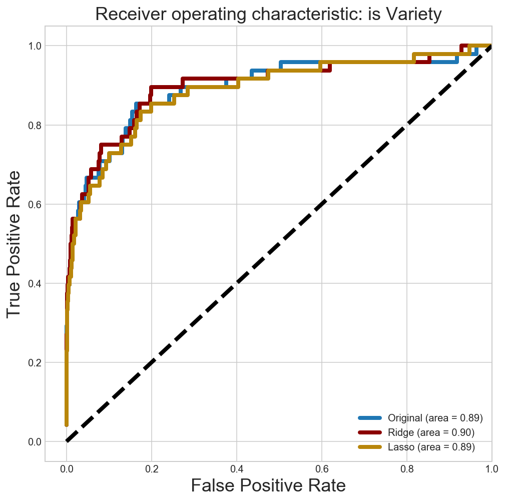


    done
    Variety is :  grapevar__Bordeaux-style Red Blend
    setup LR
    [0.96462585 0.96734694 0.94965986 0.95646259 0.96326531 0.95646259
     0.96190476 0.96190476 0.95102041 0.96326531 0.96054422 0.96866485
     0.95776567 0.96730245 0.96049046 0.96866485 0.96866485 0.96321526
     0.96457766 0.95095368 0.96185286 0.95361528 0.95907231 0.95088677
     0.94952251]
    0.9600684814319986
                 predicted_Yes  predicted_No
    Variety                183           291
    Not Variety            102          8603
    


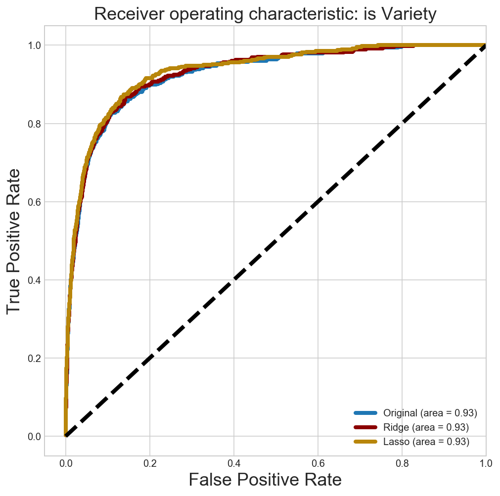


    done
    Variety is :  grapevar__Bordeaux-style White Blend
    setup LR
    [0.99183673 0.99319728 0.99183673 0.99319728 0.99183673 0.99319728
     0.99183673 0.99183673 0.99319728 0.99047619 0.99318801 0.99591281
     0.99455041 0.99318801 0.99318801 0.99182561 0.99455041 0.99318801
     0.99318801 0.99318801 0.99455041 0.99455041 0.99454297 0.99454297
     0.99454297]
    0.9932458408688091
                 predicted_Yes  predicted_No
    Variety                  4            67
    Not Variety              4          9104
    


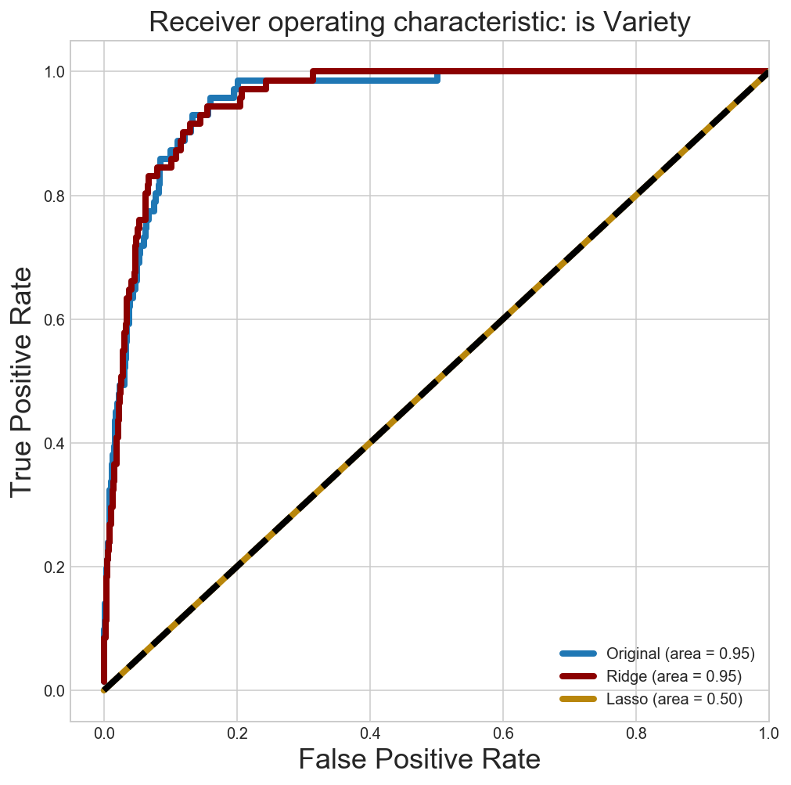


    done
    Variety is :  grapevar__Cabernet Franc
    setup LR
    [0.98505435 0.9877551  0.99319728 0.99047619 0.9877551  0.99047619
     0.98773842 0.99046322 0.98910082 0.98773842 0.98773842 0.99046322
     0.98637602 0.98910082 0.99318801 0.99182561 0.99046322 0.99046322
     0.98910082 0.99046322 0.99046322 0.99318801 0.99318801 0.99182561
     0.99182561]
    0.9899771243291773
                 predicted_Yes  predicted_No
    Variety                 16            78
    Not Variety             12          9073
    


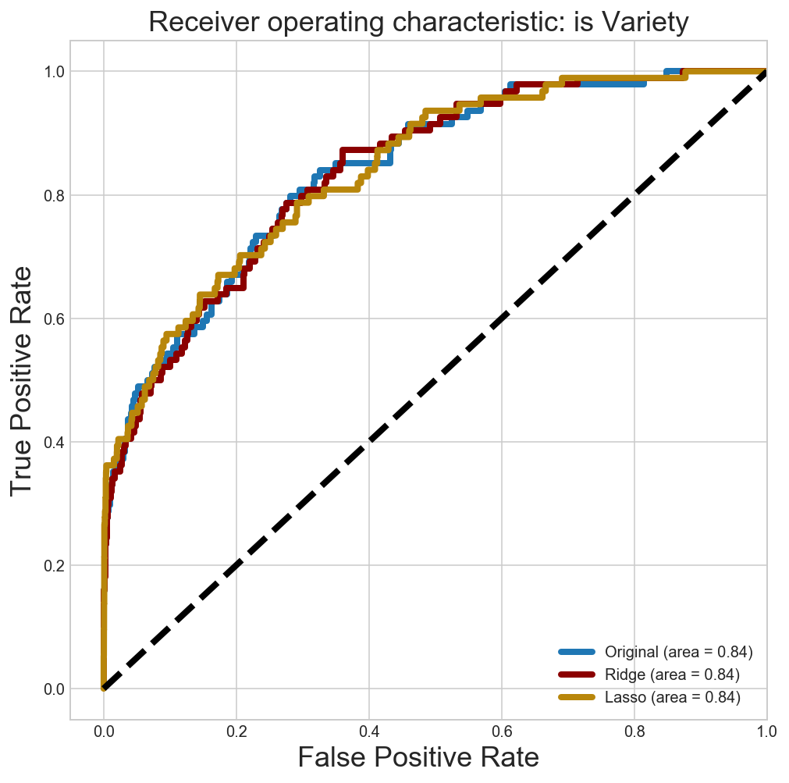


    done
    Variety is :  grapevar__Cabernet Sauvignon
    setup LR
    [0.92663043 0.92527174 0.92244898 0.9170068  0.92517007 0.93051771
     0.9346049  0.92506812 0.91416894 0.9400545  0.9346049  0.94141689
     0.95231608 0.9373297  0.94414169 0.9386921  0.9373297  0.93324251
     0.95367847 0.94822888 0.95640327 0.9346049  0.93324251 0.9373297
     0.95095368]
    0.9357782871826612
                 predicted_Yes  predicted_No
    Variety                431           406
    Not Variety            172          8170
    


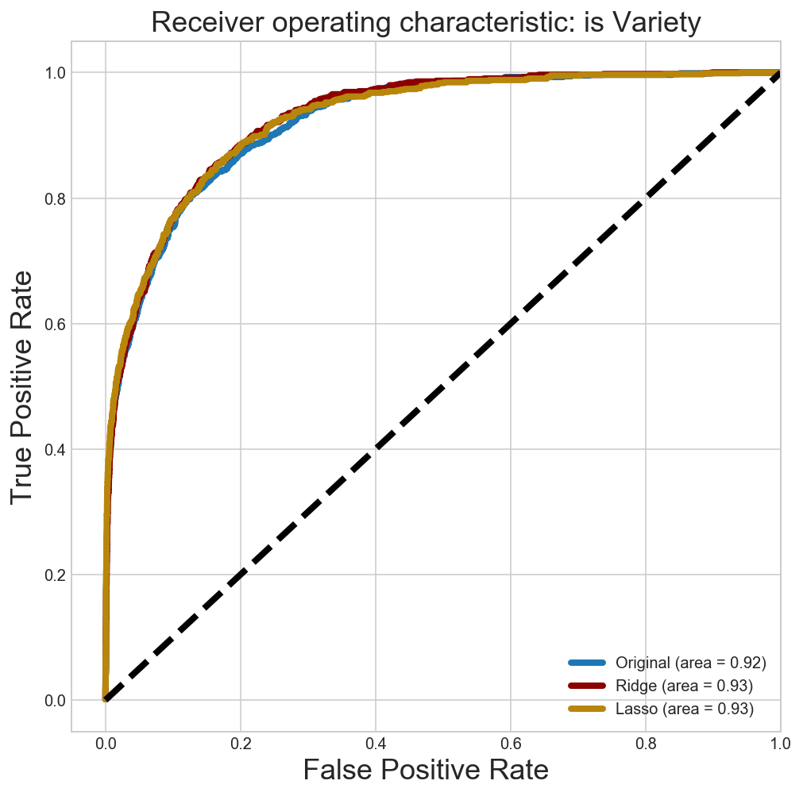


    done
    Variety is :  grapevar__Carmenère
    setup LR
    [0.99455782 0.99727891 0.99591837 0.99591837 0.99455782 0.99455782
     0.99727891 0.99183673 0.99455782 0.99455782 0.99591837 0.99591837
     0.99455782 0.99727891 0.99591837 0.99591837 0.99590723 0.99590723
     0.99454297 0.98772169 0.99181446 0.99727149 0.99317872 0.99317872
     0.99590723]
    0.9948784141214466
                 predicted_Yes  predicted_No
    Variety                  2            36
    Not Variety              3          9138
    


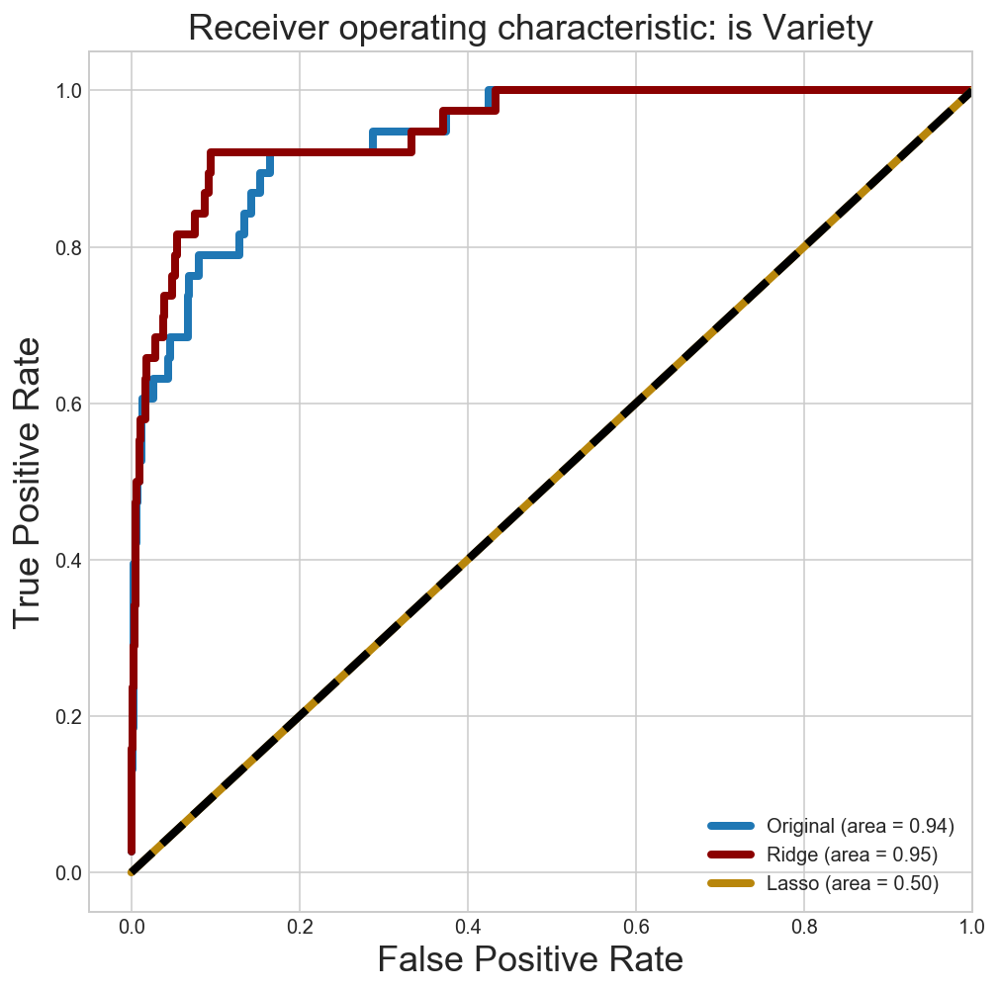


    done
    Variety is :  grapevar__Champagne Blend
    setup LR
    [0.99319728 0.99591837 0.99591837 0.99591837 0.99319728 0.99591837
     0.99455782 0.99455782 0.99455782 0.99455782 0.99319728 0.9972752
     0.99591281 0.99591281 0.99591281 0.99455041 0.99318801 0.99455041
     0.99591281 0.99591281 0.99455041 0.99590723 0.99590723 0.99454297
     0.99454297]
    0.9950430192812337
                 predicted_Yes  predicted_No
    Variety                  2            40
    Not Variety              0          9137
    


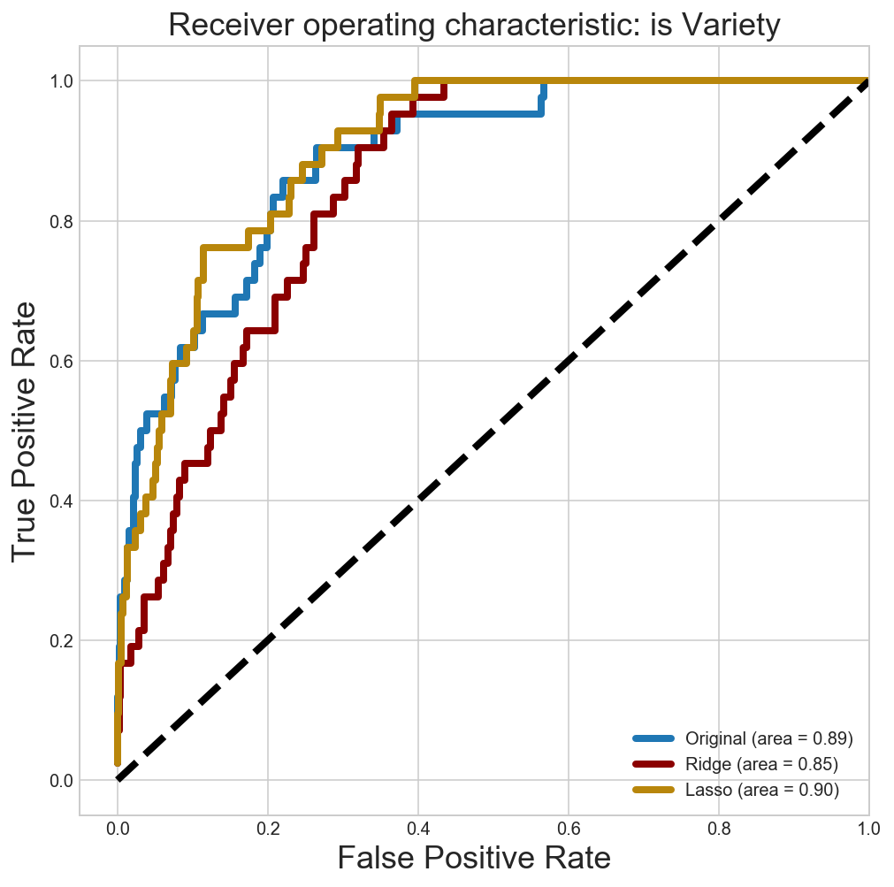


    done
    Variety is :  grapevar__Chardonnay
    setup LR
    [0.93333333 0.92108844 0.92789116 0.93197279 0.94557823 0.93605442
     0.93197279 0.9292517  0.9292517  0.94421769 0.93333333 0.93605442
     0.9537415  0.95646259 0.94550409 0.92506812 0.92779292 0.92915531
     0.95225102 0.95770805 0.95225102 0.95770805 0.9686221  0.94270123
     0.95634379]
    0.9410123913451988
                 predicted_Yes  predicted_No
    Variety                646           367
    Not Variety            200          7966
    


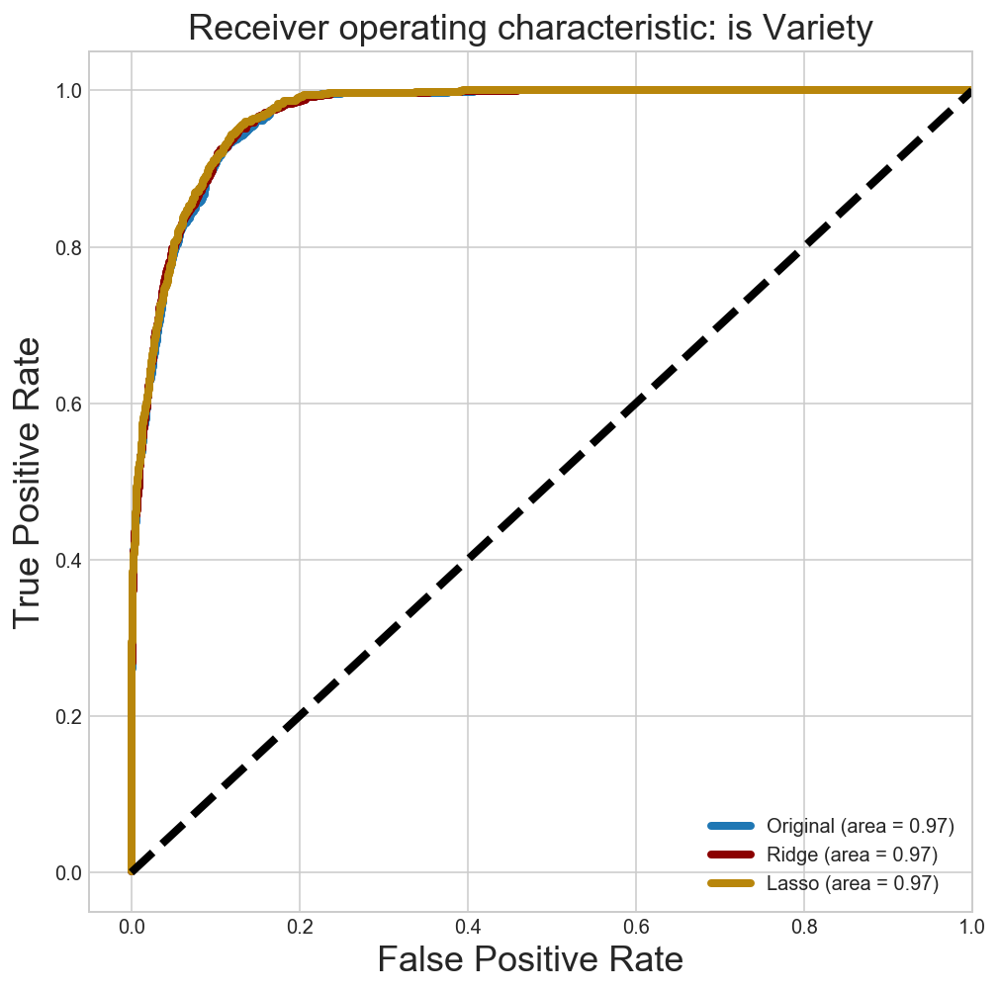


    done
    Variety is :  grapevar__Chenin Blanc
    setup LR
    [0.99183673 0.99319728 0.99319728 0.99319728 0.99455782 0.99319728
     0.99319728 0.99319728 0.99183673 0.99455782 0.99319728 0.99591281
     0.99318801 0.99455041 0.99318801 0.99591281 0.99318801 0.99455041
     0.99318801 0.99318801 0.99318801 0.99181446 0.99181446 0.99590723
     0.99181446]
    0.9934630071142173
                 predicted_Yes  predicted_No
    Variety                  0            56
    Not Variety              3          9120
    


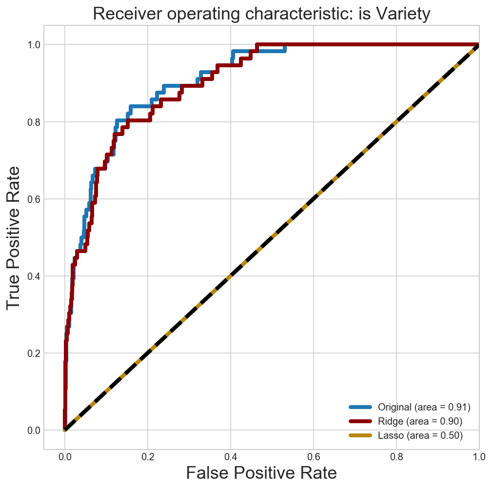


    done
    Variety is :  grapevar__Grenache
    setup LR
    [0.99048913 0.99320652 0.99319728 0.99319728 0.99183673 0.99182561
     0.99318801 0.99182561 0.99318801 0.99318801 0.99318801 0.99182561
     0.98773842 0.99455041 0.99318801 0.99318801 0.99455041 0.99318801
     0.99318801 0.99182561 0.99455041 0.99182561 0.99046322 0.99182561
     0.99318801]
    0.992537023291724
                 predicted_Yes  predicted_No
    Variety                  1            64
    Not Variety              6          9108
    


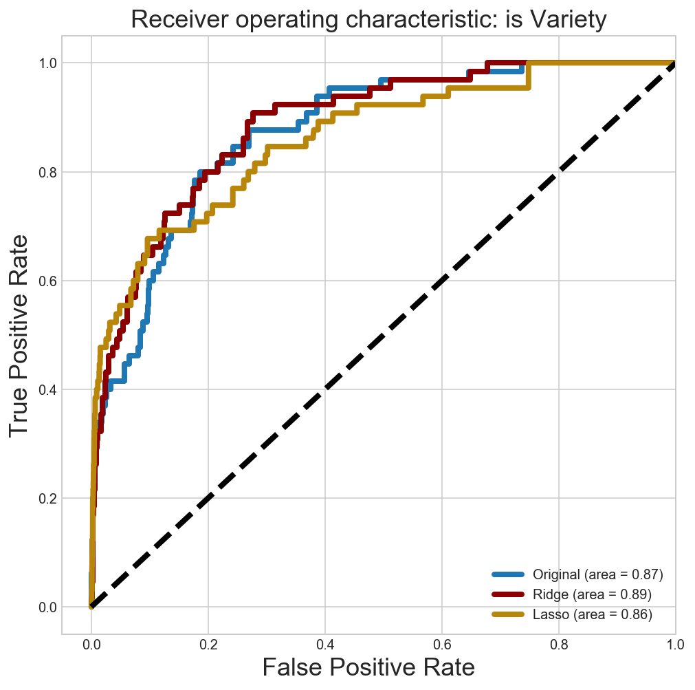


    done
    Variety is :  grapevar__Grüner Veltliner
    setup LR
    [0.99455782 0.99319728 0.99183673 0.9877551  0.99183673 0.99319728
     0.99455782 0.99047619 0.99183673 0.9877551  0.99183673 0.99319728
     0.98503401 0.99046322 0.98773842 0.99182561 0.98773842 0.98773842
     0.99182561 0.98908595 0.9904502  0.9904502  0.99181446 0.99181446
     0.9904502 ]
    0.99073880058062
                 predicted_Yes  predicted_No
    Variety                 25            69
    Not Variety              9          9076
    


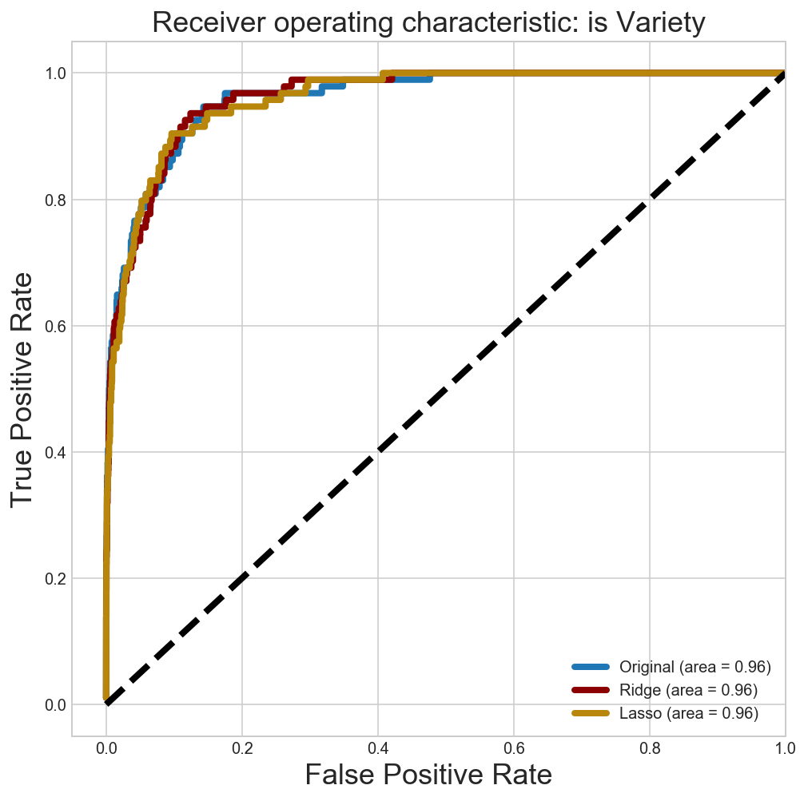


    done
    Variety is :  grapevar__Malbec
    setup LR
    [0.97278912 0.97823129 0.96734694 0.96598639 0.97823129 0.9755102
     0.9755102  0.97823129 0.97956403 0.97411444 0.97820163 0.98365123
     0.97820163 0.97820163 0.97411444 0.97820163 0.97547684 0.97275204
     0.97275204 0.96321526 0.97002725 0.97275204 0.97683924 0.97275204
     0.97407913]
    0.9746693320104732
                 predicted_Yes  predicted_No
    Variety                 92           196
    Not Variety             45          8846
    


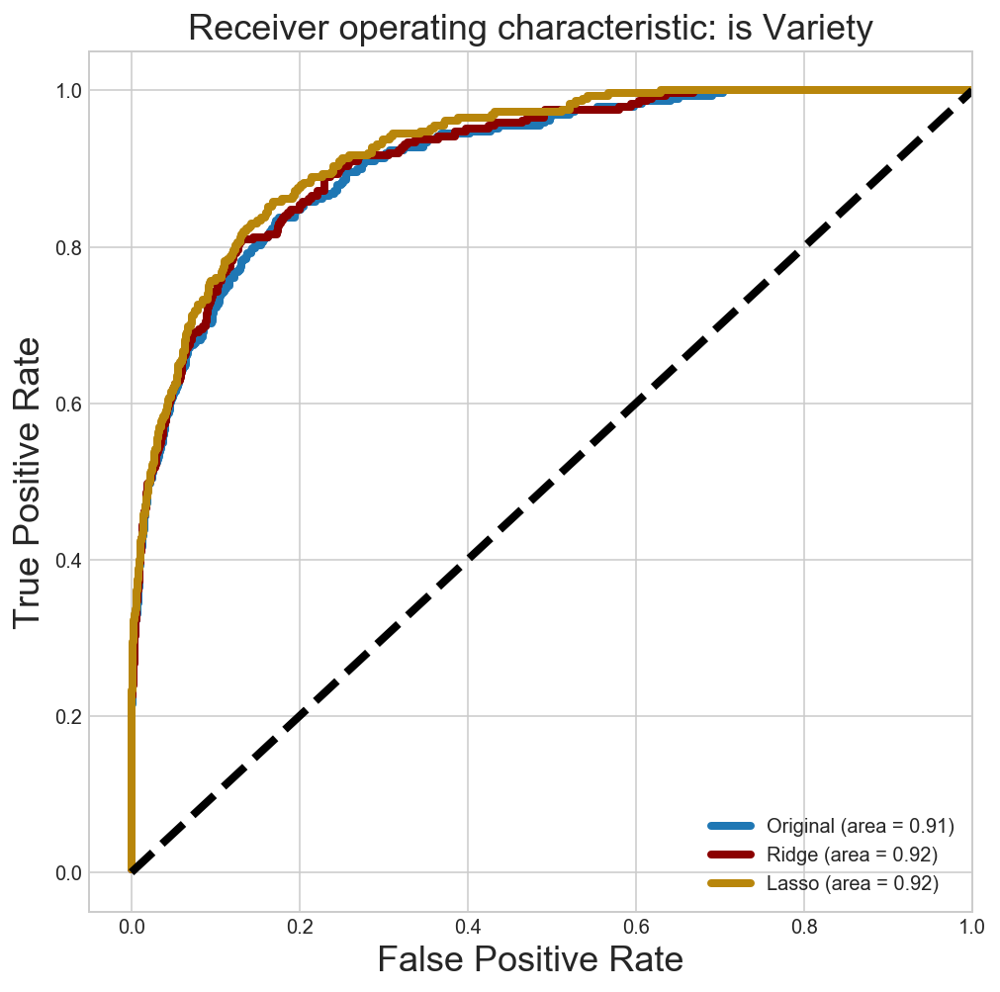


    done
    Variety is :  grapevar__Merlot
    setup LR
    [0.9673913  0.96598639 0.97006803 0.96598639 0.97142857 0.96734694
     0.97683924 0.97683924 0.98092643 0.97138965 0.97547684 0.98092643
     0.97411444 0.97683924 0.98365123 0.97956403 0.98228883 0.97683924
     0.98092643 0.97820163 0.97820163 0.98501362 0.97956403 0.98228883
     0.97820163]
    0.9762520109572084
                 predicted_Yes  predicted_No
    Variety                104           189
    Not Variety             43          8843
    


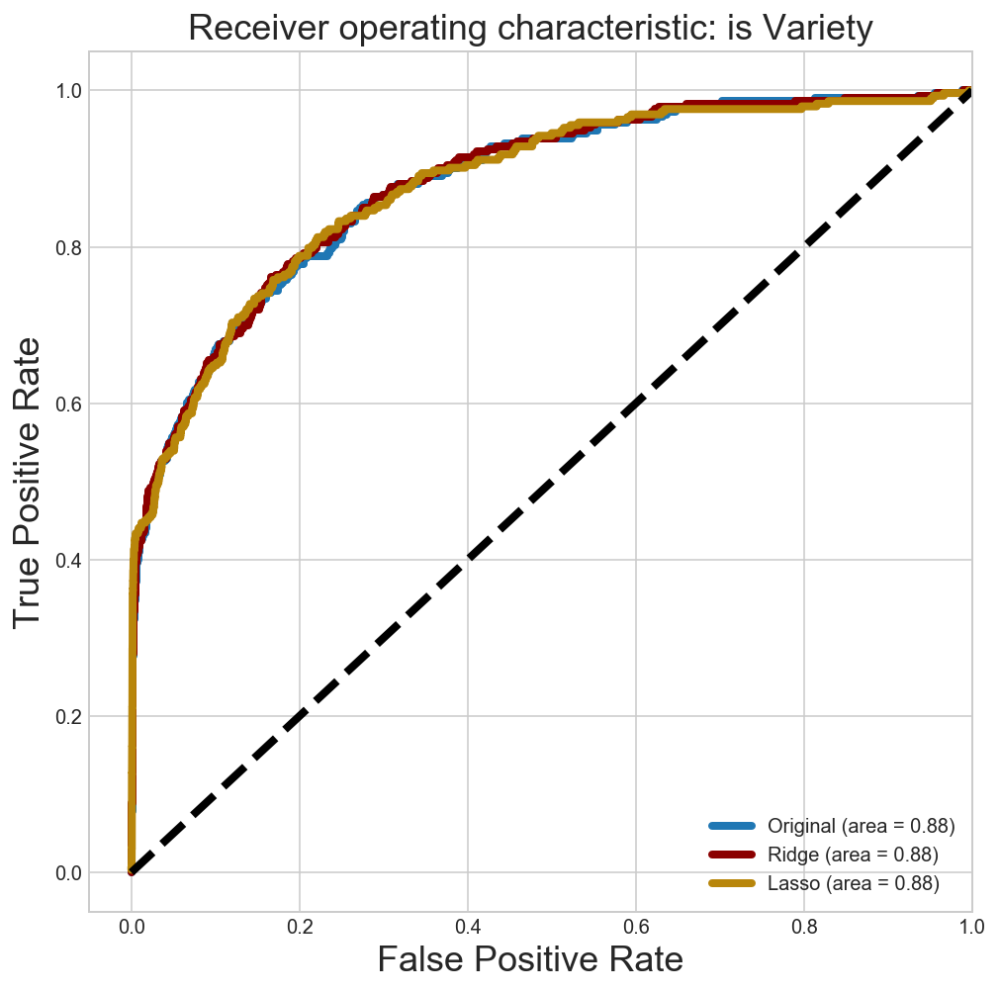


    done
    Variety is :  grapevar__Nebbiolo
    setup LR
    [0.97961957 0.98233696 0.98505435 0.98639456 0.98910082 0.98637602
     0.98637602 0.98501362 0.99318801 0.99318801 0.99046322 0.99046322
     0.98910082 0.99046322 0.99455041 0.98910082 0.99046322 0.99182561
     0.99318801 0.99455041 0.99182561 0.98910082 0.98365123 0.98365123
     0.98365123]
    0.9885078792208745
                 predicted_Yes  predicted_No
    Variety                 76            74
    Not Variety             28          9001
    


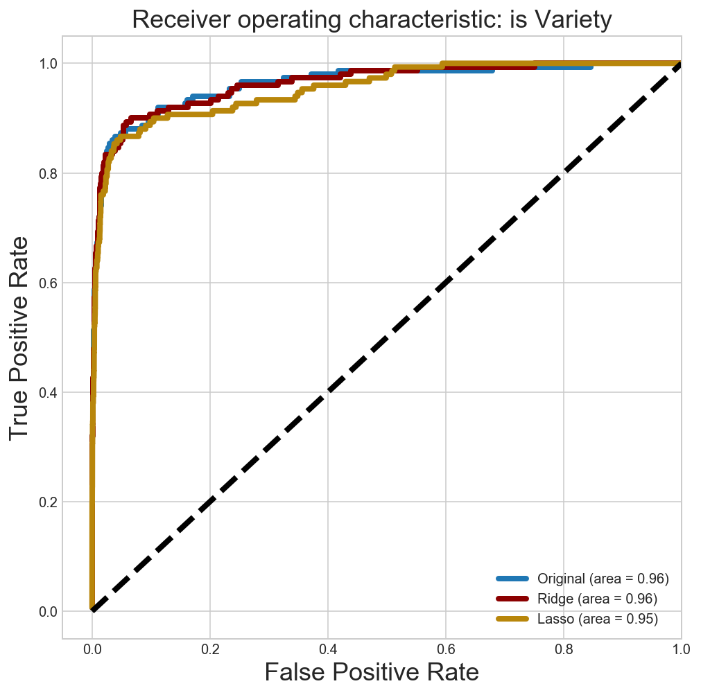


    done
    Variety is :  grapevar__Petite Sirah
    setup LR
    [0.99320652 0.99184783 0.99455782 0.99183673 0.99455782 0.99455041
     0.99591281 0.99591281 0.99318801 0.99318801 0.9986376  0.99046322
     0.99455041 0.9972752  0.99455041 0.99591281 0.99455041 0.99591281
     0.99591281 0.9972752  0.99455041 0.99591281 0.99182561 0.99318801
     0.99455041]
    0.9945530756906483
                 predicted_Yes  predicted_No
    Variety                  6            44
    Not Variety              3          9126
    


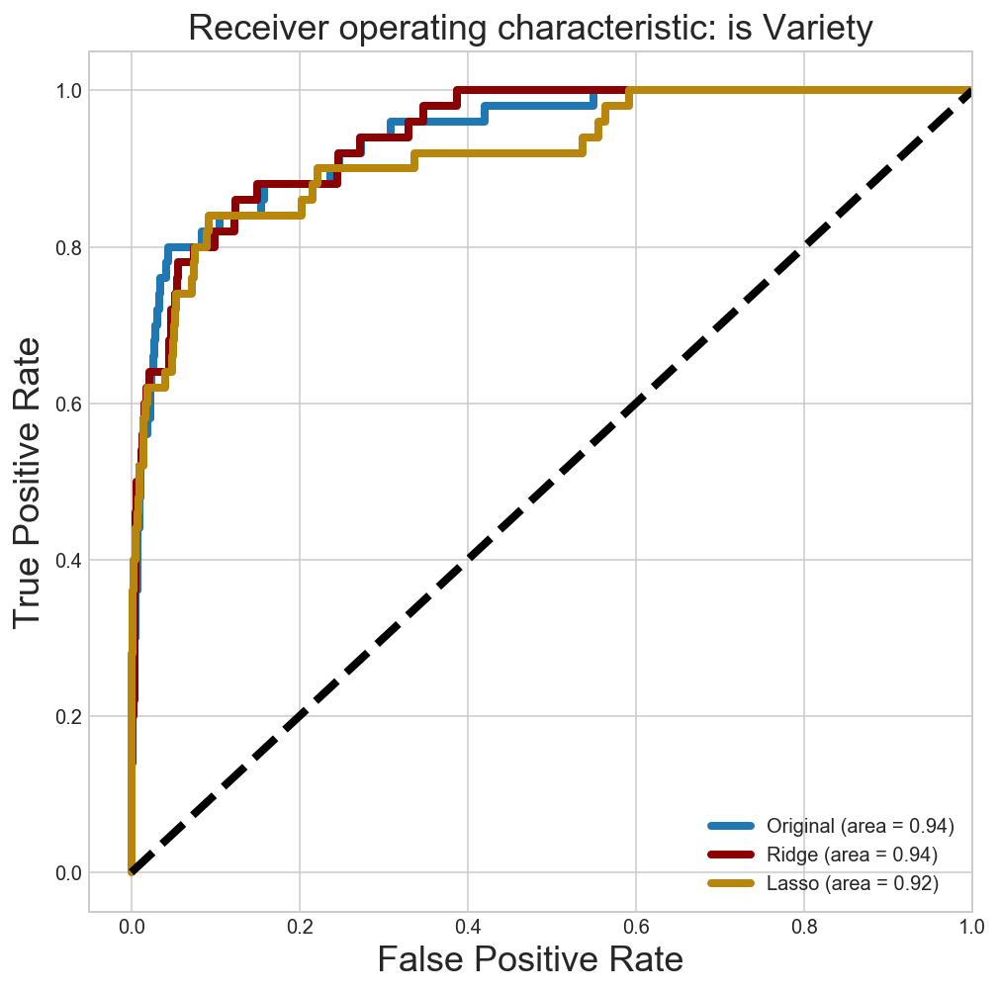


    done
    Variety is :  grapevar__Pinot Grigio
    setup LR
    [0.99183673 0.99591837 0.99319728 0.99319728 0.99455782 0.99319728
     0.99183673 0.99182561 0.99046322 0.9972752  0.99455041 0.99318801
     0.99318801 0.99318801 0.99318801 0.99182561 0.99318801 0.99046322
     0.99591281 0.99318801 0.99318801 0.99318801 0.99318801 0.99318801
     0.99182561]
    0.9931905317985504
                 predicted_Yes  predicted_No
    Variety                  7            66
    Not Variety              3          9103
    


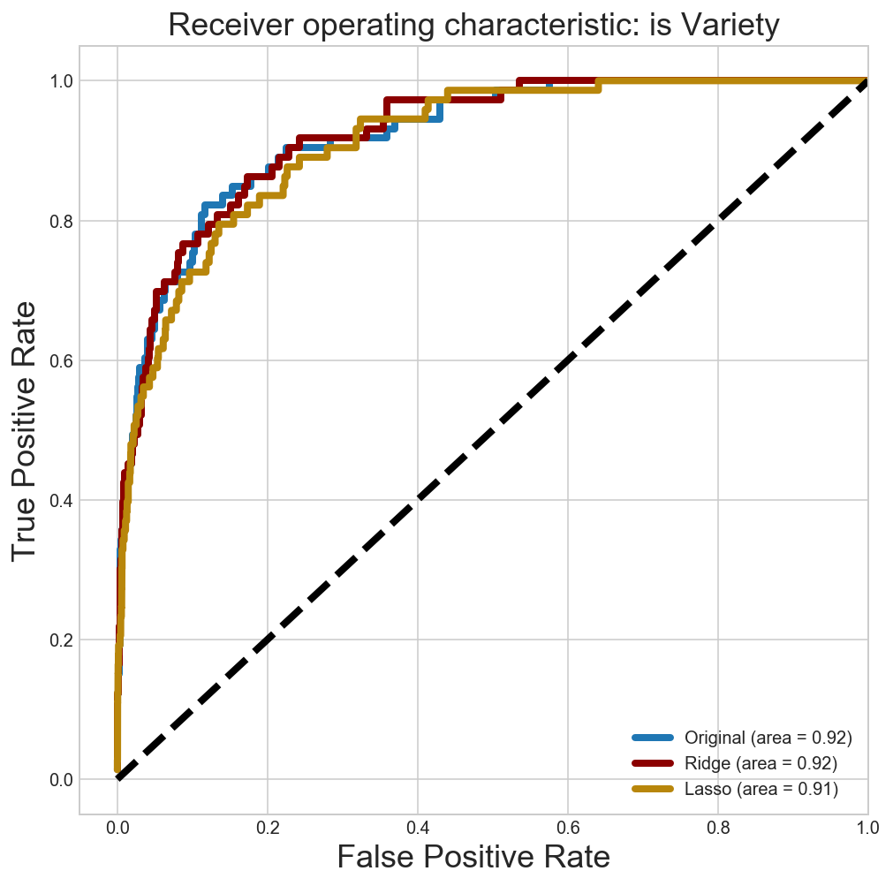


    done
    Variety is :  grapevar__Pinot Gris
    setup LR
    [0.9877551  0.99047619 0.98639456 0.99183673 0.98911565 0.98231293
     0.98095238 0.98231293 0.98773842 0.98637602 0.98365123 0.98365123
     0.98501362 0.98637602 0.98637602 0.98501362 0.97683924 0.99046322
     0.98365123 0.98501362 0.98501362 0.98501362 0.98092643 0.98773842
     0.98908595]
    0.9855639198629741
                 predicted_Yes  predicted_No
    Variety                 16           131
    Not Variety             15          9017
    


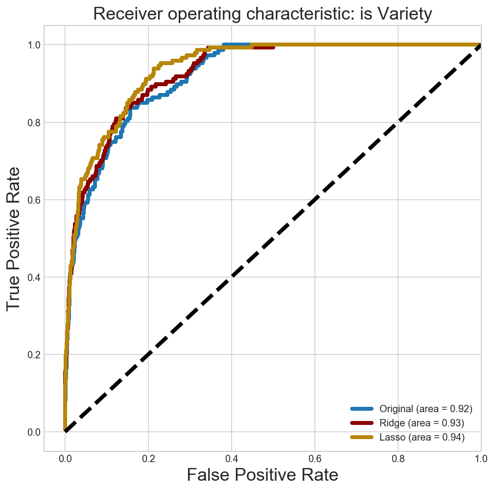


    done
    Variety is :  grapevar__Pinot Noir
    setup LR
    [0.90340136 0.90612245 0.92517007 0.92653061 0.91156463 0.93061224
     0.90612245 0.90340136 0.90068027 0.90068027 0.90599455 0.92098093
     0.91961853 0.92643052 0.92915531 0.91689373 0.9346049  0.92370572
     0.9359673  0.92370572 0.92779292 0.91144414 0.9372442  0.92905866
     0.94542974]
    0.92009250391779
                 predicted_Yes  predicted_No
    Variety                821           540
    Not Variety            217          7601
    


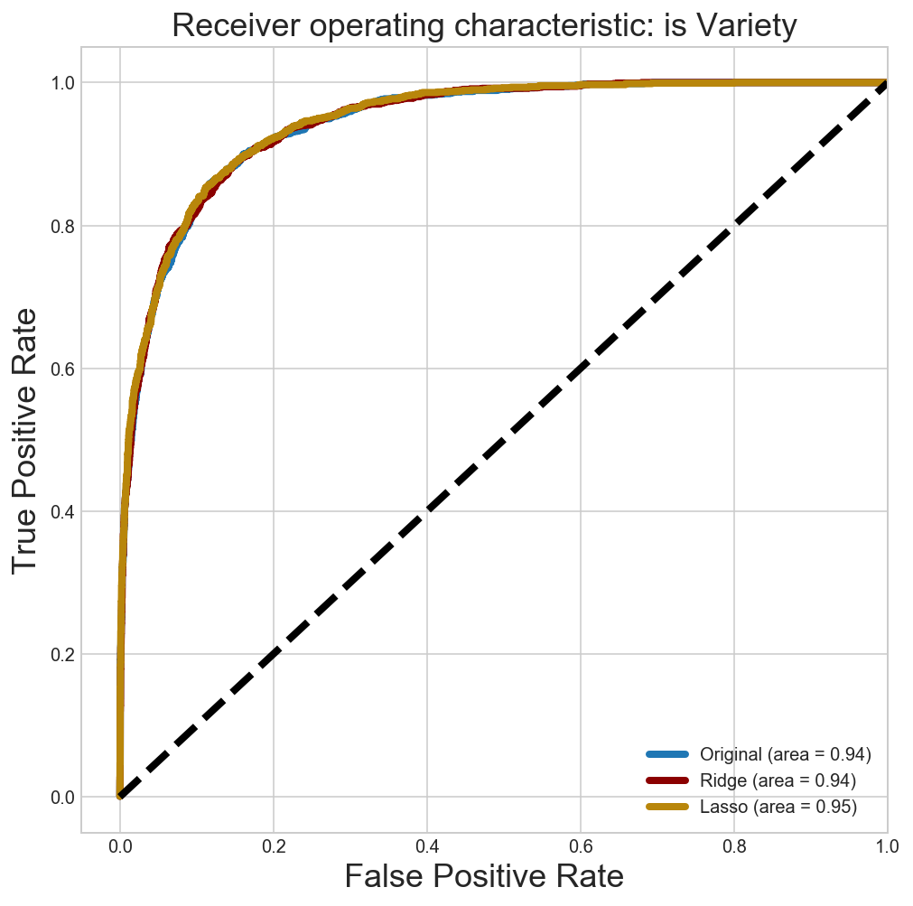


    done
    Variety is :  grapevar__Portuguese Red
    setup LR
    [0.98233696 0.97690217 0.97282609 0.97006803 0.98773842 0.97683924
     0.98092643 0.98092643 0.97547684 0.98092643 0.98092643 0.98501362
     0.98365123 0.98228883 0.98501362 0.98637602 0.98092643 0.98637602
     0.98092643 0.97820163 0.97956403 0.98092643 0.97547684 0.98228883
     0.97683924]
    0.9803905068958042
                 predicted_Yes  predicted_No
    Variety                 61           127
    Not Variety             49          8942
    


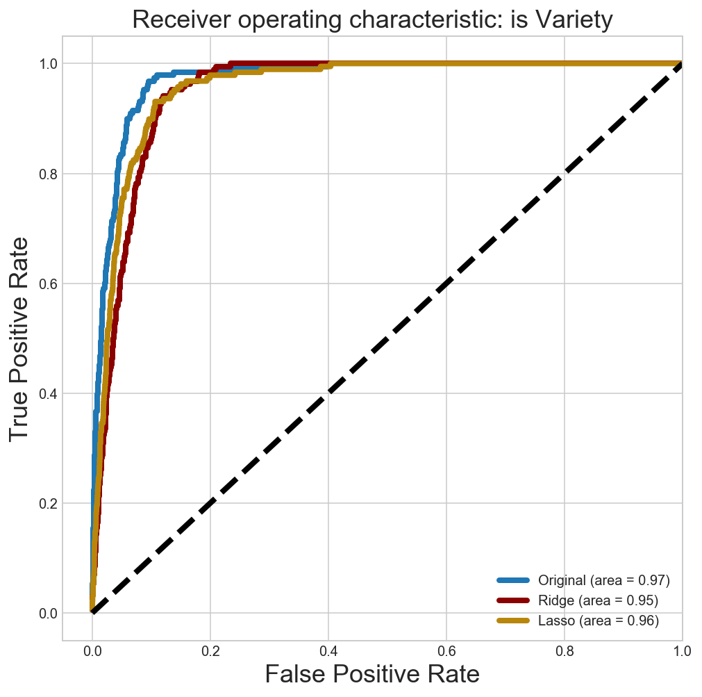


    done
    Variety is :  grapevar__Portuguese White
    setup LR
    [0.99047619 0.99183673 0.99047619 0.99183673 0.98911565 0.99319728
     0.99319728 0.99047619 0.99047619 0.98639456 0.99047619 0.99183673
     0.99182561 0.98910082 0.99318801 0.99182561 0.99182561 0.99182561
     0.99318801 0.99318801 0.99317872 0.99181446 0.99317872 0.99317872
     0.99317872]
    0.9916117020933595
                 predicted_Yes  predicted_No
    Variety                  6            59
    Not Variety              9          9105
    


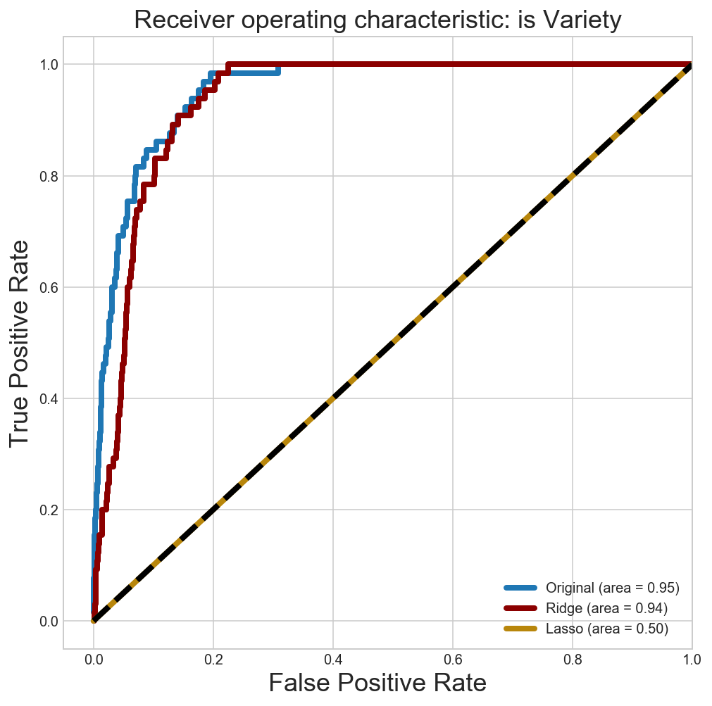


    done
    Variety is :  grapevar__Red Blend
    setup LR
    [0.9414966  0.93605442 0.92789116 0.94013605 0.93061224 0.94693878
     0.92789116 0.93197279 0.94414169 0.92915531 0.92098093 0.92098093
     0.92779292 0.92643052 0.9373297  0.93188011 0.9346049  0.93188011
     0.93324251 0.91280654 0.93188011 0.92643052 0.94959128 0.95504087
     0.94133697]
    0.9335399642383692
                 predicted_Yes  predicted_No
    Variety                331           474
    Not Variety            137          8237
    


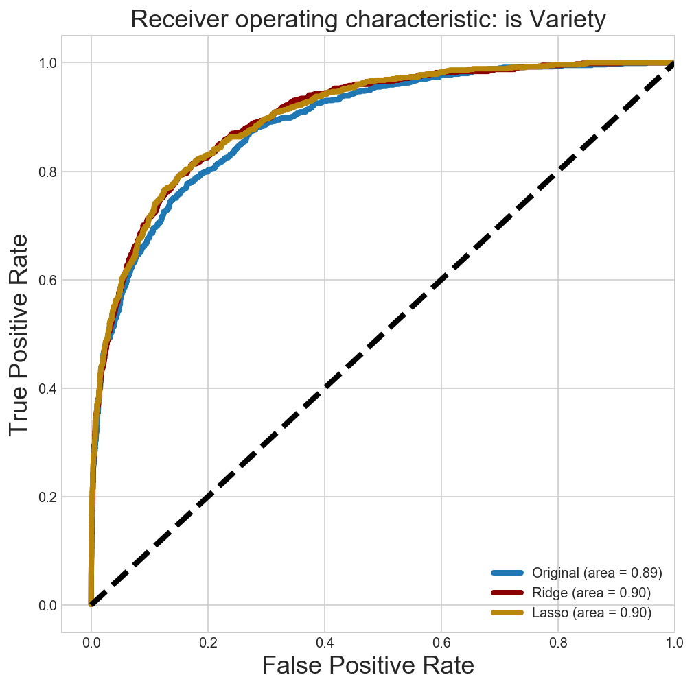


    done
    Variety is :  grapevar__Rhône-style Red Blend
    setup LR
    [0.98369565 0.99048913 0.99048913 0.9877551  0.99046322 0.98773842
     0.98637602 0.98501362 0.98637602 0.98773842 0.99046322 0.98365123
     0.98365123 0.98910082 0.98365123 0.98501362 0.98501362 0.98637602
     0.99046322 0.98773842 0.98773842 0.98228883 0.98228883 0.98365123
     0.98773842]
    0.9865985230011921
                 predicted_Yes  predicted_No
    Variety                 37            87
    Not Variety             25          9030
    


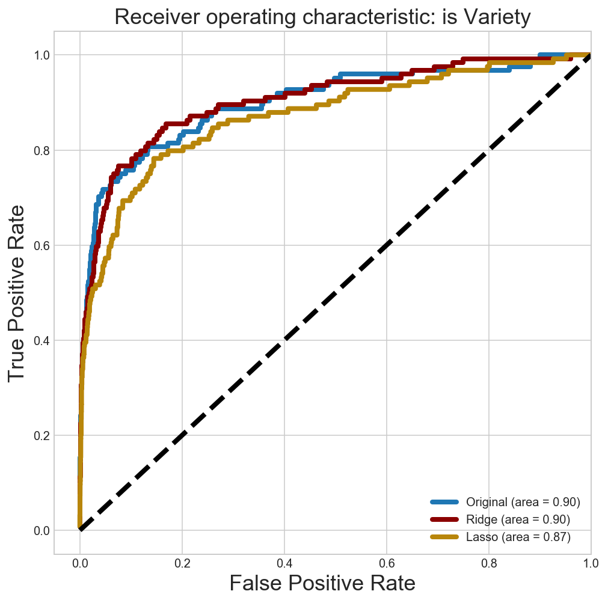


    done
    Variety is :  grapevar__Riesling
    setup LR
    [0.97554348 0.97278912 0.98367347 0.98095238 0.98911565 0.98503401
     0.98773842 0.98637602 0.97683924 0.98092643 0.97411444 0.97138965
     0.97956403 0.96457766 0.97411444 0.96730245 0.96321526 0.96457766
     0.96730245 0.96866485 0.96730245 0.97820163 0.98092643 0.97956403
     0.98773842]
    0.9763017628565465
                 predicted_Yes  predicted_No
    Variety                351           190
    Not Variety             38          8600
    


```python
value=0.82
label='Original %0.2f' % value
print(label)
```
