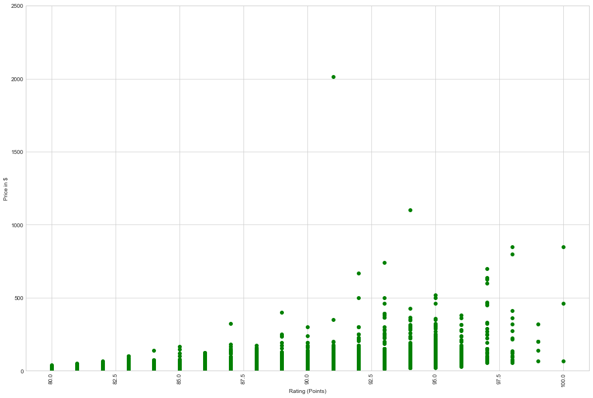
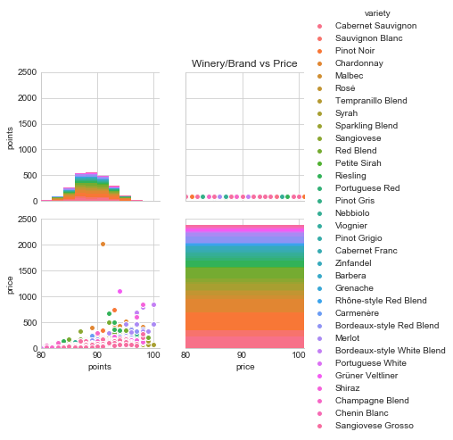
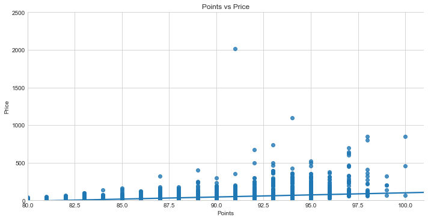
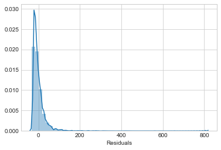
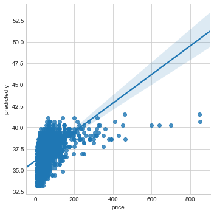
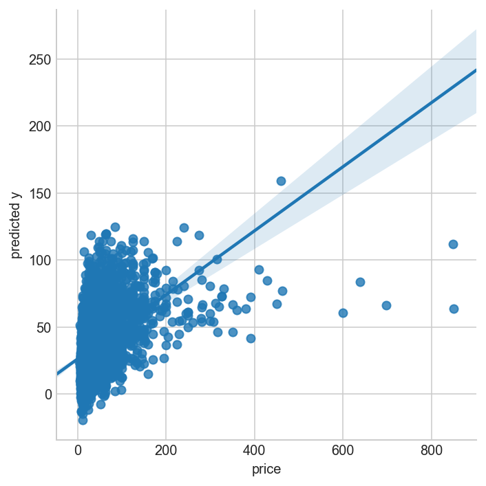
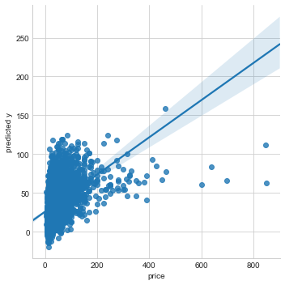

# Wine recommender system
Research questions 

Does wine descriptors impact Rating ?
  - Machine learning to classify reviews 
     what are key words that determines ratings?
     
    Apply Logistic regression, Random Forest to determine relationship between key words and ratings, wine type, varieties  
        
 There is a correlation between Ratings and Price ?
   - Correlation analysis


The higher the Rating and Price the higher the consumption of the wine variety
   - Linear Regression

 Are wine descriptors good predictors of  wine price and points rating ?

#---------------------------------

```python
import numpy as np

import csv
import pandas as pd
import matplotlib.pyplot as plt
import statsmodels.api as sm
import scipy.stats as stats

pd.options.display.max_rows = 999
pd.options.display.max_columns = 999

from sklearn import cluster
from sklearn import metrics
from sklearn.metrics import pairwise_distances


import seaborn as sns


```

```python
# path='C:/Users/bless/Documents/GitHub/projects/project-capstone/Capstone project data'
# alternate file winemag-data-130k-v2.csv

wine = pd.read_csv('C:/Users/bless/Documents/GitHub/projects/project-capstone/Wine/wine-reviews/winemag-data_first150k - Copy.csv',\
                   index_col=0,parse_dates=True,   dayfirst=True,encoding='utf-8')

```


```python
wine.head(5)
```

<table border="1" class="dataframe">
  <thead>
    <tr style="text-align: right;">
      <th></th>
      <th>country</th>
      <th>description</th>
      <th>designation</th>
      <th>points</th>
      <th>price</th>
      <th>province</th>
      <th>region_1</th>
      <th>region_2</th>
      <th>variety</th>
      <th>winery</th>
    </tr>
  </thead>
  <tbody>
    <tr>
      <th>0</th>
      <td>US</td>
      <td>This tremendous 100% varietal wine hails from ...</td>
      <td>Martha's Vineyard</td>
      <td>96</td>
      <td>235.0</td>
      <td>California</td>
      <td>Napa Valley</td>
      <td>Napa</td>
      <td>Cabernet Sauvignon</td>
      <td>Heitz</td>
    </tr>
    <tr>
      <th>1</th>
      <td>Spain</td>
      <td>Ripe aromas of fig, blackberry and cassis are ...</td>
      <td>Carodorum Selección Especial Reserva</td>
      <td>96</td>
      <td>110.0</td>
      <td>Northern Spain</td>
      <td>Toro</td>
      <td>NaN</td>
      <td>Tinta de Toro</td>
      <td>Bodega Carmen Rodríguez</td>
    </tr>
    <tr>
      <th>2</th>
      <td>US</td>
      <td>Mac Watson honors the memory of a wine once ma...</td>
      <td>Special Selected Late Harvest</td>
      <td>96</td>
      <td>90.0</td>
      <td>California</td>
      <td>Knights Valley</td>
      <td>Sonoma</td>
      <td>Sauvignon Blanc</td>
      <td>Macauley</td>
    </tr>
    <tr>
      <th>3</th>
      <td>US</td>
      <td>This spent 20 months in 30% new French oak, an...</td>
      <td>Reserve</td>
      <td>96</td>
      <td>65.0</td>
      <td>Oregon</td>
      <td>Willamette Valley</td>
      <td>Willamette Valley</td>
      <td>Pinot Noir</td>
      <td>Ponzi</td>
    </tr>
    <tr>
      <th>4</th>
      <td>France</td>
      <td>This is the top wine from La Bégude, named aft...</td>
      <td>La Brûlade</td>
      <td>95</td>
      <td>66.0</td>
      <td>Provence</td>
      <td>Bandol</td>
      <td>NaN</td>
      <td>Provence red blend</td>
      <td>Domaine de la Bégude</td>
    </tr>
  </tbody>
</table>
</div>


```python
wine.variety.unique()
```
    array(['Cabernet Sauvignon', 'Tinta de Toro', 'Sauvignon Blanc',
           'Pinot Noir', 'Provence red blend', 'Friulano', 'Tannat',
           'Chardonnay', 'Tempranillo', 'Malbec', 'Rosé', 'Tempranillo Blend',
           'Syrah', 'Mavrud', 'Sangiovese', 'Sparkling Blend',
           'Rhône-style White Blend', 'Red Blend', 'Mencía', 'Palomino',
           'Petite Sirah', 'Riesling', 'Cabernet Sauvignon-Syrah',
           'Portuguese Red', 'Nebbiolo', 'Pinot Gris', 'Meritage', 'Baga',
           'Glera', 'Malbec-Merlot', 'Merlot-Malbec', 'Ugni Blanc-Colombard',
           'Viognier', 'Cabernet Sauvignon-Cabernet Franc', 'Moscato',
           'Pinot Grigio', 'Cabernet Franc', 'White Blend', 'Monastrell',
           'Gamay', 'Zinfandel', 'Greco', 'Barbera', 'Grenache',
           'Rhône-style Red Blend', 'Albariño', 'Malvasia Bianca',
           'Assyrtiko', 'Malagouzia', 'Carmenère', 'Bordeaux-style Red Blend',
           'Touriga Nacional', 'Agiorgitiko', 'Picpoul', 'Godello',
           'Gewürztraminer', 'Merlot', 'Syrah-Grenache', 'G-S-M', 'Mourvèdre',
           'Bordeaux-style White Blend', 'Petit Verdot', 'Muscat',
           'Chenin Blanc-Chardonnay', 'Cabernet Sauvignon-Merlot',
           'Pinot Bianco', 'Alvarinho', 'Portuguese White', 'Garganega',
           'Sauvignon', 'Gros and Petit Manseng', 'Tannat-Cabernet',
           'Alicante Bouschet', 'Aragonês', 'Silvaner', 'Ugni Blanc',
           'Grüner Veltliner', 'Frappato', 'Lemberger', 'Sylvaner',
           'Chasselas', 'Alsace white blend', 'Früburgunder', 'Kekfrankos',
           'Vermentino', 'Sherry', 'Aglianico', 'Torrontés', 'Primitivo',
           'Semillon-Sauvignon Blanc', 'Portuguese Rosé', 'Grenache-Syrah',
           'Prié Blanc', 'Negrette', 'Furmint', 'Carignane', 'Pinot Blanc',
           "Nero d'Avola", 'St. Laurent', 'Blauburgunder', 'Blaufränkisch',
           'Scheurebe', 'Ribolla Gialla', 'Charbono',
           'Malbec-Cabernet Sauvignon', 'Pinot Noir-Gamay', 'Pinot Nero',
           'Gros Manseng', 'Nerello Mascalese', 'Shiraz', 'Negroamaro',
           'Champagne Blend', 'Romorantin', 'Syrah-Cabernet Sauvignon',
           'Tannat-Merlot', 'Duras', 'Garnacha', 'Tinta Francisca',
           'Portuguese Sparkling', 'Chenin Blanc', 'Turbiana',
           'Petite Verdot', 'Posip', 'Fumé Blanc', 'Roussanne', 'Grillo',
           'Müller-Thurgau', 'Pinot Auxerrois', 'Port', 'Cabernet Blend',
           'Cabernet Franc-Cabernet Sauvignon', 'Castelão', 'Encruzado',
           'Touriga Nacional-Cabernet Sauvignon', 'Colombard-Sauvignon Blanc',
           'Moscatel', 'Marsanne', 'Siria', 'Garnacha Blanca',
           'Merlot-Cabernet Sauvignon', 'Arinto', 'Petit Manseng', 'Loureiro',
           'Melon', 'Carricante', 'Fiano', 'Schwartzriesling',
           'Sangiovese-Syrah', 'Tannat-Cabernet Franc',
           'Cabernet Franc-Merlot', 'Sauvignon Blanc-Semillon', 'Macabeo',
           'Alfrocheiro', 'Aligoté', 'Verdejo', 'Grenache Blanc',
           'Fernão Pires', 'Spätburgunder', 'Ciliegiolo',
           'Cabernet Sauvignon-Carmenère', 'Auxerrois', 'Sirica', 'Zweigelt',
           'Pugnitello', 'Rosado', 'Rosato', 'Malvazija', 'Kalecik Karasi',
           'Muskat Ottonel', 'Malbec-Bonarda',
           'Tempranillo-Cabernet Sauvignon', 'Rivaner', 'Trepat', 'Baco Noir',
           'Trebbiano', 'Chardonnay-Viognier', 'Syrah-Mourvèdre', 'Graciano',
           'Roviello', 'Perricone', 'Falanghina', 'Vranec', 'Carignan',
           'Cabernet-Shiraz', 'Verdelho', 'Pedro Ximénez',
           'Marsanne-Roussanne', 'Malbec Blend', 'Weissburgunder', 'Morava',
           'Ruen', 'Hondarrabi Zuri', 'Catarratto',
           'Chardonnay-Sauvignon Blanc', 'Vidal', 'Rieslaner', 'Dornfelder',
           'Tinto Fino', 'Gelber Muskateller', 'Roter Veltliner', 'Aragonez',
           'Vitovska', 'Pinot Noir-Syrah', 'Gamay Noir', 'Grauburgunder',
           'Cannonau', 'Mauzac', 'Austrian Red Blend', 'Sémillon',
           'Lambrusco di Sorbara', 'Teran', 'Dolcetto', 'Cinsault',
           'Assyrtico', 'Teroldego', 'Tamjanika', 'Boğazkere', 'Kadarka',
           'Narince', 'Malbec-Petit Verdot', 'Veltliner', 'Traminer',
           'Lambrusco', 'Arneis', 'Cabernet Sauvignon-Shiraz',
           'Tocai Friulano', 'Fer Servadou', 'Muskateller',
           'Nerello Cappuccio', 'Moscatel Roxo', 'Elbling', 'Saperavi',
           'Antão Vaz', 'Pinot Meunier', 'Petite Syrah', 'Malvasia',
           'Malbec-Tannat', 'Kallmet', 'Syrah-Merlot', 'Montepulciano',
           'Kerner', 'Alvarinho-Chardonnay', 'Žilavka', 'Vinhão',
           'Chardonnay-Semillon', 'Carmenère-Cabernet Sauvignon',
           'Merlot-Cabernet Franc', 'Orangetraube',
           'Cabernet Sauvignon-Sangiovese', 'Okuzgozu', 'Viura',
           'Garnacha-Syrah', 'Zibibbo', 'Feteasca', 'Xarel-lo', 'Prokupac',
           'Códega do Larinho', 'Touriga Nacional Blend', 'Inzolia',
           'Cabernet-Syrah', 'Lambrusco Grasparossa', 'Malagousia',
           'Cabernet Franc-Malbec', 'Feteasca Neagra', 'Yapincak',
           'Tempranillo-Shiraz', 'Cabernet Sauvignon Grenache', 'Tinta Roriz',
           'Merlot-Syrah', 'Tinta Fina', 'Colombard-Ugni Blanc', 'Colombard',
           'Roditis', 'Grenache-Carignan', 'Emir', 'Orange Muscat',
           'Karalahna', 'Trincadeira', 'Refosco', 'Pied de Perdrix',
           'Vignoles', 'Carignan-Grenache', "Muscat d'Alexandrie", 'Bobal',
           'Symphony', 'Norton', 'Sauvignon Blanc-Sauvignon Gris',
           'Rkatsiteli', 'Roussanne-Viognier', 'Pinela', 'Blatina',
           'Shiraz-Viognier', 'Bonarda', 'Sauvignon Blanc-Chardonnay',
           'Chambourcin', 'Traminette', 'Grenache Blend', 'Jaen', 'Mondeuse',
           'Feteascǎ Regalǎ', 'Teroldego Rotaliano',
           'Sangiovese-Cabernet Sauvignon', 'Listán Negro',
           'Syrah-Petite Sirah', 'Viognier-Chardonnay', 'Kuntra', 'Jacquère',
           'Portuguiser', 'Grecanico', 'Verdejo-Viura', 'Tinto del Pais',
           'Moscato Giallo', 'Cabernet Sauvignon-Malbec', 'Mission',
           'Neuburger', 'Bastardo', 'Bical', 'Sacy', 'Carineña',
           'Garnacha-Tempranillo', 'Pecorino', 'Garnacha Blend', 'Cococciola',
           'Passerina', 'Gaglioppo', 'Garnacha Tintorera', 'Prieto Picudo',
           'Tempranillo Blanco', "Cesanese d'Affile", 'Muscat Canelli',
           'Cabernet', 'Malvasia Nera', 'Premsal', 'Mansois',
           'Welschriesling', 'Shiraz-Tempranillo', 'Verdicchio', 'Sagrantino',
           'Rolle', 'Trousseau Gris', 'Counoise', 'Mantonico',
           'Cariñena-Garnacha', 'Insolia', 'Tokaji', 'Austrian white blend',
           'Shiraz-Grenache', 'Claret', 'Syrah-Tempranillo', 'Uva di Troia',
           'Aleatico', 'Piedirosso', 'Viognier-Marsanne',
           'Pinot Grigio-Sauvignon Blanc', 'Pallagrello Nero',
           'Chardonnay-Albariño', 'Savagnin', 'Pinotage', 'Braucol',
           'Moschofilero', 'Nero di Troia', 'Carignano', 'Susumaniello',
           'Baga-Touriga Nacional', 'Vidal Blanc', 'Vernaccia',
           'Corvina, Rondinella, Molinara', 'Mavrotragano',
           'Garnacha-Monastrell', 'Lagrein', 'Cabernet Merlot',
           'Monastrell-Syrah', 'Malbec-Tempranillo', 'Syrah-Viognier',
           'Verdeca', 'Sangiovese Grosso', 'Merlot-Argaman',
           'Chenin Blanc-Viognier', 'Garnacha-Cabernet', 'Maturana', 'Malvar',
           'Airen', 'Monica', 'Gewürztraminer-Riesling', 'Prugnolo Gentile',
           'Steen', 'Chenin Blanc-Sauvignon Blanc',
           'Shiraz-Cabernet Sauvignon', 'Picolit', 'Prosecco',
           'White Riesling', 'White Port', 'Zierfandler', 'Petroulianos',
           'Mavrodaphne', 'Savatiano', 'Tempranillo-Garnacha', 'Vidadillo',
           'Syrah-Cabernet', 'Gelber Traminer', 'Grenache-Shiraz',
           'Rotgipfler', 'Cabernet Sauvignon-Tempranillo', 'Edelzwicker',
           'Cortese', 'Chardonnay Weissburgunder', 'Torbato', 'Verduzzo',
           'Debit', 'Bovale', 'Tempranillo-Merlot', 'Xinisteri',
           'Merlot-Cabernet', 'Verdejo-Sauvignon Blanc', 'Black Muscat',
           'Koshu', 'Királyleányka', 'Favorita', 'Xinomavro',
           'Cserszegi Fűszeres', 'Hárslevelü', 'Pallagrello', 'Mavroudi',
           'Muscat Blanc', 'Schiava', 'Meoru', 'Nuragus',
           'Trebbiano di Lugana', 'Coda di Volpe', 'Raboso',
           'Shiraz-Pinotage', 'Enantio', 'Greco Bianco', 'Tai', 'Tokay',
           'Muscadel', 'Cabernet Franc-Carmenère', 'Tintilia ', 'Segalin',
           'Lacrima', 'Cerceal', 'Cayuga', 'Sauvignon Gris', 'Albana',
           'Corvina', 'Macabeo-Moscatel', 'Macabeo-Chardonnay', 'Moscadello',
           'Nasco', 'Viognier-Roussanne', 'Plavac Mali',
           'Cabernet Sauvignon-Merlot-Shiraz', 'Sauvignon Blanc-Chenin Blanc',
           'Shiraz-Mourvèdre', 'Albarín', 'Black Monukka', 'Morio Muskat',
           'Nielluciu', 'Alicante', 'Cabernet Sauvignon and Tinta Roriz',
           'Viura-Chardonnay', "Loin de l'Oeil", 'Roter Traminer',
           'Karasakiz', 'Casavecchia', 'Malvasia-Viura', 'Nosiola',
           'Incrocio Manzoni', 'Viura-Verdejo', 'Erbaluce', 'Forcallà',
           'Pansa Blanca', 'Catalanesca', 'Muscadelle', 'Malbec-Syrah',
           'Petit Meslier', 'Johannisberg Riesling', 'Pignoletto',
           'Cabernet Pfeffer', 'Syrah-Cabernet Franc', 'Valdiguié', 'Mazuelo',
           'Brachetto', 'Jacquez', 'Moscofilero', 'Chardonnay-Sauvignon',
           'Madeleine Angevine', 'Ruché', 'Merlot-Petite Verdot',
           'Roussanne-Marsanne', 'Moscatel de Alejandría',
           'Muscat Blanc à Petit Grain', 'Sämling', 'Mtsvane', 'Zlahtina',
           'Zelen', 'Doña Blanca', 'Carmenère-Syrah',
           'Roussanne-Grenache Blanc', 'Kinali Yapincak', 'Robola',
           'Pinot Blanc-Chardonnay', 'Chardonnay-Pinot Blanc',
           'Saperavi-Merlot', 'Malvasia Istriana', 'Torontel', 'Picapoll',
           'Zierfandler-Rotgipfler', 'Malvasia Fina', 'Chinuri', 'Muscatel',
           'Sousão', 'Silvaner-Traminer', 'Syrah-Carignan', 'Bukettraube',
           'Muskat', 'Argaman', 'Provence white blend', 'Touriga Franca',
           'Morillon', 'Carignan-Syrah', 'Aidani', 'Viognier-Grenache Blanc',
           'Albarossa', 'Sauvignon Blanc-Verdejo', 'Grenache-Mourvèdre',
           'Tannat-Syrah', 'Seyval Blanc', 'Tocai Rosso', 'Pinot-Chardonnay',
           'Moscatel Graúdo', 'Pigato', 'Siegerrebe', 'Bombino Bianco',
           'Trebbiano-Malvasia', 'Magliocco', 'Verduzzo Friulano ',
           'Vespaiolo', 'Marzemino', 'Tempranillo-Malbec', 'Crespiello',
           'Cabernet Franc-Tempranillo', 'Gouveio', 'Caprettone',
           'Garnacha-Graciano', 'Mataro', "Pineau d'Aunis", 'Bual', 'Sercial',
           'Moscato di Noto', 'Sauvignonasse', 'Madeira Blend', 'St. George',
           'Rebula', 'Pallagrello Bianco', 'Vilana', 'Pelaverga Piccolo',
           'Syrah-Grenache-Viognier', 'Alvarelhão', 'Durif', 'Angevine',
           'Semillon-Chardonnay', 'Pinot Blanc-Pinot Noir', 'Manzoni',
           'Maréchal Foch', 'Blauer Portugieser', 'Tocai', 'Shiraz-Malbec',
           'Cabernet Moravia', 'Espadeiro', 'País', 'Altesse', 'Avesso',
           'Grignolino', 'Mandilaria', 'Freisa', 'Merlot-Shiraz', 'Dafni',
           'Xynisteri', 'Grechetto', 'Roscetto', 'Sideritis',
           'Pinotage-Merlot', 'Asprinio', 'Grolleau', 'Gragnano', 'Ansonica',
           'Sangiovese Cabernet', 'Tinta Barroca', 'Syrah-Bonarda',
           'Marsanne-Viognier', 'Azal', 'Durello', 'Syrah-Malbec',
           'Malbec-Cabernet Franc', 'Franconia', 'Rufete', 'Parraleta',
           'St. Vincent', 'Groppello', 'Athiri', 'Muscat of Alexandria',
           'Malvoisie', 'Colorino', 'Merlot-Grenache', 'Terret Blanc',
           'Chardonel', 'Macabeo-Gewürztraminer', 'Grenache Gris', 'Rabigato',
           'Muscat Hamburg', 'Sarba', 'Irsai Oliver', 'Chardonnay-Pinot Gris',
           'Vermentino Nero', 'Pardina', 'Apple', 'Clairette',
           'Sauvignon Musqué', 'Shiraz-Merlot', 'Viognier-Valdiguié',
           'Chardonelle', 'Malmsey', 'Tinta Negra Mole',
           'Pinot Grigio-Chardonnay', 'Muscadet', 'Viura-Sauvignon Blanc',
           'Huxelrebe', 'Tokay Pinot Gris', 'Chardonnay-Pinot Grigio',
           'Moristel', 'Carnelian'], dtype=object)

```python
# find null values 
wine[wine['price'].isnull()].head()
```


```python
# Do some preprocessing to limit the # of wine varities in the dataset
wine = wine[pd.notnull(wine['country'])]
wine = wine[pd.notnull(wine['price'])]
# wine = wine.drop(wine.columns[0], axis=1) 

variety_threshold = 500 # Anything that occurs less than this will be removed.
value_counts = wine['variety'].value_counts()
to_remove = value_counts[value_counts <= variety_threshold].index
wine.replace(to_remove, np.nan, inplace=True)
wine = wine[pd.notnull(wine['variety'])]
```


```python
# Check for Nan cells 
wine.isnull().sum().sum()

nan_rows_price= wine[wine['price'].isnull()].T.any().T

nan_rows_price.count()

```
    0
    
   
```python
# remove all nan prices rows 
newwine=wine[~wine['price'].isnull()]

# remove all nan rating rows 
newwine=newwine[~newwine['points'].isnull()]

```

```python
# find all the unique points ratings
newwine['points'].unique()
```


    array([ 96,  95,  94,  90,  91,  86,  89,  88,  87,  93,  92,  85,  84,
            83,  82,  81, 100,  99,  98,  97,  80], dtype=int64)


```python
# # get a smaller subset of newwine to reduce memory requirements
newwine=newwine[0:20000]
```


```python
# reduce the records to top 16 varieties  as this counts for 16991 records or 85%

winesub=newwine.loc[(newwine['variety'] == u'Pinot Noir') | (newwine['variety'] == u'Chardonnay') \
   | (newwine['variety'] == u'Cabernet Sauvignon') | (newwine['variety'] == u'Red Blend')  \
   | (newwine['variety'] == u'Bordeaux-style Red Blend') | (newwine['variety'] == u'Sauvignon Blanc') \
   | (newwine['variety'] == u'Riesling') | (newwine['variety'] == u'Syrah')                                   
   | (newwine['variety'] == u'Merlot') | (newwine['variety'] == u'Rosé')
   | (newwine['variety'] == u'Malbec') | (newwine['variety'] == u'Zinfandel') 
   | (newwine['variety'] == u'Nebbiolo') | (newwine['variety'] == u'Portuguese Red')   
   | (newwine['variety'] == u'Sangiovese') | (newwine['variety'] == u'Sparkling Blend')                                         
   | (newwine['variety'] == u'Rhône-style Red Blend') | (newwine['variety'] == u'Cabernet Franc') 
   | (newwine['variety'] == u'Champagne Blend') | (newwine['variety'] == u'Grüner Veltliner') 
   | (newwine['variety'] == u'Pinot Gris') | (newwine['variety'] == u'Gamay')                 
   | (newwine['variety'] == u'Portuguese White') | (newwine['variety'] == u'Viognier')                                          
   | (newwine['variety'] == u'Gewurztraminer') | (newwine['variety'] == u'Pinot Grigio') 
   | (newwine['variety'] == u'Petite Sirah') | (newwine['variety'] == u'Bordeaux-style White Blend') 
   | (newwine['variety'] == u'Carmenère') | (newwine['variety'] == u'Barbera')   
   | (newwine['variety'] == u'Shiraz') | (newwine['variety'] == u'Grenache') 
   | (newwine['variety'] == u'Sangiovese Grosso') | (newwine['variety'] == u'Tempranillo Blend')   
   | (newwine['variety'] == u'Chenin Blanc') ] 
```


```python
# Plot scatter plots
import matplotlib
import matplotlib.pyplot as plt
fig = plt.figure(figsize=(18,12))
ax = fig.gca()

plt.ylim(0, 2500)
plt.xlabel(r'Rating (Points)')
plt.ylabel(r'Price in $')
# plt.legend(loc='upper left')
# actual known points
plt.scatter(x = winesub['points'] ,y=winesub['price'],c='g')
plt.xticks(rotation=90)
plt.show()
```



```python
fig, ax =plt.subplots(1,2)

sns.distplot(winesub['points'],ax=ax[0])
sns.distplot(winesub['price'],ax=ax[1])

fig.show()
```


```python
# Visualise the categorisation 

g = sns.pairplot(data=winesub, hue='variety')
g = (g.set(xlim=(80,101),ylim=(0,2500)))
plt.title("Winery/Brand vs Price")
plt.show(g)

```


```python
# Plot scatter plots
import matplotlib
import matplotlib.pyplot as plt
fig = plt.figure(figsize=(18,12))
ax = fig.gca()

plt.ylim(50, 2500)
plt.xlabel(r'Country')
plt.ylabel(r'Price in $')
plt.legend(loc='upper left')
# actual known points
plt.scatter(x = winesub['country'] ,y=winesub['price'],c='r')
plt.xticks(rotation=45)
plt.show()
```


```python
import matplotlib.pyplot as plt
import seaborn as sns

a4_dims = (16, 8.27)
fig, ax = plt.subplots(figsize=a4_dims)

sns.set_style("whitegrid")
sns.barplot(x="variety", y="price", data=winesub,ax=ax)
# g = sns.lmplot(x="Segment", y="Revenue", data=winesales, aspect=2)

# g = (g.set_axis_labels("Returns","Revenue").set(xlim=(70,101),ylim=(0,120000)))
     
plt.title(" Variety vs Price")
plt.xticks(rotation=90)
 
plt.show(g)
```


```python
import matplotlib.pyplot as plt
import seaborn as sns

a4_dims = (16, 8.27)
fig, ax = plt.subplots(figsize=a4_dims)

sns.set_style("whitegrid")
sns.barplot(x="variety", y="points", data=winesub,ax=ax)
# g = sns.lmplot(x="Segment", y="Revenue", data=winesales, aspect=2)

# g = (g.set_axis_labels("Returns","Revenue").set(xlim=(70,101),ylim=(0,120000)))
     
plt.title(" Variety vs Points")
plt.xticks(rotation=70)
 
plt.show(g)
```


```python
import matplotlib.pyplot as plt
import seaborn as sns

# a4_dims = (11.7, 8.27)
# fig, ax = plt.subplots(figsize=a4_dims)
sns.set_style("whitegrid")
g = sns.lmplot(x="points", y="price", data=winesub, aspect=2,size=5)
g = (g.set_axis_labels("Points","Price").set(xlim=(80,101),ylim=(0,2500)))
plt.title("Points vs Price")
plt.show(g)

```


```python
# Remove all the 5 outliers in price ie > $1000
winetrim=winesub[winesub['price']  <= 1000]
winetrim.describe(include='all')
```

```python
winetrim=winetrim.reset_index(drop=True)
```

```python
import matplotlib.pyplot as plt
import seaborn as sns

# a4_dims = (11.7, 8.27)
# fig, ax = plt.subplots(figsize=a4_dims)
sns.set_style("whitegrid")
g = sns.lmplot(x="points", y="price", data=winetrim, aspect=2,size=5)
g = (g.set_axis_labels("Points","Price").set(xlim=(80,101),ylim=(0,800)))
plt.title("Points vs Price")
plt.show(g)
```


```python
sns.jointplot(x="points", y="price", data=winetrim)
```


```python
# transform Variety data using dummy variables 

winesubext = pd.concat([winetrim, pd.get_dummies(winetrim['variety'],prefix='grapevar_')], axis=1)
```

```python
# set the Varieties as features 

variety=[u'grapevar__Barbera',u'grapevar__Bordeaux-style Red Blend',u'grapevar__Bordeaux-style White Blend',
              u'grapevar__Cabernet Franc',u'grapevar__Cabernet Sauvignon',u'grapevar__Carmenère',u'grapevar__Champagne Blend',
              u'grapevar__Chardonnay',u'grapevar__Chenin Blanc',
              u'grapevar__Grenache',u'grapevar__Grüner Veltliner',u'grapevar__Malbec',u'grapevar__Merlot',u'grapevar__Nebbiolo',
              u'grapevar__Petite Sirah',u'grapevar__Pinot Grigio',u'grapevar__Pinot Gris',u'grapevar__Pinot Noir',
              u'grapevar__Portuguese Red',u'grapevar__Portuguese White',u'grapevar__Red Blend',u'grapevar__Rhône-style Red Blend',
              u'grapevar__Riesling',u'grapevar__Rosé',u'grapevar__Sangiovese',u'grapevar__Sangiovese Grosso',u'grapevar__Sauvignon Blanc',
              u'grapevar__Shiraz',u'grapevar__Sparkling Blend',u'grapevar__Syrah',u'grapevar__Tempranillo Blend',
              u'grapevar__Viognier',u'grapevar__Zinfandel']
winevariety=winesubext[variety]


```python
# Linear regression to determine relationships beteen X and Y 
# choose X and Y 

def lregress (X,y,labelX,labely):

    # split data into test and train and then apply cross validation 

    from sklearn.cross_validation import train_test_split
    # split the data with 50% in each set

    X1, X2, y1, y2 = train_test_split(X, y, random_state=0,
                                      train_size=0.50)
    # OLS regression 

    X = sm.add_constant(X)
    # Note the difference in argument order
    model = sm.OLS(y1, X1).fit()
    # model.summary()
    # predictions = model.predict(X) # make the predictions by the model

    y2_predicted = model.predict(X2)
    model.summary()
    # y2_model
    
    prediction_error = y2 - y2_predicted
    prediction_error

    df1 = pd.DataFrame()
    df1[labely]  = y2
#     df1[labelX] = X2
    df1['predicted y']=y2_predicted
    df1['Residuals'] = df1[labely] -df1['predicted y']
    df1[labely].dropna
    df1['predicted y'].dropna()
    df1['Residuals'].dropna()
    
   
    
    import matplotlib.pyplot as plt
    import seaborn as sns
    %matplotlib inline
  
    sns.distplot(df1['Residuals']) 
    return model.summary() ,sns.lmplot(x=labely, y='predicted y', data=df1)
         
```


```python
# choose X and Y for linear regression eg Points vs Price

nameX=input("X feature eg points: ")
namey = input('y to be predicted eg price: ')

dataX = winetrim[nameX]
datay = winetrim[namey]

lregress(dataX,datay,nameX,namey)
```

    X feature eg points: points
    y to be predicted eg price: price
    

    (<class 'statsmodels.iolib.summary.Summary'>
     """
                                 OLS Regression Results                            
     ==============================================================================
     Dep. Variable:                  price   R-squared:                       0.522
     Model:                            OLS   Adj. R-squared:                  0.522
     Method:                 Least Squares   F-statistic:                 1.004e+04
     Date:                Thu, 17 May 2018   Prob (F-statistic):               0.00
     Time:                        11:21:35   Log-Likelihood:                -45692.
     No. Observations:                9178   AIC:                         9.139e+04
     Df Residuals:                    9177   BIC:                         9.139e+04
     Df Model:                           1                                         
     Covariance Type:            nonrobust                                         
     ==============================================================================
                      coef    std err          t      P>|t|      [0.025      0.975]
     ------------------------------------------------------------------------------
     points         0.4150      0.004    100.206      0.000       0.407       0.423
     ==============================================================================
     Omnibus:                    12060.438   Durbin-Watson:                   1.988
     Prob(Omnibus):                  0.000   Jarque-Bera (JB):          3595367.884
     Skew:                           7.256   Prob(JB):                         0.00
     Kurtosis:                      98.870   Cond. No.                         1.00
     ==============================================================================
     
     Warnings:
     [1] Standard Errors assume that the covariance matrix of the errors is correctly specified.
     """, <seaborn.axisgrid.FacetGrid at 0x2265a5afda0>)






```python
# setup tokennizer NLP for wine reviews description 
from collections import defaultdict
from sklearn.cross_validation import train_test_split
import pandas as pd
import numpy as np
import scipy as sp
from sklearn.model_selection import train_test_split
from sklearn.feature_extraction.text import CountVectorizer, TfidfVectorizer
from sklearn.naive_bayes import MultinomialNB
from sklearn.linear_model import LogisticRegression
from sklearn import metrics
%matplotlib inline
# define X and y
XX = winetrim['description'].values
yy = winetrim['points'].values
zz = winetrim['price'].values
```


```python
from sklearn.feature_extraction.text import ENGLISH_STOP_WORDS

custom_stop_words = list(ENGLISH_STOP_WORDS)

# You can of course add your own custom stopwords
custom_stop_words.append('wine')
custom_stop_words.append('bordeaux')
```


```python
# use the count vectorizer to compare results 
# include 1-grams and 2-grams
vect = CountVectorizer(ngram_range=(1, 5),max_features=500,stop_words='english')
X_train_dtm = vect.fit_transform(XX)
countfeatures=vect.get_feature_names()
X_train_dtm.shape
len(countfeatures)
# # last 50 features
print (countfeatures[-50:])
```


    ['tight', 'tightly', 'time', 'toast', 'toasted', 'toasty', 'tobacco', 'tomato', 'tones', 'touch', 'touches', 'tropical', 'tropical fruit', 'valley', 'value', 'vanilla', 'varietal', 'variety', 'velvety', 'verdot', 'vibrant', 'vines', 'vineyard', 'vineyards', 'vintage', 'violet', 'warm', 'way', 'weight', 'wet', 'whiff', 'white', 'white pepper', 'wild', 'wine', 'wine offers', 'wine shows', 'winemaker', 'winery', 'wines', 'wood', 'wood aging', 'wrapped', 'year', 'years', 'yellow', 'young', 'zest', 'zesty', 'zinfandel']
    


```python
# # create a DF based on the combined vectors outputs from the count vectorizer
dfwinerate2=pd.DataFrame(data=X_train_dtm.todense(),columns=countfeatures)
# dfwinerate2.head(4)
```


```python
# Run linear regression of words vectoriser scores vs Points 
# choose X and Y for linear regression 

nameX1=input("X feature eg bag of words from vectorizer: ")
namey1 = input('y to be predicted eg points : ')

dataX1 = dfwinerate2.values
datay1 = yy

lregress(dataX1,datay1,nameX1,namey1)

```

    X feature eg bag of words from vectorizer: words
    y to be predicted eg points : points
    


    (<class 'statsmodels.iolib.summary.Summary'>
     """
                                 OLS Regression Results                            
     ==============================================================================
     Dep. Variable:                      y   R-squared:                       0.955
     Model:                            OLS   Adj. R-squared:                  0.952
     Method:                 Least Squares   F-statistic:                     366.3
     Date:                Thu, 17 May 2018   Prob (F-statistic):               0.00
     Time:                        11:23:50   Log-Likelihood:                -39971.
     No. Observations:                9178   AIC:                         8.094e+04
     Df Residuals:                    8678   BIC:                         8.451e+04
     Df Model:                         500                                         
     Covariance Type:            nonrobust                                         
     ==============================================================================
                      coef    std err          t      P>|t|      [0.025      0.975]
     ------------------------------------------------------------------------------
     x1             0.4559      1.594      0.286      0.775      -2.669       3.581
     x2             3.0031      1.664      1.805      0.071      -0.258       6.264
     x3            -1.2236      1.804     -0.678      0.498      -4.759       2.312
     x4             3.4445      1.822      1.891      0.059      -0.126       7.015
     :
     x499          -3.8866      2.446     -1.589      0.112      -8.681       0.908
     x500           0.6928      3.225      0.215      0.830      -5.630       7.016
     ==============================================================================
     Omnibus:                    11900.425   Durbin-Watson:                   1.993
     Prob(Omnibus):                  0.000   Jarque-Bera (JB):          4088433.438
     Skew:                           7.000   Prob(JB):                         0.00
     Kurtosis:                     105.445   Cond. No.                         318.
     ==============================================================================
     
     Warnings:
     [1] Standard Errors assume that the covariance matrix of the errors is correctly specified.
     """, <seaborn.axisgrid.FacetGrid at 0x2265f7f0a20>)





```python
# set up OVR logit regression for wine varieties using the word counts 

def logregress(grape_variety):
    from sklearn.model_selection import train_test_split
    from sklearn.linear_model import LogisticRegression
    from sklearn.model_selection import train_test_split
    from sklearn.metrics import accuracy_score

    # split data into Train and Test for  X and y_
    X = dfwinerate2.values  # array of 16345 rows x 500 words 
    # y = winevariety[u'grapevar__Barbera'] #array of  16345 rows x 1 for points 
    y = winevariety[grape_variety].values #array of  16345 rows x 1 for points 

    # split the new DataFrame into training and testing sets
    X_train, X_test, y_train, y_test = train_test_split(X, y, random_state=1,train_size=0.5)

    # Run Multinomial  Logit regression to check if description  terms can be used to predict variety  

    model=LogisticRegression(multi_class='ovr',solver ='newton-cg').fit(X_train,y_train)
    # print model.summary()
    yhat = model.predict(X_test)  # will output array with integer values.

#     print (yhat, model.coef_,model.score, accuracy_score(y_test, yhat))
    
    # change the array into a list 
    import numpy as np
    modelcoef=np.array(model.coef_).tolist()
    len(modelcoef)
    len(countfeatures)
    
    # split the list into individual items
    import itertools
    words = list(itertools.chain(*modelcoef))
#     words
    
#     setup a dictionary with word counts and word labels
    varietydict = dict(zip(countfeatures,words))
#     varietydict

# add accuracy score and wine variety to dictionary
    varietydict['0Accuracy'] = accuracy_score(y_test, yhat)*100
   
#     varietydict
# sort the words with largest word counts first 
    sorted_d = sorted(varietydict.items(), key=lambda x: x[1],reverse=True)
#     sorted_d
    varietydict['0Grape'] = grape_variety

    # Calculate the confusion matrix metrics for your model below.¶
    from sklearn.metrics import classification_report
    print(grape_variety,'\n',classification_report(y_test, yhat))
    

#     get top 50 words scores 
    results=[grape_variety]+sorted_d[:500]
    return results
```


```python
# Run logit regression of words vectoriser scores vs variety of grapes for all grapes variety

# choose X and Y for linear regression 
dfwinefinal= pd.DataFrame()

for w in winevariety:
    #     print(w)
    # grapename = input('enter grape variety:')
#     ugrape='grapevar__'+grapename
    ugrape=w

    dfwinefinal[ugrape]=logregress(ugrape)
dfwinefinal
```

    C:\Users\bless\Anaconda3\lib\site-packages\sklearn\model_selection\_split.py:2026: FutureWarning: From version 0.21, test_size will always complement train_size unless both are specified.
      FutureWarning)
    

    grapevar__Barbera 
                  precision    recall  f1-score   support
    
              0       0.99      1.00      1.00      9119
              1       0.90      0.15      0.26        60
    
    avg / total       0.99      0.99      0.99      9179
    
    grapevar__Bordeaux-style Red Blend 
                  precision    recall  f1-score   support
    
              0       0.97      0.99      0.98      8712
              1       0.63      0.40      0.49       467
    
    avg / total       0.95      0.96      0.95      9179
    
    grapevar__Bordeaux-style White Blend 
                  precision    recall  f1-score   support
    
              0       0.99      1.00      1.00      9117
              1       0.20      0.03      0.06        62
    
    avg / total       0.99      0.99      0.99      9179
    
    grapevar__Cabernet Franc 
                  precision    recall  f1-score   support
    
              0       0.99      1.00      0.99      9077
              1       0.57      0.08      0.14       102
    
    avg / total       0.99      0.99      0.98      9179
    
    grapevar__Cabernet Sauvignon 
                  precision    recall  f1-score   support
    
              0       0.95      0.98      0.96      8304
              1       0.73      0.48      0.58       875
    
    avg / total       0.93      0.93      0.93      9179
    
    grapevar__Carmenère 
                  precision    recall  f1-score   support
    
              0       1.00      1.00      1.00      9135
              1       0.47      0.16      0.24        44
    
    avg / total       0.99      1.00      0.99      9179
    
    

    C:\Users\bless\Anaconda3\lib\site-packages\sklearn\metrics\classification.py:1135: UndefinedMetricWarning: Precision and F-score are ill-defined and being set to 0.0 in labels with no predicted samples.
      'precision', 'predicted', average, warn_for)
    

    grapevar__Champagne Blend 
                  precision    recall  f1-score   support
    
              0       1.00      1.00      1.00      9139
              1       0.00      0.00      0.00        40
    
    avg / total       0.99      1.00      0.99      9179
    
    grapevar__Chardonnay 
                  precision    recall  f1-score   support
    
              0       0.95      0.98      0.97      8157
              1       0.78      0.63      0.70      1022
    
    avg / total       0.93      0.94      0.94      9179
    
    grapevar__Chenin Blanc 
                  precision    recall  f1-score   support
    
              0       0.99      1.00      1.00      9124
              1       0.44      0.07      0.12        55
    
    avg / total       0.99      0.99      0.99      9179
    
    grapevar__Grenache 
                  precision    recall  f1-score   support
    
              0       0.99      1.00      1.00      9114
              1       0.80      0.12      0.21        65
    
    avg / total       0.99      0.99      0.99      9179
    
    grapevar__Grüner Veltliner 
                  precision    recall  f1-score   support
    
              0       0.99      1.00      1.00      9087
              1       0.56      0.21      0.30        92
    
    avg / total       0.99      0.99      0.99      9179
    
    grapevar__Malbec 
                  precision    recall  f1-score   support
    
              0       0.98      0.99      0.99      8899
              1       0.67      0.34      0.45       280
    
    avg / total       0.97      0.97      0.97      9179
    
    grapevar__Merlot 
                  precision    recall  f1-score   support
    
              0       0.98      0.99      0.99      8909
              1       0.69      0.40      0.50       270
    
    avg / total       0.97      0.98      0.97      9179
    
    grapevar__Nebbiolo 
                  precision    recall  f1-score   support
    
              0       0.99      1.00      0.99      9028
              1       0.75      0.54      0.63       151
    
    avg / total       0.99      0.99      0.99      9179
    
    grapevar__Petite Sirah 
                  precision    recall  f1-score   support
    
              0       0.99      1.00      1.00      9116
              1       0.53      0.13      0.21        63
    
    avg / total       0.99      0.99      0.99      9179
    
    grapevar__Pinot Grigio 
                  precision    recall  f1-score   support
    
              0       0.99      1.00      1.00      9121
              1       0.69      0.16      0.25        58
    
    avg / total       0.99      0.99      0.99      9179
    
    grapevar__Pinot Gris 
                  precision    recall  f1-score   support
    
              0       0.99      1.00      0.99      9041
              1       0.52      0.16      0.24       138
    
    avg / total       0.98      0.99      0.98      9179
    
    grapevar__Pinot Noir 
                  precision    recall  f1-score   support
    
              0       0.93      0.97      0.95      7821
              1       0.80      0.60      0.69      1358
    
    avg / total       0.91      0.92      0.91      9179
    
    grapevar__Portuguese Red 
                  precision    recall  f1-score   support
    
              0       0.99      1.00      0.99      9002
              1       0.58      0.28      0.37       177
    
    avg / total       0.98      0.98      0.98      9179
    
    grapevar__Portuguese White 
                  precision    recall  f1-score   support
    
              0       0.99      1.00      1.00      9120
              1       0.19      0.07      0.10        59
    
    avg / total       0.99      0.99      0.99      9179
    
    grapevar__Red Blend 
                  precision    recall  f1-score   support
    
              0       0.95      0.98      0.96      8375
              1       0.67      0.44      0.53       804
    
    avg / total       0.92      0.93      0.93      9179
    
    grapevar__Rhône-style Red Blend 
                  precision    recall  f1-score   support
    
              0       0.99      1.00      0.99      9038
              1       0.56      0.21      0.30       141
    
    avg / total       0.98      0.99      0.98      9179
    
    grapevar__Riesling 
                  precision    recall  f1-score   support
    
              0       0.98      0.99      0.99      8647
              1       0.85      0.69      0.76       532
    
    avg / total       0.97      0.98      0.97      9179
    
    grapevar__Rosé 
                  precision    recall  f1-score   support
    
              0       0.98      1.00      0.99      8842
              1       0.82      0.53      0.64       337
    
    avg / total       0.98      0.98      0.98      9179
    
    grapevar__Sangiovese 
                  precision    recall  f1-score   support
    
              0       0.98      0.99      0.99      8943
              1       0.57      0.37      0.45       236
    
    avg / total       0.97      0.98      0.97      9179
    
    grapevar__Sangiovese Grosso 
                  precision    recall  f1-score   support
    
              0       0.99      1.00      1.00      9046
              1       0.82      0.57      0.67       133
    
    avg / total       0.99      0.99      0.99      9179
    
    grapevar__Sauvignon Blanc 
                  precision    recall  f1-score   support
    
              0       0.97      0.99      0.98      8723
              1       0.70      0.41      0.52       456
    
    avg / total       0.96      0.96      0.96      9179
    
    grapevar__Shiraz 
                  precision    recall  f1-score   support
    
              0       0.99      1.00      1.00      9095
              1       0.58      0.26      0.36        84
    
    avg / total       0.99      0.99      0.99      9179
    
    grapevar__Sparkling Blend 
                  precision    recall  f1-score   support
    
              0       0.99      1.00      0.99      9059
              1       0.48      0.09      0.15       120
    
    avg / total       0.98      0.99      0.98      9179
    
    grapevar__Syrah 
                  precision    recall  f1-score   support
    
              0       0.97      0.99      0.98      8715
              1       0.75      0.38      0.50       464
    
    avg / total       0.96      0.96      0.96      9179
    
    grapevar__Tempranillo Blend 
                  precision    recall  f1-score   support
    
              0       0.99      1.00      1.00      9104
              1       0.61      0.15      0.24        75
    
    avg / total       0.99      0.99      0.99      9179
    
    grapevar__Viognier 
                  precision    recall  f1-score   support
    
              0       0.99      1.00      0.99      9071
              1       0.33      0.04      0.07       108
    
    avg / total       0.98      0.99      0.98      9179
    
    grapevar__Zinfandel 
                  precision    recall  f1-score   support
    
              0       0.98      1.00      0.99      8928
              1       0.64      0.28      0.39       251
    
    avg / total       0.97      0.98      0.97      9179
    
    


<table border="1" class="dataframe">
  <thead>
    <tr style="text-align: right;">
      <th></th>
      <th>grapevar__Barbera</th>
      <th>grapevar__Bordeaux-style Red Blend</th>
      <th>grapevar__Bordeaux-style White Blend</th>
      <th>grapevar__Cabernet Franc</th>
      <th>grapevar__Cabernet Sauvignon</th>
      <th>grapevar__Carmenère</th>
      <th>grapevar__Champagne Blend</th>
      <th>grapevar__Chardonnay</th>
      <th>grapevar__Chenin Blanc</th>
      <th>grapevar__Grenache</th>
      <th>grapevar__Grüner Veltliner</th>
      <th>grapevar__Malbec</th>
      <th>grapevar__Merlot</th>
      <th>grapevar__Nebbiolo</th>
      <th>grapevar__Petite Sirah</th>
      <th>grapevar__Pinot Grigio</th>
      <th>grapevar__Pinot Gris</th>
      <th>grapevar__Pinot Noir</th>
      <th>grapevar__Portuguese Red</th>
      <th>grapevar__Portuguese White</th>
      <th>grapevar__Red Blend</th>
      <th>grapevar__Rhône-style Red Blend</th>
      <th>grapevar__Riesling</th>
      <th>grapevar__Rosé</th>
      <th>grapevar__Sangiovese</th>
      <th>grapevar__Sangiovese Grosso</th>
      <th>grapevar__Sauvignon Blanc</th>
      <th>grapevar__Shiraz</th>
      <th>grapevar__Sparkling Blend</th>
      <th>grapevar__Syrah</th>
      <th>grapevar__Tempranillo Blend</th>
      <th>grapevar__Viognier</th>
      <th>grapevar__Zinfandel</th>
    </tr>
  </thead>
 <tbody>
    <tr>
      <th>0</th>
      <td>grapevar__Barbera</td>
      <td>grapevar__Bordeaux-style Red Blend</td>
      <td>grapevar__Bordeaux-style White Blend</td>
      <td>grapevar__Cabernet Franc</td>
      <td>grapevar__Cabernet Sauvignon</td>
      <td>grapevar__Carmenère</td>
      <td>grapevar__Champagne Blend</td>
      <td>grapevar__Chardonnay</td>
      <td>grapevar__Chenin Blanc</td>
      <td>grapevar__Grenache</td>
      <td>grapevar__Grüner Veltliner</td>
      <td>grapevar__Malbec</td>
      <td>grapevar__Merlot</td>
      <td>grapevar__Nebbiolo</td>
      <td>grapevar__Petite Sirah</td>
      <td>grapevar__Pinot Grigio</td>
      <td>grapevar__Pinot Gris</td>
      <td>grapevar__Pinot Noir</td>
      <td>grapevar__Portuguese Red</td>
      <td>grapevar__Portuguese White</td>
      <td>grapevar__Red Blend</td>
      <td>grapevar__Rhône-style Red Blend</td>
      <td>grapevar__Riesling</td>
      <td>grapevar__Rosé</td>
      <td>grapevar__Sangiovese</td>
      <td>grapevar__Sangiovese Grosso</td>
      <td>grapevar__Sauvignon Blanc</td>
      <td>grapevar__Shiraz</td>
      <td>grapevar__Sparkling Blend</td>
      <td>grapevar__Syrah</td>
      <td>grapevar__Tempranillo Blend</td>
      <td>grapevar__Viognier</td>
      <td>grapevar__Zinfandel</td>
    </tr>
    <tr>
      <th>1</th>
      <td>(0Accuracy, 99.4334894868722)</td>
      <td>(0Accuracy, 95.78385445037586)</td>
      <td>(0Accuracy, 99.25917855975597)</td>
      <td>(0Accuracy, 98.91055670552348)</td>
      <td>(0Accuracy, 93.37618476958275)</td>
      <td>(0Accuracy, 99.50975051748556)</td>
      <td>(0Accuracy, 99.56422268220939)</td>
      <td>(0Accuracy, 93.87732868504195)</td>
      <td>(0Accuracy, 99.38991175509315)</td>
      <td>(0Accuracy, 99.35722845625885)</td>
      <td>(0Accuracy, 99.04128990086066)</td>
      <td>(0Accuracy, 97.48338598975923)</td>
      <td>(0Accuracy, 97.7121690815993)</td>
      <td>(0Accuracy, 98.94324000435776)</td>
      <td>(0Accuracy, 99.32454515742457)</td>
      <td>(0Accuracy, 99.42259505392744)</td>
      <td>(0Accuracy, 98.51835711951193)</td>
      <td>(0Accuracy, 91.9163307549842)</td>
      <td>(0Accuracy, 98.2133129970585)</td>
      <td>(0Accuracy, 99.2156008279769)</td>
      <td>(0Accuracy, 93.18008497657698)</td>
      <td>(0Accuracy, 98.5292515524567)</td>
      <td>(0Accuracy, 97.50517485564878)</td>
      <td>(0Accuracy, 97.85379670988125)</td>
      <td>(0Accuracy, 97.66859134982025)</td>
      <td>(0Accuracy, 99.19381196208738)</td>
      <td>(0Accuracy, 96.20873733522171)</td>
      <td>(0Accuracy, 99.15023423030831)</td>
      <td>(0Accuracy, 98.6817736136834)</td>
      <td>(0Accuracy, 96.21963176816647)</td>
      <td>(0Accuracy, 99.22649526092167)</td>
      <td>(0Accuracy, 98.77982351018629)</td>
      <td>(0Accuracy, 97.5923303192069)</td>
    </tr>
  <tr>
      <th>2</th>
      <td>(rustic, 1.58821842600217)</td>
      <td>(bordeaux, 3.6307988711855566)</td>
      <td>(bordeaux, 1.647273718603005)</td>
      <td>(franc, 3.4738475377857703)</td>
      <td>(cabernet, 3.7607686017645405)</td>
      <td>(herbal, 1.4906672282973736)</td>
      <td>(imported, 1.6356335529102848)</td>
      <td>(chardonnay, 3.6819981868224394)</td>
      <td>(blanc, 1.8920618138832392)</td>
      <td>(grenache, 3.514189710811217)</td>
      <td>(pepper, 2.0799442699385855)</td>
      <td>(malbec, 4.621293742224699)</td>
      <td>(merlot, 4.5957206290696515)</td>
      <td>(rose, 2.273934548926491)</td>
      <td>(petite, 2.1332126610716804)</td>
      <td>(pinot, 2.2112649475277957)</td>
      <td>(pinot, 2.238654726705246)</td>
      <td>(pinot, 3.0196854169791827)</td>
      <td>(tones, 1.3316705622581415)</td>
      <td>(yellow, 1.171287972118399)</td>
      <td>(blend, 2.598167471837502)</td>
      <td>(grenache, 2.605256631853284)</td>
      <td>(riesling, 4.980369452380658)</td>
      <td>(rosé, 3.3751989873914874)</td>
      <td>(sangiovese, 3.7290671584312127)</td>
      <td>(mouthfeel, 1.301121250541352)</td>
      <td>(sauvignon, 2.215733677071748)</td>
      <td>(imported, 1.8395423455751196)</td>
      <td>(blanc, 1.5086867852170414)</td>
      <td>(syrah, 3.883705977599147)</td>
      <td>(based, 1.854352260214622)</td>
      <td>(grown, 1.3263526809880988)</td>
      <td>(zinfandel, 3.47389728665967)</td>
    </tr>
    <tr>
      <th>3</th>
      <td>(make, 1.2725508256807259)</td>
      <td>(black currant, 1.550200134742251)</td>
      <td>(skin, 1.4081180909916895)</td>
      <td>(touches, 1.532805189453775)</td>
      <td>(cab, 3.436179312921762)</td>
      <td>(olive, 1.3445630930224406)</td>
      <td>(bouquet, 1.3850863209127005)</td>
      <td>(toast, 1.546926537327742)</td>
      <td>(melon, 1.5315114639448542)</td>
      <td>(texture, 1.4040539639709593)</td>
      <td>(pear, 1.5908290460237904)</td>
      <td>(blueberry, 1.162224557194185)</td>
      <td>(blue, 1.3090940578232262)</td>
      <td>(espresso, 1.3564033550468317)</td>
      <td>(blueberry, 1.3358738132297567)</td>
      <td>(price, 1.3261610567179274)</td>
      <td>(pear, 1.629108869012912)</td>
      <td>(tea, 1.7530098567346715)</td>
      <td>(open, 1.2711540497658396)</td>
      <td>(cool, 1.116373956837003)</td>
      <td>(syrah, 1.3532553691784497)</td>
      <td>(blend, 1.4779777281140132)</td>
      <td>(imported, 2.115871947249675)</td>
      <td>(caramel, 1.8768402818547065)</td>
      <td>(fleshy, 1.2737623689672064)</td>
      <td>(intensity, 1.2422571043413653)</td>
      <td>(green, 1.3130440848326754)</td>
      <td>(vanilla, 1.5602251841551746)</td>
      <td>(does, 1.3581187665847432)</td>
      <td>(boysenberry, 1.7342693881561584)</td>
      <td>(aromas, 1.3954786568407551)</td>
      <td>(apricot, 1.3047743467027602)</td>
      <td>(aromas flavors, 1.5647212836191304)</td>
    </tr>
    <tr>
      <th>499</th>
      <td>(blend, -0.9174860521002535)</td>
      <td>(citrus, -1.6765179939714632)</td>
      <td>(red, -1.40712135258259)</td>
      <td>(tea, -1.1952006362918628)</td>
      <td>(pinot, -2.5043100632105673)</td>
      <td>(cassis, -0.9979503946406653)</td>
      <td>(drink, -1.0884473255347462)</td>
      <td>(riesling, -2.721111306007867)</td>
      <td>(cherry, -0.9805261948625021)</td>
      <td>(peach, -1.037498667763273)</td>
      <td>(gives, -1.26268308968195)</td>
      <td>(syrah, -2.043650827808263)</td>
      <td>(zinfandel, -1.8056737070943543)</td>
      <td>(sangiovese, -1.4399501192586575)</td>
      <td>(syrah, -0.8659557749792264)</td>
      <td>(scents, -1.0963434538367098)</td>
      <td>(tannins, -1.84248686972404)</td>
      <td>(chardonnay, -2.601258978680743)</td>
      <td>(toasty, -1.507907476114151)</td>
      <td>(red, -1.2137941592874284)</td>
      <td>(brisk, -1.4866590855133304)</td>
      <td>(tart, -1.2150264692616994)</td>
      <td>(oak, -1.9078959751875022)</td>
      <td>(chardonnay, -1.940023659572658)</td>
      <td>(cabernet, -1.5845076902454125)</td>
      <td>(syrah, -1.7422873073785832)</td>
      <td>(tannins, -2.1657848809221694)</td>
      <td>(citrus, -1.1992699505058073)</td>
      <td>(riesling, -1.267001333597642)</td>
      <td>(zinfandel, -2.1149872256643665)</td>
      <td>(chewy, -0.9407735209517639)</td>
      <td>(riesling, -1.3937134743900448)</td>
      <td>(pinot, -1.8154486256603841)</td>
    </tr>
    <tr>
      <th>500</th>
      <td>(tobacco, -0.9300954054246574)</td>
      <td>(red currant, -1.8325317250156896)</td>
      <td>(tannins, -1.4357120097153535)</td>
      <td>(blend, -1.4136798239903037)</td>
      <td>(based, -2.610308322535108)</td>
      <td>(dry, -1.0096922944079092)</td>
      <td>(tannins, -1.1568547782980736)</td>
      <td>(pinot, -2.742164576766174)</td>
      <td>(riesling, -1.0332994699805933)</td>
      <td>(fruits, -1.0911065609396633)</td>
      <td>(tannins, -1.2830975378184288)</td>
      <td>(blend, -2.081096226165927)</td>
      <td>(blend, -2.1548617115067277)</td>
      <td>(vibrant, -1.6789462717456027)</td>
      <td>(cabernet, -0.948764145902749)</td>
      <td>(minerality, -1.1205525205890599)</td>
      <td>(riesling, -2.3256740354348344)</td>
      <td>(merlot, -2.8910545794484785)</td>
      <td>(citrus, -1.5220387165784457)</td>
      <td>(pinot, -1.3556649547514703)</td>
      <td>(apple, -1.5849992980521306)</td>
      <td>(sangiovese, -1.345467793320787)</td>
      <td>(tannins, -2.0117634223634373)</td>
      <td>(black, -2.0410487162772757)</td>
      <td>(merlot, -1.7669368937010697)</td>
      <td>(flavors, -1.8205000370572118)</td>
      <td>(riesling, -2.22897532932318)</td>
      <td>(blend, -1.329281097889723)</td>
      <td>(tannins, -1.5713548455283188)</td>
      <td>(grenache, -2.1344949679609235)</td>
      <td>(malbec, -0.9559552205055968)</td>
      <td>(cherry, -1.3952591181217426)</td>
      <td>(feel, -1.8524649353406073)</td>
    </tr>
    </tbody>
</table>
</div>

  
```python
# choose X and Y for linear regression using price and words 

nameX=input("X feature eg words: ")
namey = input('y to be predicted eg price: ')

# dataX = winetrim[nameX]
dataX=dfwinerate2.values
datay = winetrim[namey]

lregress(dataX,datay,nameX,namey)
```

    X feature eg words: words
    y to be predicted eg price: price
    

    (<class 'statsmodels.iolib.summary.Summary'>
     """
                                 OLS Regression Results                            
     ==============================================================================
     Dep. Variable:                  price   R-squared:                       0.623
     Model:                            OLS   Adj. R-squared:                  0.602
     Method:                 Least Squares   F-statistic:                     28.71
     Date:                Thu, 17 May 2018   Prob (F-statistic):               0.00
     Time:                        11:25:25   Log-Likelihood:                -44604.
     No. Observations:                9178   AIC:                         9.021e+04
     Df Residuals:                    8678   BIC:                         9.377e+04
     Df Model:                         500                                         
     Covariance Type:            nonrobust                                         
     ==============================================================================
                      coef    std err          t      P>|t|      [0.025      0.975]
     ------------------------------------------------------------------------------
     x1             9.6056      2.641      3.637      0.000       4.428      14.783
     x2            12.5656      2.756      4.559      0.000       7.163      17.968
     x3            -0.0843      2.988     -0.028      0.977      -5.941       5.772
     x4             3.5563      3.018      1.179      0.239      -2.359       9.472
     :
     x496           0.0171      2.516      0.007      0.995      -4.915       4.949
     x497          -2.7614      1.783     -1.548      0.122      -6.257       0.734
     x498           1.1143      2.758      0.404      0.686      -4.291       6.520
     x499          -3.8866      2.446     -1.589      0.112      -8.681       0.908
     x500           0.6928      3.225      0.215      0.830      -5.630       7.016
     ==============================================================================
     Omnibus:                    11900.425   Durbin-Watson:                   1.993
     Prob(Omnibus):                  0.000   Jarque-Bera (JB):          4088433.438
     Skew:                           7.000   Prob(JB):                         0.00
     Kurtosis:                     105.445   Cond. No.                         318.
     ==============================================================================
     
     Warnings:
     [1] Standard Errors assume that the covariance matrix of the errors is correctly specified.
     """, <seaborn.axisgrid.FacetGrid at 0x22666bba390>)





```python
# setup wine types based on the grape variety 

winetrim.loc[(winetrim['variety'] == u'Champagne Blend') | (winetrim['variety'] == u'Sparkling Blend'),'sparkling_wine']=1 

winetrim.loc[(winetrim['variety'] == u'Chardonnay') |  (winetrim['variety'] == u'Sauvignon Blanc') | (winetrim['variety'] == u'Riesling')
         | (winetrim['variety'] == u'Zinfandel') |  (winetrim['variety'] == u'Grüner Veltliner') |  (winetrim['variety'] == u'Pinot Gris')
         |  (winetrim['variety'] == u'Pinot Grigio')|  (winetrim['variety'] == u'Viognier')|  (winetrim['variety'] == u'Portuguese White')
         |  (winetrim['variety']==  u'Gewurztraminer') |  (winetrim['variety'] ==  u'Bordeaux-style White Blend')
         |  (winetrim['variety'] ==  u'Chenin Blanc'),'white_wine']=1
# #       
winetrim.loc[(winetrim['variety'] == u'Pinot Noir') |  (winetrim['variety'] == u'Cabernet Sauvignon') | (winetrim['variety'] == u'Red Blend')
         |  (winetrim['variety'] == u'Bordeaux-style Red Blend') | (winetrim['variety'] == u'Syrah') | (winetrim['variety'] == u'Merlot')
         |  (winetrim['variety'] ==  u'Rosé')|  (winetrim['variety'] == u'Malbec') | (winetrim['variety'] == u'Nebbiolo')       
        |  (winetrim['variety'] ==  u'Portuguese Red') |  (winetrim['variety'] ==  u'Sangiovese') |  (winetrim['variety'] ==  u'Rhône-style Red Blend') 
        |  (winetrim['variety'] ==  u'Cabernet Franc')|  (winetrim['variety'] ==  u'Gamay')         |  (winetrim['variety'] ==  u'Petite Sirah')| (winetrim['variety'] ==  u'Carmenère') 
        |  (winetrim['variety'] ==  u'Barbera') |  (winetrim['variety'] ==  u'Shiraz') |  (winetrim['variety'] ==  u'Grenache')|  (winetrim['variety'] ==  u'Sangiovese Grosso')
         |  (winetrim['variety'] ==  u'Tempranillo Blend'),'red_wine']=1

```

```python
winetrim['red_wine'].fillna(0,inplace=True)
winetrim['white_wine'].fillna(0,inplace=True)
winetrim['sparkling_wine'].fillna(0,inplace=True)
winetrim[['red_wine','white_wine','sparkling_wine']]


<div>
<style scoped>
    .dataframe tbody tr th:only-of-type {
        vertical-align: middle;
    }

    .dataframe tbody tr th {
        vertical-align: top;
    }

    .dataframe thead th {
        text-align: right;
    }
</style>
<table border="1" class="dataframe">
  <thead>
    <tr style="text-align: right;">
      <th></th>
      <th>red_wine</th>
      <th>white_wine</th>
      <th>sparkling_wine</th>
    </tr>
  </thead>
  <tbody>
    <tr>
      <th>0</th>
      <td>1.0</td>
      <td>0.0</td>
      <td>0.0</td>
    </tr>
    <tr>
      <th>2</th>
      <td>0.0</td>
      <td>1.0</td>
      <td>0.0</td>
    </tr>
    <tr>
      <th>3</th>
      <td>1.0</td>
      <td>0.0</td>
      <td>0.0</td>
    </tr>
    <tr>
      <th>8</th>
      <td>1.0</td>
      <td>0.0</td>
      <td>0.0</td>
    </tr>
     <tr>
      <th>25649</th>
      <td>1.0</td>
      <td>0.0</td>
      <td>0.0</td>
    </tr>
    <tr>
      <th>25651</th>
      <td>1.0</td>
      <td>0.0</td>
      <td>0.0</td>
    </tr>
    <tr>
      <th>25654</th>
      <td>1.0</td>
      <td>0.0</td>
      <td>0.0</td>
    </tr>
  </tbody>
</table>
<p>18357 rows × 3 columns</p>
</div>

```python
def logregress2(winetype):
    from sklearn.model_selection import train_test_split
    from sklearn.linear_model import LogisticRegression
    from sklearn.model_selection import train_test_split
    from sklearn.metrics import accuracy_score

    # split data into Train and Test for  X and y_
    X = dfwinerate2.values  # array of 16345 rows x 500 words 
    # y = winevariety[u'grapevar__Barbera'] #array of  16345 rows x 1 for points 
    y = winetrim[winetype].values #array of  16345 rows x 1 for points 

    # split the new DataFrame into training and testing sets
    X_train, X_test, y_train, y_test = train_test_split(X, y, random_state=1,train_size=0.5)

    # Run Multinomial  Logit regression to check if description  terms can be used to predict variety  

    model=LogisticRegression(multi_class='ovr',solver ='newton-cg').fit(X_train,y_train)
    # print model.summary()
    yhat = model.predict(X_test)  # will output array with integer values.

    #     print (yhat, model.coef_,model.score, accuracy_score(y_test, yhat))

    # change the array into a list 
    import numpy as np
    modelcoef=np.array(model.coef_).tolist()
    len(modelcoef)
    len(countfeatures)

    # split the list into individual items
    import itertools
    words = list(itertools.chain(*modelcoef))
    #     words

    #     setup a dictionary with word counts and word labels
    typedict = dict(zip(countfeatures,words))
    #     varietydict

    # add accuracy score and wine variety to dictionary
    typedict['0Accuracy'] = accuracy_score(y_test, yhat)*100

    #     varietydict
    # sort the words with largest word counts first 
    sorted_d = sorted(typedict.items(), key=lambda x: x[1],reverse=True)
    #     sorted_d
    typedict['0type'] = winetype

    # Calculate the confusion matrix metrics for your model below.¶
    from sklearn.metrics import classification_report
    print(winetype,'\n',classification_report(y_test, yhat))


    #     get top 50 words scores 
    results=[winetype]+sorted_d[:500]
    #     return results
    
#     get top 50 words scores 
    results=[winetype]+sorted_d[:500]
    return results
```


```python
# Run logit regression of words vectoriser scores vs variety of grapes for all grapes variety
types=['red_wine','white_wine','sparkling_wine']
winetypes=winetrim[types]
# choose X and Y for linear regression 
dfwinefinal2= pd.DataFrame()

for w in winetypes:
    print(w)
    dfwinefinal2[w]=logregress2(w)
dfwinefinal2
```


   
    red_wine 
                  precision    recall  f1-score   support
    
            0.0       0.93      0.89      0.91      2993
            1.0       0.95      0.97      0.96      6186
    
    avg / total       0.94      0.94      0.94      9179
    
    white_wine
    white_wine 
                  precision    recall  f1-score   support
    
            0.0       0.95      0.96      0.96      6346
            1.0       0.91      0.88      0.90      2833
    
    avg / total       0.94      0.94      0.94      9179
    
    sparkling_wine
    sparkling_wine 
                  precision    recall  f1-score   support
    
            0.0       0.98      1.00      0.99      9019
            1.0       0.57      0.13      0.21       160
    
    avg / total       0.98      0.98      0.98      9179
    
    
<div>
<style scoped>
    .dataframe tbody tr th:only-of-type {
        vertical-align: middle;
    }

    .dataframe tbody tr th {
        vertical-align: top;
    }

    .dataframe thead th {
        text-align: right;
    }
</style>
<table border="1" class="dataframe">
  <thead>
    <tr style="text-align: right;">
      <th></th>
      <th>red_wine</th>
      <th>white_wine</th>
      <th>sparkling_wine</th>
    </tr>
  </thead>
  <tbody>
    <tr>
      <th>0</th>
      <td>red_wine</td>
      <td>white_wine</td>
      <td>sparkling_wine</td>
    </tr>
    <tr>
      <th>1</th>
      <td>(0Accuracy, 94.1387950757163)</td>
      <td>(0Accuracy, 93.85553981915241)</td>
      <td>(0Accuracy, 98.3113628935614)</td>
    </tr>
    <tr>
      <th>2</th>
      <td>(cabernet, 2.448800807301344)</td>
      <td>(zinfandel, 3.720291801599576)</td>
      <td>(delicate, 1.449433598954269)</td>
    </tr>
    <tr>
      <th>3</th>
      <td>(syrah, 2.297080721028543)</td>
      <td>(yellow, 2.6811271954859297)</td>
      <td>(blanc, 1.1257393125315474)</td>
    </tr>
    <tr>
      <th>4</th>
      <td>(red fruits, 2.2772917812993985)</td>
      <td>(riesling, 2.2578850690580503)</td>
      <td>(red berry, 1.082840683861012)</td>
    </tr>
    <tr>
      <th>5</th>
      <td>(rosé, 2.1607153278054394)</td>
      <td>(pear, 2.1767461314596876)</td>
      <td>(beautiful, 1.0777514010427627)</td>
    </tr>
    <tr>
      <th>6</th>
      <td>(cranberry, 2.1596465050036793)</td>
      <td>(pineapple, 2.13370911341668)</td>
      <td>(berries, 1.0707441119338923)</td>
    </tr>
    <tr>
      <th>7</th>
      <td>(black fruits, 1.9648428061447203)</td>
      <td>(sauvignon blanc, 1.8879616191330448)</td>
      <td>(dusty, 1.049821827512417)</td>
    </tr>
    <tr>
      <th>8</th>
      <td>(merlot, 1.9459150404721075)</td>
      <td>(tropical, 1.8636772049915336)</td>
      <td>(strawberry, 1.0397613107752979)</td>
    </tr>
    
     <tr>
      <th>497</th>
      <td>(yellow, -2.334603457485137)</td>
      <td>(syrah, -2.2371457504213836)</td>
      <td>(cola, -1.289501080718196)</td>
    </tr>
    <tr>
      <th>498</th>
      <td>(apple, -2.3797398271627035)</td>
      <td>(strawberry, -2.2655788096264344)</td>
      <td>(spice, -1.4013767352651698)</td>
    </tr>
    <tr>
      <th>499</th>
      <td>(pear, -3.017311001645999)</td>
      <td>(red fruits, -2.2806971106509613)</td>
      <td>(riesling, -1.5922146113731568)</td>
    </tr>
    <tr>
      <th>500</th>
      <td>(chardonnay, -3.0704370367179226)</td>
      <td>(cabernet, -2.5050269311630022)</td>
      <td>(tannins, -1.8098668601660877)</td>
    </tr>
  </tbody>
</table>
</div>


```python
# Use SGDRegressor
import numpy as np
from sklearn import linear_model
from sklearn.model_selection import train_test_split
from sklearn.metrics import accuracy_score


Xscores = dfwinerate2.values
ypr = winetrim['price']


# split the new DataFrame into training and testing sets
X_train, X_test, y_train, y_test = train_test_split(Xscores, ypr, random_state=1,train_size=0.5)

clf = linear_model.SGDRegressor()
clf.fit(X_train, y_train)
# clf.summary()

y_predicted = clf.predict(X_test)


prediction_error = y_test - y_predicted
prediction_error

df2 = pd.DataFrame()

df2['actual price']=y_test
df2['predicted price']=y_predicted
df2['Residuals'] = df2['actual price'] -df2['predicted price']
df2['predicted price'].dropna()
df2['Residuals'].dropna()
df2    

# Calculate the absolute errors
errors = abs(df2.Residuals)
# Print out the mean absolute error (mae)
print('Mean Absolute Error:', round(np.mean(errors), 2), 'degrees.')

    
# Calculate mean absolute percentage error (MAPE)
mape = 100 * (errors / y_test)
# Calculate and display accuracy
accuracy = 100 - np.mean(mape)
print('Accuracy:', round(accuracy, 2), '%.')


```

    Mean Absolute Error: 17.07 degrees.
    Accuracy: 40.31 %.
    

    
```python
# Compute prediction of prices use SGRegressor outputs
pd.options.display.max_rows = 999
pd.options.display.max_columns = 999
# print str(list_of_ints).strip('[]')
count=0
maxcount=5
diff=0
cumdiff=0
for i in joindf.index:
        print(joindf.loc[[i],['description']])
        a=joindf.loc[[i],['predicted price']].values
        b=joindf.loc[[i],['price']].values
        diff = a-b
        cumdiff += abs(a-b)
    #         print('a',a,'b',b,a-b)
        print(joindf.loc[[i],['predicted price']],joindf.loc[[i],['price']])
        print('difference in price :' ,str(diff).strip('[]'))
        count += 1
        print('count',count)
        if count>= maxcount:
            break        
# Compare the average difference between actual price and the model's predicted price
print('Average prediction difference in predicted $: ', str(cumdiff / count).strip('[]'))
```

                                                 description
    15940  Smells like Brazil nuts and talc powder. On th...
           predicted price
    15940        20.898038        price
    15940   11.0
    difference in price : 9.89803837
    count 1
                                                description
    8386  A little oak, brisk acidity and good flavors o...
          predicted price
    8386         14.84076       price
    8386   13.0
    difference in price : 1.84076002
    count 2
                                               description
    255  This opens with aromas of black plum, oak, esp...
         predicted price
    255        63.201373      price
    255   56.0
    difference in price : 7.20137251
    count 3
                                                 description
    12326  Here's a steady value wine from Northern Italy...
           predicted price
    12326        15.088011        price
    12326   10.0
    difference in price : 5.08801082
    count 4
                                                 description
    17476  Lots of oak, but with tons of fruit and excell...
           predicted price
    17476        49.366866        price
    17476   16.0
    difference in price : 33.36686634
    count 5
    Average prediction difference in predicted $:  11.47900961
    


```python
# Use Random Forest Regressor
def RFRegres(X,y,yname):
#     features = dfwinerate2
#     ypr = np.array(winetrim['points'])


```python
# Use Random Forest Regressor
def RFRegres(X,y,yname):
#     features = dfwinerate2
#     ypr = np.array(winetrim['points'])


    # Labels are the values we want to predict y
    labels = y
    # Remove the labels from the features
    # axis 1 refers to the columns

    # Saving feature names for later use
    feature_list = list(X.columns)
    # Convert to numpy array
    features = np.array(X)


    # Using Skicit-learn to split data into training and testing sets
    from sklearn.model_selection import train_test_split
    # Split the data into training and testing sets
    train_features, test_features, train_labels, test_labels = train_test_split(features, labels, test_size = 0.25,
                                                                                random_state = 1)

    print('Training Features Shape:', train_features.shape)
    print('Training Labels Shape:', train_labels.shape)
    print('Testing Features Shape:', test_features.shape)
    print('Testing Labels Shape:', test_labels.shape)


    # # The baseline predictions are the historical averages
    # baseline_preds = test_features[:, feature_list.index('average')]
    # # Baseline errors, and display average baseline error
    # baseline_errors = abs(baseline_preds - test_labels)
    # print('Average baseline error: ', round(np.mean(baseline_errors), 2))

    # Import the model we are using
    from sklearn.ensemble import RandomForestRegressor
    # Instantiate model with 1000 decision trees
    rf = RandomForestRegressor(n_estimators = 100, random_state = 42)
    # Train the model on training data
    rf.fit(train_features, train_labels)


    # Use the forest's predict method on the test data
    predictions = rf.predict(test_features)
    # Calculate the absolute errors
    errors = abs(predictions - test_labels)
    # Print out the mean absolute error (mae)
    print('Mean Absolute Error:', round(np.mean(errors), 2), 'degrees.')


    # Calculate mean absolute percentage error (MAPE)
    mape = 100 * (errors / test_labels)
    # Calculate and display accuracy
    accuracy = 100 - np.mean(mape)
    print('Accuracy:', round(accuracy, 2), '%.')


    prediction_error = test_labels - predictions
    prediction_error

    df4 = pd.DataFrame()
    actualname ='actual'+yname
    predictname='predicted'+yname

    df4[actualname]=test_labels
    df4[predictname]=predictions
    df4['Residuals'] = df4[actualname] -df4[predictname]
    df4[predictname].dropna()
    df4['Residuals'].dropna()
    
    return df4    
```


```python
# Apply RF regressor for Words vs Price, Points
yname=input("enter y to be predicted ie price or points: ")
Xfeat = dfwinerate2
ypr = np.array(winetrim[yname])
RFRegres(Xfeat,ypr,yname)
```

    enter y to be predicted ie price or points: price
    Training Features Shape: (13767, 500)
    Training Labels Shape: (13767,)
    Testing Features Shape: (4590, 500)
    Testing Labels Shape: (4590,)
    Mean Absolute Error: 15.67 degrees.
    Accuracy: 49.83 %.
    


<table border="1" class="dataframe">
  <thead>
    <tr style="text-align: right;">
      <th></th>
      <th>actualprice</th>
      <th>predictedprice</th>
      <th>Residuals</th>
    </tr>
  </thead>
  <tbody>
    <tr>
      <th>0</th>
      <td>11.0</td>
      <td>21.03</td>
      <td>-10.03</td>
    </tr>
    <tr>
      <th>1</th>
      <td>13.0</td>
      <td>17.88</td>
      <td>-4.88</td>
    </tr>
    <tr>
      <th>2</th>
      <td>56.0</td>
      <td>63.68</td>
      <td>-7.68</td>
    </tr>
    <tr>
      <th>3</th>
      <td>10.0</td>
      <td>21.46</td>
      <td>-11.46</td>
    </tr>
    <tr>
      <th>4</th>
      <td>16.0</td>
      <td>35.89</td>
      <td>-19.89</td>
    </tr>
    <tr>
      <th>5</th>
      <td>25.0</td>
      <td>29.21</td>
      <td>-4.21</td>
    </tr>
    <tr>
      <th>6</th>
      <td>30.0</td>
      <td>39.66</td>
      <td>-9.66</td>
    </tr>
    <tr>
      <th>7</th>
      <td>89.0</td>
      <td>67.38</td>
      <td>21.62</td>
    </tr>
    <tr>
      <th>8</th>
      <td>18.0</td>
      <td>54.06</td>
      <td>-36.06</td>
    </tr>
     <tr>
      <th>4587</th>
      <td>42.0</td>
      <td>32.15</td>
      <td>9.85</td>
    </tr>
    <tr>
      <th>4588</th>
      <td>40.0</td>
      <td>16.58</td>
      <td>23.42</td>
    </tr>
    <tr>
      <th>4589</th>
      <td>50.0</td>
      <td>53.01</td>
      <td>-3.01</td>
    </tr>
  </tbody>
</table>
<p>4590 rows × 3 columns</p>
</div>


```python
# Use decision tree classifier to determine fit 
def computedectree(variety):
    from sklearn.tree import DecisionTreeClassifier
    from sklearn.model_selection import train_test_split
    from sklearn.metrics import accuracy_score

    # rf = RandomForest(n_estimators=1000, max_depth=None, max_features='auto')

    Xf = dfwinerate2

#     print(variety)
#     print(winevariety[variety])
    yvar=np.array(winevariety[variety]) #varieties of wine
    
    Xtrain, Xtest, ytrain, ytest = train_test_split(Xf, yvar, test_size=0.33)

    dtc = DecisionTreeClassifier(max_depth=None, max_features='auto')
    dtc.fit(Xtrain, ytrain)
    return print('dtc acc:', dtc.score(Xtest, ytest))

```


```python
variety=winevariety.columns.tolist()
variety
```

```python
for w in variety:
#     var=list(w)
    print('Variety is : ',w)
    computedectree(w)
```


    Variety is :  grapevar__Barbera
    dtc acc: 0.9897655992076593
    Variety is :  grapevar__Bordeaux-style Red Blend
    dtc acc: 0.9354572466160449
    Variety is :  grapevar__Bordeaux-style White Blend
    dtc acc: 0.9876196764608782
    Variety is :  grapevar__Cabernet Franc
    dtc acc: 0.9818421921426214
    Variety is :  grapevar__Cabernet Sauvignon
    dtc acc: 0.8851105975569495
    Variety is :  grapevar__Carmenère
    dtc acc: 0.9910861670518323
    Variety is :  grapevar__Champagne Blend
    dtc acc: 0.9914163090128756
    Variety is :  grapevar__Chardonnay
    dtc acc: 0.9108616705183229
    Variety is :  grapevar__Chenin Blanc
    dtc acc: 0.9910861670518323
    Variety is :  grapevar__Grenache
    dtc acc: 0.9897655992076593
    
    
    
```python
# choose flavour, price range  

Flavour=input("Flavour: epg Cherry, Plum, Apricot, Peach")
Taste=input('Taste: eg Woody, Oaky')
combined=Flavour+'|'+Taste
# Price = input('Enter Price range: ')
joindf[(joindf['description'].str.contains(Flavour|Taste)) & (joindf['description'].str.contains(Taste))],['description','price','points']
# joindf[(joindf['description'].str.contains(Flavour|Taste),regex=True]#,['description','price','points']
# joindf.description.str.contains(combined,regex=False) #,['description','price','points']
```

```python
wineprice2=winetrim[['price']]

joinwinefinal=pd.DataFrame()

joinwinefinal=pd.merge(joinwine,wineprice2, left_index=True,right_index=True)

# rename column price_y to price
joinwinefinal.rename({'price_y':'price'}, axis=1,inplace=True)

# Apply RF regressor for Words+variety as features  vs Price, Points
yname=input('enter predictor y : eg price ')
Xfeat=joinwinefinal[[i for i in list(joinwinefinal.columns) if i != yname]]
ylist=list(yname)
ypr = np.array(joinwinefinal[yname])
# len(ypr), Xfeat.shape
# print(ypr)
RFRegres(Xfeat,ypr,yname)

enter predictor y : eg price price
Training Features Shape: (13767, 533)
Training Labels Shape: (13767,)
Testing Features Shape: (4590, 533)
Testing Labels Shape: (4590,)
Mean Absolute Error: 14.51 degrees.
Accuracy: 54.61 %.
actualprice	predictedprice	Residuals
0	11.0	20.99	-9.99
1	13.0	24.92	-11.92
2	56.0	69.38	-13.38
3	10.0	17.54	-7.54
4	16.0	35.60	-19.60
5	25.0	31.87	-6.8
:
4585	26.0	46.84	-20.84
4586	25.0	40.89	-15.89
4587	42.0	41.63	0.37
4588	40.0	21.37	18.63
4589	50.0	53.94	-3.94
4590 rows × 3 columns

```
```python
# compute ROC and AUCusing the differebnt regressors Ridge and Lasso
def ROCAUC(variety):
    from sklearn.linear_model import LogisticRegressionCV
    from sklearn.metrics import roc_curve, auc
    from sklearn.metrics import classification_report, confusion_matrix
    from sklearn.model_selection import cross_val_score

    lr = LogisticRegression()
    
    Xf = dfwinerate2
    yvar=np.array(winevariety[variety]) #varieties of wine
    
    print('setup LR')
    X_train, X_test, y_train, y_test = train_test_split(Xf, yvar, test_size=0.50)

    # using a 25-fold cross-val for fun
    scores = cross_val_score(lr, Xf, yvar, cv=25)
    print(scores)
    print(np.mean(scores))
  
    lr.fit(X_train, y_train)
    
    yhat = lr.predict(X_test)
    yhat_pp = lr.predict_proba(X_test)

# show confusion matrix 
    conmat = np.array(confusion_matrix(y_test, yhat, labels=[1,0]))

    confusion = pd.DataFrame(conmat, index=['Variety', 'Not Variety'],
                         columns=['predicted_Yes','predicted_No'])
    print(confusion)

# plot ROC and AUC curves without lasso and ridge 
    fpr, tpr, _ = roc_curve(y_test, yhat_pp[:,1])
    roc_auc = auc(fpr, tpr)

#     plt.figure(figsize=[8,8])
#     plt.plot(fpr, tpr, label='ROC curve (area = %0.2f)' % roc_auc, linewidth=4)
#     plt.plot([0, 1], [0, 1], 'k--', linewidth=4)
#     plt.xlim([-0.05, 1.0])
#     plt.ylim([-0.05, 1.05])
#     plt.xlabel('False Positive Rate', fontsize=18)
#     plt.ylabel('True Positive Rate', fontsize=18)
#     plt.title('Receiver operating characteristic: Is Variety', fontsize=18)
#     plt.legend(loc="lower right")
#     plt.show()

#   now use Ridge 
    lr_ridge = LogisticRegressionCV(penalty='l2', Cs=20, cv=20) #l2= Ridge, L1=Lasso
    lr_ridge.fit(X_train, y_train)

    yhat_ridge = lr_ridge.predict(X_test)
    yhat_ridge_pp = lr_ridge.predict_proba(X_test)

    fpr_ridge, tpr_ridge, _ = roc_curve(y_test, yhat_ridge_pp[:,1])
    roc_auc_ridge = auc(fpr_ridge, tpr_ridge)

#   now use Lasso     
    lr_lasso = LogisticRegressionCV(penalty='l1', solver='liblinear', Cs=100, cv=10)
    lr_lasso.fit(X_train, y_train)

    yhat_lasso = lr_lasso.predict(X_test)
    yhat_lasso_pp = lr_lasso.predict_proba(X_test)

    fpr_lasso, tpr_lasso, _ = roc_curve(y_test, yhat_lasso_pp[:,1])
    roc_auc_lasso = auc(fpr_lasso, tpr_lasso)

# plot ROC and AUC graphs

    plt.figure(figsize=[8,8])

    plt.plot(fpr, tpr, label='Original (area = %0.2f)' % roc_auc, linewidth=4)
    plt.plot(fpr_ridge, tpr_ridge, label='Ridge (area = %0.2f)' % roc_auc_ridge, 
             linewidth=4, color='darkred')
    plt.plot(fpr_lasso, tpr_lasso, label='Lasso (area = %0.2f)' % roc_auc_lasso, 
             linewidth=4, color='darkgoldenrod')

    plt.plot([0, 1], [0, 1], 'k--', linewidth=4)
    plt.xlim([-0.05, 1.0])
    plt.ylim([-0.05, 1.05])
    plt.xlabel('False Positive Rate', fontsize=18)
    plt.ylabel('True Positive Rate', fontsize=18)
    plt.title('Receiver operating characteristic: is Variety', fontsize=18)
    plt.legend(loc="lower right")
    plt.show()
    
    return print('done')
    
    for w in variety:
#     var=list(w)
    print('Variety is : ',w)
    ROCAUC(w)
    
    
    Variety is :  grapevar__Barbera
setup LR
[0.99319728 0.99455782 0.99319728 0.99047619 0.99319728 0.99319728
 0.99319728 0.99591281 0.99591281 0.9986376  0.99455041 0.99455041
 0.99591281 0.99591281 0.99455041 0.99591281 0.99455041 0.99318801
 0.99591281 0.99455041 0.99455041 0.99455041 0.99455041 0.99455041
 0.99455041]
0.9945530779069119
             predicted_Yes  predicted_No
Variety                 10            38
Not Variety              4          9127
```

```
done
Variety is :  grapevar__Bordeaux-style Red Blend
setup LR
[0.96462585 0.96734694 0.94965986 0.95646259 0.96326531 0.95646259
 0.96190476 0.96190476 0.95102041 0.96326531 0.96054422 0.96866485
 0.95776567 0.96730245 0.96049046 0.96866485 0.96866485 0.96321526
 0.96457766 0.95095368 0.96185286 0.95361528 0.95907231 0.95088677
 0.94952251]
0.9600684814319986
             predicted_Yes  predicted_No
Variety                183           291
Not Variety            102          8603
```

```
done
Variety is :  grapevar__Bordeaux-style White Blend
setup LR
[0.99183673 0.99319728 0.99183673 0.99319728 0.99183673 0.99319728
 0.99183673 0.99183673 0.99319728 0.99047619 0.99318801 0.99591281
 0.99455041 0.99318801 0.99318801 0.99182561 0.99455041 0.99318801
 0.99318801 0.99318801 0.99455041 0.99455041 0.99454297 0.99454297
 0.99454297]
0.9932458408688091
             predicted_Yes  predicted_No
Variety                  4            67
Not Variety              4          9104
```

```
