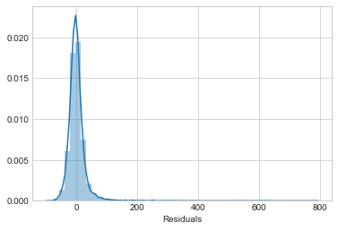

# bencodes.github.io
Dr Ben Lee Github repository

Research questions 

Does wine descriptors impact Rating ?
  - Machine learning to classify reviews 
     what are key words that determines ratings?
     
    Apply Logistic regression, Random Forest to determine relationship between key words and ratings, wine type, varieties  
        
 There is a correlation between Ratings and Price ?
   - Correlation analysis

 The 

      <td>(red cherry, -0.030409427544224356)</td>
      <td>(solid, -0.03055072554295125)</td>
      <td>(warm, 0.022280132275980493)</td>
      <td>(firm tannins, -0.07228126300021183)</td>
      <td>(tight, 0.046554053733931955)</td>
      <td>(2019, -0.05040592948867655)</td>
      <td>(dusty, -0.033637847854203165)</td>
      <td>(pepper, 0.01931487394733363)</td>
    </tr>
    <tr>
      <th>191</th>
      <td>(fermented, -0.0761599896362141)</td>
      <td>(berry, 0.033849716932997716)</td>
      <td>(anise, -0.07145601942381268)</td>
      <td>(aromatic, -0.03579168762988685)</td>
      <td>(slightly, 0.04536283477604335)</td>
      <td>(deep, -0.065832416373972)</td>
      <td>(beef, -0.0675305699313577)</td>
      <td>(ripe, 0.05524996864664028)</td>
      <td>(bright acidity, -0.02399814489589799)</td>
      <td>(plum, 0.05711208528514151)</td>
      <td>(plum flavors, -0.05595940811057235)</td>
      <td>(core, 0.024876715010624034)</td>
      <td>(jam, 0.019706493341481123)</td>
      <td>(textured, -0.03918665789602236)</td>
      <td>(balance, -0.0882841534991473)</td>
      <td>(open, -0.06500624996432915)</td>
      <td>(tannins drink, -0.01217041569066909)</td>
      <td>(texture, 0.08340619409385229)</td>
      <td>(palate delivers, -0.059040307174416974)</td>
      <td>(bacon, -0.0827055177841453)</td>
      <td>(feels, 0.04907853090105708)</td>
      <td>(red fruit, 0.005661567254521841)</td>
      <td>(savory, 0.0012467804422636986)</td>
      <td>(fermented, -0.0573813020103348)</td>
      <td>(lingering, 0.03762375419496843)</td>
      <td>(buttered toast, -0.03064148100911069)</td>
      <td>(sharp, -0.03229047516610208)</td>
      <td>(medium bodied, 0.018686555976533587)</td>
      <td>(berry fruit, -0.07316217546408654)</td>
      <td>(floral, 0.04339260199793219)</td>
      <td>(dark chocolate, -0.05086586504158716)</td>
      <td>(little, -0.035920637082261626)</td>
      <td>(pleasant, 0.017513839062186)</td>
    </tr>
    <tr>
      <th>192</th>
      <td>(months, -0.07968440054442302)</td>
      <td>(anise, 0.03221495627961018)</td>
      <td>(palate delivers, -0.07151924805556918)</td>
      <td>(black, -0.03923857366765188)</td>
      <td>(interesting, 0.03877513565186194)</td>
      <td>(appellation, -0.06605035893979683)</td>
      <td>(brings, -0.07181208323837307)</td>
      <td>(touch, 0.0534922237000281)</td>
      <td>(tannins drink, -0.02604130685149701)</td>
      <td>(red cherry, 0.054606601857434184)</td>
      <td>(citrus, -0.062013760241396744)</td>
      <td>(years, 0.024171249305108177)</td>
      <td>(notes, 0.01800831236388575)</td>
      <td>(firm tannins, -0.040961225459283546)</td>
      <td>(baking spice, -0.0894428997420725)</td>
      <td>(franc, -0.06665646963792479)</td>
      <td>(variety, -0.012954921681123468)</td>
      <td>(buttered toast, 0.08249983509690387)</td>
      <td>(palate offers, -0.060243762059859846)</td>
      <td>(cab, -0.08427500121980722)</td>
      <td>(touch, 0.04841456092803614)</td>
      <td>(delivers, 0.003541823639196663)</td>
      <td>(hint, -0.0010917837069689563)</td>
      <td>(perfumed, -0.05835482041672314)</td>
      <td>(licorice, 0.03588548282260874)</td>
      <td>(red currant, -0.030878630286861178)</td>
      <td>(cabernet franc, -0.0334431565825797)</td>
      <td>(black pepper, 0.01715890825148548)</td>
      <td>(touches, -0.07319541325899045)</td>
      <td>(grapes, 0.041098109692156874)</td>
      <td>(cassis, -0.052460537468359915)</td>
      <td>(cherry raspberry, -0.03813258441171815)</td>
      <td>(cherries, 0.017108929230040898)</td>
    </tr>
    <tr>
      <th>193</th>
      <td>(zesty, -0.0819357488115094)</td>
      <td>(black fruit, 0.02069915424908274)</td>
      <td>(velvety, -0.07313997568744514)</td>
      <td>(stone, -0.04006637561213928)</td>
      <td>(layered, 0.037061398833256314)</td>
      <td>(rosé, -0.067766478870885)</td>
      <td>(zinfandel, -0.07286808333503629)</td>
      <td>(smoke, 0.04061291966526859)</td>
      <td>(black pepper, -0.02769023424461375)</td>
      <td>(plums, 0.04860740639368277)</td>
      <td>(firm tannins, -0.062388162564446834)</td>
      <td>(just, 0.023627933325021642)</td>
      <td>(complex, 0.016325523673744867)</td>
      <td>(medium bodied, -0.04509534941773887)</td>
      <td>(cherry raspberry, -0.08949420815344214)</td>
      <td>(nicely, -0.06681366453517498)</td>
      <td>(depth, -0.018992041993448953)</td>
      <td>(showing, 0.06942105273229512)</td>
      <td>(flower, -0.06781209760368544)</td>
      <td>(soft tannins, -0.08488736607548922)</td>
      <td>(anise, 0.04662364657925244)</td>
      <td>(making, -0.0037118186557103835)</td>
      <td>(pineapple, -0.011397720615888573)</td>
      <td>(grained tannins, -0.05939295578895446)</td>
      <td>(clove, 0.027986635910908237)</td>
      <td>(open, -0.035088031613517784)</td>
      <td>(blackberry cherry, -0.035542888333301964)</td>
      <td>(flavors, 0.010307732891215686)</td>
      <td>(peppery, -0.07564650286189344)</td>
      <td>(mouth, 0.039723243037369016)</td>
      <td>(smoky, -0.05284467435042896)</td>
      <td>(red currant, -0.038404831886504634)</td>
      <td>(juicy, 0.011208245177662592)</td>
    </tr>
    <tr>
      <th>194</th>
      <td>(stone fruit, -0.0842995921399155)</td>
      <td>(cherry, 0.017915968788138944)</td>
      <td>(forest, -0.07652585884921116)</td>
      <td>(impressive, -0.04534940172579366)</td>
      <td>(pink, 0.03662832034431628)</td>
      <td>(zest, -0.06887860182011082)</td>
      <td>(espresso, -0.07297660621072556)</td>
      <td>(add, 0.03870775530449499)</td>
      <td>(herbs, -0.030088490143143076)</td>
      <td>(2020, 0.04773463544954753)</td>
      <td>(raspberry cherry, -0.0644504822420807)</td>
      <td>(finishing, 0.022845660660641764)</td>
      <td>(licorice, 0.015404684300384656)</td>
      <td>(tannin, -0.04899474841856066)</td>
      <td>(french oak, -0.09216428987554767)</td>
      <td>(richness, -0.06930997213106496)</td>
      <td>(juicy, -0.019798850199607927)</td>
      <td>(bit, 0.06412976805448659)</td>
      <td>(smoke, -0.07126350168899687)</td>
      <td>(cherry fruit, -0.08624760749624782)</td>
      <td>(forest, 0.04304319534532503)</td>
      <td>(heavy, -0.004869013336516479)</td>
      <td>(taste, -0.013228792105640815)</td>
      <td>(new french, -0.06365003012535474)</td>
      <td>(color, 0.027282251159189756)</td>
      <td>(making, -0.0363356788676295)</td>
      <td>(fruits, -0.03567911795534514)</td>
      <td>(power, 0.010117897015833334)</td>
      <td>(black currant, -0.0821544403915152)</td>
      <td>(straightforward, 0.029938219539480893)</td>
      <td>(petite sirah, -0.05461556962280624)</td>
      <td>(red plum, -0.03885741931831563)</td>
      <td>(black plum, 0.010643421743533837)</td>
    </tr>
    <tr>
      <th>195</th>
      <td>(baking spice, -0.08604213323890708)</td>
      <td>(palate offers, 0.01535408036533873)</td>
      <td>(fruit aromas, -0.0770134777441556)</td>
      <td>(bodied, -0.04761189660395903)</td>
      <td>(end, 0.033418721299959625)</td>
      <td>(pink, -0.07000054622665608)</td>
      <td>(pear, -0.07866698823163187)</td>
      <td>(vibrant, 0.03711807471398127)</td>
      <td>(cabernet franc, -0.03679734182829879)</td>
      <td>(pink, 0.04729112821687208)</td>
      <td>(crisp, -0.06748370239562797)</td>
      <td>(plums, 0.013609527471790422)</td>
      <td>(mix, 0.014944684085914997)</td>
      <td>(year, -0.04948771220829378)</td>
      <td>(streak, -0.09266758745395841)</td>
      <td>(red cherry, -0.0704897355130177)</td>
      <td>(red plum, -0.0209629534622579)</td>
      <td>(anise, 0.05941164804417089)</td>
      <td>(simple, -0.07405204934499528)</td>
      <td>(feels, -0.08763977824179733)</td>
      <td>(ready drink, 0.040870926626400544)</td>
      <td>(red, -0.0067461482989305864)</td>
      <td>(grained tannins, -0.01708528409086986)</td>
      <td>(stone fruit, -0.06383882125919846)</td>
      <td>(really, 0.02447565302767192)</td>
      <td>(new oak, -0.0370100293110351)</td>
      <td>(ripe black, -0.03638641187414955)</td>
      <td>(2018, 0.006960739576992403)</td>
      <td>(year, -0.08308906498630259)</td>
      <td>(fine grained, 0.029321172752819966)</td>
      <td>(sirah, -0.05480895834811699)</td>
      <td>(blackberry cherry, -0.041256058402506034)</td>
      <td>(rustic, 0.008679854728256893)</td>
    </tr>
    <tr>
      <th>196</th>
      <td>(fruity wine, -0.08854344291170363)</td>
      <td>(mocha, 0.013547008846704437)</td>
      <td>(ll, -0.07746504479042447)</td>
      <td>(warm, -0.04769938156854202)</td>
      <td>(age, 0.030675058858560075)</td>
      <td>(adds, -0.07298429008671925)</td>
      <td>(red plum, -0.07961065517821374)</td>
      <td>(grilled, 0.03649138366196543)</td>
      <td>(petit verdot, -0.03714897697449777)</td>
      <td>(solid, 0.04661023421076017)</td>
      <td>(prune, -0.06849512478745137)</td>
      <td>(style, 0.01134199011668095)</td>
      <td>(palate, 0.008818304845214335)</td>
      <td>(warm, -0.052529945239222726)</td>
      <td>(tart, -0.09556229974772441)</td>
      <td>(cherry raspberry, -0.07060058749411582)</td>
      <td>(nice, -0.023239594739557782)</td>
      <td>(come, 0.05767572311537368)</td>
      <td>(black fruits, -0.07823038942055402)</td>
      <td>(deep, -0.08799436645734104)</td>
      <td>(delivers, 0.03938280992377168)</td>
      <td>(black pepper, -0.007784347584142915)</td>
      <td>(acidic, -0.0172535982801796)</td>
      <td>(herbal, -0.06601527964763348)</td>
      <td>(character, 0.024194005558295612)</td>
      <td>(fruit, -0.03889508816193995)</td>
      <td>(minerality, -0.04761678585118704)</td>
      <td>(nose palate, 0.006147057067104182)</td>
      <td>(lemon, -0.08328637060489029)</td>
      <td>(wine, 0.027483840932631284)</td>
      <td>(grown, -0.05591801258057926)</td>
      <td>(red cherry, -0.04343898683352423)</td>
      <td>(prune, 0.007886569762823935)</td>
    </tr>
    <tr>
      <th>197</th>
      <td>(wood aging, -0.08911080937809886)</td>
      <td>(black, 0.013250253736802546)</td>
      <td>(winemaker, -0.07799368564852498)</td>
      <td>(tannins drink, -0.04809790472444136)</td>
      <td>(silky, 0.028301423383210716)</td>
      <td>(refreshing, -0.07435029306732023)</td>
      <td>(baking, -0.08235859054913566)</td>
      <td>(palate delivers, 0.03495215476671348)</td>
      <td>(verdot, -0.03717814111585927)</td>
      <td>(potential, 0.03776335936318076)</td>
      <td>(palate delivers, -0.07374637985651208)</td>
      <td>(plum, 0.011142901128027825)</td>
      <td>(peppery, 0.008048770309324023)</td>
      <td>(bold, -0.05340534961695038)</td>
      <td>(velvety, -0.09657556380935128)</td>
      <td>(violet, -0.0714667211533328)</td>
      <td>(red cherry, -0.026375959732515625)</td>
      <td>(noir, 0.05578875169242658)</td>
      <td>(blue, -0.0796599621105876)</td>
      <td>(zinfandel, -0.08818096405318572)</td>
      <td>(fruity, 0.03877649109013118)</td>
      <td>(buttered, -0.009177535891678969)</td>
      <td>(giving, -0.017535729304993565)</td>
      <td>(blackberry cherry, -0.06787072522621837)</td>
      <td>(2019, 0.017102681874174634)</td>
      <td>(new french, -0.046251016708175385)</td>
      <td>(soft, -0.048424433843890446)</td>
      <td>(giving, 0.001892500797606469)</td>
      <td>(new oak, -0.0860938568022997)</td>
      <td>(nice, 0.021841539733612983)</td>
      <td>(petite, -0.05715692778259221)</td>
      <td>(fine grained, -0.044063966518453)</td>
      <td>(suggest, 0.007749284780329628)</td>
    </tr>
    <tr>
      <th>198</th>
      <td>(sauvignon blanc, -0.091718753023075)</td>
      <td>(cherry flavors, 0.011197142661039028)</td>
      <td>(power, -0.08048230578339871)</td>
      <td>(red cherry, -0.05473877168736116)</td>
      <td>(offers, 0.024288485972305558)</td>
      <td>(perfumed, -0.07485627721033718)</td>
      <td>(palate offers, -0.08521840375846895)</td>
      <td>(right, 0.032154031318317094)</td>
      <td>(petit, -0.03753899035516951)</td>
      <td>(vineyard, 0.03265415790228176)</td>
      <td>(petite sirah, -0.07551424733585008)</td>
      <td>(quality, 0.009440374634593374)</td>
      <td>(red cherry, 0.003869298349209658)</td>
      <td>(soft tannins, -0.05717685936979236)</td>
      <td>(almond, -0.09790384759286436)</td>
      <td>(whiff, -0.07206096572483377)</td>
      <td>(grained tannins, -0.026596054082993918)</td>
      <td>(vibrant, 0.055120218237035216)</td>
      <td>(tangy, -0.08076626211915022)</td>
      <td>(easy, -0.09136060080132098)</td>
      <td>(coconut, 0.03775252596393146)</td>
      <td>(richness, -0.011108818498801139)</td>
      <td>(pink, -0.018420203564968953)</td>
      <td>(based, -0.0682762313410236)</td>
      <td>(making, 0.013260696661210507)</td>
      <td>(apple pear, -0.049238749768282034)</td>
      <td>(better, -0.048606540520502506)</td>
      <td>(french oak, 0.0003079011332593382)</td>
      <td>(vineyards, -0.08881053976483952)</td>
      <td>(character, 0.021372614212168947)</td>
      <td>(stone fruit, -0.06124727113347465)</td>
      <td>(brisk, -0.04517717671524286)</td>
      <td>(vineyards, 0.0045765576418068735)</td>
    </tr>
    <tr>
      <th>199</th>
      <td>(raspberry cherry, -0.09481514686785722)</td>
      <td>(cut, 0.007824459125762857)</td>
      <td>(bacon, -0.08288774458096662)</td>
      <td>(jam, -0.0558581917405572)</td>
      <td>(roasted, 0.0235481006524062)</td>
      <td>(bright acidity, -0.07533951162799293)</td>
      <td>(leaf, -0.08543762740208521)</td>
      <td>(stone fruit, 0.020941865086406174)</td>
      <td>(blackberry cherry, -0.03857684787781297)</td>
      <td>(long, 0.027776803049622222)</td>
      <td>(sirah, -0.0762040697594986)</td>
      <td>(drink 2020, 0.00806555210199735)</td>
      <td>(firm, 0.0022677936375604226)</td>
      <td>(apple pear, -0.06447499642010242)</td>
      <td>(red, -0.09864129548975725)</td>
      <td>(menthol, -0.07249500955899364)</td>
      <td>(delicate, -0.02721893962742804)</td>
      <td>(wet, 0.05359171759876983)</td>
      <td>(fine grained, -0.08249273262622853)</td>
      <td>(purple, -0.09235486699414466)</td>
      <td>(provide, 0.03592485429765705)</td>
      <td>(nose, -0.012436024994178738)</td>
      <td>(rich, -0.01874934201376241)</td>
      <td>(finishes, -0.07018395387742461)</td>
      <td>(tomato, 0.010997259469531707)</td>
      <td>(young, -0.049492859960299486)</td>
      <td>(palate, -0.04991515118211523)</td>
      <td>(short, -0.001311592888524745)</td>
      <td>(fruitiness, -0.09334868686987005)</td>
      <td>(sharp, 0.021289495837270602)</td>
      <td>(feels, -0.06591991769715211)</td>
      <td>(perfumed, -0.04580408456884478)</td>
      <td>(needs, 0.0031618239888792452)</td>
    </tr>
    <tr>
      <th>200</th>
      <td>(based, -0.0986745600716009)</td>
      <td>(rich, 0.0019162713214952666)</td>
      <td>(black plum, -0.08374176433530543)</td>
      <td>(new, -0.05648227582417914)</td>
      <td>(streak, 0.022185530734568953)</td>
      <td>(raspberries, -0.0777079908562406)</td>
      <td>(refreshing, -0.08589756224839723)</td>
      <td>(palate, 0.02089021803843979)</td>
      <td>(petite sirah, -0.04098068357221921)</td>
      <td>(creamy, 0.026131898440946426)</td>
      <td>(lemony, -0.07790254984425869)</td>
      <td>(appellation, 0.007993974180134391)</td>
      <td>(strong, 0.0013847584967154646)</td>
      <td>(green apple, -0.06788676065887127)</td>
      <td>(red fruits, -0.0988888684973813)</td>
      <td>(vibrant, -0.07355367298066356)</td>
      <td>(peel, -0.02941594307044372)</td>
      <td>(straightforward, 0.050914154169295324)</td>
      <td>(drink 2016, -0.08341536454577471)</td>
      <td>(oak flavors, -0.09342797648004034)</td>
      <td>(vintage, 0.03414073884718255)</td>
      <td>(forest, -0.0167627903750823)</td>
      <td>(medium bodied, -0.019997376606721518)</td>
      <td>(20, -0.07385108827372117)</td>
      <td>(drinking, 0.008968334137535634)</td>
      <td>(sweet, -0.056374389324243435)</td>
      <td>(lively, -0.05040652390297104)</td>
      <td>(structure, -0.009738246216711557)</td>
      <td>(petite sirah, -0.09435295026809841)</td>
      <td>(delicious, 0.020770050901959703)</td>
      <td>(roasted, -0.06608989105717948)</td>
      <td>(hot, -0.04829652996484246)</td>
      <td>(beautiful, -0.002036763237007066)</td>
    </tr>
    <tr>
      <th>201</th>
      <td>(bordeaux, -0.09944009439043368)</td>
      <td>(tastes, 0.0018637291336724652)</td>
      <td>(cellar, -0.08428768390889796)</td>
      <td>(heavy, -0.05748666626630258)</td>
      <td>(dark chocolate, 0.021697572083213334)</td>
      <td>(brisk, -0.07894199560525675)</td>
      <td>(ll, -0.08638950914705555)</td>
      <td>(buttered toast, 0.019576200234090724)</td>
      <td>(sirah, -0.04121047338463253)</td>
      <td>(edge, 0.024020616268188712)</td>
      <td>(price, -0.07801656506694994)</td>
      <td>(raisin, 0.006592305455518933)</td>
      <td>(franc, -0.0002540105991637544)</td>
      <td>(sauvignon blanc, -0.06877278458970328)</td>
      <td>(plum, -0.0991854759604191)</td>
      <td>(black currant, -0.07468209704777692)</td>
      <td>(peach, -0.03442130667620111)</td>
      <td>(dried, 0.049727547132908924)</td>
      <td>(showing, -0.08531066921762312)</td>
      <td>(wrapped, -0.09359509482954854)</td>
      <td>(juicy, 0.03342927356134441)</td>
      <td>(oak, -0.019983462641643655)</td>
      <td>(fine grained, -0.022320532429424295)</td>
      <td>(taste, -0.07570928701544172)</td>
      <td>(plum, 0.005224115846989732)</td>
      <td>(green apple, -0.05954908550183169)</td>
      <td>(fine grained, -0.05474035952696464)</td>
      <td>(ready drink, -0.011934549396838265)</td>
      <td>(petite, -0.09542197764337415)</td>
      <td>(making, 0.020260223680252133)</td>
      <td>(plums, -0.06661440843826447)</td>
      <td>(add, -0.05002736911441765)</td>
      <td>(ample, -0.0032643023145739426)</td>
    </tr>
    <tr>
      <th>202</th>
      <td>(buttered toast, -0.09978979969497533)</td>
      <td>(beef, -4.780174289218947e-05)</td>
      <td>(cabernet franc, -0.08604555465922821)</td>
      <td>(petit verdot, -0.057928820172298355)</td>
      <td>(wine offers, 0.020905632262789884)</td>
      <td>(offers, -0.07907489156995332)</td>
      <td>(lot, -0.08878820440629125)</td>
      <td>(sage, 0.011405637821225521)</td>
      <td>(raspberry cherry, -0.04173749334961876)</td>
      <td>(skin, 0.020125969210426108)</td>
      <td>(single, -0.0793498830048835)</td>
      <td>(purple, 3.275921130202125e-05)</td>
      <td>(deep, -0.002051979211003997)</td>
      <td>(drink, -0.07477231007077925)</td>
      <td>(grained tannins, -0.1003829662937899)</td>
      <td>(red berry, -0.0763246132902796)</td>
      <td>(dark chocolate, -0.03479514941086222)</td>
      <td>(little, 0.04731813565605319)</td>
      <td>(cherry raspberry, -0.08655799735059166)</td>
      <td>(plum flavors, -0.09425200374666727)</td>
      <td>(deep, 0.03157547787367277)</td>
      <td>(cola, -0.02180854038045787)</td>
      <td>(richness, -0.024092133306640763)</td>
      <td>(layers, -0.07790967503851634)</td>
      <td>(single, 0.0016120269153434967)</td>
      <td>(smoke, -0.06001815872124403)</td>
      <td>(black plum, -0.05568421804040065)</td>
      <td>(drink 2017, -0.016439268106937802)</td>
      <td>(sweetness, -0.09547272586502471)</td>
      <td>(balanced, 0.016358702708769542)</td>
      <td>(expression, -0.06732489371381607)</td>
      <td>(menthol, -0.05008009525615559)</td>
      <td>(bodied wine, -0.005298903213751954)</td>
    </tr>
    <tr>
      <th>203</th>
      <td>(produced, -0.1014949195730271)</td>
      <td>(winemaker, -0.0009009550627759065)</td>
      <td>(hot, -0.0861519339695)</td>
      <td>(verdot, -0.057948509564802166)</td>
      <td>(aged, 0.01913458954556093)</td>
      <td>(develop, -0.07931840155001069)</td>
      <td>(chewy, -0.0910179956897217)</td>
      <td>(flavor, 0.011010549609361407)</td>
      <td>(cherry raspberry, -0.04337481145866732)</td>
      <td>(weight, 0.019744079145584795)</td>
      <td>(powerful, -0.08190965013102704)</td>
      <td>(baking, -0.0015198980498253025)</td>
      <td>(palate offers, -0.004298846533031352)</td>
      <td>(new oak, -0.07582673867432449)</td>
      <td>(tannins drink, -0.10176071822617686)</td>
      <td>(olive, -0.0767185456687584)</td>
      <td>(doesn, -0.04088077893034689)</td>
      <td>(color, 0.044592601682008084)</td>
      <td>(bottle, -0.09161494976838269)</td>
      <td>(round, -0.09439669530387036)</td>
      <td>(color, 0.031159824399258684)</td>
      <td>(red berry, -0.02392264053415645)</td>
      <td>(grained, -0.02490611291658865)</td>
      <td>(round, -0.08054239817240474)</td>
      <td>(impressive, -0.00011643556618137379)</td>
      <td>(buttered, -0.06316704077528396)</td>
      <td>(raspberry cherry, -0.056966872313217634)</td>
      <td>(nose, -0.02740589841238281)</td>
      <td>(finish drink, -0.09573309259764352)</td>
      <td>(driven, -0.004117731568501741)</td>
      <td>(fermented, -0.06784164873221371)</td>
      <td>(red berry, -0.05110437112224197)</td>
      <td>(caramel, -0.005528958661365418)</td>
    </tr>
    <tr>
      <th>204</th>
      <td>(new oak, -0.10167780456166609)</td>
      <td>(value, -0.0010295839077152584)</td>
      <td>(clove, -0.08698493007729173)</td>
      <td>(plums, -0.058888113097083285)</td>
      <td>(finish, 0.015456775416284384)</td>
      <td>(beautifully, -0.08309700110078719)</td>
      <td>(french, -0.09212152390802551)</td>
      <td>(flowers, 0.009327516736096447)</td>
      <td>(petite, -0.04379228486988828)</td>
      <td>(cherry fruit, 0.018710850951726924)</td>
      <td>(tightly, -0.08357628597810961)</td>
      <td>(flavors finish, -0.003077474258870744)</td>
      <td>(delicious, -0.007709804515118492)</td>
      <td>(hot, -0.07605693579742587)</td>
      <td>(pink, -0.10213852971910496)</td>
      <td>(cocoa, -0.07852785541839535)</td>
      <td>(soft tannins, -0.04287432337951342)</td>
      <td>(toast, 0.040472245788134534)</td>
      <td>(baking spice, -0.0924315792191247)</td>
      <td>(anise, -0.09540248280038116)</td>
      <td>(whiff, 0.03016540681774023)</td>
      <td>(fresh, -0.02681562539688785)</td>
      <td>(wine shows, -0.027182666969189154)</td>
      <td>(hints, -0.08279946558498717)</td>
      <td>(red cherry, -0.0026439628857850175)</td>
      <td>(pure, -0.06686600021769934)</td>
      <td>(dark chocolate, -0.06080813272908833)</td>
      <td>(sweetness, -0.029099111768176377)</td>
      <td>(sirah, -0.09968205125142886)</td>
      <td>(makes, -0.0058572012600528345)</td>
      <td>(fruity wine, -0.06802551118621691)</td>
      <td>(cabernet franc, -0.05193868292730029)</td>
      <td>(tightly, -0.0071712664057462135)</td>
    </tr>
    <tr>
      <th>205</th>
      <td>(cassis, -0.10247653398003487)</td>
      <td>(touch, -0.002211653088172482)</td>
      <td>(flavors finish, -0.08757421143929257)</td>
      <td>(flowers, -0.0616524849450476)</td>
      <td>(focused, 0.013780812244010886)</td>
      <td>(cherry, -0.0857293111009486)</td>
      <td>(drink 2018, -0.09486540104971448)</td>
      <td>(brisk, 0.005003156489989501)</td>
      <td>(delicate, -0.04468016068008884)</td>
      <td>(bottle, 0.01795542504398713)</td>
      <td>(cabernet sauvignon, -0.08624162266100643)</td>
      <td>(provide, -0.014321776455848083)</td>
      <td>(glass, -0.0090434229670428)</td>
      <td>(tropical fruit, -0.0774300629423632)</td>
      <td>(medium bodied, -0.10288664868114725)</td>
      <td>(better, -0.08032411907819292)</td>
      <td>(menthol, -0.043060555356278424)</td>
      <td>(lush, 0.04040866788345867)</td>
      <td>(beautifully, -0.09395473029786436)</td>
      <td>(coconut, -0.09714227691858593)</td>
      <td>(nose palate, 0.0229432285234313)</td>
      <td>(aging, -0.02775350092630118)</td>
      <td>(black plum, -0.028959724380800377)</td>
      <td>(adds, -0.08525452428770386)</td>
      <td>(core, -0.004507236490789624)</td>
      <td>(attractive, -0.06688624880044067)</td>
      <td>(touch, -0.06104641758855013)</td>
      <td>(end, -0.031189097047110974)</td>
      <td>(drinking, -0.09990872366179858)</td>
      <td>(bodied, -0.010245185916201476)</td>
      <td>(wine offers, -0.06913014162889386)</td>
      <td>(grained, -0.05342690529910938)</td>
      <td>(touch, -0.011944982106746677)</td>
    </tr>
    <tr>
      <th>206</th>
      <td>(smooth, -0.10300281151845357)</td>
      <td>(mineral, -0.003469420479948087)</td>
      <td>(excellent, -0.08863823877625801)</td>
      <td>(buttered toast, -0.07048309281020991)</td>
      <td>(cherry raspberry, 0.010144342413909498)</td>
      <td>(imported, -0.08643610877046785)</td>
      <td>(black currant, -0.09629168256309081)</td>
      <td>(comes, 2.3327497983972945e-05)</td>
      <td>(menthol, -0.04927051880536654)</td>
      <td>(subtle, 0.017548380910832575)</td>
      <td>(lead nose, -0.08689229341621722)</td>
      <td>(smoke, -0.014815678790453056)</td>
      <td>(dark fruit, -0.014916969490417414)</td>
      <td>(blanc, -0.07771224726866578)</td>
      <td>(provide, -0.10340872715076138)</td>
      <td>(chewy, -0.08053901647469014)</td>
      <td>(melon, -0.04414112379327909)</td>
      <td>(raisin, 0.038791907283162445)</td>
      <td>(produced, -0.09430624683782754)</td>
      <td>(fruit aromas, -0.10032663249235434)</td>
      <td>(peppery, 0.020250928480309488)</td>
      <td>(appealing, -0.02982898208063617)</td>
      <td>(tannins drink, -0.030756852206208864)</td>
      <td>(palate delivers, -0.08818483289879851)</td>
      <td>(hot, -0.007998598492429896)</td>
      <td>(black, -0.06792792812794975)</td>
      <td>(nice, -0.06477673778547592)</td>
      <td>(fleshy, -0.03371124599943215)</td>
      <td>(drink 2018, -0.10018510729903428)</td>
      <td>(core, -0.010960551626020946)</td>
      <td>(wine shows, -0.07036574115871767)</td>
      <td>(petit verdot, -0.05661910302720871)</td>
      <td>(herb, -0.015036792096457861)</td>
    </tr>
    <tr>
      <th>207</th>
      <td>(single, -0.10341838925466353)</td>
      <td>(fruit flavors, -0.007702347068902789)</td>
      <td>(roasted, -0.08866459466422509)</td>
      <td>(gives, -0.07136470422526277)</td>
      <td>(depth, 0.009955012013657456)</td>
      <td>(bordeaux, -0.08668945082108957)</td>
      <td>(tomato, -0.09634085014189518)</td>
      <td>(flavored, -0.0013792085933576428)</td>
      <td>(makes, -0.05007870088680421)</td>
      <td>(clean, 0.016232044986143664)</td>
      <td>(black cherry, -0.08793205389499886)</td>
      <td>(grained, -0.015418086241847487)</td>
      <td>(nice, -0.01591391827893566)</td>
      <td>(fresh acidity, -0.08009165659241099)</td>
      <td>(mild, -0.10413332573503889)</td>
      <td>(dark fruit, -0.08201576379689546)</td>
      <td>(bodied wine, -0.049340691000491224)</td>
      <td>(bodied, 0.03549500484616112)</td>
      <td>(old, -0.09992963281550979)</td>
      <td>(elegant, -0.10193103814393639)</td>
      <td>(espresso, 0.019086329078965014)</td>
      <td>(apricot, -0.030088692772045036)</td>
      <td>(edge, -0.03129881002540054)</td>
      <td>(packed, -0.08835629379938346)</td>
      <td>(accented, -0.008354670453110067)</td>
      <td>(raspberry, -0.06850219008559891)</td>
      <td>(elegance, -0.06570428837829657)</td>
      <td>(ripe black, -0.0351042260287769)</td>
      <td>(floral, -0.10026075409259787)</td>
      <td>(mineral, -0.01533908007327524)</td>
      <td>(green apple, -0.07513896336700727)</td>
      <td>(texture, -0.05749038712051791)</td>
      <td>(clean, -0.01730630707401713)</td>
    </tr>
    <tr>
      <th>208</th>
      <td>(skin, -0.10568897197086505)</td>
      <td>(racy, -0.008502961664701483)</td>
      <td>(enjoy, -0.08991001632508024)</td>
      <td>(open, -0.07499364462770164)</td>
      <td>(yellow, 0.006962510826842655)</td>
      <td>(drink 2020, -0.08684288570560153)</td>
      <td>(black fruits, -0.09693347569138684)</td>
      <td>(new oak, -0.0029423955934164245)</td>
      <td>(grained, -0.050684750910191645)</td>
      <td>(estate, 0.009746684047842518)</td>
      <td>(black currant, -0.08820483843023437)</td>
      <td>(delicious, -0.019618372550678123)</td>
      <td>(dense, -0.018759951353601218)</td>
      <td>(fruity wine, -0.08027129763373847)</td>
      <td>(drink 2016, -0.10464961398795758)</td>
      <td>(drink 2018, -0.08364402925424394)</td>
      <td>(plum flavors, -0.050937214389345)</td>
      <td>(adds, 0.03066906636875451)</td>
      <td>(delicious, -0.10073164852008773)</td>
      <td>(mocha, -0.10235234929800727)</td>
      <td>(layers, 0.018603075184021448)</td>
      <td>(2020, -0.03032205131384047)</td>
      <td>(accented, -0.03426377173035911)</td>
      <td>(palate, -0.09734961673796112)</td>
      <td>(2016, -0.009262044090117544)</td>
      <td>(oak flavors, -0.07130758788959106)</td>
      <td>(plush, -0.06815210004843465)</td>
      <td>(fruity, -0.03550035629362815)</td>
      <td>(scents, -0.10116012853767863)</td>
      <td>(varietal, -0.01841629165991729)</td>
      <td>(firm, -0.07544684470662631)</td>
      <td>(verdot, -0.0579635897644231)</td>
      <td>(velvety, -0.019689080337685735)</td>
    </tr>
    <tr>
      <th>209</th>
      <td>(black fruits, -0.11058949709154663)</td>
      <td>(green, -0.011848059602422042)</td>
      <td>(meat, -0.09010340184489396)</td>
      <td>(tones, -0.07614814324398886)</td>
      <td>(vanilla, 0.006019998605493647)</td>
      <td>(cool, -0.08695849214727913)</td>
      <td>(wood aging, -0.09695629078064642)</td>
      <td>(scents, -0.0032478737445370783)</td>
      <td>(dark chocolate, -0.05107166854290436)</td>
      <td>(lean, 0.006156564295716224)</td>
      <td>(petite, -0.08886046391586655)</td>
      <td>(grape, -0.01985815869754767)</td>
      <td>(almond, -0.022994907779432226)</td>
      <td>(flavors finish, -0.08218986673171026)</td>
      <td>(new oak, -0.10692099907811185)</td>
      <td>(sandalwood, -0.08599455162215676)</td>
      <td>(grapes, -0.05152985879327027)</td>
      <td>(flowers, 0.027887177251306842)</td>
      <td>(hot, -0.10224477487162315)</td>
      <td>(leaf, -0.10340872183062431)</td>
      <td>(dark chocolate, 0.011306585809908782)</td>
      <td>(new, -0.030450446147402922)</td>
      <td>(cherry raspberry, -0.03508173369283837)</td>
      <td>(appealing, -0.09744301439534689)</td>
      <td>(leaf, -0.009268410276308444)</td>
      <td>(sauvignon blanc, -0.07250106807238625)</td>
      <td>(light, -0.0686296823765785)</td>
      <td>(apple pear, -0.04253329330803245)</td>
      <td>(drink 2016, -0.1026591276118251)</td>
      <td>(dark chocolate, -0.02034294552141985)</td>
      <td>(round, -0.07730126976482632)</td>
      <td>(raspberry cherry, -0.05827644493541418)</td>
      <td>(stone, -0.021794526760476052)</td>
    </tr>
    <tr>
      <th>210</th>
      <td>(fruity, -0.11104925435612395)</td>
      <td>(peel, -0.011930994602574355)</td>
      <td>(makes, -0.09037177323973948)</td>
      <td>(nose, -0.07669025665708516)</td>
      <td>(length, 0.00524322377184132)</td>
      <td>(tea, -0.08754474585590788)</td>
      <td>(oak flavors, -0.09870727524919415)</td>
      <td>(stone, -0.007101083107664328)</td>
      <td>(mineral, -0.05337517736203632)</td>
      <td>(deep, 0.005343208792512796)</td>
      <td>(new oak, -0.09435299635116079)</td>
      <td>(tangy, -0.027482125087898473)</td>
      <td>(refreshing, -0.023922667304585286)</td>
      <td>(petit verdot, -0.08384617464174426)</td>
      <td>(months, -0.1080479199948449)</td>
      <td>(bright acidity, -0.08611023596433524)</td>
      <td>(floral, -0.05319081143257627)</td>
      <td>(mouthfeel, 0.027189195996994382)</td>
      <td>(raspberry cherry, -0.10430576123428437)</td>
      <td>(cocoa, -0.10345070181488722)</td>
      <td>(taste, 0.010614379761742966)</td>
      <td>(plush, -0.03393142654899565)</td>
      <td>(red plum, -0.035775545220932445)</td>
      <td>(fresh acidity, -0.09898475936701207)</td>
      <td>(depth, -0.01107043481414035)</td>
      <td>(ripeness, -0.07309519153927865)</td>
      <td>(grained, -0.07089824477465294)</td>
      <td>(concentration, -0.042883969865960804)</td>
      <td>(spice flavors, -0.10439599155424274)</td>
      <td>(hint, -0.024706798519472814)</td>
      <td>(making, -0.07733414374189794)</td>
      <td>(berry fruits, -0.059490864009956027)</td>
      <td>(cherry, -0.022764422138757547)</td>
    </tr>
    <tr>
      <th>211</th>
      <td>(acid, -0.11120108496693547)</td>
      <td>(palate, -0.011967666597564324)</td>
      <td>(deep, -0.09046897760968509)</td>
      <td>(apple pear, -0.07959252687769658)</td>
      <td>(smooth, 0.005013763652226152)</td>
      <td>(does, -0.0883219384137674)</td>
      <td>(great, -0.09922030926823446)</td>
      <td>(finish, -0.009548545761600205)</td>
      <td>(graphite, -0.05721128556843335)</td>
      <td>(toasty, 0.0006693780256911636)</td>
      <td>(structured, -0.09447140190867563)</td>
      <td>(french, -0.02942544426435536)</td>
      <td>(10, -0.030738029091542763)</td>
      <td>(verdot, -0.08399289827828972)</td>
      <td>(drink 2020, -0.10968706539955159)</td>
      <td>(beef, -0.08949187480131228)</td>
      <td>(toasted, -0.05350482755405316)</td>
      <td>(slightly, 0.016416858245433586)</td>
      <td>(high, -0.10461700832200084)</td>
      <td>(excellent, -0.11215685984007417)</td>
      <td>(doesn, 0.002067184975329033)</td>
      <td>(tobacco, -0.035376933734567316)</td>
      <td>(approachable, -0.04040510216319277)</td>
      <td>(tannins drink, -0.10050355130349496)</td>
      <td>(long, -0.011266732322504932)</td>
      <td>(potential, -0.0743558982593157)</td>
      <td>(menthol, -0.07185802733687349)</td>
      <td>(adds, -0.04743805954640824)</td>
      <td>(ample, -0.10443314417688515)</td>
      <td>(10, -0.026617840947089685)</td>
      <td>(beautifully, -0.07802063822968792)</td>
      <td>(2015, -0.06470039841734965)</td>
      <td>(months, -0.02288454821799857)</td>
    </tr>
    <tr>
      <th>212</th>
      <td>(touches, -0.11194424350994299)</td>
      <td>(little, -0.012442135889175006)</td>
      <td>(lingering, -0.0908064861777546)</td>
      <td>(sangiovese, -0.08127812864450701)</td>
      <td>(young, 0.002888692345075309)</td>
      <td>(giving, -0.08945990471736401)</td>
      <td>(tropical, -0.10105787032969013)</td>
      <td>(straightforward, -0.010082031841279687)</td>
      <td>(new french, -0.0598462609304307)</td>
      <td>(firm, -0.00030574245651045863)</td>
      <td>(blue, -0.09628931262056929)</td>
      <td>(toasty, -0.03237304210751238)</td>
      <td>(giving, -0.0374197742903919)</td>
      <td>(cabernet franc, -0.08689065446685582)</td>
      <td>(focused, -0.1115226456402402)</td>
      <td>(fruit aromas, -0.09223003016090726)</td>
      <td>(fine grained, -0.05364317915910402)</td>
      <td>(raspberry cherry, 0.016393330765852945)</td>
      <td>(nose palate, -0.10587540609248683)</td>
      <td>(fleshy, -0.11269376304456363)</td>
      <td>(quite, -0.0013404668897450582)</td>
      <td>(apple pear, -0.0380737828806551)</td>
      <td>(tight, -0.04165210824429595)</td>
      <td>(alongside, -0.10168772637150914)</td>
      <td>(red plum, -0.02031779440267561)</td>
      <td>(single, -0.07464257957607576)</td>
      <td>(sweet, -0.0786364072628305)</td>
      <td>(blackberry cherry, -0.04962116212308866)</td>
      <td>(green, -0.10455207049044099)</td>
      <td>(powerful, -0.031120499021551395)</td>
      <td>(flower, -0.07997803980214613)</td>
      <td>(character, -0.06750290946137051)</td>
      <td>(mouth, -0.02795076092009085)</td>
    </tr>
    <tr>
      <th>213</th>
      <td>(hints, -0.11624632626095657)</td>
      <td>(spicy, -0.014153048811441112)</td>
      <td>(juicy, -0.09133736187007051)</td>
      <td>(hard, -0.0835522742999394)</td>
      <td>(time, 0.002215152683462143)</td>
      <td>(body, -0.08964942942481129)</td>
      <td>(olive, -0.10383798855484327)</td>
      <td>(forward, -0.010831506994502409)</td>
      <td>(black plum, -0.06017417619837503)</td>
      <td>(zest, -0.006867557193753861)</td>
      <td>(new french, -0.09821833547389452)</td>
      <td>(bright, -0.032429918662252324)</td>
      <td>(acids, -0.03757709400944922)</td>
      <td>(petit, -0.08798999837869925)</td>
      <td>(smooth, -0.11293480911776577)</td>
      <td>(black fruit, -0.09240655734294491)</td>
      <td>(edge, -0.05570587872202886)</td>
      <td>(cocoa, 0.016045618111775222)</td>
      <td>(finish drink, -0.10627097203719911)</td>
      <td>(grapes, -0.11313732088470206)</td>
      <td>(black, -0.0020685611780892573)</td>
      <td>(gives, -0.0385388446399475)</td>
      <td>(blackberry cherry, -0.044555430647376576)</td>
      <td>(lightly, -0.10453933533832216)</td>
      <td>(hard, -0.02072293939344648)</td>
      <td>(red plum, -0.0753809865220191)</td>
      <td>(juicy, -0.08194013378377421)</td>
      <td>(coconut, -0.04975159166149396)</td>
      <td>(rosé, -0.10774485098649456)</td>
      <td>(ripe, -0.03497845555682655)</td>
      <td>(apples, -0.08024667723881)</td>
      <td>(petit, -0.06777491031276417)</td>
      <td>(perfumed, -0.03035930480915207)</td>
    </tr>
    <tr>
      <th>214</th>
      <td>(petite sirah, -0.11635958696218844)</td>
      <td>(2018, -0.019176102478042183)</td>
      <td>(coconut, -0.09170166887506069)</td>
      <td>(nose palate, -0.0857439579920147)</td>
      <td>(richness, -0.0011925556744645323)</td>
      <td>(weight, -0.08973159967265407)</td>
      <td>(prune, -0.1044395048751981)</td>
      <td>(tannins drink, -0.011318812143636189)</td>
      <td>(end, -0.061556552027175714)</td>
      <td>(boysenberry, -0.011511816334581941)</td>
      <td>(soft tannins, -0.10143830722477332)</td>
      <td>(red, -0.034855053609068105)</td>
      <td>(imported, -0.03799735325071367)</td>
      <td>(new french, -0.08892493804608773)</td>
      <td>(bright acidity, -0.1149349803692906)</td>
      <td>(sage, -0.0942339911394609)</td>
      <td>(grained, -0.05591870097496964)</td>
      <td>(minerality, 0.015154336260930256)</td>
      <td>(tangerine, -0.11065824287506944)</td>
      <td>(nose palate, -0.11333365295628745)</td>
      <td>(tannin, -0.00359623563294471)</td>
      <td>(pepper, -0.040234069425267256)</td>
      <td>(months, -0.045123268282019555)</td>
      <td>(textured, -0.10512597923154235)</td>
      <td>(light, -0.02774455382772386)</td>
      <td>(drink 2016, -0.07983312870351374)</td>
      <td>(refreshing, -0.08201855330683545)</td>
      <td>(sweet, -0.05466619280819082)</td>
      <td>(white, -0.11028968481284786)</td>
      <td>(ripeness, -0.037212753769069205)</td>
      <td>(purple, -0.08214528375899409)</td>
      <td>(delicate, -0.06950193930045857)</td>
      <td>(heavy, -0.03255437564074919)</td>
    </tr>
    <tr>
      <th>215</th>
      <td>(vines, -0.11637189067843197)</td>
      <td>(malbec, -0.020976426115573474)</td>
      <td>(nose palate, -0.09200781326508925)</td>
      <td>(giving, -0.08742459555579084)</td>
      <td>(quite, -0.0013519602958625711)</td>
      <td>(ll, -0.09019186487452428)</td>
      <td>(velvety, -0.10637908105585518)</td>
      <td>(body, -0.013548839775326732)</td>
      <td>(stone fruit, -0.06564416288195339)</td>
      <td>(acidity, -0.014771899262866095)</td>
      <td>(juice, -0.10621545949511403)</td>
      <td>(come, -0.040945126338892454)</td>
      <td>(caramel, -0.03806664918395207)</td>
      <td>(buttered toast, -0.09217869205172476)</td>
      <td>(grained, -0.1150772759794078)</td>
      <td>(malbec, -0.09571524560215837)</td>
      <td>(cabernet franc, -0.05845725312941522)</td>
      <td>(cherry raspberry, 0.014961885767515537)</td>
      <td>(layered, -0.11105537670757462)</td>
      <td>(like, -0.11461349290462697)</td>
      <td>(cherries, -0.005014427206860409)</td>
      <td>(fruit flavors, -0.04228278009732869)</td>
      <td>(black pepper, -0.047081786064103175)</td>
      <td>(sugar, -0.1053104993757163)</td>
      <td>(elements, -0.03055723373295748)</td>
      <td>(fine grained, -0.08039720030527611)</td>
      <td>(cherry raspberry, -0.0832105070349073)</td>
      <td>(crisp acidity, -0.05501038604301212)</td>
      <td>(smooth, -0.11085853129961379)</td>
      <td>(baking, -0.04216558983798349)</td>
      <td>(warm, -0.08386727227066881)</td>
      <td>(focused, -0.07001115799997182)</td>
      <td>(smoke, -0.037808886252061955)</td>
    </tr>
    <tr>
      <th>216</th>
      <td>(sirah, -0.11695042448529139)</td>
      <td>(better, -0.021590434382770494)</td>
      <td>(cab, -0.09303722310659583)</td>
      <td>(tight, -0.08841041658939085)</td>
      <td>(somewhat, -0.0035072627527022292)</td>
      <td>(french oak, -0.09125169769616549)</td>
      <td>(variety, -0.1070495966014991)</td>
      <td>(graphite, -0.015695576412202344)</td>
      <td>(prune, -0.06912545986873683)</td>
      <td>(sweetness, -0.0178423530170887)</td>
      <td>(buttered toast, -0.11240008661720276)</td>
      <td>(gives, -0.045475806960927324)</td>
      <td>(oak flavors, -0.039006763252113906)</td>
      <td>(wine offers, -0.09620739978542345)</td>
      <td>(rosé, -0.11546880587389707)</td>
      <td>(drink 2017, -0.09618727569615766)</td>
      <td>(perfumed, -0.060337113495086275)</td>
      <td>(old, 0.011450995241969124)</td>
      <td>(menthol, -0.11137955940505154)</td>
      <td>(overall, -0.11594632916912875)</td>
      <td>(lean, -0.0064274157243667295)</td>
      <td>(bouquet, -0.05247788341707376)</td>
      <td>(skin, -0.05019514688178832)</td>
      <td>(juice, -0.10616374517543173)</td>
      <td>(apricot, -0.030633276576027053)</td>
      <td>(acidic, -0.0821239606880816)</td>
      <td>(bottling, -0.09225814223139174)</td>
      <td>(balanced, -0.05828496276595487)</td>
      <td>(bodied, -0.11305111143123178)</td>
      <td>(creamy, -0.04341617637472933)</td>
      <td>(new oak, -0.0839619766838377)</td>
      <td>(notes, -0.07615785894057957)</td>
      <td>(flavor, -0.040976673856170855)</td>
    </tr>
    <tr>
      <th>217</th>
      <td>(franc, -0.11709010735243053)</td>
      <td>(interesting, -0.024542130529519642)</td>
      <td>(hard, -0.09318261038492244)</td>
      <td>(followed, -0.0948237173948924)</td>
      <td>(lightly, -0.004526871806440711)</td>
      <td>(strong, -0.09175410146072079)</td>
      <td>(2017, -0.1098776536908472)</td>
      <td>(fine grained, -0.018029374409476294)</td>
      <td>(black fruits, -0.06925929487987195)</td>
      <td>(juice, -0.0198888708627906)</td>
      <td>(cherry fruit, -0.1136467834088049)</td>
      <td>(cranberry, -0.05733905849607826)</td>
      <td>(alongside, -0.04115062429341592)</td>
      <td>(bordeaux, -0.09968672259400341)</td>
      <td>(drink 2018, -0.11630442451075561)</td>
      <td>(berry fruit, -0.09809302457682348)</td>
      <td>(crushed, -0.0603439769801148)</td>
      <td>(powerful, 0.009083559849866453)</td>
      <td>(herb, -0.11353410309508546)</td>
      <td>(baking, -0.11723675510882182)</td>
      <td>(tomato, -0.01015726844321854)</td>
      <td>(floral, -0.057656514132580286)</td>
      <td>(mix, -0.05092079036932923)</td>
      <td>(finish, -0.10625499329718127)</td>
      <td>(note, -0.030672636866696096)</td>
      <td>(fruity wine, -0.08922821269130447)</td>
      <td>(slightly, -0.0951140687082163)</td>
      <td>(good, -0.059370636226698144)</td>
      <td>(blackberry cherry, -0.11404284983137243)</td>
      <td>(shows, -0.04910281827625488)</td>
      <td>(fruitiness, -0.08678487674474826)</td>
      <td>(dark chocolate, -0.07831177473009597)</td>
      <td>(mature, -0.04252354020218616)</td>
    </tr>
    <tr>
      <th>218</th>
      <td>(small, -0.11770012177088189)</td>
      <td>(tobacco, -0.02655640370388201)</td>
      <td>(plump, -0.09323371161394121)</td>
      <td>(savory, -0.09868986121549893)</td>
      <td>(lively, -0.00824277133653073)</td>
      <td>(cellar, -0.09210978043625988)</td>
      <td>(black cherry, -0.1119974998992768)</td>
      <td>(grained tannins, -0.020277889777920735)</td>
      <td>(violet, -0.06985233619509724)</td>
      <td>(dark, -0.025589545177147094)</td>
      <td>(cab, -0.11515600001140161)</td>
      <td>(make, -0.057684499827522946)</td>
      <td>(mocha, -0.04435378868686279)</td>
      <td>(dark, -0.09974079223280152)</td>
      <td>(riesling, -0.1168030075618338)</td>
      <td>(herbs, -0.09960525531514229)</td>
      <td>(plenty, -0.06362938396626572)</td>
      <td>(black plum, 0.008116615491995173)</td>
      <td>(blackberry cherry, -0.11393084995788937)</td>
      <td>(black plum, -0.12242816823019854)</td>
      <td>(flavors, -0.010472823984982161)</td>
      <td>(earth, -0.05959604300245734)</td>
      <td>(heat, -0.053746506080082176)</td>
      <td>(strong, -0.10996523279325851)</td>
      <td>(tannins drink, -0.03494587282058296)</td>
      <td>(red fruits, -0.09397541227048639)</td>
      <td>(round, -0.09657730107256733)</td>
      <td>(plum flavors, -0.06118063766714698)</td>
      <td>(character, -0.11472993420154108)</td>
      <td>(barrel, -0.04951439257272289)</td>
      <td>(black plum, -0.08692816376247188)</td>
      <td>(light, -0.08057312011282391)</td>
      <td>(vanilla, -0.04328722339080448)</td>
    </tr>
    <tr>
      <th>219</th>
      <td>(petite, -0.11777385313805255)</td>
      <td>(power, -0.030922734487447184)</td>
      <td>(tobacco, -0.09462706623613787)</td>
      <td>(currant, -0.1024881560639092)</td>
      <td>(accented, -0.011429205714460341)</td>
      <td>(vibrant, -0.09234084884219453)</td>
      <td>(single, -0.11276483142289975)</td>
      <td>(flower, -0.023322962522368325)</td>
      <td>(minerality, -0.07071702458303686)</td>
      <td>(aromas flavors, -0.029432894024894643)</td>
      <td>(aging, -0.11701714969741901)</td>
      <td>(delivers, -0.058043191152419404)</td>
      <td>(black cherry, -0.04776115727630647)</td>
      <td>(black fruit, -0.10170306727417605)</td>
      <td>(red plum, -0.11687779246968033)</td>
      <td>(mouthfeel, -0.09967641456773033)</td>
      <td>(price, -0.06539614387624568)</td>
      <td>(best, 0.0069121325275841375)</td>
      <td>(flavors finish, -0.11462418461455547)</td>
      <td>(whiff, -0.1234431936319496)</td>
      <td>(value, -0.011915178171686967)</td>
      <td>(come, -0.06321181128345564)</td>
      <td>(grapes, -0.05383409678245237)</td>
      <td>(flavor, -0.11084756604660298)</td>
      <td>(approachable, -0.037102498440325773)</td>
      <td>(wine offers, -0.09593027277443698)</td>
      <td>(simple, -0.09915694930508195)</td>
      <td>(juicy, -0.06431307180774451)</td>
      <td>(simple, -0.11813268779152096)</td>
      <td>(buttered toast, -0.055308166293610884)</td>
      <td>(tropical fruit, -0.08708108126508363)</td>
      <td>(tomato, -0.08158175473067376)</td>
      <td>(length, -0.046006018898564614)</td>
    </tr>
    <tr>
      <th>220</th>
      <td>(really, -0.11908810209689027)</td>
      <td>(mature, -0.03429704633263994)</td>
      <td>(focused, -0.09586215301924382)</td>
      <td>(barrel, -0.10285741377092442)</td>
      <td>(smoky, -0.012497204743252633)</td>
      <td>(apricot, -0.09240074984306672)</td>
      <td>(mouthfeel, -0.11403202037215455)</td>
      <td>(acid, -0.024499317476340477)</td>
      <td>(franc, -0.07248509865421478)</td>
      <td>(light, -0.031894823896071914)</td>
      <td>(lead, -0.11993308033379135)</td>
      <td>(concentrated, -0.06270624088112649)</td>
      <td>(finish, -0.04924558146861887)</td>
      <td>(petite sirah, -0.10542607599948298)</td>
      <td>(drink 2017, -0.11759995307120201)</td>
      <td>(zinfandel, -0.10020748178799803)</td>
      <td>(driven, -0.06570071680397185)</td>
      <td>(fruits, -0.00038364797241684646)</td>
      <td>(depth, -0.11471352030077814)</td>
      <td>(melon, -0.125957557844332)</td>
      <td>(toasty, -0.015529593780255445)</td>
      <td>(spice flavors, -0.06584946270919617)</td>
      <td>(concentration, -0.059701048839014156)</td>
      <td>(astringent, -0.11484447467217314)</td>
      <td>(green, -0.04311811835987311)</td>
      <td>(petite sirah, -0.09746720063266055)</td>
      <td>(intense, -0.10123021757060634)</td>
      <td>(tastes, -0.06856931402792457)</td>
      <td>(stone, -0.11970254827257457)</td>
      <td>(color, -0.06153857214996445)</td>
      <td>(sauvignon blanc, -0.08763084988440631)</td>
      <td>(2019, -0.08172368708843959)</td>
      <td>(does, -0.046389756296557276)</td>
    </tr>
    <tr>
      <th>221</th>
      <td>(wrapped, -0.12320796304510942)</td>
      <td>(whiff, -0.034691309342848364)</td>
      <td>(years, -0.09586629113468338)</td>
      <td>(lightly, -0.10560544125867438)</td>
      <td>(perfumed, -0.013003039118636284)</td>
      <td>(stone fruit, -0.09317985115041744)</td>
      <td>(coconut, -0.11784020711511378)</td>
      <td>(10, -0.026079098959220365)</td>
      <td>(forest, -0.07284469296756985)</td>
      <td>(blueberry, -0.032919859400399556)</td>
      <td>(bacon, -0.1232049200154433)</td>
      <td>(cabernet sauvignon, -0.0659075624074197)</td>
      <td>(doesn, -0.049701904445183735)</td>
      <td>(soft, -0.1063398387060917)</td>
      <td>(develop, -0.11813918353506488)</td>
      <td>(purple, -0.10156266787435901)</td>
      <td>(petite sirah, -0.06710092961932142)</td>
      <td>(tight, -0.0025619889597657446)</td>
      <td>(dry, -0.11830773031185816)</td>
      <td>(somewhat, -0.12674906143914624)</td>
      <td>(single, -0.02224442785369952)</td>
      <td>(bold, -0.07011536508095495)</td>
      <td>(soft tannins, -0.06050580928108723)</td>
      <td>(aged, -0.11695398487160219)</td>
      <td>(roasted, -0.043256597693163014)</td>
      <td>(taut, -0.09759925529719225)</td>
      <td>(soft tannins, -0.10406062907326093)</td>
      <td>(bright acidity, -0.06946039540402123)</td>
      <td>(firm, -0.12172605382921822)</td>
      <td>(bold, -0.06350630619717709)</td>
      <td>(appellation, -0.0896727262801924)</td>
      <td>(easy, -0.0855580605006527)</td>
      <td>(balanced, -0.05187687917961069)</td>
    </tr>
    <tr>
      <th>222</th>
      <td>(ready drink, -0.12790003694365723)</td>
      <td>(depth, -0.037042083315732055)</td>
      <td>(somewhat, -0.0998884264916316)</td>
      <td>(crushed, -0.10601580427417717)</td>
      <td>(taut, -0.014578104192393677)</td>
      <td>(yellow, -0.09323514246330283)</td>
      <td>(clove, -0.11796886846902205)</td>
      <td>(smells, -0.026093364827368674)</td>
      <td>(2019, -0.07483481910304879)</td>
      <td>(brisk, -0.03297621982735307)</td>
      <td>(drink 2020, -0.12369925455668215)</td>
      <td>(lean, -0.06933641201430331)</td>
      <td>(finishing, -0.05043378889828734)</td>
      <td>(petite, -0.106508013557273)</td>
      <td>(raspberry cherry, -0.11999559882488592)</td>
      <td>(espresso, -0.10293532326768315)</td>
      <td>(sirah, -0.06880124474377088)</td>
      <td>(perfumed, -0.006755838010140879)</td>
      <td>(flowers, -0.12495625506312157)</td>
      <td>(plush, -0.1274003110704633)</td>
      <td>(franc, -0.023425144875112325)</td>
      <td>(aromatic, -0.07314476932824357)</td>
      <td>(impressive, -0.06344534459303372)</td>
      <td>(lead, -0.12218893005523827)</td>
      <td>(sugar, -0.046962013865251916)</td>
      <td>(sirah, -0.0976214051433832)</td>
      <td>(firm tannins, -0.10495894198493554)</td>
      <td>(depth, -0.07701106415238342)</td>
      <td>(oak flavors, -0.12398305576798763)</td>
      <td>(fruit flavors, -0.06580682956162931)</td>
      <td>(french oak, -0.09011869280126768)</td>
      <td>(nicely, -0.08586071570622966)</td>
      <td>(meat, -0.054577013270721925)</td>
    </tr>
    <tr>
      <th>223</th>
      <td>(berry fruits, -0.12822555809389696)</td>
      <td>(white pepper, -0.03884874144136329)</td>
      <td>(cedar, -0.10046374460841122)</td>
      <td>(prune, -0.10609725801582354)</td>
      <td>(dusty, -0.01685125133626627)</td>
      <td>(tasty, -0.09582112266023439)</td>
      <td>(cocoa, -0.11889241688118322)</td>
      <td>(crushed, -0.026229246811998817)</td>
      <td>(berry fruits, -0.07537554142536611)</td>
      <td>(bright acidity, -0.03544298392243795)</td>
      <td>(bit, -0.12719994167030216)</td>
      <td>(strong, -0.06939805561428432)</td>
      <td>(blackberries, -0.05604657731679335)</td>
      <td>(sirah, -0.10818230728717088)</td>
      <td>(flavored, -0.12095263085849475)</td>
      <td>(lively, -0.10393180694320713)</td>
      <td>(red currant, -0.06957683388438471)</td>
      <td>(herbal, -0.007274547928572823)</td>
      <td>(wet, -0.12603240266612545)</td>
      <td>(apples, -0.12754967997013647)</td>
      <td>(better, -0.023765130052650442)</td>
      <td>(brisk, -0.07589964598609979)</td>
      <td>(dark chocolate, -0.06671289043351322)</td>
      <td>(tight, -0.12263002591279541)</td>
      <td>(develop, -0.049136272667151475)</td>
      <td>(flavors finish, -0.10072274917302688)</td>
      <td>(old, -0.1049670883995023)</td>
      <td>(accents, -0.08072061008116775)</td>
      <td>(petit verdot, -0.12478453427634435)</td>
      <td>(roasted, -0.07177676427207748)</td>
      <td>(vineyards, -0.09061774183594647)</td>
      <td>(palate delivers, -0.0865129745479055)</td>
      <td>(lively, -0.05808995448026517)</td>
    </tr>
    <tr>
      <th>224</th>
      <td>(blanc, -0.12972947218381894)</td>
      <td>(high, -0.03979126271881323)</td>
      <td>(short, -0.1030146053556387)</td>
      <td>(best, -0.10734333749549983)</td>
      <td>(graphite, -0.018472645162000607)</td>
      <td>(franc, -0.09664845887950778)</td>
      <td>(approachable, -0.11999695281149689)</td>
      <td>(touches, -0.028339056116760963)</td>
      <td>(sandalwood, -0.0761209324892769)</td>
      <td>(clove, -0.03673675076996496)</td>
      <td>(baking spice, -0.1297646451253362)</td>
      <td>(apple pear, -0.09329982477490917)</td>
      <td>(bitter, -0.05719328739289075)</td>
      <td>(buttered, -0.1093948136220226)</td>
      <td>(elegance, -0.12272419340670715)</td>
      <td>(bacon, -0.10494984591105472)</td>
      <td>(petit verdot, -0.07023692647774174)</td>
      <td>(body, -0.010891259279795635)</td>
      <td>(new french, -0.1260780895206743)</td>
      <td>(accented, -0.12859646886435164)</td>
      <td>(honey, -0.024949165639700444)</td>
      <td>(black currant, -0.07786806926877562)</td>
      <td>(ready drink, -0.06688833384225819)</td>
      <td>(bordeaux, -0.12484693005405248)</td>
      <td>(better, -0.04951406555414948)</td>
      <td>(petite, -0.10102170686090804)</td>
      <td>(appealing, -0.10814302225454485)</td>
      <td>(baking, -0.08669466533442874)</td>
      <td>(verdot, -0.12479490455005014)</td>
      <td>(hot, -0.07236083507411414)</td>
      <td>(buttered toast, -0.09108488118837332)</td>
      <td>(lead nose, -0.09121727467176063)</td>
      <td>(red, -0.06944988717229651)</td>
    </tr>
    <tr>
      <th>225</th>
      <td>(meat, -0.13010968828803585)</td>
      <td>(richness, -0.04142800378025113)</td>
      <td>(approachable, -0.10370110801782945)</td>
      <td>(nicely, -0.11081796296087272)</td>
      <td>(sour, -0.020238885807382694)</td>
      <td>(elements, -0.09930780040025748)</td>
      <td>(small, -0.12001646491126702)</td>
      <td>(soft, -0.031180674457991095)</td>
      <td>(ripe, -0.0769343318115059)</td>
      <td>(meat, -0.04069031718387561)</td>
      <td>(beef, -0.13018562667732425)</td>
      <td>(bodied wine, -0.0935217575616793)</td>
      <td>(2015, -0.06064055106267189)</td>
      <td>(earth, -0.11248818514588373)</td>
      <td>(despite, -0.12273036480591996)</td>
      <td>(mature, -0.1075985435227146)</td>
      <td>(verdot, -0.07025144334110857)</td>
      <td>(does, -0.015740216047816877)</td>
      <td>(buttered toast, -0.12819521788537583)</td>
      <td>(notes, -0.13386253236588627)</td>
      <td>(way, -0.027399292345508277)</td>
      <td>(zesty, -0.08446749290464335)</td>
      <td>(petite sirah, -0.0679245027902672)</td>
      <td>(new oak, -0.13008547506224344)</td>
      <td>(offers, -0.056511237258626744)</td>
      <td>(crisp acidity, -0.10199179240070852)</td>
      <td>(grown, -0.10919517443895675)</td>
      <td>(crushed, -0.0897191289202339)</td>
      <td>(tangy, -0.12526051554817644)</td>
      <td>(baked, -0.07351569812761015)</td>
      <td>(yellow, -0.0936677053008082)</td>
      <td>(firm, -0.09330794263628797)</td>
      <td>(bright, -0.06952200486034463)</td>
    </tr>
    <tr>
      <th>226</th>
      <td>(finish drink, -0.13106184363778717)</td>
      <td>(flavors, -0.042313323551312065)</td>
      <td>(french, -0.10505708191501778)</td>
      <td>(mocha, -0.11638551705370509)</td>
      <td>(wet, -0.023952876958655753)</td>
      <td>(oaky, -0.09969374331969962)</td>
      <td>(violet, -0.1225755591999549)</td>
      <td>(enjoy, -0.03147185849045244)</td>
      <td>(beef, -0.07797085851871301)</td>
      <td>(elements, -0.04235437935716494)</td>
      <td>(berry fruits, -0.1307849808704223)</td>
      <td>(flavored, -0.09389875461893477)</td>
      <td>(bottle, -0.0629847257520554)</td>
      <td>(violet, -0.12060109933468761)</td>
      <td>(potential, -0.12609451491472493)</td>
      <td>(cab, -0.11109392645992444)</td>
      <td>(generous, -0.07161545216802752)</td>
      <td>(fresh, -0.019890197230198622)</td>
      <td>(end, -0.13516487501942362)</td>
      <td>(herbs, -0.13412065759999753)</td>
      <td>(concentration, -0.0312803819459608)</td>
      <td>(pomegranate, -0.08532037179990531)</td>
      <td>(petite, -0.06850576187865812)</td>
      <td>(wild, -0.1322572253829675)</td>
      <td>(long finish, -0.05911441015108532)</td>
      <td>(body, -0.10268122879179727)</td>
      <td>(black cherry, -0.11140398633104655)</td>
      <td>(needs, -0.09062523596739028)</td>
      <td>(ripe fruit, -0.1265950847732944)</td>
      <td>(variety, -0.07473474388238774)</td>
      <td>(elements, -0.09491933640404485)</td>
      <td>(black pepper, -0.09641019432138721)</td>
      <td>(strawberry, -0.07570196659206023)</td>
    </tr>
    <tr>
      <th>227</th>
      <td>(green apple, -0.13123204010142514)</td>
      <td>(dry, -0.043490705675706905)</td>
      <td>(straightforward, -0.10530662287488407)</td>
      <td>(flavor, -0.11924175425645804)</td>
      <td>(sweet, -0.024329210667453024)</td>
      <td>(wine offers, -0.09982527139683307)</td>
      <td>(cherry raspberry, -0.12278708078727135)</td>
      <td>(produced, -0.03160809026350663)</td>
      <td>(firm tannins, -0.07805142453751952)</td>
      <td>(note, -0.04387593401859863)</td>
      <td>(raisin, -0.13169828517716847)</td>
      <td>(variety, -0.0940160952564737)</td>
      <td>(bit, -0.06302734635035034)</td>
      <td>(apples, -0.12133716645490725)</td>
      <td>(edge, -0.12674715580067575)</td>
      <td>(oak flavors, -0.11161680169620522)</td>
      <td>(petit, -0.07221065072145555)</td>
      <td>(taste, -0.021144926652638316)</td>
      <td>(red cherry, -0.13633632698907489)</td>
      <td>(blueberry, -0.13431503150516078)</td>
      <td>(petit verdot, -0.03188539163445575)</td>
      <td>(barrel, -0.08744246356259826)</td>
      <td>(sirah, -0.06857307873234855)</td>
      <td>(lime, -0.13650284008448602)</td>
      <td>(bright, -0.05955109457073088)</td>
      <td>(tannic, -0.10522994078037386)</td>
      <td>(long, -0.11276182928328923)</td>
      <td>(cabernet franc, -0.0961924397871642)</td>
      <td>(petit, -0.13016033664834617)</td>
      <td>(black cherry, -0.07562478043259165)</td>
      <td>(taut, -0.09542079172659858)</td>
      <td>(soft tannins, -0.09825286748604248)</td>
      <td>(green apple, -0.07643632247421243)</td>
    </tr>
    <tr>
      <th>228</th>
      <td>(develop, -0.13503289131480617)</td>
      <td>(finish, -0.049780073658224226)</td>
      <td>(tea, -0.10616786378413119)</td>
      <td>(drink, -0.12433402209369605)</td>
      <td>(solid, -0.025875730860086564)</td>
      <td>(potential, -0.0998446672848148)</td>
      <td>(winemaker, -0.12375328569073253)</td>
      <td>(blackberry cherry, -0.034521196823959634)</td>
      <td>(boysenberry, -0.08077095553593337)</td>
      <td>(white, -0.05125366252426129)</td>
      <td>(acids, -0.13338218940611613)</td>
      <td>(good, -0.09403031590737997)</td>
      <td>(black pepper, -0.06542456050234469)</td>
      <td>(meat, -0.12253021610090137)</td>
      <td>(cut, -0.1286054701408356)</td>
      <td>(fresh, -0.1139840853164047)</td>
      <td>(petite, -0.07244780400304324)</td>
      <td>(whiff, -0.024017271202003157)</td>
      <td>(coconut, -0.13715332691017107)</td>
      <td>(blue, -0.13479755952839367)</td>
      <td>(drink 2016, -0.033663214986569406)</td>
      <td>(quality, -0.09091181565325356)</td>
      <td>(petit verdot, -0.07072342421591482)</td>
      <td>(berries, -0.13786547735948546)</td>
      <td>(black currant, -0.06313954924135116)</td>
      <td>(spicy, -0.10604314891672496)</td>
      <td>(alcohol, -0.11388704751247697)</td>
      <td>(green apple, -0.10230489732077101)</td>
      <td>(black fruits, -0.13051851829067912)</td>
      <td>(integrated, -0.07671468136182673)</td>
      <td>(brisk, -0.09579616691978374)</td>
      <td>(graphite, -0.10168895750281794)</td>
      <td>(apple pear, -0.08168048161507079)</td>
    </tr>
    <tr>
      <th>229</th>
      <td>(impressive, -0.13567013307666825)</td>
      <td>(elegant, -0.05104345495361269)</td>
      <td>(2018, -0.10625834357804846)</td>
      <td>(dark, -0.12787731048280251)</td>
      <td>(dense, -0.028641437026593723)</td>
      <td>(french, -0.10063637999178632)</td>
      <td>(weight, -0.12398457204621634)</td>
      <td>(black pepper, -0.03569249743248873)</td>
      <td>(dark fruit, -0.08415316830180321)</td>
      <td>(apple pear, -0.059791536499581736)</td>
      <td>(grilled, -0.13390024028993333)</td>
      <td>(spices, -0.09532425239580274)</td>
      <td>(candied, -0.06648282159779624)</td>
      <td>(grenache, -0.12315303871093057)</td>
      <td>(structure, -0.12936117096816915)</td>
      <td>(driven, -0.1146812629274006)</td>
      <td>(red berry, -0.0733633779184759)</td>
      <td>(clove, -0.027937903236272772)</td>
      <td>(wine shows, -0.1409314013138243)</td>
      <td>(ample, -0.136972216584869)</td>
      <td>(dried, -0.034282577193487804)</td>
      <td>(green apple, -0.09975024439843111)</td>
      <td>(verdot, -0.07072428672932216)</td>
      <td>(accented, -0.1379840071774527)</td>
      <td>(cinnamon, -0.06635496451408708)</td>
      <td>(racy, -0.10787588871503204)</td>
      <td>(red cherry, -0.11553093643914662)</td>
      <td>(stone, -0.10637224407994153)</td>
      <td>(makes, -0.13086190112717774)</td>
      <td>(accents, -0.08026663474784305)</td>
      <td>(blanc, -0.0967926536814178)</td>
      <td>(firm tannins, -0.1021743151595706)</td>
      <td>(produced, -0.08401838732413223)</td>
    </tr>
    <tr>
      <th>230</th>
      <td>(red fruits, -0.13814355188516758)</td>
      <td>(2020, -0.05301116216903019)</td>
      <td>(licorice, -0.1064360709890299)</td>
      <td>(fruit, -0.13237564269452468)</td>
      <td>(does, -0.02960591743991058)</td>
      <td>(green apple, -0.10121331975276628)</td>
      <td>(grown, -0.12431473114233234)</td>
      <td>(racy, -0.03885511625849356)</td>
      <td>(medium bodied, -0.08564859233534203)</td>
      <td>(polished, -0.06153942580714877)</td>
      <td>(nose palate, -0.1348591060602195)</td>
      <td>(structure, -0.09770059112101301)</td>
      <td>(wood aging, -0.06869137687586184)</td>
      <td>(heat, -0.12503085146877466)</td>
      <td>(richness, -0.12944382825265352)</td>
      <td>(like, -0.11507302006604268)</td>
      <td>(black plum, -0.07570421844273871)</td>
      <td>(good, -0.02950405046809834)</td>
      <td>(acidic, -0.1415600023045298)</td>
      <td>(roasted, -0.13737151236604053)</td>
      <td>(cola, -0.03475276725747518)</td>
      <td>(depth, -0.10256428912311791)</td>
      <td>(petit, -0.07197327734076342)</td>
      <td>(intensity, -0.1384939942095857)</td>
      <td>(mild, -0.07197106074493194)</td>
      <td>(blanc, -0.11333904214298296)</td>
      <td>(cool, -0.11817636491382122)</td>
      <td>(tannins, -0.10710865474829158)</td>
      <td>(wrapped, -0.13166370068718805)</td>
      <td>(drinking, -0.08039343816011563)</td>
      <td>(bodied wine, -0.09871638716393243)</td>
      <td>(like, -0.10219259597287395)</td>
      <td>(powerful, -0.08832852447722364)</td>
    </tr>
    <tr>
      <th>231</th>
      <td>(vintage, -0.13893631331692577)</td>
      <td>(new, -0.05371183125213137)</td>
      <td>(mild, -0.10646931835170237)</td>
      <td>(time, -0.1351265603588404)</td>
      <td>(close, -0.03054962626804755)</td>
      <td>(blackberries, -0.10165968805497297)</td>
      <td>(gives, -0.12476708612573781)</td>
      <td>(weight, -0.044082145891293716)</td>
      <td>(black cherry, -0.0875374292515576)</td>
      <td>(petit verdot, -0.0646101135462157)</td>
      <td>(opens, -0.13693947987703478)</td>
      <td>(dusty, -0.10004532482034728)</td>
      <td>(clean, -0.07653471419247253)</td>
      <td>(intense, -0.1268737828881934)</td>
      <td>(red berry, -0.13078033730317523)</td>
      <td>(french oak, -0.11523482434205357)</td>
      <td>(finish, -0.0764652706236273)</td>
      <td>(nose, -0.03233718322429626)</td>
      <td>(lemony, -0.14291368614035563)</td>
      <td>(cedar, -0.13742031701703314)</td>
      <td>(green, -0.04008738887776425)</td>
      <td>(jam, -0.10533005938029065)</td>
      <td>(bodied wine, -0.07644712360567638)</td>
      <td>(malbec, -0.13994691547687446)</td>
      <td>(slightly, -0.07610596662255463)</td>
      <td>(winery, -0.11351864879754316)</td>
      <td>(suggest, -0.12091159590742194)</td>
      <td>(new, -0.10795000142652666)</td>
      <td>(sage, -0.1328117570744409)</td>
      <td>(big, -0.08374393903991664)</td>
      <td>(lovely, -0.09978539478543624)</td>
      <td>(impressive, -0.105490228056581)</td>
      <td>(blanc, -0.09389490042190811)</td>
    </tr>
    <tr>
      <th>232</th>
      <td>(dark chocolate, -0.14072871676784326)</td>
      <td>(elements, -0.053761982368292514)</td>
      <td>(plush, -0.10668642459802148)</td>
      <td>(zesty, -0.1356996044279454)</td>
      <td>(cherries, -0.03235933279329601)</td>
      <td>(small, -0.10254952371028998)</td>
      <td>(plums, -0.12477840401051508)</td>
      <td>(offers, -0.05353936863006519)</td>
      <td>(flavored, -0.08796164145636415)</td>
      <td>(verdot, -0.06461906504107293)</td>
      <td>(astringent, -0.13731573125442786)</td>
      <td>(price, -0.10609885743880514)</td>
      <td>(pair, -0.0773548023072663)</td>
      <td>(oak flavors, -0.12699765930358106)</td>
      <td>(finish drink, -0.13114706000543586)</td>
      <td>(tomato, -0.11779157755482936)</td>
      <td>(firm, -0.07952373921708365)</td>
      <td>(dark, -0.03394501773241395)</td>
      <td>(fleshy, -0.14397638194591242)</td>
      <td>(cabernet franc, -0.13846651464104615)</td>
      <td>(olive, -0.042717095271997234)</td>
      <td>(blackberries, -0.10968543521397356)</td>
      <td>(cabernet sauvignon, -0.08421781034022635)</td>
      <td>(ripe black, -0.1418581274337834)</td>
      <td>(cabernet franc, -0.08093465490298242)</td>
      <td>(cabernet franc, -0.1158027743298182)</td>
      <td>(pure, -0.12532654096424622)</td>
      <td>(followed, -0.10796334586314706)</td>
      <td>(red cherry, -0.1336024938442841)</td>
      <td>(black pepper, -0.09223332458245005)</td>
      <td>(soft tannins, -0.1003958497065955)</td>
      <td>(black currant, -0.1063000642097684)</td>
      <td>(vibrant, -0.0980217879155595)</td>
    </tr>
    <tr>
      <th>233</th>
      <td>(appealing, -0.14078280720242672)</td>
      <td>(lovely, -0.054056417887878225)</td>
      <td>(toasted, -0.1098415036790882)</td>
      <td>(buttered, -0.14073235121248598)</td>
      <td>(adds, -0.03305631105530994)</td>
      <td>(impressive, -0.10279616644509623)</td>
      <td>(pomegranate, -0.1269874691186258)</td>
      <td>(lingering, -0.058731968516376354)</td>
      <td>(espresso, -0.0885229626282411)</td>
      <td>(structured, -0.0654744998682024)</td>
      <td>(2019, -0.14000220072565547)</td>
      <td>(caramel, -0.1147910376316971)</td>
      <td>(green, -0.08070487485943176)</td>
      <td>(scents, -0.12848782173266893)</td>
      <td>(hints, -0.13177486715241493)</td>
      <td>(cellar, -0.1274646907556207)</td>
      <td>(blackberry cherry, -0.08121408601908646)</td>
      <td>(soft, -0.034827216772126426)</td>
      <td>(leaf, -0.1518849137813739)</td>
      <td>(pomegranate, -0.13913859463683476)</td>
      <td>(2020, -0.043721736914782414)</td>
      <td>(time, -0.11364998621095117)</td>
      <td>(raspberry cherry, -0.08792213212886109)</td>
      <td>(oak flavors, -0.14466570124077352)</td>
      <td>(apple pear, -0.08208698947645943)</td>
      <td>(berry fruit, -0.11589680373700635)</td>
      <td>(ripe, -0.1271584667556671)</td>
      <td>(cranberry, -0.11186608489304606)</td>
      <td>(creamy, -0.1359637254509115)</td>
      <td>(apple pear, -0.09244326685230964)</td>
      <td>(raspberries, -0.10047094307768865)</td>
      <td>(pretty, -0.11088322442950861)</td>
      <td>(ready drink, -0.09923587711354462)</td>
    </tr>
    <tr>
      <th>234</th>
      <td>(mature, -0.14253752683719387)</td>
      <td>(baking, -0.05408770180770632)</td>
      <td>(strong, -0.11110059904547799)</td>
      <td>(wines, -0.1433533461940957)</td>
      <td>(followed, -0.03342057262380344)</td>
      <td>(red fruit, -0.10293921586311593)</td>
      <td>(wrapped, -0.1270061386723506)</td>
      <td>(despite, -0.058823207045897725)</td>
      <td>(pomegranate, -0.09170038937737868)</td>
      <td>(grape, -0.06879248574911358)</td>
      <td>(lean, -0.14250858117311227)</td>
      <td>(pinot noir, -0.1158506530090033)</td>
      <td>(beautifully, -0.08073355973592873)</td>
      <td>(aftertaste, -0.13195323513291296)</td>
      <td>(approachable, -0.13542243054306266)</td>
      <td>(pomegranate, -0.12894955386058818)</td>
      <td>(sandalwood, -0.08482906259648823)</td>
      <td>(strong, -0.03574283906925333)</td>
      <td>(syrah, -0.1537899733562477)</td>
      <td>(berry fruit, -0.14409745317842027)</td>
      <td>(food, -0.04630125033417478)</td>
      <td>(flavor, -0.12176421148317859)</td>
      <td>(sage, -0.08867438632413543)</td>
      <td>(buttered, -0.14555892921301772)</td>
      <td>(plump, -0.0825916962131667)</td>
      <td>(brisk, -0.11738075959651098)</td>
      <td>(franc, -0.13722809778407458)</td>
      <td>(petit verdot, -0.1128661285243557)</td>
      <td>(black cherry, -0.13684418859309938)</td>
      <td>(light, -0.0967614106359089)</td>
      <td>(winemaker, -0.10113200629053666)</td>
      <td>(sense, -0.11262769834058795)</td>
      <td>(hint, -0.10512801284689148)</td>
    </tr>
    <tr>
      <th>235</th>
      <td>(20, -0.14267896536798336)</td>
      <td>(red, -0.05511400932202525)</td>
      <td>(baking, -0.11308424190478585)</td>
      <td>(spice flavors, -0.14531244484261166)</td>
      <td>(vineyard, -0.03486840454450981)</td>
      <td>(tightly, -0.10386838068307619)</td>
      <td>(raisin, -0.12818197236547493)</td>
      <td>(savory, -0.06377088531615586)</td>
      <td>(earthy, -0.09217090913919734)</td>
      <td>(comes, -0.0718504128735998)</td>
      <td>(young, -0.14315225869863138)</td>
      <td>(crisp acidity, -0.11972864674832302)</td>
      <td>(like, -0.08100103121954905)</td>
      <td>(plum flavors, -0.13286882839324102)</td>
      <td>(brisk, -0.13628511998953122)</td>
      <td>(currants, -0.13348029406489678)</td>
      <td>(shows, -0.09377501784005786)</td>
      <td>(oak flavors, -0.03650685011866728)</td>
      <td>(focused, -0.15645005456566285)</td>
      <td>(suggest, -0.14451318551642575)</td>
      <td>(great, -0.05117601627003455)</td>
      <td>(earthy, -0.12398137475353883)</td>
      <td>(french, -0.09255788258413651)</td>
      <td>(elements, -0.14604676877974915)</td>
      <td>(spice flavors, -0.08270920831976175)</td>
      <td>(good, -0.1230793721125212)</td>
      <td>(offers, -0.13845649801855953)</td>
      <td>(verdot, -0.11286658919887418)</td>
      <td>(tones, -0.13684663810969958)</td>
      <td>(feel, -0.09751248632345125)</td>
      <td>(menthol, -0.10160525943182715)</td>
      <td>(blue, -0.11384874744432247)</td>
      <td>(fine, -0.1067915500254513)</td>
    </tr>
    <tr>
      <th>236</th>
      <td>(perfumed, -0.14417156090639419)</td>
      <td>(just, -0.056258246754042576)</td>
      <td>(dusty, -0.11370922538576608)</td>
      <td>(finishing, -0.14536579950297038)</td>
      <td>(beautiful, -0.03918885466665251)</td>
      <td>(flower, -0.10495217930208683)</td>
      <td>(2020, -0.1304302498716543)</td>
      <td>(raspberry cherry, -0.06419945502834838)</td>
      <td>(new oak, -0.09409586534381288)</td>
      <td>(coffee, -0.0788329302435144)</td>
      <td>(bordeaux, -0.14544195888253045)</td>
      <td>(best, -0.12008054582911508)</td>
      <td>(structured, -0.08153732659233151)</td>
      <td>(fermented, -0.13391969550354013)</td>
      <td>(apricot, -0.1376484708064322)</td>
      <td>(fine, -0.1375541798198769)</td>
      <td>(buttered toast, -0.09650880849138925)</td>
      <td>(crisp acidity, -0.036913518276658855)</td>
      <td>(violet, -0.1566346541656228)</td>
      <td>(right, -0.14499347186184927)</td>
      <td>(pepper, -0.05178844746776959)</td>
      <td>(dense, -0.12923031160413004)</td>
      <td>(delicate, -0.09429452842258484)</td>
      <td>(fine, -0.15098591712329895)</td>
      <td>(berry flavors, -0.09290994508497268)</td>
      <td>(french oak, -0.12327035154953213)</td>
      <td>(berry flavors, -0.13985077956920552)</td>
      <td>(add, -0.11799898436567786)</td>
      <td>(end, -0.1377305323153629)</td>
      <td>(flower, -0.09976631846374912)</td>
      <td>(variety, -0.10423770172758363)</td>
      <td>(just, -0.1139657197637289)</td>
      <td>(dusty, -0.10903296407346355)</td>
    </tr>
    <tr>
      <th>237</th>
      <td>(almond, -0.14478164278399633)</td>
      <td>(texture, -0.056527857047800556)</td>
      <td>(midpalate, -0.11422856671955502)</td>
      <td>(caramel, -0.1475796392995264)</td>
      <td>(weight, -0.04222152643190874)</td>
      <td>(pair, -0.10591413260941446)</td>
      <td>(franc, -0.13140888134735934)</td>
      <td>(bodied wine, -0.08137199130424974)</td>
      <td>(purple, -0.09518688255539497)</td>
      <td>(dark chocolate, -0.08013771795058716)</td>
      <td>(forest, -0.1457705469995945)</td>
      <td>(petit, -0.12011087618978052)</td>
      <td>(wood, -0.08175075991070904)</td>
      <td>(develop, -0.13527739689802837)</td>
      <td>(grape, -0.13788600784351235)</td>
      <td>(great, -0.1398352403620327)</td>
      <td>(ripe black, -0.09942630436979855)</td>
      <td>(taut, -0.03895145555558983)</td>
      <td>(pure, -0.15736108963828407)</td>
      <td>(rose, -0.15088502635518886)</td>
      <td>(cab, -0.05197938813022949)</td>
      <td>(pinot noir, -0.12940976685012864)</td>
      <td>(spice, -0.09704942615017148)</td>
      <td>(apple pear, -0.15127717247608313)</td>
      <td>(elegant, -0.09502012191901708)</td>
      <td>(perfumed, -0.12447283554140905)</td>
      <td>(right, -0.141153253587858)</td>
      <td>(provide, -0.1182355000077321)</td>
      <td>(astringent, -0.13972247597391385)</td>
      <td>(new french, -0.10273173629272996)</td>
      <td>(enjoy, -0.10444466077422074)</td>
      <td>(crisp acidity, -0.11535338661657754)</td>
      <td>(layered, -0.11137963968206917)</td>
    </tr>
    <tr>
      <th>238</th>
      <td>(notes, -0.14579542948098737)</td>
      <td>(spice flavors, -0.05873226224754582)</td>
      <td>(accents, -0.11456057867098338)</td>
      <td>(mouth, -0.14972195642069397)</td>
      <td>(acidic, -0.042817455956406715)</td>
      <td>(balanced, -0.10668786044473816)</td>
      <td>(doesn, -0.13239956552341003)</td>
      <td>(clean, -0.08296602441310717)</td>
      <td>(cherry fruit, -0.09749329580293344)</td>
      <td>(bordeaux, -0.09747184450576224)</td>
      <td>(graphite, -0.14661489504207656)</td>
      <td>(2020, -0.12098571537703848)</td>
      <td>(buttered, -0.08325426750901409)</td>
      <td>(produced, -0.13745958588526258)</td>
      <td>(red cherry, -0.14142405167513347)</td>
      <td>(red fruit, -0.14056686848072877)</td>
      <td>(astringent, -0.09984663141755748)</td>
      <td>(balanced, -0.03954444244594511)</td>
      <td>(raisin, -0.15992846041214123)</td>
      <td>(firm, -0.15164367740201246)</td>
      <td>(candied, -0.0530647997676879)</td>
      <td>(toasty, -0.13258699099307106)</td>
      <td>(juicy, -0.09731521989011008)</td>
      <td>(smells, -0.15275760074069628)</td>
      <td>(red currant, -0.0967420797790099)</td>
      <td>(grenache, -0.12509238711158147)</td>
      <td>(rounded, -0.14157346268319368)</td>
      <td>(franc, -0.11971029503862)</td>
      <td>(hard, -0.14325816763389596)</td>
      <td>(style, -0.10327870328168472)</td>
      <td>(food, -0.10544959589454427)</td>
      <td>(franc, -0.1165006016968789)</td>
      <td>(age, -0.11305251185032451)</td>
    </tr>
    <tr>
      <th>239</th>
      <td>(white pepper, -0.1463941379108192)</td>
      <td>(2017, -0.06051611167524627)</td>
      <td>(cherry flavors, -0.11471100392436703)</td>
      <td>(cassis, -0.1503616306308225)</td>
      <td>(sugar, -0.044154125378784825)</td>
      <td>(long finish, -0.10673411416317263)</td>
      <td>(blueberry, -0.13405119952290814)</td>
      <td>(power, -0.08554255192966174)</td>
      <td>(palate delivers, -0.10103677441966383)</td>
      <td>(petit, -0.09828456651665346)</td>
      <td>(black fruits, -0.14717256566311507)</td>
      <td>(noir, -0.12114047426223234)</td>
      <td>(fresh acidity, -0.0878151665136564)</td>
      <td>(offers, -0.13768551129086948)</td>
      <td>(produced, -0.14267568490119367)</td>
      <td>(cherry fruit, -0.14442743362819985)</td>
      <td>(buttered, -0.09993842400015716)</td>
      <td>(wines, -0.03986895468911006)</td>
      <td>(enjoy, -0.1605004117482994)</td>
      <td>(clove, -0.15280818744281904)</td>
      <td>(lightly, -0.05476669346196111)</td>
      <td>(round, -0.13401522492600237)</td>
      <td>(fruity, -0.09848477256607514)</td>
      <td>(really, -0.1530237638704809)</td>
      <td>(rose, -0.10199470564922779)</td>
      <td>(wet, -0.1252935108681287)</td>
      <td>(fruity, -0.14607371069226127)</td>
      <td>(zest, -0.12068911349540438)</td>
      <td>(red currant, -0.1443717293279191)</td>
      <td>(fresh, -0.10410351556578669)</td>
      <td>(giving, -0.10667517291876974)</td>
      <td>(violet, -0.11955507658012432)</td>
      <td>(palate, -0.11631676239692794)</td>
    </tr>
    <tr>
      <th>240</th>
      <td>(peel, -0.14718293296270532)</td>
      <td>(taut, -0.06882143535734614)</td>
      <td>(franc, -0.11589517366524923)</td>
      <td>(black currant, -0.15057582507122141)</td>
      <td>(notes, -0.04727579162004349)</td>
      <td>(drink 2017, -0.10719065391955844)</td>
      <td>(exotic, -0.1346289295567716)</td>
      <td>(red cherry, -0.08873431278313755)</td>
      <td>(wood aging, -0.1020424696824727)</td>
      <td>(stone fruit, -0.09915845786942286)</td>
      <td>(produced, -0.14905056750292636)</td>
      <td>(spicy, -0.12119117053942238)</td>
      <td>(fruity, -0.09210791286979074)</td>
      <td>(citrus, -0.13833929066008005)</td>
      <td>(currant, -0.14347578812437115)</td>
      <td>(glass, -0.14522126514865827)</td>
      <td>(violet, -0.10009510071194619)</td>
      <td>(shows, -0.0415219717771502)</td>
      <td>(grown, -0.16110073693353213)</td>
      <td>(pinot noir, -0.1532796729921446)</td>
      <td>(bold, -0.057769659358586634)</td>
      <td>(followed, -0.13687749094353227)</td>
      <td>(high, -0.09917099305902287)</td>
      <td>(black cherry, -0.1561308165728753)</td>
      <td>(french, -0.10727670253947683)</td>
      <td>(streak, -0.12553031225316189)</td>
      <td>(jammy, -0.14796444859712313)</td>
      <td>(petit, -0.12071799859357374)</td>
      <td>(berry fruits, -0.14703559442980077)</td>
      <td>(complex, -0.10439138986294201)</td>
      <td>(opulent, -0.10880862812042143)</td>
      <td>(chewy, -0.121609588408978)</td>
      <td>(earth, -0.11795660731849333)</td>
    </tr>
    <tr>
      <th>241</th>
      <td>(focused, -0.15114807610632314)</td>
      <td>(cabernet, -0.0704448211948156)</td>
      <td>(wrapped, -0.11891478070246424)</td>
      <td>(layered, -0.15230501049380502)</td>
      <td>(just, -0.048364709641186415)</td>
      <td>(skin, -0.1072275093271694)</td>
      <td>(20, -0.13742272661652927)</td>
      <td>(expression, -0.08986717371674012)</td>
      <td>(acids, -0.10220672454651583)</td>
      <td>(flavor, -0.10031498124884014)</td>
      <td>(espresso, -0.14970281366875907)</td>
      <td>(packed, -0.1242869993597944)</td>
      <td>(mineral, -0.09638659803652139)</td>
      <td>(wood aging, -0.13852584968611892)</td>
      <td>(2015, -0.14555957083369947)</td>
      <td>(berry flavors, -0.14573295021269345)</td>
      <td>(ll, -0.10051966520501274)</td>
      <td>(style, -0.041721113844819295)</td>
      <td>(grained tannins, -0.16218049669333573)</td>
      <td>(noir, -0.1562267639799807)</td>
      <td>(black plum, -0.05914725738509907)</td>
      <td>(showing, -0.13774670030856612)</td>
      <td>(yellow, -0.09957816308152126)</td>
      <td>(mouthfeel, -0.15995977736850714)</td>
      <td>(taste, -0.11383952363877022)</td>
      <td>(sandalwood, -0.12838305210629308)</td>
      <td>(making, -0.14917643723728238)</td>
      <td>(classic, -0.1254630511079307)</td>
      <td>(bit, -0.15609341840641583)</td>
      <td>(citrus, -0.10989377461992747)</td>
      <td>(french, -0.10978207490121988)</td>
      <td>(flavors, -0.12354644909433667)</td>
      <td>(pinot noir, -0.11804478870325945)</td>
    </tr>
    <tr>
      <th>242</th>
      <td>(grenache, -0.15197900507000392)</td>
      <td>(olive, -0.07094585963482426)</td>
      <td>(fleshy, -0.12010985839315705)</td>
      <td>(bold, -0.1556839363549911)</td>
      <td>(bouquet, -0.04890666841498002)</td>
      <td>(grained tannins, -0.10769985997583548)</td>
      <td>(tasty, -0.13756543287867312)</td>
      <td>(pair, -0.08989676503185928)</td>
      <td>(velvety, -0.10315112575383491)</td>
      <td>(finish, -0.10368709804064215)</td>
      <td>(cellar, -0.1530645462402709)</td>
      <td>(ripe black, -0.1243789875130095)</td>
      <td>(length, -0.09649186196597832)</td>
      <td>(zinfandel, -0.1415744806169218)</td>
      <td>(sense, -0.14571114103128552)</td>
      <td>(mocha, -0.14736939449714892)</td>
      <td>(franc, -0.10366163257399941)</td>
      <td>(baking spice, -0.042719188281707836)</td>
      <td>(buttered, -0.1651064173281896)</td>
      <td>(estate, -0.1567143275668985)</td>
      <td>(currants, -0.06041703812368591)</td>
      <td>(skin, -0.14003088926500942)</td>
      <td>(warm, -0.10564926324349395)</td>
      <td>(grained, -0.16077378429228084)</td>
      <td>(grown, -0.11487814993599711)</td>
      <td>(nose palate, -0.13177658320557067)</td>
      <td>(attractive, -0.15471863281018983)</td>
      <td>(wood aging, -0.12788007396817597)</td>
      <td>(balance, -0.15749344400627022)</td>
      <td>(crushed, -0.11303586064054169)</td>
      <td>(drink 2018, -0.11142442893887994)</td>
      <td>(berry flavors, -0.12450347335788477)</td>
      <td>(way, -0.12388014497011375)</td>
    </tr>
    <tr>
      <th>243</th>
      <td>(cool, -0.15348165523579135)</td>
      <td>(ripeness, -0.07620027866495058)</td>
      <td>(malbec, -0.12021191425285545)</td>
      <td>(2017, -0.1589214115463667)</td>
      <td>(white pepper, -0.050242110032097616)</td>
      <td>(based, -0.10821379948428016)</td>
      <td>(cab, -0.13975341642365655)</td>
      <td>(nose palate, -0.09166379074469744)</td>
      <td>(zinfandel, -0.1037456483249086)</td>
      <td>(mint, -0.10421353031397586)</td>
      <td>(value, -0.1537812174825261)</td>
      <td>(intense, -0.13544149085089568)</td>
      <td>(ample, -0.09737864840563776)</td>
      <td>(2017, -0.1425113920887707)</td>
      <td>(tropical, -0.14713264591109987)</td>
      <td>(potential, -0.14793081689761217)</td>
      <td>(color, -0.10866916815479559)</td>
      <td>(brisk, -0.04309855022907377)</td>
      <td>(weight, -0.1690860230208121)</td>
      <td>(tasty, -0.15815047140847927)</td>
      <td>(add, -0.061047002884471985)</td>
      <td>(new french, -0.1483305094347977)</td>
      <td>(age, -0.10914587615589381)</td>
      <td>(menthol, -0.1631972913334872)</td>
      <td>(herb, -0.11780299720795323)</td>
      <td>(appealing, -0.14147003093927898)</td>
      <td>(wild, -0.16191893358846005)</td>
      <td>(fresh acidity, -0.12788798907038332)</td>
      <td>(baking spice, -0.15909008223267207)</td>
      <td>(violet, -0.11304296624890846)</td>
      <td>(small, -0.11176069330966552)</td>
      <td>(textured, -0.12545289593630188)</td>
      <td>(astringent, -0.12397444954308497)</td>
    </tr>
    <tr>
      <th>244</th>
      <td>(apple pear, -0.15512525606718194)</td>
      <td>(menthol, -0.07629185629957976)</td>
      <td>(pie, -0.12078660556666446)</td>
      <td>(cocoa, -0.1600985643316544)</td>
      <td>(structured, -0.05563752231037625)</td>
      <td>(crisp, -0.10832956878598561)</td>
      <td>(rustic, -0.1404881392332081)</td>
      <td>(petit verdot, -0.09309052008851218)</td>
      <td>(red cherry, -0.10473945354385965)</td>
      <td>(like, -0.10445438412298592)</td>
      <td>(fruit aromas, -0.1568776500926452)</td>
      <td>(structured, -0.13681632857766857)</td>
      <td>(grained, -0.1029175914260382)</td>
      <td>(really, -0.1440509052395872)</td>
      <td>(buttered toast, -0.1479891822590173)</td>
      <td>(baking, -0.14974090458145228)</td>
      <td>(really, -0.10940378894545959)</td>
      <td>(concentration, -0.04533258490643323)</td>
      <td>(ample, -0.17073919033994409)</td>
      <td>(tea, -0.15820957063999044)</td>
      <td>(mint, -0.06150728584992918)</td>
      <td>(polished, -0.1488397343150061)</td>
      <td>(new oak, -0.11175130172685253)</td>
      <td>(dark, -0.16781411585782507)</td>
      <td>(currants, -0.12015169956075135)</td>
      <td>(smells, -0.14220579994376206)</td>
      <td>(fruit, -0.1638956356608081)</td>
      <td>(best, -0.1281956114263984)</td>
      <td>(better, -0.16038534075275793)</td>
      <td>(followed, -0.11461686533366201)</td>
      <td>(apricot, -0.11247794009563669)</td>
      <td>(sweet, -0.12797959890390034)</td>
      <td>(noir, -0.1250929488490024)</td>
    </tr>
    <tr>
      <th>245</th>
      <td>(rosé, -0.15684726041153674)</td>
      <td>(does, -0.07696223966558362)</td>
      <td>(bouquet, -0.12086671195109336)</td>
      <td>(sauvignon, -0.16425293571154356)</td>
      <td>(mature, -0.05576311455994847)</td>
      <td>(rounded, -0.10921091855407311)</td>
      <td>(food, -0.14073927105620765)</td>
      <td>(verdot, -0.09309106564986261)</td>
      <td>(mint, -0.10956088128878959)</td>
      <td>(ripe black, -0.10492117614237172)</td>
      <td>(drink 2016, -0.15693087615912274)</td>
      <td>(comes, -0.1419129579413483)</td>
      <td>(wild, -0.10395022500440926)</td>
      <td>(blackberry cherry, -0.14550928336968344)</td>
      <td>(valley, -0.1490094638327458)</td>
      <td>(apples, -0.15078226317892296)</td>
      <td>(structure, -0.11517612705418431)</td>
      <td>(fine, -0.05014416355897369)</td>
      <td>(fermented, -0.17250948609395217)</td>
      <td>(touch, -0.15908298587755473)</td>
      <td>(offers, -0.06333306964443355)</td>
      <td>(baking spice, -0.1493793247402458)</td>
      <td>(baking, -0.11237082478540217)</td>
      <td>(grapes, -0.18269034565240574)</td>
      <td>(lemony, -0.12096827438298367)</td>
      <td>(berry fruits, -0.14599287695478227)</td>
      <td>(berries, -0.16509941159829356)</td>
      <td>(white, -0.13076378402242642)</td>
      <td>(acidity, -0.16238206221319595)</td>
      <td>(dry, -0.11869742759066776)</td>
      <td>(smoke, -0.11247970578876576)</td>
      <td>(berry fruit, -0.1283892045405253)</td>
      <td>(soft tannins, -0.13062424401372427)</td>
    </tr>
    <tr>
      <th>246</th>
      <td>(excellent, -0.15810720795024077)</td>
      <td>(year, -0.07906264601568937)</td>
      <td>(accented, -0.12411544044684127)</td>
      <td>(potential, -0.16743640379394847)</td>
      <td>(black currant, -0.05666219585364698)</td>
      <td>(raspberry cherry, -0.11029131745210388)</td>
      <td>(sense, -0.14083427932783818)</td>
      <td>(cabernet franc, -0.0987667081820168)</td>
      <td>(berry fruit, -0.10991986538300003)</td>
      <td>(minerality, -0.1049388718226472)</td>
      <td>(supple, -0.15814159943370468)</td>
      <td>(does, -0.14205006462846526)</td>
      <td>(toasted, -0.1050344127386613)</td>
      <td>(franc, -0.14720354641969743)</td>
      <td>(melon, -0.1515616170309562)</td>
      <td>(french, -0.151997764582029)</td>
      <td>(malbec, -0.12003561698976291)</td>
      <td>(alcohol, -0.050458641356158185)</td>
      <td>(2017, -0.17309820842740203)</td>
      <td>(hard, -0.16049411695698407)</td>
      <td>(juice, -0.06805303647183994)</td>
      <td>(light, -0.1496683615744109)</td>
      <td>(buttered toast, -0.11314558972634883)</td>
      <td>(sauvignon, -0.18385038431360792)</td>
      <td>(little, -0.1213469613810423)</td>
      <td>(petit verdot, -0.14746366857719173)</td>
      <td>(opens, -0.16654388768354986)</td>
      <td>(juice, -0.13131691668343543)</td>
      <td>(cabernet sauvignon, -0.16443294842759615)</td>
      <td>(solid, -0.1256437440560049)</td>
      <td>(fine grained, -0.11276841509454988)</td>
      <td>(appealing, -0.1288819048192957)</td>
      <td>(baked, -0.13152920167313872)</td>
    </tr>
    <tr>
      <th>247</th>
      <td>(sense, -0.15813837348570464)</td>
      <td>(warm, -0.08299840551797806)</td>
      <td>(red fruit, -0.12566461489173456)</td>
      <td>(opulent, -0.17030865148173374)</td>
      <td>(powerful, -0.057462456896229155)</td>
      <td>(opulent, -0.11055914622642866)</td>
      <td>(acidity, -0.14203489133684327)</td>
      <td>(nicely, -0.10019042861011904)</td>
      <td>(apricot, -0.11181026666974715)</td>
      <td>(black fruits, -0.1059645299688418)</td>
      <td>(coconut, -0.1598261816963214)</td>
      <td>(buttered toast, -0.14325981391299916)</td>
      <td>(overall, -0.1063671213698259)</td>
      <td>(black fruits, -0.14764260824297062)</td>
      <td>(flowers, -0.1527093606840576)</td>
      <td>(provide, -0.15554999163827685)</td>
      <td>(drink, -0.12327633345116414)</td>
      <td>(blue, -0.0530954463352271)</td>
      <td>(rustic, -0.17335173621789496)</td>
      <td>(provide, -0.163018280953958)</td>
      <td>(cherry flavors, -0.07325901231491432)</td>
      <td>(racy, -0.15069076296456882)</td>
      <td>(firm tannins, -0.11483168699260721)</td>
      <td>(black pepper, -0.18442479427116065)</td>
      <td>(bordeaux, -0.12379498148410922)</td>
      <td>(verdot, -0.1474638665315663)</td>
      <td>(brisk, -0.1701609572332025)</td>
      <td>(french, -0.1327133294658369)</td>
      <td>(aged, -0.1649704908240795)</td>
      <td>(just, -0.12693823363956733)</td>
      <td>(rounded, -0.1131392168155258)</td>
      <td>(cellar, -0.12966630101048196)</td>
      <td>(tart, -0.1325011620121263)</td>
    </tr>
    <tr>
      <th>248</th>
      <td>(licorice, -0.1597244986723709)</td>
      <td>(red berry, -0.0842600236598291)</td>
      <td>(sangiovese, -0.12629058224480424)</td>
      <td>(crisp acidity, -0.17152097683251744)</td>
      <td>(blueberry, -0.05751015259290666)</td>
      <td>(grained, -0.11146523863332963)</td>
      <td>(really, -0.14232618275660688)</td>
      <td>(fruit aromas, -0.10436886136260652)</td>
      <td>(tomato, -0.11182835723669346)</td>
      <td>(green apple, -0.10891359852066795)</td>
      <td>(pomegranate, -0.1605956992114684)</td>
      <td>(palate offers, -0.1453752251088293)</td>
      <td>(2016, -0.10680444627247736)</td>
      <td>(red fruit, -0.15482626827797108)</td>
      <td>(wood aging, -0.1529113137406695)</td>
      <td>(prune, -0.15901557821719295)</td>
      <td>(plush, -0.12428054710411383)</td>
      <td>(edge, -0.053118749013247375)</td>
      <td>(racy, -0.1746710161876877)</td>
      <td>(dusty, -0.16350324220766072)</td>
      <td>(apple pear, -0.07577232132458381)</td>
      <td>(right, -0.15172088440883852)</td>
      <td>(dried, -0.12003396946092988)</td>
      <td>(cranberry, -0.18458539254940048)</td>
      <td>(fruit, -0.1261487850750153)</td>
      <td>(tomato, -0.15007518842725948)</td>
      <td>(brings, -0.172394999156815)</td>
      <td>(cabernet sauvignon, -0.13336043037110246)</td>
      <td>(beef, -0.16795487247113916)</td>
      <td>(fleshy, -0.12817672827253804)</td>
      <td>(blue, -0.11342025556099823)</td>
      <td>(bit, -0.1303024245267127)</td>
      <td>(expression, -0.13572591743355533)</td>
    </tr>
    <tr>
      <th>249</th>
      <td>(slightly, -0.16033046260754358)</td>
      <td>(best, -0.08623853495681637)</td>
      <td>(followed, -0.12743071216937205)</td>
      <td>(sauvignon blanc, -0.17309446026536382)</td>
      <td>(mocha, -0.05794600926037959)</td>
      <td>(tropical, -0.11179372611219371)</td>
      <td>(flower, -0.14238048082783986)</td>
      <td>(ready, -0.10573564943911613)</td>
      <td>(cab, -0.11594274221593079)</td>
      <td>(supple, -0.11307675599706532)</td>
      <td>(dark fruit, -0.16196030297047423)</td>
      <td>(tasty, -0.14568616631064402)</td>
      <td>(apple pear, -0.10851547679166841)</td>
      <td>(great, -0.15659253223456393)</td>
      <td>(acid, -0.15314323150274686)</td>
      <td>(blue, -0.15923856887004184)</td>
      <td>(offers, -0.12747038190498736)</td>
      <td>(tasty, -0.05553923504771093)</td>
      <td>(fruitiness, -0.1747320850130817)</td>
      <td>(bodied wine, -0.1643048803865122)</td>
      <td>(lovely, -0.07663588972548627)</td>
      <td>(layered, -0.15505596827999024)</td>
      <td>(easy, -0.12198191511187595)</td>
      <td>(apricot, -0.18493977826765529)</td>
      <td>(perfumed, -0.12810638037282635)</td>
      <td>(excellent, -0.15012761804316904)</td>
      <td>(needs, -0.17271210468841494)</td>
      <td>(lean, -0.13576356595149874)</td>
      <td>(new, -0.17240790384079957)</td>
      <td>(dark, -0.12850864233163753)</td>
      <td>(like, -0.11409252427086382)</td>
      <td>(makes, -0.1309167846405548)</td>
      <td>(dark, -0.13602516068074597)</td>
    </tr>
    <tr>
      <th>250</th>
      <td>(lively, -0.16281117877510115)</td>
      <td>(apple pear, -0.08658944359960116)</td>
      <td>(firm tannins, -0.1275505446549121)</td>
      <td>(fruits, -0.1740684382740305)</td>
      <td>(exotic, -0.06182890949317842)</td>
      <td>(delicate, -0.11194920781798783)</td>
      <td>(hot, -0.14326736928264885)</td>
      <td>(lead nose, -0.10684388139169529)</td>
      <td>(astringent, -0.1162941158331674)</td>
      <td>(drink, -0.11475570651354684)</td>
      <td>(purple, -0.1622559627157206)</td>
      <td>(easy, -0.14655454637915666)</td>
      <td>(acidic, -0.10995593301508434)</td>
      <td>(stone fruit, -0.1608405499474319)</td>
      <td>(aftertaste, -0.15324550498194597)</td>
      <td>(drink 2016, -0.1608642239778682)</td>
      <td>(prune, -0.1282789382181081)</td>
      <td>(smoke, -0.059389952508845295)</td>
      <td>(firm, -0.17552835555995996)</td>
      <td>(candy, -0.16481780667619977)</td>
      <td>(plum flavors, -0.07770152212349542)</td>
      <td>(notes, -0.15533960109307604)</td>
      <td>(palate, -0.12477201106199134)</td>
      <td>(firm tannins, -0.18646509214152773)</td>
      <td>(bottle, -0.129659070751418)</td>
      <td>(ready drink, -0.15158670045080286)</td>
      <td>(lead nose, -0.1730060769379012)</td>
      <td>(integrated, -0.13791103941521804)</td>
      <td>(purple, -0.17472409694722593)</td>
      <td>(grained tannins, -0.1289405701135019)</td>
      <td>(cellar, -0.11478675347160605)</td>
      <td>(beef, -0.13143062411178638)</td>
      <td>(develop, -0.13645294834447935)</td>
    </tr>
    <tr>
      <th>251</th>
      <td>(length, -0.1628157641329874)</td>
      <td>(good, -0.09120602793140703)</td>
      <td>(pair, -0.12774511156981092)</td>
      <td>(little, -0.1741674080215599)</td>
      <td>(wines, -0.06457501716151441)</td>
      <td>(grape, -0.11213284550261031)</td>
      <td>(pie, -0.14689142020056395)</td>
      <td>(dark chocolate, -0.1121569305256991)</td>
      <td>(cherry flavors, -0.11658273405799581)</td>
      <td>(berry fruits, -0.11624507870698136)</td>
      <td>(ripe fruit, -0.16730726803491802)</td>
      <td>(dry, -0.14683525502386313)</td>
      <td>(making, -0.11194247284043514)</td>
      <td>(spice flavors, -0.16396353439192482)</td>
      <td>(flower, -0.15387248845594897)</td>
      <td>(cabernet sauvignon, -0.16482701857097923)</td>
      <td>(lovely, -0.13500108120764454)</td>
      <td>(warm, -0.06026667964842971)</td>
      <td>(mature, -0.17731929096947494)</td>
      <td>(mild, -0.16489109675017924)</td>
      <td>(smells, -0.07995310059779553)</td>
      <td>(zest, -0.15605769394735766)</td>
      <td>(cabernet franc, -0.1263179174571146)</td>
      <td>(quality, -0.18729907432321555)</td>
      <td>(tastes, -0.1319972495144379)</td>
      <td>(petit, -0.15340710864270363)</td>
      <td>(food, -0.1760035103560483)</td>
      <td>(nice, -0.14175013462540423)</td>
      <td>(lead nose, -0.1780698500779475)</td>
      <td>(tangy, -0.12899958749377724)</td>
      <td>(cabernet franc, -0.11737082908726598)</td>
      <td>(plum flavors, -0.13151639129297119)</td>
      <td>(fruit flavors, -0.14169539736454212)</td>
    </tr>
    <tr>
      <th>252</th>
      <td>(crisp acidity, -0.16339046608225066)</td>
      <td>(rose, -0.09199916409028837)</td>
      <td>(leather, -0.12893141451329249)</td>
      <td>(spice, -0.17692894357011796)</td>
      <td>(fruit, -0.06767035674133187)</td>
      <td>(winemaker, -0.11270572100589787)</td>
      <td>(interesting, -0.1473945122040605)</td>
      <td>(wine, -0.11596803786175514)</td>
      <td>(fruitiness, -0.1180071974881322)</td>
      <td>(high, -0.11786169060257849)</td>
      <td>(french oak, -0.16983617811807022)</td>
      <td>(complex, -0.14726664307889664)</td>
      <td>(petite sirah, -0.1159054856989064)</td>
      <td>(chewy, -0.16464420239940827)</td>
      <td>(aromatic, -0.15417570882102954)</td>
      <td>(raspberry cherry, -0.16654905352455734)</td>
      <td>(berry flavors, -0.13793158842985515)</td>
      <td>(opulent, -0.06244765575694859)</td>
      <td>(pomegranate, -0.1803806596253977)</td>
      <td>(cranberry, -0.16551712324435106)</td>
      <td>(oak flavors, -0.08457769321519047)</td>
      <td>(ripe fruit, -0.15652127721262912)</td>
      <td>(smooth, -0.13043007913911675)</td>
      <td>(crisp acidity, -0.18956504901302168)</td>
      <td>(makes, -0.13850149609310408)</td>
      <td>(black plum, -0.15554419998019145)</td>
      <td>(flavor, -0.17731874205237788)</td>
      <td>(bordeaux, -0.14324951556002483)</td>
      <td>(freshness, -0.17890382589415235)</td>
      <td>(years, -0.131045634829753)</td>
      <td>(develop, -0.11738275432976925)</td>
      <td>(sauvignon blanc, -0.1342178570822165)</td>
      <td>(tomato, -0.14410016107679932)</td>
    </tr>
    <tr>
      <th>253</th>
      <td>(10, -0.16460739344998832)</td>
      <td>(heat, -0.09252691531174173)</td>
      <td>(ample, -0.12951048428035375)</td>
      <td>(medium bodied, -0.17826445219704137)</td>
      <td>(new, -0.06788416314219517)</td>
      <td>(midpalate, -0.1133296198027859)</td>
      <td>(plush, -0.1486195459293665)</td>
      <td>(oak flavors, -0.11687316085742032)</td>
      <td>(structured, -0.11910003805423079)</td>
      <td>(wood aging, -0.12069087455365843)</td>
      <td>(taste, -0.17040085821601797)</td>
      <td>(pie, -0.14751755821369086)</td>
      <td>(smoky, -0.12186372928017536)</td>
      <td>(lemony, -0.16772402271493406)</td>
      <td>(midpalate, -0.15439470760829518)</td>
      <td>(20, -0.1690366292484277)</td>
      <td>(balance, -0.1399096579324317)</td>
      <td>(lovely, -0.06277086808802314)</td>
      <td>(tannins drink, -0.18559678166751586)</td>
      <td>(green apple, -0.16757822001109338)</td>
      <td>(expression, -0.08498145372791995)</td>
      <td>(weight, -0.1586305501040554)</td>
      <td>(ripeness, -0.13080178384012237)</td>
      <td>(acidic, -0.1922289750404967)</td>
      <td>(velvety, -0.13919816330495416)</td>
      <td>(wood aging, -0.15698121354228217)</td>
      <td>(notes, -0.1773266092066999)</td>
      <td>(like, -0.14453730853432936)</td>
      <td>(intense, -0.17910738964741715)</td>
      <td>(smells, -0.1370745466507223)</td>
      <td>(adds, -0.11887153295373598)</td>
      <td>(cinnamon, -0.1361095455195767)</td>
      <td>(rounded, -0.14568213881366862)</td>
    </tr>
    <tr>
      <th>254</th>
      <td>(giving, -0.1672703763277584)</td>
      <td>(drink 2018, -0.0928629125285339)</td>
      <td>(smells, -0.131436462997523)</td>
      <td>(berry flavors, -0.1787589593906331)</td>
      <td>(gives, -0.0681691406948104)</td>
      <td>(currants, -0.11577182843773962)</td>
      <td>(menthol, -0.14975782098806845)</td>
      <td>(midpalate, -0.11706564576781309)</td>
      <td>(wrapped, -0.12009568544189086)</td>
      <td>(style, -0.12070596704795658)</td>
      <td>(mocha, -0.1710674113370548)</td>
      <td>(forest, -0.1518663787411666)</td>
      <td>(somewhat, -0.12187301953440186)</td>
      <td>(red fruits, -0.1734403275538249)</td>
      <td>(grapefruit, -0.1587059842670459)</td>
      <td>(2018, -0.17159317015371833)</td>
      <td>(cherry raspberry, -0.14316983683509235)</td>
      <td>(round, -0.06520365384216309)</td>
      <td>(petite sirah, -0.18929937785882722)</td>
      <td>(2017, -0.16854028818197328)</td>
      <td>(focused, -0.08916970407918139)</td>
      <td>(balance, -0.1587612372097372)</td>
      <td>(zest, -0.13571739695373666)</td>
      <td>(black fruit, -0.19241193738182985)</td>
      <td>(integrated, -0.13966847571147187)</td>
      <td>(cherry raspberry, -0.15746135742444112)</td>
      <td>(petite sirah, -0.1790952124451164)</td>
      <td>(palate, -0.14875783021319405)</td>
      <td>(wild, -0.17976206774469614)</td>
      <td>(somewhat, -0.13797223753474336)</td>
      <td>(firm tannins, -0.11942413241888938)</td>
      <td>(bacon, -0.13632931631077902)</td>
      <td>(red currant, -0.1469725684521292)</td>
    </tr>
    <tr>
      <th>255</th>
      <td>(doesn, -0.1678051626262998)</td>
      <td>(coffee, -0.09565059949037424)</td>
      <td>(new oak, -0.13179562275214676)</td>
      <td>(feels, -0.18234851421492826)</td>
      <td>(lot, -0.07156725677085235)</td>
      <td>(sense, -0.11730585384074851)</td>
      <td>(despite, -0.14977872931678857)</td>
      <td>(valley, -0.1172888287345689)</td>
      <td>(potential, -0.12041829563294879)</td>
      <td>(add, -0.12593438847175425)</td>
      <td>(berry flavors, -0.1719647292337168)</td>
      <td>(produced, -0.15312512650557616)</td>
      <td>(sirah, -0.12228467525716684)</td>
      <td>(tangerine, -0.17429974389993513)</td>
      <td>(touches, -0.16133733318346777)</td>
      <td>(barrel, -0.1736638761547459)</td>
      <td>(pineapple, -0.14319521595131865)</td>
      <td>(pink, -0.06668737640737604)</td>
      <td>(sirah, -0.18961660648874762)</td>
      <td>(wet, -0.1690747948770444)</td>
      <td>(age, -0.09064666199146591)</td>
      <td>(tastes, -0.1598288890153898)</td>
      <td>(fresh acidity, -0.13724650423954984)</td>
      <td>(delivers, -0.19262974445117953)</td>
      <td>(sauvignon blanc, -0.13988003656796114)</td>
      <td>(tannins drink, -0.15886382811904654)</td>
      <td>(purple, -0.17930499027910377)</td>
      <td>(fine grained, -0.14932191951882592)</td>
      <td>(red fruits, -0.18786610868247072)</td>
      <td>(plum, -0.13828912485479117)</td>
      <td>(blackberry cherry, -0.11988527608243404)</td>
      <td>(olive, -0.13989163404846264)</td>
      <td>(firm tannins, -0.14733578595851776)</td>
    </tr>
    <tr>
      <th>256</th>
      <td>(streak, -0.1707212639965351)</td>
      <td>(taste, -0.09654343933007715)</td>
      <td>(oak flavors, -0.13346638464742905)</td>
      <td>(balanced, -0.1827890913600132)</td>
      <td>(sirah, -0.07214940604500741)</td>
      <td>(tannin, -0.11792941492355667)</td>
      <td>(little, -0.15145295475767218)</td>
      <td>(black plum, -0.11746909186591496)</td>
      <td>(cocoa, -0.12146020274833509)</td>
      <td>(raspberry cherry, -0.12863594485267893)</td>
      <td>(berry fruit, -0.17351656167157992)</td>
      <td>(cedar, -0.15315295828510433)</td>
      <td>(shows, -0.12250194113378432)</td>
      <td>(way, -0.1762000321019414)</td>
      <td>(palate delivers, -0.16283736088125753)</td>
      <td>(boysenberry, -0.17566111767914888)</td>
      <td>(candy, -0.14330816803816476)</td>
      <td>(young, -0.06793456850030591)</td>
      <td>(expression, -0.1904895130961741)</td>
      <td>(meat, -0.16930545089243196)</td>
      <td>(skin, -0.09423539605141243)</td>
      <td>(chewy, -0.1603676892652891)</td>
      <td>(strong, -0.13781361009606355)</td>
      <td>(pretty, -0.19500945109630832)</td>
      <td>(lead, -0.1455193762231623)</td>
      <td>(tropical fruit, -0.1615024664896764)</td>
      <td>(sirah, -0.17951637527544553)</td>
      <td>(leaf, -0.14940899292565757)</td>
      <td>(red plum, -0.19241100624846041)</td>
      <td>(concentration, -0.13896047551286556)</td>
      <td>(plenty, -0.11996140677120436)</td>
      <td>(edge, -0.14594151581342296)</td>
      <td>(mocha, -0.15036415914999962)</td>
    </tr>
    <tr>
      <th>257</th>
      <td>(taut, -0.17211828508350085)</td>
      <td>(produced, -0.09859826647705845)</td>
      <td>(wine offers, -0.13516277832890325)</td>
      <td>(blackberry, -0.18406105036260115)</td>
      <td>(develop, -0.07246968877833962)</td>
      <td>(rich, -0.11802102414018145)</td>
      <td>(white pepper, -0.15175556959996328)</td>
      <td>(cherry raspberry, -0.11804032767520119)</td>
      <td>(heat, -0.1223603765274997)</td>
      <td>(length, -0.13159443081274547)</td>
      <td>(beautifully, -0.17458021006423682)</td>
      <td>(richness, -0.15623416083157682)</td>
      <td>(delivers, -0.12321280054269167)</td>
      <td>(20, -0.18181123956399073)</td>
      <td>(structured, -0.16345923556363348)</td>
      <td>(mint, -0.17944942666896252)</td>
      <td>(drink 2018, -0.14651019323799885)</td>
      <td>(wood, -0.06837216705803556)</td>
      <td>(sauvignon, -0.19181522546359733)</td>
      <td>(cinnamon, -0.17094210312525412)</td>
      <td>(complex, -0.09538560015092312)</td>
      <td>(pie, -0.1606006314449847)</td>
      <td>(bright acidity, -0.1397407479861864)</td>
      <td>(black plum, -0.1980699023779748)</td>
      <td>(right, -0.14712679753702454)</td>
      <td>(currants, -0.1615275897995879)</td>
      <td>(petite, -0.17980724287722585)</td>
      <td>(black cherry, -0.15026667871050547)</td>
      <td>(2019, -0.19356013826941199)</td>
      <td>(potential, -0.14054867171643579)</td>
      <td>(imported, -0.12296620168637093)</td>
      <td>(cherry flavors, -0.14795358630030303)</td>
      <td>(texture, -0.15269791820551565)</td>
    </tr>
    <tr>
      <th>258</th>
      <td>(firm, -0.17213390957040822)</td>
      <td>(accented, -0.10972733157869317)</td>
      <td>(tannin, -0.13529369401051744)</td>
      <td>(leaf, -0.18707639854776284)</td>
      <td>(ripeness, -0.07362010452421965)</td>
      <td>(finishes, -0.11860717094419398)</td>
      <td>(midpalate, -0.15198666422934382)</td>
      <td>(whiff, -0.11807313247511547)</td>
      <td>(cabernet sauvignon, -0.12238410650346805)</td>
      <td>(dried, -0.13181032258886236)</td>
      <td>(juicy, -0.17770067999608663)</td>
      <td>(nose palate, -0.15943407306839408)</td>
      <td>(elegant, -0.13013523734211374)</td>
      <td>(skin, -0.1831065205409113)</td>
      <td>(beautiful, -0.16403829282290888)</td>
      <td>(opulent, -0.18179975426456588)</td>
      <td>(olive, -0.14655422910108062)</td>
      <td>(comes, -0.07305952684998547)</td>
      <td>(sage, -0.19223907329706844)</td>
      <td>(velvety, -0.17195005134530073)</td>
      <td>(elegant, -0.09620859388468593)</td>
      <td>(flavors, -0.16129377201625103)</td>
      <td>(old, -0.14006719199277992)</td>
      <td>(nose palate, -0.2024718801315683)</td>
      <td>(fine grained, -0.14987930579309144)</td>
      <td>(finish drink, -0.16234028003816436)</td>
      <td>(based, -0.18849556855461713)</td>
      <td>(raspberry cherry, -0.1515992115685524)</td>
      <td>(wine offers, -0.19481371661321922)</td>
      <td>(cocoa, -0.1406594236588254)</td>
      <td>(produced, -0.1231478132132373)</td>
      <td>(delivers, -0.14914593718220037)</td>
      <td>(red fruits, -0.1550196014212866)</td>
    </tr>
    <tr>
      <th>259</th>
      <td>(note, -0.17293017744037298)</td>
      <td>(tightly, -0.11355738178487168)</td>
      <td>(cherry fruit, -0.13559166285986576)</td>
      <td>(lean, -0.18900996115643037)</td>
      <td>(berry flavors, -0.07397329057691507)</td>
      <td>(round, -0.11863634190225797)</td>
      <td>(medium bodied, -0.1526759492392199)</td>
      <td>(astringent, -0.11958310501455982)</td>
      <td>(tannin, -0.12327176716226888)</td>
      <td>(cabernet franc, -0.13702302027890267)</td>
      <td>(20, -0.1780352614135546)</td>
      <td>(opens, -0.16973927204078956)</td>
      <td>(french, -0.13037212204321166)</td>
      <td>(cranberry, -0.18481631265611967)</td>
      <td>(better, -0.16408305635519532)</td>
      <td>(long, -0.18289588336094798)</td>
      <td>(great, -0.14783845327594466)</td>
      <td>(needs, -0.0770419711581984)</td>
      <td>(wild, -0.19284032996679704)</td>
      <td>(ll, -0.17203337662804927)</td>
      <td>(integrated, -0.10176148029757007)</td>
      <td>(violet, -0.16294213328706109)</td>
      <td>(bodied, -0.14303594819557164)</td>
      <td>(simple, -0.20347801035014612)</td>
      <td>(violet, -0.15397704747011173)</td>
      <td>(provide, -0.16325892978760848)</td>
      <td>(wine shows, -0.19325793100585223)</td>
      <td>(mix, -0.15284897479237514)</td>
      <td>(palate delivers, -0.19535939308139622)</td>
      <td>(aromas flavors, -0.1428987390179404)</td>
      <td>(zest, -0.12468586324787209)</td>
      <td>(big, -0.1495245544003379)</td>
      <td>(red plum, -0.16222456571909427)</td>
    </tr>
    <tr>
      <th>260</th>
      <td>(candy, -0.1745130316958799)</td>
      <td>(big, -0.11434178619813791)</td>
      <td>(ready, -0.13572426149165354)</td>
      <td>(vanilla, -0.1890985400515262)</td>
      <td>(petite sirah, -0.07609250938403372)</td>
      <td>(pomegranate, -0.11884267696043292)</td>
      <td>(mint, -0.1541411906729786)</td>
      <td>(chewy, -0.12020411781170404)</td>
      <td>(berry flavors, -0.12411728430493778)</td>
      <td>(tones, -0.13899628099833133)</td>
      <td>(finish, -0.17810291233245354)</td>
      <td>(candied, -0.17510846333426996)</td>
      <td>(fruit aromas, -0.13071384613242434)</td>
      <td>(mild, -0.18778400561055145)</td>
      <td>(length, -0.16527296782787865)</td>
      <td>(excellent, -0.1887279483672086)</td>
      <td>(drink 2020, -0.15212122859276922)</td>
      <td>(heat, -0.07792671938188564)</td>
      <td>(grained, -0.19348701003824192)</td>
      <td>(franc, -0.17242516192929558)</td>
      <td>(berry flavors, -0.105768428772196)</td>
      <td>(overall, -0.16302843596637717)</td>
      <td>(red cherry, -0.1436281903681203)</td>
      <td>(dark fruit, -0.20448793862416223)</td>
      <td>(lovely, -0.1562399502412714)</td>
      <td>(2019, -0.16372812621594968)</td>
      <td>(bitter, -0.19411221076188032)</td>
      <td>(heavy, -0.15308054090957893)</td>
      <td>(chewy, -0.1958490014455001)</td>
      <td>(finish, -0.14599265736476058)</td>
      <td>(wrapped, -0.12475751933541872)</td>
      <td>(dark fruit, -0.14971444009282234)</td>
      <td>(weight, -0.16590772943743237)</td>
    </tr>
    <tr>
      <th>261</th>
      <td>(tropical fruit, -0.17468093033003795)</td>
      <td>(packed, -0.11666392168236656)</td>
      <td>(red berry, -0.13700796196684273)</td>
      <td>(almond, -0.19103806321352254)</td>
      <td>(new french, -0.07722191106031635)</td>
      <td>(vines, -0.11986053951725616)</td>
      <td>(elements, -0.15539865928814103)</td>
      <td>(petit, -0.12308094521739953)</td>
      <td>(rustic, -0.1255528228695308)</td>
      <td>(rounded, -0.1420200423973998)</td>
      <td>(pinot noir, -0.17860438606158724)</td>
      <td>(flavor, -0.17518730962564824)</td>
      <td>(stone, -0.1351925700836983)</td>
      <td>(pink, -0.1902313989329783)</td>
      <td>(ripe fruit, -0.16628335935214322)</td>
      <td>(shows, -0.1905601973194519)</td>
      <td>(brisk, -0.16051411972744356)</td>
      <td>(wine, -0.07940799314801117)</td>
      <td>(whiff, -0.19375750375100134)</td>
      <td>(coffee, -0.1730701026048415)</td>
      <td>(dense, -0.11109849744928575)</td>
      <td>(noir, -0.16511259537941553)</td>
      <td>(black cherry, -0.15018628851741905)</td>
      <td>(wood aging, -0.20486154944829332)</td>
      <td>(tangerine, -0.15788811306729494)</td>
      <td>(cellar, -0.1664651304487091)</td>
      <td>(grape, -0.1962177217395689)</td>
      <td>(richness, -0.15607276349683954)</td>
      <td>(drink 2017, -0.2005134815325106)</td>
      <td>(sweet, -0.15125244727714426)</td>
      <td>(dark fruit, -0.12868024608296874)</td>
      <td>(black fruits, -0.1532767983350583)</td>
      <td>(100, -0.16885889279744387)</td>
    </tr>
    <tr>
      <th>262</th>
      <td>(pink, -0.17555061757527532)</td>
      <td>(nose palate, -0.12243933338279692)</td>
      <td>(wet, -0.1384015862213468)</td>
      <td>(peppery, -0.19107165280605834)</td>
      <td>(generous, -0.0791947465018186)</td>
      <td>(flowers, -0.11996314204853162)</td>
      <td>(cabernet sauvignon, -0.15562129193437374)</td>
      <td>(color, -0.12373486464471387)</td>
      <td>(sage, -0.12664322604695497)</td>
      <td>(glass, -0.14289975754785952)</td>
      <td>(estate, -0.1809875826086092)</td>
      <td>(lush, -0.18015946531293284)</td>
      <td>(focused, -0.13694102226805166)</td>
      <td>(bodied wine, -0.19337756078275098)</td>
      <td>(refreshing, -0.16720932072145409)</td>
      <td>(buttered toast, -0.19124463910168252)</td>
      <td>(firm tannins, -0.1696180482115538)</td>
      <td>(sweet, -0.08642697525304503)</td>
      <td>(almond, -0.19406019658729964)</td>
      <td>(aromas flavors, -0.17473382150993078)</td>
      <td>(drink, -0.11141280048233064)</td>
      <td>(almond, -0.16593299034604536)</td>
      <td>(chewy, -0.15258829896975695)</td>
      <td>(barrel, -0.2097310119826107)</td>
      <td>(does, -0.1624979909100797)</td>
      <td>(sense, -0.1673803318048525)</td>
      <td>(time, -0.1967521665440751)</td>
      <td>(beef, -0.15866005331004207)</td>
      <td>(apricot, -0.20137916867467529)</td>
      <td>(noir, -0.16193256708579074)</td>
      <td>(2015, -0.12875786224917737)</td>
      <td>(red fruits, -0.15382039371370712)</td>
      <td>(intense, -0.16983490281441918)</td>
    </tr>
    <tr>
      <th>263</th>
      <td>(buttered, -0.18066118328668834)</td>
      <td>(makes, -0.12357169579878098)</td>
      <td>(value, -0.1386017203089301)</td>
      <td>(way, -0.19241909400441404)</td>
      <td>(tart, -0.08046295865120953)</td>
      <td>(expression, -0.1203265995899292)</td>
      <td>(2019, -0.15594846015387243)</td>
      <td>(layers, -0.12392359975412394)</td>
      <td>(black currant, -0.12675515364272033)</td>
      <td>(winery, -0.14334308953990071)</td>
      <td>(noir, -0.18144642898953517)</td>
      <td>(coffee, -0.18105562168198194)</td>
      <td>(rich, -0.14387970526384097)</td>
      <td>(comes, -0.19395980132805618)</td>
      <td>(slightly, -0.16802586687673773)</td>
      <td>(juicy, -0.19152225166774042)</td>
      <td>(chewy, -0.171950281896046)</td>
      <td>(fruit flavors, -0.08840242649058785)</td>
      <td>(forest, -0.1941134912265874)</td>
      <td>(lead, -0.1761251961786489)</td>
      <td>(months, -0.11352950444369053)</td>
      <td>(expression, -0.16780516442689963)</td>
      <td>(elegant, -0.1540376774559431)</td>
      <td>(come, -0.21053772564788156)</td>
      <td>(oak, -0.16501031158426283)</td>
      <td>(aging, -0.17085997655740257)</td>
      <td>(pinot noir, -0.19709968996689728)</td>
      <td>(wine offers, -0.1588583028693586)</td>
      <td>(peach, -0.20323403463848447)</td>
      <td>(impressive, -0.16797655595699615)</td>
      <td>(estate, -0.12899909083567415)</td>
      <td>(blend, -0.15451528144952956)</td>
      <td>(tastes, -0.17182237675809414)</td>
    </tr>
    <tr>
      <th>264</th>
      <td>(valley, -0.18070773428224857)</td>
      <td>(textured, -0.12471134669053091)</td>
      <td>(stone fruit, -0.14184516214477744)</td>
      <td>(red berry, -0.19573765759712827)</td>
      <td>(apple pear, -0.08231627967614334)</td>
      <td>(flavored, -0.12041221417572734)</td>
      <td>(cedar, -0.1584892054795696)</td>
      <td>(franc, -0.1250170024189443)</td>
      <td>(supple, -0.12688999521943548)</td>
      <td>(sauvignon blanc, -0.14341953574191338)</td>
      <td>(olive, -0.18197909652195238)</td>
      <td>(cherry, -0.18163535789041102)</td>
      <td>(touches, -0.1457738844279777)</td>
      <td>(black cherry, -0.19490914623759267)</td>
      <td>(tangerine, -0.1681513586685496)</td>
      <td>(forward, -0.19220823616081614)</td>
      <td>(simple, -0.17276047001703068)</td>
      <td>(rich, -0.09099419346688971)</td>
      <td>(flavors, -0.19654453506224667)</td>
      <td>(mint, -0.17685325763108298)</td>
      <td>(oaky, -0.11436954542782363)</td>
      <td>(blackberry cherry, -0.16805412024538494)</td>
      <td>(overall, -0.15728738164982436)</td>
      <td>(firm, -0.21455951843007795)</td>
      <td>(mix, -0.16687824326071243)</td>
      <td>(fermented, -0.17209006990022824)</td>
      <td>(fine, -0.19851197095733866)</td>
      <td>(toasted, -0.15928267089134218)</td>
      <td>(palate offers, -0.20372837022659143)</td>
      <td>(velvety, -0.16889198367751349)</td>
      <td>(scents, -0.1296041631354471)</td>
      <td>(single, -0.15533695572893594)</td>
      <td>(grilled, -0.17249052547062063)</td>
    </tr>
    <tr>
      <th>265</th>
      <td>(does, -0.18109014816679042)</td>
      <td>(giving, -0.12471803880301853)</td>
      <td>(cassis, -0.14213925367933766)</td>
      <td>(rose, -0.19693455919863964)</td>
      <td>(earth, -0.08418580744529797)</td>
      <td>(riesling, -0.1206108525182082)</td>
      <td>(fleshy, -0.15914675298894526)</td>
      <td>(time, -0.12713714677849586)</td>
      <td>(raisin, -0.13266193473003002)</td>
      <td>(concentrated, -0.14468586550100204)</td>
      <td>(herbal, -0.18616713766725976)</td>
      <td>(fruitiness, -0.18529617103653725)</td>
      <td>(classic, -0.14707153598948913)</td>
      <td>(rustic, -0.1952030258691067)</td>
      <td>(bordeaux, -0.1684009959962843)</td>
      <td>(does, -0.19245321135961715)</td>
      <td>(better, -0.17283727330864834)</td>
      <td>(structured, -0.09242083847794011)</td>
      <td>(vibrant, -0.19744220803873275)</td>
      <td>(tannin, -0.17688669300732357)</td>
      <td>(simple, -0.11581160226351181)</td>
      <td>(food, -0.1756879405544962)</td>
      <td>(ripe fruit, -0.15788425494772368)</td>
      <td>(long, -0.21627941803134673)</td>
      <td>(smoky, -0.16960922172364276)</td>
      <td>(hard, -0.17641498098888161)</td>
      <td>(lush, -0.20063295116466337)</td>
      <td>(wine shows, -0.16083089657796235)</td>
      <td>(food, -0.20508654491014114)</td>
      <td>(minerality, -0.169033385563991)</td>
      <td>(lively, -0.13109833035067966)</td>
      <td>(apples, -0.15592961348974108)</td>
      <td>(bottle, -0.17395288091633626)</td>
    </tr>
    <tr>
      <th>266</th>
      <td>(tangerine, -0.18110718594859684)</td>
      <td>(feel, -0.12590527932390855)</td>
      <td>(baked, -0.14237390076014284)</td>
      <td>(white pepper, -0.19790228764274823)</td>
      <td>(makes, -0.08516373674618057)</td>
      <td>(cut, -0.12100553986485603)</td>
      <td>(drink 2016, -0.1591603123956034)</td>
      <td>(black cherry, -0.12767001886225102)</td>
      <td>(malbec, -0.13343077619821747)</td>
      <td>(almond, -0.15217003022025205)</td>
      <td>(buttered, -0.18997643606617434)</td>
      <td>(sauvignon blanc, -0.18796554524462356)</td>
      <td>(ready, -0.15041776062841866)</td>
      <td>(time, -0.1972071492745903)</td>
      <td>(opulent, -0.1690044571469826)</td>
      <td>(grenache, -0.19331478410478548)</td>
      <td>(currant, -0.17818703264556732)</td>
      <td>(glass, -0.09501511408035239)</td>
      <td>(rose, -0.1995072181407971)</td>
      <td>(black fruits, -0.17953688949102625)</td>
      <td>(structured, -0.11616869581856379)</td>
      <td>(tropical fruit, -0.1760120825884516)</td>
      <td>(soft, -0.15896071377714474)</td>
      <td>(clove, -0.2232266308158858)</td>
      <td>(new oak, -0.16980528368868034)</td>
      <td>(grown, -0.17840729512429349)</td>
      <td>(cellar, -0.20073129962333405)</td>
      <td>(expression, -0.16548698875040666)</td>
      <td>(light, -0.20678629517241506)</td>
      <td>(note, -0.17196531938781626)</td>
      <td>(intensity, -0.1311235578774713)</td>
      <td>(suggest, -0.1579430272827451)</td>
      <td>(fruitiness, -0.17826545241608846)</td>
    </tr>
    <tr>
      <th>267</th>
      <td>(cabernet sauvignon, -0.18321095429507053)</td>
      <td>(cinnamon, -0.12646738291657605)</td>
      <td>(lean, -0.14408836765560384)</td>
      <td>(lush, -0.2006184831076794)</td>
      <td>(flavor, -0.08605542416213563)</td>
      <td>(beautiful, -0.12156752092657647)</td>
      <td>(pineapple, -0.16121413113573632)</td>
      <td>(young, -0.1308628251072235)</td>
      <td>(sense, -0.13431838060318022)</td>
      <td>(beef, -0.15248392947857983)</td>
      <td>(cocoa, -0.1914398251646533)</td>
      <td>(cocoa, -0.19005516339359144)</td>
      <td>(black fruits, -0.16023684546218844)</td>
      <td>(wrapped, -0.19796225060034328)</td>
      <td>(red currant, -0.17122951200127498)</td>
      <td>(orange, -0.1942618593129308)</td>
      <td>(blue, -0.17940689347317362)</td>
      <td>(tannins, -0.09619997789883246)</td>
      <td>(brisk, -0.2017216272067491)</td>
      <td>(sugar, -0.17976304472777682)</td>
      <td>(coffee, -0.11655925469349782)</td>
      <td>(best, -0.1782037933052944)</td>
      <td>(wine, -0.16126179136025318)</td>
      <td>(candied, -0.227780575704377)</td>
      <td>(franc, -0.17303777611620855)</td>
      <td>(2016, -0.17844808907079934)</td>
      <td>(noir, -0.20157100828732336)</td>
      <td>(gives, -0.16556968087806956)</td>
      <td>(feel, -0.2070071926260152)</td>
      <td>(2020, -0.17542546547861163)</td>
      <td>(fleshy, -0.1320416246301347)</td>
      <td>(toast, -0.16008876991628998)</td>
      <td>(cedar, -0.1784913383182102)</td>
    </tr>
    <tr>
      <th>268</th>
      <td>(aged, -0.1834788960805678)</td>
      <td>(gives, -0.13580547417812777)</td>
      <td>(bold, -0.14539532861509277)</td>
      <td>(tobacco, -0.20333013390002339)</td>
      <td>(plums, -0.08793968254286004)</td>
      <td>(grapes, -0.12253389130303738)</td>
      <td>(grilled, -0.16189545493820823)</td>
      <td>(solid, -0.1312625878477718)</td>
      <td>(anise, -0.13643242107442619)</td>
      <td>(yellow, -0.15397889216798138)</td>
      <td>(flavors, -0.19161991960561225)</td>
      <td>(dark, -0.19179654352203548)</td>
      <td>(pepper, -0.1616693416378204)</td>
      <td>(herbs, -0.19837034432056444)</td>
      <td>(tightly, -0.17267355236077486)</td>
      <td>(needs, -0.19943213383746738)</td>
      <td>(cabernet sauvignon, -0.18030002774752454)</td>
      <td>(aromas flavors, -0.10677343962716136)</td>
      <td>(graphite, -0.2048081677417181)</td>
      <td>(add, -0.18138859071725438)</td>
      <td>(richness, -0.11912800906078624)</td>
      <td>(sage, -0.17914942238205941)</td>
      <td>(ripe black, -0.16360164670220706)</td>
      <td>(lush, -0.22798458592527876)</td>
      <td>(wood aging, -0.17655093895875879)</td>
      <td>(suggest, -0.18001878439218333)</td>
      <td>(integrated, -0.20243072443069499)</td>
      <td>(cola, -0.1702936379742871)</td>
      <td>(shows, -0.20900625259716651)</td>
      <td>(vibrant, -0.17667970434260605)</td>
      <td>(close, -0.1336391064142628)</td>
      <td>(nose palate, -0.1610009915621981)</td>
      <td>(subtle, -0.18035647339825867)</td>
    </tr>
    <tr>
      <th>269</th>
      <td>(lemony, -0.18394646520219762)</td>
      <td>(stone fruit, -0.13787748375398431)</td>
      <td>(earth, -0.1462060081156733)</td>
      <td>(menthol, -0.2036765719589047)</td>
      <td>(bright, -0.08997944235667989)</td>
      <td>(acid, -0.12259625199698537)</td>
      <td>(white, -0.16362008275637538)</td>
      <td>(long, -0.13177630622877992)</td>
      <td>(deep, -0.13741835725564383)</td>
      <td>(roasted, -0.15466467375177428)</td>
      <td>(violet, -0.19377039976716165)</td>
      <td>(plenty, -0.1924798381438544)</td>
      <td>(tannins drink, -0.16439579606117888)</td>
      <td>(needs, -0.20221324343426803)</td>
      <td>(fruitiness, -0.17292610659240784)</td>
      <td>(sauvignon, -0.19958700234870244)</td>
      <td>(intensity, -0.18207400337854834)</td>
      <td>(suggest, -0.1069786729587365)</td>
      <td>(midpalate, -0.20583737521077874)</td>
      <td>(old, -0.18171920765577063)</td>
      <td>(french oak, -0.12135066351957878)</td>
      <td>(red fruits, -0.18153404964572895)</td>
      <td>(driven, -0.16534574714193145)</td>
      <td>(10, -0.23110923927516283)</td>
      <td>(green apple, -0.17740179484213003)</td>
      <td>(tightly, -0.18103165482625128)</td>
      <td>(plums, -0.2028972756690492)</td>
      <td>(character, -0.17317111535636803)</td>
      <td>(20, -0.2116548429898387)</td>
      <td>(vintage, -0.17893263182025623)</td>
      <td>(fresh acidity, -0.13378445140399836)</td>
      <td>(driven, -0.16120857339457836)</td>
      <td>(time, -0.1806973192958073)</td>
    </tr>
    <tr>
      <th>270</th>
      <td>(year, -0.18401104423529932)</td>
      <td>(aged, -0.13813931472941485)</td>
      <td>(black fruits, -0.14669501460234716)</td>
      <td>(black plum, -0.20486751586899063)</td>
      <td>(forward, -0.09082286018558333)</td>
      <td>(honey, -0.12389183456070205)</td>
      <td>(blackberries, -0.1672326153591488)</td>
      <td>(elegant, -0.13436355544868667)</td>
      <td>(olive, -0.13838580687802468)</td>
      <td>(franc, -0.1572049457011705)</td>
      <td>(candy, -0.1946585372505877)</td>
      <td>(grapefruit, -0.19369826749290278)</td>
      <td>(feel, -0.1701879814828474)</td>
      <td>(food, -0.20544336062364063)</td>
      <td>(plum flavors, -0.1753380566984154)</td>
      <td>(skin, -0.20021026219560248)</td>
      <td>(boysenberry, -0.18255758496420246)</td>
      <td>(red, -0.11114606980421238)</td>
      <td>(sour, -0.20587861467069454)</td>
      <td>(length, -0.1825919042474431)</td>
      <td>(estate, -0.12255425827388083)</td>
      <td>(bacon, -0.1829170057228801)</td>
      <td>(fruitiness, -0.17095950565577134)</td>
      <td>(lingering, -0.23802411134459353)</td>
      <td>(ripeness, -0.17771198069423094)</td>
      <td>(doesn, -0.1817115973892547)</td>
      <td>(bodied wine, -0.2045569971737969)</td>
      <td>(offers, -0.17363410416830702)</td>
      <td>(berry flavors, -0.21433893554268105)</td>
      <td>(green, -0.1796581172679513)</td>
      <td>(pomegranate, -0.13414419688519172)</td>
      <td>(bottle, -0.16299003597059752)</td>
      <td>(food, -0.18408705334246406)</td>
    </tr>
    <tr>
      <th>271</th>
      <td>(sandalwood, -0.18528601033608924)</td>
      <td>(cherry raspberry, -0.14140715287597883)</td>
      <td>(acid, -0.146764456038927)</td>
      <td>(produced, -0.2053197657463077)</td>
      <td>(spices, -0.09386001320791115)</td>
      <td>(cherry raspberry, -0.1241781497461718)</td>
      <td>(power, -0.17018909727093884)</td>
      <td>(lot, -0.13569119837698462)</td>
      <td>(polished, -0.13944726532311882)</td>
      <td>(new, -0.15727176142524474)</td>
      <td>(jammy, -0.19507792618757852)</td>
      <td>(ripe, -0.20040934644025507)</td>
      <td>(petite, -0.17021122735401356)</td>
      <td>(rosé, -0.2067607211637906)</td>
      <td>(white pepper, -0.17539772966758974)</td>
      <td>(2017, -0.20047666427079752)</td>
      <td>(tea, -0.18709563633503115)</td>
      <td>(flavors, -0.11449115855130966)</td>
      <td>(black plum, -0.2065475312008788)</td>
      <td>(flavors finish, -0.1831801972523791)</td>
      <td>(soft, -0.12530203254312994)</td>
      <td>(drink 2020, -0.1832952738579315)</td>
      <td>(offers, -0.17442929249063743)</td>
      <td>(provide, -0.2382089818332345)</td>
      <td>(lush, -0.1790703488991781)</td>
      <td>(plum flavors, -0.18216915138171733)</td>
      <td>(crisp acidity, -0.2080193706266783)</td>
      <td>(pink, -0.17496758505613877)</td>
      <td>(forest, -0.21569825048296687)</td>
      <td>(wines, -0.18207028927136212)</td>
      <td>(crisp acidity, -0.13521881524754678)</td>
      <td>(fruit, -0.16517800462990578)</td>
      <td>(quite, -0.19056008750959533)</td>
    </tr>
    <tr>
      <th>272</th>
      <td>(crisp, -0.18894649240037836)</td>
      <td>(valley, -0.14430918542177923)</td>
      <td>(cinnamon, -0.14961405797596913)</td>
      <td>(petit, -0.21411768450291224)</td>
      <td>(pure, -0.09421401263410771)</td>
      <td>(zinfandel, -0.12424592329256504)</td>
      <td>(sangiovese, -0.17219578442881395)</td>
      <td>(violet, -0.1362675934673961)</td>
      <td>(lush, -0.1401279612184535)</td>
      <td>(really, -0.16158548384750618)</td>
      <td>(finish drink, -0.19612735465401301)</td>
      <td>(2015, -0.20283853040779584)</td>
      <td>(2017, -0.17173646675420104)</td>
      <td>(floral, -0.2070444748351359)</td>
      <td>(perfumed, -0.17540313678976036)</td>
      <td>(black cherry, -0.20289998562167372)</td>
      <td>(citrus, -0.19092821376701208)</td>
      <td>(supple, -0.11663447118939249)</td>
      <td>(20, -0.20791677311196044)</td>
      <td>(jammy, -0.18463040049337368)</td>
      <td>(body, -0.12917888181272125)</td>
      <td>(ripe black, -0.18434181843759762)</td>
      <td>(lovely, -0.17635463479879918)</td>
      <td>(sweet, -0.24111740354028918)</td>
      <td>(pinot noir, -0.18505055808407275)</td>
      <td>(wrapped, -0.18285669531760476)</td>
      <td>(winery, -0.20950475040014926)</td>
      <td>(apples, -0.1758797200835821)</td>
      <td>(estate, -0.2159052198292382)</td>
      <td>(vines, -0.1822473452726235)</td>
      <td>(grained tannins, -0.1354392656416858)</td>
      <td>(complex, -0.16731407751363336)</td>
      <td>(crisp acidity, -0.1913056083571423)</td>
    </tr>
    <tr>
      <th>273</th>
      <td>(elegance, -0.1902212412780188)</td>
      <td>(ready, -0.14714419746456195)</td>
      <td>(flowers, -0.15142580125006705)</td>
      <td>(riesling, -0.21628612037717262)</td>
      <td>(buttered toast, -0.09512904644792897)</td>
      <td>(currant, -0.12446864250359671)</td>
      <td>(heat, -0.17264173163135685)</td>
      <td>(plenty, -0.13969669417262445)</td>
      <td>(long, -0.14111868260797253)</td>
      <td>(bit, -0.16165565414009056)</td>
      <td>(somewhat, -0.19805166723526507)</td>
      <td>(pleasant, -0.20555224969841152)</td>
      <td>(drink 2020, -0.1768735403861668)</td>
      <td>(touches, -0.20981899140431576)</td>
      <td>(zinfandel, -0.176277571797944)</td>
      <td>(wine, -0.20320947288425184)</td>
      <td>(blanc, -0.19378589658856266)</td>
      <td>(candied, -0.1186377088523312)</td>
      <td>(sugar, -0.20814074878350264)</td>
      <td>(expression, -0.1862278257052954)</td>
      <td>(stone fruit, -0.131049109809852)</td>
      <td>(sauvignon blanc, -0.1921783090632561)</td>
      <td>(grown, -0.17670271074189636)</td>
      <td>(lot, -0.2485238460735023)</td>
      <td>(dusty, -0.1870733852398967)</td>
      <td>(medium bodied, -0.1849373206550074)</td>
      <td>(bright, -0.21554337025675763)</td>
      <td>(tropical fruit, -0.18041319860268837)</td>
      <td>(streak, -0.2179676567852198)</td>
      <td>(brisk, -0.1871266889253311)</td>
      <td>(ll, -0.13623415763992663)</td>
      <td>(forest, -0.1681236434527032)</td>
      <td>(based, -0.1937765904068055)</td>
    </tr>
    <tr>
      <th>274</th>
      <td>(adds, -0.19047635695314308)</td>
      <td>(hard, -0.15031836982060548)</td>
      <td>(cranberry, -0.15265214887337544)</td>
      <td>(texture, -0.22083474378585058)</td>
      <td>(complex, -0.09569367930230369)</td>
      <td>(juice, -0.12488308805526788)</td>
      <td>(fresh acidity, -0.1729096301061421)</td>
      <td>(balanced, -0.14181326494463256)</td>
      <td>(develop, -0.1423019790189771)</td>
      <td>(plum flavors, -0.16189711876515137)</td>
      <td>(melon, -0.19865477731690168)</td>
      <td>(chewy, -0.20820567701464252)</td>
      <td>(feels, -0.17714982044038274)</td>
      <td>(ready drink, -0.21933900944301232)</td>
      <td>(honey, -0.1763037196533143)</td>
      <td>(tart, -0.20476817692912536)</td>
      <td>(apricot, -0.19413975976080353)</td>
      <td>(menthol, -0.12051547073451602)</td>
      <td>(oak, -0.20850791456462908)</td>
      <td>(bouquet, -0.18655830921965047)</td>
      <td>(pleasant, -0.13351299362311383)</td>
      <td>(herbs, -0.19429249353922515)</td>
      <td>(tangy, -0.17741732490354764)</td>
      <td>(year, -0.2561915995743429)</td>
      <td>(rosé, -0.1883346332802309)</td>
      <td>(short, -0.18570561292038196)</td>
      <td>(packed, -0.22008881938298935)</td>
      <td>(sauvignon blanc, -0.19013693041628454)</td>
      <td>(new french, -0.22024244749582336)</td>
      <td>(wrapped, -0.1896817890665282)</td>
      <td>(alongside, -0.1365052470188663)</td>
      <td>(intensity, -0.17082739836253016)</td>
      <td>(pie, -0.1977568342989373)</td>
    </tr>
    <tr>
      <th>275</th>
      <td>(appellation, -0.19126222496593126)</td>
      <td>(sage, -0.15054290189326208)</td>
      <td>(driven, -0.1528864305960944)</td>
      <td>(strawberry, -0.2221366803324147)</td>
      <td>(needs, -0.09727714743269582)</td>
      <td>(tangerine, -0.12494768305407028)</td>
      <td>(2018, -0.1748199713891644)</td>
      <td>(drink 2020, -0.14231254853495667)</td>
      <td>(pinot noir, -0.1427663894114807)</td>
      <td>(time, -0.16578832198317103)</td>
      <td>(sandalwood, -0.20153262520353146)</td>
      <td>(estate, -0.21094820640521858)</td>
      <td>(berries, -0.17779998151373097)</td>
      <td>(tropical, -0.22399079587881696)</td>
      <td>(buttered, -0.17767709051082542)</td>
      <td>(grapefruit, -0.20571374011948124)</td>
      <td>(soft, -0.19463448436207054)</td>
      <td>(layers, -0.12181034677358514)</td>
      <td>(interesting, -0.21049079733421824)</td>
      <td>(supple, -0.18723020915536773)</td>
      <td>(texture, -0.14329051798151105)</td>
      <td>(cherry flavors, -0.2000389610106865)</td>
      <td>(way, -0.18013576901807551)</td>
      <td>(prune, -0.25690323223876177)</td>
      <td>(mouthfeel, -0.18918588736016811)</td>
      <td>(acid, -0.18769502560150667)</td>
      <td>(red plum, -0.2202569248711445)</td>
      <td>(dark, -0.19119424740341057)</td>
      <td>(wet, -0.2210315654786122)</td>
      <td>(pleasant, -0.19372193060906492)</td>
      <td>(ripe fruit, -0.13658066686570058)</td>
      <td>(pineapple, -0.1712175270665436)</td>
      <td>(estate, -0.1977987495684903)</td>
    </tr>
    <tr>
      <th>276</th>
      <td>(balanced, -0.1937350667742608)</td>
      <td>(firm tannins, -0.15063251858151586)</td>
      <td>(candy, -0.1532080656564)</td>
      <td>(rosé, -0.22328867719246828)</td>
      <td>(aroma, -0.09886931637880599)</td>
      <td>(doesn, -0.12568262155649615)</td>
      <td>(soft tannins, -0.17488697121098765)</td>
      <td>(herb, -0.14237615323727856)</td>
      <td>(whiff, -0.1427826802814929)</td>
      <td>(taut, -0.16584377291675262)</td>
      <td>(dry, -0.20465845683306985)</td>
      <td>(flowers, -0.21126737100948792)</td>
      <td>(delicate, -0.18535320751672182)</td>
      <td>(raisin, -0.2274792071874269)</td>
      <td>(tones, -0.17834711400766814)</td>
      <td>(blackberries, -0.2083306403960527)</td>
      <td>(cab, -0.1986183557175621)</td>
      <td>(sense, -0.12316393891643948)</td>
      <td>(accented, -0.21103950298764534)</td>
      <td>(crushed, -0.1875064992387059)</td>
      <td>(smoky, -0.15071678700329766)</td>
      <td>(feel, -0.20055531454968878)</td>
      <td>(accents, -0.186999029654327)</td>
      <td>(length, -0.26156731509214964)</td>
      <td>(flower, -0.19156179024216505)</td>
      <td>(lot, -0.1903178544903466)</td>
      <td>(oaky, -0.2208499888662558)</td>
      <td>(almond, -0.19181773759095044)</td>
      <td>(espresso, -0.22217173981022423)</td>
      <td>(nose, -0.19435763491014574)</td>
      <td>(100, -0.13813816580611096)</td>
      <td>(espresso, -0.17480208349555226)</td>
      <td>(coconut, -0.19990384855784668)</td>
    </tr>
    <tr>
      <th>277</th>
      <td>(mix, -0.19437328907394033)</td>
      <td>(green apple, -0.1594630670995172)</td>
      <td>(peach, -0.15400805040112625)</td>
      <td>(provide, -0.2322674635504595)</td>
      <td>(offering, -0.10293918148586359)</td>
      <td>(estate, -0.12608095294475158)</td>
      <td>(bright acidity, -0.17534108345891597)</td>
      <td>(spice, -0.14541189497223278)</td>
      <td>(french oak, -0.14406791130718988)</td>
      <td>(balance, -0.17142853284727746)</td>
      <td>(hot, -0.2048742372788955)</td>
      <td>(supple, -0.2126846411962548)</td>
      <td>(provide, -0.18811325818018068)</td>
      <td>(juice, -0.2284510396146261)</td>
      <td>(accented, -0.1815314869427692)</td>
      <td>(vineyards, -0.21061776598147675)</td>
      <td>(straightforward, -0.19917801585348013)</td>
      <td>(aromatic, -0.1270536994653138)</td>
      <td>(berry flavors, -0.21808524828818185)</td>
      <td>(spices, -0.18858496274702252)</td>
      <td>(cabernet, -0.15400859718145932)</td>
      <td>(wet, -0.20131895837799296)</td>
      <td>(nicely, -0.1881354787974834)</td>
      <td>(value, -0.2621200128383268)</td>
      <td>(soft, -0.19409213794004085)</td>
      <td>(drink 2020, -0.19233285812906945)</td>
      <td>(drink 2016, -0.22680484042541274)</td>
      <td>(brisk, -0.19368604698060923)</td>
      <td>(black fruit, -0.2256129118813292)</td>
      <td>(aftertaste, -0.19852316972810094)</td>
      <td>(provide, -0.13818361771310134)</td>
      <td>(sage, -0.1760757634404044)</td>
      <td>(tangerine, -0.20076969704043865)</td>
    </tr>
    <tr>
      <th>278</th>
      <td>(herb, -0.19485744681947895)</td>
      <td>(sharp, -0.16271507595521423)</td>
      <td>(blackberries, -0.1561238195541113)</td>
      <td>(complex, -0.23393077300058163)</td>
      <td>(tasty, -0.10609072864600247)</td>
      <td>(focused, -0.1273141584865914)</td>
      <td>(crushed, -0.17614472991452299)</td>
      <td>(supple, -0.1506061179483472)</td>
      <td>(tea, -0.1456418490247152)</td>
      <td>(great, -0.17277364309240414)</td>
      <td>(short, -0.20585162985355027)</td>
      <td>(berry fruits, -0.21470620502669321)</td>
      <td>(olive, -0.19208727008016602)</td>
      <td>(grapefruit, -0.23134717173118097)</td>
      <td>(french, -0.18617969020777672)</td>
      <td>(heat, -0.21186806417590556)</td>
      <td>(herb, -0.19992836962448451)</td>
      <td>(produced, -0.1298169416170971)</td>
      <td>(variety, -0.21944046912856613)</td>
      <td>(licorice, -0.1938910920409848)</td>
      <td>(new, -0.1543666138806252)</td>
      <td>(fresh acidity, -0.20272419272143716)</td>
      <td>(dusty, -0.1883473271183475)</td>
      <td>(grown, -0.26797980044026554)</td>
      <td>(excellent, -0.19868195432769195)</td>
      <td>(french, -0.19296149236694665)</td>
      <td>(structured, -0.22879430416568305)</td>
      <td>(2019, -0.19730083245807978)</td>
      <td>(provide, -0.22745188167481173)</td>
      <td>(delicate, -0.2013373921865351)</td>
      <td>(mature, -0.1389094364684235)</td>
      <td>(cab, -0.1789978192569664)</td>
      <td>(sour, -0.2031117182965374)</td>
    </tr>
    <tr>
      <th>279</th>
      <td>(medium bodied, -0.19545550903587866)</td>
      <td>(open, -0.16563112083111448)</td>
      <td>(orange, -0.15624655135958626)</td>
      <td>(olive, -0.23502287208124104)</td>
      <td>(baking, -0.10802932185998741)</td>
      <td>(2018, -0.1286597121389284)</td>
      <td>(easy, -0.17659499218451524)</td>
      <td>(skin, -0.1509165912018424)</td>
      <td>(provide, -0.14648729772455002)</td>
      <td>(new french, -0.17546671799742183)</td>
      <td>(based, -0.21001582133071067)</td>
      <td>(vibrant, -0.2159293534084863)</td>
      <td>(astringent, -0.19664001171878315)</td>
      <td>(ripe, -0.233966375143186)</td>
      <td>(imported, -0.18858282285338088)</td>
      <td>(clove, -0.21317814767361032)</td>
      <td>(warm, -0.2009184286440602)</td>
      <td>(develop, -0.13430382564356844)</td>
      <td>(lot, -0.2198564250001258)</td>
      <td>(cassis, -0.19400268768541173)</td>
      <td>(clean, -0.1570783282386543)</td>
      <td>(note, -0.20365112475267672)</td>
      <td>(berry flavors, -0.19809066480809787)</td>
      <td>(wine shows, -0.26930319686453164)</td>
      <td>(palate offers, -0.20210595515389115)</td>
      <td>(purple, -0.1937016332325827)</td>
      <td>(beautiful, -0.2296183487185847)</td>
      <td>(tannic, -0.1980049325672509)</td>
      <td>(malbec, -0.2318388823642441)</td>
      <td>(single, -0.2032124835947233)</td>
      <td>(little, -0.14176748580263546)</td>
      <td>(ready, -0.17964517247702744)</td>
      <td>(red fruit, -0.21320009682781474)</td>
    </tr>
    <tr>
      <th>280</th>
      <td>(yellow, -0.19579440048998)</td>
      <td>(offers, -0.16697978763959173)</td>
      <td>(sour, -0.1572887396629932)</td>
      <td>(toasted, -0.23961055663855377)</td>
      <td>(heat, -0.1111551588669749)</td>
      <td>(lovely, -0.12949177871839507)</td>
      <td>(flavors, -0.17797745108540095)</td>
      <td>(taut, -0.16190815866898534)</td>
      <td>(noir, -0.14948317280903012)</td>
      <td>(sense, -0.17618414450803305)</td>
      <td>(small, -0.21045027674316447)</td>
      <td>(french oak, -0.21878467597408327)</td>
      <td>(fresh, -0.19715458208529035)</td>
      <td>(driven, -0.23698733063919405)</td>
      <td>(end, -0.1906276041512256)</td>
      <td>(expression, -0.21358360674539706)</td>
      <td>(food, -0.20136578495619256)</td>
      <td>(medium, -0.14895833282253257)</td>
      <td>(petite, -0.22306719570121167)</td>
      <td>(toasty, -0.1958611582345154)</td>
      <td>(rich, -0.1612956966461001)</td>
      <td>(cabernet franc, -0.2070575506307896)</td>
      <td>(mature, -0.1984508015406576)</td>
      <td>(black fruits, -0.27059478383161684)</td>
      <td>(buttered toast, -0.20964076757222047)</td>
      <td>(hot, -0.19658970395649888)</td>
      <td>(stone, -0.23543242559216304)</td>
      <td>(tomato, -0.20091164285932392)</td>
      <td>(offering, -0.23260947070604127)</td>
      <td>(bright, -0.20375607663121834)</td>
      <td>(buttered, -0.14184027764652937)</td>
      <td>(cabernet sauvignon, -0.18154948907412227)</td>
      <td>(pomegranate, -0.21399361931613003)</td>
    </tr>
    <tr>
      <th>281</th>
      <td>(orange, -0.19901486924056935)</td>
      <td>(heavy, -0.1683541414420005)</td>
      <td>(berry flavors, -0.15877612062358162)</td>
      <td>(tropical fruit, -0.2413436297518374)</td>
      <td>(fruity, -0.11184701425571539)</td>
      <td>(ready drink, -0.13074452851722643)</td>
      <td>(spice flavors, -0.17801383706008347)</td>
      <td>(dried, -0.16300885052489347)</td>
      <td>(lovely, -0.15088393103623798)</td>
      <td>(elegant, -0.1769386281235953)</td>
      <td>(red currant, -0.21069028821819857)</td>
      <td>(smoky, -0.22118636975372238)</td>
      <td>(winemaker, -0.1982719257989071)</td>
      <td>(yellow, -0.23713927313712022)</td>
      <td>(menthol, -0.1942355567942398)</td>
      <td>(polished, -0.21751014426330564)</td>
      <td>(sage, -0.20248686372874164)</td>
      <td>(rustic, -0.15034199653424463)</td>
      <td>(raspberry, -0.2237773771413344)</td>
      <td>(blackberries, -0.19904827299991318)</td>
      <td>(finish, -0.16436189845370167)</td>
      <td>(aroma, -0.20799505473419283)</td>
      <td>(purple, -0.20122439907469528)</td>
      <td>(spicy, -0.2722586022387179)</td>
      <td>(somewhat, -0.21880146930917038)</td>
      <td>(apricot, -0.19787784173947773)</td>
      <td>(berry fruits, -0.23707325652471173)</td>
      <td>(berry fruits, -0.2023421275581641)</td>
      <td>(mineral, -0.2337214978465121)</td>
      <td>(drink 2018, -0.20864759703989283)</td>
      <td>(palate delivers, -0.14301651208129257)</td>
      <td>(red fruit, -0.18521098993500335)</td>
      <td>(wood aging, -0.2146182353507604)</td>
    </tr>
    <tr>
      <th>282</th>
      <td>(pure, -0.19967426007468422)</td>
      <td>(edge, -0.18061484784829965)</td>
      <td>(polished, -0.16153872715090697)</td>
      <td>(peach, -0.24277253897850976)</td>
      <td>(bodied, -0.11186727365838964)</td>
      <td>(pineapple, -0.13099587132793208)</td>
      <td>(impressive, -0.17840890156404907)</td>
      <td>(herbs, -0.16338910025371)</td>
      <td>(ll, -0.15425297494129556)</td>
      <td>(ripe fruit, -0.1814780430333858)</td>
      <td>(overall, -0.21566455558568448)</td>
      <td>(leather, -0.2215045164399886)</td>
      <td>(accents, -0.20154904719532832)</td>
      <td>(aroma, -0.2417200065359604)</td>
      <td>(winery, -0.1964148675669385)</td>
      <td>(bodied, -0.22131694429097662)</td>
      <td>(acidity, -0.20295910948449677)</td>
      <td>(weight, -0.15051252353073072)</td>
      <td>(red, -0.22506229185973256)</td>
      <td>(straightforward, -0.20000183673811614)</td>
      <td>(concentrated, -0.16684059081334993)</td>
      <td>(rich, -0.20833240771131234)</td>
      <td>(cocoa, -0.20353997559305362)</td>
      <td>(young, -0.27740449816710083)</td>
      <td>(herbs, -0.22287427338036014)</td>
      <td>(lots, -0.19960129167974988)</td>
      <td>(wrapped, -0.238022133854067)</td>
      <td>(cedar, -0.2024759689099142)</td>
      <td>(wine, -0.23930810035928968)</td>
      <td>(black fruit, -0.21022050148292104)</td>
      <td>(balanced, -0.14433652031093233)</td>
      <td>(prune, -0.18616563696929544)</td>
      <td>(minerality, -0.21641573448004509)</td>
    </tr>
    <tr>
      <th>283</th>
      <td>(value, -0.20089426376704905)</td>
      <td>(smells, -0.1817023927663283)</td>
      <td>(finishes, -0.1625382592401684)</td>
      <td>(opens, -0.24302205251321782)</td>
      <td>(smells, -0.11292561275206833)</td>
      <td>(wrapped, -0.1315293552000943)</td>
      <td>(excellent, -0.17894946950833124)</td>
      <td>(mix, -0.16682124976709622)</td>
      <td>(cedar, -0.15457308263353609)</td>
      <td>(drink 2017, -0.18327334527320438)</td>
      <td>(giving, -0.21702973098194997)</td>
      <td>(cut, -0.22526780004193186)</td>
      <td>(graphite, -0.20283103877072162)</td>
      <td>(coconut, -0.24363911824887213)</td>
      <td>(elegant, -0.19732356308640114)</td>
      <td>(raisin, -0.22758689961894876)</td>
      <td>(deep, -0.20605384409652852)</td>
      <td>(great, -0.15069157965186208)</td>
      <td>(new oak, -0.225284010747561)</td>
      <td>(hot, -0.2019409301177204)</td>
      <td>(oak, -0.16799674485482158)</td>
      <td>(apples, -0.21052797829889272)</td>
      <td>(generous, -0.2053394275099448)</td>
      <td>(enjoy, -0.27742220352525654)</td>
      <td>(chocolate, -0.22335886915899342)</td>
      <td>(appellation, -0.20165677559838158)</td>
      <td>(short, -0.2380821558828822)</td>
      <td>(blanc, -0.20831303229735829)</td>
      <td>(zinfandel, -0.2401781167115784)</td>
      <td>(medium, -0.2119595385372879)</td>
      <td>(single, -0.14485808942938064)</td>
      <td>(cherry fruit, -0.1871215793392205)</td>
      <td>(floral, -0.2177892281136883)</td>
    </tr>
    <tr>
      <th>284</th>
      <td>(french oak, -0.20177038182270235)</td>
      <td>(brisk, -0.20010193345854463)</td>
      <td>(berries, -0.16376416476124395)</td>
      <td>(flower, -0.24603228690350482)</td>
      <td>(crisp, -0.11646767506973302)</td>
      <td>(touches, -0.13384484316261844)</td>
      <td>(meat, -0.1805452292940698)</td>
      <td>(bottle, -0.16885959380197033)</td>
      <td>(plums, -0.15671996122367796)</td>
      <td>(feel, -0.1837359270947566)</td>
      <td>(flavors finish, -0.21741899285185237)</td>
      <td>(elegant, -0.22609467364485186)</td>
      <td>(variety, -0.20328337800999874)</td>
      <td>(fruit flavors, -0.24909883979672118)</td>
      <td>(leaf, -0.1985699949838885)</td>
      <td>(single, -0.2290336943526277)</td>
      <td>(wrapped, -0.20874455459961325)</td>
      <td>(candy, -0.15238975150075298)</td>
      <td>(strong, -0.2256950413136945)</td>
      <td>(flower, -0.20194342143243013)</td>
      <td>(roasted, -0.1687085711070375)</td>
      <td>(rose, -0.21711761604181673)</td>
      <td>(crisp acidity, -0.20643356710054755)</td>
      <td>(showing, -0.2800517297984918)</td>
      <td>(winery, -0.2250442483167681)</td>
      <td>(blackberries, -0.20171388876301252)</td>
      <td>(note, -0.24086555024052045)</td>
      <td>(wine, -0.20938944940704382)</td>
      <td>(layered, -0.24053340707389886)</td>
      <td>(wine shows, -0.21408393816187282)</td>
      <td>(tannins drink, -0.14493701850070112)</td>
      <td>(sangiovese, -0.18749339554834643)</td>
      <td>(notes, -0.22026507580477395)</td>
    </tr>
    <tr>
      <th>285</th>
      <td>(vanilla, -0.20293524899728904)</td>
      <td>(raisin, -0.20504537898489059)</td>
      <td>(flower, -0.16430067158715117)</td>
      <td>(make, -0.24625065843883487)</td>
      <td>(dried, -0.11900131754600429)</td>
      <td>(add, -0.13396272729849384)</td>
      <td>(beautifully, -0.1816467314905166)</td>
      <td>(soft tannins, -0.16897063674029972)</td>
      <td>(20, -0.15719982770380492)</td>
      <td>(good, -0.18597512859485207)</td>
      <td>(cedar, -0.21955775090771357)</td>
      <td>(mineral, -0.2296329567755909)</td>
      <td>(plum flavors, -0.2062571804583645)</td>
      <td>(alcohol, -0.25097805938075163)</td>
      <td>(gives, -0.19883981840115186)</td>
      <td>(leaf, -0.2302312053058663)</td>
      <td>(palate, -0.21312138405146375)</td>
      <td>(licorice, -0.16176070544480742)</td>
      <td>(aromas flavors, -0.22668039085501285)</td>
      <td>(blanc, -0.20454172979683963)</td>
      <td>(feel, -0.17511887503988274)</td>
      <td>(mineral, -0.21983277634453507)</td>
      <td>(elements, -0.2073269940470946)</td>
      <td>(plush, -0.28235435010107707)</td>
      <td>(peel, -0.2274197275427188)</td>
      <td>(peel, -0.20488946200796265)</td>
      <td>(black fruit, -0.24214557331338665)</td>
      <td>(taut, -0.20965989122426903)</td>
      <td>(wood, -0.24116373687309106)</td>
      <td>(pink, -0.21465747325112608)</td>
      <td>(meat, -0.14621869103203256)</td>
      <td>(spice flavors, -0.18914603787626558)</td>
      <td>(focused, -0.22335585406230266)</td>
    </tr>
    <tr>
      <th>286</th>
      <td>(zest, -0.2030928306314971)</td>
      <td>(expression, -0.20667686419390804)</td>
      <td>(cola, -0.16621828444337564)</td>
      <td>(red fruit, -0.24886633684035414)</td>
      <td>(value, -0.12169662327841142)</td>
      <td>(fruits, -0.13486459793372854)</td>
      <td>(balanced, -0.1832898057195015)</td>
      <td>(brings, -0.16979466028773807)</td>
      <td>(rose, -0.15723518650914678)</td>
      <td>(lead nose, -0.18658905523330135)</td>
      <td>(zinfandel, -0.2202450201741628)</td>
      <td>(pomegranate, -0.2306481285932731)</td>
      <td>(lovely, -0.20761695613228276)</td>
      <td>(cabernet sauvignon, -0.2517832752330672)</td>
      <td>(close, -0.19899880922291588)</td>
      <td>(tannin, -0.23145404931781738)</td>
      <td>(cocoa, -0.2134339030858736)</td>
      <td>(varietal, -0.16225745426078894)</td>
      <td>(baking, -0.23070751499203532)</td>
      <td>(white pepper, -0.20605462195199672)</td>
      <td>(bit, -0.18157610484411646)</td>
      <td>(stone fruit, -0.22404518307757293)</td>
      <td>(boysenberry, -0.21081516171463732)</td>
      <td>(pinot, -0.2881539710844526)</td>
      <td>(noir, -0.2286422423222463)</td>
      <td>(alcohol, -0.20632538197691816)</td>
      <td>(anise, -0.2455711121762937)</td>
      <td>(grown, -0.2112536883450779)</td>
      <td>(bacon, -0.24129339816620354)</td>
      <td>(sage, -0.21566411782615802)</td>
      <td>(grained, -0.14626459533870906)</td>
      <td>(petite sirah, -0.1898350302881828)</td>
      <td>(mouthfeel, -0.22961086734109926)</td>
    </tr>
    <tr>
      <th>287</th>
      <td>(chewy, -0.20333173463300802)</td>
      <td>(mint, -0.20887348510306405)</td>
      <td>(candied, -0.16697016811983947)</td>
      <td>(peel, -0.24901841045431525)</td>
      <td>(stone, -0.12827149620002823)</td>
      <td>(grenache, -0.13593547916802953)</td>
      <td>(bordeaux, -0.18333672481030353)</td>
      <td>(bitter, -0.1784530321116856)</td>
      <td>(estate, -0.15813735042846694)</td>
      <td>(olive, -0.1875678161872916)</td>
      <td>(approachable, -0.22049817945854722)</td>
      <td>(blanc, -0.23116499614278269)</td>
      <td>(way, -0.21448807766406763)</td>
      <td>(approachable, -0.26213950697462035)</td>
      <td>(short, -0.2002784442623531)</td>
      <td>(velvety, -0.23185210515176935)</td>
      <td>(oaky, -0.21504421762065581)</td>
      <td>(blanc, -0.16771413100993804)</td>
      <td>(sandalwood, -0.23123116377719208)</td>
      <td>(delicious, -0.20822682600742756)</td>
      <td>(nice, -0.18183304317406404)</td>
      <td>(plenty, -0.22442650406456274)</td>
      <td>(herbal, -0.21082837038950586)</td>
      <td>(cocoa, -0.2922333230438913)</td>
      <td>(good, -0.2303442412389699)</td>
      <td>(subtle, -0.20797666462957476)</td>
      <td>(black fruits, -0.24607890987553852)</td>
      <td>(flavored, -0.2128418293900182)</td>
      <td>(pleasant, -0.2438448910616904)</td>
      <td>(lemony, -0.21668782750428234)</td>
      <td>(pink, -0.14688513389412317)</td>
      <td>(concentration, -0.19027799754359095)</td>
      <td>(touches, -0.22984288314664136)</td>
    </tr>
    <tr>
      <th>288</th>
      <td>(wet, -0.203730145666172)</td>
      <td>(spice, -0.21170765694712954)</td>
      <td>(medium bodied, -0.1677579718879871)</td>
      <td>(blanc, -0.25009807605890705)</td>
      <td>(cabernet franc, -0.12941278740456263)</td>
      <td>(makes, -0.13602239978033495)</td>
      <td>(supple, -0.18364763820931213)</td>
      <td>(beautifully, -0.18049425640048453)</td>
      <td>(soft tannins, -0.15835888256277114)</td>
      <td>(lemon, -0.18759496285789545)</td>
      <td>(merlot, -0.22070300088460557)</td>
      <td>(drink, -0.23284108006515936)</td>
      <td>(ripeness, -0.21854080525854053)</td>
      <td>(sandalwood, -0.26228523620109934)</td>
      <td>(texture, -0.20410620828945708)</td>
      <td>(elements, -0.2340804753563063)</td>
      <td>(zest, -0.21880884647553853)</td>
      <td>(like, -0.1687936905763322)</td>
      <td>(floral, -0.2331863160597763)</td>
      <td>(interesting, -0.20883672676117326)</td>
      <td>(fruit, -0.18263766528235037)</td>
      <td>(edge, -0.22592274482866606)</td>
      <td>(weight, -0.21240281603502492)</td>
      <td>(focused, -0.30147504659700314)</td>
      <td>(wood, -0.23296115008573945)</td>
      <td>(tangerine, -0.21098944803082775)</td>
      <td>(little, -0.24759765290048888)</td>
      <td>(wet, -0.21738614166697462)</td>
      <td>(flowers, -0.24496403408413037)</td>
      <td>(accented, -0.22051310033866364)</td>
      <td>(blackberries, -0.14872749316806375)</td>
      <td>(provide, -0.19262067152002776)</td>
      <td>(french, -0.23077068583942031)</td>
    </tr>
    <tr>
      <th>289</th>
      <td>(despite, -0.20412395434127997)</td>
      <td>(small, -0.21225319374877483)</td>
      <td>(quality, -0.1677992462526325)</td>
      <td>(candied, -0.2542727867798856)</td>
      <td>(jam, -0.13447995202348212)</td>
      <td>(stone, -0.13651184746182538)</td>
      <td>(whiff, -0.1844625109353872)</td>
      <td>(easy, -0.18119219539296147)</td>
      <td>(power, -0.15994365898397925)</td>
      <td>(apples, -0.18971323500714163)</td>
      <td>(pink, -0.22114313361477975)</td>
      <td>(fresh acidity, -0.23298792595189488)</td>
      <td>(concentration, -0.2192810313894909)</td>
      <td>(refreshing, -0.26489539780530574)</td>
      <td>(single, -0.208424281596686)</td>
      <td>(power, -0.2382708297179172)</td>
      <td>(black cherry, -0.2225935078158015)</td>
      <td>(juicy, -0.17061673195533816)</td>
      <td>(zest, -0.23383150138920208)</td>
      <td>(winemaker, -0.21019899542898607)</td>
      <td>(cut, -0.1832286841696055)</td>
      <td>(boysenberry, -0.2267878870325658)</td>
      <td>(balanced, -0.2141279660335336)</td>
      <td>(baking spice, -0.30296749413480184)</td>
      <td>(raspberry cherry, -0.23723356049827093)</td>
      <td>(rustic, -0.21228985335382974)</td>
      <td>(cocoa, -0.2519458980614426)</td>
      <td>(really, -0.2199650691656836)</td>
      <td>(mix, -0.24685448870198767)</td>
      <td>(freshness, -0.22186242794273894)</td>
      <td>(layered, -0.1488418003253928)</td>
      <td>(sandalwood, -0.19315287660899616)</td>
      <td>(2019, -0.23196380830687988)</td>
    </tr>
    <tr>
      <th>290</th>
      <td>(apricot, -0.2058166059963153)</td>
      <td>(dried, -0.21586960320388923)</td>
      <td>(berry fruits, -0.1684047848375906)</td>
      <td>(petite sirah, -0.26159115800098287)</td>
      <td>(elegance, -0.13477246050674266)</td>
      <td>(intensity, -0.1375782278056245)</td>
      <td>(intense, -0.18544275296501395)</td>
      <td>(spices, -0.18328488933520615)</td>
      <td>(sangiovese, -0.16069541848813168)</td>
      <td>(opulent, -0.19017635781105452)</td>
      <td>(chewy, -0.22504953248291512)</td>
      <td>(drink 2017, -0.2336468078558715)</td>
      <td>(green apple, -0.21986283806406107)</td>
      <td>(drinking, -0.2660477926579193)</td>
      <td>(rounded, -0.2085001373569712)</td>
      <td>(lingering, -0.2384423513588388)</td>
      <td>(berry fruits, -0.22361275968326125)</td>
      <td>(hot, -0.17209168693398258)</td>
      <td>(hint, -0.23741850068132514)</td>
      <td>(focused, -0.21107822887497824)</td>
      <td>(pinot noir, -0.18557757219729035)</td>
      <td>(ready drink, -0.23580461621525517)</td>
      <td>(pleasant, -0.21550749623972312)</td>
      <td>(texture, -0.3124251893250645)</td>
      <td>(cola, -0.238348530753434)</td>
      <td>(elegance, -0.21263320601235838)</td>
      <td>(rustic, -0.2551846589567383)</td>
      <td>(fruity wine, -0.22635856672644555)</td>
      <td>(graphite, -0.2520137792269805)</td>
      <td>(cranberry, -0.2224869173909234)</td>
      <td>(midpalate, -0.14998406968785621)</td>
      <td>(black cherry, -0.19317890723044703)</td>
      <td>(plum, -0.2363950723285963)</td>
    </tr>
    <tr>
      <th>291</th>
      <td>(beautiful, -0.2061289537058664)</td>
      <td>(chocolate, -0.221793109286576)</td>
      <td>(alongside, -0.17018552346981264)</td>
      <td>(ready, -0.26227591535921835)</td>
      <td>(imported, -0.13493210148007548)</td>
      <td>(valley, -0.14099624746185094)</td>
      <td>(plum flavors, -0.18666780020463625)</td>
      <td>(complex, -0.18419595950257844)</td>
      <td>(hot, -0.16282175181010677)</td>
      <td>(2017, -0.19064620322289008)</td>
      <td>(aromatic, -0.22673844376036692)</td>
      <td>(vineyards, -0.24392190485216997)</td>
      <td>(tight, -0.22063058475853012)</td>
      <td>(streak, -0.26957906364530315)</td>
      <td>(integrated, -0.21093192556923718)</td>
      <td>(lean, -0.24171470221598923)</td>
      <td>(20, -0.22664961721988397)</td>
      <td>(tomato, -0.1727358404531685)</td>
      <td>(medium bodied, -0.24125184593264695)</td>
      <td>(rustic, -0.2116587566074806)</td>
      <td>(fresh, -0.18788267388184896)</td>
      <td>(appellation, -0.23760959328110154)</td>
      <td>(smoky, -0.22593286143301639)</td>
      <td>(does, -0.31437133978269893)</td>
      <td>(showing, -0.23922201205403842)</td>
      <td>(raspberry cherry, -0.2130374701882097)</td>
      <td>(impressive, -0.25662217112718383)</td>
      <td>(skin, -0.22836584224692702)</td>
      <td>(nose palate, -0.25201666645778614)</td>
      <td>(rich, -0.2228111513986425)</td>
      <td>(honey, -0.15448148120919072)</td>
      <td>(dried, -0.1939375125134043)</td>
      <td>(currant, -0.23985911176253627)</td>
    </tr>
    <tr>
      <th>292</th>
      <td>(juice, -0.2094607771723721)</td>
      <td>(oak flavors, -0.22226575074826282)</td>
      <td>(finish drink, -0.17023125891730123)</td>
      <td>(deep, -0.2634779954490781)</td>
      <td>(edge, -0.13732936158128148)</td>
      <td>(supple, -0.14193688128869944)</td>
      <td>(anise, -0.18690384084791734)</td>
      <td>(notes, -0.18574269798343535)</td>
      <td>(herb, -0.16570232472143545)</td>
      <td>(dark fruit, -0.19206271557765864)</td>
      <td>(red berry, -0.22844436851282643)</td>
      <td>(tart, -0.24481582630581916)</td>
      <td>(forest, -0.22278219698105917)</td>
      <td>(apricot, -0.27175299639473094)</td>
      <td>(fleshy, -0.2121065715249066)</td>
      <td>(cedar, -0.24278043311411646)</td>
      <td>(red fruit, -0.22870540246929127)</td>
      <td>(lean, -0.17429530360235274)</td>
      <td>(mild, -0.2419030232470365)</td>
      <td>(varietal, -0.21180484502636104)</td>
      <td>(solid, -0.1881834846331895)</td>
      <td>(color, -0.24568444827258856)</td>
      <td>(followed, -0.22597338692875088)</td>
      <td>(somewhat, -0.3151241050098261)</td>
      <td>(plush, -0.2411955626489829)</td>
      <td>(lemony, -0.2151600197206147)</td>
      <td>(espresso, -0.25745815143123246)</td>
      <td>(vineyards, -0.22999370643219147)</td>
      <td>(young, -0.2563442835426762)</td>
      <td>(grained, -0.22969647273229363)</td>
      <td>(old, -0.1550359025883436)</td>
      <td>(petite, -0.19734304314133408)</td>
      <td>(zesty, -0.240852082573528)</td>
    </tr>
    <tr>
      <th>293</th>
      <td>(accented, -0.20984196862045232)</td>
      <td>(sandalwood, -0.22443711930723026)</td>
      <td>(raspberries, -0.1709029883405334)</td>
      <td>(10, -0.26410118281037653)</td>
      <td>(spicy, -0.13837225855526167)</td>
      <td>(bitter, -0.14220728626309387)</td>
      <td>(develop, -0.18784077259361737)</td>
      <td>(great, -0.18818120455203893)</td>
      <td>(red plum, -0.16751898940992305)</td>
      <td>(baking spice, -0.19392134541358325)</td>
      <td>(high, -0.2307359657315646)</td>
      <td>(mature, -0.24927676072145646)</td>
      <td>(lightly, -0.22514989628339777)</td>
      <td>(wet, -0.27625061133189843)</td>
      <td>(delicate, -0.21226491466192673)</td>
      <td>(sangiovese, -0.2465723188193796)</td>
      <td>(mocha, -0.22889874099141325)</td>
      <td>(ripe fruit, -0.17864856271209179)</td>
      <td>(delicate, -0.24277286933529402)</td>
      <td>(20, -0.2144177426664658)</td>
      <td>(character, -0.19199149734470994)</td>
      <td>(sweet, -0.2470843875489033)</td>
      <td>(fermented, -0.22658012738162467)</td>
      <td>(style, -0.3180350593206743)</td>
      <td>(opens, -0.24818276914572643)</td>
      <td>(shows, -0.21745288821458555)</td>
      <td>(graphite, -0.2577763864135981)</td>
      <td>(velvety, -0.23025868950987094)</td>
      <td>(tastes, -0.2573678483769931)</td>
      <td>(fruity, -0.2345912921024249)</td>
      <td>(20, -0.15599801239414188)</td>
      <td>(zinfandel, -0.19760550149693223)</td>
      <td>(pretty, -0.24262670421342644)</td>
    </tr>
    <tr>
      <th>294</th>
      <td>(100, -0.21232575734860218)</td>
      <td>(vineyards, -0.22660378171739312)</td>
      <td>(coffee, -0.1740287366381577)</td>
      <td>(subtle, -0.2661178331256584)</td>
      <td>(nicely, -0.13929284511984308)</td>
      <td>(pleasant, -0.14241459505933654)</td>
      <td>(elegance, -0.1884121676285759)</td>
      <td>(crisp, -0.19467242958742315)</td>
      <td>(black fruit, -0.1679111090277776)</td>
      <td>(blanc, -0.19666509025000245)</td>
      <td>(dusty, -0.23211492046205742)</td>
      <td>(firm, -0.2508812322190364)</td>
      <td>(taut, -0.22553585953195626)</td>
      <td>(boysenberry, -0.27769309602622705)</td>
      <td>(overall, -0.21256801354731247)</td>
      <td>(beautiful, -0.24689885202307899)</td>
      <td>(bit, -0.23099911851237434)</td>
      <td>(beef, -0.1845980361804226)</td>
      <td>(overall, -0.24296929690141197)</td>
      <td>(bold, -0.21444578204551235)</td>
      <td>(attractive, -0.19497297988340728)</td>
      <td>(finish, -0.2474065700407312)</td>
      <td>(light, -0.22702689083757455)</td>
      <td>(pure, -0.3184294354062441)</td>
      <td>(blanc, -0.24820246523328507)</td>
      <td>(offers, -0.21844476295527546)</td>
      <td>(layers, -0.2579895486880334)</td>
      <td>(buttered toast, -0.2316456299412351)</td>
      <td>(pure, -0.25761318237378655)</td>
      <td>(bodied wine, -0.2359086575010972)</td>
      <td>(sage, -0.15719512568225583)</td>
      <td>(color, -0.19845579219372234)</td>
      <td>(toasted, -0.2440508565079352)</td>
    </tr>
    <tr>
      <th>295</th>
      <td>(baking, -0.21420165248040832)</td>
      <td>(quite, -0.22829303803550668)</td>
      <td>(white pepper, -0.17972187843543727)</td>
      <td>(straightforward, -0.2700774715108133)</td>
      <td>(delicious, -0.14089647240753603)</td>
      <td>(20, -0.14359693148623315)</td>
      <td>(tightly, -0.18865270254157984)</td>
      <td>(high, -0.19923009652154247)</td>
      <td>(suggest, -0.16865757621366811)</td>
      <td>(beautifully, -0.19947473440518226)</td>
      <td>(black fruit, -0.23266892979272016)</td>
      <td>(quite, -0.25465315444868203)</td>
      <td>(drink 2018, -0.2293629297720448)</td>
      <td>(winemaker, -0.278864784187335)</td>
      <td>(mature, -0.21287251210643712)</td>
      <td>(bordeaux, -0.24861826461670175)</td>
      <td>(stone, -0.23125843079600744)</td>
      <td>(quality, -0.19244685166875808)</td>
      <td>(wrapped, -0.2466897318505392)</td>
      <td>(french oak, -0.21721055182629237)</td>
      <td>(close, -0.1965242738528415)</td>
      <td>(feels, -0.2533496457464777)</td>
      <td>(2015, -0.22924171194427959)</td>
      <td>(winemaker, -0.3191933359486206)</td>
      <td>(tea, -0.24995955284671173)</td>
      <td>(fruity, -0.21881373156654454)</td>
      <td>(acid, -0.2594017381655756)</td>
      <td>(cool, -0.23421121503605713)</td>
      <td>(richness, -0.2614797883290571)</td>
      <td>(hard, -0.23594777903807307)</td>
      <td>(franc, -0.15723335399931532)</td>
      <td>(sirah, -0.2009609731705339)</td>
      <td>(fruit, -0.24678835303754074)</td>
    </tr>
    <tr>
      <th>296</th>
      <td>(berry, -0.21490439421539018)</td>
      <td>(drink 2020, -0.2296567772739212)</td>
      <td>(supple, -0.17999985511584762)</td>
      <td>(petite, -0.2703575023077924)</td>
      <td>(produced, -0.14383087261600536)</td>
      <td>(almond, -0.14421835060481178)</td>
      <td>(classic, -0.18931871705061407)</td>
      <td>(accents, -0.20068013917386615)</td>
      <td>(opulent, -0.17217807825017892)</td>
      <td>(buttered toast, -0.20022485998937248)</td>
      <td>(polished, -0.2331435086464387)</td>
      <td>(midpalate, -0.25645772877858314)</td>
      <td>(big, -0.23491092237340597)</td>
      <td>(stone, -0.2801821986678513)</td>
      <td>(tight, -0.21345763514195273)</td>
      <td>(tobacco, -0.25037383694432214)</td>
      <td>(savory, -0.2324291237606864)</td>
      <td>(integrated, -0.19482209107522167)</td>
      <td>(straightforward, -0.248411531508127)</td>
      <td>(elegance, -0.21789458872283204)</td>
      <td>(generous, -0.20029177586244598)</td>
      <td>(black cherry, -0.2543742375389599)</td>
      <td>(produced, -0.23288657758761822)</td>
      <td>(heat, -0.3198474164743942)</td>
      <td>(dark chocolate, -0.25386337144290383)</td>
      <td>(graphite, -0.22041555270302277)</td>
      <td>(enjoy, -0.2659684993166899)</td>
      <td>(food, -0.23668758370128573)</td>
      <td>(bordeaux, -0.26315548976798464)</td>
      <td>(plush, -0.23715230602426407)</td>
      <td>(tangerine, -0.157468675124823)</td>
      <td>(leaf, -0.2042029047754737)</td>
      <td>(lingering, -0.24702940301993456)</td>
    </tr>
    <tr>
      <th>297</th>
      <td>(lots, -0.21652549000607935)</td>
      <td>(tasty, -0.2312382324080574)</td>
      <td>(10, -0.18026177325368054)</td>
      <td>(fleshy, -0.2749027651783927)</td>
      <td>(variety, -0.1441087761136996)</td>
      <td>(grapefruit, -0.14674894559316065)</td>
      <td>(rose, -0.19371433987186162)</td>
      <td>(character, -0.200767670338556)</td>
      <td>(drink 2017, -0.17547128914625398)</td>
      <td>(new oak, -0.2004859615513161)</td>
      <td>(note, -0.23471405959796962)</td>
      <td>(shows, -0.25832069179966516)</td>
      <td>(valley, -0.23611401400520518)</td>
      <td>(sugar, -0.2829698255234565)</td>
      <td>(stone, -0.21372836384361482)</td>
      <td>(powerful, -0.254381887289435)</td>
      <td>(baked, -0.23705744884566746)</td>
      <td>(finishes, -0.19741874393393294)</td>
      <td>(candied, -0.25115068718610783)</td>
      <td>(tobacco, -0.22029034250333232)</td>
      <td>(plush, -0.2028455986133954)</td>
      <td>(taste, -0.2571789629793816)</td>
      <td>(showing, -0.233705497445131)</td>
      <td>(exotic, -0.3204809121408716)</td>
      <td>(deep, -0.25596192705163445)</td>
      <td>(raisin, -0.22059637003894517)</td>
      <td>(big, -0.2660384067501618)</td>
      <td>(new french, -0.2409742532015359)</td>
      <td>(ready, -0.2683351062186312)</td>
      <td>(red, -0.23745838370330635)</td>
      <td>(ripeness, -0.1574927027094848)</td>
      <td>(raisin, -0.20636922048119)</td>
      <td>(palate delivers, -0.2500261047292798)</td>
    </tr>
    <tr>
      <th>298</th>
      <td>(red, -0.21741557894776956)</td>
      <td>(beautiful, -0.23344646247720746)</td>
      <td>(2019, -0.18227422482526925)</td>
      <td>(zest, -0.27746348118685954)</td>
      <td>(accents, -0.15062617491799357)</td>
      <td>(2017, -0.1476406944823666)</td>
      <td>(fruits, -0.19375918274617143)</td>
      <td>(suggest, -0.20312959296366195)</td>
      <td>(fruity wine, -0.17727956436175613)</td>
      <td>(crisp acidity, -0.20054097464525938)</td>
      <td>(rustic, -0.23486743521291165)</td>
      <td>(alongside, -0.25886949982887836)</td>
      <td>(richness, -0.23765814369860166)</td>
      <td>(nose, -0.28317089955068575)</td>
      <td>(ripe, -0.2141998036562652)</td>
      <td>(rustic, -0.25784056544138667)</td>
      <td>(dark fruit, -0.2432850476520442)</td>
      <td>(fruit aromas, -0.20006616715384193)</td>
      <td>(sauvignon blanc, -0.25370270677393547)</td>
      <td>(grilled, -0.22094116924074453)</td>
      <td>(potential, -0.20573379818019927)</td>
      <td>(smoke, -0.2587100673999898)</td>
      <td>(pinot noir, -0.2380173779019347)</td>
      <td>(boysenberry, -0.3311288647041139)</td>
      <td>(floral, -0.26064627770239446)</td>
      <td>(variety, -0.2210324881386796)</td>
      <td>(baking spice, -0.2668950401549947)</td>
      <td>(tightly, -0.2412815881362337)</td>
      <td>(boysenberry, -0.2694966151668711)</td>
      <td>(oak, -0.23841713136367765)</td>
      <td>(juice, -0.1575183252269056)</td>
      <td>(astringent, -0.20689663224697058)</td>
      <td>(best, -0.2541157569240235)</td>
    </tr>
    <tr>
      <th>299</th>
      <td>(long finish, -0.21757653777925276)</td>
      <td>(light, -0.23350305034567426)</td>
      <td>(jammy, -0.18321869946310465)</td>
      <td>(lemony, -0.2778862319016525)</td>
      <td>(berries, -0.15174282347883575)</td>
      <td>(silky, -0.14805034691439567)</td>
      <td>(enjoy, -0.19487653954051565)</td>
      <td>(petite sirah, -0.20397314668124797)</td>
      <td>(coconut, -0.17729552233556356)</td>
      <td>(fine, -0.20239867587271373)</td>
      <td>(big, -0.2367417338686391)</td>
      <td>(jam, -0.265179328466204)</td>
      <td>(lush, -0.2378497165457348)</td>
      <td>(winery, -0.2868742879196761)</td>
      <td>(ready drink, -0.21606697800225025)</td>
      <td>(exotic, -0.25798149865072645)</td>
      <td>(black fruit, -0.2477333168240154)</td>
      <td>(vineyards, -0.20803472774837484)</td>
      <td>(adds, -0.25748686939433085)</td>
      <td>(variety, -0.22101201064055034)</td>
      <td>(petit, -0.20667373947407855)</td>
      <td>(alcohol, -0.25898516794566934)</td>
      <td>(black fruit, -0.23890169609062373)</td>
      <td>(like, -0.3314537151676664)</td>
      <td>(acidity, -0.26397700315948147)</td>
      <td>(offering, -0.2227073239920622)</td>
      <td>(length, -0.2674199940159194)</td>
      <td>(cinnamon, -0.24135144590116617)</td>
      <td>(clove, -0.26977695900837134)</td>
      <td>(heavy, -0.24331333817051495)</td>
      <td>(petit verdot, -0.15929622805283378)</td>
      <td>(finish, -0.20878138548789862)</td>
      <td>(buttered toast, -0.25428294448490524)</td>
    </tr>
    <tr>
      <th>300</th>
      <td>(tasty, -0.21764919284108614)</td>
      <td>(dark, -0.24079258863856332)</td>
      <td>(spice, -0.1847673926185618)</td>
      <td>(whiff, -0.27866258492525986)</td>
      <td>(spice, -0.1553848408937314)</td>
      <td>(ample, -0.1487213326138394)</td>
      <td>(making, -0.1976495585228707)</td>
      <td>(petite, -0.20451786749618114)</td>
      <td>(drink 2020, -0.18052334509049756)</td>
      <td>(produced, -0.2112030549552665)</td>
      <td>(lot, -0.2372601378172454)</td>
      <td>(white pepper, -0.2657881292595005)</td>
      <td>(mouth, -0.24139655166991353)</td>
      <td>(wild, -0.2880413503618625)</td>
      <td>(juice, -0.21642681555489265)</td>
      <td>(roasted, -0.2612354183353591)</td>
      <td>(zinfandel, -0.24965186738952494)</td>
      <td>(tightly, -0.20845655191435777)</td>
      <td>(freshness, -0.258021175118942)</td>
      <td>(earth, -0.22372540145822267)</td>
      <td>(baking, -0.20753558942189132)</td>
      <td>(drink 2018, -0.25921566349746644)</td>
      <td>(noir, -0.24015639759160837)</td>
      <td>(dense, -0.3335085945448076)</td>
      <td>(best, -0.2641975014394202)</td>
      <td>(cut, -0.22408489972207743)</td>
      <td>(firm, -0.26942300562956667)</td>
      <td>(ll, -0.24309298810773097)</td>
      <td>(tightly, -0.26990458729283756)</td>
      <td>(warm, -0.24470936191857592)</td>
      <td>(verdot, -0.1593069647485347)</td>
      <td>(crisp, -0.2099782866985729)</td>
      <td>(followed, -0.255184177284209)</td>
    </tr>
    <tr>
      <th>301</th>
      <td>(finishing, -0.21830311533709984)</td>
      <td>(cool, -0.2413951100751219)</td>
      <td>(lush, -0.18752845846309057)</td>
      <td>(stone fruit, -0.2822153301346001)</td>
      <td>(delivers, -0.16805872629440566)</td>
      <td>(fruit, -0.14971455145363166)</td>
      <td>(tea, -0.198782654152145)</td>
      <td>(green, -0.21069399004977976)</td>
      <td>(leaf, -0.1809525766495827)</td>
      <td>(black currant, -0.21286279310019862)</td>
      <td>(french, -0.24620682222312423)</td>
      <td>(skin, -0.2661548201791884)</td>
      <td>(bold, -0.2432619910112184)</td>
      <td>(red currant, -0.2885951974049583)</td>
      <td>(appealing, -0.2171639641013855)</td>
      <td>(forest, -0.2632818125967299)</td>
      <td>(age, -0.25019064178760503)</td>
      <td>(long, -0.2106011115185031)</td>
      <td>(ripe fruit, -0.265180601563644)</td>
      <td>(sour, -0.223785838001811)</td>
      <td>(black cherry, -0.2153469423432107)</td>
      <td>(10, -0.263980236969617)</td>
      <td>(varietal, -0.24577019630000754)</td>
      <td>(silky, -0.3413791760635963)</td>
      <td>(100, -0.27299627387899406)</td>
      <td>(heat, -0.22489138538003267)</td>
      <td>(beef, -0.2715316446727493)</td>
      <td>(racy, -0.24652017406685128)</td>
      <td>(appealing, -0.2722717600926289)</td>
      <td>(drink 2016, -0.24565132967942624)</td>
      <td>(petit, -0.15950262869368578)</td>
      <td>(concentrated, -0.21339538118498375)</td>
      <td>(nicely, -0.25627145258586415)</td>
    </tr>
    <tr>
      <th>302</th>
      <td>(sweetness, -0.22087380431854334)</td>
      <td>(bouquet, -0.2414208837896518)</td>
      <td>(intensity, -0.1906323877846183)</td>
      <td>(mineral, -0.290497810706445)</td>
      <td>(leather, -0.16831449154012182)</td>
      <td>(edge, -0.15031561534628213)</td>
      <td>(savory, -0.20070306759238915)</td>
      <td>(sauvignon blanc, -0.21079143249107601)</td>
      <td>(mocha, -0.18264412300312413)</td>
      <td>(sandalwood, -0.2180291138504893)</td>
      <td>(baking, -0.24657888772164233)</td>
      <td>(fine, -0.2713481291999389)</td>
      <td>(hint, -0.24829297279652732)</td>
      <td>(purple, -0.2896642471093998)</td>
      <td>(driven, -0.21898556142796366)</td>
      <td>(long finish, -0.26402957299023105)</td>
      <td>(graphite, -0.25397665067778524)</td>
      <td>(clean, -0.21110730938877648)</td>
      <td>(caramel, -0.2682981086934587)</td>
      <td>(jam, -0.22565455649817504)</td>
      <td>(scents, -0.21546673241076525)</td>
      <td>(young, -0.26488636464626214)</td>
      <td>(focused, -0.24747247560305166)</td>
      <td>(tropical fruit, -0.34160632605353586)</td>
      <td>(wine offers, -0.2734536708826498)</td>
      <td>(light, -0.22625305408046867)</td>
      <td>(giving, -0.27312581808137193)</td>
      <td>(does, -0.24823223708665065)</td>
      <td>(plenty, -0.272292012927638)</td>
      <td>(touch, -0.249463182058737)</td>
      <td>(tasty, -0.16025424530299137)</td>
      <td>(refreshing, -0.21449188352178986)</td>
      <td>(little, -0.2616027899585487)</td>
    </tr>
    <tr>
      <th>303</th>
      <td>(winery, -0.22128076778744424)</td>
      <td>(provide, -0.2424638914223678)</td>
      <td>(aromas, -0.1921993194563057)</td>
      <td>(apples, -0.29058851157248655)</td>
      <td>(fresh acidity, -0.16992324075764748)</td>
      <td>(months, -0.15077809996379316)</td>
      <td>(cherry flavors, -0.20186013855346724)</td>
      <td>(ripe fruit, -0.2127168822614822)</td>
      <td>(overall, -0.18575962992957937)</td>
      <td>(lightly, -0.22048616598613013)</td>
      <td>(sangiovese, -0.24893298080027446)</td>
      <td>(touches, -0.27152853931913223)</td>
      <td>(stone fruit, -0.2607754110664108)</td>
      <td>(pineapple, -0.2900964148363081)</td>
      <td>(berry fruit, -0.22065854323258816)</td>
      <td>(focused, -0.26585906957816)</td>
      <td>(berry fruit, -0.25562036364491963)</td>
      <td>(melon, -0.21280175190559464)</td>
      <td>(supple, -0.26901097066516044)</td>
      <td>(enjoy, -0.22567470841574708)</td>
      <td>(just, -0.2161690363579706)</td>
      <td>(franc, -0.2649547796260658)</td>
      <td>(clean, -0.2476626113143361)</td>
      <td>(2019, -0.34563402069220833)</td>
      <td>(delicate, -0.2775476521391848)</td>
      <td>(apples, -0.22634913882016164)</td>
      <td>(cherry flavors, -0.2743692858694501)</td>
      <td>(earthy, -0.25282549753189676)</td>
      <td>(2018, -0.2733353455493244)</td>
      <td>(mild, -0.2525181186031241)</td>
      <td>(stone, -0.16113181254338232)</td>
      <td>(flavors finish, -0.2147965456063455)</td>
      <td>(fresh acidity, -0.26424681852601795)</td>
    </tr>
    <tr>
      <th>304</th>
      <td>(food, -0.22193869484736212)</td>
      <td>(plum, -0.2441850739448086)</td>
      <td>(round, -0.19340442477533684)</td>
      <td>(firm tannins, -0.29405089236239457)</td>
      <td>(touches, -0.17043217142214767)</td>
      <td>(2020, -0.15345304128135712)</td>
      <td>(10, -0.20203953019436072)</td>
      <td>(baking, -0.21572653969371355)</td>
      <td>(small, -0.18920510857490563)</td>
      <td>(cassis, -0.22246268389015228)</td>
      <td>(clove, -0.2504236528109359)</td>
      <td>(stone fruit, -0.27324711508792154)</td>
      <td>(fruit, -0.2611363788463702)</td>
      <td>(red, -0.2945576824776236)</td>
      <td>(plump, -0.2208605360542723)</td>
      <td>(blueberry, -0.26588266069969335)</td>
      <td>(spices, -0.25629859534361643)</td>
      <td>(richness, -0.21421116143876154)</td>
      <td>(cabernet franc, -0.271602047718533)</td>
      <td>(acidic, -0.22749574562711997)</td>
      <td>(nose, -0.21709795747238683)</td>
      <td>(fleshy, -0.26552369025437883)</td>
      <td>(red currant, -0.25446383030449743)</td>
      <td>(core, -0.34668411736131993)</td>
      <td>(plums, -0.27924813630979517)</td>
      <td>(plum, -0.22728471724800414)</td>
      <td>(roasted, -0.27507107217926513)</td>
      <td>(round, -0.25422298101726765)</td>
      <td>(way, -0.27527875333465107)</td>
      <td>(tannins, -0.26202977912852043)</td>
      <td>(excellent, -0.16320641922573687)</td>
      <td>(purple, -0.21606569913454432)</td>
      <td>(forward, -0.2740875376324605)</td>
    </tr>
    <tr>
      <th>305</th>
      <td>(sugar, -0.22202119431970666)</td>
      <td>(vineyard, -0.244625769205206)</td>
      <td>(expression, -0.193794883355619)</td>
      <td>(coconut, -0.294685222109479)</td>
      <td>(baked, -0.17126309886193936)</td>
      <td>(ripe fruit, -0.1535574159279658)</td>
      <td>(sauvignon blanc, -0.20266649776587423)</td>
      <td>(quite, -0.21766453310900205)</td>
      <td>(leather, -0.18989802595488528)</td>
      <td>(blackberry cherry, -0.2241044861911984)</td>
      <td>(anise, -0.2508460229261507)</td>
      <td>(cassis, -0.2738634617577869)</td>
      <td>(raspberries, -0.2667775426285902)</td>
      <td>(silky, -0.29598469289746127)</td>
      <td>(exotic, -0.22089482931851273)</td>
      <td>(integrated, -0.26606097921511246)</td>
      <td>(little, -0.25917427197278375)</td>
      <td>(mint, -0.2179876549749435)</td>
      <td>(cedar, -0.2719092500327511)</td>
      <td>(racy, -0.22974010406813297)</td>
      <td>(quality, -0.21728258909670028)</td>
      <td>(crisp acidity, -0.26796383407057306)</td>
      <td>(add, -0.2591954537856745)</td>
      <td>(bottling, -0.3478496119832109)</td>
      <td>(time, -0.2814694064566325)</td>
      <td>(spice flavors, -0.23087369373298786)</td>
      <td>(subtle, -0.277340387903238)</td>
      <td>(bouquet, -0.2596473342101933)</td>
      <td>(olive, -0.2752801073197529)</td>
      <td>(tannins drink, -0.2661566355286147)</td>
      <td>(elegance, -0.1652490489704053)</td>
      <td>(drinking, -0.21824035811876627)</td>
      <td>(racy, -0.2793001804716042)</td>
    </tr>
    <tr>
      <th>306</th>
      <td>(flavors finish, -0.22224270365651047)</td>
      <td>(concentrated, -0.24673377240489344)</td>
      <td>(sense, -0.19527297107936933)</td>
      <td>(taste, -0.29624432679974394)</td>
      <td>(pepper, -0.17235826243744742)</td>
      <td>(single, -0.1544396892602298)</td>
      <td>(opulent, -0.20282195698426553)</td>
      <td>(juice, -0.22076128204154813)</td>
      <td>(solid, -0.1951432102211716)</td>
      <td>(currant, -0.22550983508755676)</td>
      <td>(lime, -0.25387339117930297)</td>
      <td>(old, -0.2753367252138727)</td>
      <td>(nicely, -0.2679610834313834)</td>
      <td>(cut, -0.2967421915352863)</td>
      <td>(aged, -0.22116712907924074)</td>
      <td>(age, -0.26766001254834954)</td>
      <td>(espresso, -0.26095723480488736)</td>
      <td>(savory, -0.21986605810866247)</td>
      <td>(deep, -0.27523027092277114)</td>
      <td>(sense, -0.22998209386157942)</td>
      <td>(fruity wine, -0.21808143304478914)</td>
      <td>(powerful, -0.26895591740178787)</td>
      <td>(oak flavors, -0.2594281238533794)</td>
      <td>(suggest, -0.3485554751323908)</td>
      <td>(tropical fruit, -0.28414894439104316)</td>
      <td>(drink 2017, -0.23433128630846867)</td>
      <td>(just, -0.27910522474273264)</td>
      <td>(black fruits, -0.26136109479396596)</td>
      <td>(sangiovese, -0.27804970980430344)</td>
      <td>(aged, -0.2666612411369302)</td>
      <td>(cherry raspberry, -0.1653875882149816)</td>
      <td>(mint, -0.21909264603143067)</td>
      <td>(fruity, -0.2856886768705114)</td>
    </tr>
    <tr>
      <th>307</th>
      <td>(refreshing, -0.22401284299003535)</td>
      <td>(black cherry, -0.24882602328427966)</td>
      <td>(spices, -0.19808295881946222)</td>
      <td>(tangerine, -0.29787277615348484)</td>
      <td>(2020, -0.1732074289142245)</td>
      <td>(2015, -0.15482412306797486)</td>
      <td>(varietal, -0.20347333528891856)</td>
      <td>(black currant, -0.2234255294923566)</td>
      <td>(drink 2018, -0.19583423172689018)</td>
      <td>(lively, -0.23193891040713985)</td>
      <td>(tight, -0.2555246350417916)</td>
      <td>(concentration, -0.27608863587837823)</td>
      <td>(sweetness, -0.2711832473030868)</td>
      <td>(tasty, -0.29873611140494494)</td>
      <td>(long, -0.22146076433042514)</td>
      <td>(drink, -0.26793147402552936)</td>
      <td>(raspberry cherry, -0.2621935831616609)</td>
      <td>(mocha, -0.22010894533030714)</td>
      <td>(melon, -0.2767355143822029)</td>
      <td>(mature, -0.23139783673540826)</td>
      <td>(bodied, -0.2184590421567631)</td>
      <td>(refreshing, -0.2700618929365212)</td>
      <td>(herbs, -0.2595215711391879)</td>
      <td>(smoke, -0.3498309437529285)</td>
      <td>(petit verdot, -0.286245643400684)</td>
      <td>(aromas flavors, -0.23788039755387624)</td>
      <td>(bright acidity, -0.28525054691264745)</td>
      <td>(mild, -0.2666422405186956)</td>
      <td>(smoky, -0.2797376554937949)</td>
      <td>(short, -0.27118672462938476)</td>
      <td>(note, -0.1656273697577616)</td>
      <td>(pomegranate, -0.22330510091737393)</td>
      <td>(tropical fruit, -0.28578391120671415)</td>
    </tr>
    <tr>
      <th>308</th>
      <td>(lot, -0.2248008084954279)</td>
      <td>(2015, -0.24976344345030527)</td>
      <td>(pleasant, -0.20304503769404708)</td>
      <td>(green apple, -0.3055376236909716)</td>
      <td>(aging, -0.17803747367088582)</td>
      <td>(value, -0.1549805498542271)</td>
      <td>(stone fruit, -0.2043984561330158)</td>
      <td>(hard, -0.2276910188484507)</td>
      <td>(cellar, -0.19626260139470147)</td>
      <td>(pie, -0.2324263552198982)</td>
      <td>(malbec, -0.25631513548247414)</td>
      <td>(power, -0.27867269882525825)</td>
      <td>(tightly, -0.2748329856440609)</td>
      <td>(price, -0.30517451316565447)</td>
      <td>(raisin, -0.22165076026843153)</td>
      <td>(berries, -0.2688641137161317)</td>
      <td>(bacon, -0.26307563086602426)</td>
      <td>(concentrated, -0.22032483789181867)</td>
      <td>(pie, -0.27795519159582077)</td>
      <td>(smoke, -0.23177488325203968)</td>
      <td>(pretty, -0.21857839745987617)</td>
      <td>(lovely, -0.271472065948361)</td>
      <td>(baking spice, -0.2607329901480688)</td>
      <td>(tightly, -0.3503452469603381)</td>
      <td>(verdot, -0.2862471045737034)</td>
      <td>(mix, -0.24018179116672891)</td>
      <td>(dark fruit, -0.2858071666495761)</td>
      <td>(cherry, -0.2677077213107798)</td>
      <td>(plums, -0.2806968718400708)</td>
      <td>(fine, -0.271626271733384)</td>
      <td>(approachable, -0.16601077775805206)</td>
      <td>(balanced, -0.22659680279663655)</td>
      <td>(currants, -0.28867739646568397)</td>
    </tr>
    <tr>
      <th>309</th>
      <td>(olive, -0.22490208035660111)</td>
      <td>(tight, -0.2533872718294899)</td>
      <td>(appealing, -0.20360492278898695)</td>
      <td>(grapes, -0.3059882415772115)</td>
      <td>(pleasant, -0.18681622082635693)</td>
      <td>(melon, -0.15661856728093776)</td>
      <td>(expression, -0.2067968653981979)</td>
      <td>(wild, -0.22871658234583966)</td>
      <td>(nicely, -0.19629800706304915)</td>
      <td>(tropical fruit, -0.23591931494845728)</td>
      <td>(grenache, -0.2573323528779609)</td>
      <td>(black fruit, -0.28016535110345103)</td>
      <td>(make, -0.27555977296633755)</td>
      <td>(little, -0.30832557587083026)</td>
      <td>(pleasant, -0.22246860898702556)</td>
      <td>(cinnamon, -0.2694872503782439)</td>
      <td>(excellent, -0.2646182705255942)</td>
      <td>(apple pear, -0.22386413855572043)</td>
      <td>(tasty, -0.28684833826840195)</td>
      <td>(midpalate, -0.23248098451722896)</td>
      <td>(dark, -0.22030275139366998)</td>
      <td>(french oak, -0.2787093570096126)</td>
      <td>(bacon, -0.26073331032769914)</td>
      <td>(doesn, -0.35117701047404104)</td>
      <td>(young, -0.2880595192760824)</td>
      <td>(melon, -0.24040113029057475)</td>
      <td>(bottle, -0.2861232113082699)</td>
      <td>(quite, -0.26912422278924686)</td>
      <td>(plush, -0.28178902964128727)</td>
      <td>(earthy, -0.2716771238030728)</td>
      <td>(pinot noir, -0.16615957471539608)</td>
      <td>(does, -0.22737921220436907)</td>
      <td>(light, -0.288880255060486)</td>
    </tr>
    <tr>
      <th>310</th>
      <td>(red plum, -0.22694927163014295)</td>
      <td>(pretty, -0.2597756768244312)</td>
      <td>(delicate, -0.20678942194621255)</td>
      <td>(juice, -0.31112984922412235)</td>
      <td>(subtle, -0.18857550438686174)</td>
      <td>(plums, -0.15927863965624606)</td>
      <td>(pair, -0.2074756571781253)</td>
      <td>(red berry, -0.23022115000685298)</td>
      <td>(blue, -0.19834623666381587)</td>
      <td>(astringent, -0.23652259063201542)</td>
      <td>(mint, -0.2601148743638765)</td>
      <td>(tannic, -0.28732435334983386)</td>
      <td>(raspberry cherry, -0.28062874449192166)</td>
      <td>(bouquet, -0.3108580467502209)</td>
      <td>(graphite, -0.22286318835354263)</td>
      <td>(rose, -0.2731315822525712)</td>
      <td>(black pepper, -0.26874538957968425)</td>
      <td>(crisp, -0.22458771881631)</td>
      <td>(generous, -0.2879460621057129)</td>
      <td>(earthy, -0.23371162682553723)</td>
      <td>(sage, -0.2247557088497165)</td>
      <td>(blanc, -0.2802719326914374)</td>
      <td>(lead nose, -0.2608202944401881)</td>
      <td>(graphite, -0.3512705592881249)</td>
      <td>(petit, -0.2889232473625239)</td>
      <td>(leaf, -0.2407986226626047)</td>
      <td>(appellation, -0.28711043029465455)</td>
      <td>(based, -0.2734393088213451)</td>
      <td>(leaf, -0.2824733664462695)</td>
      <td>(2019, -0.2728830803995645)</td>
      <td>(lead nose, -0.16652423298571387)</td>
      <td>(mocha, -0.22945344894017097)</td>
      <td>(strong, -0.2890626690945313)</td>
    </tr>
    <tr>
      <th>311</th>
      <td>(dried, -0.22796062884723312)</td>
      <td>(tangerine, -0.2606322275584106)</td>
      <td>(pinot noir, -0.20733659220476733)</td>
      <td>(vibrant, -0.3150677235855944)</td>
      <td>(structure, -0.19296513102625018)</td>
      <td>(caramel, -0.16208493665932433)</td>
      <td>(roasted, -0.20791439499864206)</td>
      <td>(2020, -0.23227223939538164)</td>
      <td>(quality, -0.203015605052556)</td>
      <td>(crisp, -0.2366344477124318)</td>
      <td>(ll, -0.2602470264474689)</td>
      <td>(long finish, -0.29066088712041105)</td>
      <td>(rustic, -0.2841972532046544)</td>
      <td>(concentration, -0.3108706869927746)</td>
      <td>(does, -0.22417833810362955)</td>
      <td>(tightly, -0.2743201745378782)</td>
      <td>(wild, -0.27507209359229795)</td>
      <td>(herbs, -0.23073882805872836)</td>
      <td>(roasted, -0.2941839283635676)</td>
      <td>(alcohol, -0.2339961393131906)</td>
      <td>(floral, -0.2261213946561985)</td>
      <td>(grained tannins, -0.2810487258336248)</td>
      <td>(espresso, -0.2624687692460095)</td>
      <td>(hot, -0.35355213741303393)</td>
      <td>(adds, -0.2924551687425168)</td>
      <td>(showing, -0.24701327233387158)</td>
      <td>(peppery, -0.28803223843737813)</td>
      <td>(focused, -0.27622197894200556)</td>
      <td>(smells, -0.2840103533763206)</td>
      <td>(herbal, -0.2738634323753551)</td>
      <td>(currant, -0.16690085583276035)</td>
      <td>(attractive, -0.2328003413742302)</td>
      <td>(anise, -0.2899307368026053)</td>
    </tr>
    <tr>
      <th>312</th>
      <td>(2018, -0.23050226988777345)</td>
      <td>(aging, -0.2621630584208834)</td>
      <td>(price, -0.21167794873223703)</td>
      <td>(bit, -0.3158173386188263)</td>
      <td>(tea, -0.19374553875959274)</td>
      <td>(layers, -0.16426786221951464)</td>
      <td>(tannin, -0.20924915777233352)</td>
      <td>(sirah, -0.23394358127972573)</td>
      <td>(palate offers, -0.2057173445330894)</td>
      <td>(tannins drink, -0.2373978383888345)</td>
      <td>(really, -0.2605543341556918)</td>
      <td>(straightforward, -0.29267320183540546)</td>
      <td>(powerful, -0.2882937964704956)</td>
      <td>(texture, -0.3109075631998096)</td>
      <td>(wet, -0.2249224192818755)</td>
      <td>(merlot, -0.276034186683912)</td>
      <td>(medium bodied, -0.27534830467833143)</td>
      <td>(jammy, -0.23243328866674465)</td>
      <td>(anise, -0.2943517449647427)</td>
      <td>(cola, -0.23635699687800288)</td>
      <td>(green apple, -0.22631750666819977)</td>
      <td>(provide, -0.2834517590936361)</td>
      <td>(dark fruit, -0.2640984394539378)</td>
      <td>(aromas flavors, -0.3541337215220548)</td>
      <td>(despite, -0.2951141434753622)</td>
      <td>(coconut, -0.24760649612838131)</td>
      <td>(makes, -0.2892264880412604)</td>
      <td>(tangerine, -0.27847685180816556)</td>
      <td>(tannin, -0.2892845911800542)</td>
      <td>(green apple, -0.27930609656393796)</td>
      <td>(refreshing, -0.16845971829258152)</td>
      <td>(develop, -0.2332096696319293)</td>
      <td>(concentrated, -0.28996792648335296)</td>
    </tr>
    <tr>
      <th>313</th>
      <td>(feel, -0.2306951264911028)</td>
      <td>(add, -0.2679112067786489)</td>
      <td>(silky, -0.21176400357140587)</td>
      <td>(fresh acidity, -0.3163712664112077)</td>
      <td>(shows, -0.19812523280181346)</td>
      <td>(pinot noir, -0.165574267275142)</td>
      <td>(polished, -0.21013038724854285)</td>
      <td>(barrel, -0.23476034188866102)</td>
      <td>(blueberry, -0.20611311715910474)</td>
      <td>(lot, -0.23828712256962012)</td>
      <td>(makes, -0.26484907067675956)</td>
      <td>(makes, -0.29658132757024136)</td>
      <td>(red fruits, -0.2920493361750743)</td>
      <td>(malbec, -0.3127598297910987)</td>
      <td>(forest, -0.22596868054161404)</td>
      <td>(lovely, -0.27688379135891866)</td>
      <td>(wines, -0.2774801581273594)</td>
      <td>(coffee, -0.23531392338529922)</td>
      <td>(french oak, -0.29452294237046195)</td>
      <td>(vibrant, -0.2391881899805304)</td>
      <td>(flavors finish, -0.23629348408959835)</td>
      <td>(wine, -0.28358118495278395)</td>
      <td>(20, -0.26878871293490725)</td>
      <td>(petit verdot, -0.3641134796336886)</td>
      <td>(midpalate, -0.30010757223934215)</td>
      <td>(vineyards, -0.2478449398528761)</td>
      <td>(fruit flavors, -0.2928497315010208)</td>
      <td>(fermented, -0.27958193558339706)</td>
      <td>(aroma, -0.2905393467148526)</td>
      <td>(doesn, -0.279642580119728)</td>
      <td>(juicy, -0.16882276063770815)</td>
      <td>(currants, -0.2376275357447316)</td>
      <td>(bit, -0.29189826599330326)</td>
    </tr>
    <tr>
      <th>314</th>
      <td>(lightly, -0.2337253940929211)</td>
      <td>(red plum, -0.2697752399538429)</td>
      <td>(needs, -0.21201124132855242)</td>
      <td>(richness, -0.316380212675508)</td>
      <td>(plush, -0.20356057042336256)</td>
      <td>(light, -0.1669154764909118)</td>
      <td>(fermented, -0.21021208543784528)</td>
      <td>(zest, -0.2421041687827378)</td>
      <td>(richness, -0.20775517323789663)</td>
      <td>(months, -0.24418211139714843)</td>
      <td>(followed, -0.26661726886065507)</td>
      <td>(savory, -0.29809620593013436)</td>
      <td>(earthy, -0.2926727264463414)</td>
      <td>(sweetness, -0.3128835769704164)</td>
      <td>(sandalwood, -0.22612305410803155)</td>
      <td>(bit, -0.2769333730316232)</td>
      <td>(right, -0.2814482277374984)</td>
      <td>(dry, -0.23761763767253594)</td>
      <td>(oak flavors, -0.29607130497759254)</td>
      <td>(leather, -0.24083440245990528)</td>
      <td>(grained tannins, -0.23877681467249448)</td>
      <td>(dark, -0.2856098258352375)</td>
      <td>(color, -0.2692606457507695)</td>
      <td>(spice flavors, -0.3645841611470429)</td>
      <td>(classic, -0.3001120968276411)</td>
      <td>(way, -0.24807249237830892)</td>
      <td>(apples, -0.29642273214545717)</td>
      <td>(acid, -0.2819975662825545)</td>
      <td>(potential, -0.29124860419231874)</td>
      <td>(racy, -0.28011499284056707)</td>
      <td>(really, -0.17095378540902062)</td>
      <td>(ll, -0.23946050616778913)</td>
      <td>(grapefruit, -0.2922066316199609)</td>
    </tr>
    <tr>
      <th>315</th>
      <td>(raspberries, -0.23373970212719522)</td>
      <td>(astringent, -0.2751261313387517)</td>
      <td>(length, -0.21214579830902222)</td>
      <td>(value, -0.31651961821655117)</td>
      <td>(firm tannins, -0.22195703983303433)</td>
      <td>(vineyards, -0.16701833188799928)</td>
      <td>(cinnamon, -0.21141010400926852)</td>
      <td>(fruit, -0.24552535382228297)</td>
      <td>(raspberries, -0.21004958345322144)</td>
      <td>(fruit, -0.24460353483840308)</td>
      <td>(bottle, -0.2671143566992079)</td>
      <td>(slightly, -0.2989244531340187)</td>
      <td>(bodied wine, -0.29614117600767725)</td>
      <td>(months, -0.31329356453775786)</td>
      <td>(candied, -0.22636306381108956)</td>
      <td>(ll, -0.2804362103378521)</td>
      <td>(bordeaux, -0.2831622056626318)</td>
      <td>(peppery, -0.2384685973546533)</td>
      <td>(boysenberry, -0.29963082496370064)</td>
      <td>(lots, -0.2422608555825)</td>
      <td>(ripe, -0.24778442345576365)</td>
      <td>(packed, -0.28571642484018184)</td>
      <td>(big, -0.2703922534002633)</td>
      <td>(petit, -0.3653052560006088)</td>
      <td>(intense, -0.3003614456978835)</td>
      <td>(yellow, -0.24920998557648114)</td>
      <td>(really, -0.3020087412248164)</td>
      <td>(lead, -0.28563632755750845)</td>
      <td>(forward, -0.29302125294699427)</td>
      <td>(cabernet franc, -0.2812597297677138)</td>
      <td>(sauvignon, -0.17128646709262094)</td>
      <td>(pink, -0.24341720575727818)</td>
      <td>(tight, -0.29385939236698094)</td>
    </tr>
    <tr>
      <th>316</th>
      <td>(stone, -0.2338198519947185)</td>
      <td>(tones, -0.2759749986526834)</td>
      <td>(opens, -0.2133166077723403)</td>
      <td>(lead nose, -0.31723034977747494)</td>
      <td>(red, -0.22530270976970868)</td>
      <td>(concentrated, -0.16754031537965797)</td>
      <td>(malbec, -0.2122026110466886)</td>
      <td>(cabernet sauvignon, -0.24574468087475554)</td>
      <td>(crushed, -0.21076732109544127)</td>
      <td>(cabernet sauvignon, -0.24534376550524198)</td>
      <td>(earthy, -0.26807212533881786)</td>
      <td>(green apple, -0.3030486928443076)</td>
      <td>(smoke, -0.29630550003263895)</td>
      <td>(berry flavors, -0.3190301929602688)</td>
      <td>(quality, -0.2288067927683891)</td>
      <td>(cassis, -0.28474322033410043)</td>
      <td>(beef, -0.2833417261984851)</td>
      <td>(simple, -0.23960000174877652)</td>
      <td>(velvety, -0.30120309618457486)</td>
      <td>(smells, -0.24382911911946492)</td>
      <td>(herbal, -0.25137186066587514)</td>
      <td>(firm, -0.28617353994748723)</td>
      <td>(sangiovese, -0.2725063331413363)</td>
      <td>(purple, -0.3678339679632946)</td>
      <td>(crushed, -0.30449489224237414)</td>
      <td>(valley, -0.2502820095482193)</td>
      <td>(peach, -0.3034595683929025)</td>
      <td>(flowers, -0.2861634547393914)</td>
      <td>(glass, -0.2955205208589051)</td>
      <td>(black fruits, -0.28608891801185626)</td>
      <td>(sangiovese, -0.17213246510796512)</td>
      <td>(structured, -0.2434389799850554)</td>
      <td>(drinking, -0.3001228237275585)</td>
    </tr>
    <tr>
      <th>317</th>
      <td>(forest, -0.2349705091829055)</td>
      <td>(overall, -0.2761758691443157)</td>
      <td>(layered, -0.21438270533625647)</td>
      <td>(fruity wine, -0.3173385850199725)</td>
      <td>(toast, -0.22612696162330667)</td>
      <td>(noir, -0.16905485688111604)</td>
      <td>(lots, -0.21340094812599766)</td>
      <td>(lime, -0.2478236661125053)</td>
      <td>(meat, -0.2175495479258733)</td>
      <td>(riesling, -0.24602150175520737)</td>
      <td>(elegance, -0.2683916745625614)</td>
      <td>(imported, -0.3048193860295407)</td>
      <td>(leather, -0.29734157322327104)</td>
      <td>(smooth, -0.32199655586038345)</td>
      <td>(zest, -0.22997295858610386)</td>
      <td>(toasty, -0.2873143836785024)</td>
      <td>(mineral, -0.28613103473759705)</td>
      <td>(astringent, -0.24180006301259707)</td>
      <td>(prune, -0.3024440790267892)</td>
      <td>(doesn, -0.24458457014762297)</td>
      <td>(lots, -0.25548640897940383)</td>
      <td>(grapes, -0.28649170885090647)</td>
      <td>(beef, -0.27376758352712155)</td>
      <td>(french oak, -0.3680522750906054)</td>
      <td>(overall, -0.3082603958561746)</td>
      <td>(boysenberry, -0.25124829757620787)</td>
      <td>(petit verdot, -0.3062215078779735)</td>
      <td>(fruits, -0.2885805018829637)</td>
      <td>(2017, -0.29598854791809176)</td>
      <td>(sauvignon blanc, -0.2969454831055503)</td>
      <td>(varietal, -0.17470431686174367)</td>
      <td>(forward, -0.2451821949430097)</td>
      <td>(textured, -0.3007865983920422)</td>
    </tr>
    <tr>
      <th>318</th>
      <td>(pomegranate, -0.23753335175061766)</td>
      <td>(shows, -0.28270929896672253)</td>
      <td>(noir, -0.21494801144252149)</td>
      <td>(drink 2020, -0.31998917309950825)</td>
      <td>(concentration, -0.22617577265381503)</td>
      <td>(chardonnay, -0.1690611954876068)</td>
      <td>(lovely, -0.21585412932037087)</td>
      <td>(peel, -0.2547454879648269)</td>
      <td>(grenache, -0.22064597296362187)</td>
      <td>(needs, -0.24979053390762962)</td>
      <td>(tangerine, -0.26969928381730085)</td>
      <td>(ready drink, -0.3117587138771158)</td>
      <td>(peel, -0.2996147401718281)</td>
      <td>(mouth, -0.3256292158274367)</td>
      <td>(pomegranate, -0.23089650477744242)</td>
      <td>(develop, -0.28772667697007426)</td>
      <td>(new french, -0.2864957915656765)</td>
      <td>(aftertaste, -0.24335681604549864)</td>
      <td>(currants, -0.3048884764052803)</td>
      <td>(buttered toast, -0.24634285602260939)</td>
      <td>(creamy, -0.2565951048199403)</td>
      <td>(tannins drink, -0.29113278509643925)</td>
      <td>(pretty, -0.2747858380988256)</td>
      <td>(verdot, -0.36939850834381716)</td>
      <td>(bitter, -0.31699091783006333)</td>
      <td>(taste, -0.25203794846315963)</td>
      <td>(verdot, -0.30622325261698763)</td>
      <td>(currants, -0.29141587793608864)</td>
      <td>(sandalwood, -0.29782956488836276)</td>
      <td>(ripe fruit, -0.29827553371090465)</td>
      <td>(freshness, -0.1761528897951391)</td>
      <td>(malbec, -0.2458064073490588)</td>
      <td>(flavors, -0.30148104774385)</td>
    </tr>
    <tr>
      <th>319</th>
      <td>(malbec, -0.23850708394066863)</td>
      <td>(note, -0.2855626049317653)</td>
      <td>(concentrated, -0.21536482257851416)</td>
      <td>(years, -0.3212309915625846)</td>
      <td>(red cherry, -0.22702308897415568)</td>
      <td>(cabernet sauvignon, -0.17054267106386237)</td>
      <td>(taste, -0.21715893870714267)</td>
      <td>(grapes, -0.25836881510498333)</td>
      <td>(expression, -0.22135611496258062)</td>
      <td>(valley, -0.2519620614625942)</td>
      <td>(jam, -0.27070756399446233)</td>
      <td>(subtle, -0.31539680056736774)</td>
      <td>(dark, -0.30129017831542876)</td>
      <td>(oaky, -0.3278845364256835)</td>
      <td>(pure, -0.23103262117301826)</td>
      <td>(silky, -0.2879005888565969)</td>
      <td>(2020, -0.2875372191358344)</td>
      <td>(textured, -0.24403687305581523)</td>
      <td>(vanilla, -0.31125652986617985)</td>
      <td>(followed, -0.2501105207886607)</td>
      <td>(supple, -0.25958760909905376)</td>
      <td>(grape, -0.298739328013481)</td>
      <td>(flavors, -0.276256098196675)</td>
      <td>(tobacco, -0.3694081853730797)</td>
      <td>(fermented, -0.3179533075872181)</td>
      <td>(grained tannins, -0.2525410650255398)</td>
      <td>(petit, -0.3066631182840204)</td>
      <td>(petite sirah, -0.29251139839349766)</td>
      <td>(aromas flavors, -0.30047079515419006)</td>
      <td>(fruits, -0.29921901439045334)</td>
      <td>(concentration, -0.17634260792877657)</td>
      <td>(pinot noir, -0.24809597417417578)</td>
      <td>(freshness, -0.30172352544104525)</td>
    </tr>
    <tr>
      <th>320</th>
      <td>(tea, -0.23934766152637416)</td>
      <td>(smoke, -0.286062282649653)</td>
      <td>(buttered toast, -0.21624499432593114)</td>
      <td>(taut, -0.32218196797170734)</td>
      <td>(style, -0.22746488097962694)</td>
      <td>(100, -0.17133984870170132)</td>
      <td>(aroma, -0.2190781281717521)</td>
      <td>(firm tannins, -0.26280884352433925)</td>
      <td>(lot, -0.2216886211518327)</td>
      <td>(balanced, -0.25414473908364393)</td>
      <td>(tannin, -0.2791384091342031)</td>
      <td>(black currant, -0.3157003835979045)</td>
      <td>(texture, -0.30411757422074115)</td>
      <td>(focused, -0.3301420290374723)</td>
      <td>(10, -0.23156647462894112)</td>
      <td>(candied, -0.29777257294859627)</td>
      <td>(wine, -0.2893750864404402)</td>
      <td>(accented, -0.24636963117722205)</td>
      <td>(lots, -0.3114475039498092)</td>
      <td>(tightly, -0.25101242337895974)</td>
      <td>(price, -0.2606376102834449)</td>
      <td>(currants, -0.3005505135252009)</td>
      <td>(sandalwood, -0.2785366248605861)</td>
      <td>(white pepper, -0.3713035047687696)</td>
      <td>(cellar, -0.3179962528215469)</td>
      <td>(grained, -0.25584133261844416)</td>
      <td>(peel, -0.30959914807110894)</td>
      <td>(zesty, -0.29308748775557497)</td>
      <td>(wine shows, -0.30073309882641014)</td>
      <td>(dusty, -0.30026987015627343)</td>
      <td>(whiff, -0.17758822531947127)</td>
      <td>(new oak, -0.25124161467191514)</td>
      <td>(wine, -0.30186443121510287)</td>
    </tr>
    <tr>
      <th>321</th>
      <td>(rounded, -0.2407710834586873)</td>
      <td>(sauvignon blanc, -0.2883703586405898)</td>
      <td>(apples, -0.21718111012922503)</td>
      <td>(pleasant, -0.327329124341253)</td>
      <td>(ready, -0.22754484076929948)</td>
      <td>(palate delivers, -0.1726493941030943)</td>
      <td>(mild, -0.2229318099427739)</td>
      <td>(aromas, -0.2642049693791177)</td>
      <td>(round, -0.22266835886267514)</td>
      <td>(plush, -0.2553450634894353)</td>
      <td>(licorice, -0.2794172004571524)</td>
      <td>(tomato, -0.31737078883234315)</td>
      <td>(integrated, -0.30471138030978345)</td>
      <td>(grape, -0.33041785228851633)</td>
      <td>(2020, -0.23408097621599971)</td>
      <td>(dense, -0.301954340872023)</td>
      <td>(big, -0.2903161535452414)</td>
      <td>(chewy, -0.24656713773507005)</td>
      <td>(short, -0.31415010897024703)</td>
      <td>(stone fruit, -0.2518776318707999)</td>
      <td>(finishes, -0.2614476879139735)</td>
      <td>(old, -0.30309855162999677)</td>
      <td>(smells, -0.27887124121786977)</td>
      <td>(sangiovese, -0.37708602849178746)</td>
      <td>(mineral, -0.3190027840599096)</td>
      <td>(strawberry, -0.25910626766880646)</td>
      <td>(textured, -0.3099069786047821)</td>
      <td>(fruitiness, -0.2954234324540348)</td>
      <td>(vineyard, -0.30325703073368704)</td>
      <td>(herbs, -0.3027243251335257)</td>
      <td>(riesling, -0.17819659500256166)</td>
      <td>(caramel, -0.2514340128010867)</td>
      <td>(tones, -0.30530939802880247)</td>
    </tr>
    <tr>
      <th>322</th>
      <td>(aromatic, -0.24244001925241845)</td>
      <td>(great, -0.28911186306665126)</td>
      <td>(quite, -0.21760180137805085)</td>
      <td>(melon, -0.3335775765858718)</td>
      <td>(lean, -0.22984056472857808)</td>
      <td>(aromatic, -0.17273980948661696)</td>
      <td>(dense, -0.22542354988885666)</td>
      <td>(20, -0.26468668276526125)</td>
      <td>(cassis, -0.22491492704915592)</td>
      <td>(pineapple, -0.2582485452034125)</td>
      <td>(enjoy, -0.2802518496399131)</td>
      <td>(almond, -0.31779199522974844)</td>
      <td>(ll, -0.3140267398397832)</td>
      <td>(beef, -0.33240134591642423)</td>
      <td>(dark fruit, -0.23549650261163432)</td>
      <td>(jam, -0.3022285965664213)</td>
      <td>(way, -0.29167201199092124)</td>
      <td>(pure, -0.24763387465767403)</td>
      <td>(notes, -0.314593815560151)</td>
      <td>(finishes, -0.2521385466761642)</td>
      <td>(blackberries, -0.26220568403017286)</td>
      <td>(white, -0.3081438022150208)</td>
      <td>(white pepper, -0.28152745771953025)</td>
      <td>(sage, -0.37736606817170093)</td>
      <td>(black fruits, -0.3275431609093382)</td>
      <td>(tropical, -0.2606019442877161)</td>
      <td>(layered, -0.3121941241323416)</td>
      <td>(wood, -0.2957169910334617)</td>
      <td>(like, -0.30371210554404054)</td>
      <td>(structured, -0.3053752034699581)</td>
      <td>(tropical, -0.17917815017001412)</td>
      <td>(noir, -0.25159034979329414)</td>
      <td>(new french, -0.30904273286379735)</td>
    </tr>
    <tr>
      <th>323</th>
      <td>(intensity, -0.24276863624140227)</td>
      <td>(coconut, -0.29020524320602437)</td>
      <td>(giving, -0.21872506655531518)</td>
      <td>(mix, -0.33646161765104465)</td>
      <td>(texture, -0.23235851560492593)</td>
      <td>(menthol, -0.17459358499521258)</td>
      <td>(time, -0.22570260086213953)</td>
      <td>(delicate, -0.2659547897265103)</td>
      <td>(elegance, -0.22513401458079016)</td>
      <td>(black fruit, -0.2590222600502301)</td>
      <td>(oaky, -0.28155258502095304)</td>
      <td>(fruity wine, -0.32151268522980125)</td>
      <td>(tropical fruit, -0.3205426285386674)</td>
      <td>(cab, -0.33326334911639177)</td>
      <td>(lime, -0.23745414690320688)</td>
      <td>(nice, -0.3053804735320029)</td>
      <td>(whiff, -0.2921161560732866)</td>
      <td>(long finish, -0.25297585666991557)</td>
      <td>(10, -0.3156024200931971)</td>
      <td>(cabernet sauvignon, -0.25379895167196753)</td>
      <td>(fruit flavors, -0.2645299921884019)</td>
      <td>(perfumed, -0.30951100291026035)</td>
      <td>(berry fruits, -0.28446448884722764)</td>
      <td>(brisk, -0.37749230752409346)</td>
      <td>(acid, -0.33400565520427844)</td>
      <td>(grapefruit, -0.26215615475419607)</td>
      <td>(bacon, -0.31277495635741537)</td>
      <td>(petite, -0.2958020762654093)</td>
      <td>(spicy, -0.30503178084863203)</td>
      <td>(toasty, -0.30991910360819286)</td>
      <td>(leaf, -0.18258518538596957)</td>
      <td>(mouthfeel, -0.2527468954848571)</td>
      <td>(cabernet sauvignon, -0.3134110711975444)</td>
    </tr>
    <tr>
      <th>324</th>
      <td>(lingering, -0.24300439854586517)</td>
      <td>(clean, -0.2904847177071131)</td>
      <td>(chewy, -0.21999148776643923)</td>
      <td>(cellar, -0.3385038605936828)</td>
      <td>(bordeaux, -0.2341155584472816)</td>
      <td>(packed, -0.17485831981460448)</td>
      <td>(zesty, -0.22641342540103995)</td>
      <td>(berry fruit, -0.26682827126929515)</td>
      <td>(dusty, -0.2269972879699499)</td>
      <td>(mild, -0.25915293435221315)</td>
      <td>(plump, -0.281887379570946)</td>
      <td>(black plum, -0.33057542436420295)</td>
      <td>(oak, -0.32162593500803477)</td>
      <td>(melon, -0.33375601517193776)</td>
      <td>(attractive, -0.23755235938454208)</td>
      <td>(fruit, -0.3070996729024137)</td>
      <td>(expression, -0.2935262025775942)</td>
      <td>(cabernet sauvignon, -0.25324641031400763)</td>
      <td>(ll, -0.318575387201514)</td>
      <td>(winery, -0.2595321374099221)</td>
      <td>(delicate, -0.2661956285925646)</td>
      <td>(mouthfeel, -0.31108966595625287)</td>
      <td>(cherry flavors, -0.2845142841653314)</td>
      <td>(leaf, -0.37770000484228744)</td>
      <td>(exotic, -0.3359292748315318)</td>
      <td>(sugar, -0.26715037083399923)</td>
      <td>(months, -0.31676320926688084)</td>
      <td>(aftertaste, -0.2960715904983839)</td>
      <td>(candy, -0.30714064439337346)</td>
      <td>(flavor, -0.31752652662451236)</td>
      <td>(quality, -0.18297610612038875)</td>
      <td>(polished, -0.25376966176632837)</td>
      <td>(complexity, -0.3318491971608373)</td>
    </tr>
    <tr>
      <th>325</th>
      <td>(astringent, -0.24316483323094668)</td>
      <td>(sweetness, -0.29050609922376724)</td>
      <td>(year, -0.2201900753031668)</td>
      <td>(berries, -0.33976187100005845)</td>
      <td>(long, -0.23821588619277892)</td>
      <td>(petit verdot, -0.17577509829774118)</td>
      <td>(2015, -0.2277170338473864)</td>
      <td>(packed, -0.27383881807608074)</td>
      <td>(2020, -0.22755690268535653)</td>
      <td>(bright, -0.25920520441748485)</td>
      <td>(depth, -0.2834329297706012)</td>
      <td>(nice, -0.3319575433009373)</td>
      <td>(new, -0.32392238790350925)</td>
      <td>(plush, -0.3348418064939492)</td>
      <td>(freshness, -0.24091297367855802)</td>
      <td>(vines, -0.3079813114602306)</td>
      <td>(bottle, -0.29929423251157034)</td>
      <td>(end, -0.2556501262008361)</td>
      <td>(just, -0.31877200666976147)</td>
      <td>(berry fruits, -0.25990743251164944)</td>
      <td>(wine shows, -0.2683755358332386)</td>
      <td>(blackberry, -0.31475601158135663)</td>
      <td>(cab, -0.28634740377776113)</td>
      <td>(mocha, -0.3780574523404543)</td>
      <td>(apples, -0.33927429539448306)</td>
      <td>(pie, -0.2673539043599778)</td>
      <td>(prune, -0.32197940013203974)</td>
      <td>(peel, -0.2965379939219039)</td>
      <td>(mature, -0.30828376947153635)</td>
      <td>(close, -0.3177533802087591)</td>
      <td>(fruit, -0.18422375705102578)</td>
      <td>(jam, -0.25506036963981926)</td>
      <td>(yellow, -0.3349223010445395)</td>
    </tr>
    <tr>
      <th>326</th>
      <td>(quality, -0.2435713104844844)</td>
      <td>(perfumed, -0.2959640762537231)</td>
      <td>(wild, -0.2244288337512825)</td>
      <td>(apricot, -0.34298125678937674)</td>
      <td>(sage, -0.24000982678025864)</td>
      <td>(verdot, -0.1757808376943246)</td>
      <td>(red cherry, -0.22821443730619745)</td>
      <td>(firm, -0.2754684724219236)</td>
      <td>(blackberries, -0.22845502590236821)</td>
      <td>(cab, -0.2614224069819278)</td>
      <td>(tomato, -0.2898258283558669)</td>
      <td>(leaf, -0.33708315402150774)</td>
      <td>(vineyards, -0.3244048863528578)</td>
      <td>(smells, -0.33485100230316084)</td>
      <td>(2016, -0.24105500602948823)</td>
      <td>(2015, -0.3085683213251666)</td>
      <td>(giving, -0.30002821760646725)</td>
      <td>(nicely, -0.25597828721140775)</td>
      <td>(cut, -0.32229380663051554)</td>
      <td>(oaky, -0.2647942917278328)</td>
      <td>(layered, -0.27141351083753623)</td>
      <td>(2017, -0.3191580408112928)</td>
      <td>(prune, -0.28738463650335755)</td>
      <td>(approachable, -0.38499036973820766)</td>
      <td>(berry fruits, -0.3399861177070355)</td>
      <td>(dense, -0.26822510678406275)</td>
      <td>(boysenberry, -0.3223057791384995)</td>
      <td>(red currant, -0.2977632332917191)</td>
      <td>(cab, -0.3101026722823978)</td>
      <td>(acidity, -0.31812796911792734)</td>
      <td>(acidity, -0.18499008232083297)</td>
      <td>(new french, -0.25630080469504196)</td>
      <td>(core, -0.33654983244359393)</td>
    </tr>
    <tr>
      <th>327</th>
      <td>(sage, -0.24407124258492463)</td>
      <td>(adds, -0.3023757252920622)</td>
      <td>(balance, -0.22574359692050094)</td>
      <td>(wrapped, -0.3433084497665388)</td>
      <td>(color, -0.24684047167411202)</td>
      <td>(firm, -0.17597246269212524)</td>
      <td>(focused, -0.22875654318409397)</td>
      <td>(berry flavors, -0.27672713689751666)</td>
      <td>(tightly, -0.23033118380730924)</td>
      <td>(2019, -0.26252790280502114)</td>
      <td>(coffee, -0.2902031197601357)</td>
      <td>(touch, -0.33711110285655194)</td>
      <td>(cranberry, -0.33113657996401225)</td>
      <td>(riesling, -0.33712205771846304)</td>
      <td>(generous, -0.24201228757695972)</td>
      <td>(feels, -0.3085850318610524)</td>
      <td>(somewhat, -0.3002169199909594)</td>
      <td>(balance, -0.2588202367774817)</td>
      <td>(note, -0.32618358600704483)</td>
      <td>(raspberries, -0.26650568078602394)</td>
      <td>(excellent, -0.27289511192412974)</td>
      <td>(bottling, -0.32077163156610666)</td>
      <td>(subtle, -0.2883066006034713)</td>
      <td>(best, -0.38514590041758023)</td>
      <td>(clean, -0.3405547076793929)</td>
      <td>(tangy, -0.26962494846425744)</td>
      <td>(complex, -0.327373525314413)</td>
      <td>(violet, -0.29883696668597753)</td>
      <td>(juice, -0.3111682336896402)</td>
      <td>(berry flavors, -0.31988832353385366)</td>
      <td>(grapes, -0.1862318774529404)</td>
      <td>(apple pear, -0.2627912968105206)</td>
      <td>(drink 2016, -0.3421373441613395)</td>
    </tr>
    <tr>
      <th>328</th>
      <td>(tomato, -0.24409172256305628)</td>
      <td>(creamy, -0.3055174688627487)</td>
      <td>(body, -0.2263296152080028)</td>
      <td>(yellow, -0.3459191499496488)</td>
      <td>(ripe, -0.24806575395019018)</td>
      <td>(petit, -0.17756469073153983)</td>
      <td>(raspberry cherry, -0.22963566388836806)</td>
      <td>(balance, -0.28074815554201826)</td>
      <td>(excellent, -0.2306407377317568)</td>
      <td>(honey, -0.2625886450241717)</td>
      <td>(raspberries, -0.2916799341617779)</td>
      <td>(plump, -0.3374633509866776)</td>
      <td>(tart, -0.33243712621950516)</td>
      <td>(pinot noir, -0.3385592132981761)</td>
      <td>(black fruits, -0.24521296354548128)</td>
      <td>(2016, -0.3095292833271702)</td>
      <td>(accented, -0.30143111962111474)</td>
      <td>(drink, -0.2598496283143836)</td>
      <td>(astringent, -0.3276877337813046)</td>
      <td>(appealing, -0.2696258652064666)</td>
      <td>(good, -0.2732636873085836)</td>
      <td>(opens, -0.3239685638397768)</td>
      <td>(zinfandel, -0.29282562318826383)</td>
      <td>(french, -0.3877341172252077)</td>
      <td>(sweet, -0.3430126825261082)</td>
      <td>(followed, -0.269655869404045)</td>
      <td>(sandalwood, -0.3294115680097928)</td>
      <td>(sirah, -0.2997070298053175)</td>
      <td>(elements, -0.31154303358838803)</td>
      <td>(fruit aromas, -0.32007649249002273)</td>
      <td>(black currant, -0.18648905586468753)</td>
      <td>(black fruit, -0.2644502367856184)</td>
      <td>(almond, -0.34685076068821846)</td>
    </tr>
    <tr>
      <th>329</th>
      <td>(2015, -0.2444788041210389)</td>
      <td>(aromas, -0.31217786466627395)</td>
      <td>(smoke, -0.22767695707632188)</td>
      <td>(powerful, -0.348653271738043)</td>
      <td>(grained tannins, -0.25460304837742503)</td>
      <td>(excellent, -0.17918637912816587)</td>
      <td>(finish drink, -0.2300133787505959)</td>
      <td>(long finish, -0.28152444755474254)</td>
      <td>(despite, -0.23232722740580256)</td>
      <td>(warm, -0.26351557764343175)</td>
      <td>(stone, -0.2921608660948845)</td>
      <td>(2017, -0.344146994193223)</td>
      <td>(offering, -0.33519804086293337)</td>
      <td>(add, -0.34287358547402585)</td>
      <td>(pinot, -0.24624573857476384)</td>
      <td>(year, -0.310761996255209)</td>
      <td>(plump, -0.30177133512930776)</td>
      <td>(delivers, -0.2599105729953838)</td>
      <td>(cranberry, -0.3288354245994501)</td>
      <td>(solid, -0.27082843105542065)</td>
      <td>(ll, -0.2763642580991873)</td>
      <td>(pineapple, -0.32804905748743174)</td>
      <td>(small, -0.29820415808531986)</td>
      <td>(just, -0.387915467993335)</td>
      <td>(yellow, -0.34702439902603366)</td>
      <td>(varietal, -0.2706791317897779)</td>
      <td>(earth, -0.3349497615206059)</td>
      <td>(prune, -0.30163946704067807)</td>
      <td>(long finish, -0.31280052533956304)</td>
      <td>(cabernet sauvignon, -0.3212291964518342)</td>
      <td>(value, -0.1869351145688268)</td>
      <td>(zesty, -0.2702952070917558)</td>
      <td>(come, -0.3472509621435844)</td>
    </tr>
    <tr>
      <th>330</th>
      <td>(tones, -0.2447722674616852)</td>
      <td>(raspberry, -0.31240063450053207)</td>
      <td>(solid, -0.23225602351444624)</td>
      <td>(solid, -0.3510101012105433)</td>
      <td>(peel, -0.25923895266078156)</td>
      <td>(lead nose, -0.17924772698460228)</td>
      <td>(alongside, -0.23010466561608725)</td>
      <td>(plum flavors, -0.28885295917825693)</td>
      <td>(young, -0.2339038326225003)</td>
      <td>(racy, -0.264825284688174)</td>
      <td>(cassis, -0.2929250282261174)</td>
      <td>(year, -0.34514760089865903)</td>
      <td>(sauvignon, -0.33735662074825)</td>
      <td>(noir, -0.34395187365629426)</td>
      <td>(toasty, -0.24751366948882816)</td>
      <td>(impressive, -0.3120091098196166)</td>
      <td>(aromas, -0.30361645120383535)</td>
      <td>(big, -0.2608676634274898)</td>
      <td>(scents, -0.33218637256259587)</td>
      <td>(2015, -0.2710577194018357)</td>
      <td>(fleshy, -0.2825952015785008)</td>
      <td>(raspberries, -0.33126715000371354)</td>
      <td>(layered, -0.2982645217968233)</td>
      <td>(crushed, -0.3884825785395349)</td>
      <td>(pepper, -0.3492510622543416)</td>
      <td>(berry flavors, -0.2715484281518868)</td>
      <td>(generous, -0.33800861798264625)</td>
      <td>(sangiovese, -0.30464328992075723)</td>
      <td>(violet, -0.31325731788979894)</td>
      <td>(mint, -0.3218621887155198)</td>
      <td>(supple, -0.1875768826843282)</td>
      <td>(boysenberry, -0.2705096638249638)</td>
      <td>(better, -0.3482887979642254)</td>
    </tr>
    <tr>
      <th>331</th>
      <td>(followed, -0.2452543058323573)</td>
      <td>(almond, -0.3134641159586908)</td>
      <td>(crisp acidity, -0.2329202100674993)</td>
      <td>(vines, -0.355163000880805)</td>
      <td>(wine, -0.26050225136144095)</td>
      <td>(blue, -0.17925871978341998)</td>
      <td>(complexity, -0.23105184609509125)</td>
      <td>(fresh acidity, -0.29789911951493414)</td>
      <td>(classic, -0.23487582321422695)</td>
      <td>(prune, -0.26696629896040736)</td>
      <td>(winemaker, -0.2961666437436501)</td>
      <td>(anise, -0.3486432801786563)</td>
      <td>(petit verdot, -0.33917200027710404)</td>
      <td>(grained tannins, -0.34575121001621695)</td>
      <td>(classic, -0.2478755593036826)</td>
      <td>(astringent, -0.3136682665095658)</td>
      <td>(purple, -0.30611362119197627)</td>
      <td>(floral, -0.26890388582013736)</td>
      <td>(blanc, -0.3326119929785952)</td>
      <td>(red berry, -0.2710620532696414)</td>
      <td>(big, -0.2871914430001514)</td>
      <td>(petit, -0.33386722992529067)</td>
      <td>(2016, -0.2989245067000535)</td>
      <td>(green apple, -0.39426628782179374)</td>
      <td>(finishes, -0.3538493293874503)</td>
      <td>(lightly, -0.27691664704486024)</td>
      <td>(zinfandel, -0.3390472229698306)</td>
      <td>(raisin, -0.3088467127080847)</td>
      <td>(appellation, -0.31372512448459255)</td>
      <td>(polished, -0.3249277884866516)</td>
      <td>(skin, -0.18789393383077221)</td>
      <td>(herb, -0.2727675604745246)</td>
      <td>(layers, -0.34940580824793616)</td>
    </tr>
    <tr>
      <th>332</th>
      <td>(aroma, -0.24680836732308248)</td>
      <td>(flower, -0.31526296021433403)</td>
      <td>(jam, -0.23493630643410993)</td>
      <td>(weight, -0.3552054559595463)</td>
      <td>(blanc, -0.2637964027324459)</td>
      <td>(close, -0.17959966804742852)</td>
      <td>(powerful, -0.23173326947858572)</td>
      <td>(lovely, -0.31363958236624523)</td>
      <td>(cola, -0.2372861333607838)</td>
      <td>(fruity, -0.267503626380908)</td>
      <td>(2020, -0.3007498498799074)</td>
      <td>(approachable, -0.34895069291971936)</td>
      <td>(verdot, -0.33926615706755114)</td>
      <td>(aromas flavors, -0.3477266863630561)</td>
      <td>(big, -0.2482120146040271)</td>
      <td>(currant, -0.3139922215049481)</td>
      <td>(alongside, -0.30682608943522305)</td>
      <td>(classic, -0.2712667342082586)</td>
      <td>(cocoa, -0.3329478320733652)</td>
      <td>(lot, -0.27113769118765896)</td>
      <td>(barrel, -0.2884705494705742)</td>
      <td>(valley, -0.3339147759398722)</td>
      <td>(dark, -0.2994522099687959)</td>
      <td>(new, -0.39504833378417187)</td>
      <td>(comes, -0.3550230870494224)</td>
      <td>(somewhat, -0.28205547911766515)</td>
      <td>(scents, -0.34281896068858064)</td>
      <td>(tight, -0.30937276781737266)</td>
      <td>(velvety, -0.32010348747501605)</td>
      <td>(tastes, -0.326649323418332)</td>
      <td>(currants, -0.18829906874421176)</td>
      <td>(smoky, -0.2758350418148987)</td>
      <td>(2020, -0.35351107001585236)</td>
    </tr>
    <tr>
      <th>333</th>
      <td>(lovely, -0.2471460400373928)</td>
      <td>(grown, -0.31750359070221473)</td>
      <td>(subtle, -0.2390373849393446)</td>
      <td>(wild, -0.35609171065223993)</td>
      <td>(2016, -0.26390959252307544)</td>
      <td>(cherry fruit, -0.18244915171125706)</td>
      <td>(bodied, -0.2318239069503723)</td>
      <td>(ripe black, -0.31867797075114634)</td>
      <td>(impressive, -0.2374932871695019)</td>
      <td>(fresh acidity, -0.2678231624045983)</td>
      <td>(strong, -0.3033669779415903)</td>
      <td>(showing, -0.3507088601255575)</td>
      <td>(layered, -0.34279709507414735)</td>
      <td>(fresh, -0.349061802597743)</td>
      <td>(blackberries, -0.24876850487051824)</td>
      <td>(deep, -0.31587408529783034)</td>
      <td>(white, -0.31167069110813544)</td>
      <td>(overall, -0.27486595106495526)</td>
      <td>(oaky, -0.3385118111355518)</td>
      <td>(structure, -0.27172472349632065)</td>
      <td>(beef, -0.2885029534319796)</td>
      <td>(touch, -0.33662771953482534)</td>
      <td>(like, -0.3000374996874441)</td>
      <td>(impressive, -0.40320420973760907)</td>
      <td>(based, -0.36031507722591155)</td>
      <td>(riesling, -0.2848484575256373)</td>
      <td>(skin, -0.3492018176704755)</td>
      <td>(currant, -0.3111859546715125)</td>
      <td>(spices, -0.3212214059176514)</td>
      <td>(tobacco, -0.33516449753385885)</td>
      <td>(flowers, -0.1884471427031651)</td>
      <td>(taut, -0.2770288055429987)</td>
      <td>(wines, -0.35588175328937893)</td>
    </tr>
    <tr>
      <th>334</th>
      <td>(pinot noir, -0.24775107109718975)</td>
      <td>(rounded, -0.3182573862078016)</td>
      <td>(cherries, -0.24165294973871038)</td>
      <td>(white, -0.3571201779853283)</td>
      <td>(berry fruit, -0.2649770881233306)</td>
      <td>(lingering, -0.18264264385795817)</td>
      <td>(hard, -0.2389571081546182)</td>
      <td>(intense, -0.31942113955621904)</td>
      <td>(bodied wine, -0.23867976624941287)</td>
      <td>(imported, -0.2679221743494777)</td>
      <td>(tasty, -0.30463526939427676)</td>
      <td>(appealing, -0.3530053216756071)</td>
      <td>(develop, -0.34870486307196613)</td>
      <td>(cherry raspberry, -0.35191428808721215)</td>
      <td>(small, -0.2493246520380439)</td>
      <td>(apple pear, -0.3193571457765896)</td>
      <td>(lead nose, -0.31167790718645094)</td>
      <td>(cool, -0.2764731584255353)</td>
      <td>(somewhat, -0.3396725950253591)</td>
      <td>(concentrated, -0.2720810967559812)</td>
      <td>(blueberry, -0.29184458875544084)</td>
      <td>(single, -0.3391689441275106)</td>
      <td>(menthol, -0.30564879868908257)</td>
      <td>(cellar, -0.4082048961958226)</td>
      <td>(petite sirah, -0.36190369736791045)</td>
      <td>(whiff, -0.2858153104134953)</td>
      <td>(weight, -0.34990149719763525)</td>
      <td>(lead nose, -0.3133036532893393)</td>
      <td>(exotic, -0.3248872537474392)</td>
      <td>(plump, -0.34128859596132877)</td>
      <td>(noir, -0.18908497535653399)</td>
      <td>(tobacco, -0.2772995351215075)</td>
      <td>(drink 2018, -0.3561821702655155)</td>
    </tr>
    <tr>
      <th>335</th>
      <td>(ample, -0.24922813775930952)</td>
      <td>(soft, -0.32034445388358423)</td>
      <td>(appellation, -0.24318197742604303)</td>
      <td>(close, -0.35992742288413937)</td>
      <td>(come, -0.2651433783536269)</td>
      <td>(aged, -0.1831283791563082)</td>
      <td>(depth, -0.2392173949953375)</td>
      <td>(grapefruit, -0.3270719046194121)</td>
      <td>(tasty, -0.24138795445910136)</td>
      <td>(grained tannins, -0.2718054413534223)</td>
      <td>(interesting, -0.30570054054995893)</td>
      <td>(boysenberry, -0.35791186048806206)</td>
      <td>(body, -0.34940464882913386)</td>
      <td>(pie, -0.35202373313835156)</td>
      <td>(vineyard, -0.25088883437669435)</td>
      <td>(ripe fruit, -0.32416660835796707)</td>
      <td>(complexity, -0.32858772884055243)</td>
      <td>(fruity wine, -0.28042183775097534)</td>
      <td>(beef, -0.34120168578542076)</td>
      <td>(pleasant, -0.2722772007951972)</td>
      <td>(really, -0.2952581123037354)</td>
      <td>(heat, -0.3432061295498728)</td>
      <td>(firm, -0.3065361047768089)</td>
      <td>(cool, -0.40894813083819065)</td>
      <td>(sirah, -0.36197917695140003)</td>
      <td>(expression, -0.28888172174508875)</td>
      <td>(red berry, -0.3513934065121705)</td>
      <td>(cut, -0.31355880277344367)</td>
      <td>(red fruit, -0.3264712847642463)</td>
      <td>(intense, -0.3488034576892545)</td>
      <td>(months, -0.19077644619365963)</td>
      <td>(tastes, -0.2784626380326874)</td>
      <td>(drink 2017, -0.358440521676885)</td>
    </tr>
    <tr>
      <th>336</th>
      <td>(needs, -0.25510118397909115)</td>
      <td>(currants, -0.32067808607732445)</td>
      <td>(core, -0.24357086397059852)</td>
      <td>(ripe fruit, -0.3634906690248481)</td>
      <td>(jammy, -0.2701107741382833)</td>
      <td>(drinking, -0.18382926705705702)</td>
      <td>(smoky, -0.24034915926061112)</td>
      <td>(best, -0.3307060494388878)</td>
      <td>(red berry, -0.24293656423224722)</td>
      <td>(focused, -0.2719906574818787)</td>
      <td>(aromas flavors, -0.30606989949156277)</td>
      <td>(varietal, -0.3580881456336215)</td>
      <td>(petit, -0.35077816875219825)</td>
      <td>(2016, -0.3524188447944137)</td>
      <td>(pinot noir, -0.2517204185255847)</td>
      <td>(winemaker, -0.32466264311137866)</td>
      <td>(polished, -0.3298301994472996)</td>
      <td>(grained, -0.2842675304666458)</td>
      <td>(ripe, -0.34156313077614925)</td>
      <td>(grenache, -0.2734116518505681)</td>
      <td>(old, -0.2955811262454556)</td>
      <td>(dry, -0.3486225678934239)</td>
      <td>(astringent, -0.30740016145465443)</td>
      <td>(herb, -0.4103160823217761)</td>
      <td>(firm, -0.36300680239840927)</td>
      <td>(bit, -0.289647670826745)</td>
      <td>(finish drink, -0.3549356391785002)</td>
      <td>(single, -0.31419320481450075)</td>
      <td>(needs, -0.327961060793873)</td>
      <td>(simple, -0.352920496181145)</td>
      <td>(delicate, -0.1908385622872563)</td>
      <td>(potential, -0.27892524578280714)</td>
      <td>(showing, -0.3614775009051429)</td>
    </tr>
    <tr>
      <th>337</th>
      <td>(noir, -0.255799183085816)</td>
      <td>(approachable, -0.32824923722254634)</td>
      <td>(winery, -0.24411281748076233)</td>
      <td>(fruit aromas, -0.3635693784977638)</td>
      <td>(raspberry, -0.2771819843328291)</td>
      <td>(rose, -0.18464676104004657)</td>
      <td>(fruit aromas, -0.240635550582054)</td>
      <td>(fruitiness, -0.33571539495650504)</td>
      <td>(coffee, -0.2459926617703048)</td>
      <td>(nose, -0.272582267639846)</td>
      <td>(wood aging, -0.3066095011524446)</td>
      <td>(tannins, -0.35882460272014394)</td>
      <td>(tannin, -0.3531015472856718)</td>
      <td>(despite, -0.3525264597181644)</td>
      <td>(intensity, -0.25213848381824083)</td>
      <td>(quite, -0.32513102312907355)</td>
      <td>(lots, -0.33047890113036216)</td>
      <td>(note, -0.2869846534859243)</td>
      <td>(tropical fruit, -0.3432402130801469)</td>
      <td>(minerality, -0.2735995419745212)</td>
      <td>(cherry fruit, -0.30244668325137497)</td>
      <td>(yellow, -0.3491857252090663)</td>
      <td>(structured, -0.30767044901063767)</td>
      <td>(tastes, -0.4137464054410678)</td>
      <td>(cocoa, -0.36490694590657236)</td>
      <td>(pleasant, -0.2928476675119332)</td>
      <td>(cherry fruit, -0.3550526350963321)</td>
      <td>(sage, -0.31516183483041355)</td>
      <td>(time, -0.32911408528073754)</td>
      <td>(toasted, -0.354387936715793)</td>
      <td>(olive, -0.19247763399694814)</td>
      <td>(plenty, -0.279562366354377)</td>
      <td>(taut, -0.3621004576039923)</td>
    </tr>
    <tr>
      <th>338</th>
      <td>(brings, -0.2568140816014971)</td>
      <td>(way, -0.33327538670090495)</td>
      <td>(chocolate, -0.2441387313608937)</td>
      <td>(astringent, -0.3661201220002933)</td>
      <td>(acid, -0.27794818813971023)</td>
      <td>(enjoy, -0.18631136004690999)</td>
      <td>(forest, -0.24097539962192305)</td>
      <td>(plums, -0.3358228503944154)</td>
      <td>(really, -0.2497353236683574)</td>
      <td>(raspberries, -0.2761252662493147)</td>
      <td>(whiff, -0.30708679589263166)</td>
      <td>(wood aging, -0.36065361516002237)</td>
      <td>(finishes, -0.3554501738118708)</td>
      <td>(almond, -0.35313007368298427)</td>
      <td>(noir, -0.25296010263554874)</td>
      <td>(quality, -0.33000891150234374)</td>
      <td>(french oak, -0.3347792556508698)</td>
      <td>(touch, -0.28831123425776867)</td>
      <td>(crushed, -0.3438346198515482)</td>
      <td>(candied, -0.2740856103513139)</td>
      <td>(baking spice, -0.30587798463072624)</td>
      <td>(tropical, -0.349884079294714)</td>
      <td>(touches, -0.31006629638867567)</td>
      <td>(floral, -0.41678463287836903)</td>
      <td>(cassis, -0.3660669797925677)</td>
      <td>(black fruits, -0.2967704650456573)</td>
      <td>(cab, -0.36508440497914457)</td>
      <td>(rose, -0.31746206791617143)</td>
      <td>(fruits, -0.3306199764107431)</td>
      <td>(texture, -0.35636988820237436)</td>
      <td>(valley, -0.193702829556624)</td>
      <td>(baked, -0.28026573583887804)</td>
      <td>(deep, -0.3629432148334052)</td>
    </tr>
    <tr>
      <th>339</th>
      <td>(vineyards, -0.25725281724996646)</td>
      <td>(drinking, -0.33491584112742184)</td>
      <td>(herbal, -0.2471380215653155)</td>
      <td>(structure, -0.36969974357497537)</td>
      <td>(ripe black, -0.28336669328634)</td>
      <td>(richness, -0.18631713116693824)</td>
      <td>(straightforward, -0.24433353843118696)</td>
      <td>(lively, -0.33683471483235183)</td>
      <td>(lean, -0.25060009225373975)</td>
      <td>(drink 2018, -0.2766523844167585)</td>
      <td>(come, -0.31100400026108627)</td>
      <td>(buttered, -0.36686396611210076)</td>
      <td>(nose palate, -0.35547154636755524)</td>
      <td>(plump, -0.3532515544673246)</td>
      <td>(dried, -0.2538754935992733)</td>
      <td>(aromas flavors, -0.33039641765139244)</td>
      <td>(forest, -0.3348539247178893)</td>
      <td>(currant, -0.29394736067001653)</td>
      <td>(bacon, -0.34915363048827047)</td>
      <td>(lovely, -0.27778358947235365)</td>
      <td>(end, -0.30711042105938063)</td>
      <td>(grapefruit, -0.3531193075234072)</td>
      <td>(lively, -0.31089685534645867)</td>
      <td>(small, -0.41855180443655865)</td>
      <td>(pomegranate, -0.36752653506463717)</td>
      <td>(grape, -0.2973528331395029)</td>
      <td>(jam, -0.36683441794253147)</td>
      <td>(delicious, -0.3183942885267822)</td>
      <td>(hints, -0.33101264089356486)</td>
      <td>(spice, -0.35752769246505806)</td>
      <td>(velvety, -0.19461900452219127)</td>
      <td>(tannin, -0.2820469549892791)</td>
      <td>(dark fruit, -0.3633223108097266)</td>
    </tr>
    <tr>
      <th>340</th>
      <td>(suggest, -0.2593034021517568)</td>
      <td>(floral, -0.334935879165468)</td>
      <td>(varietal, -0.24976874759906018)</td>
      <td>(structured, -0.3747094448532778)</td>
      <td>(deep, -0.285398808384714)</td>
      <td>(bit, -0.1870288220573809)</td>
      <td>(cherry fruit, -0.2445844213866238)</td>
      <td>(beef, -0.33683961820813724)</td>
      <td>(wild, -0.2507062392933861)</td>
      <td>(lemony, -0.27684354984907855)</td>
      <td>(wine offers, -0.31281570839591544)</td>
      <td>(black pepper, -0.37128951925919257)</td>
      <td>(structure, -0.3581634842935176)</td>
      <td>(sauvignon, -0.3547554048461278)</td>
      <td>(style, -0.2539687276357432)</td>
      <td>(pink, -0.3326518305221978)</td>
      <td>(blueberry, -0.33561075104387883)</td>
      <td>(approachable, -0.2980549354843617)</td>
      <td>(tight, -0.34984560768710854)</td>
      <td>(dense, -0.2797729149490728)</td>
      <td>(beautifully, -0.30768073791859596)</td>
      <td>(months, -0.35315550904903853)</td>
      <td>(lightly, -0.3116228301659863)</td>
      <td>(cherry fruit, -0.4223148256681179)</td>
      <td>(buttered, -0.37265500307585225)</td>
      <td>(estate, -0.2993925855756091)</td>
      <td>(feels, -0.3670685776871582)</td>
      <td>(ripeness, -0.32141858189781664)</td>
      <td>(herbs, -0.3311413987835627)</td>
      <td>(graphite, -0.35801800671228984)</td>
      <td>(gives, -0.1952353288437299)</td>
      <td>(rustic, -0.2847575948860988)</td>
      <td>(single, -0.3656107669841187)</td>
    </tr>
    <tr>
      <th>341</th>
      <td>(black plum, -0.25939240360053833)</td>
      <td>(glass, -0.3397423461195462)</td>
      <td>(oaky, -0.2519014678329887)</td>
      <td>(mature, -0.37668988574208356)</td>
      <td>(sauvignon blanc, -0.2891274227511808)</td>
      <td>(beef, -0.18735315473203992)</td>
      <td>(vineyards, -0.2452660419324034)</td>
      <td>(dark fruit, -0.3397429130542676)</td>
      <td>(candy, -0.25373740977584236)</td>
      <td>(french oak, -0.2783303032428598)</td>
      <td>(way, -0.31323241852468875)</td>
      <td>(candy, -0.3729247160879839)</td>
      <td>(hard, -0.36114705201314945)</td>
      <td>(appellation, -0.35530573487692574)</td>
      <td>(open, -0.2555103755887196)</td>
      <td>(slightly, -0.33283886441746113)</td>
      <td>(dense, -0.33572278780678144)</td>
      <td>(aroma, -0.2983562004129246)</td>
      <td>(bouquet, -0.35073509421483307)</td>
      <td>(peppery, -0.2817672633998744)</td>
      <td>(heat, -0.31321643264476506)</td>
      <td>(fruity wine, -0.3606023170506671)</td>
      <td>(round, -0.3141638307947133)</td>
      <td>(accents, -0.4254805742436591)</td>
      <td>(petite, -0.3747240894700046)</td>
      <td>(slightly, -0.299899174465481)</td>
      <td>(aromatic, -0.36788755086619823)</td>
      <td>(buttered, -0.32216969531977685)</td>
      <td>(hot, -0.3321680002936335)</td>
      <td>(vanilla, -0.36201705142533885)</td>
      <td>(rustic, -0.19671101378595585)</td>
      <td>(drink 2018, -0.28477825600107765)</td>
      <td>(comes, -0.36593747101698043)</td>
    </tr>
    <tr>
      <th>342</th>
      <td>(straightforward, -0.2606818720366352)</td>
      <td>(young, -0.34099045483166707)</td>
      <td>(buttered, -0.25660751581995167)</td>
      <td>(chardonnay, -0.37839083924140204)</td>
      <td>(cherry flavors, -0.29139260112721044)</td>
      <td>(sangiovese, -0.18785307958766287)</td>
      <td>(cassis, -0.24642783228505116)</td>
      <td>(menthol, -0.34239913418474305)</td>
      <td>(jammy, -0.2549513196105266)</td>
      <td>(dry, -0.27953136566873227)</td>
      <td>(tropical, -0.3156919573514298)</td>
      <td>(exotic, -0.37876362780013256)</td>
      <td>(beef, -0.3620766574057583)</td>
      <td>(potential, -0.35552694976008575)</td>
      <td>(finishes, -0.25565102158909864)</td>
      <td>(meat, -0.3331841008578676)</td>
      <td>(young, -0.34304182868423433)</td>
      <td>(2017, -0.3035328680192469)</td>
      <td>(intensity, -0.35269832880139745)</td>
      <td>(ripeness, -0.2857269538726186)</td>
      <td>(cinnamon, -0.31812592156382985)</td>
      <td>(delicate, -0.3615952004530528)</td>
      <td>(coconut, -0.31786809954253603)</td>
      <td>(interesting, -0.4298079645781825)</td>
      <td>(nice, -0.3777132924980868)</td>
      <td>(balanced, -0.3007127634817776)</td>
      <td>(style, -0.36821326921301595)</td>
      <td>(flavor, -0.3245577017522948)</td>
      <td>(warm, -0.33258004839864336)</td>
      <td>(white, -0.3739875347242889)</td>
      <td>(aroma, -0.19883305177861726)</td>
      <td>(beautifully, -0.2877890015217328)</td>
      <td>(apples, -0.36661432188479226)</td>
    </tr>
    <tr>
      <th>343</th>
      <td>(zinfandel, -0.2608032562565475)</td>
      <td>(nice, -0.3413395833753914)</td>
      <td>(acidic, -0.257080365473483)</td>
      <td>(does, -0.37956970667957984)</td>
      <td>(firm, -0.29368411395976146)</td>
      <td>(winery, -0.18789515230431064)</td>
      <td>(currants, -0.2486267068504893)</td>
      <td>(perfumed, -0.34307320352939863)</td>
      <td>(french, -0.25526907619545125)</td>
      <td>(cut, -0.28319968246787675)</td>
      <td>(wild, -0.3158674089108504)</td>
      <td>(months, -0.38593968708983656)</td>
      <td>(intense, -0.36332181093462024)</td>
      <td>(lots, -0.35607349545442846)</td>
      <td>(heavy, -0.2564413832485681)</td>
      <td>(giving, -0.333423236229655)</td>
      <td>(sauvignon, -0.3465618477191628)</td>
      <td>(lead, -0.30372260951757063)</td>
      <td>(earth, -0.35420790865372237)</td>
      <td>(toasted, -0.28607011717244907)</td>
      <td>(fruit aromas, -0.32028132504915685)</td>
      <td>(winemaker, -0.36464457154299834)</td>
      <td>(cherries, -0.31951000654742595)</td>
      <td>(quite, -0.4304899081936168)</td>
      <td>(smooth, -0.38073878095911884)</td>
      <td>(malbec, -0.30132970308708373)</td>
      <td>(year, -0.36940312465050584)</td>
      <td>(variety, -0.32800723443508334)</td>
      <td>(ll, -0.3345733062195773)</td>
      <td>(sweetness, -0.3794629716401392)</td>
      <td>(forest, -0.19885957495468426)</td>
      <td>(lemony, -0.2892654292849163)</td>
      <td>(despite, -0.3675283837133351)</td>
    </tr>
    <tr>
      <th>344</th>
      <td>(honey, -0.2608181426889577)</td>
      <td>(comes, -0.3469802780116656)</td>
      <td>(good, -0.25872915153889064)</td>
      <td>(meat, -0.3796674807458727)</td>
      <td>(note, -0.29526607239088754)</td>
      <td>(offering, -0.18927713587764392)</td>
      <td>(appellation, -0.2505225774198902)</td>
      <td>(come, -0.345561157603808)</td>
      <td>(vines, -0.2576304334183782)</td>
      <td>(lush, -0.28502664208806244)</td>
      <td>(blackberries, -0.3187616239346772)</td>
      <td>(sense, -0.38774785417379726)</td>
      <td>(medium bodied, -0.3633656943985482)</td>
      <td>(tastes, -0.35679056086503497)</td>
      <td>(accents, -0.25759739470317533)</td>
      <td>(accents, -0.33438202903682007)</td>
      <td>(anise, -0.34694113694562995)</td>
      <td>(acidic, -0.3070232482976809)</td>
      <td>(pair, -0.35457206697044)</td>
      <td>(medium, -0.28718999324939115)</td>
      <td>(tropical fruit, -0.3216120175966999)</td>
      <td>(acid, -0.3669706923272224)</td>
      <td>(valley, -0.3196047846918248)</td>
      <td>(sour, -0.43054314020656814)</td>
      <td>(length, -0.38926754218076504)</td>
      <td>(finishing, -0.3046602538852142)</td>
      <td>(rich, -0.3712744653925371)</td>
      <td>(aging, -0.3328833160057992)</td>
      <td>(cedar, -0.3351509760923406)</td>
      <td>(old, -0.3800511987828804)</td>
      <td>(cherry fruit, -0.19966638234324685)</td>
      <td>(blueberry, -0.28930433202002726)</td>
      <td>(firm, -0.3687730888300732)</td>
    </tr>
    <tr>
      <th>345</th>
      <td>(cherry, -0.2625975196089691)</td>
      <td>(fermented, -0.3529004528637147)</td>
      <td>(red currant, -0.258845957351461)</td>
      <td>(floral, -0.3822675635526866)</td>
      <td>(feels, -0.30771959958397155)</td>
      <td>(old, -0.19189587576499142)</td>
      <td>(ripeness, -0.25225400974409545)</td>
      <td>(single, -0.3465880033987666)</td>
      <td>(buttered toast, -0.2609456256533305)</td>
      <td>(young, -0.28545597899542485)</td>
      <td>(feels, -0.3193675955606393)</td>
      <td>(spice, -0.39436126660360105)</td>
      <td>(short, -0.37190190492535025)</td>
      <td>(berry fruits, -0.35896549852239373)</td>
      <td>(pie, -0.2585523405356009)</td>
      <td>(finishing, -0.3394954380941407)</td>
      <td>(lush, -0.34734305845323515)</td>
      <td>(palate, -0.3078118714231137)</td>
      <td>(making, -0.35497623337395784)</td>
      <td>(plums, -0.287495145576921)</td>
      <td>(soft tannins, -0.3254677175147942)</td>
      <td>(oak flavors, -0.368738678718191)</td>
      <td>(juice, -0.3201096582843962)</td>
      <td>(complexity, -0.4333299850218366)</td>
      <td>(vines, -0.3900970933502119)</td>
      <td>(winemaker, -0.31085068234538654)</td>
      <td>(vintage, -0.3727507959905479)</td>
      <td>(exotic, -0.33351024075580804)</td>
      <td>(minerality, -0.33836489005782633)</td>
      <td>(heat, -0.380576151110769)</td>
      <td>(focused, -0.20293829983354164)</td>
      <td>(acid, -0.2912724534644853)</td>
      <td>(refreshing, -0.3689908238527299)</td>
    </tr>
    <tr>
      <th>346</th>
      <td>(ripe, -0.26271285033060005)</td>
      <td>(mouthfeel, -0.3555755429193816)</td>
      <td>(pear, -0.2607130719784416)</td>
      <td>(drink 2018, -0.38618473436503936)</td>
      <td>(big, -0.30847494457000535)</td>
      <td>(textured, -0.1952313974091083)</td>
      <td>(green, -0.2542101172111473)</td>
      <td>(sandalwood, -0.35214658792881276)</td>
      <td>(crisp acidity, -0.2633235248872243)</td>
      <td>(soft, -0.28786351054494946)</td>
      <td>(bottling, -0.3194103757902128)</td>
      <td>(tightly, -0.3989996553415708)</td>
      <td>(year, -0.3742234130466399)</td>
      <td>(chardonnay, -0.3599546474884813)</td>
      <td>(intense, -0.2597803119918649)</td>
      <td>(sense, -0.34015401273595336)</td>
      <td>(beautifully, -0.34957518363115175)</td>
      <td>(sweetness, -0.3082754332763698)</td>
      <td>(franc, -0.357128921947711)</td>
      <td>(pie, -0.2897755096436527)</td>
      <td>(zesty, -0.32637206357807924)</td>
      <td>(tangerine, -0.37022418321176676)</td>
      <td>(caramel, -0.32049242069629286)</td>
      <td>(vintage, -0.4340623545108685)</td>
      <td>(bodied, -0.3949503109361905)</td>
      <td>(juice, -0.3112826541308184)</td>
      <td>(sugar, -0.3739013321786214)</td>
      <td>(flower, -0.334162010181768)</td>
      <td>(cellar, -0.34182661453311614)</td>
      <td>(candy, -0.38183228714055106)</td>
      <td>(vines, -0.20517346715987886)</td>
      <td>(berries, -0.2918053941362384)</td>
      <td>(small, -0.37102151609270057)</td>
    </tr>
    <tr>
      <th>347</th>
      <td>(delicate, -0.2649944707363184)</td>
      <td>(bright acidity, -0.35872951591252944)</td>
      <td>(grenache, -0.2620956674028163)</td>
      <td>(bottle, -0.38721025939796294)</td>
      <td>(peppery, -0.31019997284087186)</td>
      <td>(like, -0.1966595465977926)</td>
      <td>(berry fruit, -0.2552045053375814)</td>
      <td>(sangiovese, -0.35242981748544894)</td>
      <td>(silky, -0.26413681657112975)</td>
      <td>(excellent, -0.2900394610427985)</td>
      <td>(palate offers, -0.3218204102859798)</td>
      <td>(vineyard, -0.4093495517891437)</td>
      <td>(midpalate, -0.37584930431531854)</td>
      <td>(mineral, -0.36434304340354373)</td>
      <td>(2017, -0.26185095054687274)</td>
      <td>(coffee, -0.3411121140832171)</td>
      <td>(leaf, -0.3497098820708217)</td>
      <td>(grained tannins, -0.3091416712336864)</td>
      <td>(streak, -0.35721237169514675)</td>
      <td>(heavy, -0.29110367132273596)</td>
      <td>(hints, -0.33423353329205435)</td>
      <td>(better, -0.37087348274698145)</td>
      <td>(rounded, -0.3236299777744088)</td>
      <td>(finishing, -0.4363054943007778)</td>
      <td>(flavor, -0.3951417920135276)</td>
      <td>(fine, -0.31453863852366487)</td>
      <td>(ripeness, -0.3746302536101469)</td>
      <td>(mouthfeel, -0.33426851186584533)</td>
      <td>(meat, -0.342471760739141)</td>
      <td>(fruitiness, -0.3821921374386857)</td>
      <td>(edge, -0.20653475398552112)</td>
      <td>(wine, -0.29670551820744634)</td>
      <td>(shows, -0.3753739766381775)</td>
    </tr>
    <tr>
      <th>348</th>
      <td>(currants, -0.2655571602901441)</td>
      <td>(lemony, -0.3632839439817971)</td>
      <td>(depth, -0.26382826441262136)</td>
      <td>(driven, -0.3886396468841091)</td>
      <td>(french oak, -0.3109222823986335)</td>
      <td>(sage, -0.19799379829554412)</td>
      <td>(tones, -0.25584550645638354)</td>
      <td>(coconut, -0.354127062172881)</td>
      <td>(merlot, -0.2643455580644217)</td>
      <td>(tangerine, -0.29214911922056563)</td>
      <td>(focused, -0.3232353632406635)</td>
      <td>(grilled, -0.4116972748935385)</td>
      <td>(long, -0.3759167142038477)</td>
      <td>(pair, -0.36673761602133426)</td>
      <td>(year, -0.26197022053683694)</td>
      <td>(accented, -0.3416822708340492)</td>
      <td>(sangiovese, -0.35069956435684463)</td>
      <td>(lively, -0.30965019262176297)</td>
      <td>(integrated, -0.35757167867193485)</td>
      <td>(year, -0.2913254444181939)</td>
      <td>(spices, -0.3355745403344485)</td>
      <td>(beautiful, -0.37127410164904234)</td>
      <td>(polished, -0.3265739118034814)</td>
      <td>(cherry, -0.4364833493414895)</td>
      <td>(black, -0.3995020709972952)</td>
      <td>(oaky, -0.3153164013141923)</td>
      <td>(intensity, -0.37524945921747827)</td>
      <td>(appealing, -0.33806159782946027)</td>
      <td>(supple, -0.3439922714784157)</td>
      <td>(firm, -0.38436779732937026)</td>
      <td>(nicely, -0.20785512011628998)</td>
      <td>(velvety, -0.2987468309283166)</td>
      <td>(flavored, -0.38239257468822496)</td>
    </tr>
    <tr>
      <th>349</th>
      <td>(interesting, -0.2685366817724109)</td>
      <td>(buttered toast, -0.3677596466503724)</td>
      <td>(time, -0.26503743549065606)</td>
      <td>(just, -0.39092790749216805)</td>
      <td>(berry fruits, -0.3124742239968353)</td>
      <td>(red cherry, -0.20087055650369195)</td>
      <td>(finishing, -0.2566712516447789)</td>
      <td>(mouth, -0.3550596421653348)</td>
      <td>(integrated, -0.2667305868524675)</td>
      <td>(mature, -0.29372079687942587)</td>
      <td>(fleshy, -0.3296243653482519)</td>
      <td>(lemon, -0.4146954808009317)</td>
      <td>(streak, -0.3783486594016206)</td>
      <td>(palate offers, -0.371146329568366)</td>
      <td>(toasted, -0.26506162042098164)</td>
      <td>(flavored, -0.3424139936862263)</td>
      <td>(winery, -0.35686921199329585)</td>
      <td>(beautiful, -0.3105380475800462)</td>
      <td>(plump, -0.3600362521347574)</td>
      <td>(100, -0.2916920068854327)</td>
      <td>(tart, -0.33709910916918007)</td>
      <td>(sirah, -0.3715676021934014)</td>
      <td>(vineyards, -0.33078435889498364)</td>
      <td>(expression, -0.4439069755361267)</td>
      <td>(nicely, -0.39960890647209885)</td>
      <td>(bitter, -0.31744406173029815)</td>
      <td>(quite, -0.38297716808564514)</td>
      <td>(red fruits, -0.33952983873099635)</td>
      <td>(tomato, -0.3442478054238102)</td>
      <td>(soft tannins, -0.38941227280869617)</td>
      <td>(silky, -0.21213451733746558)</td>
      <td>(raspberries, -0.2988968061275509)</td>
      <td>(nose palate, -0.3865393187448611)</td>
    </tr>
    <tr>
      <th>350</th>
      <td>(makes, -0.26873146010084403)</td>
      <td>(simple, -0.37029655544699047)</td>
      <td>(alcohol, -0.26691490629189424)</td>
      <td>(imported, -0.39150601060371665)</td>
      <td>(concentrated, -0.3142527789499418)</td>
      <td>(lots, -0.20251275256442403)</td>
      <td>(tobacco, -0.2581173771430067)</td>
      <td>(potential, -0.3554964718487617)</td>
      <td>(bordeaux, -0.26678025553035645)</td>
      <td>(overall, -0.2955358094309031)</td>
      <td>(cabernet, -0.3297135619964451)</td>
      <td>(petite sirah, -0.4214615487622182)</td>
      <td>(currant, -0.3790862290218503)</td>
      <td>(long finish, -0.3713808281192955)</td>
      <td>(vines, -0.2660607240701992)</td>
      <td>(notes, -0.344664009400838)</td>
      <td>(textured, -0.3571481749742581)</td>
      <td>(2016, -0.31461169073026213)</td>
      <td>(currant, -0.36105652353568674)</td>
      <td>(plenty, -0.2917187369510079)</td>
      <td>(grilled, -0.33829797208376944)</td>
      <td>(intensity, -0.3719620886621077)</td>
      <td>(sharp, -0.33316635237651776)</td>
      <td>(depth, -0.4485324190497391)</td>
      <td>(textured, -0.40042324367979143)</td>
      <td>(ripe black, -0.3253703675807329)</td>
      <td>(creamy, -0.3901396570912866)</td>
      <td>(perfumed, -0.34152079933610185)</td>
      <td>(showing, -0.34498396828717837)</td>
      <td>(touches, -0.3930773553749771)</td>
      <td>(bordeaux, -0.21681519977779964)</td>
      <td>(intense, -0.30031018983548874)</td>
      <td>(pure, -0.38870534930427164)</td>
    </tr>
    <tr>
      <th>351</th>
      <td>(overall, -0.26936583033388056)</td>
      <td>(wet, -0.3728650721283961)</td>
      <td>(finishing, -0.2702787201937024)</td>
      <td>(add, -0.39174772725299306)</td>
      <td>(anise, -0.3151041674563975)</td>
      <td>(wine shows, -0.2056794352853476)</td>
      <td>(aromas, -0.25976382200574627)</td>
      <td>(style, -0.357256053653005)</td>
      <td>(2018, -0.2670564680345891)</td>
      <td>(pure, -0.297989554591521)</td>
      <td>(deep, -0.33050380624533116)</td>
      <td>(sirah, -0.42208832315211203)</td>
      <td>(sauvignon blanc, -0.3816175799563008)</td>
      <td>(finish, -0.3772541385247121)</td>
      <td>(needs, -0.2668196717357682)</td>
      <td>(leather, -0.34526067608229405)</td>
      <td>(exotic, -0.3573889551100458)</td>
      <td>(medium bodied, -0.3152705573983427)</td>
      <td>(toasted, -0.3634119729376536)</td>
      <td>(appellation, -0.2931312091063258)</td>
      <td>(currant, -0.34036263861455934)</td>
      <td>(wood aging, -0.3720428675620676)</td>
      <td>(mocha, -0.3369459705789317)</td>
      <td>(violet, -0.45535870202334655)</td>
      <td>(bottling, -0.40202279562438337)</td>
      <td>(baking spice, -0.32696698685835235)</td>
      <td>(mocha, -0.39405115581370354)</td>
      <td>(long finish, -0.34202423888944467)</td>
      <td>(french oak, -0.3471569121577708)</td>
      <td>(cassis, -0.3955472999463174)</td>
      <td>(tones, -0.21735916001146083)</td>
      <td>(melon, -0.30070785663036076)</td>
      <td>(honey, -0.4055679743192691)</td>
    </tr>
    <tr>
      <th>352</th>
      <td>(best, -0.26953799529386135)</td>
      <td>(tropical fruit, -0.3730787062388863)</td>
      <td>(black currant, -0.2717929043232256)</td>
      <td>(ample, -0.3989346995006953)</td>
      <td>(power, -0.316777563043861)</td>
      <td>(mineral, -0.2059174879033557)</td>
      <td>(suggest, -0.2607317270756843)</td>
      <td>(beautiful, -0.3610224687566074)</td>
      <td>(peel, -0.2681422840928627)</td>
      <td>(pepper, -0.30000449661851303)</td>
      <td>(doesn, -0.33116225242260616)</td>
      <td>(lemony, -0.42334021496562424)</td>
      <td>(young, -0.3849208180258943)</td>
      <td>(vines, -0.37776390117355074)</td>
      <td>(mint, -0.26797550809195797)</td>
      <td>(100, -0.34586167783050825)</td>
      <td>(cellar, -0.3575518074101205)</td>
      <td>(hard, -0.3154901296505866)</td>
      <td>(bold, -0.368845880422736)</td>
      <td>(pair, -0.29582994685236297)</td>
      <td>(lively, -0.3465798985857034)</td>
      <td>(2015, -0.3735854378413146)</td>
      <td>(violet, -0.3395310154660371)</td>
      <td>(easy, -0.4554130646578581)</td>
      <td>(enjoy, -0.40271267582169185)</td>
      <td>(finish, -0.3295930919634184)</td>
      <td>(berry fruit, -0.39901349690510535)</td>
      <td>(pair, -0.34323894803530736)</td>
      <td>(mocha, -0.34763630225809466)</td>
      <td>(way, -0.4001644274993123)</td>
      <td>(pie, -0.21906381867905125)</td>
      <td>(glass, -0.30158443886125874)</td>
      <td>(open, -0.4080272702884471)</td>
    </tr>
    <tr>
      <th>353</th>
      <td>(caramel, -0.26991287918951506)</td>
      <td>(blanc, -0.37364402782856215)</td>
      <td>(sharp, -0.2726200106241052)</td>
      <td>(pair, -0.4030828837079917)</td>
      <td>(year, -0.32007084754412546)</td>
      <td>(fleshy, -0.20629592850190495)</td>
      <td>(edge, -0.2610850090832178)</td>
      <td>(red plum, -0.3616675562513813)</td>
      <td>(red fruits, -0.2684272863875535)</td>
      <td>(accented, -0.3007059234562575)</td>
      <td>(100, -0.3331294844073013)</td>
      <td>(blackberry cherry, -0.4242727446450621)</td>
      <td>(french oak, -0.3859268598505935)</td>
      <td>(depth, -0.381319860433537)</td>
      <td>(concentrated, -0.2729468881866701)</td>
      <td>(tasty, -0.3468456002538188)</td>
      <td>(quality, -0.35856204765005933)</td>
      <td>(making, -0.31565445680497484)</td>
      <td>(dark fruit, -0.37077225103860784)</td>
      <td>(buttered, -0.2986203083454543)</td>
      <td>(edge, -0.3484734408323057)</td>
      <td>(minerality, -0.375654173694369)</td>
      <td>(buttered, -0.34274142813831304)</td>
      <td>(good, -0.456783302678366)</td>
      <td>(berry, -0.4095546778709829)</td>
      <td>(tannins, -0.3332603990723365)</td>
      <td>(blue, -0.3998043452054625)</td>
      <td>(chardonnay, -0.3433300012234205)</td>
      <td>(blackberries, -0.35272749030172634)</td>
      <td>(blanc, -0.4044374521546713)</td>
      <td>(white pepper, -0.22056290631356623)</td>
      <td>(great, -0.3038295102685621)</td>
      <td>(excellent, -0.40825110301579454)</td>
    </tr>
    <tr>
      <th>354</th>
      <td>(estate, -0.27008728893148204)</td>
      <td>(layered, -0.3793035822497111)</td>
      <td>(end, -0.2730056679174537)</td>
      <td>(delicious, -0.4072661899454184)</td>
      <td>(hints, -0.3208330282684876)</td>
      <td>(clean, -0.207249355080108)</td>
      <td>(mocha, -0.2631340125561091)</td>
      <td>(cherry fruit, -0.3697588830322189)</td>
      <td>(offers, -0.2701402102607642)</td>
      <td>(perfumed, -0.3073613558016324)</td>
      <td>(acid, -0.33470439378867495)</td>
      <td>(winery, -0.42588749466930337)</td>
      <td>(skin, -0.38686905228962054)</td>
      <td>(estate, -0.3816717337562928)</td>
      <td>(textured, -0.27407398206604805)</td>
      <td>(beautifully, -0.34745758463401216)</td>
      <td>(raisin, -0.3586308105144565)</td>
      <td>(intense, -0.3174190381437734)</td>
      <td>(white pepper, -0.3711160618333782)</td>
      <td>(new, -0.299893433765541)</td>
      <td>(winemaker, -0.3558580370404928)</td>
      <td>(smooth, -0.37729882075088933)</td>
      <td>(cellar, -0.3453307261810678)</td>
      <td>(berry flavors, -0.45692382377658)</td>
      <td>(stone fruit, -0.40964836260844945)</td>
      <td>(fruit aromas, -0.33486501272278923)</td>
      <td>(100, -0.404573918858665)</td>
      <td>(astringent, -0.34580442104307546)</td>
      <td>(leather, -0.35366093986999164)</td>
      <td>(berries, -0.40531645519753096)</td>
      <td>(anise, -0.22475166586974968)</td>
      <td>(plums, -0.30548799637031454)</td>
      <td>(tea, -0.4106899038124242)</td>
    </tr>
    <tr>
      <th>355</th>
      <td>(grapefruit, -0.2724395412963147)</td>
      <td>(lightly, -0.38040242957718934)</td>
      <td>(peppery, -0.27365404033167423)</td>
      <td>(ripe black, -0.4081612909417664)</td>
      <td>(drinking, -0.32384198913051154)</td>
      <td>(white pepper, -0.21100204099178774)</td>
      <td>(grenache, -0.2675006581139173)</td>
      <td>(old, -0.37165937248854897)</td>
      <td>(opens, -0.27195756183416986)</td>
      <td>(apricot, -0.31075716594604463)</td>
      <td>(red fruit, -0.33710995000980815)</td>
      <td>(rich, -0.42763798361993005)</td>
      <td>(exotic, -0.38915517173462705)</td>
      <td>(bright acidity, -0.3822623147549077)</td>
      <td>(2018, -0.27509511289233046)</td>
      <td>(plums, -0.3475425141076546)</td>
      <td>(pomegranate, -0.3616064748546402)</td>
      <td>(cedar, -0.31770694475796807)</td>
      <td>(candy, -0.37921692928860257)</td>
      <td>(layers, -0.30020190426785703)</td>
      <td>(style, -0.3569356175003649)</td>
      <td>(driven, -0.3808175002026442)</td>
      <td>(berry fruit, -0.346012889371369)</td>
      <td>(tones, -0.458492822076123)</td>
      <td>(black fruit, -0.4195158043064751)</td>
      <td>(lush, -0.3359033878510908)</td>
      <td>(color, -0.4066497981707889)</td>
      <td>(wild, -0.3467900196195278)</td>
      <td>(deep, -0.3556116665712643)</td>
      <td>(ll, -0.4071305960982701)</td>
      <td>(aromatic, -0.22499741794805872)</td>
      <td>(ample, -0.3085859850258848)</td>
      <td>(wood, -0.41824591323417903)</td>
    </tr>
    <tr>
      <th>356</th>
      <td>(plump, -0.272903795755526)</td>
      <td>(spices, -0.4000458057049241)</td>
      <td>(classic, -0.2757686545879247)</td>
      <td>(exotic, -0.41015964067565364)</td>
      <td>(intense, -0.3297678650440803)</td>
      <td>(rustic, -0.2130841500470988)</td>
      <td>(plump, -0.26759227375284245)</td>
      <td>(vintage, -0.3722248116243908)</td>
      <td>(style, -0.27199738971486154)</td>
      <td>(flower, -0.3116834470131027)</td>
      <td>(cool, -0.33800053797447266)</td>
      <td>(lovely, -0.429032848046249)</td>
      <td>(grape, -0.39004194017550675)</td>
      <td>(right, -0.38584525209354087)</td>
      <td>(pineapple, -0.27509862407471847)</td>
      <td>(buttered, -0.3509932770165865)</td>
      <td>(jammy, -0.3630963656504543)</td>
      <td>(roasted, -0.31826231163582563)</td>
      <td>(riesling, -0.38216702137162684)</td>
      <td>(black currant, -0.30086317270565527)</td>
      <td>(black pepper, -0.36021692271355676)</td>
      <td>(mild, -0.38766563793266)</td>
      <td>(winemaker, -0.3467817140452629)</td>
      <td>(coconut, -0.46179854535062614)</td>
      <td>(strong, -0.42084991253983617)</td>
      <td>(pomegranate, -0.3397867375384827)</td>
      <td>(olive, -0.4077242594418899)</td>
      <td>(drink 2016, -0.34704147971517435)</td>
      <td>(valley, -0.3567666921972555)</td>
      <td>(gives, -0.40818352425249066)</td>
      <td>(black pepper, -0.22626331191090063)</td>
      <td>(approachable, -0.3089038415907193)</td>
      <td>(potential, -0.4207418193201792)</td>
    </tr>
    <tr>
      <th>357</th>
      <td>(ripeness, -0.2747307718682551)</td>
      <td>(apples, -0.40015536117656275)</td>
      <td>(earthy, -0.27808749453770804)</td>
      <td>(appellation, -0.4120253052863252)</td>
      <td>(acidity, -0.3334059818215531)</td>
      <td>(racy, -0.21496141165233765)</td>
      <td>(tangy, -0.26865990324143585)</td>
      <td>(medium bodied, -0.3757229888358811)</td>
      <td>(lots, -0.276307843315052)</td>
      <td>(sweet, -0.3148106144888316)</td>
      <td>(pair, -0.3400272248718326)</td>
      <td>(velvety, -0.43395463478324203)</td>
      <td>(excellent, -0.3918203063764148)</td>
      <td>(adds, -0.38755013497670393)</td>
      <td>(elements, -0.27541092093431757)</td>
      <td>(approachable, -0.35406973713127854)</td>
      <td>(pink, -0.36357327724983185)</td>
      <td>(jam, -0.3207131866059984)</td>
      <td>(aroma, -0.38390124717703084)</td>
      <td>(sharp, -0.30310054408482895)</td>
      <td>(young, -0.3642857954460692)</td>
      <td>(concentrated, -0.38855616094480194)</td>
      <td>(heavy, -0.3474894750130635)</td>
      <td>(espresso, -0.46391062574588326)</td>
      <td>(almond, -0.42366856821565557)</td>
      <td>(flavored, -0.341346642327498)</td>
      <td>(complexity, -0.40818017097982473)</td>
      <td>(sauvignon, -0.34787463040569194)</td>
      <td>(fleshy, -0.35730939843718346)</td>
      <td>(oaky, -0.4088444675395679)</td>
      <td>(texture, -0.22680373705723544)</td>
      <td>(elements, -0.3094036893533153)</td>
      <td>(balance, -0.4290366894776127)</td>
    </tr>
    <tr>
      <th>358</th>
      <td>(imported, -0.27577000708035104)</td>
      <td>(toast, -0.4026569538139534)</td>
      <td>(bottling, -0.279090684472877)</td>
      <td>(pineapple, -0.41611862468796856)</td>
      <td>(earthy, -0.33904009479749314)</td>
      <td>(drink, -0.21578085641635777)</td>
      <td>(peppery, -0.2693478811048453)</td>
      <td>(wet, -0.3772536963657766)</td>
      <td>(fleshy, -0.27636952732686904)</td>
      <td>(forward, -0.31663940823423076)</td>
      <td>(blueberry, -0.34053637198186937)</td>
      <td>(way, -0.43587163389634576)</td>
      <td>(zest, -0.39864455978323754)</td>
      <td>(finishing, -0.39034183838972253)</td>
      <td>(subtle, -0.27891138807063137)</td>
      <td>(rosé, -0.35763867708830105)</td>
      <td>(wood aging, -0.3711437297514184)</td>
      <td>(cut, -0.32135441762770384)</td>
      <td>(honey, -0.38515222454143866)</td>
      <td>(flowers, -0.3037488599523254)</td>
      <td>(minerality, -0.3733867723264185)</td>
      <td>(blue, -0.3900024770428307)</td>
      <td>(flower, -0.3477293197998135)</td>
      <td>(bright acidity, -0.4706076196325075)</td>
      <td>(ready drink, -0.42939235375527757)</td>
      <td>(bottling, -0.34193081803764075)</td>
      <td>(coconut, -0.40854313558292243)</td>
      <td>(boysenberry, -0.3501989676474398)</td>
      <td>(imported, -0.3577481019576599)</td>
      <td>(dense, -0.4117504855862886)</td>
      <td>(herb, -0.22855714749712308)</td>
      <td>(mature, -0.309539094248995)</td>
      <td>(lead nose, -0.43200460542117436)</td>
    </tr>
    <tr>
      <th>359</th>
      <td>(making, -0.27606865555252463)</td>
      <td>(velvety, -0.4049104831607821)</td>
      <td>(lively, -0.2792574666728502)</td>
      <td>(sirah, -0.41621534173343905)</td>
      <td>(toasted, -0.3501554198188021)</td>
      <td>(comes, -0.21679513436147166)</td>
      <td>(bitter, -0.271207115029258)</td>
      <td>(cherry flavors, -0.38025646924572154)</td>
      <td>(drink 2016, -0.29145043948174987)</td>
      <td>(finishes, -0.31765825915517726)</td>
      <td>(drink 2017, -0.3415982052151507)</td>
      <td>(raspberry cherry, -0.44389544372766504)</td>
      <td>(tea, -0.4017068477635359)</td>
      <td>(heavy, -0.3913001607118873)</td>
      <td>(heat, -0.27893330411647926)</td>
      <td>(hard, -0.35863947779921357)</td>
      <td>(cedar, -0.3722651236037065)</td>
      <td>(2015, -0.33146572638258476)</td>
      <td>(finishing, -0.38894519530353694)</td>
      <td>(grown, -0.3042419275300533)</td>
      <td>(menthol, -0.3754410224952318)</td>
      <td>(beautifully, -0.39047298222130483)</td>
      <td>(tropical, -0.3520706571893513)</td>
      <td>(flavors, -0.4717932541185759)</td>
      <td>(graphite, -0.4300891908683486)</td>
      <td>(zinfandel, -0.3432039680422162)</td>
      <td>(2019, -0.4100061318734727)</td>
      <td>(cherry fruit, -0.3516849033982171)</td>
      <td>(mint, -0.3598005430206805)</td>
      <td>(toast, -0.41264874213653574)</td>
      <td>(pleasant, -0.2314747474569447)</td>
      <td>(leather, -0.3152647857049363)</td>
      <td>(giving, -0.4346785438212848)</td>
    </tr>
    <tr>
      <th>360</th>
      <td>(cellar, -0.2777619443599292)</td>
      <td>(20, -0.4074469461684217)</td>
      <td>(comes, -0.27984212884689097)</td>
      <td>(skin, -0.41676414367888653)</td>
      <td>(single, -0.3568817479808892)</td>
      <td>(polished, -0.21707343276868496)</td>
      <td>(grapes, -0.27186813611482624)</td>
      <td>(black fruits, -0.3830635946606682)</td>
      <td>(bold, -0.2915511840293711)</td>
      <td>(wrapped, -0.31942949384058716)</td>
      <td>(mild, -0.343172878558058)</td>
      <td>(petite, -0.4444302663488497)</td>
      <td>(pure, -0.4072382539018786)</td>
      <td>(freshness, -0.39684979171424334)</td>
      <td>(minerality, -0.282229956293286)</td>
      <td>(flavor, -0.36047403716874216)</td>
      <td>(lemon, -0.3757935352022037)</td>
      <td>(tastes, -0.3362527582193651)</td>
      <td>(smells, -0.3899849342077711)</td>
      <td>(french, -0.304712579624088)</td>
      <td>(balanced, -0.3808827620497431)</td>
      <td>(end, -0.3906567521208085)</td>
      <td>(tomato, -0.35239102467075295)</td>
      <td>(sandalwood, -0.47297187062388635)</td>
      <td>(vintage, -0.43261146310449006)</td>
      <td>(aged, -0.3432539701157421)</td>
      <td>(alongside, -0.41080628626196164)</td>
      <td>(brings, -0.3529430726399571)</td>
      <td>(integrated, -0.3629859771468835)</td>
      <td>(zesty, -0.4171192941060865)</td>
      <td>(pair, -0.23159072456717442)</td>
      <td>(elegance, -0.32252123834556046)</td>
      <td>(sauvignon, -0.4374451519009956)</td>
    </tr>
    <tr>
      <th>361</th>
      <td>(oak, -0.27826783988046816)</td>
      <td>(hint, -0.4190185574361632)</td>
      <td>(elegance, -0.2809184816841812)</td>
      <td>(dusty, -0.41788492234767)</td>
      <td>(black cherry, -0.35934079895161264)</td>
      <td>(young, -0.21856306390139527)</td>
      <td>(100, -0.272066512030094)</td>
      <td>(red currant, -0.384049896037785)</td>
      <td>(cinnamon, -0.2981305031487942)</td>
      <td>(buttered, -0.323553100907377)</td>
      <td>(appealing, -0.3441646194828363)</td>
      <td>(pair, -0.4470576808905031)</td>
      <td>(blanc, -0.41208152617048205)</td>
      <td>(spice, -0.3969182021958456)</td>
      <td>(nice, -0.28255433598701163)</td>
      <td>(sugar, -0.36090005150274823)</td>
      <td>(mint, -0.3763988628800113)</td>
      <td>(interesting, -0.3374393387754139)</td>
      <td>(excellent, -0.39219547401790306)</td>
      <td>(beautiful, -0.3081463908597785)</td>
      <td>(tastes, -0.38212385444624736)</td>
      <td>(berries, -0.39295984565130637)</td>
      <td>(aroma, -0.35321208520932385)</td>
      <td>(jammy, -0.47326272557597027)</td>
      <td>(flavored, -0.4340972232227939)</td>
      <td>(tasty, -0.3447951196610256)</td>
      <td>(make, -0.41634609509376086)</td>
      <td>(feel, -0.35325885815357266)</td>
      <td>(overall, -0.3712486162276388)</td>
      <td>(good, -0.4176037163791624)</td>
      <td>(rosé, -0.2333571561914035)</td>
      <td>(classic, -0.32538415911452645)</td>
      <td>(adds, -0.43878040621338377)</td>
    </tr>
    <tr>
      <th>362</th>
      <td>(apples, -0.2786658130780705)</td>
      <td>(alcohol, -0.4302484177276645)</td>
      <td>(spice flavors, -0.2810204274025661)</td>
      <td>(tropical, -0.41821243111104334)</td>
      <td>(finish drink, -0.3612775692565925)</td>
      <td>(plush, -0.21870800595520848)</td>
      <td>(mix, -0.2732945270753336)</td>
      <td>(tomato, -0.38653312165917986)</td>
      <td>(plush, -0.29925441100081396)</td>
      <td>(wines, -0.323860111347017)</td>
      <td>(wrapped, -0.3465893634877107)</td>
      <td>(fermented, -0.4503817098586952)</td>
      <td>(cabernet sauvignon, -0.4178658187775028)</td>
      <td>(elegant, -0.39773311842180675)</td>
      <td>(sangiovese, -0.28270394893698536)</td>
      <td>(vineyard, -0.36219858158461515)</td>
      <td>(rose, -0.37740669904351853)</td>
      <td>(smells, -0.3474732346561258)</td>
      <td>(drink 2017, -0.3924259748221542)</td>
      <td>(currant, -0.3091581707649837)</td>
      <td>(savory, -0.38326723312583305)</td>
      <td>(doesn, -0.4129957808589936)</td>
      <td>(quite, -0.35358325884826053)</td>
      <td>(juicy, -0.4735585561220613)</td>
      <td>(spice, -0.43438976945402147)</td>
      <td>(brings, -0.3450464871872584)</td>
      <td>(smells, -0.41911637408582303)</td>
      <td>(acidic, -0.3542882568082265)</td>
      <td>(baking, -0.37167508501459984)</td>
      <td>(plums, -0.41799172917179317)</td>
      <td>(dense, -0.2381835705266464)</td>
      <td>(skin, -0.3257940717216916)</td>
      <td>(skin, -0.44431152192374995)</td>
    </tr>
    <tr>
      <th>363</th>
      <td>(packed, -0.2790295762647693)</td>
      <td>(fine grained, -0.434275689576144)</td>
      <td>(nicely, -0.28111231191500097)</td>
      <td>(velvety, -0.421979621109943)</td>
      <td>(palate delivers, -0.3641570341627098)</td>
      <td>(leather, -0.21904675434194062)</td>
      <td>(value, -0.2744289530404312)</td>
      <td>(drink 2018, -0.3890796450996051)</td>
      <td>(red currant, -0.30199230002522265)</td>
      <td>(raisin, -0.32412400827942484)</td>
      <td>(heat, -0.3469458636000443)</td>
      <td>(yellow, -0.4559783261073126)</td>
      <td>(ripe, -0.418529783435528)</td>
      <td>(pear, -0.40260292655918783)</td>
      <td>(little, -0.28489614397150886)</td>
      <td>(spices, -0.36247850809378934)</td>
      <td>(finishes, -0.3799948586542489)</td>
      <td>(sauvignon blanc, -0.35765959124377894)</td>
      <td>(mocha, -0.3958823044986911)</td>
      <td>(lingering, -0.3101709787821758)</td>
      <td>(lingering, -0.3837734255483052)</td>
      <td>(fine grained, -0.4150583981483824)</td>
      <td>(franc, -0.36030784928086634)</td>
      <td>(soft tannins, -0.4817219694826428)</td>
      <td>(subtle, -0.43451405693670386)</td>
      <td>(pineapple, -0.34601747345748507)</td>
      <td>(beautifully, -0.4216701873000058)</td>
      <td>(solid, -0.3561766338282683)</td>
      <td>(grape, -0.3733431508223898)</td>
      <td>(red fruits, -0.419832943105858)</td>
      <td>(zinfandel, -0.23818979516784905)</td>
      <td>(plump, -0.3293750855476341)</td>
      <td>(berry fruits, -0.4463736762281077)</td>
    </tr>
    <tr>
      <th>364</th>
      <td>(leaf, -0.2792946151829651)</td>
      <td>(short, -0.4360725502838672)</td>
      <td>(structured, -0.28126969582279615)</td>
      <td>(old, -0.422454637627534)</td>
      <td>(beautifully, -0.3647570249241131)</td>
      <td>(despite, -0.2208806788360739)</td>
      <td>(finishes, -0.276419958692835)</td>
      <td>(drink 2016, -0.4027610613795032)</td>
      <td>(white pepper, -0.3025316535762849)</td>
      <td>(savory, -0.33714903769129395)</td>
      <td>(variety, -0.3498344457469486)</td>
      <td>(herbs, -0.45984740318677897)</td>
      <td>(aged, -0.42042846918774734)</td>
      <td>(bacon, -0.40416002698624504)</td>
      <td>(tangy, -0.2849322689369205)</td>
      <td>(cabernet, -0.36424992129789063)</td>
      <td>(pie, -0.3840951611123469)</td>
      <td>(character, -0.3597729063334533)</td>
      <td>(brings, -0.4004628896150179)</td>
      <td>(red fruit, -0.31095721061160514)</td>
      <td>(2015, -0.383799786542085)</td>
      <td>(lime, -0.41514887659266303)</td>
      <td>(makes, -0.36401807489500787)</td>
      <td>(anise, -0.4851777443640133)</td>
      <td>(white, -0.4346821231889129)</td>
      <td>(accented, -0.3479997103127786)</td>
      <td>(plum flavors, -0.4349941874264107)</td>
      <td>(grained tannins, -0.3562361227855605)</td>
      <td>(delivers, -0.3738900913199578)</td>
      <td>(rounded, -0.4201411214858943)</td>
      <td>(great, -0.23922895782962805)</td>
      <td>(jammy, -0.33403092964303904)</td>
      <td>(delicate, -0.44708224077061165)</td>
    </tr>
    <tr>
      <th>365</th>
      <td>(freshness, -0.28071198346119075)</td>
      <td>(oak, -0.4427199956660065)</td>
      <td>(scents, -0.2824788851355084)</td>
      <td>(drink 2017, -0.42708222878954943)</td>
      <td>(character, -0.36821878123991636)</td>
      <td>(heat, -0.2240072940680028)</td>
      <td>(deep, -0.2773534640267575)</td>
      <td>(structured, -0.4058965461752232)</td>
      <td>(roasted, -0.30315015580009935)</td>
      <td>(fresh, -0.3390290939075913)</td>
      <td>(bouquet, -0.3519212723219853)</td>
      <td>(juice, -0.46048648284272453)</td>
      <td>(bordeaux, -0.42832241817927097)</td>
      <td>(value, -0.40471145893095134)</td>
      <td>(sweetness, -0.2851762825226441)</td>
      <td>(ready drink, -0.36873963625030665)</td>
      <td>(bright acidity, -0.3884127428565401)</td>
      <td>(tannins drink, -0.359941134642428)</td>
      <td>(exotic, -0.402785618861628)</td>
      <td>(vines, -0.3144507026908533)</td>
      <td>(pure, -0.3843452736940466)</td>
      <td>(green, -0.4160524742591044)</td>
      <td>(black fruits, -0.36427397812406437)</td>
      <td>(classic, -0.4865998947838115)</td>
      <td>(hints, -0.43710827743108654)</td>
      <td>(length, -0.3480164224750614)</td>
      <td>(buttered toast, -0.43613985358270696)</td>
      <td>(yellow, -0.3564699587350305)</td>
      <td>(fruit flavors, -0.37484161902880175)</td>
      <td>(aging, -0.4228952153026559)</td>
      <td>(finishing, -0.24035674294363849)</td>
      <td>(vibrant, -0.33502650859660504)</td>
      <td>(dark chocolate, -0.44770593650186435)</td>
    </tr>
    <tr>
      <th>366</th>
      <td>(attractive, -0.2819721153460044)</td>
      <td>(nose, -0.4429027535959286)</td>
      <td>(shows, -0.28344369573556405)</td>
      <td>(grenache, -0.4303444432895332)</td>
      <td>(sharp, -0.3725521215568533)</td>
      <td>(2019, -0.22632380849928974)</td>
      <td>(elegant, -0.2803266897347005)</td>
      <td>(meat, -0.40988154474464455)</td>
      <td>(single, -0.305090274550673)</td>
      <td>(black plum, -0.33982525967544325)</td>
      <td>(accented, -0.3534772410265164)</td>
      <td>(value, -0.4641941861526382)</td>
      <td>(core, -0.4310502869064234)</td>
      <td>(ll, -0.40732906779971284)</td>
      <td>(brings, -0.2890012701289639)</td>
      <td>(elegant, -0.37169866575165794)</td>
      <td>(red fruits, -0.3900960655718308)</td>
      <td>(sugar, -0.3617905030947227)</td>
      <td>(varietal, -0.4036466988038156)</td>
      <td>(vineyard, -0.3155705608091734)</td>
      <td>(dark fruit, -0.3847707936829269)</td>
      <td>(raisin, -0.4206745710029539)</td>
      <td>(forest, -0.36447082612726023)</td>
      <td>(pie, -0.4879153197076183)</td>
      <td>(zesty, -0.4381182255894135)</td>
      <td>(peppery, -0.3497935753092725)</td>
      <td>(tobacco, -0.44222839722680973)</td>
      <td>(bottling, -0.3565293715036622)</td>
      <td>(tannic, -0.3749002105458305)</td>
      <td>(edge, -0.42615216072061224)</td>
      <td>(add, -0.24205856749895444)</td>
      <td>(drink 2017, -0.3375887164757226)</td>
      <td>(espresso, -0.4481216820897856)</td>
    </tr>
    <tr>
      <th>367</th>
      <td>(wine, -0.2819828822966319)</td>
      <td>(medium, -0.4442479978914493)</td>
      <td>(tangy, -0.28517797800646133)</td>
      <td>(dark fruit, -0.4316598873593581)</td>
      <td>(aromas, -0.373619107744937)</td>
      <td>(bacon, -0.23036275970799963)</td>
      <td>(bold, -0.28037431603711666)</td>
      <td>(better, -0.41122759431651285)</td>
      <td>(syrah, -0.3084740940826907)</td>
      <td>(tomato, -0.3402850067735472)</td>
      <td>(plush, -0.3545869306878127)</td>
      <td>(accented, -0.4766205309322932)</td>
      <td>(black fruit, -0.433426524885292)</td>
      <td>(power, -0.4088618132084807)</td>
      <td>(astringent, -0.29026049083556404)</td>
      <td>(pie, -0.37336520863904216)</td>
      <td>(earth, -0.39074203621189196)</td>
      <td>(finish drink, -0.37532774688153364)</td>
      <td>(grilled, -0.4074780673267472)</td>
      <td>(malbec, -0.31813178895352623)</td>
      <td>(raspberry, -0.3851331179903096)</td>
      <td>(tomato, -0.4209214734401202)</td>
      <td>(fruit aromas, -0.36900266035555707)</td>
      <td>(straightforward, -0.49548738191886166)</td>
      <td>(rounded, -0.4383863788692573)</td>
      <td>(franc, -0.35294132742402207)</td>
      <td>(oak, -0.44861661719211604)</td>
      <td>(refreshing, -0.35756443755805356)</td>
      <td>(power, -0.376416762103291)</td>
      <td>(age, -0.4264130021041685)</td>
      <td>(wild, -0.24226381112865222)</td>
      <td>(creamy, -0.3426507117045767)</td>
      <td>(nose, -0.45145372706908043)</td>
    </tr>
    <tr>
      <th>368</th>
      <td>(short, -0.28206904574009817)</td>
      <td>(jam, -0.4535742154288052)</td>
      <td>(fruit, -0.28546730940432263)</td>
      <td>(bordeaux, -0.43689886781997506)</td>
      <td>(right, -0.37488933245040884)</td>
      <td>(aromas flavors, -0.23062405725787383)</td>
      <td>(delivers, -0.281199800360355)</td>
      <td>(end, -0.41251605625823684)</td>
      <td>(fruits, -0.308558721145172)</td>
      <td>(berry, -0.34207768359174934)</td>
      <td>(candied, -0.358969509076099)</td>
      <td>(beautifully, -0.4808598779521764)</td>
      <td>(cherry fruit, -0.4371140801067855)</td>
      <td>(rounded, -0.4097240965733558)</td>
      <td>(espresso, -0.29063890722097546)</td>
      <td>(grilled, -0.3739901958434777)</td>
      <td>(touches, -0.39427019768182736)</td>
      <td>(espresso, -0.3804504153099001)</td>
      <td>(black currant, -0.40941195676505715)</td>
      <td>(value, -0.3183804137682905)</td>
      <td>(acidic, -0.38820724088587183)</td>
      <td>(sugar, -0.42347903580818586)</td>
      <td>(rustic, -0.37059477210555497)</td>
      <td>(streak, -0.49675509740010476)</td>
      <td>(10, -0.439090381075844)</td>
      <td>(layered, -0.3540022248193604)</td>
      <td>(bold, -0.4539265602531332)</td>
      <td>(dry, -0.35944434039697704)</td>
      <td>(bitter, -0.3781436925897521)</td>
      <td>(round, -0.4314061070505074)</td>
      <td>(cherries, -0.24254016345090154)</td>
      <td>(needs, -0.3440184880779645)</td>
      <td>(chewy, -0.45212779196327224)</td>
    </tr>
    <tr>
      <th>369</th>
      <td>(spice flavors, -0.28290713791208905)</td>
      <td>(pepper, -0.45387672774986004)</td>
      <td>(way, -0.2864975813848992)</td>
      <td>(develop, -0.4390278972941981)</td>
      <td>(wood, -0.37671379136143185)</td>
      <td>(sauvignon, -0.2307689191429432)</td>
      <td>(spices, -0.28181964381969904)</td>
      <td>(zinfandel, -0.4126424956069081)</td>
      <td>(berries, -0.3098220216345748)</td>
      <td>(baking, -0.3513491551007101)</td>
      <td>(warm, -0.3641212904854327)</td>
      <td>(light, -0.48189021650470887)</td>
      <td>(drink 2017, -0.4371145067847987)</td>
      <td>(tones, -0.4101528494794115)</td>
      <td>(bottle, -0.2925722194005534)</td>
      <td>(concentrated, -0.3752723570567117)</td>
      <td>(coffee, -0.3952091145173217)</td>
      <td>(flavors finish, -0.3818746625249112)</td>
      <td>(crisp acidity, -0.4104407680339208)</td>
      <td>(exotic, -0.3193346540228265)</td>
      <td>(vanilla, -0.3892662705671784)</td>
      <td>(flavors finish, -0.4239603681771691)</td>
      <td>(aromas, -0.3762978692908937)</td>
      <td>(raisin, -0.5004731502841864)</td>
      <td>(ripe black, -0.44054961441566076)</td>
      <td>(produced, -0.35564627794883596)</td>
      <td>(pretty, -0.4553608808042403)</td>
      <td>(lime, -0.36001266397077475)</td>
      <td>(taut, -0.3812718550588139)</td>
      <td>(year, -0.43298836194104634)</td>
      <td>(big, -0.24324821281839729)</td>
      <td>(bright acidity, -0.34671764113688724)</td>
      <td>(clove, -0.45610445060184124)</td>
    </tr>
    <tr>
      <th>370</th>
      <td>(drink 2016, -0.2848688456020599)</td>
      <td>(feels, -0.4572462917753169)</td>
      <td>(lovely, -0.2869497528898911)</td>
      <td>(new oak, -0.44117670692517313)</td>
      <td>(mouthfeel, -0.3785479844315648)</td>
      <td>(jam, -0.2319621380307174)</td>
      <td>(rounded, -0.285342848278787)</td>
      <td>(wood aging, -0.41576491990460634)</td>
      <td>(jam, -0.31177096639032575)</td>
      <td>(sugar, -0.3587577617674309)</td>
      <td>(velvety, -0.36461600152393253)</td>
      <td>(drink 2016, -0.48319825298166)</td>
      <td>(months, -0.43820481924953314)</td>
      <td>(packed, -0.410353277996147)</td>
      <td>(delivers, -0.2941081331924053)</td>
      <td>(based, -0.37766876427786344)</td>
      <td>(aftertaste, -0.399770077856774)</td>
      <td>(bright acidity, -0.3875794132058815)</td>
      <td>(apples, -0.4177967610465331)</td>
      <td>(valley, -0.32143309328536607)</td>
      <td>(aging, -0.38930681615994583)</td>
      <td>(pleasant, -0.425699848584753)</td>
      <td>(lots, -0.3969711503276948)</td>
      <td>(berry fruits, -0.5054996912073977)</td>
      <td>(aftertaste, -0.4425377740717401)</td>
      <td>(plenty, -0.35620645371093423)</td>
      <td>(apricot, -0.4560768687543789)</td>
      <td>(beautifully, -0.36152694194637847)</td>
      <td>(lightly, -0.3844078990392055)</td>
      <td>(raspberry, -0.4339350724798351)</td>
      <td>(streak, -0.24469504392087102)</td>
      <td>(palate, -0.34722089856386695)</td>
      <td>(winemaker, -0.4591793879677314)</td>
    </tr>
    <tr>
      <th>371</th>
      <td>(french, -0.28538295502460936)</td>
      <td>(juice, -0.4608839112557086)</td>
      <td>(peel, -0.286982197863756)</td>
      <td>(tasty, -0.44315528872034876)</td>
      <td>(buttered, -0.3807739468176315)</td>
      <td>(taste, -0.23360048649772255)</td>
      <td>(bodied wine, -0.2855202557860193)</td>
      <td>(really, -0.42301693739372975)</td>
      <td>(simple, -0.3119399858171211)</td>
      <td>(red fruits, -0.35981756901884193)</td>
      <td>(meat, -0.3660741073483893)</td>
      <td>(cola, -0.4844276797395362)</td>
      <td>(brings, -0.4399499398572441)</td>
      <td>(tomato, -0.41439685407766996)</td>
      <td>(ripeness, -0.2982491049923798)</td>
      <td>(layered, -0.37788555078256314)</td>
      <td>(cassis, -0.4023659762881875)</td>
      <td>(green apple, -0.3920592010261297)</td>
      <td>(ready, -0.4192743143897477)</td>
      <td>(short, -0.32625148901153245)</td>
      <td>(crisp, -0.3907266382124597)</td>
      <td>(mix, -0.425924072222942)</td>
      <td>(mint, -0.4069698891132824)</td>
      <td>(hard, -0.5120268080439233)</td>
      <td>(produced, -0.4429378198195036)</td>
      <td>(edge, -0.3572483494764201)</td>
      <td>(apple, -0.4600028280547371)</td>
      <td>(tones, -0.36312346004604973)</td>
      <td>(finishes, -0.38811531392686394)</td>
      <td>(forest, -0.43442521430660597)</td>
      <td>(makes, -0.2447323152583783)</td>
      <td>(french oak, -0.3476767023800779)</td>
      <td>(buttered, -0.4644095683361706)</td>
    </tr>
    <tr>
      <th>372</th>
      <td>(melon, -0.28627729859117984)</td>
      <td>(aromatic, -0.464270745695891)</td>
      <td>(100, -0.28719536367755527)</td>
      <td>(ripe, -0.4488898348457683)</td>
      <td>(touch, -0.38736428721208177)</td>
      <td>(intense, -0.23492811673173572)</td>
      <td>(sugar, -0.2866458357159296)</td>
      <td>(mint, -0.4252555744508118)</td>
      <td>(wine offers, -0.3123226425430126)</td>
      <td>(malbec, -0.36075393418230783)</td>
      <td>(herb, -0.36860941704173805)</td>
      <td>(honey, -0.4869831186129183)</td>
      <td>(despite, -0.4451137457912799)</td>
      <td>(accents, -0.4171148530030957)</td>
      <td>(olive, -0.29888901463402767)</td>
      <td>(months, -0.37875422141106113)</td>
      <td>(ripe, -0.4026342302624044)</td>
      <td>(herb, -0.3991622897296416)</td>
      <td>(length, -0.42522536125987953)</td>
      <td>(sangiovese, -0.32829393600565726)</td>
      <td>(2019, -0.3917953139169291)</td>
      <td>(fine, -0.4345352398005523)</td>
      <td>(rose, -0.4094558385503111)</td>
      <td>(subtle, -0.5196846559435718)</td>
      <td>(candied, -0.44487356855002474)</td>
      <td>(2017, -0.3572832893386462)</td>
      <td>(flavors finish, -0.4671189946489993)</td>
      <td>(herb, -0.3640752525028627)</td>
      <td>(flavored, -0.38839633683688035)</td>
      <td>(flavored, -0.44310810505640263)</td>
      <td>(rose, -0.24486480622898335)</td>
      <td>(dry, -0.3481816717198793)</td>
      <td>(bouquet, -0.46479205987220124)</td>
    </tr>
    <tr>
      <th>373</th>
      <td>(flavors, -0.286748176361193)</td>
      <td>(length, -0.4658993972324716)</td>
      <td>(red fruits, -0.28812827414833886)</td>
      <td>(plenty, -0.4497831333074493)</td>
      <td>(flavored, -0.38822838101209806)</td>
      <td>(provide, -0.2356430009164921)</td>
      <td>(followed, -0.28795130915269307)</td>
      <td>(years, -0.43081953790133404)</td>
      <td>(bitter, -0.3149107851640575)</td>
      <td>(doesn, -0.3625254742624821)</td>
      <td>(balanced, -0.36946479622786177)</td>
      <td>(expression, -0.4913454448421088)</td>
      <td>(warm, -0.4467382799450875)</td>
      <td>(grained, -0.4192325269368934)</td>
      <td>(lightly, -0.29906414229068157)</td>
      <td>(supple, -0.3816802766993064)</td>
      <td>(tomato, -0.4050805238006406)</td>
      <td>(tropical fruit, -0.4043287012837794)</td>
      <td>(blackberries, -0.4283117845163926)</td>
      <td>(offers, -0.3296209485244221)</td>
      <td>(year, -0.39361162898580654)</td>
      <td>(tightly, -0.4350208843435292)</td>
      <td>(berries, -0.4167608021583475)</td>
      <td>(earthy, -0.5222719924260553)</td>
      <td>(wines, -0.4450768099975751)</td>
      <td>(ready, -0.36053212610686247)</td>
      <td>(does, -0.4703361984420728)</td>
      <td>(ripe, -0.3642710023749742)</td>
      <td>(cherry fruit, -0.3899775134571505)</td>
      <td>(cellar, -0.44618192814571045)</td>
      <td>(sour, -0.24642740657595344)</td>
      <td>(cassis, -0.3495231169280654)</td>
      <td>(tobacco, -0.4649451116696899)</td>
    </tr>
    <tr>
      <th>374</th>
      <td>(varietal, -0.2871431143288626)</td>
      <td>(herbal, -0.47083219209897825)</td>
      <td>(valley, -0.2890325312153313)</td>
      <td>(aging, -0.450079975055728)</td>
      <td>(zesty, -0.3940086552843229)</td>
      <td>(layered, -0.2357199730335758)</td>
      <td>(vines, -0.2905829176990638)</td>
      <td>(sweet, -0.4411125052473754)</td>
      <td>(licorice, -0.3222690591800549)</td>
      <td>(menthol, -0.3634632977871026)</td>
      <td>(accents, -0.37107211133307544)</td>
      <td>(rounded, -0.49241647892988444)</td>
      <td>(come, -0.45362419723954506)</td>
      <td>(elements, -0.4196565766474033)</td>
      <td>(makes, -0.29968863982308336)</td>
      <td>(cranberry, -0.3830136821020548)</td>
      <td>(roasted, -0.40773596532359974)</td>
      <td>(coconut, -0.40863592837561813)</td>
      <td>(jammy, -0.4291441027426207)</td>
      <td>(imported, -0.33012693680290506)</td>
      <td>(warm, -0.40186818177144257)</td>
      <td>(malbec, -0.4470594818404979)</td>
      <td>(elegance, -0.41979560798657084)</td>
      <td>(toasty, -0.5225556846923105)</td>
      <td>(lively, -0.4557741036299001)</td>
      <td>(easy, -0.36245459680314285)</td>
      <td>(forest, -0.47111072934732023)</td>
      <td>(smooth, -0.3661913279818897)</td>
      <td>(2015, -0.39043665220166945)</td>
      <td>(petit verdot, -0.44626480301603805)</td>
      <td>(aftertaste, -0.24874958833843006)</td>
      <td>(cola, -0.3549231346741697)</td>
      <td>(cool, -0.4686011046898863)</td>
    </tr>
    <tr>
      <th>375</th>
      <td>(boysenberry, -0.287145666244832)</td>
      <td>(tannins drink, -0.4737446375843087)</td>
      <td>(richness, -0.29070621149935644)</td>
      <td>(acidic, -0.45778120499599306)</td>
      <td>(acids, -0.40167976165425495)</td>
      <td>(followed, -0.23589771775405224)</td>
      <td>(smells, -0.29089584464791285)</td>
      <td>(velvety, -0.44263331162569425)</td>
      <td>(cool, -0.3246048666618721)</td>
      <td>(richness, -0.36364901259488325)</td>
      <td>(flavored, -0.3726017925186183)</td>
      <td>(ripe fruit, -0.4933737097154079)</td>
      <td>(cellar, -0.45379352177674737)</td>
      <td>(100, -0.4213389922999203)</td>
      <td>(lot, -0.2999211529583422)</td>
      <td>(jammy, -0.38466040507702387)</td>
      <td>(approachable, -0.40791310161493904)</td>
      <td>(smooth, -0.41399311849570936)</td>
      <td>(olive, -0.42925819558544764)</td>
      <td>(streak, -0.33081909739839926)</td>
      <td>(acidity, -0.4050059479964686)</td>
      <td>(short, -0.447856704823235)</td>
      <td>(body, -0.42014638583160985)</td>
      <td>(elegance, -0.5227915969669827)</td>
      <td>(texture, -0.45605443915288474)</td>
      <td>(enjoy, -0.36262592330323973)</td>
      <td>(raisin, -0.47400481814724865)</td>
      <td>(age, -0.36634109141627585)</td>
      <td>(rustic, -0.3921028250690044)</td>
      <td>(verdot, -0.44626483591439425)</td>
      <td>(bacon, -0.25004861199048806)</td>
      <td>(lot, -0.355684308311576)</td>
      <td>(lightly, -0.48015165438908836)</td>
    </tr>
    <tr>
      <th>376</th>
      <td>(wines, -0.29246100390139584)</td>
      <td>(making, -0.4781778433259025)</td>
      <td>(close, -0.29080336729542755)</td>
      <td>(pinot noir, -0.46114629384142275)</td>
      <td>(strawberry, -0.40401509944560265)</td>
      <td>(better, -0.23593056648780764)</td>
      <td>(berry flavors, -0.2937279980194416)</td>
      <td>(drink, -0.4468522802722117)</td>
      <td>(vanilla, -0.3276434012128476)</td>
      <td>(just, -0.36842175868399873)</td>
      <td>(sharp, -0.37434402077149537)</td>
      <td>(open, -0.4934535199612576)</td>
      <td>(fruity wine, -0.45506348624849124)</td>
      <td>(appealing, -0.42137042866051716)</td>
      <td>(wines, -0.30013359335283923)</td>
      <td>(anise, -0.38639681479663646)</td>
      <td>(elegance, -0.40822681170049196)</td>
      <td>(blend, -0.41826886441052674)</td>
      <td>(pretty, -0.4314907441783524)</td>
      <td>(accents, -0.3309121447304271)</td>
      <td>(round, -0.40645161788591955)</td>
      <td>(lot, -0.4513748425460372)</td>
      <td>(bright, -0.4227959507398072)</td>
      <td>(blue, -0.5231961211692544)</td>
      <td>(orange, -0.45641737291819423)</td>
      <td>(touch, -0.3633821747818809)</td>
      <td>(elegant, -0.4815209183327404)</td>
      <td>(baking spice, -0.3705079843259374)</td>
      <td>(refreshing, -0.3926643516696348)</td>
      <td>(ready drink, -0.44661999540210834)</td>
      <td>(vibrant, -0.2518349752098528)</td>
      <td>(round, -0.3557276195631788)</td>
      <td>(drink 2020, -0.4802202470874046)</td>
    </tr>
    <tr>
      <th>377</th>
      <td>(elements, -0.2954874042967542)</td>
      <td>(buttered, -0.478194987418415)</td>
      <td>(taste, -0.2927248222408536)</td>
      <td>(black pepper, -0.46120102279903086)</td>
      <td>(mix, -0.4051460363124419)</td>
      <td>(years, -0.2359564069679305)</td>
      <td>(subtle, -0.2939733943362587)</td>
      <td>(tobacco, -0.44702406201144484)</td>
      <td>(rosé, -0.32861497568265385)</td>
      <td>(currants, -0.3708953564399976)</td>
      <td>(simple, -0.37519061549611865)</td>
      <td>(finish drink, -0.4955975748952472)</td>
      <td>(fruitiness, -0.4571269881204958)</td>
      <td>(length, -0.42549793418736503)</td>
      <td>(pear, -0.3009960178944739)</td>
      <td>(delicious, -0.3916109963593061)</td>
      <td>(black fruits, -0.4142748156957037)</td>
      <td>(cabernet franc, -0.4186039274902676)</td>
      <td>(lovely, -0.4315473176913174)</td>
      <td>(drink 2020, -0.33276038331289504)</td>
      <td>(forward, -0.409860009775366)</td>
      <td>(berry fruits, -0.4514133686662935)</td>
      <td>(malbec, -0.42402323650405427)</td>
      <td>(beautiful, -0.524318051542261)</td>
      <td>(toasty, -0.46004034633173874)</td>
      <td>(texture, -0.36392619669398923)</td>
      <td>(taut, -0.48343486780062084)</td>
      <td>(opulent, -0.3738872818803209)</td>
      <td>(buttered toast, -0.39447414962941996)</td>
      <td>(despite, -0.44780309251948125)</td>
      <td>(grapefruit, -0.2518522472861013)</td>
      <td>(based, -0.36175302255590086)</td>
      <td>(acid, -0.48481517114782563)</td>
    </tr>
    <tr>
      <th>378</th>
      <td>(wild, -0.2965256878350512)</td>
      <td>(refreshing, -0.48793112938900274)</td>
      <td>(heavy, -0.2938539318157017)</td>
      <td>(beautifully, -0.46233014113024756)</td>
      <td>(elements, -0.40565719665215194)</td>
      <td>(come, -0.23702329010671674)</td>
      <td>(potential, -0.29587488007649015)</td>
      <td>(fruity, -0.4595409428574084)</td>
      <td>(tones, -0.3310851220029063)</td>
      <td>(nose palate, -0.37849056273360454)</td>
      <td>(alongside, -0.381391069935156)</td>
      <td>(dark chocolate, -0.4961659388575039)</td>
      <td>(acidity, -0.45799511835634243)</td>
      <td>(plum, -0.4268462641072306)</td>
      <td>(time, -0.30299913846791476)</td>
      <td>(making, -0.3916198522969308)</td>
      <td>(grape, -0.4160481319101175)</td>
      <td>(10, -0.4256424392696559)</td>
      <td>(zinfandel, -0.4388443388978553)</td>
      <td>(balance, -0.33750538130040636)</td>
      <td>(apricot, -0.415599896453288)</td>
      <td>(close, -0.45408400540541394)</td>
      <td>(wrapped, -0.4241698879670781)</td>
      <td>(blueberry, -0.5251464267096119)</td>
      <td>(bright acidity, -0.4665090020161579)</td>
      <td>(midpalate, -0.36399536899651347)</td>
      <td>(age, -0.4857612678258659)</td>
      <td>(elements, -0.3806339796816206)</td>
      <td>(finishing, -0.3948647042819316)</td>
      <td>(cherries, -0.4508951668952098)</td>
      <td>(delicious, -0.2523868892886529)</td>
      <td>(complexity, -0.3628905152517424)</td>
      <td>(young, -0.4872794853672155)</td>
    </tr>
    <tr>
      <th>379</th>
      <td>(flowers, -0.29898172097024384)</td>
      <td>(clove, -0.4916450267704406)</td>
      <td>(acids, -0.29912195440045614)</td>
      <td>(noir, -0.46696207896352526)</td>
      <td>(really, -0.4066905871770636)</td>
      <td>(pie, -0.2404958170038956)</td>
      <td>(jam, -0.29619221222449615)</td>
      <td>(candy, -0.4617411083129785)</td>
      <td>(layered, -0.33324439300620357)</td>
      <td>(lots, -0.379766472794589)</td>
      <td>(good, -0.3884636112480038)</td>
      <td>(soft tannins, -0.49807368724161644)</td>
      <td>(subtle, -0.46547052535199207)</td>
      <td>(mix, -0.42901363529013814)</td>
      <td>(black currant, -0.30306782956891987)</td>
      <td>(best, -0.394389985021755)</td>
      <td>(vineyard, -0.4211558947295044)</td>
      <td>(tannic, -0.42564629242593094)</td>
      <td>(baked, -0.44090223044685484)</td>
      <td>(cherries, -0.34021185459023)</td>
      <td>(varietal, -0.4167189800031534)</td>
      <td>(grown, -0.45793541790833026)</td>
      <td>(stone fruit, -0.4310176778348341)</td>
      <td>(powerful, -0.5257889630262937)</td>
      <td>(cedar, -0.4683243065498753)</td>
      <td>(caramel, -0.36457181230582575)</td>
      <td>(develop, -0.48824889937425064)</td>
      <td>(lots, -0.3825752432120154)</td>
      <td>(racy, -0.397697077574428)</td>
      <td>(tea, -0.45138491086400845)</td>
      <td>(drinking, -0.2537807549464938)</td>
      <td>(fresh acidity, -0.36393036528117784)</td>
      <td>(acidity, -0.4875738287855579)</td>
    </tr>
    <tr>
      <th>380</th>
      <td>(pie, -0.30002670961830274)</td>
      <td>(cherry fruit, -0.4929696859213414)</td>
      <td>(variety, -0.30096031673364737)</td>
      <td>(berry fruits, -0.46827518714511146)</td>
      <td>(clean, -0.41048228326966124)</td>
      <td>(aftertaste, -0.2414615648784581)</td>
      <td>(leather, -0.2972337612362754)</td>
      <td>(cedar, -0.4663832347336861)</td>
      <td>(tobacco, -0.33327639927382535)</td>
      <td>(pomegranate, -0.38016731156775)</td>
      <td>(quality, -0.39637597558647303)</td>
      <td>(wet, -0.4982255886421631)</td>
      <td>(grained tannins, -0.465820732305837)</td>
      <td>(valley, -0.4333272508709467)</td>
      <td>(orange, -0.3084000244479828)</td>
      <td>(toasted, -0.39511876690083836)</td>
      <td>(leather, -0.4218560125985973)</td>
      <td>(stone, -0.42767954043313916)</td>
      <td>(peach, -0.454641210512626)</td>
      <td>(mouth, -0.34392643270815676)</td>
      <td>(2017, -0.43042689718788846)</td>
      <td>(honey, -0.45944469418040274)</td>
      <td>(cut, -0.43742177508566793)</td>
      <td>(cab, -0.5272790545175813)</td>
      <td>(cut, -0.4695479109443039)</td>
      <td>(rich, -0.36711995498823086)</td>
      <td>(flower, -0.4916555418545073)</td>
      <td>(20, -0.38377712622070653)</td>
      <td>(2016, -0.4027621383682978)</td>
      <td>(hints, -0.45212382046890925)</td>
      <td>(tannin, -0.25567429395620606)</td>
      <td>(tightly, -0.37582014689506765)</td>
      <td>(hard, -0.4986930411219194)</td>
    </tr>
    <tr>
      <th>381</th>
      <td>(open, -0.303151706342969)</td>
      <td>(bold, -0.4957666946603568)</td>
      <td>(soft tannins, -0.3034751945748462)</td>
      <td>(wet, -0.4701192368481791)</td>
      <td>(strong, -0.41149415133197426)</td>
      <td>(pear, -0.2415875503356936)</td>
      <td>(sharp, -0.30038483957175427)</td>
      <td>(freshness, -0.468354245824099)</td>
      <td>(cranberry, -0.3350303015542541)</td>
      <td>(based, -0.3822764872018916)</td>
      <td>(black pepper, -0.39816181881185236)</td>
      <td>(mix, -0.5001553257170822)</td>
      <td>(purple, -0.468261614484328)</td>
      <td>(gives, -0.43365317013340793)</td>
      <td>(body, -0.30873936223018456)</td>
      <td>(tea, -0.39525418685131875)</td>
      <td>(grenache, -0.42336473866785607)</td>
      <td>(zesty, -0.4280773602120456)</td>
      <td>(french, -0.458813815137138)</td>
      <td>(elements, -0.3495670823463849)</td>
      <td>(dry, -0.4314794827510534)</td>
      <td>(french, -0.45960214255099346)</td>
      <td>(new, -0.4391830001651407)</td>
      <td>(beef, -0.5316281065028832)</td>
      <td>(sage, -0.47107835302193246)</td>
      <td>(toasty, -0.36846999798792485)</td>
      <td>(palate delivers, -0.49304355888317336)</td>
      <td>(feels, -0.38484611499924476)</td>
      <td>(coffee, -0.40328161805414076)</td>
      <td>(wild, -0.4550070755402411)</td>
      <td>(medium bodied, -0.25946976851845344)</td>
      <td>(enjoy, -0.37703830279399775)</td>
      <td>(mineral, -0.5045330548420724)</td>
    </tr>
    <tr>
      <th>382</th>
      <td>(edge, -0.30376122093319435)</td>
      <td>(earth, -0.4996447342670011)</td>
      <td>(fermented, -0.30360179686562067)</td>
      <td>(cool, -0.47229162479601366)</td>
      <td>(green apple, -0.4157206854426751)</td>
      <td>(cinnamon, -0.2422061064468093)</td>
      <td>(forward, -0.3010555561698894)</td>
      <td>(cocoa, -0.4713535904284954)</td>
      <td>(balance, -0.34021731816191175)</td>
      <td>(berry fruit, -0.38419057707854487)</td>
      <td>(straightforward, -0.3985594553798554)</td>
      <td>(herb, -0.5048416881562843)</td>
      <td>(driven, -0.46838961016682784)</td>
      <td>(lime, -0.43384803171803243)</td>
      <td>(wrapped, -0.30908595158322943)</td>
      <td>(lot, -0.3956464695973533)</td>
      <td>(rounded, -0.4243266987081477)</td>
      <td>(ripe black, -0.42843279886756597)</td>
      <td>(clove, -0.4619978873681749)</td>
      <td>(price, -0.36021447661822437)</td>
      <td>(alongside, -0.43368672982778705)</td>
      <td>(flower, -0.4620231365038862)</td>
      <td>(open, -0.4412238065401659)</td>
      <td>(drinking, -0.5391085777113556)</td>
      <td>(tones, -0.4738577874139034)</td>
      <td>(plums, -0.3690614988957086)</td>
      <td>(caramel, -0.5039718712825224)</td>
      <td>(blue, -0.3860871049811519)</td>
      <td>(aging, -0.407191087226211)</td>
      <td>(overall, -0.45900548238789973)</td>
      <td>(drink 2017, -0.27051324399599896)</td>
      <td>(slightly, -0.38026176634850595)</td>
      <td>(tangy, -0.5106736893601694)</td>
    </tr>
    <tr>
      <th>383</th>
      <td>(depth, -0.30928836486054684)</td>
      <td>(candied, -0.5014837668606406)</td>
      <td>(tastes, -0.3053584988358016)</td>
      <td>(2015, -0.4755395957398499)</td>
      <td>(delicate, -0.4167170814093936)</td>
      <td>(concentration, -0.24283331515701692)</td>
      <td>(jammy, -0.3038511445141143)</td>
      <td>(impressive, -0.4725699461801318)</td>
      <td>(buttered, -0.3436843487022372)</td>
      <td>(driven, -0.3845697550564537)</td>
      <td>(sauvignon blanc, -0.3990182784285223)</td>
      <td>(earth, -0.5073884217483321)</td>
      <td>(dried, -0.46983775279173134)</td>
      <td>(peel, -0.4422181286604071)</td>
      <td>(based, -0.3097970151689311)</td>
      <td>(bold, -0.39722623829642945)</td>
      <td>(appellation, -0.42485503748854636)</td>
      <td>(bacon, -0.4287109642469462)</td>
      <td>(food, -0.4626279596749449)</td>
      <td>(2020, -0.36039700884865283)</td>
      <td>(beautiful, -0.4341282425762697)</td>
      <td>(crushed, -0.46358860794214346)</td>
      <td>(red fruit, -0.44532870204191627)</td>
      <td>(nice, -0.53969236127569)</td>
      <td>(20, -0.47822926446176217)</td>
      <td>(tannin, -0.37577867507953855)</td>
      <td>(honey, -0.5055590945997253)</td>
      <td>(fruit aromas, -0.38618472422259764)</td>
      <td>(raisin, -0.409422385404332)</td>
      <td>(lean, -0.4597940550152583)</td>
      <td>(baking spice, -0.2715192142555647)</td>
      <td>(clove, -0.38147253977412504)</td>
      <td>(oak, -0.5119600895707865)</td>
    </tr>
    <tr>
      <th>384</th>
      <td>(blackberry cherry, -0.3135453017033404)</td>
      <td>(grilled, -0.5070493360133316)</td>
      <td>(dried, -0.30700070867945184)</td>
      <td>(spices, -0.4767905100750692)</td>
      <td>(grape, -0.4199730250302125)</td>
      <td>(lime, -0.24532273660097)</td>
      <td>(showing, -0.30500650578509486)</td>
      <td>(spicy, -0.4736883867799576)</td>
      <td>(vineyard, -0.3476419924463809)</td>
      <td>(aged, -0.38601414840912796)</td>
      <td>(long finish, -0.4019886191532648)</td>
      <td>(mouth, -0.5087214730859257)</td>
      <td>(impressive, -0.47845216304166954)</td>
      <td>(deep, -0.4424366606323922)</td>
      <td>(juicy, -0.3108028157619781)</td>
      <td>(taste, -0.39798896310198745)</td>
      <td>(overall, -0.4288528399343706)</td>
      <td>(spice, -0.43232754108436033)</td>
      <td>(fruit aromas, -0.46628283024994355)</td>
      <td>(dried, -0.36094081881351325)</td>
      <td>(adds, -0.4552731778098443)</td>
      <td>(acidic, -0.46774263049409215)</td>
      <td>(character, -0.45423491790724047)</td>
      <td>(offers, -0.5431535217810144)</td>
      <td>(weight, -0.4785853181328662)</td>
      <td>(aftertaste, -0.37671618445878896)</td>
      <td>(2018, -0.505984068000832)</td>
      <td>(balance, -0.3873414876337321)</td>
      <td>(despite, -0.4188049937051214)</td>
      <td>(palate, -0.4619419642693907)</td>
      <td>(bottle, -0.2717401534438351)</td>
      <td>(blackberries, -0.39745000105576705)</td>
      <td>(hints, -0.5150148674985274)</td>
    </tr>
    <tr>
      <th>385</th>
      <td>(variety, -0.31427172395606384)</td>
      <td>(mild, -0.5081881704926282)</td>
      <td>(plums, -0.31084536978682903)</td>
      <td>(sweetness, -0.47797954087261124)</td>
      <td>(wild, -0.4208715913878631)</td>
      <td>(finishing, -0.24535058975468793)</td>
      <td>(based, -0.3050820990124881)</td>
      <td>(powerful, -0.47403317659997574)</td>
      <td>(needs, -0.34809972895353675)</td>
      <td>(price, -0.38783495599017054)</td>
      <td>(leather, -0.40578856057780965)</td>
      <td>(lead nose, -0.5094610489257015)</td>
      <td>(apricot, -0.47906388307401543)</td>
      <td>(lead, -0.44599412989255993)</td>
      <td>(making, -0.31198214909109867)</td>
      <td>(oaky, -0.3989792009464362)</td>
      <td>(tobacco, -0.430212569537257)</td>
      <td>(fruity, -0.4382527189663876)</td>
      <td>(touches, -0.47059418690893695)</td>
      <td>(lean, -0.36253798512999763)</td>
      <td>(silky, -0.4575105015276172)</td>
      <td>(palate offers, -0.4728969603062354)</td>
      <td>(ll, -0.4718842170572947)</td>
      <td>(high, -0.549875515087372)</td>
      <td>(needs, -0.48069817090911676)</td>
      <td>(lime, -0.37934693513011736)</td>
      <td>(chewy, -0.5116485349293859)</td>
      <td>(tropical, -0.39281187219099417)</td>
      <td>(dense, -0.42292028817435956)</td>
      <td>(2017, -0.46667668882640506)</td>
      <td>(right, -0.2734136976446197)</td>
      <td>(adds, -0.39748368975064396)</td>
      <td>(streak, -0.5168160955497613)</td>
    </tr>
    <tr>
      <th>386</th>
      <td>(bit, -0.31494050675035273)</td>
      <td>(elegance, -0.5103765892182083)</td>
      <td>(potential, -0.310876821636978)</td>
      <td>(drink 2016, -0.4808968074014641)</td>
      <td>(balance, -0.4244932544744251)</td>
      <td>(velvety, -0.24554603694804267)</td>
      <td>(long finish, -0.3055538174753552)</td>
      <td>(classic, -0.4756815058875668)</td>
      <td>(fermented, -0.3485360171323125)</td>
      <td>(refreshing, -0.39460485606330203)</td>
      <td>(vintage, -0.4104873598789483)</td>
      <td>(tropical fruit, -0.5099374750750701)</td>
      <td>(pink, -0.4795620341107851)</td>
      <td>(blue, -0.44703966112050997)</td>
      <td>(expression, -0.3125288025439843)</td>
      <td>(classic, -0.4032838738311993)</td>
      <td>(integrated, -0.43108709894582586)</td>
      <td>(new oak, -0.44286541946763036)</td>
      <td>(polished, -0.47346875564875107)</td>
      <td>(bottling, -0.36684007804019847)</td>
      <td>(cranberry, -0.4599830448749491)</td>
      <td>(petit verdot, -0.47457750734345777)</td>
      <td>(texture, -0.4739959092644297)</td>
      <td>(peppery, -0.5512932087164557)</td>
      <td>(syrah, -0.4817273033058078)</td>
      <td>(raspberries, -0.38019828751117846)</td>
      <td>(focused, -0.5185561019619137)</td>
      <td>(crisp, -0.39283958467771485)</td>
      <td>(licorice, -0.4294859145133509)</td>
      <td>(imported, -0.46901578674998246)</td>
      <td>(open, -0.27465425503470114)</td>
      <td>(herbal, -0.40704414238225006)</td>
      <td>(bordeaux, -0.5175817300951491)</td>
    </tr>
    <tr>
      <th>387</th>
      <td>(tropical, -0.31584365447754187)</td>
      <td>(forest, -0.510568322449769)</td>
      <td>(interesting, -0.3129469376260951)</td>
      <td>(aromas, -0.48245236374143907)</td>
      <td>(aromatic, -0.4303031773205631)</td>
      <td>(anise, -0.245684113140153)</td>
      <td>(pretty, -0.3079719684435793)</td>
      <td>(honey, -0.48394431464639953)</td>
      <td>(smoky, -0.3487851262187016)</td>
      <td>(crushed, -0.39698343230085475)</td>
      <td>(hard, -0.4133887618525565)</td>
      <td>(adds, -0.5134956905532408)</td>
      <td>(tangerine, -0.48268051929029565)</td>
      <td>(makes, -0.45451767134380927)</td>
      <td>(come, -0.3133800566990351)</td>
      <td>(syrah, -0.4036379300928112)</td>
      <td>(long, -0.4341589081835832)</td>
      <td>(intensity, -0.4444048906271178)</td>
      <td>(tastes, -0.4761744232237283)</td>
      <td>(red fruits, -0.36798463434573925)</td>
      <td>(firm tannins, -0.46062712460999294)</td>
      <td>(verdot, -0.4745822479294506)</td>
      <td>(quality, -0.48056821186351856)</td>
      <td>(fresh, -0.552752866428262)</td>
      <td>(fresh, -0.48327328352687693)</td>
      <td>(2020, -0.3808949536262449)</td>
      <td>(dark, -0.522475185683168)</td>
      <td>(grained, -0.3931093452721899)</td>
      <td>(pomegranate, -0.4351258714241701)</td>
      <td>(bouquet, -0.4694647950816227)</td>
      <td>(barrel, -0.2756148227243444)</td>
      <td>(estate, -0.4101501599931709)</td>
      <td>(cranberry, -0.5273957988946127)</td>
    </tr>
    <tr>
      <th>388</th>
      <td>(peppery, -0.3159271360748559)</td>
      <td>(scents, -0.5164687419632578)</td>
      <td>(attractive, -0.3141145140415999)</td>
      <td>(complexity, -0.4837136182999562)</td>
      <td>(pretty, -0.4303930760312506)</td>
      <td>(plump, -0.24746783550525744)</td>
      <td>(graphite, -0.3089238387473072)</td>
      <td>(pomegranate, -0.48761634126034276)</td>
      <td>(does, -0.3497340446337337)</td>
      <td>(beautiful, -0.39711775673627114)</td>
      <td>(red fruits, -0.4157937010040686)</td>
      <td>(zesty, -0.5201772453493164)</td>
      <td>(flavors finish, -0.4833865690911363)</td>
      <td>(fruity, -0.4592900225380603)</td>
      <td>(chardonnay, -0.31592335239089503)</td>
      <td>(tones, -0.4075798818609918)</td>
      <td>(meat, -0.43550851481106234)</td>
      <td>(fine grained, -0.4483542327553399)</td>
      <td>(cinnamon, -0.4797803610555775)</td>
      <td>(acids, -0.3683641178475285)</td>
      <td>(plenty, -0.4757239977886395)</td>
      <td>(soft, -0.4769791745473981)</td>
      <td>(ready, -0.4811985219008377)</td>
      <td>(mineral, -0.5582632166556375)</td>
      <td>(streak, -0.48499142466555695)</td>
      <td>(honey, -0.381393072960556)</td>
      <td>(dense, -0.5243432878962245)</td>
      <td>(cassis, -0.39331579270490996)</td>
      <td>(crushed, -0.43687797110321747)</td>
      <td>(food, -0.4704415346447642)</td>
      <td>(price, -0.2763210159511804)</td>
      <td>(deep, -0.41249326454451557)</td>
      <td>(warm, -0.5278493713880914)</td>
    </tr>
    <tr>
      <th>389</th>
      <td>(somewhat, -0.31729315640503125)</td>
      <td>(bodied, -0.5182953125245328)</td>
      <td>(best, -0.3149999311715421)</td>
      <td>(honey, -0.4837841662976071)</td>
      <td>(bold, -0.4333698172308798)</td>
      <td>(powerful, -0.24822766804398844)</td>
      <td>(appealing, -0.3100080805392582)</td>
      <td>(green apple, -0.49317082296486364)</td>
      <td>(tannic, -0.35088918867833363)</td>
      <td>(juicy, -0.398211906768693)</td>
      <td>(valley, -0.41642622720092387)</td>
      <td>(dried, -0.5221611338900851)</td>
      <td>(opens, -0.49017776222012094)</td>
      <td>(grapes, -0.45962580699580635)</td>
      <td>(bodied, -0.31876329175373297)</td>
      <td>(drink 2020, -0.40784724779608156)</td>
      <td>(round, -0.4371820612609079)</td>
      <td>(plenty, -0.4485887244970194)</td>
      <td>(new, -0.4812263962750582)</td>
      <td>(herb, -0.3737793430327466)</td>
      <td>(vineyard, -0.48012723492230536)</td>
      <td>(rounded, -0.4782309766023097)</td>
      <td>(tasty, -0.4931188740321406)</td>
      <td>(polished, -0.5583934286749342)</td>
      <td>(savory, -0.4867796860610963)</td>
      <td>(anise, -0.3814753783861948)</td>
      <td>(crushed, -0.5340737148434613)</td>
      <td>(grapefruit, -0.39798126618613683)</td>
      <td>(prune, -0.4468342797291205)</td>
      <td>(plenty, -0.47080027674528585)</td>
      <td>(clove, -0.2770780289845637)</td>
      <td>(mineral, -0.4151122949198391)</td>
      <td>(plump, -0.5303206708280761)</td>
    </tr>
    <tr>
      <th>390</th>
      <td>(red fruit, -0.31809732754224956)</td>
      <td>(leather, -0.5201242326660429)</td>
      <td>(grown, -0.3191625666492914)</td>
      <td>(flavors finish, -0.48540856243772124)</td>
      <td>(fine, -0.4348301149815297)</td>
      <td>(open, -0.24962776335327283)</td>
      <td>(balance, -0.31338128421069145)</td>
      <td>(bordeaux, -0.49640744419390515)</td>
      <td>(lemony, -0.352651076523165)</td>
      <td>(wine shows, -0.4001235372562835)</td>
      <td>(solid, -0.4183233114043852)</td>
      <td>(ample, -0.5345521012043476)</td>
      <td>(apples, -0.4905062535700776)</td>
      <td>(drink 2020, -0.4612526746884499)</td>
      <td>(mineral, -0.3202538771407983)</td>
      <td>(taut, -0.40866676555353343)</td>
      <td>(earthy, -0.43858398101091656)</td>
      <td>(bright, -0.4540112153841835)</td>
      <td>(zesty, -0.48409293707650514)</td>
      <td>(oak, -0.3762326307749238)</td>
      <td>(imported, -0.4944357733103273)</td>
      <td>(100, -0.4810926751481971)</td>
      <td>(mouthfeel, -0.4938542086339353)</td>
      <td>(potential, -0.5609530752192982)</td>
      <td>(raisin, -0.48731896199934915)</td>
      <td>(stone fruit, -0.382736553437839)</td>
      <td>(rose, -0.5395472281948593)</td>
      <td>(bitter, -0.39982299298789375)</td>
      <td>(silky, -0.4540329539650056)</td>
      <td>(appealing, -0.48678775869116736)</td>
      <td>(espresso, -0.27725738587481713)</td>
      <td>(juicy, -0.4170291617306179)</td>
      <td>(offering, -0.5376132048655408)</td>
    </tr>
    <tr>
      <th>391</th>
      <td>(green, -0.32250965852096075)</td>
      <td>(honey, -0.521387000290941)</td>
      <td>(lots, -0.3214466604348502)</td>
      <td>(wine shows, -0.49028611315452375)</td>
      <td>(tropical fruit, -0.4422025187179319)</td>
      <td>(aging, -0.25202594629845326)</td>
      <td>(streak, -0.31683893443289196)</td>
      <td>(pinot noir, -0.49953775574642634)</td>
      <td>(cabernet, -0.3542261494402235)</td>
      <td>(right, -0.40052198641411146)</td>
      <td>(better, -0.41884148768443136)</td>
      <td>(refreshing, -0.5388099516201887)</td>
      <td>(aging, -0.4973675070813024)</td>
      <td>(cool, -0.462801514172718)</td>
      <td>(jam, -0.3208435273975617)</td>
      <td>(winery, -0.4092607007733916)</td>
      <td>(tangy, -0.439145123801146)</td>
      <td>(creamy, -0.45889075169880805)</td>
      <td>(pink, -0.4851853750904795)</td>
      <td>(intensity, -0.37772947879684493)</td>
      <td>(subtle, -0.5017603822443637)</td>
      <td>(comes, -0.4813567187983075)</td>
      <td>(estate, -0.49386005421782664)</td>
      <td>(olive, -0.5609844814089612)</td>
      <td>(appealing, -0.48743099602175494)</td>
      <td>(fruitiness, -0.38468178552304017)</td>
      <td>(provide, -0.5433841784099818)</td>
      <td>(rich, -0.40227342073587313)</td>
      <td>(cocoa, -0.45404388330993145)</td>
      <td>(franc, -0.4903569250609293)</td>
      <td>(green, -0.2773938316300701)</td>
      <td>(cedar, -0.4215435048136383)</td>
      <td>(herbal, -0.5404025224019056)</td>
    </tr>
    <tr>
      <th>392</th>
      <td>(subtle, -0.3272837757032086)</td>
      <td>(riesling, -0.5227909179571346)</td>
      <td>(brisk, -0.32230495859060304)</td>
      <td>(bacon, -0.4903192532567278)</td>
      <td>(fruitiness, -0.4458585337694814)</td>
      <td>(note, -0.2533511694521438)</td>
      <td>(generous, -0.31810343628094295)</td>
      <td>(variety, -0.5051325618035896)</td>
      <td>(year, -0.3563748253754885)</td>
      <td>(gives, -0.4032095687935425)</td>
      <td>(soft, -0.426981592796421)</td>
      <td>(small, -0.5431430731110874)</td>
      <td>(attractive, -0.5113037415700941)</td>
      <td>(currant, -0.4644848514867803)</td>
      <td>(bodied wine, -0.32107565810703853)</td>
      <td>(aging, -0.4188699704518597)</td>
      <td>(merlot, -0.4457477709421775)</td>
      <td>(feel, -0.46302788768868347)</td>
      <td>(savory, -0.48707977636218486)</td>
      <td>(silky, -0.3789977952935543)</td>
      <td>(small, -0.5087891610372918)</td>
      <td>(hot, -0.4837414314444297)</td>
      <td>(packed, -0.4980779848376285)</td>
      <td>(cherries, -0.5614452816679232)</td>
      <td>(new french, -0.490288142996588)</td>
      <td>(scents, -0.3884268118933819)</td>
      <td>(pomegranate, -0.5441796111957732)</td>
      <td>(hard, -0.40792287597620286)</td>
      <td>(variety, -0.4553846060035514)</td>
      <td>(20, -0.5013115615531845)</td>
      <td>(crushed, -0.27809462792233414)</td>
      <td>(streak, -0.42237669049348486)</td>
      <td>(beautifully, -0.5409148680427402)</td>
    </tr>
    <tr>
      <th>393</th>
      <td>(mineral, -0.3319558376697084)</td>
      <td>(dusty, -0.5246726686617287)</td>
      <td>(old, -0.32322535402934555)</td>
      <td>(dark chocolate, -0.49104387520680154)</td>
      <td>(lemony, -0.4472470344910606)</td>
      <td>(berries, -0.25655497976673886)</td>
      <td>(character, -0.31924919504527727)</td>
      <td>(focused, -0.5052068440276881)</td>
      <td>(scents, -0.3585380093551482)</td>
      <td>(melon, -0.40696849084505177)</td>
      <td>(boysenberry, -0.4293545249941218)</td>
      <td>(sandalwood, -0.5487031975539524)</td>
      <td>(red berry, -0.5131645425814844)</td>
      <td>(varietal, -0.4652259720417685)</td>
      <td>(petit verdot, -0.3213797030425322)</td>
      <td>(licorice, -0.4188865048030514)</td>
      <td>(spice flavors, -0.451029193595054)</td>
      <td>(chocolate, -0.4648366453295972)</td>
      <td>(delivers, -0.4909453266511904)</td>
      <td>(pure, -0.3867892973133916)</td>
      <td>(red plum, -0.5093891527349423)</td>
      <td>(interesting, -0.4857889836107766)</td>
      <td>(wood aging, -0.49859116539492043)</td>
      <td>(vineyard, -0.5620603356735543)</td>
      <td>(mocha, -0.49183726032675434)</td>
      <td>(develop, -0.3950131359985232)</td>
      <td>(herb, -0.5451568121667092)</td>
      <td>(rounded, -0.4098258889773339)</td>
      <td>(chocolate, -0.456084342680811)</td>
      <td>(petit, -0.5068014177545875)</td>
      <td>(caramel, -0.27826735914890904)</td>
      <td>(medium bodied, -0.429291792793205)</td>
      <td>(candied, -0.5429899057353813)</td>
    </tr>
    <tr>
      <th>394</th>
      <td>(comes, -0.3323766192675957)</td>
      <td>(slightly, -0.5277511545011442)</td>
      <td>(single, -0.3248528490022685)</td>
      <td>(fruity, -0.4920076632175082)</td>
      <td>(brings, -0.44971099913149704)</td>
      <td>(grilled, -0.2685057741335309)</td>
      <td>(open, -0.3213184910909622)</td>
      <td>(strong, -0.507175689258959)</td>
      <td>(feel, -0.3590140170164548)</td>
      <td>(grilled, -0.4079385437447516)</td>
      <td>(dried, -0.4314479567209481)</td>
      <td>(meat, -0.551119012469176)</td>
      <td>(cassis, -0.5158857847932955)</td>
      <td>(pure, -0.47225719544275685)</td>
      <td>(verdot, -0.321724312895452)</td>
      <td>(ample, -0.4205123017861438)</td>
      <td>(ready, -0.4525996924995813)</td>
      <td>(notes, -0.47185126425649826)</td>
      <td>(lime, -0.49394511719398887)</td>
      <td>(core, -0.3901839940807162)</td>
      <td>(does, -0.5204138871458777)</td>
      <td>(open, -0.48653739123381673)</td>
      <td>(flavor, -0.5021329564160706)</td>
      <td>(layered, -0.5622789138247861)</td>
      <td>(layers, -0.4938266733395206)</td>
      <td>(interesting, -0.3983711487931651)</td>
      <td>(mineral, -0.5470743915457973)</td>
      <td>(aroma, -0.4118805170694057)</td>
      <td>(structured, -0.4604555633912683)</td>
      <td>(pinot noir, -0.5130525849027099)</td>
      <td>(elegant, -0.28133821674610693)</td>
      <td>(layered, -0.4299782721717891)</td>
      <td>(blackberry cherry, -0.5483233627563773)</td>
    </tr>
    <tr>
      <th>395</th>
      <td>(powerful, -0.33540649378826065)</td>
      <td>(stone, -0.531759584462853)</td>
      <td>(imported, -0.3256233282453311)</td>
      <td>(based, -0.4920206807438391)</td>
      <td>(core, -0.4503452084269959)</td>
      <td>(raspberry, -0.2713421310794174)</td>
      <td>(plum, -0.3245703247250529)</td>
      <td>(noir, -0.5079089454078538)</td>
      <td>(spice flavors, -0.3598286105129757)</td>
      <td>(graphite, -0.40841236152746185)</td>
      <td>(suggest, -0.43363238667684956)</td>
      <td>(lingering, -0.551676106112567)</td>
      <td>(vines, -0.51617958883471)</td>
      <td>(minerality, -0.47846038355018294)</td>
      <td>(flavors finish, -0.32203627696516857)</td>
      <td>(tangerine, -0.42267991373653274)</td>
      <td>(complex, -0.46000793443853644)</td>
      <td>(black, -0.4770330707449797)</td>
      <td>(vines, -0.4953575188463634)</td>
      <td>(bit, -0.3921300816550587)</td>
      <td>(buttered toast, -0.522646904202039)</td>
      <td>(citrus, -0.48818006623531757)</td>
      <td>(opens, -0.5115341211165237)</td>
      <td>(tea, -0.5638392302289215)</td>
      <td>(fruitiness, -0.49852065637116366)</td>
      <td>(oak, -0.3991306030350087)</td>
      <td>(grenache, -0.5474498397265234)</td>
      <td>(plump, -0.4144086417893316)</td>
      <td>(bright, -0.464036988410733)</td>
      <td>(spicy, -0.513808266218757)</td>
      <td>(clean, -0.2829653522599862)</td>
      <td>(pepper, -0.43124079310539837)</td>
      <td>(bitter, -0.5521338896185795)</td>
    </tr>
    <tr>
      <th>396</th>
      <td>(grapes, -0.33591669723127954)</td>
      <td>(powerful, -0.5353410938050471)</td>
      <td>(nice, -0.3259974234865514)</td>
      <td>(flavored, -0.4960065862362618)</td>
      <td>(drink 2018, -0.45729552044095206)</td>
      <td>(mouthfeel, -0.27552374704282884)</td>
      <td>(winery, -0.32762541213252927)</td>
      <td>(bright acidity, -0.5083158478094745)</td>
      <td>(ripeness, -0.36291595280853167)</td>
      <td>(concentration, -0.40938940242193234)</td>
      <td>(smells, -0.43499114002152356)</td>
      <td>(2018, -0.554228748797015)</td>
      <td>(silky, -0.5188889347871332)</td>
      <td>(ripeness, -0.47975742435541957)</td>
      <td>(petit, -0.3245223524511153)</td>
      <td>(raspberries, -0.4381183166580811)</td>
      <td>(tightly, -0.46296060210795165)</td>
      <td>(bouquet, -0.48431076548056295)</td>
      <td>(cherry fruit, -0.4973773563921945)</td>
      <td>(brings, -0.3955871934202618)</td>
      <td>(racy, -0.5244011879750786)</td>
      <td>(melon, -0.5067354360838728)</td>
      <td>(coffee, -0.5126026472079137)</td>
      <td>(lots, -0.5656218875900568)</td>
      <td>(french oak, -0.4999169100635904)</td>
      <td>(lead, -0.39974093561835433)</td>
      <td>(flavored, -0.5497952735456649)</td>
      <td>(rosé, -0.4145300994487771)</td>
      <td>(lots, -0.46752198000153866)</td>
      <td>(dark fruit, -0.5229397319933894)</td>
      <td>(better, -0.28325224586200776)</td>
      <td>(rosé, -0.4330569679482907)</td>
      <td>(new, -0.5561409996438365)</td>
    </tr>
    <tr>
      <th>397</th>
      <td>(supple, -0.33783394731763416)</td>
      <td>(opulent, -0.539691277399282)</td>
      <td>(racy, -0.32658876874574266)</td>
      <td>(mouthfeel, -0.49645609066722785)</td>
      <td>(lead nose, -0.4657992622024551)</td>
      <td>(mature, -0.28067069304570663)</td>
      <td>(better, -0.3320327272358809)</td>
      <td>(close, -0.5093922352018467)</td>
      <td>(oak flavors, -0.36920362548425384)</td>
      <td>(blackberry, -0.412048729220513)</td>
      <td>(currant, -0.4358379120339509)</td>
      <td>(acidity, -0.5601011224658099)</td>
      <td>(bright, -0.5243501863674842)</td>
      <td>(acidity, -0.48402300832722533)</td>
      <td>(black pepper, -0.32969288651079864)</td>
      <td>(bottle, -0.44171728176171554)</td>
      <td>(opens, -0.4640390932276621)</td>
      <td>(dusty, -0.48444385854637545)</td>
      <td>(lead, -0.4985030260655498)</td>
      <td>(2019, -0.3994062519258332)</td>
      <td>(tropical, -0.5248543137949487)</td>
      <td>(way, -0.5073146176310479)</td>
      <td>(pair, -0.5132654274026291)</td>
      <td>(chewy, -0.5749798741221355)</td>
      <td>(shows, -0.5009501561185277)</td>
      <td>(vibrant, -0.401177084463847)</td>
      <td>(warm, -0.5551924935328391)</td>
      <td>(polished, -0.42134516133611144)</td>
      <td>(tobacco, -0.47145297375789064)</td>
      <td>(wine offers, -0.524588071894755)</td>
      <td>(astringent, -0.2837208131609511)</td>
      <td>(coconut, -0.43498218379829384)</td>
      <td>(short, -0.5568321204475508)</td>
    </tr>
    <tr>
      <th>398</th>
      <td>(body, -0.3390572363583331)</td>
      <td>(blue, -0.5468910624266847)</td>
      <td>(herb, -0.3362497952805012)</td>
      <td>(delivers, -0.5005044912063613)</td>
      <td>(2017, -0.46693067807110866)</td>
      <td>(age, -0.28271499620985463)</td>
      <td>(valley, -0.3353265434453339)</td>
      <td>(forest, -0.5100402407786102)</td>
      <td>(beautifully, -0.3717142462105459)</td>
      <td>(petite sirah, -0.4122372255302024)</td>
      <td>(elegant, -0.4374920907397487)</td>
      <td>(flower, -0.5601995932283257)</td>
      <td>(bacon, -0.5245298776900769)</td>
      <td>(flavored, -0.485847057074304)</td>
      <td>(giving, -0.32994785041015684)</td>
      <td>(aftertaste, -0.44257378351706816)</td>
      <td>(hard, -0.46952073628275753)</td>
      <td>(high, -0.4864926685580155)</td>
      <td>(100, -0.5009882795387892)</td>
      <td>(tangerine, -0.40264734672397284)</td>
      <td>(alcohol, -0.5259570349985646)</td>
      <td>(wine offers, -0.5093375655443849)</td>
      <td>(peppery, -0.5147217382334998)</td>
      <td>(cassis, -0.5778699649993443)</td>
      <td>(pleasant, -0.5065187123307461)</td>
      <td>(acids, -0.40124734848349836)</td>
      <td>(smooth, -0.5592541075060308)</td>
      <td>(2016, -0.425170199730334)</td>
      <td>(pie, -0.47582901316008963)</td>
      <td>(packed, -0.5259303113995066)</td>
      <td>(drink 2020, -0.28648692554655686)</td>
      <td>(alongside, -0.43842573778158067)</td>
      <td>(cassis, -0.5653179326149601)</td>
    </tr>
    <tr>
      <th>399</th>
      <td>(dusty, -0.33972050008979193)</td>
      <td>(pie, -0.554621326628474)</td>
      <td>(making, -0.34252337560425444)</td>
      <td>(easy, -0.5013556060185983)</td>
      <td>(cool, -0.4696480597191847)</td>
      <td>(ripe black, -0.28461516759948935)</td>
      <td>(wet, -0.33924178993331416)</td>
      <td>(boysenberry, -0.5135056019089834)</td>
      <td>(tangy, -0.3739901225828152)</td>
      <td>(stone, -0.4127799236560833)</td>
      <td>(fresh acidity, -0.4404476299520813)</td>
      <td>(sangiovese, -0.5629034355794695)</td>
      <td>(winery, -0.5276007727724786)</td>
      <td>(raspberries, -0.486023658902426)</td>
      <td>(spices, -0.331421977031343)</td>
      <td>(core, -0.44533009015921304)</td>
      <td>(mouth, -0.46992581129759237)</td>
      <td>(meat, -0.4972585968353395)</td>
      <td>(nicely, -0.5017572018568395)</td>
      <td>(10, -0.40393173103653734)</td>
      <td>(giving, -0.5279393383259042)</td>
      <td>(cut, -0.511573746657944)</td>
      <td>(hot, -0.5175058986242451)</td>
      <td>(2015, -0.5783805779654271)</td>
      <td>(wine, -0.5101706795709412)</td>
      <td>(better, -0.40202758731582733)</td>
      <td>(cinnamon, -0.5706991810036619)</td>
      <td>(intense, -0.4257663564683002)</td>
      <td>(powerful, -0.47636509790669324)</td>
      <td>(add, -0.5278477749253494)</td>
      <td>(melon, -0.28702484145584933)</td>
      <td>(acidic, -0.4384945768404146)</td>
      <td>(herbs, -0.5657406122282279)</td>
    </tr>
    <tr>
      <th>400</th>
      <td>(ready, -0.3411522530951479)</td>
      <td>(cranberry, -0.5556356941162123)</td>
      <td>(high, -0.3448196384043236)</td>
      <td>(interesting, -0.5089419005610148)</td>
      <td>(coffee, -0.4716275404512092)</td>
      <td>(forward, -0.28531401691973324)</td>
      <td>(zest, -0.33990589328096826)</td>
      <td>(cola, -0.5149418817156107)</td>
      <td>(shows, -0.37426546564742946)</td>
      <td>(showing, -0.4144510290857874)</td>
      <td>(perfumed, -0.44195730869309746)</td>
      <td>(red berry, -0.5634570297797705)</td>
      <td>(estate, -0.5348738979382655)</td>
      <td>(lovely, -0.4860605653911203)</td>
      <td>(rustic, -0.33256877742100366)</td>
      <td>(heavy, -0.44790548869798286)</td>
      <td>(hot, -0.47622599525002507)</td>
      <td>(tobacco, -0.5101925805525451)</td>
      <td>(imported, -0.5018952591869975)</td>
      <td>(aroma, -0.40434356362801893)</td>
      <td>(hot, -0.5294208485591686)</td>
      <td>(little, -0.5130747631907148)</td>
      <td>(grilled, -0.5186720980016104)</td>
      <td>(supple, -0.5836038594064425)</td>
      <td>(smells, -0.5117995968368043)</td>
      <td>(drinking, -0.4025690445059066)</td>
      <td>(aging, -0.5830318519019851)</td>
      <td>(herbs, -0.42963341751266443)</td>
      <td>(winemaker, -0.4889841730741847)</td>
      <td>(classic, -0.5318357478903704)</td>
      <td>(black cherry, -0.2870713530042156)</td>
      <td>(crushed, -0.4387116935388325)</td>
      <td>(delivers, -0.5682562868284818)</td>
    </tr>
    <tr>
      <th>401</th>
      <td>(bottle, -0.34166236258976485)</td>
      <td>(baked, -0.55689628966565)</td>
      <td>(currants, -0.3466350778814962)</td>
      <td>(round, -0.5142176282267547)</td>
      <td>(packed, -0.47504327855798467)</td>
      <td>(coconut, -0.2866153071715901)</td>
      <td>(barrel, -0.3416456732397998)</td>
      <td>(berry fruits, -0.5288265892572648)</td>
      <td>(pie, -0.37616825946765087)</td>
      <td>(petite, -0.4158712370324559)</td>
      <td>(tobacco, -0.4425012162582513)</td>
      <td>(riesling, -0.5669023668134359)</td>
      <td>(drink, -0.5463310843733372)</td>
      <td>(ripe fruit, -0.49076950007937364)</td>
      <td>(peach, -0.33268353148202373)</td>
      <td>(vanilla, -0.4494741228628311)</td>
      <td>(dusty, -0.4812682205605665)</td>
      <td>(almond, -0.5135349587833621)</td>
      <td>(cab, -0.5036654124254404)</td>
      <td>(brisk, -0.40672791634563726)</td>
      <td>(perfumed, -0.5301578412598883)</td>
      <td>(sweetness, -0.5151892046719314)</td>
      <td>(cedar, -0.5276020704796177)</td>
      <td>(2016, -0.5842636140875145)</td>
      <td>(earthy, -0.5124678753306217)</td>
      <td>(approachable, -0.40582711163282237)</td>
      <td>(lemony, -0.5850529979528551)</td>
      <td>(malbec, -0.42973932598697867)</td>
      <td>(tropical, -0.48955679874200564)</td>
      <td>(zest, -0.5494109930659449)</td>
      <td>(pineapple, -0.2956843381720757)</td>
      <td>(flavored, -0.44286853365686596)</td>
      <td>(petit verdot, -0.5764393627741686)</td>
    </tr>
    <tr>
      <th>402</th>
      <td>(bouquet, -0.3429169611838202)</td>
      <td>(pinot noir, -0.5571502445753513)</td>
      <td>(integrated, -0.34935416342299863)</td>
      <td>(winemaker, -0.5174169902248675)</td>
      <td>(light, -0.47843131198536076)</td>
      <td>(mouth, -0.3018834890067668)</td>
      <td>(brisk, -0.3430053953466557)</td>
      <td>(purple, -0.5430993696565911)</td>
      <td>(brings, -0.37671989666376887)</td>
      <td>(drinking, -0.4173900774769917)</td>
      <td>(10, -0.44824071282997247)</td>
      <td>(driven, -0.5697580110154692)</td>
      <td>(hot, -0.5483837504595036)</td>
      <td>(clean, -0.49338607711680404)</td>
      <td>(baking, -0.3356997820361585)</td>
      <td>(smoky, -0.45045648464970006)</td>
      <td>(licorice, -0.4823063902416696)</td>
      <td>(currants, -0.5289251235065583)</td>
      <td>(nice, -0.5067447175952298)</td>
      <td>(touches, -0.40808850160628246)</td>
      <td>(weight, -0.5359772451180472)</td>
      <td>(petite sirah, -0.5160560406826545)</td>
      <td>(blueberry, -0.5308346291312382)</td>
      <td>(sharp, -0.5865282061756789)</td>
      <td>(spices, -0.515940347705275)</td>
      <td>(lead nose, -0.4100624673289475)</td>
      <td>(supple, -0.5859459383742022)</td>
      <td>(develop, -0.4302493431486917)</td>
      <td>(anise, -0.49796247561025586)</td>
      <td>(complexity, -0.5642099956427197)</td>
      <td>(palate, -0.29855407586943733)</td>
      <td>(bouquet, -0.44493728016808265)</td>
      <td>(verdot, -0.5764399648501363)</td>
    </tr>
    <tr>
      <th>403</th>
      <td>(sauvignon, -0.3439715680367765)</td>
      <td>(noir, -0.5599891018677702)</td>
      <td>(tones, -0.3518786112661451)</td>
      <td>(fruitiness, -0.5193104942242761)</td>
      <td>(drink 2017, -0.4786081672597895)</td>
      <td>(orange, -0.3020299745869885)</td>
      <td>(concentration, -0.34533890049748567)</td>
      <td>(does, -0.5435395343539963)</td>
      <td>(oaky, -0.37836878646977534)</td>
      <td>(whiff, -0.41879466593619913)</td>
      <td>(round, -0.4483718994236877)</td>
      <td>(develop, -0.5717252385479334)</td>
      <td>(little, -0.5553518065169278)</td>
      <td>(ample, -0.5053883930066518)</td>
      <td>(cedar, -0.3366156263182721)</td>
      <td>(fleshy, -0.450793311501787)</td>
      <td>(french, -0.4833805184605664)</td>
      <td>(berry, -0.5397971020905433)</td>
      <td>(chardonnay, -0.5114139978762782)</td>
      <td>(open, -0.40917939628964756)</td>
      <td>(fruitiness, -0.5396513477480875)</td>
      <td>(tea, -0.5253548976563555)</td>
      <td>(pie, -0.5313398533239835)</td>
      <td>(lovely, -0.5869301504848485)</td>
      <td>(bodied wine, -0.5163859438592739)</td>
      <td>(add, -0.41286709221392154)</td>
      <td>(black currant, -0.5900642795928711)</td>
      <td>(floral, -0.430789271751871)</td>
      <td>(apples, -0.5037713332887658)</td>
      <td>(pair, -0.5670560566443664)</td>
      <td>(accented, -0.3023478402014498)</td>
      <td>(lingering, -0.44625774115902644)</td>
      <td>(make, -0.5798295028794896)</td>
    </tr>
    <tr>
      <th>404</th>
      <td>(fruit aromas, -0.3445128757999076)</td>
      <td>(lush, -0.5621441455454662)</td>
      <td>(stone, -0.35359459584059566)</td>
      <td>(power, -0.5195994392139756)</td>
      <td>(pair, -0.47895866543320453)</td>
      <td>(palate offers, -0.30220895738924464)</td>
      <td>(lush, -0.3462801563067041)</td>
      <td>(delivers, -0.5502582499489156)</td>
      <td>(just, -0.3800299429059378)</td>
      <td>(easy, -0.4193647551873879)</td>
      <td>(toasty, -0.4496888673942623)</td>
      <td>(pretty, -0.5728965084226516)</td>
      <td>(melon, -0.5556443098399866)</td>
      <td>(offering, -0.5062272679705653)</td>
      <td>(packed, -0.33772613377733857)</td>
      <td>(plum, -0.45100749104779336)</td>
      <td>(lively, -0.4836544064174309)</td>
      <td>(fruitiness, -0.5446377354486255)</td>
      <td>(orange, -0.5115673530466598)</td>
      <td>(barrel, -0.4113111763750109)</td>
      <td>(tea, -0.5527604102564153)</td>
      <td>(streak, -0.5283806313857637)</td>
      <td>(cherry fruit, -0.5315242845699624)</td>
      <td>(plump, -0.5949545842660589)</td>
      <td>(generous, -0.5164599932370267)</td>
      <td>(refreshing, -0.42177645759370036)</td>
      <td>(red, -0.5921567299327408)</td>
      <td>(anise, -0.43183566513530497)</td>
      <td>(tea, -0.5039265757165052)</td>
      <td>(suggest, -0.5683141808077953)</td>
      <td>(2017, -0.3042507181267667)</td>
      <td>(feels, -0.4483770810821831)</td>
      <td>(black fruits, -0.5860486620911631)</td>
    </tr>
    <tr>
      <th>405</th>
      <td>(purple, -0.3447240584009275)</td>
      <td>(cellar, -0.5652372588174523)</td>
      <td>(big, -0.3536361577232458)</td>
      <td>(cabernet, -0.5259793395607342)</td>
      <td>(floral, -0.4843663556689214)</td>
      <td>(complexity, -0.302387898153688)</td>
      <td>(produced, -0.346863600963687)</td>
      <td>(hints, -0.5517573704949695)</td>
      <td>(dense, -0.38013605809461837)</td>
      <td>(toasted, -0.41956065134102855)</td>
      <td>(flowers, -0.4498410804933526)</td>
      <td>(apples, -0.5835437508316513)</td>
      <td>(note, -0.5599704903116508)</td>
      <td>(body, -0.5094420816491849)</td>
      <td>(malbec, -0.34867208414903933)</td>
      <td>(right, -0.45342079625335513)</td>
      <td>(tannin, -0.491977040675305)</td>
      <td>(impressive, -0.549067272184394)</td>
      <td>(acids, -0.5129977466457165)</td>
      <td>(quite, -0.4152850434974377)</td>
      <td>(elements, -0.5529897738886693)</td>
      <td>(elegant, -0.5314796186581526)</td>
      <td>(palate delivers, -0.5345923496615881)</td>
      <td>(drink 2016, -0.5953882883532423)</td>
      <td>(driven, -0.5183327557189159)</td>
      <td>(baking, -0.42299241046877806)</td>
      <td>(cola, -0.5931697044488105)</td>
      <td>(tannins drink, -0.4332613273758856)</td>
      <td>(grenache, -0.5052831506773352)</td>
      <td>(estate, -0.5700977041686974)</td>
      <td>(sandalwood, -0.304529995860421)</td>
      <td>(10, -0.4510445135357366)</td>
      <td>(mild, -0.5863289464756923)</td>
    </tr>
    <tr>
      <th>406</th>
      <td>(tannin, -0.3456582918195391)</td>
      <td>(long finish, -0.5790953046481032)</td>
      <td>(caramel, -0.35462609672323625)</td>
      <td>(streak, -0.5260703502497792)</td>
      <td>(opens, -0.49072583418636706)</td>
      <td>(scents, -0.30454433893199107)</td>
      <td>(red fruits, -0.34920929358408337)</td>
      <td>(licorice, -0.5582755854552293)</td>
      <td>(time, -0.38130137917628326)</td>
      <td>(sauvignon, -0.4206364170022494)</td>
      <td>(lingering, -0.4507307120019417)</td>
      <td>(clove, -0.584671405866524)</td>
      <td>(meat, -0.5690612244207681)</td>
      <td>(powerful, -0.512216706859049)</td>
      <td>(layers, -0.3490790461972829)</td>
      <td>(big, -0.45354911893730876)</td>
      <td>(character, -0.49292140912418947)</td>
      <td>(french, -0.5564265963326553)</td>
      <td>(doesn, -0.5194761168218134)</td>
      <td>(character, -0.41825534233693473)</td>
      <td>(light, -0.5538281484879543)</td>
      <td>(develop, -0.5344573462699813)</td>
      <td>(tobacco, -0.5365475085756094)</td>
      <td>(racy, -0.5955124346733311)</td>
      <td>(attractive, -0.524123951205496)</td>
      <td>(right, -0.4245276479987258)</td>
      <td>(tightly, -0.5978895764186211)</td>
      <td>(bottle, -0.4349701068687798)</td>
      <td>(impressive, -0.5118197487702062)</td>
      <td>(great, -0.5722798329971278)</td>
      <td>(subtle, -0.31434361344850725)</td>
      <td>(wine offers, -0.45183765803805476)</td>
      <td>(close, -0.5865981341132199)</td>
    </tr>
    <tr>
      <th>407</th>
      <td>(power, -0.3472913127240943)</td>
      <td>(price, -0.5801657212089211)</td>
      <td>(mature, -0.354806175603857)</td>
      <td>(grapefruit, -0.5261239892782317)</td>
      <td>(bitter, -0.5107747037943483)</td>
      <td>(wine, -0.3071053278067506)</td>
      <td>(core, -0.356182599125511)</td>
      <td>(fine, -0.5615688341401829)</td>
      <td>(length, -0.38178631727143364)</td>
      <td>(accents, -0.42491621376617394)</td>
      <td>(cherries, -0.4562022100547637)</td>
      <td>(bacon, -0.5861430320815659)</td>
      <td>(buttered toast, -0.5709614485073916)</td>
      <td>(palate delivers, -0.5122816411655006)</td>
      <td>(core, -0.35090941448031676)</td>
      <td>(smooth, -0.45569361542934234)</td>
      <td>(clove, -0.49768969333339114)</td>
      <td>(toasted, -0.5579545108507032)</td>
      <td>(price, -0.5264208889518818)</td>
      <td>(little, -0.4211130914075374)</td>
      <td>(raspberry cherry, -0.556762626639528)</td>
      <td>(wood, -0.5374375996948697)</td>
      <td>(cool, -0.5365835478485746)</td>
      <td>(sauvignon blanc, -0.5977393669746159)</td>
      <td>(opulent, -0.5246841438624062)</td>
      <td>(bordeaux, -0.4246499522191799)</td>
      <td>(tannin, -0.602332869694165)</td>
      <td>(aromatic, -0.44210947433354064)</td>
      <td>(rounded, -0.512263843512769)</td>
      <td>(dried, -0.5817508214381308)</td>
      <td>(cinnamon, -0.3149249347780411)</td>
      <td>(bottling, -0.4548728044839442)</td>
      <td>(petit, -0.5880127202452932)</td>
    </tr>
    <tr>
      <th>408</th>
      <td>(barrel, -0.349769604988131)</td>
      <td>(sugar, -0.5860986327156482)</td>
      <td>(pretty, -0.3565206274145329)</td>
      <td>(forest, -0.526329910014509)</td>
      <td>(drink 2016, -0.5126259988521874)</td>
      <td>(cherries, -0.3085406310107558)</td>
      <td>(nose palate, -0.3563777169451619)</td>
      <td>(aging, -0.5706460680016927)</td>
      <td>(note, -0.3844113280729124)</td>
      <td>(20, -0.43061130978843737)</td>
      <td>(pretty, -0.4646537986237544)</td>
      <td>(sugar, -0.5884235348633139)</td>
      <td>(roasted, -0.5729724741816516)</td>
      <td>(hard, -0.5130317590918345)</td>
      <td>(acidity, -0.35230383531046905)</td>
      <td>(finishes, -0.45649506912823856)</td>
      <td>(tangerine, -0.49891199298102584)</td>
      <td>(better, -0.5595714872313164)</td>
      <td>(apricot, -0.5274521745608945)</td>
      <td>(taut, -0.4240030690752424)</td>
      <td>(drink 2020, -0.5614264361484071)</td>
      <td>(bodied wine, -0.5375405258593842)</td>
      <td>(silky, -0.5385180513253728)</td>
      <td>(opens, -0.5995865630857747)</td>
      <td>(beautifully, -0.5256635098081383)</td>
      <td>(minerality, -0.42748497645960004)</td>
      <td>(clove, -0.6201938911741154)</td>
      <td>(leather, -0.4422022949012969)</td>
      <td>(tropical fruit, -0.5170386277226181)</td>
      <td>(orange, -0.582286857040943)</td>
      <td>(glass, -0.3149556009821813)</td>
      <td>(tea, -0.4554980423080081)</td>
      <td>(vintage, -0.5887522836169864)</td>
    </tr>
    <tr>
      <th>409</th>
      <td>(aftertaste, -0.3553491423453094)</td>
      <td>(complex, -0.5960749959097549)</td>
      <td>(apple pear, -0.35787781854874856)</td>
      <td>(2020, -0.5268264802796123)</td>
      <td>(open, -0.513411490482973)</td>
      <td>(plum flavors, -0.3112502476075805)</td>
      <td>(raspberries, -0.36092932465025257)</td>
      <td>(months, -0.5724311600918986)</td>
      <td>(delivers, -0.3967264104351556)</td>
      <td>(medium bodied, -0.43319951976257504)</td>
      <td>(grown, -0.46619247295920485)</td>
      <td>(grenache, -0.5900989811198369)</td>
      <td>(pinot noir, -0.57687046331074)</td>
      <td>(pomegranate, -0.5144567115818772)</td>
      <td>(smoky, -0.3601995106850605)</td>
      <td>(chocolate, -0.4574455876415586)</td>
      <td>(taut, -0.5004034189536847)</td>
      <td>(fleshy, -0.5627169178598971)</td>
      <td>(2019, -0.5294053195721153)</td>
      <td>(chocolate, -0.4248363230710047)</td>
      <td>(drink 2018, -0.5668125212955333)</td>
      <td>(varietal, -0.5394941637437924)</td>
      <td>(tropical fruit, -0.5389987214862368)</td>
      <td>(opulent, -0.6072998335990882)</td>
      <td>(food, -0.5271506631631115)</td>
      <td>(imported, -0.42755730310444734)</td>
      <td>(velvety, -0.6233380526371748)</td>
      <td>(pomegranate, -0.44433112823471077)</td>
      <td>(add, -0.5183938219882922)</td>
      <td>(rose, -0.5898812363507113)</td>
      <td>(offering, -0.32140279234353447)</td>
      <td>(finishes, -0.4575833502634566)</td>
      <td>(rose, -0.5895917404893326)</td>
    </tr>
    <tr>
      <th>410</th>
      <td>(plush, -0.3553868129831634)</td>
      <td>(chewy, -0.5968498281044695)</td>
      <td>(strawberry, -0.36142311427342183)</td>
      <td>(textured, -0.5344008517882639)</td>
      <td>(fruits, -0.5145087985930122)</td>
      <td>(bouquet, -0.3128438416304795)</td>
      <td>(glass, -0.3620024047378708)</td>
      <td>(edge, -0.588305496227546)</td>
      <td>(chocolate, -0.4002634660433081)</td>
      <td>(plump, -0.43845622160872466)</td>
      <td>(acidic, -0.4675069980727826)</td>
      <td>(high, -0.5963239646967746)</td>
      <td>(color, -0.5804380372453677)</td>
      <td>(zesty, -0.5190265636478716)</td>
      <td>(appellation, -0.36586475476419744)</td>
      <td>(dark, -0.47417973830077975)</td>
      <td>(supple, -0.5056791695520025)</td>
      <td>(violet, -0.568504940065077)</td>
      <td>(sharp, -0.5295028504824684)</td>
      <td>(nice, -0.42531084842638606)</td>
      <td>(cabernet franc, -0.5670404673281261)</td>
      <td>(lots, -0.5397490087583484)</td>
      <td>(pepper, -0.5415693900731258)</td>
      <td>(grapefruit, -0.6076754620741882)</td>
      <td>(red fruits, -0.5298536524304314)</td>
      <td>(berries, -0.43044177524343413)</td>
      <td>(sense, -0.6268294087701133)</td>
      <td>(taste, -0.44480449527930066)</td>
      <td>(tasty, -0.518979258165677)</td>
      <td>(opulent, -0.5920521442320674)</td>
      <td>(soft, -0.32160697737687055)</td>
      <td>(structure, -0.45851039398138455)</td>
      <td>(earthy, -0.6123786345456885)</td>
    </tr>
    <tr>
      <th>411</th>
      <td>(riesling, -0.3591613603729503)</td>
      <td>(hot, -0.5974884613338627)</td>
      <td>(easy, -0.3620368760265446)</td>
      <td>(small, -0.5377474450213836)</td>
      <td>(grown, -0.525873573725322)</td>
      <td>(new, -0.3143071663155314)</td>
      <td>(old, -0.3628647536624303)</td>
      <td>(small, -0.6001073508735199)</td>
      <td>(add, -0.4005498064055774)</td>
      <td>(sirah, -0.4407687074241575)</td>
      <td>(syrah, -0.47065120282023754)</td>
      <td>(fine grained, -0.6009218760024622)</td>
      <td>(noir, -0.5821790534754502)</td>
      <td>(bottle, -0.5215168106137503)</td>
      <td>(enjoy, -0.369482017767522)</td>
      <td>(lots, -0.47485353716131024)</td>
      <td>(potential, -0.5284471719037872)</td>
      <td>(blueberry, -0.5706209976330646)</td>
      <td>(peppery, -0.5328740707445847)</td>
      <td>(drinking, -0.43358613739157437)</td>
      <td>(red currant, -0.5702986403239785)</td>
      <td>(estate, -0.5422777470036291)</td>
      <td>(value, -0.5428428570346606)</td>
      <td>(tomato, -0.6102932330106975)</td>
      <td>(blackberries, -0.5298781062265038)</td>
      <td>(tea, -0.43260908275419463)</td>
      <td>(green apple, -0.6307659404719277)</td>
      <td>(oaky, -0.44606725993680896)</td>
      <td>(interesting, -0.5196530850705324)</td>
      <td>(needs, -0.5943760113383195)</td>
      <td>(ready drink, -0.32186730265347324)</td>
      <td>(tight, -0.4623981944563311)</td>
      <td>(brings, -0.6137511257265267)</td>
    </tr>
    <tr>
      <th>412</th>
      <td>(offering, -0.3669649654026001)</td>
      <td>(flavors finish, -0.6069201778732329)</td>
      <td>(bit, -0.36378067408491777)</td>
      <td>(baking spice, -0.5425395631508334)</td>
      <td>(aftertaste, -0.5288834011476882)</td>
      <td>(red currant, -0.3150416714198762)</td>
      <td>(driven, -0.36378100349274234)</td>
      <td>(fresh, -0.6080966051906646)</td>
      <td>(finishing, -0.40175795359090544)</td>
      <td>(open, -0.4446492159964594)</td>
      <td>(sour, -0.475067005872069)</td>
      <td>(cinnamon, -0.6020558482384193)</td>
      <td>(sage, -0.5845937831142434)</td>
      <td>(lush, -0.522874391764264)</td>
      <td>(cherry fruit, -0.3744146519997231)</td>
      <td>(blend, -0.48093623874109087)</td>
      <td>(high, -0.5324443177689981)</td>
      <td>(tangerine, -0.5971468682946377)</td>
      <td>(grapefruit, -0.5378089924207984)</td>
      <td>(layered, -0.4358431468304832)</td>
      <td>(white, -0.5729069910748745)</td>
      <td>(cranberry, -0.5463921728641822)</td>
      <td>(leather, -0.5433263898103311)</td>
      <td>(cedar, -0.6120017956035649)</td>
      <td>(riesling, -0.5343896000901178)</td>
      <td>(value, -0.43602115705747274)</td>
      <td>(structure, -0.6349370242216247)</td>
      <td>(heat, -0.44724515381438645)</td>
      <td>(blackberry, -0.5207368021415831)</td>
      <td>(refreshing, -0.5958590709612862)</td>
      <td>(peach, -0.32221730948562716)</td>
      <td>(appellation, -0.46365266525381205)</td>
      <td>(drink, -0.6231416472732906)</td>
    </tr>
    <tr>
      <th>413</th>
      <td>(2019, -0.367269400841104)</td>
      <td>(cocoa, -0.6072722332783609)</td>
      <td>(streak, -0.3678413045201623)</td>
      <td>(packed, -0.5442231543200229)</td>
      <td>(heavy, -0.5293767706545538)</td>
      <td>(peach, -0.31638079032373695)</td>
      <td>(lingering, -0.36422956609013435)</td>
      <td>(pink, -0.6204283607608674)</td>
      <td>(earth, -0.40288521788610476)</td>
      <td>(espresso, -0.4471365843087795)</td>
      <td>(mature, -0.47706263910437036)</td>
      <td>(pink, -0.603481662510524)</td>
      <td>(offers, -0.586405779721035)</td>
      <td>(dry, -0.5276561714641692)</td>
      <td>(crushed, -0.3744331742495273)</td>
      <td>(acid, -0.4854784399895983)</td>
      <td>(produced, -0.5328944373757702)</td>
      <td>(value, -0.5986590448675588)</td>
      <td>(tea, -0.53820670750595)</td>
      <td>(scents, -0.44099275966841694)</td>
      <td>(chardonnay, -0.5863688080013982)</td>
      <td>(rosé, -0.5501962024519208)</td>
      <td>(vineyard, -0.5493705511715916)</td>
      <td>(whiff, -0.621186859368273)</td>
      <td>(tropical, -0.5354529709190395)</td>
      <td>(lemon, -0.44247940672306507)</td>
      <td>(raspberries, -0.638785044055687)</td>
      <td>(estate, -0.4479968363366544)</td>
      <td>(bodied wine, -0.5240489503508797)</td>
      <td>(yellow, -0.599900935777312)</td>
      <td>(solid, -0.3253967270734069)</td>
      <td>(richness, -0.46725228774685884)</td>
      <td>(aging, -0.6317350601803919)</td>
    </tr>
    <tr>
      <th>414</th>
      <td>(aging, -0.36825729192405765)</td>
      <td>(melon, -0.6098130090117819)</td>
      <td>(grapes, -0.37262084760925746)</td>
      <td>(ripeness, -0.5459588303692144)</td>
      <td>(stone fruit, -0.5324173705144191)</td>
      <td>(little, -0.31752858073491275)</td>
      <td>(nicely, -0.3648888990314023)</td>
      <td>(plush, -0.621030449436185)</td>
      <td>(stone, -0.4049468752386403)</td>
      <td>(blue, -0.44941044046726275)</td>
      <td>(cranberry, -0.48412252680998763)</td>
      <td>(zinfandel, -0.6047301984279156)</td>
      <td>(beautiful, -0.6023228167621704)</td>
      <td>(lively, -0.5295799002447831)</td>
      <td>(silky, -0.37728650505381156)</td>
      <td>(warm, -0.49073703613876185)</td>
      <td>(crisp, -0.5332446507615546)</td>
      <td>(white, -0.6092675134943404)</td>
      <td>(tart, -0.5395847658523849)</td>
      <td>(syrah, -0.4422924241429906)</td>
      <td>(make, -0.5886968354917919)</td>
      <td>(elegance, -0.5516344291997706)</td>
      <td>(plums, -0.5567085922269591)</td>
      <td>(flowers, -0.6230739839368855)</td>
      <td>(toast, -0.5361709299382096)</td>
      <td>(richness, -0.44641373565788417)</td>
      <td>(deep, -0.6413511249002963)</td>
      <td>(pie, -0.45911323814162447)</td>
      <td>(close, -0.537189031074216)</td>
      <td>(buttered, -0.601655650289107)</td>
      <td>(year, -0.3286556863353162)</td>
      <td>(open, -0.4685106688418764)</td>
      <td>(pair, -0.6332693719371998)</td>
    </tr>
    <tr>
      <th>415</th>
      <td>(graphite, -0.36871632576310814)</td>
      <td>(lime, -0.6135327543539824)</td>
      <td>(generous, -0.3762188885937129)</td>
      <td>(young, -0.5484315159885084)</td>
      <td>(drink, -0.5351616157233486)</td>
      <td>(strawberry, -0.32127887506209796)</td>
      <td>(taut, -0.3671612660802076)</td>
      <td>(wine shows, -0.6218511540439207)</td>
      <td>(making, -0.40596062669977423)</td>
      <td>(ready drink, -0.45587155148035063)</td>
      <td>(cinnamon, -0.49197217299151735)</td>
      <td>(age, -0.6074348089680002)</td>
      <td>(white pepper, -0.6023542817793166)</td>
      <td>(hints, -0.5320981469969052)</td>
      <td>(spice, -0.3803367509070415)</td>
      <td>(drinking, -0.49911082823969083)</td>
      <td>(lot, -0.5346483394891406)</td>
      <td>(black fruit, -0.6093796746932393)</td>
      <td>(quite, -0.5419030806709066)</td>
      <td>(taste, -0.44410705532278016)</td>
      <td>(aftertaste, -0.5899575297253709)</td>
      <td>(coconut, -0.5527655938926548)</td>
      <td>(sauvignon blanc, -0.5569829654227052)</td>
      <td>(aroma, -0.6296719671205925)</td>
      <td>(ready, -0.5393450908639863)</td>
      <td>(cherry fruit, -0.44653006014495294)</td>
      <td>(interesting, -0.6465075340577224)</td>
      <td>(wrapped, -0.4638394148116778)</td>
      <td>(approachable, -0.5373490440117312)</td>
      <td>(tropical, -0.6066765017127432)</td>
      <td>(aging, -0.33283370693945835)</td>
      <td>(lead, -0.4692387571883485)</td>
      <td>(medium, -0.6350397605753417)</td>
    </tr>
    <tr>
      <th>416</th>
      <td>(classic, -0.3744490012259406)</td>
      <td>(black pepper, -0.6170195699752176)</td>
      <td>(vineyards, -0.3787046768514075)</td>
      <td>(mild, -0.5516049031312678)</td>
      <td>(whiff, -0.5376904842831199)</td>
      <td>(crushed, -0.3230619385185906)</td>
      <td>(does, -0.3694335703509788)</td>
      <td>(zesty, -0.6365287389709299)</td>
      <td>(winery, -0.4074514736442726)</td>
      <td>(sangiovese, -0.45607032729718683)</td>
      <td>(fermented, -0.49476243825942123)</td>
      <td>(beautiful, -0.610405741927757)</td>
      <td>(rose, -0.6075290208467813)</td>
      <td>(10, -0.5325458826156302)</td>
      <td>(tea, -0.3843309748012296)</td>
      <td>(midpalate, -0.500450772339558)</td>
      <td>(velvety, -0.5369542018903425)</td>
      <td>(racy, -0.618230122247026)</td>
      <td>(winery, -0.5439458902202067)</td>
      <td>(fermented, -0.4443917886412111)</td>
      <td>(red cherry, -0.5937357226934633)</td>
      <td>(petite, -0.5549138634369144)</td>
      <td>(bordeaux, -0.5689477775387908)</td>
      <td>(time, -0.6399984378704587)</td>
      <td>(aromas flavors, -0.540809834834766)</td>
      <td>(palate delivers, -0.4534352323719529)</td>
      <td>(baking, -0.6474989645894959)</td>
      <td>(sandalwood, -0.46642889472532556)</td>
      <td>(enjoy, -0.5389537686735987)</td>
      <td>(slightly, -0.6067600005700964)</td>
      <td>(red cherry, -0.33293581815991297)</td>
      <td>(fruit aromas, -0.4698026352738376)</td>
      <td>(value, -0.6350982130025699)</td>
    </tr>
    <tr>
      <th>417</th>
      <td>(weight, -0.375131319823367)</td>
      <td>(ll, -0.6170536200044722)</td>
      <td>(tangerine, -0.38044834611767087)</td>
      <td>(blue, -0.5579836471464463)</td>
      <td>(supple, -0.5446787265844371)</td>
      <td>(interesting, -0.3237427857664837)</td>
      <td>(nice, -0.3700352411000297)</td>
      <td>(black fruit, -0.6365913704706269)</td>
      <td>(wet, -0.40748298922322707)</td>
      <td>(fruitiness, -0.46006068273472867)</td>
      <td>(layers, -0.4970703523146356)</td>
      <td>(soft, -0.6143479927157403)</td>
      <td>(wet, -0.6130399239910694)</td>
      <td>(peppery, -0.5347870987251866)</td>
      <td>(feel, -0.38535788570046564)</td>
      <td>(layers, -0.5006622842433036)</td>
      <td>(heat, -0.540747316734423)</td>
      <td>(franc, -0.6228516823436029)</td>
      <td>(make, -0.5490298467608201)</td>
      <td>(packed, -0.45681068553702314)</td>
      <td>(tightly, -0.6015983214887748)</td>
      <td>(balanced, -0.5614030696897893)</td>
      <td>(aged, -0.5786517477257974)</td>
      <td>(minerality, -0.647118861334533)</td>
      <td>(palate delivers, -0.5416870575897753)</td>
      <td>(packed, -0.47138001405332874)</td>
      <td>(freshness, -0.6481845867023518)</td>
      <td>(pineapple, -0.4724658959587317)</td>
      <td>(fresh acidity, -0.5408818226406247)</td>
      <td>(wood, -0.6173081624455131)</td>
      <td>(chardonnay, -0.3333269068637511)</td>
      <td>(years, -0.4698342869428449)</td>
      <td>(forest, -0.6397348545729444)</td>
    </tr>
    <tr>
      <th>418</th>
      <td>(creamy, -0.37525140014899055)</td>
      <td>(chardonnay, -0.6301437410801581)</td>
      <td>(syrah, -0.3824933257119532)</td>
      <td>(20, -0.5595435719183818)</td>
      <td>(like, -0.5494787509464282)</td>
      <td>(baking spice, -0.3267585086236545)</td>
      <td>(juice, -0.37128974684321264)</td>
      <td>(excellent, -0.6367522301266206)</td>
      <td>(clove, -0.4085161844880031)</td>
      <td>(despite, -0.4604926064052067)</td>
      <td>(medium bodied, -0.499845338265452)</td>
      <td>(based, -0.6147014929906873)</td>
      <td>(riesling, -0.6167570617170391)</td>
      <td>(somewhat, -0.5355915864774632)</td>
      <td>(forward, -0.38596867574883814)</td>
      <td>(blanc, -0.5022257759221634)</td>
      <td>(vintage, -0.5433723493312517)</td>
      <td>(attractive, -0.6312094645102991)</td>
      <td>(valley, -0.5533639611966279)</td>
      <td>(red currant, -0.4576879802968331)</td>
      <td>(needs, -0.6019616596560884)</td>
      <td>(2019, -0.5630044607877589)</td>
      <td>(develop, -0.5814859275419505)</td>
      <td>(ripe fruit, -0.6624485374769067)</td>
      <td>(richness, -0.5424652820096411)</td>
      <td>(pink, -0.4749678103735935)</td>
      <td>(delicious, -0.6549530320812876)</td>
      <td>(plush, -0.4731216157473182)</td>
      <td>(brings, -0.5534170427561999)</td>
      <td>(mature, -0.6175370459731178)</td>
      <td>(rich, -0.3405570113213309)</td>
      <td>(food, -0.47151593523589275)</td>
      <td>(driven, -0.654602961072195)</td>
    </tr>
    <tr>
      <th>419</th>
      <td>(floral, -0.3795503174812709)</td>
      <td>(body, -0.6321041062012323)</td>
      <td>(grape, -0.3832507106351785)</td>
      <td>(blackberry cherry, -0.5650245848648279)</td>
      <td>(10, -0.5497091188143354)</td>
      <td>(simple, -0.3294256308018942)</td>
      <td>(touches, -0.3721329951197156)</td>
      <td>(mocha, -0.641928306538771)</td>
      <td>(flower, -0.40896814695439515)</td>
      <td>(chardonnay, -0.46257488539687364)</td>
      <td>(cola, -0.5004631208185448)</td>
      <td>(valley, -0.6149693457923361)</td>
      <td>(juicy, -0.6167772650364775)</td>
      <td>(intensity, -0.5359427996701123)</td>
      <td>(concentration, -0.38685294025482597)</td>
      <td>(racy, -0.5055428326826776)</td>
      <td>(new, -0.5451158237922626)</td>
      <td>(petit verdot, -0.6334204707835466)</td>
      <td>(cola, -0.5620490782826448)</td>
      <td>(wines, -0.458748341804493)</td>
      <td>(brings, -0.6090981477342754)</td>
      <td>(astringent, -0.5662598909283212)</td>
      <td>(green, -0.5997897910878716)</td>
      <td>(medium, -0.6679456358271345)</td>
      <td>(blackberry cherry, -0.5462955271364985)</td>
      <td>(quite, -0.48171796442931575)</td>
      <td>(meat, -0.6553836091405926)</td>
      <td>(complexity, -0.47629099389226015)</td>
      <td>(red, -0.555927165812336)</td>
      <td>(prune, -0.6189031916255309)</td>
      <td>(10, -0.34116904052893104)</td>
      <td>(coffee, -0.47489740419542587)</td>
      <td>(black currant, -0.6549508532329956)</td>
    </tr>
    <tr>
      <th>420</th>
      <td>(price, -0.37974349877162195)</td>
      <td>(grapefruit, -0.6401792056829261)</td>
      <td>(plum, -0.38460698475625993)</td>
      <td>(food, -0.565781937166055)</td>
      <td>(forest, -0.5639329892244651)</td>
      <td>(good, -0.3294341691507934)</td>
      <td>(cool, -0.37309684047256536)</td>
      <td>(sweetness, -0.6578928370332963)</td>
      <td>(nose, -0.41350228484797635)</td>
      <td>(black pepper, -0.46458636239580053)</td>
      <td>(nicely, -0.5007122377888494)</td>
      <td>(alcohol, -0.6201943531684434)</td>
      <td>(grapefruit, -0.618221802474806)</td>
      <td>(red plum, -0.5409026042662535)</td>
      <td>(polished, -0.38745315139426206)</td>
      <td>(wild, -0.5073503390836243)</td>
      <td>(toasty, -0.5487986982840166)</td>
      <td>(verdot, -0.6334205892569326)</td>
      <td>(subtle, -0.563446317679016)</td>
      <td>(pretty, -0.4602552018971899)</td>
      <td>(variety, -0.6191791776971698)</td>
      <td>(opulent, -0.5671317525347492)</td>
      <td>(good, -0.6024998805828771)</td>
      <td>(pineapple, -0.6682482603587548)</td>
      <td>(dark fruit, -0.5473476446224469)</td>
      <td>(touches, -0.485793412193428)</td>
      <td>(licorice, -0.6597774776691145)</td>
      <td>(zinfandel, -0.4776834011319369)</td>
      <td>(white pepper, -0.5607537854003027)</td>
      <td>(ready, -0.6299138610307438)</td>
      <td>(pear, -0.34379065303327816)</td>
      <td>(aged, -0.4755406646297453)</td>
      <td>(apricot, -0.6599262471527753)</td>
    </tr>
    <tr>
      <th>421</th>
      <td>(drink 2020, -0.3805185987267126)</td>
      <td>(purple, -0.6438736031622437)</td>
      <td>(mouthfeel, -0.39026431248741533)</td>
      <td>(new french, -0.5691457562896515)</td>
      <td>(attractive, -0.5651745865899426)</td>
      <td>(wet, -0.3306234810233258)</td>
      <td>(layers, -0.3749013403595377)</td>
      <td>(pleasant, -0.659273135946155)</td>
      <td>(slightly, -0.4155276249986203)</td>
      <td>(food, -0.4686821626699585)</td>
      <td>(vanilla, -0.5051840579335819)</td>
      <td>(giving, -0.6242961210446899)</td>
      <td>(lemony, -0.6190094181298667)</td>
      <td>(expression, -0.5430795772867161)</td>
      <td>(old, -0.3884959651357801)</td>
      <td>(really, -0.5075631466253714)</td>
      <td>(bouquet, -0.5501926677034983)</td>
      <td>(firm tannins, -0.6380178479896241)</td>
      <td>(sangiovese, -0.5650660207162965)</td>
      <td>(fresh acidity, -0.4636022014586332)</td>
      <td>(dusty, -0.621897607160907)</td>
      <td>(caramel, -0.5680882675046693)</td>
      <td>(power, -0.6103687576178013)</td>
      <td>(plum, -0.6705510966083605)</td>
      <td>(finish drink, -0.5498160691864559)</td>
      <td>(blueberry, -0.48614144043300145)</td>
      <td>(midpalate, -0.6671808655025652)</td>
      <td>(delicate, -0.4785345096509813)</td>
      <td>(currant, -0.5639238936778812)</td>
      <td>(red cherry, -0.6324905406978933)</td>
      <td>(despite, -0.3479452677892512)</td>
      <td>(best, -0.47634961524379016)</td>
      <td>(richness, -0.6646777956176531)</td>
    </tr>
    <tr>
      <th>422</th>
      <td>(pineapple, -0.3834612194861955)</td>
      <td>(imported, -0.6570751981415964)</td>
      <td>(zesty, -0.39094321290320067)</td>
      <td>(offers, -0.5726570322007749)</td>
      <td>(grilled, -0.5661961340478502)</td>
      <td>(generous, -0.33387984365652895)</td>
      <td>(flavor, -0.37668707342375657)</td>
      <td>(prune, -0.6626191716922726)</td>
      <td>(cherries, -0.41800364145525004)</td>
      <td>(sharp, -0.46913478791355345)</td>
      <td>(ripeness, -0.5092954762431635)</td>
      <td>(astringent, -0.6321847850668464)</td>
      <td>(crushed, -0.6190609451032479)</td>
      <td>(cellar, -0.5477121555304715)</td>
      <td>(mouth, -0.3918573336356706)</td>
      <td>(bitter, -0.5084868983965719)</td>
      <td>(heavy, -0.5527253191514435)</td>
      <td>(vanilla, -0.6403393668635793)</td>
      <td>(cellar, -0.5661233834240931)</td>
      <td>(style, -0.4712915591736118)</td>
      <td>(strong, -0.6287173723800265)</td>
      <td>(grained, -0.5722185461325331)</td>
      <td>(tannin, -0.610909141802232)</td>
      <td>(blackberries, -0.670717719177533)</td>
      <td>(valley, -0.5536226364590454)</td>
      <td>(vines, -0.48618234092468227)</td>
      <td>(cassis, -0.668974218843213)</td>
      <td>(appellation, -0.4792443471143022)</td>
      <td>(jam, -0.569181319717932)</td>
      <td>(develop, -0.6488883388269926)</td>
      <td>(wines, -0.3480936334503177)</td>
      <td>(merlot, -0.4805120032697823)</td>
      <td>(palate offers, -0.6653234647145484)</td>
    </tr>
    <tr>
      <th>423</th>
      <td>(nose palate, -0.3836452134635754)</td>
      <td>(opens, -0.658548406456051)</td>
      <td>(glass, -0.3968187036624824)</td>
      <td>(midpalate, -0.5776907406827942)</td>
      <td>(new oak, -0.5725792283342696)</td>
      <td>(smoke, -0.33523821899035866)</td>
      <td>(new, -0.37767078093132644)</td>
      <td>(tasty, -0.6755152629410834)</td>
      <td>(taut, -0.41860514854746267)</td>
      <td>(elegance, -0.47163646769295375)</td>
      <td>(smoky, -0.516129249047336)</td>
      <td>(rose, -0.633266273066867)</td>
      <td>(food, -0.627818521341985)</td>
      <td>(come, -0.552277172886216)</td>
      <td>(creamy, -0.39253253328426774)</td>
      <td>(wood, -0.5089753244753646)</td>
      <td>(does, -0.553388406650721)</td>
      <td>(buttered, -0.6497102193886959)</td>
      <td>(cherries, -0.5699633282534275)</td>
      <td>(small, -0.4743196030977256)</td>
      <td>(power, -0.630835584538147)</td>
      <td>(pink, -0.5815810646763102)</td>
      <td>(offering, -0.6180620352689737)</td>
      <td>(varietal, -0.6717155840435272)</td>
      <td>(imported, -0.5588745009699295)</td>
      <td>(wood, -0.4904924007993777)</td>
      <td>(leather, -0.6735761594659753)</td>
      <td>(rustic, -0.4834579209457441)</td>
      <td>(earth, -0.5743426286705915)</td>
      <td>(offers, -0.648992366424933)</td>
      <td>(lingering, -0.35019935645211137)</td>
      <td>(somewhat, -0.4839287212871008)</td>
      <td>(lead, -0.6746598597969385)</td>
    </tr>
    <tr>
      <th>424</th>
      <td>(2016, -0.3863294624652351)</td>
      <td>(bottle, -0.6605173956750368)</td>
      <td>(toasty, -0.3992320177392985)</td>
      <td>(classic, -0.5803476422712854)</td>
      <td>(2015, -0.5744357325025818)</td>
      <td>(pretty, -0.3371259802213661)</td>
      <td>(candied, -0.3782241490830676)</td>
      <td>(raisin, -0.679263805433174)</td>
      <td>(mild, -0.4193615854135393)</td>
      <td>(suggest, -0.4781566113307034)</td>
      <td>(smoke, -0.5202554801327657)</td>
      <td>(aromas flavors, -0.6411370739729731)</td>
      <td>(fleshy, -0.6394908272657817)</td>
      <td>(ready, -0.5537970664668269)</td>
      <td>(clean, -0.395189458806963)</td>
      <td>(brings, -0.5094881901361683)</td>
      <td>(wine offers, -0.5620384168087647)</td>
      <td>(petit, -0.6523464767815649)</td>
      <td>(balance, -0.5733001445532669)</td>
      <td>(pepper, -0.4756147903854984)</td>
      <td>(sense, -0.6321195973838871)</td>
      <td>(lead nose, -0.5851070182807917)</td>
      <td>(almond, -0.6300307056317983)</td>
      <td>(coffee, -0.6731957047330354)</td>
      <td>(whiff, -0.5589107299934039)</td>
      <td>(big, -0.4948923409378384)</td>
      <td>(blackberries, -0.6790541075265228)</td>
      <td>(mature, -0.489087191788258)</td>
      <td>(bold, -0.5786147199547801)</td>
      <td>(provide, -0.6623564167848535)</td>
      <td>(power, -0.35738488741428787)</td>
      <td>(fine, -0.4884874921609576)</td>
      <td>(polished, -0.6785690421603634)</td>
    </tr>
    <tr>
      <th>425</th>
      <td>(tart, -0.39441598261274496)</td>
      <td>(complexity, -0.6628274186695172)</td>
      <td>(grilled, -0.4039283133334985)</td>
      <td>(finishes, -0.5857983314088321)</td>
      <td>(hint, -0.5793095606878562)</td>
      <td>(price, -0.3399244592536218)</td>
      <td>(tangerine, -0.38060888698772805)</td>
      <td>(blue, -0.6837347759510051)</td>
      <td>(produced, -0.42138597282374685)</td>
      <td>(offers, -0.48114346299639216)</td>
      <td>(tart, -0.531682795067899)</td>
      <td>(strawberry, -0.6502218802673593)</td>
      <td>(cherry raspberry, -0.6472954845544711)</td>
      <td>(spicy, -0.5553653029208445)</td>
      <td>(plush, -0.3954217348015744)</td>
      <td>(2020, -0.5112931666192528)</td>
      <td>(flavors finish, -0.563176021741337)</td>
      <td>(aromas, -0.6596985972623748)</td>
      <td>(blueberry, -0.5753164569059733)</td>
      <td>(big, -0.48016618084583523)</td>
      <td>(aroma, -0.6364439209444785)</td>
      <td>(menthol, -0.5880026905906093)</td>
      <td>(appellation, -0.6320991587555761)</td>
      <td>(cherry raspberry, -0.674142129655328)</td>
      <td>(pretty, -0.5697622858230549)</td>
      <td>(chardonnay, -0.5027275369054393)</td>
      <td>(feel, -0.6946605475626816)</td>
      <td>(young, -0.4904853172848181)</td>
      <td>(packed, -0.585346091203005)</td>
      <td>(lively, -0.6684260232838548)</td>
      <td>(medium, -0.3580492117945215)</td>
      <td>(freshness, -0.49509950135736747)</td>
      <td>(2016, -0.6817888438588036)</td>
    </tr>
    <tr>
      <th>426</th>
      <td>(nicely, -0.3951730465273631)</td>
      <td>(straightforward, -0.6680943296818951)</td>
      <td>(pure, -0.4052681344493119)</td>
      <td>(violet, -0.5859891597137326)</td>
      <td>(alongside, -0.5866188667631964)</td>
      <td>(sweet, -0.3486987866234662)</td>
      <td>(buttered toast, -0.3811983077753733)</td>
      <td>(juicy, -0.6944481976220436)</td>
      <td>(giving, -0.42198746851059876)</td>
      <td>(scents, -0.4824691882038363)</td>
      <td>(toasted, -0.5354337918382717)</td>
      <td>(espresso, -0.6535356746917772)</td>
      <td>(yellow, -0.652820147179418)</td>
      <td>(toasty, -0.560314166403564)</td>
      <td>(berry, -0.40114190920767756)</td>
      <td>(herbal, -0.5137329463181164)</td>
      <td>(vanilla, -0.5657485531314801)</td>
      <td>(pair, -0.6622223424958756)</td>
      <td>(vintage, -0.5805386080330384)</td>
      <td>(berries, -0.4875457995620787)</td>
      <td>(riesling, -0.6370058410744397)</td>
      <td>(fruitiness, -0.5923631922474561)</td>
      <td>(feels, -0.6501054989987611)</td>
      <td>(meat, -0.6837353444411403)</td>
      <td>(grapefruit, -0.5733082145487652)</td>
      <td>(new, -0.5035672910935521)</td>
      <td>(toasted, -0.7002099295588216)</td>
      <td>(pinot noir, -0.49142687466404733)</td>
      <td>(acidic, -0.5981805266808103)</td>
      <td>(cinnamon, -0.6705159428253347)</td>
      <td>(sweetness, -0.3610779582357253)</td>
      <td>(fruits, -0.5043150408899949)</td>
      <td>(long, -0.6851937192774287)</td>
    </tr>
    <tr>
      <th>427</th>
      <td>(taste, -0.3993868525577082)</td>
      <td>(minerality, -0.6701329324166366)</td>
      <td>(aromas flavors, -0.41089631622636164)</td>
      <td>(supple, -0.586348607736545)</td>
      <td>(almond, -0.5910929276035697)</td>
      <td>(structured, -0.3490339162190019)</td>
      <td>(stone, -0.38249594496643974)</td>
      <td>(mouthfeel, -0.6983762947261726)</td>
      <td>(barrel, -0.4227530911612878)</td>
      <td>(freshness, -0.4870438300224071)</td>
      <td>(fruits, -0.5374561043307062)</td>
      <td>(bodied, -0.6544447525542395)</td>
      <td>(fermented, -0.6532838599084447)</td>
      <td>(tight, -0.5640766927614846)</td>
      <td>(oaky, -0.40415389717079486)</td>
      <td>(oak, -0.5165750643641037)</td>
      <td>(ample, -0.5734491503086118)</td>
      <td>(plum flavors, -0.671443166513881)</td>
      <td>(color, -0.589951556018183)</td>
      <td>(potential, -0.4882943956888637)</td>
      <td>(bacon, -0.6380918622629332)</td>
      <td>(chardonnay, -0.5976987492202039)</td>
      <td>(red fruits, -0.6632170496162109)</td>
      <td>(red cherry, -0.6896662834150054)</td>
      <td>(melon, -0.5752763263456971)</td>
      <td>(cocoa, -0.5043278872524101)</td>
      <td>(hot, -0.7156994744015861)</td>
      <td>(color, -0.4916198246943126)</td>
      <td>(plum, -0.600128808765981)</td>
      <td>(bright acidity, -0.6737291588372739)</td>
      <td>(quite, -0.3612779061424074)</td>
      <td>(right, -0.5048929348823912)</td>
      <td>(fresh, -0.6866576587956821)</td>
    </tr>
    <tr>
      <th>428</th>
      <td>(bottling, -0.4003423081016724)</td>
      <td>(vanilla, -0.6718758278159944)</td>
      <td>(cabernet sauvignon, -0.4123327559550833)</td>
      <td>(raspberries, -0.5879619116577302)</td>
      <td>(tannins drink, -0.5929921611642064)</td>
      <td>(length, -0.3499255985265384)</td>
      <td>(blanc, -0.38254430870175304)</td>
      <td>(tart, -0.7023146246830122)</td>
      <td>(freshness, -0.42394961231871586)</td>
      <td>(flavors finish, -0.4889656254881626)</td>
      <td>(barrel, -0.5483336434928727)</td>
      <td>(opulent, -0.6564329757628512)</td>
      <td>(wines, -0.655099609429575)</td>
      <td>(bit, -0.5701751335382144)</td>
      <td>(tannic, -0.4049275996009904)</td>
      <td>(tannic, -0.5217618546024233)</td>
      <td>(short, -0.5774463873014413)</td>
      <td>(mouth, -0.6768248972009124)</td>
      <td>(pineapple, -0.5900596034960001)</td>
      <td>(dark, -0.488777642371723)</td>
      <td>(lead, -0.6399289954346433)</td>
      <td>(juicy, -0.5986984194969833)</td>
      <td>(lush, -0.6703509195465536)</td>
      <td>(palate offers, -0.6921319414795588)</td>
      <td>(style, -0.5831005578183441)</td>
      <td>(glass, -0.5044517414669287)</td>
      <td>(estate, -0.7183063947168467)</td>
      <td>(glass, -0.4919970020491516)</td>
      <td>(caramel, -0.6067412778142804)</td>
      <td>(excellent, -0.6741142371070374)</td>
      <td>(cut, -0.3642776187620163)</td>
      <td>(quality, -0.5108647666018356)</td>
      <td>(lemony, -0.694351308099593)</td>
    </tr>
    <tr>
      <th>429</th>
      <td>(come, -0.4020232234425621)</td>
      <td>(zest, -0.6745805097670624)</td>
      <td>(feels, -0.41681053177660715)</td>
      <td>(right, -0.5891994180179723)</td>
      <td>(fresh, -0.5986197617363093)</td>
      <td>(quality, -0.3505960146645835)</td>
      <td>(fruit, -0.38593196125604784)</td>
      <td>(mature, -0.718257909406996)</td>
      <td>(dried, -0.426309703237405)</td>
      <td>(cellar, -0.48996580211574803)</td>
      <td>(fruity wine, -0.548623772703732)</td>
      <td>(raspberries, -0.6581111410237127)</td>
      <td>(acid, -0.6607482780757293)</td>
      <td>(glass, -0.5726320629999643)</td>
      <td>(barrel, -0.4062978577072023)</td>
      <td>(wine offers, -0.5229843328022714)</td>
      <td>(10, -0.5832849000872461)</td>
      <td>(touches, -0.6775740393821209)</td>
      <td>(plush, -0.5906196961285011)</td>
      <td>(close, -0.4891486164102932)</td>
      <td>(vines, -0.640024922597895)</td>
      <td>(meat, -0.6017058170518399)</td>
      <td>(fleshy, -0.6816426205473607)</td>
      <td>(structure, -0.6927996988907246)</td>
      <td>(wrapped, -0.5892060217643139)</td>
      <td>(makes, -0.507148390754518)</td>
      <td>(whiff, -0.727442575282205)</td>
      <td>(noir, -0.49250766349376446)</td>
      <td>(intensity, -0.6090979689420795)</td>
      <td>(petite sirah, -0.685677384210819)</td>
      <td>(deep, -0.3655010829343448)</td>
      <td>(currant, -0.5154134760489663)</td>
      <td>(packed, -0.6962998829427994)</td>
    </tr>
    <tr>
      <th>430</th>
      <td>(strong, -0.40281858319159136)</td>
      <td>(strawberry, -0.6879847832360618)</td>
      <td>(bodied, -0.4296738089091384)</td>
      <td>(heat, -0.590154935496429)</td>
      <td>(beef, -0.6269005490712933)</td>
      <td>(showing, -0.35642072303468514)</td>
      <td>(sauvignon, -0.3878325598487114)</td>
      <td>(dry, -0.729924839449171)</td>
      <td>(firm, -0.42666500382267997)</td>
      <td>(taste, -0.49024466557255264)</td>
      <td>(berries, -0.5520713045461161)</td>
      <td>(food, -0.6618738730400342)</td>
      <td>(plump, -0.6684735669433484)</td>
      <td>(raspberry cherry, -0.5748736344015254)</td>
      <td>(smells, -0.40658955834331023)</td>
      <td>(solid, -0.5279011281372221)</td>
      <td>(tones, -0.5860512434301841)</td>
      <td>(price, -0.6802742706619175)</td>
      <td>(creamy, -0.5919894062504001)</td>
      <td>(savory, -0.4964326305543111)</td>
      <td>(buttered, -0.64060448939752)</td>
      <td>(subtle, -0.6055068309892625)</td>
      <td>(blend, -0.6834361970396514)</td>
      <td>(tannic, -0.6978372991861809)</td>
      <td>(powerful, -0.5949508515398952)</td>
      <td>(pinot noir, -0.5081645633054146)</td>
      <td>(classic, -0.7321515595075296)</td>
      <td>(pure, -0.49350383778768137)</td>
      <td>(juicy, -0.6118235194487726)</td>
      <td>(juicy, -0.697234276399301)</td>
      <td>(polished, -0.3673159379112759)</td>
      <td>(integrated, -0.5155964206484456)</td>
      <td>(midpalate, -0.6972494186258199)</td>
    </tr>
    <tr>
      <th>431</th>
      <td>(heavy, -0.40360986063634563)</td>
      <td>(exotic, -0.6937294852856827)</td>
      <td>(merlot, -0.43067129509094826)</td>
      <td>(accented, -0.5960415888513789)</td>
      <td>(espresso, -0.6284816123176089)</td>
      <td>(quite, -0.3567350394596729)</td>
      <td>(herb, -0.38837344864955775)</td>
      <td>(clove, -0.730810508965823)</td>
      <td>(textured, -0.4301097818737977)</td>
      <td>(exotic, -0.49581260490721224)</td>
      <td>(delivers, -0.5587661659602388)</td>
      <td>(berry fruit, -0.6644897716120581)</td>
      <td>(2018, -0.6684878426377194)</td>
      <td>(making, -0.5780359770699227)</td>
      <td>(tobacco, -0.40969230633159603)</td>
      <td>(caramel, -0.5294009552479856)</td>
      <td>(solid, -0.5861570840278346)</td>
      <td>(enjoy, -0.6914463895051685)</td>
      <td>(pinot noir, -0.5922283617540908)</td>
      <td>(merlot, -0.49784510249883623)</td>
      <td>(mild, -0.6422453803922133)</td>
      <td>(big, -0.6079973388342649)</td>
      <td>(jammy, -0.6834938337185328)</td>
      <td>(better, -0.7019658846638966)</td>
      <td>(blueberry, -0.5959404540629176)</td>
      <td>(noir, -0.5087359531139508)</td>
      <td>(polished, -0.7459017159313651)</td>
      <td>(palate offers, -0.49819513086306705)</td>
      <td>(acid, -0.617995927718284)</td>
      <td>(honey, -0.7007551410384611)</td>
      <td>(oak flavors, -0.36993664035894497)</td>
      <td>(earth, -0.5225437851303515)</td>
      <td>(medium bodied, -0.6985091253723149)</td>
    </tr>
    <tr>
      <th>432</th>
      <td>(intense, -0.40914570175498893)</td>
      <td>(months, -0.7005643016251616)</td>
      <td>(medium, -0.43078478694561284)</td>
      <td>(aftertaste, -0.5974308622960599)</td>
      <td>(licorice, -0.6293058641523028)</td>
      <td>(freshness, -0.3568483167293858)</td>
      <td>(cabernet, -0.38850190136674057)</td>
      <td>(leaf, -0.7325227237372455)</td>
      <td>(rich, -0.432128022679545)</td>
      <td>(2018, -0.4984892091008829)</td>
      <td>(quite, -0.5602230371216637)</td>
      <td>(apricot, -0.6690123555497188)</td>
      <td>(expression, -0.6780725404699314)</td>
      <td>(mouthfeel, -0.5782906363767369)</td>
      <td>(lemon, -0.4122372073349717)</td>
      <td>(perfumed, -0.5337679695956915)</td>
      <td>(single, -0.5928149330169366)</td>
      <td>(drink 2016, -0.6947118252341521)</td>
      <td>(spices, -0.5953423957654025)</td>
      <td>(tastes, -0.49854426886094794)</td>
      <td>(fine grained, -0.6502109062031274)</td>
      <td>(cabernet sauvignon, -0.6085607536338679)</td>
      <td>(merlot, -0.6849917433788644)</td>
      <td>(bacon, -0.7245982149597611)</td>
      <td>(refreshing, -0.5960563901734036)</td>
      <td>(peach, -0.5102774721001851)</td>
      <td>(sangiovese, -0.748445974327514)</td>
      <td>(body, -0.5019324049213835)</td>
      <td>(aromatic, -0.6193743358472931)</td>
      <td>(drink 2017, -0.7017310309841815)</td>
      <td>(cranberry, -0.37330867925728695)</td>
      <td>(drink, -0.5239005111362495)</td>
      <td>(alongside, -0.7008418207905283)</td>
    </tr>
    <tr>
      <th>433</th>
      <td>(fleshy, -0.41194176157506707)</td>
      <td>(bodied wine, -0.7013853133507847)</td>
      <td>(savory, -0.4311694688371244)</td>
      <td>(needs, -0.5999917323979884)</td>
      <td>(nose palate, -0.6335649440902518)</td>
      <td>(complex, -0.3578639479867021)</td>
      <td>(acidic, -0.3919077803118955)</td>
      <td>(imported, -0.7378692088685472)</td>
      <td>(juice, -0.4326166665776066)</td>
      <td>(cherry raspberry, -0.4986011602780032)</td>
      <td>(color, -0.563752862905305)</td>
      <td>(sage, -0.6719895919678152)</td>
      <td>(heavy, -0.680261303070044)</td>
      <td>(lemon, -0.5861159490226775)</td>
      <td>(white, -0.4158200409606695)</td>
      <td>(baked, -0.5363079838564859)</td>
      <td>(blackberries, -0.5981853382632987)</td>
      <td>(polished, -0.6997293873378105)</td>
      <td>(glass, -0.6120951087859414)</td>
      <td>(medium bodied, -0.4999163681460411)</td>
      <td>(showing, -0.6507663258773425)</td>
      <td>(vines, -0.6184530943295711)</td>
      <td>(delivers, -0.698801208218858)</td>
      <td>(delicate, -0.7246762282889814)</td>
      <td>(drink 2017, -0.6016516957001379)</td>
      <td>(best, -0.5138191007834162)</td>
      <td>(dried, -0.7564756828288215)</td>
      <td>(tannin, -0.5048991671836718)</td>
      <td>(plum flavors, -0.6257623169510294)</td>
      <td>(cut, -0.7026172616008888)</td>
      <td>(aromas flavors, -0.3783140619164188)</td>
      <td>(old, -0.5252890985059453)</td>
      <td>(barrel, -0.7053130036220913)</td>
    </tr>
    <tr>
      <th>434</th>
      <td>(berry fruit, -0.4136108082794399)</td>
      <td>(sweet, -0.7030529417069592)</td>
      <td>(hints, -0.43492104442590807)</td>
      <td>(hints, -0.6030463982057103)</td>
      <td>(creamy, -0.6385886651440386)</td>
      <td>(lot, -0.3605362591961124)</td>
      <td>(baked, -0.39194659417594846)</td>
      <td>(drinking, -0.7473203398758177)</td>
      <td>(2017, -0.4331380485222011)</td>
      <td>(leather, -0.5025474449569463)</td>
      <td>(streak, -0.5677510005817094)</td>
      <td>(classic, -0.6746238099982166)</td>
      <td>(brisk, -0.6820081145209039)</td>
      <td>(black, -0.5887025568996653)</td>
      <td>(opens, -0.4167961321962848)</td>
      <td>(cola, -0.5363631244226347)</td>
      <td>(berries, -0.6003049166692972)</td>
      <td>(grapes, -0.7058479814878623)</td>
      <td>(pleasant, -0.6159611258457995)</td>
      <td>(power, -0.5006469201599635)</td>
      <td>(sauvignon blanc, -0.6541624999784329)</td>
      <td>(ll, -0.6196536574525487)</td>
      <td>(barrel, -0.7072316461258784)</td>
      <td>(acid, -0.7305497458273296)</td>
      <td>(raspberries, -0.6081458317213835)</td>
      <td>(apple, -0.5201068692265142)</td>
      <td>(cedar, -0.7617398759472347)</td>
      <td>(dark fruit, -0.5088837961084903)</td>
      <td>(vibrant, -0.6291232628633066)</td>
      <td>(quality, -0.7173597582816714)</td>
      <td>(mint, -0.37906084906754256)</td>
      <td>(zest, -0.5258427269402162)</td>
      <td>(grenache, -0.7054414501504049)</td>
    </tr>
    <tr>
      <th>435</th>
      <td>(warm, -0.41646438878684383)</td>
      <td>(bacon, -0.7068033950947948)</td>
      <td>(ripe fruit, -0.4359085853988529)</td>
      <td>(pear, -0.6081247135216854)</td>
      <td>(wood aging, -0.6592704997889431)</td>
      <td>(baking, -0.36202909801290867)</td>
      <td>(scents, -0.39595108754574876)</td>
      <td>(lightly, -0.763551364628532)</td>
      <td>(make, -0.4343121766363393)</td>
      <td>(enjoy, -0.5085058354110414)</td>
      <td>(elements, -0.5687944807173814)</td>
      <td>(pepper, -0.6812341572696186)</td>
      <td>(2020, -0.6880647438929683)</td>
      <td>(leaf, -0.5911450579448211)</td>
      <td>(lush, -0.41960818306944575)</td>
      <td>(smoke, -0.5368223136673735)</td>
      <td>(based, -0.6016888155218628)</td>
      <td>(olive, -0.7088634378074228)</td>
      <td>(meat, -0.6312747390178288)</td>
      <td>(currants, -0.5110564751597767)</td>
      <td>(rounded, -0.6574881329205636)</td>
      <td>(lightly, -0.6228874225226259)</td>
      <td>(oaky, -0.7075065903271317)</td>
      <td>(oaky, -0.7307704897855485)</td>
      <td>(lot, -0.6088891717448632)</td>
      <td>(year, -0.5245843890321812)</td>
      <td>(way, -0.7634367670782374)</td>
      <td>(minerality, -0.5182388211679715)</td>
      <td>(medium, -0.6301246749198584)</td>
      <td>(rosé, -0.7208010627741214)</td>
      <td>(offers, -0.3806753597149905)</td>
      <td>(making, -0.5288680842531578)</td>
      <td>(tropical, -0.7054955791653277)</td>
    </tr>
    <tr>
      <th>436</th>
      <td>(mint, -0.4224964229249075)</td>
      <td>(grenache, -0.7080964890678182)</td>
      <td>(2016, -0.43906280889834226)</td>
      <td>(freshness, -0.6083417381080369)</td>
      <td>(malbec, -0.6642669174885754)</td>
      <td>(bodied, -0.3624086060792034)</td>
      <td>(cranberry, -0.39621355264696695)</td>
      <td>(ample, -0.7665434990290836)</td>
      <td>(dark, -0.43610689135122294)</td>
      <td>(black, -0.5098900722540797)</td>
      <td>(dark, -0.5777733905983868)</td>
      <td>(layers, -0.6875703101356255)</td>
      <td>(lemon, -0.6882778330738282)</td>
      <td>(barrel, -0.5959988156535512)</td>
      <td>(fruit, -0.4197975765598481)</td>
      <td>(refreshing, -0.5401004404713616)</td>
      <td>(palate offers, -0.6057917179698714)</td>
      <td>(citrus, -0.709890941649109)</td>
      <td>(noir, -0.6363049560049803)</td>
      <td>(wild, -0.5110731994091943)</td>
      <td>(pie, -0.6599175489929007)</td>
      <td>(cherry raspberry, -0.6246028154109562)</td>
      <td>(creamy, -0.7188552532873831)</td>
      <td>(mature, -0.7492171170219509)</td>
      <td>(espresso, -0.6118381372587922)</td>
      <td>(green, -0.5312733791479534)</td>
      <td>(spices, -0.764316467680364)</td>
      <td>(strong, -0.5196758914286915)</td>
      <td>(develop, -0.6311944675644686)</td>
      <td>(tomato, -0.7246284461083212)</td>
      <td>(driven, -0.38346047029285396)</td>
      <td>(finishing, -0.5348836165794285)</td>
      <td>(candy, -0.706573491528739)</td>
    </tr>
    <tr>
      <th>437</th>
      <td>(tannins, -0.4225434067715859)</td>
      <td>(driven, -0.7188651116558346)</td>
      <td>(estate, -0.4417855508275564)</td>
      <td>(2018, -0.6098106248874693)</td>
      <td>(alcohol, -0.6681585104754489)</td>
      <td>(red berry, -0.3653739175480396)</td>
      <td>(flavors finish, -0.3971251841539468)</td>
      <td>(red, -0.7725775998482048)</td>
      <td>(tannins, -0.45346695764329653)</td>
      <td>(way, -0.5148829851895287)</td>
      <td>(chocolate, -0.5816266718823299)</td>
      <td>(delicate, -0.6894554812613017)</td>
      <td>(rounded, -0.6968986353137917)</td>
      <td>(acidic, -0.604452218526672)</td>
      <td>(prune, -0.4212405060358522)</td>
      <td>(estate, -0.5419832016988833)</td>
      <td>(bottling, -0.6069560666157615)</td>
      <td>(green, -0.7375607638405899)</td>
      <td>(finishes, -0.6398768822582573)</td>
      <td>(drink 2018, -0.5240557573412921)</td>
      <td>(valley, -0.6706495909670849)</td>
      <td>(lemon, -0.6269175644006769)</td>
      <td>(price, -0.7318725416290486)</td>
      <td>(mint, -0.7583641588974188)</td>
      <td>(olive, -0.6160900470587419)</td>
      <td>(finishes, -0.5317501286575453)</td>
      <td>(pink, -0.7692088043247681)</td>
      <td>(elegance, -0.5248800249442678)</td>
      <td>(midpalate, -0.6338313471562614)</td>
      <td>(cherry, -0.7333483346628191)</td>
      <td>(textured, -0.39102019985955544)</td>
      <td>(buttered toast, -0.5397717790267731)</td>
      <td>(makes, -0.7134582828133924)</td>
    </tr>
    <tr>
      <th>438</th>
      <td>(chardonnay, -0.42470954864099897)</td>
      <td>(skin, -0.7193156428542077)</td>
      <td>(complexity, -0.4467655774466287)</td>
      <td>(cherry fruit, -0.6125763783872581)</td>
      <td>(freshness, -0.668382782094836)</td>
      <td>(earthy, -0.3674968472590932)</td>
      <td>(herbs, -0.40153112078967357)</td>
      <td>(currants, -0.7726074444981852)</td>
      <td>(fine, -0.4584660808032697)</td>
      <td>(velvety, -0.5163418032504151)</td>
      <td>(grapes, -0.5820213183976553)</td>
      <td>(tight, -0.6980845812951754)</td>
      <td>(end, -0.7100650686104071)</td>
      <td>(taut, -0.6071982810751395)</td>
      <td>(black plum, -0.4247179621521018)</td>
      <td>(intense, -0.5420145485663062)</td>
      <td>(balanced, -0.6193837471165291)</td>
      <td>(aged, -0.757541185911537)</td>
      <td>(bit, -0.6405452568625564)</td>
      <td>(stone, -0.5247256876435309)</td>
      <td>(apples, -0.6777745643011184)</td>
      <td>(lean, -0.634840445143657)</td>
      <td>(spice flavors, -0.7349026060190932)</td>
      <td>(smoky, -0.76187755194791)</td>
      <td>(old, -0.6215155729814501)</td>
      <td>(little, -0.5382902159670591)</td>
      <td>(pie, -0.7746545409446249)</td>
      <td>(toast, -0.5290574245327969)</td>
      <td>(concentrated, -0.6403203524166966)</td>
      <td>(sirah, -0.7356469245285793)</td>
      <td>(grenache, -0.39547809137556517)</td>
      <td>(tones, -0.5507299335784228)</td>
      <td>(whiff, -0.719688143422827)</td>
    </tr>
    <tr>
      <th>439</th>
      <td>(delicious, -0.4333157602475106)</td>
      <td>(delivers, -0.7339718568393195)</td>
      <td>(style, -0.4478707328696249)</td>
      <td>(palate offers, -0.6197842828768275)</td>
      <td>(opulent, -0.6823032480790947)</td>
      <td>(ripeness, -0.36935453276319036)</td>
      <td>(add, -0.405051865622912)</td>
      <td>(plum, -0.7778279060615317)</td>
      <td>(subtle, -0.4620903590313352)</td>
      <td>(value, -0.517855565565502)</td>
      <td>(peel, -0.5820338456384117)</td>
      <td>(minerality, -0.7054037380051367)</td>
      <td>(racy, -0.7103408978402272)</td>
      <td>(close, -0.6086036628775638)</td>
      <td>(solid, -0.42477541714175704)</td>
      <td>(streak, -0.5426376708754976)</td>
      <td>(old, -0.6195354625805511)</td>
      <td>(grilled, -0.7602968540763704)</td>
      <td>(aromas, -0.6416552461720515)</td>
      <td>(develop, -0.5321568517896073)</td>
      <td>(fermented, -0.6781308308771409)</td>
      <td>(toast, -0.6370191149663782)</td>
      <td>(drinking, -0.7383254963803976)</td>
      <td>(2018, -0.7643023483233993)</td>
      <td>(power, -0.62412369825636)</td>
      <td>(tart, -0.54614426366982)</td>
      <td>(currants, -0.7769271877342773)</td>
      <td>(freshness, -0.5301647458697746)</td>
      <td>(grilled, -0.6450978923551046)</td>
      <td>(stone fruit, -0.7359954903118965)</td>
      <td>(flavored, -0.3995857887078198)</td>
      <td>(short, -0.5632572458688447)</td>
      <td>(sharp, -0.7228736996302284)</td>
    </tr>
    <tr>
      <th>440</th>
      <td>(touch, -0.43776761941494635)</td>
      <td>(pineapple, -0.7451935299233023)</td>
      <td>(floral, -0.4524320562627919)</td>
      <td>(vineyard, -0.6221335491099231)</td>
      <td>(2018, -0.6863687413794762)</td>
      <td>(sour, -0.37401884255880063)</td>
      <td>(price, -0.4087350190239487)</td>
      <td>(earth, -0.7802361279018489)</td>
      <td>(grapes, -0.4653287583084942)</td>
      <td>(aftertaste, -0.5231552689222596)</td>
      <td>(blanc, -0.5833461285930841)</td>
      <td>(cabernet franc, -0.7056976872427907)</td>
      <td>(aromatic, -0.7134610142218121)</td>
      <td>(flowers, -0.6153392180618777)</td>
      <td>(complexity, -0.42744469711783184)</td>
      <td>(edge, -0.5458049505147611)</td>
      <td>(blend, -0.6213456301658433)</td>
      <td>(nice, -0.767510226413891)</td>
      <td>(like, -0.6509934718800999)</td>
      <td>(bottle, -0.5371248200068046)</td>
      <td>(depth, -0.6886265581509923)</td>
      <td>(riesling, -0.6373202863479163)</td>
      <td>(candied, -0.7391066924468612)</td>
      <td>(baked, -0.7789497872067521)</td>
      <td>(solid, -0.6313000858491377)</td>
      <td>(pepper, -0.5500431864161914)</td>
      <td>(fruity wine, -0.779741620382139)</td>
      <td>(apricot, -0.5367641821956458)</td>
      <td>(nicely, -0.6455539024532737)</td>
      <td>(tropical fruit, -0.7451178798230288)</td>
      <td>(ample, -0.4029925603287055)</td>
      <td>(mild, -0.5722768720683113)</td>
      <td>(menthol, -0.7342437832222745)</td>
    </tr>
    <tr>
      <th>441</th>
      <td>(cab, -0.4391097871580981)</td>
      <td>(excellent, -0.7479238827963424)</td>
      <td>(raspberry, -0.45246775996008226)</td>
      <td>(chewy, -0.6226705903754793)</td>
      <td>(prune, -0.6968831198493382)</td>
      <td>(pinot, -0.3752749332279554)</td>
      <td>(light, -0.4097493331413187)</td>
      <td>(rustic, -0.791082687128732)</td>
      <td>(red fruit, -0.46778030320880315)</td>
      <td>(intense, -0.5236682776010556)</td>
      <td>(caramel, -0.5876115083681037)</td>
      <td>(making, -0.7068759487577803)</td>
      <td>(tones, -0.7140892067920468)</td>
      <td>(blueberry, -0.622222605518927)</td>
      <td>(scents, -0.4277516490006231)</td>
      <td>(adds, -0.5499604126220888)</td>
      <td>(stone fruit, -0.625484162037965)</td>
      <td>(flower, -0.7869604602749539)</td>
      <td>(tobacco, -0.6512951165007731)</td>
      <td>(showing, -0.5393745682793334)</td>
      <td>(textured, -0.6990549704376741)</td>
      <td>(peel, -0.6405669651022944)</td>
      <td>(roasted, -0.7446859634579197)</td>
      <td>(ready drink, -0.7830218359091805)</td>
      <td>(bouquet, -0.6319269364663473)</td>
      <td>(pear, -0.5526122610656528)</td>
      <td>(followed, -0.7831810806487801)</td>
      <td>(time, -0.5375815936242039)</td>
      <td>(roasted, -0.6481624359216832)</td>
      <td>(value, -0.7491009828646785)</td>
      <td>(ready, -0.4038836368472215)</td>
      <td>(cabernet, -0.5884589097435311)</td>
      <td>(silky, -0.7368605496043007)</td>
    </tr>
    <tr>
      <th>442</th>
      <td>(bold, -0.44363514429469997)</td>
      <td>(despite, -0.7534670369692632)</td>
      <td>(currant, -0.45254916754649904)</td>
      <td>(finish drink, -0.6255971724769354)</td>
      <td>(cola, -0.6984270885334422)</td>
      <td>(alcohol, -0.3780988832760639)</td>
      <td>(lemony, -0.4129456008686824)</td>
      <td>(malbec, -0.7934835455213162)</td>
      <td>(strawberry, -0.4691723490171269)</td>
      <td>(pear, -0.5239973002465063)</td>
      <td>(tannic, -0.5927148808427942)</td>
      <td>(crushed, -0.7076757378361377)</td>
      <td>(perfumed, -0.7279584323375733)</td>
      <td>(character, -0.6223714122682854)</td>
      <td>(balanced, -0.4283444607807951)</td>
      <td>(cool, -0.5514666996849658)</td>
      <td>(tight, -0.6290207989821203)</td>
      <td>(based, -0.7901607732122827)</td>
      <td>(dried, -0.6576154460605608)</td>
      <td>(mix, -0.5409305816163432)</td>
      <td>(wrapped, -0.6993541520637887)</td>
      <td>(bitter, -0.6499369821304931)</td>
      <td>(bottling, -0.7452341769123932)</td>
      <td>(notes, -0.7854017997317516)</td>
      <td>(pineapple, -0.6330089845747692)</td>
      <td>(weight, -0.5532088514616749)</td>
      <td>(toasty, -0.8000126018166024)</td>
      <td>(green, -0.5468920946644683)</td>
      <td>(varietal, -0.6590895087491465)</td>
      <td>(palate offers, -0.7539227589371752)</td>
      <td>(bottling, -0.4071299395998898)</td>
      <td>(way, -0.5975685502631831)</td>
      <td>(2018, -0.7447379786047188)</td>
    </tr>
    <tr>
      <th>443</th>
      <td>(young, -0.44394411646074944)</td>
      <td>(cola, -0.7574105352315478)</td>
      <td>(blackberry, -0.4630988977780967)</td>
      <td>(tastes, -0.6335998676593794)</td>
      <td>(cabernet sauvignon, -0.7076992218112379)</td>
      <td>(elegance, -0.38162853380496037)</td>
      <td>(structured, -0.4155104323772873)</td>
      <td>(grenache, -0.8024995448628475)</td>
      <td>(focused, -0.46963713000694596)</td>
      <td>(lime, -0.5242577221530016)</td>
      <td>(earth, -0.5934693405431916)</td>
      <td>(toasted, -0.7111715852651751)</td>
      <td>(earth, -0.7400589901861904)</td>
      <td>(peach, -0.6231635578595311)</td>
      <td>(really, -0.42915028087687934)</td>
      <td>(lemony, -0.5596231374995958)</td>
      <td>(syrah, -0.6301040138333837)</td>
      <td>(provide, -0.7976390018130286)</td>
      <td>(raspberries, -0.6579616335227162)</td>
      <td>(color, -0.5584770204057157)</td>
      <td>(melon, -0.705695202598813)</td>
      <td>(pair, -0.651813056823861)</td>
      <td>(syrah, -0.7467906933946272)</td>
      <td>(finish drink, -0.7900500371008045)</td>
      <td>(just, -0.6369634982252663)</td>
      <td>(cranberry, -0.5567149510563352)</td>
      <td>(elements, -0.8002391967998502)</td>
      <td>(spice flavors, -0.5557330202262992)</td>
      <td>(plump, -0.6681915075982341)</td>
      <td>(ripe black, -0.7582409603938806)</td>
      <td>(coffee, -0.40878824689308735)</td>
      <td>(wet, -0.5988341298988319)</td>
      <td>(feels, -0.7463290817631005)</td>
    </tr>
    <tr>
      <th>444</th>
      <td>(new, -0.4492129504365474)</td>
      <td>(apricot, -0.7726916043305455)</td>
      <td>(dark, -0.47346271676837975)</td>
      <td>(2019, -0.6373931274340352)</td>
      <td>(spice flavors, -0.7093571770072555)</td>
      <td>(wood, -0.38431600934846544)</td>
      <td>(licorice, -0.41994826323783224)</td>
      <td>(jammy, -0.8058777320709659)</td>
      <td>(alongside, -0.4710455842280439)</td>
      <td>(forest, -0.5284647715673219)</td>
      <td>(vibrant, -0.5979420873627102)</td>
      <td>(aged, -0.7207948082685206)</td>
      <td>(flowers, -0.7440425302598259)</td>
      <td>(delicious, -0.6301208149238541)</td>
      <td>(citrus, -0.431240253534055)</td>
      <td>(intensity, -0.5614001879781119)</td>
      <td>(lime, -0.6383474286441957)</td>
      <td>(palate offers, -0.8013871940097711)</td>
      <td>(touch, -0.6587562780830524)</td>
      <td>(fruits, -0.5586065953880295)</td>
      <td>(pinot, -0.7059039580971301)</td>
      <td>(acidity, -0.6526028359546325)</td>
      <td>(bitter, -0.7545748294006154)</td>
      <td>(hint, -0.7972279765339498)</td>
      <td>(boysenberry, -0.6376074733757254)</td>
      <td>(core, -0.5592010373125538)</td>
      <td>(exotic, -0.8122360110539337)</td>
      <td>(palate delivers, -0.5557787741241061)</td>
      <td>(bouquet, -0.6741239033390156)</td>
      <td>(finishing, -0.7633290828736281)</td>
      <td>(come, -0.4114524986957946)</td>
      <td>(warm, -0.6080677539334471)</td>
      <td>(cherry fruit, -0.7487813109235643)</td>
    </tr>
    <tr>
      <th>445</th>
      <td>(2020, -0.45388415218669714)</td>
      <td>(petite sirah, -0.7732186801815024)</td>
      <td>(almond, -0.4818763128518728)</td>
      <td>(cola, -0.6385951965911628)</td>
      <td>(white, -0.7147683983882109)</td>
      <td>(make, -0.3854325894243847)</td>
      <td>(offers, -0.42145875484232387)</td>
      <td>(aromatic, -0.806336919097236)</td>
      <td>(fresh acidity, -0.48057530326925074)</td>
      <td>(fermented, -0.5346812533295178)</td>
      <td>(opulent, -0.5986524048103723)</td>
      <td>(medium, -0.7229881190652698)</td>
      <td>(showing, -0.7445029961776916)</td>
      <td>(blackberries, -0.6350845126769157)</td>
      <td>(acids, -0.4334101278801837)</td>
      <td>(style, -0.5684185154662518)</td>
      <td>(cabernet, -0.6495211302867592)</td>
      <td>(close, -0.8015119816286796)</td>
      <td>(offering, -0.6619363455922969)</td>
      <td>(nicely, -0.5602361506404563)</td>
      <td>(gives, -0.708006972509536)</td>
      <td>(anise, -0.6565830441552454)</td>
      <td>(nice, -0.7556919715932707)</td>
      <td>(valley, -0.8048398516917452)</td>
      <td>(age, -0.6377963037637158)</td>
      <td>(vineyard, -0.5595603013657374)</td>
      <td>(baked, -0.8160314943910894)</td>
      <td>(comes, -0.5625047775769265)</td>
      <td>(concentration, -0.6823459664195469)</td>
      <td>(petite, -0.7634271092539252)</td>
      <td>(dried, -0.41222025685622754)</td>
      <td>(dense, -0.6088115633050736)</td>
      <td>(black cherry, -0.7488817821382125)</td>
    </tr>
    <tr>
      <th>446</th>
      <td>(cola, -0.457726637143427)</td>
      <td>(somewhat, -0.7818144069283572)</td>
      <td>(layers, -0.4868661653396964)</td>
      <td>(slightly, -0.6489437299551287)</td>
      <td>(comes, -0.7358300412485993)</td>
      <td>(depth, -0.39425852552147683)</td>
      <td>(fine, -0.42648782940199864)</td>
      <td>(adds, -0.8082196678908148)</td>
      <td>(glass, -0.48265005022116936)</td>
      <td>(earth, -0.5411132769910123)</td>
      <td>(lush, -0.6051001884284142)</td>
      <td>(pineapple, -0.7231780607559259)</td>
      <td>(honey, -0.7475857238990732)</td>
      <td>(flavor, -0.6409582037760693)</td>
      <td>(years, -0.43745945139681)</td>
      <td>(bottling, -0.5723102756630806)</td>
      <td>(power, -0.6502566643302817)</td>
      <td>(grown, -0.8053003078406445)</td>
      <td>(2018, -0.6672730142422002)</td>
      <td>(complex, -0.5640631362903665)</td>
      <td>(grown, -0.7108144894362363)</td>
      <td>(ripe, -0.6577513763074355)</td>
      <td>(bottle, -0.7566199400037685)</td>
      <td>(develop, -0.808032351843944)</td>
      <td>(skin, -0.6494598049701064)</td>
      <td>(character, -0.5606265943453659)</td>
      <td>(pear, -0.828144733888802)</td>
      <td>(hot, -0.5663477496027457)</td>
      <td>(skin, -0.6825231948425469)</td>
      <td>(currants, -0.7648831863369064)</td>
      <td>(short, -0.4128006509955126)</td>
      <td>(sweetness, -0.6121224505997218)</td>
      <td>(straightforward, -0.7510718977131001)</td>
    </tr>
    <tr>
      <th>447</th>
      <td>(lime, -0.45779808515058784)</td>
      <td>(grained tannins, -0.7857771429624983)</td>
      <td>(food, -0.48732388170612584)</td>
      <td>(balance, -0.6539441812228707)</td>
      <td>(peach, -0.7379943247396552)</td>
      <td>(berry fruits, -0.3947578281393617)</td>
      <td>(oaky, -0.42841865418870245)</td>
      <td>(rose, -0.8259650415409969)</td>
      <td>(texture, -0.48779527303545767)</td>
      <td>(jammy, -0.5460464438754898)</td>
      <td>(making, -0.6185372981600084)</td>
      <td>(round, -0.7316137847749651)</td>
      <td>(mint, -0.7519966962949253)</td>
      <td>(structured, -0.6568117030466404)</td>
      <td>(green, -0.4380964080878506)</td>
      <td>(time, -0.5726074270868706)</td>
      <td>(layered, -0.6553319049391235)</td>
      <td>(prune, -0.8061332188222827)</td>
      <td>(appellation, -0.6683283847448102)</td>
      <td>(finish, -0.5655309757702626)</td>
      <td>(boysenberry, -0.7248165331699933)</td>
      <td>(variety, -0.6577878870128375)</td>
      <td>(vines, -0.7575487844229699)</td>
      <td>(aging, -0.8124584948948386)</td>
      <td>(chardonnay, -0.6519174331805117)</td>
      <td>(dry, -0.5616106479671545)</td>
      <td>(dry, -0.8378795728331176)</td>
      <td>(winery, -0.5707271962977979)</td>
      <td>(bottling, -0.6830801666753679)</td>
      <td>(really, -0.7672285531187721)</td>
      <td>(black fruits, -0.4145252144830193)</td>
      <td>(sauvignon, -0.6193692351847452)</td>
      <td>(2015, -0.761079029668841)</td>
    </tr>
    <tr>
      <th>448</th>
      <td>(great, -0.45789312095663237)</td>
      <td>(pomegranate, -0.787023794329811)</td>
      <td>(bottle, -0.4875594681853896)</td>
      <td>(suggest, -0.6639302957343793)</td>
      <td>(tangerine, -0.7432552309807645)</td>
      <td>(clove, -0.3984013959859243)</td>
      <td>(make, -0.42936085951433395)</td>
      <td>(baking spice, -0.8352540695187961)</td>
      <td>(concentration, -0.49092718675244956)</td>
      <td>(sour, -0.5470992433199133)</td>
      <td>(brisk, -0.6196131017499453)</td>
      <td>(stone, -0.7336133261089356)</td>
      <td>(violet, -0.7588085760402515)</td>
      <td>(weight, -0.6703090231150511)</td>
      <td>(apple, -0.43829521493823204)</td>
      <td>(new, -0.5823391452582417)</td>
      <td>(accents, -0.655983888908488)</td>
      <td>(food, -0.8089281604181171)</td>
      <td>(solid, -0.6834052127827106)</td>
      <td>(generous, -0.568194047113148)</td>
      <td>(medium bodied, -0.7263406951755743)</td>
      <td>(tight, -0.6613831052572485)</td>
      <td>(licorice, -0.7601503456740827)</td>
      <td>(medium bodied, -0.8185903654630297)</td>
      <td>(flavors finish, -0.6555356721639226)</td>
      <td>(months, -0.5623547069557637)</td>
      <td>(buttered, -0.8452157335307287)</td>
      <td>(flavors finish, -0.5719327345727745)</td>
      <td>(short, -0.6838750313719565)</td>
      <td>(fruity wine, -0.7674984932245058)</td>
      <td>(doesn, -0.41635740092994383)</td>
      <td>(price, -0.639557799562199)</td>
      <td>(melon, -0.7682053064227566)</td>
    </tr>
    <tr>
      <th>449</th>
      <td>(light, -0.4591677536084959)</td>
      <td>(lively, -0.7891681563321716)</td>
      <td>(simple, -0.4892673251370372)</td>
      <td>(rustic, -0.664650412936026)</td>
      <td>(honey, -0.7461106866520045)</td>
      <td>(texture, -0.40313913433241977)</td>
      <td>(needs, -0.4326141600816685)</td>
      <td>(leather, -0.8794827734724296)</td>
      <td>(tart, -0.49149097644281453)</td>
      <td>(year, -0.5491297874937137)</td>
      <td>(delicate, -0.6310597941160474)</td>
      <td>(glass, -0.7347155801598821)</td>
      <td>(grenache, -0.7599650838820148)</td>
      <td>(feel, -0.673164831549336)</td>
      <td>(bacon, -0.43909316966184575)</td>
      <td>(offers, -0.5866006346863144)</td>
      <td>(feels, -0.6588498718426758)</td>
      <td>(tones, -0.8265259334540368)</td>
      <td>(tropical, -0.6913858746086419)</td>
      <td>(ready drink, -0.5713925984473559)</td>
      <td>(impressive, -0.7291455586791771)</td>
      <td>(deep, -0.66803098378079)</td>
      <td>(suggest, -0.7671129137927017)</td>
      <td>(roasted, -0.8252636733816608)</td>
      <td>(sense, -0.6685407390440078)</td>
      <td>(cherries, -0.5630566389843998)</td>
      <td>(forward, -0.8459363625642635)</td>
      <td>(mineral, -0.5768153195380878)</td>
      <td>(merlot, -0.6900668256530397)</td>
      <td>(tangerine, -0.7719825439599562)</td>
      <td>(vineyard, -0.4171235550057381)</td>
      <td>(wild, -0.6401986509271115)</td>
      <td>(exotic, -0.7769196713824337)</td>
    </tr>
    <tr>
      <th>450</th>
      <td>(mocha, -0.45949758381583755)</td>
      <td>(red cherry, -0.7901215125892445)</td>
      <td>(forward, -0.49860002423675986)</td>
      <td>(espresso, -0.668879725533742)</td>
      <td>(vines, -0.7537470952413746)</td>
      <td>(finish drink, -0.4078824491665049)</td>
      <td>(apricot, -0.43793649741586266)</td>
      <td>(grape, -0.8839024748236142)</td>
      <td>(candied, -0.4944638588935085)</td>
      <td>(medium, -0.550294646128013)</td>
      <td>(tangy, -0.6324246955199553)</td>
      <td>(grapes, -0.7415628217727178)</td>
      <td>(vibrant, -0.7671126760021124)</td>
      <td>(round, -0.6903797106006531)</td>
      <td>(blend, -0.44218749803234797)</td>
      <td>(ready, -0.5988011061531918)</td>
      <td>(smells, -0.6713339547242735)</td>
      <td>(ready drink, -0.8291417843612477)</td>
      <td>(offers, -0.6929794517341197)</td>
      <td>(peach, -0.5740503303377192)</td>
      <td>(acids, -0.7314252807133309)</td>
      <td>(quite, -0.6798688264815808)</td>
      <td>(grenache, -0.7767763173022454)</td>
      <td>(tart, -0.8274469659963405)</td>
      <td>(malbec, -0.6733769445825458)</td>
      <td>(price, -0.5661690856120597)</td>
      <td>(20, -0.8465310929712525)</td>
      <td>(aromas, -0.57825577518194)</td>
      <td>(tart, -0.6909521806664993)</td>
      <td>(months, -0.7796588193432609)</td>
      <td>(forward, -0.42600244127499964)</td>
      <td>(lots, -0.6440178346143552)</td>
      <td>(appealing, -0.7785558830173843)</td>
    </tr>
    <tr>
      <th>451</th>
      <td>(black fruit, -0.472129075715489)</td>
      <td>(sirah, -0.7916425043693296)</td>
      <td>(smoky, -0.5037474425602764)</td>
      <td>(berry, -0.6772943017253105)</td>
      <td>(suggest, -0.7724897606100127)</td>
      <td>(bottling, -0.4108924711341384)</td>
      <td>(estate, -0.44724439931373605)</td>
      <td>(streak, -0.8933647232535487)</td>
      <td>(fruity, -0.49817733326498537)</td>
      <td>(apple, -0.5533132917201431)</td>
      <td>(bodied wine, -0.6324376205262374)</td>
      <td>(bordeaux, -0.7429054145511567)</td>
      <td>(flower, -0.7685342381227387)</td>
      <td>(creamy, -0.6965711740473459)</td>
      <td>(cherry, -0.4463696541663162)</td>
      <td>(tight, -0.6010144431337374)</td>
      <td>(black, -0.6718251781991057)</td>
      <td>(blackberry cherry, -0.8295704145158663)</td>
      <td>(barrel, -0.6951006191943122)</td>
      <td>(baked, -0.5773350271173363)</td>
      <td>(wood aging, -0.7364597032855614)</td>
      <td>(tangy, -0.6806808810360003)</td>
      <td>(spicy, -0.7870877044998678)</td>
      <td>(imported, -0.8421234686189087)</td>
      <td>(winemaker, -0.6801727832384027)</td>
      <td>(cabernet sauvignon, -0.571465381070972)</td>
      <td>(drink 2020, -0.8499675717519878)</td>
      <td>(melon, -0.5809820088511649)</td>
      <td>(fruit, -0.6924669645651793)</td>
      <td>(end, -0.7801199570887408)</td>
      <td>(lot, -0.4391344881303591)</td>
      <td>(offering, -0.6443587263660076)</td>
      <td>(violet, -0.7908036733556068)</td>
    </tr>
    <tr>
      <th>452</th>
      <td>(tightly, -0.4809414170316333)</td>
      <td>(tangy, -0.7930878604026507)</td>
      <td>(intense, -0.5054383120270348)</td>
      <td>(high, -0.6805278500122391)</td>
      <td>(apricot, -0.7777243241391859)</td>
      <td>(tangy, -0.4158153688981249)</td>
      <td>(tastes, -0.4545069750386169)</td>
      <td>(varietal, -0.8943785967095255)</td>
      <td>(color, -0.49865116901575784)</td>
      <td>(tobacco, -0.5560203697169968)</td>
      <td>(bitter, -0.6341821434742708)</td>
      <td>(franc, -0.7483356371487293)</td>
      <td>(cinnamon, -0.7843355892249729)</td>
      <td>(fleshy, -0.7141561301561429)</td>
      <td>(aging, -0.44653098382847817)</td>
      <td>(bouquet, -0.6068447208865864)</td>
      <td>(rosé, -0.6746141126332746)</td>
      <td>(petite sirah, -0.8336491686182227)</td>
      <td>(spice flavors, -0.6959086723572454)</td>
      <td>(delivers, -0.5808534478525796)</td>
      <td>(time, -0.7416377187139189)</td>
      <td>(ready, -0.683622748079762)</td>
      <td>(lean, -0.7912075353945401)</td>
      <td>(open, -0.8467298609724377)</td>
      <td>(elegance, -0.6807227232785226)</td>
      <td>(cab, -0.5780584645025338)</td>
      <td>(despite, -0.8557584749866662)</td>
      <td>(honey, -0.5890270004049998)</td>
      <td>(big, -0.7144095032707237)</td>
      <td>(intensity, -0.7844126308480129)</td>
      <td>(years, -0.44935105474243636)</td>
      <td>(pair, -0.6447462848261762)</td>
      <td>(crisp, -0.8209706299924456)</td>
    </tr>
    <tr>
      <th>453</th>
      <td>(raspberry, -0.4903920374193932)</td>
      <td>(varietal, -0.8283364482623748)</td>
      <td>(fresh acidity, -0.5094305225011947)</td>
      <td>(rounded, -0.6857372422797232)</td>
      <td>(soft tannins, -0.7781104422630122)</td>
      <td>(whiff, -0.41699502122528415)</td>
      <td>(cola, -0.45632488552221845)</td>
      <td>(blend, -0.8945142528557973)</td>
      <td>(price, -0.5171618104282535)</td>
      <td>(followed, -0.5565893017130501)</td>
      <td>(aftertaste, -0.6371057127704254)</td>
      <td>(toast, -0.7505899299986379)</td>
      <td>(baking, -0.7863074281891904)</td>
      <td>(smoke, -0.7212083061709719)</td>
      <td>(rich, -0.44823533182235586)</td>
      <td>(blackberry, -0.6079185336716971)</td>
      <td>(cut, -0.6782874518149071)</td>
      <td>(sirah, -0.8336631973807727)</td>
      <td>(mouthfeel, -0.6968793781968624)</td>
      <td>(feel, -0.5825060794916717)</td>
      <td>(graphite, -0.7421287161127341)</td>
      <td>(peach, -0.6909679334121066)</td>
      <td>(cassis, -0.7950652781651807)</td>
      <td>(creamy, -0.8585039287225714)</td>
      <td>(focused, -0.6930851540084849)</td>
      <td>(earthy, -0.5813436811995606)</td>
      <td>(overall, -0.874104177880542)</td>
      <td>(generous, -0.5975210104384457)</td>
      <td>(sour, -0.7149252894873673)</td>
      <td>(cherry flavors, -0.8029124232234512)</td>
      <td>(white, -0.454059858501499)</td>
      <td>(wine shows, -0.6465179105086696)</td>
      <td>(leaf, -0.8307163125352812)</td>
    </tr>
    <tr>
      <th>454</th>
      <td>(herbs, -0.4951998121191006)</td>
      <td>(intensity, -0.8295761091366446)</td>
      <td>(mineral, -0.5095666284953396)</td>
      <td>(tangy, -0.6877435890442963)</td>
      <td>(palate offers, -0.7812302795973302)</td>
      <td>(violet, -0.423288852790898)</td>
      <td>(ample, -0.458617907221969)</td>
      <td>(somewhat, -0.9139862583006245)</td>
      <td>(based, -0.5206652988781345)</td>
      <td>(single, -0.5573420131602472)</td>
      <td>(sauvignon, -0.6478349582648092)</td>
      <td>(simple, -0.7509477681538713)</td>
      <td>(pineapple, -0.8053605350337412)</td>
      <td>(generous, -0.7228887759681728)</td>
      <td>(hot, -0.4534255940325765)</td>
      <td>(nose, -0.6143767619875187)</td>
      <td>(close, -0.6808401697979692)</td>
      <td>(lot, -0.864044897176488)</td>
      <td>(lush, -0.6971236001830058)</td>
      <td>(integrated, -0.5828153472468817)</td>
      <td>(long finish, -0.7575399793826355)</td>
      <td>(aromas, -0.6923547882194091)</td>
      <td>(glass, -0.8184035917775319)</td>
      <td>(age, -0.862669335929203)</td>
      <td>(2020, -0.6952514497230593)</td>
      <td>(bottle, -0.5909943462271252)</td>
      <td>(blueberry, -0.8755264766743392)</td>
      <td>(tangy, -0.6035514978129415)</td>
      <td>(drink, -0.7154129685341535)</td>
      <td>(red berry, -0.8175960699776768)</td>
      <td>(wood, -0.4580986047351724)</td>
      <td>(rounded, -0.6617820921089176)</td>
      <td>(chardonnay, -0.8309371336861932)</td>
    </tr>
    <tr>
      <th>455</th>
      <td>(black, -0.49561484582287657)</td>
      <td>(petite, -0.8398192939137842)</td>
      <td>(tannic, -0.5164094484368815)</td>
      <td>(simple, -0.6889948148795633)</td>
      <td>(tones, -0.7848241782993101)</td>
      <td>(citrus, -0.42669774007881583)</td>
      <td>(earth, -0.462720520669813)</td>
      <td>(peppery, -0.917445873077741)</td>
      <td>(edge, -0.5235902499933026)</td>
      <td>(oak, -0.5609407110197683)</td>
      <td>(aged, -0.650849346502349)</td>
      <td>(beef, -0.7580306592561974)</td>
      <td>(pomegranate, -0.8056361780754969)</td>
      <td>(delicate, -0.7233929344777676)</td>
      <td>(purple, -0.4619481251749465)</td>
      <td>(firm, -0.6144436119296813)</td>
      <td>(weight, -0.6841715795365707)</td>
      <td>(peach, -0.8645423439727488)</td>
      <td>(accents, -0.7163722813651995)</td>
      <td>(subtle, -0.5876600057603375)</td>
      <td>(red fruits, -0.7764609569637508)</td>
      <td>(length, -0.69497292804102)</td>
      <td>(raspberries, -0.827138285558913)</td>
      <td>(jam, -0.8666670860633676)</td>
      <td>(cool, -0.695659823104674)</td>
      <td>(baked, -0.5966420791360696)</td>
      <td>(cabernet sauvignon, -0.8775733224528645)</td>
      <td>(vineyard, -0.603795891252935)</td>
      <td>(lingering, -0.71658542714475)</td>
      <td>(aroma, -0.822838783506813)</td>
      <td>(delivers, -0.46045594850797844)</td>
      <td>(meat, -0.6637154782554457)</td>
      <td>(mix, -0.8402470099872357)</td>
    </tr>
    <tr>
      <th>456</th>
      <td>(peach, -0.4956652228443654)</td>
      <td>(finishes, -0.849321642451929)</td>
      <td>(packed, -0.5274390697630144)</td>
      <td>(year, -0.6904807352759046)</td>
      <td>(pinot noir, -0.7852072306618375)</td>
      <td>(white, -0.43011042373387043)</td>
      <td>(buttered, -0.4696564172645088)</td>
      <td>(coffee, -0.917556687548518)</td>
      <td>(blackberry, -0.5238918533210133)</td>
      <td>(round, -0.5757281157715796)</td>
      <td>(driven, -0.65915761358862)</td>
      <td>(silky, -0.7636339904491142)</td>
      <td>(tropical, -0.8148615428783164)</td>
      <td>(tea, -0.7261510311751366)</td>
      <td>(note, -0.4709092636279971)</td>
      <td>(pepper, -0.6146977255859707)</td>
      <td>(toast, -0.6939341373094792)</td>
      <td>(petite, -0.8923447775005224)</td>
      <td>(grenache, -0.7464307652078503)</td>
      <td>(glass, -0.5893892088571294)</td>
      <td>(fruits, -0.7811021520224444)</td>
      <td>(concentration, -0.6978315414692705)</td>
      <td>(meat, -0.8422915582478254)</td>
      <td>(licorice, -0.8749935397450224)</td>
      <td>(ample, -0.6965514321682749)</td>
      <td>(herbs, -0.5980383599630844)</td>
      <td>(coffee, -0.8924283133634805)</td>
      <td>(herbal, -0.6121500779790595)</td>
      <td>(buttered, -0.7192614603986622)</td>
      <td>(delivers, -0.8251932573232653)</td>
      <td>(spice flavors, -0.4605845688099755)</td>
      <td>(smoke, -0.6690299168188663)</td>
      <td>(end, -0.847405358603593)</td>
    </tr>
    <tr>
      <th>457</th>
      <td>(color, -0.5038026469959347)</td>
      <td>(peach, -0.8717033690087341)</td>
      <td>(mouth, -0.5353715958661608)</td>
      <td>(lemon, -0.6945716158169547)</td>
      <td>(orange, -0.7908653657157397)</td>
      <td>(soft, -0.4323591122637889)</td>
      <td>(merlot, -0.47220682349950327)</td>
      <td>(raspberries, -0.9628855532816862)</td>
      <td>(aging, -0.5390638897379123)</td>
      <td>(layers, -0.5824920445668658)</td>
      <td>(rosé, -0.6626291982799615)</td>
      <td>(black cherry, -0.772035333121229)</td>
      <td>(needs, -0.8278225610790898)</td>
      <td>(sharp, -0.729682405011168)</td>
      <td>(hint, -0.4754155861528593)</td>
      <td>(come, -0.6246598573194878)</td>
      <td>(oak, -0.6956862742129949)</td>
      <td>(stone fruit, -0.8949730647549076)</td>
      <td>(strawberry, -0.7519077420793171)</td>
      <td>(raspberry, -0.5925697147649902)</td>
      <td>(yellow, -0.8087588589330492)</td>
      <td>(smoky, -0.7031878841188094)</td>
      <td>(integrated, -0.8459874392936643)</td>
      <td>(elegant, -0.8775373671880744)</td>
      <td>(finishing, -0.699872483134424)</td>
      <td>(vintage, -0.5991875888835747)</td>
      <td>(hint, -0.8975221612673568)</td>
      <td>(core, -0.6128355643782005)</td>
      <td>(dark, -0.726911263762811)</td>
      <td>(red plum, -0.830037532934834)</td>
      <td>(strong, -0.4630220858242317)</td>
      <td>(lean, -0.6785914196032924)</td>
      <td>(years, -0.8491385119849404)</td>
    </tr>
    <tr>
      <th>458</th>
      <td>(ripe black, -0.5134531559010125)</td>
      <td>(grained, -0.8786822749816405)</td>
      <td>(dry, -0.5408299232647952)</td>
      <td>(crisp, -0.696599123367086)</td>
      <td>(noir, -0.802135822022926)</td>
      <td>(earth, -0.4355919196815124)</td>
      <td>(feels, -0.47314407349032905)</td>
      <td>(blueberry, -0.96302067753482)</td>
      <td>(plump, -0.5430134387531956)</td>
      <td>(best, -0.5958863846434301)</td>
      <td>(plum, -0.666849739891725)</td>
      <td>(brings, -0.7791739918247088)</td>
      <td>(citrus, -0.8287017486306677)</td>
      <td>(layers, -0.7335798686787196)</td>
      <td>(offering, -0.4780365347040185)</td>
      <td>(attractive, -0.6259293156513005)</td>
      <td>(aroma, -0.6997221956261214)</td>
      <td>(dark fruit, -0.9070940000663711)</td>
      <td>(refreshing, -0.7616503060087784)</td>
      <td>(crisp acidity, -0.5937803403534486)</td>
      <td>(blanc, -0.8349365921937935)</td>
      <td>(hint, -0.7054512575036125)</td>
      <td>(making, -0.8483040992715617)</td>
      <td>(price, -0.8824138867047261)</td>
      <td>(fruits, -0.7092542225300367)</td>
      <td>(grapes, -0.6114824391792314)</td>
      <td>(dusty, -0.9004385562208279)</td>
      <td>(barrel, -0.6197828879826873)</td>
      <td>(length, -0.7318464501870688)</td>
      <td>(high, -0.8306723803318959)</td>
      <td>(lime, -0.476200619383477)</td>
      <td>(cherries, -0.6810216636159631)</td>
      <td>(quality, -0.8586866642861699)</td>
    </tr>
    <tr>
      <th>459</th>
      <td>(blueberry, -0.5160670666846202)</td>
      <td>(candy, -0.8842913459374958)</td>
      <td>(2017, -0.5498908971556801)</td>
      <td>(lingering, -0.7048349454175262)</td>
      <td>(intensity, -0.8079801130255904)</td>
      <td>(fine, -0.4365960099808599)</td>
      <td>(aromatic, -0.4886429932671538)</td>
      <td>(red fruit, -0.9806522148686782)</td>
      <td>(flavors finish, -0.5625258710351447)</td>
      <td>(layered, -0.6012663492971606)</td>
      <td>(blackberry, -0.6817946929999734)</td>
      <td>(orange, -0.7890542731330923)</td>
      <td>(berry fruit, -0.844970971614702)</td>
      <td>(pinot, -0.7346632959983711)</td>
      <td>(anise, -0.47896981644550024)</td>
      <td>(value, -0.6317841102107425)</td>
      <td>(pair, -0.7037631391307049)</td>
      <td>(mineral, -0.9248308924555562)</td>
      <td>(taste, -0.7707914110188834)</td>
      <td>(flavor, -0.6003259005450962)</td>
      <td>(ample, -0.8503838423285401)</td>
      <td>(winery, -0.7249370730796628)</td>
      <td>(lead, -0.852991972229828)</td>
      <td>(merlot, -0.8940779480911915)</td>
      <td>(lemon, -0.7144107258646778)</td>
      <td>(like, -0.6121452636167558)</td>
      <td>(sage, -0.9095392829306781)</td>
      <td>(orange, -0.628658877511316)</td>
      <td>(cranberry, -0.7374670277428599)</td>
      <td>(alongside, -0.839262803623397)</td>
      <td>(palate offers, -0.47833062903809614)</td>
      <td>(accents, -0.6858116200187928)</td>
      <td>(fruits, -0.8867910782805897)</td>
    </tr>
    <tr>
      <th>460</th>
      <td>(oaky, -0.5162969611283453)</td>
      <td>(pear, -0.8915332891440365)</td>
      <td>(color, -0.5499844661087131)</td>
      <td>(tomato, -0.7147244380408079)</td>
      <td>(potential, -0.8155320629641931)</td>
      <td>(cab, -0.440232160815347)</td>
      <td>(blackberry, -0.4941057923161073)</td>
      <td>(silky, -0.9846802013567404)</td>
      <td>(taste, -0.5681031681777077)</td>
      <td>(make, -0.6032975431251677)</td>
      <td>(open, -0.6912809404518614)</td>
      <td>(chardonnay, -0.8224910093718876)</td>
      <td>(menthol, -0.850681769637208)</td>
      <td>(lingering, -0.7376344786925625)</td>
      <td>(new, -0.4820057249416176)</td>
      <td>(valley, -0.6358356394615047)</td>
      <td>(nose palate, -0.7043167813755811)</td>
      <td>(fresh acidity, -0.9261206381854402)</td>
      <td>(develop, -0.7710968937805993)</td>
      <td>(mouthfeel, -0.6057130521881252)</td>
      <td>(structure, -0.8703562440105942)</td>
      <td>(enjoy, -0.7273684260916361)</td>
      <td>(interesting, -0.8541156189817546)</td>
      <td>(drink 2020, -0.897297433344393)</td>
      <td>(blackberry, -0.7186156468902851)</td>
      <td>(herbal, -0.6254272668686693)</td>
      <td>(2020, -0.9129874931401472)</td>
      <td>(grenache, -0.6329496516344547)</td>
      <td>(taste, -0.7390670820880697)</td>
      <td>(long finish, -0.8579724924717662)</td>
      <td>(raspberry cherry, -0.4786715424068588)</td>
      <td>(vines, -0.6894897092272743)</td>
      <td>(bold, -0.8880896250552663)</td>
    </tr>
    <tr>
      <th>461</th>
      <td>(citrus, -0.5333685610911983)</td>
      <td>(sour, -0.8983096161636143)</td>
      <td>(beautifully, -0.5501674111739874)</td>
      <td>(vineyards, -0.7180856972343106)</td>
      <td>(lemon, -0.8354521889330881)</td>
      <td>(plenty, -0.4489213647870427)</td>
      <td>(melon, -0.4955479199042939)</td>
      <td>(cassis, -0.985301815435964)</td>
      <td>(herbal, -0.5700637739111789)</td>
      <td>(touch, -0.6039457878253234)</td>
      <td>(lightly, -0.6960418691577679)</td>
      <td>(interesting, -0.8274936710826766)</td>
      <td>(character, -0.8515277889501557)</td>
      <td>(style, -0.7446691866407532)</td>
      <td>(aromas, -0.48614584125048793)</td>
      <td>(textured, -0.6368115148470405)</td>
      <td>(months, -0.7047254113187272)</td>
      <td>(boysenberry, -0.953011571419353)</td>
      <td>(black pepper, -0.7732876793961986)</td>
      <td>(comes, -0.6085727925661328)</td>
      <td>(approachable, -0.8753303869791987)</td>
      <td>(wine shows, -0.7310702493322379)</td>
      <td>(toasty, -0.8642426038061122)</td>
      <td>(apple, -0.9024096103653836)</td>
      <td>(lime, -0.7358863254376358)</td>
      <td>(come, -0.6285541411196995)</td>
      <td>(powerful, -0.9133622665503018)</td>
      <td>(baked, -0.6334926443895458)</td>
      <td>(savory, -0.7436358848361507)</td>
      <td>(apricot, -0.86638368763293)</td>
      <td>(mineral, -0.4817182853590492)</td>
      <td>(dark, -0.6968126430569491)</td>
      <td>(aromas, -0.8998525843089306)</td>
    </tr>
    <tr>
      <th>462</th>
      <td>(prune, -0.536377493500087)</td>
      <td>(midpalate, -0.9042185046281173)</td>
      <td>(pinot, -0.5502691202722729)</td>
      <td>(clean, -0.7236951832286722)</td>
      <td>(better, -0.8395773493628775)</td>
      <td>(bright, -0.4501609148439252)</td>
      <td>(syrah, -0.4973807802065312)</td>
      <td>(alcohol, -1.0052158115400547)</td>
      <td>(toasted, -0.5709710893023312)</td>
      <td>(green, -0.6100638903889348)</td>
      <td>(wood, -0.7068782709159154)</td>
      <td>(lots, -0.8328546896849917)</td>
      <td>(baked, -0.8554018233231299)</td>
      <td>(savory, -0.7492027264964125)</td>
      <td>(bitter, -0.48722749132543375)</td>
      <td>(strawberry, -0.6370402335800502)</td>
      <td>(tannic, -0.7047767323309377)</td>
      <td>(lemony, -0.9966585140283798)</td>
      <td>(really, -0.7836198651584091)</td>
      <td>(strawberry, -0.6102014031926797)</td>
      <td>(red berry, -0.8840081606181588)</td>
      <td>(baked, -0.7393799856300766)</td>
      <td>(blanc, -0.8664153059939507)</td>
      <td>(toasted, -0.9076657652070005)</td>
      <td>(pear, -0.7412647078012444)</td>
      <td>(tastes, -0.6329397500600759)</td>
      <td>(opulent, -0.9176764867815281)</td>
      <td>(light, -0.639976293308274)</td>
      <td>(strong, -0.7468039166416951)</td>
      <td>(apples, -0.8836977879978088)</td>
      <td>(high, -0.485081206502315)</td>
      <td>(depth, -0.7050958903181742)</td>
      <td>(sangiovese, -0.9023648294556437)</td>
    </tr>
    <tr>
      <th>463</th>
      <td>(tight, -0.5393906658469158)</td>
      <td>(berry fruit, -0.906766324599014)</td>
      <td>(elegant, -0.5570619876677801)</td>
      <td>(lime, -0.7243427976151956)</td>
      <td>(petite, -0.8618000708456353)</td>
      <td>(vineyard, -0.45773142984055276)</td>
      <td>(fruity wine, -0.509402429306799)</td>
      <td>(concentrated, -1.0178291499452103)</td>
      <td>(complex, -0.5761496305306985)</td>
      <td>(offering, -0.6187773217566582)</td>
      <td>(core, -0.7333463232874302)</td>
      <td>(taste, -0.8660980305170088)</td>
      <td>(plush, -0.8613838976501673)</td>
      <td>(integrated, -0.7536668386886505)</td>
      <td>(comes, -0.4882444566774397)</td>
      <td>(character, -0.6677967898170878)</td>
      <td>(forward, -0.7073431693837631)</td>
      <td>(pepper, -0.9973197350704675)</td>
      <td>(vineyard, -0.7875610403624512)</td>
      <td>(concentration, -0.6132503781079267)</td>
      <td>(candy, -0.9682321054683651)</td>
      <td>(toasted, -0.7413964637990109)</td>
      <td>(pear, -0.8668064705096036)</td>
      <td>(acids, -0.9183196443403316)</td>
      <td>(flowers, -0.7537573242873834)</td>
      <td>(palate offers, -0.6427973957214679)</td>
      <td>(red fruit, -0.9212697951664092)</td>
      <td>(opens, -0.6418162347339302)</td>
      <td>(ripeness, -0.757236895851771)</td>
      <td>(produced, -0.8889903332143185)</td>
      <td>(jammy, -0.4863996750208425)</td>
      <td>(cranberry, -0.7084533906703825)</td>
      <td>(imported, -0.9068210632879312)</td>
    </tr>
    <tr>
      <th>464</th>
      <td>(enjoy, -0.548181254962964)</td>
      <td>(rustic, -0.9071454398036181)</td>
      <td>(clean, -0.5591845542731593)</td>
      <td>(approachable, -0.7294074283871964)</td>
      <td>(tropical, -0.8790499033469589)</td>
      <td>(accents, -0.46057603558273463)</td>
      <td>(silky, -0.5141636993691219)</td>
      <td>(bacon, -1.0194655926217695)</td>
      <td>(bit, -0.5777825631782759)</td>
      <td>(syrah, -0.6188177729680496)</td>
      <td>(strawberry, -0.7417595794676681)</td>
      <td>(petit verdot, -0.8674963271714361)</td>
      <td>(zesty, -0.8637485879616627)</td>
      <td>(bottling, -0.7585404153619696)</td>
      <td>(round, -0.49422389186223864)</td>
      <td>(rich, -0.6695565342480543)</td>
      <td>(creamy, -0.7082242062675891)</td>
      <td>(wood aging, -1.0000035796940407)</td>
      <td>(palate, -0.7906189432395633)</td>
      <td>(flavors, -0.6162123426964627)</td>
      <td>(flowers, -0.9753622988328061)</td>
      <td>(core, -0.7682118263968755)</td>
      <td>(cabernet, -0.8776400521077985)</td>
      <td>(body, -0.9196779017414987)</td>
      <td>(add, -0.7619182780657618)</td>
      <td>(100, -0.6476831500017414)</td>
      <td>(sour, -0.9234963276037721)</td>
      <td>(lemon, -0.6501001857884585)</td>
      <td>(vines, -0.7598517146149155)</td>
      <td>(lime, -0.9019019537057114)</td>
      <td>(followed, -0.48783453105463076)</td>
      <td>(hard, -0.7138462504591894)</td>
      <td>(toast, -0.9208934269775257)</td>
    </tr>
    <tr>
      <th>465</th>
      <td>(firm tannins, -0.5507066437223853)</td>
      <td>(tropical, -0.9132086966992572)</td>
      <td>(balanced, -0.5783080336794989)</td>
      <td>(short, -0.7305563671861438)</td>
      <td>(baking spice, -0.8852239744963082)</td>
      <td>(sweetness, -0.4651322352934366)</td>
      <td>(chocolate, -0.5145053278409173)</td>
      <td>(heat, -1.0281102273642204)</td>
      <td>(complexity, -0.5832549141233471)</td>
      <td>(nice, -0.6238401474768512)</td>
      <td>(white pepper, -0.7453505669983286)</td>
      <td>(verdot, -0.8675028611946695)</td>
      <td>(years, -0.8718328210297819)</td>
      <td>(dusty, -0.7587816468746934)</td>
      <td>(herbs, -0.5017924512698974)</td>
      <td>(finish, -0.6701109319046941)</td>
      <td>(pinot noir, -0.7089240169077307)</td>
      <td>(palate delivers, -1.0169831888185048)</td>
      <td>(purple, -0.7969164269996684)</td>
      <td>(tart, -0.6198927160490381)</td>
      <td>(cool, -0.9821054718425273)</td>
      <td>(nicely, -0.7684056454149627)</td>
      <td>(blackberries, -0.8777846252447218)</td>
      <td>(blanc, -0.9200150237941089)</td>
      <td>(giving, -0.7620458517758704)</td>
      <td>(orange, -0.651419868533154)</td>
      <td>(spicy, -0.9332148858484458)</td>
      <td>(powerful, -0.6513779062866821)</td>
      <td>(cabernet, -0.7627716240735278)</td>
      <td>(taste, -0.9097202042164694)</td>
      <td>(mix, -0.49803911850665034)</td>
      <td>(chocolate, -0.718539601921265)</td>
      <td>(impressive, -0.9259143464381825)</td>
    </tr>
    <tr>
      <th>466</th>
      <td>(vineyard, -0.5519780722362226)</td>
      <td>(caramel, -0.921396207637265)</td>
      <td>(gives, -0.5853045117491558)</td>
      <td>(style, -0.7314351184117712)</td>
      <td>(crushed, -0.8904613954243322)</td>
      <td>(right, -0.4707359496076397)</td>
      <td>(dark, -0.5169580141643966)</td>
      <td>(dark, -1.0391769731657854)</td>
      <td>(aromas, -0.5836771905433173)</td>
      <td>(caramel, -0.6248510348578771)</td>
      <td>(impressive, -0.7492478403911035)</td>
      <td>(tropical, -0.8678775893338363)</td>
      <td>(rosé, -0.8817402022523914)</td>
      <td>(cola, -0.7589493956513119)</td>
      <td>(crisp, -0.5040379844042298)</td>
      <td>(comes, -0.6706056484269415)</td>
      <td>(ripeness, -0.7148471202093265)</td>
      <td>(lemon, -1.0794745677893982)</td>
      <td>(opens, -0.8357166821380904)</td>
      <td>(blackberry, -0.629542948545689)</td>
      <td>(tangerine, -0.9825548845942466)</td>
      <td>(berry, -0.7849412537237521)</td>
      <td>(dense, -0.899756843167589)</td>
      <td>(rustic, -0.9221911405984021)</td>
      <td>(minerality, -0.7622436462804791)</td>
      <td>(citrus, -0.6523117492841174)</td>
      <td>(earthy, -0.9494203311090261)</td>
      <td>(bodied wine, -0.6571775372034364)</td>
      <td>(easy, -0.764739353839433)</td>
      <td>(crisp, -0.9156499802348305)</td>
      <td>(tangy, -0.49937317368288675)</td>
      <td>(imported, -0.7188889000932723)</td>
      <td>(delicious, -0.9339202611404309)</td>
    </tr>
    <tr>
      <th>467</th>
      <td>(cocoa, -0.5550489766270571)</td>
      <td>(easy, -0.9372874865955098)</td>
      <td>(minerality, -0.58695613730948)</td>
      <td>(baked, -0.7391168686903419)</td>
      <td>(chewy, -0.8916922597776705)</td>
      <td>(apple, -0.47078375336662115)</td>
      <td>(right, -0.5247362164672026)</td>
      <td>(sugar, -1.046987818952647)</td>
      <td>(way, -0.5854208718922765)</td>
      <td>(merlot, -0.6265547944668431)</td>
      <td>(2016, -0.7519899907118872)</td>
      <td>(cherry fruit, -0.8980610111824672)</td>
      <td>(great, -0.9010956939190459)</td>
      <td>(fine, -0.7720592372505402)</td>
      <td>(fruits, -0.5254604620442531)</td>
      <td>(little, -0.6737480671396129)</td>
      <td>(noir, -0.7170521138659124)</td>
      <td>(blackberry, -1.082646754639415)</td>
      <td>(clean, -0.8573783868952161)</td>
      <td>(body, -0.6297746769233259)</td>
      <td>(offering, -0.9890308366165232)</td>
      <td>(vineyard, -0.7896813796657877)</td>
      <td>(winery, -0.9129467872482722)</td>
      <td>(power, -0.9228153595661536)</td>
      <td>(price, -0.7641109645209683)</td>
      <td>(lingering, -0.665809440286516)</td>
      <td>(lead, -0.9612234737673538)</td>
      <td>(peach, -0.669284071551786)</td>
      <td>(long, -0.7724947197550096)</td>
      <td>(peach, -0.9315891534891565)</td>
      <td>(cab, -0.501217446660427)</td>
      <td>(time, -0.732387140225834)</td>
      <td>(roasted, -0.9364472408764548)</td>
    </tr>
    <tr>
      <th>468</th>
      <td>(merlot, -0.5572787408411564)</td>
      <td>(appealing, -0.945988863352792)</td>
      <td>(fruity wine, -0.5942868516407139)</td>
      <td>(creamy, -0.7543486538417338)</td>
      <td>(2019, -0.904388985539992)</td>
      <td>(hint, -0.4744335285844634)</td>
      <td>(cherries, -0.5253693224865913)</td>
      <td>(tea, -1.0519903632750855)</td>
      <td>(pink, -0.589519764639974)</td>
      <td>(red plum, -0.6375143656492243)</td>
      <td>(raspberry, -0.7527212550521101)</td>
      <td>(cherries, -0.9140637097652041)</td>
      <td>(malbec, -0.9049041063616133)</td>
      <td>(currants, -0.7726247906737586)</td>
      <td>(age, -0.5371673245733517)</td>
      <td>(vintage, -0.6778898828072462)</td>
      <td>(caramel, -0.7236163751446596)</td>
      <td>(lead nose, -1.1186497604666927)</td>
      <td>(green, -0.8613759736634993)</td>
      <td>(simple, -0.6556964811857269)</td>
      <td>(plums, -0.9984017294424576)</td>
      <td>(crisp, -0.813108480113004)</td>
      <td>(attractive, -0.9137689964497292)</td>
      <td>(freshness, -0.9272177182130695)</td>
      <td>(caramel, -0.7725298863012656)</td>
      <td>(barrel, -0.673673447074743)</td>
      <td>(syrah, -0.9634957455798215)</td>
      <td>(clove, -0.6739653038365582)</td>
      <td>(alongside, -0.779769708405902)</td>
      <td>(pomegranate, -0.9648624190844761)</td>
      <td>(cedar, -0.5043913424808452)</td>
      <td>(delicious, -0.7342352967115945)</td>
      <td>(lime, -0.9532265570572267)</td>
    </tr>
    <tr>
      <th>469</th>
      <td>(spices, -0.5590672763560948)</td>
      <td>(peppery, -0.9473742172171566)</td>
      <td>(apple, -0.6040641855482674)</td>
      <td>(bouquet, -0.7578963745103128)</td>
      <td>(citrus, -0.9095023214173309)</td>
      <td>(fruit aromas, -0.4755316923493965)</td>
      <td>(wild, -0.5304200386801056)</td>
      <td>(rosé, -1.0524751291131411)</td>
      <td>(smoke, -0.5954823501061594)</td>
      <td>(intensity, -0.6560884012338475)</td>
      <td>(firm, -0.764696082819956)</td>
      <td>(enjoy, -0.925888683482173)</td>
      <td>(packed, -0.9049777772394477)</td>
      <td>(crisp, -0.7830863466150411)</td>
      <td>(rose, -0.5451754415912382)</td>
      <td>(wines, -0.6787746660712867)</td>
      <td>(palate delivers, -0.7263165506197157)</td>
      <td>(sauvignon, -1.1362903472433397)</td>
      <td>(2020, -0.8754434151272165)</td>
      <td>(sauvignon, -0.6557555769256507)</td>
      <td>(rose, -1.0048829207559855)</td>
      <td>(zinfandel, -0.8170085634508777)</td>
      <td>(gives, -0.9233243187372867)</td>
      <td>(pleasant, -0.9392474905210638)</td>
      <td>(oaky, -0.7885018345792766)</td>
      <td>(alongside, -0.6823927056202854)</td>
      <td>(heavy, -0.9651906806111799)</td>
      <td>(dense, -0.6745509041569391)</td>
      <td>(barrel, -0.7879454807228196)</td>
      <td>(leaf, -0.9716406851353426)</td>
      <td>(sweet, -0.5105455210247665)</td>
      <td>(savory, -0.7403212890396869)</td>
      <td>(blue, -0.9538064542393855)</td>
    </tr>
    <tr>
      <th>470</th>
      <td>(white, -0.5633469340049982)</td>
      <td>(lead nose, -0.9491084240321334)</td>
      <td>(rosé, -0.6168009792630198)</td>
      <td>(red currant, -0.7613893203996278)</td>
      <td>(sandalwood, -0.9234096761819539)</td>
      <td>(tart, -0.47663043141208605)</td>
      <td>(intensity, -0.5322581689555045)</td>
      <td>(grown, -1.0589940924215127)</td>
      <td>(vintage, -0.600889379846275)</td>
      <td>(rich, -0.6604814643293927)</td>
      <td>(2017, -0.7688675240305985)</td>
      <td>(tones, -0.9314501133461651)</td>
      <td>(single, -0.908501642102849)</td>
      <td>(good, -0.7836229592394545)</td>
      <td>(merlot, -0.549510914329279)</td>
      <td>(candy, -0.6819513653415873)</td>
      <td>(cola, -0.7313480164399347)</td>
      <td>(100, -1.141969122460216)</td>
      <td>(medium, -0.8830594989908443)</td>
      <td>(peel, -0.6665669717228246)</td>
      <td>(open, -1.016760654854332)</td>
      <td>(finish drink, -0.8196036101888853)</td>
      <td>(wet, -0.9234127351153552)</td>
      <td>(2020, -0.9467211955607191)</td>
      <td>(edge, -0.7889121017767498)</td>
      <td>(powerful, -0.6886398691403349)</td>
      <td>(floral, -0.9697977638002295)</td>
      <td>(black fruit, -0.7006196003576002)</td>
      <td>(textured, -0.8020014839375248)</td>
      <td>(riesling, -0.9853380473788291)</td>
      <td>(red currant, -0.5139864507670933)</td>
      <td>(apple, -0.7614543334152301)</td>
      <td>(riesling, -0.9554481138262994)</td>
    </tr>
    <tr>
      <th>471</th>
      <td>(cedar, -0.5714607225765664)</td>
      <td>(crisp, -0.9773476136595386)</td>
      <td>(light, -0.6168895678632245)</td>
      <td>(dense, -0.7633859229491168)</td>
      <td>(raisin, -0.9247042106255294)</td>
      <td>(flavor, -0.47978352951204656)</td>
      <td>(alcohol, -0.5349564997201424)</td>
      <td>(cab, -1.061326066788849)</td>
      <td>(wood, -0.6028676555374898)</td>
      <td>(blackberries, -0.6628373690610532)</td>
      <td>(aromas, -0.7699474541111253)</td>
      <td>(melon, -0.9429228611502506)</td>
      <td>(lime, -0.9169848001402963)</td>
      <td>(roasted, -0.7841569950526284)</td>
      <td>(cinnamon, -0.5718942869102783)</td>
      <td>(weight, -0.6910826720352384)</td>
      <td>(year, -0.7617134679404598)</td>
      <td>(black currant, -1.1590827921535165)</td>
      <td>(ripeness, -0.8998250841809387)</td>
      <td>(young, -0.6806207697229177)</td>
      <td>(refreshing, -1.0171252373784887)</td>
      <td>(black plum, -0.8226534411562325)</td>
      <td>(end, -0.9510029754745254)</td>
      <td>(berry fruit, -0.9528554383015418)</td>
      <td>(lightly, -0.7962384423991697)</td>
      <td>(just, -0.6919562835089814)</td>
      <td>(almond, -0.9709639657512699)</td>
      <td>(riesling, -0.7039934664903669)</td>
      <td>(acids, -0.8024462259457291)</td>
      <td>(sugar, -0.9950924119806551)</td>
      <td>(new, -0.5196246477361974)</td>
      <td>(tannic, -0.7643436399872223)</td>
      <td>(white, -0.9605776390947744)</td>
    </tr>
    <tr>
      <th>472</th>
      <td>(lemon, -0.5721149233314582)</td>
      <td>(silky, -0.9786702228257246)</td>
      <td>(long, -0.6201681533024682)</td>
      <td>(mint, -0.7815574679342678)</td>
      <td>(juice, -0.9688730241684675)</td>
      <td>(mix, -0.48316325204464944)</td>
      <td>(tannic, -0.5357035469009784)</td>
      <td>(doesn, -1.0663189261648371)</td>
      <td>(beautiful, -0.6048312074258949)</td>
      <td>(zinfandel, -0.6734344670043159)</td>
      <td>(offering, -0.7804766091449984)</td>
      <td>(sauvignon, -0.9551418629354447)</td>
      <td>(20, -0.9498779714668618)</td>
      <td>(aging, -0.8043273242849982)</td>
      <td>(offers, -0.5720517141691264)</td>
      <td>(mix, -0.6967173917821526)</td>
      <td>(peppery, -0.7650281176526911)</td>
      <td>(blackberries, -1.1733078953013407)</td>
      <td>(apple, -0.9432664039654358)</td>
      <td>(rosé, -0.717100430038935)</td>
      <td>(flavored, -1.0204831442047135)</td>
      <td>(whiff, -0.8260974987343358)</td>
      <td>(cola, -0.9515531804376282)</td>
      <td>(winery, -0.9833525731503002)</td>
      <td>(medium, -0.817306871827742)</td>
      <td>(sauvignon, -0.7001126490535168)</td>
      <td>(bordeaux, -0.98908295645513)</td>
      <td>(merlot, -0.7086879911645112)</td>
      <td>(oaky, -0.8033808190663999)</td>
      <td>(sauvignon, -0.996805879294341)</td>
      <td>(bodied, -0.5298859138953121)</td>
      <td>(note, -0.7674695778740602)</td>
      <td>(acidic, -0.9619781419977712)</td>
    </tr>
    <tr>
      <th>473</th>
      <td>(jammy, -0.5729167654881919)</td>
      <td>(white, -0.9844340314929351)</td>
      <td>(cabernet, -0.6307245636173633)</td>
      <td>(length, -0.7989032792380771)</td>
      <td>(grapefruit, -0.9782308964572138)</td>
      <td>(cedar, -0.4876717089355583)</td>
      <td>(solid, -0.538146813667524)</td>
      <td>(chocolate, -1.0868587847491686)</td>
      <td>(skin, -0.6095045051175457)</td>
      <td>(smooth, -0.6817581031824668)</td>
      <td>(apple pear, -0.8124604570891673)</td>
      <td>(rosé, -0.9586779281420891)</td>
      <td>(savory, -0.9536509800428343)</td>
      <td>(best, -0.8047383186713931)</td>
      <td>(bouquet, -0.5782423408898618)</td>
      <td>(complex, -0.6998558903689007)</td>
      <td>(vibrant, -0.7738029200081681)</td>
      <td>(mature, -1.1766058766432095)</td>
      <td>(lemon, -0.9693743131874246)</td>
      <td>(shows, -0.7403553756165129)</td>
      <td>(grenache, -1.0237150483545827)</td>
      <td>(sauvignon, -0.8278170650431332)</td>
      <td>(cranberry, -0.9529295373685235)</td>
      <td>(leather, -0.9946282757933296)</td>
      <td>(freshness, -0.8191572186185568)</td>
      <td>(bodied, -0.7046459965115716)</td>
      <td>(smoke, -0.9955749154581007)</td>
      <td>(fruit flavors, -0.7145769871292)</td>
      <td>(driven, -0.806832933780209)</td>
      <td>(melon, -1.0031048092468353)</td>
      <td>(tart, -0.5421287827275719)</td>
      <td>(close, -0.7675418210174552)</td>
      <td>(depth, -0.9705164369062023)</td>
    </tr>
    <tr>
      <th>474</th>
      <td>(tannic, -0.5805921115552906)</td>
      <td>(concentration, -0.984923186927036)</td>
      <td>(plenty, -0.6328823163985621)</td>
      <td>(jammy, -0.8063030899842736)</td>
      <td>(riesling, -0.9901318848902743)</td>
      <td>(suggest, -0.49134916382874283)</td>
      <td>(herbal, -0.5446794160735329)</td>
      <td>(blackberries, -1.0877947325725574)</td>
      <td>(savory, -0.6111155638495669)</td>
      <td>(black cherry, -0.6853420603178179)</td>
      <td>(sense, -0.8192076722712066)</td>
      <td>(aromatic, -0.9591464204327135)</td>
      <td>(whiff, -0.9583605261703542)</td>
      <td>(apple, -0.8050572075819974)</td>
      <td>(earth, -0.5804149440685935)</td>
      <td>(pretty, -0.7013934852977158)</td>
      <td>(pretty, -0.775434809138307)</td>
      <td>(tropical, -1.1884761394406713)</td>
      <td>(textured, -0.9709587536737776)</td>
      <td>(2018, -0.7860071045535659)</td>
      <td>(pineapple, -1.0311823629496306)</td>
      <td>(generous, -0.838447589129241)</td>
      <td>(bouquet, -0.9562298046302172)</td>
      <td>(wines, -1.0236874529766387)</td>
      <td>(sweetness, -0.8403472170068342)</td>
      <td>(dark chocolate, -0.7077206937965306)</td>
      <td>(plum, -1.0013479069991662)</td>
      <td>(lovely, -0.7229756936459488)</td>
      <td>(syrah, -0.816260671300871)</td>
      <td>(based, -1.003587758244447)</td>
      <td>(concentrated, -0.5545915310753785)</td>
      <td>(showing, -0.7720753195115253)</td>
      <td>(aromatic, -0.9746772780133455)</td>
    </tr>
    <tr>
      <th>475</th>
      <td>(richness, -0.5815266688050221)</td>
      <td>(right, -0.9911118222551937)</td>
      <td>(sweet, -0.6375107011550286)</td>
      <td>(alongside, -0.8149258378877512)</td>
      <td>(melon, -1.0086669093578828)</td>
      <td>(way, -0.5018161665734538)</td>
      <td>(concentrated, -0.5605981619665106)</td>
      <td>(aged, -1.100259032859585)</td>
      <td>(raspberry, -0.6158215649222342)</td>
      <td>(pair, -0.688606648572756)</td>
      <td>(herbs, -0.8225693091926886)</td>
      <td>(pear, -0.9712838576785496)</td>
      <td>(soft tannins, -0.9630491890762446)</td>
      <td>(vineyard, -0.8103653295689107)</td>
      <td>(herb, -0.5874091291858583)</td>
      <td>(cherries, -0.7038995251322157)</td>
      <td>(smoke, -0.7898096429321844)</td>
      <td>(zest, -1.1970608280649664)</td>
      <td>(sweetness, -0.9824199739461311)</td>
      <td>(aromas, -0.8007985524703057)</td>
      <td>(years, -1.0342354786034487)</td>
      <td>(pinot, -0.8451261577736)</td>
      <td>(baked, -0.9672856647091944)</td>
      <td>(apples, -1.0273300607799796)</td>
      <td>(cab, -0.8433339154678651)</td>
      <td>(hint, -0.725057262824453)</td>
      <td>(rosé, -1.0018071626612048)</td>
      <td>(dried, -0.7532051789780027)</td>
      <td>(right, -0.8261963976497714)</td>
      <td>(pineapple, -1.0049348494743562)</td>
      <td>(color, -0.5598864313264249)</td>
      <td>(fruity wine, -0.7730696280910652)</td>
      <td>(finish drink, -0.9788156308557725)</td>
    </tr>
    <tr>
      <th>476</th>
      <td>(cranberry, -0.5820512606605851)</td>
      <td>(variety, -0.9993847790394477)</td>
      <td>(refreshing, -0.6437806252293999)</td>
      <td>(drinking, -0.8152728912454602)</td>
      <td>(bottling, -1.0416115459519288)</td>
      <td>(toast, -0.5025489475784437)</td>
      <td>(wood, -0.5679224860246451)</td>
      <td>(merlot, -1.1083889787058436)</td>
      <td>(2016, -0.6208129431573821)</td>
      <td>(wild, -0.7022711725722677)</td>
      <td>(plenty, -0.8240418850618624)</td>
      <td>(oak flavors, -0.9860473725166973)</td>
      <td>(chardonnay, -0.9704215977370062)</td>
      <td>(jam, -0.8140412648169721)</td>
      <td>(character, -0.5915326420086883)</td>
      <td>(toast, -0.7060487538246398)</td>
      <td>(chocolate, -0.7906409350481547)</td>
      <td>(grape, -1.2351015839562491)</td>
      <td>(pinot, -0.9895861536594562)</td>
      <td>(drink 2017, -0.8235794780565858)</td>
      <td>(lime, -1.034266429446947)</td>
      <td>(forward, -0.8467094326240879)</td>
      <td>(chocolate, -0.9780143588365854)</td>
      <td>(tropical, -1.0386261487325836)</td>
      <td>(great, -0.8458807421087648)</td>
      <td>(accents, -0.7253100954888312)</td>
      <td>(red currant, -1.0290939329094297)</td>
      <td>(smoke, -0.7533714128178672)</td>
      <td>(yellow, -0.8374393567665718)</td>
      <td>(lemon, -1.019676919825617)</td>
      <td>(cabernet, -0.5637365867726831)</td>
      <td>(sugar, -0.7806038319299539)</td>
      <td>(peach, -0.980906319441986)</td>
    </tr>
    <tr>
      <th>477</th>
      <td>(crushed, -0.5936237405640497)</td>
      <td>(alongside, -1.0009418855944896)</td>
      <td>(notes, -0.6438391683096053)</td>
      <td>(price, -0.8155119269833562)</td>
      <td>(apples, -1.055546671543097)</td>
      <td>(savory, -0.5215630651263407)</td>
      <td>(lean, -0.5761813611544524)</td>
      <td>(red fruits, -1.1288223493058702)</td>
      <td>(gives, -0.6237852899941566)</td>
      <td>(spices, -0.7060062263766276)</td>
      <td>(peach, -0.8461877416621352)</td>
      <td>(somewhat, -0.9928069147567432)</td>
      <td>(peach, -0.9775719820117151)</td>
      <td>(cherry fruit, -0.832893947530735)</td>
      <td>(drink, -0.5985816553399009)</td>
      <td>(imported, -0.7276112872178928)</td>
      <td>(easy, -0.8197862145621921)</td>
      <td>(alongside, -1.2627472202264376)</td>
      <td>(nose, -1.0409924418565493)</td>
      <td>(zesty, -0.828030494544529)</td>
      <td>(bottling, -1.0359891471450968)</td>
      <td>(stone, -0.8523457791754654)</td>
      <td>(anise, -0.9908786371896268)</td>
      <td>(fruit aromas, -1.0561018896405363)</td>
      <td>(currant, -0.8516128165814464)</td>
      <td>(forward, -0.7280339317783712)</td>
      <td>(chocolate, -1.0484112924584579)</td>
      <td>(earth, -0.7839014064067306)</td>
      <td>(beautifully, -0.8650867301380207)</td>
      <td>(clean, -1.03047093628979)</td>
      <td>(attractive, -0.570864219893149)</td>
      <td>(mouth, -0.7813976663162038)</td>
      <td>(2017, -0.9898274342777387)</td>
    </tr>
    <tr>
      <th>478</th>
      <td>(pear, -0.6032042655585048)</td>
      <td>(old, -1.006709200307308)</td>
      <td>(vines, -0.6473970705906527)</td>
      <td>(bright, -0.8357589923261263)</td>
      <td>(rose, -1.0727068440069552)</td>
      <td>(berry flavors, -0.5231358526889343)</td>
      <td>(cherry, -0.5791170834029885)</td>
      <td>(berries, -1.1316190750165322)</td>
      <td>(hints, -0.639104782518345)</td>
      <td>(wood, -0.7180302050490285)</td>
      <td>(generous, -0.8562846358250454)</td>
      <td>(citrus, -0.9969128121966315)</td>
      <td>(alcohol, -0.9826417981118756)</td>
      <td>(cabernet, -0.8408767181287083)</td>
      <td>(floral, -0.6048176282921863)</td>
      <td>(berry, -0.7444810041099493)</td>
      <td>(raspberries, -0.8268903973255247)</td>
      <td>(honey, -1.294903121801676)</td>
      <td>(cassis, -1.0487635623040386)</td>
      <td>(apple pear, -0.8316431029102365)</td>
      <td>(blackberry cherry, -1.0373692417060576)</td>
      <td>(pear, -0.85839836267669)</td>
      <td>(rosé, -1.0410154383384485)</td>
      <td>(cola, -1.093248063791917)</td>
      <td>(heavy, -0.8546017525558293)</td>
      <td>(wines, -0.736360953224436)</td>
      <td>(tea, -1.0661034168749268)</td>
      <td>(attractive, -0.8008963494388169)</td>
      <td>(soft, -0.8687084883234203)</td>
      <td>(coconut, -1.031990777645324)</td>
      <td>(black, -0.5751141582171448)</td>
      <td>(feel, -0.7892561993395781)</td>
      <td>(pear, -1.0101529430381362)</td>
    </tr>
    <tr>
      <th>479</th>
      <td>(driven, -0.6035395902962178)</td>
      <td>(enjoy, -1.009635833377358)</td>
      <td>(riesling, -0.6710362441731467)</td>
      <td>(despite, -0.8361636598322328)</td>
      <td>(rosé, -1.0735210500440537)</td>
      <td>(merlot, -0.5290552765077898)</td>
      <td>(vanilla, -0.5829052445385723)</td>
      <td>(currant, -1.1328162236949515)</td>
      <td>(light, -0.6570754125947521)</td>
      <td>(opens, -0.7224808658379267)</td>
      <td>(oak, -0.8628435362416031)</td>
      <td>(blue, -0.9973769502936878)</td>
      <td>(pear, -0.9945550752581523)</td>
      <td>(easy, -0.8587464500520027)</td>
      <td>(oak, -0.6060292376863067)</td>
      <td>(bright, -0.7783895309418767)</td>
      <td>(fruitiness, -0.8341235104618407)</td>
      <td>(lime, -1.296330400914498)</td>
      <td>(drink 2020, -1.0631739942480714)</td>
      <td>(caramel, -0.8331657414598722)</td>
      <td>(appealing, -1.0625045245001885)</td>
      <td>(merlot, -0.8619219551304174)</td>
      <td>(berry, -1.0484099562692077)</td>
      <td>(honey, -1.0981843128218025)</td>
      <td>(peach, -0.8671164678381216)</td>
      <td>(complex, -0.745005282186129)</td>
      <td>(tannic, -1.0844527321372042)</td>
      <td>(pear, -0.8044958675436572)</td>
      <td>(pear, -0.8907153722468337)</td>
      <td>(chardonnay, -1.0412291745927833)</td>
      <td>(wet, -0.5884456659116561)</td>
      <td>(strawberry, -0.808524019876396)</td>
      <td>(scents, -1.0205780230875323)</td>
    </tr>
    <tr>
      <th>480</th>
      <td>(clean, -0.6057296066482775)</td>
      <td>(pink, -1.0249823528189725)</td>
      <td>(offers, -0.6824953192095657)</td>
      <td>(generous, -0.8400113384263536)</td>
      <td>(raspberries, -1.0853384778134256)</td>
      <td>(fruity, -0.5452153585138255)</td>
      <td>(bright, -0.5891313814748568)</td>
      <td>(sauvignon, -1.1828445510790657)</td>
      <td>(body, -0.659097770300012)</td>
      <td>(lead, -0.7241484771001676)</td>
      <td>(wet, -0.8629267843028653)</td>
      <td>(violet, -0.9988115367153183)</td>
      <td>(potential, -1.0005365342448473)</td>
      <td>(tart, -0.8628792468132978)</td>
      <td>(clove, -0.6067559804338946)</td>
      <td>(make, -0.7799707066910311)</td>
      <td>(make, -0.8652502025286497)</td>
      <td>(yellow, -1.402402997000156)</td>
      <td>(grape, -1.0688700919397602)</td>
      <td>(berry, -0.8400081924615811)</td>
      <td>(red fruit, -1.0739136256771806)</td>
      <td>(nice, -0.8734097220869685)</td>
      <td>(plum, -1.0487855756530005)</td>
      <td>(years, -1.1100688303504476)</td>
      <td>(spicy, -0.8701073515445186)</td>
      <td>(pinot, -0.7475994178980487)</td>
      <td>(merlot, -1.1170345663908805)</td>
      <td>(candied, -0.8052164097793307)</td>
      <td>(cherries, -0.9219800104355749)</td>
      <td>(almond, -1.0488466745083354)</td>
      <td>(syrah, -0.5901651806815449)</td>
      <td>(smooth, -0.808968167522802)</td>
      <td>(pineapple, -1.034009567842411)</td>
    </tr>
    <tr>
      <th>481</th>
      <td>(cinnamon, -0.6323422656051249)</td>
      <td>(winery, -1.0308457520919405)</td>
      <td>(vanilla, -0.7009265445135681)</td>
      <td>(like, -0.8585226525828588)</td>
      <td>(fruity wine, -1.1158766277752594)</td>
      <td>(elegant, -0.5466603038609061)</td>
      <td>(drinking, -0.6035984873224545)</td>
      <td>(espresso, -1.192113016714735)</td>
      <td>(structure, -0.662603049406797)</td>
      <td>(mouth, -0.7260398615873902)</td>
      <td>(red, -0.8668043238928986)</td>
      <td>(add, -1.0041204920890048)</td>
      <td>(textured, -1.009344102176353)</td>
      <td>(light, -0.8641760036268007)</td>
      <td>(touch, -0.6172171616552508)</td>
      <td>(black, -0.8009056365112839)</td>
      <td>(tropical fruit, -0.9004838442465947)</td>
      <td>(riesling, -1.450990254789982)</td>
      <td>(aromatic, -1.0789417260532805)</td>
      <td>(slightly, -0.8462370802017766)</td>
      <td>(citrus, -1.0766406543597744)</td>
      <td>(aftertaste, -0.8750095541580524)</td>
      <td>(mild, -1.052190817921965)</td>
      <td>(riesling, -1.1666597271567862)</td>
      <td>(cabernet sauvignon, -0.8762867659147826)</td>
      <td>(medium, -0.7670634625924426)</td>
      <td>(depth, -1.1534139213764094)</td>
      <td>(cab, -0.8209209247310683)</td>
      <td>(alcohol, -0.9261181764170182)</td>
      <td>(ample, -1.0536622889403)</td>
      <td>(wine, -0.595165998250614)</td>
      <td>(followed, -0.8107140124258622)</td>
      <td>(green, -1.0361824979429939)</td>
    </tr>
    <tr>
      <th>482</th>
      <td>(structure, -0.6379192218246507)</td>
      <td>(classic, -1.065214934454683)</td>
      <td>(cherry, -0.7018026740644306)</td>
      <td>(doesn, -0.8592049336735204)</td>
      <td>(fleshy, -1.1355516119561266)</td>
      <td>(just, -0.551031392115405)</td>
      <td>(spicy, -0.6198720296156647)</td>
      <td>(tannin, -1.20848487415941)</td>
      <td>(sauvignon blanc, -0.6872536973636005)</td>
      <td>(ample, -0.7330012520628381)</td>
      <td>(riesling, -0.8734144762471209)</td>
      <td>(lime, -1.0402071681732346)</td>
      <td>(crisp, -1.0106498843107117)</td>
      <td>(toasted, -0.8699554704242912)</td>
      <td>(cola, -0.6182348060876272)</td>
      <td>(spice, -0.8072030567530101)</td>
      <td>(herbs, -0.9320880691419943)</td>
      <td>(wine offers, -1.4582854645481462)</td>
      <td>(merlot, -1.0828636566828487)</td>
      <td>(riesling, -0.8649591811936972)</td>
      <td>(grapefruit, -1.0988987953044003)</td>
      <td>(dark chocolate, -0.8757101139875564)</td>
      <td>(red, -1.0598790361699915)</td>
      <td>(mix, -1.1890543887832878)</td>
      <td>(body, -0.8846388737412259)</td>
      <td>(black cherry, -0.7718272049145223)</td>
      <td>(toast, -1.158728511378216)</td>
      <td>(coffee, -0.8214293368427625)</td>
      <td>(earthy, -0.9292672810718892)</td>
      <td>(attractive, -1.1183315494824893)</td>
      <td>(tannins, -0.6013246388857967)</td>
      <td>(tannins, -0.8215439888934236)</td>
      <td>(creamy, -1.0435728545454128)</td>
    </tr>
    <tr>
      <th>483</th>
      <td>(character, -0.6824033997752056)</td>
      <td>(zinfandel, -1.084313685943053)</td>
      <td>(palate, -0.7159305251083692)</td>
      <td>(orange, -0.868525979136023)</td>
      <td>(mineral, -1.1493352477479524)</td>
      <td>(fresh, -0.5695124617261097)</td>
      <td>(months, -0.6399634262588779)</td>
      <td>(palate offers, -1.2152846082419517)</td>
      <td>(new, -0.689187552314151)</td>
      <td>(herb, -0.7490415748010999)</td>
      <td>(mouth, -0.8868993737344291)</td>
      <td>(creamy, -1.0454440295482785)</td>
      <td>(straightforward, -1.0178491877637896)</td>
      <td>(candied, -0.9049541336670401)</td>
      <td>(delicious, -0.6217416776797472)</td>
      <td>(raspberry, -0.8080569092978057)</td>
      <td>(attractive, -0.9397019731291526)</td>
      <td>(pineapple, -1.4865727923173333)</td>
      <td>(rosé, -1.0991505701980568)</td>
      <td>(years, -0.8716422201540114)</td>
      <td>(sandalwood, -1.116360607597061)</td>
      <td>(alongside, -0.8904695575662045)</td>
      <td>(strawberry, -1.0700965601652155)</td>
      <td>(drink 2018, -1.2319086629618021)</td>
      <td>(grenache, -0.8876248918849379)</td>
      <td>(flavor, -0.8211535558886035)</td>
      <td>(wood, -1.1898303684800828)</td>
      <td>(red fruit, -0.8478676732805953)</td>
      <td>(tight, -0.931922896843006)</td>
      <td>(sour, -1.1349327303785914)</td>
      <td>(floral, -0.609090609636813)</td>
      <td>(wines, -0.8236263618187178)</td>
      <td>(rosé, -1.0474275139888825)</td>
    </tr>
    <tr>
      <th>484</th>
      <td>(provide, -0.6925029548399637)</td>
      <td>(red fruits, -1.091736743806481)</td>
      <td>(open, -0.7336719697407814)</td>
      <td>(licorice, -0.8733709479024874)</td>
      <td>(flower, -1.1553190135140379)</td>
      <td>(long, -0.6318764534131893)</td>
      <td>(yellow, -0.6418294353260938)</td>
      <td>(herbal, -1.2353151375334808)</td>
      <td>(pure, -0.6940541110618665)</td>
      <td>(mineral, -0.7513320659755429)</td>
      <td>(cut, -0.9133292291346816)</td>
      <td>(licorice, -1.0556480330464773)</td>
      <td>(aftertaste, -1.0220231625819385)</td>
      <td>(juicy, -0.9077981394304485)</td>
      <td>(cassis, -0.629390122332369)</td>
      <td>(complexity, -0.8209859991349655)</td>
      <td>(pure, -0.9992232480252866)</td>
      <td>(leather, -1.5453932448158483)</td>
      <td>(perfumed, -1.1065958023074127)</td>
      <td>(cherry, -0.8772287561828919)</td>
      <td>(rosé, -1.121606219416729)</td>
      <td>(pretty, -0.9243797036292531)</td>
      <td>(blackberry, -1.1322767865152858)</td>
      <td>(earth, -1.2337809497001175)</td>
      <td>(sour, -0.9029047392940437)</td>
      <td>(rosé, -0.8249111765896386)</td>
      <td>(flowers, -1.2155586273613612)</td>
      <td>(black plum, -0.8581572061853684)</td>
      <td>(make, -0.953405586073762)</td>
      <td>(strawberry, -1.1546116422139305)</td>
      <td>(citrus, -0.6129152007828167)</td>
      <td>(syrah, -0.8275119291485351)</td>
      <td>(cherry raspberry, -1.0567174697454003)</td>
    </tr>
    <tr>
      <th>485</th>
      <td>(fruits, -0.692586363514972)</td>
      <td>(savory, -1.0980053179747093)</td>
      <td>(chardonnay, -0.7640794128337595)</td>
      <td>(oak flavors, -0.8778538168857208)</td>
      <td>(pineapple, -1.1654666854218148)</td>
      <td>(syrah, -0.6540561909294731)</td>
      <td>(pepper, -0.6581566415546114)</td>
      <td>(syrah, -1.3924009211551263)</td>
      <td>(caramel, -0.6946378651359623)</td>
      <td>(dense, -0.7522338943525965)</td>
      <td>(end, -0.9208858596277222)</td>
      <td>(peach, -1.0569410894336084)</td>
      <td>(lead, -1.0243973794261594)</td>
      <td>(herbal, -0.9197645863396056)</td>
      <td>(fine, -0.6424578908509103)</td>
      <td>(balance, -0.8368786641577616)</td>
      <td>(plum, -1.0219322789573324)</td>
      <td>(apricot, -1.557561804938475)</td>
      <td>(close, -1.1116374826355218)</td>
      <td>(tannic, -0.8872878847349526)</td>
      <td>(appellation, -1.1434487035462035)</td>
      <td>(bordeaux, -0.9534288723913905)</td>
      <td>(variety, -1.1367698564788045)</td>
      <td>(yellow, -1.2377718758804388)</td>
      <td>(2017, -0.9031864672626535)</td>
      <td>(toast, -0.8364445734464026)</td>
      <td>(red fruits, -1.2284537287103339)</td>
      <td>(great, -0.8907654169716849)</td>
      <td>(spice, -0.9590801821404592)</td>
      <td>(french oak, -1.2158019791394756)</td>
      <td>(lead, -0.6502412580171704)</td>
      <td>(bright, -0.8275680465850365)</td>
      <td>(lovely, -1.0744513567303697)</td>
    </tr>
    <tr>
      <th>486</th>
      <td>(cabernet, -0.6950028705290592)</td>
      <td>(pure, -1.1019790224145793)</td>
      <td>(berry, -0.7647411307068366)</td>
      <td>(sage, -0.8835423340226602)</td>
      <td>(lime, -1.2206149185338708)</td>
      <td>(smells, -0.6554645034190435)</td>
      <td>(minerality, -0.6667554033421447)</td>
      <td>(cabernet, -1.4252572433758266)</td>
      <td>(good, -0.7072564299095754)</td>
      <td>(character, -0.762923676291575)</td>
      <td>(orange, -0.9277753917752425)</td>
      <td>(offers, -1.0626957929093812)</td>
      <td>(cola, -1.0373717984181863)</td>
      <td>(merlot, -0.926203098058921)</td>
      <td>(cab, -0.663075806625893)</td>
      <td>(fruit flavors, -0.8815142693578983)</td>
      <td>(dark, -1.0384736965141452)</td>
      <td>(apples, -1.5790535295751418)</td>
      <td>(long, -1.1221335590490842)</td>
      <td>(fruit, -0.908088826078712)</td>
      <td>(tasty, -1.1755350869190115)</td>
      <td>(mint, -0.963310289904139)</td>
      <td>(toasted, -1.1602777167479232)</td>
      <td>(green, -1.268963352745184)</td>
      <td>(brisk, -0.9072034715543345)</td>
      <td>(elements, -0.8819250641983506)</td>
      <td>(strawberry, -1.2777590208325829)</td>
      <td>(finishes, -0.9014603906222431)</td>
      <td>(green apple, -0.9677598031693513)</td>
      <td>(black plum, -1.2293003400786253)</td>
      <td>(apple, -0.6621121828250087)</td>
      <td>(raspberry, -0.8321586272114192)</td>
      <td>(malbec, -1.104932369689282)</td>
    </tr>
    <tr>
      <th>487</th>
      <td>(structured, -0.7040478189497208)</td>
      <td>(pair, -1.1027669593674778)</td>
      <td>(produced, -0.7989216783328439)</td>
      <td>(oaky, -0.915885044706334)</td>
      <td>(merlot, -1.269402411909397)</td>
      <td>(toasty, -0.6685428440675226)</td>
      <td>(hint, -0.6715126815559032)</td>
      <td>(100, -1.6430116996202049)</td>
      <td>(black, -0.7151605573058868)</td>
      <td>(mouthfeel, -0.7747161917756213)</td>
      <td>(shows, -0.94354867319889)</td>
      <td>(winemaker, -1.084865410784698)</td>
      <td>(floral, -1.0577806344146488)</td>
      <td>(polished, -0.929586543891773)</td>
      <td>(good, -0.665172089391408)</td>
      <td>(herb, -0.8827767272494687)</td>
      <td>(green, -1.043639041357125)</td>
      <td>(apple, -1.7494676079891045)</td>
      <td>(time, -1.160597240550536)</td>
      <td>(food, -0.9213594750571431)</td>
      <td>(acid, -1.1917889013227165)</td>
      <td>(raspberry cherry, -0.9695266054948842)</td>
      <td>(jam, -1.1986617141701454)</td>
      <td>(blackberry, -1.3098025577810337)</td>
      <td>(bold, -0.959379568975871)</td>
      <td>(mature, -0.9015318313263946)</td>
      <td>(cranberry, -1.2867842019848603)</td>
      <td>(caramel, -0.9115956113097622)</td>
      <td>(peel, -0.9689123330206474)</td>
      <td>(black currant, -1.249572415291139)</td>
      <td>(dusty, -0.6765869624570452)</td>
      <td>(plum, -0.8349938222152374)</td>
      <td>(attractive, -1.1187842832731676)</td>
    </tr>
    <tr>
      <th>488</th>
      <td>(sweet, -0.7053839382823714)</td>
      <td>(apple, -1.117166119809091)</td>
      <td>(drink 2017, -0.8075278260951657)</td>
      <td>(malbec, -0.9373310820707232)</td>
      <td>(grenache, -1.343837024752726)</td>
      <td>(juicy, -0.6837685146283308)</td>
      <td>(lemon, -0.6803335228984019)</td>
      <td>(pepper, -1.732908613509434)</td>
      <td>(finishes, -0.7372254701293183)</td>
      <td>(cherry flavors, -0.7830567379306076)</td>
      <td>(long, -0.9649757403583932)</td>
      <td>(apple, -1.1120817819396944)</td>
      <td>(tangy, -1.0579505528540598)</td>
      <td>(cherries, -0.9958829664087581)</td>
      <td>(cabernet sauvignon, -0.6700198397339249)</td>
      <td>(fruits, -0.8898250291097248)</td>
      <td>(strawberry, -1.0685701075829233)</td>
      <td>(bordeaux, -1.8642402331580004)</td>
      <td>(crisp, -1.160752314003835)</td>
      <td>(long, -0.9238473289225597)</td>
      <td>(lemon, -1.207036257842267)</td>
      <td>(apple, -0.9719035821702464)</td>
      <td>(tannic, -1.2531352117815133)</td>
      <td>(spices, -1.3287457395234992)</td>
      <td>(ripe fruit, -0.9704108853346095)</td>
      <td>(violet, -0.9168493530716731)</td>
      <td>(cherries, -1.3125698822991945)</td>
      <td>(deep, -0.9564331479082947)</td>
      <td>(structure, -0.9868375713855144)</td>
      <td>(midpalate, -1.3451174042358114)</td>
      <td>(shows, -0.6970254293216035)</td>
      <td>(black, -0.844470239657293)</td>
      <td>(lemon, -1.1257651481093454)</td>
    </tr>
    <tr>
      <th>489</th>
      <td>(pinot, -0.7124826624519626)</td>
      <td>(palate delivers, -1.1271524123500856)</td>
      <td>(like, -0.8217557432517775)</td>
      <td>(great, -0.9674572446617371)</td>
      <td>(pear, -1.3653335917047618)</td>
      <td>(slightly, -0.720980799483224)</td>
      <td>(sour, -0.7117737909369068)</td>
      <td>(cherries, -1.7863279620529782)</td>
      <td>(character, -0.7430314949306384)</td>
      <td>(fruit flavors, -0.7923880650488976)</td>
      <td>(drink, -0.9805683302416918)</td>
      <td>(pinot, -1.1736405003155597)</td>
      <td>(syrah, -1.065020423813725)</td>
      <td>(new, -0.9995153662315844)</td>
      <td>(deep, -0.681786888435448)</td>
      <td>(spicy, -0.8914184974242559)</td>
      <td>(raspberry, -1.1041615573965113)</td>
      <td>(malbec, -1.881373482238574)</td>
      <td>(white, -1.1976058588038454)</td>
      <td>(vintage, -0.9434044829775357)</td>
      <td>(new french, -1.2484603320810568)</td>
      <td>(glass, -1.024086794113056)</td>
      <td>(solid, -1.2833462250661356)</td>
      <td>(lean, -1.3357801764876378)</td>
      <td>(pie, -0.9725505425896035)</td>
      <td>(red, -0.9230675248894654)</td>
      <td>(spice, -1.354096135425264)</td>
      <td>(acidity, -0.9592602675089009)</td>
      <td>(pineapple, -0.9972427476308869)</td>
      <td>(raisin, -1.4109649302539653)</td>
      <td>(hints, -0.7237800725649692)</td>
      <td>(new, -0.8490811462473817)</td>
      <td>(toasty, -1.194840136968591)</td>
    </tr>
    <tr>
      <th>490</th>
      <td>(years, -0.7378958952807719)</td>
      <td>(grapes, -1.129933243457389)</td>
      <td>(nose, -0.8532736526132818)</td>
      <td>(apple, -0.9680915011580601)</td>
      <td>(fermented, -1.3709829956780177)</td>
      <td>(cabernet, -0.756429130427313)</td>
      <td>(juicy, -0.7279903931339423)</td>
      <td>(cranberry, -1.7969637112879953)</td>
      <td>(feels, -0.7439963200928621)</td>
      <td>(bodied wine, -0.797189649389629)</td>
      <td>(toast, -1.0468964863368946)</td>
      <td>(tobacco, -1.1912818530861524)</td>
      <td>(ripe black, -1.0800679016028965)</td>
      <td>(forest, -1.0040671876233236)</td>
      <td>(strong, -0.6870998596992167)</td>
      <td>(touch, -0.9024850762466108)</td>
      <td>(cranberry, -1.1065267626189972)</td>
      <td>(cassis, -1.8989966016121282)</td>
      <td>(pear, -1.2328636082237148)</td>
      <td>(honey, -0.9504589586256744)</td>
      <td>(vineyards, -1.2631919000372047)</td>
      <td>(complexity, -1.0339834547227313)</td>
      <td>(grape, -1.340847445763912)</td>
      <td>(wood, -1.3537372094064533)</td>
      <td>(vineyard, -0.9902052871672516)</td>
      <td>(based, -0.9971312964366428)</td>
      <td>(black, -1.3752064487487705)</td>
      <td>(shows, -0.9592870222517483)</td>
      <td>(pepper, -1.0146877383872142)</td>
      <td>(bordeaux, -1.412753981333792)</td>
      <td>(hint, -0.7253072867638185)</td>
      <td>(earthy, -0.8527228047936815)</td>
      <td>(dense, -1.1981463192775392)</td>
    </tr>
    <tr>
      <th>491</th>
      <td>(strawberry, -0.7401701033358279)</td>
      <td>(lemon, -1.1964362387972058)</td>
      <td>(fruits, -0.85592056558599)</td>
      <td>(citrus, -0.9860365304752381)</td>
      <td>(refreshing, -1.3852843983980734)</td>
      <td>(black pepper, -0.7593694520390822)</td>
      <td>(black, -0.7323414049004875)</td>
      <td>(tannic, -1.8808902174557538)</td>
      <td>(tangerine, -0.7751183135114128)</td>
      <td>(cabernet, -0.7975169678139715)</td>
      <td>(medium, -1.0660985435909975)</td>
      <td>(offering, -1.2106638440052104)</td>
      <td>(apple, -1.0966575846657265)</td>
      <td>(syrah, -1.029512384155148)</td>
      <td>(palate, -0.7060125085243465)</td>
      <td>(dried, -0.9043172679133953)</td>
      <td>(nose, -1.1083526947892712)</td>
      <td>(grapefruit, -1.9176190439343679)</td>
      <td>(malbec, -1.2738071361827237)</td>
      <td>(pink, -0.9574277409779707)</td>
      <td>(pink, -1.2659018803046913)</td>
      <td>(cassis, -1.0400025742925887)</td>
      <td>(vanilla, -1.3508989662361173)</td>
      <td>(offering, -1.37234457756699)</td>
      <td>(fruity, -1.0568750108721021)</td>
      <td>(juicy, -1.0433672299302281)</td>
      <td>(imported, -1.414408799359494)</td>
      <td>(little, -0.9645700917186035)</td>
      <td>(black, -1.0194289224986615)</td>
      <td>(pear, -1.4998973818651768)</td>
      <td>(opens, -0.7353505064374072)</td>
      <td>(layers, -0.867719477880291)</td>
      <td>(opens, -1.2058938123535403)</td>
    </tr>
    <tr>
      <th>492</th>
      <td>(herbal, -0.7456326567720138)</td>
      <td>(yellow, -1.2766072295612119)</td>
      <td>(pepper, -0.8594937087163607)</td>
      <td>(touch, -0.9894737021564098)</td>
      <td>(sangiovese, -1.4800395322443682)</td>
      <td>(sugar, -0.7758490253708777)</td>
      <td>(smooth, -0.7441881219268939)</td>
      <td>(black, -2.112769394725711)</td>
      <td>(pinot, -0.8757268195210979)</td>
      <td>(tight, -0.809678335292651)</td>
      <td>(pinot, -1.1135292539334711)</td>
      <td>(bottling, -1.2202438736144818)</td>
      <td>(white, -1.1533020466889874)</td>
      <td>(blackberry, -1.0437559784946686)</td>
      <td>(spicy, -0.7135705574253909)</td>
      <td>(riesling, -0.9332834650351762)</td>
      <td>(tastes, -1.1239002207414377)</td>
      <td>(cab, -2.0528720944840964)</td>
      <td>(yellow, -1.3047077461458176)</td>
      <td>(juicy, -0.9577505373727971)</td>
      <td>(stone, -1.2723208679999305)</td>
      <td>(good, -1.047706097694203)</td>
      <td>(cherry, -1.3887253262526276)</td>
      <td>(toast, -1.4066362209771872)</td>
      <td>(herbal, -1.0821882329179862)</td>
      <td>(cabernet, -1.0571932366815089)</td>
      <td>(cabernet, -1.4229918669945958)</td>
      <td>(syrah, -0.96986203483661)</td>
      <td>(berry, -1.0232084491203772)</td>
      <td>(apple, -1.54756186352122)</td>
      <td>(fruit aromas, -0.7483022062068868)</td>
      <td>(silky, -0.8748549325208292)</td>
      <td>(citrus, -1.2807801793771125)</td>
    </tr>
    <tr>
      <th>493</th>
      <td>(sangiovese, -0.7619771076977745)</td>
      <td>(100, -1.3237723994920492)</td>
      <td>(aged, -0.886441772513024)</td>
      <td>(firm, -0.9916419901316886)</td>
      <td>(chardonnay, -1.4802391863196587)</td>
      <td>(tannins, -0.7838589290917094)</td>
      <td>(riesling, -0.7602703413350929)</td>
      <td>(raspberry, -2.148010892777905)</td>
      <td>(sauvignon, -0.8880138398730596)</td>
      <td>(ripe, -0.8347945803432084)</td>
      <td>(cherry, -1.1622422220872766)</td>
      <td>(white, -1.2241119501454307)</td>
      <td>(lively, -1.1661361034781845)</td>
      <td>(orange, -1.0443003448325516)</td>
      <td>(sauvignon, -0.7363630560643483)</td>
      <td>(cherry, -0.9508061135081685)</td>
      <td>(blackberry, -1.1491252499788593)</td>
      <td>(sangiovese, -2.1127356537988553)</td>
      <td>(small, -1.328383129035027)</td>
      <td>(vanilla, -0.9832167418573602)</td>
      <td>(plump, -1.294975356152419)</td>
      <td>(black fruit, -1.0554828988785283)</td>
      <td>(raspberry, -1.4012667569171806)</td>
      <td>(alcohol, -1.4187996158028662)</td>
      <td>(citrus, -1.0862496024193362)</td>
      <td>(fruits, -1.0834248523578254)</td>
      <td>(berry, -1.511896626513142)</td>
      <td>(bright, -0.9744463768553164)</td>
      <td>(cherry, -1.0386642940785356)</td>
      <td>(sangiovese, -1.5640672759322494)</td>
      <td>(pinot, -0.7846203599195357)</td>
      <td>(blackberry, -0.9521551448811733)</td>
      <td>(finishing, -1.29633139315701)</td>
    </tr>
    <tr>
      <th>494</th>
      <td>(leather, -0.7772309898606928)</td>
      <td>(pinot, -1.3423931828133564)</td>
      <td>(structure, -0.8882260369426495)</td>
      <td>(anise, -1.0018532605099137)</td>
      <td>(sauvignon, -1.5450776188167306)</td>
      <td>(dried, -0.829657519155328)</td>
      <td>(vineyard, -0.7717581872051371)</td>
      <td>(blanc, -2.1521114338435803)</td>
      <td>(berry, -0.9216694217778253)</td>
      <td>(pretty, -0.8603448356673898)</td>
      <td>(blend, -1.1674405194117614)</td>
      <td>(cellar, -1.2303414273565663)</td>
      <td>(based, -1.4000791367020036)</td>
      <td>(cedar, -1.058024428984242)</td>
      <td>(fruit flavors, -0.7580043682075539)</td>
      <td>(red, -0.9977309557979616)</td>
      <td>(berry, -1.262844614844521)</td>
      <td>(zinfandel, -2.159639292743011)</td>
      <td>(licorice, -1.3522185405450755)</td>
      <td>(nose, -0.9944339917271408)</td>
      <td>(bordeaux, -1.3132145323895865)</td>
      <td>(cool, -1.0840273813563057)</td>
      <td>(sauvignon, -1.565745154385296)</td>
      <td>(pear, -1.4788673457202401)</td>
      <td>(sauvignon, -1.0995185943315278)</td>
      <td>(herb, -1.1664116822210058)</td>
      <td>(blackberry, -1.5473227995638568)</td>
      <td>(licorice, -0.9749569203431797)</td>
      <td>(sauvignon blanc, -1.0661364225725634)</td>
      <td>(cab, -1.8442652130814456)</td>
      <td>(way, -0.7960586502465732)</td>
      <td>(age, -0.9614017415797774)</td>
      <td>(apple, -1.5071453104241161)</td>
    </tr>
    <tr>
      <th>495</th>
      <td>(chocolate, -0.7962348504263708)</td>
      <td>(wild, -1.4570805078064069)</td>
      <td>(black, -0.8889732974219937)</td>
      <td>(syrah, -1.0221484451355847)</td>
      <td>(apple, -1.574485390489125)</td>
      <td>(malbec, -0.831285798685271)</td>
      <td>(like, -0.8820096328695577)</td>
      <td>(blackberry, -2.1553253013180678)</td>
      <td>(pepper, -0.9456837959470915)</td>
      <td>(feels, -0.8648612472779643)</td>
      <td>(hints, -1.186575123160539)</td>
      <td>(crisp, -1.3204057530591922)</td>
      <td>(orange, -1.611397147098652)</td>
      <td>(blend, -1.154044325828173)</td>
      <td>(light, -0.7728188686154104)</td>
      <td>(tannins, -1.0182237165995291)</td>
      <td>(cherries, -1.348775291445186)</td>
      <td>(rosé, -2.2426140541476376)</td>
      <td>(cabernet, -1.3688038701367786)</td>
      <td>(black, -1.0393694862457277)</td>
      <td>(touches, -1.3896017160249707)</td>
      <td>(cab, -1.1032048433335568)</td>
      <td>(toast, -1.5819539492981334)</td>
      <td>(oak, -1.527581731356374)</td>
      <td>(pinot, -1.137072024239442)</td>
      <td>(delicious, -1.2143893822102785)</td>
      <td>(blend, -1.6466776316033414)</td>
      <td>(cocoa, -0.9800946025206803)</td>
      <td>(ripe, -1.0730511827758673)</td>
      <td>(pinot, -1.861454292501102)</td>
      <td>(red plum, -0.8137904984502924)</td>
      <td>(berry, -0.9644526280662703)</td>
      <td>(cab, -1.557557689363226)</td>
    </tr>
    <tr>
      <th>496</th>
      <td>(drink, -0.796525157103657)</td>
      <td>(rosé, -1.4799451010120064)</td>
      <td>(flavored, -0.9070812298196765)</td>
      <td>(blackberries, -1.0320192427197663)</td>
      <td>(zinfandel, -1.6675646061599303)</td>
      <td>(vanilla, -0.9271747105183714)</td>
      <td>(delicious, -0.89737447704992)</td>
      <td>(strawberry, -2.2353403982769406)</td>
      <td>(bodied, -0.9471715774829027)</td>
      <td>(slightly, -0.8796108170622473)</td>
      <td>(black, -1.197584345329153)</td>
      <td>(olive, -1.545737659490162)</td>
      <td>(cabernet, -1.6498184304932941)</td>
      <td>(fruits, -1.1633985639139395)</td>
      <td>(fresh, -0.7895828199094731)</td>
      <td>(chardonnay, -1.0268013799628757)</td>
      <td>(wood, -1.3932250307518226)</td>
      <td>(grenache, -2.3926233588083567)</td>
      <td>(bordeaux, -1.4136689910522813)</td>
      <td>(palate, -1.106171074220548)</td>
      <td>(pear, -1.4100498702002207)</td>
      <td>(structured, -1.1045560414215876)</td>
      <td>(wood, -1.6135048991866068)</td>
      <td>(chocolate, -1.6929448405155032)</td>
      <td>(apple, -1.1858637970272015)</td>
      <td>(drink, -1.215074661130976)</td>
      <td>(raspberry, -1.7635251316940592)</td>
      <td>(pinot, -0.9994248446409828)</td>
      <td>(cola, -1.082715019867296)</td>
      <td>(cabernet, -2.001849770513388)</td>
      <td>(dark, -0.8867620407184563)</td>
      <td>(red, -1.2221626638599572)</td>
      <td>(merlot, -1.566419169291525)</td>
    </tr>
    <tr>
      <th>497</th>
      <td>(syrah, -0.8038837480529935)</td>
      <td>(sangiovese, -1.5397706329709628)</td>
      <td>(vineyard, -1.065824314642126)</td>
      <td>(toast, -1.0546330757452411)</td>
      <td>(blend, -1.6698484943798828)</td>
      <td>(blend, -0.9408840986325185)</td>
      <td>(oak, -0.9801631299292569)</td>
      <td>(berry, -2.536267803982249)</td>
      <td>(zesty, -0.9602712818442081)</td>
      <td>(age, -0.9517823604094067)</td>
      <td>(berry, -1.198966871741378)</td>
      <td>(merlot, -1.6394929258260207)</td>
      <td>(cab, -1.6605688556534437)</td>
      <td>(green, -1.2177560171000839)</td>
      <td>(fruity, -0.793083559305934)</td>
      <td>(pinot noir, -1.0480693459824035)</td>
      <td>(cherry, -1.428801593230941)</td>
      <td>(pear, -2.4884634073388265)</td>
      <td>(finish, -1.471863948000482)</td>
      <td>(herbal, -1.149574811240726)</td>
      <td>(classic, -1.4257488834959386)</td>
      <td>(strawberry, -1.1216543033076822)</td>
      <td>(black, -1.7629963739850452)</td>
      <td>(drink 2017, -1.7183046601360608)</td>
      <td>(feels, -1.2151337762693761)</td>
      <td>(merlot, -1.2847066220470782)</td>
      <td>(pinot, -1.9934484420366534)</td>
      <td>(apple, -1.019607403267995)</td>
      <td>(herbal, -1.1061883782355997)</td>
      <td>(malbec, -2.076603243731207)</td>
      <td>(herbal, -0.9073030147411222)</td>
      <td>(green, -1.287547225487952)</td>
      <td>(syrah, -1.6058059683090002)</td>
    </tr>
    <tr>
      <th>498</th>
      <td>(apple, -0.8264073170464601)</td>
      <td>(polished, -1.6149463434527551)</td>
      <td>(oak, -1.2002990521327535)</td>
      <td>(pinot, -1.0904864187993992)</td>
      <td>(syrah, -1.7056008437993784)</td>
      <td>(tannic, -0.976510153234134)</td>
      <td>(lime, -0.9950976767403579)</td>
      <td>(tannins, -2.6405390024072615)</td>
      <td>(smooth, -0.9773784893615781)</td>
      <td>(pinot, -0.9568034448238402)</td>
      <td>(sweet, -1.2269735909427562)</td>
      <td>(cab, -1.748692870542883)</td>
      <td>(pinot, -1.6730335216026333)</td>
      <td>(concentrated, -1.264773402973125)</td>
      <td>(raspberry, -0.8069263740549208)</td>
      <td>(noir, -1.0494592246266374)</td>
      <td>(red, -1.6783903259738975)</td>
      <td>(cabernet, -2.5632807728690103)</td>
      <td>(smoky, -1.4950943229133595)</td>
      <td>(chardonnay, -1.161549981372397)</td>
      <td>(peach, -1.4295713103976664)</td>
      <td>(delicious, -1.1275276339297704)</td>
      <td>(pinot, -1.8766009058237432)</td>
      <td>(white, -1.7224113209213778)</td>
      <td>(forward, -1.2559094038237375)</td>
      <td>(palate, -1.4025165751612891)</td>
      <td>(cherry, -2.0884905028138867)</td>
      <td>(spicy, -1.0498693777771)</td>
      <td>(sauvignon, -1.2539598364824576)</td>
      <td>(blend, -2.1009457159202087)</td>
      <td>(mild, -0.9342242502426491)</td>
      <td>(chardonnay, -1.361886435171951)</td>
      <td>(blend, -1.6576664325494603)</td>
    </tr>
    <tr>
      <th>499</th>
      <td>(blend, -0.9174860521002535)</td>
      <td>(citrus, -1.6765179939714632)</td>
      <td>(red, -1.40712135258259)</td>
      <td>(tea, -1.1952006362918628)</td>
      <td>(pinot, -2.5043100632105673)</td>
      <td>(cassis, -0.9979503946406653)</td>
      <td>(drink, -1.0884473255347462)</td>
      <td>(riesling, -2.721111306007867)</td>
      <td>(cherry, -0.9805261948625021)</td>
      <td>(peach, -1.037498667763273)</td>
      <td>(gives, -1.26268308968195)</td>
      <td>(syrah, -2.043650827808263)</td>
      <td>(zinfandel, -1.8056737070943543)</td>
      <td>(sangiovese, -1.4399501192586575)</td>
      <td>(syrah, -0.8659557749792264)</td>
      <td>(scents, -1.0963434538367098)</td>
      <td>(tannins, -1.84248686972404)</td>
      <td>(chardonnay, -2.601258978680743)</td>
      <td>(toasty, -1.507907476114151)</td>
      <td>(red, -1.2137941592874284)</td>
      <td>(brisk, -1.4866590855133304)</td>
      <td>(tart, -1.2150264692616994)</td>
      <td>(oak, -1.9078959751875022)</td>
      <td>(chardonnay, -1.940023659572658)</td>
      <td>(cabernet, -1.5845076902454125)</td>
      <td>(syrah, -1.7422873073785832)</td>
      <td>(tannins, -2.1657848809221694)</td>
      <td>(citrus, -1.1992699505058073)</td>
      <td>(riesling, -1.267001333597642)</td>
      <td>(zinfandel, -2.1149872256643665)</td>
      <td>(chewy, -0.9407735209517639)</td>
      <td>(riesling, -1.3937134743900448)</td>
      <td>(pinot, -1.8154486256603841)</td>
    </tr>
    <tr>
      <th>500</th>
      <td>(tobacco, -0.9300954054246574)</td>
      <td>(red currant, -1.8325317250156896)</td>
      <td>(tannins, -1.4357120097153535)</td>
      <td>(blend, -1.4136798239903037)</td>
      <td>(based, -2.610308322535108)</td>
      <td>(dry, -1.0096922944079092)</td>
      <td>(tannins, -1.1568547782980736)</td>
      <td>(pinot, -2.742164576766174)</td>
      <td>(riesling, -1.0332994699805933)</td>
      <td>(fruits, -1.0911065609396633)</td>
      <td>(tannins, -1.2830975378184288)</td>
      <td>(blend, -2.081096226165927)</td>
      <td>(blend, -2.1548617115067277)</td>
      <td>(vibrant, -1.6789462717456027)</td>
      <td>(cabernet, -0.948764145902749)</td>
      <td>(minerality, -1.1205525205890599)</td>
      <td>(riesling, -2.3256740354348344)</td>
      <td>(merlot, -2.8910545794484785)</td>
      <td>(citrus, -1.5220387165784457)</td>
      <td>(pinot, -1.3556649547514703)</td>
      <td>(apple, -1.5849992980521306)</td>
      <td>(sangiovese, -1.345467793320787)</td>
      <td>(tannins, -2.0117634223634373)</td>
      <td>(black, -2.0410487162772757)</td>
      <td>(merlot, -1.7669368937010697)</td>
      <td>(flavors, -1.8205000370572118)</td>
      <td>(riesling, -2.22897532932318)</td>
      <td>(blend, -1.329281097889723)</td>
      <td>(tannins, -1.5713548455283188)</td>
      <td>(grenache, -2.1344949679609235)</td>
      <td>(malbec, -0.9559552205055968)</td>
      <td>(cherry, -1.3952591181217426)</td>
      <td>(feel, -1.8524649353406073)</td>
    </tr>
  </tbody>
</table>
</div>


```python
# choose X and Y for linear regression using price and words 

nameX=input("X feature eg words: ")
namey = input('y to be predicted eg price: ')

# dataX = winetrim[nameX]
dataX=dfwinerate2.values
datay = winetrim[namey]

lregress(dataX,datay,nameX,namey)
```

    X feature eg words: words
    y to be predicted eg price: price
    


    (<class 'statsmodels.iolib.summary.Summary'>
     """
                                 OLS Regression Results                            
     ==============================================================================
     Dep. Variable:                  price   R-squared:                       0.623
     Model:                            OLS   Adj. R-squared:                  0.602
     Method:                 Least Squares   F-statistic:                     28.71
     Date:                Thu, 17 May 2018   Prob (F-statistic):               0.00
     Time:                        11:25:25   Log-Likelihood:                -44604.
     No. Observations:                9178   AIC:                         9.021e+04
     Df Residuals:                    8678   BIC:                         9.377e+04
     Df Model:                         500                                         
     Covariance Type:            nonrobust                                         
     ==============================================================================
                      coef    std err          t      P>|t|      [0.025      0.975]
     ------------------------------------------------------------------------------
     x1             9.6056      2.641      3.637      0.000       4.428      14.783
     x2            12.5656      2.756      4.559      0.000       7.163      17.968
     x3            -0.0843      2.988     -0.028      0.977      -5.941       5.772
     x4             3.5563      3.018      1.179      0.239      -2.359       9.472
     x5             2.3018      4.160      0.553      0.580      -5.852      10.456
     x6            -1.1620      3.772     -0.308      0.758      -8.556       6.232
     x7             7.5865      4.290      1.768      0.077      -0.824      15.997
     x8            11.8091      3.426      3.447      0.001       5.094      18.524
     x9             8.7416      4.064      2.151      0.032       0.775      16.708
     x10            0.4317      2.931      0.147      0.883      -5.314       6.178
     x11            0.8071      2.851      0.283      0.777      -4.781       6.396
     x12           -1.9582      3.421     -0.572      0.567      -8.664       4.747
     x13            3.6819      3.136      1.174      0.240      -2.466       9.830
     x14            4.1728      0.910      4.584      0.000       2.389       5.957
     x15            4.5721      2.415      1.893      0.058      -0.161       9.306
     x16           -0.8707      2.921     -0.298      0.766      -6.596       4.854
     x17            3.3547      2.877      1.166      0.244      -2.285       8.994
     x18            2.0404      2.524      0.809      0.419      -2.907       6.987
     x19            4.8276      1.765      2.735      0.006       1.367       8.288
     x20            0.0544      2.630      0.021      0.984      -5.101       5.210
     x21            0.6906      2.091      0.330      0.741      -3.408       4.790
     x22           -0.7914      2.180     -0.363      0.717      -5.064       3.481
     x23            0.5896      3.626      0.163      0.871      -6.517       7.696
     x24           -0.5251      2.487     -0.211      0.833      -5.400       4.350
     x25           -2.2386      3.386     -0.661      0.509      -8.876       4.399
     x26            1.2394      2.305      0.538      0.591      -3.278       5.757
     x27           -0.3009      3.480     -0.086      0.931      -7.122       6.520
     x28            7.1877      3.386      2.123      0.034       0.550      13.825
     x29            2.1048      1.376      1.530      0.126      -0.592       4.801
     x30           -3.4660      3.856     -0.899      0.369     -11.024       4.092
     x31           -1.1446      3.122     -0.367      0.714      -7.265       4.976
     x32            2.5922      3.315      0.782      0.434      -3.906       9.090
     x33            3.9894      2.529      1.578      0.115      -0.968       8.947
     x34            0.3000      3.550      0.085      0.933      -6.660       7.260
     x35            0.8093      1.006      0.804      0.421      -1.163       2.782
     x36           -0.5425      3.135     -0.173      0.863      -6.687       5.602
     x37           -2.9425      2.625     -1.121      0.262      -8.087       2.202
     x38            2.4968      3.164      0.789      0.430      -3.705       8.698
     x39           -1.1735      2.236     -0.525      0.600      -5.556       3.209
     x40           -0.4516      3.166     -0.143      0.887      -6.657       5.754
     x41            1.3694      2.235      0.613      0.540      -3.012       5.751
     x42            3.3303      4.236      0.786      0.432      -4.973      11.634
     x43           -1.2530      5.592     -0.224      0.823     -12.215       9.709
     x44           -0.6417      1.708     -0.376      0.707      -3.989       2.706
     x45            0.7961      1.436      0.555      0.579      -2.018       3.610
     x46            0.5871      2.055      0.286      0.775      -3.441       4.615
     x47            4.9835      3.386      1.472      0.141      -1.654      11.621
     x48           16.5021      3.000      5.501      0.000      10.622      22.382
     x49            7.2664      3.408      2.132      0.033       0.586      13.947
     x50            0.0782      3.161      0.025      0.980      -6.119       6.275
     x51           -0.5309      2.662     -0.199      0.842      -5.750       4.688
     x52           -0.7938      1.403     -0.566      0.571      -3.543       1.955
     x53           -2.0526      3.026     -0.678      0.498      -7.985       3.879
     x54           -1.1615      3.067     -0.379      0.705      -7.174       4.851
     x55           -3.3777      3.554     -0.950      0.342     -10.344       3.589
     x56           -0.0633      2.119     -0.030      0.976      -4.217       4.091
     x57           -2.0563      2.981     -0.690      0.490      -7.899       3.787
     x58            3.4816      1.791      1.944      0.052      -0.030       6.993
     x59           -0.5336      1.619     -0.330      0.742      -3.707       2.640
     x60           -2.7809      2.596     -1.071      0.284      -7.870       2.308
     x61            1.2762      1.576      0.810      0.418      -1.813       4.365
     x62           -0.5526      2.312     -0.239      0.811      -5.085       3.980
     x63           -6.5338      3.941     -1.658      0.097     -14.259       1.192
     x64           -5.9517      2.924     -2.035      0.042     -11.684      -0.219
     x65            6.8724      3.672      1.872      0.061      -0.325      14.070
     x66            0.8801      3.298      0.267      0.790      -5.585       7.345
     x67           -4.5661      3.238     -1.410      0.159     -10.913       1.781
     x68            3.7237      2.637      1.412      0.158      -1.445       8.892
     x69            2.0035      1.271      1.576      0.115      -0.488       4.495
     x70            8.8976      3.829      2.324      0.020       1.392      16.403
     x71            5.8849      7.219      0.815      0.415      -8.266      20.036
     x72           -0.6222      1.398     -0.445      0.656      -3.363       2.119
     x73           -0.3830      3.503     -0.109      0.913      -7.249       6.483
     x74            0.8470      2.181      0.388      0.698      -3.428       5.122
     x75            3.9898      1.570      2.541      0.011       0.912       7.067
     x76           -2.4214      3.028     -0.800      0.424      -8.357       3.514
     x77            3.2433      2.362      1.373      0.170      -1.386       7.873
     x78           -0.0556      2.331     -0.024      0.981      -4.624       4.513
     x79           -3.2632      3.219     -1.014      0.311      -9.574       3.047
     x80            3.7493      2.332      1.608      0.108      -0.821       8.320
     x81            5.6363      2.305      2.445      0.015       1.117      10.155
     x82            5.5636      2.502      2.223      0.026       0.658      10.469
     x83           -0.1845      3.668     -0.050      0.960      -7.374       7.005
     x84            2.4374      1.397      1.745      0.081      -0.301       5.176
     x85           -3.7810      3.551     -1.065      0.287     -10.741       3.179
     x86           -0.8874      2.578     -0.344      0.731      -5.941       4.166
     x87           -0.8113      2.815     -0.288      0.773      -6.330       4.708
     x88            7.2018      5.146      1.399      0.162      -2.886      17.290
     x89           -9.4109      6.187     -1.521      0.128     -21.539       2.717
     x90           -2.8085      2.768     -1.015      0.310      -8.234       2.617
     x91            7.7964      2.002      3.894      0.000       3.872      11.721
     x92            1.3483      6.198      0.218      0.828     -10.802      13.498
     x93           -6.1229      5.984     -1.023      0.306     -17.853       5.608
     x94            9.2635      2.864      3.234      0.001       3.649      14.878
     x95            4.9339      3.249      1.519      0.129      -1.435      11.303
     x96           -0.2265      2.546     -0.089      0.929      -5.218       4.765
     x97            9.5768      1.864      5.137      0.000       5.922      13.231
     x98            5.9620      2.159      2.761      0.006       1.729      10.195
     x99           11.3888      2.740      4.157      0.000       6.018      16.760
     x100           2.7072      1.443      1.876      0.061      -0.122       5.536
     x101           1.2481      1.888      0.661      0.508      -2.452       4.948
     x102           4.4424      1.942      2.288      0.022       0.637       8.248
     x103           0.6199      1.110      0.558      0.577      -1.556       2.796
     x104           3.8241      2.680      1.427      0.154      -1.430       9.078
     x105          -0.2822      2.513     -0.112      0.911      -5.208       4.643
     x106           2.3967      3.387      0.708      0.479      -4.244       9.037
     x107          -1.1606      2.729     -0.425      0.671      -6.510       4.188
     x108           4.7905      1.555      3.080      0.002       1.742       7.839
     x109           2.4422      2.123      1.150      0.250      -1.719       6.604
     x110           3.8855      1.379      2.819      0.005       1.183       6.588
     x111          -4.3980      2.662     -1.652      0.098      -9.615       0.819
     x112          -0.9418      1.649     -0.571      0.568      -4.174       2.291
     x113          -1.6968      3.464     -0.490      0.624      -8.487       5.094
     x114           6.2998      2.008      3.138      0.002       2.364      10.235
     x115           0.4171      3.213      0.130      0.897      -5.882       6.716
     x116          11.7008      3.248      3.603      0.000       5.334      18.067
     x117           0.4984      1.803      0.276      0.782      -3.037       4.033
     x118           4.3523      1.896      2.295      0.022       0.635       8.069
     x119           0.2237      2.026      0.110      0.912      -3.748       4.196
     x120          -0.5098      2.164     -0.236      0.814      -4.751       3.731
     x121           6.3937      2.212      2.891      0.004       2.059      10.729
     x122           5.5689      1.677      3.322      0.001       2.282       8.855
     x123           8.0193      2.084      3.848      0.000       3.935      12.104
     x124           8.4840      1.653      5.133      0.000       5.244      11.724
     x125           5.1997      2.380      2.185      0.029       0.535       9.864
     x126           1.1579      2.705      0.428      0.669      -4.144       6.460
     x127           1.0302      2.035      0.506      0.613      -2.959       5.019
     x128           3.4778      2.140      1.625      0.104      -0.717       7.672
     x129           0.7289      1.923      0.379      0.705      -3.041       4.498
     x130           0.9229      1.381      0.668      0.504      -1.784       3.630
     x131          -2.0781      3.181     -0.653      0.514      -8.314       4.158
     x132           5.4146      2.498      2.167      0.030       0.517      10.312
     x133           4.5848      2.836      1.616      0.106      -0.975      10.145
     x134           4.5640      3.033      1.505      0.132      -1.382      10.510
     x135          -2.5000      2.813     -0.889      0.374      -8.015       3.015
     x136           2.1266      1.327      1.603      0.109      -0.474       4.727
     x137           5.4728      3.466      1.579      0.114      -1.322      12.268
     x138          -3.5456      3.593     -0.987      0.324     -10.589       3.498
     x139           4.2872      2.340      1.832      0.067      -0.301       8.875
     x140          10.4116      2.723      3.824      0.000       5.074      15.749
     x141           7.4540      1.722      4.327      0.000       4.078      10.831
     x142           3.5830      2.949      1.215      0.224      -2.197       9.363
     x143           4.6823      1.982      2.362      0.018       0.797       8.568
     x144           2.5674      2.652      0.968      0.333      -2.631       7.766
     x145           1.6016      3.160      0.507      0.612      -4.594       7.797
     x146          -1.0944      3.139     -0.349      0.727      -7.247       5.059
     x147           3.5772      2.832      1.263      0.207      -1.974       9.129
     x148           5.5510      3.018      1.839      0.066      -0.365      11.467
     x149           8.3436      1.456      5.732      0.000       5.490      11.197
     x150           3.9505      1.097      3.600      0.000       1.800       6.101
     x151          -8.1181      5.051     -1.607      0.108     -18.019       1.782
     x152           7.4041      4.671      1.585      0.113      -1.753      16.561
     x153           1.6343      5.053      0.323      0.746      -8.270      11.539
     x154          18.3639      4.907      3.743      0.000       8.746      27.982
     x155           0.2867      2.199      0.130      0.896      -4.023       4.596
     x156          -2.2010      2.907     -0.757      0.449      -7.900       3.498
     x157          -0.0194      1.005     -0.019      0.985      -1.989       1.950
     x158           0.9029      2.483      0.364      0.716      -3.965       5.771
     x159           3.2780      1.933      1.696      0.090      -0.510       7.066
     x160           0.9921      1.755      0.565      0.572      -2.448       4.432
     x161          -3.6522      1.834     -1.991      0.046      -7.247      -0.057
     x162           1.3192      2.247      0.587      0.557      -3.086       5.724
     x163           9.4665      2.754      3.437      0.001       4.068      14.865
     x164           4.1935      1.747      2.400      0.016       0.769       7.618
     x165           4.0073      3.347      1.197      0.231      -2.553      10.568
     x166           0.6875      2.544      0.270      0.787      -4.299       5.675
     x167           2.8135      3.037      0.926      0.354      -3.140       8.767
     x168          12.8469      2.510      5.119      0.000       7.927      17.767
     x169          -1.6392      2.232     -0.734      0.463      -6.015       2.737
     x170           2.6244      2.896      0.906      0.365      -3.052       8.301
     x171           9.4174      2.734      3.444      0.001       4.058      14.777
     x172          11.0279      3.249      3.395      0.001       4.660      17.396
     x173           2.1295      2.149      0.991      0.322      -2.083       6.342
     x174           0.3787      1.961      0.193      0.847      -3.466       4.223
     x175          -5.0468      3.613     -1.397      0.163     -12.129       2.036
     x176          -1.2137      1.633     -0.743      0.457      -4.415       1.988
     x177          -6.5691      7.581     -0.867      0.386     -21.429       8.291
     x178           3.4123      0.921      3.704      0.000       1.606       5.218
     x179          -8.9432      2.848     -3.140      0.002     -14.527      -3.360
     x180          -0.2911      1.984     -0.147      0.883      -4.180       3.598
     x181           2.3384      2.989      0.782      0.434      -3.521       8.198
     x182          -0.3769      1.573     -0.240      0.811      -3.460       2.706
     x183          -4.0029      2.978     -1.344      0.179      -9.841       1.835
     x184           2.0110      1.671      1.203      0.229      -1.265       5.286
     x185          -2.6693      3.435     -0.777      0.437      -9.402       4.063
     x186           0.2501      0.778      0.321      0.748      -1.275       1.776
     x187          -4.2235      3.141     -1.345      0.179     -10.381       1.934
     x188          -5.1142      3.548     -1.441      0.149     -12.069       1.840
     x189           2.4326      2.291      1.062      0.288      -2.058       6.923
     x190           3.7314      3.715      1.004      0.315      -3.551      11.013
     x191          -0.9294      3.345     -0.278      0.781      -7.486       5.628
     x192           1.4933      3.364      0.444      0.657      -5.101       8.088
     x193           9.3142      2.595      3.589      0.000       4.227      14.401
     x194           1.9192      2.919      0.657      0.511      -3.804       7.642
     x195           8.6223      3.047      2.830      0.005       2.649      14.595
     x196          -0.7716      2.243     -0.344      0.731      -5.168       3.625
     x197          -0.4464      5.440     -0.082      0.935     -11.110      10.217
     x198          -8.6555      5.295     -1.635      0.102     -19.034       1.723
     x199          12.5895      6.325      1.991      0.047       0.192      24.987
     x200           0.1520      1.096      0.139      0.890      -1.996       2.300
     x201          -4.7398      3.515     -1.349      0.178     -11.630       2.150
     x202           6.8866      2.108      3.267      0.001       2.754      11.019
     x203           5.0244      0.784      6.407      0.000       3.487       6.562
     x204          -6.3005      3.437     -1.833      0.067     -13.038       0.437
     x205          -2.2394      1.693     -1.323      0.186      -5.558       1.079
     x206           2.0271      2.958      0.685      0.493      -3.772       7.826
     x207           0.0610      1.683      0.036      0.971      -3.237       3.359
     x208           0.5827      1.537      0.379      0.705      -2.431       3.596
     x209          -2.8533      3.342     -0.854      0.393      -9.405       3.699
     x210          -1.6472      2.336     -0.705      0.481      -6.227       2.933
     x211          -0.5145      2.344     -0.219      0.826      -5.110       4.081
     x212          -2.7770      2.861     -0.971      0.332      -8.385       2.831
     x213           5.5457      2.329      2.381      0.017       0.980      10.112
     x214          -0.5405      1.290     -0.419      0.675      -3.070       1.989
     x215          15.0279     11.796      1.274      0.203      -8.095      38.150
     x216         -15.1469     10.547     -1.436      0.151     -35.821       5.527
     x217           0.9367      3.050      0.307      0.759      -5.041       6.915
     x218           2.3524      2.177      1.081      0.280      -1.914       6.619
     x219          -4.0382      2.392     -1.688      0.091      -8.727       0.651
     x220           0.9012      3.411      0.264      0.792      -5.784       7.587
     x221           4.1447      1.846      2.245      0.025       0.526       7.763
     x222           0.7791      1.480      0.526      0.599      -2.123       3.681
     x223           1.0318      3.376      0.306      0.760      -5.586       7.650
     x224          -0.1593      2.919     -0.055      0.956      -5.881       5.562
     x225           2.3261      2.703      0.860      0.390      -2.973       7.625
     x226           4.5726      3.193      1.432      0.152      -1.686      10.831
     x227           2.1378      2.453      0.872      0.383      -2.670       6.946
     x228           2.3656      3.482      0.679      0.497      -4.460       9.192
     x229           5.6571      2.432      2.326      0.020       0.890      10.424
     x230           3.9180      1.684      2.327      0.020       0.618       7.218
     x231          -0.8577      1.455     -0.589      0.556      -3.710       1.995
     x232          -1.8468      1.966     -0.939      0.348      -5.701       2.008
     x233           4.6864      2.004      2.339      0.019       0.758       8.615
     x234          -0.9982      1.760     -0.567      0.571      -4.449       2.452
     x235          -0.0899      1.797     -0.050      0.960      -3.612       3.432
     x236          10.9387      2.321      4.714      0.000       6.390      15.487
     x237           4.1636      3.422      1.217      0.224      -2.544      10.871
     x238           1.1019      3.189      0.346      0.730      -5.149       7.352
     x239          -1.0120      3.002     -0.337      0.736      -6.896       4.872
     x240           1.6738      2.882      0.581      0.561      -3.975       7.323
     x241           3.1271      1.987      1.574      0.116      -0.767       7.021
     x242          13.1795      2.980      4.422      0.000       7.337      19.022
     x243          -0.5701      3.145     -0.181      0.856      -6.735       5.595
     x244           3.4268      2.333      1.469      0.142      -1.146       7.999
     x245           2.9811      2.181      1.367      0.172      -1.294       7.256
     x246           1.1708      3.366      0.348      0.728      -5.427       7.769
     x247          -3.9742      1.375     -2.890      0.004      -6.670      -1.279
     x248           2.2229      1.476      1.506      0.132      -0.670       5.116
     x249           1.3982      2.772      0.504      0.614      -4.036       6.832
     x250           1.9034      2.329      0.817      0.414      -2.663       6.469
     x251          -1.1168      2.423     -0.461      0.645      -5.867       3.633
     x252          11.0751      4.378      2.530      0.011       2.493      19.657
     x253          -1.9416      3.188     -0.609      0.543      -8.192       4.308
     x254           1.2290      2.667      0.461      0.645      -3.999       6.457
     x255           4.7958      1.826      2.626      0.009       1.216       8.375
     x256          -0.5380      1.433     -0.375      0.707      -3.347       2.271
     x257           2.8613      3.272      0.874      0.382      -3.553       9.276
     x258           1.3694      3.271      0.419      0.675      -5.043       7.782
     x259           2.2857      1.680      1.361      0.174      -1.008       5.579
     x260           0.1763      1.221      0.144      0.885      -2.217       2.570
     x261          -1.7330      2.288     -0.757      0.449      -6.218       2.752
     x262           0.1189      1.385      0.086      0.932      -2.596       2.834
     x263          -2.2768      1.671     -1.362      0.173      -5.553       0.999
     x264          -6.9845      2.709     -2.578      0.010     -12.296      -1.673
     x265          -0.2263      1.829     -0.124      0.902      -3.811       3.358
     x266          -0.9409      2.075     -0.453      0.650      -5.009       3.127
     x267           2.8617      3.697      0.774      0.439      -4.386      10.109
     x268          11.7655      1.716      6.856      0.000       8.402      15.129
     x269         -10.9756      3.340     -3.286      0.001     -17.523      -4.428
     x270           2.8943      3.473      0.833      0.405      -3.914       9.703
     x271          -2.9192      2.643     -1.105      0.269      -8.100       2.262
     x272          -3.3156      2.545     -1.303      0.193      -8.305       1.674
     x273          -1.9034      2.289     -0.831      0.406      -6.391       2.584
     x274          -1.7044      2.278     -0.748      0.454      -6.169       2.761
     x275           0.9681      2.543      0.381      0.703      -4.016       5.952
     x276          -1.6245      3.224     -0.504      0.614      -7.944       4.695
     x277          -2.7809      2.424     -1.147      0.251      -7.533       1.971
     x278           2.7970      2.629      1.064      0.287      -2.357       7.951
     x279           5.9474      2.559      2.324      0.020       0.932      10.963
     x280          -4.7094      2.475     -1.903      0.057      -9.561       0.143
     x281           0.6607      3.478      0.190      0.849      -6.158       7.479
     x282          -2.0993      2.270     -0.925      0.355      -6.549       2.350
     x283           6.3853      3.310      1.929      0.054      -0.103      12.874
     x284          -0.2451      1.703     -0.144      0.886      -3.584       3.094
     x285           6.9770      3.094      2.255      0.024       0.911      13.043
     x286          -2.9062      3.672     -0.791      0.429     -10.105       4.293
     x287           2.7469      1.816      1.512      0.130      -0.814       6.307
     x288           8.6561      2.090      4.141      0.000       4.558      12.754
     x289           1.1933      2.491      0.479      0.632      -3.690       6.077
     x290           3.4475      2.251      1.532      0.126      -0.965       7.860
     x291           5.7810      2.216      2.609      0.009       1.437      10.125
     x292           0.4063      3.081      0.132      0.895      -5.634       6.446
     x293           0.9327      1.569      0.595      0.552      -2.142       4.007
     x294           0.7600      1.886      0.403      0.687      -2.937       4.457
     x295           4.5373      2.514      1.805      0.071      -0.391       9.465
     x296           4.6087      2.397      1.923      0.055      -0.090       9.307
     x297           0.3551      5.512      0.064      0.949     -10.451      11.161
     x298          -3.7886      4.201     -0.902      0.367     -12.024       4.446
     x299          -3.4222      2.170     -1.577      0.115      -7.676       0.832
     x300          -3.3467      2.447     -1.367      0.172      -8.144       1.451
     x301          -0.7174     14.855     -0.048      0.961     -29.836      28.402
     x302          -0.2393      1.297     -0.184      0.854      -2.783       2.304
     x303           0.9521      2.981      0.319      0.749      -4.891       6.795
     x304          -1.8685      1.798     -1.039      0.299      -5.393       1.657
     x305          -0.0843      1.010     -0.083      0.933      -2.065       1.896
     x306           2.7904      1.053      2.650      0.008       0.726       4.855
     x307           4.2844      3.367      1.272      0.203      -2.316      10.885
     x308          -0.0772      2.157     -0.036      0.971      -4.306       4.151
     x309           5.1586      2.566      2.010      0.044       0.128      10.189
     x310           4.0773      1.684      2.421      0.015       0.776       7.379
     x311          -5.5709      2.956     -1.885      0.059     -11.365       0.223
     x312           0.5432      2.793      0.195      0.846      -4.931       6.017
     x313           3.8018      2.863      1.328      0.184      -1.810       9.413
     x314          10.1940      2.018      5.051      0.000       6.238      14.150
     x315          20.7387      3.480      5.959      0.000      13.916      27.561
     x316           7.8832      1.835      4.296      0.000       4.286      11.480
     x317           0.1949      3.023      0.064      0.949      -5.732       6.121
     x318           0.7736      2.605      0.297      0.767      -4.334       5.881
     x319          -0.2768      3.249     -0.085      0.932      -6.645       6.091
     x320           2.6593      0.981      2.711      0.007       0.736       4.582
     x321          -3.5307      4.566     -0.773      0.439     -12.481       5.420
     x322          -3.9466      3.228     -1.222      0.222     -10.275       2.382
     x323          -1.0965      1.663     -0.659      0.510      -4.357       2.164
     x324           1.9799      1.661      1.192      0.233      -1.275       5.235
     x325          -0.6597      2.863     -0.230      0.818      -6.271       4.952
     x326           0.1256      1.806      0.070      0.945      -3.414       3.665
     x327           3.3996      2.668      1.274      0.203      -1.831       8.630
     x328           1.1837      2.588      0.457      0.647      -3.890       6.257
     x329         -17.4144     32.770     -0.531      0.595     -81.652      46.823
     x330          34.4340     39.331      0.876      0.381     -42.663     111.531
     x331           6.4678     13.316      0.486      0.627     -19.634      32.569
     x332         -30.3095     40.386     -0.750      0.453    -109.476      48.857
     x333           3.1235      2.949      1.059      0.290      -2.657       8.904
     x334           1.9679      2.057      0.957      0.339      -2.065       6.001
     x335           0.8122      3.372      0.241      0.810      -5.797       7.422
     x336           0.2327      2.128      0.109      0.913      -3.939       4.405
     x337           2.3792     15.043      0.158      0.874     -27.108      31.867
     x338           3.1150      2.790      1.117      0.264      -2.353       8.583
     x339           0.0992      2.043      0.049      0.961      -3.905       4.103
     x340           0.9068      1.270      0.714      0.475      -1.583       3.397
     x341          -2.8081      3.384     -0.830      0.407      -9.442       3.826
     x342           0.8931      3.488      0.256      0.798      -5.943       7.730
     x343          -0.5881      3.031     -0.194      0.846      -6.530       5.354
     x344          10.4653      3.311      3.161      0.002       3.975      16.955
     x345           3.4325      2.582      1.330      0.184      -1.628       8.493
     x346           4.2352      3.181      1.331      0.183      -2.001      10.472
     x347           6.9837      3.412      2.047      0.041       0.295      13.672
     x348           7.9397      2.468      3.217      0.001       3.102      12.777
     x349          12.6770      2.340      5.418      0.000       8.090      17.264
     x350          -0.6465      1.993     -0.324      0.746      -4.554       3.261
     x351          -4.4703      2.465     -1.813      0.070      -9.303       0.362
     x352           2.5179      3.361      0.749      0.454      -4.070       9.106
     x353           2.7414      3.202      0.856      0.392      -3.535       9.018
     x354           7.1678      3.325      2.156      0.031       0.650      13.685
     x355           0.8749      2.395      0.365      0.715      -3.820       5.570
     x356           2.4390      3.336      0.731      0.465      -4.100       8.978
     x357           2.3859      2.717      0.878      0.380      -2.940       7.711
     x358           0.4884      2.105      0.232      0.817      -3.638       4.615
     x359          -2.1740      3.516     -0.618      0.536      -9.065       4.717
     x360           2.4182      3.386      0.714      0.475      -4.219       9.055
     x361           1.5520      2.990      0.519      0.604      -4.310       7.414
     x362           2.0365      1.557      1.308      0.191      -1.015       5.088
     x363           2.8679      3.420      0.838      0.402      -3.837       9.573
     x364           6.4941      3.860      1.683      0.092      -1.072      14.060
     x365         -10.6595      4.511     -2.363      0.018     -19.502      -1.817
     x366           0.0743      3.439      0.022      0.983      -6.668       6.816
     x367          -1.8804      1.341     -1.403      0.161      -4.508       0.748
     x368           0.9884      2.932      0.337      0.736      -4.759       6.736
     x369           4.0483      2.888      1.402      0.161      -1.613       9.710
     x370          -1.7873      4.321     -0.414      0.679     -10.258       6.683
     x371           3.5831      2.781      1.288      0.198      -1.869       9.035
     x372           4.5698      3.592      1.272      0.203      -2.471      11.610
     x373           5.8587      3.887      1.507      0.132      -1.760      13.477
     x374          -1.9335      2.360     -0.819      0.413      -6.561       2.694
     x375           4.6106      1.025      4.500      0.000       2.602       6.619
     x376           7.3338      1.865      3.932      0.000       3.678      10.990
     x377          -5.6500      2.351     -2.403      0.016     -10.258      -1.042
     x378           2.2642      2.534      0.894      0.372      -2.703       7.231
     x379           0.9951      0.920      1.081      0.280      -0.809       2.799
     x380          -5.0288      3.538     -1.421      0.155     -11.964       1.907
     x381           2.2896      2.912      0.786      0.432      -3.419       7.998
     x382           2.2188      3.321      0.668      0.504      -4.291       8.728
     x383           1.3445      2.288      0.588      0.557      -3.141       5.830
     x384           3.9778      2.587      1.538      0.124      -1.093       9.049
     x385          -4.9146      2.821     -1.742      0.081     -10.443       0.614
     x386          -2.3191      2.043     -1.135      0.256      -6.323       1.685
     x387           5.8776      2.599      2.262      0.024       0.784      10.972
     x388           1.8713      3.098      0.604      0.546      -4.201       7.944
     x389           7.5488      3.023      2.497      0.013       1.622      13.475
     x390           0.6012      3.229      0.186      0.852      -5.729       6.931
     x391          -4.4394      2.605     -1.704      0.088      -9.546       0.667
     x392           1.9672      5.448      0.361      0.718      -8.711      12.646
     x393          -7.9602      9.625     -0.827      0.408     -26.828      10.907
     x394           3.4305      1.830      1.875      0.061      -0.157       7.018
     x395           2.6569      2.161      1.229      0.219      -1.580       6.894
     x396           6.4789      3.548      1.826      0.068      -0.475      13.433
     x397           1.9957      2.475      0.806      0.420      -2.856       6.848
     x398          -1.6574      3.413     -0.486      0.627      -8.349       5.034
     x399           3.0322      2.028      1.495      0.135      -0.943       7.008
     x400           1.6065      1.302      1.234      0.217      -0.946       4.159
     x401           7.7393      2.157      3.588      0.000       3.512      11.967
     x402          -0.3572      2.254     -0.158      0.874      -4.776       4.062
     x403           1.5035      3.670      0.410      0.682      -5.691       8.698
     x404          23.4115     37.949      0.617      0.537     -50.977      97.800
     x405           1.8075      3.172      0.570      0.569      -4.410       8.025
     x406           0.7394      1.691      0.437      0.662      -2.575       4.054
     x407           9.3250      3.476      2.683      0.007       2.511      16.139
     x408          -2.4379      3.453     -0.706      0.480      -9.207       4.331
     x409          -0.3303      2.241     -0.147      0.883      -4.723       4.062
     x410           2.5012      1.883      1.328      0.184      -1.191       6.193
     x411           1.2327      1.493      0.826      0.409      -1.694       4.159
     x412           5.3433      1.166      4.581      0.000       3.057       7.630
     x413          -5.9927      3.675     -1.631      0.103     -13.196       1.211
     x414           3.9420      2.039      1.933      0.053      -0.055       7.939
     x415           3.0811      3.175      0.970      0.332      -3.143       9.306
     x416           2.9272      2.624      1.116      0.265      -2.216       8.070
     x417          -1.5223      1.117     -1.363      0.173      -3.712       0.667
     x418           0.9461      2.947      0.321      0.748      -4.832       6.724
     x419           1.2872      2.597      0.496      0.620      -3.803       6.378
     x420          -0.5126      1.482     -0.346      0.729      -3.418       2.392
     x421           4.8466      2.951      1.642      0.101      -0.938      10.631
     x422          -9.7811      4.522     -2.163      0.031     -18.645      -0.917
     x423          -0.6304      3.204     -0.197      0.844      -6.911       5.650
     x424           4.2278      1.758      2.405      0.016       0.781       7.674
     x425           2.7000      3.396      0.795      0.427      -3.956       9.356
     x426           0.4703      2.223      0.212      0.832      -3.887       4.827
     x427           7.3824      1.490      4.956      0.000       4.462      10.303
     x428           6.5615      2.000      3.281      0.001       2.641      10.482
     x429           2.0455      1.525      1.341      0.180      -0.944       5.035
     x430           1.4699      2.537      0.579      0.562      -3.503       6.443
     x431           5.5160      2.859      1.930      0.054      -0.088      11.120
     x432          -0.7663      3.219     -0.238      0.812      -7.076       5.544
     x433           4.3129      2.609      1.653      0.098      -0.800       9.426
     x434           3.3990      1.100      3.090      0.002       1.243       5.555
     x435          10.0795      2.618      3.850      0.000       4.948      15.211
     x436          -1.5210      1.589     -0.957      0.338      -4.636       1.593
     x437          12.5355      2.764      4.535      0.000       7.117      17.954
     x438           2.3428      2.197      1.066      0.286      -1.964       6.650
     x439           2.4772      1.533      1.616      0.106      -0.527       5.481
     x440           6.8699      2.806      2.448      0.014       1.369      12.371
     x441           5.0053      1.003      4.989      0.000       3.039       6.972
     x442          -4.4650      3.919     -1.139      0.255     -12.147       3.217
     x443           1.3175      1.588      0.830      0.407      -1.794       4.430
     x444           2.9778      2.958      1.007      0.314      -2.821       8.777
     x445           0.1169      2.153      0.054      0.957      -4.104       4.337
     x446          -1.4081      3.452     -0.408      0.683      -8.176       5.359
     x447           6.5155      3.372      1.932      0.053      -0.095      13.126
     x448           3.9741      2.677      1.485      0.138      -1.273       9.221
     x449           2.3986      1.280      1.874      0.061      -0.111       4.908
     x450           0.2148      2.314      0.093      0.926      -4.320       4.750
     x451           2.4696      1.713      1.442      0.149      -0.888       5.827
     x452           5.4330      3.012      1.804      0.071      -0.471      11.337
     x453           6.2892      1.900      3.310      0.001       2.564      10.014
     x454           5.4925      1.862      2.950      0.003       1.842       9.143
     x455           4.2197      2.456      1.718      0.086      -0.595       9.034
     x456           2.3955      2.291      1.046      0.296      -2.096       6.887
     x457           7.0733      1.727      4.095      0.000       3.688      10.459
     x458          -1.2975      3.183     -0.408      0.684      -7.537       4.942
     x459           8.8419      3.067      2.883      0.004       2.829      14.855
     x460          -0.9124      1.415     -0.645      0.519      -3.686       1.861
     x461          -1.0194      3.359     -0.303      0.762      -7.605       5.566
     x462           3.0084      3.005      1.001      0.317      -2.882       8.899
     x463          -4.2415      4.195     -1.011      0.312     -12.464       3.981
     x464           3.6137      2.295      1.574      0.115      -0.886       8.113
     x465         -11.4372      3.518     -3.251      0.001     -18.334      -4.540
     x466          -0.5253      1.232     -0.427      0.670      -2.939       1.889
     x467          -2.0790      3.153     -0.659      0.510      -8.260       4.102
     x468           5.0736      3.339      1.520      0.129      -1.471      11.618
     x469           8.2142      2.676      3.070      0.002       2.969      13.459
     x470         -13.6705     21.487     -0.636      0.525     -55.790      28.449
     x471          -3.8674      2.836     -1.363      0.173      -9.428       1.693
     x472           2.4016      3.265      0.736      0.462      -3.999       8.802
     x473           8.5657      1.539      5.567      0.000       5.549      11.582
     x474           7.8492      2.700      2.907      0.004       2.557      13.141
     x475           4.8846      1.867      2.617      0.009       1.225       8.544
     x476          -4.1547      3.042     -1.366      0.172     -10.117       1.808
     x477           1.3969      2.395      0.583      0.560      -3.298       6.092
     x478           6.8576      2.513      2.729      0.006       1.931      11.784
     x479           3.0292      2.214      1.368      0.171      -1.311       7.369
     x480           2.2556      3.028      0.745      0.456      -3.681       8.192
     x481          -1.4365      3.091     -0.465      0.642      -7.496       4.623
     x482           0.1345      1.615      0.083      0.934      -3.032       3.301
     x483           1.0130      3.458      0.293      0.770      -5.765       7.791
     x484           3.6544      2.010      1.818      0.069      -0.286       7.595
     x485           3.5140      0.585      6.007      0.000       2.367       4.661
     x486          -2.7110      3.397     -0.798      0.425      -9.371       3.949
     x487           4.4051      3.033      1.452      0.146      -1.541      10.351
     x488           3.0300      2.867      1.057      0.291      -2.591       8.651
     x489           6.9337      2.515      2.757      0.006       2.004      11.863
     x490           4.2265      2.326      1.817      0.069      -0.334       8.787
     x491           3.3791      1.766      1.913      0.056      -0.083       6.841
     x492           2.5694      4.311      0.596      0.551      -5.882      11.021
     x493           4.5382      3.493      1.299      0.194      -2.308      11.385
     x494           4.1239      2.585      1.595      0.111      -0.944       9.191
     x495           8.9074      1.449      6.148      0.000       6.067      11.747
     x496           0.0171      2.516      0.007      0.995      -4.915       4.949
     x497          -2.7614      1.783     -1.548      0.122      -6.257       0.734
     x498           1.1143      2.758      0.404      0.686      -4.291       6.520
     x499          -3.8866      2.446     -1.589      0.112      -8.681       0.908
     x500           0.6928      3.225      0.215      0.830      -5.630       7.016
     ==============================================================================
     Omnibus:                    11900.425   Durbin-Watson:                   1.993
     Prob(Omnibus):                  0.000   Jarque-Bera (JB):          4088433.438
     Skew:                           7.000   Prob(JB):                         0.00
     Kurtosis:                     105.445   Cond. No.                         318.
     ==============================================================================
     
     Warnings:
     [1] Standard Errors assume that the covariance matrix of the errors is correctly specified.
     """, <seaborn.axisgrid.FacetGrid at 0x22666bba390>)





```python
# find number of counst of each variety

pd.value_counts(winetrim['variety'].values, sort=True)
```


    Pinot Noir                    2697
    Chardonnay                    2014
    Cabernet Sauvignon            1755
    Red Blend                     1624
    Riesling                      1051
    Bordeaux-style Red Blend       911
    Syrah                          896
    Sauvignon Blanc                877
    Rosé                           666
    Merlot                         601
    Malbec                         558
    Zinfandel                      508
    Sangiovese                     495
    Portuguese Red                 379
    Nebbiolo                       303
    Sangiovese Grosso              291
    Pinot Gris                     283
    Rhône-style Red Blend          279
    Sparkling Blend                236
    Cabernet Franc                 201
    Viognier                       200
    Grüner Veltliner               194
    Shiraz                         178
    Portuguese White               145
    Pinot Grigio                   132
    Tempranillo Blend              131
    Grenache                       130
    Bordeaux-style White Blend     122
    Chenin Blanc                   111
    Barbera                        107
    Petite Sirah                   105
    Carmenère                       91
    Champagne Blend                 86
    dtype: int64


```python
# setup wine types based on the grape variety 

winetrim.loc[(winetrim['variety'] == u'Champagne Blend') | (winetrim['variety'] == u'Sparkling Blend'),'sparkling_wine']=1 

winetrim.loc[(winetrim['variety'] == u'Chardonnay') |  (winetrim['variety'] == u'Sauvignon Blanc') | (winetrim['variety'] == u'Riesling')
         | (winetrim['variety'] == u'Zinfandel') |  (winetrim['variety'] == u'Grüner Veltliner') |  (winetrim['variety'] == u'Pinot Gris')
         |  (winetrim['variety'] == u'Pinot Grigio')|  (winetrim['variety'] == u'Viognier')|  (winetrim['variety'] == u'Portuguese White')
         |  (winetrim['variety']==  u'Gewurztraminer') |  (winetrim['variety'] ==  u'Bordeaux-style White Blend')
         |  (winetrim['variety'] ==  u'Chenin Blanc'),'white_wine']=1
# #       
winetrim.loc[(winetrim['variety'] == u'Pinot Noir') |  (winetrim['variety'] == u'Cabernet Sauvignon') | (winetrim['variety'] == u'Red Blend')
         |  (winetrim['variety'] == u'Bordeaux-style Red Blend') | (winetrim['variety'] == u'Syrah') | (winetrim['variety'] == u'Merlot')
         |  (winetrim['variety'] ==  u'Rosé')|  (winetrim['variety'] == u'Malbec') | (winetrim['variety'] == u'Nebbiolo')       
        |  (winetrim['variety'] ==  u'Portuguese Red') |  (winetrim['variety'] ==  u'Sangiovese') |  (winetrim['variety'] ==  u'Rhône-style Red Blend') 
        |  (winetrim['variety'] ==  u'Cabernet Franc')|  (winetrim['variety'] ==  u'Gamay')         |  (winetrim['variety'] ==  u'Petite Sirah')| (winetrim['variety'] ==  u'Carmenère') 
        |  (winetrim['variety'] ==  u'Barbera') |  (winetrim['variety'] ==  u'Shiraz') |  (winetrim['variety'] ==  u'Grenache')|  (winetrim['variety'] ==  u'Sangiovese Grosso')
         |  (winetrim['variety'] ==  u'Tempranillo Blend'),'red_wine']=1

```

    C:\Users\bless\Anaconda3\lib\site-packages\pandas\core\indexing.py:357: SettingWithCopyWarning: 
    A value is trying to be set on a copy of a slice from a DataFrame.
    Try using .loc[row_indexer,col_indexer] = value instead
    
    See the caveats in the documentation: http://pandas.pydata.org/pandas-docs/stable/indexing.html#indexing-view-versus-copy
      self.obj[key] = _infer_fill_value(value)
    C:\Users\bless\Anaconda3\lib\site-packages\pandas\core\indexing.py:537: SettingWithCopyWarning: 
    A value is trying to be set on a copy of a slice from a DataFrame.
    Try using .loc[row_indexer,col_indexer] = value instead
    
    See the caveats in the documentation: http://pandas.pydata.org/pandas-docs/stable/indexing.html#indexing-view-versus-copy
      self.obj[item] = s
    


```python
winetrim['red_wine'].fillna(0,inplace=True)
winetrim['white_wine'].fillna(0,inplace=True)
winetrim['sparkling_wine'].fillna(0,inplace=True)
winetrim[['red_wine','white_wine','sparkling_wine']]
```

    C:\Users\bless\Anaconda3\lib\site-packages\pandas\core\generic.py:4355: SettingWithCopyWarning: 
    A value is trying to be set on a copy of a slice from a DataFrame
    
    See the caveats in the documentation: http://pandas.pydata.org/pandas-docs/stable/indexing.html#indexing-view-versus-copy
      self._update_inplace(new_data)
    


<div>
<style scoped>
    .dataframe tbody tr th:only-of-type {
        vertical-align: middle;
    }

    .dataframe tbody tr th {
        vertical-align: top;
    }

    .dataframe thead th {
        text-align: right;
    }
</style>
<table border="1" class="dataframe">
  <thead>
    <tr style="text-align: right;">
      <th></th>
      <th>red_wine</th>
      <th>white_wine</th>
      <th>sparkling_wine</th>
    </tr>
  </thead>
  <tbody>
    <tr>
      <th>0</th>
      <td>1.0</td>
      <td>0.0</td>
      <td>0.0</td>
    </tr>
    <tr>
      <th>2</th>
      <td>0.0</td>
      <td>1.0</td>
      <td>0.0</td>
    </tr>
    <tr>
      <th>3</th>
      <td>1.0</td>
      <td>0.0</td>
      <td>0.0</td>
    </tr>
    <tr>
      <th>8</th>
      <td>1.0</td>
      <td>0.0</td>
      <td>0.0</td>
    </tr>
    <tr>
      <th>9</th>
      <td>1.0</td>
      <td>0.0</td>
      <td>0.0</td>
    </tr>
    <tr>
      <th>11</th>
      <td>1.0</td>
      <td>0.0</td>
      <td>0.0</td>
    </tr>
    <tr>
      <th>12</th>
      <td>1.0</td>
      <td>0.0</td>
      <td>0.0</td>
    </tr>
    <tr>
      <th>14</th>
      <td>1.0</td>
      <td>0.0</td>
      <td>0.0</td>
    </tr>
    <tr>
      <th>15</th>
      <td>0.0</td>
      <td>1.0</td>
      <td>0.0</td>
    </tr>
    <tr>
      <th>16</th>
      <td>1.0</td>
      <td>0.0</td>
      <td>0.0</td>
    </tr>
    <tr>
      <th>18</th>
      <td>1.0</td>
      <td>0.0</td>
      <td>0.0</td>
    </tr>
    <tr>
      <th>19</th>
      <td>1.0</td>
      <td>0.0</td>
      <td>0.0</td>
    </tr>
    <tr>
      <th>20</th>
      <td>1.0</td>
      <td>0.0</td>
      <td>0.0</td>
    </tr>
    <tr>
      <th>21</th>
      <td>1.0</td>
      <td>0.0</td>
      <td>0.0</td>
    </tr>
    <tr>
      <th>23</th>
      <td>0.0</td>
      <td>1.0</td>
      <td>0.0</td>
    </tr>
    <tr>
      <th>24</th>
      <td>1.0</td>
      <td>0.0</td>
      <td>0.0</td>
    </tr>
    <tr>
      <th>25</th>
      <td>0.0</td>
      <td>1.0</td>
      <td>0.0</td>
    </tr>
    <tr>
      <th>26</th>
      <td>1.0</td>
      <td>0.0</td>
      <td>0.0</td>
    </tr>
    <tr>
      <th>27</th>
      <td>1.0</td>
      <td>0.0</td>
      <td>0.0</td>
    </tr>
    <tr>
      <th>28</th>
      <td>1.0</td>
      <td>0.0</td>
      <td>0.0</td>
    </tr>
    <tr>
      <th>29</th>
      <td>1.0</td>
      <td>0.0</td>
      <td>0.0</td>
    </tr>
    <tr>
      <th>31</th>
      <td>0.0</td>
      <td>1.0</td>
      <td>0.0</td>
    </tr>
    <tr>
      <th>33</th>
      <td>0.0</td>
      <td>0.0</td>
      <td>1.0</td>
    </tr>
    <tr>
      <th>34</th>
      <td>0.0</td>
      <td>1.0</td>
      <td>0.0</td>
    </tr>
    <tr>
      <th>35</th>
      <td>1.0</td>
      <td>0.0</td>
      <td>0.0</td>
    </tr>
    <tr>
      <th>37</th>
      <td>1.0</td>
      <td>0.0</td>
      <td>0.0</td>
    </tr>
    <tr>
      <th>38</th>
      <td>1.0</td>
      <td>0.0</td>
      <td>0.0</td>
    </tr>
    <tr>
      <th>39</th>
      <td>1.0</td>
      <td>0.0</td>
      <td>0.0</td>
    </tr>
    <tr>
      <th>42</th>
      <td>1.0</td>
      <td>0.0</td>
      <td>0.0</td>
    </tr>
    <tr>
      <th>43</th>
      <td>1.0</td>
      <td>0.0</td>
      <td>0.0</td>
    </tr>
    <tr>
      <th>44</th>
      <td>1.0</td>
      <td>0.0</td>
      <td>0.0</td>
    </tr>
    <tr>
      <th>45</th>
      <td>1.0</td>
      <td>0.0</td>
      <td>0.0</td>
    </tr>
    <tr>
      <th>46</th>
      <td>1.0</td>
      <td>0.0</td>
      <td>0.0</td>
    </tr>
    <tr>
      <th>47</th>
      <td>1.0</td>
      <td>0.0</td>
      <td>0.0</td>
    </tr>
    <tr>
      <th>48</th>
      <td>1.0</td>
      <td>0.0</td>
      <td>0.0</td>
    </tr>
    <tr>
      <th>49</th>
      <td>1.0</td>
      <td>0.0</td>
      <td>0.0</td>
    </tr>
    <tr>
      <th>50</th>
      <td>1.0</td>
      <td>0.0</td>
      <td>0.0</td>
    </tr>
    <tr>
      <th>51</th>
      <td>0.0</td>
      <td>1.0</td>
      <td>0.0</td>
    </tr>
    <tr>
      <th>52</th>
      <td>0.0</td>
      <td>1.0</td>
      <td>0.0</td>
    </tr>
    <tr>
      <th>53</th>
      <td>1.0</td>
      <td>0.0</td>
      <td>0.0</td>
    </tr>
    <tr>
      <th>54</th>
      <td>0.0</td>
      <td>1.0</td>
      <td>0.0</td>
    </tr>
    <tr>
      <th>55</th>
      <td>1.0</td>
      <td>0.0</td>
      <td>0.0</td>
    </tr>
    <tr>
      <th>57</th>
      <td>0.0</td>
      <td>1.0</td>
      <td>0.0</td>
    </tr>
    <tr>
      <th>59</th>
      <td>1.0</td>
      <td>0.0</td>
      <td>0.0</td>
    </tr>
    <tr>
      <th>60</th>
      <td>1.0</td>
      <td>0.0</td>
      <td>0.0</td>
    </tr>
    <tr>
      <th>61</th>
      <td>1.0</td>
      <td>0.0</td>
      <td>0.0</td>
    </tr>
    <tr>
      <th>62</th>
      <td>1.0</td>
      <td>0.0</td>
      <td>0.0</td>
    </tr>
    <tr>
      <th>63</th>
      <td>0.0</td>
      <td>1.0</td>
      <td>0.0</td>
    </tr>
    <tr>
      <th>64</th>
      <td>1.0</td>
      <td>0.0</td>
      <td>0.0</td>
    </tr>
    <tr>
      <th>65</th>
      <td>1.0</td>
      <td>0.0</td>
      <td>0.0</td>
    </tr>
    <tr>
      <th>66</th>
      <td>0.0</td>
      <td>1.0</td>
      <td>0.0</td>
    </tr>
    <tr>
      <th>67</th>
      <td>1.0</td>
      <td>0.0</td>
      <td>0.0</td>
    </tr>
    <tr>
      <th>68</th>
      <td>1.0</td>
      <td>0.0</td>
      <td>0.0</td>
    </tr>
    <tr>
      <th>69</th>
      <td>1.0</td>
      <td>0.0</td>
      <td>0.0</td>
    </tr>
    <tr>
      <th>70</th>
      <td>1.0</td>
      <td>0.0</td>
      <td>0.0</td>
    </tr>
    <tr>
      <th>71</th>
      <td>1.0</td>
      <td>0.0</td>
      <td>0.0</td>
    </tr>
    <tr>
      <th>73</th>
      <td>0.0</td>
      <td>1.0</td>
      <td>0.0</td>
    </tr>
    <tr>
      <th>74</th>
      <td>1.0</td>
      <td>0.0</td>
      <td>0.0</td>
    </tr>
    <tr>
      <th>75</th>
      <td>1.0</td>
      <td>0.0</td>
      <td>0.0</td>
    </tr>
    <tr>
      <th>76</th>
      <td>0.0</td>
      <td>1.0</td>
      <td>0.0</td>
    </tr>
    <tr>
      <th>77</th>
      <td>0.0</td>
      <td>1.0</td>
      <td>0.0</td>
    </tr>
    <tr>
      <th>78</th>
      <td>1.0</td>
      <td>0.0</td>
      <td>0.0</td>
    </tr>
    <tr>
      <th>79</th>
      <td>1.0</td>
      <td>0.0</td>
      <td>0.0</td>
    </tr>
    <tr>
      <th>80</th>
      <td>1.0</td>
      <td>0.0</td>
      <td>0.0</td>
    </tr>
    <tr>
      <th>81</th>
      <td>1.0</td>
      <td>0.0</td>
      <td>0.0</td>
    </tr>
    <tr>
      <th>83</th>
      <td>1.0</td>
      <td>0.0</td>
      <td>0.0</td>
    </tr>
    <tr>
      <th>84</th>
      <td>1.0</td>
      <td>0.0</td>
      <td>0.0</td>
    </tr>
    <tr>
      <th>85</th>
      <td>1.0</td>
      <td>0.0</td>
      <td>0.0</td>
    </tr>
    <tr>
      <th>86</th>
      <td>0.0</td>
      <td>1.0</td>
      <td>0.0</td>
    </tr>
    <tr>
      <th>87</th>
      <td>1.0</td>
      <td>0.0</td>
      <td>0.0</td>
    </tr>
    <tr>
      <th>88</th>
      <td>1.0</td>
      <td>0.0</td>
      <td>0.0</td>
    </tr>
    <tr>
      <th>90</th>
      <td>1.0</td>
      <td>0.0</td>
      <td>0.0</td>
    </tr>
    <tr>
      <th>93</th>
      <td>0.0</td>
      <td>1.0</td>
      <td>0.0</td>
    </tr>
    <tr>
      <th>94</th>
      <td>1.0</td>
      <td>0.0</td>
      <td>0.0</td>
    </tr>
    <tr>
      <th>96</th>
      <td>0.0</td>
      <td>1.0</td>
      <td>0.0</td>
    </tr>
    <tr>
      <th>97</th>
      <td>1.0</td>
      <td>0.0</td>
      <td>0.0</td>
    </tr>
    <tr>
      <th>100</th>
      <td>0.0</td>
      <td>1.0</td>
      <td>0.0</td>
    </tr>
    <tr>
      <th>101</th>
      <td>1.0</td>
      <td>0.0</td>
      <td>0.0</td>
    </tr>
    <tr>
      <th>102</th>
      <td>1.0</td>
      <td>0.0</td>
      <td>0.0</td>
    </tr>
    <tr>
      <th>105</th>
      <td>0.0</td>
      <td>1.0</td>
      <td>0.0</td>
    </tr>
    <tr>
      <th>106</th>
      <td>1.0</td>
      <td>0.0</td>
      <td>0.0</td>
    </tr>
    <tr>
      <th>107</th>
      <td>0.0</td>
      <td>1.0</td>
      <td>0.0</td>
    </tr>
    <tr>
      <th>109</th>
      <td>0.0</td>
      <td>1.0</td>
      <td>0.0</td>
    </tr>
    <tr>
      <th>110</th>
      <td>1.0</td>
      <td>0.0</td>
      <td>0.0</td>
    </tr>
    <tr>
      <th>111</th>
      <td>1.0</td>
      <td>0.0</td>
      <td>0.0</td>
    </tr>
    <tr>
      <th>112</th>
      <td>1.0</td>
      <td>0.0</td>
      <td>0.0</td>
    </tr>
    <tr>
      <th>113</th>
      <td>0.0</td>
      <td>1.0</td>
      <td>0.0</td>
    </tr>
    <tr>
      <th>114</th>
      <td>0.0</td>
      <td>1.0</td>
      <td>0.0</td>
    </tr>
    <tr>
      <th>115</th>
      <td>1.0</td>
      <td>0.0</td>
      <td>0.0</td>
    </tr>
    <tr>
      <th>117</th>
      <td>1.0</td>
      <td>0.0</td>
      <td>0.0</td>
    </tr>
    <tr>
      <th>119</th>
      <td>1.0</td>
      <td>0.0</td>
      <td>0.0</td>
    </tr>
    <tr>
      <th>120</th>
      <td>1.0</td>
      <td>0.0</td>
      <td>0.0</td>
    </tr>
    <tr>
      <th>121</th>
      <td>1.0</td>
      <td>0.0</td>
      <td>0.0</td>
    </tr>
    <tr>
      <th>122</th>
      <td>0.0</td>
      <td>0.0</td>
      <td>1.0</td>
    </tr>
    <tr>
      <th>123</th>
      <td>0.0</td>
      <td>1.0</td>
      <td>0.0</td>
    </tr>
    <tr>
      <th>124</th>
      <td>1.0</td>
      <td>0.0</td>
      <td>0.0</td>
    </tr>
    <tr>
      <th>125</th>
      <td>1.0</td>
      <td>0.0</td>
      <td>0.0</td>
    </tr>
    <tr>
      <th>126</th>
      <td>0.0</td>
      <td>1.0</td>
      <td>0.0</td>
    </tr>
    <tr>
      <th>127</th>
      <td>1.0</td>
      <td>0.0</td>
      <td>0.0</td>
    </tr>
    <tr>
      <th>131</th>
      <td>0.0</td>
      <td>1.0</td>
      <td>0.0</td>
    </tr>
    <tr>
      <th>132</th>
      <td>1.0</td>
      <td>0.0</td>
      <td>0.0</td>
    </tr>
    <tr>
      <th>133</th>
      <td>0.0</td>
      <td>1.0</td>
      <td>0.0</td>
    </tr>
    <tr>
      <th>134</th>
      <td>1.0</td>
      <td>0.0</td>
      <td>0.0</td>
    </tr>
    <tr>
      <th>135</th>
      <td>1.0</td>
      <td>0.0</td>
      <td>0.0</td>
    </tr>
    <tr>
      <th>136</th>
      <td>0.0</td>
      <td>1.0</td>
      <td>0.0</td>
    </tr>
    <tr>
      <th>137</th>
      <td>1.0</td>
      <td>0.0</td>
      <td>0.0</td>
    </tr>
    <tr>
      <th>139</th>
      <td>1.0</td>
      <td>0.0</td>
      <td>0.0</td>
    </tr>
    <tr>
      <th>140</th>
      <td>1.0</td>
      <td>0.0</td>
      <td>0.0</td>
    </tr>
    <tr>
      <th>141</th>
      <td>0.0</td>
      <td>1.0</td>
      <td>0.0</td>
    </tr>
    <tr>
      <th>142</th>
      <td>1.0</td>
      <td>0.0</td>
      <td>0.0</td>
    </tr>
    <tr>
      <th>143</th>
      <td>0.0</td>
      <td>1.0</td>
      <td>0.0</td>
    </tr>
    <tr>
      <th>145</th>
      <td>1.0</td>
      <td>0.0</td>
      <td>0.0</td>
    </tr>
    <tr>
      <th>146</th>
      <td>0.0</td>
      <td>1.0</td>
      <td>0.0</td>
    </tr>
    <tr>
      <th>148</th>
      <td>1.0</td>
      <td>0.0</td>
      <td>0.0</td>
    </tr>
    <tr>
      <th>150</th>
      <td>1.0</td>
      <td>0.0</td>
      <td>0.0</td>
    </tr>
    <tr>
      <th>152</th>
      <td>0.0</td>
      <td>0.0</td>
      <td>1.0</td>
    </tr>
    <tr>
      <th>155</th>
      <td>1.0</td>
      <td>0.0</td>
      <td>0.0</td>
    </tr>
    <tr>
      <th>156</th>
      <td>1.0</td>
      <td>0.0</td>
      <td>0.0</td>
    </tr>
    <tr>
      <th>157</th>
      <td>1.0</td>
      <td>0.0</td>
      <td>0.0</td>
    </tr>
    <tr>
      <th>159</th>
      <td>1.0</td>
      <td>0.0</td>
      <td>0.0</td>
    </tr>
    <tr>
      <th>160</th>
      <td>1.0</td>
      <td>0.0</td>
      <td>0.0</td>
    </tr>
    <tr>
      <th>161</th>
      <td>1.0</td>
      <td>0.0</td>
      <td>0.0</td>
    </tr>
    <tr>
      <th>162</th>
      <td>1.0</td>
      <td>0.0</td>
      <td>0.0</td>
    </tr>
    <tr>
      <th>163</th>
      <td>1.0</td>
      <td>0.0</td>
      <td>0.0</td>
    </tr>
    <tr>
      <th>164</th>
      <td>0.0</td>
      <td>1.0</td>
      <td>0.0</td>
    </tr>
    <tr>
      <th>165</th>
      <td>1.0</td>
      <td>0.0</td>
      <td>0.0</td>
    </tr>
    <tr>
      <th>166</th>
      <td>1.0</td>
      <td>0.0</td>
      <td>0.0</td>
    </tr>
    <tr>
      <th>167</th>
      <td>1.0</td>
      <td>0.0</td>
      <td>0.0</td>
    </tr>
    <tr>
      <th>169</th>
      <td>0.0</td>
      <td>1.0</td>
      <td>0.0</td>
    </tr>
    <tr>
      <th>170</th>
      <td>1.0</td>
      <td>0.0</td>
      <td>0.0</td>
    </tr>
    <tr>
      <th>173</th>
      <td>1.0</td>
      <td>0.0</td>
      <td>0.0</td>
    </tr>
    <tr>
      <th>174</th>
      <td>1.0</td>
      <td>0.0</td>
      <td>0.0</td>
    </tr>
    <tr>
      <th>176</th>
      <td>1.0</td>
      <td>0.0</td>
      <td>0.0</td>
    </tr>
    <tr>
      <th>177</th>
      <td>1.0</td>
      <td>0.0</td>
      <td>0.0</td>
    </tr>
    <tr>
      <th>178</th>
      <td>1.0</td>
      <td>0.0</td>
      <td>0.0</td>
    </tr>
    <tr>
      <th>179</th>
      <td>1.0</td>
      <td>0.0</td>
      <td>0.0</td>
    </tr>
    <tr>
      <th>180</th>
      <td>0.0</td>
      <td>1.0</td>
      <td>0.0</td>
    </tr>
    <tr>
      <th>181</th>
      <td>1.0</td>
      <td>0.0</td>
      <td>0.0</td>
    </tr>
    <tr>
      <th>182</th>
      <td>1.0</td>
      <td>0.0</td>
      <td>0.0</td>
    </tr>
    <tr>
      <th>184</th>
      <td>1.0</td>
      <td>0.0</td>
      <td>0.0</td>
    </tr>
    <tr>
      <th>185</th>
      <td>1.0</td>
      <td>0.0</td>
      <td>0.0</td>
    </tr>
    <tr>
      <th>186</th>
      <td>0.0</td>
      <td>1.0</td>
      <td>0.0</td>
    </tr>
    <tr>
      <th>187</th>
      <td>0.0</td>
      <td>1.0</td>
      <td>0.0</td>
    </tr>
    <tr>
      <th>189</th>
      <td>1.0</td>
      <td>0.0</td>
      <td>0.0</td>
    </tr>
    <tr>
      <th>190</th>
      <td>1.0</td>
      <td>0.0</td>
      <td>0.0</td>
    </tr>
    <tr>
      <th>191</th>
      <td>1.0</td>
      <td>0.0</td>
      <td>0.0</td>
    </tr>
    <tr>
      <th>192</th>
      <td>1.0</td>
      <td>0.0</td>
      <td>0.0</td>
    </tr>
    <tr>
      <th>193</th>
      <td>1.0</td>
      <td>0.0</td>
      <td>0.0</td>
    </tr>
    <tr>
      <th>194</th>
      <td>1.0</td>
      <td>0.0</td>
      <td>0.0</td>
    </tr>
    <tr>
      <th>195</th>
      <td>1.0</td>
      <td>0.0</td>
      <td>0.0</td>
    </tr>
    <tr>
      <th>196</th>
      <td>0.0</td>
      <td>1.0</td>
      <td>0.0</td>
    </tr>
    <tr>
      <th>197</th>
      <td>1.0</td>
      <td>0.0</td>
      <td>0.0</td>
    </tr>
    <tr>
      <th>198</th>
      <td>0.0</td>
      <td>1.0</td>
      <td>0.0</td>
    </tr>
    <tr>
      <th>199</th>
      <td>0.0</td>
      <td>1.0</td>
      <td>0.0</td>
    </tr>
    <tr>
      <th>200</th>
      <td>0.0</td>
      <td>1.0</td>
      <td>0.0</td>
    </tr>
    <tr>
      <th>201</th>
      <td>1.0</td>
      <td>0.0</td>
      <td>0.0</td>
    </tr>
    <tr>
      <th>202</th>
      <td>1.0</td>
      <td>0.0</td>
      <td>0.0</td>
    </tr>
    <tr>
      <th>203</th>
      <td>1.0</td>
      <td>0.0</td>
      <td>0.0</td>
    </tr>
    <tr>
      <th>205</th>
      <td>1.0</td>
      <td>0.0</td>
      <td>0.0</td>
    </tr>
    <tr>
      <th>206</th>
      <td>1.0</td>
      <td>0.0</td>
      <td>0.0</td>
    </tr>
    <tr>
      <th>207</th>
      <td>1.0</td>
      <td>0.0</td>
      <td>0.0</td>
    </tr>
    <tr>
      <th>208</th>
      <td>1.0</td>
      <td>0.0</td>
      <td>0.0</td>
    </tr>
    <tr>
      <th>209</th>
      <td>0.0</td>
      <td>0.0</td>
      <td>1.0</td>
    </tr>
    <tr>
      <th>210</th>
      <td>1.0</td>
      <td>0.0</td>
      <td>0.0</td>
    </tr>
    <tr>
      <th>211</th>
      <td>1.0</td>
      <td>0.0</td>
      <td>0.0</td>
    </tr>
    <tr>
      <th>212</th>
      <td>0.0</td>
      <td>1.0</td>
      <td>0.0</td>
    </tr>
    <tr>
      <th>213</th>
      <td>1.0</td>
      <td>0.0</td>
      <td>0.0</td>
    </tr>
    <tr>
      <th>214</th>
      <td>0.0</td>
      <td>1.0</td>
      <td>0.0</td>
    </tr>
    <tr>
      <th>215</th>
      <td>0.0</td>
      <td>1.0</td>
      <td>0.0</td>
    </tr>
    <tr>
      <th>217</th>
      <td>1.0</td>
      <td>0.0</td>
      <td>0.0</td>
    </tr>
    <tr>
      <th>218</th>
      <td>0.0</td>
      <td>1.0</td>
      <td>0.0</td>
    </tr>
    <tr>
      <th>219</th>
      <td>0.0</td>
      <td>1.0</td>
      <td>0.0</td>
    </tr>
    <tr>
      <th>222</th>
      <td>0.0</td>
      <td>1.0</td>
      <td>0.0</td>
    </tr>
    <tr>
      <th>223</th>
      <td>0.0</td>
      <td>1.0</td>
      <td>0.0</td>
    </tr>
    <tr>
      <th>224</th>
      <td>1.0</td>
      <td>0.0</td>
      <td>0.0</td>
    </tr>
    <tr>
      <th>225</th>
      <td>0.0</td>
      <td>1.0</td>
      <td>0.0</td>
    </tr>
    <tr>
      <th>226</th>
      <td>1.0</td>
      <td>0.0</td>
      <td>0.0</td>
    </tr>
    <tr>
      <th>227</th>
      <td>1.0</td>
      <td>0.0</td>
      <td>0.0</td>
    </tr>
    <tr>
      <th>228</th>
      <td>1.0</td>
      <td>0.0</td>
      <td>0.0</td>
    </tr>
    <tr>
      <th>229</th>
      <td>1.0</td>
      <td>0.0</td>
      <td>0.0</td>
    </tr>
    <tr>
      <th>230</th>
      <td>1.0</td>
      <td>0.0</td>
      <td>0.0</td>
    </tr>
    <tr>
      <th>231</th>
      <td>1.0</td>
      <td>0.0</td>
      <td>0.0</td>
    </tr>
    <tr>
      <th>233</th>
      <td>1.0</td>
      <td>0.0</td>
      <td>0.0</td>
    </tr>
    <tr>
      <th>234</th>
      <td>1.0</td>
      <td>0.0</td>
      <td>0.0</td>
    </tr>
    <tr>
      <th>235</th>
      <td>0.0</td>
      <td>1.0</td>
      <td>0.0</td>
    </tr>
    <tr>
      <th>236</th>
      <td>0.0</td>
      <td>1.0</td>
      <td>0.0</td>
    </tr>
    <tr>
      <th>237</th>
      <td>0.0</td>
      <td>1.0</td>
      <td>0.0</td>
    </tr>
    <tr>
      <th>238</th>
      <td>1.0</td>
      <td>0.0</td>
      <td>0.0</td>
    </tr>
    <tr>
      <th>239</th>
      <td>1.0</td>
      <td>0.0</td>
      <td>0.0</td>
    </tr>
    <tr>
      <th>240</th>
      <td>1.0</td>
      <td>0.0</td>
      <td>0.0</td>
    </tr>
    <tr>
      <th>241</th>
      <td>0.0</td>
      <td>1.0</td>
      <td>0.0</td>
    </tr>
    <tr>
      <th>243</th>
      <td>1.0</td>
      <td>0.0</td>
      <td>0.0</td>
    </tr>
    <tr>
      <th>244</th>
      <td>0.0</td>
      <td>1.0</td>
      <td>0.0</td>
    </tr>
    <tr>
      <th>245</th>
      <td>0.0</td>
      <td>1.0</td>
      <td>0.0</td>
    </tr>
    <tr>
      <th>246</th>
      <td>1.0</td>
      <td>0.0</td>
      <td>0.0</td>
    </tr>
    <tr>
      <th>247</th>
      <td>1.0</td>
      <td>0.0</td>
      <td>0.0</td>
    </tr>
    <tr>
      <th>248</th>
      <td>0.0</td>
      <td>1.0</td>
      <td>0.0</td>
    </tr>
    <tr>
      <th>250</th>
      <td>1.0</td>
      <td>0.0</td>
      <td>0.0</td>
    </tr>
    <tr>
      <th>251</th>
      <td>1.0</td>
      <td>0.0</td>
      <td>0.0</td>
    </tr>
    <tr>
      <th>252</th>
      <td>1.0</td>
      <td>0.0</td>
      <td>0.0</td>
    </tr>
    <tr>
      <th>253</th>
      <td>1.0</td>
      <td>0.0</td>
      <td>0.0</td>
    </tr>
    <tr>
      <th>255</th>
      <td>1.0</td>
      <td>0.0</td>
      <td>0.0</td>
    </tr>
    <tr>
      <th>256</th>
      <td>0.0</td>
      <td>1.0</td>
      <td>0.0</td>
    </tr>
    <tr>
      <th>257</th>
      <td>1.0</td>
      <td>0.0</td>
      <td>0.0</td>
    </tr>
    <tr>
      <th>258</th>
      <td>1.0</td>
      <td>0.0</td>
      <td>0.0</td>
    </tr>
    <tr>
      <th>260</th>
      <td>1.0</td>
      <td>0.0</td>
      <td>0.0</td>
    </tr>
    <tr>
      <th>263</th>
      <td>1.0</td>
      <td>0.0</td>
      <td>0.0</td>
    </tr>
    <tr>
      <th>264</th>
      <td>1.0</td>
      <td>0.0</td>
      <td>0.0</td>
    </tr>
    <tr>
      <th>265</th>
      <td>0.0</td>
      <td>1.0</td>
      <td>0.0</td>
    </tr>
    <tr>
      <th>266</th>
      <td>0.0</td>
      <td>1.0</td>
      <td>0.0</td>
    </tr>
    <tr>
      <th>268</th>
      <td>0.0</td>
      <td>1.0</td>
      <td>0.0</td>
    </tr>
    <tr>
      <th>269</th>
      <td>1.0</td>
      <td>0.0</td>
      <td>0.0</td>
    </tr>
    <tr>
      <th>270</th>
      <td>1.0</td>
      <td>0.0</td>
      <td>0.0</td>
    </tr>
    <tr>
      <th>271</th>
      <td>0.0</td>
      <td>1.0</td>
      <td>0.0</td>
    </tr>
    <tr>
      <th>272</th>
      <td>0.0</td>
      <td>1.0</td>
      <td>0.0</td>
    </tr>
    <tr>
      <th>273</th>
      <td>1.0</td>
      <td>0.0</td>
      <td>0.0</td>
    </tr>
    <tr>
      <th>274</th>
      <td>0.0</td>
      <td>0.0</td>
      <td>1.0</td>
    </tr>
    <tr>
      <th>275</th>
      <td>1.0</td>
      <td>0.0</td>
      <td>0.0</td>
    </tr>
    <tr>
      <th>278</th>
      <td>0.0</td>
      <td>1.0</td>
      <td>0.0</td>
    </tr>
    <tr>
      <th>279</th>
      <td>1.0</td>
      <td>0.0</td>
      <td>0.0</td>
    </tr>
    <tr>
      <th>283</th>
      <td>1.0</td>
      <td>0.0</td>
      <td>0.0</td>
    </tr>
    <tr>
      <th>284</th>
      <td>1.0</td>
      <td>0.0</td>
      <td>0.0</td>
    </tr>
    <tr>
      <th>285</th>
      <td>1.0</td>
      <td>0.0</td>
      <td>0.0</td>
    </tr>
    <tr>
      <th>286</th>
      <td>0.0</td>
      <td>1.0</td>
      <td>0.0</td>
    </tr>
    <tr>
      <th>287</th>
      <td>1.0</td>
      <td>0.0</td>
      <td>0.0</td>
    </tr>
    <tr>
      <th>288</th>
      <td>0.0</td>
      <td>1.0</td>
      <td>0.0</td>
    </tr>
    <tr>
      <th>289</th>
      <td>1.0</td>
      <td>0.0</td>
      <td>0.0</td>
    </tr>
    <tr>
      <th>290</th>
      <td>1.0</td>
      <td>0.0</td>
      <td>0.0</td>
    </tr>
    <tr>
      <th>292</th>
      <td>0.0</td>
      <td>1.0</td>
      <td>0.0</td>
    </tr>
    <tr>
      <th>293</th>
      <td>1.0</td>
      <td>0.0</td>
      <td>0.0</td>
    </tr>
    <tr>
      <th>295</th>
      <td>1.0</td>
      <td>0.0</td>
      <td>0.0</td>
    </tr>
    <tr>
      <th>297</th>
      <td>0.0</td>
      <td>1.0</td>
      <td>0.0</td>
    </tr>
    <tr>
      <th>298</th>
      <td>1.0</td>
      <td>0.0</td>
      <td>0.0</td>
    </tr>
    <tr>
      <th>299</th>
      <td>0.0</td>
      <td>1.0</td>
      <td>0.0</td>
    </tr>
    <tr>
      <th>300</th>
      <td>1.0</td>
      <td>0.0</td>
      <td>0.0</td>
    </tr>
    <tr>
      <th>301</th>
      <td>0.0</td>
      <td>1.0</td>
      <td>0.0</td>
    </tr>
    <tr>
      <th>302</th>
      <td>1.0</td>
      <td>0.0</td>
      <td>0.0</td>
    </tr>
    <tr>
      <th>303</th>
      <td>0.0</td>
      <td>1.0</td>
      <td>0.0</td>
    </tr>
    <tr>
      <th>304</th>
      <td>1.0</td>
      <td>0.0</td>
      <td>0.0</td>
    </tr>
    <tr>
      <th>305</th>
      <td>0.0</td>
      <td>1.0</td>
      <td>0.0</td>
    </tr>
    <tr>
      <th>306</th>
      <td>1.0</td>
      <td>0.0</td>
      <td>0.0</td>
    </tr>
    <tr>
      <th>307</th>
      <td>1.0</td>
      <td>0.0</td>
      <td>0.0</td>
    </tr>
    <tr>
      <th>308</th>
      <td>1.0</td>
      <td>0.0</td>
      <td>0.0</td>
    </tr>
    <tr>
      <th>309</th>
      <td>1.0</td>
      <td>0.0</td>
      <td>0.0</td>
    </tr>
    <tr>
      <th>310</th>
      <td>1.0</td>
      <td>0.0</td>
      <td>0.0</td>
    </tr>
    <tr>
      <th>313</th>
      <td>1.0</td>
      <td>0.0</td>
      <td>0.0</td>
    </tr>
    <tr>
      <th>314</th>
      <td>1.0</td>
      <td>0.0</td>
      <td>0.0</td>
    </tr>
    <tr>
      <th>315</th>
      <td>1.0</td>
      <td>0.0</td>
      <td>0.0</td>
    </tr>
    <tr>
      <th>316</th>
      <td>0.0</td>
      <td>0.0</td>
      <td>1.0</td>
    </tr>
    <tr>
      <th>317</th>
      <td>1.0</td>
      <td>0.0</td>
      <td>0.0</td>
    </tr>
    <tr>
      <th>319</th>
      <td>1.0</td>
      <td>0.0</td>
      <td>0.0</td>
    </tr>
    <tr>
      <th>321</th>
      <td>1.0</td>
      <td>0.0</td>
      <td>0.0</td>
    </tr>
    <tr>
      <th>322</th>
      <td>1.0</td>
      <td>0.0</td>
      <td>0.0</td>
    </tr>
    <tr>
      <th>324</th>
      <td>1.0</td>
      <td>0.0</td>
      <td>0.0</td>
    </tr>
    <tr>
      <th>326</th>
      <td>1.0</td>
      <td>0.0</td>
      <td>0.0</td>
    </tr>
    <tr>
      <th>327</th>
      <td>1.0</td>
      <td>0.0</td>
      <td>0.0</td>
    </tr>
    <tr>
      <th>328</th>
      <td>1.0</td>
      <td>0.0</td>
      <td>0.0</td>
    </tr>
    <tr>
      <th>329</th>
      <td>0.0</td>
      <td>1.0</td>
      <td>0.0</td>
    </tr>
    <tr>
      <th>330</th>
      <td>1.0</td>
      <td>0.0</td>
      <td>0.0</td>
    </tr>
    <tr>
      <th>331</th>
      <td>0.0</td>
      <td>1.0</td>
      <td>0.0</td>
    </tr>
    <tr>
      <th>332</th>
      <td>1.0</td>
      <td>0.0</td>
      <td>0.0</td>
    </tr>
    <tr>
      <th>334</th>
      <td>0.0</td>
      <td>1.0</td>
      <td>0.0</td>
    </tr>
    <tr>
      <th>337</th>
      <td>1.0</td>
      <td>0.0</td>
      <td>0.0</td>
    </tr>
    <tr>
      <th>338</th>
      <td>1.0</td>
      <td>0.0</td>
      <td>0.0</td>
    </tr>
    <tr>
      <th>340</th>
      <td>1.0</td>
      <td>0.0</td>
      <td>0.0</td>
    </tr>
    <tr>
      <th>341</th>
      <td>1.0</td>
      <td>0.0</td>
      <td>0.0</td>
    </tr>
    <tr>
      <th>342</th>
      <td>1.0</td>
      <td>0.0</td>
      <td>0.0</td>
    </tr>
    <tr>
      <th>343</th>
      <td>1.0</td>
      <td>0.0</td>
      <td>0.0</td>
    </tr>
    <tr>
      <th>344</th>
      <td>1.0</td>
      <td>0.0</td>
      <td>0.0</td>
    </tr>
    <tr>
      <th>346</th>
      <td>0.0</td>
      <td>1.0</td>
      <td>0.0</td>
    </tr>
    <tr>
      <th>347</th>
      <td>0.0</td>
      <td>1.0</td>
      <td>0.0</td>
    </tr>
    <tr>
      <th>349</th>
      <td>1.0</td>
      <td>0.0</td>
      <td>0.0</td>
    </tr>
    <tr>
      <th>350</th>
      <td>0.0</td>
      <td>1.0</td>
      <td>0.0</td>
    </tr>
    <tr>
      <th>351</th>
      <td>1.0</td>
      <td>0.0</td>
      <td>0.0</td>
    </tr>
    <tr>
      <th>352</th>
      <td>0.0</td>
      <td>1.0</td>
      <td>0.0</td>
    </tr>
    <tr>
      <th>353</th>
      <td>1.0</td>
      <td>0.0</td>
      <td>0.0</td>
    </tr>
    <tr>
      <th>354</th>
      <td>0.0</td>
      <td>0.0</td>
      <td>1.0</td>
    </tr>
    <tr>
      <th>355</th>
      <td>1.0</td>
      <td>0.0</td>
      <td>0.0</td>
    </tr>
    <tr>
      <th>356</th>
      <td>0.0</td>
      <td>1.0</td>
      <td>0.0</td>
    </tr>
    <tr>
      <th>357</th>
      <td>1.0</td>
      <td>0.0</td>
      <td>0.0</td>
    </tr>
    <tr>
      <th>358</th>
      <td>1.0</td>
      <td>0.0</td>
      <td>0.0</td>
    </tr>
    <tr>
      <th>360</th>
      <td>1.0</td>
      <td>0.0</td>
      <td>0.0</td>
    </tr>
    <tr>
      <th>362</th>
      <td>0.0</td>
      <td>1.0</td>
      <td>0.0</td>
    </tr>
    <tr>
      <th>363</th>
      <td>1.0</td>
      <td>0.0</td>
      <td>0.0</td>
    </tr>
    <tr>
      <th>364</th>
      <td>1.0</td>
      <td>0.0</td>
      <td>0.0</td>
    </tr>
    <tr>
      <th>365</th>
      <td>1.0</td>
      <td>0.0</td>
      <td>0.0</td>
    </tr>
    <tr>
      <th>371</th>
      <td>0.0</td>
      <td>1.0</td>
      <td>0.0</td>
    </tr>
    <tr>
      <th>372</th>
      <td>1.0</td>
      <td>0.0</td>
      <td>0.0</td>
    </tr>
    <tr>
      <th>373</th>
      <td>1.0</td>
      <td>0.0</td>
      <td>0.0</td>
    </tr>
    <tr>
      <th>378</th>
      <td>0.0</td>
      <td>1.0</td>
      <td>0.0</td>
    </tr>
    <tr>
      <th>379</th>
      <td>1.0</td>
      <td>0.0</td>
      <td>0.0</td>
    </tr>
    <tr>
      <th>380</th>
      <td>1.0</td>
      <td>0.0</td>
      <td>0.0</td>
    </tr>
    <tr>
      <th>381</th>
      <td>1.0</td>
      <td>0.0</td>
      <td>0.0</td>
    </tr>
    <tr>
      <th>382</th>
      <td>1.0</td>
      <td>0.0</td>
      <td>0.0</td>
    </tr>
    <tr>
      <th>386</th>
      <td>1.0</td>
      <td>0.0</td>
      <td>0.0</td>
    </tr>
    <tr>
      <th>387</th>
      <td>1.0</td>
      <td>0.0</td>
      <td>0.0</td>
    </tr>
    <tr>
      <th>388</th>
      <td>1.0</td>
      <td>0.0</td>
      <td>0.0</td>
    </tr>
    <tr>
      <th>389</th>
      <td>1.0</td>
      <td>0.0</td>
      <td>0.0</td>
    </tr>
    <tr>
      <th>390</th>
      <td>0.0</td>
      <td>1.0</td>
      <td>0.0</td>
    </tr>
    <tr>
      <th>391</th>
      <td>1.0</td>
      <td>0.0</td>
      <td>0.0</td>
    </tr>
    <tr>
      <th>392</th>
      <td>1.0</td>
      <td>0.0</td>
      <td>0.0</td>
    </tr>
    <tr>
      <th>393</th>
      <td>1.0</td>
      <td>0.0</td>
      <td>0.0</td>
    </tr>
    <tr>
      <th>394</th>
      <td>1.0</td>
      <td>0.0</td>
      <td>0.0</td>
    </tr>
    <tr>
      <th>397</th>
      <td>1.0</td>
      <td>0.0</td>
      <td>0.0</td>
    </tr>
    <tr>
      <th>398</th>
      <td>1.0</td>
      <td>0.0</td>
      <td>0.0</td>
    </tr>
    <tr>
      <th>400</th>
      <td>1.0</td>
      <td>0.0</td>
      <td>0.0</td>
    </tr>
    <tr>
      <th>401</th>
      <td>1.0</td>
      <td>0.0</td>
      <td>0.0</td>
    </tr>
    <tr>
      <th>402</th>
      <td>1.0</td>
      <td>0.0</td>
      <td>0.0</td>
    </tr>
    <tr>
      <th>404</th>
      <td>1.0</td>
      <td>0.0</td>
      <td>0.0</td>
    </tr>
    <tr>
      <th>405</th>
      <td>1.0</td>
      <td>0.0</td>
      <td>0.0</td>
    </tr>
    <tr>
      <th>406</th>
      <td>1.0</td>
      <td>0.0</td>
      <td>0.0</td>
    </tr>
    <tr>
      <th>407</th>
      <td>0.0</td>
      <td>1.0</td>
      <td>0.0</td>
    </tr>
    <tr>
      <th>408</th>
      <td>0.0</td>
      <td>1.0</td>
      <td>0.0</td>
    </tr>
    <tr>
      <th>409</th>
      <td>0.0</td>
      <td>1.0</td>
      <td>0.0</td>
    </tr>
    <tr>
      <th>412</th>
      <td>1.0</td>
      <td>0.0</td>
      <td>0.0</td>
    </tr>
    <tr>
      <th>413</th>
      <td>0.0</td>
      <td>1.0</td>
      <td>0.0</td>
    </tr>
    <tr>
      <th>414</th>
      <td>1.0</td>
      <td>0.0</td>
      <td>0.0</td>
    </tr>
    <tr>
      <th>415</th>
      <td>1.0</td>
      <td>0.0</td>
      <td>0.0</td>
    </tr>
    <tr>
      <th>417</th>
      <td>1.0</td>
      <td>0.0</td>
      <td>0.0</td>
    </tr>
    <tr>
      <th>418</th>
      <td>1.0</td>
      <td>0.0</td>
      <td>0.0</td>
    </tr>
    <tr>
      <th>419</th>
      <td>1.0</td>
      <td>0.0</td>
      <td>0.0</td>
    </tr>
    <tr>
      <th>420</th>
      <td>1.0</td>
      <td>0.0</td>
      <td>0.0</td>
    </tr>
    <tr>
      <th>421</th>
      <td>0.0</td>
      <td>1.0</td>
      <td>0.0</td>
    </tr>
    <tr>
      <th>422</th>
      <td>1.0</td>
      <td>0.0</td>
      <td>0.0</td>
    </tr>
    <tr>
      <th>423</th>
      <td>1.0</td>
      <td>0.0</td>
      <td>0.0</td>
    </tr>
    <tr>
      <th>424</th>
      <td>0.0</td>
      <td>0.0</td>
      <td>1.0</td>
    </tr>
    <tr>
      <th>426</th>
      <td>0.0</td>
      <td>1.0</td>
      <td>0.0</td>
    </tr>
    <tr>
      <th>428</th>
      <td>0.0</td>
      <td>1.0</td>
      <td>0.0</td>
    </tr>
    <tr>
      <th>429</th>
      <td>1.0</td>
      <td>0.0</td>
      <td>0.0</td>
    </tr>
    <tr>
      <th>430</th>
      <td>1.0</td>
      <td>0.0</td>
      <td>0.0</td>
    </tr>
    <tr>
      <th>432</th>
      <td>1.0</td>
      <td>0.0</td>
      <td>0.0</td>
    </tr>
    <tr>
      <th>433</th>
      <td>1.0</td>
      <td>0.0</td>
      <td>0.0</td>
    </tr>
    <tr>
      <th>435</th>
      <td>1.0</td>
      <td>0.0</td>
      <td>0.0</td>
    </tr>
    <tr>
      <th>436</th>
      <td>0.0</td>
      <td>1.0</td>
      <td>0.0</td>
    </tr>
    <tr>
      <th>440</th>
      <td>1.0</td>
      <td>0.0</td>
      <td>0.0</td>
    </tr>
    <tr>
      <th>441</th>
      <td>0.0</td>
      <td>1.0</td>
      <td>0.0</td>
    </tr>
    <tr>
      <th>444</th>
      <td>1.0</td>
      <td>0.0</td>
      <td>0.0</td>
    </tr>
    <tr>
      <th>446</th>
      <td>1.0</td>
      <td>0.0</td>
      <td>0.0</td>
    </tr>
    <tr>
      <th>447</th>
      <td>1.0</td>
      <td>0.0</td>
      <td>0.0</td>
    </tr>
    <tr>
      <th>448</th>
      <td>1.0</td>
      <td>0.0</td>
      <td>0.0</td>
    </tr>
    <tr>
      <th>449</th>
      <td>1.0</td>
      <td>0.0</td>
      <td>0.0</td>
    </tr>
    <tr>
      <th>450</th>
      <td>1.0</td>
      <td>0.0</td>
      <td>0.0</td>
    </tr>
    <tr>
      <th>452</th>
      <td>0.0</td>
      <td>1.0</td>
      <td>0.0</td>
    </tr>
    <tr>
      <th>453</th>
      <td>1.0</td>
      <td>0.0</td>
      <td>0.0</td>
    </tr>
    <tr>
      <th>454</th>
      <td>1.0</td>
      <td>0.0</td>
      <td>0.0</td>
    </tr>
    <tr>
      <th>455</th>
      <td>0.0</td>
      <td>1.0</td>
      <td>0.0</td>
    </tr>
    <tr>
      <th>457</th>
      <td>0.0</td>
      <td>1.0</td>
      <td>0.0</td>
    </tr>
    <tr>
      <th>458</th>
      <td>1.0</td>
      <td>0.0</td>
      <td>0.0</td>
    </tr>
    <tr>
      <th>460</th>
      <td>1.0</td>
      <td>0.0</td>
      <td>0.0</td>
    </tr>
    <tr>
      <th>461</th>
      <td>0.0</td>
      <td>1.0</td>
      <td>0.0</td>
    </tr>
    <tr>
      <th>462</th>
      <td>1.0</td>
      <td>0.0</td>
      <td>0.0</td>
    </tr>
    <tr>
      <th>463</th>
      <td>0.0</td>
      <td>1.0</td>
      <td>0.0</td>
    </tr>
    <tr>
      <th>464</th>
      <td>1.0</td>
      <td>0.0</td>
      <td>0.0</td>
    </tr>
    <tr>
      <th>465</th>
      <td>1.0</td>
      <td>0.0</td>
      <td>0.0</td>
    </tr>
    <tr>
      <th>467</th>
      <td>1.0</td>
      <td>0.0</td>
      <td>0.0</td>
    </tr>
    <tr>
      <th>468</th>
      <td>0.0</td>
      <td>1.0</td>
      <td>0.0</td>
    </tr>
    <tr>
      <th>470</th>
      <td>0.0</td>
      <td>1.0</td>
      <td>0.0</td>
    </tr>
    <tr>
      <th>471</th>
      <td>1.0</td>
      <td>0.0</td>
      <td>0.0</td>
    </tr>
    <tr>
      <th>474</th>
      <td>1.0</td>
      <td>0.0</td>
      <td>0.0</td>
    </tr>
    <tr>
      <th>475</th>
      <td>1.0</td>
      <td>0.0</td>
      <td>0.0</td>
    </tr>
    <tr>
      <th>477</th>
      <td>1.0</td>
      <td>0.0</td>
      <td>0.0</td>
    </tr>
    <tr>
      <th>480</th>
      <td>1.0</td>
      <td>0.0</td>
      <td>0.0</td>
    </tr>
    <tr>
      <th>483</th>
      <td>1.0</td>
      <td>0.0</td>
      <td>0.0</td>
    </tr>
    <tr>
      <th>484</th>
      <td>1.0</td>
      <td>0.0</td>
      <td>0.0</td>
    </tr>
    <tr>
      <th>486</th>
      <td>0.0</td>
      <td>1.0</td>
      <td>0.0</td>
    </tr>
    <tr>
      <th>488</th>
      <td>0.0</td>
      <td>1.0</td>
      <td>0.0</td>
    </tr>
    <tr>
      <th>489</th>
      <td>1.0</td>
      <td>0.0</td>
      <td>0.0</td>
    </tr>
    <tr>
      <th>490</th>
      <td>1.0</td>
      <td>0.0</td>
      <td>0.0</td>
    </tr>
    <tr>
      <th>492</th>
      <td>1.0</td>
      <td>0.0</td>
      <td>0.0</td>
    </tr>
    <tr>
      <th>493</th>
      <td>1.0</td>
      <td>0.0</td>
      <td>0.0</td>
    </tr>
    <tr>
      <th>494</th>
      <td>1.0</td>
      <td>0.0</td>
      <td>0.0</td>
    </tr>
    <tr>
      <th>495</th>
      <td>1.0</td>
      <td>0.0</td>
      <td>0.0</td>
    </tr>
    <tr>
      <th>496</th>
      <td>1.0</td>
      <td>0.0</td>
      <td>0.0</td>
    </tr>
    <tr>
      <th>497</th>
      <td>1.0</td>
      <td>0.0</td>
      <td>0.0</td>
    </tr>
    <tr>
      <th>498</th>
      <td>1.0</td>
      <td>0.0</td>
      <td>0.0</td>
    </tr>
    <tr>
      <th>499</th>
      <td>1.0</td>
      <td>0.0</td>
      <td>0.0</td>
    </tr>
    <tr>
      <th>501</th>
      <td>0.0</td>
      <td>1.0</td>
      <td>0.0</td>
    </tr>
    <tr>
      <th>502</th>
      <td>1.0</td>
      <td>0.0</td>
      <td>0.0</td>
    </tr>
    <tr>
      <th>503</th>
      <td>1.0</td>
      <td>0.0</td>
      <td>0.0</td>
    </tr>
    <tr>
      <th>504</th>
      <td>0.0</td>
      <td>1.0</td>
      <td>0.0</td>
    </tr>
    <tr>
      <th>505</th>
      <td>1.0</td>
      <td>0.0</td>
      <td>0.0</td>
    </tr>
    <tr>
      <th>507</th>
      <td>1.0</td>
      <td>0.0</td>
      <td>0.0</td>
    </tr>
    <tr>
      <th>509</th>
      <td>0.0</td>
      <td>0.0</td>
      <td>1.0</td>
    </tr>
    <tr>
      <th>510</th>
      <td>0.0</td>
      <td>1.0</td>
      <td>0.0</td>
    </tr>
    <tr>
      <th>512</th>
      <td>1.0</td>
      <td>0.0</td>
      <td>0.0</td>
    </tr>
    <tr>
      <th>513</th>
      <td>0.0</td>
      <td>1.0</td>
      <td>0.0</td>
    </tr>
    <tr>
      <th>514</th>
      <td>1.0</td>
      <td>0.0</td>
      <td>0.0</td>
    </tr>
    <tr>
      <th>515</th>
      <td>1.0</td>
      <td>0.0</td>
      <td>0.0</td>
    </tr>
    <tr>
      <th>516</th>
      <td>1.0</td>
      <td>0.0</td>
      <td>0.0</td>
    </tr>
    <tr>
      <th>517</th>
      <td>0.0</td>
      <td>1.0</td>
      <td>0.0</td>
    </tr>
    <tr>
      <th>518</th>
      <td>0.0</td>
      <td>1.0</td>
      <td>0.0</td>
    </tr>
    <tr>
      <th>519</th>
      <td>1.0</td>
      <td>0.0</td>
      <td>0.0</td>
    </tr>
    <tr>
      <th>520</th>
      <td>0.0</td>
      <td>1.0</td>
      <td>0.0</td>
    </tr>
    <tr>
      <th>522</th>
      <td>0.0</td>
      <td>1.0</td>
      <td>0.0</td>
    </tr>
    <tr>
      <th>523</th>
      <td>1.0</td>
      <td>0.0</td>
      <td>0.0</td>
    </tr>
    <tr>
      <th>524</th>
      <td>0.0</td>
      <td>1.0</td>
      <td>0.0</td>
    </tr>
    <tr>
      <th>525</th>
      <td>0.0</td>
      <td>1.0</td>
      <td>0.0</td>
    </tr>
    <tr>
      <th>526</th>
      <td>0.0</td>
      <td>1.0</td>
      <td>0.0</td>
    </tr>
    <tr>
      <th>527</th>
      <td>0.0</td>
      <td>1.0</td>
      <td>0.0</td>
    </tr>
    <tr>
      <th>528</th>
      <td>0.0</td>
      <td>1.0</td>
      <td>0.0</td>
    </tr>
    <tr>
      <th>530</th>
      <td>1.0</td>
      <td>0.0</td>
      <td>0.0</td>
    </tr>
    <tr>
      <th>531</th>
      <td>0.0</td>
      <td>1.0</td>
      <td>0.0</td>
    </tr>
    <tr>
      <th>532</th>
      <td>1.0</td>
      <td>0.0</td>
      <td>0.0</td>
    </tr>
    <tr>
      <th>533</th>
      <td>1.0</td>
      <td>0.0</td>
      <td>0.0</td>
    </tr>
    <tr>
      <th>534</th>
      <td>1.0</td>
      <td>0.0</td>
      <td>0.0</td>
    </tr>
    <tr>
      <th>536</th>
      <td>0.0</td>
      <td>1.0</td>
      <td>0.0</td>
    </tr>
    <tr>
      <th>537</th>
      <td>1.0</td>
      <td>0.0</td>
      <td>0.0</td>
    </tr>
    <tr>
      <th>538</th>
      <td>0.0</td>
      <td>1.0</td>
      <td>0.0</td>
    </tr>
    <tr>
      <th>539</th>
      <td>0.0</td>
      <td>1.0</td>
      <td>0.0</td>
    </tr>
    <tr>
      <th>540</th>
      <td>1.0</td>
      <td>0.0</td>
      <td>0.0</td>
    </tr>
    <tr>
      <th>541</th>
      <td>0.0</td>
      <td>1.0</td>
      <td>0.0</td>
    </tr>
    <tr>
      <th>542</th>
      <td>0.0</td>
      <td>1.0</td>
      <td>0.0</td>
    </tr>
    <tr>
      <th>543</th>
      <td>1.0</td>
      <td>0.0</td>
      <td>0.0</td>
    </tr>
    <tr>
      <th>544</th>
      <td>1.0</td>
      <td>0.0</td>
      <td>0.0</td>
    </tr>
    <tr>
      <th>545</th>
      <td>1.0</td>
      <td>0.0</td>
      <td>0.0</td>
    </tr>
    <tr>
      <th>546</th>
      <td>1.0</td>
      <td>0.0</td>
      <td>0.0</td>
    </tr>
    <tr>
      <th>547</th>
      <td>0.0</td>
      <td>1.0</td>
      <td>0.0</td>
    </tr>
    <tr>
      <th>550</th>
      <td>0.0</td>
      <td>1.0</td>
      <td>0.0</td>
    </tr>
    <tr>
      <th>555</th>
      <td>0.0</td>
      <td>1.0</td>
      <td>0.0</td>
    </tr>
    <tr>
      <th>557</th>
      <td>0.0</td>
      <td>1.0</td>
      <td>0.0</td>
    </tr>
    <tr>
      <th>560</th>
      <td>1.0</td>
      <td>0.0</td>
      <td>0.0</td>
    </tr>
    <tr>
      <th>561</th>
      <td>0.0</td>
      <td>1.0</td>
      <td>0.0</td>
    </tr>
    <tr>
      <th>563</th>
      <td>1.0</td>
      <td>0.0</td>
      <td>0.0</td>
    </tr>
    <tr>
      <th>565</th>
      <td>1.0</td>
      <td>0.0</td>
      <td>0.0</td>
    </tr>
    <tr>
      <th>566</th>
      <td>1.0</td>
      <td>0.0</td>
      <td>0.0</td>
    </tr>
    <tr>
      <th>567</th>
      <td>0.0</td>
      <td>1.0</td>
      <td>0.0</td>
    </tr>
    <tr>
      <th>568</th>
      <td>1.0</td>
      <td>0.0</td>
      <td>0.0</td>
    </tr>
    <tr>
      <th>569</th>
      <td>1.0</td>
      <td>0.0</td>
      <td>0.0</td>
    </tr>
    <tr>
      <th>570</th>
      <td>1.0</td>
      <td>0.0</td>
      <td>0.0</td>
    </tr>
    <tr>
      <th>571</th>
      <td>1.0</td>
      <td>0.0</td>
      <td>0.0</td>
    </tr>
    <tr>
      <th>572</th>
      <td>1.0</td>
      <td>0.0</td>
      <td>0.0</td>
    </tr>
    <tr>
      <th>573</th>
      <td>1.0</td>
      <td>0.0</td>
      <td>0.0</td>
    </tr>
    <tr>
      <th>574</th>
      <td>0.0</td>
      <td>1.0</td>
      <td>0.0</td>
    </tr>
    <tr>
      <th>575</th>
      <td>0.0</td>
      <td>1.0</td>
      <td>0.0</td>
    </tr>
    <tr>
      <th>578</th>
      <td>1.0</td>
      <td>0.0</td>
      <td>0.0</td>
    </tr>
    <tr>
      <th>579</th>
      <td>1.0</td>
      <td>0.0</td>
      <td>0.0</td>
    </tr>
    <tr>
      <th>581</th>
      <td>1.0</td>
      <td>0.0</td>
      <td>0.0</td>
    </tr>
    <tr>
      <th>583</th>
      <td>1.0</td>
      <td>0.0</td>
      <td>0.0</td>
    </tr>
    <tr>
      <th>584</th>
      <td>1.0</td>
      <td>0.0</td>
      <td>0.0</td>
    </tr>
    <tr>
      <th>585</th>
      <td>1.0</td>
      <td>0.0</td>
      <td>0.0</td>
    </tr>
    <tr>
      <th>589</th>
      <td>1.0</td>
      <td>0.0</td>
      <td>0.0</td>
    </tr>
    <tr>
      <th>590</th>
      <td>0.0</td>
      <td>1.0</td>
      <td>0.0</td>
    </tr>
    <tr>
      <th>591</th>
      <td>1.0</td>
      <td>0.0</td>
      <td>0.0</td>
    </tr>
    <tr>
      <th>592</th>
      <td>0.0</td>
      <td>1.0</td>
      <td>0.0</td>
    </tr>
    <tr>
      <th>593</th>
      <td>0.0</td>
      <td>1.0</td>
      <td>0.0</td>
    </tr>
    <tr>
      <th>594</th>
      <td>1.0</td>
      <td>0.0</td>
      <td>0.0</td>
    </tr>
    <tr>
      <th>596</th>
      <td>1.0</td>
      <td>0.0</td>
      <td>0.0</td>
    </tr>
    <tr>
      <th>597</th>
      <td>0.0</td>
      <td>1.0</td>
      <td>0.0</td>
    </tr>
    <tr>
      <th>598</th>
      <td>1.0</td>
      <td>0.0</td>
      <td>0.0</td>
    </tr>
    <tr>
      <th>600</th>
      <td>0.0</td>
      <td>1.0</td>
      <td>0.0</td>
    </tr>
    <tr>
      <th>601</th>
      <td>0.0</td>
      <td>1.0</td>
      <td>0.0</td>
    </tr>
    <tr>
      <th>602</th>
      <td>1.0</td>
      <td>0.0</td>
      <td>0.0</td>
    </tr>
    <tr>
      <th>603</th>
      <td>0.0</td>
      <td>1.0</td>
      <td>0.0</td>
    </tr>
    <tr>
      <th>604</th>
      <td>0.0</td>
      <td>1.0</td>
      <td>0.0</td>
    </tr>
    <tr>
      <th>605</th>
      <td>1.0</td>
      <td>0.0</td>
      <td>0.0</td>
    </tr>
    <tr>
      <th>606</th>
      <td>0.0</td>
      <td>1.0</td>
      <td>0.0</td>
    </tr>
    <tr>
      <th>607</th>
      <td>0.0</td>
      <td>1.0</td>
      <td>0.0</td>
    </tr>
    <tr>
      <th>608</th>
      <td>0.0</td>
      <td>1.0</td>
      <td>0.0</td>
    </tr>
    <tr>
      <th>610</th>
      <td>0.0</td>
      <td>1.0</td>
      <td>0.0</td>
    </tr>
    <tr>
      <th>612</th>
      <td>0.0</td>
      <td>1.0</td>
      <td>0.0</td>
    </tr>
    <tr>
      <th>614</th>
      <td>0.0</td>
      <td>1.0</td>
      <td>0.0</td>
    </tr>
    <tr>
      <th>616</th>
      <td>0.0</td>
      <td>1.0</td>
      <td>0.0</td>
    </tr>
    <tr>
      <th>617</th>
      <td>1.0</td>
      <td>0.0</td>
      <td>0.0</td>
    </tr>
    <tr>
      <th>618</th>
      <td>1.0</td>
      <td>0.0</td>
      <td>0.0</td>
    </tr>
    <tr>
      <th>619</th>
      <td>0.0</td>
      <td>1.0</td>
      <td>0.0</td>
    </tr>
    <tr>
      <th>620</th>
      <td>0.0</td>
      <td>1.0</td>
      <td>0.0</td>
    </tr>
    <tr>
      <th>621</th>
      <td>0.0</td>
      <td>1.0</td>
      <td>0.0</td>
    </tr>
    <tr>
      <th>622</th>
      <td>0.0</td>
      <td>1.0</td>
      <td>0.0</td>
    </tr>
    <tr>
      <th>623</th>
      <td>0.0</td>
      <td>1.0</td>
      <td>0.0</td>
    </tr>
    <tr>
      <th>624</th>
      <td>0.0</td>
      <td>1.0</td>
      <td>0.0</td>
    </tr>
    <tr>
      <th>625</th>
      <td>0.0</td>
      <td>1.0</td>
      <td>0.0</td>
    </tr>
    <tr>
      <th>627</th>
      <td>1.0</td>
      <td>0.0</td>
      <td>0.0</td>
    </tr>
    <tr>
      <th>628</th>
      <td>1.0</td>
      <td>0.0</td>
      <td>0.0</td>
    </tr>
    <tr>
      <th>629</th>
      <td>0.0</td>
      <td>1.0</td>
      <td>0.0</td>
    </tr>
    <tr>
      <th>630</th>
      <td>1.0</td>
      <td>0.0</td>
      <td>0.0</td>
    </tr>
    <tr>
      <th>631</th>
      <td>1.0</td>
      <td>0.0</td>
      <td>0.0</td>
    </tr>
    <tr>
      <th>632</th>
      <td>1.0</td>
      <td>0.0</td>
      <td>0.0</td>
    </tr>
    <tr>
      <th>633</th>
      <td>1.0</td>
      <td>0.0</td>
      <td>0.0</td>
    </tr>
    <tr>
      <th>634</th>
      <td>1.0</td>
      <td>0.0</td>
      <td>0.0</td>
    </tr>
    <tr>
      <th>635</th>
      <td>1.0</td>
      <td>0.0</td>
      <td>0.0</td>
    </tr>
    <tr>
      <th>637</th>
      <td>1.0</td>
      <td>0.0</td>
      <td>0.0</td>
    </tr>
    <tr>
      <th>638</th>
      <td>1.0</td>
      <td>0.0</td>
      <td>0.0</td>
    </tr>
    <tr>
      <th>639</th>
      <td>1.0</td>
      <td>0.0</td>
      <td>0.0</td>
    </tr>
    <tr>
      <th>640</th>
      <td>1.0</td>
      <td>0.0</td>
      <td>0.0</td>
    </tr>
    <tr>
      <th>642</th>
      <td>1.0</td>
      <td>0.0</td>
      <td>0.0</td>
    </tr>
    <tr>
      <th>643</th>
      <td>1.0</td>
      <td>0.0</td>
      <td>0.0</td>
    </tr>
    <tr>
      <th>644</th>
      <td>0.0</td>
      <td>1.0</td>
      <td>0.0</td>
    </tr>
    <tr>
      <th>647</th>
      <td>1.0</td>
      <td>0.0</td>
      <td>0.0</td>
    </tr>
    <tr>
      <th>648</th>
      <td>0.0</td>
      <td>1.0</td>
      <td>0.0</td>
    </tr>
    <tr>
      <th>649</th>
      <td>0.0</td>
      <td>1.0</td>
      <td>0.0</td>
    </tr>
    <tr>
      <th>650</th>
      <td>1.0</td>
      <td>0.0</td>
      <td>0.0</td>
    </tr>
    <tr>
      <th>651</th>
      <td>1.0</td>
      <td>0.0</td>
      <td>0.0</td>
    </tr>
    <tr>
      <th>653</th>
      <td>1.0</td>
      <td>0.0</td>
      <td>0.0</td>
    </tr>
    <tr>
      <th>654</th>
      <td>1.0</td>
      <td>0.0</td>
      <td>0.0</td>
    </tr>
    <tr>
      <th>655</th>
      <td>1.0</td>
      <td>0.0</td>
      <td>0.0</td>
    </tr>
    <tr>
      <th>656</th>
      <td>0.0</td>
      <td>1.0</td>
      <td>0.0</td>
    </tr>
    <tr>
      <th>657</th>
      <td>1.0</td>
      <td>0.0</td>
      <td>0.0</td>
    </tr>
    <tr>
      <th>658</th>
      <td>1.0</td>
      <td>0.0</td>
      <td>0.0</td>
    </tr>
    <tr>
      <th>660</th>
      <td>1.0</td>
      <td>0.0</td>
      <td>0.0</td>
    </tr>
    <tr>
      <th>...</th>
      <td>...</td>
      <td>...</td>
      <td>...</td>
    </tr>
    <tr>
      <th>24895</th>
      <td>1.0</td>
      <td>0.0</td>
      <td>0.0</td>
    </tr>
    <tr>
      <th>24896</th>
      <td>1.0</td>
      <td>0.0</td>
      <td>0.0</td>
    </tr>
    <tr>
      <th>24897</th>
      <td>1.0</td>
      <td>0.0</td>
      <td>0.0</td>
    </tr>
    <tr>
      <th>24899</th>
      <td>1.0</td>
      <td>0.0</td>
      <td>0.0</td>
    </tr>
    <tr>
      <th>24901</th>
      <td>1.0</td>
      <td>0.0</td>
      <td>0.0</td>
    </tr>
    <tr>
      <th>24904</th>
      <td>1.0</td>
      <td>0.0</td>
      <td>0.0</td>
    </tr>
    <tr>
      <th>24905</th>
      <td>1.0</td>
      <td>0.0</td>
      <td>0.0</td>
    </tr>
    <tr>
      <th>24907</th>
      <td>1.0</td>
      <td>0.0</td>
      <td>0.0</td>
    </tr>
    <tr>
      <th>24909</th>
      <td>0.0</td>
      <td>1.0</td>
      <td>0.0</td>
    </tr>
    <tr>
      <th>24910</th>
      <td>0.0</td>
      <td>1.0</td>
      <td>0.0</td>
    </tr>
    <tr>
      <th>24912</th>
      <td>1.0</td>
      <td>0.0</td>
      <td>0.0</td>
    </tr>
    <tr>
      <th>24913</th>
      <td>1.0</td>
      <td>0.0</td>
      <td>0.0</td>
    </tr>
    <tr>
      <th>24914</th>
      <td>1.0</td>
      <td>0.0</td>
      <td>0.0</td>
    </tr>
    <tr>
      <th>24915</th>
      <td>0.0</td>
      <td>1.0</td>
      <td>0.0</td>
    </tr>
    <tr>
      <th>24916</th>
      <td>1.0</td>
      <td>0.0</td>
      <td>0.0</td>
    </tr>
    <tr>
      <th>24917</th>
      <td>1.0</td>
      <td>0.0</td>
      <td>0.0</td>
    </tr>
    <tr>
      <th>24918</th>
      <td>0.0</td>
      <td>1.0</td>
      <td>0.0</td>
    </tr>
    <tr>
      <th>24919</th>
      <td>1.0</td>
      <td>0.0</td>
      <td>0.0</td>
    </tr>
    <tr>
      <th>24920</th>
      <td>0.0</td>
      <td>1.0</td>
      <td>0.0</td>
    </tr>
    <tr>
      <th>24922</th>
      <td>1.0</td>
      <td>0.0</td>
      <td>0.0</td>
    </tr>
    <tr>
      <th>24927</th>
      <td>1.0</td>
      <td>0.0</td>
      <td>0.0</td>
    </tr>
    <tr>
      <th>24929</th>
      <td>1.0</td>
      <td>0.0</td>
      <td>0.0</td>
    </tr>
    <tr>
      <th>24930</th>
      <td>1.0</td>
      <td>0.0</td>
      <td>0.0</td>
    </tr>
    <tr>
      <th>24933</th>
      <td>1.0</td>
      <td>0.0</td>
      <td>0.0</td>
    </tr>
    <tr>
      <th>24934</th>
      <td>0.0</td>
      <td>1.0</td>
      <td>0.0</td>
    </tr>
    <tr>
      <th>24936</th>
      <td>1.0</td>
      <td>0.0</td>
      <td>0.0</td>
    </tr>
    <tr>
      <th>24937</th>
      <td>1.0</td>
      <td>0.0</td>
      <td>0.0</td>
    </tr>
    <tr>
      <th>24938</th>
      <td>1.0</td>
      <td>0.0</td>
      <td>0.0</td>
    </tr>
    <tr>
      <th>24939</th>
      <td>1.0</td>
      <td>0.0</td>
      <td>0.0</td>
    </tr>
    <tr>
      <th>24940</th>
      <td>1.0</td>
      <td>0.0</td>
      <td>0.0</td>
    </tr>
    <tr>
      <th>24941</th>
      <td>1.0</td>
      <td>0.0</td>
      <td>0.0</td>
    </tr>
    <tr>
      <th>24942</th>
      <td>1.0</td>
      <td>0.0</td>
      <td>0.0</td>
    </tr>
    <tr>
      <th>24943</th>
      <td>1.0</td>
      <td>0.0</td>
      <td>0.0</td>
    </tr>
    <tr>
      <th>24944</th>
      <td>1.0</td>
      <td>0.0</td>
      <td>0.0</td>
    </tr>
    <tr>
      <th>24945</th>
      <td>1.0</td>
      <td>0.0</td>
      <td>0.0</td>
    </tr>
    <tr>
      <th>24946</th>
      <td>0.0</td>
      <td>0.0</td>
      <td>1.0</td>
    </tr>
    <tr>
      <th>24947</th>
      <td>1.0</td>
      <td>0.0</td>
      <td>0.0</td>
    </tr>
    <tr>
      <th>24951</th>
      <td>0.0</td>
      <td>1.0</td>
      <td>0.0</td>
    </tr>
    <tr>
      <th>24952</th>
      <td>0.0</td>
      <td>0.0</td>
      <td>1.0</td>
    </tr>
    <tr>
      <th>24953</th>
      <td>0.0</td>
      <td>1.0</td>
      <td>0.0</td>
    </tr>
    <tr>
      <th>24954</th>
      <td>1.0</td>
      <td>0.0</td>
      <td>0.0</td>
    </tr>
    <tr>
      <th>24955</th>
      <td>1.0</td>
      <td>0.0</td>
      <td>0.0</td>
    </tr>
    <tr>
      <th>24956</th>
      <td>1.0</td>
      <td>0.0</td>
      <td>0.0</td>
    </tr>
    <tr>
      <th>24957</th>
      <td>1.0</td>
      <td>0.0</td>
      <td>0.0</td>
    </tr>
    <tr>
      <th>24962</th>
      <td>1.0</td>
      <td>0.0</td>
      <td>0.0</td>
    </tr>
    <tr>
      <th>24964</th>
      <td>1.0</td>
      <td>0.0</td>
      <td>0.0</td>
    </tr>
    <tr>
      <th>24965</th>
      <td>1.0</td>
      <td>0.0</td>
      <td>0.0</td>
    </tr>
    <tr>
      <th>24966</th>
      <td>1.0</td>
      <td>0.0</td>
      <td>0.0</td>
    </tr>
    <tr>
      <th>24967</th>
      <td>0.0</td>
      <td>1.0</td>
      <td>0.0</td>
    </tr>
    <tr>
      <th>24974</th>
      <td>1.0</td>
      <td>0.0</td>
      <td>0.0</td>
    </tr>
    <tr>
      <th>24976</th>
      <td>1.0</td>
      <td>0.0</td>
      <td>0.0</td>
    </tr>
    <tr>
      <th>24977</th>
      <td>0.0</td>
      <td>1.0</td>
      <td>0.0</td>
    </tr>
    <tr>
      <th>24980</th>
      <td>1.0</td>
      <td>0.0</td>
      <td>0.0</td>
    </tr>
    <tr>
      <th>24981</th>
      <td>1.0</td>
      <td>0.0</td>
      <td>0.0</td>
    </tr>
    <tr>
      <th>24983</th>
      <td>0.0</td>
      <td>1.0</td>
      <td>0.0</td>
    </tr>
    <tr>
      <th>24985</th>
      <td>1.0</td>
      <td>0.0</td>
      <td>0.0</td>
    </tr>
    <tr>
      <th>24986</th>
      <td>0.0</td>
      <td>1.0</td>
      <td>0.0</td>
    </tr>
    <tr>
      <th>24988</th>
      <td>1.0</td>
      <td>0.0</td>
      <td>0.0</td>
    </tr>
    <tr>
      <th>24989</th>
      <td>1.0</td>
      <td>0.0</td>
      <td>0.0</td>
    </tr>
    <tr>
      <th>24990</th>
      <td>0.0</td>
      <td>1.0</td>
      <td>0.0</td>
    </tr>
    <tr>
      <th>24991</th>
      <td>1.0</td>
      <td>0.0</td>
      <td>0.0</td>
    </tr>
    <tr>
      <th>24992</th>
      <td>0.0</td>
      <td>1.0</td>
      <td>0.0</td>
    </tr>
    <tr>
      <th>24993</th>
      <td>1.0</td>
      <td>0.0</td>
      <td>0.0</td>
    </tr>
    <tr>
      <th>24994</th>
      <td>1.0</td>
      <td>0.0</td>
      <td>0.0</td>
    </tr>
    <tr>
      <th>24995</th>
      <td>1.0</td>
      <td>0.0</td>
      <td>0.0</td>
    </tr>
    <tr>
      <th>24996</th>
      <td>1.0</td>
      <td>0.0</td>
      <td>0.0</td>
    </tr>
    <tr>
      <th>24997</th>
      <td>1.0</td>
      <td>0.0</td>
      <td>0.0</td>
    </tr>
    <tr>
      <th>24998</th>
      <td>0.0</td>
      <td>1.0</td>
      <td>0.0</td>
    </tr>
    <tr>
      <th>25000</th>
      <td>0.0</td>
      <td>0.0</td>
      <td>1.0</td>
    </tr>
    <tr>
      <th>25001</th>
      <td>0.0</td>
      <td>1.0</td>
      <td>0.0</td>
    </tr>
    <tr>
      <th>25003</th>
      <td>1.0</td>
      <td>0.0</td>
      <td>0.0</td>
    </tr>
    <tr>
      <th>25004</th>
      <td>1.0</td>
      <td>0.0</td>
      <td>0.0</td>
    </tr>
    <tr>
      <th>25005</th>
      <td>0.0</td>
      <td>0.0</td>
      <td>1.0</td>
    </tr>
    <tr>
      <th>25006</th>
      <td>1.0</td>
      <td>0.0</td>
      <td>0.0</td>
    </tr>
    <tr>
      <th>25007</th>
      <td>1.0</td>
      <td>0.0</td>
      <td>0.0</td>
    </tr>
    <tr>
      <th>25008</th>
      <td>1.0</td>
      <td>0.0</td>
      <td>0.0</td>
    </tr>
    <tr>
      <th>25009</th>
      <td>1.0</td>
      <td>0.0</td>
      <td>0.0</td>
    </tr>
    <tr>
      <th>25010</th>
      <td>0.0</td>
      <td>1.0</td>
      <td>0.0</td>
    </tr>
    <tr>
      <th>25015</th>
      <td>1.0</td>
      <td>0.0</td>
      <td>0.0</td>
    </tr>
    <tr>
      <th>25016</th>
      <td>1.0</td>
      <td>0.0</td>
      <td>0.0</td>
    </tr>
    <tr>
      <th>25017</th>
      <td>1.0</td>
      <td>0.0</td>
      <td>0.0</td>
    </tr>
    <tr>
      <th>25019</th>
      <td>0.0</td>
      <td>1.0</td>
      <td>0.0</td>
    </tr>
    <tr>
      <th>25023</th>
      <td>1.0</td>
      <td>0.0</td>
      <td>0.0</td>
    </tr>
    <tr>
      <th>25033</th>
      <td>0.0</td>
      <td>1.0</td>
      <td>0.0</td>
    </tr>
    <tr>
      <th>25034</th>
      <td>1.0</td>
      <td>0.0</td>
      <td>0.0</td>
    </tr>
    <tr>
      <th>25035</th>
      <td>0.0</td>
      <td>1.0</td>
      <td>0.0</td>
    </tr>
    <tr>
      <th>25036</th>
      <td>0.0</td>
      <td>1.0</td>
      <td>0.0</td>
    </tr>
    <tr>
      <th>25039</th>
      <td>0.0</td>
      <td>1.0</td>
      <td>0.0</td>
    </tr>
    <tr>
      <th>25040</th>
      <td>1.0</td>
      <td>0.0</td>
      <td>0.0</td>
    </tr>
    <tr>
      <th>25041</th>
      <td>0.0</td>
      <td>1.0</td>
      <td>0.0</td>
    </tr>
    <tr>
      <th>25042</th>
      <td>1.0</td>
      <td>0.0</td>
      <td>0.0</td>
    </tr>
    <tr>
      <th>25043</th>
      <td>1.0</td>
      <td>0.0</td>
      <td>0.0</td>
    </tr>
    <tr>
      <th>25044</th>
      <td>0.0</td>
      <td>1.0</td>
      <td>0.0</td>
    </tr>
    <tr>
      <th>25045</th>
      <td>1.0</td>
      <td>0.0</td>
      <td>0.0</td>
    </tr>
    <tr>
      <th>25046</th>
      <td>0.0</td>
      <td>1.0</td>
      <td>0.0</td>
    </tr>
    <tr>
      <th>25047</th>
      <td>1.0</td>
      <td>0.0</td>
      <td>0.0</td>
    </tr>
    <tr>
      <th>25051</th>
      <td>0.0</td>
      <td>1.0</td>
      <td>0.0</td>
    </tr>
    <tr>
      <th>25053</th>
      <td>1.0</td>
      <td>0.0</td>
      <td>0.0</td>
    </tr>
    <tr>
      <th>25056</th>
      <td>1.0</td>
      <td>0.0</td>
      <td>0.0</td>
    </tr>
    <tr>
      <th>25057</th>
      <td>1.0</td>
      <td>0.0</td>
      <td>0.0</td>
    </tr>
    <tr>
      <th>25059</th>
      <td>1.0</td>
      <td>0.0</td>
      <td>0.0</td>
    </tr>
    <tr>
      <th>25060</th>
      <td>1.0</td>
      <td>0.0</td>
      <td>0.0</td>
    </tr>
    <tr>
      <th>25061</th>
      <td>1.0</td>
      <td>0.0</td>
      <td>0.0</td>
    </tr>
    <tr>
      <th>25062</th>
      <td>1.0</td>
      <td>0.0</td>
      <td>0.0</td>
    </tr>
    <tr>
      <th>25063</th>
      <td>0.0</td>
      <td>1.0</td>
      <td>0.0</td>
    </tr>
    <tr>
      <th>25065</th>
      <td>1.0</td>
      <td>0.0</td>
      <td>0.0</td>
    </tr>
    <tr>
      <th>25066</th>
      <td>1.0</td>
      <td>0.0</td>
      <td>0.0</td>
    </tr>
    <tr>
      <th>25067</th>
      <td>1.0</td>
      <td>0.0</td>
      <td>0.0</td>
    </tr>
    <tr>
      <th>25069</th>
      <td>1.0</td>
      <td>0.0</td>
      <td>0.0</td>
    </tr>
    <tr>
      <th>25070</th>
      <td>0.0</td>
      <td>1.0</td>
      <td>0.0</td>
    </tr>
    <tr>
      <th>25071</th>
      <td>1.0</td>
      <td>0.0</td>
      <td>0.0</td>
    </tr>
    <tr>
      <th>25072</th>
      <td>0.0</td>
      <td>1.0</td>
      <td>0.0</td>
    </tr>
    <tr>
      <th>25073</th>
      <td>1.0</td>
      <td>0.0</td>
      <td>0.0</td>
    </tr>
    <tr>
      <th>25074</th>
      <td>1.0</td>
      <td>0.0</td>
      <td>0.0</td>
    </tr>
    <tr>
      <th>25075</th>
      <td>1.0</td>
      <td>0.0</td>
      <td>0.0</td>
    </tr>
    <tr>
      <th>25076</th>
      <td>0.0</td>
      <td>1.0</td>
      <td>0.0</td>
    </tr>
    <tr>
      <th>25077</th>
      <td>1.0</td>
      <td>0.0</td>
      <td>0.0</td>
    </tr>
    <tr>
      <th>25078</th>
      <td>0.0</td>
      <td>1.0</td>
      <td>0.0</td>
    </tr>
    <tr>
      <th>25079</th>
      <td>1.0</td>
      <td>0.0</td>
      <td>0.0</td>
    </tr>
    <tr>
      <th>25082</th>
      <td>0.0</td>
      <td>1.0</td>
      <td>0.0</td>
    </tr>
    <tr>
      <th>25083</th>
      <td>0.0</td>
      <td>1.0</td>
      <td>0.0</td>
    </tr>
    <tr>
      <th>25084</th>
      <td>1.0</td>
      <td>0.0</td>
      <td>0.0</td>
    </tr>
    <tr>
      <th>25085</th>
      <td>0.0</td>
      <td>1.0</td>
      <td>0.0</td>
    </tr>
    <tr>
      <th>25086</th>
      <td>1.0</td>
      <td>0.0</td>
      <td>0.0</td>
    </tr>
    <tr>
      <th>25087</th>
      <td>1.0</td>
      <td>0.0</td>
      <td>0.0</td>
    </tr>
    <tr>
      <th>25088</th>
      <td>1.0</td>
      <td>0.0</td>
      <td>0.0</td>
    </tr>
    <tr>
      <th>25089</th>
      <td>0.0</td>
      <td>1.0</td>
      <td>0.0</td>
    </tr>
    <tr>
      <th>25091</th>
      <td>0.0</td>
      <td>1.0</td>
      <td>0.0</td>
    </tr>
    <tr>
      <th>25092</th>
      <td>1.0</td>
      <td>0.0</td>
      <td>0.0</td>
    </tr>
    <tr>
      <th>25093</th>
      <td>1.0</td>
      <td>0.0</td>
      <td>0.0</td>
    </tr>
    <tr>
      <th>25094</th>
      <td>1.0</td>
      <td>0.0</td>
      <td>0.0</td>
    </tr>
    <tr>
      <th>25095</th>
      <td>1.0</td>
      <td>0.0</td>
      <td>0.0</td>
    </tr>
    <tr>
      <th>25096</th>
      <td>1.0</td>
      <td>0.0</td>
      <td>0.0</td>
    </tr>
    <tr>
      <th>25097</th>
      <td>0.0</td>
      <td>1.0</td>
      <td>0.0</td>
    </tr>
    <tr>
      <th>25099</th>
      <td>1.0</td>
      <td>0.0</td>
      <td>0.0</td>
    </tr>
    <tr>
      <th>25100</th>
      <td>1.0</td>
      <td>0.0</td>
      <td>0.0</td>
    </tr>
    <tr>
      <th>25101</th>
      <td>0.0</td>
      <td>1.0</td>
      <td>0.0</td>
    </tr>
    <tr>
      <th>25102</th>
      <td>1.0</td>
      <td>0.0</td>
      <td>0.0</td>
    </tr>
    <tr>
      <th>25105</th>
      <td>0.0</td>
      <td>1.0</td>
      <td>0.0</td>
    </tr>
    <tr>
      <th>25106</th>
      <td>1.0</td>
      <td>0.0</td>
      <td>0.0</td>
    </tr>
    <tr>
      <th>25107</th>
      <td>1.0</td>
      <td>0.0</td>
      <td>0.0</td>
    </tr>
    <tr>
      <th>25110</th>
      <td>1.0</td>
      <td>0.0</td>
      <td>0.0</td>
    </tr>
    <tr>
      <th>25111</th>
      <td>1.0</td>
      <td>0.0</td>
      <td>0.0</td>
    </tr>
    <tr>
      <th>25112</th>
      <td>1.0</td>
      <td>0.0</td>
      <td>0.0</td>
    </tr>
    <tr>
      <th>25114</th>
      <td>1.0</td>
      <td>0.0</td>
      <td>0.0</td>
    </tr>
    <tr>
      <th>25116</th>
      <td>0.0</td>
      <td>1.0</td>
      <td>0.0</td>
    </tr>
    <tr>
      <th>25117</th>
      <td>1.0</td>
      <td>0.0</td>
      <td>0.0</td>
    </tr>
    <tr>
      <th>25118</th>
      <td>1.0</td>
      <td>0.0</td>
      <td>0.0</td>
    </tr>
    <tr>
      <th>25120</th>
      <td>1.0</td>
      <td>0.0</td>
      <td>0.0</td>
    </tr>
    <tr>
      <th>25126</th>
      <td>0.0</td>
      <td>1.0</td>
      <td>0.0</td>
    </tr>
    <tr>
      <th>25128</th>
      <td>1.0</td>
      <td>0.0</td>
      <td>0.0</td>
    </tr>
    <tr>
      <th>25129</th>
      <td>1.0</td>
      <td>0.0</td>
      <td>0.0</td>
    </tr>
    <tr>
      <th>25130</th>
      <td>1.0</td>
      <td>0.0</td>
      <td>0.0</td>
    </tr>
    <tr>
      <th>25132</th>
      <td>1.0</td>
      <td>0.0</td>
      <td>0.0</td>
    </tr>
    <tr>
      <th>25133</th>
      <td>0.0</td>
      <td>1.0</td>
      <td>0.0</td>
    </tr>
    <tr>
      <th>25134</th>
      <td>0.0</td>
      <td>1.0</td>
      <td>0.0</td>
    </tr>
    <tr>
      <th>25135</th>
      <td>0.0</td>
      <td>1.0</td>
      <td>0.0</td>
    </tr>
    <tr>
      <th>25136</th>
      <td>1.0</td>
      <td>0.0</td>
      <td>0.0</td>
    </tr>
    <tr>
      <th>25138</th>
      <td>1.0</td>
      <td>0.0</td>
      <td>0.0</td>
    </tr>
    <tr>
      <th>25139</th>
      <td>1.0</td>
      <td>0.0</td>
      <td>0.0</td>
    </tr>
    <tr>
      <th>25140</th>
      <td>1.0</td>
      <td>0.0</td>
      <td>0.0</td>
    </tr>
    <tr>
      <th>25141</th>
      <td>0.0</td>
      <td>1.0</td>
      <td>0.0</td>
    </tr>
    <tr>
      <th>25142</th>
      <td>1.0</td>
      <td>0.0</td>
      <td>0.0</td>
    </tr>
    <tr>
      <th>25143</th>
      <td>1.0</td>
      <td>0.0</td>
      <td>0.0</td>
    </tr>
    <tr>
      <th>25144</th>
      <td>1.0</td>
      <td>0.0</td>
      <td>0.0</td>
    </tr>
    <tr>
      <th>25145</th>
      <td>1.0</td>
      <td>0.0</td>
      <td>0.0</td>
    </tr>
    <tr>
      <th>25148</th>
      <td>1.0</td>
      <td>0.0</td>
      <td>0.0</td>
    </tr>
    <tr>
      <th>25152</th>
      <td>1.0</td>
      <td>0.0</td>
      <td>0.0</td>
    </tr>
    <tr>
      <th>25155</th>
      <td>0.0</td>
      <td>1.0</td>
      <td>0.0</td>
    </tr>
    <tr>
      <th>25157</th>
      <td>0.0</td>
      <td>1.0</td>
      <td>0.0</td>
    </tr>
    <tr>
      <th>25158</th>
      <td>1.0</td>
      <td>0.0</td>
      <td>0.0</td>
    </tr>
    <tr>
      <th>25160</th>
      <td>1.0</td>
      <td>0.0</td>
      <td>0.0</td>
    </tr>
    <tr>
      <th>25161</th>
      <td>1.0</td>
      <td>0.0</td>
      <td>0.0</td>
    </tr>
    <tr>
      <th>25162</th>
      <td>1.0</td>
      <td>0.0</td>
      <td>0.0</td>
    </tr>
    <tr>
      <th>25164</th>
      <td>1.0</td>
      <td>0.0</td>
      <td>0.0</td>
    </tr>
    <tr>
      <th>25165</th>
      <td>1.0</td>
      <td>0.0</td>
      <td>0.0</td>
    </tr>
    <tr>
      <th>25166</th>
      <td>1.0</td>
      <td>0.0</td>
      <td>0.0</td>
    </tr>
    <tr>
      <th>25170</th>
      <td>0.0</td>
      <td>1.0</td>
      <td>0.0</td>
    </tr>
    <tr>
      <th>25171</th>
      <td>1.0</td>
      <td>0.0</td>
      <td>0.0</td>
    </tr>
    <tr>
      <th>25172</th>
      <td>1.0</td>
      <td>0.0</td>
      <td>0.0</td>
    </tr>
    <tr>
      <th>25173</th>
      <td>1.0</td>
      <td>0.0</td>
      <td>0.0</td>
    </tr>
    <tr>
      <th>25174</th>
      <td>1.0</td>
      <td>0.0</td>
      <td>0.0</td>
    </tr>
    <tr>
      <th>25176</th>
      <td>0.0</td>
      <td>1.0</td>
      <td>0.0</td>
    </tr>
    <tr>
      <th>25177</th>
      <td>0.0</td>
      <td>1.0</td>
      <td>0.0</td>
    </tr>
    <tr>
      <th>25178</th>
      <td>0.0</td>
      <td>1.0</td>
      <td>0.0</td>
    </tr>
    <tr>
      <th>25179</th>
      <td>1.0</td>
      <td>0.0</td>
      <td>0.0</td>
    </tr>
    <tr>
      <th>25180</th>
      <td>1.0</td>
      <td>0.0</td>
      <td>0.0</td>
    </tr>
    <tr>
      <th>25181</th>
      <td>0.0</td>
      <td>0.0</td>
      <td>1.0</td>
    </tr>
    <tr>
      <th>25183</th>
      <td>1.0</td>
      <td>0.0</td>
      <td>0.0</td>
    </tr>
    <tr>
      <th>25184</th>
      <td>1.0</td>
      <td>0.0</td>
      <td>0.0</td>
    </tr>
    <tr>
      <th>25186</th>
      <td>0.0</td>
      <td>0.0</td>
      <td>1.0</td>
    </tr>
    <tr>
      <th>25187</th>
      <td>0.0</td>
      <td>0.0</td>
      <td>1.0</td>
    </tr>
    <tr>
      <th>25188</th>
      <td>0.0</td>
      <td>1.0</td>
      <td>0.0</td>
    </tr>
    <tr>
      <th>25189</th>
      <td>1.0</td>
      <td>0.0</td>
      <td>0.0</td>
    </tr>
    <tr>
      <th>25190</th>
      <td>1.0</td>
      <td>0.0</td>
      <td>0.0</td>
    </tr>
    <tr>
      <th>25191</th>
      <td>1.0</td>
      <td>0.0</td>
      <td>0.0</td>
    </tr>
    <tr>
      <th>25192</th>
      <td>0.0</td>
      <td>1.0</td>
      <td>0.0</td>
    </tr>
    <tr>
      <th>25193</th>
      <td>0.0</td>
      <td>1.0</td>
      <td>0.0</td>
    </tr>
    <tr>
      <th>25194</th>
      <td>0.0</td>
      <td>1.0</td>
      <td>0.0</td>
    </tr>
    <tr>
      <th>25196</th>
      <td>1.0</td>
      <td>0.0</td>
      <td>0.0</td>
    </tr>
    <tr>
      <th>25197</th>
      <td>1.0</td>
      <td>0.0</td>
      <td>0.0</td>
    </tr>
    <tr>
      <th>25198</th>
      <td>1.0</td>
      <td>0.0</td>
      <td>0.0</td>
    </tr>
    <tr>
      <th>25199</th>
      <td>1.0</td>
      <td>0.0</td>
      <td>0.0</td>
    </tr>
    <tr>
      <th>25200</th>
      <td>1.0</td>
      <td>0.0</td>
      <td>0.0</td>
    </tr>
    <tr>
      <th>25201</th>
      <td>1.0</td>
      <td>0.0</td>
      <td>0.0</td>
    </tr>
    <tr>
      <th>25203</th>
      <td>0.0</td>
      <td>1.0</td>
      <td>0.0</td>
    </tr>
    <tr>
      <th>25204</th>
      <td>0.0</td>
      <td>1.0</td>
      <td>0.0</td>
    </tr>
    <tr>
      <th>25205</th>
      <td>1.0</td>
      <td>0.0</td>
      <td>0.0</td>
    </tr>
    <tr>
      <th>25206</th>
      <td>1.0</td>
      <td>0.0</td>
      <td>0.0</td>
    </tr>
    <tr>
      <th>25207</th>
      <td>0.0</td>
      <td>1.0</td>
      <td>0.0</td>
    </tr>
    <tr>
      <th>25210</th>
      <td>0.0</td>
      <td>1.0</td>
      <td>0.0</td>
    </tr>
    <tr>
      <th>25211</th>
      <td>1.0</td>
      <td>0.0</td>
      <td>0.0</td>
    </tr>
    <tr>
      <th>25212</th>
      <td>0.0</td>
      <td>1.0</td>
      <td>0.0</td>
    </tr>
    <tr>
      <th>25214</th>
      <td>0.0</td>
      <td>1.0</td>
      <td>0.0</td>
    </tr>
    <tr>
      <th>25216</th>
      <td>0.0</td>
      <td>1.0</td>
      <td>0.0</td>
    </tr>
    <tr>
      <th>25217</th>
      <td>0.0</td>
      <td>1.0</td>
      <td>0.0</td>
    </tr>
    <tr>
      <th>25218</th>
      <td>0.0</td>
      <td>1.0</td>
      <td>0.0</td>
    </tr>
    <tr>
      <th>25223</th>
      <td>1.0</td>
      <td>0.0</td>
      <td>0.0</td>
    </tr>
    <tr>
      <th>25226</th>
      <td>0.0</td>
      <td>1.0</td>
      <td>0.0</td>
    </tr>
    <tr>
      <th>25227</th>
      <td>1.0</td>
      <td>0.0</td>
      <td>0.0</td>
    </tr>
    <tr>
      <th>25228</th>
      <td>1.0</td>
      <td>0.0</td>
      <td>0.0</td>
    </tr>
    <tr>
      <th>25229</th>
      <td>1.0</td>
      <td>0.0</td>
      <td>0.0</td>
    </tr>
    <tr>
      <th>25234</th>
      <td>1.0</td>
      <td>0.0</td>
      <td>0.0</td>
    </tr>
    <tr>
      <th>25236</th>
      <td>1.0</td>
      <td>0.0</td>
      <td>0.0</td>
    </tr>
    <tr>
      <th>25237</th>
      <td>1.0</td>
      <td>0.0</td>
      <td>0.0</td>
    </tr>
    <tr>
      <th>25238</th>
      <td>0.0</td>
      <td>1.0</td>
      <td>0.0</td>
    </tr>
    <tr>
      <th>25239</th>
      <td>1.0</td>
      <td>0.0</td>
      <td>0.0</td>
    </tr>
    <tr>
      <th>25240</th>
      <td>1.0</td>
      <td>0.0</td>
      <td>0.0</td>
    </tr>
    <tr>
      <th>25243</th>
      <td>1.0</td>
      <td>0.0</td>
      <td>0.0</td>
    </tr>
    <tr>
      <th>25244</th>
      <td>1.0</td>
      <td>0.0</td>
      <td>0.0</td>
    </tr>
    <tr>
      <th>25245</th>
      <td>0.0</td>
      <td>1.0</td>
      <td>0.0</td>
    </tr>
    <tr>
      <th>25246</th>
      <td>1.0</td>
      <td>0.0</td>
      <td>0.0</td>
    </tr>
    <tr>
      <th>25247</th>
      <td>1.0</td>
      <td>0.0</td>
      <td>0.0</td>
    </tr>
    <tr>
      <th>25248</th>
      <td>1.0</td>
      <td>0.0</td>
      <td>0.0</td>
    </tr>
    <tr>
      <th>25249</th>
      <td>1.0</td>
      <td>0.0</td>
      <td>0.0</td>
    </tr>
    <tr>
      <th>25250</th>
      <td>1.0</td>
      <td>0.0</td>
      <td>0.0</td>
    </tr>
    <tr>
      <th>25251</th>
      <td>1.0</td>
      <td>0.0</td>
      <td>0.0</td>
    </tr>
    <tr>
      <th>25252</th>
      <td>0.0</td>
      <td>1.0</td>
      <td>0.0</td>
    </tr>
    <tr>
      <th>25253</th>
      <td>0.0</td>
      <td>0.0</td>
      <td>1.0</td>
    </tr>
    <tr>
      <th>25254</th>
      <td>0.0</td>
      <td>1.0</td>
      <td>0.0</td>
    </tr>
    <tr>
      <th>25255</th>
      <td>0.0</td>
      <td>1.0</td>
      <td>0.0</td>
    </tr>
    <tr>
      <th>25256</th>
      <td>0.0</td>
      <td>1.0</td>
      <td>0.0</td>
    </tr>
    <tr>
      <th>25257</th>
      <td>0.0</td>
      <td>1.0</td>
      <td>0.0</td>
    </tr>
    <tr>
      <th>25258</th>
      <td>0.0</td>
      <td>1.0</td>
      <td>0.0</td>
    </tr>
    <tr>
      <th>25259</th>
      <td>0.0</td>
      <td>1.0</td>
      <td>0.0</td>
    </tr>
    <tr>
      <th>25260</th>
      <td>1.0</td>
      <td>0.0</td>
      <td>0.0</td>
    </tr>
    <tr>
      <th>25262</th>
      <td>1.0</td>
      <td>0.0</td>
      <td>0.0</td>
    </tr>
    <tr>
      <th>25264</th>
      <td>1.0</td>
      <td>0.0</td>
      <td>0.0</td>
    </tr>
    <tr>
      <th>25270</th>
      <td>0.0</td>
      <td>1.0</td>
      <td>0.0</td>
    </tr>
    <tr>
      <th>25271</th>
      <td>1.0</td>
      <td>0.0</td>
      <td>0.0</td>
    </tr>
    <tr>
      <th>25273</th>
      <td>0.0</td>
      <td>1.0</td>
      <td>0.0</td>
    </tr>
    <tr>
      <th>25274</th>
      <td>1.0</td>
      <td>0.0</td>
      <td>0.0</td>
    </tr>
    <tr>
      <th>25277</th>
      <td>1.0</td>
      <td>0.0</td>
      <td>0.0</td>
    </tr>
    <tr>
      <th>25281</th>
      <td>0.0</td>
      <td>1.0</td>
      <td>0.0</td>
    </tr>
    <tr>
      <th>25282</th>
      <td>0.0</td>
      <td>1.0</td>
      <td>0.0</td>
    </tr>
    <tr>
      <th>25283</th>
      <td>1.0</td>
      <td>0.0</td>
      <td>0.0</td>
    </tr>
    <tr>
      <th>25289</th>
      <td>1.0</td>
      <td>0.0</td>
      <td>0.0</td>
    </tr>
    <tr>
      <th>25290</th>
      <td>1.0</td>
      <td>0.0</td>
      <td>0.0</td>
    </tr>
    <tr>
      <th>25291</th>
      <td>1.0</td>
      <td>0.0</td>
      <td>0.0</td>
    </tr>
    <tr>
      <th>25293</th>
      <td>1.0</td>
      <td>0.0</td>
      <td>0.0</td>
    </tr>
    <tr>
      <th>25294</th>
      <td>1.0</td>
      <td>0.0</td>
      <td>0.0</td>
    </tr>
    <tr>
      <th>25295</th>
      <td>1.0</td>
      <td>0.0</td>
      <td>0.0</td>
    </tr>
    <tr>
      <th>25296</th>
      <td>1.0</td>
      <td>0.0</td>
      <td>0.0</td>
    </tr>
    <tr>
      <th>25297</th>
      <td>1.0</td>
      <td>0.0</td>
      <td>0.0</td>
    </tr>
    <tr>
      <th>25298</th>
      <td>1.0</td>
      <td>0.0</td>
      <td>0.0</td>
    </tr>
    <tr>
      <th>25299</th>
      <td>1.0</td>
      <td>0.0</td>
      <td>0.0</td>
    </tr>
    <tr>
      <th>25300</th>
      <td>1.0</td>
      <td>0.0</td>
      <td>0.0</td>
    </tr>
    <tr>
      <th>25301</th>
      <td>1.0</td>
      <td>0.0</td>
      <td>0.0</td>
    </tr>
    <tr>
      <th>25304</th>
      <td>0.0</td>
      <td>1.0</td>
      <td>0.0</td>
    </tr>
    <tr>
      <th>25305</th>
      <td>1.0</td>
      <td>0.0</td>
      <td>0.0</td>
    </tr>
    <tr>
      <th>25306</th>
      <td>1.0</td>
      <td>0.0</td>
      <td>0.0</td>
    </tr>
    <tr>
      <th>25307</th>
      <td>0.0</td>
      <td>1.0</td>
      <td>0.0</td>
    </tr>
    <tr>
      <th>25308</th>
      <td>0.0</td>
      <td>0.0</td>
      <td>1.0</td>
    </tr>
    <tr>
      <th>25309</th>
      <td>0.0</td>
      <td>1.0</td>
      <td>0.0</td>
    </tr>
    <tr>
      <th>25311</th>
      <td>0.0</td>
      <td>0.0</td>
      <td>1.0</td>
    </tr>
    <tr>
      <th>25312</th>
      <td>0.0</td>
      <td>1.0</td>
      <td>0.0</td>
    </tr>
    <tr>
      <th>25313</th>
      <td>0.0</td>
      <td>0.0</td>
      <td>1.0</td>
    </tr>
    <tr>
      <th>25314</th>
      <td>0.0</td>
      <td>1.0</td>
      <td>0.0</td>
    </tr>
    <tr>
      <th>25316</th>
      <td>1.0</td>
      <td>0.0</td>
      <td>0.0</td>
    </tr>
    <tr>
      <th>25317</th>
      <td>1.0</td>
      <td>0.0</td>
      <td>0.0</td>
    </tr>
    <tr>
      <th>25318</th>
      <td>1.0</td>
      <td>0.0</td>
      <td>0.0</td>
    </tr>
    <tr>
      <th>25319</th>
      <td>0.0</td>
      <td>1.0</td>
      <td>0.0</td>
    </tr>
    <tr>
      <th>25320</th>
      <td>1.0</td>
      <td>0.0</td>
      <td>0.0</td>
    </tr>
    <tr>
      <th>25321</th>
      <td>0.0</td>
      <td>1.0</td>
      <td>0.0</td>
    </tr>
    <tr>
      <th>25322</th>
      <td>0.0</td>
      <td>1.0</td>
      <td>0.0</td>
    </tr>
    <tr>
      <th>25325</th>
      <td>1.0</td>
      <td>0.0</td>
      <td>0.0</td>
    </tr>
    <tr>
      <th>25327</th>
      <td>1.0</td>
      <td>0.0</td>
      <td>0.0</td>
    </tr>
    <tr>
      <th>25328</th>
      <td>0.0</td>
      <td>1.0</td>
      <td>0.0</td>
    </tr>
    <tr>
      <th>25329</th>
      <td>1.0</td>
      <td>0.0</td>
      <td>0.0</td>
    </tr>
    <tr>
      <th>25330</th>
      <td>1.0</td>
      <td>0.0</td>
      <td>0.0</td>
    </tr>
    <tr>
      <th>25333</th>
      <td>1.0</td>
      <td>0.0</td>
      <td>0.0</td>
    </tr>
    <tr>
      <th>25342</th>
      <td>0.0</td>
      <td>1.0</td>
      <td>0.0</td>
    </tr>
    <tr>
      <th>25343</th>
      <td>0.0</td>
      <td>1.0</td>
      <td>0.0</td>
    </tr>
    <tr>
      <th>25345</th>
      <td>0.0</td>
      <td>1.0</td>
      <td>0.0</td>
    </tr>
    <tr>
      <th>25347</th>
      <td>0.0</td>
      <td>1.0</td>
      <td>0.0</td>
    </tr>
    <tr>
      <th>25348</th>
      <td>1.0</td>
      <td>0.0</td>
      <td>0.0</td>
    </tr>
    <tr>
      <th>25353</th>
      <td>0.0</td>
      <td>1.0</td>
      <td>0.0</td>
    </tr>
    <tr>
      <th>25354</th>
      <td>1.0</td>
      <td>0.0</td>
      <td>0.0</td>
    </tr>
    <tr>
      <th>25355</th>
      <td>1.0</td>
      <td>0.0</td>
      <td>0.0</td>
    </tr>
    <tr>
      <th>25357</th>
      <td>0.0</td>
      <td>1.0</td>
      <td>0.0</td>
    </tr>
    <tr>
      <th>25358</th>
      <td>0.0</td>
      <td>1.0</td>
      <td>0.0</td>
    </tr>
    <tr>
      <th>25359</th>
      <td>1.0</td>
      <td>0.0</td>
      <td>0.0</td>
    </tr>
    <tr>
      <th>25360</th>
      <td>1.0</td>
      <td>0.0</td>
      <td>0.0</td>
    </tr>
    <tr>
      <th>25361</th>
      <td>1.0</td>
      <td>0.0</td>
      <td>0.0</td>
    </tr>
    <tr>
      <th>25362</th>
      <td>1.0</td>
      <td>0.0</td>
      <td>0.0</td>
    </tr>
    <tr>
      <th>25364</th>
      <td>1.0</td>
      <td>0.0</td>
      <td>0.0</td>
    </tr>
    <tr>
      <th>25365</th>
      <td>0.0</td>
      <td>1.0</td>
      <td>0.0</td>
    </tr>
    <tr>
      <th>25366</th>
      <td>0.0</td>
      <td>1.0</td>
      <td>0.0</td>
    </tr>
    <tr>
      <th>25367</th>
      <td>0.0</td>
      <td>1.0</td>
      <td>0.0</td>
    </tr>
    <tr>
      <th>25368</th>
      <td>0.0</td>
      <td>0.0</td>
      <td>1.0</td>
    </tr>
    <tr>
      <th>25369</th>
      <td>1.0</td>
      <td>0.0</td>
      <td>0.0</td>
    </tr>
    <tr>
      <th>25370</th>
      <td>1.0</td>
      <td>0.0</td>
      <td>0.0</td>
    </tr>
    <tr>
      <th>25371</th>
      <td>1.0</td>
      <td>0.0</td>
      <td>0.0</td>
    </tr>
    <tr>
      <th>25372</th>
      <td>0.0</td>
      <td>1.0</td>
      <td>0.0</td>
    </tr>
    <tr>
      <th>25373</th>
      <td>1.0</td>
      <td>0.0</td>
      <td>0.0</td>
    </tr>
    <tr>
      <th>25375</th>
      <td>1.0</td>
      <td>0.0</td>
      <td>0.0</td>
    </tr>
    <tr>
      <th>25376</th>
      <td>1.0</td>
      <td>0.0</td>
      <td>0.0</td>
    </tr>
    <tr>
      <th>25377</th>
      <td>1.0</td>
      <td>0.0</td>
      <td>0.0</td>
    </tr>
    <tr>
      <th>25378</th>
      <td>1.0</td>
      <td>0.0</td>
      <td>0.0</td>
    </tr>
    <tr>
      <th>25379</th>
      <td>1.0</td>
      <td>0.0</td>
      <td>0.0</td>
    </tr>
    <tr>
      <th>25380</th>
      <td>0.0</td>
      <td>1.0</td>
      <td>0.0</td>
    </tr>
    <tr>
      <th>25383</th>
      <td>0.0</td>
      <td>1.0</td>
      <td>0.0</td>
    </tr>
    <tr>
      <th>25385</th>
      <td>1.0</td>
      <td>0.0</td>
      <td>0.0</td>
    </tr>
    <tr>
      <th>25386</th>
      <td>1.0</td>
      <td>0.0</td>
      <td>0.0</td>
    </tr>
    <tr>
      <th>25388</th>
      <td>1.0</td>
      <td>0.0</td>
      <td>0.0</td>
    </tr>
    <tr>
      <th>25389</th>
      <td>1.0</td>
      <td>0.0</td>
      <td>0.0</td>
    </tr>
    <tr>
      <th>25391</th>
      <td>1.0</td>
      <td>0.0</td>
      <td>0.0</td>
    </tr>
    <tr>
      <th>25393</th>
      <td>1.0</td>
      <td>0.0</td>
      <td>0.0</td>
    </tr>
    <tr>
      <th>25394</th>
      <td>1.0</td>
      <td>0.0</td>
      <td>0.0</td>
    </tr>
    <tr>
      <th>25396</th>
      <td>0.0</td>
      <td>1.0</td>
      <td>0.0</td>
    </tr>
    <tr>
      <th>25397</th>
      <td>1.0</td>
      <td>0.0</td>
      <td>0.0</td>
    </tr>
    <tr>
      <th>25399</th>
      <td>1.0</td>
      <td>0.0</td>
      <td>0.0</td>
    </tr>
    <tr>
      <th>25400</th>
      <td>1.0</td>
      <td>0.0</td>
      <td>0.0</td>
    </tr>
    <tr>
      <th>25401</th>
      <td>1.0</td>
      <td>0.0</td>
      <td>0.0</td>
    </tr>
    <tr>
      <th>25402</th>
      <td>1.0</td>
      <td>0.0</td>
      <td>0.0</td>
    </tr>
    <tr>
      <th>25403</th>
      <td>0.0</td>
      <td>1.0</td>
      <td>0.0</td>
    </tr>
    <tr>
      <th>25404</th>
      <td>1.0</td>
      <td>0.0</td>
      <td>0.0</td>
    </tr>
    <tr>
      <th>25405</th>
      <td>1.0</td>
      <td>0.0</td>
      <td>0.0</td>
    </tr>
    <tr>
      <th>25406</th>
      <td>1.0</td>
      <td>0.0</td>
      <td>0.0</td>
    </tr>
    <tr>
      <th>25407</th>
      <td>0.0</td>
      <td>1.0</td>
      <td>0.0</td>
    </tr>
    <tr>
      <th>25409</th>
      <td>1.0</td>
      <td>0.0</td>
      <td>0.0</td>
    </tr>
    <tr>
      <th>25411</th>
      <td>1.0</td>
      <td>0.0</td>
      <td>0.0</td>
    </tr>
    <tr>
      <th>25413</th>
      <td>1.0</td>
      <td>0.0</td>
      <td>0.0</td>
    </tr>
    <tr>
      <th>25414</th>
      <td>1.0</td>
      <td>0.0</td>
      <td>0.0</td>
    </tr>
    <tr>
      <th>25415</th>
      <td>1.0</td>
      <td>0.0</td>
      <td>0.0</td>
    </tr>
    <tr>
      <th>25416</th>
      <td>0.0</td>
      <td>1.0</td>
      <td>0.0</td>
    </tr>
    <tr>
      <th>25417</th>
      <td>0.0</td>
      <td>1.0</td>
      <td>0.0</td>
    </tr>
    <tr>
      <th>25418</th>
      <td>0.0</td>
      <td>1.0</td>
      <td>0.0</td>
    </tr>
    <tr>
      <th>25419</th>
      <td>1.0</td>
      <td>0.0</td>
      <td>0.0</td>
    </tr>
    <tr>
      <th>25421</th>
      <td>1.0</td>
      <td>0.0</td>
      <td>0.0</td>
    </tr>
    <tr>
      <th>25422</th>
      <td>1.0</td>
      <td>0.0</td>
      <td>0.0</td>
    </tr>
    <tr>
      <th>25423</th>
      <td>1.0</td>
      <td>0.0</td>
      <td>0.0</td>
    </tr>
    <tr>
      <th>25429</th>
      <td>1.0</td>
      <td>0.0</td>
      <td>0.0</td>
    </tr>
    <tr>
      <th>25432</th>
      <td>0.0</td>
      <td>1.0</td>
      <td>0.0</td>
    </tr>
    <tr>
      <th>25433</th>
      <td>0.0</td>
      <td>1.0</td>
      <td>0.0</td>
    </tr>
    <tr>
      <th>25436</th>
      <td>1.0</td>
      <td>0.0</td>
      <td>0.0</td>
    </tr>
    <tr>
      <th>25438</th>
      <td>0.0</td>
      <td>0.0</td>
      <td>1.0</td>
    </tr>
    <tr>
      <th>25439</th>
      <td>1.0</td>
      <td>0.0</td>
      <td>0.0</td>
    </tr>
    <tr>
      <th>25440</th>
      <td>0.0</td>
      <td>1.0</td>
      <td>0.0</td>
    </tr>
    <tr>
      <th>25441</th>
      <td>0.0</td>
      <td>0.0</td>
      <td>1.0</td>
    </tr>
    <tr>
      <th>25442</th>
      <td>1.0</td>
      <td>0.0</td>
      <td>0.0</td>
    </tr>
    <tr>
      <th>25443</th>
      <td>1.0</td>
      <td>0.0</td>
      <td>0.0</td>
    </tr>
    <tr>
      <th>25445</th>
      <td>1.0</td>
      <td>0.0</td>
      <td>0.0</td>
    </tr>
    <tr>
      <th>25447</th>
      <td>1.0</td>
      <td>0.0</td>
      <td>0.0</td>
    </tr>
    <tr>
      <th>25448</th>
      <td>1.0</td>
      <td>0.0</td>
      <td>0.0</td>
    </tr>
    <tr>
      <th>25450</th>
      <td>0.0</td>
      <td>1.0</td>
      <td>0.0</td>
    </tr>
    <tr>
      <th>25451</th>
      <td>1.0</td>
      <td>0.0</td>
      <td>0.0</td>
    </tr>
    <tr>
      <th>25452</th>
      <td>0.0</td>
      <td>1.0</td>
      <td>0.0</td>
    </tr>
    <tr>
      <th>25453</th>
      <td>0.0</td>
      <td>1.0</td>
      <td>0.0</td>
    </tr>
    <tr>
      <th>25454</th>
      <td>0.0</td>
      <td>1.0</td>
      <td>0.0</td>
    </tr>
    <tr>
      <th>25455</th>
      <td>0.0</td>
      <td>1.0</td>
      <td>0.0</td>
    </tr>
    <tr>
      <th>25459</th>
      <td>0.0</td>
      <td>0.0</td>
      <td>1.0</td>
    </tr>
    <tr>
      <th>25461</th>
      <td>1.0</td>
      <td>0.0</td>
      <td>0.0</td>
    </tr>
    <tr>
      <th>25462</th>
      <td>1.0</td>
      <td>0.0</td>
      <td>0.0</td>
    </tr>
    <tr>
      <th>25463</th>
      <td>1.0</td>
      <td>0.0</td>
      <td>0.0</td>
    </tr>
    <tr>
      <th>25464</th>
      <td>1.0</td>
      <td>0.0</td>
      <td>0.0</td>
    </tr>
    <tr>
      <th>25465</th>
      <td>1.0</td>
      <td>0.0</td>
      <td>0.0</td>
    </tr>
    <tr>
      <th>25467</th>
      <td>1.0</td>
      <td>0.0</td>
      <td>0.0</td>
    </tr>
    <tr>
      <th>25468</th>
      <td>0.0</td>
      <td>1.0</td>
      <td>0.0</td>
    </tr>
    <tr>
      <th>25469</th>
      <td>0.0</td>
      <td>1.0</td>
      <td>0.0</td>
    </tr>
    <tr>
      <th>25471</th>
      <td>1.0</td>
      <td>0.0</td>
      <td>0.0</td>
    </tr>
    <tr>
      <th>25472</th>
      <td>0.0</td>
      <td>1.0</td>
      <td>0.0</td>
    </tr>
    <tr>
      <th>25475</th>
      <td>0.0</td>
      <td>1.0</td>
      <td>0.0</td>
    </tr>
    <tr>
      <th>25476</th>
      <td>1.0</td>
      <td>0.0</td>
      <td>0.0</td>
    </tr>
    <tr>
      <th>25477</th>
      <td>0.0</td>
      <td>1.0</td>
      <td>0.0</td>
    </tr>
    <tr>
      <th>25478</th>
      <td>0.0</td>
      <td>1.0</td>
      <td>0.0</td>
    </tr>
    <tr>
      <th>25480</th>
      <td>0.0</td>
      <td>1.0</td>
      <td>0.0</td>
    </tr>
    <tr>
      <th>25481</th>
      <td>1.0</td>
      <td>0.0</td>
      <td>0.0</td>
    </tr>
    <tr>
      <th>25483</th>
      <td>0.0</td>
      <td>1.0</td>
      <td>0.0</td>
    </tr>
    <tr>
      <th>25484</th>
      <td>1.0</td>
      <td>0.0</td>
      <td>0.0</td>
    </tr>
    <tr>
      <th>25485</th>
      <td>1.0</td>
      <td>0.0</td>
      <td>0.0</td>
    </tr>
    <tr>
      <th>25486</th>
      <td>1.0</td>
      <td>0.0</td>
      <td>0.0</td>
    </tr>
    <tr>
      <th>25487</th>
      <td>1.0</td>
      <td>0.0</td>
      <td>0.0</td>
    </tr>
    <tr>
      <th>25490</th>
      <td>1.0</td>
      <td>0.0</td>
      <td>0.0</td>
    </tr>
    <tr>
      <th>25491</th>
      <td>1.0</td>
      <td>0.0</td>
      <td>0.0</td>
    </tr>
    <tr>
      <th>25492</th>
      <td>1.0</td>
      <td>0.0</td>
      <td>0.0</td>
    </tr>
    <tr>
      <th>25493</th>
      <td>1.0</td>
      <td>0.0</td>
      <td>0.0</td>
    </tr>
    <tr>
      <th>25494</th>
      <td>1.0</td>
      <td>0.0</td>
      <td>0.0</td>
    </tr>
    <tr>
      <th>25496</th>
      <td>1.0</td>
      <td>0.0</td>
      <td>0.0</td>
    </tr>
    <tr>
      <th>25497</th>
      <td>0.0</td>
      <td>1.0</td>
      <td>0.0</td>
    </tr>
    <tr>
      <th>25499</th>
      <td>1.0</td>
      <td>0.0</td>
      <td>0.0</td>
    </tr>
    <tr>
      <th>25500</th>
      <td>0.0</td>
      <td>1.0</td>
      <td>0.0</td>
    </tr>
    <tr>
      <th>25501</th>
      <td>1.0</td>
      <td>0.0</td>
      <td>0.0</td>
    </tr>
    <tr>
      <th>25505</th>
      <td>0.0</td>
      <td>0.0</td>
      <td>1.0</td>
    </tr>
    <tr>
      <th>25506</th>
      <td>0.0</td>
      <td>0.0</td>
      <td>1.0</td>
    </tr>
    <tr>
      <th>25507</th>
      <td>1.0</td>
      <td>0.0</td>
      <td>0.0</td>
    </tr>
    <tr>
      <th>25509</th>
      <td>1.0</td>
      <td>0.0</td>
      <td>0.0</td>
    </tr>
    <tr>
      <th>25510</th>
      <td>0.0</td>
      <td>0.0</td>
      <td>1.0</td>
    </tr>
    <tr>
      <th>25511</th>
      <td>1.0</td>
      <td>0.0</td>
      <td>0.0</td>
    </tr>
    <tr>
      <th>25512</th>
      <td>0.0</td>
      <td>0.0</td>
      <td>1.0</td>
    </tr>
    <tr>
      <th>25513</th>
      <td>1.0</td>
      <td>0.0</td>
      <td>0.0</td>
    </tr>
    <tr>
      <th>25515</th>
      <td>1.0</td>
      <td>0.0</td>
      <td>0.0</td>
    </tr>
    <tr>
      <th>25516</th>
      <td>1.0</td>
      <td>0.0</td>
      <td>0.0</td>
    </tr>
    <tr>
      <th>25518</th>
      <td>0.0</td>
      <td>1.0</td>
      <td>0.0</td>
    </tr>
    <tr>
      <th>25519</th>
      <td>0.0</td>
      <td>1.0</td>
      <td>0.0</td>
    </tr>
    <tr>
      <th>25521</th>
      <td>1.0</td>
      <td>0.0</td>
      <td>0.0</td>
    </tr>
    <tr>
      <th>25523</th>
      <td>1.0</td>
      <td>0.0</td>
      <td>0.0</td>
    </tr>
    <tr>
      <th>25524</th>
      <td>1.0</td>
      <td>0.0</td>
      <td>0.0</td>
    </tr>
    <tr>
      <th>25525</th>
      <td>0.0</td>
      <td>0.0</td>
      <td>1.0</td>
    </tr>
    <tr>
      <th>25527</th>
      <td>0.0</td>
      <td>0.0</td>
      <td>1.0</td>
    </tr>
    <tr>
      <th>25528</th>
      <td>1.0</td>
      <td>0.0</td>
      <td>0.0</td>
    </tr>
    <tr>
      <th>25529</th>
      <td>1.0</td>
      <td>0.0</td>
      <td>0.0</td>
    </tr>
    <tr>
      <th>25530</th>
      <td>1.0</td>
      <td>0.0</td>
      <td>0.0</td>
    </tr>
    <tr>
      <th>25531</th>
      <td>1.0</td>
      <td>0.0</td>
      <td>0.0</td>
    </tr>
    <tr>
      <th>25534</th>
      <td>0.0</td>
      <td>1.0</td>
      <td>0.0</td>
    </tr>
    <tr>
      <th>25535</th>
      <td>1.0</td>
      <td>0.0</td>
      <td>0.0</td>
    </tr>
    <tr>
      <th>25543</th>
      <td>0.0</td>
      <td>1.0</td>
      <td>0.0</td>
    </tr>
    <tr>
      <th>25544</th>
      <td>0.0</td>
      <td>1.0</td>
      <td>0.0</td>
    </tr>
    <tr>
      <th>25546</th>
      <td>0.0</td>
      <td>1.0</td>
      <td>0.0</td>
    </tr>
    <tr>
      <th>25547</th>
      <td>1.0</td>
      <td>0.0</td>
      <td>0.0</td>
    </tr>
    <tr>
      <th>25551</th>
      <td>1.0</td>
      <td>0.0</td>
      <td>0.0</td>
    </tr>
    <tr>
      <th>25553</th>
      <td>1.0</td>
      <td>0.0</td>
      <td>0.0</td>
    </tr>
    <tr>
      <th>25557</th>
      <td>1.0</td>
      <td>0.0</td>
      <td>0.0</td>
    </tr>
    <tr>
      <th>25560</th>
      <td>0.0</td>
      <td>0.0</td>
      <td>1.0</td>
    </tr>
    <tr>
      <th>25561</th>
      <td>1.0</td>
      <td>0.0</td>
      <td>0.0</td>
    </tr>
    <tr>
      <th>25562</th>
      <td>1.0</td>
      <td>0.0</td>
      <td>0.0</td>
    </tr>
    <tr>
      <th>25563</th>
      <td>1.0</td>
      <td>0.0</td>
      <td>0.0</td>
    </tr>
    <tr>
      <th>25564</th>
      <td>1.0</td>
      <td>0.0</td>
      <td>0.0</td>
    </tr>
    <tr>
      <th>25565</th>
      <td>1.0</td>
      <td>0.0</td>
      <td>0.0</td>
    </tr>
    <tr>
      <th>25566</th>
      <td>1.0</td>
      <td>0.0</td>
      <td>0.0</td>
    </tr>
    <tr>
      <th>25568</th>
      <td>1.0</td>
      <td>0.0</td>
      <td>0.0</td>
    </tr>
    <tr>
      <th>25570</th>
      <td>1.0</td>
      <td>0.0</td>
      <td>0.0</td>
    </tr>
    <tr>
      <th>25571</th>
      <td>0.0</td>
      <td>1.0</td>
      <td>0.0</td>
    </tr>
    <tr>
      <th>25572</th>
      <td>0.0</td>
      <td>0.0</td>
      <td>1.0</td>
    </tr>
    <tr>
      <th>25573</th>
      <td>1.0</td>
      <td>0.0</td>
      <td>0.0</td>
    </tr>
    <tr>
      <th>25574</th>
      <td>1.0</td>
      <td>0.0</td>
      <td>0.0</td>
    </tr>
    <tr>
      <th>25575</th>
      <td>0.0</td>
      <td>0.0</td>
      <td>1.0</td>
    </tr>
    <tr>
      <th>25576</th>
      <td>0.0</td>
      <td>1.0</td>
      <td>0.0</td>
    </tr>
    <tr>
      <th>25577</th>
      <td>1.0</td>
      <td>0.0</td>
      <td>0.0</td>
    </tr>
    <tr>
      <th>25579</th>
      <td>1.0</td>
      <td>0.0</td>
      <td>0.0</td>
    </tr>
    <tr>
      <th>25580</th>
      <td>0.0</td>
      <td>1.0</td>
      <td>0.0</td>
    </tr>
    <tr>
      <th>25581</th>
      <td>1.0</td>
      <td>0.0</td>
      <td>0.0</td>
    </tr>
    <tr>
      <th>25588</th>
      <td>1.0</td>
      <td>0.0</td>
      <td>0.0</td>
    </tr>
    <tr>
      <th>25589</th>
      <td>1.0</td>
      <td>0.0</td>
      <td>0.0</td>
    </tr>
    <tr>
      <th>25591</th>
      <td>1.0</td>
      <td>0.0</td>
      <td>0.0</td>
    </tr>
    <tr>
      <th>25592</th>
      <td>1.0</td>
      <td>0.0</td>
      <td>0.0</td>
    </tr>
    <tr>
      <th>25593</th>
      <td>0.0</td>
      <td>1.0</td>
      <td>0.0</td>
    </tr>
    <tr>
      <th>25594</th>
      <td>0.0</td>
      <td>1.0</td>
      <td>0.0</td>
    </tr>
    <tr>
      <th>25595</th>
      <td>1.0</td>
      <td>0.0</td>
      <td>0.0</td>
    </tr>
    <tr>
      <th>25596</th>
      <td>1.0</td>
      <td>0.0</td>
      <td>0.0</td>
    </tr>
    <tr>
      <th>25597</th>
      <td>1.0</td>
      <td>0.0</td>
      <td>0.0</td>
    </tr>
    <tr>
      <th>25598</th>
      <td>1.0</td>
      <td>0.0</td>
      <td>0.0</td>
    </tr>
    <tr>
      <th>25601</th>
      <td>1.0</td>
      <td>0.0</td>
      <td>0.0</td>
    </tr>
    <tr>
      <th>25603</th>
      <td>1.0</td>
      <td>0.0</td>
      <td>0.0</td>
    </tr>
    <tr>
      <th>25604</th>
      <td>1.0</td>
      <td>0.0</td>
      <td>0.0</td>
    </tr>
    <tr>
      <th>25607</th>
      <td>1.0</td>
      <td>0.0</td>
      <td>0.0</td>
    </tr>
    <tr>
      <th>25608</th>
      <td>1.0</td>
      <td>0.0</td>
      <td>0.0</td>
    </tr>
    <tr>
      <th>25609</th>
      <td>0.0</td>
      <td>1.0</td>
      <td>0.0</td>
    </tr>
    <tr>
      <th>25610</th>
      <td>0.0</td>
      <td>1.0</td>
      <td>0.0</td>
    </tr>
    <tr>
      <th>25611</th>
      <td>1.0</td>
      <td>0.0</td>
      <td>0.0</td>
    </tr>
    <tr>
      <th>25612</th>
      <td>1.0</td>
      <td>0.0</td>
      <td>0.0</td>
    </tr>
    <tr>
      <th>25613</th>
      <td>1.0</td>
      <td>0.0</td>
      <td>0.0</td>
    </tr>
    <tr>
      <th>25614</th>
      <td>1.0</td>
      <td>0.0</td>
      <td>0.0</td>
    </tr>
    <tr>
      <th>25615</th>
      <td>0.0</td>
      <td>1.0</td>
      <td>0.0</td>
    </tr>
    <tr>
      <th>25616</th>
      <td>1.0</td>
      <td>0.0</td>
      <td>0.0</td>
    </tr>
    <tr>
      <th>25617</th>
      <td>1.0</td>
      <td>0.0</td>
      <td>0.0</td>
    </tr>
    <tr>
      <th>25619</th>
      <td>1.0</td>
      <td>0.0</td>
      <td>0.0</td>
    </tr>
    <tr>
      <th>25620</th>
      <td>0.0</td>
      <td>1.0</td>
      <td>0.0</td>
    </tr>
    <tr>
      <th>25621</th>
      <td>1.0</td>
      <td>0.0</td>
      <td>0.0</td>
    </tr>
    <tr>
      <th>25622</th>
      <td>1.0</td>
      <td>0.0</td>
      <td>0.0</td>
    </tr>
    <tr>
      <th>25623</th>
      <td>1.0</td>
      <td>0.0</td>
      <td>0.0</td>
    </tr>
    <tr>
      <th>25624</th>
      <td>1.0</td>
      <td>0.0</td>
      <td>0.0</td>
    </tr>
    <tr>
      <th>25626</th>
      <td>1.0</td>
      <td>0.0</td>
      <td>0.0</td>
    </tr>
    <tr>
      <th>25627</th>
      <td>0.0</td>
      <td>0.0</td>
      <td>1.0</td>
    </tr>
    <tr>
      <th>25630</th>
      <td>1.0</td>
      <td>0.0</td>
      <td>0.0</td>
    </tr>
    <tr>
      <th>25631</th>
      <td>1.0</td>
      <td>0.0</td>
      <td>0.0</td>
    </tr>
    <tr>
      <th>25632</th>
      <td>1.0</td>
      <td>0.0</td>
      <td>0.0</td>
    </tr>
    <tr>
      <th>25634</th>
      <td>1.0</td>
      <td>0.0</td>
      <td>0.0</td>
    </tr>
    <tr>
      <th>25635</th>
      <td>0.0</td>
      <td>1.0</td>
      <td>0.0</td>
    </tr>
    <tr>
      <th>25636</th>
      <td>0.0</td>
      <td>1.0</td>
      <td>0.0</td>
    </tr>
    <tr>
      <th>25637</th>
      <td>0.0</td>
      <td>1.0</td>
      <td>0.0</td>
    </tr>
    <tr>
      <th>25639</th>
      <td>1.0</td>
      <td>0.0</td>
      <td>0.0</td>
    </tr>
    <tr>
      <th>25641</th>
      <td>1.0</td>
      <td>0.0</td>
      <td>0.0</td>
    </tr>
    <tr>
      <th>25643</th>
      <td>0.0</td>
      <td>0.0</td>
      <td>1.0</td>
    </tr>
    <tr>
      <th>25645</th>
      <td>1.0</td>
      <td>0.0</td>
      <td>0.0</td>
    </tr>
    <tr>
      <th>25647</th>
      <td>0.0</td>
      <td>1.0</td>
      <td>0.0</td>
    </tr>
    <tr>
      <th>25649</th>
      <td>1.0</td>
      <td>0.0</td>
      <td>0.0</td>
    </tr>
    <tr>
      <th>25651</th>
      <td>1.0</td>
      <td>0.0</td>
      <td>0.0</td>
    </tr>
    <tr>
      <th>25654</th>
      <td>1.0</td>
      <td>0.0</td>
      <td>0.0</td>
    </tr>
  </tbody>
</table>
<p>18357 rows × 3 columns</p>
</div>


```python
def logregress2(winetype):
    from sklearn.model_selection import train_test_split
    from sklearn.linear_model import LogisticRegression
    from sklearn.model_selection import train_test_split
    from sklearn.metrics import accuracy_score

    # split data into Train and Test for  X and y_
    X = dfwinerate2.values  # array of 16345 rows x 500 words 
    # y = winevariety[u'grapevar__Barbera'] #array of  16345 rows x 1 for points 
    y = winetrim[winetype].values #array of  16345 rows x 1 for points 

    # split the new DataFrame into training and testing sets
    X_train, X_test, y_train, y_test = train_test_split(X, y, random_state=1,train_size=0.5)

    # Run Multinomial  Logit regression to check if description  terms can be used to predict variety  

    model=LogisticRegression(multi_class='ovr',solver ='newton-cg').fit(X_train,y_train)
    # print model.summary()
    yhat = model.predict(X_test)  # will output array with integer values.

    #     print (yhat, model.coef_,model.score, accuracy_score(y_test, yhat))

    # change the array into a list 
    import numpy as np
    modelcoef=np.array(model.coef_).tolist()
    len(modelcoef)
    len(countfeatures)

    # split the list into individual items
    import itertools
    words = list(itertools.chain(*modelcoef))
    #     words

    #     setup a dictionary with word counts and word labels
    typedict = dict(zip(countfeatures,words))
    #     varietydict

    # add accuracy score and wine variety to dictionary
    typedict['0Accuracy'] = accuracy_score(y_test, yhat)*100

    #     varietydict
    # sort the words with largest word counts first 
    sorted_d = sorted(typedict.items(), key=lambda x: x[1],reverse=True)
    #     sorted_d
    typedict['0type'] = winetype

    # Calculate the confusion matrix metrics for your model below.¶
    from sklearn.metrics import classification_report
    print(winetype,'\n',classification_report(y_test, yhat))


    #     get top 50 words scores 
    results=[winetype]+sorted_d[:500]
    #     return results
    
#     get top 50 words scores 
    results=[winetype]+sorted_d[:500]
    return results
```


```python
# Run logit regression of words vectoriser scores vs variety of grapes for all grapes variety
types=['red_wine','white_wine','sparkling_wine']
winetypes=winetrim[types]
# choose X and Y for linear regression 
dfwinefinal2= pd.DataFrame()

for w in winetypes:
    print(w)
    dfwinefinal2[w]=logregress2(w)
dfwinefinal2
```

    red_wine
    

    C:\Users\bless\Anaconda3\lib\site-packages\sklearn\model_selection\_split.py:2026: FutureWarning: From version 0.21, test_size will always complement train_size unless both are specified.
      FutureWarning)
    

    red_wine 
                  precision    recall  f1-score   support
    
            0.0       0.93      0.89      0.91      2993
            1.0       0.95      0.97      0.96      6186
    
    avg / total       0.94      0.94      0.94      9179
    
    white_wine
    white_wine 
                  precision    recall  f1-score   support
    
            0.0       0.95      0.96      0.96      6346
            1.0       0.91      0.88      0.90      2833
    
    avg / total       0.94      0.94      0.94      9179
    
    sparkling_wine
    sparkling_wine 
                  precision    recall  f1-score   support
    
            0.0       0.98      1.00      0.99      9019
            1.0       0.57      0.13      0.21       160
    
    avg / total       0.98      0.98      0.98      9179
    
    


<div>
<style scoped>
    .dataframe tbody tr th:only-of-type {
        vertical-align: middle;
    }

    .dataframe tbody tr th {
        vertical-align: top;
    }

    .dataframe thead th {
        text-align: right;
    }
</style>
<table border="1" class="dataframe">
  <thead>
    <tr style="text-align: right;">
      <th></th>
      <th>red_wine</th>
      <th>white_wine</th>
      <th>sparkling_wine</th>
    </tr>
  </thead>
  <tbody>
    <tr>
      <th>0</th>
      <td>red_wine</td>
      <td>white_wine</td>
      <td>sparkling_wine</td>
    </tr>
    <tr>
      <th>1</th>
      <td>(0Accuracy, 94.1387950757163)</td>
      <td>(0Accuracy, 93.85553981915241)</td>
      <td>(0Accuracy, 98.3113628935614)</td>
    </tr>
    <tr>
      <th>2</th>
      <td>(cabernet, 2.448800807301344)</td>
      <td>(zinfandel, 3.720291801599576)</td>
      <td>(delicate, 1.449433598954269)</td>
    </tr>
    <tr>
      <th>3</th>
      <td>(syrah, 2.297080721028543)</td>
      <td>(yellow, 2.6811271954859297)</td>
      <td>(blanc, 1.1257393125315474)</td>
    </tr>
    <tr>
      <th>4</th>
      <td>(red fruits, 2.2772917812993985)</td>
      <td>(riesling, 2.2578850690580503)</td>
      <td>(red berry, 1.082840683861012)</td>
    </tr>
    <tr>
      <th>5</th>
      <td>(rosé, 2.1607153278054394)</td>
      <td>(pear, 2.1767461314596876)</td>
      <td>(beautiful, 1.0777514010427627)</td>
    </tr>
    <tr>
      <th>6</th>
      <td>(cranberry, 2.1596465050036793)</td>
      <td>(pineapple, 2.13370911341668)</td>
      <td>(berries, 1.0707441119338923)</td>
    </tr>
    <tr>
      <th>7</th>
      <td>(black fruits, 1.9648428061447203)</td>
      <td>(sauvignon blanc, 1.8879616191330448)</td>
      <td>(dusty, 1.049821827512417)</td>
    </tr>
    <tr>
      <th>8</th>
      <td>(merlot, 1.9459150404721075)</td>
      <td>(tropical, 1.8636772049915336)</td>
      <td>(strawberry, 1.0397613107752979)</td>
    </tr>
    <tr>
      <th>9</th>
      <td>(cab, 1.8084179516500671)</td>
      <td>(apricot, 1.6839500100891935)</td>
      <td>(toasty, 1.0219554483725237)</td>
    </tr>
    <tr>
      <th>10</th>
      <td>(grenache, 1.6650944414676245)</td>
      <td>(apples, 1.3628442690588782)</td>
      <td>(feels, 1.009267977121449)</td>
    </tr>
    <tr>
      <th>11</th>
      <td>(dense, 1.5768122568259944)</td>
      <td>(honey, 1.2864008047586355)</td>
      <td>(pink, 0.9859957626004789)</td>
    </tr>
    <tr>
      <th>12</th>
      <td>(sangiovese, 1.5245139002595522)</td>
      <td>(buttered, 1.2101413254418298)</td>
      <td>(toasted, 0.9826409374751529)</td>
    </tr>
    <tr>
      <th>13</th>
      <td>(malbec, 1.5174556380479505)</td>
      <td>(peach, 1.2053920712875983)</td>
      <td>(blend, 0.9657142680651576)</td>
    </tr>
    <tr>
      <th>14</th>
      <td>(berry, 1.4945639902781984)</td>
      <td>(lime, 1.1830566522209123)</td>
      <td>(mouth, 0.935064893998986)</td>
    </tr>
    <tr>
      <th>15</th>
      <td>(cassis, 1.4004518448520686)</td>
      <td>(white, 1.165603006726351)</td>
      <td>(subtle, 0.9273016078867429)</td>
    </tr>
    <tr>
      <th>16</th>
      <td>(tannins, 1.344822147084703)</td>
      <td>(lemon, 1.1618280358615138)</td>
      <td>(does, 0.9112311723194368)</td>
    </tr>
    <tr>
      <th>17</th>
      <td>(forest, 1.3283938121337384)</td>
      <td>(sauvignon, 1.1197915477740765)</td>
      <td>(giving, 0.90677390385233)</td>
    </tr>
    <tr>
      <th>18</th>
      <td>(strawberry, 1.3155399804436307)</td>
      <td>(grapefruit, 1.1181324613267802)</td>
      <td>(small, 0.9011113341706095)</td>
    </tr>
    <tr>
      <th>19</th>
      <td>(violet, 1.2963662807855645)</td>
      <td>(fleshy, 1.0308588451082337)</td>
      <td>(sense, 0.8978281736171754)</td>
    </tr>
    <tr>
      <th>20</th>
      <td>(menthol, 1.2778706192964966)</td>
      <td>(tropical fruit, 1.0224967468385728)</td>
      <td>(apple, 0.8872626949517223)</td>
    </tr>
    <tr>
      <th>21</th>
      <td>(cherry, 1.266090505164455)</td>
      <td>(citrus, 1.0180810617210123)</td>
      <td>(coconut, 0.870931782194784)</td>
    </tr>
    <tr>
      <th>22</th>
      <td>(blend, 1.247687740194493)</td>
      <td>(baking spice, 1.0038631203660475)</td>
      <td>(focused, 0.869491223351925)</td>
    </tr>
    <tr>
      <th>23</th>
      <td>(cabernet sauvignon, 1.218767173526459)</td>
      <td>(chardonnay, 0.991131379926041)</td>
      <td>(bottle, 0.8615637269606282)</td>
    </tr>
    <tr>
      <th>24</th>
      <td>(bitter, 1.2041461945302312)</td>
      <td>(taste, 0.9893772849689757)</td>
      <td>(smoke, 0.8423463100336943)</td>
    </tr>
    <tr>
      <th>25</th>
      <td>(tannic, 1.0872035767742927)</td>
      <td>(melon, 0.9845539437082375)</td>
      <td>(ready drink, 0.8376412545806754)</td>
    </tr>
    <tr>
      <th>26</th>
      <td>(pinot, 1.0730968605914146)</td>
      <td>(flower, 0.9688823192930793)</td>
      <td>(sugar, 0.8249955824186384)</td>
    </tr>
    <tr>
      <th>27</th>
      <td>(blue, 1.0674081148835453)</td>
      <td>(alcohol, 0.929247675149509)</td>
      <td>(end, 0.7541589784477704)</td>
    </tr>
    <tr>
      <th>28</th>
      <td>(plum, 1.0594491257271619)</td>
      <td>(raspberry cherry, 0.9118215967210058)</td>
      <td>(complex, 0.7504674400671036)</td>
    </tr>
    <tr>
      <th>29</th>
      <td>(cherries, 1.0118526789653857)</td>
      <td>(long finish, 0.9010098323491261)</td>
      <td>(elegance, 0.7341568433148439)</td>
    </tr>
    <tr>
      <th>30</th>
      <td>(raspberries, 0.9882662798471181)</td>
      <td>(aromas flavors, 0.8845078084630834)</td>
      <td>(body, 0.7249585777418337)</td>
    </tr>
    <tr>
      <th>31</th>
      <td>(red, 0.9610178870643193)</td>
      <td>(really, 0.8810467256389763)</td>
      <td>(color, 0.68903029377975)</td>
    </tr>
    <tr>
      <th>32</th>
      <td>(meat, 0.9594412948485549)</td>
      <td>(fermented, 0.8568306894968266)</td>
      <td>(chardonnay, 0.6769797248560735)</td>
    </tr>
    <tr>
      <th>33</th>
      <td>(vintage, 0.9532834936696705)</td>
      <td>(spice flavors, 0.8549383142839467)</td>
      <td>(grown, 0.6673984448092506)</td>
    </tr>
    <tr>
      <th>34</th>
      <td>(dark fruit, 0.9513494064065267)</td>
      <td>(green apple, 0.7934571635302802)</td>
      <td>(stone fruit, 0.6665158663024995)</td>
    </tr>
    <tr>
      <th>35</th>
      <td>(white pepper, 0.9394312175996415)</td>
      <td>(floral, 0.785294585973379)</td>
      <td>(toast, 0.66086250456444)</td>
    </tr>
    <tr>
      <th>36</th>
      <td>(silky, 0.9230229464376023)</td>
      <td>(variety, 0.7668984694933891)</td>
      <td>(pinot, 0.6450469781433446)</td>
    </tr>
    <tr>
      <th>37</th>
      <td>(espresso, 0.9080374646875605)</td>
      <td>(right, 0.7632784651201141)</td>
      <td>(racy, 0.640716664238406)</td>
    </tr>
    <tr>
      <th>38</th>
      <td>(pomegranate, 0.895066286107184)</td>
      <td>(aromatic, 0.7427830937835805)</td>
      <td>(imported, 0.6357582260045922)</td>
    </tr>
    <tr>
      <th>39</th>
      <td>(candy, 0.8945369134066563)</td>
      <td>(apple, 0.6956026638549062)</td>
      <td>(red currant, 0.6243320910812936)</td>
    </tr>
    <tr>
      <th>40</th>
      <td>(fresh acidity, 0.8764546997426802)</td>
      <td>(wrapped, 0.684863900361912)</td>
      <td>(come, 0.6223699569477809)</td>
    </tr>
    <tr>
      <th>41</th>
      <td>(herbal, 0.8491920596509743)</td>
      <td>(tangerine, 0.6819997676270585)</td>
      <td>(lively, 0.6168115915675583)</td>
    </tr>
    <tr>
      <th>42</th>
      <td>(coffee, 0.8455029830092854)</td>
      <td>(20, 0.6506108340753202)</td>
      <td>(fresh, 0.6152358868323928)</td>
    </tr>
    <tr>
      <th>43</th>
      <td>(berry fruits, 0.8341616715704556)</td>
      <td>(bodied wine, 0.6498992265969495)</td>
      <td>(ripe fruit, 0.6127353776862872)</td>
    </tr>
    <tr>
      <th>44</th>
      <td>(herb, 0.8272206931893076)</td>
      <td>(flowers, 0.6478517356227944)</td>
      <td>(opens, 0.5922335724468787)</td>
    </tr>
    <tr>
      <th>45</th>
      <td>(food, 0.7969395547805803)</td>
      <td>(cut, 0.6478125516806738)</td>
      <td>(sweet, 0.5875537248703048)</td>
    </tr>
    <tr>
      <th>46</th>
      <td>(open, 0.7819729652855064)</td>
      <td>(grown, 0.6296058887251683)</td>
      <td>(integrated, 0.5854871010582884)</td>
    </tr>
    <tr>
      <th>47</th>
      <td>(blackberries, 0.7751234148160777)</td>
      <td>(varietal, 0.6228949034339025)</td>
      <td>(bright acidity, 0.5825207759675282)</td>
    </tr>
    <tr>
      <th>48</th>
      <td>(black currant, 0.7672802330100209)</td>
      <td>(lemony, 0.6190317106143155)</td>
      <td>(vintage, 0.5824409685215597)</td>
    </tr>
    <tr>
      <th>49</th>
      <td>(red fruit, 0.766969626122525)</td>
      <td>(french oak, 0.6161136569836028)</td>
      <td>(great, 0.5766903987174489)</td>
    </tr>
    <tr>
      <th>50</th>
      <td>(rose, 0.7410900082031143)</td>
      <td>(red cherry, 0.6122130400422026)</td>
      <td>(age, 0.5764087006870073)</td>
    </tr>
    <tr>
      <th>51</th>
      <td>(warm, 0.7390419664622309)</td>
      <td>(green, 0.6083707778089573)</td>
      <td>(note, 0.5737239528956293)</td>
    </tr>
    <tr>
      <th>52</th>
      <td>(impressive, 0.730993641522405)</td>
      <td>(sweetness, 0.5783528236883002)</td>
      <td>(good, 0.5676720463710088)</td>
    </tr>
    <tr>
      <th>53</th>
      <td>(depth, 0.7243913393255111)</td>
      <td>(valley, 0.5781069592501713)</td>
      <td>(texture, 0.5634275871690555)</td>
    </tr>
    <tr>
      <th>54</th>
      <td>(appealing, 0.7190780285692242)</td>
      <td>(black pepper, 0.5655619494639531)</td>
      <td>(nose, 0.5534918948003617)</td>
    </tr>
    <tr>
      <th>55</th>
      <td>(tobacco, 0.7167378765992604)</td>
      <td>(needs, 0.5653958608701629)</td>
      <td>(attractive, 0.5454174360061526)</td>
    </tr>
    <tr>
      <th>56</th>
      <td>(prune, 0.7117241017400319)</td>
      <td>(mineral, 0.5590667056175714)</td>
      <td>(aftertaste, 0.545205812313792)</td>
    </tr>
    <tr>
      <th>57</th>
      <td>(berries, 0.7032674721093353)</td>
      <td>(perfumed, 0.5586675119171933)</td>
      <td>(excellent, 0.5335583430935747)</td>
    </tr>
    <tr>
      <th>58</th>
      <td>(olive, 0.6960301339139735)</td>
      <td>(big, 0.5574069396357684)</td>
      <td>(french, 0.5277335456525297)</td>
    </tr>
    <tr>
      <th>59</th>
      <td>(cherry fruit, 0.6906960957299474)</td>
      <td>(stone, 0.5570649227812791)</td>
      <td>(pinot noir, 0.525163014974322)</td>
    </tr>
    <tr>
      <th>60</th>
      <td>(raspberry, 0.6845944600220872)</td>
      <td>(classic, 0.5437187889320039)</td>
      <td>(quite, 0.5250022161001602)</td>
    </tr>
    <tr>
      <th>61</th>
      <td>(clove, 0.678456834585818)</td>
      <td>(concentration, 0.5425273561735332)</td>
      <td>(100, 0.5032788780087686)</td>
    </tr>
    <tr>
      <th>62</th>
      <td>(dark, 0.6782065990648378)</td>
      <td>(oaky, 0.5392194006486084)</td>
      <td>(price, 0.4857356804913518)</td>
    </tr>
    <tr>
      <th>63</th>
      <td>(solid, 0.6777979528810945)</td>
      <td>(drink 2017, 0.5390195832099717)</td>
      <td>(offering, 0.47871774497440617)</td>
    </tr>
    <tr>
      <th>64</th>
      <td>(forward, 0.6777385585343133)</td>
      <td>(plump, 0.5184069028124583)</td>
      <td>(apple pear, 0.47578326669264664)</td>
    </tr>
    <tr>
      <th>65</th>
      <td>(bottle, 0.6753318230470354)</td>
      <td>(tasty, 0.5120216904459705)</td>
      <td>(little, 0.47007770580437036)</td>
    </tr>
    <tr>
      <th>66</th>
      <td>(pretty, 0.6680898906723685)</td>
      <td>(juice, 0.5023484460602877)</td>
      <td>(polished, 0.4624093823690208)</td>
    </tr>
    <tr>
      <th>67</th>
      <td>(acidic, 0.6628185731759049)</td>
      <td>(cabernet franc, 0.4955077019514092)</td>
      <td>(palate, 0.4604501642488567)</td>
    </tr>
    <tr>
      <th>68</th>
      <td>(caramel, 0.6607685917117682)</td>
      <td>(glass, 0.4936053437994522)</td>
      <td>(whiff, 0.4484619466558217)</td>
    </tr>
    <tr>
      <th>69</th>
      <td>(100, 0.6599938069667886)</td>
      <td>(toast, 0.49251529271925026)</td>
      <td>(raspberry, 0.43950303095303345)</td>
    </tr>
    <tr>
      <th>70</th>
      <td>(medium bodied, 0.6599425320080016)</td>
      <td>(appellation, 0.47802538132845424)</td>
      <td>(cherry raspberry, 0.4394595931390032)</td>
    </tr>
    <tr>
      <th>71</th>
      <td>(tomato, 0.6531254425419529)</td>
      <td>(lots, 0.468399863959943)</td>
      <td>(fruity, 0.42285762701339513)</td>
    </tr>
    <tr>
      <th>72</th>
      <td>(blueberry, 0.6514732874632424)</td>
      <td>(skin, 0.4664248169548494)</td>
      <td>(crisp, 0.422347487003588)</td>
    </tr>
    <tr>
      <th>73</th>
      <td>(tannin, 0.651172644726714)</td>
      <td>(vineyard, 0.4629797905589336)</td>
      <td>(suggest, 0.4162342246057458)</td>
    </tr>
    <tr>
      <th>74</th>
      <td>(bold, 0.6408055975137393)</td>
      <td>(aroma, 0.44639147982155575)</td>
      <td>(heavy, 0.4156043551543411)</td>
    </tr>
    <tr>
      <th>75</th>
      <td>(scents, 0.6317006528282103)</td>
      <td>(minerality, 0.42948352215813373)</td>
      <td>(provide, 0.41548607991587805)</td>
    </tr>
    <tr>
      <th>76</th>
      <td>(deep, 0.6190490009185313)</td>
      <td>(cinnamon, 0.42877758176729197)</td>
      <td>(honey, 0.4008134189905015)</td>
    </tr>
    <tr>
      <th>77</th>
      <td>(feels, 0.6075713041702224)</td>
      <td>(brisk, 0.4274886412550769)</td>
      <td>(grapes, 0.39548136717299814)</td>
    </tr>
    <tr>
      <th>78</th>
      <td>(chewy, 0.6050862431736563)</td>
      <td>(crushed, 0.42738327845278146)</td>
      <td>(creamy, 0.395454248954378)</td>
    </tr>
    <tr>
      <th>79</th>
      <td>(petit, 0.601915577410195)</td>
      <td>(grape, 0.422791220226335)</td>
      <td>(round, 0.3941102244310831)</td>
    </tr>
    <tr>
      <th>80</th>
      <td>(red plum, 0.5978307335766183)</td>
      <td>(petite sirah, 0.4215849604419464)</td>
      <td>(adds, 0.38832696496515423)</td>
    </tr>
    <tr>
      <th>81</th>
      <td>(verdot, 0.5911413712207941)</td>
      <td>(sirah, 0.4207735792123755)</td>
      <td>(citrus, 0.3869236321204447)</td>
    </tr>
    <tr>
      <th>82</th>
      <td>(petit verdot, 0.5911383731854003)</td>
      <td>(opulent, 0.41198891656492204)</td>
      <td>(making, 0.38143536098187186)</td>
    </tr>
    <tr>
      <th>83</th>
      <td>(hard, 0.5862830582584787)</td>
      <td>(vineyards, 0.40802969812007367)</td>
      <td>(almond, 0.3771987346944062)</td>
    </tr>
    <tr>
      <th>84</th>
      <td>(cola, 0.5843305160673341)</td>
      <td>(lush, 0.39632702996044367)</td>
      <td>(raspberries, 0.3764935842603426)</td>
    </tr>
    <tr>
      <th>85</th>
      <td>(red currant, 0.5831445476843069)</td>
      <td>(almond, 0.3944561100499024)</td>
      <td>(slightly, 0.3733577120366761)</td>
    </tr>
    <tr>
      <th>86</th>
      <td>(leaf, 0.5818669850765011)</td>
      <td>(approachable, 0.38510926496480363)</td>
      <td>(bacon, 0.36526656238470745)</td>
    </tr>
    <tr>
      <th>87</th>
      <td>(earth, 0.5801473333401587)</td>
      <td>(bodied, 0.38362093957076004)</td>
      <td>(flavored, 0.3620913043735933)</td>
    </tr>
    <tr>
      <th>88</th>
      <td>(herbs, 0.5801333883485198)</td>
      <td>(high, 0.3811245249862549)</td>
      <td>(depth, 0.35119883290745674)</td>
    </tr>
    <tr>
      <th>89</th>
      <td>(pink, 0.5785179351909264)</td>
      <td>(aftertaste, 0.37829212017433816)</td>
      <td>(years, 0.3429987268555818)</td>
    </tr>
    <tr>
      <th>90</th>
      <td>(currant, 0.5734297982571515)</td>
      <td>(grilled, 0.37709852429351853)</td>
      <td>(style, 0.3419727599010815)</td>
    </tr>
    <tr>
      <th>91</th>
      <td>(make, 0.5642167567579724)</td>
      <td>(stone fruit, 0.36429155421781534)</td>
      <td>(drink 2020, 0.3401899789124486)</td>
    </tr>
    <tr>
      <th>92</th>
      <td>(potential, 0.5640911457548874)</td>
      <td>(racy, 0.35754387766594153)</td>
      <td>(finish, 0.33665752602779525)</td>
    </tr>
    <tr>
      <th>93</th>
      <td>(drink, 0.561908271369072)</td>
      <td>(concentrated, 0.3574616768977082)</td>
      <td>(noir, 0.33194663202913566)</td>
    </tr>
    <tr>
      <th>94</th>
      <td>(wood aging, 0.5574225882036707)</td>
      <td>(provide, 0.35706704414256046)</td>
      <td>(simple, 0.33139377820169186)</td>
    </tr>
    <tr>
      <th>95</th>
      <td>(straightforward, 0.5537459430960463)</td>
      <td>(ready drink, 0.3564224682217826)</td>
      <td>(candy, 0.32953758104697073)</td>
    </tr>
    <tr>
      <th>96</th>
      <td>(aromas, 0.5530645121545188)</td>
      <td>(body, 0.3504618087137122)</td>
      <td>(cut, 0.3276571543529539)</td>
    </tr>
    <tr>
      <th>97</th>
      <td>(estate, 0.5521645847552195)</td>
      <td>(suggest, 0.3489315638305413)</td>
      <td>(best, 0.32374418894625434)</td>
    </tr>
    <tr>
      <th>98</th>
      <td>(delicious, 0.5417085739362195)</td>
      <td>(interesting, 0.3469325427291902)</td>
      <td>(grapefruit, 0.32220994912238027)</td>
    </tr>
    <tr>
      <th>99</th>
      <td>(firm, 0.5372978919839099)</td>
      <td>(heat, 0.3364750023048541)</td>
      <td>(months, 0.30937803202120623)</td>
    </tr>
    <tr>
      <th>100</th>
      <td>(midpalate, 0.5348697670678234)</td>
      <td>(rich, 0.33231185223361615)</td>
      <td>(10, 0.30555056595071806)</td>
    </tr>
    <tr>
      <th>101</th>
      <td>(ample, 0.534342594595066)</td>
      <td>(nice, 0.3314242834344565)</td>
      <td>(orange, 0.29734087096356404)</td>
    </tr>
    <tr>
      <th>102</th>
      <td>(roasted, 0.5336793210705021)</td>
      <td>(enjoy, 0.3215239355692027)</td>
      <td>(complexity, 0.29430068227485784)</td>
    </tr>
    <tr>
      <th>103</th>
      <td>(velvety, 0.5328421449909925)</td>
      <td>(smoky, 0.31939038505706074)</td>
      <td>(apples, 0.29385135829926967)</td>
    </tr>
    <tr>
      <th>104</th>
      <td>(value, 0.5280961705313039)</td>
      <td>(nicely, 0.31423619600293784)</td>
      <td>(high, 0.2774383151797745)</td>
    </tr>
    <tr>
      <th>105</th>
      <td>(blackberry, 0.5204298403579505)</td>
      <td>(finishes, 0.3087798587342011)</td>
      <td>(crisp acidity, 0.2590941504092265)</td>
    </tr>
    <tr>
      <th>106</th>
      <td>(fruit, 0.5182454796513889)</td>
      <td>(tannins drink, 0.3056547321576288)</td>
      <td>(mouthfeel, 0.25291797821319045)</td>
    </tr>
    <tr>
      <th>107</th>
      <td>(focused, 0.5134726604240879)</td>
      <td>(orange, 0.3052699448292881)</td>
      <td>(edge, 0.24926627527724984)</td>
    </tr>
    <tr>
      <th>108</th>
      <td>(taut, 0.5101010791932131)</td>
      <td>(dark chocolate, 0.303045232118508)</td>
      <td>(rich, 0.24762687891465066)</td>
    </tr>
    <tr>
      <th>109</th>
      <td>(quality, 0.506719331866789)</td>
      <td>(edge, 0.30126266363942267)</td>
      <td>(bouquet, 0.2459680501180529)</td>
    </tr>
    <tr>
      <th>110</th>
      <td>(earthy, 0.4963821893755455)</td>
      <td>(winemaker, 0.29654686613598996)</td>
      <td>(bit, 0.24462125544671)</td>
    </tr>
    <tr>
      <th>111</th>
      <td>(supple, 0.4931936366009586)</td>
      <td>(develop, 0.29190021320413795)</td>
      <td>(mature, 0.2358675241195993)</td>
    </tr>
    <tr>
      <th>112</th>
      <td>(tea, 0.4895352034301215)</td>
      <td>(zest, 0.29124644121082105)</td>
      <td>(lot, 0.23545125695747499)</td>
    </tr>
    <tr>
      <th>113</th>
      <td>(complexity, 0.48670046226776253)</td>
      <td>(vines, 0.2827431434840422)</td>
      <td>(based, 0.23457238765098254)</td>
    </tr>
    <tr>
      <th>114</th>
      <td>(close, 0.47616091022254486)</td>
      <td>(ripe, 0.2823109426108649)</td>
      <td>(nice, 0.22717178851624964)</td>
    </tr>
    <tr>
      <th>115</th>
      <td>(currants, 0.47523108516683626)</td>
      <td>(touches, 0.2798367715824188)</td>
      <td>(sharp, 0.21217985479248805)</td>
    </tr>
    <tr>
      <th>116</th>
      <td>(bouquet, 0.47392928785546035)</td>
      <td>(followed, 0.2791054445909294)</td>
      <td>(notes, 0.20564992576646496)</td>
    </tr>
    <tr>
      <th>117</th>
      <td>(opens, 0.4657760546621317)</td>
      <td>(elements, 0.2777658398557957)</td>
      <td>(classic, 0.2031010254344842)</td>
    </tr>
    <tr>
      <th>118</th>
      <td>(barrel, 0.4616429698392354)</td>
      <td>(touch, 0.2765649355930194)</td>
      <td>(balanced, 0.1957070580702509)</td>
    </tr>
    <tr>
      <th>119</th>
      <td>(overall, 0.45983464691435605)</td>
      <td>(medium, 0.27618143637484716)</td>
      <td>(purple, 0.1917802464482098)</td>
    </tr>
    <tr>
      <th>120</th>
      <td>(lead nose, 0.4594686237451958)</td>
      <td>(year, 0.2754139716693904)</td>
      <td>(blueberry, 0.19070314165187743)</td>
    </tr>
    <tr>
      <th>121</th>
      <td>(mocha, 0.4569311910669757)</td>
      <td>(hot, 0.2741959951222308)</td>
      <td>(just, 0.19042498248364254)</td>
    </tr>
    <tr>
      <th>122</th>
      <td>(plums, 0.4565870221477984)</td>
      <td>(hint, 0.27332137653301236)</td>
      <td>(solid, 0.1889860354804289)</td>
    </tr>
    <tr>
      <th>123</th>
      <td>(power, 0.45343123778925853)</td>
      <td>(accented, 0.27194825575295106)</td>
      <td>(blue, 0.18806147554211522)</td>
    </tr>
    <tr>
      <th>124</th>
      <td>(sour, 0.45066084192707695)</td>
      <td>(like, 0.2712800750191847)</td>
      <td>(somewhat, 0.18484969566005158)</td>
    </tr>
    <tr>
      <th>125</th>
      <td>(alongside, 0.4429989744116611)</td>
      <td>(lingering, 0.27033673101794126)</td>
      <td>(single, 0.18408180376206848)</td>
    </tr>
    <tr>
      <th>126</th>
      <td>(giving, 0.43948418853935933)</td>
      <td>(ll, 0.26508208308414133)</td>
      <td>(soft, 0.18153660444775974)</td>
    </tr>
    <tr>
      <th>127</th>
      <td>(light, 0.43093932816294966)</td>
      <td>(oak flavors, 0.26314495541327715)</td>
      <td>(warm, 0.17640955877267822)</td>
    </tr>
    <tr>
      <th>128</th>
      <td>(layers, 0.42369359513339605)</td>
      <td>(zesty, 0.2621781145971344)</td>
      <td>(touch, 0.17295262959313057)</td>
    </tr>
    <tr>
      <th>129</th>
      <td>(crisp acidity, 0.4232971265428632)</td>
      <td>(character, 0.25044027013232584)</td>
      <td>(lead, 0.1709666363695448)</td>
    </tr>
    <tr>
      <th>130</th>
      <td>(bordeaux, 0.4209398431557072)</td>
      <td>(clean, 0.2388969318857536)</td>
      <td>(tangerine, 0.17003042097678955)</td>
    </tr>
    <tr>
      <th>131</th>
      <td>(doesn, 0.4170100298647121)</td>
      <td>(easy, 0.23735844217177368)</td>
      <td>(medium bodied, 0.16113042141817496)</td>
    </tr>
    <tr>
      <th>132</th>
      <td>(despite, 0.4160523791010914)</td>
      <td>(old, 0.23699500781245383)</td>
      <td>(mild, 0.15560268708966207)</td>
    </tr>
    <tr>
      <th>133</th>
      <td>(brings, 0.41245171782362816)</td>
      <td>(ripe black, 0.23501320710026177)</td>
      <td>(tight, 0.15558400953516108)</td>
    </tr>
    <tr>
      <th>134</th>
      <td>(elegant, 0.4068390019668503)</td>
      <td>(freshness, 0.2321782709834206)</td>
      <td>(way, 0.15213506603515659)</td>
    </tr>
    <tr>
      <th>135</th>
      <td>(feel, 0.403106100063797)</td>
      <td>(great, 0.2306053871386157)</td>
      <td>(accented, 0.14669868218309337)</td>
    </tr>
    <tr>
      <th>136</th>
      <td>(single, 0.4022865435119593)</td>
      <td>(berry fruit, 0.2302619096223835)</td>
      <td>(fine, 0.1377242561114524)</td>
    </tr>
    <tr>
      <th>137</th>
      <td>(black fruit, 0.39694315947670755)</td>
      <td>(core, 0.22698261222235705)</td>
      <td>(flavors, 0.13756029619425816)</td>
    </tr>
    <tr>
      <th>138</th>
      <td>(driven, 0.3956574559630872)</td>
      <td>(savory, 0.22675083221515)</td>
      <td>(straightforward, 0.13454338979678074)</td>
    </tr>
    <tr>
      <th>139</th>
      <td>(beautifully, 0.3932701575902699)</td>
      <td>(lean, 0.22635320438239678)</td>
      <td>(layered, 0.12936747959256656)</td>
    </tr>
    <tr>
      <th>140</th>
      <td>(black, 0.3911480445195781)</td>
      <td>(just, 0.22552921789508457)</td>
      <td>(fruitiness, 0.12782400556217913)</td>
    </tr>
    <tr>
      <th>141</th>
      <td>(lovely, 0.3877522933184559)</td>
      <td>(2016, 0.21764043282944653)</td>
      <td>(dried, 0.12670795774617113)</td>
    </tr>
    <tr>
      <th>142</th>
      <td>(purple, 0.38191483928774644)</td>
      <td>(buttered toast, 0.21476783838262742)</td>
      <td>(mineral, 0.11841765870938434)</td>
    </tr>
    <tr>
      <th>143</th>
      <td>(peel, 0.380534621524085)</td>
      <td>(lightly, 0.2123607374381525)</td>
      <td>(pure, 0.1180349343826382)</td>
    </tr>
    <tr>
      <th>144</th>
      <td>(palate offers, 0.3803118399010413)</td>
      <td>(wild, 0.21234076483277897)</td>
      <td>(lush, 0.11779766764474908)</td>
    </tr>
    <tr>
      <th>145</th>
      <td>(mouthfeel, 0.3739223824279584)</td>
      <td>(beef, 0.21076065288697515)</td>
      <td>(franc, 0.11581200474025169)</td>
    </tr>
    <tr>
      <th>146</th>
      <td>(oak, 0.3737307621988641)</td>
      <td>(creamy, 0.21004519148607165)</td>
      <td>(offers, 0.11561466838416296)</td>
    </tr>
    <tr>
      <th>147</th>
      <td>(makes, 0.37148999994413834)</td>
      <td>(dry, 0.20503712830830903)</td>
      <td>(pretty, 0.1149993013561557)</td>
    </tr>
    <tr>
      <th>148</th>
      <td>(noir, 0.3704954973189864)</td>
      <td>(new french, 0.2037081093830366)</td>
      <td>(opulent, 0.11293801510936187)</td>
    </tr>
    <tr>
      <th>149</th>
      <td>(cherry flavors, 0.36924086262316624)</td>
      <td>(acidity, 0.20123752367724954)</td>
      <td>(perfumed, 0.11122639219200812)</td>
    </tr>
    <tr>
      <th>150</th>
      <td>(packed, 0.3670863462713503)</td>
      <td>(showing, 0.19666679502634987)</td>
      <td>(brisk, 0.10759107375087924)</td>
    </tr>
    <tr>
      <th>151</th>
      <td>(tones, 0.3647684488765717)</td>
      <td>(textured, 0.194224031085041)</td>
      <td>(aged, 0.10277565248112003)</td>
    </tr>
    <tr>
      <th>152</th>
      <td>(sharp, 0.3638766664166456)</td>
      <td>(boysenberry, 0.19389825621236412)</td>
      <td>(wines, 0.0976965497484698)</td>
    </tr>
    <tr>
      <th>153</th>
      <td>(exotic, 0.35822698330523417)</td>
      <td>(refreshing, 0.19389723602756004)</td>
      <td>(dry, 0.09406091100503503)</td>
    </tr>
    <tr>
      <th>154</th>
      <td>(2018, 0.3474789674389487)</td>
      <td>(tight, 0.18665588840392228)</td>
      <td>(ready, 0.09209437996519158)</td>
    </tr>
    <tr>
      <th>155</th>
      <td>(acid, 0.34416901543225087)</td>
      <td>(imported, 0.18397740820672231)</td>
      <td>(comes, 0.08504874807251056)</td>
    </tr>
    <tr>
      <th>156</th>
      <td>(does, 0.338687886216088)</td>
      <td>(anise, 0.17933531839605196)</td>
      <td>(berry fruits, 0.0829772046888724)</td>
    </tr>
    <tr>
      <th>157</th>
      <td>(drink 2020, 0.3352180634737261)</td>
      <td>(grained tannins, 0.17875352374191766)</td>
      <td>(clean, 0.07905707228020803)</td>
    </tr>
    <tr>
      <th>158</th>
      <td>(candied, 0.32898549477099726)</td>
      <td>(licorice, 0.17305655132796158)</td>
      <td>(raspberry cherry, 0.07844140321614329)</td>
    </tr>
    <tr>
      <th>159</th>
      <td>(pinot noir, 0.3267362115280965)</td>
      <td>(short, 0.170549445638133)</td>
      <td>(fermented, 0.06859068683827471)</td>
    </tr>
    <tr>
      <th>160</th>
      <td>(drinking, 0.32161009784681355)</td>
      <td>(wine offers, 0.1703727961617007)</td>
      <td>(cellar, 0.05868189871800019)</td>
    </tr>
    <tr>
      <th>161</th>
      <td>(juicy, 0.318075616996707)</td>
      <td>(petite, 0.16868631087061886)</td>
      <td>(doesn, 0.05457980223513262)</td>
    </tr>
    <tr>
      <th>162</th>
      <td>(chocolate, 0.31652764021667945)</td>
      <td>(intense, 0.16853473254416973)</td>
      <td>(core, 0.05209287716041455)</td>
    </tr>
    <tr>
      <th>163</th>
      <td>(end, 0.312199608348619)</td>
      <td>(peppery, 0.1657990019572603)</td>
      <td>(lime, 0.051070568636975976)</td>
    </tr>
    <tr>
      <th>164</th>
      <td>(finishing, 0.3118042315176153)</td>
      <td>(crisp, 0.1650931644390071)</td>
      <td>(freshness, 0.04828706602562081)</td>
    </tr>
    <tr>
      <th>165</th>
      <td>(soft tannins, 0.296713779001663)</td>
      <td>(fine grained, 0.15804013122864952)</td>
      <td>(sandalwood, 0.039975234858770484)</td>
    </tr>
    <tr>
      <th>166</th>
      <td>(cocoa, 0.29601607509756167)</td>
      <td>(nose palate, 0.15543921217789936)</td>
      <td>(lemony, 0.03580516284446166)</td>
    </tr>
    <tr>
      <th>167</th>
      <td>(new, 0.2935580031578588)</td>
      <td>(sweet, 0.15424441267419547)</td>
      <td>(sweetness, 0.033341407104832604)</td>
    </tr>
    <tr>
      <th>168</th>
      <td>(bright, 0.2927384825503141)</td>
      <td>(come, 0.15174918961855766)</td>
      <td>(gives, 0.030710795978031794)</td>
    </tr>
    <tr>
      <th>169</th>
      <td>(streak, 0.2879725325430063)</td>
      <td>(richness, 0.14967986394795985)</td>
      <td>(shows, 0.024000139897942745)</td>
    </tr>
    <tr>
      <th>170</th>
      <td>(integrated, 0.2814540018354721)</td>
      <td>(strong, 0.14753101843920652)</td>
      <td>(vanilla, 0.023874834114471614)</td>
    </tr>
    <tr>
      <th>171</th>
      <td>(add, 0.2799072714436731)</td>
      <td>(acids, 0.14454810895821077)</td>
      <td>(heat, 0.023074343135190745)</td>
    </tr>
    <tr>
      <th>172</th>
      <td>(best, 0.27267174550741863)</td>
      <td>(winery, 0.14370724039072014)</td>
      <td>(elegant, 0.022262772196846376)</td>
    </tr>
    <tr>
      <th>173</th>
      <td>(bit, 0.2687550603492303)</td>
      <td>(pleasant, 0.13113107619991077)</td>
      <td>(wine shows, 0.0218792142099749)</td>
    </tr>
    <tr>
      <th>174</th>
      <td>(cedar, 0.26587487962029577)</td>
      <td>(offers, 0.129914051565741)</td>
      <td>(floral, 0.021093721580693715)</td>
    </tr>
    <tr>
      <th>175</th>
      <td>(plum flavors, 0.2650428155230089)</td>
      <td>(cool, 0.128432141373438)</td>
      <td>(drink 2017, 0.013394759547666817)</td>
    </tr>
    <tr>
      <th>176</th>
      <td>(plenty, 0.25209536185008896)</td>
      <td>(rounded, 0.12729417842924792)</td>
      <td>(feel, 0.013013361018292839)</td>
    </tr>
    <tr>
      <th>177</th>
      <td>(heavy, 0.25020132826436103)</td>
      <td>(plum flavors, 0.12710754945220587)</td>
      <td>(pair, 0.012699671490336942)</td>
    </tr>
    <tr>
      <th>178</th>
      <td>(fruitiness, 0.2489945317913427)</td>
      <td>(fresh, 0.12106353034177486)</td>
      <td>(flavors finish, 0.00981932672733418)</td>
    </tr>
    <tr>
      <th>179</th>
      <td>(ripeness, 0.24784111789728022)</td>
      <td>(firm tannins, 0.12092990406748397)</td>
      <td>(candied, 0.007319519119130657)</td>
    </tr>
    <tr>
      <th>180</th>
      <td>(palate delivers, 0.2460284145579903)</td>
      <td>(berry flavors, 0.1194661187572877)</td>
      <td>(wine offers, 0.006402702732587415)</td>
    </tr>
    <tr>
      <th>181</th>
      <td>(cherry raspberry, 0.2453707434843841)</td>
      <td>(tightly, 0.11443035008752261)</td>
      <td>(lovely, 0.005612065889374656)</td>
    </tr>
    <tr>
      <th>182</th>
      <td>(excellent, 0.2402958832487481)</td>
      <td>(pie, 0.1123815292144523)</td>
      <td>(aging, 0.002215301772605549)</td>
    </tr>
    <tr>
      <th>183</th>
      <td>(long, 0.23661123199256628)</td>
      <td>(peel, 0.11058222310618657)</td>
      <td>(zesty, -0.000556597727842554)</td>
    </tr>
    <tr>
      <th>184</th>
      <td>(weight, 0.23290570826111054)</td>
      <td>(sage, 0.10658700527250782)</td>
      <td>(cinnamon, -0.008017115304105085)</td>
    </tr>
    <tr>
      <th>185</th>
      <td>(mix, 0.23184049377607602)</td>
      <td>(subtle, 0.10495517726921842)</td>
      <td>(fruity wine, -0.009205372427368531)</td>
    </tr>
    <tr>
      <th>186</th>
      <td>(months, 0.22908062378329874)</td>
      <td>(price, 0.10128201245485982)</td>
      <td>(winery, -0.009863750688142341)</td>
    </tr>
    <tr>
      <th>187</th>
      <td>(smells, 0.22739362221266188)</td>
      <td>(length, 0.09456079624067713)</td>
      <td>(tannins drink, -0.01470694435910265)</td>
    </tr>
    <tr>
      <th>188</th>
      <td>(leather, 0.22332681282879677)</td>
      <td>(better, 0.09259991423494147)</td>
      <td>(accents, -0.014888413375040037)</td>
    </tr>
    <tr>
      <th>189</th>
      <td>(balanced, 0.2106808154993104)</td>
      <td>(aging, 0.09254020637167731)</td>
      <td>(grained tannins, -0.016197066860940905)</td>
    </tr>
    <tr>
      <th>190</th>
      <td>(mint, 0.20926781821416118)</td>
      <td>(flavors, 0.09043749956481259)</td>
      <td>(firm, -0.017265954239049062)</td>
    </tr>
    <tr>
      <th>191</th>
      <td>(gives, 0.20695045446264718)</td>
      <td>(age, 0.09017713973214501)</td>
      <td>(year, -0.022090111184837374)</td>
    </tr>
    <tr>
      <th>192</th>
      <td>(comes, 0.206726642020738)</td>
      <td>(mature, 0.0897347295051328)</td>
      <td>(rosé, -0.022893967013883385)</td>
    </tr>
    <tr>
      <th>193</th>
      <td>(spice, 0.20507371187898124)</td>
      <td>(ripeness, 0.08789767946521518)</td>
      <td>(dark chocolate, -0.022983949565516595)</td>
    </tr>
    <tr>
      <th>194</th>
      <td>(delivers, 0.2014779943833928)</td>
      <td>(note, 0.08569149744208965)</td>
      <td>(quality, -0.02329898625757795)</td>
    </tr>
    <tr>
      <th>195</th>
      <td>(time, 0.1939942321835816)</td>
      <td>(bright, 0.08311094290577495)</td>
      <td>(grape, -0.023482474211288677)</td>
    </tr>
    <tr>
      <th>196</th>
      <td>(smooth, 0.1925128098595982)</td>
      <td>(finishing, 0.082881199780243)</td>
      <td>(bottling, -0.026136945566386183)</td>
    </tr>
    <tr>
      <th>197</th>
      <td>(jam, 0.19224502290157283)</td>
      <td>(baking, 0.08165761388073504)</td>
      <td>(fine grained, -0.02881947122568451)</td>
    </tr>
    <tr>
      <th>198</th>
      <td>(pepper, 0.1901177500624221)</td>
      <td>(intensity, 0.08151731870560035)</td>
      <td>(ripe black, -0.03333995803455492)</td>
    </tr>
    <tr>
      <th>199</th>
      <td>(finish drink, 0.1872723674026433)</td>
      <td>(tangy, 0.08125421050033096)</td>
      <td>(produced, -0.035205235459577815)</td>
    </tr>
    <tr>
      <th>200</th>
      <td>(mouth, 0.18653529416415976)</td>
      <td>(vanilla, 0.08097407095802187)</td>
      <td>(strong, -0.03870435188714075)</td>
    </tr>
    <tr>
      <th>201</th>
      <td>(vibrant, 0.18602729120034164)</td>
      <td>(slightly, 0.08082372338401198)</td>
      <td>(richness, -0.04750482963386102)</td>
    </tr>
    <tr>
      <th>202</th>
      <td>(jammy, 0.18522331485176471)</td>
      <td>(simple, 0.08031114595978904)</td>
      <td>(currants, -0.05152811101266269)</td>
    </tr>
    <tr>
      <th>203</th>
      <td>(produced, 0.18462264432390654)</td>
      <td>(beautiful, 0.08017920310141827)</td>
      <td>(coffee, -0.052577270200383774)</td>
    </tr>
    <tr>
      <th>204</th>
      <td>(black cherry, 0.18027806517275824)</td>
      <td>(fruit aromas, 0.07912474448779815)</td>
      <td>(grained, -0.05301462115741864)</td>
    </tr>
    <tr>
      <th>205</th>
      <td>(baked, 0.18020568961803077)</td>
      <td>(making, 0.07628984154658158)</td>
      <td>(black pepper, -0.057238251948862784)</td>
    </tr>
    <tr>
      <th>206</th>
      <td>(better, 0.17993797606103065)</td>
      <td>(raisin, 0.07625109015279952)</td>
      <td>(expression, -0.05819823018115221)</td>
    </tr>
    <tr>
      <th>207</th>
      <td>(adds, 0.1784451937283924)</td>
      <td>(fruit flavors, 0.07548161425869333)</td>
      <td>(young, -0.05981800188489617)</td>
    </tr>
    <tr>
      <th>208</th>
      <td>(complex, 0.17727879559155146)</td>
      <td>(generous, 0.07264198163527244)</td>
      <td>(really, -0.06195696928517527)</td>
    </tr>
    <tr>
      <th>209</th>
      <td>(wine, 0.17677876383775257)</td>
      <td>(wet, 0.07072797026903105)</td>
      <td>(pleasant, -0.06556240516521895)</td>
    </tr>
    <tr>
      <th>210</th>
      <td>(fruity, 0.17626256347252015)</td>
      <td>(oak, 0.06800876596919563)</td>
      <td>(cabernet franc, -0.06813158013800139)</td>
    </tr>
    <tr>
      <th>211</th>
      <td>(black plum, 0.17237396468963115)</td>
      <td>(structure, 0.06671206122625861)</td>
      <td>(value, -0.07010348730537287)</td>
    </tr>
    <tr>
      <th>212</th>
      <td>(quite, 0.17168766013802245)</td>
      <td>(notes, 0.06605017444691247)</td>
      <td>(tropical fruit, -0.07215091750543508)</td>
    </tr>
    <tr>
      <th>213</th>
      <td>(blackberry cherry, 0.16705998682011589)</td>
      <td>(flavor, 0.05824640762033207)</td>
      <td>(dark fruit, -0.07494486294266178)</td>
    </tr>
    <tr>
      <th>214</th>
      <td>(nose palate, 0.16603385313966537)</td>
      <td>(accents, 0.05636325118975533)</td>
      <td>(petite sirah, -0.0759369006454112)</td>
    </tr>
    <tr>
      <th>215</th>
      <td>(tart, 0.16481819291311758)</td>
      <td>(rustic, 0.05481482129695998)</td>
      <td>(lean, -0.07736543213997213)</td>
    </tr>
    <tr>
      <th>216</th>
      <td>(touches, 0.16461439930712696)</td>
      <td>(bacon, 0.05478908825848575)</td>
      <td>(petite, -0.07787325161234582)</td>
    </tr>
    <tr>
      <th>217</th>
      <td>(tangy, 0.16057992285108497)</td>
      <td>(acid, 0.054387337502078956)</td>
      <td>(sirah, -0.07965149799101895)</td>
    </tr>
    <tr>
      <th>218</th>
      <td>(tightly, 0.15646563521638357)</td>
      <td>(graphite, 0.054244246198864844)</td>
      <td>(fruit flavors, -0.08383186166846567)</td>
    </tr>
    <tr>
      <th>219</th>
      <td>(acids, 0.15460030458333626)</td>
      <td>(alongside, 0.053185733389776065)</td>
      <td>(flowers, -0.08422612954714769)</td>
    </tr>
    <tr>
      <th>220</th>
      <td>(spices, 0.15351964311701344)</td>
      <td>(plush, 0.0511548758010046)</td>
      <td>(baking spice, -0.08687544075291788)</td>
    </tr>
    <tr>
      <th>221</th>
      <td>(coconut, 0.1516107098299668)</td>
      <td>(expression, 0.048547004864502814)</td>
      <td>(firm tannins, -0.08967678366378296)</td>
    </tr>
    <tr>
      <th>222</th>
      <td>(length, 0.14661324517882318)</td>
      <td>(add, 0.04576770645525719)</td>
      <td>(blackberry cherry, -0.09270520749524921)</td>
    </tr>
    <tr>
      <th>223</th>
      <td>(10, 0.14017672846509732)</td>
      <td>(lead, 0.045316750959669694)</td>
      <td>(new oak, -0.09555549581800955)</td>
    </tr>
    <tr>
      <th>224</th>
      <td>(graphite, 0.1299910439337665)</td>
      <td>(vibrant, 0.04063313194102332)</td>
      <td>(spice flavors, -0.09574375472460536)</td>
    </tr>
    <tr>
      <th>225</th>
      <td>(pair, 0.12780995386351512)</td>
      <td>(lot, 0.03720867968969693)</td>
      <td>(fruit aromas, -0.0992069706766114)</td>
    </tr>
    <tr>
      <th>226</th>
      <td>(sandalwood, 0.12553181633269778)</td>
      <td>(2015, 0.03181369615422059)</td>
      <td>(menthol, -0.10069728875444264)</td>
    </tr>
    <tr>
      <th>227</th>
      <td>(tastes, 0.1207965511418666)</td>
      <td>(spicy, 0.03119142417731348)</td>
      <td>(flavor, -0.1020302455824468)</td>
    </tr>
    <tr>
      <th>228</th>
      <td>(astringent, 0.11845203514980387)</td>
      <td>(young, 0.029994987736509215)</td>
      <td>(2020, -0.10234926563655064)</td>
    </tr>
    <tr>
      <th>229</th>
      <td>(2017, 0.11177455477839493)</td>
      <td>(jam, 0.028324269279236577)</td>
      <td>(red fruit, -0.10497201505706173)</td>
    </tr>
    <tr>
      <th>230</th>
      <td>(wet, 0.11081804676182001)</td>
      <td>(fine, 0.025360559162770805)</td>
      <td>(black plum, -0.10829186869239688)</td>
    </tr>
    <tr>
      <th>231</th>
      <td>(raisin, 0.10887828712702519)</td>
      <td>(flavored, 0.025238184941876)</td>
      <td>(soft tannins, -0.11035858404831149)</td>
    </tr>
    <tr>
      <th>232</th>
      <td>(pie, 0.10885622310656815)</td>
      <td>(mild, 0.021544089753153212)</td>
      <td>(cassis, -0.11515219365974083)</td>
    </tr>
    <tr>
      <th>233</th>
      <td>(hints, 0.10603927094085165)</td>
      <td>(ready, 0.01759513245394025)</td>
      <td>(drink 2018, -0.11590163862128554)</td>
    </tr>
    <tr>
      <th>234</th>
      <td>(fruits, 0.10583828182017171)</td>
      <td>(pepper, 0.016665414470277064)</td>
      <td>(makes, -0.11691796272906392)</td>
    </tr>
    <tr>
      <th>235</th>
      <td>(wood, 0.10575833006719368)</td>
      <td>(2019, 0.016234846868384008)</td>
      <td>(cherry flavors, -0.11788014772865439)</td>
    </tr>
    <tr>
      <th>236</th>
      <td>(polished, 0.09792616992548749)</td>
      <td>(grained, 0.012595461213631877)</td>
      <td>(sage, -0.11905854521874255)</td>
    </tr>
    <tr>
      <th>237</th>
      <td>(2015, 0.09325287194196047)</td>
      <td>(powerful, 0.0038832761725704477)</td>
      <td>(aromas, -0.11940354870484947)</td>
    </tr>
    <tr>
      <th>238</th>
      <td>(intensity, 0.0924015240866368)</td>
      <td>(baked, 0.002362457240545356)</td>
      <td>(wood aging, -0.11952580622012433)</td>
    </tr>
    <tr>
      <th>239</th>
      <td>(balance, 0.09005946868486789)</td>
      <td>(spice, 0.00208709730768622)</td>
      <td>(wine, -0.12038036010233888)</td>
    </tr>
    <tr>
      <th>240</th>
      <td>(expression, 0.08979941796802139)</td>
      <td>(finish, -0.0007235811390720525)</td>
      <td>(zest, -0.12081554575720596)</td>
    </tr>
    <tr>
      <th>241</th>
      <td>(2020, 0.0867708041487177)</td>
      <td>(astringent, -0.004581622343076031)</td>
      <td>(bodied, -0.12331147813360863)</td>
    </tr>
    <tr>
      <th>242</th>
      <td>(lead, 0.08419168230246976)</td>
      <td>(grapes, -0.006983501564819019)</td>
      <td>(old, -0.1263202468714597)</td>
    </tr>
    <tr>
      <th>243</th>
      <td>(2019, 0.07952812917350538)</td>
      <td>(wines, -0.007633663093736415)</td>
      <td>(astringent, -0.12823417058813308)</td>
    </tr>
    <tr>
      <th>244</th>
      <td>(lingering, 0.07807473591057519)</td>
      <td>(somewhat, -0.009012949770760757)</td>
      <td>(rose, -0.13419277743714375)</td>
    </tr>
    <tr>
      <th>245</th>
      <td>(wine shows, 0.06526794931504774)</td>
      <td>(good, -0.009046004354359555)</td>
      <td>(herb, -0.13420245927102434)</td>
    </tr>
    <tr>
      <th>246</th>
      <td>(interesting, 0.06307578428934188)</td>
      <td>(driven, -0.010560545400247638)</td>
      <td>(aromas flavors, -0.13645893457127797)</td>
    </tr>
    <tr>
      <th>247</th>
      <td>(drink 2016, 0.06264082210132216)</td>
      <td>(beautifully, -0.017347636203505462)</td>
      <td>(black currant, -0.13749558083360275)</td>
    </tr>
    <tr>
      <th>248</th>
      <td>(nose, 0.06262689448503395)</td>
      <td>(toasted, -0.0196759453397122)</td>
      <td>(green, -0.14020687309301139)</td>
    </tr>
    <tr>
      <th>249</th>
      <td>(rustic, 0.06043938087554379)</td>
      <td>(pure, -0.019850393589286874)</td>
      <td>(petit verdot, -0.1447625778920485)</td>
    </tr>
    <tr>
      <th>250</th>
      <td>(ready, 0.05173559828517327)</td>
      <td>(taut, -0.020132125363697278)</td>
      <td>(verdot, -0.1447732210312647)</td>
    </tr>
    <tr>
      <th>251</th>
      <td>(years, 0.05130410759767745)</td>
      <td>(balance, -0.023756527031383874)</td>
      <td>(layers, -0.14634903226215704)</td>
    </tr>
    <tr>
      <th>252</th>
      <td>(elegance, 0.05036552736414787)</td>
      <td>(delivers, -0.029732351131420396)</td>
      <td>(generous, -0.1475164680849587)</td>
    </tr>
    <tr>
      <th>253</th>
      <td>(new oak, 0.05010025453653973)</td>
      <td>(structured, -0.030416929026516912)</td>
      <td>(petit, -0.14852214111737788)</td>
    </tr>
    <tr>
      <th>254</th>
      <td>(french, 0.045006219430347716)</td>
      <td>(shows, -0.031653176024252785)</td>
      <td>(tart, -0.14905936884679488)</td>
    </tr>
    <tr>
      <th>255</th>
      <td>(attractive, 0.0439498547599516)</td>
      <td>(palate, -0.034658249913499924)</td>
      <td>(flower, -0.15335608704634726)</td>
    </tr>
    <tr>
      <th>256</th>
      <td>(fruit flavors, 0.03704716475489881)</td>
      <td>(wine shows, -0.037030898473034556)</td>
      <td>(oak flavors, -0.15384816178646513)</td>
    </tr>
    <tr>
      <th>257</th>
      <td>(soft, 0.03420649610094267)</td>
      <td>(tastes, -0.03742334478364414)</td>
      <td>(jammy, -0.16092908805821002)</td>
    </tr>
    <tr>
      <th>258</th>
      <td>(plush, 0.03388125955746949)</td>
      <td>(palate offers, -0.041622718429514906)</td>
      <td>(hints, -0.16302269518381013)</td>
    </tr>
    <tr>
      <th>259</th>
      <td>(firm tannins, 0.028918688258186782)</td>
      <td>(drink 2016, -0.04228236663850875)</td>
      <td>(black cherry, -0.1668164895992604)</td>
    </tr>
    <tr>
      <th>260</th>
      <td>(flavored, 0.028141003757834154)</td>
      <td>(fruity wine, -0.042548027553668946)</td>
      <td>(black fruit, -0.16812115482409531)</td>
    </tr>
    <tr>
      <th>261</th>
      <td>(spicy, 0.027505130106109638)</td>
      <td>(round, -0.04313633053988926)</td>
      <td>(open, -0.1702972258711865)</td>
    </tr>
    <tr>
      <th>262</th>
      <td>(fruity wine, 0.024852547741543038)</td>
      <td>(cellar, -0.044454938038834546)</td>
      <td>(melon, -0.17434546115845184)</td>
    </tr>
    <tr>
      <th>263</th>
      <td>(wines, 0.024170593749386113)</td>
      <td>(tart, -0.04637651449917319)</td>
      <td>(new french, -0.17801166196637846)</td>
    </tr>
    <tr>
      <th>264</th>
      <td>(nicely, 0.023077392889216366)</td>
      <td>(way, -0.0473282022160942)</td>
      <td>(lead nose, -0.17973470156797558)</td>
    </tr>
    <tr>
      <th>265</th>
      <td>(pure, 0.017529960569796825)</td>
      <td>(spices, -0.04762095467365967)</td>
      <td>(overall, -0.18054313316588746)</td>
    </tr>
    <tr>
      <th>266</th>
      <td>(flavor, 0.016572950247048093)</td>
      <td>(2020, -0.0524082395949381)</td>
      <td>(black fruits, -0.18153798984852515)</td>
    </tr>
    <tr>
      <th>267</th>
      <td>(whiff, 0.014089652920984231)</td>
      <td>(soft tannins, -0.0565039762050357)</td>
      <td>(palate delivers, -0.18466648907185698)</td>
    </tr>
    <tr>
      <th>268</th>
      <td>(ripe fruit, 0.01223156446331066)</td>
      <td>(streak, -0.05652119246749024)</td>
      <td>(acidity, -0.18471721026016658)</td>
    </tr>
    <tr>
      <th>269</th>
      <td>(cool, 0.010177635847797902)</td>
      <td>(offering, -0.05789294273338095)</td>
      <td>(cabernet sauvignon, -0.18480523118253148)</td>
    </tr>
    <tr>
      <th>270</th>
      <td>(smoke, 0.009613173152556432)</td>
      <td>(hints, -0.061215202405878286)</td>
      <td>(character, -0.18723147337963286)</td>
    </tr>
    <tr>
      <th>271</th>
      <td>(structure, 0.009505171948809468)</td>
      <td>(based, -0.061241961783564385)</td>
      <td>(peach, -0.19472489794416212)</td>
    </tr>
    <tr>
      <th>272</th>
      <td>(lightly, 0.008420543859432533)</td>
      <td>(2017, -0.06461359878958557)</td>
      <td>(peppery, -0.19477815270969223)</td>
    </tr>
    <tr>
      <th>273</th>
      <td>(enjoy, 0.006653617309755105)</td>
      <td>(texture, -0.06792266177043421)</td>
      <td>(medium, -0.19630805146577104)</td>
    </tr>
    <tr>
      <th>274</th>
      <td>(anise, 0.0017691665726525501)</td>
      <td>(toasty, -0.06822682673554961)</td>
      <td>(espresso, -0.19923878874996162)</td>
    </tr>
    <tr>
      <th>275</th>
      <td>(grained, 4.485840570722105e-05)</td>
      <td>(lively, -0.07349995795736111)</td>
      <td>(red cherry, -0.20741613258407707)</td>
    </tr>
    <tr>
      <th>276</th>
      <td>(aged, -0.0031892755211492645)</td>
      <td>(bordeaux, -0.07351995806132243)</td>
      <td>(beef, -0.20954209446935815)</td>
    </tr>
    <tr>
      <th>277</th>
      <td>(drink 2018, -0.004724023210161334)</td>
      <td>(flavors finish, -0.07611595550591051)</td>
      <td>(fruits, -0.21280386136581994)</td>
    </tr>
    <tr>
      <th>278</th>
      <td>(berry flavors, -0.005585402556939463)</td>
      <td>(soft, -0.07641269623643573)</td>
      <td>(wrapped, -0.22486305627541997)</td>
    </tr>
    <tr>
      <th>279</th>
      <td>(grapes, -0.019132746167462147)</td>
      <td>(style, -0.07776484716410391)</td>
      <td>(ripe, -0.22566082116804762)</td>
    </tr>
    <tr>
      <th>280</th>
      <td>(making, -0.02176626289462566)</td>
      <td>(produced, -0.07890482178925523)</td>
      <td>(red plum, -0.23071780225529862)</td>
    </tr>
    <tr>
      <th>281</th>
      <td>(layered, -0.022741220208128268)</td>
      <td>(comes, -0.08004363212769391)</td>
      <td>(long, -0.23253170581029448)</td>
    </tr>
    <tr>
      <th>282</th>
      <td>(offering, -0.03226375908258149)</td>
      <td>(blackberry cherry, -0.08280150676650196)</td>
      <td>(white, -0.232604135408433)</td>
    </tr>
    <tr>
      <th>283</th>
      <td>(wild, -0.039128747289176105)</td>
      <td>(dusty, -0.08323447908019364)</td>
      <td>(berry fruit, -0.23319180856875676)</td>
    </tr>
    <tr>
      <th>284</th>
      <td>(medium, -0.04012290337625346)</td>
      <td>(little, -0.08501718306277226)</td>
      <td>(2017, -0.23381970312507208)</td>
    </tr>
    <tr>
      <th>285</th>
      <td>(short, -0.04403050846997246)</td>
      <td>(overall, -0.08700978789309281)</td>
      <td>(drink 2016, -0.2339235600261854)</td>
    </tr>
    <tr>
      <th>286</th>
      <td>(intense, -0.04448182849074453)</td>
      <td>(finish drink, -0.09160471269572404)</td>
      <td>(baked, -0.23948834908948105)</td>
    </tr>
    <tr>
      <th>287</th>
      <td>(textured, -0.045020879883915524)</td>
      <td>(dried, -0.09190526144650472)</td>
      <td>(cool, -0.24186489666874328)</td>
    </tr>
    <tr>
      <th>288</th>
      <td>(shows, -0.04544538351290264)</td>
      <td>(smooth, -0.09273315186552936)</td>
      <td>(2016, -0.24435309706815977)</td>
    </tr>
    <tr>
      <th>289</th>
      <td>(followed, -0.045448939441644125)</td>
      <td>(juicy, -0.09384572042012872)</td>
      <td>(touches, -0.24647892433041155)</td>
    </tr>
    <tr>
      <th>290</th>
      <td>(vines, -0.04731877562460579)</td>
      <td>(10, -0.09998144308389273)</td>
      <td>(hard, -0.24839166657573025)</td>
    </tr>
    <tr>
      <th>291</th>
      <td>(savory, -0.04805782630972174)</td>
      <td>(midpalate, -0.10070488220640086)</td>
      <td>(wet, -0.2545411422556379)</td>
    </tr>
    <tr>
      <th>292</th>
      <td>(powerful, -0.04949692412229588)</td>
      <td>(light, -0.10312577972294547)</td>
      <td>(food, -0.2551601869943719)</td>
    </tr>
    <tr>
      <th>293</th>
      <td>(rounded, -0.04966198326849401)</td>
      <td>(bottling, -0.1064407758734246)</td>
      <td>(french oak, -0.25543177544890977)</td>
    </tr>
    <tr>
      <th>294</th>
      <td>(ll, -0.051623678239133275)</td>
      <td>(smells, -0.11013517322846264)</td>
      <td>(leaf, -0.2554973435710693)</td>
    </tr>
    <tr>
      <th>295</th>
      <td>(acidity, -0.05212641485462163)</td>
      <td>(palate delivers, -0.11534258074652184)</td>
      <td>(intense, -0.255768633687294)</td>
    </tr>
    <tr>
      <th>296</th>
      <td>(buttered toast, -0.0545095313509435)</td>
      <td>(aged, -0.11752655043268356)</td>
      <td>(tastes, -0.25802815642215804)</td>
    </tr>
    <tr>
      <th>297</th>
      <td>(color, -0.05985947337160277)</td>
      <td>(months, -0.11762104654942497)</td>
      <td>(finish drink, -0.2588707944909654)</td>
    </tr>
    <tr>
      <th>298</th>
      <td>(strong, -0.06165380400890245)</td>
      <td>(sugar, -0.12229661063119743)</td>
      <td>(2019, -0.26137740283335614)</td>
    </tr>
    <tr>
      <th>299</th>
      <td>(structured, -0.06188081126198964)</td>
      <td>(mint, -0.12488617267731757)</td>
      <td>(boysenberry, -0.26151990075831916)</td>
    </tr>
    <tr>
      <th>300</th>
      <td>(easy, -0.062069539039962277)</td>
      <td>(despite, -0.12656227510594684)</td>
      <td>(red, -0.26724709538153113)</td>
    </tr>
    <tr>
      <th>301</th>
      <td>(licorice, -0.0643038659970201)</td>
      <td>(ripe fruit, -0.1316389405457409)</td>
      <td>(balance, -0.2734417708435074)</td>
    </tr>
    <tr>
      <th>302</th>
      <td>(finish, -0.06680073760118539)</td>
      <td>(wine, -0.13199746015117772)</td>
      <td>(currant, -0.27456783704117127)</td>
    </tr>
    <tr>
      <th>303</th>
      <td>(somewhat, -0.06846098855620356)</td>
      <td>(fruits, -0.13436938986679522)</td>
      <td>(lemon, -0.27754491495749134)</td>
    </tr>
    <tr>
      <th>304</th>
      <td>(little, -0.07005936513229652)</td>
      <td>(layered, -0.13560646110554922)</td>
      <td>(weight, -0.2790194738949865)</td>
    </tr>
    <tr>
      <th>305</th>
      <td>(showing, -0.07231013783281552)</td>
      <td>(years, -0.13665077287846855)</td>
      <td>(smooth, -0.280537672054484)</td>
    </tr>
    <tr>
      <th>306</th>
      <td>(flavors finish, -0.07407972762960228)</td>
      <td>(black cherry, -0.13672876519271684)</td>
      <td>(followed, -0.2815657463316199)</td>
    </tr>
    <tr>
      <th>307</th>
      <td>(hint, -0.07655215380285554)</td>
      <td>(sour, -0.13993309461926323)</td>
      <td>(palate offers, -0.28228281787308657)</td>
    </tr>
    <tr>
      <th>308</th>
      <td>(skin, -0.07788830224271553)</td>
      <td>(wood, -0.14433170736561976)</td>
      <td>(mix, -0.2830454778943555)</td>
    </tr>
    <tr>
      <th>309</th>
      <td>(small, -0.08022155454999925)</td>
      <td>(tones, -0.15472188235572903)</td>
      <td>(clove, -0.28325058746946247)</td>
    </tr>
    <tr>
      <th>310</th>
      <td>(winemaker, -0.08186874555688169)</td>
      <td>(mix, -0.16032052109019695)</td>
      <td>(textured, -0.2836853391451815)</td>
    </tr>
    <tr>
      <th>311</th>
      <td>(peppery, -0.08300535648031417)</td>
      <td>(plenty, -0.16352131319956037)</td>
      <td>(scents, -0.2864726363818683)</td>
    </tr>
    <tr>
      <th>312</th>
      <td>(aging, -0.08423491007068674)</td>
      <td>(new, -0.1687807543651738)</td>
      <td>(herbs, -0.28742281393985775)</td>
    </tr>
    <tr>
      <th>313</th>
      <td>(richness, -0.08697856398219303)</td>
      <td>(cedar, -0.177413883870743)</td>
      <td>(zinfandel, -0.29095016796712997)</td>
    </tr>
    <tr>
      <th>314</th>
      <td>(new french, -0.09361318937555108)</td>
      <td>(layers, -0.17997488534212147)</td>
      <td>(acid, -0.29223388065206246)</td>
    </tr>
    <tr>
      <th>315</th>
      <td>(vanilla, -0.09953447137069757)</td>
      <td>(drinking, -0.1819724141973088)</td>
      <td>(vineyards, -0.29407018530669493)</td>
    </tr>
    <tr>
      <th>316</th>
      <td>(2016, -0.10264604801917539)</td>
      <td>(attractive, -0.18535060225726915)</td>
      <td>(stone, -0.3035548880023674)</td>
    </tr>
    <tr>
      <th>317</th>
      <td>(refreshing, -0.10970320243225284)</td>
      <td>(new oak, -0.18862825049839138)</td>
      <td>(new, -0.307423408937117)</td>
    </tr>
    <tr>
      <th>318</th>
      <td>(mild, -0.11100232743382234)</td>
      <td>(gives, -0.1916472211260734)</td>
      <td>(ll, -0.3080411992281722)</td>
    </tr>
    <tr>
      <th>319</th>
      <td>(baking, -0.12057831372507725)</td>
      <td>(balanced, -0.19321730774624493)</td>
      <td>(tomato, -0.3104581542769979)</td>
    </tr>
    <tr>
      <th>320</th>
      <td>(fine, -0.12208694415170963)</td>
      <td>(polished, -0.19429320732442765)</td>
      <td>(chewy, -0.3157291731661152)</td>
    </tr>
    <tr>
      <th>321</th>
      <td>(dried, -0.12400946392047726)</td>
      <td>(makes, -0.20735055587317455)</td>
      <td>(short, -0.3174123151353479)</td>
    </tr>
    <tr>
      <th>322</th>
      <td>(way, -0.12593414881009227)</td>
      <td>(french, -0.207429813782736)</td>
      <td>(baking, -0.3342095853251658)</td>
    </tr>
    <tr>
      <th>323</th>
      <td>(glass, -0.1368355006065032)</td>
      <td>(barrel, -0.2112716504997632)</td>
      <td>(forest, -0.3347094617282776)</td>
    </tr>
    <tr>
      <th>324</th>
      <td>(core, -0.13836439477093485)</td>
      <td>(drink 2018, -0.21240655956350227)</td>
      <td>(tangy, -0.3357638161906013)</td>
    </tr>
    <tr>
      <th>325</th>
      <td>(crushed, -0.14107293484450087)</td>
      <td>(supple, -0.21340021268710838)</td>
      <td>(20, -0.33591863576643227)</td>
    </tr>
    <tr>
      <th>326</th>
      <td>(fruit aromas, -0.14121031965765793)</td>
      <td>(red berry, -0.21477773553878277)</td>
      <td>(sangiovese, -0.3391537964674715)</td>
    </tr>
    <tr>
      <th>327</th>
      <td>(generous, -0.14222236029140808)</td>
      <td>(cocoa, -0.2148518740681479)</td>
      <td>(potential, -0.34398024826970724)</td>
    </tr>
    <tr>
      <th>328</th>
      <td>(like, -0.14252282751245082)</td>
      <td>(leather, -0.21723867600728267)</td>
      <td>(cedar, -0.3449208404306161)</td>
    </tr>
    <tr>
      <th>329</th>
      <td>(young, -0.14499487281727413)</td>
      <td>(fruity, -0.21817484829972242)</td>
      <td>(olive, -0.34716668707476994)</td>
    </tr>
    <tr>
      <th>330</th>
      <td>(old, -0.14676667814763678)</td>
      <td>(adds, -0.22152767052814787)</td>
      <td>(bordeaux, -0.34886623696312546)</td>
    </tr>
    <tr>
      <th>331</th>
      <td>(wine offers, -0.15436923819492757)</td>
      <td>(long, -0.22500199687499006)</td>
      <td>(hint, -0.3532611504156607)</td>
    </tr>
    <tr>
      <th>332</th>
      <td>(palate, -0.16036514033479649)</td>
      <td>(packed, -0.2328811333973804)</td>
      <td>(malbec, -0.355044712214707)</td>
    </tr>
    <tr>
      <th>333</th>
      <td>(bottling, -0.1648816904135938)</td>
      <td>(caramel, -0.2329535526827669)</td>
      <td>(drinking, -0.3574184904067425)</td>
    </tr>
    <tr>
      <th>334</th>
      <td>(franc, -0.16571641875085738)</td>
      <td>(time, -0.24011979694457844)</td>
      <td>(plums, -0.3669163173983315)</td>
    </tr>
    <tr>
      <th>335</th>
      <td>(simple, -0.1659823529151008)</td>
      <td>(cola, -0.24023166264039136)</td>
      <td>(close, -0.37045401067244593)</td>
    </tr>
    <tr>
      <th>336</th>
      <td>(boysenberry, -0.16684576328990242)</td>
      <td>(color, -0.24968302380767263)</td>
      <td>(vibrant, -0.3705407452268741)</td>
    </tr>
    <tr>
      <th>337</th>
      <td>(good, -0.16962209537616801)</td>
      <td>(cherry flavors, -0.2508442712304475)</td>
      <td>(2018, -0.37123350076555867)</td>
    </tr>
    <tr>
      <th>338</th>
      <td>(develop, -0.1709343124330108)</td>
      <td>(pair, -0.2592780061635654)</td>
      <td>(tightly, -0.37270646217950637)</td>
    </tr>
    <tr>
      <th>339</th>
      <td>(dusty, -0.17490821629716238)</td>
      <td>(candied, -0.2628726084159217)</td>
      <td>(packed, -0.3740373008184048)</td>
    </tr>
    <tr>
      <th>340</th>
      <td>(sage, -0.17695681207622585)</td>
      <td>(exotic, -0.2629203874550631)</td>
      <td>(graphite, -0.37515995595127677)</td>
    </tr>
    <tr>
      <th>341</th>
      <td>(cellar, -0.17859223531613744)</td>
      <td>(brings, -0.26412469872979544)</td>
      <td>(delicious, -0.375353795373194)</td>
    </tr>
    <tr>
      <th>342</th>
      <td>(apple pear, -0.1792021571346333)</td>
      <td>(drink, -0.26534637539229394)</td>
      <td>(smoky, -0.37864789274936245)</td>
    </tr>
    <tr>
      <th>343</th>
      <td>(concentrated, -0.18352997461164458)</td>
      <td>(roasted, -0.2659968073978596)</td>
      <td>(red fruits, -0.38760540239913494)</td>
    </tr>
    <tr>
      <th>344</th>
      <td>(texture, -0.18485064438383333)</td>
      <td>(bit, -0.26864121903220917)</td>
      <td>(plenty, -0.38847019686955664)</td>
    </tr>
    <tr>
      <th>345</th>
      <td>(note, -0.185281793121328)</td>
      <td>(black plum, -0.2692668722398439)</td>
      <td>(velvety, -0.39339650339807275)</td>
    </tr>
    <tr>
      <th>346</th>
      <td>(style, -0.19044212792143259)</td>
      <td>(sense, -0.27294827571439556)</td>
      <td>(length, -0.39411183472422046)</td>
    </tr>
    <tr>
      <th>347</th>
      <td>(appellation, -0.19086522630361838)</td>
      <td>(2018, -0.2779438559216493)</td>
      <td>(lightly, -0.3945581473021165)</td>
    </tr>
    <tr>
      <th>348</th>
      <td>(approachable, -0.19143645123382907)</td>
      <td>(weight, -0.2780240213479971)</td>
      <td>(tones, -0.39753667683313787)</td>
    </tr>
    <tr>
      <th>349</th>
      <td>(oaky, -0.19524734141821873)</td>
      <td>(jammy, -0.2808246537789536)</td>
      <td>(estate, -0.3996910599629889)</td>
    </tr>
    <tr>
      <th>350</th>
      <td>(round, -0.19749872397742813)</td>
      <td>(best, -0.28511187509623626)</td>
      <td>(structure, -0.4063458118073862)</td>
    </tr>
    <tr>
      <th>351</th>
      <td>(flavors, -0.19798409558237465)</td>
      <td>(deep, -0.2921197192042044)</td>
      <td>(forward, -0.41390493094629)</td>
    </tr>
    <tr>
      <th>352</th>
      <td>(ripe black, -0.2016663742775085)</td>
      <td>(fruit, -0.2976675720674525)</td>
      <td>(raisin, -0.41448737635954647)</td>
    </tr>
    <tr>
      <th>353</th>
      <td>(elements, -0.20351419428120782)</td>
      <td>(sharp, -0.2986798343438969)</td>
      <td>(blackberries, -0.4198198456389289)</td>
    </tr>
    <tr>
      <th>354</th>
      <td>(fine grained, -0.20367582728002287)</td>
      <td>(ample, -0.301416477067701)</td>
      <td>(finishes, -0.4224561331414207)</td>
    </tr>
    <tr>
      <th>355</th>
      <td>(tasty, -0.2069555889855528)</td>
      <td>(fruitiness, -0.3048585104211428)</td>
      <td>(exotic, -0.4247776323402495)</td>
    </tr>
    <tr>
      <th>356</th>
      <td>(year, -0.2092859667875427)</td>
      <td>(earth, -0.30696230428585586)</td>
      <td>(big, -0.4248371078397962)</td>
    </tr>
    <tr>
      <th>357</th>
      <td>(vineyards, -0.21026506715245508)</td>
      <td>(close, -0.3077127502186511)</td>
      <td>(mocha, -0.4249908342440074)</td>
    </tr>
    <tr>
      <th>358</th>
      <td>(sense, -0.210586903114842)</td>
      <td>(acidic, -0.30985096988104843)</td>
      <td>(power, -0.42629876902408315)</td>
    </tr>
    <tr>
      <th>359</th>
      <td>(winery, -0.21075516988588475)</td>
      <td>(chocolate, -0.31143311617928493)</td>
      <td>(nose palate, -0.4313007463635605)</td>
    </tr>
    <tr>
      <th>360</th>
      <td>(petite, -0.21313396388706327)</td>
      <td>(tea, -0.31430505860852564)</td>
      <td>(dense, -0.4325789270737358)</td>
    </tr>
    <tr>
      <th>361</th>
      <td>(accents, -0.21480012683015226)</td>
      <td>(heavy, -0.3204926926063609)</td>
      <td>(hot, -0.4427539357149509)</td>
    </tr>
    <tr>
      <th>362</th>
      <td>(lot, -0.22022203070138358)</td>
      <td>(estate, -0.3282677750783449)</td>
      <td>(acids, -0.4432025028465386)</td>
    </tr>
    <tr>
      <th>363</th>
      <td>(mature, -0.2214123917973066)</td>
      <td>(delicious, -0.3305873999431093)</td>
      <td>(streak, -0.4446313807303962)</td>
    </tr>
    <tr>
      <th>364</th>
      <td>(toasted, -0.22174756491914463)</td>
      <td>(sandalwood, -0.33886765435964217)</td>
      <td>(berry flavors, -0.4484556428767397)</td>
    </tr>
    <tr>
      <th>365</th>
      <td>(pleasant, -0.2231408480945625)</td>
      <td>(earthy, -0.34088137509448535)</td>
      <td>(time, -0.45411816134321614)</td>
    </tr>
    <tr>
      <th>366</th>
      <td>(notes, -0.2254882354384864)</td>
      <td>(make, -0.3419789208942794)</td>
      <td>(rustic, -0.45569491659461686)</td>
    </tr>
    <tr>
      <th>367</th>
      <td>(based, -0.22667186765371874)</td>
      <td>(does, -0.342757933773415)</td>
      <td>(cab, -0.4645646066064953)</td>
    </tr>
    <tr>
      <th>368</th>
      <td>(bacon, -0.23612246013939261)</td>
      <td>(nose, -0.3499138394259862)</td>
      <td>(refreshing, -0.46737031581424865)</td>
    </tr>
    <tr>
      <th>369</th>
      <td>(dry, -0.23910454941694584)</td>
      <td>(lead nose, -0.356921115520702)</td>
      <td>(plush, -0.46821541982788717)</td>
    </tr>
    <tr>
      <th>370</th>
      <td>(suggest, -0.24056063851544462)</td>
      <td>(power, -0.3650062129208926)</td>
      <td>(bitter, -0.46854615725528304)</td>
    </tr>
    <tr>
      <th>371</th>
      <td>(grained tannins, -0.24170836581358737)</td>
      <td>(integrated, -0.3651770042487405)</td>
      <td>(tannin, -0.4715923024863731)</td>
    </tr>
    <tr>
      <th>372</th>
      <td>(lively, -0.24207145646649442)</td>
      <td>(elegance, -0.3673408823691721)</td>
      <td>(elements, -0.47228051013940797)</td>
    </tr>
    <tr>
      <th>373</th>
      <td>(toasty, -0.24360734660132827)</td>
      <td>(complex, -0.37229034271116135)</td>
      <td>(meat, -0.4758674657854037)</td>
    </tr>
    <tr>
      <th>374</th>
      <td>(plump, -0.24730203274544046)</td>
      <td>(bouquet, -0.37429299001601607)</td>
      <td>(supple, -0.476336639188117)</td>
    </tr>
    <tr>
      <th>375</th>
      <td>(oak flavors, -0.24830822197763255)</td>
      <td>(mouthfeel, -0.3752631562577721)</td>
      <td>(mint, -0.4771204218521827)</td>
    </tr>
    <tr>
      <th>376</th>
      <td>(offers, -0.25134695630310566)</td>
      <td>(whiff, -0.37665618918214944)</td>
      <td>(violet, -0.4820097230408199)</td>
    </tr>
    <tr>
      <th>377</th>
      <td>(lots, -0.25196036976186936)</td>
      <td>(scents, -0.3801455980361682)</td>
      <td>(fleshy, -0.4886187125670867)</td>
    </tr>
    <tr>
      <th>378</th>
      <td>(grilled, -0.25509624438691614)</td>
      <td>(franc, -0.3841755301769464)</td>
      <td>(aroma, -0.4891922339766111)</td>
    </tr>
    <tr>
      <th>379</th>
      <td>(character, -0.2555594540624801)</td>
      <td>(smoke, -0.38970727944490335)</td>
      <td>(apricot, -0.49109813800087493)</td>
    </tr>
    <tr>
      <th>380</th>
      <td>(accented, -0.26364720279877774)</td>
      <td>(mocha, -0.39305531898486384)</td>
      <td>(finishing, -0.4921619911909882)</td>
    </tr>
    <tr>
      <th>381</th>
      <td>(ripe, -0.2721034388570073)</td>
      <td>(lovely, -0.3933531986768962)</td>
      <td>(better, -0.49377618153389957)</td>
    </tr>
    <tr>
      <th>382</th>
      <td>(age, -0.2861220154242964)</td>
      <td>(food, -0.394400414115072)</td>
      <td>(glass, -0.49441859766571195)</td>
    </tr>
    <tr>
      <th>383</th>
      <td>(bright acidity, -0.29034901068204244)</td>
      <td>(elegant, -0.39576695866891215)</td>
      <td>(valley, -0.49486628286077367)</td>
    </tr>
    <tr>
      <th>384</th>
      <td>(grape, -0.2917678439245449)</td>
      <td>(bright acidity, -0.40498637196187137)</td>
      <td>(approachable, -0.4958680369847572)</td>
    </tr>
    <tr>
      <th>385</th>
      <td>(smoky, -0.2939262839239561)</td>
      <td>(quite, -0.40774247541763337)</td>
      <td>(long finish, -0.5025776690667012)</td>
    </tr>
    <tr>
      <th>386</th>
      <td>(hot, -0.2959186662036506)</td>
      <td>(crisp acidity, -0.4112878714175314)</td>
      <td>(variety, -0.5034636621439574)</td>
    </tr>
    <tr>
      <th>387</th>
      <td>(aroma, -0.2964018394901244)</td>
      <td>(drink 2020, -0.41745290274664537)</td>
      <td>(light, -0.5042111649337762)</td>
    </tr>
    <tr>
      <th>388</th>
      <td>(minerality, -0.2976565531587185)</td>
      <td>(coconut, -0.42165599230756967)</td>
      <td>(wild, -0.5046071355040123)</td>
    </tr>
    <tr>
      <th>389</th>
      <td>(lean, -0.2983069161824438)</td>
      <td>(forward, -0.4220631872436811)</td>
      <td>(smells, -0.5106037544070592)</td>
    </tr>
    <tr>
      <th>390</th>
      <td>(finishes, -0.29882258567211767)</td>
      <td>(feel, -0.4323828563501289)</td>
      <td>(brings, -0.5135083863727987)</td>
    </tr>
    <tr>
      <th>391</th>
      <td>(slightly, -0.31077020481520107)</td>
      <td>(black, -0.43773689835678226)</td>
      <td>(skin, -0.5161158051880225)</td>
    </tr>
    <tr>
      <th>392</th>
      <td>(varietal, -0.31209510749980757)</td>
      <td>(currant, -0.4383989756748769)</td>
      <td>(spices, -0.5164036894313019)</td>
    </tr>
    <tr>
      <th>393</th>
      <td>(subtle, -0.3232058585131531)</td>
      <td>(potential, -0.44411401294784786)</td>
      <td>(despite, -0.5189712436601988)</td>
    </tr>
    <tr>
      <th>394</th>
      <td>(zest, -0.32852085289260724)</td>
      <td>(single, -0.4472299188558212)</td>
      <td>(appellation, -0.5221832820007203)</td>
    </tr>
    <tr>
      <th>395</th>
      <td>(orange, -0.3289557633012054)</td>
      <td>(chewy, -0.4554184324073911)</td>
      <td>(cherry fruit, -0.5221862967396377)</td>
    </tr>
    <tr>
      <th>396</th>
      <td>(tight, -0.3302014360039912)</td>
      <td>(quality, -0.4669010787510158)</td>
      <td>(lots, -0.5264686833691818)</td>
    </tr>
    <tr>
      <th>397</th>
      <td>(needs, -0.33037619443548394)</td>
      <td>(herbs, -0.4699650530402189)</td>
      <td>(pie, -0.5289865286260876)</td>
    </tr>
    <tr>
      <th>398</th>
      <td>(freshness, -0.33320514398633083)</td>
      <td>(black fruit, -0.47844970323119035)</td>
      <td>(appealing, -0.5290954455869191)</td>
    </tr>
    <tr>
      <th>399</th>
      <td>(sauvignon, -0.33484113718190034)</td>
      <td>(plums, -0.4791120074078912)</td>
      <td>(2015, -0.5303559523119128)</td>
    </tr>
    <tr>
      <th>400</th>
      <td>(touch, -0.3394262521038698)</td>
      <td>(blackberry, -0.4852492422816369)</td>
      <td>(enjoy, -0.5317625859494187)</td>
    </tr>
    <tr>
      <th>401</th>
      <td>(delicate, -0.34112838946061336)</td>
      <td>(leaf, -0.5052606426502443)</td>
      <td>(like, -0.5337422688189444)</td>
    </tr>
    <tr>
      <th>402</th>
      <td>(tannins drink, -0.3534675223993349)</td>
      <td>(olive, -0.5085855196461004)</td>
      <td>(prune, -0.5366104594803607)</td>
    </tr>
    <tr>
      <th>403</th>
      <td>(sweet, -0.3552458986031633)</td>
      <td>(red plum, -0.5105593222463416)</td>
      <td>(grenache, -0.5401072237217752)</td>
    </tr>
    <tr>
      <th>404</th>
      <td>(crisp, -0.355490019958998)</td>
      <td>(value, -0.5143541545140088)</td>
      <td>(white pepper, -0.5405771382446369)</td>
    </tr>
    <tr>
      <th>405</th>
      <td>(beef, -0.35982641571601154)</td>
      <td>(purple, -0.5151413788507814)</td>
      <td>(wood, -0.5440224791310808)</td>
    </tr>
    <tr>
      <th>406</th>
      <td>(just, -0.3618781408428567)</td>
      <td>(tomato, -0.5292807404547792)</td>
      <td>(cocoa, -0.5447266049167678)</td>
    </tr>
    <tr>
      <th>407</th>
      <td>(edge, -0.3644655302545782)</td>
      <td>(petit verdot, -0.5361819514221458)</td>
      <td>(pomegranate, -0.5576825883874301)</td>
    </tr>
    <tr>
      <th>408</th>
      <td>(red berry, -0.36649926715861586)</td>
      <td>(verdot, -0.5361847466048909)</td>
      <td>(delivers, -0.5581047728447092)</td>
    </tr>
    <tr>
      <th>409</th>
      <td>(stone, -0.36665405901547937)</td>
      <td>(small, -0.5374186856204155)</td>
      <td>(crushed, -0.5614401516138587)</td>
    </tr>
    <tr>
      <th>410</th>
      <td>(great, -0.37330274952630593)</td>
      <td>(bold, -0.5383034889827972)</td>
      <td>(leather, -0.5633480923803769)</td>
    </tr>
    <tr>
      <th>411</th>
      <td>(come, -0.3737056784364634)</td>
      <td>(appealing, -0.5415156692019077)</td>
      <td>(showing, -0.5683647423203597)</td>
    </tr>
    <tr>
      <th>412</th>
      <td>(concentration, -0.3774102060264518)</td>
      <td>(end, -0.542344610494727)</td>
      <td>(deep, -0.5715231177643559)</td>
    </tr>
    <tr>
      <th>413</th>
      <td>(vineyard, -0.37891383068577983)</td>
      <td>(herbal, -0.5428789381291799)</td>
      <td>(tannic, -0.5736359547347449)</td>
    </tr>
    <tr>
      <th>414</th>
      <td>(cabernet franc, -0.392829462698677)</td>
      <td>(petit, -0.5434593363967061)</td>
      <td>(minerality, -0.5757323262325927)</td>
    </tr>
    <tr>
      <th>415</th>
      <td>(imported, -0.39818239944057265)</td>
      <td>(currants, -0.5436272108955564)</td>
      <td>(tropical, -0.5779179552892711)</td>
    </tr>
    <tr>
      <th>416</th>
      <td>(juice, -0.3983032878793562)</td>
      <td>(wood aging, -0.5538529206497992)</td>
      <td>(easy, -0.5841045637336536)</td>
    </tr>
    <tr>
      <th>417</th>
      <td>(creamy, -0.3989057167516665)</td>
      <td>(aromas, -0.5583718396915174)</td>
      <td>(fruit, -0.586153648251219)</td>
    </tr>
    <tr>
      <th>418</th>
      <td>(rich, -0.4107905762028961)</td>
      <td>(impressive, -0.5613588607899563)</td>
      <td>(pear, -0.5862877127608526)</td>
    </tr>
    <tr>
      <th>419</th>
      <td>(berry fruit, -0.419764301330273)</td>
      <td>(open, -0.5616327211543704)</td>
      <td>(ample, -0.592274384598919)</td>
    </tr>
    <tr>
      <th>420</th>
      <td>(bodied, -0.423709253529346)</td>
      <td>(dark, -0.5645781073046289)</td>
      <td>(interesting, -0.592622793988795)</td>
    </tr>
    <tr>
      <th>421</th>
      <td>(sirah, -0.4366250997563362)</td>
      <td>(white pepper, -0.5663797839057386)</td>
      <td>(earthy, -0.5944635799451384)</td>
    </tr>
    <tr>
      <th>422</th>
      <td>(petite sirah, -0.43818967192055996)</td>
      <td>(doesn, -0.5670246123034451)</td>
      <td>(rounded, -0.5973325293417822)</td>
    </tr>
    <tr>
      <th>423</th>
      <td>(right, -0.44238395800014624)</td>
      <td>(mouth, -0.5801490272217413)</td>
      <td>(fresh acidity, -0.6024938794719147)</td>
    </tr>
    <tr>
      <th>424</th>
      <td>(big, -0.45005083061398576)</td>
      <td>(cherry raspberry, -0.5802972693624369)</td>
      <td>(tasty, -0.6039873109920191)</td>
    </tr>
    <tr>
      <th>425</th>
      <td>(opulent, -0.4505363948739596)</td>
      <td>(straightforward, -0.5884259584860915)</td>
      <td>(plum, -0.6061948246775153)</td>
    </tr>
    <tr>
      <th>426</th>
      <td>(cinnamon, -0.45082765666080404)</td>
      <td>(complexity, -0.6114107404842335)</td>
      <td>(bold, -0.6067299485416628)</td>
    </tr>
    <tr>
      <th>427</th>
      <td>(fresh, -0.45741700202960955)</td>
      <td>(velvety, -0.6382302235373711)</td>
      <td>(spicy, -0.6104363996114388)</td>
    </tr>
    <tr>
      <th>428</th>
      <td>(clean, -0.4623821537114285)</td>
      <td>(rose, -0.6484975516212688)</td>
      <td>(winemaker, -0.6109278400899315)</td>
    </tr>
    <tr>
      <th>429</th>
      <td>(sugar, -0.46704402220979896)</td>
      <td>(fresh acidity, -0.6527662355068505)</td>
      <td>(anise, -0.6254773210301585)</td>
    </tr>
    <tr>
      <th>430</th>
      <td>(beautiful, -0.4753437468752547)</td>
      <td>(bitter, -0.6618748479354342)</td>
      <td>(buttered toast, -0.6319058580886366)</td>
    </tr>
    <tr>
      <th>431</th>
      <td>(price, -0.48689637333724944)</td>
      <td>(firm, -0.6749462494940119)</td>
      <td>(juice, -0.6439760686327652)</td>
    </tr>
    <tr>
      <th>432</th>
      <td>(valley, -0.48939640101001564)</td>
      <td>(hard, -0.6782874397129949)</td>
      <td>(peel, -0.6463674519934703)</td>
    </tr>
    <tr>
      <th>433</th>
      <td>(lush, -0.4899747584369534)</td>
      <td>(depth, -0.679436038573975)</td>
      <td>(needs, -0.6507020426572304)</td>
    </tr>
    <tr>
      <th>434</th>
      <td>(dark chocolate, -0.49222279673980834)</td>
      <td>(solid, -0.6817050112881547)</td>
      <td>(vineyard, -0.6510223749942884)</td>
    </tr>
    <tr>
      <th>435</th>
      <td>(aromatic, -0.5019032443411293)</td>
      <td>(tobacco, -0.6923026619834304)</td>
      <td>(structured, -0.6557287920182748)</td>
    </tr>
    <tr>
      <th>436</th>
      <td>(bodied wine, -0.5152812860038682)</td>
      <td>(prune, -0.698453734043013)</td>
      <td>(berry, -0.6641919974267099)</td>
    </tr>
    <tr>
      <th>437</th>
      <td>(almond, -0.5217069150927358)</td>
      <td>(blackberries, -0.7041496168154942)</td>
      <td>(bright, -0.666348771165832)</td>
    </tr>
    <tr>
      <th>438</th>
      <td>(provide, -0.542646231501329)</td>
      <td>(opens, -0.7092797113902936)</td>
      <td>(powerful, -0.6667336884982027)</td>
    </tr>
    <tr>
      <th>439</th>
      <td>(alcohol, -0.5432072103668689)</td>
      <td>(excellent, -0.7215561832637163)</td>
      <td>(tea, -0.6678223565124742)</td>
    </tr>
    <tr>
      <th>440</th>
      <td>(sweetness, -0.5505291513388534)</td>
      <td>(pretty, -0.729476761595299)</td>
      <td>(chocolate, -0.6683063221229592)</td>
    </tr>
    <tr>
      <th>441</th>
      <td>(red cherry, -0.5558944156013579)</td>
      <td>(candy, -0.7381368393265872)</td>
      <td>(midpalate, -0.6736834763652949)</td>
    </tr>
    <tr>
      <th>442</th>
      <td>(variety, -0.5684365606026562)</td>
      <td>(blanc, -0.7446853540934785)</td>
      <td>(acidic, -0.6741167655747664)</td>
    </tr>
    <tr>
      <th>443</th>
      <td>(20, -0.5755084416059917)</td>
      <td>(silky, -0.7501523348230701)</td>
      <td>(tobacco, -0.6847348352923353)</td>
    </tr>
    <tr>
      <th>444</th>
      <td>(zesty, -0.5809376276988282)</td>
      <td>(herb, -0.7522507064336236)</td>
      <td>(jam, -0.6857916436268144)</td>
    </tr>
    <tr>
      <th>445</th>
      <td>(body, -0.5820776274333403)</td>
      <td>(warm, -0.7524060031797457)</td>
      <td>(licorice, -0.7032922901803829)</td>
    </tr>
    <tr>
      <th>446</th>
      <td>(aftertaste, -0.5886815114803969)</td>
      <td>(giving, -0.7525358184680889)</td>
      <td>(caramel, -0.7034827234875026)</td>
    </tr>
    <tr>
      <th>447</th>
      <td>(heat, -0.5916290020300847)</td>
      <td>(clove, -0.7635161925592742)</td>
      <td>(impressive, -0.7187716783021431)</td>
    </tr>
    <tr>
      <th>448</th>
      <td>(perfumed, -0.5938108575147664)</td>
      <td>(blueberry, -0.7804603392444749)</td>
      <td>(silky, -0.719977158254049)</td>
    </tr>
    <tr>
      <th>449</th>
      <td>(raspberry cherry, -0.6024009662857149)</td>
      <td>(medium bodied, -0.7812375528949934)</td>
      <td>(add, -0.7384139416502495)</td>
    </tr>
    <tr>
      <th>450</th>
      <td>(wrapped, -0.6041545417239677)</td>
      <td>(apple pear, -0.7918343643099889)</td>
      <td>(varietal, -0.7415474586235854)</td>
    </tr>
    <tr>
      <th>451</th>
      <td>(fermented, -0.6098298792698924)</td>
      <td>(red, -0.8091732159864596)</td>
      <td>(savory, -0.7505529197514691)</td>
    </tr>
    <tr>
      <th>452</th>
      <td>(nice, -0.6103831498971568)</td>
      <td>(tannin, -0.8145909313168034)</td>
      <td>(blackberry, -0.75435934945477)</td>
    </tr>
    <tr>
      <th>453</th>
      <td>(classic, -0.6280704263092538)</td>
      <td>(delicate, -0.8150692367520471)</td>
      <td>(roasted, -0.7557926008670717)</td>
    </tr>
    <tr>
      <th>454</th>
      <td>(green, -0.6416010591131652)</td>
      <td>(black currant, -0.8188104529108186)</td>
      <td>(lingering, -0.7632157872805501)</td>
    </tr>
    <tr>
      <th>455</th>
      <td>(spice flavors, -0.659315223575037)</td>
      <td>(violet, -0.8389474595194396)</td>
      <td>(cabernet, -0.7675431946844752)</td>
    </tr>
    <tr>
      <th>456</th>
      <td>(black pepper, -0.6598299983156228)</td>
      <td>(coffee, -0.845419230659824)</td>
      <td>(earth, -0.7692808492795383)</td>
    </tr>
    <tr>
      <th>457</th>
      <td>(sauvignon blanc, -0.6910447774854727)</td>
      <td>(cherry fruit, -0.8700783885581244)</td>
      <td>(taste, -0.7700808125199721)</td>
    </tr>
    <tr>
      <th>458</th>
      <td>(mineral, -0.7085091171416346)</td>
      <td>(bottle, -0.8760550948252815)</td>
      <td>(bodied wine, -0.7782420656705629)</td>
    </tr>
    <tr>
      <th>459</th>
      <td>(drink 2017, -0.7180576476629987)</td>
      <td>(focused, -0.8794265151965531)</td>
      <td>(taut, -0.7802245930132566)</td>
    </tr>
    <tr>
      <th>460</th>
      <td>(brisk, -0.7255980355620525)</td>
      <td>(espresso, -0.8860367113834665)</td>
      <td>(plump, -0.7834296253736649)</td>
    </tr>
    <tr>
      <th>461</th>
      <td>(french oak, -0.7357779277756609)</td>
      <td>(meat, -0.9401950769510267)</td>
      <td>(cranberry, -0.7983634997921281)</td>
    </tr>
    <tr>
      <th>462</th>
      <td>(aromas flavors, -0.7407074167599438)</td>
      <td>(cherries, -0.9446904809409135)</td>
      <td>(vines, -0.8073331490832459)</td>
    </tr>
    <tr>
      <th>463</th>
      <td>(high, -0.7495932577361617)</td>
      <td>(raspberry, -0.9886396079464808)</td>
      <td>(alongside, -0.8141270349265639)</td>
    </tr>
    <tr>
      <th>464</th>
      <td>(green apple, -0.7538383125872076)</td>
      <td>(pomegranate, -1.0034814682949575)</td>
      <td>(concentrated, -0.8349222688566864)</td>
    </tr>
    <tr>
      <th>465</th>
      <td>(really, -0.7879784120772398)</td>
      <td>(vintage, -1.0094714739725406)</td>
      <td>(grilled, -0.8416259212783366)</td>
    </tr>
    <tr>
      <th>466</th>
      <td>(racy, -0.8127809340621861)</td>
      <td>(plum, -1.0434387813760015)</td>
      <td>(merlot, -0.8483155103847522)</td>
    </tr>
    <tr>
      <th>467</th>
      <td>(floral, -0.8135763168719886)</td>
      <td>(feels, -1.0500545564805008)</td>
      <td>(concentration, -0.8617469516198103)</td>
    </tr>
    <tr>
      <th>468</th>
      <td>(buttered, -0.8276616014082749)</td>
      <td>(100, -1.0776609375742332)</td>
      <td>(pineapple, -0.8774673591820251)</td>
    </tr>
    <tr>
      <th>469</th>
      <td>(grown, -0.8310545773676121)</td>
      <td>(pinot noir, -1.0779872304269185)</td>
      <td>(develop, -0.8790258283325887)</td>
    </tr>
    <tr>
      <th>470</th>
      <td>(ready drink, -0.86064823232764)</td>
      <td>(noir, -1.0842037370993316)</td>
      <td>(nicely, -0.8879681466766509)</td>
    </tr>
    <tr>
      <th>471</th>
      <td>(taste, -0.8609981730864463)</td>
      <td>(berry fruits, -1.1389039199562307)</td>
      <td>(green apple, -0.8935320249504416)</td>
    </tr>
    <tr>
      <th>472</th>
      <td>(fleshy, -0.8656015132651017)</td>
      <td>(dark fruit, -1.1477879394519952)</td>
      <td>(plum flavors, -0.9022693100281378)</td>
    </tr>
    <tr>
      <th>473</th>
      <td>(tangerine, -0.8752010966511192)</td>
      <td>(tannic, -1.1514216952838794)</td>
      <td>(beautifully, -0.9146801106590369)</td>
    </tr>
    <tr>
      <th>474</th>
      <td>(lemony, -0.9084820473131607)</td>
      <td>(berries, -1.1682949661660398)</td>
      <td>(barrel, -0.9198612293320825)</td>
    </tr>
    <tr>
      <th>475</th>
      <td>(long finish, -0.9536348470665584)</td>
      <td>(red currant, -1.1953165185598031)</td>
      <td>(drink, -0.9649548718351368)</td>
    </tr>
    <tr>
      <th>476</th>
      <td>(stone fruit, -0.9878736002408822)</td>
      <td>(raspberries, -1.2006967573354799)</td>
      <td>(juicy, -0.9733445935576858)</td>
    </tr>
    <tr>
      <th>477</th>
      <td>(toast, -1.004810342033426)</td>
      <td>(menthol, -1.2170559151979428)</td>
      <td>(buttered, -0.9733607168782169)</td>
    </tr>
    <tr>
      <th>478</th>
      <td>(blanc, -1.0601905509600718)</td>
      <td>(blue, -1.2398427845041806)</td>
      <td>(oaky, -0.9766445370573952)</td>
    </tr>
    <tr>
      <th>479</th>
      <td>(flowers, -1.0683619805273339)</td>
      <td>(red fruit, -1.2652579405568969)</td>
      <td>(dark, -0.9843636110324352)</td>
    </tr>
    <tr>
      <th>480</th>
      <td>(flower, -1.116584945752602)</td>
      <td>(grenache, -1.2779169277580509)</td>
      <td>(intensity, -1.0001101681883058)</td>
    </tr>
    <tr>
      <th>481</th>
      <td>(cut, -1.1204643083599755)</td>
      <td>(forest, -1.2977124833984839)</td>
      <td>(syrah, -1.0024734792446872)</td>
    </tr>
    <tr>
      <th>482</th>
      <td>(tropical fruit, -1.1300328330805673)</td>
      <td>(sangiovese, -1.3346822668079523)</td>
      <td>(aromatic, -1.027663850078569)</td>
    </tr>
    <tr>
      <th>483</th>
      <td>(melon, -1.1583424508996607)</td>
      <td>(cherry, -1.3577423284862553)</td>
      <td>(sauvignon blanc, -1.0355031636974614)</td>
    </tr>
    <tr>
      <th>484</th>
      <td>(baking spice, -1.1802067598198058)</td>
      <td>(tannins, -1.3712455550945524)</td>
      <td>(cherry, -1.0431620533199115)</td>
    </tr>
    <tr>
      <th>485</th>
      <td>(lemon, -1.1918889708707046)</td>
      <td>(malbec, -1.4561460332252731)</td>
      <td>(right, -1.0577689229214207)</td>
    </tr>
    <tr>
      <th>486</th>
      <td>(peach, -1.2009037986198627)</td>
      <td>(cabernet sauvignon, -1.4603787008431035)</td>
      <td>(alcohol, -1.0827810130494742)</td>
    </tr>
    <tr>
      <th>487</th>
      <td>(white, -1.3003559266078488)</td>
      <td>(dense, -1.4754533957639935)</td>
      <td>(pepper, -1.1002329049371944)</td>
    </tr>
    <tr>
      <th>488</th>
      <td>(grapefruit, -1.3937060810762307)</td>
      <td>(pinot, -1.4765473541788559)</td>
      <td>(cherries, -1.1201635081143289)</td>
    </tr>
    <tr>
      <th>489</th>
      <td>(citrus, -1.428999967128876)</td>
      <td>(cassis, -1.5125090095182885)</td>
      <td>(ripeness, -1.1335614623588084)</td>
    </tr>
    <tr>
      <th>490</th>
      <td>(apricot, -1.5386214704268726)</td>
      <td>(berry, -1.578805613843058)</td>
      <td>(make, -1.1817564521096973)</td>
    </tr>
    <tr>
      <th>491</th>
      <td>(lime, -1.9782515131078835)</td>
      <td>(pink, -1.631373204374892)</td>
      <td>(yellow, -1.1860902147609824)</td>
    </tr>
    <tr>
      <th>492</th>
      <td>(tropical, -1.9866454091979004)</td>
      <td>(blend, -1.7066865314375879)</td>
      <td>(driven, -1.2019109579384184)</td>
    </tr>
    <tr>
      <th>493</th>
      <td>(honey, -2.0479311635117807)</td>
      <td>(cab, -1.7377815990865384)</td>
      <td>(black, -1.2028827688677548)</td>
    </tr>
    <tr>
      <th>494</th>
      <td>(pineapple, -2.201856285467958)</td>
      <td>(merlot, -1.8234164781872815)</td>
      <td>(sour, -1.219438071342642)</td>
    </tr>
    <tr>
      <th>495</th>
      <td>(apples, -2.2097631759820384)</td>
      <td>(black fruits, -2.0002606908672633)</td>
      <td>(sauvignon, -1.2577008546886763)</td>
    </tr>
    <tr>
      <th>496</th>
      <td>(riesling, -2.307009289863443)</td>
      <td>(cranberry, -2.0657482904979454)</td>
      <td>(herbal, -1.2777953411607053)</td>
    </tr>
    <tr>
      <th>497</th>
      <td>(yellow, -2.334603457485137)</td>
      <td>(syrah, -2.2371457504213836)</td>
      <td>(cola, -1.289501080718196)</td>
    </tr>
    <tr>
      <th>498</th>
      <td>(apple, -2.3797398271627035)</td>
      <td>(strawberry, -2.2655788096264344)</td>
      <td>(spice, -1.4013767352651698)</td>
    </tr>
    <tr>
      <th>499</th>
      <td>(pear, -3.017311001645999)</td>
      <td>(red fruits, -2.2806971106509613)</td>
      <td>(riesling, -1.5922146113731568)</td>
    </tr>
    <tr>
      <th>500</th>
      <td>(chardonnay, -3.0704370367179226)</td>
      <td>(cabernet, -2.5050269311630022)</td>
      <td>(tannins, -1.8098668601660877)</td>
    </tr>
  </tbody>
</table>
</div>


```python
# Use SGDRegressor
import numpy as np
from sklearn import linear_model
from sklearn.model_selection import train_test_split
from sklearn.metrics import accuracy_score


Xscores = dfwinerate2.values
ypr = winetrim['price']


# split the new DataFrame into training and testing sets
X_train, X_test, y_train, y_test = train_test_split(Xscores, ypr, random_state=1,train_size=0.5)

clf = linear_model.SGDRegressor()
clf.fit(X_train, y_train)
# clf.summary()

y_predicted = clf.predict(X_test)


prediction_error = y_test - y_predicted
prediction_error

df2 = pd.DataFrame()

df2['actual price']=y_test
df2['predicted price']=y_predicted
df2['Residuals'] = df2['actual price'] -df2['predicted price']
df2['predicted price'].dropna()
df2['Residuals'].dropna()
df2    

# Calculate the absolute errors
errors = abs(df2.Residuals)
# Print out the mean absolute error (mae)
print('Mean Absolute Error:', round(np.mean(errors), 2), 'degrees.')

    
# Calculate mean absolute percentage error (MAPE)
mape = 100 * (errors / y_test)
# Calculate and display accuracy
accuracy = 100 - np.mean(mape)
print('Accuracy:', round(accuracy, 2), '%.')


```

    C:\Users\bless\Anaconda3\lib\site-packages\sklearn\model_selection\_split.py:2026: FutureWarning: From version 0.21, test_size will always complement train_size unless both are specified.
      FutureWarning)
    C:\Users\bless\Anaconda3\lib\site-packages\sklearn\linear_model\stochastic_gradient.py:128: FutureWarning: max_iter and tol parameters have been added in <class 'sklearn.linear_model.stochastic_gradient.SGDRegressor'> in 0.19. If both are left unset, they default to max_iter=5 and tol=None. If tol is not None, max_iter defaults to max_iter=1000. From 0.21, default max_iter will be 1000, and default tol will be 1e-3.
      "and default tol will be 1e-3." % type(self), FutureWarning)
    

    Mean Absolute Error: 17.07 degrees.
    Accuracy: 40.31 %.
    


```python
df2.head(5)
```


<div>
<style scoped>
    .dataframe tbody tr th:only-of-type {
        vertical-align: middle;
    }

    .dataframe tbody tr th {
        vertical-align: top;
    }

    .dataframe thead th {
        text-align: right;
    }
</style>
<table border="1" class="dataframe">
  <thead>
    <tr style="text-align: right;">
      <th></th>
      <th>actual price</th>
      <th>predicted price</th>
      <th>Residuals</th>
    </tr>
  </thead>
  <tbody>
    <tr>
      <th>15940</th>
      <td>11.0</td>
      <td>20.898038</td>
      <td>-9.898038</td>
    </tr>
    <tr>
      <th>8386</th>
      <td>13.0</td>
      <td>14.840760</td>
      <td>-1.840760</td>
    </tr>
    <tr>
      <th>255</th>
      <td>56.0</td>
      <td>63.201373</td>
      <td>-7.201373</td>
    </tr>
    <tr>
      <th>12326</th>
      <td>10.0</td>
      <td>15.088011</td>
      <td>-5.088011</td>
    </tr>
    <tr>
      <th>17476</th>
      <td>16.0</td>
      <td>49.366866</td>
      <td>-33.366866</td>
    </tr>
  </tbody>
</table>
</div>


```python
# Compute prediction of prices use SGRegressor outputs
pd.options.display.max_rows = 999
pd.options.display.max_columns = 999
# print str(list_of_ints).strip('[]')
count=0
maxcount=5
diff=0
cumdiff=0
for i in joindf.index:
        print(joindf.loc[[i],['description']])
        a=joindf.loc[[i],['predicted price']].values
        b=joindf.loc[[i],['price']].values
        diff = a-b
        cumdiff += abs(a-b)
    #         print('a',a,'b',b,a-b)
        print(joindf.loc[[i],['predicted price']],joindf.loc[[i],['price']])
        print('difference in price :' ,str(diff).strip('[]'))
        count += 1
        print('count',count)
        if count>= maxcount:
            break        
# Compare the average difference between actual price and the model's predicted price
print('Average prediction difference in predicted $: ', str(cumdiff / count).strip('[]'))
```

                                                 description
    15940  Smells like Brazil nuts and talc powder. On th...
           predicted price
    15940        20.898038        price
    15940   11.0
    difference in price : 9.89803837
    count 1
                                                description
    8386  A little oak, brisk acidity and good flavors o...
          predicted price
    8386         14.84076       price
    8386   13.0
    difference in price : 1.84076002
    count 2
                                               description
    255  This opens with aromas of black plum, oak, esp...
         predicted price
    255        63.201373      price
    255   56.0
    difference in price : 7.20137251
    count 3
                                                 description
    12326  Here's a steady value wine from Northern Italy...
           predicted price
    12326        15.088011        price
    12326   10.0
    difference in price : 5.08801082
    count 4
                                                 description
    17476  Lots of oak, but with tons of fruit and excell...
           predicted price
    17476        49.366866        price
    17476   16.0
    difference in price : 33.36686634
    count 5
    Average prediction difference in predicted $:  11.47900961
    


```python
# Use Random Forest Regressor
def RFRegres(X,y,yname):
#     features = dfwinerate2
#     ypr = np.array(winetrim['points'])


    # Example code for running RF regressor 
    # Use numpy to convert to arrays
    import numpy as np
    # Labels are the values we want to predict y
    labels = y
    # Remove the labels from the features
    # axis 1 refers to the columns

    # Saving feature names for later use
    feature_list = list(X.columns)
    # Convert to numpy array
    features = np.array(X)


    # Using Skicit-learn to split data into training and testing sets
    from sklearn.model_selection import train_test_split
    # Split the data into training and testing sets
    train_features, test_features, train_labels, test_labels = train_test_split(features, labels, test_size = 0.25,
                                                                                random_state = 1)

    print('Training Features Shape:', train_features.shape)
    print('Training Labels Shape:', train_labels.shape)
    print('Testing Features Shape:', test_features.shape)
    print('Testing Labels Shape:', test_labels.shape)


    # # The baseline predictions are the historical averages
    # baseline_preds = test_features[:, feature_list.index('average')]
    # # Baseline errors, and display average baseline error
    # baseline_errors = abs(baseline_preds - test_labels)
    # print('Average baseline error: ', round(np.mean(baseline_errors), 2))

    # Import the model we are using
    from sklearn.ensemble import RandomForestRegressor
    # Instantiate model with 1000 decision trees
    rf = RandomForestRegressor(n_estimators = 100, random_state = 42)
    # Train the model on training data
    rf.fit(train_features, train_labels)


    # Use the forest's predict method on the test data
    predictions = rf.predict(test_features)
    # Calculate the absolute errors
    errors = abs(predictions - test_labels)
    # Print out the mean absolute error (mae)
    print('Mean Absolute Error:', round(np.mean(errors), 2), 'degrees.')


    # Calculate mean absolute percentage error (MAPE)
    mape = 100 * (errors / test_labels)
    # Calculate and display accuracy
    accuracy = 100 - np.mean(mape)
    print('Accuracy:', round(accuracy, 2), '%.')


    prediction_error = test_labels - predictions
    prediction_error

    df4 = pd.DataFrame()
    actualname ='actual'+yname
    predictname='predicted'+yname

    df4[actualname]=test_labels
    df4[predictname]=predictions
    df4['Residuals'] = df4[actualname] -df4[predictname]
    df4[predictname].dropna()
    df4['Residuals'].dropna()
    
    return df4    
```


```python
# Apply RF regressor for Words vs Price, Points
yname=input("enter y to be predicted ie price or points: ")
Xfeat = dfwinerate2
ypr = np.array(winetrim[yname])
RFRegres(Xfeat,ypr,yname)
```

    enter y to be predicted ie price or points: price
    Training Features Shape: (13767, 500)
    Training Labels Shape: (13767,)
    Testing Features Shape: (4590, 500)
    Testing Labels Shape: (4590,)
    Mean Absolute Error: 15.67 degrees.
    Accuracy: 49.83 %.
    


<div>
<style scoped>
    .dataframe tbody tr th:only-of-type {
        vertical-align: middle;
    }

    .dataframe tbody tr th {
        vertical-align: top;
    }

    .dataframe thead th {
        text-align: right;
    }
</style>
<table border="1" class="dataframe">
  <thead>
    <tr style="text-align: right;">
      <th></th>
      <th>actualprice</th>
      <th>predictedprice</th>
      <th>Residuals</th>
    </tr>
  </thead>
  <tbody>
    <tr>
      <th>0</th>
      <td>11.0</td>
      <td>21.03</td>
      <td>-10.03</td>
    </tr>
    <tr>
      <th>1</th>
      <td>13.0</td>
      <td>17.88</td>
      <td>-4.88</td>
    </tr>
    <tr>
      <th>2</th>
      <td>56.0</td>
      <td>63.68</td>
      <td>-7.68</td>
    </tr>
    <tr>
      <th>3</th>
      <td>10.0</td>
      <td>21.46</td>
      <td>-11.46</td>
    </tr>
    <tr>
      <th>4</th>
      <td>16.0</td>
      <td>35.89</td>
      <td>-19.89</td>
    </tr>
    <tr>
      <th>5</th>
      <td>25.0</td>
      <td>29.21</td>
      <td>-4.21</td>
    </tr>
    <tr>
      <th>6</th>
      <td>30.0</td>
      <td>39.66</td>
      <td>-9.66</td>
    </tr>
    <tr>
      <th>7</th>
      <td>89.0</td>
      <td>67.38</td>
      <td>21.62</td>
    </tr>
    <tr>
      <th>8</th>
      <td>18.0</td>
      <td>54.06</td>
      <td>-36.06</td>
    </tr>
    <tr>
      <th>9</th>
      <td>19.0</td>
      <td>42.06</td>
      <td>-23.06</td>
    </tr>
    <tr>
      <th>10</th>
      <td>45.0</td>
      <td>64.41</td>
      <td>-19.41</td>
    </tr>
    <tr>
      <th>11</th>
      <td>120.0</td>
      <td>41.48</td>
      <td>78.52</td>
    </tr>
    <tr>
      <th>12</th>
      <td>19.0</td>
      <td>21.63</td>
      <td>-2.63</td>
    </tr>
    <tr>
      <th>13</th>
      <td>47.0</td>
      <td>58.20</td>
      <td>-11.20</td>
    </tr>
    <tr>
      <th>14</th>
      <td>20.0</td>
      <td>47.86</td>
      <td>-27.86</td>
    </tr>
    <tr>
      <th>15</th>
      <td>50.0</td>
      <td>25.09</td>
      <td>24.91</td>
    </tr>
    <tr>
      <th>16</th>
      <td>13.0</td>
      <td>19.07</td>
      <td>-6.07</td>
    </tr>
    <tr>
      <th>17</th>
      <td>95.0</td>
      <td>42.77</td>
      <td>52.23</td>
    </tr>
    <tr>
      <th>18</th>
      <td>87.0</td>
      <td>39.26</td>
      <td>47.74</td>
    </tr>
    <tr>
      <th>19</th>
      <td>19.0</td>
      <td>27.82</td>
      <td>-8.82</td>
    </tr>
    <tr>
      <th>20</th>
      <td>43.0</td>
      <td>35.26</td>
      <td>7.74</td>
    </tr>
    <tr>
      <th>21</th>
      <td>11.0</td>
      <td>16.71</td>
      <td>-5.71</td>
    </tr>
    <tr>
      <th>22</th>
      <td>30.0</td>
      <td>38.85</td>
      <td>-8.85</td>
    </tr>
    <tr>
      <th>23</th>
      <td>24.0</td>
      <td>22.85</td>
      <td>1.15</td>
    </tr>
    <tr>
      <th>24</th>
      <td>28.0</td>
      <td>49.13</td>
      <td>-21.13</td>
    </tr>
    <tr>
      <th>25</th>
      <td>25.0</td>
      <td>36.00</td>
      <td>-11.00</td>
    </tr>
    <tr>
      <th>26</th>
      <td>30.0</td>
      <td>60.89</td>
      <td>-30.89</td>
    </tr>
    <tr>
      <th>27</th>
      <td>25.0</td>
      <td>44.80</td>
      <td>-19.80</td>
    </tr>
    <tr>
      <th>28</th>
      <td>16.0</td>
      <td>24.81</td>
      <td>-8.81</td>
    </tr>
    <tr>
      <th>29</th>
      <td>45.0</td>
      <td>54.52</td>
      <td>-9.52</td>
    </tr>
    <tr>
      <th>30</th>
      <td>38.0</td>
      <td>38.23</td>
      <td>-0.23</td>
    </tr>
    <tr>
      <th>31</th>
      <td>85.0</td>
      <td>38.96</td>
      <td>46.04</td>
    </tr>
    <tr>
      <th>32</th>
      <td>65.0</td>
      <td>73.67</td>
      <td>-8.67</td>
    </tr>
    <tr>
      <th>33</th>
      <td>18.0</td>
      <td>44.41</td>
      <td>-26.41</td>
    </tr>
    <tr>
      <th>34</th>
      <td>17.0</td>
      <td>31.02</td>
      <td>-14.02</td>
    </tr>
    <tr>
      <th>35</th>
      <td>22.0</td>
      <td>26.74</td>
      <td>-4.74</td>
    </tr>
    <tr>
      <th>36</th>
      <td>35.0</td>
      <td>47.66</td>
      <td>-12.66</td>
    </tr>
    <tr>
      <th>37</th>
      <td>16.0</td>
      <td>28.54</td>
      <td>-12.54</td>
    </tr>
    <tr>
      <th>38</th>
      <td>14.0</td>
      <td>17.04</td>
      <td>-3.04</td>
    </tr>
    <tr>
      <th>39</th>
      <td>24.0</td>
      <td>30.18</td>
      <td>-6.18</td>
    </tr>
    <tr>
      <th>40</th>
      <td>10.0</td>
      <td>23.94</td>
      <td>-13.94</td>
    </tr>
    <tr>
      <th>41</th>
      <td>65.0</td>
      <td>59.28</td>
      <td>5.72</td>
    </tr>
    <tr>
      <th>42</th>
      <td>16.0</td>
      <td>17.23</td>
      <td>-1.23</td>
    </tr>
    <tr>
      <th>43</th>
      <td>25.0</td>
      <td>25.28</td>
      <td>-0.28</td>
    </tr>
    <tr>
      <th>44</th>
      <td>45.0</td>
      <td>27.87</td>
      <td>17.13</td>
    </tr>
    <tr>
      <th>45</th>
      <td>19.0</td>
      <td>25.49</td>
      <td>-6.49</td>
    </tr>
    <tr>
      <th>46</th>
      <td>32.0</td>
      <td>27.55</td>
      <td>4.45</td>
    </tr>
    <tr>
      <th>47</th>
      <td>19.0</td>
      <td>33.19</td>
      <td>-14.19</td>
    </tr>
    <tr>
      <th>48</th>
      <td>9.0</td>
      <td>17.18</td>
      <td>-8.18</td>
    </tr>
    <tr>
      <th>49</th>
      <td>150.0</td>
      <td>50.88</td>
      <td>99.12</td>
    </tr>
    <tr>
      <th>50</th>
      <td>18.0</td>
      <td>28.29</td>
      <td>-10.29</td>
    </tr>
    <tr>
      <th>51</th>
      <td>14.0</td>
      <td>17.02</td>
      <td>-3.02</td>
    </tr>
    <tr>
      <th>52</th>
      <td>99.0</td>
      <td>45.05</td>
      <td>53.95</td>
    </tr>
    <tr>
      <th>53</th>
      <td>106.0</td>
      <td>64.28</td>
      <td>41.72</td>
    </tr>
    <tr>
      <th>54</th>
      <td>70.0</td>
      <td>29.98</td>
      <td>40.02</td>
    </tr>
    <tr>
      <th>55</th>
      <td>50.0</td>
      <td>34.89</td>
      <td>15.11</td>
    </tr>
    <tr>
      <th>56</th>
      <td>19.0</td>
      <td>23.14</td>
      <td>-4.14</td>
    </tr>
    <tr>
      <th>57</th>
      <td>23.0</td>
      <td>17.50</td>
      <td>5.50</td>
    </tr>
    <tr>
      <th>58</th>
      <td>14.0</td>
      <td>18.76</td>
      <td>-4.76</td>
    </tr>
    <tr>
      <th>59</th>
      <td>60.0</td>
      <td>45.08</td>
      <td>14.92</td>
    </tr>
    <tr>
      <th>60</th>
      <td>50.0</td>
      <td>28.21</td>
      <td>21.79</td>
    </tr>
    <tr>
      <th>61</th>
      <td>65.0</td>
      <td>53.12</td>
      <td>11.88</td>
    </tr>
    <tr>
      <th>62</th>
      <td>23.0</td>
      <td>21.31</td>
      <td>1.69</td>
    </tr>
    <tr>
      <th>63</th>
      <td>40.0</td>
      <td>33.28</td>
      <td>6.72</td>
    </tr>
    <tr>
      <th>64</th>
      <td>18.0</td>
      <td>44.31</td>
      <td>-26.31</td>
    </tr>
    <tr>
      <th>65</th>
      <td>28.0</td>
      <td>28.37</td>
      <td>-0.37</td>
    </tr>
    <tr>
      <th>66</th>
      <td>30.0</td>
      <td>37.92</td>
      <td>-7.92</td>
    </tr>
    <tr>
      <th>67</th>
      <td>12.0</td>
      <td>42.35</td>
      <td>-30.35</td>
    </tr>
    <tr>
      <th>68</th>
      <td>11.0</td>
      <td>15.55</td>
      <td>-4.55</td>
    </tr>
    <tr>
      <th>69</th>
      <td>29.0</td>
      <td>55.42</td>
      <td>-26.42</td>
    </tr>
    <tr>
      <th>70</th>
      <td>20.0</td>
      <td>20.51</td>
      <td>-0.51</td>
    </tr>
    <tr>
      <th>71</th>
      <td>20.0</td>
      <td>20.06</td>
      <td>-0.06</td>
    </tr>
    <tr>
      <th>72</th>
      <td>38.0</td>
      <td>25.80</td>
      <td>12.20</td>
    </tr>
    <tr>
      <th>73</th>
      <td>25.0</td>
      <td>40.80</td>
      <td>-15.80</td>
    </tr>
    <tr>
      <th>74</th>
      <td>22.0</td>
      <td>24.71</td>
      <td>-2.71</td>
    </tr>
    <tr>
      <th>75</th>
      <td>20.0</td>
      <td>24.07</td>
      <td>-4.07</td>
    </tr>
    <tr>
      <th>76</th>
      <td>14.0</td>
      <td>18.87</td>
      <td>-4.87</td>
    </tr>
    <tr>
      <th>77</th>
      <td>14.0</td>
      <td>17.43</td>
      <td>-3.43</td>
    </tr>
    <tr>
      <th>78</th>
      <td>32.0</td>
      <td>38.87</td>
      <td>-6.87</td>
    </tr>
    <tr>
      <th>79</th>
      <td>9.0</td>
      <td>27.73</td>
      <td>-18.73</td>
    </tr>
    <tr>
      <th>80</th>
      <td>32.0</td>
      <td>22.96</td>
      <td>9.04</td>
    </tr>
    <tr>
      <th>81</th>
      <td>17.0</td>
      <td>27.17</td>
      <td>-10.17</td>
    </tr>
    <tr>
      <th>82</th>
      <td>35.0</td>
      <td>55.62</td>
      <td>-20.62</td>
    </tr>
    <tr>
      <th>83</th>
      <td>39.0</td>
      <td>50.19</td>
      <td>-11.19</td>
    </tr>
    <tr>
      <th>84</th>
      <td>18.0</td>
      <td>35.88</td>
      <td>-17.88</td>
    </tr>
    <tr>
      <th>85</th>
      <td>20.0</td>
      <td>22.42</td>
      <td>-2.42</td>
    </tr>
    <tr>
      <th>86</th>
      <td>15.0</td>
      <td>18.98</td>
      <td>-3.98</td>
    </tr>
    <tr>
      <th>87</th>
      <td>50.0</td>
      <td>21.61</td>
      <td>28.39</td>
    </tr>
    <tr>
      <th>88</th>
      <td>25.0</td>
      <td>22.74</td>
      <td>2.26</td>
    </tr>
    <tr>
      <th>89</th>
      <td>60.0</td>
      <td>43.13</td>
      <td>16.87</td>
    </tr>
    <tr>
      <th>90</th>
      <td>14.0</td>
      <td>22.23</td>
      <td>-8.23</td>
    </tr>
    <tr>
      <th>91</th>
      <td>13.0</td>
      <td>18.74</td>
      <td>-5.74</td>
    </tr>
    <tr>
      <th>92</th>
      <td>48.0</td>
      <td>28.56</td>
      <td>19.44</td>
    </tr>
    <tr>
      <th>93</th>
      <td>36.0</td>
      <td>59.79</td>
      <td>-23.79</td>
    </tr>
    <tr>
      <th>94</th>
      <td>25.0</td>
      <td>19.80</td>
      <td>5.20</td>
    </tr>
    <tr>
      <th>95</th>
      <td>15.0</td>
      <td>27.93</td>
      <td>-12.93</td>
    </tr>
    <tr>
      <th>96</th>
      <td>115.0</td>
      <td>53.83</td>
      <td>61.17</td>
    </tr>
    <tr>
      <th>97</th>
      <td>21.0</td>
      <td>20.52</td>
      <td>0.48</td>
    </tr>
    <tr>
      <th>98</th>
      <td>45.0</td>
      <td>57.99</td>
      <td>-12.99</td>
    </tr>
    <tr>
      <th>99</th>
      <td>38.0</td>
      <td>27.12</td>
      <td>10.88</td>
    </tr>
    <tr>
      <th>100</th>
      <td>25.0</td>
      <td>20.05</td>
      <td>4.95</td>
    </tr>
    <tr>
      <th>101</th>
      <td>34.0</td>
      <td>41.59</td>
      <td>-7.59</td>
    </tr>
    <tr>
      <th>102</th>
      <td>63.0</td>
      <td>26.92</td>
      <td>36.08</td>
    </tr>
    <tr>
      <th>103</th>
      <td>20.0</td>
      <td>28.05</td>
      <td>-8.05</td>
    </tr>
    <tr>
      <th>104</th>
      <td>15.0</td>
      <td>27.70</td>
      <td>-12.70</td>
    </tr>
    <tr>
      <th>105</th>
      <td>75.0</td>
      <td>73.86</td>
      <td>1.14</td>
    </tr>
    <tr>
      <th>106</th>
      <td>24.0</td>
      <td>42.19</td>
      <td>-18.19</td>
    </tr>
    <tr>
      <th>107</th>
      <td>63.0</td>
      <td>23.73</td>
      <td>39.27</td>
    </tr>
    <tr>
      <th>108</th>
      <td>13.0</td>
      <td>24.18</td>
      <td>-11.18</td>
    </tr>
    <tr>
      <th>109</th>
      <td>18.0</td>
      <td>43.42</td>
      <td>-25.42</td>
    </tr>
    <tr>
      <th>110</th>
      <td>43.0</td>
      <td>40.15</td>
      <td>2.85</td>
    </tr>
    <tr>
      <th>111</th>
      <td>10.0</td>
      <td>28.93</td>
      <td>-18.93</td>
    </tr>
    <tr>
      <th>112</th>
      <td>75.0</td>
      <td>33.31</td>
      <td>41.69</td>
    </tr>
    <tr>
      <th>113</th>
      <td>20.0</td>
      <td>35.85</td>
      <td>-15.85</td>
    </tr>
    <tr>
      <th>114</th>
      <td>45.0</td>
      <td>46.46</td>
      <td>-1.46</td>
    </tr>
    <tr>
      <th>115</th>
      <td>26.0</td>
      <td>24.82</td>
      <td>1.18</td>
    </tr>
    <tr>
      <th>116</th>
      <td>17.0</td>
      <td>31.64</td>
      <td>-14.64</td>
    </tr>
    <tr>
      <th>117</th>
      <td>20.0</td>
      <td>37.75</td>
      <td>-17.75</td>
    </tr>
    <tr>
      <th>118</th>
      <td>26.0</td>
      <td>25.62</td>
      <td>0.38</td>
    </tr>
    <tr>
      <th>119</th>
      <td>17.0</td>
      <td>33.91</td>
      <td>-16.91</td>
    </tr>
    <tr>
      <th>120</th>
      <td>20.0</td>
      <td>22.99</td>
      <td>-2.99</td>
    </tr>
    <tr>
      <th>121</th>
      <td>18.0</td>
      <td>34.62</td>
      <td>-16.62</td>
    </tr>
    <tr>
      <th>122</th>
      <td>30.0</td>
      <td>42.92</td>
      <td>-12.92</td>
    </tr>
    <tr>
      <th>123</th>
      <td>27.0</td>
      <td>28.12</td>
      <td>-1.12</td>
    </tr>
    <tr>
      <th>124</th>
      <td>12.0</td>
      <td>17.67</td>
      <td>-5.67</td>
    </tr>
    <tr>
      <th>125</th>
      <td>175.0</td>
      <td>56.64</td>
      <td>118.36</td>
    </tr>
    <tr>
      <th>126</th>
      <td>11.0</td>
      <td>15.82</td>
      <td>-4.82</td>
    </tr>
    <tr>
      <th>127</th>
      <td>50.0</td>
      <td>42.22</td>
      <td>7.78</td>
    </tr>
    <tr>
      <th>128</th>
      <td>15.0</td>
      <td>30.82</td>
      <td>-15.82</td>
    </tr>
    <tr>
      <th>129</th>
      <td>10.0</td>
      <td>25.45</td>
      <td>-15.45</td>
    </tr>
    <tr>
      <th>130</th>
      <td>20.0</td>
      <td>31.90</td>
      <td>-11.90</td>
    </tr>
    <tr>
      <th>131</th>
      <td>15.0</td>
      <td>20.80</td>
      <td>-5.80</td>
    </tr>
    <tr>
      <th>132</th>
      <td>13.0</td>
      <td>21.46</td>
      <td>-8.46</td>
    </tr>
    <tr>
      <th>133</th>
      <td>54.0</td>
      <td>61.03</td>
      <td>-7.03</td>
    </tr>
    <tr>
      <th>134</th>
      <td>80.0</td>
      <td>47.54</td>
      <td>32.46</td>
    </tr>
    <tr>
      <th>135</th>
      <td>48.0</td>
      <td>41.58</td>
      <td>6.42</td>
    </tr>
    <tr>
      <th>136</th>
      <td>16.0</td>
      <td>31.52</td>
      <td>-15.52</td>
    </tr>
    <tr>
      <th>137</th>
      <td>20.0</td>
      <td>47.61</td>
      <td>-27.61</td>
    </tr>
    <tr>
      <th>138</th>
      <td>17.0</td>
      <td>40.26</td>
      <td>-23.26</td>
    </tr>
    <tr>
      <th>139</th>
      <td>10.0</td>
      <td>18.62</td>
      <td>-8.62</td>
    </tr>
    <tr>
      <th>140</th>
      <td>85.0</td>
      <td>61.40</td>
      <td>23.60</td>
    </tr>
    <tr>
      <th>141</th>
      <td>17.0</td>
      <td>18.54</td>
      <td>-1.54</td>
    </tr>
    <tr>
      <th>142</th>
      <td>10.0</td>
      <td>15.21</td>
      <td>-5.21</td>
    </tr>
    <tr>
      <th>143</th>
      <td>18.0</td>
      <td>17.04</td>
      <td>0.96</td>
    </tr>
    <tr>
      <th>144</th>
      <td>13.0</td>
      <td>13.40</td>
      <td>-0.40</td>
    </tr>
    <tr>
      <th>145</th>
      <td>14.0</td>
      <td>28.50</td>
      <td>-14.50</td>
    </tr>
    <tr>
      <th>146</th>
      <td>10.0</td>
      <td>32.99</td>
      <td>-22.99</td>
    </tr>
    <tr>
      <th>147</th>
      <td>18.0</td>
      <td>23.25</td>
      <td>-5.25</td>
    </tr>
    <tr>
      <th>148</th>
      <td>14.0</td>
      <td>17.17</td>
      <td>-3.17</td>
    </tr>
    <tr>
      <th>149</th>
      <td>48.0</td>
      <td>24.14</td>
      <td>23.86</td>
    </tr>
    <tr>
      <th>150</th>
      <td>27.0</td>
      <td>22.35</td>
      <td>4.65</td>
    </tr>
    <tr>
      <th>151</th>
      <td>25.0</td>
      <td>36.75</td>
      <td>-11.75</td>
    </tr>
    <tr>
      <th>152</th>
      <td>43.0</td>
      <td>66.63</td>
      <td>-23.63</td>
    </tr>
    <tr>
      <th>153</th>
      <td>16.0</td>
      <td>29.86</td>
      <td>-13.86</td>
    </tr>
    <tr>
      <th>154</th>
      <td>28.0</td>
      <td>39.69</td>
      <td>-11.69</td>
    </tr>
    <tr>
      <th>155</th>
      <td>15.0</td>
      <td>15.72</td>
      <td>-0.72</td>
    </tr>
    <tr>
      <th>156</th>
      <td>18.0</td>
      <td>28.85</td>
      <td>-10.85</td>
    </tr>
    <tr>
      <th>157</th>
      <td>28.0</td>
      <td>27.47</td>
      <td>0.53</td>
    </tr>
    <tr>
      <th>158</th>
      <td>20.0</td>
      <td>23.05</td>
      <td>-3.05</td>
    </tr>
    <tr>
      <th>159</th>
      <td>27.0</td>
      <td>39.95</td>
      <td>-12.95</td>
    </tr>
    <tr>
      <th>160</th>
      <td>30.0</td>
      <td>29.79</td>
      <td>0.21</td>
    </tr>
    <tr>
      <th>161</th>
      <td>23.0</td>
      <td>21.80</td>
      <td>1.20</td>
    </tr>
    <tr>
      <th>162</th>
      <td>28.0</td>
      <td>58.94</td>
      <td>-30.94</td>
    </tr>
    <tr>
      <th>163</th>
      <td>41.0</td>
      <td>21.29</td>
      <td>19.71</td>
    </tr>
    <tr>
      <th>164</th>
      <td>12.0</td>
      <td>18.95</td>
      <td>-6.95</td>
    </tr>
    <tr>
      <th>165</th>
      <td>80.0</td>
      <td>21.23</td>
      <td>58.77</td>
    </tr>
    <tr>
      <th>166</th>
      <td>40.0</td>
      <td>30.60</td>
      <td>9.40</td>
    </tr>
    <tr>
      <th>167</th>
      <td>40.0</td>
      <td>50.43</td>
      <td>-10.43</td>
    </tr>
    <tr>
      <th>168</th>
      <td>35.0</td>
      <td>58.88</td>
      <td>-23.88</td>
    </tr>
    <tr>
      <th>169</th>
      <td>20.0</td>
      <td>36.83</td>
      <td>-16.83</td>
    </tr>
    <tr>
      <th>170</th>
      <td>100.0</td>
      <td>43.57</td>
      <td>56.43</td>
    </tr>
    <tr>
      <th>171</th>
      <td>45.0</td>
      <td>46.23</td>
      <td>-1.23</td>
    </tr>
    <tr>
      <th>172</th>
      <td>56.0</td>
      <td>54.73</td>
      <td>1.27</td>
    </tr>
    <tr>
      <th>173</th>
      <td>17.0</td>
      <td>24.36</td>
      <td>-7.36</td>
    </tr>
    <tr>
      <th>174</th>
      <td>45.0</td>
      <td>30.19</td>
      <td>14.81</td>
    </tr>
    <tr>
      <th>175</th>
      <td>25.0</td>
      <td>32.24</td>
      <td>-7.24</td>
    </tr>
    <tr>
      <th>176</th>
      <td>28.0</td>
      <td>25.77</td>
      <td>2.23</td>
    </tr>
    <tr>
      <th>177</th>
      <td>100.0</td>
      <td>50.43</td>
      <td>49.57</td>
    </tr>
    <tr>
      <th>178</th>
      <td>21.0</td>
      <td>25.37</td>
      <td>-4.37</td>
    </tr>
    <tr>
      <th>179</th>
      <td>65.0</td>
      <td>40.48</td>
      <td>24.52</td>
    </tr>
    <tr>
      <th>180</th>
      <td>41.0</td>
      <td>75.61</td>
      <td>-34.61</td>
    </tr>
    <tr>
      <th>181</th>
      <td>13.0</td>
      <td>21.71</td>
      <td>-8.71</td>
    </tr>
    <tr>
      <th>182</th>
      <td>70.0</td>
      <td>35.37</td>
      <td>34.63</td>
    </tr>
    <tr>
      <th>183</th>
      <td>58.0</td>
      <td>40.37</td>
      <td>17.63</td>
    </tr>
    <tr>
      <th>184</th>
      <td>29.0</td>
      <td>31.54</td>
      <td>-2.54</td>
    </tr>
    <tr>
      <th>185</th>
      <td>24.0</td>
      <td>26.27</td>
      <td>-2.27</td>
    </tr>
    <tr>
      <th>186</th>
      <td>30.0</td>
      <td>39.39</td>
      <td>-9.39</td>
    </tr>
    <tr>
      <th>187</th>
      <td>20.0</td>
      <td>19.25</td>
      <td>0.75</td>
    </tr>
    <tr>
      <th>188</th>
      <td>30.0</td>
      <td>28.40</td>
      <td>1.60</td>
    </tr>
    <tr>
      <th>189</th>
      <td>22.0</td>
      <td>20.41</td>
      <td>1.59</td>
    </tr>
    <tr>
      <th>190</th>
      <td>19.0</td>
      <td>20.50</td>
      <td>-1.50</td>
    </tr>
    <tr>
      <th>191</th>
      <td>53.0</td>
      <td>33.95</td>
      <td>19.05</td>
    </tr>
    <tr>
      <th>192</th>
      <td>10.0</td>
      <td>18.75</td>
      <td>-8.75</td>
    </tr>
    <tr>
      <th>193</th>
      <td>50.0</td>
      <td>44.13</td>
      <td>5.87</td>
    </tr>
    <tr>
      <th>194</th>
      <td>17.0</td>
      <td>18.60</td>
      <td>-1.60</td>
    </tr>
    <tr>
      <th>195</th>
      <td>18.0</td>
      <td>53.23</td>
      <td>-35.23</td>
    </tr>
    <tr>
      <th>196</th>
      <td>50.0</td>
      <td>45.89</td>
      <td>4.11</td>
    </tr>
    <tr>
      <th>197</th>
      <td>15.0</td>
      <td>17.70</td>
      <td>-2.70</td>
    </tr>
    <tr>
      <th>198</th>
      <td>15.0</td>
      <td>17.92</td>
      <td>-2.92</td>
    </tr>
    <tr>
      <th>199</th>
      <td>30.0</td>
      <td>61.52</td>
      <td>-31.52</td>
    </tr>
    <tr>
      <th>200</th>
      <td>32.0</td>
      <td>26.51</td>
      <td>5.49</td>
    </tr>
    <tr>
      <th>201</th>
      <td>30.0</td>
      <td>25.01</td>
      <td>4.99</td>
    </tr>
    <tr>
      <th>202</th>
      <td>30.0</td>
      <td>61.62</td>
      <td>-31.62</td>
    </tr>
    <tr>
      <th>203</th>
      <td>29.0</td>
      <td>39.86</td>
      <td>-10.86</td>
    </tr>
    <tr>
      <th>204</th>
      <td>22.0</td>
      <td>22.72</td>
      <td>-0.72</td>
    </tr>
    <tr>
      <th>205</th>
      <td>15.0</td>
      <td>20.39</td>
      <td>-5.39</td>
    </tr>
    <tr>
      <th>206</th>
      <td>90.0</td>
      <td>63.83</td>
      <td>26.17</td>
    </tr>
    <tr>
      <th>207</th>
      <td>10.0</td>
      <td>25.27</td>
      <td>-15.27</td>
    </tr>
    <tr>
      <th>208</th>
      <td>40.0</td>
      <td>49.13</td>
      <td>-9.13</td>
    </tr>
    <tr>
      <th>209</th>
      <td>60.0</td>
      <td>47.35</td>
      <td>12.65</td>
    </tr>
    <tr>
      <th>210</th>
      <td>13.0</td>
      <td>16.13</td>
      <td>-3.13</td>
    </tr>
    <tr>
      <th>211</th>
      <td>15.0</td>
      <td>18.82</td>
      <td>-3.82</td>
    </tr>
    <tr>
      <th>212</th>
      <td>11.0</td>
      <td>29.02</td>
      <td>-18.02</td>
    </tr>
    <tr>
      <th>213</th>
      <td>22.0</td>
      <td>22.53</td>
      <td>-0.53</td>
    </tr>
    <tr>
      <th>214</th>
      <td>44.0</td>
      <td>54.67</td>
      <td>-10.67</td>
    </tr>
    <tr>
      <th>215</th>
      <td>29.0</td>
      <td>58.17</td>
      <td>-29.17</td>
    </tr>
    <tr>
      <th>216</th>
      <td>45.0</td>
      <td>18.80</td>
      <td>26.20</td>
    </tr>
    <tr>
      <th>217</th>
      <td>12.0</td>
      <td>57.35</td>
      <td>-45.35</td>
    </tr>
    <tr>
      <th>218</th>
      <td>16.0</td>
      <td>24.14</td>
      <td>-8.14</td>
    </tr>
    <tr>
      <th>219</th>
      <td>16.0</td>
      <td>29.34</td>
      <td>-13.34</td>
    </tr>
    <tr>
      <th>220</th>
      <td>64.0</td>
      <td>42.33</td>
      <td>21.67</td>
    </tr>
    <tr>
      <th>221</th>
      <td>40.0</td>
      <td>19.80</td>
      <td>20.20</td>
    </tr>
    <tr>
      <th>222</th>
      <td>24.0</td>
      <td>34.22</td>
      <td>-10.22</td>
    </tr>
    <tr>
      <th>223</th>
      <td>32.0</td>
      <td>32.60</td>
      <td>-0.60</td>
    </tr>
    <tr>
      <th>224</th>
      <td>15.0</td>
      <td>26.76</td>
      <td>-11.76</td>
    </tr>
    <tr>
      <th>225</th>
      <td>22.0</td>
      <td>25.38</td>
      <td>-3.38</td>
    </tr>
    <tr>
      <th>226</th>
      <td>10.0</td>
      <td>27.07</td>
      <td>-17.07</td>
    </tr>
    <tr>
      <th>227</th>
      <td>20.0</td>
      <td>20.06</td>
      <td>-0.06</td>
    </tr>
    <tr>
      <th>228</th>
      <td>45.0</td>
      <td>36.82</td>
      <td>8.18</td>
    </tr>
    <tr>
      <th>229</th>
      <td>56.0</td>
      <td>50.86</td>
      <td>5.14</td>
    </tr>
    <tr>
      <th>230</th>
      <td>19.0</td>
      <td>26.16</td>
      <td>-7.16</td>
    </tr>
    <tr>
      <th>231</th>
      <td>10.0</td>
      <td>21.69</td>
      <td>-11.69</td>
    </tr>
    <tr>
      <th>232</th>
      <td>55.0</td>
      <td>40.03</td>
      <td>14.97</td>
    </tr>
    <tr>
      <th>233</th>
      <td>20.0</td>
      <td>19.94</td>
      <td>0.06</td>
    </tr>
    <tr>
      <th>234</th>
      <td>35.0</td>
      <td>31.60</td>
      <td>3.40</td>
    </tr>
    <tr>
      <th>235</th>
      <td>45.0</td>
      <td>26.53</td>
      <td>18.47</td>
    </tr>
    <tr>
      <th>236</th>
      <td>65.0</td>
      <td>51.32</td>
      <td>13.68</td>
    </tr>
    <tr>
      <th>237</th>
      <td>50.0</td>
      <td>59.97</td>
      <td>-9.97</td>
    </tr>
    <tr>
      <th>238</th>
      <td>55.0</td>
      <td>41.58</td>
      <td>13.42</td>
    </tr>
    <tr>
      <th>239</th>
      <td>35.0</td>
      <td>37.75</td>
      <td>-2.75</td>
    </tr>
    <tr>
      <th>240</th>
      <td>10.0</td>
      <td>22.70</td>
      <td>-12.70</td>
    </tr>
    <tr>
      <th>241</th>
      <td>28.0</td>
      <td>51.51</td>
      <td>-23.51</td>
    </tr>
    <tr>
      <th>242</th>
      <td>45.0</td>
      <td>54.68</td>
      <td>-9.68</td>
    </tr>
    <tr>
      <th>243</th>
      <td>25.0</td>
      <td>27.82</td>
      <td>-2.82</td>
    </tr>
    <tr>
      <th>244</th>
      <td>25.0</td>
      <td>32.74</td>
      <td>-7.74</td>
    </tr>
    <tr>
      <th>245</th>
      <td>45.0</td>
      <td>38.77</td>
      <td>6.23</td>
    </tr>
    <tr>
      <th>246</th>
      <td>11.0</td>
      <td>26.10</td>
      <td>-15.10</td>
    </tr>
    <tr>
      <th>247</th>
      <td>50.0</td>
      <td>28.32</td>
      <td>21.68</td>
    </tr>
    <tr>
      <th>248</th>
      <td>18.0</td>
      <td>20.51</td>
      <td>-2.51</td>
    </tr>
    <tr>
      <th>249</th>
      <td>25.0</td>
      <td>23.84</td>
      <td>1.16</td>
    </tr>
    <tr>
      <th>250</th>
      <td>44.0</td>
      <td>58.50</td>
      <td>-14.50</td>
    </tr>
    <tr>
      <th>251</th>
      <td>19.0</td>
      <td>21.56</td>
      <td>-2.56</td>
    </tr>
    <tr>
      <th>252</th>
      <td>15.0</td>
      <td>23.38</td>
      <td>-8.38</td>
    </tr>
    <tr>
      <th>253</th>
      <td>20.0</td>
      <td>31.00</td>
      <td>-11.00</td>
    </tr>
    <tr>
      <th>254</th>
      <td>94.0</td>
      <td>35.67</td>
      <td>58.33</td>
    </tr>
    <tr>
      <th>255</th>
      <td>17.0</td>
      <td>17.87</td>
      <td>-0.87</td>
    </tr>
    <tr>
      <th>256</th>
      <td>9.0</td>
      <td>24.61</td>
      <td>-15.61</td>
    </tr>
    <tr>
      <th>257</th>
      <td>20.0</td>
      <td>69.46</td>
      <td>-49.46</td>
    </tr>
    <tr>
      <th>258</th>
      <td>45.0</td>
      <td>41.59</td>
      <td>3.41</td>
    </tr>
    <tr>
      <th>259</th>
      <td>20.0</td>
      <td>32.81</td>
      <td>-12.81</td>
    </tr>
    <tr>
      <th>260</th>
      <td>35.0</td>
      <td>24.19</td>
      <td>10.81</td>
    </tr>
    <tr>
      <th>261</th>
      <td>16.0</td>
      <td>21.57</td>
      <td>-5.57</td>
    </tr>
    <tr>
      <th>262</th>
      <td>10.0</td>
      <td>21.19</td>
      <td>-11.19</td>
    </tr>
    <tr>
      <th>263</th>
      <td>80.0</td>
      <td>24.66</td>
      <td>55.34</td>
    </tr>
    <tr>
      <th>264</th>
      <td>95.0</td>
      <td>37.61</td>
      <td>57.39</td>
    </tr>
    <tr>
      <th>265</th>
      <td>35.0</td>
      <td>40.83</td>
      <td>-5.83</td>
    </tr>
    <tr>
      <th>266</th>
      <td>24.0</td>
      <td>21.63</td>
      <td>2.37</td>
    </tr>
    <tr>
      <th>267</th>
      <td>15.0</td>
      <td>22.15</td>
      <td>-7.15</td>
    </tr>
    <tr>
      <th>268</th>
      <td>18.0</td>
      <td>22.75</td>
      <td>-4.75</td>
    </tr>
    <tr>
      <th>269</th>
      <td>25.0</td>
      <td>41.14</td>
      <td>-16.14</td>
    </tr>
    <tr>
      <th>270</th>
      <td>25.0</td>
      <td>29.11</td>
      <td>-4.11</td>
    </tr>
    <tr>
      <th>271</th>
      <td>26.0</td>
      <td>34.83</td>
      <td>-8.83</td>
    </tr>
    <tr>
      <th>272</th>
      <td>30.0</td>
      <td>40.98</td>
      <td>-10.98</td>
    </tr>
    <tr>
      <th>273</th>
      <td>21.0</td>
      <td>29.72</td>
      <td>-8.72</td>
    </tr>
    <tr>
      <th>274</th>
      <td>33.0</td>
      <td>26.53</td>
      <td>6.47</td>
    </tr>
    <tr>
      <th>275</th>
      <td>13.0</td>
      <td>24.52</td>
      <td>-11.52</td>
    </tr>
    <tr>
      <th>276</th>
      <td>60.0</td>
      <td>31.08</td>
      <td>28.92</td>
    </tr>
    <tr>
      <th>277</th>
      <td>40.0</td>
      <td>42.15</td>
      <td>-2.15</td>
    </tr>
    <tr>
      <th>278</th>
      <td>49.0</td>
      <td>54.73</td>
      <td>-5.73</td>
    </tr>
    <tr>
      <th>279</th>
      <td>48.0</td>
      <td>47.26</td>
      <td>0.74</td>
    </tr>
    <tr>
      <th>280</th>
      <td>40.0</td>
      <td>40.39</td>
      <td>-0.39</td>
    </tr>
    <tr>
      <th>281</th>
      <td>60.0</td>
      <td>38.74</td>
      <td>21.26</td>
    </tr>
    <tr>
      <th>282</th>
      <td>55.0</td>
      <td>29.62</td>
      <td>25.38</td>
    </tr>
    <tr>
      <th>283</th>
      <td>16.0</td>
      <td>38.46</td>
      <td>-22.46</td>
    </tr>
    <tr>
      <th>284</th>
      <td>10.0</td>
      <td>18.71</td>
      <td>-8.71</td>
    </tr>
    <tr>
      <th>285</th>
      <td>65.0</td>
      <td>47.57</td>
      <td>17.43</td>
    </tr>
    <tr>
      <th>286</th>
      <td>18.0</td>
      <td>26.72</td>
      <td>-8.72</td>
    </tr>
    <tr>
      <th>287</th>
      <td>15.0</td>
      <td>22.20</td>
      <td>-7.20</td>
    </tr>
    <tr>
      <th>288</th>
      <td>25.0</td>
      <td>24.74</td>
      <td>0.26</td>
    </tr>
    <tr>
      <th>289</th>
      <td>14.0</td>
      <td>34.12</td>
      <td>-20.12</td>
    </tr>
    <tr>
      <th>290</th>
      <td>24.0</td>
      <td>42.19</td>
      <td>-18.19</td>
    </tr>
    <tr>
      <th>291</th>
      <td>48.0</td>
      <td>25.06</td>
      <td>22.94</td>
    </tr>
    <tr>
      <th>292</th>
      <td>35.0</td>
      <td>58.80</td>
      <td>-23.80</td>
    </tr>
    <tr>
      <th>293</th>
      <td>20.0</td>
      <td>27.81</td>
      <td>-7.81</td>
    </tr>
    <tr>
      <th>294</th>
      <td>34.0</td>
      <td>66.66</td>
      <td>-32.66</td>
    </tr>
    <tr>
      <th>295</th>
      <td>35.0</td>
      <td>39.97</td>
      <td>-4.97</td>
    </tr>
    <tr>
      <th>296</th>
      <td>19.0</td>
      <td>38.29</td>
      <td>-19.29</td>
    </tr>
    <tr>
      <th>297</th>
      <td>26.0</td>
      <td>35.27</td>
      <td>-9.27</td>
    </tr>
    <tr>
      <th>298</th>
      <td>12.0</td>
      <td>14.64</td>
      <td>-2.64</td>
    </tr>
    <tr>
      <th>299</th>
      <td>125.0</td>
      <td>64.06</td>
      <td>60.94</td>
    </tr>
    <tr>
      <th>300</th>
      <td>35.0</td>
      <td>34.64</td>
      <td>0.36</td>
    </tr>
    <tr>
      <th>301</th>
      <td>16.0</td>
      <td>21.72</td>
      <td>-5.72</td>
    </tr>
    <tr>
      <th>302</th>
      <td>9.0</td>
      <td>27.60</td>
      <td>-18.60</td>
    </tr>
    <tr>
      <th>303</th>
      <td>50.0</td>
      <td>29.84</td>
      <td>20.16</td>
    </tr>
    <tr>
      <th>304</th>
      <td>98.0</td>
      <td>33.57</td>
      <td>64.43</td>
    </tr>
    <tr>
      <th>305</th>
      <td>25.0</td>
      <td>19.00</td>
      <td>6.00</td>
    </tr>
    <tr>
      <th>306</th>
      <td>28.0</td>
      <td>87.01</td>
      <td>-59.01</td>
    </tr>
    <tr>
      <th>307</th>
      <td>36.0</td>
      <td>41.25</td>
      <td>-5.25</td>
    </tr>
    <tr>
      <th>308</th>
      <td>75.0</td>
      <td>33.28</td>
      <td>41.72</td>
    </tr>
    <tr>
      <th>309</th>
      <td>80.0</td>
      <td>65.79</td>
      <td>14.21</td>
    </tr>
    <tr>
      <th>310</th>
      <td>64.0</td>
      <td>70.37</td>
      <td>-6.37</td>
    </tr>
    <tr>
      <th>311</th>
      <td>20.0</td>
      <td>53.11</td>
      <td>-33.11</td>
    </tr>
    <tr>
      <th>312</th>
      <td>54.0</td>
      <td>57.62</td>
      <td>-3.62</td>
    </tr>
    <tr>
      <th>313</th>
      <td>20.0</td>
      <td>28.15</td>
      <td>-8.15</td>
    </tr>
    <tr>
      <th>314</th>
      <td>92.0</td>
      <td>45.69</td>
      <td>46.31</td>
    </tr>
    <tr>
      <th>315</th>
      <td>12.0</td>
      <td>18.24</td>
      <td>-6.24</td>
    </tr>
    <tr>
      <th>316</th>
      <td>12.0</td>
      <td>19.02</td>
      <td>-7.02</td>
    </tr>
    <tr>
      <th>317</th>
      <td>75.0</td>
      <td>25.75</td>
      <td>49.25</td>
    </tr>
    <tr>
      <th>318</th>
      <td>17.0</td>
      <td>22.09</td>
      <td>-5.09</td>
    </tr>
    <tr>
      <th>319</th>
      <td>12.0</td>
      <td>18.47</td>
      <td>-6.47</td>
    </tr>
    <tr>
      <th>320</th>
      <td>15.0</td>
      <td>30.99</td>
      <td>-15.99</td>
    </tr>
    <tr>
      <th>321</th>
      <td>12.0</td>
      <td>17.69</td>
      <td>-5.69</td>
    </tr>
    <tr>
      <th>322</th>
      <td>111.0</td>
      <td>46.98</td>
      <td>64.02</td>
    </tr>
    <tr>
      <th>323</th>
      <td>120.0</td>
      <td>87.32</td>
      <td>32.68</td>
    </tr>
    <tr>
      <th>324</th>
      <td>20.0</td>
      <td>27.87</td>
      <td>-7.87</td>
    </tr>
    <tr>
      <th>325</th>
      <td>19.0</td>
      <td>36.11</td>
      <td>-17.11</td>
    </tr>
    <tr>
      <th>326</th>
      <td>20.0</td>
      <td>17.40</td>
      <td>2.60</td>
    </tr>
    <tr>
      <th>327</th>
      <td>8.0</td>
      <td>33.24</td>
      <td>-25.24</td>
    </tr>
    <tr>
      <th>328</th>
      <td>20.0</td>
      <td>21.98</td>
      <td>-1.98</td>
    </tr>
    <tr>
      <th>329</th>
      <td>15.0</td>
      <td>29.15</td>
      <td>-14.15</td>
    </tr>
    <tr>
      <th>330</th>
      <td>10.0</td>
      <td>24.98</td>
      <td>-14.98</td>
    </tr>
    <tr>
      <th>331</th>
      <td>24.0</td>
      <td>29.18</td>
      <td>-5.18</td>
    </tr>
    <tr>
      <th>332</th>
      <td>38.0</td>
      <td>65.74</td>
      <td>-27.74</td>
    </tr>
    <tr>
      <th>333</th>
      <td>18.0</td>
      <td>22.72</td>
      <td>-4.72</td>
    </tr>
    <tr>
      <th>334</th>
      <td>58.0</td>
      <td>59.31</td>
      <td>-1.31</td>
    </tr>
    <tr>
      <th>335</th>
      <td>26.0</td>
      <td>24.06</td>
      <td>1.94</td>
    </tr>
    <tr>
      <th>336</th>
      <td>48.0</td>
      <td>68.88</td>
      <td>-20.88</td>
    </tr>
    <tr>
      <th>337</th>
      <td>50.0</td>
      <td>78.76</td>
      <td>-28.76</td>
    </tr>
    <tr>
      <th>338</th>
      <td>17.0</td>
      <td>21.69</td>
      <td>-4.69</td>
    </tr>
    <tr>
      <th>339</th>
      <td>28.0</td>
      <td>31.55</td>
      <td>-3.55</td>
    </tr>
    <tr>
      <th>340</th>
      <td>55.0</td>
      <td>66.05</td>
      <td>-11.05</td>
    </tr>
    <tr>
      <th>341</th>
      <td>35.0</td>
      <td>43.17</td>
      <td>-8.17</td>
    </tr>
    <tr>
      <th>342</th>
      <td>13.0</td>
      <td>20.67</td>
      <td>-7.67</td>
    </tr>
    <tr>
      <th>343</th>
      <td>70.0</td>
      <td>49.47</td>
      <td>20.53</td>
    </tr>
    <tr>
      <th>344</th>
      <td>24.0</td>
      <td>38.75</td>
      <td>-14.75</td>
    </tr>
    <tr>
      <th>345</th>
      <td>65.0</td>
      <td>57.90</td>
      <td>7.10</td>
    </tr>
    <tr>
      <th>346</th>
      <td>24.0</td>
      <td>31.91</td>
      <td>-7.91</td>
    </tr>
    <tr>
      <th>347</th>
      <td>32.0</td>
      <td>46.73</td>
      <td>-14.73</td>
    </tr>
    <tr>
      <th>348</th>
      <td>19.0</td>
      <td>52.55</td>
      <td>-33.55</td>
    </tr>
    <tr>
      <th>349</th>
      <td>24.0</td>
      <td>23.38</td>
      <td>0.62</td>
    </tr>
    <tr>
      <th>350</th>
      <td>18.0</td>
      <td>21.80</td>
      <td>-3.80</td>
    </tr>
    <tr>
      <th>351</th>
      <td>18.0</td>
      <td>23.99</td>
      <td>-5.99</td>
    </tr>
    <tr>
      <th>352</th>
      <td>27.0</td>
      <td>16.64</td>
      <td>10.36</td>
    </tr>
    <tr>
      <th>353</th>
      <td>13.0</td>
      <td>29.40</td>
      <td>-16.40</td>
    </tr>
    <tr>
      <th>354</th>
      <td>20.0</td>
      <td>31.63</td>
      <td>-11.63</td>
    </tr>
    <tr>
      <th>355</th>
      <td>55.0</td>
      <td>33.03</td>
      <td>21.97</td>
    </tr>
    <tr>
      <th>356</th>
      <td>8.0</td>
      <td>18.40</td>
      <td>-10.40</td>
    </tr>
    <tr>
      <th>357</th>
      <td>20.0</td>
      <td>18.12</td>
      <td>1.88</td>
    </tr>
    <tr>
      <th>358</th>
      <td>36.0</td>
      <td>36.29</td>
      <td>-0.29</td>
    </tr>
    <tr>
      <th>359</th>
      <td>16.0</td>
      <td>18.85</td>
      <td>-2.85</td>
    </tr>
    <tr>
      <th>360</th>
      <td>18.0</td>
      <td>28.46</td>
      <td>-10.46</td>
    </tr>
    <tr>
      <th>361</th>
      <td>30.0</td>
      <td>25.31</td>
      <td>4.69</td>
    </tr>
    <tr>
      <th>362</th>
      <td>40.0</td>
      <td>31.84</td>
      <td>8.16</td>
    </tr>
    <tr>
      <th>363</th>
      <td>53.0</td>
      <td>56.58</td>
      <td>-3.58</td>
    </tr>
    <tr>
      <th>364</th>
      <td>44.0</td>
      <td>48.82</td>
      <td>-4.82</td>
    </tr>
    <tr>
      <th>365</th>
      <td>15.0</td>
      <td>47.27</td>
      <td>-32.27</td>
    </tr>
    <tr>
      <th>366</th>
      <td>30.0</td>
      <td>46.80</td>
      <td>-16.80</td>
    </tr>
    <tr>
      <th>367</th>
      <td>16.0</td>
      <td>19.51</td>
      <td>-3.51</td>
    </tr>
    <tr>
      <th>368</th>
      <td>54.0</td>
      <td>44.24</td>
      <td>9.76</td>
    </tr>
    <tr>
      <th>369</th>
      <td>45.0</td>
      <td>54.60</td>
      <td>-9.60</td>
    </tr>
    <tr>
      <th>370</th>
      <td>45.0</td>
      <td>27.12</td>
      <td>17.88</td>
    </tr>
    <tr>
      <th>371</th>
      <td>24.0</td>
      <td>29.93</td>
      <td>-5.93</td>
    </tr>
    <tr>
      <th>372</th>
      <td>28.0</td>
      <td>22.43</td>
      <td>5.57</td>
    </tr>
    <tr>
      <th>373</th>
      <td>42.0</td>
      <td>48.42</td>
      <td>-6.42</td>
    </tr>
    <tr>
      <th>374</th>
      <td>95.0</td>
      <td>67.96</td>
      <td>27.04</td>
    </tr>
    <tr>
      <th>375</th>
      <td>45.0</td>
      <td>26.38</td>
      <td>18.62</td>
    </tr>
    <tr>
      <th>376</th>
      <td>38.0</td>
      <td>56.02</td>
      <td>-18.02</td>
    </tr>
    <tr>
      <th>377</th>
      <td>90.0</td>
      <td>69.18</td>
      <td>20.82</td>
    </tr>
    <tr>
      <th>378</th>
      <td>22.0</td>
      <td>24.01</td>
      <td>-2.01</td>
    </tr>
    <tr>
      <th>379</th>
      <td>13.0</td>
      <td>19.48</td>
      <td>-6.48</td>
    </tr>
    <tr>
      <th>380</th>
      <td>50.0</td>
      <td>45.63</td>
      <td>4.37</td>
    </tr>
    <tr>
      <th>381</th>
      <td>14.0</td>
      <td>25.12</td>
      <td>-11.12</td>
    </tr>
    <tr>
      <th>382</th>
      <td>23.0</td>
      <td>22.66</td>
      <td>0.34</td>
    </tr>
    <tr>
      <th>383</th>
      <td>18.0</td>
      <td>22.09</td>
      <td>-4.09</td>
    </tr>
    <tr>
      <th>384</th>
      <td>48.0</td>
      <td>76.76</td>
      <td>-28.76</td>
    </tr>
    <tr>
      <th>385</th>
      <td>50.0</td>
      <td>62.62</td>
      <td>-12.62</td>
    </tr>
    <tr>
      <th>386</th>
      <td>70.0</td>
      <td>43.58</td>
      <td>26.42</td>
    </tr>
    <tr>
      <th>387</th>
      <td>22.0</td>
      <td>19.60</td>
      <td>2.40</td>
    </tr>
    <tr>
      <th>388</th>
      <td>45.0</td>
      <td>20.88</td>
      <td>24.12</td>
    </tr>
    <tr>
      <th>389</th>
      <td>24.0</td>
      <td>24.29</td>
      <td>-0.29</td>
    </tr>
    <tr>
      <th>390</th>
      <td>90.0</td>
      <td>38.95</td>
      <td>51.05</td>
    </tr>
    <tr>
      <th>391</th>
      <td>45.0</td>
      <td>65.38</td>
      <td>-20.38</td>
    </tr>
    <tr>
      <th>392</th>
      <td>30.0</td>
      <td>41.54</td>
      <td>-11.54</td>
    </tr>
    <tr>
      <th>393</th>
      <td>25.0</td>
      <td>28.65</td>
      <td>-3.65</td>
    </tr>
    <tr>
      <th>394</th>
      <td>35.0</td>
      <td>31.46</td>
      <td>3.54</td>
    </tr>
    <tr>
      <th>395</th>
      <td>25.0</td>
      <td>26.12</td>
      <td>-1.12</td>
    </tr>
    <tr>
      <th>396</th>
      <td>40.0</td>
      <td>27.79</td>
      <td>12.21</td>
    </tr>
    <tr>
      <th>397</th>
      <td>13.0</td>
      <td>13.38</td>
      <td>-0.38</td>
    </tr>
    <tr>
      <th>398</th>
      <td>22.0</td>
      <td>23.53</td>
      <td>-1.53</td>
    </tr>
    <tr>
      <th>399</th>
      <td>23.0</td>
      <td>32.41</td>
      <td>-9.41</td>
    </tr>
    <tr>
      <th>400</th>
      <td>43.0</td>
      <td>40.54</td>
      <td>2.46</td>
    </tr>
    <tr>
      <th>401</th>
      <td>11.0</td>
      <td>25.54</td>
      <td>-14.54</td>
    </tr>
    <tr>
      <th>402</th>
      <td>36.0</td>
      <td>21.43</td>
      <td>14.57</td>
    </tr>
    <tr>
      <th>403</th>
      <td>13.0</td>
      <td>15.07</td>
      <td>-2.07</td>
    </tr>
    <tr>
      <th>404</th>
      <td>12.0</td>
      <td>18.96</td>
      <td>-6.96</td>
    </tr>
    <tr>
      <th>405</th>
      <td>7.0</td>
      <td>13.97</td>
      <td>-6.97</td>
    </tr>
    <tr>
      <th>406</th>
      <td>25.0</td>
      <td>26.31</td>
      <td>-1.31</td>
    </tr>
    <tr>
      <th>407</th>
      <td>20.0</td>
      <td>19.45</td>
      <td>0.55</td>
    </tr>
    <tr>
      <th>408</th>
      <td>150.0</td>
      <td>68.86</td>
      <td>81.14</td>
    </tr>
    <tr>
      <th>409</th>
      <td>15.0</td>
      <td>32.46</td>
      <td>-17.46</td>
    </tr>
    <tr>
      <th>410</th>
      <td>25.0</td>
      <td>27.51</td>
      <td>-2.51</td>
    </tr>
    <tr>
      <th>411</th>
      <td>20.0</td>
      <td>15.77</td>
      <td>4.23</td>
    </tr>
    <tr>
      <th>412</th>
      <td>34.0</td>
      <td>31.01</td>
      <td>2.99</td>
    </tr>
    <tr>
      <th>413</th>
      <td>22.0</td>
      <td>21.39</td>
      <td>0.61</td>
    </tr>
    <tr>
      <th>414</th>
      <td>35.0</td>
      <td>58.60</td>
      <td>-23.60</td>
    </tr>
    <tr>
      <th>415</th>
      <td>33.0</td>
      <td>29.33</td>
      <td>3.67</td>
    </tr>
    <tr>
      <th>416</th>
      <td>48.0</td>
      <td>27.86</td>
      <td>20.14</td>
    </tr>
    <tr>
      <th>417</th>
      <td>20.0</td>
      <td>18.57</td>
      <td>1.43</td>
    </tr>
    <tr>
      <th>418</th>
      <td>80.0</td>
      <td>58.21</td>
      <td>21.79</td>
    </tr>
    <tr>
      <th>419</th>
      <td>16.0</td>
      <td>25.90</td>
      <td>-9.90</td>
    </tr>
    <tr>
      <th>420</th>
      <td>35.0</td>
      <td>43.68</td>
      <td>-8.68</td>
    </tr>
    <tr>
      <th>421</th>
      <td>65.0</td>
      <td>57.77</td>
      <td>7.23</td>
    </tr>
    <tr>
      <th>422</th>
      <td>80.0</td>
      <td>24.52</td>
      <td>55.48</td>
    </tr>
    <tr>
      <th>423</th>
      <td>48.0</td>
      <td>35.94</td>
      <td>12.06</td>
    </tr>
    <tr>
      <th>424</th>
      <td>20.0</td>
      <td>31.17</td>
      <td>-11.17</td>
    </tr>
    <tr>
      <th>425</th>
      <td>49.0</td>
      <td>22.42</td>
      <td>26.58</td>
    </tr>
    <tr>
      <th>426</th>
      <td>57.0</td>
      <td>36.53</td>
      <td>20.47</td>
    </tr>
    <tr>
      <th>427</th>
      <td>23.0</td>
      <td>27.13</td>
      <td>-4.13</td>
    </tr>
    <tr>
      <th>428</th>
      <td>20.0</td>
      <td>24.98</td>
      <td>-4.98</td>
    </tr>
    <tr>
      <th>429</th>
      <td>22.0</td>
      <td>44.48</td>
      <td>-22.48</td>
    </tr>
    <tr>
      <th>430</th>
      <td>48.0</td>
      <td>44.92</td>
      <td>3.08</td>
    </tr>
    <tr>
      <th>431</th>
      <td>20.0</td>
      <td>46.99</td>
      <td>-26.99</td>
    </tr>
    <tr>
      <th>432</th>
      <td>23.0</td>
      <td>34.95</td>
      <td>-11.95</td>
    </tr>
    <tr>
      <th>433</th>
      <td>625.0</td>
      <td>50.72</td>
      <td>574.28</td>
    </tr>
    <tr>
      <th>434</th>
      <td>32.0</td>
      <td>40.66</td>
      <td>-8.66</td>
    </tr>
    <tr>
      <th>435</th>
      <td>70.0</td>
      <td>45.47</td>
      <td>24.53</td>
    </tr>
    <tr>
      <th>436</th>
      <td>12.0</td>
      <td>33.34</td>
      <td>-21.34</td>
    </tr>
    <tr>
      <th>437</th>
      <td>45.0</td>
      <td>34.33</td>
      <td>10.67</td>
    </tr>
    <tr>
      <th>438</th>
      <td>25.0</td>
      <td>24.22</td>
      <td>0.78</td>
    </tr>
    <tr>
      <th>439</th>
      <td>21.0</td>
      <td>40.55</td>
      <td>-19.55</td>
    </tr>
    <tr>
      <th>440</th>
      <td>58.0</td>
      <td>28.14</td>
      <td>29.86</td>
    </tr>
    <tr>
      <th>441</th>
      <td>13.0</td>
      <td>17.40</td>
      <td>-4.40</td>
    </tr>
    <tr>
      <th>442</th>
      <td>35.0</td>
      <td>31.30</td>
      <td>3.70</td>
    </tr>
    <tr>
      <th>443</th>
      <td>22.0</td>
      <td>27.89</td>
      <td>-5.89</td>
    </tr>
    <tr>
      <th>444</th>
      <td>28.0</td>
      <td>40.25</td>
      <td>-12.25</td>
    </tr>
    <tr>
      <th>445</th>
      <td>35.0</td>
      <td>33.96</td>
      <td>1.04</td>
    </tr>
    <tr>
      <th>446</th>
      <td>80.0</td>
      <td>55.31</td>
      <td>24.69</td>
    </tr>
    <tr>
      <th>447</th>
      <td>90.0</td>
      <td>41.02</td>
      <td>48.98</td>
    </tr>
    <tr>
      <th>448</th>
      <td>19.0</td>
      <td>32.59</td>
      <td>-13.59</td>
    </tr>
    <tr>
      <th>449</th>
      <td>13.0</td>
      <td>19.91</td>
      <td>-6.91</td>
    </tr>
    <tr>
      <th>450</th>
      <td>18.0</td>
      <td>19.13</td>
      <td>-1.13</td>
    </tr>
    <tr>
      <th>451</th>
      <td>35.0</td>
      <td>53.80</td>
      <td>-18.80</td>
    </tr>
    <tr>
      <th>452</th>
      <td>40.0</td>
      <td>45.74</td>
      <td>-5.74</td>
    </tr>
    <tr>
      <th>453</th>
      <td>150.0</td>
      <td>57.29</td>
      <td>92.71</td>
    </tr>
    <tr>
      <th>454</th>
      <td>38.0</td>
      <td>36.32</td>
      <td>1.68</td>
    </tr>
    <tr>
      <th>455</th>
      <td>38.0</td>
      <td>39.24</td>
      <td>-1.24</td>
    </tr>
    <tr>
      <th>456</th>
      <td>150.0</td>
      <td>26.62</td>
      <td>123.38</td>
    </tr>
    <tr>
      <th>457</th>
      <td>21.0</td>
      <td>28.04</td>
      <td>-7.04</td>
    </tr>
    <tr>
      <th>458</th>
      <td>65.0</td>
      <td>42.32</td>
      <td>22.68</td>
    </tr>
    <tr>
      <th>459</th>
      <td>24.0</td>
      <td>18.36</td>
      <td>5.64</td>
    </tr>
    <tr>
      <th>460</th>
      <td>45.0</td>
      <td>44.01</td>
      <td>0.99</td>
    </tr>
    <tr>
      <th>461</th>
      <td>11.0</td>
      <td>16.33</td>
      <td>-5.33</td>
    </tr>
    <tr>
      <th>462</th>
      <td>56.0</td>
      <td>42.82</td>
      <td>13.18</td>
    </tr>
    <tr>
      <th>463</th>
      <td>32.0</td>
      <td>38.44</td>
      <td>-6.44</td>
    </tr>
    <tr>
      <th>464</th>
      <td>35.0</td>
      <td>57.96</td>
      <td>-22.96</td>
    </tr>
    <tr>
      <th>465</th>
      <td>75.0</td>
      <td>68.50</td>
      <td>6.50</td>
    </tr>
    <tr>
      <th>466</th>
      <td>18.0</td>
      <td>34.83</td>
      <td>-16.83</td>
    </tr>
    <tr>
      <th>467</th>
      <td>30.0</td>
      <td>23.69</td>
      <td>6.31</td>
    </tr>
    <tr>
      <th>468</th>
      <td>14.0</td>
      <td>29.63</td>
      <td>-15.63</td>
    </tr>
    <tr>
      <th>469</th>
      <td>48.0</td>
      <td>32.94</td>
      <td>15.06</td>
    </tr>
    <tr>
      <th>470</th>
      <td>32.0</td>
      <td>24.98</td>
      <td>7.02</td>
    </tr>
    <tr>
      <th>471</th>
      <td>28.0</td>
      <td>22.16</td>
      <td>5.84</td>
    </tr>
    <tr>
      <th>472</th>
      <td>32.0</td>
      <td>31.88</td>
      <td>0.12</td>
    </tr>
    <tr>
      <th>473</th>
      <td>19.0</td>
      <td>28.28</td>
      <td>-9.28</td>
    </tr>
    <tr>
      <th>474</th>
      <td>15.0</td>
      <td>34.14</td>
      <td>-19.14</td>
    </tr>
    <tr>
      <th>475</th>
      <td>15.0</td>
      <td>18.99</td>
      <td>-3.99</td>
    </tr>
    <tr>
      <th>476</th>
      <td>28.0</td>
      <td>24.68</td>
      <td>3.32</td>
    </tr>
    <tr>
      <th>477</th>
      <td>9.0</td>
      <td>16.77</td>
      <td>-7.77</td>
    </tr>
    <tr>
      <th>478</th>
      <td>30.0</td>
      <td>58.00</td>
      <td>-28.00</td>
    </tr>
    <tr>
      <th>479</th>
      <td>28.0</td>
      <td>42.17</td>
      <td>-14.17</td>
    </tr>
    <tr>
      <th>480</th>
      <td>25.0</td>
      <td>23.77</td>
      <td>1.23</td>
    </tr>
    <tr>
      <th>481</th>
      <td>16.0</td>
      <td>27.35</td>
      <td>-11.35</td>
    </tr>
    <tr>
      <th>482</th>
      <td>12.0</td>
      <td>18.98</td>
      <td>-6.98</td>
    </tr>
    <tr>
      <th>483</th>
      <td>20.0</td>
      <td>18.32</td>
      <td>1.68</td>
    </tr>
    <tr>
      <th>484</th>
      <td>46.0</td>
      <td>53.89</td>
      <td>-7.89</td>
    </tr>
    <tr>
      <th>485</th>
      <td>18.0</td>
      <td>36.30</td>
      <td>-18.30</td>
    </tr>
    <tr>
      <th>486</th>
      <td>38.0</td>
      <td>24.45</td>
      <td>13.55</td>
    </tr>
    <tr>
      <th>487</th>
      <td>30.0</td>
      <td>36.09</td>
      <td>-6.09</td>
    </tr>
    <tr>
      <th>488</th>
      <td>15.0</td>
      <td>35.42</td>
      <td>-20.42</td>
    </tr>
    <tr>
      <th>489</th>
      <td>50.0</td>
      <td>31.34</td>
      <td>18.66</td>
    </tr>
    <tr>
      <th>490</th>
      <td>75.0</td>
      <td>26.23</td>
      <td>48.77</td>
    </tr>
    <tr>
      <th>491</th>
      <td>10.0</td>
      <td>15.67</td>
      <td>-5.67</td>
    </tr>
    <tr>
      <th>492</th>
      <td>20.0</td>
      <td>48.43</td>
      <td>-28.43</td>
    </tr>
    <tr>
      <th>493</th>
      <td>45.0</td>
      <td>51.09</td>
      <td>-6.09</td>
    </tr>
    <tr>
      <th>494</th>
      <td>25.0</td>
      <td>34.25</td>
      <td>-9.25</td>
    </tr>
    <tr>
      <th>495</th>
      <td>19.0</td>
      <td>38.42</td>
      <td>-19.42</td>
    </tr>
    <tr>
      <th>496</th>
      <td>30.0</td>
      <td>54.86</td>
      <td>-24.86</td>
    </tr>
    <tr>
      <th>497</th>
      <td>32.0</td>
      <td>36.98</td>
      <td>-4.98</td>
    </tr>
    <tr>
      <th>498</th>
      <td>28.0</td>
      <td>44.55</td>
      <td>-16.55</td>
    </tr>
    <tr>
      <th>...</th>
      <td>...</td>
      <td>...</td>
      <td>...</td>
    </tr>
    <tr>
      <th>4091</th>
      <td>28.0</td>
      <td>37.11</td>
      <td>-9.11</td>
    </tr>
    <tr>
      <th>4092</th>
      <td>15.0</td>
      <td>33.32</td>
      <td>-18.32</td>
    </tr>
    <tr>
      <th>4093</th>
      <td>65.0</td>
      <td>46.90</td>
      <td>18.10</td>
    </tr>
    <tr>
      <th>4094</th>
      <td>13.0</td>
      <td>21.16</td>
      <td>-8.16</td>
    </tr>
    <tr>
      <th>4095</th>
      <td>15.0</td>
      <td>31.55</td>
      <td>-16.55</td>
    </tr>
    <tr>
      <th>4096</th>
      <td>55.0</td>
      <td>29.03</td>
      <td>25.97</td>
    </tr>
    <tr>
      <th>4097</th>
      <td>20.0</td>
      <td>47.63</td>
      <td>-27.63</td>
    </tr>
    <tr>
      <th>4098</th>
      <td>18.0</td>
      <td>35.42</td>
      <td>-17.42</td>
    </tr>
    <tr>
      <th>4099</th>
      <td>9.0</td>
      <td>27.92</td>
      <td>-18.92</td>
    </tr>
    <tr>
      <th>4100</th>
      <td>235.0</td>
      <td>50.78</td>
      <td>184.22</td>
    </tr>
    <tr>
      <th>4101</th>
      <td>10.0</td>
      <td>18.94</td>
      <td>-8.94</td>
    </tr>
    <tr>
      <th>4102</th>
      <td>23.0</td>
      <td>34.94</td>
      <td>-11.94</td>
    </tr>
    <tr>
      <th>4103</th>
      <td>35.0</td>
      <td>41.68</td>
      <td>-6.68</td>
    </tr>
    <tr>
      <th>4104</th>
      <td>169.0</td>
      <td>42.48</td>
      <td>126.52</td>
    </tr>
    <tr>
      <th>4105</th>
      <td>16.0</td>
      <td>19.79</td>
      <td>-3.79</td>
    </tr>
    <tr>
      <th>4106</th>
      <td>27.0</td>
      <td>33.89</td>
      <td>-6.89</td>
    </tr>
    <tr>
      <th>4107</th>
      <td>40.0</td>
      <td>25.60</td>
      <td>14.40</td>
    </tr>
    <tr>
      <th>4108</th>
      <td>18.0</td>
      <td>28.54</td>
      <td>-10.54</td>
    </tr>
    <tr>
      <th>4109</th>
      <td>56.0</td>
      <td>49.45</td>
      <td>6.55</td>
    </tr>
    <tr>
      <th>4110</th>
      <td>42.0</td>
      <td>42.36</td>
      <td>-0.36</td>
    </tr>
    <tr>
      <th>4111</th>
      <td>49.0</td>
      <td>31.27</td>
      <td>17.73</td>
    </tr>
    <tr>
      <th>4112</th>
      <td>20.0</td>
      <td>35.03</td>
      <td>-15.03</td>
    </tr>
    <tr>
      <th>4113</th>
      <td>27.0</td>
      <td>25.00</td>
      <td>2.00</td>
    </tr>
    <tr>
      <th>4114</th>
      <td>48.0</td>
      <td>45.66</td>
      <td>2.34</td>
    </tr>
    <tr>
      <th>4115</th>
      <td>20.0</td>
      <td>24.30</td>
      <td>-4.30</td>
    </tr>
    <tr>
      <th>4116</th>
      <td>32.0</td>
      <td>42.21</td>
      <td>-10.21</td>
    </tr>
    <tr>
      <th>4117</th>
      <td>48.0</td>
      <td>50.34</td>
      <td>-2.34</td>
    </tr>
    <tr>
      <th>4118</th>
      <td>24.0</td>
      <td>27.36</td>
      <td>-3.36</td>
    </tr>
    <tr>
      <th>4119</th>
      <td>19.0</td>
      <td>29.28</td>
      <td>-10.28</td>
    </tr>
    <tr>
      <th>4120</th>
      <td>25.0</td>
      <td>23.55</td>
      <td>1.45</td>
    </tr>
    <tr>
      <th>4121</th>
      <td>24.0</td>
      <td>34.47</td>
      <td>-10.47</td>
    </tr>
    <tr>
      <th>4122</th>
      <td>25.0</td>
      <td>39.01</td>
      <td>-14.01</td>
    </tr>
    <tr>
      <th>4123</th>
      <td>59.0</td>
      <td>43.57</td>
      <td>15.43</td>
    </tr>
    <tr>
      <th>4124</th>
      <td>18.0</td>
      <td>19.78</td>
      <td>-1.78</td>
    </tr>
    <tr>
      <th>4125</th>
      <td>57.0</td>
      <td>42.25</td>
      <td>14.75</td>
    </tr>
    <tr>
      <th>4126</th>
      <td>20.0</td>
      <td>18.89</td>
      <td>1.11</td>
    </tr>
    <tr>
      <th>4127</th>
      <td>25.0</td>
      <td>47.32</td>
      <td>-22.32</td>
    </tr>
    <tr>
      <th>4128</th>
      <td>18.0</td>
      <td>29.50</td>
      <td>-11.50</td>
    </tr>
    <tr>
      <th>4129</th>
      <td>22.0</td>
      <td>28.53</td>
      <td>-6.53</td>
    </tr>
    <tr>
      <th>4130</th>
      <td>24.0</td>
      <td>41.73</td>
      <td>-17.73</td>
    </tr>
    <tr>
      <th>4131</th>
      <td>19.0</td>
      <td>20.61</td>
      <td>-1.61</td>
    </tr>
    <tr>
      <th>4132</th>
      <td>32.0</td>
      <td>48.44</td>
      <td>-16.44</td>
    </tr>
    <tr>
      <th>4133</th>
      <td>55.0</td>
      <td>27.90</td>
      <td>27.10</td>
    </tr>
    <tr>
      <th>4134</th>
      <td>27.0</td>
      <td>48.78</td>
      <td>-21.78</td>
    </tr>
    <tr>
      <th>4135</th>
      <td>14.0</td>
      <td>31.82</td>
      <td>-17.82</td>
    </tr>
    <tr>
      <th>4136</th>
      <td>19.0</td>
      <td>40.27</td>
      <td>-21.27</td>
    </tr>
    <tr>
      <th>4137</th>
      <td>16.0</td>
      <td>29.83</td>
      <td>-13.83</td>
    </tr>
    <tr>
      <th>4138</th>
      <td>13.0</td>
      <td>17.02</td>
      <td>-4.02</td>
    </tr>
    <tr>
      <th>4139</th>
      <td>40.0</td>
      <td>18.65</td>
      <td>21.35</td>
    </tr>
    <tr>
      <th>4140</th>
      <td>36.0</td>
      <td>37.89</td>
      <td>-1.89</td>
    </tr>
    <tr>
      <th>4141</th>
      <td>18.0</td>
      <td>20.80</td>
      <td>-2.80</td>
    </tr>
    <tr>
      <th>4142</th>
      <td>60.0</td>
      <td>51.61</td>
      <td>8.39</td>
    </tr>
    <tr>
      <th>4143</th>
      <td>12.0</td>
      <td>27.58</td>
      <td>-15.58</td>
    </tr>
    <tr>
      <th>4144</th>
      <td>15.0</td>
      <td>28.26</td>
      <td>-13.26</td>
    </tr>
    <tr>
      <th>4145</th>
      <td>28.0</td>
      <td>25.97</td>
      <td>2.03</td>
    </tr>
    <tr>
      <th>4146</th>
      <td>60.0</td>
      <td>81.59</td>
      <td>-21.59</td>
    </tr>
    <tr>
      <th>4147</th>
      <td>13.0</td>
      <td>28.87</td>
      <td>-15.87</td>
    </tr>
    <tr>
      <th>4148</th>
      <td>45.0</td>
      <td>33.11</td>
      <td>11.89</td>
    </tr>
    <tr>
      <th>4149</th>
      <td>35.0</td>
      <td>44.98</td>
      <td>-9.98</td>
    </tr>
    <tr>
      <th>4150</th>
      <td>28.0</td>
      <td>35.56</td>
      <td>-7.56</td>
    </tr>
    <tr>
      <th>4151</th>
      <td>11.0</td>
      <td>21.05</td>
      <td>-10.05</td>
    </tr>
    <tr>
      <th>4152</th>
      <td>48.0</td>
      <td>26.73</td>
      <td>21.27</td>
    </tr>
    <tr>
      <th>4153</th>
      <td>36.0</td>
      <td>29.26</td>
      <td>6.74</td>
    </tr>
    <tr>
      <th>4154</th>
      <td>135.0</td>
      <td>39.95</td>
      <td>95.05</td>
    </tr>
    <tr>
      <th>4155</th>
      <td>23.0</td>
      <td>21.27</td>
      <td>1.73</td>
    </tr>
    <tr>
      <th>4156</th>
      <td>17.0</td>
      <td>46.06</td>
      <td>-29.06</td>
    </tr>
    <tr>
      <th>4157</th>
      <td>23.0</td>
      <td>47.41</td>
      <td>-24.41</td>
    </tr>
    <tr>
      <th>4158</th>
      <td>95.0</td>
      <td>40.59</td>
      <td>54.41</td>
    </tr>
    <tr>
      <th>4159</th>
      <td>30.0</td>
      <td>36.59</td>
      <td>-6.59</td>
    </tr>
    <tr>
      <th>4160</th>
      <td>60.0</td>
      <td>34.89</td>
      <td>25.11</td>
    </tr>
    <tr>
      <th>4161</th>
      <td>25.0</td>
      <td>25.19</td>
      <td>-0.19</td>
    </tr>
    <tr>
      <th>4162</th>
      <td>17.0</td>
      <td>34.61</td>
      <td>-17.61</td>
    </tr>
    <tr>
      <th>4163</th>
      <td>38.0</td>
      <td>44.71</td>
      <td>-6.71</td>
    </tr>
    <tr>
      <th>4164</th>
      <td>22.0</td>
      <td>21.07</td>
      <td>0.93</td>
    </tr>
    <tr>
      <th>4165</th>
      <td>39.0</td>
      <td>29.18</td>
      <td>9.82</td>
    </tr>
    <tr>
      <th>4166</th>
      <td>15.0</td>
      <td>31.85</td>
      <td>-16.85</td>
    </tr>
    <tr>
      <th>4167</th>
      <td>12.0</td>
      <td>24.57</td>
      <td>-12.57</td>
    </tr>
    <tr>
      <th>4168</th>
      <td>48.0</td>
      <td>34.95</td>
      <td>13.05</td>
    </tr>
    <tr>
      <th>4169</th>
      <td>16.0</td>
      <td>20.87</td>
      <td>-4.87</td>
    </tr>
    <tr>
      <th>4170</th>
      <td>20.0</td>
      <td>15.77</td>
      <td>4.23</td>
    </tr>
    <tr>
      <th>4171</th>
      <td>35.0</td>
      <td>55.02</td>
      <td>-20.02</td>
    </tr>
    <tr>
      <th>4172</th>
      <td>34.0</td>
      <td>57.32</td>
      <td>-23.32</td>
    </tr>
    <tr>
      <th>4173</th>
      <td>16.0</td>
      <td>18.69</td>
      <td>-2.69</td>
    </tr>
    <tr>
      <th>4174</th>
      <td>50.0</td>
      <td>18.87</td>
      <td>31.13</td>
    </tr>
    <tr>
      <th>4175</th>
      <td>35.0</td>
      <td>44.17</td>
      <td>-9.17</td>
    </tr>
    <tr>
      <th>4176</th>
      <td>22.0</td>
      <td>20.41</td>
      <td>1.59</td>
    </tr>
    <tr>
      <th>4177</th>
      <td>40.0</td>
      <td>46.36</td>
      <td>-6.36</td>
    </tr>
    <tr>
      <th>4178</th>
      <td>16.0</td>
      <td>23.07</td>
      <td>-7.07</td>
    </tr>
    <tr>
      <th>4179</th>
      <td>35.0</td>
      <td>29.42</td>
      <td>5.58</td>
    </tr>
    <tr>
      <th>4180</th>
      <td>26.0</td>
      <td>23.56</td>
      <td>2.44</td>
    </tr>
    <tr>
      <th>4181</th>
      <td>25.0</td>
      <td>19.13</td>
      <td>5.87</td>
    </tr>
    <tr>
      <th>4182</th>
      <td>18.0</td>
      <td>41.36</td>
      <td>-23.36</td>
    </tr>
    <tr>
      <th>4183</th>
      <td>44.0</td>
      <td>21.42</td>
      <td>22.58</td>
    </tr>
    <tr>
      <th>4184</th>
      <td>37.0</td>
      <td>32.20</td>
      <td>4.80</td>
    </tr>
    <tr>
      <th>4185</th>
      <td>36.0</td>
      <td>22.13</td>
      <td>13.87</td>
    </tr>
    <tr>
      <th>4186</th>
      <td>69.0</td>
      <td>52.37</td>
      <td>16.63</td>
    </tr>
    <tr>
      <th>4187</th>
      <td>10.0</td>
      <td>31.19</td>
      <td>-21.19</td>
    </tr>
    <tr>
      <th>4188</th>
      <td>100.0</td>
      <td>65.99</td>
      <td>34.01</td>
    </tr>
    <tr>
      <th>4189</th>
      <td>27.0</td>
      <td>50.59</td>
      <td>-23.59</td>
    </tr>
    <tr>
      <th>4190</th>
      <td>74.0</td>
      <td>29.89</td>
      <td>44.11</td>
    </tr>
    <tr>
      <th>4191</th>
      <td>20.0</td>
      <td>24.35</td>
      <td>-4.35</td>
    </tr>
    <tr>
      <th>4192</th>
      <td>27.0</td>
      <td>35.65</td>
      <td>-8.65</td>
    </tr>
    <tr>
      <th>4193</th>
      <td>35.0</td>
      <td>26.10</td>
      <td>8.90</td>
    </tr>
    <tr>
      <th>4194</th>
      <td>31.0</td>
      <td>56.30</td>
      <td>-25.30</td>
    </tr>
    <tr>
      <th>4195</th>
      <td>9.0</td>
      <td>29.09</td>
      <td>-20.09</td>
    </tr>
    <tr>
      <th>4196</th>
      <td>32.0</td>
      <td>27.14</td>
      <td>4.86</td>
    </tr>
    <tr>
      <th>4197</th>
      <td>18.0</td>
      <td>35.54</td>
      <td>-17.54</td>
    </tr>
    <tr>
      <th>4198</th>
      <td>30.0</td>
      <td>29.13</td>
      <td>0.87</td>
    </tr>
    <tr>
      <th>4199</th>
      <td>32.0</td>
      <td>27.28</td>
      <td>4.72</td>
    </tr>
    <tr>
      <th>4200</th>
      <td>42.0</td>
      <td>44.47</td>
      <td>-2.47</td>
    </tr>
    <tr>
      <th>4201</th>
      <td>36.0</td>
      <td>39.19</td>
      <td>-3.19</td>
    </tr>
    <tr>
      <th>4202</th>
      <td>12.0</td>
      <td>32.84</td>
      <td>-20.84</td>
    </tr>
    <tr>
      <th>4203</th>
      <td>50.0</td>
      <td>54.08</td>
      <td>-4.08</td>
    </tr>
    <tr>
      <th>4204</th>
      <td>40.0</td>
      <td>33.96</td>
      <td>6.04</td>
    </tr>
    <tr>
      <th>4205</th>
      <td>42.0</td>
      <td>48.83</td>
      <td>-6.83</td>
    </tr>
    <tr>
      <th>4206</th>
      <td>50.0</td>
      <td>40.43</td>
      <td>9.57</td>
    </tr>
    <tr>
      <th>4207</th>
      <td>25.0</td>
      <td>39.40</td>
      <td>-14.40</td>
    </tr>
    <tr>
      <th>4208</th>
      <td>10.0</td>
      <td>17.19</td>
      <td>-7.19</td>
    </tr>
    <tr>
      <th>4209</th>
      <td>54.0</td>
      <td>31.31</td>
      <td>22.69</td>
    </tr>
    <tr>
      <th>4210</th>
      <td>55.0</td>
      <td>30.54</td>
      <td>24.46</td>
    </tr>
    <tr>
      <th>4211</th>
      <td>29.0</td>
      <td>21.44</td>
      <td>7.56</td>
    </tr>
    <tr>
      <th>4212</th>
      <td>52.0</td>
      <td>37.91</td>
      <td>14.09</td>
    </tr>
    <tr>
      <th>4213</th>
      <td>115.0</td>
      <td>69.92</td>
      <td>45.08</td>
    </tr>
    <tr>
      <th>4214</th>
      <td>35.0</td>
      <td>24.48</td>
      <td>10.52</td>
    </tr>
    <tr>
      <th>4215</th>
      <td>7.0</td>
      <td>26.02</td>
      <td>-19.02</td>
    </tr>
    <tr>
      <th>4216</th>
      <td>34.0</td>
      <td>68.10</td>
      <td>-34.10</td>
    </tr>
    <tr>
      <th>4217</th>
      <td>58.0</td>
      <td>53.49</td>
      <td>4.51</td>
    </tr>
    <tr>
      <th>4218</th>
      <td>85.0</td>
      <td>29.34</td>
      <td>55.66</td>
    </tr>
    <tr>
      <th>4219</th>
      <td>150.0</td>
      <td>50.39</td>
      <td>99.61</td>
    </tr>
    <tr>
      <th>4220</th>
      <td>18.0</td>
      <td>39.91</td>
      <td>-21.91</td>
    </tr>
    <tr>
      <th>4221</th>
      <td>16.0</td>
      <td>26.73</td>
      <td>-10.73</td>
    </tr>
    <tr>
      <th>4222</th>
      <td>39.0</td>
      <td>18.06</td>
      <td>20.94</td>
    </tr>
    <tr>
      <th>4223</th>
      <td>35.0</td>
      <td>34.14</td>
      <td>0.86</td>
    </tr>
    <tr>
      <th>4224</th>
      <td>25.0</td>
      <td>20.98</td>
      <td>4.02</td>
    </tr>
    <tr>
      <th>4225</th>
      <td>34.0</td>
      <td>63.70</td>
      <td>-29.70</td>
    </tr>
    <tr>
      <th>4226</th>
      <td>26.0</td>
      <td>44.21</td>
      <td>-18.21</td>
    </tr>
    <tr>
      <th>4227</th>
      <td>10.0</td>
      <td>33.01</td>
      <td>-23.01</td>
    </tr>
    <tr>
      <th>4228</th>
      <td>70.0</td>
      <td>48.81</td>
      <td>21.19</td>
    </tr>
    <tr>
      <th>4229</th>
      <td>12.0</td>
      <td>15.90</td>
      <td>-3.90</td>
    </tr>
    <tr>
      <th>4230</th>
      <td>24.0</td>
      <td>20.90</td>
      <td>3.10</td>
    </tr>
    <tr>
      <th>4231</th>
      <td>27.0</td>
      <td>38.66</td>
      <td>-11.66</td>
    </tr>
    <tr>
      <th>4232</th>
      <td>62.0</td>
      <td>48.40</td>
      <td>13.60</td>
    </tr>
    <tr>
      <th>4233</th>
      <td>46.0</td>
      <td>37.20</td>
      <td>8.80</td>
    </tr>
    <tr>
      <th>4234</th>
      <td>16.0</td>
      <td>27.69</td>
      <td>-11.69</td>
    </tr>
    <tr>
      <th>4235</th>
      <td>18.0</td>
      <td>28.70</td>
      <td>-10.70</td>
    </tr>
    <tr>
      <th>4236</th>
      <td>20.0</td>
      <td>29.69</td>
      <td>-9.69</td>
    </tr>
    <tr>
      <th>4237</th>
      <td>43.0</td>
      <td>35.43</td>
      <td>7.57</td>
    </tr>
    <tr>
      <th>4238</th>
      <td>29.0</td>
      <td>31.20</td>
      <td>-2.20</td>
    </tr>
    <tr>
      <th>4239</th>
      <td>18.0</td>
      <td>27.51</td>
      <td>-9.51</td>
    </tr>
    <tr>
      <th>4240</th>
      <td>11.0</td>
      <td>17.11</td>
      <td>-6.11</td>
    </tr>
    <tr>
      <th>4241</th>
      <td>20.0</td>
      <td>85.11</td>
      <td>-65.11</td>
    </tr>
    <tr>
      <th>4242</th>
      <td>75.0</td>
      <td>61.18</td>
      <td>13.82</td>
    </tr>
    <tr>
      <th>4243</th>
      <td>90.0</td>
      <td>32.26</td>
      <td>57.74</td>
    </tr>
    <tr>
      <th>4244</th>
      <td>12.0</td>
      <td>16.81</td>
      <td>-4.81</td>
    </tr>
    <tr>
      <th>4245</th>
      <td>39.0</td>
      <td>36.19</td>
      <td>2.81</td>
    </tr>
    <tr>
      <th>4246</th>
      <td>12.0</td>
      <td>29.85</td>
      <td>-17.85</td>
    </tr>
    <tr>
      <th>4247</th>
      <td>20.0</td>
      <td>15.22</td>
      <td>4.78</td>
    </tr>
    <tr>
      <th>4248</th>
      <td>25.0</td>
      <td>29.54</td>
      <td>-4.54</td>
    </tr>
    <tr>
      <th>4249</th>
      <td>16.0</td>
      <td>21.29</td>
      <td>-5.29</td>
    </tr>
    <tr>
      <th>4250</th>
      <td>13.0</td>
      <td>23.61</td>
      <td>-10.61</td>
    </tr>
    <tr>
      <th>4251</th>
      <td>7.0</td>
      <td>14.32</td>
      <td>-7.32</td>
    </tr>
    <tr>
      <th>4252</th>
      <td>13.0</td>
      <td>20.44</td>
      <td>-7.44</td>
    </tr>
    <tr>
      <th>4253</th>
      <td>45.0</td>
      <td>27.67</td>
      <td>17.33</td>
    </tr>
    <tr>
      <th>4254</th>
      <td>185.0</td>
      <td>48.65</td>
      <td>136.35</td>
    </tr>
    <tr>
      <th>4255</th>
      <td>130.0</td>
      <td>53.69</td>
      <td>76.31</td>
    </tr>
    <tr>
      <th>4256</th>
      <td>50.0</td>
      <td>31.73</td>
      <td>18.27</td>
    </tr>
    <tr>
      <th>4257</th>
      <td>20.0</td>
      <td>33.26</td>
      <td>-13.26</td>
    </tr>
    <tr>
      <th>4258</th>
      <td>24.0</td>
      <td>20.66</td>
      <td>3.34</td>
    </tr>
    <tr>
      <th>4259</th>
      <td>30.0</td>
      <td>29.46</td>
      <td>0.54</td>
    </tr>
    <tr>
      <th>4260</th>
      <td>34.0</td>
      <td>20.71</td>
      <td>13.29</td>
    </tr>
    <tr>
      <th>4261</th>
      <td>77.0</td>
      <td>49.06</td>
      <td>27.94</td>
    </tr>
    <tr>
      <th>4262</th>
      <td>14.0</td>
      <td>17.91</td>
      <td>-3.91</td>
    </tr>
    <tr>
      <th>4263</th>
      <td>18.0</td>
      <td>41.06</td>
      <td>-23.06</td>
    </tr>
    <tr>
      <th>4264</th>
      <td>20.0</td>
      <td>20.48</td>
      <td>-0.48</td>
    </tr>
    <tr>
      <th>4265</th>
      <td>8.0</td>
      <td>17.31</td>
      <td>-9.31</td>
    </tr>
    <tr>
      <th>4266</th>
      <td>42.0</td>
      <td>35.13</td>
      <td>6.87</td>
    </tr>
    <tr>
      <th>4267</th>
      <td>18.0</td>
      <td>48.65</td>
      <td>-30.65</td>
    </tr>
    <tr>
      <th>4268</th>
      <td>50.0</td>
      <td>32.15</td>
      <td>17.85</td>
    </tr>
    <tr>
      <th>4269</th>
      <td>7.0</td>
      <td>25.04</td>
      <td>-18.04</td>
    </tr>
    <tr>
      <th>4270</th>
      <td>32.0</td>
      <td>59.61</td>
      <td>-27.61</td>
    </tr>
    <tr>
      <th>4271</th>
      <td>14.0</td>
      <td>22.00</td>
      <td>-8.00</td>
    </tr>
    <tr>
      <th>4272</th>
      <td>12.0</td>
      <td>32.66</td>
      <td>-20.66</td>
    </tr>
    <tr>
      <th>4273</th>
      <td>42.0</td>
      <td>36.47</td>
      <td>5.53</td>
    </tr>
    <tr>
      <th>4274</th>
      <td>44.0</td>
      <td>18.11</td>
      <td>25.89</td>
    </tr>
    <tr>
      <th>4275</th>
      <td>32.0</td>
      <td>30.14</td>
      <td>1.86</td>
    </tr>
    <tr>
      <th>4276</th>
      <td>80.0</td>
      <td>55.31</td>
      <td>24.69</td>
    </tr>
    <tr>
      <th>4277</th>
      <td>14.0</td>
      <td>27.41</td>
      <td>-13.41</td>
    </tr>
    <tr>
      <th>4278</th>
      <td>56.0</td>
      <td>48.76</td>
      <td>7.24</td>
    </tr>
    <tr>
      <th>4279</th>
      <td>18.0</td>
      <td>23.72</td>
      <td>-5.72</td>
    </tr>
    <tr>
      <th>4280</th>
      <td>10.0</td>
      <td>26.35</td>
      <td>-16.35</td>
    </tr>
    <tr>
      <th>4281</th>
      <td>30.0</td>
      <td>80.16</td>
      <td>-50.16</td>
    </tr>
    <tr>
      <th>4282</th>
      <td>12.0</td>
      <td>16.76</td>
      <td>-4.76</td>
    </tr>
    <tr>
      <th>4283</th>
      <td>14.0</td>
      <td>31.93</td>
      <td>-17.93</td>
    </tr>
    <tr>
      <th>4284</th>
      <td>28.0</td>
      <td>17.11</td>
      <td>10.89</td>
    </tr>
    <tr>
      <th>4285</th>
      <td>45.0</td>
      <td>53.93</td>
      <td>-8.93</td>
    </tr>
    <tr>
      <th>4286</th>
      <td>25.0</td>
      <td>21.66</td>
      <td>3.34</td>
    </tr>
    <tr>
      <th>4287</th>
      <td>18.0</td>
      <td>27.16</td>
      <td>-9.16</td>
    </tr>
    <tr>
      <th>4288</th>
      <td>29.0</td>
      <td>24.22</td>
      <td>4.78</td>
    </tr>
    <tr>
      <th>4289</th>
      <td>20.0</td>
      <td>25.88</td>
      <td>-5.88</td>
    </tr>
    <tr>
      <th>4290</th>
      <td>29.0</td>
      <td>31.76</td>
      <td>-2.76</td>
    </tr>
    <tr>
      <th>4291</th>
      <td>15.0</td>
      <td>31.96</td>
      <td>-16.96</td>
    </tr>
    <tr>
      <th>4292</th>
      <td>44.0</td>
      <td>42.88</td>
      <td>1.12</td>
    </tr>
    <tr>
      <th>4293</th>
      <td>80.0</td>
      <td>29.83</td>
      <td>50.17</td>
    </tr>
    <tr>
      <th>4294</th>
      <td>13.0</td>
      <td>18.75</td>
      <td>-5.75</td>
    </tr>
    <tr>
      <th>4295</th>
      <td>40.0</td>
      <td>44.07</td>
      <td>-4.07</td>
    </tr>
    <tr>
      <th>4296</th>
      <td>62.0</td>
      <td>47.46</td>
      <td>14.54</td>
    </tr>
    <tr>
      <th>4297</th>
      <td>30.0</td>
      <td>24.29</td>
      <td>5.71</td>
    </tr>
    <tr>
      <th>4298</th>
      <td>28.0</td>
      <td>20.42</td>
      <td>7.58</td>
    </tr>
    <tr>
      <th>4299</th>
      <td>19.0</td>
      <td>26.46</td>
      <td>-7.46</td>
    </tr>
    <tr>
      <th>4300</th>
      <td>24.0</td>
      <td>27.20</td>
      <td>-3.20</td>
    </tr>
    <tr>
      <th>4301</th>
      <td>25.0</td>
      <td>31.15</td>
      <td>-6.15</td>
    </tr>
    <tr>
      <th>4302</th>
      <td>20.0</td>
      <td>34.74</td>
      <td>-14.74</td>
    </tr>
    <tr>
      <th>4303</th>
      <td>19.0</td>
      <td>23.62</td>
      <td>-4.62</td>
    </tr>
    <tr>
      <th>4304</th>
      <td>24.0</td>
      <td>54.60</td>
      <td>-30.60</td>
    </tr>
    <tr>
      <th>4305</th>
      <td>17.0</td>
      <td>25.05</td>
      <td>-8.05</td>
    </tr>
    <tr>
      <th>4306</th>
      <td>32.0</td>
      <td>37.93</td>
      <td>-5.93</td>
    </tr>
    <tr>
      <th>4307</th>
      <td>25.0</td>
      <td>24.13</td>
      <td>0.87</td>
    </tr>
    <tr>
      <th>4308</th>
      <td>40.0</td>
      <td>26.15</td>
      <td>13.85</td>
    </tr>
    <tr>
      <th>4309</th>
      <td>27.0</td>
      <td>51.87</td>
      <td>-24.87</td>
    </tr>
    <tr>
      <th>4310</th>
      <td>19.0</td>
      <td>38.86</td>
      <td>-19.86</td>
    </tr>
    <tr>
      <th>4311</th>
      <td>12.0</td>
      <td>29.19</td>
      <td>-17.19</td>
    </tr>
    <tr>
      <th>4312</th>
      <td>25.0</td>
      <td>18.79</td>
      <td>6.21</td>
    </tr>
    <tr>
      <th>4313</th>
      <td>25.0</td>
      <td>24.23</td>
      <td>0.77</td>
    </tr>
    <tr>
      <th>4314</th>
      <td>9.0</td>
      <td>22.43</td>
      <td>-13.43</td>
    </tr>
    <tr>
      <th>4315</th>
      <td>12.0</td>
      <td>17.67</td>
      <td>-5.67</td>
    </tr>
    <tr>
      <th>4316</th>
      <td>11.0</td>
      <td>21.90</td>
      <td>-10.90</td>
    </tr>
    <tr>
      <th>4317</th>
      <td>17.0</td>
      <td>22.48</td>
      <td>-5.48</td>
    </tr>
    <tr>
      <th>4318</th>
      <td>25.0</td>
      <td>52.74</td>
      <td>-27.74</td>
    </tr>
    <tr>
      <th>4319</th>
      <td>15.0</td>
      <td>23.46</td>
      <td>-8.46</td>
    </tr>
    <tr>
      <th>4320</th>
      <td>8.0</td>
      <td>26.51</td>
      <td>-18.51</td>
    </tr>
    <tr>
      <th>4321</th>
      <td>8.0</td>
      <td>15.37</td>
      <td>-7.37</td>
    </tr>
    <tr>
      <th>4322</th>
      <td>30.0</td>
      <td>46.40</td>
      <td>-16.40</td>
    </tr>
    <tr>
      <th>4323</th>
      <td>14.0</td>
      <td>23.13</td>
      <td>-9.13</td>
    </tr>
    <tr>
      <th>4324</th>
      <td>20.0</td>
      <td>21.70</td>
      <td>-1.70</td>
    </tr>
    <tr>
      <th>4325</th>
      <td>45.0</td>
      <td>72.86</td>
      <td>-27.86</td>
    </tr>
    <tr>
      <th>4326</th>
      <td>25.0</td>
      <td>57.27</td>
      <td>-32.27</td>
    </tr>
    <tr>
      <th>4327</th>
      <td>9.0</td>
      <td>20.67</td>
      <td>-11.67</td>
    </tr>
    <tr>
      <th>4328</th>
      <td>42.0</td>
      <td>47.18</td>
      <td>-5.18</td>
    </tr>
    <tr>
      <th>4329</th>
      <td>19.0</td>
      <td>18.31</td>
      <td>0.69</td>
    </tr>
    <tr>
      <th>4330</th>
      <td>110.0</td>
      <td>44.23</td>
      <td>65.77</td>
    </tr>
    <tr>
      <th>4331</th>
      <td>17.0</td>
      <td>16.86</td>
      <td>0.14</td>
    </tr>
    <tr>
      <th>4332</th>
      <td>18.0</td>
      <td>20.41</td>
      <td>-2.41</td>
    </tr>
    <tr>
      <th>4333</th>
      <td>25.0</td>
      <td>31.04</td>
      <td>-6.04</td>
    </tr>
    <tr>
      <th>4334</th>
      <td>20.0</td>
      <td>26.64</td>
      <td>-6.64</td>
    </tr>
    <tr>
      <th>4335</th>
      <td>55.0</td>
      <td>49.45</td>
      <td>5.55</td>
    </tr>
    <tr>
      <th>4336</th>
      <td>30.0</td>
      <td>25.78</td>
      <td>4.22</td>
    </tr>
    <tr>
      <th>4337</th>
      <td>100.0</td>
      <td>54.51</td>
      <td>45.49</td>
    </tr>
    <tr>
      <th>4338</th>
      <td>85.0</td>
      <td>47.30</td>
      <td>37.70</td>
    </tr>
    <tr>
      <th>4339</th>
      <td>12.0</td>
      <td>20.10</td>
      <td>-8.10</td>
    </tr>
    <tr>
      <th>4340</th>
      <td>65.0</td>
      <td>29.72</td>
      <td>35.28</td>
    </tr>
    <tr>
      <th>4341</th>
      <td>16.0</td>
      <td>14.84</td>
      <td>1.16</td>
    </tr>
    <tr>
      <th>4342</th>
      <td>20.0</td>
      <td>36.61</td>
      <td>-16.61</td>
    </tr>
    <tr>
      <th>4343</th>
      <td>15.0</td>
      <td>16.78</td>
      <td>-1.78</td>
    </tr>
    <tr>
      <th>4344</th>
      <td>34.0</td>
      <td>63.70</td>
      <td>-29.70</td>
    </tr>
    <tr>
      <th>4345</th>
      <td>12.0</td>
      <td>28.99</td>
      <td>-16.99</td>
    </tr>
    <tr>
      <th>4346</th>
      <td>55.0</td>
      <td>20.62</td>
      <td>34.38</td>
    </tr>
    <tr>
      <th>4347</th>
      <td>25.0</td>
      <td>33.58</td>
      <td>-8.58</td>
    </tr>
    <tr>
      <th>4348</th>
      <td>16.0</td>
      <td>23.49</td>
      <td>-7.49</td>
    </tr>
    <tr>
      <th>4349</th>
      <td>45.0</td>
      <td>74.61</td>
      <td>-29.61</td>
    </tr>
    <tr>
      <th>4350</th>
      <td>48.0</td>
      <td>35.38</td>
      <td>12.62</td>
    </tr>
    <tr>
      <th>4351</th>
      <td>45.0</td>
      <td>33.79</td>
      <td>11.21</td>
    </tr>
    <tr>
      <th>4352</th>
      <td>19.0</td>
      <td>28.49</td>
      <td>-9.49</td>
    </tr>
    <tr>
      <th>4353</th>
      <td>28.0</td>
      <td>37.55</td>
      <td>-9.55</td>
    </tr>
    <tr>
      <th>4354</th>
      <td>15.0</td>
      <td>23.20</td>
      <td>-8.20</td>
    </tr>
    <tr>
      <th>4355</th>
      <td>18.0</td>
      <td>45.89</td>
      <td>-27.89</td>
    </tr>
    <tr>
      <th>4356</th>
      <td>55.0</td>
      <td>60.15</td>
      <td>-5.15</td>
    </tr>
    <tr>
      <th>4357</th>
      <td>80.0</td>
      <td>35.50</td>
      <td>44.50</td>
    </tr>
    <tr>
      <th>4358</th>
      <td>65.0</td>
      <td>62.53</td>
      <td>2.47</td>
    </tr>
    <tr>
      <th>4359</th>
      <td>20.0</td>
      <td>18.20</td>
      <td>1.80</td>
    </tr>
    <tr>
      <th>4360</th>
      <td>21.0</td>
      <td>84.93</td>
      <td>-63.93</td>
    </tr>
    <tr>
      <th>4361</th>
      <td>18.0</td>
      <td>31.27</td>
      <td>-13.27</td>
    </tr>
    <tr>
      <th>4362</th>
      <td>22.0</td>
      <td>25.47</td>
      <td>-3.47</td>
    </tr>
    <tr>
      <th>4363</th>
      <td>10.0</td>
      <td>26.98</td>
      <td>-16.98</td>
    </tr>
    <tr>
      <th>4364</th>
      <td>24.0</td>
      <td>29.25</td>
      <td>-5.25</td>
    </tr>
    <tr>
      <th>4365</th>
      <td>29.0</td>
      <td>25.77</td>
      <td>3.23</td>
    </tr>
    <tr>
      <th>4366</th>
      <td>28.0</td>
      <td>39.41</td>
      <td>-11.41</td>
    </tr>
    <tr>
      <th>4367</th>
      <td>12.0</td>
      <td>15.29</td>
      <td>-3.29</td>
    </tr>
    <tr>
      <th>4368</th>
      <td>40.0</td>
      <td>46.45</td>
      <td>-6.45</td>
    </tr>
    <tr>
      <th>4369</th>
      <td>9.0</td>
      <td>17.66</td>
      <td>-8.66</td>
    </tr>
    <tr>
      <th>4370</th>
      <td>16.0</td>
      <td>16.78</td>
      <td>-0.78</td>
    </tr>
    <tr>
      <th>4371</th>
      <td>62.0</td>
      <td>27.76</td>
      <td>34.24</td>
    </tr>
    <tr>
      <th>4372</th>
      <td>30.0</td>
      <td>30.53</td>
      <td>-0.53</td>
    </tr>
    <tr>
      <th>4373</th>
      <td>59.0</td>
      <td>44.44</td>
      <td>14.56</td>
    </tr>
    <tr>
      <th>4374</th>
      <td>66.0</td>
      <td>44.59</td>
      <td>21.41</td>
    </tr>
    <tr>
      <th>4375</th>
      <td>18.0</td>
      <td>19.72</td>
      <td>-1.72</td>
    </tr>
    <tr>
      <th>4376</th>
      <td>10.0</td>
      <td>17.32</td>
      <td>-7.32</td>
    </tr>
    <tr>
      <th>4377</th>
      <td>18.0</td>
      <td>16.85</td>
      <td>1.15</td>
    </tr>
    <tr>
      <th>4378</th>
      <td>10.0</td>
      <td>17.34</td>
      <td>-7.34</td>
    </tr>
    <tr>
      <th>4379</th>
      <td>18.0</td>
      <td>25.99</td>
      <td>-7.99</td>
    </tr>
    <tr>
      <th>4380</th>
      <td>12.0</td>
      <td>21.10</td>
      <td>-9.10</td>
    </tr>
    <tr>
      <th>4381</th>
      <td>45.0</td>
      <td>55.40</td>
      <td>-10.40</td>
    </tr>
    <tr>
      <th>4382</th>
      <td>17.0</td>
      <td>25.92</td>
      <td>-8.92</td>
    </tr>
    <tr>
      <th>4383</th>
      <td>24.0</td>
      <td>25.57</td>
      <td>-1.57</td>
    </tr>
    <tr>
      <th>4384</th>
      <td>60.0</td>
      <td>30.52</td>
      <td>29.48</td>
    </tr>
    <tr>
      <th>4385</th>
      <td>17.0</td>
      <td>28.89</td>
      <td>-11.89</td>
    </tr>
    <tr>
      <th>4386</th>
      <td>13.0</td>
      <td>19.22</td>
      <td>-6.22</td>
    </tr>
    <tr>
      <th>4387</th>
      <td>11.0</td>
      <td>21.05</td>
      <td>-10.05</td>
    </tr>
    <tr>
      <th>4388</th>
      <td>13.0</td>
      <td>30.01</td>
      <td>-17.01</td>
    </tr>
    <tr>
      <th>4389</th>
      <td>60.0</td>
      <td>27.68</td>
      <td>32.32</td>
    </tr>
    <tr>
      <th>4390</th>
      <td>32.0</td>
      <td>37.91</td>
      <td>-5.91</td>
    </tr>
    <tr>
      <th>4391</th>
      <td>25.0</td>
      <td>42.95</td>
      <td>-17.95</td>
    </tr>
    <tr>
      <th>4392</th>
      <td>15.0</td>
      <td>17.98</td>
      <td>-2.98</td>
    </tr>
    <tr>
      <th>4393</th>
      <td>34.0</td>
      <td>62.29</td>
      <td>-28.29</td>
    </tr>
    <tr>
      <th>4394</th>
      <td>27.0</td>
      <td>26.48</td>
      <td>0.52</td>
    </tr>
    <tr>
      <th>4395</th>
      <td>12.0</td>
      <td>25.03</td>
      <td>-13.03</td>
    </tr>
    <tr>
      <th>4396</th>
      <td>15.0</td>
      <td>21.08</td>
      <td>-6.08</td>
    </tr>
    <tr>
      <th>4397</th>
      <td>13.0</td>
      <td>19.85</td>
      <td>-6.85</td>
    </tr>
    <tr>
      <th>4398</th>
      <td>12.0</td>
      <td>25.39</td>
      <td>-13.39</td>
    </tr>
    <tr>
      <th>4399</th>
      <td>20.0</td>
      <td>28.76</td>
      <td>-8.76</td>
    </tr>
    <tr>
      <th>4400</th>
      <td>89.0</td>
      <td>47.59</td>
      <td>41.41</td>
    </tr>
    <tr>
      <th>4401</th>
      <td>9.0</td>
      <td>18.01</td>
      <td>-9.01</td>
    </tr>
    <tr>
      <th>4402</th>
      <td>18.0</td>
      <td>41.07</td>
      <td>-23.07</td>
    </tr>
    <tr>
      <th>4403</th>
      <td>17.0</td>
      <td>19.22</td>
      <td>-2.22</td>
    </tr>
    <tr>
      <th>4404</th>
      <td>60.0</td>
      <td>28.81</td>
      <td>31.19</td>
    </tr>
    <tr>
      <th>4405</th>
      <td>40.0</td>
      <td>47.65</td>
      <td>-7.65</td>
    </tr>
    <tr>
      <th>4406</th>
      <td>36.0</td>
      <td>24.13</td>
      <td>11.87</td>
    </tr>
    <tr>
      <th>4407</th>
      <td>42.0</td>
      <td>46.85</td>
      <td>-4.85</td>
    </tr>
    <tr>
      <th>4408</th>
      <td>150.0</td>
      <td>59.87</td>
      <td>90.13</td>
    </tr>
    <tr>
      <th>4409</th>
      <td>36.0</td>
      <td>23.96</td>
      <td>12.04</td>
    </tr>
    <tr>
      <th>4410</th>
      <td>12.0</td>
      <td>18.39</td>
      <td>-6.39</td>
    </tr>
    <tr>
      <th>4411</th>
      <td>60.0</td>
      <td>51.82</td>
      <td>8.18</td>
    </tr>
    <tr>
      <th>4412</th>
      <td>90.0</td>
      <td>43.44</td>
      <td>46.56</td>
    </tr>
    <tr>
      <th>4413</th>
      <td>70.0</td>
      <td>35.78</td>
      <td>34.22</td>
    </tr>
    <tr>
      <th>4414</th>
      <td>20.0</td>
      <td>23.16</td>
      <td>-3.16</td>
    </tr>
    <tr>
      <th>4415</th>
      <td>40.0</td>
      <td>43.66</td>
      <td>-3.66</td>
    </tr>
    <tr>
      <th>4416</th>
      <td>46.0</td>
      <td>41.52</td>
      <td>4.48</td>
    </tr>
    <tr>
      <th>4417</th>
      <td>29.0</td>
      <td>22.11</td>
      <td>6.89</td>
    </tr>
    <tr>
      <th>4418</th>
      <td>48.0</td>
      <td>51.77</td>
      <td>-3.77</td>
    </tr>
    <tr>
      <th>4419</th>
      <td>12.0</td>
      <td>30.43</td>
      <td>-18.43</td>
    </tr>
    <tr>
      <th>4420</th>
      <td>50.0</td>
      <td>44.32</td>
      <td>5.68</td>
    </tr>
    <tr>
      <th>4421</th>
      <td>20.0</td>
      <td>21.16</td>
      <td>-1.16</td>
    </tr>
    <tr>
      <th>4422</th>
      <td>18.0</td>
      <td>15.27</td>
      <td>2.73</td>
    </tr>
    <tr>
      <th>4423</th>
      <td>28.0</td>
      <td>21.84</td>
      <td>6.16</td>
    </tr>
    <tr>
      <th>4424</th>
      <td>16.0</td>
      <td>15.76</td>
      <td>0.24</td>
    </tr>
    <tr>
      <th>4425</th>
      <td>45.0</td>
      <td>22.54</td>
      <td>22.46</td>
    </tr>
    <tr>
      <th>4426</th>
      <td>39.0</td>
      <td>43.61</td>
      <td>-4.61</td>
    </tr>
    <tr>
      <th>4427</th>
      <td>90.0</td>
      <td>41.12</td>
      <td>48.88</td>
    </tr>
    <tr>
      <th>4428</th>
      <td>55.0</td>
      <td>57.53</td>
      <td>-2.53</td>
    </tr>
    <tr>
      <th>4429</th>
      <td>40.0</td>
      <td>60.53</td>
      <td>-20.53</td>
    </tr>
    <tr>
      <th>4430</th>
      <td>10.0</td>
      <td>28.54</td>
      <td>-18.54</td>
    </tr>
    <tr>
      <th>4431</th>
      <td>45.0</td>
      <td>37.92</td>
      <td>7.08</td>
    </tr>
    <tr>
      <th>4432</th>
      <td>10.0</td>
      <td>19.65</td>
      <td>-9.65</td>
    </tr>
    <tr>
      <th>4433</th>
      <td>15.0</td>
      <td>24.02</td>
      <td>-9.02</td>
    </tr>
    <tr>
      <th>4434</th>
      <td>120.0</td>
      <td>71.38</td>
      <td>48.62</td>
    </tr>
    <tr>
      <th>4435</th>
      <td>45.0</td>
      <td>23.20</td>
      <td>21.80</td>
    </tr>
    <tr>
      <th>4436</th>
      <td>13.0</td>
      <td>20.08</td>
      <td>-7.08</td>
    </tr>
    <tr>
      <th>4437</th>
      <td>17.0</td>
      <td>42.82</td>
      <td>-25.82</td>
    </tr>
    <tr>
      <th>4438</th>
      <td>17.0</td>
      <td>33.11</td>
      <td>-16.11</td>
    </tr>
    <tr>
      <th>4439</th>
      <td>45.0</td>
      <td>53.42</td>
      <td>-8.42</td>
    </tr>
    <tr>
      <th>4440</th>
      <td>89.0</td>
      <td>36.95</td>
      <td>52.05</td>
    </tr>
    <tr>
      <th>4441</th>
      <td>40.0</td>
      <td>35.80</td>
      <td>4.20</td>
    </tr>
    <tr>
      <th>4442</th>
      <td>92.0</td>
      <td>53.14</td>
      <td>38.86</td>
    </tr>
    <tr>
      <th>4443</th>
      <td>45.0</td>
      <td>31.98</td>
      <td>13.02</td>
    </tr>
    <tr>
      <th>4444</th>
      <td>13.0</td>
      <td>19.24</td>
      <td>-6.24</td>
    </tr>
    <tr>
      <th>4445</th>
      <td>38.0</td>
      <td>32.49</td>
      <td>5.51</td>
    </tr>
    <tr>
      <th>4446</th>
      <td>18.0</td>
      <td>19.52</td>
      <td>-1.52</td>
    </tr>
    <tr>
      <th>4447</th>
      <td>16.0</td>
      <td>25.21</td>
      <td>-9.21</td>
    </tr>
    <tr>
      <th>4448</th>
      <td>15.0</td>
      <td>38.66</td>
      <td>-23.66</td>
    </tr>
    <tr>
      <th>4449</th>
      <td>16.0</td>
      <td>47.93</td>
      <td>-31.93</td>
    </tr>
    <tr>
      <th>4450</th>
      <td>13.0</td>
      <td>20.16</td>
      <td>-7.16</td>
    </tr>
    <tr>
      <th>4451</th>
      <td>68.0</td>
      <td>72.16</td>
      <td>-4.16</td>
    </tr>
    <tr>
      <th>4452</th>
      <td>40.0</td>
      <td>48.85</td>
      <td>-8.85</td>
    </tr>
    <tr>
      <th>4453</th>
      <td>35.0</td>
      <td>23.96</td>
      <td>11.04</td>
    </tr>
    <tr>
      <th>4454</th>
      <td>70.0</td>
      <td>30.13</td>
      <td>39.87</td>
    </tr>
    <tr>
      <th>4455</th>
      <td>40.0</td>
      <td>51.49</td>
      <td>-11.49</td>
    </tr>
    <tr>
      <th>4456</th>
      <td>34.0</td>
      <td>39.44</td>
      <td>-5.44</td>
    </tr>
    <tr>
      <th>4457</th>
      <td>48.0</td>
      <td>50.43</td>
      <td>-2.43</td>
    </tr>
    <tr>
      <th>4458</th>
      <td>14.0</td>
      <td>28.26</td>
      <td>-14.26</td>
    </tr>
    <tr>
      <th>4459</th>
      <td>21.0</td>
      <td>45.24</td>
      <td>-24.24</td>
    </tr>
    <tr>
      <th>4460</th>
      <td>10.0</td>
      <td>47.71</td>
      <td>-37.71</td>
    </tr>
    <tr>
      <th>4461</th>
      <td>38.0</td>
      <td>57.78</td>
      <td>-19.78</td>
    </tr>
    <tr>
      <th>4462</th>
      <td>29.0</td>
      <td>18.79</td>
      <td>10.21</td>
    </tr>
    <tr>
      <th>4463</th>
      <td>175.0</td>
      <td>45.69</td>
      <td>129.31</td>
    </tr>
    <tr>
      <th>4464</th>
      <td>45.0</td>
      <td>22.92</td>
      <td>22.08</td>
    </tr>
    <tr>
      <th>4465</th>
      <td>23.0</td>
      <td>31.74</td>
      <td>-8.74</td>
    </tr>
    <tr>
      <th>4466</th>
      <td>23.0</td>
      <td>55.78</td>
      <td>-32.78</td>
    </tr>
    <tr>
      <th>4467</th>
      <td>48.0</td>
      <td>106.78</td>
      <td>-58.78</td>
    </tr>
    <tr>
      <th>4468</th>
      <td>30.0</td>
      <td>25.45</td>
      <td>4.55</td>
    </tr>
    <tr>
      <th>4469</th>
      <td>25.0</td>
      <td>44.30</td>
      <td>-19.30</td>
    </tr>
    <tr>
      <th>4470</th>
      <td>10.0</td>
      <td>16.68</td>
      <td>-6.68</td>
    </tr>
    <tr>
      <th>4471</th>
      <td>20.0</td>
      <td>50.94</td>
      <td>-30.94</td>
    </tr>
    <tr>
      <th>4472</th>
      <td>12.0</td>
      <td>15.25</td>
      <td>-3.25</td>
    </tr>
    <tr>
      <th>4473</th>
      <td>60.0</td>
      <td>32.34</td>
      <td>27.66</td>
    </tr>
    <tr>
      <th>4474</th>
      <td>11.0</td>
      <td>22.73</td>
      <td>-11.73</td>
    </tr>
    <tr>
      <th>4475</th>
      <td>16.0</td>
      <td>25.21</td>
      <td>-9.21</td>
    </tr>
    <tr>
      <th>4476</th>
      <td>17.0</td>
      <td>17.08</td>
      <td>-0.08</td>
    </tr>
    <tr>
      <th>4477</th>
      <td>25.0</td>
      <td>24.35</td>
      <td>0.65</td>
    </tr>
    <tr>
      <th>4478</th>
      <td>38.0</td>
      <td>57.70</td>
      <td>-19.70</td>
    </tr>
    <tr>
      <th>4479</th>
      <td>14.0</td>
      <td>26.15</td>
      <td>-12.15</td>
    </tr>
    <tr>
      <th>4480</th>
      <td>85.0</td>
      <td>45.05</td>
      <td>39.95</td>
    </tr>
    <tr>
      <th>4481</th>
      <td>18.0</td>
      <td>19.02</td>
      <td>-1.02</td>
    </tr>
    <tr>
      <th>4482</th>
      <td>52.0</td>
      <td>59.37</td>
      <td>-7.37</td>
    </tr>
    <tr>
      <th>4483</th>
      <td>14.0</td>
      <td>37.59</td>
      <td>-23.59</td>
    </tr>
    <tr>
      <th>4484</th>
      <td>11.0</td>
      <td>21.17</td>
      <td>-10.17</td>
    </tr>
    <tr>
      <th>4485</th>
      <td>66.0</td>
      <td>27.81</td>
      <td>38.19</td>
    </tr>
    <tr>
      <th>4486</th>
      <td>15.0</td>
      <td>23.86</td>
      <td>-8.86</td>
    </tr>
    <tr>
      <th>4487</th>
      <td>18.0</td>
      <td>36.21</td>
      <td>-18.21</td>
    </tr>
    <tr>
      <th>4488</th>
      <td>50.0</td>
      <td>27.81</td>
      <td>22.19</td>
    </tr>
    <tr>
      <th>4489</th>
      <td>80.0</td>
      <td>54.38</td>
      <td>25.62</td>
    </tr>
    <tr>
      <th>4490</th>
      <td>18.0</td>
      <td>25.72</td>
      <td>-7.72</td>
    </tr>
    <tr>
      <th>4491</th>
      <td>19.0</td>
      <td>22.56</td>
      <td>-3.56</td>
    </tr>
    <tr>
      <th>4492</th>
      <td>52.0</td>
      <td>57.45</td>
      <td>-5.45</td>
    </tr>
    <tr>
      <th>4493</th>
      <td>20.0</td>
      <td>17.89</td>
      <td>2.11</td>
    </tr>
    <tr>
      <th>4494</th>
      <td>30.0</td>
      <td>40.24</td>
      <td>-10.24</td>
    </tr>
    <tr>
      <th>4495</th>
      <td>39.0</td>
      <td>247.42</td>
      <td>-208.42</td>
    </tr>
    <tr>
      <th>4496</th>
      <td>150.0</td>
      <td>32.69</td>
      <td>117.31</td>
    </tr>
    <tr>
      <th>4497</th>
      <td>32.0</td>
      <td>36.29</td>
      <td>-4.29</td>
    </tr>
    <tr>
      <th>4498</th>
      <td>24.0</td>
      <td>22.80</td>
      <td>1.20</td>
    </tr>
    <tr>
      <th>4499</th>
      <td>12.0</td>
      <td>16.69</td>
      <td>-4.69</td>
    </tr>
    <tr>
      <th>4500</th>
      <td>23.0</td>
      <td>15.00</td>
      <td>8.00</td>
    </tr>
    <tr>
      <th>4501</th>
      <td>35.0</td>
      <td>29.73</td>
      <td>5.27</td>
    </tr>
    <tr>
      <th>4502</th>
      <td>26.0</td>
      <td>18.70</td>
      <td>7.30</td>
    </tr>
    <tr>
      <th>4503</th>
      <td>12.0</td>
      <td>23.13</td>
      <td>-11.13</td>
    </tr>
    <tr>
      <th>4504</th>
      <td>10.0</td>
      <td>18.48</td>
      <td>-8.48</td>
    </tr>
    <tr>
      <th>4505</th>
      <td>18.0</td>
      <td>35.71</td>
      <td>-17.71</td>
    </tr>
    <tr>
      <th>4506</th>
      <td>16.0</td>
      <td>22.61</td>
      <td>-6.61</td>
    </tr>
    <tr>
      <th>4507</th>
      <td>20.0</td>
      <td>33.02</td>
      <td>-13.02</td>
    </tr>
    <tr>
      <th>4508</th>
      <td>18.0</td>
      <td>36.81</td>
      <td>-18.81</td>
    </tr>
    <tr>
      <th>4509</th>
      <td>17.0</td>
      <td>30.72</td>
      <td>-13.72</td>
    </tr>
    <tr>
      <th>4510</th>
      <td>140.0</td>
      <td>41.07</td>
      <td>98.93</td>
    </tr>
    <tr>
      <th>4511</th>
      <td>10.0</td>
      <td>14.62</td>
      <td>-4.62</td>
    </tr>
    <tr>
      <th>4512</th>
      <td>54.0</td>
      <td>31.72</td>
      <td>22.28</td>
    </tr>
    <tr>
      <th>4513</th>
      <td>19.0</td>
      <td>21.05</td>
      <td>-2.05</td>
    </tr>
    <tr>
      <th>4514</th>
      <td>36.0</td>
      <td>61.85</td>
      <td>-25.85</td>
    </tr>
    <tr>
      <th>4515</th>
      <td>18.0</td>
      <td>19.81</td>
      <td>-1.81</td>
    </tr>
    <tr>
      <th>4516</th>
      <td>45.0</td>
      <td>29.40</td>
      <td>15.60</td>
    </tr>
    <tr>
      <th>4517</th>
      <td>40.0</td>
      <td>30.41</td>
      <td>9.59</td>
    </tr>
    <tr>
      <th>4518</th>
      <td>12.0</td>
      <td>21.36</td>
      <td>-9.36</td>
    </tr>
    <tr>
      <th>4519</th>
      <td>19.0</td>
      <td>18.88</td>
      <td>0.12</td>
    </tr>
    <tr>
      <th>4520</th>
      <td>25.0</td>
      <td>39.04</td>
      <td>-14.04</td>
    </tr>
    <tr>
      <th>4521</th>
      <td>17.0</td>
      <td>20.20</td>
      <td>-3.20</td>
    </tr>
    <tr>
      <th>4522</th>
      <td>40.0</td>
      <td>25.82</td>
      <td>14.18</td>
    </tr>
    <tr>
      <th>4523</th>
      <td>22.0</td>
      <td>25.91</td>
      <td>-3.91</td>
    </tr>
    <tr>
      <th>4524</th>
      <td>50.0</td>
      <td>53.40</td>
      <td>-3.40</td>
    </tr>
    <tr>
      <th>4525</th>
      <td>25.0</td>
      <td>24.01</td>
      <td>0.99</td>
    </tr>
    <tr>
      <th>4526</th>
      <td>37.0</td>
      <td>40.57</td>
      <td>-3.57</td>
    </tr>
    <tr>
      <th>4527</th>
      <td>35.0</td>
      <td>50.87</td>
      <td>-15.87</td>
    </tr>
    <tr>
      <th>4528</th>
      <td>27.0</td>
      <td>29.80</td>
      <td>-2.80</td>
    </tr>
    <tr>
      <th>4529</th>
      <td>33.0</td>
      <td>36.11</td>
      <td>-3.11</td>
    </tr>
    <tr>
      <th>4530</th>
      <td>62.0</td>
      <td>34.81</td>
      <td>27.19</td>
    </tr>
    <tr>
      <th>4531</th>
      <td>16.0</td>
      <td>20.25</td>
      <td>-4.25</td>
    </tr>
    <tr>
      <th>4532</th>
      <td>20.0</td>
      <td>27.96</td>
      <td>-7.96</td>
    </tr>
    <tr>
      <th>4533</th>
      <td>64.0</td>
      <td>72.78</td>
      <td>-8.78</td>
    </tr>
    <tr>
      <th>4534</th>
      <td>280.0</td>
      <td>54.53</td>
      <td>225.47</td>
    </tr>
    <tr>
      <th>4535</th>
      <td>40.0</td>
      <td>54.31</td>
      <td>-14.31</td>
    </tr>
    <tr>
      <th>4536</th>
      <td>33.0</td>
      <td>22.03</td>
      <td>10.97</td>
    </tr>
    <tr>
      <th>4537</th>
      <td>16.0</td>
      <td>18.95</td>
      <td>-2.95</td>
    </tr>
    <tr>
      <th>4538</th>
      <td>70.0</td>
      <td>54.74</td>
      <td>15.26</td>
    </tr>
    <tr>
      <th>4539</th>
      <td>66.0</td>
      <td>35.35</td>
      <td>30.65</td>
    </tr>
    <tr>
      <th>4540</th>
      <td>16.0</td>
      <td>51.70</td>
      <td>-35.70</td>
    </tr>
    <tr>
      <th>4541</th>
      <td>95.0</td>
      <td>47.09</td>
      <td>47.91</td>
    </tr>
    <tr>
      <th>4542</th>
      <td>14.0</td>
      <td>31.20</td>
      <td>-17.20</td>
    </tr>
    <tr>
      <th>4543</th>
      <td>16.0</td>
      <td>30.16</td>
      <td>-14.16</td>
    </tr>
    <tr>
      <th>4544</th>
      <td>23.0</td>
      <td>49.77</td>
      <td>-26.77</td>
    </tr>
    <tr>
      <th>4545</th>
      <td>80.0</td>
      <td>28.06</td>
      <td>51.94</td>
    </tr>
    <tr>
      <th>4546</th>
      <td>18.0</td>
      <td>26.01</td>
      <td>-8.01</td>
    </tr>
    <tr>
      <th>4547</th>
      <td>30.0</td>
      <td>44.45</td>
      <td>-14.45</td>
    </tr>
    <tr>
      <th>4548</th>
      <td>29.0</td>
      <td>35.97</td>
      <td>-6.97</td>
    </tr>
    <tr>
      <th>4549</th>
      <td>26.0</td>
      <td>23.79</td>
      <td>2.21</td>
    </tr>
    <tr>
      <th>4550</th>
      <td>28.0</td>
      <td>31.61</td>
      <td>-3.61</td>
    </tr>
    <tr>
      <th>4551</th>
      <td>19.0</td>
      <td>20.78</td>
      <td>-1.78</td>
    </tr>
    <tr>
      <th>4552</th>
      <td>13.0</td>
      <td>27.80</td>
      <td>-14.80</td>
    </tr>
    <tr>
      <th>4553</th>
      <td>17.0</td>
      <td>26.62</td>
      <td>-9.62</td>
    </tr>
    <tr>
      <th>4554</th>
      <td>12.0</td>
      <td>30.82</td>
      <td>-18.82</td>
    </tr>
    <tr>
      <th>4555</th>
      <td>43.0</td>
      <td>45.70</td>
      <td>-2.70</td>
    </tr>
    <tr>
      <th>4556</th>
      <td>18.0</td>
      <td>40.19</td>
      <td>-22.19</td>
    </tr>
    <tr>
      <th>4557</th>
      <td>42.0</td>
      <td>32.08</td>
      <td>9.92</td>
    </tr>
    <tr>
      <th>4558</th>
      <td>100.0</td>
      <td>36.15</td>
      <td>63.85</td>
    </tr>
    <tr>
      <th>4559</th>
      <td>50.0</td>
      <td>18.01</td>
      <td>31.99</td>
    </tr>
    <tr>
      <th>4560</th>
      <td>42.0</td>
      <td>43.60</td>
      <td>-1.60</td>
    </tr>
    <tr>
      <th>4561</th>
      <td>50.0</td>
      <td>57.94</td>
      <td>-7.94</td>
    </tr>
    <tr>
      <th>4562</th>
      <td>70.0</td>
      <td>54.52</td>
      <td>15.48</td>
    </tr>
    <tr>
      <th>4563</th>
      <td>12.0</td>
      <td>21.51</td>
      <td>-9.51</td>
    </tr>
    <tr>
      <th>4564</th>
      <td>18.0</td>
      <td>49.52</td>
      <td>-31.52</td>
    </tr>
    <tr>
      <th>4565</th>
      <td>45.0</td>
      <td>48.24</td>
      <td>-3.24</td>
    </tr>
    <tr>
      <th>4566</th>
      <td>14.0</td>
      <td>47.06</td>
      <td>-33.06</td>
    </tr>
    <tr>
      <th>4567</th>
      <td>32.0</td>
      <td>31.92</td>
      <td>0.08</td>
    </tr>
    <tr>
      <th>4568</th>
      <td>59.0</td>
      <td>39.28</td>
      <td>19.72</td>
    </tr>
    <tr>
      <th>4569</th>
      <td>27.0</td>
      <td>31.43</td>
      <td>-4.43</td>
    </tr>
    <tr>
      <th>4570</th>
      <td>22.0</td>
      <td>30.71</td>
      <td>-8.71</td>
    </tr>
    <tr>
      <th>4571</th>
      <td>30.0</td>
      <td>28.21</td>
      <td>1.79</td>
    </tr>
    <tr>
      <th>4572</th>
      <td>45.0</td>
      <td>55.26</td>
      <td>-10.26</td>
    </tr>
    <tr>
      <th>4573</th>
      <td>12.0</td>
      <td>38.61</td>
      <td>-26.61</td>
    </tr>
    <tr>
      <th>4574</th>
      <td>25.0</td>
      <td>25.25</td>
      <td>-0.25</td>
    </tr>
    <tr>
      <th>4575</th>
      <td>48.0</td>
      <td>53.56</td>
      <td>-5.56</td>
    </tr>
    <tr>
      <th>4576</th>
      <td>13.0</td>
      <td>24.69</td>
      <td>-11.69</td>
    </tr>
    <tr>
      <th>4577</th>
      <td>25.0</td>
      <td>41.47</td>
      <td>-16.47</td>
    </tr>
    <tr>
      <th>4578</th>
      <td>28.0</td>
      <td>24.26</td>
      <td>3.74</td>
    </tr>
    <tr>
      <th>4579</th>
      <td>39.0</td>
      <td>32.10</td>
      <td>6.90</td>
    </tr>
    <tr>
      <th>4580</th>
      <td>40.0</td>
      <td>53.99</td>
      <td>-13.99</td>
    </tr>
    <tr>
      <th>4581</th>
      <td>20.0</td>
      <td>23.17</td>
      <td>-3.17</td>
    </tr>
    <tr>
      <th>4582</th>
      <td>36.0</td>
      <td>44.63</td>
      <td>-8.63</td>
    </tr>
    <tr>
      <th>4583</th>
      <td>24.0</td>
      <td>76.94</td>
      <td>-52.94</td>
    </tr>
    <tr>
      <th>4584</th>
      <td>18.0</td>
      <td>22.56</td>
      <td>-4.56</td>
    </tr>
    <tr>
      <th>4585</th>
      <td>26.0</td>
      <td>28.96</td>
      <td>-2.96</td>
    </tr>
    <tr>
      <th>4586</th>
      <td>25.0</td>
      <td>28.85</td>
      <td>-3.85</td>
    </tr>
    <tr>
      <th>4587</th>
      <td>42.0</td>
      <td>32.15</td>
      <td>9.85</td>
    </tr>
    <tr>
      <th>4588</th>
      <td>40.0</td>
      <td>16.58</td>
      <td>23.42</td>
    </tr>
    <tr>
      <th>4589</th>
      <td>50.0</td>
      <td>53.01</td>
      <td>-3.01</td>
    </tr>
  </tbody>
</table>
<p>4590 rows × 3 columns</p>
</div>


```python
# Use decision tree classifier to determine fit 
def computedectree(variety):
    from sklearn.tree import DecisionTreeClassifier
    from sklearn.model_selection import train_test_split
    from sklearn.metrics import accuracy_score

    # rf = RandomForest(n_estimators=1000, max_depth=None, max_features='auto')

    Xf = dfwinerate2

#     print(variety)
#     print(winevariety[variety])
    yvar=np.array(winevariety[variety]) #varieties of wine
    
    Xtrain, Xtest, ytrain, ytest = train_test_split(Xf, yvar, test_size=0.33)

    dtc = DecisionTreeClassifier(max_depth=None, max_features='auto')
    dtc.fit(Xtrain, ytrain)
    return print('dtc acc:', dtc.score(Xtest, ytest))

```


```python
variety=winevariety.columns.tolist()
variety
```


    ['grapevar__Barbera',
     'grapevar__Bordeaux-style Red Blend',
     'grapevar__Bordeaux-style White Blend',
     'grapevar__Cabernet Franc',
     'grapevar__Cabernet Sauvignon',
     'grapevar__Carmenère',
     'grapevar__Champagne Blend',
     'grapevar__Chardonnay',
     'grapevar__Chenin Blanc',
     'grapevar__Grenache',
     'grapevar__Grüner Veltliner',
     'grapevar__Malbec',
     'grapevar__Merlot',
     'grapevar__Nebbiolo',
     'grapevar__Petite Sirah',
     'grapevar__Pinot Grigio',
     'grapevar__Pinot Gris',
     'grapevar__Pinot Noir',
     'grapevar__Portuguese Red',
     'grapevar__Portuguese White',
     'grapevar__Red Blend',
     'grapevar__Rhône-style Red Blend',
     'grapevar__Riesling',
     'grapevar__Rosé',
     'grapevar__Sangiovese',
     'grapevar__Sangiovese Grosso',
     'grapevar__Sauvignon Blanc',
     'grapevar__Shiraz',
     'grapevar__Sparkling Blend',
     'grapevar__Syrah',
     'grapevar__Tempranillo Blend',
     'grapevar__Viognier',
     'grapevar__Zinfandel']


```python
for w in variety:
#     var=list(w)
    print('Variety is : ',w)
    computedectree(w)
```

    Variety is :  grapevar__Barbera
    dtc acc: 0.9897655992076593
    Variety is :  grapevar__Bordeaux-style Red Blend
    dtc acc: 0.9354572466160449
    Variety is :  grapevar__Bordeaux-style White Blend
    dtc acc: 0.9876196764608782
    Variety is :  grapevar__Cabernet Franc
    dtc acc: 0.9818421921426214
    Variety is :  grapevar__Cabernet Sauvignon
    dtc acc: 0.8851105975569495
    Variety is :  grapevar__Carmenère
    dtc acc: 0.9910861670518323
    Variety is :  grapevar__Champagne Blend
    dtc acc: 0.9914163090128756
    Variety is :  grapevar__Chardonnay
    dtc acc: 0.9108616705183229
    Variety is :  grapevar__Chenin Blanc
    dtc acc: 0.9910861670518323
    Variety is :  grapevar__Grenache
    dtc acc: 0.9897655992076593
    Variety is :  grapevar__Grüner Veltliner
    dtc acc: 0.9825024760647079
    Variety is :  grapevar__Malbec
    dtc acc: 0.9514691317266425
    Variety is :  grapevar__Merlot
    dtc acc: 0.9496533509409046
    Variety is :  grapevar__Nebbiolo
    dtc acc: 0.9825024760647079
    Variety is :  grapevar__Petite Sirah
    dtc acc: 0.9891053152855728
    Variety is :  grapevar__Pinot Grigio
    dtc acc: 0.9886101023440079
    Variety is :  grapevar__Pinot Gris
    dtc acc: 0.9757345658633212
    Variety is :  grapevar__Pinot Noir
    dtc acc: 0.8606800924397491
    Variety is :  grapevar__Portuguese Red
    dtc acc: 0.9692967976229779
    Variety is :  grapevar__Portuguese White
    dtc acc: 0.9836579729283592
    Variety is :  grapevar__Red Blend
    dtc acc: 0.8988114889402443
    Variety is :  grapevar__Rhône-style Red Blend
    dtc acc: 0.978870914493232
    Variety is :  grapevar__Riesling
    dtc acc: 0.9384285242654341
    Variety is :  grapevar__Rosé
    dtc acc: 0.9602178936942886
    Variety is :  grapevar__Sangiovese
    dtc acc: 0.9640145262462859
    Variety is :  grapevar__Sangiovese Grosso
    dtc acc: 0.978045559590624
    Variety is :  grapevar__Sauvignon Blanc
    dtc acc: 0.9451964344668208
    Variety is :  grapevar__Shiraz
    dtc acc: 0.9839881148894024
    Variety is :  grapevar__Sparkling Blend
    dtc acc: 0.9811819082205349
    Variety is :  grapevar__Syrah
    dtc acc: 0.9356223175965666
    Variety is :  grapevar__Tempranillo Blend
    dtc acc: 0.9894354572466161
    Variety is :  grapevar__Viognier
    dtc acc: 0.98068669527897
    Variety is :  grapevar__Zinfandel
    dtc acc: 0.9612083195774183
    


```python
# choose flavour, price range  

Flavour=input("Flavour: epg Cherry, Plum, Apricot, Peach")
Taste=input('Taste: eg Woody, Oaky')
combined=Flavour+'|'+Taste
# Price = input('Enter Price range: ')
joindf[(joindf['description'].str.contains(Flavour|Taste)) & (joindf['description'].str.contains(Taste))],['description','price','points']
# joindf[(joindf['description'].str.contains(Flavour|Taste),regex=True]#,['description','price','points']
# joindf.description.str.contains(combined,regex=False) #,['description','price','points']
